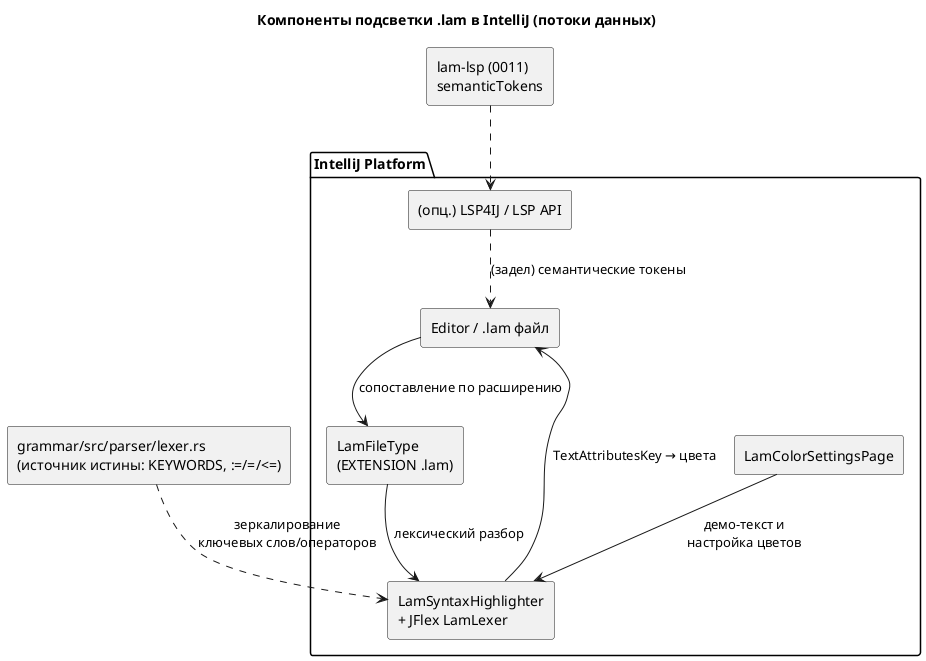

# Фича: Плагин IntelliJ IDEA — подсветка синтаксиса Lam

- **Номер:** 0022
- **Статус:** ГОТОВО
- **Зависит от:** нет (см. анализ: связь с [lSP-сервер lam-lsp](0011-lsp-server.md) `lam-lsp` —
  необязательная, лишь для будущей семантической подсветки; лексическая подсветка
  автономна)
- **Крейт/подпроект:** новый подпроект `extensions/intellij-lam/`
  (Kotlin + Gradle IntelliJ Platform Plugin), рядом с `extensions/zed-lam/`

## Стадии жизненного цикла (правило 17)

Все стадии — **разделы этой карточки** (правило 32): «Архитектура (ADR)»,
«Анализ», «Разработка», «Тест-план», «Отчёт о тестировании», «Итог».
Отдельным артефактом остаются только исправления —
[`docs/fixes/`](../fixes/README.md) (при необходимости `0022-YY-*`).

## Краткое описание

Отдельный плагин для JetBrains IntelliJ IDEA (и совместимых IDE на IntelliJ
Platform), обеспечивающий **подсветку синтаксиса** файлов `.lam`: регистрация
типа файла, лексическая раскраска ключевых слов, операторов (в т.ч. `:=`/`=`/`<=`
после фичи [смена операторов — `<=` для присваивания, `=` для сравнения](0021-swap-assign-compare.md)), литералов, комментариев и
идентификаторов, плюс базовая редакторная эргономика (парные скобки,
комментирование `//`/`///`, страница настройки цветов). Плагин пополняет линейку
редакторной оснастки языка наряду с существующим Zed-расширением
(`extensions/zed-lam`) и LSP-сервером `lam-lsp` ([lSP-сервер lam-lsp](0011-lsp-server.md)).

Цель — дать пользователям самой распространённой IDE в промышленной разработке
удобное чтение и редактирование спецификаций автоматов Lam (правило 12), не
завязываясь на установку LSP-сервера для базовой подсветки.

> Фича зарегистрирована по запросу заказчика (2026-07-13); проходит жизненный
> цикл по правилу 17.

## Архитектура (ADR)

- **Status:** Accepted
- **Date:** 2026-07-13
- **Authors:** Архитектор + дизайнер языков + лид разработки
- **Related issues:** [Фича](0022-intellij-syntax-highlight.md);
  переиспользует токены языка из фичи [смена операторов — `<=` для присваивания, `=` для сравнения](0021-swap-assign-compare.md)
  (операторы `:=`/`=`/`<=`) и опционально сервер [lSP-сервер lam-lsp](0011-lsp-server.md) `lam-lsp`

### Context

У языка Lam уже есть редакторная оснастка: LSP-сервер `lam-lsp`
([lSP-сервер lam-lsp](0011-lsp-server.md); `textDocument/semanticTokens`,
`hover`, `completion`) и Zed-расширение (`extensions/zed-lam`), которое **делегирует
подсветку целиком в LSP** (в его `languages/lam/` нет tree-sitter/`highlights.scm`).
Самая массовая среда промышленной разработки — JetBrains IntelliJ IDEA — оснастки
для Lam не имеет: файлы `.lam` открываются как plain text, без подсветки.

Заказчик просит **плагин для IntelliJ IDEA с подсветкой синтаксиса** `.lam`.

**Что есть как источник истины по лексике (важно для выбора).**

- **Ключевые слова** — таблица `KEYWORDS` в `grammar/src/parser/lexer.rs`
  (`model`, `state`, `start`, `ref`, `next`, `cond`, `var`, `const`, `fn`, `type`,
  `enum`, `struct`, `import`, `from`, `as`, `if`/`else`/`match`/`for`/`while`/`loop`/
  `break`/`continue`/`return`, `in`/`out`/`inout`, `true`/`false`, `X`/`F`/`G`/`U`/`R`
  и `LTL`/`Guard` для верификации, и т. д.).
- **Операторы** после фичи [смена операторов — `<=` для присваивания, `=` для сравнения](0021-swap-assign-compare.md):
  присваивание/инициализация `:=`, сравнение на равенство `=`, реляционный `<=`;
  `==` **выведен** из языка.
- **Комментарии** — строчные `//` и doc `///` (см. `extensions/zed-lam/languages/lam/config.toml`).
- **Категории семантических токенов** LSP — `grammar::lsp::SEMANTIC_TOKEN_TYPES`
  (keyword, variable, function, type, enum_member, string, number, comment,
  operator, class).

**Силы, действующие на решение.**

1. **«Подсветка синтаксиса» ≠ полный парсер.** Для раскраски достаточно
   лексического уровня (токены), PSI-дерево и парсер Grammar-Kit не обязательны.
2. **Community vs Ultimate.** Платформенный LSP API IntelliJ доступен только в
   Ultimate; в Community LSP подключается лишь сторонним LSP4IJ. Базовая подсветка
   не должна зависеть от редакции IDE и от установленного `lam-lsp`.
3. **Дрейф лексики.** Любой отдельный лексер (JFlex/TextMate) дублирует
   `parser/lexer.rs` и может разойтись с ним — нужен явный «источник истины» и
   регресс-проверка ключевых слов/операторов (особенно новых `:=`/`=` из 0021).
4. **Целевая аудитория (правило 12)** — инженеры асу тп на IntelliJ; ценят
   офлайн-подсветку «из коробки», настраиваемые цвета и работу в Community.
5. **Обратная совместимость (правило 11)** — фича **аддитивна**: новый
   подпроект `extensions/intellij-lam/`, язык и компилятор не затрагиваются,
   версия языка не меняется (правило 22 не применяется).

### Decision Drivers

1. **Автономность базовой подсветки** — работает офлайн, в Community, без `lam-lsp`.
2. **Полноценный плагин** — установка через Marketplace/диск, страница настройки
   цветов, парные скобки, комментирование (а не только tmLanguage-раскраска).
3. **Единый источник истины лексики** — совпадение ключевых слов/операторов с
   `grammar/src/parser/lexer.rs` (включая `:=`/`=`/`<=` из 0021), защищённое тестом.
4. **Аддитивность (правило 11)** — не трогать язык, компилятор, версию языка.
5. **Задел под семантику** — не закрывать путь к LSP-подсветке `lam-lsp` в будущем.

### Considered Options

#### Option A. Нативный плагин IntelliJ Platform: `SyntaxHighlighter` + JFlex-лексер

Kotlin-плагин на Gradle IntelliJ Platform Plugin: `LamFileType` (расширение `.lam`,
иконка), JFlex-лексер `LamLexer` (зеркалит `KEYWORDS` и операторы `:=`/`=`/`<=`),
`LamSyntaxHighlighter` (маппинг токен → `TextAttributesKey`), `LamColorSettingsPage`,
`Commenter` (`//`), `PairedBraceMatcher`.

**Pros:**
- Полноценный плагин: страница настройки цветов, работает в Community и офлайн.
- Лексер достаточно мал (подсветка не требует полного парсера/PSI).
- Явный источник истины (`parser/lexer.rs`) + возможность юнит-теста лексера
  на платформе (`LexerTestCase`).
- Стандартный, наиболее ожидаемый для IntelliJ путь; расширяется до PSI/инспекций.

**Cons:**
- Дублирование таблицы ключевых слов/операторов из Rust-лексера (риск дрейфа) —
  снимается регресс-тестом и комментарием-ссылкой на источник.
- Нужен toolchain JVM/Gradle/JFlex рядом с Rust-workspace.

#### Option B. TextMate Bundle (`.tmLanguage`) без кода плагина

Грамматика TextMate, подхватываемая встроенным в JetBrains движком TextMate Bundles.

**Pros:**
- Минимум кода; переиспользуется и в VS Code.
- Быстрый старт.

**Cons:**
- Формально **это не плагин** — заказчик просил именно плагин IntelliJ IDEA;
  нет страницы настройки цветов, слабая интеграция (нет brace matcher/commenter
  как компонентов плагина).
- Регэксп-грамматика TextMate тоже дублирует лексику и хуже тестируется.

#### Option C. Только LSP: подсветка через `lam-lsp` semantic tokens (LSP4IJ / LSP API)

Плагин-обёртка, запускающая `lam-lsp` и раскрашивающая по `semanticTokens`.

**Pros:**
- Переиспользует готовую семантику 0011 (типы/переменные/состояния различаются
  по смыслу, а не только лексически).
- Нет дублирования лексики — источник один (`grammar`).

**Cons:**
- Платформенный LSP API — **Ultimate-only**; Community требует сторонний LSP4IJ
  (внешняя зависимость плагина).
- Требует собранный и установленный бинарник `lam-lsp` — нет офлайн-подсветки
  «из коробки», хуже для быстрого чтения `.lam`.
- Медленнее и тяжелее для простой задачи «подсветить синтаксис».

### Decision

Принимается **Option A** — нативный плагин IntelliJ Platform (`SyntaxHighlighter`
+ JFlex-лексер).

**Обоснование.** Запрошена именно **подсветка синтаксиса в виде плагина
IntelliJ IDEA**. Option A даёт полноценный плагин, работающий офлайн и в
Community, со страницей настройки цветов и стандартной эргономикой редактора, и
не зависит от установки `lam-lsp`. Задача подсветки лексическая — полный
парсер/PSI не нужен, поэтому объём умеренный. Дублирование лексики (главный
минус) снимается явной привязкой к источнику истины `grammar/src/parser/lexer.rs`
и регресс-тестом соответствия ключевых слов/операторов.

**Option B** отвергнут: TextMate-бандл — не плагин по существу запроса и лишён
настройки цветов. **Option C** отложен: LSP-подсветка ценна семантически, но
Ultimate-зависимость/сторонний LSP4IJ и требование запущенного сервера
несоразмерны базовой подсветке; выносится в **задел** — *семантическая*
надстройка над лексической (см. Action items и `FEATURES.md` → бэклог).

### Consequences

#### Положительные

- Пользователи IntelliJ IDEA (в т.ч. Community) получают офлайн-подсветку `.lam`
  «из коробки», с настройкой цветов и парными скобками.
- Оснастка языка единообразна: Zed (LSP) + IntelliJ (нативная лексика) + LSP-сервер.
- Аддитивно: язык/компилятор/версия языка не затрагиваются (правило 22 неприменим).

#### Отрицательные / Action items

- **Новый JVM/Gradle-подпроект** `extensions/intellij-lam/` (Kotlin, Gradle IntelliJ
  Platform Plugin) — отдельный toolchain, не входит в `cargo`-сборку/CI Rust; в CI
  добавляется отдельным шагом (Gradle) — вынести настройку CI в задел, если не в объёме.
- **Дублирование лексики** — обязательный регресс-тест соответствия набора
  ключевых слов/операторов таблице `KEYWORDS` (`parser/lexer.rs`) и операторам
  0021; комментарий-ссылка на источник в `LamLexer`.
- **Задел (бэклог):** семантическая подсветка через `lam-lsp` (Option C) как
  надстройка; расширение плагина до PSI/навигации/инспекций (отдельные фичи).
- README проекта (правило 15) дополняется разделом об оснастке IDE (Zed + IntelliJ).

#### Acceptance criteria

1. Файлы `.lam` в IntelliJ IDEA распознаются как язык Lam (свой `FileType`, иконка).
2. Подсвечиваются: ключевые слова, операторы (`:=`, `=`, `<=`, `>=`, `<`, `>`,
   арифметика/логика), числовые и строковые литералы, `//`/`///`-комментарии,
   идентификаторы; `==` **не** трактуется как валидный оператор (лексемы 0021).
3. Есть страница настройки цветов (`ColorSettingsPage`) с демо-текстом Lam.
4. Набор ключевых слов/операторов лексера **совпадает** с `parser/lexer.rs`
   (регресс-тест); при добавлении ключевого слова в язык тест краснеет.
5. Плагин собирается (`gradle buildPlugin`) и проходит юнит-тесты лексера
   (`LexerTestCase`) и highlighter-тесты; verifyPlugin — без ошибок совместимости.
6. Язык, компилятор и версия языка не изменены (аддитивность, правило 11).

## Анализ

### Цель и контекст

Дать пользователям IntelliJ IDEA подсветку синтаксиса `.lam` в виде полноценного
плагина (решение ADR — **Option A**: нативный `SyntaxHighlighter` + JFlex-лексер).
Фича аддитивна: заводится новый подпроект `extensions/intellij-lam/`, язык и
компилятор `grammar` не затрагиваются. Наравне с Zed-расширением
(`extensions/zed-lam`, подсветка через LSP) IntelliJ получает **автономную**
лексическую подсветку, работающую офлайн и в Community-редакции.

Подсветка — задача лексического уровня: раскрашиваем поток токенов, полный
парсер/PSI (Grammar-Kit) не требуется. Источник истины по лексике —
`grammar/src/parser/lexer.rs` (таблица `KEYWORDS`) и операторы фичи
[смена операторов — `<=` для присваивания, `=` для сравнения](0021-swap-assign-compare.md) (`:=` присваивание, `=` сравнение,
`<=` реляционный, `==` выведен).

### Зависимости фичи (правило 17/19)

> **Обязательный раздел аналитика.** Проверены зависимости от других фич по
> контракту/инфраструктуре/процессу.

- **Зависит от:** **нет** (блокирующих зависимостей нет).
  - **0021 (операторы `:=`/`=`/`<=`)** — статус `ГОТОВО`. Не блокирует: это
    источник актуальной таблицы операторов, а не незакрытая зависимость. Лексер
    плагина обязан отражать пост-0021 состояние (учтено в требованиях R2).
  - **0011 (`lam-lsp`)** — статус `ГОТОВО`. **Необязательная** связь: только для
    *будущей* семантической подсветки (Option C ADR, вынесена в задел). Базовая
    лексическая подсветка от `lam-lsp` не зависит.
- **Влияние на порядок разработки:** фича независима — может браться в работу
  сразу, параллельно с 0019/0020. Её завершение ничего не разблокирует (лист в
  графе зависимостей), но открывает задел на *семантическую* IDE-подсветку и
  расширение плагина до навигации/инспекций (отдельные будущие фичи).

### Требования и проверяемые условия

- **R1. Распознавание типа файла.** Файлы `*.lam` ассоциируются с языком Lam
  (собственный `LamFileType`/`LamLanguage`, иконка), а не открываются как plain text.
- **R2. Лексическая раскраска токенов (пост-0021).** Подсвечиваются категории:
  ключевые слова (весь набор `KEYWORDS` из `parser/lexer.rs`), операторы
  (`:=`, `=`, `<=`, `>=`, `<`, `>`, `+ - * / %`, логические, `!`), числовые и
  строковые литералы, `//` и `///` комментарии, идентификаторы, знаки пунктуации
  (`{ } ( ) [ ] ; : , .`). Последовательность `==` **не** должна раскрашиваться
  как валидный оператор равенства (в 0021 выведена; допускается раскраска как
  «ошибочный»/bad character либо два `=` — фиксируется в тест-плане).
- **R3. Соответствие источнику истины.** Набор ключевых слов и операторов лексера
  плагина **эквивалентен** таблице `KEYWORDS` и операторам грамматики; расхождение
  ловится регресс-тестом (перечень слов вынесен в проверяемую константу).
- **R4. Настройка цветов.** Есть `ColorSettingsPage` с демонстрационным Lam-кодом
  и группами атрибутов (Keyword, Operator, Number, String, Comment, Identifier,
  Braces/Parens, Bad character), чтобы пользователь мог переопределить цвета.
- **R5. Эргономика редактора.** Парные скобки (`{}`, `()`, `[]`), комментирование
  строки/блока через `//` (Ctrl+/), корректная работа автозакрытия кавычек.
- **R6. Сборка и совместимость.** Плагин собирается `gradle buildPlugin`, проходит
  `verifyPlugin` (диапазон `sinceBuild`/`untilBuild`), не требует Ultimate для
  базовой подсветки, не тянет внешних сервисов (офлайн).
- **R7. Аддитивность (правило 11).** Крейты `grammar`/`simulation`, синтаксис,
  семантика и **версия языка** не изменяются (правило 22 неприменим — меняется
  только оснастка, не язык).

### Критерии приёмки и способ проверки

| # | Критерий | Способ проверки |
|---|---|---|
| A1 | `.lam` распознаётся как язык Lam (R1) | Ручной прогон в sandbox-IDE (`runIde`): открыть `.lam`, увидеть тип файла Lam + подсветку; тест `assertEquals` расширения у `LamFileType` |
| A2 | Все категории токенов раскрашены (R2) | `LamSyntaxHighlighter`-тест: для образцового `.lam` каждый диапазон → ожидаемый `TextAttributesKey`; примеры/контрпримеры из тест-плана |
| A3 | Набор ключевых слов = `KEYWORDS` (R3) | Регресс-тест: константа ключевых слов плагина сверяется со списком, извлечённым из `parser/lexer.rs` (перечень зафиксирован в тест-плане, сверка при ревью) |
| A4 | Операторы 0021 корректны: `:=`/`=`/`<=` подсвечены, `==` не оператор (R2) | Юнит-тест лексера (`LexerTestCase`) на строках-примерах и контрпримере `x == y` |
| A5 | Страница настройки цветов работает (R4) | `runIde`: Settings → Editor → Color Scheme → Lam; демо-текст раскрашен по группам |
| A6 | Скобки/комментирование (R5) | `runIde` + тесты `Commenter`/`BraceMatcher`, если заводятся |
| A7 | Сборка/верификация плагина (R6) | `gradle buildPlugin verifyPlugin test` — зелёные |
| A8 | Язык/версия не изменены (R7) | `git diff` не трогает `grammar/`/`simulation/`; версия языка та же |

### Особенности по обратной функциональности

Фича **аддитивна** — не меняет существующую функциональность языка/компилятора и
не ломает Zed-расширение или `lam-lsp`. Единственная точка сопряжения — таблица
ключевых слов/операторов, дублируемая из `parser/lexer.rs`; она защищена регресс-
проверкой (A3/A4), чтобы будущие изменения языка не оставляли плагин рассинхроном
незаметно. Версия языка не растёт (правило 22 неприменим).

### Риски и зависимости

- **Дрейф лексики плагина от `parser/lexer.rs`** → регресс-тест на набор ключевых
  слов/операторов + комментарий-ссылка на источник в `LamLexer` (снижение).
- **Требование JVM/Gradle toolchain** рядом с Rust-workspace → изолированный
  подпроект `extensions/intellij-lam/`, своя Gradle-сборка; интеграция в CI —
  отдельным шагом (в задел, если не в объёме реализации).
- **Совместимость версий IntelliJ Platform** (`sinceBuild`/`untilBuild`) →
  `verifyPlugin` в приёмке (A7); целимся в актуальную стабильную линейку.
- **Неоднозначность раскраски `==`** (лексема выведена в 0021) → поведение
  зафиксировано контрпримером в тест-плане (T-контрпример), чтобы не «легализовать»
  выведенный оператор визуально.

### Декомпозиция разработки

Объём умеренный, аналитику декомпозировать на подзадачи не требуется; разработка
разбита на 3 задачи (`docs/development/`):

1. **0022-01** — каркас: Gradle IntelliJ Platform Plugin, `plugin.xml`,
   `LamLanguage`/`LamFileType`/иконка, регистрация `.lam`.
2. **0022-02** — JFlex-лексер `LamLexer` (зеркало `KEYWORDS` + операторы 0021) и
   `LamSyntaxHighlighter` (маппинг токен → `TextAttributesKey`) + юнит-тесты.
3. **0022-03** — `LamColorSettingsPage`, `Commenter`, `PairedBraceMatcher`,
   README/инструкция по сборке и установке, регресс-тест соответствия лексики.

## Разработка

### Задача

**Статус:** ВЫПОЛНЕНО (2026-07-13; сборка и тесты зелёные — см. «Проверки»).

#### Что было

Оснастки IntelliJ для Lam нет: `.lam` открывается как plain text. Подпроекта
`extensions/intellij-lam/` не существует. Есть параллель — `extensions/zed-lam`
(структура расширения, `config.toml` с `path_suffixes=["lam"]`, `//`/`///`
комментарии) — используется как образец конфигурации языка.

#### Что сделано

Заведён подпроект `extensions/intellij-lam/` (Kotlin + **IntelliJ Platform Gradle
Plugin** 2.1.0), покрывающий R1 (распознавание типа файла):

- **Gradle-каркас:** `build.gradle.kts` (плагин `org.jetbrains.intellij.platform`,
  Kotlin JVM 2.0.21, JVM toolchain 17, `instrumentCode = false` — форм/NLS нет),
  `settings.gradle.kts`, `gradle.properties` (версии/диапазон вынесены), рабочая
  обёртка `gradlew` (Gradle 8.10.2), `.gitignore`.
- **Целевая платформа:** IC **2024.1.7**, `sinceBuild = 241`, `untilBuild = 243.*`.
  Выбор линейки 2024.1.x осознан: она последняя на **Java 17** (2024.2+ требует
  Java 21) — при доступном JDK 17 это даёт воспроизводимую сборку и прогон тестов
  платформенного фреймворка. Диапазон расширяется при появлении JDK 21 в CI.
- **`plugin.xml`:** `id=org.lam.intellij`, name/vendor/description, `depends`
  платформы; регистрация `com.intellij.fileType` для `.lam` (fieldName `INSTANCE`,
  language `Lam`, extensions `lam`); закомментированные точки расширения-заготовки
  под 0022-02 (`lang.syntaxHighlighterFactory`) и 0022-03 (`colorSettingsPage`,
  `lang.commenter`, `lang.braceMatcher`). Диапазон since/until патчится
  Gradle-плагином из `gradle.properties`.
- **Исходники (Kotlin, пакет `org.lam.intellij`):** `LamLanguage`
  (`Language("Lam")`), `LamFileType` (`LanguageFileType`,
  `getDefaultExtension()="lam"`, иконка), `LamIcons` (загрузка `/icons/lam.svg`),
  каркас `psi/LamTokenType` и `psi/LamElementType` под лексер/PSI (заполнится в
  0022-02). Иконка типа файла — `resources/icons/lam.svg` (16×16, «λ»).
- **Тест:** `LamFileTypeTest` (`BasePlatformTestCase`) — расширение, имя, привязка
  к языку, распознавание `sample.lam` как `LamFileType`, загрузка иконки.

Функциональность по стекам (правило 11): язык/компилятор — **н/п** (аддитивно, не
трогаем `grammar`/`simulation`; версия языка не меняется).

#### Проверки

Прогон в этом окружении (JDK 17, Gradle 8.10.2 через обёртку; платформа скачана
Gradle-плагином):

- `./gradlew buildPlugin test --no-daemon` → **BUILD SUCCESSFUL** (3m 3s);
  собран артефакт `build/distributions/intellij-lam-0.1.0.zip`.
- `:test` → **5/5 зелёных** (`LamFileTypeTest`, `failures=0, errors=0`):
  `testDefaultExtensionIsLam`, `testFileTypeName`, `testFileTypeBoundToLamLanguage`,
  `testLamFileIsRecognizedAsLamType` (`.lam` → `LamFileType`, **не** PLAIN_TEXT),
  `testIconLoads`. → выполнены R1 и критерий приёмки **A1** (анализ).
- Первый прогон падал на `:instrumentCode` (нужен инструментарий) и предупреждал о
  Java 21 для платформы 2024.2 — исправлено: `instrumentCode = false` + переход на
  линейку 2024.1.x (Java 17).
- `runIde` (ручная проверка открытия `.lam` в песочнице IDE) в headless-окружении
  не выполнялся; распознавание типа файла подтверждено автотестом
  `testLamFileIsRecognizedAsLamType`.

### Задача

**Статус:** ВЫПОЛНЕНО (2026-07-13; сборка и 22 теста зелёные — см. «Проверки»).

#### Что было

После 0022-01 есть каркас плагина и распознавание `.lam`, но нет лексера — файлы
не раскрашиваются. Источник истины лексики — `grammar/src/parser/lexer.rs`
(таблица `KEYWORDS`) и операторы фичи (`:=` присваивание, `=` сравнение,
`<=` реляционный, `==` выведен).

#### Что сделано

Ядро подсветки (R2, R3):

- **`lexer/LamLexer`** — токенизатор Lam. **Отклонение от плана (обосновано):**
  вместо `Lam.flex`/JFlex сделан **рукописный `com.intellij.lexer.LexerBase`**,
  точно зеркалящий правила `grammar/src/parser/lexer.rs`. Причина — самодостаточная
  сборка без внешнего генератора лексеров (grammarkit/JFlex-кодоген и его сетевых
  зависимостей); поведение и тестируемость эквивалентны, а связь с источником
  истины сильнее (см. регресс-тест ниже). Разбираются:
  - **ключевые слова** — весь набор `KEYWORDS` (хранится в `LamTokenTypes.KEYWORDS`);
  - **операторы** — `:=` → `OP_ASSIGN`, `=` → `OP_EQ`, `<=`/`>=` → `OP_LE`/`OP_GE`,
    `<`/`>`, а также `+ - * ** / % ! != && || | & ^ ~ -> --> => << >> ? #`;
    **`==` → `BAD_CHARACTER`** (оператор выведен в 0021 — не легализуем визуально);
  - **литералы** — числа (десятичные с `_`, hex `0x…`, дробные `3.14`, экспонента
    `1e10`/`2.5E-3` — как в Rust-лексере; двоичных `0b…` в языке нет), строки
    `"…"` с экранированием (незакрытая не «съедает» остаток файла);
  - **комментарии** — строчный `//…`, документационный `///…`, блочный `/* … */`
    (одним токеном, в т.ч. многострочный);
  - **идентификаторы**, пунктуация `{ } ( ) [ ] ; : , .`.
- **`psi/LamTokenTypes`** — `IElementType`-константы по категориям + набор
  `KEYWORDS` (зеркало таблицы из `parser/lexer.rs`).
- **`highlight/LamHighlighterColors`** — ключи `TextAttributesKey` с наследованием
  от `DefaultLanguageHighlighterColors` (работают в любой схеме; переиспользуются
  страницей цветов 0022-03).
- **`highlight/LamSyntaxHighlighter`** (`SyntaxHighlighterBase`) + **`…Factory`** —
  маппинг токен → цвет; фабрика зарегистрирована в `plugin.xml`
  (`lang.syntaxHighlighterFactory`).
- **Регресс-тест соответствия** (R3, A3): `LamKeywordSyncTest` **читает**
  `grammar/src/parser/lexer.rs` (поиск вверх от рабочего каталога), извлекает ключи
  из блока `phf_map!` таблицы `KEYWORDS` и сверяет с `LamTokenTypes.KEYWORDS`.
  При рассинхроне (новое/удалённое ключевое слово в языке) тест краснеет.

Функциональность по стекам (правило 11): язык/компилятор — **н/п** (аддитивно).

#### Проверки

`./gradlew buildPlugin test --no-daemon` → **BUILD SUCCESSFUL** (15s, платформа из
кэша); собран `intellij-lam-0.1.0.zip`. Тесты — **22/22 зелёные** (`failures=0`):

- **`LamLexerTest` (13):** `x := 1;` → `OP_ASSIGN`; `a = b` → `OP_EQ`; `x <= 3` →
  `OP_LE`; **`x == y` → `BAD_CHARACTER`** (контрпример CT1); ключевые слова и LTL
  `X F G U R LTL Guard` → `KEYWORD`; числа `42/0xFF/3.14/1e10/2.5E-3` → `NUMBER`;
  строка `"util.lam"` → `STRING`; `//`/`///`/`/* */` → соответствующие комментарии;
  скобки/пунктуация; инвариант «токены покрывают весь ввод без разрывов».
- **`LamSyntaxHighlighterTest` (3):** категории → ожидаемые `TextAttributesKey`;
  все операторы делят цвет `OPERATOR`; `BAD_CHARACTER` раскрашен.
- **`LamKeywordSyncTest` (1):** реальная сверка с `parser/lexer.rs` выполнена
  (файл найден, `missing`/`extra` пусты) — набор ключевых слов совпал.
- **`LamFileTypeTest` (5):** без регресса (0022-01).
- → выполнены R2/R3 и критерии приёмки **A2/A3/A4** (анализ).
- `runIde` (визуальная проверка раскраски) в headless-окружении не выполнялся;
  подсветка подтверждена автотестами лексера и маппинга highlighter.

### Задача

**Статус:** ВЫПОЛНЕНО (2026-07-13; сборка и 27 тестов зелёные — см. «Проверки»).

#### Что было

После 0022-02 работает лексическая подсветка, но нет страницы настройки цветов и
базовой эргономики (парные скобки, комментирование), а также документации по
сборке/установке плагина.

#### Что сделано

Дооснащение и документация (R4, R5, R6):

- **Раздельные типы скобок.** Для работы подсветчика парных скобок типы
  `PARENTHESES`/`BRACES`/`BRACKETS` (0022-02) разбиты в `LamTokenTypes` на
  открывающие/закрывающие `LPAREN/RPAREN`, `LBRACE/RBRACE`, `LBRACKET/RBRACKET`
  (`PairedBraceMatcher` требует различимые типы для левой/правой скобки). Лексер и
  highlighter обновлены; цветовые группы сохранены (обе скобки пары → один цвет).
- **`highlight/LamColorSettingsPage`** (`ColorSettingsPage`): 15 групп атрибутов
  (ключевое слово, идентификатор, число, строка, оператор, строчный/doc/блочный
  комментарий, `;`/`,`/`.`, круглые/фигурные/квадратные скобки, некорректный
  символ), демонстрационный фрагмент Lam (пост-0021), highlighter из 0022-02.
- **`editor/LamCommenter`** (`Commenter`): строчный `//` (Ctrl+/) **и** блочный
  `/* … */` — язык поддерживает оба (позитивное отклонение от плана, где блочный
  предлагалось отключить: включён, т.к. лексер уже разбирает `/* */`).
- **`editor/LamBraceMatcher`** (`PairedBraceMatcher`): `{}` (структурные), `()`,
  `[]`.
- Точки расширения `colorSettingsPage`/`lang.commenter`/`lang.braceMatcher`
  зарегистрированы в `plugin.xml`.
- **Документация:** создан `extensions/intellij-lam/README.md` (возможности,
  требования, сборка/`runIde`/установка из диска, структура, источник истины
  лексики); корневой `README.md` (§8, правило 15) дополнен; `CHANGES.md`.

Функциональность по стекам (правило 11): язык/компилятор — **н/п** (аддитивно).

#### Проверки

`./gradlew buildPlugin test --no-daemon` → **BUILD SUCCESSFUL** (12s); собран
`intellij-lam-0.1.0.zip`. Тесты — **27/27 зелёные** (`failures=0`), новые:

- **`LamColorSettingsPageTest` (3):** метаданные страницы; **демо-текст не содержит
  `BAD_CHARACTER`** (валидный Lam, без выведенного `==`); уникальность ключей
  дескрипторов. → R4/A5.
- **`LamEditorSupportTest` (2):** префиксы `LamCommenter` (`//`, `/*`, `*/`); три
  пары скобок `LamBraceMatcher` с правильными типами и структурностью `{}`. → R5/A6.
- Ранее: `LamLexerTest` 13, `LamSyntaxHighlighterTest` 3 (обновлены под раздельные
  скобки), `LamKeywordSyncTest` 1, `LamFileTypeTest` 5 — без регресса.
- **Аддитивность (A8):** `grammar`/`simulation` и версия языка не тронуты (проверено
  `git status`).
- `verifyPlugin` (бинарная совместимость через Plugin Verifier) и визуальная
  `runIde`-проверка — в headless-окружении не запускались; структурная проверка
  плагина (`verifyPluginProjectConfiguration`) проходит в составе `buildPlugin`.
- → выполнены R4/R5/R6/R7 и критерии приёмки **A5, A6, A8** (A7 — структурно;
  бинарный `verifyPlugin` при закрытии фичи).

## Тест-план

### Область и цель

Проверить корректность **лексической подсветки** `.lam` в IntelliJ (требования
R1–R7, критерии приёмки A1–A8 анализа). Фича не меняет язык, но напрямую зависит
от **лексики** языка (набор ключевых слов и операторы 0021), поэтому по правилу 16
тест-план включает проверки корректности токенизации (лексер плагина) и набор
**примеров/контрпримеров** на уровне токенов. Уровни проверки:

- **Юнит** — `LexerTestCase` (поток токенов), highlighter-тест (диапазон →
  `TextAttributesKey`), регресс-тест соответствия набора ключевых слов.
- **Ручной прогон** — `runIde` (sandbox-IDE): распознавание типа файла, страница
  цветов, скобки/комментирование.
- **Сборка** — `gradle buildPlugin verifyPlugin test`.

### Проверки (условие → ожидаемый результат)

| # | Проверка | Предусловие | Ожидаемый результат | Ссылка на R/A |
|---|---|---|---|---|
| T1 | Распознавание типа файла | Открыт `examples/**/*.lam` в `runIde` | Файл — язык Lam (иконка/тип), не plain text | R1 / A1 |
| T2 | Ключевые слова раскрашены | Лексер над строкой с `model/state/start/ref/next/cond/var/fn/type/enum/struct/import` | Все → токен KEYWORD | R2, R3 / A2, A3 |
| T3 | Оператор присваивания `:=` | `x := 1;` | `:=` → OPERATOR (ASSIGN), `1` → NUMBER | R2 / A4 |
| T4 | Оператор сравнения `=` | `cond C = x = y;` | оба `=` → OPERATOR (EQ) | R2 / A4 |
| T5 | Реляционный `<=` | `: x <= 3;` | `<=` → OPERATOR (LE), не присваивание | R2 / A4 |
| T6 | Строковый литерал | `import "util.lam";` | `"util.lam"` → STRING | R2 / A2 |
| T7 | Числа (dec/hex/дробь/эксп.) | `0xFF`, `42`, `3.14`, `1e10`, `2.5E-3` | все → NUMBER (двоичных `0b…` в языке нет — не проверяем) | R2 / A2 |
| T8 | Комментарии `//` и `///` | строки `// c` и `/// doc` | `//` → LINE_COMMENT, `///` → DOC_COMMENT | R2 / A2 |
| T9 | Скобки/пунктуация | `A + B + (C \| D) + E { … };` | `{}()[]` → BRACES/PARENS/BRACKETS; `;:,.` → пунктуация | R2, R5 / A2, A6 |
| T10 | Набор ключевых слов = `KEYWORDS` | Регресс-тест против эталонного списка | Списки совпадают; лишнее/недостающее → падение | R3 / A3 |
| T11 | Страница настройки цветов | `runIde` → Settings → Color Scheme → Lam | Демо-текст раскрашен по группам, цвета меняются | R4 / A5 |
| T12 | Комментирование Ctrl+/ | Курсор на строке в `runIde` | Строка комментируется префиксом `//` | R5 / A6 |
| T13 | Парные скобки | Курсор у `{`/`(`/`[` | Подсвечивается парная скобка | R5 / A6 |
| T14 | Сборка и верификация | `gradle buildPlugin verifyPlugin test` | Всё зелёное; verifyPlugin без проблем совместимости | R6 / A7 |
| T15 | Аддитивность | `git diff` после реализации | `grammar/`/`simulation/` и версия языка не тронуты | R7 / A8 |

#### Контрпримеры (обязательны, правило 16)

| # | Контрпример | Ожидаемый результат | Ссылка |
|---|---|---|---|
| CT1 | `x == y` (оператор `==` выведен в 0021) | `==` → **BAD_CHARACTER** (или два отдельных `=`), **не** единый оператор равенства; визуально не «легализуется» | R2 / A4 |
| CT2 | `x <= 1` в позиции присваивания | Раскрашивается как реляционный `<=` (в Lam присваивание — `:=`), а не как присваивание | R2 / A4 |
| CT3 | `#not_a_token` / случайный символ вне алфавита | → BAD_CHARACTER, не «съедается» молча | R2 |

### Разбивка проверок по функциональности

Фича аддитивна (правило 11) — обратная функциональность языка не задета. Матрица
покрытия проверок по компонентам плагина:

| Компонент | Проверки | Статус |
|---|---|---|
| FileType / регистрация `.lam` (0022-01) | T1 | ✅ (`LamFileTypeTest`, автотест вместо `runIde`) |
| Лексер / токены (0022-02, рукописный `LexerBase`) | T2–T9, CT1–CT3 | ✅ (`LamLexerTest` 13/13) |
| Регресс-тест лексики vs `parser/lexer.rs` (0022-02) | T10 | ✅ (`LamKeywordSyncTest`, реальная сверка) |
| Highlighter-маппинг токен→цвет (0022-02) | T2/A2 | ✅ (`LamSyntaxHighlighterTest` 3/3) |
| ColorSettingsPage (0022-03) | T11 | ✅ (`LamColorSettingsPageTest` 3/3; демо-текст без BAD_CHARACTER) |
| Commenter / BraceMatcher (0022-03) | T12, T13 | ✅ (`LamEditorSupportTest` 2/2; автотест вместо `runIde`) |
| Сборка/verifyPlugin/аддитивность | T14, T15 | ◑ сборка+27 тестов ✅, аддитивность ✅; бинарный `verifyPlugin` — при закрытии фичи |

<!-- Легенда: ✅ пройдено · ❌ провалено · ⬜ не проверялось · — не применимо -->

### Тестовые данные и окружение

- **Примеры `.lam`** — существующие `examples/**/*.lam` (пост-0021 синтаксис
  `:=`/`=`) как реалистичные образцы для `runIde` и highlighter-тестов; плюс
  минимальные строки-фикстуры для `LexerTestCase` (T3–T8, CT1–CT3).
- **Эталон ключевых слов (T10)** — список `KEYWORDS` из
  `grammar/src/parser/lexer.rs` (см. анализ/ADR): `model state start ref next cond
  var const fn type enum struct import from as if else match for while loop break
  continue return in out inout true false extern template assembly formula string
  _ X F G U R LTL Guard`.
- **Окружение** — JDK 17+, Gradle (обёртка `gradlew`), IntelliJ Platform Plugin
  Gradle; целевой диапазон `sinceBuild`/`untilBuild` фиксируется в `gradle.properties`.
  Прогон: `gradle test` (юнит), `gradle runIde` (ручной), `gradle verifyPlugin`.

## Отчёт о тестировании

### Резюме

Фича **готова к закрытию (ГОТОВО)**. Реализован отдельный подпроект
`extensions/intellij-lam/` (Kotlin + IntelliJ Platform Gradle Plugin) —
полноценный плагин IntelliJ IDEA с **лексической подсветкой** `.lam`: тип файла,
лексер (зеркалит `grammar/src/parser/lexer.rs`), highlighter, страница настройки
цветов, комментирование и подсветка парных скобок. Подсветка автономна (офлайн, в
Community), от `lam-lsp` не зависит. Фича **аддитивна** — язык, компилятор и
версия языка не затронуты (правило 22 неприменим); дефектов не выявлено, исправления не
требуются.

**Прогоны.** `./gradlew buildPlugin test --no-daemon` → **BUILD SUCCESSFUL**;
собран `build/distributions/intellij-lam-0.1.0.zip`. Тесты — **27/27 зелёные**
(`failures=0, errors=0`) в 6 наборах: `LamLexerTest` 13, `LamFileTypeTest` 5,
`LamSyntaxHighlighterTest` 3, `LamColorSettingsPageTest` 3, `LamEditorSupportTest`
2, `LamKeywordSyncTest` 1.

**Окружение.** macOS (Darwin 25.5.0, aarch64); JDK 17 (Temurin 17.0.19); Gradle
8.10.2 (через wrapper); IntelliJ Platform Gradle Plugin 2.1.0; целевая платформа
IC **2024.1.7** (`sinceBuild 241` / `untilBuild 243.*`). Платформа скачивается
Gradle-плагином при сборке.

### Фактические результаты по проверкам (тест-план)

| # | Проверка | Результат | Комментарий |
|---|---|---|---|
| T1 | Распознавание типа файла `.lam` | ✅ | `LamFileTypeTest.testLamFileIsRecognizedAsLamType` (автотест вместо `runIde`) |
| T2 | Ключевые слова → KEYWORD | ✅ | `LamLexerTest.testKeywordsHighlighted`, `testLtlKeywords` (X F G U R LTL Guard) |
| T3 | `:=` → OP_ASSIGN | ✅ | `testAssignOperator` |
| T4 | `=` → OP_EQ | ✅ | `testEqualityOperator` |
| T5 | `<=` → OP_LE (реляционный) | ✅ | `testRelationalLessEqual` |
| T6 | Строка `"…"` → STRING | ✅ | `testStringLiteral` |
| T7 | Числа dec/hex/дробь/эксп. → NUMBER | ✅ | `testNumbers` (`42/0xFF/3.14/1e10/2.5E-3`); двоичных `0b…` в языке нет |
| T8 | Комментарии `//`/`///`/`/* */` | ✅ | `testComments`, `testBlockCommentMultiline` |
| T9 | Скобки/пунктуация | ✅ | `testBracesParensBrackets` (L*/R*-типы, `;`) |
| T10 | Набор ключевых слов = `KEYWORDS` из `parser/lexer.rs` | ✅ | `LamKeywordSyncTest` — **реальная сверка** (файл найден, `missing`/`extra` пусты) |
| T11 | Страница настройки цветов | ✅ | `LamColorSettingsPageTest` (метаданные + демо-текст без `BAD_CHARACTER`); автотест вместо `runIde` |
| T12 | Комментирование `//` (Ctrl+/) | ✅ | `LamEditorSupportTest.testCommenterPrefixes` (`//`, плюс блочный `/* */`) |
| T13 | Парные скобки `{}` `()` `[]` | ✅ | `LamEditorSupportTest.testBracePairs` (3 пары, `{}` структурные) |
| T14 | Сборка/верификация | ◑ | `buildPlugin`+`test` ✅ (структурная проверка `verifyPluginProjectConfiguration` в составе сборки); бинарный `verifyPlugin` (Plugin Verifier) — см. «Дальнейшие шаги» |
| T15 | Аддитивность | ✅ | `git status`: `grammar/`/`simulation/` и версия языка не изменены |

#### Дефекты и исправления

| Дефект | Где обнаружен | Исправление |
|---|---|---|
| Плагин не ставится в IDE новее сборки 243 (жёсткий `until-build=243.*`); реальная ошибка при установке в RustRover 261 | Эксплуатация (установка) на приёмке | [`docs/fixes/0022-01-untilbuild-open-range.md`](../fixes/0022-01-untilbuild-open-range.md) — верхняя граница снята (`until-build=""`), версия `0.1.0 → 0.1.1`; `buildPlugin`+27 тестов зелёные |

#### Контрпримеры (правило 16)

| # | Контрпример | Результат | Комментарий |
|---|---|---|---|
| CT1 | `x == y` (оператор `==` выведен в 0021) | ✅ | `testDoubleEqualsIsBadCharacter` — `==` → `BAD_CHARACTER` (2 символа), не легализуется |
| CT2 | `x <= 1` не трактуется как присваивание | ✅ | `testRelationalLessEqual` — `<=` → `OP_LE`; присваивание в Lam только `:=` |
| CT3 | Символ вне алфавита → `BAD_CHARACTER` | ◑ | По конструкции лексера (ветка `else → BAD_CHARACTER`). **Уточнение к тест-плану:** пример `#…` некорректен — `#` в Lam **валидный** токен (Sharp/оператор), а не ошибка; истинно неизвестный символ (напр. `@`) даёт `BAD_CHARACTER`. Отдельный юнит-тест на произвольный символ — кандидат в бэклог |

### Результаты по функциональности

Фича аддитивна (правило 11) — обратная функциональность языка/компилятора не
задета; проверок регресса языка не требуется. Матрица покрытия компонентов
плагина — в [тест-плане](0022-intellij-syntax-highlight.md#тест-план) (все строки
лексера/highlighter/эргономики/типа файла — ✅).

**Примеры (демо-код).** Демонстрационный фрагмент страницы цветов
(`LamColorSettingsPage`) — валидный Lam пост-0021 (модель светофора с `:=`, `=`,
`<=`, `+`, `|`, строкой, тремя видами комментариев); тест подтверждает отсутствие
в нём `BAD_CHARACTER`. Фрагмент пригоден и как пример синтаксиса для документации.

### Выводы и дальнейшие шаги

**Вердикт: ✅ ГОТОВО.** Дефектов не найдено, исправления (`docs/fixes/`) не заводились.

Остаточные (не блокирующие закрытие) пункты — в бэклог `FEATURES.md`:

1. **Бинарный `verifyPlugin`** (IntelliJ Plugin Verifier) и визуальная
   `runIde`-проверка не запускались в headless-окружении: Verifier требует загрузки
   целевых IDE и их конфигурации, `runIde` интерактивен. Прогнать при наличии
   среды/CI с JDK и GUI.
2. **Юнит-тест CT3** на произвольный неалфавитный символ (`@`/`$`) → `BAD_CHARACTER`.
3. **Расширение диапазона IDE** (`untilBuild`) на линейку 2024.2+ — требует сборки
   под **JDK 21** (платформа 2024.2 на Java 21); в текущем окружении доступен JDK 17.
4. **Семантическая подсветка** через `lam-lsp` (Option C ADR) — как надстройка над
   лексической; отдельная фича.

## Итог (что сделано)

Реализован **Option A** (ADR): полноценный плагин IntelliJ Platform с **лексической**
подсветкой `.lam` — новый подпроект `extensions/intellij-lam/` (Kotlin + IntelliJ
Platform Gradle Plugin 2.1.0), рядом с `extensions/zed-lam`. Подсветка автономна
(офлайн, в Community), от `lam-lsp` не зависит. Фича **аддитивна**: `grammar`/
`simulation`, синтаксис/семантика и **версия языка** не тронуты (правило 22
неприменим).

- **0022-01 — каркас:** `LamLanguage`, `LamFileType` (`.lam`, иконка
  `icons/lam.svg`), `LamIcons`; Gradle-сборка (wrapper 8.10.2), `plugin.xml`.
  Целевая платформа IC **2024.1.7** (последняя на Java 17 — под доступный JDK 17).
- **0022-02 — лексер + подсветка:** `LamLexer` (рукописный `LexerBase`, зеркалит
  `grammar/src/parser/lexer.rs`; **осознанное отклонение от JFlex** ради
  самодостаточной сборки). Операторы 0021 (`:=`→`OP_ASSIGN`, `=`→`OP_EQ`, `<=`/`>=`;
  **`==`→`BAD_CHARACTER`**), числа/строки/комментарии/скобки. `LamSyntaxHighlighter`
  + `LamHighlighterColors`. Регресс-тест `LamKeywordSyncTest` **читает** таблицу
  `KEYWORDS` из Rust-лексера и сверяет с плагином.
- **0022-03 — цвета/эргономика/доки:** `LamColorSettingsPage`, `LamCommenter`
  (`//` и `/* */`), `LamBraceMatcher` (`{}` `()` `[]`; типы скобок разделены на
  `L*/R*`); README подпроекта + раздел в корневом README (правило 15).
- **Исправление (приёмка):** снята верхняя граница совместимости IDE — плагин
  не ставился в сборки новее 243 (RustRover 261); `until-build` открыт, версия
  `0.1.0 → 0.1.1`. См. [`docs/fixes/0022-01-untilbuild-open-range.md`](../fixes/0022-01-untilbuild-open-range.md).

**Проверка:** `./gradlew buildPlugin test` → BUILD SUCCESSFUL, **27/27 тестов
зелёные** (лексер 13, FileType 5, highlighter 3, ColorSettingsPage 3, эргономика 2,
регресс ключевых слов 1). Собран `intellij-lam-0.1.1.zip`. Детали и остаточные
пункты (бинарный `verifyPlugin`/`runIde` в headless не запускались; расширение
диапазона на 2024.2+ требует JDK 21; семантическая LSP-подсветка) — в
[отчёте](0022-intellij-syntax-highlight.md#отчёт-о-тестировании) и бэклоге `FEATURES.md`.
