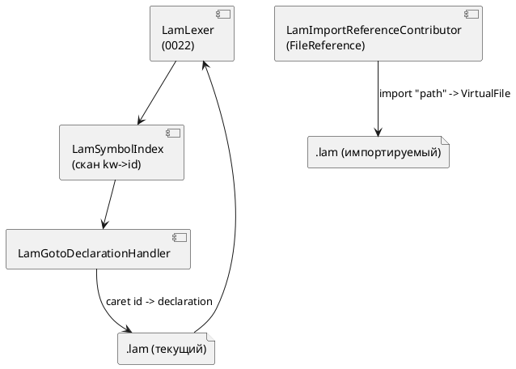

# Фича: Плагин IntelliJ IDEA — навигация к декларации и include

- **Номер:** 0023
- **Статус:** ГОТОВО
- **Зависит от:** нет (надстройка над готовой фичей [плагин IntelliJ IDEA — подсветка синтаксиса Lam](0022-intellij-syntax-highlight.md);
  связь с [lSP-сервер lam-lsp](0011-lsp-server.md) `lam-lsp` — необязательная, навигация автономна)
- **Связанные issue (анализ):** новая фича (из блока «Кандидаты» `FEATURES.md`:
  «Расширение плагина IntelliJ до навигации/инспекций»)
- **Крейт/подпроект:** существующий подпроект `extensions/intellij-lam/`
  (Kotlin + Gradle IntelliJ Platform Plugin), расширение поверх лексера 0022

## Стадии жизненного цикла

Все стадии — **разделы этой карточки**: «Архитектура (ADR)»,
«Анализ», «Разработка», «Тест-план», «Отчёт о тестировании», «Итог».
Отдельным артефактом остаются только исправления —
[`docs/fixes/`](../fixes/README.md) (при необходимости `0023-YY-*`).

## Краткое описание

Расширение плагина IntelliJ IDEA для Lam (задел [плагин IntelliJ IDEA — подсветка синтаксиса Lam](0022-intellij-syntax-highlight.md))
двумя навигационными возможностями:

1. **Переход к декларации** (Go to Declaration, `Ctrl/⌘+Click`, `Ctrl/⌘+B`) —
   от использования идентификатора к месту его объявления: `model`, `state`/`start`,
   `type`, `enum`, `cond`, `var`, `const`, `fn`, а также имён, введённых `import … as`.
2. **Обработка `import`-директив** — навигация от строкового литерала пути
   (`import "файл.lam";`, `import { … } from "файл.lam";`) к самому файлу
   `.lam` на диске (в т.ч. с учётом относительных путей и корней проекта).

Реализуется **лёгким путём** (ADR, Option A): `GotoDeclarationHandler` +
`PsiReferenceContributor` поверх существующего лексера, **без** полноценного
PSI-парсера. Фича аддитивна: синтаксис/семантика языка и версия языка не
меняются (свод неприменим).

> Фича зарегистрирована по запросу заказчика (2026-07-13) из блока «Кандидаты»
> `FEATURES.md`; далее проходит жизненный цикл по своду.

## Архитектура (ADR)

- **Status:** Accepted
- **Date:** 2026-07-13
- **Authors:** Архитектор + Лид разработки
- **Related issues:** [Фича](0023-intellij-navigation-include.md); развивает
  [ADR](0022-intellij-syntax-highlight.md#архитектура-adr)

### Context

Плагин 0022 даёт **лексическую** подсветку `.lam`: рукописный `LexerBase`
(`LamLexer`), `SyntaxHighlighter`, эргономику редактора. **PSI-парсера нет** —
дерева синтаксических узлов, на которые опираются штатные `Reference`/`resolve`,
не существует. Заказчик просит две навигационные возможности:

- **Go to Declaration** — от использования имени к его объявлению
  (`model`/`state`/`type`/`enum`/`cond`/`var`/`const`/`fn`, импортированные имена);
- **обработка `import`** — переход от строки-пути к файлу `.lam`.

Обе стоят в бэклоге как «PSI-парсер поверх лексера 0022». Вопрос ADR: **строить ли
полноценный PSI-парсер** ради этих двух возможностей, или обойтись более лёгким
механизмом платформы. Источник истины по декларациям — грамматика
`grammar/src/grammar.lalrpop` (формы `kw <Id>`), по импортам — правило `Import`.

### Decision Drivers

1. **Самодостаточность сборки.** 0022 сознательно отказался от JFlex/grammar-kit,
   чтобы плагин собирался без внешних кодогенераторов. Хочется сохранить это.
2. **Минимум дублирования грамматики.** Полный парсер на Kotlin — это второе,
   ручное зеркало `grammar.lalrpop`, которое рассинхронизируется при эволюции языка.
3. **Ровно запрошенный объём.** Нужны две конкретные возможности, а не полный
   IDE-стек (find usages/rename/структура) — их можно добавить позже отдельной фичей.
4. **Совместимость API.** Использовать только давно стабильные точки расширения
   платформы (как в 0022), чтобы диапазон IDE оставался открытым.

### Considered Options

#### Option A. Лёгкий путь: `GotoDeclarationHandler` + `PsiReferenceContributor` поверх лексера

Скан деклараций на основе `LamLexer` строит индекс `имя → диапазон` в файле.
`GotoDeclarationHandler` по идентификатору под кареткой отдаёт целевой элемент.
Пути `import` разрешаются через `FileReference`/собственную `PsiReference` на
токене-строке.

**Pros:**
- Без парсер-генератора и без второго ручного парсера грамматики.
- Малый объём, только стабильные API; открытый диапазон IDE сохраняется.
- Точно покрывает две запрошенные возможности.

**Cons:**
- Нет настоящего PSI ⇒ find usages/rename/структура — отдельная будущая работа.
- Разрешение имён — эвристика по токенам (без областей видимости/типов).

#### Option B. Полноценный PSI-парсер (`ParserDefinition` + рекурсивный парсер)

Ручной RD-парсер на Kotlin, зеркалящий `grammar.lalrpop`, строит PSI-дерево;
навигация — штатными `PsiReference`.

**Pros:**
- Нативная навигация; задел под find usages/rename/структуру/инспекции.

**Cons:**
- Крупная трудоёмкость; второй ручной парсер языка — источник рассинхронизации (декомпозиция; такой объём тянет на отдельную многозадачную фичу).
- Риск ошибок разбора там, где подсветка уже работает.

#### Option C. LSP `textDocument/definition` через `lam-lsp`

Навигацию отдаёт LSP-сервер (0011) через LSP4IJ/платформенный LSP API.

**Pros:**
- Единый источник семантики (сервер), переиспользование логики компилятора.

**Cons:**
- Платформенный LSP API — Ultimate-only / сторонний LSP4IJ (как отмечено в ADR);
  зависимость от установленного и запущенного `lam-lsp`. Ломает автономность плагина.

### Decision

Принимается **Option A**. Он даёт ровно две запрошенные возможности при
минимальном объёме и сохраняет самодостаточность и открытый диапазон IDE плагина
0022. Полный PSI (Option B) и LSP-навигация (Option C) остаются отдельными
будущими фичами в бэклоге (find usages/rename/структура; семантическая навигация
через `lam-lsp`) и не блокируются данным решением.

### Consequences

#### Положительные

- Ctrl/⌘+Click работает и для деклараций, и для путей `import`, офлайн, в Community.
- Никаких новых кодогенераторов и второго парсера грамматики.
- Индекс символов — переиспользуемый строительный блок для будущей структуры файла.

#### Отрицательные / Action items

- Разрешение имён — токенная эвристика (без областей видимости): возможны
  ложные срабатывания при совпадении имён; фиксируется в анализе как известное
  ограничение и покрывается тестами на реальные примеры.
- find usages/rename/структура/инспекции — вынести отдельной фичей (бэклог).
- Кросс-файловое разрешение имён (объявление в импортированном файле) — вне
  объёма 0023 (переход к самому файлу `import` — в объёме); отметить в бэклоге.

#### Acceptance criteria

1. `Ctrl/⌘+B`/Click на использовании `model`/`state`/`type`/`enum`/`cond`/`var`/
   `const`/`fn`/импортированного имени ведёт к его объявлению в том же файле.
2. `Ctrl/⌘+B`/Click на строке-пути в `import "…";` и `import { … } from "…";`
   открывает соответствующий файл `.lam` (при его наличии на диске/в корнях).
3. Плагин собирается `./gradlew buildPlugin` и проходит все тесты (включая новые
   для навигации/импорта); диапазон IDE остаётся открытым (only-stable API).

## Анализ

### Цель и контекст

Дать в плагине IntelliJ (0022) переход к декларации имён Lam и навигацию по
`import` к файлу. Реализация — Option A ADR (лёгкий путь, без PSI-парсера).
Источник истины: формы деклараций `kw <Id>` из `grammar/src/grammar.lalrpop` и
правило `Import`.

### Зависимости фичи

- **Зависит от:** нет. Фича — аддитивная надстройка над закрытой ([ГОТОВО](0022-intellij-syntax-highlight.md#отчёт-о-тестировании))
  фичей; переиспользует `LamLexer`/`LamTokenTypes`. Связь с 0011 (`lam-lsp`)
  необязательная (навигация автономна). Обратная совместимость полная: языковой
  синтаксис/семантика и версия языка не затрагиваются (свод неприменим).
- **Влияние на порядок разработки:** фича независима, разблокировок не даёт;
  завершение приближает будущие фичи «find usages/rename/структура» и
  «семантическая навигация через `lam-lsp`» (остаются в бэклоге).

### Формы деклараций (источник истины — грамматика)

Скан-эвристика: ключевое слово, за которым (пропуская пробелы/комментарии) идёт
идентификатор-имя декларации.

| Ключевое слово | Форма (grammar.lalrpop) | Имя |
|---|---|---|
| `model` | `model <name> [= …] { … }` | `<name>` |
| `state` / `start` | `state <name> = …` / `start <name> = …` | `<name>` |
| `type` | `type <name> = <Type>;` | `<name>` |
| `enum` | `enum <name> { … }` | `<name>` |
| `cond` | `cond <name> = <Condition>;` | `<name>` |
| `var` | `var <name> [: T] [:= e];` | `<name>` |
| `const` | `const <name> [: T] := e;` | `<name>` |
| `fn` / `extern fn` | `[extern] fn <name>(…) …` | `<name>` |
| `import … as <id>` | `import P as <id>;` / `import * as <id> from P;` | `<id>` |
| `import { A as C } from P` | список переименований | `C` (или `A`, если без `as`) |

Импорт-пути (цель навигации по файлу): строковый литерал `P` в
`import P;`, `import P as id;`, `import * as id from P;`, `import { … } from P;`.

### Требования и проверяемые условия

- **R1. Индекс деклараций.** По тексту файла (через `LamLexer`) построить отображение
  `имя → диапазон объявляющего идентификатора`, покрыв все формы из таблицы выше.
- **R2. Go to Declaration.** `GotoDeclarationHandler` по идентификатору под кареткой
  возвращает целевой элемент-объявление того же имени в текущем файле; на самой
  декларации и на не-идентификаторах — молчит (не мешает штатному поведению).
- **R3. Навигация по import.** Строковый литерал-путь в любой форме `import`
  разрешается в `VirtualFile`/`PsiFile` (относительно каталога файла и корней
  контента/проекта); Ctrl+Click открывает файл.
- **R4. Робастность.** Незакрытые строки/комментарии, отсутствие имени после
  ключевого слова, отсутствие файла по пути — не приводят к исключениям (навигация
  просто отсутствует).
- **R5. Стабильные API.** Только давно стабильные точки расширения (открытый
  диапазон IDE 0022 сохраняется); без парсер-генераторов.

### Критерии приёмки и способ проверки

| # | Критерий | Способ проверки |
|---|---|---|
| A1 | Индекс находит объявления всех форм таблицы | юнит-тест `LamSymbolIndexTest` (light fixture) |
| A2 | Переход к декларации от использования к объявлению | тест `LamGotoDeclarationTest` (BasePlatformTestCase) |
| A3 | На декларации/не-идентификаторе перехода нет | тест (негативные случаи) |
| A4 | Импорт-путь резолвится в файл (все 4 формы) | тест `LamImportReferenceTest` |
| A5 | Отсутствие файла/битый путь → нет исключений, нет цели | тест (негативный) |
| A6 | Сборка и все тесты зелёные | `./gradlew buildPlugin test` |

### Особенности по обратной функциональности

Полная обратная совместимость: чистое расширение плагина, ни один язык/крейт не
затронут. Подсветка, эргономика и FileType 0022 работают без изменений.

### Известные ограничения (осознанные, Option A ADR)

- Разрешение имён — эвристика по токенам одного файла: нет областей видимости,
  типов, кросс-файлового разрешения имён (переход к самому `import`-файлу — есть,
  переход к символу *внутри* импортированного файла — нет). Вынесено в бэклог.
- При совпадении имён декларируемого символа возможен переход к первой/ближайшей
  декларации — приемлемо для Option A; корректное разрешение — за будущим PSI.

### Риски и зависимости

- **Риск:** API `GotoDeclarationHandler`/`PsiReferenceContributor` в разных сборках
  IDE. Снижение: используем только стабильные сигнатуры, тест на целевой платформе
  2024.1.7; открытый `until-build` уже проверялся в 0022.
- **Риск:** тесты навигации требуют `BasePlatformTestCase` (test framework
  IntelliJ). Снижение: подключить `intellijPlatform { testFramework(...) }` в
  `build.gradle.kts`, покрыть чистую логику индекса отдельными «лёгкими» юнит-тестами.

## Разработка

### Задача

#### Что было

Плагин 0022 — чисто лексический: `LamLexer` + `SyntaxHighlighter` + эргономика.
PSI-дерева и навигации не было; `Ctrl+Click`/`Ctrl+B` по имени и по пути `import`
ничего не делали.

#### Что сделано

Реализован **Option A** ADR (лёгкий путь) поверх существующего лексера, одной
задачей `0023-01`. Затронут только подпроект `extensions/intellij-lam` (Kotlin);
крейты `grammar`/`simulation`, синтаксис/семантика и версия языка — **не тронуты** (для них «н/п», аддитивная фича редакторной оснастки; свод неприменим). Версия плагина `0.1.1 → 0.2.0`.

##### Новые компоненты

- **Плоский PSI-разбор** (нужен, чтобы под кареткой были реальные `PsiElement`):
  - `parser/LamParserDefinition.kt` — `ParserDefinition` (лексер `LamLexer`,
    комментарии/строки/пробелы через `psi/LamTokenSets.kt`, корневой `FILE`).
  - `parser/LamParser.kt` — принимает все токены листьями под корнем (структура
    не строится; разбор всегда успешен — подсветку 0022 не ломает).
  - `psi/LamFile.kt` — `PsiFileBase` языка Lam.
- **Индекс деклараций** — `navigation/LamSymbolScanner.kt`: поверх `LamLexer`
  собирает `имя → диапазон` для `model`/`state`/`start`/`type`/`enum`/`cond`/
  `var`/`const`/`fn` (форма `kw <Id>`) и локальных имён из `import` (алиасы после
  `as`, «голые» имена в `{ … }`). Источник истины — `grammar.lalrpop`.
- **Переход к декларации** — `navigation/LamGotoDeclarationHandler.kt`
  (`GotoDeclarationHandler`): по идентификатору под кареткой отдаёт листовой
  элемент одноимённого объявления; на самой декларации/не-идентификаторе молчит.
- **Навигация по `import`** — `navigation/LamImports.kt`: распознаёт строку-путь
  (ближайший слева значимый токен — `import`/`from`), резолвит файл относительно
  каталога текущего файла и корней контента проекта. Тот же
  `LamGotoDeclarationHandler` возвращает найденный файл как цель.

##### Отклонение от формулировки ADR (зафиксировано)

ADR (Option A) допускал `PsiReferenceContributor` для путей `import`. На практике
ссылки контрибьютора **не привязываются** к листовым токенам (`LeafPsiElement` не
является `ContributedReferenceHost`). Поэтому навигация по `import` реализована
через `GotoDeclarationHandler` (срабатывает на любом листе) — пользовательский
`Ctrl/⌘+Click`/`B` работает идентично. Полноценные `PsiReference` (для
find-usages/rename пути) остаются за будущей PSI-фичей (бэклог).

#### Проверки

- Юнит-/интеграционные тесты (`BasePlatformTestCase`): `LamSymbolScannerTest` (9),
  `LamGotoDeclarationTest` (6), `LamImportReferenceTest` (5) — **20 новых**.
- Команда: `./gradlew --offline clean buildPlugin test` → **BUILD SUCCESSFUL**,
  **47/47 тестов зелёные** (27 из 0022 + 20 новых). Собран `intellij-lam-0.2.0.zip`.
- Соответствие анализу: R1–R5 и критерии A1–A6 покрыты (см. тест-план/отчёт).

## Тест-план

### Область и цель

Проверить переход к декларации имён Lam и навигацию по директивам `import` к
файлу (требования R1–R5, критерии A1–A6 анализа). Языковые синтаксис/семантика
не затрагиваются — тестов компилятора/интерпретатора не требуется (свод н/п:
фича не меняет язык). Проверки автоматизированы на `BasePlatformTestCase`.

### Проверки (условие → ожидаемый результат)

| # | Проверка | Предусловие | Ожидаемый результат | R/A |
|---|---|---|---|---|
| T1 | Индекс находит объявления всех форм | текст с `model/state/start/type/enum/cond/var/const/fn` | все имена в индексе; варианты `enum` — нет | R1/A1 |
| T2 | Импорт-переименования в индексе | `import { A as C } from "f";`, `import "p" as P;`, `import * as Q from "p";` | локальные имена `C/P/Q`; источник `A` — нет | R1/A1 |
| T3 | Диапазон декларации указывает на имя | `model Widget { }` | диапазон покрывает `Widget` | R1/A1 |
| T4 | Переход от использования к декларации | `model Producer{} … Producer` | цель — имя в `model Producer` | R2/A2 |
| T5 | Переход по псевдониму импорта | `import { SharedModel as M } … M` | цель — алиас `M` в `import` | R2/A2 |
| T6 | Нет перехода на ключевом слове | каретка на `model` | целей нет | R2/A3 |
| T7 | Нет перехода на самой декларации | каретка на имени в объявлении | целей нет | R2/A3 |
| T8 | Нет перехода для неизвестного имени | использование без объявления | целей нет | R2/A3 |
| T9 | Импорт-путь → файл (3 формы) | `import "shared.lam"` / `… from "shared.lam"` / `"shared.lam" as S` | открывается `shared.lam` | R3/A4 |
| T10 | Отсутствующий файл | путь к несуществующему файлу | цели нет, без исключений | R4/A5 |
| T11 | Строка вне import не навигируется | строка в `formula "…"` | файловой цели нет | R3/A4 |
| T12 | Сборка и весь набор тестов | — | `buildPlugin` OK, все тесты зелёные | R5/A6 |

### Разбивка проверок по функциональности

Затрагивается только редакторная оснастка плагина (Kotlin). Обратная
функциональность `grammar`/`simulation` и языковой слой — **не применимо** (—):
фича аддитивна, ни один языковой артефакт не изменён. Подсветка/эргономика 0022
проверяются существующими тестами (регресс).

- Плагин `intellij-lam`: ✅ (T1–T12)
- `grammar`/`simulation`, синтаксис/семантика языка: — (не затронуты)

### Тестовые данные и окружение

- Тесты: `LamSymbolScannerTest`, `LamGotoDeclarationTest`, `LamImportReferenceTest`
  (+ регресс 0022: лексер/highlighter/FileType/цвета/эргономика).
- Окружение: IntelliJ Platform IC `2024.1.7`, JDK 17, Gradle wrapper 8.10.2,
  `TestFrameworkType.Platform`. Прогон: `./gradlew --offline clean buildPlugin test`.

## Отчёт о тестировании

### Резюме

**Вердикт: ✅ ГОТОВО.** Все проверки тест-плана пройдены. Реализован Option A ADR
(лёгкий путь): переход к декларации и навигация по `import` работают на
`GotoDeclarationHandler` поверх плоского PSI и лексера 0022. Дефектов, требующих
`docs/fixes/`, не выявлено. Языковой слой не затронут — примеры/контрпримеры по
синтаксису языка неприменимы (свод н/п).

**Окружение:** IntelliJ Platform IC `2024.1.7`, JDK 17.0.19, Gradle wrapper
8.10.2, `TestFrameworkType.Platform`. Команда: `./gradlew --offline clean
buildPlugin test` → **BUILD SUCCESSFUL**, **47/47 тестов зелёные** (27 регресс
[плагин IntelliJ IDEA — подсветка синтаксиса Lam](0022-intellij-syntax-highlight.md) + 20 новых). Собран `intellij-lam-0.2.0.zip`.

### Фактические результаты по проверкам

| # | Проверка | Результат | Комментарий |
|---|---|---|---|
| T1 | Индекс всех форм деклараций | ✅ | `LamSymbolScannerTest` (model/state/start/type/enum/cond/var/const/fn) |
| T2 | Импорт-переименования в индексе | ✅ | `C/P/Q` введены; источник `SharedModel` — нет |
| T3 | Диапазон декларации на имени | ✅ | подстрока диапазона == `Widget` |
| T4 | Использование → декларация | ✅ | `LamGotoDeclarationTest` (model/type) |
| T5 | Переход по псевдониму import | ✅ | цель — алиас `M` |
| T6 | Нет перехода на ключевом слове | ✅ | `mod<caret>el` → null |
| T7 | Нет перехода на самой декларации | ✅ | `model Fo<caret>o` → null |
| T8 | Нет перехода для неизвестного имени | ✅ | `Unkno<caret>wn` → null |
| T9 | Импорт-путь → файл (3 формы) | ✅ | `LamImportReferenceTest` (plain/from/as) |
| T10 | Отсутствующий файл | ✅ | цели нет, без исключений |
| T11 | Строка вне import не навигируется | ✅ | `formula "…"` → null |
| T12 | Сборка + весь набор тестов | ✅ | 47/47, `buildPlugin` OK |

### Результаты по функциональности

- **Плагин `intellij-lam`:** ✅ — 20 новых тестов + регресс 0022 (подсветка,
  эргономика, FileType) зелёные; подсветка не сломана плоским `ParserDefinition`.
- **`grammar`/`simulation`, синтаксис/семантика языка:** — не затронуты (аддитивная
  фича редакторной оснастки).

### Проверка совместимости с новыми IDE (verifyPlugin)

По запросу заказчика запущен **IntelliJ Plugin Verifier** против свежих релизов
IntelliJ IDEA Community (новее сборочной 2024.1.7). Результат — **Compatible** для
всех проверенных IDE, без проблем совместимости и предупреждений deprecated/
internal/experimental API:

| IDE (сборка) | Версия | Вердикт |
|---|---|---|
| IC-243.21565.193 | 2024.3 | ✅ Compatible |
| IC-251.23774.435 | 2025.1 | ✅ Compatible |
| IC-252.23892.409 | 2025.2 (ветка 252) | ✅ Compatible |

Настройка verifyPlugin и попутно исправленный дефект дескриптора (пустой
`until-build` из 0022-01 → атрибут убран; латинское начало описания; версия
плагина `0.2.0 → 0.2.1`) — [проверка совместимости с новыми IDE (verifyPlugin) + валидность дескриптора](../fixes/0023-01-verifyplugin-descriptor.md).

### Выводы и дальнейшие шаги

Фича готова к закрытию (ГОТОВО). Осознанные ограничения Option A (без областей
видимости; кросс-файловое разрешение имён внутри импортов; find-usages/rename/
структура; настоящие `PsiReference` для путей) вынесены в бэклог `FEATURES.md`
как будущая PSI-фича. Бинарная совместимость с новыми IDE подтверждена verifier
(см. выше); визуальная `runIde`-проверка в headless-среде не запускалась.

## Итог (что сделано)

Реализован **Option A** (ADR): навигация в плагине `extensions/intellij-lam`
поверх лексера 0022, **без** полноценного PSI-парсера. Аддитивно: `grammar`/
`simulation`, синтаксис/семантика и **версия языка** не тронуты (свод неприменим). Версия плагина `0.1.1 → 0.2.0`. Одна задача — [плагин IntelliJ IDEA — навигация к декларации и include](0023-intellij-navigation-include.md#разработка).

- **Плоский PSI:** `LamParserDefinition` + `LamParser` + `LamFile` — токены
  лексера кладутся листьями под корень; даёт реальные `PsiElement` под кареткой
  (подсветку 0022 не ломает, разбор всегда успешен).
- **Переход к декларации** (`GotoDeclarationHandler`): `LamSymbolScanner` строит
  индекс `имя → диапазон` для `model`/`state`/`start`/`type`/`enum`/`cond`/`var`/
  `const`/`fn` и локальных имён `import` (алиасы `as`, имена в `{ … }`); переход
  от использования к объявлению в том же файле.
- **Обработка `import`:** `LamImports` резолвит строку-путь (все формы `import`)
  в файл `.lam` относительно каталога файла и корней контента; тот же
  `GotoDeclarationHandler` открывает файл. `PsiReferenceContributor` не применён —
  ссылки не привязываются к листовым токенам (см. [development](0023-intellij-navigation-include.md#разработка)).

**Проверка:** `./gradlew --offline clean buildPlugin test` → BUILD SUCCESSFUL,
**47/47 тестов зелёные** (27 регресс 0022 + 20 новых: сканер 9, переход 6,
импорт 5). **Совместимость с новыми IDE** подтверждена IntelliJ Plugin Verifier —
**Compatible** для IC 2024.3 / 2025.1 / 2025.2 ([проверка совместимости с новыми IDE (verifyPlugin) + валидность дескриптора](../fixes/0023-01-verifyplugin-descriptor.md):
настройка `verifyPlugin`, снят невалидный пустой `until-build`, версия плагина
`0.2.0 → 0.2.1`). Остаточные пункты (find-usages/rename/структура/инспекции,
настоящие `PsiReference` для путей, кросс-файловое разрешение имён, визуальная
`runIde` в GUI) — в [отчёте](0023-intellij-navigation-include.md#отчёт-о-тестировании) и бэклоге `FEATURES.md`.
