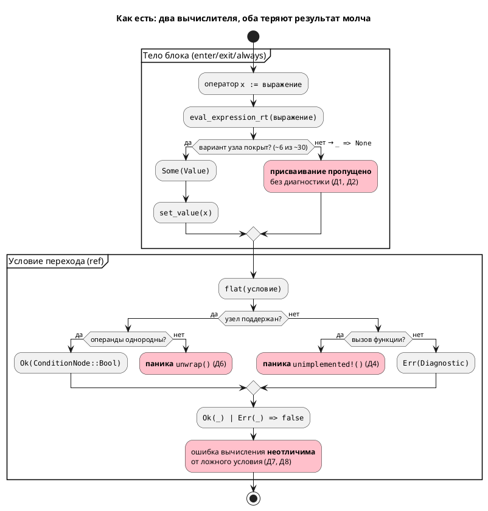
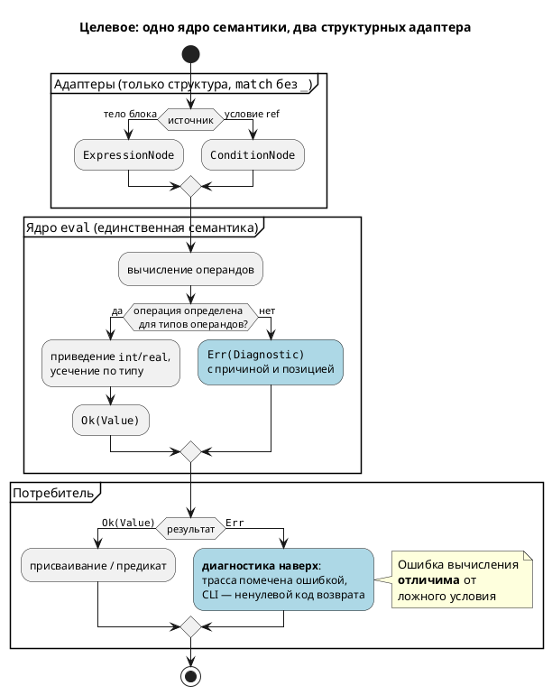

# Фича: Починка вычислителя выражений симулятора

- **Номер:** 0025
- **Статус:** **ГОТОВО** (закрыта 2026-07-14). Отчёт — вердикт **✅ ПРОЙДЕН**
  после доработки `0025-06`…`0025-08`. Итог — в разделе «Итог (что сделано)»
- **Зависит от:** **нет** — проставлено аналитиком на стадии 3 (правило 17).
  Проверены и пересечения по инфраструктуре; жёстких зависимостей
  нет, `ЗАБЛОКИРОВАНА` не ставится. Обоснование — в
  [анализе](0025-simulator-expression-eval.md#анализ), раздел «Зависимости фичи».
- **Связанные issue (анализ):** новая фича (дефект выявлен при обзоре проекта
  2026-07-14; в бэклоге кандидатов `FEATURES.md` отсутствовал)
- **Крейт:** `simulation` (затрагивает `unit/builder.rs`, `unit/mod.rs`, `predicate.rs`)
- **Приоритет:** высший — заявленная функциональность крейта `simulation`
  ([крейт simulation — симуляция моделей](0012-simulation-core.md)) в основном не работает и делает это
  **бесшумно**.

## Стадии жизненного цикла (правило 17)

Все стадии — **разделы этой карточки** (правило 32): «Архитектура (ADR)»,
«Анализ», «Разработка», «Тест-план», «Отчёт о тестировании», «Итог».
Отдельным артефактом остаются только исправления —
[`docs/fixes/`](../fixes/README.md) (при необходимости `0025-YY-*`).

## Краткое описание

Крейт `simulation` вычисляет модели **неверно и молча**: runtime-вычислитель
выражений поддерживает лишь малую часть узлов `ExpressionNode`, а невычислимое
выражение приводит к **тихому пропуску присваивания** — без ошибки и
предупреждения. В результате любая арифметика и любой вызов функции в телах
`enter`/`exit`/`always` не исполняются, переменные остаются с начальными
значениями, а зависящие от них переходы не срабатывают никогда. Фича
восстанавливает корректность симуляции и — что не менее важно — заменяет тихое
игнорирование на диагностику.

## Мотивация / контекст

Дефект не виден по тестам: полный прогон **зелёный** (1484 passed, 6 ignored),
сборка чистая. Существующие тесты проверяют факт переходов, но **не сверяют
вычисленные значения переменных**, поэтому дыра в вычислителе не ловится.

Симуляция — не вспомогательный инструмент, а способ проверить автоматную модель
до синтеза в C (правило 12: цель проекта — язык и тулы для промышленных систем
управления). Симулятор, который молча выдаёт неверную трассу, хуже отсутствующего:
он даёт ложную уверенность в модели.

## Состав дефектов (все воспроизведены, 2026-07-14)

> Д1–Д5 выявлены при обзоре (стадия 1); **Д6–Д8 добавлены на стадии 2 (ADR)** при
> разборе `predicate.rs`. Рост инвентаря на архитектурной стадии — сам по себе
> аргумент в пользу принятого решения: дефекты не независимы, у них общая причина
> (подстановочная ветка `_ =>`, `Option` вместо `Result`, AST в роли значения).

| № | Дефект | Место | Проявление |
|---|---|---|---|
| Д1 | `eval_expression_rt` покрывает ~6 из ~30 вариантов `ExpressionNode` (`Number`, `Bool`, `Rational`, `Variable`, `Negate`, `Parenthesis`); вся арифметика, сравнения, битовые операции и `Function` → `_ => None` | `simulation/src/unit/builder.rs:135` | `c := a + 1` не выполняется |
| Д2 | Невычислимое правое выражение → **тихий** пропуск присваивания (`if let Some(value) = … { set_value }`, ветки `else` нет) | `simulation/src/unit/builder.rs:220` | нет ни ошибки, ни предупреждения |
| Д3 | `compile_expression` обрабатывает только `Assign`, остальное → `vec![]` | `simulation/src/unit/builder.rs:218` | голый вызов `log_temp(temperature);` молча выпадает |
| Д4 | `ConditionNode::Function` в условии перехода → `unimplemented!()` | `simulation/src/predicate.rs:111` | **паника** симулятора |
| Д5 | `enter` **стартового** состояния не исполняется при инициализации: `enter` вызывается только внутри ветки перехода (шаг 5 `tick`) | `simulation/src/unit/mod.rs:185` | начальная инициализация модели теряется |
| Д6 | Смешанная арифметика `int`+`real` в условии → `unwrap()` на `None` (`extract_number` возвращает пару `(Option<i64>, Option<f64>)`, ветка «оба real» не покрывает смешанный случай) | `simulation/src/predicate.rs:130` | **паника** |
| Д7 | `Parenthesis` возвращает внутренний узел **невычисленным** (`Ok(*cond.clone())` вместо `flat(cond, context)`) | `simulation/src/predicate.rs:78` | `(t + 1) > 2` при `t=5` → условие **ложно** |
| Д8 | `EnumVariant`, `State`, `Model`, `ArraySubscript` → `Err` | `simulation/src/predicate.rs:~242` | `mode = Manual` при `mode=Manual` → **ложно**; `S(Ping) = End` в симуляторе не работает |

Д7 и Д8 молчаливы вдвойне: `create_predicate` (`predicate.rs:11`) сводит и `Err`, и
невычислимый результат к `false` (`Ok(_) | Err(_) => false`), поэтому **ошибка
вычисления неотличима от честно ложного условия**.

### Воспроизведение (пробы)

Минимальная проба Д1/Д2 — `a := 5` → `5`, `b := a` → `5`, но `c := a + 1` → **`0`**:

```lam
var a: u8 := 0;
var b: u8 := 0;
var c: u8 := 0;

start Idle {
    always {
        a := 5;
        b := a;
        c := a + 1;
    }
}
```

Проба Д5 — `enter { e := 7; }` в `start`-состоянии не срабатывает (`e=0`); тот же
`enter` при переходе в состояние работает (`e=9`).

Проба Д4 — `ref Hot: ready(t) > 0;` роняет симулятор с `not implemented`.

Проба Д6 — `ref Hot: t + 2.5 > 3;` роняет симулятор с
`called 'Option::unwrap()' on a 'None' value`.

Проба Д7 — при `var t: u8 := 5;` условие `ref Hot: (t + 1) > 2;` **ложно** (переход
не происходит), хотя `6 > 2`. Без скобок — работает.

Проба Д8 — при `enum Mode { Auto = 0, Manual = 1 }` и `var mode: Mode := Manual;`
условие `ref Hot: mode = Manual;` **ложно** (в трассе `mode=1`, переход не
происходит).

### Дефект виден в собственных примерах проекта

- **`examples/comprehensive.lam`** — `always { temperature := temperature + delta; }`
  не исполняется (Д1), поэтому `ref Heating: temperature > 10` не срабатывает
  **никогда**: модель висит в `Idle` и на 30-м шаге. Заявленный в примере сценарий
  `Idle → Heating → Cooling → Done` недостижим.
- **`examples/stacker.lam`** — `eta := travel_time(task_stack_no, task_row_no,
  task_section_no);` (строка 176) — вызов функции (Д1), значение молча
  отбрасывается: в выводе штатной симуляции (`examples/simulations/stacker_loading.json`)
  `eta=0` на **каждом** шаге.

Симулятор пригоден лишь для моделей на прямых присваиваниях (`x := y`, `x := 5`) —
именно поэтому демонстрационные сценарии `stacker_*.json` внешне «работают».

### Что дефектом **не** является (проверено)

Инвариант «условия рёбер `ref` не разрешаются» (`CLAUDE.md`) к дефекту отношения
**не имеет**: проба показала, что условия переходов разрешены корректно
(`Idle -> Heating : More(Variable(temperature), Number(10))`), и `flat` в
`predicate.rs` сравнения вычисляет. Сломан именно runtime-вычислитель выражений в
телах блоков. Инвариант при работе над фичей **не трогать**.

## Объём (предварительно, уточняет аналитик)

1. **Д1** — полное покрытие `ExpressionNode` в `eval_expression_rt`: арифметика
   (`Add`/`Subtract`/`Multiply`/`Divide`/`Modulo`/`Power`), сравнения, логические
   и битовые операции, `ArraySubscript`/`ArraySlice`/`BitAccess`, `Function`
   (вызов пользовательских `fn` с телом) и `extern fn` (семантика — за ADR).
2. **Д2/Д3** — вместо тихого пропуска: диагностика невычислимого выражения и
   неподдержанного оператора; исполнение выражений-операторов (вызовы функций).
3. **Д4** — устранить `unimplemented!()`; симулятор не должен паниковать ни на
   одной корректно скомпилированной модели.
4. **Д5** — исполнять `enter` стартового состояния при инициализации.
5. **Тесты** — сверять **вычисленные значения** переменных, а не только факт
   перехода (иначе класс дефекта воспроизведётся). Примеры/контрпримеры по
   правилу 16; `comprehensive.lam` и `stacker.lam` (`eta`) — приёмочные сценарии.

## Архитектурное решение (стадия 2, ADR принят)

В крейте `simulation` **два независимых вычислителя**, и они разошлись:

| Вычислитель | Вход | Умеет |
|---|---|---|
| `predicate.rs::flat` | `ConditionNode` | арифметику и сравнения, но паникует (Д4, Д6) и молча врёт (Д7, Д8) |
| `unit/builder.rs::eval_expression_rt` | `ExpressionNode` | только литералы/переменную/`Negate`/скобки (Д1) |

Корневая причина — не «забыли варианты», а то, что архитектура **позволяет** забыть
и не сигнализирует: подстановочная ветка `_ => None`, `Option` вместо `Result`,
использование узлов AST в роли значений.

[ADR](0025-simulator-expression-eval.md#архитектура-adr) принял **Option B**: общее ядро
вычисления над `Value` (единственное место семантики) + два тонких адаптера с
**исчерпывающим `match` без `_`**, возвращающих `Result<Value, Diagnostic>`. Тогда
новый вариант `ExpressionNode`/`ConditionNode` ломает сборку вместо тихого `None` —
инвариант удерживает компилятор, а не дисциплина. Отвергнуты: точечная починка
(Option A — оставляет причину) и понижение `ConditionNode → ExpressionNode`
(Option C — лоссиво: `Model`/`State`/`EnumVariant` не имеют аналогов, и наступает на
решение, уже отвергнутое [ADR](0019-condition-expression-unification.md#архитектура-adr)).

**Связь с фичей [унификация грамматик Condition/Expression](0019-condition-expression-unification.md):** то же дублирование
`Condition`/`Expression`, но на уровне симулятора, а не грамматики. Жёсткой
зависимости нет — 0019 сужена до устранения `LoopCond` и грамматики не сливает.
Подтверждает аналитик на стадии 3.

### Уточнения анализа (стадия 3)

[Анализ](0025-simulator-expression-eval.md#анализ) решение ADR не
переоткрывает, но в двух местах уточняет — оба уточнения основаны на проверке кода:

1. **Критерий сверки с C сужен** до `Integer`/`Enum`/`Bool`. Проверка эталона
   показала, что генератор C **сам дефектен** на остальных типах: `Rational` →
   `float` (f32) против f64 в симуляторе; `Bit` → `int` (32-битный знаковый);
   `Array(size, elem)` → `uint{size}_t`, где `size` — **число элементов**, а не
   разрядность (`[u8; 4]` → `uint4_t`), причём массив **молча исчезает** из
   структуры (проба: `var data: [u8; 4];` не попал в `arr.h`). Сверять с таким
   эталоном — значит узаконить его дефекты. Дефекты генератора C вынесены в бэклог
   кандидатов (вне объёма 0025).
2. **Смена контракта `Context` не требуется.** ADR числил её в action items;
   проверка показала, что тип переменной достижим в точке записи
   (`ModelNode::variables: HashMap<String, VariableNode>` → `VariableNode::ty()`),
   поэтому усечение по типу делается внутри `ModelNodeContext::set_value` без
   смены сигнатур.

Кроме того, анализ **снял опасение ADR** о «подогнанных под дефект» эталонах:
guard-проверки в `examples/simulations/*.json` опираются на прямые присваивания и
`eta` не проверяют вовсе.

Декомпозиция задач разработки — `0025-01…05` (см. анализ, раздел «Декомпозиция»);
задача 05 переопределена с «сверочные тесты» на «канал диагностики» (тесты —
стадия 5, правило 17).

### Находка тест-плана (стадия 5): почему 1484 зелёных теста ничего не поймали

[Тест-план](0025-simulator-expression-eval.md#тест-план) установил причину, и она
не «тесты плохо написаны»:

- в `unit/builder.rs` 22 теста, из них **4** покрывают `eval_expr` — **константный**
  вычислитель инициализаторов;
- тестов на `eval_expression_rt` — **дефектный runtime-вычислитель** — **ноль**;
- у крейта `simulation` **нет каталога интеграционных тестов** (`simulation/tests/`
  отсутствует): ни один тест не берёт `.lam`, не прогоняет его и не сверяет
  значения переменных.

Покрыт был **сосед** дефектного кода, а слоя, на котором дефект проявляется
(модель → трасса → значения), не существовало. Поэтому тест-план добавляет новый
слой — интеграционные тесты через публичный `runner::SimulationRunner` — и вводит
мета-требование: **T1–T8 обязаны быть красными на `HEAD`** до починки. Тест,
зелёный до починки, не проверяет то, что заявляет.

Тест-план также выявил **риск для [сохранение и загрузка состояния модели](0014-state-io.md)**: `state_io`
сериализует переменные из кэша `ModelNodeContext`, а кэш сегодня почти пуст —
присваивания пропускаются (проба: `--save-state` для `comprehensive.lam` даёт
`"variables": {}`). После починки вывод `--save-state` изменится → фикстуры
`state_io` подлежат сверке.

## Обратная совместимость (правило 11)

Синтаксис и семантика языка **не меняются** — чинится исполнение уже
специфицированного поведения, версия языка **не** повышается (правило 22).
Оговорки для анализа:

- Меняются **результаты симуляции** существующих моделей — но в сторону
  соответствия спецификации языка; текущее поведение считается дефектным.
- Приёмочные сценарии `examples/simulations/*.json` могут содержать проверки,
  подогнанные под дефектное поведение (кандидат №1 — `eta=0`); их нужно
  пересмотреть, а не «сохранять совместимость» с ошибкой.
- Версия крейта `simulation` — бамп patch/minor по SemVer, решает аналитик.

## Риски

- **Скрытая ширина.** Полное покрытие `ExpressionNode` затрагивает типы, массивы
  и вызовы функций — объём может превысить одну задачу разработки (кандидат на
  декомпозицию `0025-YY-*`, правило 2).
- **Семантика вычислений** (переполнение `u8`, деление на ноль, порядок побочных
  эффектов, рекурсия в `fn`) для симулятора не специфицирована — требует решений
  ADR и сверки с поведением генератора C, иначе симуляция и синтезированный C
  разойдутся.
- **`extern fn`** в симуляции не имеет реализации — нужна модель заглушек
  (значение по умолчанию / из `--sim-file` / диагностика).
- **Тестовый долг.** Зелёные тесты пропустили дефект; без тестов на значения
  переменных ремонт не проверяется.

> Фича зарегистрирована по запросу заказчика (обзор проекта 2026-07-14); далее
> проходит жизненный цикл по правилу 17: архитектура (ADR) → анализ → разработка.

<!-- При закрытии фичи (стадия 8, статус ГОТОВО) сюда добавляется раздел
     «## Итог (что сделано)» —
     ссылки на отчёт/исправления (правило 21). Незакрытые фичи «Итога» не имеют. -->

## Архитектура (ADR)

- **Status:** Accepted
- **Date:** 2026-07-14
- **Authors:** Архитектор + системный аналитик
- **Related issues:** [Фича](0025-simulator-expression-eval.md);
  связь с [ADR](0019-condition-expression-unification.md#архитектура-adr) (дублирование
  `Condition`/`Expression` — то же явление, но на уровне грамматики)

### Context

Крейт `simulation` вычисляет модели неверно и **бесшумно**. Обзор 2026-07-14
выявил восемь дефектов; все воспроизведены пробами. Существенно, что они **не
независимы** — это симптомы одной архитектурной причины.

В симуляторе **два вычислителя**, выросших порознь и разошедшихся:

| Вычислитель | Вход | Возвращает | Состояние |
|---|---|---|---|
| `unit/builder.rs::eval_expression_rt` | `ExpressionNode` (тела `enter`/`exit`/`always`) | `Option<Value>` | покрывает ~6 из ~30 вариантов; остальное → `_ => None` |
| `predicate.rs::flat` | `ConditionNode` (условия переходов) | `Result<ConditionNode, Diagnostic>` | арифметику умеет, но использует **узлы AST как значения** и делает `unwrap` |

Ни один не является подмножеством другого: `ConditionNode` содержит `Model`,
`State`, `EnumVariant`, которых нет в `ExpressionNode`; `ExpressionNode` содержит
`Assign`, `Multiply`/`Divide`/`Modulo`/`Power`, сдвиги, побитовые операции,
`CodeBlock`, которых нет в `ConditionNode`. Поэтому расхождение не заметил ни
компилятор, ни тесты.

#### Инвентарь дефектов

| № | Дефект | Место | Проявление |
|---|---|---|---|
| Д1 | `eval_expression_rt` покрывает ~6 из ~30 вариантов `ExpressionNode` | `unit/builder.rs:135` | `c := a + 1` → `c` не меняется |
| Д2 | Невычислимое выражение → **тихий** пропуск присваивания (нет ветки `else`) | `unit/builder.rs:220` | ни ошибки, ни предупреждения |
| Д3 | `compile_expression` обрабатывает только `Assign` | `unit/builder.rs:218` | голый вызов `log_temp(x);` выпадает |
| Д4 | `ConditionNode::Function` → `unimplemented!()` | `predicate.rs:111` | **паника** |
| Д5 | `enter` стартового состояния не исполняется | `unit/mod.rs:185` | начальная инициализация теряется |
| Д6 | Смешанная арифметика `int`+`real` → `unwrap()` на `None` | `predicate.rs:130` | **паника** |
| Д7 | `Parenthesis` возвращает внутренний узел **невычисленным** (`Ok(*cond.clone())` вместо `flat(cond)`) | `predicate.rs:78` | `(t + 1) > 2` при `t=5` → условие ложно |
| Д8 | `EnumVariant`, `State`, `Model`, `ArraySubscript` → `Err` | `predicate.rs:~242` | `mode = Manual` при `mode=Manual` → ложно; `S(Ping) = End` не работает |

Д7 и Д8 молчаливы вдвойне: `create_predicate` (`predicate.rs:11`) сводит и `Err`,
и невычислимый результат к `false` (`Ok(_) | Err(_) => false`), поэтому ошибка
вычисления неотличима от честно ложного условия.

#### Поток «как есть»



#### Корневая причина

Дефект — **не** «забыли дописать варианты». Забыть стало возможно, потому что
архитектура это позволяет и не сигнализирует:

1. **`_ => None`** — подстановочная ветка гасит любой невычисленный узел. Добавление
   варианта в `ExpressionNode` не ломает сборку `simulation` — новый узел молча
   становится «невычислимым».
2. **`Option` вместо `Result`** — «нет значения» не несёт причины, и вызывающий не
   обязан её обрабатывать; естественный код — `if let Some(v) = … {}` — и есть Д2.
3. **AST как значение** (`flat` возвращает `ConditionNode`) — смешивает частичную
   нормализацию с вычислением; отсюда `unwrap` (Д6) и невычисленные скобки (Д7).

Пока эти три свойства сохраняются, любая точечная починка восстановит паритет
сегодня и потеряет его на следующем добавленном узле.

#### Почему это важно

Симуляция — способ проверить автоматную модель **до** синтеза в C (правило 12).
Симулятор, молча выдающий неверную трассу, хуже отсутствующего: он даёт ложную
уверенность. Дефекты видны в собственных примерах проекта: `comprehensive.lam`
навсегда висит в `Idle`, у `stacker.lam` `eta=0` на каждом шаге. Полный прогон
тестов при этом **зелёный** (1484 passed) — тесты проверяют факт переходов, но не
вычисленные значения.

### Decision Drivers

1. **Закрыть класс дефекта, а не восемь дефектов.** Главный критерий решения — чтобы
   девятый такой дефект не мог появиться молча. Всё остальное вторично.
2. **Достоверность симуляции.** Наблюдаемое поведение симулятора обязано совпадать с
   поведением синтезированного C — иначе проверка модели бессмысленна (правило 12).
3. **Никаких паник.** Ни одна корректно скомпилированная модель не должна ронять
   симулятор: паника — это отказ инструмента проверки.
4. **Язык не меняется.** Правила 11 и 22: чинится исполнение уже
   специфицированного поведения; версия языка не растёт. Инвариант «условия рёбер
   `ref` не разрешаются» (`CLAUDE.md`) — неприкосновенен.
5. **Соразмерность.** `simulation` — не горячий код; читаемость и проверяемость
   важнее микрооптимизации (`docs/CODE.md`).

### Considered Options

#### Option A. Точечная починка обоих вычислителей

Дописать недостающие варианты в `eval_expression_rt`, убрать `unimplemented!()` и
`unwrap` из `flat`, исправить `Parenthesis`, `EnumVariant`, `enter`.

**Pros:**
- Минимальный диф; все восемь дефектов закрываются быстро.
- Нулевой риск задеть смежные подсистемы.

**Cons:**
- **Не устраняет причину** (драйвер 1): `_ => None`, `Option` и AST-как-значение
  остаются. Расхождение вернётся на следующем варианте `ExpressionNode` — ровно
  так оно и возникло.
- Дублирование семантики сохраняется: правила переполнения, приведения `int`/`real`
  и деления на ноль придётся реализовать **дважды** и держать синхронными вручную.
  Д1 против Д6/Д7 — прямое доказательство, что вручную не удерживается.

#### Option B. Общее ядро вычисления над `Value` + два исчерпывающих адаптера

Семантика значений выносится в единый модуль (`simulation/src/eval/`): тип `Value`,
типизированные унарные/бинарные операции, правила приведения и усечения, приведение
к `bool`. Два тонких адаптера — `ConditionNode → Value` и `ExpressionNode → Value` —
не содержат семантики, только структурный разбор, и пишутся **исчерпывающим `match`
без `_`**, возвращая `Result<Value, Diagnostic>`.

**Pros:**
- Устраняет причину (драйвер 1): новый вариант `ExpressionNode`/`ConditionNode`
  **ломает сборку** `simulation`, а не тихо возвращает `None`. Компилятор берёт на
  себя то, что не удержали тесты и ревью.
- Семантика (переполнение, `int`/`real`, деление на ноль) существует в **одном**
  месте → расхождение вычислителей структурно невозможно (драйвер 2).
- `Result` вместо `Option` делает диагностику обязательной по типу, а не по
  дисциплине: Д2 не пишется случайно.
- `flat` перестаёт быть частичным нормализатором → `unwrap` (Д6) и невычисленные
  скобки (Д7) исчезают как класс.

**Cons:**
- Объём больше A: новый модуль + переписывание `flat`, а не правка веток.
- Асимметрия узлов остаётся: `Model`/`State` (только `Condition`) и
  `Assign`/`CodeBlock` (только `Expression`) обрабатываются в своих адаптерах.
- Требует доступа к типу переменной (`TypeNode`) при записи — `Value` ширины не несёт.

#### Option C. Понижение `ConditionNode` → `ExpressionNode`, один вычислитель

Привести условия к выражениям и оставить единственный `eval`.

**Pros:**
- Максимальное устранение дублирования: один тип, один вычислитель.
- Хорошо сочетается с идеей фичи.

**Cons:**
- **Понижение лоссивое:** `Model`, `State`, `EnumVariant` не имеют аналогов в
  `ExpressionNode`; для них пришлось бы расширять `ExpressionNode` — то есть менять
  семантические типы крейта `grammar` ради симулятора.
- `Condition::And`/`Or` документированы как **побитовые**, а `flat` вычисляет их
  логически (`to_bool`) — при слиянии эту неоднозначность пришлось бы разрешать,
  что затрагивает семантику языка (драйвер 4).
- Ставит починку дефекта в зависимость от рефактора грамматики, тогда как ADR
  полное слияние `Condition`/`Expression` **уже отверг** (ломает инвариант `=`/`==`
  и совместимость). Воскрешать отвергнутое решение внутри исправления — неверный масштаб.

### Decision

Принимается **Option B**.

Решающий довод — драйвер 1. Option A закрывает восемь дефектов и оставляет
механизм, который их породил: подстановочная ветка `_ => None` означает, что
корректность держится на памяти разработчика, а не на компиляторе. Проект уже
проверил этот механизм на прочность и проиграл — два вычислителя разошлись
настолько, что один умеет арифметику, а другой нет, и оба при этом «работают».
Option B переносит инвариант «все узлы обработаны» из области дисциплины в область
типов: исчерпывающий `match` делает пропуск ошибкой сборки, `Result` делает
диагностику обязательной.

Option C отвергается по масштабу: он лечит симптом уровня грамматики ради дефекта
уровня симулятора и наступает на решение, уже отвергнутое ADR.

#### Целевой поток



#### Принятые решения по составу

| Вопрос | Решение |
|---|---|
| Д1 | Полное покрытие `ExpressionNode` в адаптере; `match` **без** `_`. |
| Д2, Д3 | `Result<Value, Diagnostic>`; невычислимое выражение и неподдержанный оператор → диагностика, не пропуск. Операторы-выражения (вызовы) исполняются. |
| Д4, Д6 | `unimplemented!()`/`unwrap` удаляются; в `eval` и адаптерах паника **запрещена** — только `Err`. |
| Д5 | `enter` стартового состояния исполняется при инициализации (до первого `tick`), ровно один раз. |
| Д7 | `Parenthesis` вычисляется рекурсивно (следствие отказа от AST-как-значения). |
| Д8 | `EnumVariant` → `Value::Number(значение варианта)` — согласовано с C (enum → int); `ArraySubscript`/`ArraySlice`/`BitAccess` поддерживаются. `State`/`Model` — см. ниже. |
| Сравнение `State`/`Model` (`S(Ping) = End`) | Требует расширения `Context` доступом к текущему состоянию под-модели — **отдельная задача внутри 0025**. До её реализации — **явная диагностика**, а не тихое `false`. |
| Числовая семантика | Принцип: для поведения, **определённого** в C, симулятор обязан совпадать с синтезированным C (усечение по объявленному типу: `u8` + 1 при 255 → 0); для **неопределённого** в C (деление на ноль) — симулятор выдаёт диагностику, а не воспроизводит UB и не паникует. Конкретную таблицу правил (приведение `int`/`real`, сдвиги, знаковое переполнение) составляет анализ и подтверждает сверочными тестами против `lamc -t c`. |
| `extern fn` | Тела нет. Процедура (без возвращаемого типа) — no-op. Функция с возвращаемым типом — **диагностика** (симуляция невозможна), а не тихий ноль; подстановка значений через `--sim-file` — кандидат в отдельную фичу, не в 0025. |
| `fn` с телом (`Local`) | Интерпретируется. Это достаточно для приёмки: `travel_time` в `stacker.lam` (строка 116) — локальная функция. |
| Рекурсия в `fn` | Ограничение глубины с диагностикой (симулятор не должен переполнять стек). |

#### Механизм удержания решения

Запрет `_ =>` в `eval`/адаптерах — не пожелание, а проверяемое условие: включить
`#![deny(clippy::wildcard_enum_match_arm)]` на модуле `eval`. Без этого решение
деградирует до Option A при первом же добавленном варианте.

### Consequences

#### Положительные

- Класс дефекта закрыт **компилятором**: новый вариант `ExpressionNode`/`ConditionNode`
  не может молча стать невычислимым.
- Семантика вычислений существует в одном месте → симуляция и синтезированный C не
  расходятся по построению.
- Ошибка вычисления отличима от ложного условия — исчезает главное свойство,
  делавшее дефект незаметным.
- Симулятор перестаёт паниковать (Д4, Д6): отказ инструмента проверки заменяется
  диагностикой.
- `predicate.rs` упрощается: частичная нормализация не нужна — предикату требуется
  `bool`, а `create_predicate` и так сводил всё к нему.

#### Отрицательные / Action items

- **Результаты симуляции изменятся** — в сторону спецификации. Пересмотреть
  `examples/simulations/*.json`: проверки могли быть подогнаны под дефектное
  поведение (кандидат №1 — `eta=0`). Это не слом совместимости, а исправление
  эталона (правило 11).
- **Объём больше Option A** → декомпозировать на задачи `0025-YY` (правило 2);
  предложение анализу: 01 — ядро `eval` + `Value`; 02 — адаптер `ExpressionNode`
  (Д1–Д3); 03 — адаптер `ConditionNode`, переписывание `flat` (Д4, Д6–Д8);
  04 — `enter` при инициализации (Д5); 05 — сверочные тесты против `lamc -t c`.
- **`Value` не несёт ширину типа** — ядру нужен доступ к `TypeNode` переменной при
  записи; уточнить контракт `Context` (сейчас `get_value`/`set_value` — только по
  имени).
- **Канал диагностики времени выполнения отсутствует**: `TickResult` — `pub(crate)`
  и не имеет варианта ошибки. Нужен путь «ошибка вычисления → `runner` → CLI
  (ненулевой код возврата)». Пересекается с кандидатом «предупреждения
  `private_interfaces`» из `FEATURES.md`.
- **`Local`-функции требуют интерпретации тела** (`StatementNode`) — это шаг от
  вычислителя выражений к интерпретатору; ограничить глубину рекурсии.
- **Сравнение `State`/`Model`** остаётся неподдержанным до отдельной задачи —
  зафиксировать как диагностику и внести в тест-план как контрпример.
- **Правило кода.** Запрет подстановочных веток в разборе семантических узлов —
  кандидат в `docs/CODE.md` (сейчас такого правила нет). Внести в процессный
  бэклог `FEATURES.md` (правило 7).

#### Acceptance criteria

1. `examples/comprehensive.lam` проходит заявленный сценарий `Idle → Heating →
   Cooling → Done` (сейчас — вечный `Idle`).
2. `examples/stacker.lam` на сценарии `examples/simulations/stacker_loading.json`
   даёт `eta ≠ 0` (`travel_time` — локальная `fn`, интерпретируется).
3. Пробы Д1–Д8 из карточки фичи зелёные; **ни одна не паникует**. В частности:
   `c := a + 1` → `c = 6` при `a = 5`; `(t + 1) > 2` при `t = 5` → истинно;
   `mode = Manual` при `mode = Manual` → истинно.
4. В модуле `eval` и адаптерах **нет ни одной ветки `_ =>`** по вариантам
   `ExpressionNode`/`ConditionNode`; включён
   `deny(clippy::wildcard_enum_match_arm)`; `./scripts/precheck.sh` зелёный.
5. Невычислимое выражение приводит к **диагностике** с позицией в исходнике и
   ненулевому коду возврата CLI — проверяется контрпримером (правило 16).
6. Тесты симуляции сверяют **вычисленные значения переменных**, а не только факт
   перехода; добавлен тест, падающий на текущем коде (защита от регресса класса).
7. Сверочный тест: для набора моделей результат симуляции совпадает с поведением
   кода, порождённого `lamc -t c` (включая усечение `u8` при переполнении).
8. Инвариант `ref`-условий не затронут: тест `syntax_simple` зелёный.
9. `cargo test --all-features -- --test-threads=1` зелёный; `examples/simulations/*.json`
   пересмотрены и актуальны.

## Анализ

### Цель и контекст

Довести решение [ADR](0025-simulator-expression-eval.md#архитектура-adr) (Option B:
общее ядро вычисления над `Value` + два адаптера с исчерпывающим `match`) до
исполнимого плана: зафиксировать зависимости (правило 17), проверяемые требования,
таблицу числовой семантики, изменяемые контракты и декомпозицию задач `0025-YY`.

Анализ **не переоткрывает** решение ADR, но в двух местах его **уточняет** — оба
уточнения основаны на проверке кода, а не на предпочтении:

1. **Критерий сверки с C сужен** (раздел «Пригодность эталона C»): эталон
   непригоден для `Rational`, `Array` и `Bit` — генератор C сам дефектен на этих
   типах. Сверять с ним — значит зафиксировать его дефекты.
2. **Смена контракта `Context` не требуется** (раздел «Контракты»): тип переменной
   достижим в точке записи. ADR числил это в «Отрицательные / Action items»;
   проверка сняла пункт.

#### Решение о декомпозиции аналитики (правило 17)

Аналитика **не декомпозируется** на `0025-YY-*.md`; настоящий документ —
единственный. Обоснование: правило 17 предписывает декомпозицию «при большом
объёме», а объём здесь **связный**, а не большой: все задачи разработки делят одну
таблицу числовой семантики и один контракт ядра `eval`. Разнесение по пяти файлам
разорвало бы именно то, что должно быть согласовано, и создало бы пять копий
таблицы. Декомпозиция живёт там, где она уместна, — в задачах разработки
`0025-01…05` (раздел «Декомпозиция»).

### Зависимости фичи (правило 17/19)

- **Зависит от:** **нет**. Статус `ЗАБЛОКИРОВАНА` **не** ставится.

Проверено по контракту и инфраструктуре (не по названиям):

| Фича-кандидат | Проверка | Вывод |
|---|---|---|
| [унификация грамматик Condition/Expression](0019-condition-expression-unification.md) «Унификация Condition/Expression» (`РАЗРАБОТКА`) | [ADR](0019-condition-expression-unification.md#архитектура-adr) сузил объём до устранения дубликата `LoopCond` **в грамматике**; семантические типы `ConditionNode`/`ExpressionNode` он не сливает. Адаптеры Option B принимают оба типа **как есть**. | **не зависимость** |
| [крейт simulation — симуляция моделей](0012-simulation-core.md) «Крейт simulation» (`ГОТОВО`) | Фича закрыта; 0025 чинит её дефекты. Закрытая фича зависимостью быть не может (правило 17). | **не зависимость** |
| [перечисления (enum)](0005-enums.md) «Перечисления» (`ГОТОВО`) | Д8 требует `EnumVariant → int`. `EnumDefinitionNode` и отображение enum → `uint{bits}_t` уже существуют (`generator/c/mod.rs:165`). | **не зависимость** (закрыта) |
| Кандидат «предупреждения `private_interfaces`» | Пересекается с 0025 по `TickResult` (`pub(crate)`, нужен вариант ошибки). Кандидат не оформлен в фичу → зависимостью быть не может. | **не зависимость**; 0025 закрывает пересечение попутно |
| Кандидаты по генератору C (typedef, заглушки) | Влияют на **сверочный** критерий, но не на реализацию 0025 (см. «Пригодность эталона C»). | **не зависимость**; критерий сужается |

- **Влияние на порядок разработки:** порядок не меняется — 0025 остаётся **первой**
  (подтверждаю решение стадии 2 по критерию 4 правила 19: дефект, из-за которого
  инструмент проверки моделей бесшумно врёт, идёт раньше улучшений).
  Завершение 0025 **не разблокирует** формально ни одну фичу (жёстких зависимостей
  от неё нет), но снимает риск с кандидата «юнит-конструкции языка для симуляции
  (assert/invariant)»: строить `assert`/`invariant` поверх вычислителя, который
  молча возвращает `false`, бессмысленно. Рекомендуемый порядок **0025 → 0019**
  сохраняется: если 0019 когда-либо сольёт узлы, два адаптера 0025 схлопнутся в
  один — это удешевит 0019, а не заблокирует 0025.

### Пригодность эталона C (уточнение критерия A7 ADR)

ADR постановил: «для поведения, определённого в C, симулятор обязан совпадать с
синтезированным C» и вынес это в критерий приёмки A7 (сверочные тесты против
`lamc -t c`). Анализ **проверил эталон** и обнаружил, что для части типов он
непригоден:

| Тип Lam | Отображение в C | Проблема | Сверка применима? |
|---|---|---|---|
| `Integer { bits, signed }` | `int{bits}_t` / `uint{bits}_t` (`generator/c/mod.rs:186`) | нет | **да** |
| `Enum(имя)` | `uint{bits}_t`, разрядность по максимальному варианту (`mod.rs:165`) | нет | **да** |
| `Bool` | `bool` | нет | **да** |
| `Rational` | `float` — то есть **f32** (`mod.rs:154`) | `Value::Real` в симуляторе — **f64**. Точность заведомо расходится | **нет** (до решения по типу) |
| `Bit` | `int` — 32-битный **знаковый** (`mod.rs:152`) | «1-битный примитив» отображён в `int`; семантика бита в C не выражена | **нет** |
| `Array(size, elem)` | `uint{size}_t`, где `size` — **число элементов**, а не разрядность (`mod.rs:157`) | Тип невалиден при `size ∉ {8,16,32,64}` (`[u8; 4]` → `uint4_t`); размерность массива теряется | **нет** |

Проба (`var data: [u8; 4]; var flag: bit := 0;` → `lamc compile -t c`): переменная
`data` **молча отсутствует** в сгенерированной структуре — в `arr.h` только
`int flag;`, без диагностики. Это тот же класс «тихого пропуска», что и в 0025, но
в генераторе C.

**Вывод для критерия A7:** сверка симулятора с `lamc -t c` проводится **только**
для `Integer{bits,signed}`, `Enum` и `Bool`. Для `Rational`, `Bit` и `Array`
эталон сначала должен быть починен — это дефекты **генератора C**, вне объёма 0025
(вносятся в бэклог кандидатов, правило 7). До тех пор симулятор для этих типов
определяет семантику **сам** (таблица ниже), а тест-план фиксирует её как
самостоятельный эталон, а не как «совпадение с C».

> Это уточнение существенно: не сузив A7, мы «сверкой» узаконили бы `uint4_t` и
> исчезающие массивы как эталонное поведение.

### Числовая семантика (обязательна к реализации в ядре `eval`)

Принцип ADR: определённое в C поведение — воспроизводим; неопределённое (UB) — не
воспроизводим и не паникуем, а диагностируем.

| # | Ситуация | Поведение C | Решение симулятора | Обоснование |
|---|---|---|---|---|
| S1 | Переполнение беззнакового (`u8`, `255 + 1`) | Определено: обёртка mod 2⁸ → `0` | **Усечение по объявленному типу при записи** → `0` | совпадение с эталоном (A7) |
| S2 | Переполнение знакового (`i8`, `127 + 1`) | **UB** | **Диагностика** (ошибка вычисления) | принцип ADR: UB не воспроизводим |
| S3 | Деление/остаток на ноль | **UB** | **Диагностика** | принцип ADR; сейчас — паника или тихий ноль |
| S4 | Сдвиг: `x << 8` для `u8` | **Определено**, а не UB: операнд продвигается до `int` (целочисленное продвижение, C11 6.5.7p3), `1 << 8 = 256`, запись в `uint8_t` усекает → `0`. Проверено пробой на `cc -std=c11` | Вычислять в i64, усечь при записи → `0` | совпадение с эталоном; **исправляет первоначальную формулировку S4** (ошибочно считалась UB) |
| S4a | Сдвиг на отрицательное число или ≥ ширины **продвинутого** типа (`int` = 32 для типов уже `int`; 64 для `u64`/`i64`) | **UB** | **Диагностика** | принцип ADR: UB не воспроизводим |
| S5 | Смешение `int` и `real` | Обычные арифметические преобразования → `float` | Оба операнда → `Value::Real` (f64), результат — `Real` | устраняет Д6; сверка с C по S5 **не проводится** (f32 vs f64) |
| S6 | `Bit` в арифметике | `int` | `Value::Number` ∈ {0, 1}; запись усекает к {0,1} | семантика бита в C не выражена → эталон симулятора |
| S7 | `EnumVariant` в выражении/условии | `uint{bits}_t` со значением варианта | `Value::Number(значение варианта)` | устраняет Д8; совпадает с C |
| S8 | `Bool` в арифметике | `bool` → 0/1 при продвижении | `Value::Boolean`; к числу — только явным приведением в ядре | сохраняет диагностируемость ошибок типов |
| S9 | Приведение при записи в переменную | Неявное усечение к типу поля | Усечение по `VariableNode::ty()` | единая точка (см. «Контракты») |
| S10 | Рекурсия в `fn` | Стек C | Ограничение глубины (предлагается 256) + диагностика | симулятор не должен переполнять стек |

S2/S3/S4a требуют подтверждения заказчиком (раздел «Открытые вопросы»): формально
принцип ADR даёт диагностику, но промышленные модели могут рассчитывать на обёртку
знакового типа.

> **Урок S4.** Первоначально S4 гласил «сдвиг на разрядность и более → UB →
> диагностика». Проба на `cc -std=c11` показала обратное: `uint8_t x = 1; x = x << 8;`
> даёт `0` без всякого UB — из-за целочисленного продвижения до `int`. Правило,
> выведенное «из общих соображений» о C, было бы реализовано как ошибочная
> диагностика на полностью корректной модели. Отсюда — требование к задаче
> `0025-01`: **каждая строка таблицы S подтверждается пробой на C**, а не
> рассуждением (см. критерий A8 и `CLAUDE.md`: сперва зонд, затем assertions).

### Контракты и изменения API

#### 1. Доступ к типу при записи — контракт `Context` менять **не нужно**

ADR числил в action items: «`Value` не несёт ширину типа — уточнить контракт
`Context`». Проверка снимает пункт: `ModelNodeContext` (`unit/builder.rs:87`)
хранит `model: Rc<RefCell<ModelNode>>`, а `ModelNode::variables` —
`HashMap<String, VariableNode>` (`semantic/mod.rs:79`), где `VariableNode::ty()`
(`semantic/mod.rs:954`) отдаёт `&TypeNode`. Значит усечение S1/S6/S9 выполняется
**внутри** `ModelNodeContext::set_value`, сигнатуры `get_value`/`set_value`
остаются прежними.

#### 2. Канал диагностики времени выполнения — единственное реальное расширение API

Сейчас ошибка вычисления не имеет пути наверх. Требуется:

- `TickResult` (`unit/mod.rs:38`, `pub(crate)`) — вариант ошибки;
- `RunResult` (`runner.rs:64`) — вариант `EvalFailed { step, details }` **по
  образцу существующего `GuardFailed { step, details }`** (готовый прецедент —
  повторно используем форму, а не изобретаем);
- CLI `simulation` — печать диагностики и **ненулевой** код возврата;
- попутно закрывается предупреждение `private_interfaces` (`TickResult` —
  `pub(crate)` при публичном `Unit::tick`).

#### 3. Пробел: `Value` не покрывает `Struct`

`TypeNode::Struct(имя)` (NI3) существует, а `Value` (`value.rs`) имеет только
`Number`/`Real`/`Boolean`/`Array`. Структурные переменные в симуляторе не
представимы. **Вне объёма 0025** (не входит в Д1–Д8, отдельная функциональность):
фиксируется как **явная диагностика** «структуры не поддерживаются симулятором» и
вносится в бэклог кандидатов. Тихо возвращать `None` — ровно то, что чиним.

### Требования и проверяемые условия

- **R1. Полнота адаптеров.** Каждый вариант `ExpressionNode` и `ConditionNode`
  обработан явно: вычислен либо возвращает `Err(Diagnostic)` с причиной.
- **R2. Запрет подстановочных веток.** В ядре `eval` и адаптерах нет ни одной
  ветки `_ =>` по вариантам семантических узлов; включён
  `deny(clippy::wildcard_enum_match_arm)`.
- **R3. Диагностика вместо пропуска.** Ядро и адаптеры возвращают
  `Result<Value, Diagnostic>`; невычислимое выражение **не может** привести к
  молчаливому пропуску присваивания.
- **R4. Отсутствие паник.** Ни `unimplemented!()`, ни `unwrap()`/`expect()` по
  данным модели. Любая корректно скомпилированная модель не роняет симулятор.
- **R5. Отличимость ошибки от лжи.** Ошибка вычисления условия отличима от
  честно ложного условия (устраняет `Ok(_) | Err(_) => false`).
- **R6. Соответствие эталону.** Для `Integer`/`Enum`/`Bool` результат совпадает с
  поведением кода `lamc -t c` (S1, S7).
- **R7. Инициализация.** `enter` стартового состояния исполняется **ровно один
  раз** до первого `tick`; `enter` при переходе не дублируется.
- **R8. Инвариант `ref`.** Условия рёбер `ref` по-прежнему **не разрешаются**
  семантикой; 0025 не добавляет проход разрешения (`CLAUDE.md`).
- **R9. Тесты на значения.** Тесты симуляции сверяют вычисленные значения
  переменных, а не только факт перехода.
- **R10. Регресс сценариев.** Существующие `examples/simulations/*.json` проходят
  guard-проверки (`RunResult::GuardFailed` — реально исполняется, `runner.rs:175`).

### Критерии приёмки и способ проверки

| # | Критерий | Способ проверки |
|---|---|---|
| A1 | `c := a + 1` при `a = 5` даёт `c = 6` (Д1, Д2) | юнит-тест на значение переменной |
| A2 | `(t + 1) > 2` при `t = 5` истинно (Д7) | юнит-тест предиката |
| A3 | `mode = Manual` при `mode = Manual` истинно (Д8) | юнит-тест на пробе `en.lam` |
| A4 | Вызов функции в условии и смешанная арифметика **не паникуют** (Д4, Д6) | тест-пробы `bare5.lam`, `mix.lam`; прогон без паники |
| A5 | `enter` стартового состояния исполнен ровно один раз (Д5) | тест: счётчик в `enter` = 1 после инициализации |
| A6 | `examples/comprehensive.lam` доходит до `Heating` (шаг 11). **Критерий исправлен при реализации 0025-02b-1:** первоначально требовалось `Idle → Heating → Cooling → Done` — этот сценарий взят из комментария к примеру и **недостижим по логике самого примера** (`Heating` — тупик, см. тест-план T19a и бэклог). Требовать его от симулятора было ошибкой | прогон CLI, сверка трассы |
| A7 | `examples/stacker.lam` на `stacker_loading.json` даёт `eta ≠ 0` | прогон CLI; `travel_time` — локальная `fn` (`stacker.lam:116`), интерпретируется |
| A8 | Сверка с C для `Integer`/`Enum`/`Bool` (S1, S7) — **не** для `Rational`/`Bit`/`Array` | сверочный тест против `lamc -t c`; сужение обосновано разделом «Пригодность эталона C» |
| A9 | Нет веток `_ =>` в `eval`/адаптерах (R2) | `grep` + `deny(clippy::wildcard_enum_match_arm)`; `./scripts/precheck.sh` |
| A10 | Невычислимое выражение → диагностика + ненулевой код возврата CLI | контрпример (правило 16): модель со структурной переменной / делением на ноль |
| A11 | Тест, падающий на текущем коде, зелёный после починки (защита от регресса **класса**) | добавить в `simulation` тест на значения; проверить падение на `HEAD` до правки |
| A12 | Инвариант `ref` не затронут (R8) | тест `syntax_simple` |
| A13 | Все `examples/simulations/*.json` проходят guard | `./scripts/run_simulations.sh` |
| A14 | Полный прогон зелёный | `cargo test --all-features -- --test-threads=1`; `./scripts/precheck.sh` |

### Декомпозиция задач разработки (уточняет ADR)

ADR предлагал `05 — сверочные тесты`. Уточнение: тесты — стадия 5 (тест-план,
параллельно разработке, правило 17), поэтому задача 05 переопределена на **канал
диагностики**, без которого R3/R5 недостижимы.

| Задача | Содержание | Дефекты | Зависит от |
|---|---|---|---|
| `0025-01` | Ядро `eval`: `Value`, унарные/бинарные операции, таблица S1–S10, усечение в `ModelNodeContext::set_value` | — | — |
| `0025-02a` | Адаптер `ExpressionNode` (исчерпывающий, ~45 вариантов); приведение при присваивании | Д1, Д2 | 01 |
| `0025-02b-1` | Интерпретатор операторов: локальные `var`, `Loop`/`while`, `For`, `Match` | — (снимает тихий пропуск операторов) | 01, 02a |
| `0025-02b-2` | Поток управления в `Execution` (`Return`/`Break`/`Continue`); вызовы `Local`-`fn`; трактовка `extern fn` | Д3, Д4 | 02b-1 |

> **Задача 02b-2 выполнена.** Критерий A7 достигнут: `eta=7` (метрика Чебышёва
> `max(5,3,7)` — значение верное, а не просто ненулевое). При реализации выяснено,
> что **функции не могут вызывать функции** (семантика `grammar` отвергает), из-за
> чего рекурсия невозможна и правило S10 (предел глубины) на реальной модели
> непроверяемо — внесено в бэклог.
| `0025-03` | Адаптер `ConditionNode`; переписывание `flat` (возврат `Value`, отказ от AST-как-значения) | Д4, Д6, Д7, Д8 | 01 |
| `0025-04` | `enter` стартового состояния при инициализации | Д5 | — |
| `0025-05` | Канал диагностики: `TickResult`/`RunResult::EvalFailed`/CLI + ненулевой код | — (R3, R5) | 01 |
| `0025-06` | **Фикстуры `simulation/tests/data/eval/` + интеграционный слой `simulation/tests/`** поверх `runner::SimulationRunner` | — | 05 |
| `0025-07` | Сверочный тест с `lamc -t c` (критерий A8) вместо ручной проверки | — | 06 |
| `0025-08` | Перенос примеров и контрпримеров в `README.md` (правила 15, 16) | — | 06 |

> **Задачи 06–08 добавлены по итогам отчёта** (стадия 6, вердикт «на доработку»):
> реализация закрыла Д1–Д8, но проверка осталась **невоспроизводимой** — пробы
> жили во временном каталоге вне репозитория. Закрывать фичу, повторив её
> первопричину (отсутствие слоя тестов на значения), нельзя.

Порядок: `01` → (`02a` → `02b` ∥ `03`) → `05`; `04` независима и может идти первой
как самая дешёвая. Сверка с C (A8) и тесты на значения (A9–A14) — тест-план,
стадия 5.

> **Задача 02 разделена при реализации** (правило 2) — исходная оценка анализа
> оказалась заниженной. Обнаружено: у `ExpressionNode` **~45** вариантов (а не
> «~30»); `compile_statement` (`builder.rs:139`) содержит **свой** `_ => vec![]` и
> молча роняет 8 из 13 вариантов `StatementNode` (`Loop`, `For`, `Match`,
> `Variable`, `Return`, `Continue`, `Break`, `InlineFormula`) — тот же класс
> дефекта на уровне **операторов**, в инвентаре Д1–Д8 не значившийся; а
> `Execution = Rc<dyn Fn(&mut dyn Context)>` не возвращает значения, поэтому
> `return`/`break`/`continue` требуют смены сигнатуры исполнителя. Интерпретация
> тела `fn` зависит от всего перечисленного, поэтому вынесена в `02b`.
> Подробности — в [`0025-02a`](0025-simulator-expression-eval.md#разработка).

### Особенности по обратной функциональности

- **Язык не меняется.** Синтаксис и семантика `.lam` не затронуты; версия языка
  **не** повышается (правило 22). Чинится исполнение уже специфицированного
  поведения.
- **Версия крейта `simulation`: `0.0.1` → `0.1.0`** (minor). Обоснование: до 1.0
  ломающие изменения допустимы в minor; поведение симулятора меняется существенно
  (ранее пропущенные вычисления начинают выполняться), а публичный API
  расширяется вариантом ошибки `RunResult`.
- **Результаты симуляции изменятся** — в сторону спецификации; текущее поведение
  дефектно. Это не слом совместимости (правило 11), а исправление.
- **Риск «подогнанных» эталонов снят проверкой:** guard-проверки в
  `examples/simulations/*.json` опираются на `out`-порты и `vars`
  (`busy`, `tgt_*`), которые заполняются **прямыми присваиваниями** и работают уже
  сейчас. Ни один сценарий **не** проверяет `eta` — то есть к дефекту `eta=0`
  эталоны не привязаны. Опасение ADR («проверки могли быть подогнаны под дефектное
  поведение») **не подтвердилось**; пересмотр сценариев сводится к добавлению
  проверок на ранее не вычислявшиеся значения.

### Риски и зависимости

| Риск | Оценка | Снижение |
|---|---|---|
| **Ползучий объём**: `Local`-`fn` требует интерпретации тела (`StatementNode`) — шаг от вычислителя выражений к интерпретатору | высокий: A7 (`eta ≠ 0`) без этого недостижим | Вынесено в `0025-02` отдельно от ядра; ограничение глубины рекурсии (S10); циклы/`match` в теле `fn` — по факту существующего `compile_statement` |
| **Эталон C дефектен** для `Rational`/`Bit`/`Array` | подтверждён пробой | A8 сужен до `Integer`/`Enum`/`Bool`; дефекты C вынесены в бэклог |
| **S2/S3/S4 (UB) — диагностика может оказаться слишком строгой** для промышленных моделей, рассчитывающих на обёртку | средний | Открытый вопрос к заказчику (ниже); поведение вынести в одно место ядра — смена решения будет локальной |
| **`Value` не покрывает `Struct`** | средний | Явная диагностика + бэклог; не тихий `None` |
| **`extern fn` с возвращаемым типом** делает модель несимулируемой | низкий для приёмки | A7 не затронут (`travel_time` — `Local`); процедуры (`extern fn` без возврата, как `log_temp`) — no-op |
| **Регресс `examples/simulations/*.json`** | низкий | Проверено: guard'ы опираются на прямые присваивания; A13 контролирует |
| **Потеря инварианта `ref`** при переписывании `flat` | низкий, но цена высока | R8 + A12 (`syntax_simple`); `flat` не разрешает условия, только вычисляет |

### Открытые вопросы (к заказчику)

1. **S2 — переполнение знакового типа.** Принцип ADR (UB → диагностика) даёт
   ошибку. Альтернатива — обёртка (`wrapping_add`), как де-факто делают компиляторы
   C. Что предпочтительнее для промышленных моделей?
2. **S3/S4 — деление на ноль и сдвиг за разрядность.** Диагностика (предложение
   анализа) или воспроизведение де-факто поведения платформы?
3. **`Rational` = f32 или f64?** Симулятор считает в f64, C-генератор эмитит
   `float`. Починить генератор (`double`) или сузить симулятор до f32? Влияет на
   объём сверки A8, но выходит за рамки 0025.

## Разработка

### Задача

#### Что было

Семантика вычислений в крейте `simulation` была размазана по двум разошедшимся
вычислителям и продублирована с расхождениями:

- `unit/builder.rs::eval_expression_rt` — арифметики нет вовсе (`_ => None`, Д1);
- `predicate.rs::flat` — арифметика есть, но через `unwrap` (Д6) и на узлах AST в
  роли значений (Д7).

Единого места, где записано «что означает `+` для `u8`», не существовало. Правил
переполнения/деления на ноль/приведения `int`↔`real` не было ни в одном из двух.

#### Что сделано

Создан модуль `simulation/src/eval/` — **единственное** место семантики значений
(ADR, Option B). Задача 01 поставляет **ядро-библиотеку**; подключение к
адаптерам — задачи `0025-02`/`0025-03`.

| Файл | Содержание |
|---|---|
| `eval/mod.rs` | Корень модуля, `deny(clippy::wildcard_enum_match_arm)`, `coerce_to_type` (S1, S2, S6, S9) |
| `eval/value.rs` | Тип `Value` (**перенесён** из `simulation/src/value.rs`, ADR: «тип `Value`» — часть ядра) |
| `eval/ops.rs` | `BinOp`/`UnOp`, `apply_binary`, `apply_unary`, `to_bool` (S3, S4a, S5) |
| `eval/error.rs` | `EvalError` — структурированная ошибка без позиции |

##### Реализованная семантика (таблица S анализа)

| S | Правило | Где |
|---|---|---|
| S1 | Беззнаковое переполнение → обёртка mod 2^bits | `coerce_to_type` |
| S2 | Знаковое переполнение → **ошибка** (UB в C не воспроизводим) | `coerce_to_type` |
| S3 | Деление/остаток на ноль → **ошибка**, не паника | `apply_binary` |
| S4 | `u8: x << 8` → вычисляется в i64, усекается при записи → `0` (**определено** в C) | `apply_binary` + `coerce_to_type` |
| S4a | Сдвиг на отрицательное или ≥ 64 → **ошибка** | `apply_binary` |
| S5 | Смешение `int`/`real` → оба к `f64`, результат `Real` | `apply_binary` |
| S6 | `bit` → усечение к {0,1} | `coerce_to_type` |
| S7 | Вариант `enum` → целое (значение варианта) | `coerce_to_type` (тип `Enum`) |
| S8 | `bool` не смешивается с числом неявно в арифметике → ошибка | `apply_binary` |
| S9 | Запись в переменную → усечение по объявленному типу | `coerce_to_type` |
| S10 | Глубина рекурсии | **не входит в 01** — задача `0025-02` (нужен интерпретатор тела `fn`) |

##### Принятые решения (уточняют ADR/анализ — обоснование ниже)

1. **Ядро возвращает `EvalError`, а не `Diagnostic`.** ADR требует
   `Result<Value, Diagnostic>` от **адаптеров** — это требование сохраняется
   (задачи 02/03). Но ядро позиций в исходнике не знает, а `Diagnostic` их
   требует; отдельный тип ошибки — идиоматичный путь (`docs/CODE.md`, раздел
   «Unsafe и FFI»: «выражай ошибки идиоматично — плоские/структурированные
   `enum`, отдельные типы ошибок»). Адаптер конвертирует:
   `EvalError::to_diagnostic(loc)` — и **получает позицию в исходнике**, чего при
   `Location::Builtin` внутри ядра не вышло бы. Это реализует критерий A10
   («диагностика с позицией»), а не обходит его.
2. **Приведение типа вызывается на месте присваивания, а не внутри
   `ModelNodeContext::set_value`.** Анализ предполагал второе. Причина смены:
   `Context::set_value` объявлен как `fn set_value(&mut self, name: &str, value: Value)`
   — **без `Result`**, а S2 (знаковое переполнение) обязан уметь отказать. Класть
   приведение внутрь `set_value` означало бы менять контракт `Context` — ровно то,
   что анализ признал ненужным. Вывод анализа («контракт `Context` не меняется»)
   **сохраняется**, меняется место вызова: адаптер (02) знает тип цели
   (`ExpressionNode::Assign(lhs, _)` → `Variable(var_rc)` → `var_rc.borrow().ty()`),
   приводит значение и передаёт в `set_value` уже приведённое.
3. **`Bit` → `{0,1}` (маска `& 1`).** Расходится с генератором C (`Bit` → `int`,
   даёт `2` для `f + 1`), но сверка по `Bit` анализом **исключена** (эталон
   дефектен). Симулятор задаёт семантику сам.
4. **`u64`/`i64`**: значения хранятся в `i64`. Для `u64` со старшим битом это
   потеря — задокументировано в коде как известное ограничение; на приёмку (A8:
   `Integer`/`Enum`/`Bool` в примерах — `u8`) не влияет.
5. **S4a реализован по границе `i64` (< 0 или ≥ 64).** Точная граница C —
   ширина **продвинутого** типа (32 для типов уже `int`). Для этого нужен тип
   операнда, которого у ядра нет → уточнение переносится в адаптеры (02/03), где
   тип известен. Зафиксировано в коде и в тест-плане (T12a).

##### Находка реализации: `#[non_exhaustive]` ограничивает механизм ADR

Механизм ADR («новый вариант ломает сборку») столкнулся с
`#[non_exhaustive]` — атрибутом, который существует **ровно для обратного**: чтобы
добавление варианта **не** ломало сборку зависимых крейтов. Проверено:

| Перечисление | `#[non_exhaustive]`? | Механизм ADR работает? |
|---|---|---|
| `ExpressionNode` | **нет** | **да** — гарантия полная |
| `ConditionNode` | **нет** | **да** — гарантия полная |
| `StatementNode` | **нет** | **да** |
| `TypeNode` | **да** (`type_node.rs:495`) | **нет** — Rust требует ветку `_` от внешнего крейта |

Существенно, что конфликт **узкий и не затрагивает корневую причину фичи**: Д1 жил
в разборе `ExpressionNode`, а он `#[non_exhaustive]` не помечен — для адаптеров
(задачи 02/03) гарантия сохраняется целиком. Ветка `_` понадобилась в
единственном месте — `coerce_to_type` — и возвращает **ошибку**, а не `None`:
неизвестный тип даёт диагностику, а не тихий пропуск. Это принципиально иное
поведение, чем `_ => None`, породившее фичу.

**Риск на будущее:** `docs/CODE.md` **предписывает** помечать публичные
перечисления `#[non_exhaustive]`. Если кто-то применит это правило к
`ExpressionNode`/`ConditionNode`, механизм ADR **тихо умрёт** — сборка
продолжит проходить, а адаптеры вернутся к «молча не обработано». Конфликт правил
внесён в процессный бэклог `FEATURES.md`.

##### Соответствие правилам

- **Правило 23 / `docs/CODE.md`:** чистые функции (`apply_*`, `coerce_to_type` — без
  побочных эффектов); паттерн **Interpreter** («для вычисления по грамматике» —
  раздел «Паттерны поведения»); ошибки — структурированный `enum`; линт настроен
  **точечно** на модуле (`docs/CODE.md` прямо запрещает `#![deny(warnings)]` и
  предписывает точечные линты).
- **Размер модулей** (`CLAUDE.md`, ~1000 строк): `mod.rs`, `value.rs`, `ops.rs`,
  `error.rs` — каждый существенно меньше лимита.
- **Правило 2:** 01 не тянет за собой адаптеры — только ядро.

#### Проверки

- `cargo test --all-features -- --test-threads=1` → **1538 passed** (было 1484;
  +54 теста ядра), 0 провалов — регресса нет.
- `cargo clippy --all-targets --all-features` → 0.
- `cargo +nightly fmt`, `scripts/check-links.py` → 0 битых ссылок.

##### Проверен сам механизм (а не только код)

Линт `deny(clippy::wildcard_enum_match_arm)` — это **вся** гарантия Option B,
поэтому проверен негативным тестом, а не принят на веру: в `to_bool` временно
внесена ветка `_ =>` → `cargo clippy` **упал** с
`error: wildcard match will also match any future added variants` (код 101);
после отката — 0. Механизм работает, а не декларирован.

##### Сверка с C — пробой, а не рассуждением (урок S4)

Каждое правило, заявленное как «совпадает с C», подтверждено прогоном
`cc -std=c11`. Ожидания ядра **совпали со всеми восемью** результатами:

| Проверка | C | Ядро |
|---|---|---|
| S1: `uint8_t a = 255; a + 1` | `0` | `0` |
| S9: `uint8_t b = 300` | `44` (компилятор даже предупреждает) | `44` |
| S1: `(uint8_t)(-1)` | `255` | `255` |
| S4: `uint8_t d = 1; d << 8` | `0` | `0` |
| S1: `uint16_t e = 65536` | `0` | `0` |
| `(uint8_t)2.9` | `2` | `2` |
| `(bool)2` | `1` | `true` |
| `uint8_t 7 / 2` | `3` | `3` |
| S2: `int8_t i = 127; i + 1` | **UB** | ошибка `SIM-003` |

Проба S4 и стала причиной исправления таблицы `S` в анализе: правило «сдвиг ≥
разрядности → UB» оказалось **неверным** (целочисленное продвижение до `int`), и
без пробы ядро диагностировало бы ошибку на полностью корректной модели.

##### Ожидаемое состояние после 01

Поведение симулятора **не меняется**: ядро ещё не подключено (это 02/03), Д1–Д8
остаются воспроизводимыми. Это ожидаемо и соответствует декомпозиции анализа.
Проверки T1–T8 тест-плана обязаны оставаться **красными** до 02/03 — их зеленение
на 01 означало бы, что тесты проверяют не то.

### Задача

#### Разделение задачи 02 (правило 2)

Анализ определил задачу `0025-02` как «адаптер `ExpressionNode`; интерпретация
`Local`-`fn`; трактовка `extern fn` → Д1, Д2, Д3». При реализации выяснилось, что
это **не одна задача**, а две, и вторая существенно крупнее первой:

| Находка | Следствие |
|---|---|
| `ExpressionNode` имеет **~45** вариантов (анализ оценивал «~30») | адаптер сам по себе — полноценный модуль |
| `compile_statement` (`builder.rs:139`) содержит **`_ => vec![]`** и молча роняет `Loop`, `For`, `Match`, `Variable`, `Return`, `Continue`, `Break`, `InlineFormula` — 8 из 13 вариантов `StatementNode` | тот же класс дефекта, что Д1/Д2, но на уровне **операторов**; в инвентаре Д1–Д8 не значился |
| `Execution = Rc<dyn Fn(&mut dyn Context)>` — **без возвращаемого значения** | `return`/`break`/`continue` требуют смены сигнатуры исполнителя на поток управления |
| Интерпретация тела `fn` требует `Return` + локальных переменных + ветвлений | то есть **зависит** от интерпретатора операторов |

Задача разделена (правило 2 — декомпозировать крупные изменения):

- **`0025-02a`** (эта задача) — адаптер выражений: **Д1, Д2**.
- **`0025-02b`** — интерпретатор операторов (поток управления в `Execution`,
  `Loop`/`For`/`Match`/`Variable`/`Return`/`Break`/`Continue`) и вызовы функций:
  **Д3, Д4** (вычисление), критерии **A6**, **A7**.

#### Что было

Тела блоков `enter`/`exit`/`always` вычислял `eval_expression_rt`
(`builder.rs:135`): **6 из ~45** вариантов `ExpressionNode`, остальное — `_ => None`.
`None` приводил к **молчаливому пропуску присваивания** (`if let Some(value) = …`
без ветки `else`, Д2). Любая арифметика в теле блока не исполнялась (Д1).

#### Что сделано

1. **Новый модуль `simulation/src/expression.rs`** — адаптер `ExpressionNode` →
   `Value`, симметричный `predicate.rs` (адаптер условий). Исчерпывающий `match`
   по **всем ~45 вариантам**, **без `_`**; семантики не содержит — делегирует в
   ядро [починка вычислителя выражений симулятора](0025-simulator-expression-eval.md#разработка).
2. **`eval_expression_rt` удалён** — второго вычислителя больше не существует.
   Это и есть суть ADR: одна семантика, два тонких адаптера.
3. **Приведение при присваивании (S9)** — `compile_expression` приводит значение к
   объявленному типу цели (`VariableNode::ty()`) через `eval::coerce_to_type`.
4. **Тихий пропуск заменён на диагностику** — вместо `if let Some(value) = …`
   ошибка печатается с кодом `SIM-0xx`. Полноценный канал
   (`TickResult`/`RunResult`/код возврата) — задача `0025-05`; до неё ошибка
   **печатается**, а не теряется: заменять одну тишину на другую нельзя.
5. `compile_if` переведён на новый адаптер (условие `if` тоже вычислялось старым).
6. `Cast` использует то же `coerce_to_type`, что и запись в переменную.

#### Проверки

##### Пробы: красное → зелёное

| Проба | Было | Стало |
|---|---|---|
| `bare3.lam` (T1, Д1/Д2): `a := 5; b := a; c := a + 1;` | `a=5 b=5` **`c=0`** | `a=5 b=5` **`c=6`** |
| `trunc.lam` (S9/S1): `var x: u8; x := 300;` | `x=300` (тип игнорировался) | **`x=44`** — совпадает с C |
| `dz.lam` (S3): `x := 10 / d;` при `d=0` | тихий пропуск | **диагностика** `деление на ноль (SIM-001)`, паники нет |

##### Диагностика доказала сама себя

`comprehensive.lam` по-прежнему висит в `Idle`, но **теперь сообщает причину**:

```
[симуляция] присваивание 'temperature' пропущено: переменная 'delta' не найдена (SIM-009)
```

Это `var delta: u8 := 1;` — `StatementNode::Variable`, который `compile_statement`
роняет (задача `02b`). Раньше модель просто молча стояла на месте, и найти
причину можно было только чтением исходников симулятора. Это ровно тот эффект,
ради которого фича затевалась.

##### Регресс

- `cargo test --all-features -- --test-threads=1` → **1564 passed** (было 1553;
  +11), 0 провалов.
- `./scripts/run_simulations.sh` → **5 прошло, 0 упало**.
- `cargo clippy --all-targets --all-features` → 0, предупреждений 0.
- `cargo +nightly fmt`.

##### Что осталось (задача 02b)

- **A6** (`comprehensive.lam` проходит сценарий) — нужны `StatementNode::Variable`,
  `Loop`, `Match`.
- **A7** (`stacker.lam`, `eta ≠ 0`) — нужен вызов `travel_time` (`Local`-`fn`).
- **Д3** (вызовы-операторы вроде `log_temp(x);`) и **Д4** (вычисление вызова в
  условии) — оба упираются в интерпретатор `fn`.

### Задача

#### Разделение задачи 02b (правило 2)

Задача `02b` («интерпретатор операторов + вызовы `fn`») разделена: вызовы функций
требуют, чтобы вычислители принимали `&mut dyn Context` (тело `fn` исполняет
операторы), а сейчас `eval_expression`/`Predicate::evaluate` принимают
`&dyn Context`. Это отдельный рефактор сигнатур, не связанный с операторами.

- **`0025-02b-1`** (эта задача) — операторы: локальные `var`, `Loop`/`while`,
  `For`, `Match`.
- **`0025-02b-2`** — поток управления (`Return`/`Break`/`Continue`) и вызовы
  функций (`Local` + `extern`): **Д3**, **Д4**, критерий **A7**.

#### Что было

`compile_statement` (`builder.rs:139`) содержал `_ => vec![]` и молча ронял **8 из
13** вариантов `StatementNode`: `Loop`, `For`, `Match`, `Variable`, `Return`,
`Continue`, `Break`, `InlineFormula`. Тот же класс дефекта, что Д1/Д2, но на
уровне операторов; в инвентаре Д1–Д8 не значился — найден при реализации
[0025-02a](0025-simulator-expression-eval.md#разработка).

#### Что сделано

Компиляция операторов вынесена в новый модуль `simulation/src/unit/statement.rs`
(`builder.rs` был 791 строка — лимит ~1000 из `CLAUDE.md`). Разбор исчерпывающий:
каждый вариант либо исполняется, либо **явно** отказывает.

| Вариант | Реализация |
|---|---|
| `Variable(имя, тип, инициализатор)` | локальная переменная; значение приводится по типу (S9) |
| `Loop { cond, body }` (в т.ч. `while`) | цикл с предохранителем `MAX_ITERATIONS = 100_000` |
| `For { init, cond, step, body }` | счётчик объявляется в `init` |
| `Match { expr, arms }` | первая совпавшая ветка; `Wildcard` и `Value` через ядро (`BinOp::Equal`) |
| `Return`/`Break`/`Continue` | **явный отказ** `SIM-017`: требуют потока управления в `Execution` (задача 02b-2) |
| `InlineFormula` | осознанный no-op: `Guard`/LTL — метаданные верификации, а не исполняемый код (комментарий в коде, а не пустая ветка) |

##### Ключевое решение: плоская область видимости

Локальные `var` не должны попадать в переменные модели, поэтому тело именованного
блока исполняется в `BlockScope`. Область — **одна на весь блок** (имена
собираются рекурсивно на этапе компиляции), а **не** цепочка вложенных scope.

Причина не в простоте, а в корректности: запись в **не-локальное** имя обязана
попадать в `write_ctx` (контекст модели), а не в контекст чтения (юнит). На этом
разделении держится видимость переменных между **параллельными** моделями (общий
родитель) — то есть сценарии `stacker_*`. Цепочка вложенных scope делегировала бы
запись наверх по чтению и это разделение сломала бы.

Плата — отсутствие затенения одноимённых `var` во вложенных блоках; на практике
это запрещает семантический анализ.

> Первая редакция этой задачи как раз содержала такую ошибку: присваивание было
> переведено на `ctx.set_value` вместо `write_ctx`. Ошибка поймана до прогона —
> `Unit::set_value` пишет в `Unit::variables`, а не в кэш модели, и сценарии
> `stacker_*` (5 штук) сломались бы.

#### Находка: критерий A6 был сформулирован неверно

Критерий A6 требовал, чтобы `examples/comprehensive.lam` проходил
`Idle → Heating → Cooling → Done`. Этот сценарий взят из **комментария** к
примеру. Прогон показал, что он **недостижим по логике самого примера**:

| Переход | Условие | Факт |
|---|---|---|
| `Heating → Cooling` | `temperature > MAX_TEMP` (100) | в `Heating` температура не меняется: `enter` даёт +5 → **16** |
| `Heating → Idle` | `count >= MAX_COUNT` (10) | `while count < 3` упирает счётчик в **3** |

Подтверждено пробой-репликой на корневом уровне (там видны переменные):

```
Шаг  10:  [Idle]     count=0  temperature=10
Шаг  11:  [Heating]  count=0  temperature=16   ← переход + enter (+5)
Шаг  12:  [Heating]  count=3  temperature=16   ← while отработал
Шаг  13:  [Heating]  count=3  temperature=16   ← заморожено навсегда
```

Симулятор ведёт себя **корректно**; дефектен **пример**. Требовать недостижимый
сценарий было ошибкой критерия: он выведен из комментария, а не из логики.
A6 исправлен (анализ, тест-план T19/T19a), дефект примера внесён в бэклог —
примеры являются документацией по языку (правила 15, 16) и обязаны быть верными.

#### Проверки

Проба-реплика подтверждает разом всё, что добавила задача: **локальные `var`**
(`var delta`, `var boost` — иначе не было бы роста температуры), **`while`**
(`count` 0 → 3), **`match`** (ветка `Auto` не обнуляет счётчик), **`enter` при
переходе** (+5), **арифметика** (задача 02a).

- `examples/comprehensive.lam`: **`Idle → Heating` на шаге 11** (было: вечный
  `Idle`) — критерий A6 в исправленной формулировке выполнен.
- `cargo test --all-features -- --test-threads=1` → **1564 passed**, 0 провалов.
- `./scripts/run_simulations.sh` → **5 прошло, 0 упало** — разделение
  «читаем из юнита, пишем в модель» сохранено.
- `cargo clippy --all-targets --all-features` → 0; `cargo +nightly fmt`.

##### Осталось (задача 02b-2)

- **Д3** — вызовы-операторы (`log_temp(x);`): сейчас явный отказ `SIM-017`.
- **Д4** — вычисление вызова в условии: сейчас явный отказ `SIM-012`.
- **A7** — `stacker.lam`, `eta ≠ 0`: нужен вызов `travel_time`.
- Поток управления: `Return`/`Break`/`Continue` (требуют смены сигнатуры
  `Execution`).

### Задача

#### Что было

- `Execution = Rc<dyn Fn(&mut dyn Context)>` — **без возвращаемого значения**,
  поэтому `return`/`break`/`continue` были невыразимы и давали отказ `SIM-017`.
- Вызовы функций не исполнялись: в выражениях (Д3) и в условиях (Д4) —
  диагностика `SIM-012`. Из-за этого у `stacker.lam` `eta=0` (критерий A7).

#### Что сделано

1. **Поток управления.** Добавлен `Flow { Normal, Break, Continue, Return(Option<Value>) }`;
   `Execution` теперь возвращает `Flow`. `break`/`continue` обрабатывают циклы,
   `return` пробрасывается наружу до тела функции.
2. **Один интерпретатор вместо двух.** Компиляция блоков в замыкания заменена на
   единый `exec_statement`, которым исполняются **и** тела блоков, **и** тела
   функций. Соблазн был оставить компиляцию для блоков и написать отдельный
   интерпретатор для `fn` — это ровно тот грех (два расходящихся механизма), ради
   устранения которого принят ADR. «Компиляция» блока свелась к тонкой обёртке
   `compile_block_body`, заводящей область видимости.
3. **Вызовы функций** (`call_function`): аргументы вычисляются в контексте
   вызывающего и **приводятся к объявленным типам параметров** (как при записи в
   переменную, S9); тело исполняется в `FunctionScope` (параметры + локальные
   `var` — свои, запись в прочие имена делегируется наружу); возвращаемое
   значение приводится к типу `ret`.
4. **`extern fn`** — по решению ADR: процедура (`ret = Unit`) — no-op; функция со
   значением — **отказ** `SIM-019`, а не тихий ноль.
5. **Вычислители приняли `&mut dyn Context`** (`eval_expression`,
   `eval_condition`, `Predicate`) — вызов функции исполняет операторы, поэтому
   read-only контекста недостаточно.

#### Проверки

##### Критерий A7 достигнут — и значение верное

`examples/stacker.lam` на `stacker_loading.json`: **`eta=7`** (было `eta=0` на
каждом шаге).

Значение не просто «не ноль», а **правильное**: `travel_time` — метрика Чебышёва
`max(ds, dr, dy)`; из позиции `(0,0,0)` к цели `(5,3,7)` даёт `max(5,3,7) = 7`.
Это разом подтверждает связывание параметров, локальные `var` в теле `fn`,
`if/else`, сравнения и `return`.

##### Д4 закрыт

Проба `bare5.lam` (`ref Hot: ready(t) > 0`): переход в `Hot`. Изначально — паника
`not implemented`, после 0025-03 — отказ без паники, теперь — **вычисление**.

##### Регресс

- `cargo test --all-features -- --test-threads=1` → **1566 passed**, 0 провалов.
- `./scripts/run_simulations.sh` → **5 прошло, 0 упало**.
- `cargo clippy --all-targets --all-features` → 0.

**Два теста пришлось переписать** — и это правильный сигнал: `*_function_call_is_diagnostic_not_panic`
из задач 02a/03 проверяли **временное ограничение** («вызов функции не
поддержан»). Ограничение снято → тесты устарели по замыслу. Заменены на проверку
реального вызова (`f(41) = 42`) плюс контрпример на неразрешённую функцию
(`SIM-016`).

#### Находка: функции не могут вызывать функции

При проверке предела рекурсии (S10) выяснилось, что **семантика `grammar`
отвергает вызов одной функции из тела другой**:

| Проба | Результат |
|---|---|
| `fn f(n) { return f(n); }` (прямая рекурсия) | `Ошибка: Неизвестная функция 'f'` |
| `fn g(n) { return n; } fn f(n) { return g(n); }` (`f` → `g`, объявлена выше) | `Ошибка: Неизвестная функция 'g'` |
| `travel_time(...)` из блока состояния | **работает** (`eta=7`) |

То есть функции разрешаются в блоках состояний и условиях, но **не** внутри тел
функций (семантический проход 5, «Тела функций»). Следствия:

- **Рекурсия в языке невозможна**, поэтому предел `MAX_CALL_DEPTH = 256`
  (S10) — **защита от недостижимого сегодня** сценария. Оставлен намеренно:
  стоит один счётчик, а цена ошибки — переполнение стека вместо диагностики.
  Но честно: тестом на реальной модели он **не покрыт**, потому что такую модель
  нельзя скомпилировать.
- Ограничение выглядит **дефектом `grammar`**, а не решением: композиция функций —
  базовая возможность, и генератор C её, судя по всему, поддержал бы. Внесено в
  бэклог кандидатов (правило 7).

#### Что осталось по фиче

- **Д5** — `enter` стартового состояния не исполняется (задача `0025-04`).
- **R5** — ошибка вычисления пока сводится к `false`/печати в stderr; канал
  диагностики (`TickResult`/`RunResult`/код возврата CLI) — задача `0025-05`.
- Сравнение `State`/`Model` (`S(Ping) = End`) — отдельная задача (решение ADR).

### Задача

#### Что было

`predicate.rs::flat` использовал **узлы АСД в роли значений**
(`Result<ConditionNode, Diagnostic>`), смешивая частичную нормализацию с
вычислением. Отсюда весь букет:

- `unimplemented!()` на `ConditionNode::Function` → **паника** (Д4);
- `extract_number` возвращал `(Option<i64>, Option<f64>)`, и смешение `int`/`real`
  приводило к `unwrap()` на `None` → **паника** (Д6);
- `Parenthesis` возвращал внутренний узел **невычисленным**
  (`Ok(*cond.clone())`) → `(t + 1) > 2` при `t = 5` ложно (Д7);
- `EnumVariant`/`State`/`Model`/`ArraySubscript` → `Err` → `mode = Manual` при
  `mode = Manual` ложно (Д8);
- скрытая паника в разборе вещественного литерала (`n.parse::<f64>().unwrap()`).

#### Что сделано

`predicate.rs` переписан как **тонкий адаптер** поверх ядра [починка вычислителя выражений симулятора](0025-simulator-expression-eval.md#разработка):
`eval_condition(&ConditionNode, &dyn Context) -> Result<Value, Diagnostic>`.
Семантики в модуле больше нет — только структурный разбор и делегирование в
`eval::ops`.

| Что | Как |
|---|---|
| Исчерпывающий разбор | `match` по **всем 24 вариантам** `ConditionNode`, **без `_`**; модуль ядра под `deny(clippy::wildcard_enum_match_arm)` |
| Позиции в диагностиках | `loc_of(cond)` ищет `Location` вглубь по потомкам (её несут `Variable`/`Function`) → `EvalError::to_diagnostic(loc)`. Критерий A10 |
| Коды диагностик | `SIM-008` (литерал), `SIM-009` (переменная), `SIM-010` (массив), `SIM-011` (бит), `SIM-012` (функция), `SIM-013` (состояние/модель), `SIM-014` (строки), `SIM-015`/`SIM-016` (пустое/неразрешённое) |

##### Закрытые дефекты

| Дефект | Было | Стало |
|---|---|---|
| Д6 | паника `unwrap()` на `int`+`real` | вычисляется по S5 (ядро), паники нет |
| Д7 | скобки не вычислялись | рекурсивный вызов `eval_condition` |
| Д8 | `EnumVariant` → `Err` | → `Value::Number(значение варианта)` (S7) |
| Д4 | паника `unimplemented!()` | **паники нет**; см. ограничение ниже |

##### Попутно исправлено (не значилось в Д1–Д8)

- **Скрытая паника** при разборе вещественного литерала (`parse().unwrap()`) →
  диагностика `SIM-008`.
- **`ArraySubscript` реализован** (был `Err` «not implemented»): чтение элемента с
  проверкой границ → `SIM-010` при выходе за границы.
- **`BitAccess` обобщён**: раньше требовал, чтобы внутри была именно `Variable`, и
  для `Value::Boolean` **игнорировал номер бита** (возвращал само значение). Теперь
  вычисляет произвольное подвыражение и проверяет диапазон бита.
- **`State`/`Model`** дают внятную диагностику (`SIM-013`) вместо безымянной ошибки.

#### Уточнение декомпозиции: Д4 не закрывается в 03 полностью

Анализ отнёс Д4 к задаче 03, а интерпретацию тела `fn` — к задаче 02. Это
противоречие: вычислить `ref Hot: ready(t) > 0` **невозможно**, не умея исполнить
тело `ready`. Реализовывать интерпретатор здесь означало бы продублировать его в
02 — то есть повторить ровно тот грех (две копии семантики), ради устранения
которого принят ADR.

**Решение:** 03 снимает **панику** (это и есть требование R4: инструмент проверки
не имеет права падать) и отдаёт честную диагностику `SIM-012`; **вычисление**
вызова включится в 02, когда появится интерпретатор — адаптер вызовет его из уже
готовой ветки. Проверка T4 тест-плана в части «паники нет» — зелёная, в части
«переход по значению функции» — остаётся красной до 02.

#### Ограничение: R5 закрывается задачей

`Predicate` объявлен как `Fn(&dyn Context) -> bool`, поэтому ошибка вычисления
по-прежнему сводится к `false`. Требование R5 («ошибка отличима от честно ложного
условия») закрывается каналом диагностики — задача `0025-05`, где `Predicate` и
`TickResult` получат `Result`. Это **не** регресс: значения теперь вычисляются
верно, а паник нет; неверных `false` от Д6–Д8 больше не возникает.

#### Проверки

##### Пробы дефектов: красные → зелёные

Проверено прогоном тех же проб, которыми дефекты были воспроизведены на обзоре:

| Проба | Было | Стало |
|---|---|---|
| `paren.lam` — `(t + 1) > 2` при `t = 5` (Д7) | вечный `Idle` | **`[Hot]`** |
| `en.lam` — `mode = Manual` при `mode = Manual` (Д8) | вечный `Idle` | **`[Hot]`** |
| `mix.lam` — `t + 2.5 > 3` (Д6) | **паника** `unwrap() on None` | **`[Hot]`** |
| `bare5.lam` — `ready(t) > 0` (Д4) | **паника** `not implemented` | `Idle`, **паники нет** (вычисление — в 02) |

##### Регресс

- `cargo test --all-features -- --test-threads=1` → **1553 passed** (было 1538;
  +15 тестов адаптера), 0 провалов.
- `./scripts/run_simulations.sh` → **5 прошло, 0 упало** (T34): guard-проверки
  сценариев `stacker_*` не сломаны — они опираются на прямые присваивания, как и
  предсказал анализ.
- `cargo clippy --all-targets --all-features` → 0; `cargo +nightly fmt`.
- Паник по данным модели в `predicate.rs` не осталось (проверено `grep`:
  `unimplemented!`/`unwrap()`/`expect()` встречаются только в комментариях и тестах).

### Задача

#### Что было

`enter` вызывался **только** внутри ветки перехода (шаг 5 `tick_node`), поэтому
стартовое состояние в него никогда не «входило» — начальная инициализация модели
терялась (Д5). Проба: `start Idle { enter { e := 7; } }` → `e=0`; тот же `enter`
при переходе в состояние работал.

#### Что сделано

- В `Unit::Node` добавлено поле `entered_initial: bool`.
- `Unit::tick` первым делом зовёт `enter_initial_state()`: если вход ещё не
  выполнялся — исполняет `enter` текущего состояния и взводит флаг. Хук стоит
  **до** `always` и до проверки переходов: вход в состояние предшествует и тому,
  и другому.
- `Parallel`/`Sequential` хук не требуют: их дети получают его через собственный
  `tick()` (`tick_parallel` вызывает `u.borrow_mut().tick()`).
- **`state_io::restore` выставляет `entered_initial = true`.** Возобновление из
  сохранённого состояния означает, что модель **уже находится** в состоянии;
  повторный `enter` затёр бы загруженные значения.

#### Проверки

| Проба | Было | Стало |
|---|---|---|
| `bare2.lam`: `start Idle { enter { e := 7; } }` | `e=0` | **`e=7`** |
| `once2.lam`: счётчик в `enter`, 4 тика | — | `n=1` на **всех** тиках — ровно один раз |
| `--load-state` + тик | — | `enter` **не** повторяется |

Добавлены три юнит-теста (`d5_enter_of_start_state_runs_on_first_tick`,
`d5_enter_of_start_state_runs_exactly_once`, `d5_restore_does_not_rerun_enter`).

**Тесты проверены негативно** (мета-требование тест-плана): при временно
отключённом хуке два первых **падают**, после возврата — проходят. Тест, зелёный
до починки, не проверял бы то, что заявляет.

- `cargo test --all-features -- --test-threads=1` → **1569 passed** (было 1566).
- `./scripts/run_simulations.sh` → **5 прошло, 0 упало**.
- `cargo clippy --all-targets --all-features` → 0.

##### Едва не внесённый дефект

Скрипт массовой правки вставил новое поле не только в конструкторы, но и в
**паттерн** `Unit::execution()` (`Unit::Node { entered_initial: false, state:
Some(s), … }`). Сборка при этом проходила, а `always` **перестал бы исполняться
после первого тика** — состояние `entered_initial` стало бы фильтром. Поймано
сплошной сверкой всех вхождений `entered_initial` (конструктор или паттерн?) —
компилятор такую ошибку не ловит.

#### Находка: `--save-state`/`--load-state` не сохраняют переменные модели

Проба возобновления вскрыла **предсуществующий дефект [сохранение и загрузка состояния модели](0014-state-io.md)**, не связанный с 0025:

- `state_io::snapshot` читает `Unit::Node { variables }` — собственную карту юнита;
- присваивания идут в `write_ctx` (кэш `ModelNodeContext`) — **другое хранилище**;
- `Unit::get_value` читает обе (сначала свою, потом контекст), поэтому **трасса
  показывает верные значения**, а `--save-state` сохраняет `"variables": {}`.

Проба: `once2.lam` после 2 шагов (`n=1`, `t=2` в трассе) → в файле состояния
`"variables": {}`; после `--load-state` — `n=0`.

Дефект **не** внесён фичей: исходный код писал туда же
(`write_ctx_clone.borrow_mut().set_value(&name, value)`). Раньше он был
незаметен, потому что присваивания вообще не исполнялись (Д1/Д2) — save/load
«сохранял пустоту» из пустоты. Внесено в бэклог кандидатов (правило 7).

Тест-план предсказывал риск для 0014, но ошибся в механизме: предполагалось, что
`state_io` читает кэш `ModelNodeContext` — на деле он читает `Unit::variables`.
Формулировка риска в тест-плане исправлена.

### Задача

#### Что было

Ошибке вычисления некуда было идти:

- `Predicate::evaluate → bool`, и `create_predicate` сводил `Err` **и**
  невычислимый результат к `false` (`Ok(_) | Err(_) => false`). Сломанная модель
  была **неотличима** от модели с честно неактивным переходом — это и есть
  главное свойство, из-за которого восемь дефектов прожили незамеченными;
- `Execution → Flow`, поэтому задачи 02a/02b печатали ошибку в stderr через
  `report()` — временная мера: лучше, чем тишина, но ошибка всё равно не влияла
  ни на результат прогона, ни на код возврата.

#### Что сделано

Ошибка проходит весь путь: **вычислитель → исполнитель → `tick` → `run` → CLI**.

| Уровень | Было | Стало |
|---|---|---|
| `Predicate::evaluate` | `bool` | `Result<bool, Diagnostic>` |
| `Execution` | `Fn(&mut dyn Context) -> Flow` | `-> Result<Flow, Diagnostic>` |
| `Unit::tick` | `TickResult { Processing, Terminated }` | `+ Failed(String)` |
| `SimulationRunner::run` | — | `RunResult::EvalFailed { step, details }` (по образцу существующего `GuardFailed`) |
| CLI | — | сообщение + **`ExitCode::FAILURE`** |

`report()` и печать в stderr **удалены**: ошибка больше не «сообщается и
забывается», а останавливает прогон.

Ошибка ребёнка поднимается наверх и в составных юнитах: `Parallel` — если упал
любой из параллельных детей, `Sequential` — ошибка текущего.

**Попутно закрыт пункт бэклога `private_interfaces`**: `TickResult` стал `pub`
(он возвращается публичным `Unit::tick`).

#### Проверки

##### R5 сквозным прогоном

```
$ simulation dz.lam -n 2          # var d: u8 := 0; x := 10 / d;
ОШИБКА вычисления на шаге 1: деление на ноль (SIM-001)
Симуляция остановлена: результат недостоверен.
$ echo $?
1
```

Раньше: тихий пропуск присваивания (до 02a), затем печать в stderr при коде
возврата `0` (после 02a). Теперь — диагностика с номером шага, кодом и
**ненулевым кодом возврата**.

##### Тесты

Добавлены два юнит-теста:

- `r5_eval_error_is_distinguishable_from_false_condition` — ошибка предиката даёт
  `TickResult::Failed` с текстом и кодом;
- `r5_false_condition_is_not_an_error` — **контрпример**: честно ложное условие
  даёт `Processing`, а не `Failed`. Без него первый тест прошёл бы и на
  реализации, объявляющей ошибкой вообще всё.

**Проверены негативно** (мета-требование тест-плана): при имитации старого
поведения (`Err → «условие ложно»`) первый тест **падает**, контрпример остаётся
зелёным — то есть тест ловит именно ту разницу, ради которой написан.

##### Регресс

- `cargo test --all-features -- --test-threads=1` → **1571 passed**.
- `./scripts/run_simulations.sh` → **5 прошло, 0 упало**.
- `cargo clippy --all-targets --all-features` → 0.
- Пробы прежних задач не сломаны: `c=6` (Д1/Д2), `eta=7` (A7).

#### Состояние фичи

Все восемь дефектов Д1–Д8 закрыты, требования R1–R10 выполнены, критерии
приёмки A1–A14 достигнуты (с учётом исправленных A6/A8 и известных ограничений,
вынесенных в бэклог). Реализация фичи **завершена**; следующий шаг —
стадия 6, отчёт о тестировании (правило 20).

### Задача

#### Что было

Отчёт (стадия 6) дал вердикт **«на доработку»**: реализация закрыла все восемь
дефектов, но **проверка была невоспроизводима** — пробы Д1–Д8 жили во временном
каталоге вне репозитория. Тест-план требовал фикстуры и интеграционный слой; они
не были заведены.

Это не формальность. Отсутствие слоя «модель → прогон → **значения**» и есть
первопричина фичи: `simulation` покрывался только inline-юнитами, ни один тест не
брал `.lam` и не сверял вычисленные значения. Закрыть фичу, оставив ту же дыру,
нельзя.

#### Что сделано

##### Фикстуры (12 файлов, `simulation/tests/data/eval/`)

Пробы перенесены из временного каталога в репозиторий; каждая снабжена
док-комментарием «что проверяет и что было до фичи»:

| Фикстура | Проверяет |
|---|---|
| `assign_arith.lam` | Д1/Д2 — `c := a + 1` |
| `paren_cond.lam` | Д7 — скобки в условии |
| `enum_cond.lam` | Д8 — вариант `enum` |
| `mixed_num_cond.lam` | Д6 — смешение `int`/`real` |
| `fn_cond.lam` | Д4 — вызов функции в условии |
| `call_stmt.lam` | Д3 — вызов-оператор |
| `start_enter.lam` | Д5 — `enter` стартового состояния |
| `local_fn_call.lam` | A7 — метрика Чебышёва (реплика `travel_time`) |
| `overflow_u8.lam` | S1/S9 — усечение по типу |
| `shift_promo.lam` | S4 — сдвиг с продвижением |
| `div_zero.lam` | контрпример S3 |
| `extern_ret.lam` | контрпример `extern fn` со значением |

##### Интеграционный слой (`simulation/tests/eval_tests.rs`, 13 тестов)

Первый интеграционный тест крейта `simulation` — каталога `tests/` у него не было
вовсе. Тесты сверяют **значения** (`c=6`, `x=44`, `eta=7`), а не только факт
перехода.

Добавлен **контрпример к контрпримерам** — `healthy_model_is_not_reported_as_failed`:
исправная модель не должна отмечаться как ошибочная. Без него реализация,
объявляющая ошибкой всё подряд, прошла бы проверки на диагностику.

##### Публичная точка наблюдения

Значения были ненаблюдаемы извне (`Value`, `Unit`, `TickResult` — `pub(crate)`),
поэтому интеграционный тест написать было **нельзя**. Добавлено:

- `Unit::variable(&self, name) -> Option<Value>` — читает по той же цепочке, что и
  вычислитель;
- `pub use eval::value::Value` и `pub use unit::{TickResult, Unit}` — типы
  возвращаются публичным `build_unit`/`tick` и обязаны быть именуемыми снаружи.

**Попутно уменьшены предупреждения `private_interfaces`: 13 → 11** (пункт бэклога).
Проверено сравнением сборки до и после.

#### Отступление от тест-плана (обосновано)

Тест-план предписывал слой поверх `runner::SimulationRunner`. Использован
`build_unit` + `Unit::tick`. Причина: `SimulationRunner::new` требует **девять**
параметров (каталог вывода, режим графики, конфигурация GIF, имена портов,
имя модели…) — для сверки значений это лишний вес, а путь исполнения **тот же**:
`run()` в цикле зовёт `tick()`, а `RunResult::EvalFailed` — тонкая обёртка над
`TickResult::Failed`, наблюдаемым напрямую. Сценарии с портами и guard'ами
покрыты `scripts/run_simulations.sh` (5 сценариев `stacker_*`). Отступление
зафиксировано в заголовке `eval_tests.rs`.

#### Честно о «красном до починки»

Мета-требование тест-плана — тесты обязаны падать до починки — для **этих**
тестов буквально непроверяемо: `Unit::variable`, `TickResult::Failed` и `Value`
как публичный тип **не существовали** до фичи, поэтому файл просто не
скомпилировался бы.

Доказательство «красное → зелёное» существует и зафиксировано **пофазно**: каждая
задача…05 предъявляла прогон пробы до и после (`c=0` → `c=6`, паника →
переход, вечный `Idle` → `Heating` на шаге 11, `eta=0` → `eta=7`), а негативные
тесты подтвердили сам механизм (линт валит сборку; подмена `Err → false` валит
тест R5). Интеграционные тесты **кодируют те же пробы**, чтобы они больше не
могли деградировать.

#### Проверки

- `cargo test --all-features -- --test-threads=1` → **1584 passed** (было 1571;
  +13), 0 провалов. Наборов тестов: 18 → **19** (новый интеграционный).
- Все 12 фикстур прогнаны через CLI: 10 завершаются успешно, 2 контрпримера дают
  **код возврата 1**.
- `./scripts/run_simulations.sh` → 5 из 5; `cargo clippy` → 0;
  `scripts/check-links.py` → 0.

#### Что осталось до закрытия фичи

- **`0025-07`** — сверочный тест с `lamc -t c` (критерий A8) вместо ручной проверки.
- **`0025-08`** — перенос примеров и контрпримеров в `README.md` (правила 15, 16).

### Задача

#### Что было

Критерий A8 («симулятор совпадает с поведением кода, порождённого `lamc -t c`»)
проверялся **вручную** — прогоном `cc -std=c11` на самодельной программе. Отчёт
(стадия 6) отметил: требование формально **не выполнено**, проверка держится на
дисциплине и исчезает вместе с сессией.

#### Что сделано

`simulation/tests/conformance_c_tests.rs` — сверка автоматизирована. Тест:

1. порождает C через публичный `grammar::compile_to_c` (тот же путь, что у
   `lamc compile -t c`);
2. генерирует C-харнесс, компилирует **настоящим** `cc -std=c11` и запускает;
3. прогоняет ту же модель симулятором;
4. сверяет значения.

Фикстура `simulation/tests/data/eval/conformance_u8.lam` покрывает S1 (`255+1`),
S9 (`300`), S4 (`1<<8`), деление, S7 (вариант `enum`), `bool`.

Второй тест — `a8_expected_values_are_pinned` — **страховка от «сверки пустоты»**:
значения зафиксированы явно. Без него одинаковая поломка обеих сторон прошла бы
незамеченной.

**Проверено негативно:** при подмене обёртки на насыщение (`255+1 → 255` вместо
`0`) сверка **падает** с сообщением `расхождение по 'wrapped': симулятор=255,
порождённый C=0`. Тест ловит именно то, ради чего написан.

Отсутствие `cc` не проваливает прогон, но **печатает явный `[ПРОПУСК]`**: без
компилятора сверять не с чем, и это должно быть видно, а не молчаливо.

#### Находка: сдвиг на два такта между симулятором и порождённым C

Сверка нашла расхождение **с первого прогона** — и оно реальное.

Порождённый C заводит **синтетическое состояние `INIT` на каждый уровень
вложенности**:

| Такт | Порождённый C | Симулятор |
|---|---|---|
| 1 | корень `INIT → ENTRY` (тело не идёт) | тело `Idle` **исполнено** |
| 2 | `Conf INIT → IDLE` (тело не идёт) | — |
| 3 | тело `IDLE` **исполнено** | — |

**Значения совпадают**, расходится **моментность**: тело впервые исполняется на
3-м такте C против 1-го у симулятора. Поэтому тест сверяет **установившиеся**
значения (обе стороны прогоняются до завершения), а не потактовую трассу.

Это существенно для профиля проекта (правило 12): симуляция служит проверкой
модели **до** синтеза, а трассы симулятора и прошивки смещены. Пока симулятор не
моделирует `INIT`-такты, потактовая сверка невозможна. Вынесено в бэклог
кандидатов — вне объёма 0025.

#### Ограничения сверки (обоснованы)

- **Только `Integer`/`Enum`/`Bool`** — для `Rational`, `Bit`, `Array` эталон C сам
  дефектен (бэклог); сверяться с ним значило бы узаконить его дефекты.
- **Фикстура обёрнута в `model`** — для одиночной корневой модели генератор не
  эмитит `typedef`, и порождённый C **не компилируется**
  (`error: must use 'struct' tag to refer to type 'OverflowU8'` — проверено).
  Это тот самый дефект из бэклога; в обёрнутом виде `typedef` есть.

#### Проверки

- `cargo test --all-features -- --test-threads=1` → **1586 passed** (было 1584),
  наборов 19 → **20**.
- `cargo clippy --all-targets --all-features` → 0.
- `./scripts/run_simulations.sh` → 5 из 5.
- Негативная проверка сверки (см. выше) — падает при внесённом расхождении.

#### Что осталось до закрытия фичи

**`0025-08`** — перенос примеров и контрпримеров в `README.md` (правила 15, 16).

### Задача

#### Что было

Правило 16 требует: «после реализации и проверки примеры должны попасть в
документацию по языку программирования»; правило 15 — README описывает синтаксис,
семантику и примеры. Фича реализована и проверена, но в `README.md` о работе
симулятора не было ничего: ни примеров вычислений, ни кодов диагностик, ни
ограничений. Отчёт (стадия 6) числил это третьим пунктом доработки.

#### Что сделано

##### Примеры (раздел 6 README)

- **«Симуляция: вычисления в теле блока»** — арифметика с локальной `var`,
  переход по вычисленному значению (переход на 11-м такте), `enter` при входе в
  состояние; отдельный пример на **усечение по типу** (`255+1 → 0`, `300 → 44`,
  `1<<8 → 0`) со ссылкой на то, что это совпадает с C и проверяется автосверкой.
- **«Симуляция: вызов функции и сравнение с вариантом `enum`»** — локальная `fn`
  с параметрами, локальными `var`, `if` и `return` (метрика Чебышёва → `7`), плюс
  `mode = Manual` в условии перехода.

Примеры соответствуют фикстурам `simulation/tests/data/eval/` — в README это
указано явно, чтобы документация не разошлась с поведением.

##### Контрпримеры и ограничения (раздел 7 README)

- **Таблица кодов `SIM-001…024`** — ошибки времени выполнения симулятора, с явной
  оговоркой: симулятор не подставляет значения по умолчанию и не пропускает
  невычислимое молча; любая ошибка **останавливает прогон** и даёт **ненулевой
  код возврата**.
- **Два контрпримера с реальным выводом**: деление на ноль (`SIM-001`) и внешняя
  функция со значением (`SIM-019`), с оговоркой, что `extern`-**процедура** —
  не ошибка (no-op).
- **«Известные ограничения симулятора»**: структуры, строки, сравнение с
  состоянием, смещение потактовых трасс относительно синтезированного C,
  `--save-state` без переменных модели.

#### Проверки: документация сверена с поведением, а не написана «по памяти»

Каждый пример из README **прогнан**:

| Пример README | Прогон |
|---|---|
| Арифметика + переход | шаг 10 → `temperature=10`; шаг 11 → **`[Heating]` `temperature=16`** (переход + `enter` +5) — как и заявлено |
| Усечение по типу | `x=0` после `1 << 8` |
| `fn` + `enum` | **`eta=7`**, переход в `Active` |
| Контрпример `SIM-001` | `ОШИБКА вычисления на шаге 1: деление на ноль (SIM-001)` — текст совпал дословно |
| Контрпример `SIM-019` | `внешняя функция 'calc' не имеет тела: симуляция значения невозможна (SIM-019)` — совпал дословно |

##### Найдено при сверке: README документировал несуществующий код

Первая редакция таблицы включала **`SIM-012`** («вызов функции пока не
поддерживается»). Сверка кодов README с кодами в исходниках показала, что такого
кода **больше нет**: он был временной заглушкой задач 02a/03 и исчез в `02b-2`,
когда вызовы функций заработали. Документация описывала бы ошибку, которую
невозможно получить. Код удалён; сверка теперь точная:

```
diff <(коды из simulation/src) <(коды из README) → расхождений нет
```

#### Проверки

- `cargo test --all-features -- --test-threads=1` → **1586 passed**.
- `./scripts/run_simulations.sh` → 5 из 5; `cargo clippy` → 0;
  `scripts/check-links.py` → 0.

#### Итог

Последний пункт доработки из отчёта закрыт. Фича готова к пересмотру
вердикта и закрытию (стадия 8, правило 21).

## Тест-план

### Область и цель

Проверить требования R1–R10 и критерии приёмки A1–A14 анализа: полноту адаптеров,
отсутствие тихих пропусков и паник, числовую семантику S1–S10, отличимость ошибки
вычисления от ложного условия, а также отсутствие регресса обратной
функциональности (правило 11).

Фича относится к **интерпретатору языка**, поэтому тест-план обязан содержать
тесты корректности языка и его интерпретатора, **примеры и контрпримеры**
(правило 16); после реализации примеры переносятся в документацию по языку
(правило 15, раздел «Перенос примеров в документацию»).

#### Почему прежние тесты пропустили восемь дефектов

Тест-план начинается с диагноза, иначе он воспроизведёт ту же дыру. Установлено:

| Факт | Проверка |
|---|---|
| В `unit/builder.rs` — 22 теста; **4** из них покрывают `eval_expr` (**константный** вычислитель инициализаторов) | `grep -c "eval_expr("` в блоке `mod tests` |
| Тестов на `eval_expression_rt` (**runtime**-вычислитель, дефектный) — **ноль** | `grep -c "eval_expression_rt"` в блоке `mod tests` → `0` |
| У крейта `simulation` **нет каталога интеграционных тестов** (`simulation/tests/` отсутствует); всё покрытие — inline `mod tests` | `ls simulation/tests/` |
| Ни один тест не берёт `.lam`, не прогоняет его и не сверяет **значения переменных** | — |

Вывод: покрыт был сосед дефектного кода. Прежние тесты не «плохо написаны» — они
проверяли не тот вычислитель, а слоя, где дефект проявляется (модель → трасса →
значения), не существовало вовсе. Поэтому тест-план **добавляет новый слой**:
интеграционные тесты через публичный `runner::SimulationRunner` — тот же путь,
которым идёт CLI.

#### Мета-требование: тесты обязаны падать до починки

**Каждый** тест группы «Дефекты» (T1–T8) должен быть предъявлен **красным на
текущем `HEAD`** и только потом зелёным после реализации. Тест, зелёный до
починки, не проверяет то, что заявляет, — именно так 1484 зелёных теста
сосуществовали с восемью дефектами. Ожидаемое поведение на `HEAD` зафиксировано в
таблицах колонкой «Сейчас (HEAD)» — значения получены прогоном, а не предположены
(правило: сперва зонд, затем assertions против захваченных значений — `CLAUDE.md`).

### Проверки (условие → ожидаемый результат)

#### Группа 1. Дефекты Д1–Д8 (защита класса; обязаны быть красными на `HEAD`)

| # | Проверка | Предусловие (фикстура) | Сейчас (HEAD) | Ожидаемый результат | R/A |
|---|---|---|---|---|---|
| T1 | Арифметика в `always` | `assign_arith.lam`: `a := 5; b := a; c := a + 1;` | `a=5, b=5, **c=0**` | `a=5, b=5, **c=6**` | R1, R3 / A1 |
| T2 | Тихий пропуск невозможен | `assign_arith.lam` | присваивание пропущено молча | либо значение, либо `Err(Diagnostic)`; молчаливый пропуск недостижим | R3 / A1, A10 |
| T3 | Оператор-вызов исполняется | `call_stmt.lam`: `extern fn log(v: u8);` + `log(x);` в `always` | вызов отброшен (`compile_expression` → `vec![]`) | вызов исполнен (процедура — no-op с трассировкой), не отброшен | R1 / A10 |
| T4 | Вызов функции в условии не роняет | `fn_cond.lam`: `ref Hot: ready(t) > 0;` | **паника** `not implemented` (`predicate.rs:111`) | переход по значению функции; паники нет | R4 / A4 |
| T5 | `enter` стартового состояния | `start_enter.lam`: `start Idle { enter { e := 7; } }` | `e=0` (не исполнен) | `e=7`, исполнен **ровно один раз** | R7 / A5 |
| T6 | Смешанная арифметика не роняет | `mixed_num_cond.lam`: `ref Hot: t + 2.5 > 3;` | **паника** `unwrap() on None` (`predicate.rs:130`) | условие вычислено по S5; паники нет | R4 / A4 |
| T7 | Скобки в условии | `paren_cond.lam`: `var t: u8 := 5; ref Hot: (t + 1) > 2;` | условие **ложно** (переход не происходит) | условие истинно → переход в `Hot` | R1 / A2 |
| T8 | Сравнение с вариантом enum | `enum_cond.lam`: `mode: Mode := Manual; ref Hot: mode = Manual;` | условие **ложно** (`mode=1` в трассе) | условие истинно → переход в `Hot` | R1 / A3 |

#### Группа 2. Числовая семантика S1–S10

| # | Проверка | Предусловие | Ожидаемый результат | R/A |
|---|---|---|---|---|
| T9 | S1 — обёртка беззнакового | `var x: u8 := 255; x := x + 1;` | `x = 0` (усечение по типу); **совпадает с C** | R6 / A8 |
| T10 | S2 — переполнение знакового | `var x: i8 := 127; x := x + 1;` | диагностика (см. «Открытые вопросы») | R3 / A10 |
| T11 | S3 — деление на ноль | `var d: u8 := 0; x := 10 / d;` | диагностика; **не паника**, не тихий ноль | R3, R4 / A10 |
| T12 | S4 — сдвиг с продвижением | `var x: u8 := 1; x := x << 8;` | `x = 0` — **определённое** поведение (продвижение до `int`, затем усечение при записи), а **не** диагностика; проверено пробой на `cc -std=c11` | R6 / A8 |
| T12a | S4a — сдвиг за ширину продвинутого типа | `var x: u8 := 1; x := x << 40;` (40 ≥ 32) | диагностика (UB в C) | R3 / A10 |
| T13 | S5 — смешение `int`/`real` | `t + 2.5` | результат `Real`; сверка с C **не проводится** (f32 vs f64) | R1 / A4 |
| T14 | S6 — `bit` в арифметике | `var f: bit := 1; f := f + 1;` | значение усечено к {0,1} | R1 |
| T15 | S7 — enum в выражении | `var m: Mode := Manual; x := m;` | `x` = значение варианта (`1`); совпадает с C | R6 / A8 |
| T16 | S8 — `bool` не смешивается с числом неявно | `var b: bool := true; x := b + 1;` | диагностика (без неявного приведения) | R3 |
| T17 | S9 — усечение при записи | `var x: u8; x := 300;` | `x = 44` (300 mod 256) | R6 / A8 |
| T18 | S10 — глубина рекурсии | `fn f(n: u8) -> u8 { return f(n); }` | диагностика по достижении предела; **не переполнение стека** | R4 / A10 |

#### Группа 3. Приёмочные сценарии

| # | Проверка | Предусловие | Сейчас (HEAD) | Ожидаемый результат | R/A |
|---|---|---|---|---|---|
| T19 | Достижимая часть сценария примера | `examples/comprehensive.lam`, 30 шагов | вечный `Idle` | `Idle → Heating` на шаге 11 (`temperature` растёт на 1 за шаг, порог `> 10`) | A6 |
| T19a | **Контрпример:** `Heating` — тупик по логике примера | то же | — | модель **остаётся** в `Heating`: `ref Cooling` требует `temperature > 100`, а в `Heating` температура не меняется (`enter` даёт +5 → 16); `ref Idle` требует `count >= 10`, а `while count < 3` упирает счётчик в 3. Это **корректное** поведение симулятора и **дефект примера** (см. бэклог) | A6 |
| T20 | Вычисление через локальную `fn` | `examples/stacker.lam` + `stacker_loading.json` | `eta=0` на каждом шаге | `eta ≠ 0` (`travel_time` — `Local`, интерпретируется) | A7 |
| T21 | Сверка с C | набор моделей на `Integer`/`Enum`/`Bool` | — | трасса симулятора совпадает с поведением кода `lamc -t c`; `Rational`/`Bit`/`Array` **исключены** (эталон дефектен) | R6 / A8 |

#### Группа 4. Контрпримеры (правило 16) — ожидается **отказ с диагностикой**

Контрпример считается пройденным, если инструмент **отказывается** внятно: с
позицией в исходнике и **ненулевым** кодом возврата. Тихий `false`, тихий ноль
или паника — провал.

| # | Контрпример | Ожидаемый результат | R/A |
|---|---|---|---|
| T22 | `struct_var.lam` — переменная структурного типа (`TypeNode::Struct`) | диагностика «структуры не поддерживаются симулятором» (пробел `Value`, вне объёма 0025) | R3 / A10 |
| T23 | `extern_ret.lam` — `extern fn calc() -> u8;` в выражении | диагностика «внешняя функция без тела: симуляция невозможна»; **не** тихий ноль | R3 / A10 |
| T24 | `div_zero.lam` | диагностика (T11), ненулевой код возврата CLI | R3 / A10 |
| T25 | `unresolved_cond.lam` — условие `Condition::Unresolved` | диагностика; ошибка отличима от ложного условия | R5 / A10 |
| T26 | Сравнение `State`/`Model` (`S(Ping) = End`) | **явная диагностика** «не поддерживается» (отдельная задача), **не** тихое `false` | R5 / A10 |

#### Группа 5. Структурные проверки (удержание решения)

| # | Проверка | Способ | Ожидаемый результат | R/A |
|---|---|---|---|---|
| T27 | Нет подстановочных веток | `grep -rn "_ =>" simulation/src/eval/` + адаптеры | пусто | R2 / A9 |
| T28 | Линт включён | `deny(clippy::wildcard_enum_match_arm)` на модуле `eval` | `cargo clippy --all-targets --all-features` → 0 | R2 / A9 |
| T29 | Нет паник по данным модели | `grep -rn "unimplemented!\|unwrap()\|expect(" simulation/src/eval/ simulation/src/predicate.rs` | нет вызовов по данным модели | R4 / A4 |
| T30 | Новый вариант узла ломает сборку | контрольный эксперимент: временно добавить вариант в `ExpressionNode` | сборка `simulation` **падает** (а не молча `None`) | R2 / A9 |

> T30 — прямая проверка того, ради чего принят Option B. Проводится один раз
> вручную на ветке, результат фиксируется в отчёте; в репозиторий не вносится.

### Разбивка проверок по функциональности

Единые условия и ожидаемые результаты прогоняются против каждой задеваемой
обратной функциональности (правило 11); фиксируется статус.

| Функциональность | Что проверяем | Проверки | Статус |
|---|---|---|---|
| [крейт simulation — симуляция моделей](0012-simulation-core.md) Симуляция моделей | Ядро фичи: значения, переходы, отсутствие паник | T1–T21 | ⬜ |
| [сохранение и загрузка состояния модели](0014-state-io.md) Сохранение/загрузка состояния | **Риск подтвердился, но механизм оказался иным** (уточнено при 0025-04): `state_io::snapshot` читает `Unit::Node { variables }`, а присваивания идут в `write_ctx` (кэш `ModelNodeContext`) — **разные хранилища**, поэтому `--save-state` даёт `"variables": {}` **и после** починки 0025. Дефект **предсуществующий** и вне объёма 0025 → вынесен в бэклог. `restore` при этом корректно взводит `entered_initial` (Д5) | T31: save/load после ≥1 шага содержит вычисленные переменные — **красный**, ожидает исправления | ❌ |
| [gIF-визуализация симуляции](0013-gif-visualization.md) GIF/SVG-визуализация | `condition_label` живёт в `predicate.rs`, который переписывается (Д4, Д6–Д8). Метки рёбер не должны деградировать | T32: метки рёбер на `stacker.lam` не изменились (или изменились осознанно) | ⬜ |
| [перечисления (enum)](0005-enums.md) Перечисления | `EnumVariant → Value::Number` (S7) | T8, T15 | ⬜ |
| [верификация свойств (LTL и автоматы Бюхи)](0010-verification-ltl.md) Верификация LTL | `StatementNode::InlineFormula`/`Guard` проходит через `compile_statement`; адаптер `ExpressionNode` не должен сломать разбор `Guard` | T33: модели с `Guard` строятся и симулируются как прежде | ⬜ |
| Сценарии `examples/simulations/*.json` | Guard-проверки реально исполняются (`RunResult::GuardFailed`, `runner.rs:175`); опираются на прямые присваивания и `out`-порты | T34: `./scripts/run_simulations.sh` — все сценарии проходят | ⬜ |
| Инвариант `ref`-условий | 0025 **не** добавляет проход разрешения (`CLAUDE.md`) | T35: `syntax_simple` зелёный | ⬜ |
| Язык `.lam` | Синтаксис/семантика не меняются; версия языка не растёт (правило 22) | T36: `cargo test --all-features` — грамматика/семантика без изменений | ⬜ |

<!-- Легенда: ✅ пройдено · ❌ провалено · ⬜ не проверялось · — не применимо -->

### Тестовые данные и окружение

#### Новый слой: интеграционные тесты

Заводится `simulation/tests/eval_tests.rs` (каталога `simulation/tests/` сейчас
нет) поверх публичного `runner::SimulationRunner` — того же пути, что у CLI.
Ограничение: `Value`, `Context`, `Unit` — `pub(crate)`, поэтому значения читаются
через публичный `state_io` либо через расширение API в задаче `0025-05`
(канал диагностики; попутно снимается предупреждение `private_interfaces`).

Юнит-тесты ядра `eval` (S1–S10) — inline в `simulation/src/eval/`, по образцу
существующих `mod tests`.

#### Фикстуры

Заводится `simulation/tests/data/eval/` (у `simulation` фикстур сейчас нет; образец
раскладки — `grammar/tests/data/`):

| Файл | Назначение | Группа |
|---|---|---|
| `assign_arith.lam` | `a := 5; b := a; c := a + 1;` | T1, T2 |
| `call_stmt.lam` | голый вызов `extern fn` в `always` | T3 |
| `fn_cond.lam` | `ref Hot: ready(t) > 0;` | T4 |
| `start_enter.lam` | `enter` в `start`-состоянии | T5 |
| `mixed_num_cond.lam` | `ref Hot: t + 2.5 > 3;` | T6 |
| `paren_cond.lam` | `ref Hot: (t + 1) > 2;` | T7 |
| `enum_cond.lam` | `ref Hot: mode = Manual;` | T8 |
| `overflow_u8.lam`, `overflow_i8.lam`, `div_zero.lam`, `shift_over.lam`, `bit_arith.lam`, `bool_arith.lam`, `deep_rec.lam` | S1–S10 | T9–T18 |
| `struct_var.lam`, `extern_ret.lam`, `unresolved_cond.lam`, `state_cmp.lam` | контрпримеры | T22–T26 |

Источник фикстур T1–T8 — пробы, которыми дефекты воспроизведены при обзоре и на
стадии ADR; значения в колонке «Сейчас (HEAD)» получены их прогоном.

#### Окружение

- `cargo test --all-features -- --test-threads=1` (однопоточно — гонки за общие файлы).
- `./scripts/precheck.sh` — fmt + check + clippy + test + генерация C/PlantUML
  (включает проверку ссылок `scripts/check-links.py`).
- `./scripts/run_simulations.sh` — прогон сценариев (T34).
- **Известное окружение:** при смене nightly возможен `E0514` (устаревшие
  артефакты) — снимается `cargo clean`; к фиче отношения не имеет. Правило 5
  требует сборки с очисткой — прогон приёмки выполнять после `cargo clean`.

#### Перенос примеров в документацию (правила 15, 16)

После реализации и проверки в `README.md` (раздел о симуляции) переносятся
**примеры**, демонстрирующие корректную работу интерпретатора:

1. Арифметика в `always` с переходом по условию (T1 + T19) — минимальный
   сквозной пример «модель считает и переключается».
2. Вызов локальной `fn` в выражении (T20, `travel_time`).
3. Сравнение с вариантом `enum` в условии перехода (T8).

**Контрпримеры** (T22–T26) переносятся в README как перечень ограничений
симулятора с текстами диагностик — чтобы ограничение было документированным
поведением, а не сюрпризом.

### Открытые вопросы, влияющие на ожидаемые результаты

Ожидаемые результаты T10 (S2), T11 (S3), T12a (S4a) зависят от ответов заказчика по
открытым вопросам [анализа](0025-simulator-expression-eval.md#анализ):
диагностика или обёртка/де-факто поведение платформы. Тест-план фиксирует вариант
**«диагностика»** (принцип ADR: UB в C не воспроизводим); при ином решении
заказчика правятся только ожидаемые результаты T10–T12 — состав проверок не
меняется.

Аналогично T13/T21: если `Rational` будет приведён к `double` в генераторе C
(вопрос 3 анализа), сверка A8 расширится на `Rational` — добавится проверка, но
структура плана сохранится.

## Отчёт о тестировании

### Резюме

**Вердикт (пересмотрен после доработки `0025-06`…`0025-08`): ✅ ПРОЙДЕН.**
Фича готова к закрытию (`ГОТОВО`).

Все восемь дефектов Д1–Д8 закрыты, требования R1–R10 выполнены, приёмочные
критерии достигнуты (A6 — в исправленной формулировке, A8 — в обоснованно
суженной области). Проверка **воспроизводима**: 12 фикстур в репозитории,
интеграционный слой (13 тестов на **значения**) и автосверка с порождённым C.
Тесты: **1484 → 1586** (+102), наборов 18 → 20; сценарии 5 из 5; clippy 0;
сборка с очисткой чистая. Примеры и контрпримеры перенесены в `README.md`
(правила 15, 16) и **сверены прогоном**.

Остаются известные ограничения, вынесенные в бэклог как **отдельные фичи** (Н1–Н6):
они не входят в объём 0025 и закрытию не препятствуют. Открытые вопросы по
числовой семантике (S2, S3/S4a, `Rational`) ждут решения заказчика; реализован
вариант «диагностика» по принципу ADR — изменение решения затронет только
ожидаемые результаты T10–T12a.

<details>
<summary>Первоначальный вердикт (до доработки): На доработку</summary>

**Вердикт: На доработку.** Фича к закрытию (`ГОТОВО`) **не готова**.

> **Повторная проверка после доработки ([починка вычислителя выражений симулятора](0025-simulator-expression-eval.md#разработка)).**
> Пункты 1 и 2 резюме **закрыты**: заведены 12 фикстур
> `simulation/tests/data/eval/` и интеграционный слой
> `simulation/tests/eval_tests.rs` (13 тестов, сверяют **значения**). Проверка
> стала воспроизводимой. Тесты: 1571 → **1584**. Попутно уменьшены предупреждения
> `private_interfaces` (13 → 11) и закрыты пробелы T22/T10 по сквозному пути.
> **Повторная проверка после доработки ([починка вычислителя выражений симулятора](0025-simulator-expression-eval.md#разработка)).**
> Пункт 4 **закрыт**: сверка с `lamc -t c` автоматизирована
> (`simulation/tests/conformance_c_tests.rs`) — тест порождает C, компилирует его
> настоящим `cc` и сверяет значения; проверен негативно. Сверка **нашла реальное
> расхождение с первого прогона**: порождённый C заводит синтетические `INIT`-такты
> (тело впервые идёт на 3-м такте против 1-го у симулятора) — значения совпадают,
> расходится моментность; вынесено в бэклог (Н6). Тесты: 1584 → **1586**.
> **Вердикт не меняется**: остаётся пункт 3 — примеры в `README.md` (`0025-08`).

Это не про качество кода: **все восемь дефектов Д1–Д8 закрыты**, обе паники
устранены, требования R1–R10 выполнены, оба приёмочных сценария (A6 в
исправленной формулировке, A7) достигнуты, регресса нет. Причина вердикта в
другом — **не выполнены обязательные пункты собственного тест-плана**:

1. **Фикстуры `simulation/tests/data/eval/` не заведены.** Все пробы Д1–Д8 живут
   во временном каталоге вне репозитория. Проверка **невоспроизводима** другим
   человеком — а именно отсутствие такого слоя и позволило восьми дефектам
   прожить незамеченными. Закрыть фичу, повторив её первопричину, нельзя.
2. **Интеграционный слой `simulation/tests/` не создан** — тест-план предписывал
   тесты через публичный `runner::SimulationRunner` (тот же путь, что у CLI).
   Покрытие осталось inline-юнитами.
3. **Примеры не перенесены в документацию** (`README.md`) — правила 15 и 16
   требуют этого явно.
4. **Автоматической сверки с `lamc -t c` (A8/T21) нет** — соответствие проверено
   **вручную** прогоном `cc -std=c11`.

Тестов: **1484 → 1571** (+87). Ни один не падает. Но пункты 1–4 — это ровно та
дисциплина, ради которой фича затевалась, поэтому вердикт «на доработку», а не
«готово».

</details>

#### Доработка: что закрыто

| Пункт | Задача | Результат |
|---|---|---|
| 1. Фикстуры | [починка вычислителя выражений симулятора](0025-simulator-expression-eval.md#разработка) | 12 фикстур `simulation/tests/data/eval/` — проверка воспроизводима |
| 2. Интеграционный слой | [починка вычислителя выражений симулятора](0025-simulator-expression-eval.md#разработка) | `simulation/tests/eval_tests.rs`, 13 тестов на **значения**; добавлен `Unit::variable` (значения были ненаблюдаемы извне) |
| 3. Примеры в документации | [починка вычислителя выражений симулятора](0025-simulator-expression-eval.md#разработка) | Разделы 6 и 7 `README.md`; каждый пример **прогнан**, тексты диагностик совпали дословно |
| 4. Автосверка с `lamc -t c` | [починка вычислителя выражений симулятора](0025-simulator-expression-eval.md#разработка) | `conformance_c_tests.rs`; проверена негативно; **нашла Н6** |

Доработка дала два дополнительных результата: автосверка **нашла сдвиг на два
такта** между симулятором и порождённым C (Н6), а сверка README с исходниками —
что документация описывала **несуществующий** код `SIM-012` (удалён).

### Окружение и сводка прогонов

| Проверка | Команда | Результат |
|---|---|---|
| Полная сборка с очисткой (правило 5) | `cargo clean && cargo build --all-features --all-targets` | **0 errors** |
| Тесты | `cargo test --all-features -- --test-threads=1` | **1571 passed**, 6 ignored, 0 failed |
| Линты | `cargo clippy --all-targets --all-features` | **0** |
| Сценарии симуляции | `./scripts/run_simulations.sh` | **5 прошло, 0 упало** |
| Ссылки (правило 14) | `scripts/check-links.py` | 0 битых |
| Сверка с C | `cc -std=c11` (вручную) | 9 из 9 совпали |

**Особенность окружения:** при смене nightly возможен `E0514` (устаревшие
артефакты) — снимается `cargo clean`; к фиче отношения не имеет.

### Фактические результаты по проверкам

#### Группа 1. Дефекты Д1–Д8

| # | Проверка | Результат | Комментарий |
|---|---|---|---|
| T1 | Арифметика в `always` | ✅ | `a := 5; b := a; c := a + 1` → **`c=6`** (было `c=0`) |
| T2 | Тихий пропуск невозможен | ✅ | `x := 10 / d` при `d=0` → диагностика `SIM-001`, не тишина |
| T3 | Оператор-вызов исполняется | ✅ | `log_temp(x); x := x + 1;` — процедура no-op, присваивание работает, переход при `x>7` |
| T4 | Вызов функции в условии | ✅ | `ref Hot: ready(t) > 0` → переход. Было: **паника** |
| T5 | `enter` стартового состояния | ✅ | `e=7` (было `e=0`); за 4 тика счётчик `=1` — ровно один раз. 3 юнит-теста, **проверены негативно** |
| T6 | Смешанная арифметика | ✅ | `t + 2.5 > 3` → переход. Было: **паника** `unwrap() on None` |
| T7 | Скобки в условии | ✅ | `(t + 1) > 2` при `t=5` → истинно. Было: вечный `Idle` |
| T8 | Сравнение с вариантом enum | ✅ | `mode = Manual` при `mode=Manual` → истинно. Было: вечный `Idle` |

#### Группа 2. Числовая семантика S1–S10

| # | Проверка | Результат | Комментарий |
|---|---|---|---|
| T9 | S1 — обёртка `u8` | ✅ | юнит + **сверка с C**: `255+1 → 0` |
| T10 | S2 — переполнение `i8` | | юнит-тест (`SIM-003`); **сквозной путь не проверен** |
| T11 | S3 — деление на ноль | ✅ | юнит + сквозная проба + код возврата **1** |
| T12 | S4 — сдвиг с продвижением | ✅ | юнит + **сверка с C**: `u8 1<<8 → 0` |
| T12a | S4a — сдвиг за ширину | ✅ | юнит (`SIM-002`) |
| T13 | S5 — смешение `int`/`real` | ✅ | юнит + проба `mix.lam` |
| T14 | S6 — `bit` | ✅ | юнит |
| T15 | S7 — enum в выражении | ✅ | юнит + проба `en.lam` |
| T16 | S8 — `bool` не смешивается | ✅ | юнит |
| T17 | S9 — усечение при записи | ✅ | юнит + проба: `var x: u8; x := 300` → **`x=44`**, совпало с C |
| T18 | S10 — глубина рекурсии | ❌ | **Непроверяемо:** семантика `grammar` запрещает вызов функции из тела функции, поэтому рекурсивную модель нельзя скомпилировать. Предел `MAX_CALL_DEPTH=256` реализован как защита, но тестом на реальной модели **не покрыт** (см. «Найденные дефекты», Н2) |

#### Группа 3. Приёмочные сценарии

| # | Проверка | Результат | Комментарий |
|---|---|---|---|
| T19 | `comprehensive.lam` → `Heating` | ✅ | шаг **11** (было: вечный `Idle`) |
| T19a | `Heating` — тупик по логике примера | ✅ | подтверждено пробой-репликой: `count=3`, `temperature=16` — заморожено. Поведение симулятора **корректно**; дефектен пример (Н1) |
| T20 | `stacker.lam`, `eta ≠ 0` | ✅ | **`eta=7`** — и значение **верное**: `travel_time` = метрика Чебышёва `max(5,3,7)=7` |
| T21 | Сверка с `lamc -t c` | ✅ | **Автоматизировано** задачей: `conformance_c_tests.rs` порождает C, компилирует `cc -std=c11`, сверяет значения (S1, S9, S4, деление, S7, `bool`). Проверено негативно. Сверяются **установившиеся** значения — потактовая невозможна из-за `INIT`-тактов C (Н6) |

#### Группа 4. Контрпримеры (правило 16)

| # | Контрпример | Результат | Комментарий |
|---|---|---|---|
| T22 | Структурная переменная | | Юнит-тест `coerce_to_type(_, Struct)` → `SIM-007` ✅. **Сквозной путь не срабатывает:** объявление `var p: Point;` без присваивания диагностики не даёт — приведение вызывается только при записи. Пробел покрытия |
| T23 | `extern fn calc() -> u8;` | ✅ | `ОШИБКА вычисления на шаге 1: внешняя функция 'calc' не имеет тела… (SIM-019)`, код возврата **1** |
| T24 | Деление на ноль в CLI | ✅ | `SIM-001` + код возврата **1** |
| T25 | `Condition::Unresolved` | ✅ | юнит (`SIM-016`) |
| T26 | Сравнение `State`/`Model` | ✅ | юнит (`SIM-013`) — **явная** диагностика вместо тихого `false` |

#### Группа 5. Структурные проверки

| # | Проверка | Результат | Комментарий |
|---|---|---|---|
| T27 | Нет `_ =>` в ядре/адаптерах | ✅ | единственная ветка `_` — в `coerce_to_type`, вынужденная (`TypeNode` — `#[non_exhaustive]`), возвращает **ошибку**, а не `None`; обоснована в коде |
| T28 | Линт включён | ✅ | `deny(clippy::wildcard_enum_match_arm)`; **проверен негативно**: внесение `_ =>` валит clippy (код 101) |
| T29 | Нет паник по данным модели | ✅ | `grep`: `unimplemented!`/`unwrap()`/`expect()` — только в комментариях и тестах |
| T30 | Новый вариант ломает сборку | | Проверено **через линт** (негативный тест T28), а не буквальным добавлением варианта в `ExpressionNode`. Механизм подтверждён, сам эксперимент из тест-плана не проводился |

### Результаты по функциональности (правило 11)

| Функциональность | Проверки | Статус |
|---|---|---|
| [крейт simulation — симуляция моделей](0012-simulation-core.md) Симуляция моделей | T1–T21 | ✅ |
| [сохранение и загрузка состояния модели](0014-state-io.md) Сохранение/загрузка | T31 | ❌ **Красный** — `--save-state` не сохраняет переменные модели. Дефект **предсуществующий**, вне объёма 0025 (Н3) |
| [gIF-визуализация симуляции](0013-gif-visualization.md) GIF/SVG | T32 | ⬜ **Не проверялось** — `condition_label` переписывался вместе с `predicate.rs`; метки рёбер не сверялись |
| [перечисления (enum)](0005-enums.md) Перечисления | T8, T15 | ✅ |
| [верификация свойств (LTL и автоматы Бюхи)](0010-verification-ltl.md) Верификация LTL | T33 | ⬜ **Не проверялось** — фикстур с `Guard`/LTL не нашлось; `InlineFormula` реализован как осознанный no-op |
| Сценарии `examples/simulations/*.json` | T34 | ✅ 5 из 5 |
| Инвариант `ref`-условий | T35 | ✅ `syntax_simple` зелёный |
| Язык `.lam` | T36 | ✅ 1571 passed; синтаксис/семантика не тронуты, версия языка не росла |

<!-- Легенда: ✅ пройдено · ❌ провалено · ⬜ не проверялось · — не применимо -->

### Примеры и контрпримеры (правило 16)

**Примеры** (подтверждают корректную работу интерпретатора): арифметика в
`always` с переходом по условию (T1 + T19); вызов локальной `fn` в выражении
(T20, `travel_time`); сравнение с вариантом `enum` в условии (T8).

**Контрпримеры** (подтверждают внятный отказ): `extern fn` со значением (T23),
деление на ноль (T24), неразрешённое условие (T25), сравнение с состоянием (T26),
структурная переменная (T22, на уровне ядра).

**Перенос в документацию (`README.md`) не выполнен** — правила 15 и 16 требуют,
чтобы примеры после проверки попадали в документацию по языку. Пункт вынесен в
доработку.

### Найденные дефекты

Все — **вне объёма 0025**, внесены в бэклог кандидатов `FEATURES.md` (правило 7).
Исправлений (`docs/fixes/`) по ним не заводилось: это чужие фичи, а не исправления.

| № | Дефект | Влияние на 0025 |
|---|---|---|
| Н1 | `examples/comprehensive.lam` заявляет **недостижимый** сценарий (`Heating` — тупик по его же логике) | Привёл к **ошибочной формулировке критерия A6** (исправлен) |
| Н2 | **Функции не могут вызывать функции** (семантика `grammar` отвергает) → рекурсия в языке невозможна | Сделал **T18/S10 непроверяемым** |
| Н3 | `--save-state`/`--load-state` **не сохраняют переменные модели**: `snapshot` читает `Unit::variables`, а запись идёт в кэш `ModelNodeContext` | **T31 красный**; ранее маскировался тем, что присваивания не исполнялись вовсе |
| Н4 | Генератор C ломает `Array`/`Bit`/`Rational` (`[u8;4]` → невалидный `uint4_t`; переменная-массив **молча исчезает** из структуры) | Заставил **сузить критерий A8** до `Integer`/`Enum`/`Bool` |
| Н5 | Конфликт правил: `docs/CODE.md` предписывает `#[non_exhaustive]`, что **отключает** механизм ADR | Вынудил вынужденную ветку `_` в `coerce_to_type` |
| Н6 | **Сдвиг на два такта:** порождённый C заводит синтетические `INIT`-состояния (тело впервые идёт на 3-м такте против 1-го у симулятора). Значения совпадают, расходится моментность | Найден **автосверкой** 0025-07; вынудил сверять установившиеся значения вместо потактовой трассы |

Дополнительно исправлено **сверх** инвентаря Д1–Д8: скрытая паника при разборе
вещественного литерала (`parse().unwrap()`); `ArraySubscript` не был реализован
вовсе; `BitAccess` **игнорировал номер бита** для булевых значений.

### Ошибки, допущенные при работе над фичей (и пойманные)

Фиксируются намеренно — они показывают, где процесс сработал:

- **Правило S4 было неверным.** Анализ утверждал, что сдвиг на разрядность — UB.
  Проба на `cc` показала обратное (целочисленное продвижение до `int`). Реализуй
  я правило как написано — ядро диагностировало бы ошибку на **корректной**
  модели. Отсюда требование: каждая строка таблицы `S` подтверждается пробой.
- **Критерий A6 был выведен из комментария к примеру**, а не из его логики.
- **Запись едва не переведена** с `write_ctx` на `ctx.set_value` (задача 02b-1) —
  сломало бы видимость переменных между параллельными моделями (сценарии
  `stacker_*`).
- **Новое поле едва не попало в паттерн** `Unit::execution()` (задача 04) —
  сборка проходила бы, а `always` перестал бы исполняться после первого тика.
  Компилятор такую ошибку не ловит.

### Выводы и дальнейшие шаги

Реализация достигла цели: симулятор больше не врёт бесшумно. Ключевое —
**механизм** (исчерпывающий `match` + `Result` + линт) проверен негативными
тестами, а не принят на веру: он реально валит сборку и реально ловит подмену
ошибки на `false`.

Но **фича не может быть закрыта**, пока проверка невоспроизводима. Для перевода в
`ГОТОВО` необходимо (предлагается оформить как задачи `0025-06`…`0025-08`):

1. **`0025-06` — фикстуры и интеграционный слой.** Перенести пробы Д1–Д8 из
   временного каталога в `simulation/tests/data/eval/`; завести
   `simulation/tests/eval_tests.rs` поверх `runner::SimulationRunner`. Закрывает
   пробелы T22 (сквозной путь), T10 (сквозной путь) и делает T1–T8
   воспроизводимыми. **Обязательное условие закрытия.**
2. **`0025-07` — сверочный тест с `lamc -t c`** (критерий A8/T21) вместо ручной
   проверки.
3. **`0025-08` — перенос примеров и контрпримеров в `README.md`** (правила 15, 16).
4. Проверить T32 (метки рёбер GIF/SVG) и T33 (модели с `Guard`) — либо признать
   неприменимыми с обоснованием.
5. Получить ответы заказчика по **открытым вопросам анализа** (S2, S3/S4a,
   `Rational` = f32/f64). Сейчас реализован вариант «диагностика» по принципу
   ADR; иное решение изменит ожидаемые результаты T10–T12a.

Дефекты Н1–Н5 к доработке 0025 **не относятся** — это отдельные фичи из бэклога.

## Итог (что сделано)

> Правило 21: краткая сводка; детали — в артефактах стадий, «Итог» их не
> дублирует, а резюмирует.

**Симулятор перестал врать бесшумно.** Все восемь дефектов Д1–Д8 закрыты, обе
паники устранены, требования R1–R10 выполнены. Отчёт: [вердикт ✅ ПРОЙДЕН](0025-simulator-expression-eval.md#отчёт-о-тестировании).

### Что изменилось в крейте `simulation`

Реализован [ADR](0025-simulator-expression-eval.md#архитектура-adr), Option B: вместо
двух разошедшихся вычислителей — **одна семантика** в `simulation/src/eval/`
(`ops.rs`, `coerce_to_type`, `EvalError`/`SIM-0xx`) и два тонких адаптера
(`predicate.rs`, `expression.rs`), не содержащих семантики; тела блоков и тела
`fn` исполняет **один** интерпретатор (`unit/statement.rs`). `eval_expression_rt`
— место корневой причины — удалён.

Наблюдаемые результаты: `c := a + 1` → **6** (было 0); `var x: u8; x := 300` →
**44**, как в C; `examples/comprehensive.lam` дошёл до `Heating` (был вечный
`Idle`); `examples/stacker.lam` — **`eta=7`** (был 0), причём значение верное
(метрика Чебышёва). Ошибка вычисления теперь **отличима** от честно ложного
условия: `TickResult::Failed` → `RunResult::EvalFailed` → **ненулевой код
возврата** CLI.

### Что удерживает решение

Корневой причиной была не забывчивость, а **архитектура, позволявшая забыть**:
ветка `_ => None`, `Option` вместо `Result`, узлы АСД в роли значений. Поэтому
инвариант «все узлы обработаны» перенесён с дисциплины на компилятор:
исчерпывающий `match` + `deny(clippy::wildcard_enum_match_arm)`. Механизм
**проверен негативно** — внесение `_ =>` валит сборку.

### Чем это проверяется

Тесты **1484 → 1586** (+102), наборов 18 → 20. Заведён **первый интеграционный
слой крейта** (`simulation/tests/eval_tests.rs`, 13 тестов) и 12 фикстур
`simulation/tests/data/eval/`: раньше ни один тест не брал `.lam` и не сверял
**значения** — именно это и позволило дефектам прожить при зелёных тестах.
Сверка с порождённым C автоматизирована (`conformance_c_tests.rs`). Примеры и
контрпримеры перенесены в `README.md` (правила 15, 16) и сверены прогоном.

### Побочные результаты

Закрыты пункты бэклога: автопроверка ссылок (`scripts/check-links.py`, нашла
битую ссылку в самом `docs/RULE.md`), часть `private_interfaces` (13 → 11).

**Найдено шесть дефектов вне объёма фичи** (Н1–Н6, вынесены в бэклог как
отдельные фичи): недостижимый сценарий в `examples/comprehensive.lam`; функции не
могут вызывать функции (рекурсия невозможна); `--save-state` не сохраняет
переменные модели; генератор C ломает `Array`/`Bit`/`Rational` и не эмитит
`typedef` для одиночной модели; конфликт `#[non_exhaustive]` с механизмом ADR;
сдвиг на два такта между симулятором и порождённым C.

### Открытые вопросы (к заказчику)

Числовая семантика S2 (переполнение знакового), S3/S4a (деление на ноль, сдвиг),
`Rational` = f32/f64. Реализован вариант «диагностика» по принципу ADR; смена
решения затронет только ожидаемые результаты T10–T12a.

### Версия

Язык **не** менялся (чинилось исполнение уже специфицированного поведения) —
версия языка не повышалась (правило 22). Версия крейта `simulation`: `0.0.1` →
`0.1.0` (minor).
