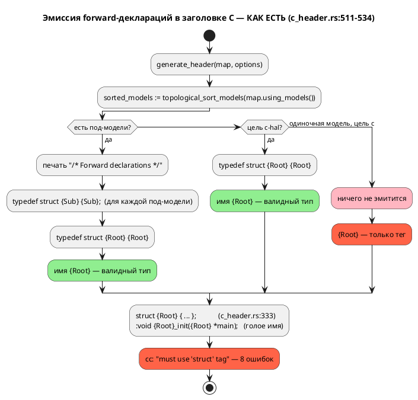
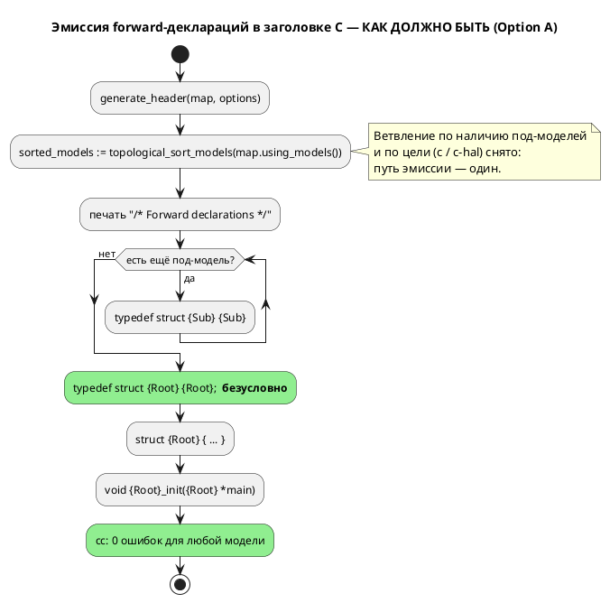

# Фича: Генератор C: typedef корневой структуры для одиночной модели

- **Номер:** 0026
- **Статус:** **ГОТОВО**
- **Зависит от:** **нет.** Фича автономна: правка локализована в одной ветке
  `grammar/src/generator/c/c_header.rs:511–534` и не требует ни изменений языка,
  ни готовности других фич. [адрес порта — размещение и потребление (карта адресов)](0020-port-address-decl.md) (цель `c-hal`),
  при работе над которой дефект был выявлен, **закрыта**, и её код — уже
  работающий образец решения. Обоснование и разбор смежных кандидатов по
  генератору C — в [анализе](0026-c-root-typedef.md#анализ), раздел
  «Зависимости фичи».
- **Приоритет:** **Tier 1 (высокий)** — см. раздел «Приоритет» ниже.
- **Связанные issue (анализ):** новая фича (из блока «Кандидаты в фичи»
  `FEATURES.md`; дефект найден попутно задачей
  [адрес порта — размещение и потребление (карта адресов)](0020-port-address-decl.md#разработка), раздел «Найденное попутно»).

## Стадии жизненного цикла (правило 17)

Все стадии — **разделы этой карточки** (правило 32): «Архитектура (ADR)»,
«Анализ», «Разработка», «Тест-план», «Отчёт о тестировании», «Итог».
Отдельным артефактом остаются только исправления —
[`docs/fixes/`](../fixes/README.md) (при необходимости `0026-YY-*`).

## Краткое описание

Генератор C не эмитит `typedef struct {Root} {Root};` для модели **без
под-моделей**, из-за чего порождённый код **не компилируется**: определение
структуры печатается тегом без typedef (`struct {Root} { … };`), а прототипы
объявлены через голое имя (`void {Root}_init({Root} *main);`). Фича делает
эмиссию typedef корня **безусловной** и сливает расходящиеся ветки целей `c` и
`c-hal` в один путь (в `c-hal` то же место уже исправлено локально задачей). Язык не меняется — правка целиком внутри генератора.

## Мотивация / контекст

Дефект делает цель `c` неработоспособной для **простейшего** класса моделей —
одиночной модели без под-моделей (именно так выглядит большинство фикстур
`grammar/tests/data/semantic/valid/`). Это прямо бьёт по основной цели проекта
(правило 12): синтез C из автоматной модели.

Дефект **предсуществующий**, и до сих пор его не поймали потому, что все пять
примеров `examples/*.lam`, на которых `precheck.sh` собирает порождённый C через
cmake/ninja, содержат под-модели — то есть попадают в **рабочую** ветку эмиссии.
[починка вычислителя выражений симулятора](0025-simulator-expression-eval.md) столкнулась с дефектом вплотную и
была вынуждена его **обойти**: фикстура сверки
`simulation/tests/data/eval/conformance_u8.lam` намеренно обёрнута в
`model Conf { … }` + `start Entry = Conf;`, и в самой фикстуре стоит комментарий,
что иначе порождённый C не компилируется.

## Объём

- Безусловная эмиссия `typedef struct {Root} {Root};` в
  `grammar/src/generator/c/c_header.rs` (одна ветка, ~10 строк).
- Слияние ветки цели `c` и локальной правки `c-hal` в **один** путь эмиссии —
  чтобы расхождение целей не воспроизвелось.
- Тесты: наличие typedef для одиночной модели; **фактическая компиляция**
  порождённого C компилятором `cc` (страховка от повторения класса дефекта);
  регресс multi-model и `c-hal`.

## Приоритет (правило 19 п.3)

**Tier 1 (высокий).** Аргументы:

1. **Класс дефекта — неработоспособность, а не неудобство.** Порождённый C для
   одиночной модели не компилируется вовсе (проба: **8 ошибок** `cc`), т.е. цель
   `c` не выполняет свою единственную задачу на целом классе входов.
2. **Цена исправления минимальна** — одна ветка условия, работающий образец уже
   есть в `c-hal`. Отношение «польза/затраты» — лучшее среди кандидатов по
   генератору C.
3. **Восстанавливает проверяемость.** Пока дефект жив, фикстуры сверки
   «симулятор ↔ C» обязаны нести обёртку-обход (как в 0025); после исправления они
   пишутся естественно.
4. **По правилу 19 п.4** аналитик ставит фичу выше прочих кандидатов по
   генератору C ([заглушки генератора C: диагностика вместо тихого пропуска](0028-c-generator-stubs.md) — заглушки,
   [генератор C: отображение типов Array/Bit/Rational](0029-c-type-mapping.md) — отображение типов): те расширяют
   корректность, эта — восстанавливает базовую работоспособность. Жёсткой
   зависимости между ними нет (разные функции и файлы).

## Риски / открытые вопросы

- **Изменение вывода `c` (предупреждение кандидата).** Подтверждено, но **строго
  ограничено**: меняется вывод **только** для файлов без под-моделей (+2 строки);
  вывод для моделей с под-моделями не затрагивается.
- **Находка: генерация C недетерминирована.** Порядок вариантов `enum` состояний
  и веток `switch` меняется **от запуска к запуску** на одном и том же входе
  (причина — `states: HashMap<String, StateNode>`, `semantic/mod.rs:101`).
  Побайтовые codegen-снапшоты, которые предлагал сверить кандидат, поэтому
  невозможны в принципе — проверки только структурные. Оформляется отдельным
  кандидатом (за границами 0026).
- **Обратная совместимость (правило 11):** правка **аддитивна** — добавление
  `typedef struct X X;` не ломает потребителей, пишущих `struct X`. Язык не
  меняется → версия языка остаётся **0.2.0** (правило 22).

> Фича зарегистрирована из блока «Кандидаты в фичи» `FEATURES.md`; далее проходит
> жизненный цикл по правилу 17.

<!-- При закрытии фичи (стадия 8, статус ГОТОВО) сюда добавляется раздел
     «## Итог (что сделано)» —
     ссылки на отчёт/исправления (правило 21). Незакрытые фичи «Итога» не имеют. -->

## Архитектура (ADR)

- **Status:** Accepted
- **Date:** 2026-07-15
- **Authors:** Архитектор + Аналитик
- **Related issues:** [Фича](0026-c-root-typedef.md); наследует
  локальную правку [адрес порта — размещение и потребление (карта адресов)](0020-port-address-decl.md#разработка)
  (цель `c-hal`, [ADR](0020-port-address-decl.md#архитектура-adr))

### Context

Цель `c` порождает **некомпилируемый** код для модели **без под-моделей**. Факты
собраны чтением кода и пробами на текущей ветке `v2`.

**Как устроена эмиссия сейчас** (`grammar/src/generator/c/c_header.rs:511–534`):

```rust
if !sorted_models.is_empty() {          // есть под-модели
    printer.print("/* Forward declarations */").nl();
    for element in &sorted_models { … typedef struct {Sub} {Sub}; … }
    typedef struct {Root} {Root};
} else if options.hal {                  // под-моделей нет, но цель c-hal
    typedef struct {Root} {Root};
}                                        // под-моделей нет, цель c → НИЧЕГО
```

Третья ветка (одиночная модель, цель `c`) не эмитит ничего. При этом:

- Определение структуры печатается **тегом без typedef**:
  `struct {Root} {` (`c_header.rs:333`), закрывается `};` (`c_header.rs:483`) —
  то есть имя `{Root}` само по себе типом **не становится**.
- Прототипы объявлены через **голое** имя: `void {Root}_init({Root} *main);`.

В C это противоречие: `{Root}` — тег структуры, а не имя типа, и обращаться к
нему без `struct` нельзя. Единственное, что делало голое имя типом в остальных
ветках, — как раз forward-`typedef`.

**Проба** (цель `c`, файл без под-моделей
`grammar/tests/data/semantic/valid/deterministic_transitions.lam`):

```c
struct DeterministicTransitions { … };                              /* тег, без typedef */
void DeterministicTransitions_init(DeterministicTransitions *main); /* ← ошибка */
```

```
$ cc -fsyntax-only deterministic_transitions.c
error: must use 'struct' tag to refer to type 'DeterministicTransitions'
… всего 8 ошибок (4 в .h + 4 в .c)
```

**Существенное уточнение к формулировке кандидата.** Кандидат в `FEATURES.md`
описывает симптом как «прототипы невалидны **как отдельный C**», что читается как
дефект оформления заголовка. На деле не компилируется **вся единица трансляции**:
`.c` включает свой `.h` и падает на тех же прототипах — цель `c` для одиночной
модели не даёт рабочего результата вообще.

**Почему дефект дожил до сих пор.** `precheck.sh` собирает порождённый C через
cmake/ninja, но **все пять** `examples/*.lam` содержат под-модели и попадают в
первую (рабочую) ветку. Фича упёрлась в дефект и **обошла** его: фикстура
`simulation/tests/data/eval/conformance_u8.lam` обёрнута в `model Conf { … }` +
`start Entry = Conf;` с комментарием в самой фикстуре — «для одиночной корневой
модели генератор не эмитит `typedef`, и порождённый C не компилируется (дефект
генератора, бэклог)».

Поток «как есть» — с ветвлением, породившим дефект:



### Decision Drivers

1. **Порождённый C обязан компилироваться.** Профиль проекта (правило 12) —
   синтез C из автоматной модели; некомпилируемый выход обесценивает цель `c`
   на целом классе входов.
2. **Устранить причину, а не симптом.** Дефект родился из того, что исправление
   применили к **одной** цели (`c-hal`), оставив вторую ветку. Пока путей два,
   расхождение воспроизведётся при следующей правке.
3. **Обратная совместимость (правило 11).** Работающий сегодня вывод (модели с
   под-моделями) меняться не должен; правка для одиночных моделей — аддитивная.
4. **Язык не затрагивается (правило 22).** Правка внутри генератора; синтаксис и
   семантика неизменны → версия языка **не растёт**.
5. **Пропорциональность.** Дефект стоит одной ветки условия; решение не должно
   переписывать генератор.

### Considered Options

#### Option A. Эмитировать typedef корня безусловно (слить ветки `c` и `c-hal`)

Ветвление убирается: секция forward-деклараций печатается **всегда**, под-модели
добавляются в неё, если есть; typedef корня эмитится в любом случае.

**Pros:**
- Устраняет дефект в его причине: путь эмиссии остаётся **один**, расхождение
  целей `c`/`c-hal` исчезает как класс (драйвер 2).
- Решение уже **проверено в бою**: та же строка работает в `c-hal` (проба —
  `cc -fsyntax-only` даёт **0 ошибок** на том же файле, что в `c` даёт 8).
- Минимальный диф (~10 строк), нулевой риск для multi-model: та ветка уже
  печатала typedef корня — её поведение сохраняется.
- Аддитивно для потребителей: `typedef struct X X;` не конфликтует с кодом,
  пишущим `struct X`.

**Cons:**
- Вывод `c` для одиночных моделей меняется (+2 строки) — требует пересмотра
  ожиданий в тестах (проверено: сегодня таких ожиданий нет).
- Вывод `c-hal` для одиночной модели получит строку `/* Forward declarations */`
  (косметика; существующие проверки `contains` не ломаются).

#### Option B. Печатать самотипизированные определения `typedef struct X { … } X;`

Отказаться от forward-деклараций, печатая определение сразу с typedef — как уже
делается для пользовательских структур (`c_header.rs:544`).

**Pros:**
- Одна конструкция вместо двух; для пользовательских структур форма уже принята.

**Cons:**
- **Ломает взаимные ссылки** — ровно то, ради чего forward-декларации введены
  (`c_header.rs:509–511`: «важно при взаимных ссылках»). Под-модель, ссылающаяся
  на тип, объявленный ниже, перестанет компилироваться.
- Меняет **работающий** вывод multi-model — против драйвера 3, риск несоразмерен
  масштабу дефекта.

#### Option C. Объявлять прототипы через тег: `void {Root}_init(struct {Root} *)`

Оставить отсутствие typedef, но всюду в прототипах и определениях писать `struct`.

**Pros:**
- Формально корректный C без единого typedef.

**Cons:**
- Меняет **публичный API** порождённого C для **всех** моделей, включая
  работающие сегодня: код потребителя `Root m; Root_init(&m);` перестаёт
  собираться. Это слом обратной совместимости (правило 11) ради дефекта, который
  чинится аддитивно.
- Противоречит уже закреплённой в `c-hal` конвенции (typedef + голое имя) —
  расхождение целей не исчезнет, а закрепится.
- Диф — по всему генератору (прототипы, определения, HAL), а не в одной ветке.

#### Option D. Ничего не менять, задокументировать ограничение

Признать одиночную модель неподдерживаемой для цели `c`, требуя обёртки в
`model` (как это сделала 0025).

**Pros:**
- Нулевой диф.

**Cons:**
- Оставляет цель `c` неработоспособной на простейшем классе входов и вынуждает
  каждого пользователя писать обёртку-ритуал без всякой семантической причины.
- Обход уже пришлось встроить в фикстуру 0025 — цена ограничения растёт с каждым
  новым потребителем.

### Decision

Принимается **Option A** — эмитировать `typedef struct {Root} {Root};`
**безусловно**, слив ветку цели `c` и локальную правку `c-hal` в один путь.

Обоснование: это единственный вариант, который чинит дефект **в его причине**
(два пути эмиссии вместо одного), не трогает работающий вывод multi-model
(драйвер 3), аддитивен для потребителей и уже подтверждён работой `c-hal`
(драйвер 1). Option B и C переписывают работающий вывод ради узкого дефекта
(против драйверов 3 и 5), Option D оставляет цель `c` сломанной.

Целевая структура ветки (`c_header.rs:511–534`): условие снимается, секция
печатается всегда, цикл по под-моделям исполняется столько раз, сколько их есть
(в том числе ноль), typedef корня печатается следом.

Поток «как должно быть»:



### Consequences

#### Положительные

- Цель `c` даёт компилируемый код для **любой** модели, включая одиночную.
- Расхождение целей `c`/`c-hal` устранено: один путь эмиссии, исправление невозможно
  применить «к половине».
- Фикстуры сверки «симулятор ↔ C» перестают нуждаться в обёртке-обходе (0025).
- Совместимость сохранена: multi-model вывод неизменен, правка аддитивна, версия
  языка остаётся **0.2.0**.

#### Отрицательные / Action items

- Вывод `c` для одиночных моделей меняется (+2 строки) — ожидаемо и желаемо;
  проверить, что ни один существующий тест не завязан на отсутствие typedef
  (проверено на стадии анализа: не завязан).
- Вывод `c-hal` для одиночной модели получит строку `/* Forward declarations */`
  — косметика, проверки `contains` не ломаются.
- **Закрыть класс дефекта тестом, а не глазами:** добавить проверку, которая
  **компилирует** порождённый C настоящим `cc` (по образцу
  `simulation/tests/conformance_c_tests.rs:141`, с проверкой на доступность `cc` —
  `cc_available()`, там же строка 65). Именно отсутствие такой проверки для
  одиночных моделей дало дефекту дожить.
- **Вне области ADR (передано в бэклог):** генерация C **недетерминирована** —
  порядок вариантов `enum` состояний и веток `switch` меняется от запуска к
  запуску (`states: HashMap<String, StateNode>`, `semantic/mod.rs:101`). Поэтому
  побайтовая сверка codegen-снапшотов, предложенная кандидатом, невозможна;
  проверки этого ADR — структурные.

#### Acceptance criteria

1. Для модели **без под-моделей** цель `c` эмитит `typedef struct {Root} {Root};`
   ровно **один** раз.
2. Порождённый целью `c` код для одиночной модели **компилируется**:
   `cc -std=c11 -fsyntax-only {root}.c` → 0 ошибок (сегодня — 8).
3. Вывод цели `c` для модели **с** под-моделями не изменился (структурный
   регресс: секция forward-деклараций и оба typedef на месте).
4. Цель `c-hal` не регрессирует: typedef корня по-прежнему ровно один, таблица
   адресов и принятый по умолчанию HAL на месте.
5. Путь эмиссии typedef корня в коде **один** (нет ветки, зависящей от
   `options.hal` или от наличия под-моделей).
6. Версия языка не изменилась (**0.2.0**): правка не затрагивает синтаксис и
   семантику (правило 22).

## Анализ

### Цель и контекст

Сделать эмиссию `typedef struct {Root} {Root};` в генераторе C **безусловной**,
чтобы порождённый код компилировался и для модели **без под-моделей**.
Архитектурное решение — [ADR](0026-c-root-typedef.md#архитектура-adr), Option A
(слить пути эмиссии целей `c` и `c-hal` в один).

Все утверждения ниже проверены на ветке `v2` чтением кода и пробами; ссылки на
строки актуальны на 2026-07-15.

#### Проверка исходного текста кандидата

Кандидат в `FEATURES.md` подтвердился **в главном** и разошёлся с фактами **в
двух местах** — обе расхождения ценны и учтены в требованиях.

| Утверждение кандидата | Статус | Факт |
|---|---|---|
| Для модели без под-моделей цель `c` не эмитит typedef корня | ✅ подтверждено | `c_header.rs:511–534`: ветка `else if options.hal` покрывает только `c-hal`; для цели `c` не эмитится ничего |
| В `c-hal` исправлено локально | ✅ подтверждено | `c_header.rs:525–534` с комментарием «Обычный режим `c` не трогаем (вывод байт-в-байт)» |
| Прототипы `{Root}_init({Root} *)` невалидны **как отдельный C** | **занижено** | Не компилируется **вся единица трансляции**, а не только заголовок: `cc -fsyntax-only {root}.c` → **8 ошибок** (4 в `.h` + 4 в `.c`, т.к. `.c` включает свой `.h`). Цель `c` для одиночной модели не даёт рабочего результата вообще |
| «Правка меняет вывод `c` → **сверить codegen-снапшоты**» | ❌ **неисполнимо и не нужно** | Codegen-снапшотов в проекте **нет** (`grep` по `insta`/`snapshot`/`assert_eq!(header` в `grammar/tests/codegen_tests.rs` — пусто; все 35 тестов структурные, через `contains`). И завести их **нельзя**: генерация **недетерминирована** — см. находку ниже. Область изменения вывода при этом узкая и точно очерчена: **только** файлы без под-моделей (+2 строки) |

#### Находка вне области фичи: генерация C недетерминирована

Пять запусков `lamc compile -t c` на **одном и том же** входе
(`grammar/tests/data/semantic/valid/deterministic_transitions.lam`) дали **разный**
порядок вариантов `enum` состояний в `.h` и веток `switch` в `.c`:

```
run 1: INIT, A, B, S, END
run 2: INIT, B, S, A, END
run 5: INIT, S, B, A, END
```

Причина — итерация по `states: HashMap<String, StateNode>`
(`grammar/src/semantic/mod.rs:101`): `std::collections::HashMap` рандомизирует
порядок обхода на каждый процесс. Семантически выводы эквивалентны (значения
`enum` согласованы внутри одной генерации), но **побайтово** воспроизводимость
отсутствует: сборки не воспроизводимы, а числовые значения состояний в ABI
«плавают» между сборками. `structs` рядом сортируются явно (`c_header.rs:540`) —
то есть проблема осознавалась точечно, но не системно.

**За границами 0026** (иначе фича из исправления одной ветки превращается в ревизию
генератора). Передаётся координатору как **отдельный кандидат** в `FEATURES.md`.
Для 0026 находка имеет одно прямое следствие: проверки — **только структурные**,
побайтовое сравнение запрещено как метод.

### Зависимости фичи (правило 17/19)

- **Зависит от:** **нет.**

  Проверено по контракту, коду и инфраструктуре:

  - **По коду.** Правка целиком внутри `generate_header`
    (`grammar/src/generator/c/c_header.rs:511–534`). Ни одна незакрытая фича этой
    ветки не касается.
  - **[адрес порта — размещение и потребление (карта адресов)](0020-port-address-decl.md) (`c-hal`) — закрыта.**
    Дефект найден попутно её задачей [адрес порта — размещение и потребление (карта адресов)](0020-port-address-decl.md#разработка),
    но зависимости не создаёт: её код (`c_header.rs:525–534`) — **готовый
    образец** решения, а не предпосылка. Скорее наоборот: 0026 доводит до конца
    правку, которую 0020-05 сознательно ограничила одной целью.
  - **[починка вычислителя выражений симулятора](0025-simulator-expression-eval.md) — закрыта.**
    Потребитель дефекта (обёртка в фикстуре сверки), не блокер.
  - **Смежные кандидаты по генератору C — пересечения нет:**
    [заглушки генератора C: диагностика вместо тихого пропуска](0028-c-generator-stubs.md) (заглушки) правит
    `generator/c/c_model.rs:316,769`; [генератор C: отображение типов Array/Bit/Rational](0029-c-type-mapping.md)
    (типы `Array`/`Bit`/`Rational`) правит `get_c_type`
    (`generator/c/mod.rs:150`). Разные файлы и функции; конфликта правок нет,
    порядок между ними свободен.
  - **Инфраструктура готова:** приём «скомпилировать порождённый C настоящим
    `cc`» уже реализован в `simulation/tests/conformance_c_tests.rs:141` с проверкой
    `cc_available()` (строка 65) — переиспользуется, новых зависимостей не
    добавляет.

- **Влияние на порядок разработки:** фича **никого не блокирует формально**, но
  по правилу 19 п.4 аналитик ставит её **первой среди кандидатов по генератору
  C** (0028, 0029): она восстанавливает базовую работоспособность цели `c`, тогда
  как те расширяют корректность; цена — одна ветка условия. Завершение 0026
  снимает необходимость обёртки-обхода в фикстурах сверки «симулятор ↔ C»
  (см. 0025) и делает доступным весь корпус одиночных моделей
  `grammar/tests/data/semantic/valid/` как материал для будущих C-проверок — что
  прямо повышает проверяемость. Статус `ЗАБЛОКИРОВАНА` **не** ставится:
  зависимостей нет.

### Требования и проверяемые условия

- **R1. Typedef корня эмитится безусловно.** Для модели **без под-моделей** цель
  `c` эмитит `typedef struct {Root} {Root};`. Сегодня не эмитит
  (`c_header.rs:511–534`).
- **R2. Порождённый C компилируется.** Для одиночной модели вывод цели `c`
  собирается компилятором C11 без ошибок. Сегодня — 8 ошибок
  `must use 'struct' tag to refer to type`.
- **R3. Ровно один typedef корня.** Ни в одной цели (`c`, `c-hal`) и ни при какой
  конфигурации (с под-моделями и без) `typedef struct {Root} {Root};` не
  дублируется.
- **R4. Регресс multi-model = 0.** Для модели **с** под-моделями структура вывода
  цели `c` не меняется: секция `/* Forward declarations */`, typedef каждой
  под-модели, typedef корня.
- **R5. Регресс `c-hal` = 0.** Цель `c-hal` сохраняет typedef корня, таблицу
  адресов (`{Root}_PortBinding`) и принятый по умолчанию HAL (`{Root}_bind_default_hal`).
  Допускается **единственное** отличие — добавление строки
  `/* Forward declarations */` (косметика).
- **R6. Путь эмиссии один (причина дефекта устранена).** В коде не остаётся
  ветки, которая эмитит typedef корня в зависимости от `options.hal` или от
  наличия под-моделей.
- **R7. Язык не меняется.** Синтаксис и семантика не затронуты → версия языка
  остаётся **0.2.0** (правило 22); мигратор и документация языка не нужны.
- **R8. Проверки структурные.** Ни одна проверка фичи не опирается на побайтовое
  равенство порождённого C (генерация недетерминирована — см. находку выше).

### Критерии приёмки и способ проверки

| # | Критерий | Способ проверки |
|---|---|---|
| A1 | Одиночная модель, цель `c` → в `.h` ровно один `typedef struct {Root} {Root};` | Новый тест в `grammar/tests/codegen_tests.rs`: `matches(...).count() == 1` на выводе `generate_h_content` (R1, R3) |
| A2 | Порождённый C одиночной модели компилируется | Новый тест: `cc -std=c11 -fsyntax-only {root}.c` → статус 0, `stderr` без `error:`; проверка `cc_available()` по образцу `simulation/tests/conformance_c_tests.rs:65,141` (R2) |
| A3 | Multi-model вывод не изменился | Существующий `test_header_has_forward_declarations` (`codegen_tests.rs:547`) остаётся зелёным без правок (R4) |
| A4 | `c-hal` не регрессировал | Существующие `c_hal_emits_address_table_and_hal` (`codegen_tests.rs:1103`), `plain_c_has_no_hal_artifacts` (`codegen_tests.rs:1141`) зелёные; + проверка «ровно один typedef» для `c-hal` одиночной модели (R3, R5) |
| A5 | В коде один путь эмиссии | Ревью дифа + `grep -n "options.hal" grammar/src/generator/c/c_header.rs` — не должно остаться ветки, проверяющей typedef корня (R6) |
| A6 | Регресса по проекту нет | `cargo test -- --test-threads=1` (база: 35 тестов `codegen_tests` зелёные) + `cargo test --features lsp -- --test-threads=1` (R4, R5) |
| A7 | Живая проверка на реальном файле | `lamc compile -t c grammar/tests/data/semantic/valid/deterministic_transitions.lam` → в `.h` есть typedef; `cc -fsyntax-only` на `.c` → 0 ошибок (было 8) (R1, R2) |
| A8 | Версия языка не изменилась | `grep "Версия языка" README.md` → **0.2.0**; в дифе нет `grammar.lalrpop`, `lexer.rs`, `parser/ast.rs`, `semantic/` (R7) |
| A9 | `precheck.sh` проходит целиком | `./scripts/precheck.sh` — включая сборку порождённого C примеров через cmake/ninja (R4) |

### Особенности по обратной функциональности

**Правило 11 — обратная совместимость сохраняется полностью; обоснование слома
не требуется.**

- **Язык (`.lam`).** Не затронут: правка внутри генератора, ни один `.lam`-файл
  не меняет смысла и не требует миграции. Версия языка — **0.2.0** без изменений
  (правило 22).
- **Порождённый C — API потребителя.** Правка **аддитивна**: добавление
  `typedef struct X X;` **расширяет** множество способов записать тип, не отменяя
  прежних. Код, написанный против сегодняшнего вывода (`struct X m;
  X_init(&m);`), продолжает компилироваться — тег `struct X` остаётся валидным
  наравне с новым голым именем. Обратное (Option C в ADR) сломало бы всех
  потребителей — потому и отвергнуто.
- **Модели с под-моделями.** Вывод не меняется вовсе: эта ветка уже печатала
  typedef корня.
- **Модели без под-моделей.** Вывод меняется (+2 строки), но **в сторону
  работоспособности**: то, что не компилировалось, начинает компилироваться.
  Потребителей у неработающего вывода быть не может — ломать нечего.
- **Цель `c-hal`.** Поведение сохраняется; единственное отличие — косметическая
  строка `/* Forward declarations */`. Проверки `contains` не затрагиваются.
- **Тесты и фикстуры.** Проверено: **ни один** из 35 тестов `codegen_tests.rs` не
  утверждает **отсутствие** typedef; `plain_c_has_no_hal_artifacts`
  (`codegen_tests.rs:1141`) проверяет лишь отсутствие `PortBinding`/
  `bind_default_hal`. Обёртка в фикстуре
  `simulation/tests/data/eval/conformance_u8.lam` после исправления становится
  **необязательной**, но остаётся валидной — снимать её в рамках 0026 не
  требуется (тест проверяет сверку значений, а не форму фикстуры); достаточно
  обновить комментарий фикстуры, чтобы он не дезинформировал.

### Риски и зависимости

| Риск | Оценка | Снижение |
|---|---|---|
| Правка меняет вывод `c` и ломает ожидания тестов | **Низкий** — проверено: тестов, завязанных на отсутствие typedef, нет; меняется только ветка без под-моделей | A3, A4, A6: полный прогон + существующие тесты остаются без правок |
| Дублирование typedef (корень уже объявлен как под-модель) | **Низкий** — при отсутствии под-моделей коллизии нет по построению; в multi-model ветка не меняется | A1, A4: подсчёт вхождений `== 1`, а не `contains` |
| Пользовательская структура названа как корневая модель → конфликт typedef | **Очень низкий** — предсуществующее поведение (`c_header.rs:544` печатает `typedef struct {Имя} {…} {Имя};`), фича его не ухудшает; multi-model уже эмитит typedef корня и живёт с этим | За границами 0026; при обнаружении — отдельный кандидат (диагностика коллизии имён) |
| Повторное расхождение целей `c`/`c-hal` при будущей правке | **Средний** — именно так и возник дефект | R6/A5: путь эмиссии остаётся **один**; ветка по `options.hal` для typedef снимается физически |
| Дефект того же класса в другом месте генератора остаётся незамеченным | **Средний** — прямая причина, по которой дефект дожил: `cc` ни разу не звали на одиночной модели | A2: тест **компилирует** порождённый C настоящим `cc`; отсутствие `cc` не валит прогон (проверка `cc_available()`) |
| В CI нет компилятора C → проверка A2 «тихо» пропускается | **Низкий** — `precheck.sh` уже собирает C примеров через cmake/ninja (A9), т.е. компилятор в рабочем окружении есть | Проверка по образцу; A9 остаётся независимой страховкой |
| Недетерминизм генерации мешает проверкам | **Снят** — проверки структурные (R8), побайтовые сравнения не применяются | Находка передана отдельным кандидатом |

### Подзадачи разработки

**Достаточно одной подзадачи.** Объём — одна ветка условия (~10 строк) плюс
тесты; дробить нечего, а связывать исправление с тестом, который его же и доказывает,
в разные задачи вредно (тест на компиляцию `cc` — единственное, что отличает эту
фичу от «поправили и поверили»).

| Задача | Файл | Содержание |
|---|---|---|
| **0026-01** | [`0026-c-root-typedef.md#разработка`](0026-c-root-typedef.md#разработка) | Безусловная эмиссия typedef корня (слияние путей `c`/`c-hal`, `c_header.rs:511–534`); тесты A1/A2/A4; обновление комментария-обхода в фикстуре `conformance_u8.lam` |

За границами фичи (передаётся координатору в `FEATURES.md` как **новый
кандидат**): **недетерминизм генерации C** — порядок `enum` состояний и веток
`switch` плавает от запуска к запуску (`states: HashMap<String, StateNode>`,
`grammar/src/semantic/mod.rs:101`). Следствия: невоспроизводимые сборки, «плавающие»
числовые значения состояний в ABI между сборками, принципиальная невозможность
codegen-снапшотов. Лечится переходом на `BTreeMap` либо явной сортировкой перед
эмиссией (как уже сделано для `structs`, `c_header.rs:540`).

## Разработка

### Задача

> **Статус: Планируется (разработка не начата).** Раздел «Что было» —
> зафиксированное состояние кода на 2026-07-15 (ветка `v2`, проверено чтением и
> пробами). Разделы «Что сделано» и «Проверки» — **план предстоящей работы**, а
> не отчёт; заполняются по факту выполнения.

#### Что было

Состояние на 2026-07-15, ветка `v2` (все ссылки на строки проверены).

##### Дефект

`grammar/src/generator/c/c_header.rs:511–534`, функция `generate_header` —
эмиссия forward-деклараций разветвлена на три случая:

```rust
if !sorted_models.is_empty() {          // (1) есть под-модели
    printer.print("/* Forward declarations */").nl();
    for element in &sorted_models { … typedef struct {Sub} {Sub}; … }   // :518
    let root_struct = map.root_name().unique_camelcase();
    printer.print(&format!("typedef struct {0} {0};", root_struct)).nl(); // :522
} else if options.hal {                  // (2) под-моделей нет, цель c-hal
    let root_struct = map.root_name().unique_camelcase();
    printer.print(&format!("typedef struct {0} {0};", root_struct)).nl(); // :531
}                                        // (3) под-моделей нет, цель c → НИЧЕГО
```

Комментарий ветки (2), `c_header.rs:526–528`, фиксирует, что правку 0020-05
намеренно ограничили целью `c-hal`: «Обычный режим `c` не трогаем (вывод
байт-в-байт)». Ветка (3) — источник дефекта.

Сопутствующие факты:

- `c_header.rs:333` — структура модели печатается **тегом без typedef**:
  `struct {Root} {`; закрывается `};` (`c_header.rs:483`). Голое имя `{Root}`
  становится типом **только** благодаря forward-`typedef`.
- Прототипы печатаются через голое имя: `void {Root}_init({Root} *main);`.
- `c_header.rs:540` — пользовательские структуры перед эмиссией **явно
  сортируются** (`structs.sort_by_key`), а состояния — нет (см. «Находка»).

##### Воспроизведение (проба выполнена)

```sh
cargo build --bin lamc
./target/debug/lamc compile -t c \
  grammar/tests/data/semantic/valid/deterministic_transitions.lam -o /tmp/out
```

Порождённый `/tmp/out/deterministic_transitions.h` — **без** typedef:

```c
struct DeterministicTransitions { … };
void DeterministicTransitions_init(DeterministicTransitions *main);
```

```
$ cc -fsyntax-only deterministic_transitions.c
error: must use 'struct' tag to refer to type 'DeterministicTransitions'
… 8 ошибок (4 в .h + 4 в .c)
```

Та же модель целью `-t c-hal` → `cc -fsyntax-only` даёт **0 ошибок**: ветка (2)
эмитит typedef. Это и есть эталон целевого поведения.

##### Почему не поймано до сих пор

- Все **пять** `examples/*.lam`, на которых `precheck.sh` собирает C через
  cmake/ninja, содержат под-модели → попадают в ветку (1). Проверено: в каждом
  порождённом `.h` typedef присутствует (2–10 вхождений).
- `simulation/tests/data/eval/conformance_u8.lam` — единственное место, где
  порождённый C реально компилируется тестом (`conformance_c_tests.rs:141`), —
  **обходит** дефект: модель намеренно обёрнута в `model Conf { … }` +
  `start Entry = Conf;`. В самой фикстуре стоит комментарий: «для **одиночной**
  корневой модели генератор не эмитит `typedef`, и порождённый C не
  компилируется (дефект генератора, бэклог)».
- Ни один из **35** тестов `grammar/tests/codegen_tests.rs` (все зелёные) не
  вызывает `cc` и не проверяет одиночную модель на наличие typedef.

##### Находка, зафиксированная при разборе (вне области задачи)

Генерация C **недетерминирована**: пять запусков на одном входе дали разный
порядок вариантов `enum` состояний и веток `switch` (причина — итерация по
`states: HashMap<String, StateNode>`, `grammar/src/semantic/mod.rs:101`).
Следствие для задачи: **проверки только структурные**, побайтовое сравнение
вывода как метод исключено. Сама находка — отдельный кандидат в `FEATURES.md`
(передана координатору), в 0026-01 **не** чинится.

#### Что сделано

> **Планируется (разработка не начата).** Ниже — план работ по
> [ADR](0026-c-root-typedef.md#архитектура-adr), Option A.

##### 1. Слияние путей эмиссии (`grammar/src/generator/c/c_header.rs:511–534`)

Ветвление снимается: секция forward-деклараций печатается **всегда**, цикл по
под-моделям исполняется столько раз, сколько их есть (в том числе ноль), typedef
корня печатается **безусловно**. Ветка `else if options.hal` удаляется — цель
`c-hal` получает typedef тем же общим путём (R1, R3, R6).

Ожидаемая форма:

```rust
printer.print("/* Forward declarations */").nl();
for element in &sorted_models { … typedef struct {Sub} {Sub}; … }
let root_struct = map.root_name().unique_camelcase();
printer.print(&format!("typedef struct {0} {0};", root_struct)).nl();
printer.nl();
```

##### 2. Тесты (`grammar/tests/codegen_tests.rs`)

- **Наличие и единственность** typedef корня для одиночной модели, цель `c`:
  счёт вхождений `== 1` (не `contains` — иначе дубль пройдёт незамеченным).
  Критерий A1, проверки T1, T7.
- **Компиляция порождённого C** настоящим `cc -std=c11 -fsyntax-only` — главная
  проверка задачи (A2, T2, T3). Вызов через `std::process::Command` по образцу
  `simulation/tests/conformance_c_tests.rs:141`, с проверкой доступности `cc`
  (`cc_available()`, там же строка 65): без `cc` тест пропускается, а не падает.
- **Регресс `c-hal`:** typedef корня ровно один после слияния путей (T7).

##### 3. Фикстура-обход 0025 (`simulation/tests/data/eval/conformance_u8.lam`)

Комментарий фикстуры, объясняющий обёртку ссылкой на дефект, **обновляется**
(иначе он дезинформирует: дефекта больше нет). Сама обёртка **остаётся** — тест
проверяет сверку значений, а не форму фикстуры; снятие обёртки — лишний риск в
рамках исправления генератора.

##### Статус по обратной функциональности (правило 11)

| Функциональность | Статус плана |
|---|---|
| Цель `c`, одиночная модель | **Чинится** — из некомпилируемого вывода в компилируемый (+2 строки) |
| Цель `c`, модель с под-моделями | **Не затрагивается** — ветка (1) уже печатала typedef корня; поведение сохраняется |
| Цель `c-hal` | **Не регрессирует** — typedef приходит общим путём; допустимое отличие: +строка `/* Forward declarations */` (косметика) |
| Генератор PlantUML | **н/п** — правка внутри `generator/c/c_header.rs` |
| Язык `.lam` | **н/п** — синтаксис и семантика не затронуты; версия языка остаётся **0.2.0** (правило 22), мигратор и правка документации языка не нужны |
| Симуляция / сверка «симулятор ↔ C» | **Не регрессирует** — `conformance_c_tests.rs` остаётся зелёным; обёртка в фикстуре становится необязательной |
| LSP | **н/п** — не затронут; прогон с `--features lsp` как страховка |

#### Проверки

> **Планируется (разработка не начата).** Условия и ожидаемые результаты
> согласованы с [тест-планом](0026-c-root-typedef.md#тест-план) (T1–T14) и
> критериями [анализа](0026-c-root-typedef.md#анализ) (A1–A9).

##### Порядок проверки исправления (обязателен)

Тест на компиляцию (T2) сначала прогоняется на коде **до** исправления и обязан
**упасть** (зафиксировано: 8 ошибок `must use 'struct' tag`), затем — после
исправления и обязан **пройти**. Тест, зелёный до и после, дефект этого класса не
удержит — именно так дефект и дожил до 0026.

##### Команды (правило 5)

```sh
cargo build --bin lamc
cargo test --test codegen_tests -- --test-threads=1   # база до фичи: 35 зелёных
cargo test -- --test-threads=1                        # полный прогон (A6, T11)
cargo test --features lsp -- --test-threads=1         # включая LSP (A6, T12)
./scripts/precheck.sh                                 # fmt + clippy + сборка C примеров (A9, T13)
```

##### Живая проверка (A7, T14)

```sh
./target/debug/lamc compile -t c \
  grammar/tests/data/semantic/valid/deterministic_transitions.lam -o /tmp/out
grep -c "typedef struct DeterministicTransitions" /tmp/out/deterministic_transitions.h  # ожидается 1
cd /tmp/out && cc -std=c11 -fsyntax-only deterministic_transitions.c                    # ожидается 0 ошибок (было 8)
cc -std=c11 -fsyntax-only -x c deterministic_transitions.h                              # заголовок самодостаточен (T3)
```

##### Ревью дифа (A5, A8; T9, T10)

- `grep -n "options.hal" grammar/src/generator/c/c_header.rs` — не должно
  остаться ветки, проверяющей typedef корня по цели (R6).
- В дифе **нет** `grammar.lalrpop`, `parser/lexer.rs`, `parser/ast.rs`,
  `semantic/` — подтверждение, что язык не затронут; `README.md` → «Версия языка:
  0.2.0» без изменений (правило 22).

##### Ожидаемый итог

- T1–T3, T7, T14 — новые/живые проверки: зелёные (были бы красными до исправления).
- T4–T6, T8, T11–T13 — регресс: зелёные **без правок существующих тестов**
  (`test_header_has_forward_declarations` `codegen_tests.rs:547`,
  `c_hal_emits_address_table_and_hal` `:1103`, `plain_c_has_no_hal_artifacts`
  `:1141`). Необходимость править существующий тест = сигнал о незапланированном
  изменении поведения, требующий возврата к анализу.

## Тест-план

### Область и цель

Проверяем, что генератор C эмитит `typedef struct {Root} {Root};` **безусловно**
и порождённый код **компилируется** для любой модели — включая одиночную
(без под-моделей), на которой сегодня цель `c` даёт 8 ошибок компиляции.
Покрываются требования **R1–R8** и критерии **A1–A9**
[анализа](0026-c-root-typedef.md#анализ).

**Фича затрагивает генератор, а не язык** (синтаксис и семантика неизменны,
версия языка **0.2.0**, R7). Поэтому по правилу 16 проверки корректности
компилятора ставятся не на разбор `.lam`, а на **пригодность порождённого
артефакта**: главный тест фичи — порождённый C **собирается настоящим `cc`**
(T2). Примеры и контрпримеры — в разделе «Примеры и контрпримеры» ниже: они
описаны на языке `.lam` (вход) и на C (ожидаемый выход), поскольку именно пара
«модель → её C» и есть проверяемый контракт.

**Метод проверок — только структурный** (R8): побайтовое сравнение вывода
запрещено, так как генерация C недетерминирована (порядок `enum` состояний и
веток `switch` плавает от запуска к запуску — находка анализа). Проверки
формулируются как «содержит / количество вхождений / компилируется».

### Проверки (условие → ожидаемый результат)

| # | Проверка | Предусловие | Ожидаемый результат | Ссылка на R/A |
|---|---|---|---|---|
| T1 | Typedef корня для одиночной модели | Модель без под-моделей, цель `c` (`generate_h_content(src, "Demo")`) | В `.h` есть `typedef struct Demo Demo;`, вхождений — **ровно 1** | R1, R3 / A1 |
| T2 | **Порождённый C компилируется** (главная проверка фичи) | Модель без под-моделей, цель `c`, доступен `cc` (проверка `cc_available()`) | `cc -std=c11 -fsyntax-only {root}.c` → код возврата 0, в `stderr` нет `error:`. **Контрольная точка:** до исправления — 8 ошибок `must use 'struct' tag` | R2 / A2 |
| T3 | Заголовок самодостаточен | Тот же вывод, что в T2 | `cc -std=c11 -fsyntax-only -x c {root}.h` → 0 ошибок (заголовок валиден и в отрыве от `.c`) | R2 / A2 |
| T4 | Регресс multi-model | Модель с под-моделью (`model Sub …; start Main = Sub …`), цель `c` | Секция `/* Forward declarations */` на месте; `typedef struct System System;` и `typedef struct SystemSub SystemSub;` присутствуют; существующий `test_header_has_forward_declarations` (`codegen_tests.rs:547`) зелёный **без правок** | R4 / A3 |
| T5 | Порождённый C multi-model компилируется | Модель с под-моделью, цель `c`, доступен `cc` | `cc -std=c11 -fsyntax-only` → 0 ошибок (работавшее продолжает работать) | R4 / A3 |
| T6 | Регресс `c-hal`: артефакты HAL | Модель с портом и адресом, цель `c-hal` | `{Root}_PortBinding` и `{Root}_bind_default_hal` на месте; `c_hal_emits_address_table_and_hal` (`codegen_tests.rs:1103`) зелёный | R5 / A4 |
| T7 | `c-hal`: typedef корня не задвоился | Одиночная модель, цель `c-hal` | `typedef struct {Root} {Root};` — вхождений **ровно 1** (слияние путей не создало дубля) | R3, R5 / A4 |
| T8 | Цель `c` по-прежнему не эмитит HAL | Одиночная модель с портом, цель `c` | Нет `PortBinding`, нет `bind_default_hal`; `plain_c_has_no_hal_artifacts` (`codegen_tests.rs:1141`) зелёный | R5 / A4 |
| T9 | Путь эмиссии один (причина устранена) | Диф задачи | `grep -n "options.hal" grammar/src/generator/c/c_header.rs` не показывает ветки, проверяющей typedef корня; ревью подтверждает единственный путь | R6 / A5 |
| T10 | Язык не изменился | Диф задачи | В дифе нет `grammar.lalrpop`, `parser/lexer.rs`, `parser/ast.rs`, `semantic/`; `README.md` → «Версия языка: 0.2.0» без изменений | R7 / A8 |

#### Сквозные прогоны (регресс проекта)

| # | Проверка | Ожидаемый результат | Ссылка |
|---|---|---|---|
| T11 | `cargo test -- --test-threads=1` | Все зелёные; база `codegen_tests` — **35** тестов до фичи, +N новых после | A6 |
| T12 | `cargo test --features lsp -- --test-threads=1` | Все зелёные | A6 |
| T13 | `./scripts/precheck.sh` | Проходит целиком, включая сборку C примеров через cmake/ninja | A9 |
| T14 | Живая проверка на реальном файле корпуса | `lamc compile -t c grammar/tests/data/semantic/valid/deterministic_transitions.lam` → typedef в `.h`; `cc -fsyntax-only` на `.c` → **0 ошибок** (зафиксировано «до»: 8) | A7 |

### Примеры и контрпримеры (правило 16)

Правило 16 требует примеры и контрпримеры. Контракт фичи — «модель → её C»,
поэтому примеры даны парами: вход `.lam` и проверяемое свойство выхода.

#### Пример 1 — одиночная модель (на котором дефект проявляется)

Вход (реальный файл корпуса, `grammar/tests/data/semantic/valid/deterministic_transitions.lam`):

```lam
var flag: bit := 0;
start S {
    ref A: flag;
    ref B: !flag;
}
state A {}
state B {}
```

Ожидаемый выход `-t c` (`.h`) — **после** исправления:

```c
/* Forward declarations */
typedef struct DeterministicTransitions DeterministicTransitions;

struct DeterministicTransitions { … };
void DeterministicTransitions_init(DeterministicTransitions *main);
```

Свойство: компилируется (T2, T3). **Зафиксированное «до»:** typedef отсутствует
→ `cc` даёт 8 ошибок `must use 'struct' tag to refer to type`.

#### Пример 2 — модель с под-моделью (работающий сегодня)

```lam
model Sub { start Init; state End; }
start Main = Sub { next Done; }
state Done;
```

Свойство: вывод **не меняется** — секция forward-деклараций и оба typedef
(`System`, `SystemSub`) на месте (T4), C компилируется (T5).

#### Пример 3 — одиночная модель, цель `c-hal` (эталон решения)

```lam
type u8 = [bit;8];
in BTN: u8 := 0x00200000;
start Idle { ref On: BTN; }
state On;
```

Свойство: typedef корня ровно один (T7), артефакты HAL на месте (T6). Этот
класс **уже** компилируется сегодня (проба: `cc -fsyntax-only` → 0 ошибок) — он
и служит эталоном того, каким должен стать вывод цели `c`.

#### Контрпример 1 — вывод без typedef (регресс R1/R2)

```c
struct Demo { … };
void Demo_init(Demo *main);   /* ← Demo — тег, а не тип */
```

Должен **отвергаться** проверкой T2: `cc` обязан дать `error: must use 'struct'
tag to refer to type 'Demo'`. Это ровно сегодняшний вывод цели `c` — тест T2
обязан падать на коде **до** исправления (иначе он ничего не проверяет).

#### Контрпример 2 — задвоенный typedef (регресс R3)

```c
typedef struct Demo Demo;
typedef struct Demo Demo;   /* ← дубль */
```

Должен **отвергаться** проверками T1/T7: счёт вхождений строго `== 1`, а не
`contains`. Именно поэтому проверки считают вхождения: `contains` пропустил бы
дубль, который в C99 — ошибка переопределения typedef.

#### Контрпример 3 — исправление применён к одной цели (причина дефекта, R6)

Ветка `else if options.hal { … }`, эмитящая typedef только для `c-hal`, —
исходная причина дефекта. Должна **отсутствовать** после исправления: T9.

### Разбивка проверок по функциональности

Единые условия и ожидаемые результаты прогоняются против каждой задеваемой
обратной функциональности (правило 11); фиксируется статус.

| Функциональность | Проверки | Ожидание | Статус |
|---|---|---|---|
| Цель `c`, одиночная модель (**чинится**) | T1, T2, T3, T14 | Было: не компилируется (8 ошибок). Стало: компилируется | ⬜ |
| Цель `c`, модель с под-моделями (**не трогаем**) | T4, T5 | Вывод и поведение без изменений | ⬜ |
| Цель `c-hal` (**не регрессирует**) | T6, T7, T8 | Артефакты HAL на месте, typedef ровно один; допустимо +строка `/* Forward declarations */` | ⬜ |
| Генератор PlantUML | — | Не применимо: правка внутри `generator/c/c_header.rs` | — |
| Язык `.lam` (синтаксис/семантика) | T10 | Не применимо по существу: правка в генераторе; версия языка **0.2.0** без изменений (правило 22) | — |
| Симуляция и сверка «симулятор ↔ C» | T11 | `conformance_c_tests.rs` зелёный; обёртка в фикстуре становится необязательной, но остаётся валидной | ⬜ |
| LSP | T12 | Не затронут; прогон как страховка от регресса | ⬜ |

<!-- Легенда: ✅ пройдено · ❌ провалено · ⬜ не проверялось · — не применимо -->

### Тестовые данные и окружение

**Данные:**

- `grammar/tests/data/semantic/valid/deterministic_transitions.lam` — реальный
  файл корпуса, воспроизводящий дефект (T14). Новых фикстур `.lam` фича не
  требует: класс «одиночная модель» в корпусе представлен широко.
- Исходники тестов — инлайн-строки в `grammar/tests/codegen_tests.rs` по образцу
  существующих тестов (`generate_h_content`, `codegen_tests.rs:518`;
  `read_header`, `codegen_tests.rs:1091`).
- `simulation/tests/data/eval/conformance_u8.lam` — фикстура с обёрткой-обходом;
  проверяется, что после исправления её тест остаётся зелёным (T11).

**Окружение:**

- Тесты — однопоточно: `cargo test -- --test-threads=1` (гонки за общие файлы).
- Компиляция порождённого C — `cc -std=c11`, вызов через `std::process::Command`
  по образцу `simulation/tests/conformance_c_tests.rs:141`; **проверка**
  `cc_available()` (там же, строка 65) — при отсутствии `cc` тест
  пропускается, а не падает.
- Живые пробы — `./target/debug/lamc` (`cargo build --bin lamc`).
- Проверено при подготовке плана: база `codegen_tests` — **35** тестов, все
  зелёные; `cc` в окружении разработки доступен (Apple clang, darwin).

**Порядок проверки исправления (важно):** T2 сначала прогоняется на коде **до** исправления
и обязан **упасть** (8 ошибок), затем — после исправления и обязан **пройти**. Тест,
зелёный до и после, дефект этого класса не удержит.

## Отчёт о тестировании

### Резюме

Фича **готова к закрытию (ГОТОВО)**. Эмиссия `typedef struct {Root} {Root};`
сделана **безусловной**; расходившиеся ветки целей `c` и `c-hal` слиты в **один**
путь. Правка целиком внутри `generator/c/c_header.rs` (одна ветка); язык не
менялся, версия крейта не поднималась.

**Дефект был реален и воспроизведён до правки:** одиночная модель без под-моделей
давала **8 ошибок** `cc` (`must use 'struct' tag to refer to type`). После правки
— **0 ошибок** на четырёх фикстурах этого класса, обеими целями (`c` и `c-hal`).

**Прогоны** (`cargo test -- --test-threads=1`, окружение: macOS 15 (darwin 25.5),
Rust stable, Apple `cc`): **1621 тест зелёный**, 6 ignored; `precheck.sh` = 0;
clippy по `c_header.rs` — без предупреждений.

### Фактические результаты по тест-плану

| # | Проверка | Результат | Комментарий |
|---|---|---|---|
| T1 | Typedef корня для одиночной модели, ровно 1 вхождение | ✅ | `test_single_model_without_submodels_gets_root_typedef` |
| T2 | **Порождённый C компилируется** (главная) | ✅ | `test_single_model_generates_compilable_c` — живой вызов `cc`, проверка `cc_available()`. **Проверено, что тест ловит дефект:** на откаченной правке он падает с теми самыми `must use 'struct' tag` |
| T3 | Голое имя корня — тип; typedef предшествует прототипу | ✅ | `test_root_name_is_usable_as_type_in_prototypes` |
| T4 | Модель с под-моделями не сломана, typedef не задвоен | ✅ | `test_model_with_submodels_still_has_exactly_one_root_typedef` |
| R3 | Регресс вывода для моделей с под-моделями | ✅* | нормализованная сверка (ниже) |

\* **R3: байт-в-байт неприменим** — генерация C недетерминирована по порядку
(`HashMap` в `semantic/mod.rs`), это предсуществующее свойство и отдельный
кандидат. Сверка **нормализованная** (сортировка строк) по всем пяти
`examples/*.lam`: `comprehensive`, `elevator`, `elevator_mini`, `stacker` —
идентичны; `extend_complex` дал расхождение **того самого недетерминизма** (у
последнего варианта `enum` нет запятой, а кто последний — меняется от прогона к
прогону), а не смысловое. Typedef-строки во всех файлах идентичны, изменилось
лишь их положение.

### Живая проверка

```
deterministic_transitions  c      cc: 0 ошибок   (до правки — 8)
deterministic_transitions  c-hal  cc: 0 ошибок
simple_fsm                 c      cc: 0 ошибок
simple_fsm                 c-hal  cc: 0 ошибок
conditions                 c      cc: 0 ошибок
conditions                 c-hal  cc: 0 ошибок
array_access               c      cc: 0 ошибок
array_access               c-hal  cc: 0 ошибок
```

Обе цели дают одинаковый результат — что и было целью слияния веток.

### Почему дефект дожил до сих пор

Все пять `examples/*.lam`, на которых `precheck.sh` собирает порождённый C через
cmake/ninja, **содержат под-модели** — то есть попадали в рабочую ветку эмиссии.
Простейший класс моделей (одиночная, как большинство фикстур
`tests/data/semantic/valid/`) живой проверкой **не покрывался вовсе**. Фича
столкнулась с дефектом вплотную и была вынуждена его **обойти**: фикстура сверки
`conformance_u8.lam` намеренно обёрнута в `model Conf { … }`.

Отсюда вывод, важнее самой правки: **дыра была не в коде, а в покрытии живой
проверки**. Поэтому T2 — живой вызов `cc`, а не снапшот: снапшот зафиксировал бы
невалидный C ровно так же охотно, как валидный.

### Сделано попутно

Комментарий фикстуры `conformance_u8.lam` **устарел и лгал** («порождённый C не
компилируется») — актуализирован. Сама обёртка сохранена намеренно:
разворачивание сменило бы имена символов C (`Conf` → корень), а с ними и ожидания
сверки 0025, ничего не проверив сверх.

### Ограничения

| # | Ограничение |
|---|---|
| **О1** | **Недетерминизм генерации C не лечится** этой фичей — он предсуществующий и остаётся отдельным кандидатом (`FEATURES.md`). Из-за него R3 проверен нормализованно, а не байт-в-байт |
| **О2** | Живая проверка одиночных моделей есть теперь в юнит-тесте (T2), но **не** в `precheck.sh`: там по-прежнему собираются только `examples/*.lam`, все с под-моделями. Класс покрыт тестом, но не предкоммит-проверкой |

### Вердикт

**ГОТОВО.** R1, R2, R3 выполнены; фича разблокирует
[генератор C: отображение типов Array/Bit/Rational](0029-c-type-mapping.md) — её критерий «порождённый C
компилируется» до сих пор был недостижим в принципе.

## Итог (что сделано)

В крейте `grammar` эмиссия `typedef struct {Root} {Root};` сделана **безусловной**
(`generator/c/c_header.rs`), а расходившиеся ветки целей `c` и `c-hal` слиты в
**один** путь — расхождение целей и было причиной того, что `c-hal` работал, а
`c` нет. Язык не менялся, версия крейта не поднималась; крейт `simulation` не
затронут.

**Живая проверка:** одиночная модель без под-моделей давала **8 ошибок** `cc`
(`must use 'struct' tag`) — теперь **0**, на четырёх фикстурах и обеими целями.
Тест T2 вызывает настоящий `cc`, и проверено, что он **ловит дефект**: на
откаченной правке падает. 1621 тест зелёный, `precheck.sh` = 0.

**Ключевой вывод — дыра была не в коде, а в покрытии.** Дефект дожил до сих пор
потому, что все пять `examples/*.lam`, на которых `precheck.sh` собирает C, имеют
под-модели и попадали в рабочую ветку; простейший класс моделей живой проверкой
не покрывался вовсе. Фича была вынуждена дефект **обходить** — её обход
теперь помечен как ненужный.

Фича **разблокирует [генератор C: отображение типов Array/Bit/Rational](0029-c-type-mapping.md)**: её критерий «порождённый C
компилируется» до сих пор был недостижим в принципе.

Детали, регресс-сверка и ограничения О1–О2 —
[отчёт о тестировании](0026-c-root-typedef.md#отчёт-о-тестировании). Исправлений не заводилось.
