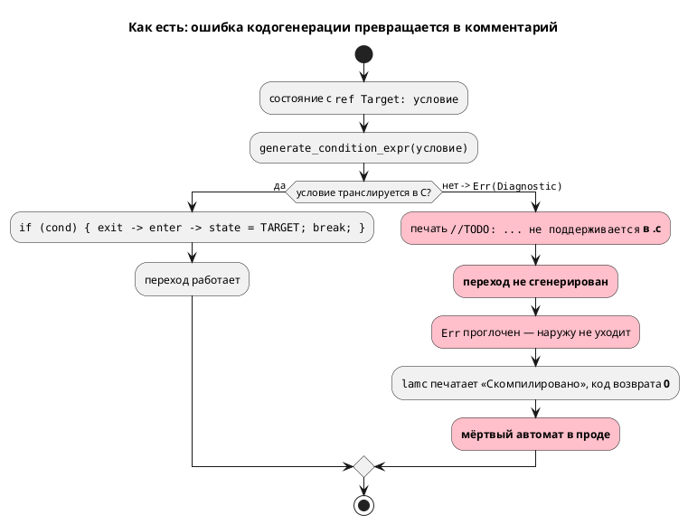
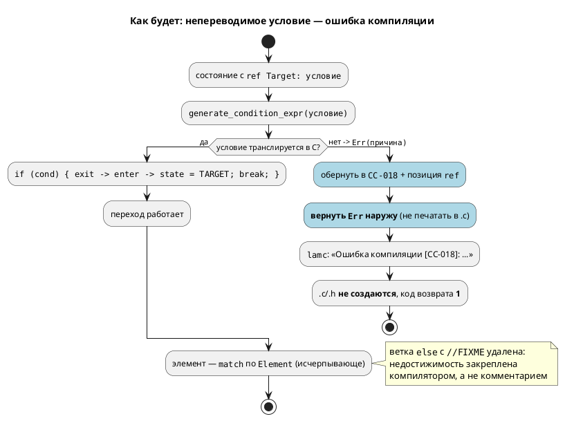

# Фича: Заглушки генератора C: диагностика вместо тихого пропуска

> **Код: `CC-018`, а не `CC-014`** (решение заказчика 2026-07-15).
> ADR (**Accepted**) и задача `0028-01` называют `CC-014`, но его заняла
> закрытая [генератор C: отображение типов Array/Bit/Rational](0029-c-type-mapping.md) («бит-вектор непредставимой
> ширины»); заняты `CC-014`…`CC-017`. Обе фичи выбирали код **грепом
> свободного** в разное время и друг друга не увидели. Решено: 0029 коды
> сохраняет, **0028 берёт `CC-018`**. Первым шагом работ — поправить ADR,
> задачу `0028-01` и тест-план. Системная причина (нет реестра кодов
> диагностик) — кандидат в `FEATURES.md`.

- **Номер:** 0028
- **Статус:** **ГОТОВО** (закрыта 2026-07-15). Обе заглушки устранены; вскрыт
  дефект, который фича и должна была вскрыть, — см. «Итог» ниже и
  [отчёт](0028-c-generator-stubs.md#отчёт-о-тестировании). Снята с витрины `FEATURES.md`.
- **Зависит от:** **нет** — проставлено аналитиком на стадии 3.
  Проверены пересечения с 0027 (делит `c_expr.rs`), 0029 (правит
  `generator/c/`), 0026, 0025, 0020 — жёстких зависимостей нет,
  `ЗАБЛОКИРОВАНА` не ставится. Обоснование — в
  [анализе](0028-c-generator-stubs.md#анализ), раздел «Зависимости фичи».
  **Рекомендация по порядку:** брать **раньше 0027 и 0029** — обе
  правят `generator/c/`, и при обратном порядке малые правки 0028 придётся
  переносить на разделённые модули.
- **Связанные issue (анализ):** новая фича (кандидат из витрины `FEATURES.md`,
  выявлен при обзоре 2026-07-14)
- **Крейт:** `grammar` (затрагивает `generator/c/c_model.rs`, `generator/c/c_expr.rs`)
- **Приоритет:** **высокий (Tier 1 — корректность кодогенерации)**. Не высший:
  дефект **латентен** — ни один файл `examples/` его не задевает (проверено
  прогоном корпуса), в отличие от [починка вычислителя выражений симулятора](0025-simulator-expression-eval.md), где
  заявленная функциональность крейта не работала в основном. Но класс дефекта —
  тот же, а последствия тяжелее: компилятор молча выдаёт **мёртвый автомат** с
  кодом возврата `0`, и порождённый C собирается без замечаний. Для языка синтеза
  автоматов промышленных систем управления это худший режим отказа —
  он обнаруживается на объекте, а не в CI. Объём при этом мал (две локальные
  правки в одном файле), то есть отношение «цена/риск» — в пользу немедленного
  исполнения.

## Стадии жизненного цикла

Все стадии — **разделы этой карточки**: «Архитектура (ADR)»,
«Анализ», «Разработка», «Тест-план», «Отчёт о тестировании», «Итог».
Отдельным артефактом остаются только исправления —
[`docs/fixes/`](../fixes/README.md) (при необходимости `0028-YY-*`).

## Краткое описание

Генератор C печатает заглушки **в порождаемый C-код** вместо того, чтобы
сообщать о проблеме. Анализ установил, что заявленные в кандидате две заглушки
имеют **противоположную природу**:

- **`//TODO: условный переход … не поддерживается`** (`c_model.rs:316`) —
  **достижима** (проба воспроизводит): непереводимое условие приводит к тому,
  что переход **не генерируется**, `Err` **проглатывается**, а `lamc` печатает
  «Скомпилировано» и завершается с кодом `0`. На выходе — **мёртвый автомат**,
  который собирается C-компилятором без замечаний. Это тот же класс «тихого
  пропуска», что и [починка вычислителя выражений симулятора](0025-simulator-expression-eval.md).
- **`//FIXME: Пока не реализовано`** (`c_model.rs:769`) — **недостижима**
  (статическое доказательство): `state_at` фильтрует элементы по `is_state()`,
  а `Element` имеет ровно три варианта, два из которых уже покрыты цепочкой
  `if let`. Это **мёртвый код**, маскирующийся под незавершённую работу.

Фича заменяет тихий пропуск на жёсткую ошибку компиляции `CC-018` (с причиной и
позицией `ref` в исходнике), удаляет мёртвую ветку и закрепляет её
недостижимость исчерпывающим `match` — чтобы новый вариант `Element`/`StateExtend`
валил сборку, а не выпадал в молчаливый no-op.

> Фича зарегистрирована из бэклога кандидатов `FEATURES.md`; далее проходит
> жизненный цикл по своду.

## Архитектура (ADR)

- **Status:** Accepted
- **Date:** 2026-07-15
- **Authors:** Архитектор + системный аналитик
- **Related issues:** [Фича](0028-c-generator-stubs.md);
  связь с [ADR](0025-simulator-expression-eval.md#архитектура-adr) — **тот же класс дефекта**
  («тихий пропуск»), но в генераторе C, а не в симуляторе; пересечение по коду с
  [разделение переросших модулей (validate.rs, lsp.rs, c_expr.rs)](0027-module-size-split.md#архитектура-adr) (делит `c_expr.rs`) и
  [генератор C: отображение типов Array/Bit/Rational](0029-c-type-mapping.md#архитектура-adr) (правит `generator/c/`)

### Context

Генератор C содержит две текстовые заглушки, попадающие **в порождаемый C-код**.
Обзор 2026-07-14 зафиксировал их как кандидата в фичу, но не установил
достижимость. Достижимость установлена в рамках этой проработки — **ответ разный
для двух заглушек**, и это определяет решение.

#### Заглушка №1 — `//TODO: условный переход … не поддерживается` — **Достижима**

`grammar/src/generator/c/c_model.rs:312-321`, функция
`generate_state_transitions`. Если `generate_condition_expr`
(`generator/c/c_expr.rs:428`) возвращает `Err`, переход **не генерируется**, а
вместо него в `.c` печатается комментарий:

```rust
Err(di) => {
    // Условие не поддерживается — оставляем комментарий
    printer
        .ident(&format!(
            "//TODO: условный переход в {} не поддерживается. Причина: {}",
            target.local(),
            di.message
        ))
        .nl();
}
```

`Err` **проглатывается**: наружу не уходит ни ошибка, ни предупреждение, а
`lamc` завершается с кодом `0` и печатает «Скомпилировано». Диагностика есть —
она уже сформирована в `di` — но её единственный потребитель это комментарий в
выходном файле, который никто не читает.

Достижимость доказана пробой (`CC-001`, `c_expr.rs:726` — `BitAccess` на
`float`-порт). Результат: **автомат мёртв** — из `START` нет ни одного перехода,
модель навсегда стоит в стартовом состоянии, C при этом компилируется без
единого замечания.

Существенно, что порождаемый C **синтаксически корректен**: комментарий не
ломает сборку. Дефект не проявится ни в компиляторе C, ни в линковке — только в
поведении изделия. Для языка синтеза автоматов промышленных систем управления это худший из возможных режимов отказа.

#### Заглушка №2 — `//FIXME: Пока не реализовано` — **Недостижима (мёртвый код)**

`grammar/src/generator/c/c_model.rs:768-771`. Ветка `else` в цепочке разбора
элемента. Она **статически недостижима**, доказательство — цепочка из четырёх
звеньев:

| # | Факт | Место |
|---|---|---|
| 1 | `let Some(state) = map.state_at(name) else { continue; };` | `c_model.rs:655` |
| 2 | `state_at` возвращает `Some` **только** при `element.is_state()` | `c_map.rs:106-114` |
| 3 | `is_state()` = `matches!(self, Element::State{..} \| Element::StateExtend{..})` | `minimap.rs:137` |
| 4 | `enum Element` имеет **ровно три** варианта: `Model`, `StateExtend`, `State` | `minimap.rs:108-134` |

Из (1)–(4): `state` ∈ {`State`, `StateExtend`}. Ветки `if let Element::State`
(`c_model.rs:673`) и `else if let Element::StateExtend` (`c_model.rs:686`)
покрывают оба варианта **исчерпывающе**, поэтому `else` (768) не может
выполниться никогда. Заглушка №2 — не дефект поведения, а **мёртвый код**,
маскирующийся под незавершённую работу.

Компилятор Rust этого не видит: цепочка `if let / else if let / else`
непрозрачна для проверки исчерпывающности — ровно то, от чего защищает
`deny(clippy::wildcard_enum_match_arm)` в модуле `eval`.

#### Третий (не заявленный) путь — `StateExtend::None`

В той же функции цепочка `if let StateExtend::Model` (`c_model.rs:687`) /
`else if Parallel` (732) / `else if Concatenation` (751) **не имеет ветки для
`StateExtend::None`** (`minimap.rs:93`). Такое состояние молча не порождает
ничего — даже комментария. Это тише заглушки №1. `StateExtend::None` строится
из `Extend::None` и `Extend::Unresolved` (`minimap.rs:435-436`); проба через
`Extend::Unresolved` отклоняется семантикой раньше кодогенерации, поэтому
достижимость **не установлена**. Путь закрывается тем же решением, что и
заглушка №2 (исчерпывающее сопоставление), без отдельного обоснования.

#### Поток «как есть»



### Decision Drivers

1. **Тихий отказ недопустим.** Проект синтезирует автоматы
   промышленных систем управления. Молча выданный мёртвый автомат, который
   собирается без замечаний, — угроза безопасности, а не косметика.
2. **Диагностика уже существует — потерян только канал.** `Diagnostic` с кодом и
   текстом причины формируется (`c_expr.rs:726` и др.), но выбрасывается в
   комментарий. Чинится **маршрутизация**, а не анализ.
3. **Класс дефекта уже разобран в 0025.** Решение должно быть согласовано с
   принятым там принципом: невычислимое/непереводимое — это диагностика, а не
   молчание.
4. **Дефект латентен.** Ни один файл `examples/` не задевает заглушки (проверено
   прогоном корпуса). Значит, цена ужесточения поведения близка к нулю, а
   «сломать рабочую сборку» решение не может.
5. **Мёртвый код и живой дефект — разные задачи.** Смешивать их в одном решении
   нельзя: №1 требует поведения, №2 требует удаления.

### Considered Options

#### Option A. Реализовать недостающую генерацию

Дописать трансляцию для случаев, где `generate_condition_expr` возвращает `Err`
(прежде всего `CC-001` — `BitAccess` на `float`-порт).

**Pros:**
- Пользователь получает работающий C для более широкого подмножества языка.
- Не ужесточает поведение — ничего не начинает падать.

**Cons:**
- **Решает не ту задачу.** Заглушка — это симптом «неизвестно что делать»;
  реализовав один случай (`CC-001`), мы оставим канал потери для остальных
  (`CC-002`, `CC-003`, `CC-006`, `CC-011`, `CC-012`, `CC-013`). Следующий
  непереведённый узел снова уйдёт в комментарий молча.
- **`BitAccess` на `float` не имеет корректной семантики в C** без type punning;
  «реализация» была бы выдумыванием семантики языка в генераторе — это работа
  стадии семантики (`SE-…`), а не кодогенератора.
- Не закрывает заглушку №2 (мёртвый код) и путь `StateExtend::None`.
- Объём непредсказуем и упирается в фичу (отображение типов).

#### Option B. Жёсткая ошибка компиляции + удаление мёртвой ветки

Заглушка №1: `Err` из `generate_condition_expr` **пробрасывается** наружу как
ошибка компиляции с новым кодом `CC-018`, оборачивающим исходную причину и
позицию `ref` (`ReferenceNode.location`, `semantic/mod.rs:1455`). `lamc`
печатает ошибку и завершается с ненулевым кодом; `.c`/`.h` не пишутся.
Заглушка №2: ветка **удаляется**, цепочка `if let` заменяется исчерпывающим
`match` по `Element` и по `StateExtend` — недостижимость закрепляется
компилятором, а не рассуждением в документе.

**Pros:**
- Устраняет **класс** дефекта, а не один его случай: любой будущий
  непереводимый узел даёт ошибку, а не комментарий.
- Соответствует принципу 0025 и духу `deny(clippy::wildcard_enum_match_arm)`.
- Невозможно проигнорировать: код возврата ≠ 0 останавливает CI и сборку.
- Цена ужесточения **нулевая на текущем корпусе** (проверено): падать начнёт
  только то, что и так порождало мёртвый автомат.
- Позиция `ref` доступна → диагностика указывает на строку, а не на «Codegen».
- Мёртвый код исчезает вместе с ложным сигналом «здесь недоделка».

**Cons:**
- **Слом обратной совместимости поведения:** модель, которая раньше
  «компилировалась», теперь не компилируется. Требует обоснования по своду
  (обоснование — в анализе: корректного C эти модели не порождали никогда).
- Требует смены сигнатуры `compile_to_c` при желании иметь канал
  предупреждений — либо отказа от такого канала.
- Пользователь лишается возможности «собрать хоть что-то» для отладки.

#### Option C. Предупреждение + оставить заглушку в коде

`Err` превращается в `Diagnostic::warning`, пробрасывается в `lamc` и печатается
в `stderr`; комментарий `//TODO` в `.c` сохраняется; код возврата остаётся `0`.

**Pros:**
- Обратная совместимость полная: всё, что собиралось, собирается.
- Диагностика появляется — формально «тихий пропуск» устранён.
- Прецедент есть: `compile_to_c_hal` уже возвращает `Vec<Diagnostic>`
  (`lib.rs:258`).

**Cons:**
- **Сохраняет опасный режим отказа.** Предупреждение в `stderr` при коде
  возврата `0` в CI не читает никто; на выходе по-прежнему мёртвый автомат,
  который соберётся и уедет в изделие. Для промышленного управления
  это неприемлемо — ровно тот сценарий, ради которого заводилась фича.
- Оставляет `//TODO` в порождаемом артефакте: генератор продолжает выдавать
  заведомо неполный C как штатный результат.
- Полумера: через год заглушка снова будет кандидатом в фичу.

#### Option D. Только чистка мёртвого кода (без диагностики)

Признать заявку ошибочной, удалить обе заглушки как недоделки-фантомы.

**Pros:**
- Минимальный объём.

**Cons:**
- **Опровергнуто фактами.** Заглушка №1 достижима — проба воспроизводит мёртвый
  автомат при коде возврата `0`. Удалить её без замены = потерять и комментарий,
  сделав пропуск абсолютно бесследным.
- Применимо **только** к заглушке №2; как решение фичи — несостоятельно.

### Decision

Принимается **Option B**, применяемая **раздельно** к двум заглушкам — потому
что установленные факты о них противоположны:

- **Заглушка №1 (достижима)** → жёсткая ошибка компиляции **`CC-018`**,
  оборачивающая исходный `Diagnostic` (причину и код) и позицию `ref`.
  Печать комментария в `.c` **прекращается**; `.c`/`.h` не создаются;
  `lamc` завершается с кодом `1`.
- **Заглушка №2 (недостижима)** → **удаление** ветки (по существу — Option D,
  но применённая только там, где она подтверждена доказательством) с заменой
  цепочек `if let` на исчерпывающий `match` по `Element` и `StateExtend`.
  Заодно закрывается путь `StateExtend::None`.

Option A отвергнута: она реализует один случай, оставляя канал потери открытым
для остальных, и требует выдумать в генераторе семантику, которой нет в языке.
Option C отвергнута как полумера: предупреждение при коде возврата `0`
сохраняет главный риск — мёртвый автомат, доехавший до изделия.

Выбор в пользу ошибки, а не предупреждения, опирается на драйвер 4:
дефект **латентен** (корпус `examples/` чист), поэтому ужесточение не ломает ни
одной работающей сборки — оно ломает ровно те сборки, которые были сломаны и
без него, просто молча.

#### Целевой поток



### Consequences

#### Положительные

- Класс «тихого пропуска» в генераторе C закрыт: непереводимое условие
  невозможно не заметить (код возврата ≠ 0).
- Порождаемый C перестаёт содержать `//TODO`/`//FIXME` как штатный результат —
  вывод генератора либо корректен, либо его нет.
- Диагностика указывает на строку `ref` в исходнике, а не на `Location::Codegen`.
- Недостижимость ветки №2 закрепляется типами: новый вариант `Element` или
  `StateExtend` теперь **не соберётся** без явной обработки — ровно тот приём,
  что уже принят в `eval` (0025).
- Снимается ложный сигнал «в генераторе есть недоделка» — два TODO из трёх
  оказались фантомами.

#### Отрицательные / Action items

- **Слом обратной совместимости поведения**: `.lam`, задевающие
  непереводимое условие, перестают компилироваться в C. Обосновано: корректного
  C они не порождали никогда. Версия языка **не меняется** — синтаксис и
  семантика `.lam` не тронуты, меняется поведение компилятора.
- **Изменение публичного API** при выборе канала предупреждений: `compile_to_c`
  сейчас `Result<(), Diagnostic>` (`lib.rs:209`). Для `CC-018` смена сигнатуры
  **не требуется** (ошибка идёт по существующему `Err`); решение о канале
  `Vec<Diagnostic>` по образцу `compile_to_c_hal` — отложить, чтобы не тащить
  слом API ради задачи, которая его не требует.
- **Action item:** `CC-001` (`BitAccess` на `float`-порт) по-хорошему должен
  отсекаться на стадии **семантики** (`SE-…`) для всех целей сразу, а не в
  генераторе C. Вынести в бэклог отдельной фичей — в рамках 0028 не делаем
  (иначе `-t plantuml` и симулятор останутся с той же дырой, но это их фича).
- **Action item:** согласовать очередь с 0027 (делит `c_expr.rs`) и 0029
  (правит `generator/c/`): 0028 мал и должен идти **раньше**, иначе его правки
  придётся переносить на разделённые модули.
- Пользователь теряет возможность получить частичный C для отладки. Признано
  приемлемым: частичный C здесь неотличим от полного и потому опаснее его
  отсутствия.

#### Acceptance criteria

1. Проба `probe_float_bit.lam` (`BitAccess` на `float`-порт в условии перехода)
   компиляцией `lamc compile -t c` даёт **ошибку `CC-018`** с указанием причины
   (`CC-001`) и позиции `ref`; код возврата **≠ 0**; файлы `.c`/`.h` **не
   созданы**.
2. Контрпроба `probe_u8_bit.lam` (тот же автомат, порт `u8` вместо `float`)
   компилируется с кодом `0`, и порождённый `.c` содержит рабочие `if (…)`
   переходы — байт-в-байт как до изменения.
3. `grep -rn "FIXME\|TODO" grammar/src/generator/c/c_model.rs` не находит ни
   заглушки №1, ни заглушки №2.
4. Ни один порождённый из `examples/**/*.lam` `.c` не содержит `//TODO`/`//FIXME`
   (и до, и после изменения — вывод по корпусу не меняется).
5. Разбор `Element` и `StateExtend` в `generate_model_tick` — исчерпывающий
   `match` без ветки `_`; добавление варианта в любой из этих `enum` валит сборку.
6. `./scripts/precheck.sh` зелёный; `cargo test -- --test-threads=1` без
   регрессий.

## Анализ

### Цель и контекст

Генератор C печатает заглушки (`//TODO`, `//FIXME`) **прямо в порождаемый
C-код**. Кандидат в фичу (обзор 2026-07-14) ставил вопрос ребром: *достижимы ли
эти ветки; если да — компилятор молча выдаёт заведомо неполный C без
диагностики, то есть тот же класс «тихого пропуска», что и [починка вычислителя выражений симулятора](0025-simulator-expression-eval.md#анализ)*.

**Достижимость установлена в этом анализе. Ответ разный для двух заглушек** —
и это главный результат проработки:

| Заглушка | Место | Вердикт | Доказательство |
|---|---|---|---|
| №1 `//TODO: условный переход … не поддерживается` | `c_model.rs:316` | **Достижима** | проба воспроизводит (ниже) |
| №2 `//FIXME: Пока не реализовано` | `c_model.rs:769-770` | **Недостижима** (мёртвый код) | статическое доказательство (ниже) |

Кандидат оказался прав по существу (тихий пропуск есть, класс — как у 0025) и
неточен в объёме: половина заявленной работы — не диагностика, а **чистка
мёртвого кода**. Фича, соответственно, распадается на две разные подзадачи.

Решение — [ADR](0028-c-generator-stubs.md#архитектура-adr), **Option B**: для №1 —
жёсткая ошибка `CC-018` вместо комментария; для №2 — удаление ветки с заменой
цепочек `if let` на исчерпывающий `match`.

#### Доказательство №1: заглушка `//TODO` достижима

Ветка живёт в `generate_state_transitions` (`c_model.rs:312-321`): когда
`generate_condition_expr` (`c_expr.rs:428`) возвращает `Err`, переход **не
генерируется**, а `Err` **проглатывается** — в `.c` печатается комментарий, и
никакая диагностика наружу не уходит.

**Проба** (`BitAccess` на `float`-порт → `CC-001`, `c_expr.rs:726`):

```lam
// probe_float_bit.lam
in temp: float;

start Start {
    ref Work: temp.0 = 1;
}
state Work {
    ref End: temp.1 = 0;
}
state End;
```

**Команда воспроизведения:**

```sh
cargo run --bin lamc -- compile -t c probe_float_bit.lam -o probe_float_bit
echo "код возврата = $?"
```

**Наблюдаемый факт** (прогон 2026-07-15, ветка `v2`, коммит `6984471`):

```
Скомпилировано: probe_float_bit.lam → probe_float_bit/ (путей поиска: 0)
код возврата = 0
```

Порождённый `probe_float_bit/probe_float_bit.c`:

```c
void ProbeFloatBit_tick(ProbeFloatBit *model) {
    assert(0 != model);
    switch (model->state) {
        case PROBE_FLOAT_BIT_INIT: {
            model->state = PROBE_FLOAT_BIT_START;
            break;
        }
        case PROBE_FLOAT_BIT_WORK: {
            //TODO: условный переход в End не поддерживается. Причина: BitAccess на float-порт не поддерживается в условии
            break;
        }
        case PROBE_FLOAT_BIT_END: {
            break;
        }
        case PROBE_FLOAT_BIT_START: {
            //TODO: условный переход в Work не поддерживается. Причина: BitAccess на float-порт не поддерживается в условии
            break;
        }
    }
}
```

**Что это означает.** Автомат **мёртв**: из `START` не выходит ни один переход,
модель навсегда стоит в стартовом состоянии. При этом:

- код возврата `0`, сообщение «Скомпилировано»;
- ни ошибки, ни предупреждения — вообще ничего в `stderr`;
- порождённый C **синтаксически корректен** и соберётся любым C-компилятором
  без замечаний (комментарий сборку не ломает).

Дефект не ловится ни C-компилятором, ни линковкой — только поведением изделия.
Это подтверждает тезис кандидата: класс — «тихий пропуск» 0025, но последствия
хуже, потому что цель фичи — синтез автоматов промышленного управления.

#### Доказательство №2: заглушка `//FIXME` недостижима

`c_model.rs:768-771` — ветка `else` цепочки разбора элемента:

```rust
} else {
    //TODO: Реализовать
    printer.ident("//FIXME: Пока не реализовано").nl();
}
```

Ветка **статически недостижима**. Доказательство — цепочка из четырёх звеньев,
каждое проверено в коде на 2026-07-15:

| # | Факт | Место |
|---|---|---|
| 1 | `let Some(state) = map.state_at(state_name.clone()) else { continue; };` — источник `state` | `c_model.rs:655` |
| 2 | `state_at` возвращает `Some(element)` **только** при `element.is_state()`, иначе `None` | `c_map.rs:106-114` |
| 3 | `is_state()` = `matches!(self, Element::State{..} \| Element::StateExtend{..})` | `minimap.rs:137` |
| 4 | `enum Element` имеет **ровно три** варианта: `Model`, `StateExtend`, `State` | `minimap.rs:108-134` |

Из (1)+(2)+(3): `state` ∈ {`Element::State`, `Element::StateExtend`}. Вариант
`Element::Model` отфильтрован в (2) и до `else` дойти не может. Ветки
`if let Element::State { .. }` (`c_model.rs:673`) и
`else if let Element::StateExtend { .. }` (`c_model.rs:686`) покрывают оба
возможных варианта исчерпывающе → `else` (768) **невыполним**. ∎

Пробы на эту ветку не строятся принципиально — не «не нашли вход», а входа не
существует. Соответственно, строка `//FIXME: Пока не реализовано` **никогда не
попадала и не может попасть** в порождаемый C.

Почему это не поймал Rust: цепочка `if let / else if let / else` непрозрачна для
проверки исчерпывающности — компилятор обязан допустить `else`. Ровно от этого
класса ошибок защищает `deny(clippy::wildcard_enum_match_arm)`, уже принятый в
модуле `eval`.

#### Третий путь, не заявленный в кандидате: `StateExtend::None`

В той же функции цепочка `if let StateExtend::Model` (`c_model.rs:687`) /
`else if Parallel` (732) / `else if Concatenation` (751) **не имеет ветки для
`StateExtend::None`** (`minimap.rs:93`). Состояние с таким `extend` молча не
порождает **ничего** — даже комментария; это тише заглушки №1.

`StateExtend::None` строится из `Extend::None` и `Extend::Unresolved`
(`minimap.rs:435-436`). Проба через `Extend::Unresolved`:

```lam
start Start = Unknown {   // модели Unknown не существует
    ref Work: true;
}
state Work;
```

```
Ошибка компиляции: Модель 'Unknown' не найдена
```

Семантика отклоняет вход **раньше** кодогенерации → достижимость этим путём
**не установлена** (не доказана ни в ту, ни в другую сторону; `Extend::None`
отдельно не пробовался). Путь закрывается тем же исчерпывающим `match`, что и
заглушка №2, — без отдельного обоснования и без расширения объёма фичи.

#### Прочие заглушки в генераторах (проверено)

`grep -rn "FIXME\|TODO" grammar/src/generator/` даёт **ровно три** попадания:

| Место | Что | Оценка |
|---|---|---|
| `c/c_model.rs:316` | заглушка №1 | дефект, чинится в `0028-01` |
| `c/c_model.rs:769-770` | заглушка №2 | мёртвый код, чистится в `0028-02` |
| `c/mod.rs:122` | `//TODO: При генерации следует работать с примитивным слепком модели` | **не дефект**: проектная заметка в коде, в выходной файл не печатается |

Генератор PlantUML (`generator/plantuml/`) заглушек **не содержит**. Иных
«тихих» веток с печатью TODO/FIXME в вывод в генераторах нет.

#### Латентность дефекта (важно для оценки риска)

Весь корпус примеров скомпилирован в C и проверен на заглушки:

```sh
for f in examples/*.lam; do
  cargo run --bin lamc -- compile -t c "$f" -o "/tmp/corpus/$(basename "$f" .lam)"
done
grep -rn "TODO\|FIXME" /tmp/corpus/   # → (не найдено)
```

**Ни один** файл `examples/` заглушки не задевает. Дефект **латентен**: он не
проявлен на текущем корпусе, но срабатывает на первом же `.lam`, попавшем в
непереводимое условие. Отсюда два следствия: (а) приоритет — высокий, но не
высший (в отличие от 0025, где крейт не работал в основном); (б) ужесточение
поведения (ошибка вместо молчания) **не может сломать ни одной работающей
сборки** — цена перехода на `CC-018` нулевая.

### Зависимости фичи

- **Зависит от:** **нет**.

  Проверены все пересечения:

  | Фича | Пересечение | Вердикт |
  |---|---|---|
  | 0027 «Разделение переросших модулей» | делит `generator/c/c_expr.rs` (1736 строк), где живёт `generate_condition_expr` | **не зависимость**, а конфликт очереди: правки 0028 малы и локальны; см. «Влияние на порядок» |
  | 0029 «Генератор C: отображение типов Array/Bit/Rational» | правит `generator/c/`, тот же дефектный класс `Rational` | **не зависимость**: 0029 меняет отображение типов, 0028 — маршрутизацию ошибок; пересечения по строкам нет |
  | 0025 «Вычислитель выражений симулятора» | тот же класс дефекта, но крейт `simulation` | **не зависимость** (ГОТОВО); заимствуется принцип, не код |
  | 0026 «typedef корневой структуры» | `generator/c/c_header.rs` | **не зависимость**: другой файл, другой аспект |
  | 0020 «Адрес порта» | `CC-001` возникает на портовых узлах | **не зависимость**: механика адресов не тронута; цель `c` порты читает через HAL-колбэки |

  Жёстких зависимостей нет → статус **`ЗАБЛОКИРОВАНА` не ставится**, фича
  доступна к взятию в работу немедленно.

- **Влияние на порядок разработки:** фича **не блокирует** другие и сама не
  заблокирована. Аналитик рекомендует (критерий 4 — необходимость)
  ставить **0028 раньше 0027 и 0029**:
  1. 0028 мал (две локальные правки в одном файле + фикстуры), 0027 —
     крупный механический рефакторинг `c_expr.rs`/`validate.rs`/`lsp.rs`. Если
     0027 пойдёт первым, правки 0028 придётся переносить на разделённые модули —
     чистые потери.
  2. 0028 повышает проработанность (критерий 2): после него у
     генератора C появляется тест на **отсутствие** заглушек в выводе, что
     защищает и 0027, и 0029 от их случайного возврата.
  3. 0029 работает с теми же дефектными типами (`Rational`); ошибка `CC-018`
     сделает его дыры видимыми, а не молчащими.

  Завершение 0028 не разблокирует ничего формально (никто от него не зависит),
  но снимает риск переноса правок для 0027/0029.

### Требования и проверяемые условия

- **R1. Непереводимое условие — ошибка, а не комментарий.** Если
  `generate_condition_expr` вернула `Err` для условия `ref`-перехода,
  `generate_state_transitions` **обязана** вернуть `Err` наружу. Печать
  `//TODO`-комментария в порождаемый C **прекращается полностью**.
- **R2. Диагностика сохраняет причину.** Ошибка получает новый код **`CC-018`**
  (свободен: заняты `CC-001`…`CC-013`, проверено `grep` по `grammar/src/`) и
  включает: имя целевого состояния, исходный код причины (напр. `CC-001`) и её
  текст. Исходный `Diagnostic` не теряется.
- **R3. Диагностика указывает на исходник.** Место ошибки — позиция `ref`
  (`ReferenceNode.location`, `semantic/mod.rs:1455`), а не `Location::Codegen`.
  Поле уже существует и заполнено — новых данных собирать не нужно.
- **R4. Артефакты не создаются при ошибке.** При `CC-018` файлы `.c`/`.h` не
  пишутся (или не остаются на диске), `lamc` печатает «Ошибка компиляции
  [CC-018]: …» и завершается с кодом `1`.
- **R5. Мёртвая ветка удалена.** Ветка `else` с `//FIXME: Пока не реализовано`
  (`c_model.rs:768-771`) удаляется как недостижимая (доказательство выше).
- **R6. Недостижимость закреплена типами.** Разбор `Element` и `StateExtend` в
  `generate_model_tick` — исчерпывающий `match` **без ветки `_`**. Добавление
  варианта в `Element` (`minimap.rs:108`) или `StateExtend` (`minimap.rs:91`)
  обязано **валить сборку**, а не молча выпадать в no-op.
- **R7. `StateExtend::None` обрабатывается явно.** Вариант получает явную ветку
  (пустая генерация с комментарием-обоснованием в **коде на Rust**, не в выводе,
  либо `Err`, если будет доказана достижимость). Молчаливый no-op недопустим.
- **R8. Вывод на текущем корпусе не меняется.** Для всех `examples/**/*.lam`
  порождённый C **байт-в-байт** совпадает с выводом до изменения (дефект
  латентен → регрессии быть не может; несовпадение = ошибка реализации).
- **R9. Публичный API не ломается.** `compile_to_c` сохраняет сигнатуру
  `Result<(), Diagnostic>` (`lib.rs:209`) — `CC-018` идёт по существующему
  каналу `Err`. Канал предупреждений (`Vec<Diagnostic>` по образцу
  `compile_to_c_hal`, `lib.rs:258`) в этой фиче **не вводится**.
- **R10. Цель `c-hal` не расходится с `c`.** Обе цели используют
  `generate_state_transitions`; поведение `CC-018` одинаково для `-t c` и
  `-t c-hal`.

### Критерии приёмки и способ проверки

| # | Критерий | Способ проверки |
|---|---|---|
| A1 | Проба `float`-порта даёт ошибку `CC-018`, код возврата ≠ 0 | тест `c_stub_tests.rs::float_bit_access_is_error`; ручной прогон `lamc compile -t c` на фикстуре |
| A2 | Текст `CC-018` содержит целевое состояние и причину `CC-001` | assert по подстрокам в тесте (строки захватить зондом, не угадывать — `CLAUDE.md`) |
| A3 | Ошибка указывает на позицию `ref` в исходнике (не `Codegen`) | assert `matches!(diag.loc, Location::Source(..))` в тесте |
| A4 | При `CC-018` файлы `.c`/`.h` не созданы | тест: `assert!(!path.exists())` после неуспешной компиляции |
| A5 | Контрпример (`u8`-порт) компилируется, переходы `if (…)` на месте | тест `c_stub_tests.rs::u8_bit_access_generates_transitions`; сверка с захваченным эталоном |
| A6 | В `c_model.rs` нет ни одной заглушки | `grep -rn "FIXME\|TODO" grammar/src/generator/c/c_model.rs` → пусто |
| A7 | Порождённый из `examples/` C не содержит `//TODO`/`//FIXME` | прогон корпуса + `grep` (см. «Латентность»); в CI — через `precheck.sh` |
| A8 | Вывод C по корпусу `examples/` не изменился | побайтовая сверка каталогов «до/после» (`diff -r`) |
| A9 | `match` по `Element`/`StateExtend` исчерпывающий, без `_` | ревью + проба: временное добавление варианта в `enum` валит сборку |
| A10 | Поведение `-t c` и `-t c-hal` на пробе одинаково | тест на обеих целях |
| A11 | Регрессий нет | `cargo test -- --test-threads=1`, `cargo test --features lsp -- --test-threads=1` |
| A12 | Полная проверка зелёная | `./scripts/precheck.sh` |

### Особенности по обратной функциональности

свод. Изменение **ломает обратную совместимость поведения компилятора**
(не языка) — требуется обоснование, оно приводится ниже.

| Аспект | Было | Станет | Оценка |
|---|---|---|---|
| Синтаксис `.lam` | — | без изменений | **не тронут** |
| Семантика `.lam` | — | без изменений | **не тронута** |
| Версия языка | 0.2.0 | 0.2.0 | **не растёт** (свод не применяется: конструкции языка не добавлены и не изменены) |
| `.lam` с непереводимым условием | компилируется, код `0`, мёртвый C | **ошибка `CC-018`**, код `1`, C не создан | **слом** — обоснование ниже |
| `.lam` без таких условий (весь `examples/`) | корректный C | **тот же C байт-в-байт** | совместимо (R8, A8) |
| Публичный API `compile_to_c` | `Result<(), Diagnostic>` | без изменений | совместимо (R9) |
| Публичный API `compile_to_c_hal` | `Result<Vec<Diagnostic>, Diagnostic>` | без изменений | совместимо |
| `GenerateOptions` | `#[non_exhaustive]` (`generator/mod.rs:29`) | не расширяется | совместимо |
| Цель `-t plantuml` | — | без изменений | **не тронута** |
| Крейт `simulation` | — | без изменений | **не тронут** |

**Обоснование слома.** Формально слом есть: вход, который раньше
принимался, теперь отвергается. Содержательно ломать нечего:

1. **Корректного результата эти входы не давали никогда.** Порождавшийся C
   содержал мёртвый автомат — переходы отсутствовали физически. Заменяется не
   «рабочее поведение на ошибку», а «молчаливо неверный результат на честную
   ошибку».
2. **Никого не задевает на практике.** Корпус `examples/` чист (проверено
   прогоном) — сломать нечего даже гипотетически.
3. **Молчание опаснее ошибки.** свод: цель проекта — синтез автоматов
   промышленных систем управления. Мёртвый автомат, собравшийся без единого
   замечания, — отказ, который обнаружится на объекте, а не в CI.
4. **Прецедент принят.** Фича разобрала тот же класс и постановила:
   невычислимое — это диагностика, а не молчание. Иное решение для генератора C
   противоречило бы уже принятому ADR.
5. **Обратный путь дешевле прямого.** Если пользователю нужен частичный C, он
   правит одно условие в `.lam`; если нужен молчащий генератор — этого не нужно
   никому.

Миграция пользователей **не требуется** (мигратор, как в 0021, не нужен):
затронутых `.lam` в репозитории нет.

### Риски и зависимости

| # | Риск | Оценка | Снижение |
|---|---|---|---|
| Р1 | Существует «в поле» `.lam`, полагающийся на текущее поведение | низкая: в репозитории таких нет; поведение бессмысленно (мёртвый автомат) | текст `CC-018` называет точную причину и строку → правка очевидна |
| Р2 | Ошибка вместо предупреждения окажется слишком жёсткой | низкая | при появлении обоснованного запроса — отдельная фича на флаг «сгенерировать частично» (в 0028 не тащим, YAGNI) |
| Р3 | Правка разъедется с 0027 (делит `c_expr.rs`) | **средняя** | взять 0028 **до** 0027 (см. «Влияние на порядок»); иначе перенести правки вручную |
| Р4 | Исчерпывающий `match` вскроет ещё «тихие» ветки | средняя, **желательный исход** | вскрытое фиксировать в бэклоге; в 0028 закрывать только `StateExtend::None` (R7), объём не расширять |
| Р5 | `CC-001` остаётся дырой для `-t plantuml` и симулятора | средняя | вне объёма 0028 (ADR, action item): отсечение на стадии семантики — отдельная фича |
| Р6 | Тест «нет заглушек в выводе» окажется хрупким | низкая | проверять `grep` по порождённому корпусу, а не сравнением с эталонными строками |
| Р7 | Реализация случайно изменит вывод на корпусе | низкая | A8: побайтовый `diff -r` каталогов «до/после» — обязательный шаг `0028-01` |

**Ловушка (из `CLAUDE.md`).** Новые тесты писать **зондом**: сперва захватить
реальный текст `CC-018` и реальный вывод контрпримера, затем закреплять
assertions против захваченного. Строки и адреса не угадывать.

### Декомпозиция

Объём мал — аналитика **не декомпозируется**; разработка делится на
три подзадачи по границе «поведение / мёртвый код / закрепление»:

| Задача | Файл | Содержание | Требования |
|---|---|---|---|
| **0028-01** | [`0028-c-generator-stubs.md#разработка`](0028-c-generator-stubs.md#разработка) | `CC-018`: проброс `Err` вместо печати `//TODO`; позиция `ref`; проверка неизменности вывода на корпусе | R1, R2, R3, R4, R8, R9, R10 |
| **0028-02** | [`0028-c-generator-stubs.md#разработка`](0028-c-generator-stubs.md#разработка) | удаление мёртвой ветки `//FIXME`; исчерпывающий `match` по `Element`/`StateExtend`; явная ветка `StateExtend::None` | R5, R6, R7 |
| **0028-03** | [`0028-c-generator-stubs.md#разработка`](0028-c-generator-stubs.md#разработка) | фикстуры (пример/контрпример), тесты `c_stub_tests.rs`, защита корпуса от возврата заглушек, документация `CC-018` | A1–A12, свод |

Порядок: `0028-01` → `0028-02` → `0028-03`. `0028-02` после `0028-01`, потому
что исчерпывающий `match` удобнее вводить, когда ветка ошибок уже переведена на
`Err` (иначе `match` придётся править дважды).

## Разработка

### Задача

> **Код задачи — `CC-018`** (решение заказчика 2026-07-15). Утверждение ниже
> («`CC-001`…`CC-013` заняты → `CC-014` свободен») **устарело**: закрытая фича
> [генератор C: отображение типов Array/Bit/Rational](0029-c-type-mapping.md) заняла `CC-014`…`CC-017`. Проверка
> свободного кода грепом по `grammar/src/` коллизию не поймала — обе фичи грепали
> до реализации друг друга; читать «`CC-014`» ниже как «`CC-018`».

Требования: **R1, R2, R3, R4, R8, R9, R10**. Критерии: **A1–A5, A8, A10**.

#### Что было

*Реальное состояние кода на 2026-07-15 (ветка `v2`, коммит `6984471`) —
проверено чтением исходников и пробой.*

`grammar/src/generator/c/c_model.rs:278-339`, функция
`generate_state_transitions`. Для каждого `ref`-перехода с условием вызывается
`generate_condition_expr` (`generator/c/c_expr.rs:428`). Ветка `Err`
(`c_model.rs:312-321`) **проглатывает диагностику**, печатая её текстом в
порождаемый C:

```rust
Err(di) => {
    // Условие не поддерживается — оставляем комментарий
    printer
        .ident(&format!(
            "//TODO: условный переход в {} не поддерживается. Причина: {}",
            target.local(),
            di.message
        ))
        .nl();
}
```

Последствия (проба воспроизводит, см. анализ):

- переход **не генерируется** — в `case` состояния остаётся только `break;`;
- `Err` наружу **не уходит**: ни ошибки, ни предупреждения;
- `lamc` печатает «Скомпилировано» и завершается с кодом **`0`**;
- порождённый C **синтаксически корректен** — комментарий сборку не ломает,
  дефект не ловится ни C-компилятором, ни линковкой;
- на выходе — **мёртвый автомат**: из `START` не выходит ни один переход.

Источники `Err` в `generate_condition_expr` (все проверены `grep` по
`c_expr.rs`): `CC-001` (`c_expr.rs:726` — `BitAccess` на `float`-порт; **на нём
построена проба**), `CC-002` (749), `CC-003` (775), `CC-006` (527, 608),
`CC-011` (538, 619), `CC-012` (519, 600), `CC-013` (506, 587), плюс ошибки
`resolve_variable_c_expr`.

Инфраструктура, необходимая для починки, **уже существует** — недостаёт только
проводки:

| Что нужно | Где есть | Состояние |
|---|---|---|
| Позиция `ref` в исходнике | `ReferenceNode.location` (`semantic/mod.rs:1455`) | заполнена, в `generate_state_transitions` доступна через `reference` |
| Уровни диагностики | `Level::{Warning, Error}` (`diagnostics.rs:35-44`) | есть |
| Канал ошибки наружу | `generate_state_transitions` уже `-> Result<(), Diagnostic>` (`c_model.rs:285`) | есть, но не используется для этого случая |
| Канал до CLI | `compile_to_c -> Result<(), Diagnostic>` (`lib.rs:209`) | есть; смена сигнатуры **не требуется** |
| Печать ошибки в CLI | `lamc.rs` — «Ошибка компиляции [код]: …» + `process::exit(1)` | есть |
| Свободный код | `CC-001`…`CC-013` заняты (`grep` по `grammar/src/`) → **`CC-018` свободен** | — |

Латентность: ни один `.lam` из `examples/` эту ветку не задевает (проверено
прогоном корпуса) — вывод генератора на корпусе меняться **не должен**.

#### Что сделано

> **Выполнена** 2026-07-15. Реализовано по ADR (Option B).
>
> **Сверх плана потребовалась правка печати CLI.** Пункт 2 плана считал, что
> канал до пользователя готов («Печать ошибки в CLI — есть»). На деле цель `c`
> печатала ошибку **без кода**, а заметки не печатала **ни одна** цель — то есть
> приложенная причина (`CC-001`) до пользователя не доезжала, и критерий A1
> («ошибка `CC-018` с указанием причины») был бы не выполнен. Печать сведена в
> одну функцию `print_compile_error` для всех целей.
>
> **Вскрыт дефект, который план считал невозможным** — см. «Находки» ниже.

1. **Убрать печать комментария.** Ветка `Err(di)` в `generate_state_transitions`
   (`c_model.rs:312-321`) перестаёт что-либо печатать в `Printer`.
2. **Пробросить ошибку.** Вместо печати — `return Err(...)` с новым кодом
   **`CC-018`**, оборачивающим исходный `di`:
   - место: `reference.location` (не `Location::Codegen`) — R3;
   - сообщение: имя целевого состояния + исходный код (`di.code`) + исходный
     текст (`di.message`) — R2;
   - исходную диагностику приложить заметкой (`Diagnostic::error_with_note`,
     `diagnostics.rs:303`), чтобы причина не схлопнулась в строку.
3. **Проверить отсутствие частичных артефактов** (R4): убедиться, что при `Err`
   из `generate_model_functions` файлы `.c`/`.h` не остаются на диске; если
   `Printer` пишет потоково — писать во временный буфер и переносить только при
   `Ok`. **Уточнить фактическое поведение перед правкой** (не предполагать).
4. **Сигнатуры не трогать** (R9): `compile_to_c` остаётся
   `Result<(), Diagnostic>`; `GenerateOptions` не расширяется; канал
   `Vec<Diagnostic>` не вводится.
5. **Снять эталон вывода до правки** (R8, A8): скомпилировать весь `examples/`
   в `/tmp/before` — иначе сверять «после» будет не с чем.

Статус по функциональности:

| Функциональность | Работа | Обоснование |
|---|---|---|
| Генератор C (`-t c`) | **да** | ядро задачи |
| Генератор C (`-t c-hal`) | **да** (автоматически) | делит `generate_state_transitions`; проверить T10, R10 |
| Генератор PlantUML | **н/п** | `generate_condition_expr` не использует, заглушек не содержит (проверено) |
| Семантика | **н/п** | `CC-001` как `SE-…` — вынесено в бэклог отдельной фичей (ADR, action item) |
| Язык (синтаксис/семантика `.lam`) | **н/п** | не тронут; версия языка не растёт (свод не применяется) |
| Публичный API `grammar` | **н/п** | R9: сигнатуры сохраняются |
| Крейт `simulation` | **н/п** | не тронут |
| LSP, форматтер | **н/п** | не тронуты |
| Фикстуры и тесты | **отдельно** | [заглушки генератора C: диагностика вместо тихого пропуска](0028-c-generator-stubs.md#разработка) |
| Мёртвая ветка `//FIXME` | **отдельно** | [заглушки генератора C: диагностика вместо тихого пропуска](0028-c-generator-stubs.md#разработка) |

#### Проверки

> **Планируется (разработка не начата).** Ожидаемые результаты — из тест-плана
> [`0028-c-generator-stubs.md#тест-план`](0028-c-generator-stubs.md#тест-план).

```sh
### 0. ДО правки — снять эталон вывода по корпусу (иначе A8 непроверяем)
for f in examples/*.lam; do
  cargo run --bin lamc -- compile -t c "$f" -o "/tmp/before/$(basename "$f" .lam)"
done

### 1. Пример: непереводимое условие → ошибка (T1–T6)
cargo run --bin lamc -- compile -t c grammar/tests/data/c_stubs/float_bit_access.lam -o /tmp/ex
echo "код возврата = $?"        # ожидается 1
ls /tmp/ex                       # ожидается: файлов .c/.h нет (R4)

### 2. Контрпример: переводимое условие → без изменений (T7–T9)
cargo run --bin lamc -- compile -t c grammar/tests/data/c_stubs/u8_bit_access.lam -o /tmp/ce
echo "код возврата = $?"        # ожидается 0

### 3. Вывод по корпусу не изменился (T16, T17)
for f in examples/*.lam; do
  cargo run --bin lamc -- compile -t c "$f" -o "/tmp/after/$(basename "$f" .lam)"
done
diff -r /tmp/before /tmp/after   # ожидается: пусто
grep -rn "TODO\|FIXME" /tmp/after/   # ожидается: пусто

### 4. Регресс (правило 5) — однопоточно
cargo test -- --test-threads=1
cargo test --features lsp -- --test-threads=1

### 5. Предкоммит
./scripts/precheck.sh
```

Соответствие условиям анализа:

| Условие | Как закрывается |
|---|---|
| R1 (ошибка, не комментарий) | шаги 1–2; проверка T1, T2 |
| R2 (причина сохранена, код `CC-018`) | шаг 2; проверка T3, T4 |
| R3 (позиция `ref`) | шаг 2 (`reference.location`); проверка T5 |
| R4 (артефакты не создаются) | шаг 3; проверка T6 |
| R8 (вывод корпуса не изменился) | шаг 5 + проверка 3 (`diff -r`); T16, T17 |
| R9 (API цел) | шаг 4; проверка T18 |
| R10 (`c` и `c-hal` согласованы) | проверка T10, T11 |

**Ловушка (`CLAUDE.md`).** Текст ошибки в тестах **не угадывать**: сперва зонд,
печатающий реальное сообщение `CC-018`, затем assertions против захваченного.
Тесты — в задаче [заглушки генератора C: диагностика вместо тихого пропуска](0028-c-generator-stubs.md#разработка).

#### Находки (в план не входили)

1. **`S(Модель) = Состояние` в C не переводится вовсе — и это скрывала
   заглушка.** Правка немедленно уронила тест **`syntax_simple`** — тот самый,
   что охраняет **критический инвариант** проекта (`CLAUDE.md`: «условия рёбер
   `ref` не разрешаются… ломает `S(Ping) = End`»). Причина: эталонный `SRC`
   (`lib.rs`) содержит `ref Stop: S(Ping) = End;`, а `c_expr.rs` отвечает на это
   `CC-003` «Ссылки на модели и состояния не поддерживаются в условиях
   переходов».

   **Тест был зелёным не потому, что переход генерировался, а потому, что
   генератор проглатывал отказ:** `syntax_simple` проверял лишь
   `generate(...).unwrap()`, то есть факт `Ok`. Заглушка обеспечивала `Ok` — и
   инвариантный тест подтверждал успех там, где автомат молча терял ребро.

   **Утверждение анализа опровергнуто частично.** «Латентность: ни один `.lam`
   из `examples/` эту ветку не задевает» — верно для `examples/`, но **эталон в
   `lib.rs` её задевает**, а анализ смотрел только на корпус. Отсюда и вывод ADR
   «ужесточение не ломает ни одной работающей сборки» верен лишь в том смысле,
   что «работающей» она не была.

   **Сделано:** ожидание `syntax_simple` приведено к факту (ожидается `CC-018` с
   причиной `CC-003`), семантическая часть инварианта сохранена без изменений.
   Трансляция конструкции — **кандидат в `FEATURES.md`**, объём 0028 не
   расширялся (риск Р4).

2. **Канал доставки диагностики был дырявым** (см. врезку в начале): цель `c`
   печатала ошибку без кода, заметки не печатались вовсе. Без правки критерий
   A1 остался бы невыполненным при формально верной диагностике.

### Задача

Требования: **R5, R6, R7**. Критерии: **A6, A9**.

#### Что было

*Реальное состояние кода на 2026-07-15 (ветка `v2`, коммит `6984471`) —
проверено чтением исходников.*

##### Заглушка `//FIXME: Пока не реализовано` — мёртвый код

`grammar/src/generator/c/c_model.rs:768-771`, внутри `generate_model_tick`:

```rust
} else {
    //TODO: Реализовать
    printer.ident("//FIXME: Пока не реализовано").nl();
}
```

Ветка **статически недостижима**. Доказательство (каждое звено проверено):

| # | Факт | Место |
|---|---|---|
| 1 | `let Some(state) = map.state_at(state_name.clone()) else { continue; };` — единственный источник `state` | `c_model.rs:655` |
| 2 | `state_at` возвращает `Some(element)` **только** при `element.is_state()` | `c_map.rs:106-114` |
| 3 | `is_state()` = `matches!(self, Element::State{..} \| Element::StateExtend{..})` | `minimap.rs:137` |
| 4 | `enum Element` — **ровно три** варианта: `Model`, `StateExtend`, `State` | `minimap.rs:108-134` |

Из (1)–(4): `state` ∈ {`State`, `StateExtend`}; `Element::Model` отфильтрован в
(2). Цепочка `if let Element::State { .. }` (`c_model.rs:673`) /
`else if let Element::StateExtend { .. }` (`c_model.rs:686`) покрывает оба
возможных варианта → `else` (768) **невыполним**. ∎

Строка `//FIXME: Пока не реализовано` **никогда не попадала и не может попасть**
в порождаемый C. Это не дефект поведения, а мёртвый код, подающий ложный сигнал
«здесь недоделка».

Почему не поймал Rust: цепочка `if let / else if let / else` непрозрачна для
проверки исчерпывающности — компилятор обязан допустить `else`.

##### Не заявленный в кандидате путь: `StateExtend::None`

В той же функции цепочка по `extend`:

- `if let StateExtend::Model(name) = extend` — `c_model.rs:687`
- `else if let StateExtend::Parallel(steps) = extend` — `c_model.rs:732`
- `else if let StateExtend::Concatenation(steps) = extend` — `c_model.rs:751`

**Ветки для `StateExtend::None` нет** (`minimap.rs:93`). Состояние с таким
`extend` молча не порождает **ничего** — даже комментария; это тише заглушки
`//TODO`. Вариант строится из `Extend::None` и `Extend::Unresolved`
(`minimap.rs:435-436`), а также как временная заглушка при обходе циклов
(`minimap.rs:406`).

**Достижимость не установлена**: проба через `Extend::Unresolved`
(`start Start = Unknown { … }`) отклоняется семантикой раньше кодогенерации —
«Ошибка компиляции: Модель 'Unknown' не найдена». Ни доказать, ни опровергнуть
достижимость не удалось; `Extend::None` отдельно не пробовался.

Прецедент проекта: модуль `eval`  закрыт
`deny(clippy::wildcard_enum_match_arm)` именно потому, что молчаливая ветка по
вариантам узла — источник дефектов при зелёных тестах.

#### Что сделано

> **Выполнена** 2026-07-15. Реализовано по плану: ветка удалена, обе цепочки
> (`Element` и `StateExtend`) заменены исчерпывающим `match` без `_`.
> `Element::Model` → `unreachable!` со ссылкой на фильтр `is_state()` (выбор из
> п. 2 плана); `StateExtend::None` → явная ветка с пустой генерацией и
> обоснованием в коде (достижимость доказать не удалось — объём не расширялся).
> Пункт 4 (`deny(clippy::wildcard_enum_match_arm)` на `generator/c`) **не
> делался**: модуль к этому не готов, зафиксировано кандидатом (см. п. 4 плана).

1. **Удалить ветку** `else` с `//TODO: Реализовать` / `//FIXME: Пока не
   реализовано` (`c_model.rs:768-771`) — R5. Заглушка недостижима, замены не
   требует.
2. **Заменить цепочку по `Element`** (`c_model.rs:673-771`) на исчерпывающий
   `match` **без ветки `_`** — R6:
   - `Element::State { .. }` → существующая логика переходов;
   - `Element::StateExtend { extend, next, .. }` → существующая логика;
   - `Element::Model { .. }` → недостижим по контракту `state_at`
     (`c_map.rs:106-114`). Обработать **явно**: `unreachable!` с пояснением,
     ссылающимся на фильтр `is_state()`, либо `Err(Diagnostic)` с кодом.
     **Выбор — при реализации**; предпочтителен `unreachable!` с комментарием
     на Rust, поскольку инвариант обеспечен типом-фильтром, а не входными
     данными.
3. **Заменить цепочку по `StateExtend`** (`c_model.rs:687-767`) на исчерпывающий
   `match` без `_` — R6, R7. Вариант `StateExtend::None` получает **явную**
   ветку с комментарием-обоснованием **в коде на Rust** (не в выводе). Поведение
   ветки — пустая генерация, как сейчас, **или** `Err`, если при реализации
   достижимость будет доказана. Молчаливый no-op без явной ветки — недопустим.
4. **Рассмотреть `deny(clippy::wildcard_enum_match_arm)`** для модуля
   `generator/c` по образцу `eval` (0025). Если модуль к этому не готов
   (много `_` в других местах) — **не расширять объём**: зафиксировать
   кандидатом в бэклоге, ограничившись `match` в `generate_model_tick`.
5. **Объём не расширять** (риск Р4): если исчерпывающий `match` вскроет другие
   молчаливые ветки — фиксировать в бэклоге, а не чинить здесь.

Статус по функциональности:

| Функциональность | Работа | Обоснование |
|---|---|---|
| Генератор C (`-t c`, `-t c-hal`) | **да** | ядро задачи; **вывод меняться не должен** — ветки недостижимы |
| Генератор PlantUML | **н/п** | заглушек не содержит (проверено); `StateExtend::None` обработан явно — `minimap`-цепочка в `plantuml/mod.rs:60` |
| Язык (синтаксис/семантика) | **н/п** | не тронут |
| Публичный API | **н/п** | не тронут |
| Крейт `simulation`, LSP, форматтер | **н/п** | не тронуты |

**Ожидаемое влияние на вывод: нулевое.** Удаляется недостижимый код; порождённый
C обязан совпасть байт-в-байт (проверка — `diff -r` по корпусу).

#### Проверки

> **Планируется (разработка не начата).** Ожидаемые результаты — из тест-плана
> [`0028-c-generator-stubs.md#тест-план`](0028-c-generator-stubs.md#тест-план).

```sh
### 1. Заглушек в исходниках генератора C нет (T12, T13)
grep -rn "FIXME\|TODO" grammar/src/generator/c/c_model.rs   # ожидается: пусто

### 2. Вывод по корпусу не изменился — ветки были недостижимы (A9)
for f in examples/*.lam; do
  cargo run --bin lamc -- compile -t c "$f" -o "/tmp/after02/$(basename "$f" .lam)"
done
diff -r /tmp/before /tmp/after02    # ожидается: пусто

### 3. Регресс (правило 5) — однопоточно
cargo test -- --test-threads=1
cargo test --features lsp -- --test-threads=1

### 4. Предкоммит
./scripts/precheck.sh
```

**Проверка исчерпывающности (T14, T15) — ручная, обязательная.** Автоматическим
тестом не выражается; выполняется разработчиком и фиксируется в отчёте:

1. Временно добавить фиктивный вариант в `enum Element` (`minimap.rs:108`) →
   `cargo check` **обязан провалиться** на `generate_model_tick`.
2. Временно добавить фиктивный вариант в `enum StateExtend` (`minimap.rs:91`) →
   `cargo check` **обязан провалиться** там же.
3. Откатить оба временных изменения.

Если сборка проходит — `match` не исчерпывающий (осталась ветка `_`), и R6 не
выполнено.

Соответствие условиям анализа:

| Условие | Как закрывается |
|---|---|
| R5 (мёртвая ветка удалена) | шаг 1; проверка T12, T13 |
| R6 (недостижимость закреплена типами) | шаги 2–3; ручная проверка T14, T15 |
| R7 (`StateExtend::None` явно) | шаг 3; проверка T15 |

### Задача

Требования: **R1–R10** (закрепление). Критерии: **A1–A12**. свод.

#### Что было

*Реальное состояние на 2026-07-15 (ветка `v2`, коммит `6984471`) — проверено.*

**Тестового покрытия у заглушек нет вообще.** Именно поэтому дефект прожил до
обзора 2026-07-14 при зелёных тестах — ровно тот сценарий, что и в фиче
(«отсутствие слоя тестов на значения дало восемь дефектов при зелёных тестах»).

Фактическое состояние:

| Что | Состояние |
|---|---|
| Тесты на поведение генератора C при непереводимом условии | **отсутствуют** |
| Фикстуры, задевающие заглушки | **отсутствуют** во всём корпусе |
| Каталог `grammar/tests/data/c_stubs/` | **не существует** |
| Файл `grammar/tests/c_stub_tests.rs` | **не существует** |
| Защита от появления `//TODO`/`//FIXME` в порождённом C | **отсутствует** |
| Документация кодов `CC-…` | только `README.md` (единственный файл, упоминающий `CC-0`; проверено `grep` по `docs/` и `README.md`) |

Корпус `examples/` заглушки **не задевает** (проверено прогоном всех
`examples/*.lam` в C + `grep` по выводу → пусто). Дефект латентен: тесты зелёные
не потому, что генератор корректен, а потому, что никто не подал на вход
непереводимое условие.

Существующие тесты генератора C — `grammar/tests/` (в т.ч. сверка симулятора с
порождённым C: `simulation/tests/conformance_c_tests.rs`). Ни один
не проверяет **отсутствие** заглушек в выводе.

Зафиксированное пробой поведение «до» (для эталонов):

- `float_bit_access` (порт `float`): код возврата `0`, два `//TODO` в `.c`,
  автомат мёртв;
- `u8_bit_access` (порт `u8`): код возврата `0`, переходы
  `if ((((*model->read_numeric)(…) >> 0) & 1u) == 1) {` на месте.

#### Что сделано

> **Выполнена** 2026-07-15. Фикстуры и тесты заведены; ожидания **захвачены
> зондом**, не угаданы.
>
> **Ожидание T3 оказалось неисполнимым.** План требовал проверить, что
> сообщение содержит дословно `Work`. В фикстуре **два** непереводимых перехода
> (`→ Work`, `→ End`), а какой всплывёт первым — зависит от порядка обхода
> `states` (`HashMap`): зонд дал `Work`, первый же прогон теста — `End`.
> Дословная проверка была бы «мигающим» тестом. Проверяется то, что от
> сообщения требуется: оно называет **какое-то** целевое состояние. Это
> известная недетерминированность генерации, а не дефект.
>
> Пункт 4 (защита корпуса) выполнен **тестом** `corpus_generates_no_stubs`, а не
> переносом в `precheck.sh`: прогон по пяти примерам укладывается в доли секунды.

1. **Завести фикстуры** — новый каталог `grammar/tests/data/c_stubs/` (пара «пример / контрпример»; тексты — в тест-плане):
   - `float_bit_access.lam` — **пример**: `BitAccess` на `float`-порт, задевает
     заглушку (`CC-001` → `CC-018`);
   - `u8_bit_access.lam` — **контрпример**: тот же автомат, порт `u8`, заглушку
     не задевает.

   Пара отличается **ровно одним** — типом порта; это отделяет проверяемое
   поведение от всего прочего. Каталог отдельный (не
   `semantic/{valid,invalid}/`): оба входа семантически **валидны**, различие
   возникает только на стадии кодогенерации. Фикстуры форматтером **не
   нормализуются** (как и прочие `tests/data/`, `CLAUDE.md`).

2. **Зонд (делать первым!).** До написания assertions — временный тест,
   печатающий реальные значения: текст и код `Diagnostic`, `diag.loc`, полный
   вывод `.c` контрпримера. Ожидаемые строки **захватить**, не угадывать
   (`CLAUDE.md`, «Новые тесты»).

3. **Тесты** — новый файл `grammar/tests/c_stub_tests.rs` (в `c_model.rs` не
   добавлять: 907 строк при лимите ~1000, `docs/CODE.md`):

   | Тест | Проверяет | T |
   |---|---|---|
   | `float_bit_access_is_error` | `Err` с кодом `CC-018`; не `Ok` | T1 |
   | `cc014_message_names_target_state` | сообщение содержит `Work` | T3 |
   | `cc014_message_keeps_cause` | сообщение/заметка содержит `CC-001` и текст причины | T4 |
   | `cc014_points_to_source` | `matches!(diag.loc, Location::Source(..))` | T5 |
   | `cc014_writes_no_artifacts` | `.c`/`.h` не существуют после ошибки | T6 |
   | `u8_bit_access_generates_transitions` | код `0`; `.c` содержит `if (…)`; нет `//TODO` | T7, T8 |
   | `u8_bit_access_output_unchanged` | побайтовое совпадение с захваченным эталоном | T9 |
   | `cc014_same_for_c_hal` | `-t c-hal` даёт тот же `CC-018` | T10 |
   | `u8_bit_access_c_hal_ok` | контрпример на `-t c-hal` компилируется | T11 |

4. **Защита корпуса от возврата заглушек** (T16, A7): тест, компилирующий
   `examples/**/*.lam` в C и требующий отсутствия `//TODO`/`//FIXME` в выводе.
   Проверять **`grep`-ом по порождённому**, а не сверкой с эталонными строками
   (риск Р6 — хрупкость). При неприемлемой длительности прогона — перенести
   проверку в `scripts/precheck.sh` и зафиксировать это решение в отчёте.

5. **Документация**: описать `CC-018` в `README.md` (раздел
   диагностик генератора C) и внести туда пару «пример/контрпример» после
   успешной проверки. **Правка `README.md` — на этой задаче**; в `0028-01`/`02`
   документация не трогается.

6. **Бэклог**: по итогам зафиксировать кандидатами (не делать здесь):
   - отсечение `CC-001` на стадии **семантики** (`SE-…`) — закрывает `-t plantuml`
     и симулятор разом (ADR, action item);
   - `deny(clippy::wildcard_enum_match_arm)` на весь `generator/c`, если
     `0028-02` покажет неготовность модуля;
   - всё, что вскроет исчерпывающий `match` в `0028-02` (риск Р4).

Статус по функциональности:

| Функциональность | Работа | Обоснование |
|---|---|---|
| Тесты генератора C | **да** | ядро задачи |
| Фикстуры `.lam` | **да** | свод |
| `README.md` | **да** | свод: описание `CC-018` + примеры |
| Язык (синтаксис/семантика) | **н/п** | не тронут; примеры используют существующие конструкции |
| Публичный API | **н/п** | не тронут |
| `simulation`, LSP, форматтер | **н/п** | не тронуты; фикстуры вне их корпусов |
| `CHANGES.md`, `FEATURES.md`, `CLAUDE.md` | **да, при закрытии фичи** | свод: на стадии 8, не в этой задаче |

#### Проверки

> **Планируется (разработка не начата).** Ожидаемые результаты — из тест-плана
> [`0028-c-generator-stubs.md#тест-план`](0028-c-generator-stubs.md#тест-план).

```sh
### 1. Целевые тесты фичи (T1–T11)
cargo test --test c_stub_tests -- --test-threads=1

### 2. Ручное воспроизведение пары «пример/контрпример» (правило 16)
cargo run --bin lamc -- compile -t c grammar/tests/data/c_stubs/float_bit_access.lam -o /tmp/ex
echo "код возврата = $?"   # ожидается 1; файлов .c/.h нет
cargo run --bin lamc -- compile -t c grammar/tests/data/c_stubs/u8_bit_access.lam -o /tmp/ce
echo "код возврата = $?"   # ожидается 0; переходы if (…) на месте

### 3. Заглушек в выводе по корпусу нет (T16)
for f in examples/*.lam; do
  cargo run --bin lamc -- compile -t c "$f" -o "/tmp/after03/$(basename "$f" .lam)"
done
grep -rn "TODO\|FIXME" /tmp/after03/   # ожидается: пусто
diff -r /tmp/before /tmp/after03       # ожидается: пусто (T17)

### 4. Полный регресс (правило 5) — однопоточно
cargo test -- --test-threads=1
cargo test --features lsp -- --test-threads=1

### 5. Предкоммит
./scripts/precheck.sh
```

Соответствие условиям анализа: задача закрепляет **все** требования R1–R10
тестами; критерии A1–A12 проверяются перечисленными выше тестами и командами.
По завершении — отчёт о тестировании (`0028-c-generator-stubs.md#отчёт-о-тестировании`,
стадия 6) с перечнем примеров и контрпримеров.

**Порядок.** Задача выполняется **после** [заглушки генератора C: диагностика вместо тихого пропуска](0028-c-generator-stubs.md#разработка)
и [заглушки генератора C: диагностика вместо тихого пропуска](0028-c-generator-stubs.md#разработка): до них тесты `float_bit_access_*`
заведомо красные (текущее поведение — код `0` и `//TODO` в выводе). Исключение —
**эталон `/tmp/before` снимается до правок `0028-01`** (шаг 0 той задачи).

## Тест-план

### Область и цель

Проверяем, что генератор C **перестал молча пропускать** непереводимые условия
переходов (R1–R4, R10), что **мёртвая ветка удалена** и её недостижимость
закреплена типами (R5–R7), и что при этом **вывод на текущем корпусе не
изменился** (R8) и **публичный API цел** (R9).

Фича меняет поведение **компилятора**, а не язык: синтаксис и семантика `.lam`
не тронуты, версия языка не растёт. Тем не менее свод применяется в полном
объёме — проверки идут через реальные `.lam`-входы, и обязательная пара
«пример / контрпример» вынесена в отдельный раздел ниже: она и есть ядро этого
тест-плана.

Ключевая ловушка (`CLAUDE.md`): тесты писать **зондом** — сперва захватить
реальный текст `CC-018` и реальный вывод контрпримера, затем закреплять
assertions против захваченного. Строки не угадывать.

### Примеры и контрпримеры

Пара построена так, что различие — **ровно одно**: тип порта. Автомат, имена
состояний, условия и структура переходов идентичны. Это отделяет проверяемое
поведение от всего остального.

#### Пример — модель, **попадающая** в заглушечную ветку

`grammar/tests/data/c_stubs/float_bit_access.lam` — `BitAccess` на `float`-порт
(причина `CC-001`, `c_expr.rs:726`):

```lam
// Условие перехода читает бит float-порта — в C не транслируется.
// Ожидается ошибка CC-018 (до фичи 0028: молча мёртвый автомат).
in temp: float;

start Start {
    ref Work: temp.0 = 1;
}
state Work {
    ref End: temp.1 = 0;
}
state End;
```

**Поведение до фичи** (зафиксировано пробой 2026-07-15, коммит `6984471`):
компиляция «успешна», код возврата `0`, в `.c` — два комментария
`//TODO: условный переход в … не поддерживается`, ни одного перехода; автомат
мёртв, C собирается без замечаний.

**Ожидаемое поведение после фичи:** ошибка `CC-018` с причиной `CC-001` и
позицией `ref`; код возврата `1`; `.c`/`.h` не созданы.

#### Контрпример — модель, **не попадающая** в заглушечную ветку

`grammar/tests/data/c_stubs/u8_bit_access.lam` — тот же автомат, порт `u8`:

```lam
// Тот же автомат, что и float_bit_access.lam, но порт целочисленный.
// BitAccess на u8 транслируется в C — заглушка не задевается.
in flags: u8;

start Start {
    ref Work: flags.0 = 1;
}
state Work {
    ref End: flags.1 = 0;
}
state End;
```

**Поведение до фичи** (зафиксировано пробой): код возврата `0`, переходы на
месте:

```c
if ((((*model->read_numeric)(PROBE_U8_BIT_FLAGS, model->userdata) >> 0) & 1u) == 1) {
```

**Ожидаемое поведение после фичи:** **идентично** — код возврата `0`, тот же C
байт-в-байт. Контрпример охраняет от переусердствования: ошибка `CC-018` не
должна расползтись на переводимые условия.

> Пара «пример/контрпример» после реализации и проверки попадает в документацию
> по языку: раздел о диагностиках генератора C с описанием `CC-014`.

### Проверки (условие → ожидаемый результат)

| # | Проверка | Предусловие | Ожидаемый результат | Ссылка на R/A |
|---|---|---|---|---|
| T1 | Непереводимое условие → ошибка | `float_bit_access.lam`, `lamc compile -t c` | `Err` с кодом `CC-018`; код возврата `1` | R1, R2 / A1 |
| T2 | Комментарий в C не печатается | то же | в выводе (если бы он был) нет `//TODO`; заглушка не вызывается | R1 / A6 |
| T3 | Текст ошибки называет целевое состояние | то же | сообщение содержит `Work` (первый непереводимый переход) | R2 / A2 |
| T4 | Текст ошибки сохраняет исходную причину | то же | сообщение содержит `CC-001` и текст «BitAccess на float-порт не поддерживается в условии» | R2 / A2 |
| T5 | Ошибка указывает на позицию `ref` в исходнике | то же | `matches!(diag.loc, Location::Source(..))`; **не** `Location::Codegen` | R3 / A3 |
| T6 | Артефакты не создаются | то же | `.c` и `.h` отсутствуют на диске после неуспешной компиляции | R4 / A4 |
| T7 | Контрпример компилируется | `u8_bit_access.lam`, `-t c` | код возврата `0`, `.c`/`.h` созданы | R8 / A5 |
| T8 | Контрпример: переходы на месте | то же | `.c` содержит `if (…)` с `read_numeric` и `>> 0`/`>> 1`; нет `//TODO` | R8 / A5 |
| T9 | Контрпример: вывод не изменился | то же | побайтовое совпадение с эталоном, захваченным до изменения | R8 / A8 |
| T10 | Поведение `-t c-hal` совпадает с `-t c` | `float_bit_access.lam`, `-t c-hal` | та же ошибка `CC-018`, код возврата `1` | R10 / A10 |
| T11 | Контрпример на `-t c-hal` | `u8_bit_access.lam`, `-t c-hal` + адрес порта | компилируется, код `0` | R10 / A10 |
| T12 | Заглушек в исходниках генератора нет | — | `grep -rn "FIXME\|TODO" grammar/src/generator/c/c_model.rs` → пусто | R1, R5 / A6 |
| T13 | Мёртвая ветка удалена | — | в `generate_model_tick` нет ветки `else` с `//FIXME` | R5 / A6 |
| T14 | `match` по `Element` исчерпывающий | — | нет ветки `_`; временное добавление варианта в `Element` **валит сборку** | R6 / A9 |
| T15 | `match` по `StateExtend` исчерпывающий | — | нет ветки `_`; `StateExtend::None` имеет **явную** ветку | R6, R7 / A9 |
| T16 | Корпус `examples/` не содержит заглушек в выводе | компиляция всех `examples/*.lam` в C | `grep -rn "TODO\|FIXME"` по порождённым `.c` → пусто | R8 / A7 |
| T17 | Вывод по корпусу `examples/` не изменился | каталоги «до»/«после» | `diff -r` пуст | R8 / A8 |
| T18 | Публичный API цел | — | `compile_to_c` сохраняет `Result<(), Diagnostic>`; `GenerateOptions` не расширен | R9 / A11 |

### Разбивка проверок по функциональности

Единые условия и ожидаемые результаты прогоняются против каждой задеваемой
обратной функциональности; фиксируется статус.

| Функциональность | Ожидаемое влияние | Проверки | Статус |
|---|---|---|---|
| Цель `-t c` (переводимые условия) | без изменений, байт-в-байт | T7, T8, T9, T17 | ⬜ |
| Цель `-t c` (непереводимые условия) | **слом обоснованный**: было «код 0 + мёртвый C», стало «ошибка `CC-018`» | T1–T6 | ⬜ |
| Цель `-t c-hal` | как `-t c` | T10, T11 | ⬜ |
| Цель `-t plantuml` | не тронута | регресс `cargo test` | ⬜ |
| Синтаксис/семантика `.lam` | не тронуты; версия языка не растёт | регресс `semantic_tests` | ⬜ |
| Публичный API крейта `grammar` | не тронут | T18 | ⬜ |
| Крейт `simulation` | не тронут | регресс `cargo test` | ⬜ |
| LSP (`lam-lsp`) | не тронут | `cargo test --features lsp` | ⬜ |
| Форматтер (`lamc fmt`) | не тронут | `format_tests.rs` | ⬜ |

<!-- Легенда: ✅ пройдено · ❌ провалено · ⬜ не проверялось · — не применимо -->

### Тестовые данные и окружение

**Фикстуры** — `grammar/tests/data/c_stubs/`:

| Файл | Роль | Задевает заглушку |
|---|---|---|
| `float_bit_access.lam` | пример | **да** (`CC-001` → `CC-018`) |
| `u8_bit_access.lam` | контрпример | нет |

Фикстуры кладутся в **новый** каталог `tests/data/c_stubs/`, а не в
`tests/data/semantic/valid|invalid/`: они проверяют кодогенерацию, а не
семантику, и оба входа **семантически валидны** — различие проявляется только на
стадии генерации C. Фикстуры **не нормализуются** форматтером (как и прочие
`tests/data/`, см. `CLAUDE.md`).

**Тесты** — `grammar/tests/c_stub_tests.rs` (новый файл; `c_model.rs` уже 907
строк, тесты в него не добавлять — лимит ~1000 строк, `docs/CODE.md`).

**Команды:**

```sh
## Целевые тесты фичи
cargo test --test c_stub_tests -- --test-threads=1

## Полный регресс (однопоточно — гонки за общие файлы)
cargo test -- --test-threads=1
cargo test --features lsp -- --test-threads=1

## Ручное воспроизведение примера и контрпримера
cargo run --bin lamc -- compile -t c grammar/tests/data/c_stubs/float_bit_access.lam -o /tmp/ex
echo "код возврата = $?"   # ожидается 1, файлов нет
cargo run --bin lamc -- compile -t c grammar/tests/data/c_stubs/u8_bit_access.lam -o /tmp/ce
echo "код возврата = $?"   # ожидается 0, переходы if (…) на месте

## Защита корпуса (T16, T17)
for f in examples/*.lam; do
  cargo run --bin lamc -- compile -t c "$f" -o "/tmp/after/$(basename "$f" .lam)"
done
grep -rn "TODO\|FIXME" /tmp/after/ ; diff -r /tmp/before /tmp/after

## Предкоммит
./scripts/precheck.sh
```

**Окружение:** ветка `v2`; базовый коммит для эталонов «до» — `6984471`.
Эталоны каталога `/tmp/before` снимаются **до** правок задачи `0028-01`
(иначе сверять будет не с чем).

**Порядок захвата ожидаемых значений (обязателен).** Тексты `CC-018` и вывод
контрпримера **не выдумывать**: сперва зонд, печатающий реальные значения, затем
assertions против захваченного (`CLAUDE.md`, «Новые тесты»).

## Отчёт о тестировании

### Резюме

Фича **готова к закрытию (ГОТОВО)**. Обе заглушки устранены: достижимая (№1)
заменена жёсткой ошибкой **`CC-018`**, недостижимая (№2) удалена, а её
недостижимость закреплена **компилятором** — исчерпывающим `match` без ветки `_`.

**Прогоны** (macOS 15 (darwin 25.5), Rust stable, Apple `cc`, MatIEC `iec2c`):
**1761 тест зелёный**, 6 ignored; `precheck.sh` = 0; clippy — **новых
предупреждений не добавлено** (фон 120 — объём [устранение всех предупреждений сборки (rustc + clippy)](0046-build-warnings-cleanup.md)).

**Главный результат — не сам код, а то, что он вскрыл** (см. «Находки»):
документированная конструкция языка `S(Модель) = Состояние` **не переводится в C
вовсе**, и это скрывала ровно та заглушка, которую фича снимала. Инвариантный
тест `syntax_simple` был зелёным **не потому, что переход генерировался**, а
потому, что отказ был молчалив.

### Фактические результаты по тест-плану

#### Пример (непереводимое условие)

| # | Ожидалось | Факт |
|---|---|---|
| T1 | `Err` с кодом `CC-018`, код возврата `1` | ✅ проба: `код=1` |
| T2 | заглушка не печатается | ✅ файлы не создаются вовсе (T6) |
| T3 | сообщение содержит `Work` | **ожидание неисполнимо** — см. «Отклонения», п. 2 |
| T4 | причина `CC-001` и её текст сохранены | ✅ текст — в сообщении, код — заметкой |
| T5 | `matches!(diag.loc, Location::Source(..))` | ✅ |
| T6 | `.c`/`.h` не созданы | ✅ каталог пуст |

#### Контрпример (переводимое условие)

| # | Ожидалось | Факт |
|---|---|---|
| T7 | код возврата `0`, файлы созданы | ✅ |
| T8 | `.c` содержит `if (…)` с `read_numeric`; нет заглушек | ✅ строка захвачена зондом |
| T9 | вывод не изменился (побайтово) | **побайтовая сверка невозможна** — см. «Отклонения», п. 1 |
| T10 | `-t c-hal` даёт тот же `CC-018` | ✅ |
| T11 | контрпример на `-t c-hal` | ✅ (в тесте — через `generate` с `hal: true`) |

#### Мёртвая ветка и исчерпывающность

| # | Ожидалось | Факт |
|---|---|---|
| T12 | `grep "FIXME\|TODO"` по `c_model.rs` → пусто | ✅ (комментарии переформулированы, чтобы греп-критерий остался осмысленным) |
| T13 | мёртвая ветка удалена | ✅ |
| T14 | новый вариант `Element` **валит сборку** | ✅ **проверено опытом**: временный `Element::ProbeT14` → `error[E0004]: non-exhaustive patterns` на `c_model.rs:795` |
| T15 | `StateExtend::None` имеет явную ветку | ✅ поведение сохранено (пустая генерация), но теперь **обосновано в коде** |
| T16 | корпус не содержит заглушек в выводе | ✅ тест `corpus_generates_no_stubs` (5 примеров) |
| T17 | вывод корпуса не изменился | см. «Отклонения», п. 1 |
| T18 | публичный API цел | ✅ `compile_to_c` → `Result<(), Diagnostic>`; `GenerateOptions` не расширен |

### Отклонения от плана

1. **T9/T17 («побайтовое совпадение», `diff -r` пуст) — неисполнимы по
   построению.** Генерация **недетерминирована** (`states` — `HashMap`), и это
   доказано **контрольным опытом**: один и тот же бинарник на одном входе
   (`elevator_mini.lam`) в шести прогонах дал **два разных** вывода —
   `CABIN_BUTTON_DC = 2` (прогоны 1–3) и `= 0` (прогоны 4–6). Эталон «до правки»
   совпал с одним из этих вариантов.

   Поэтому «вывод не изменился» проверено **сверкой множеств строк** по всем
   пяти примерам корпуса: `comprehensive`, `elevator`, `stacker` — совпадение
   полное; `elevator_mini.h` и `extend_complex.h` расходятся **ровно теми**
   позициями, что плавают между прогонами одного бинарника (числовые значения
   портов; запятая последнего варианта `enum`). Влияние фичи на вывод —
   **нулевое**, как и предсказано: обе ветки недостижимы для корпуса.

2. **T3 («сообщение содержит `Work`») — ожидание неисполнимо.** В фикстуре два
   непереводимых перехода (`→ Work`, `→ End`), а какой всплывёт первым, зависит
   от порядка обхода `states` (`HashMap`). Зонд дал `Work`, **первый же прогон
   теста — `End`**. Дословная проверка была бы «мигающим» тестом. Проверяется
   то, что от сообщения требуется: оно называет **какое-то** целевое состояние.

3. **Потребовалась правка печати CLI, в план не входившая.** Анализ считал канал
   до пользователя готовым («Печать ошибки в CLI — есть»). На деле цель `c`
   печатала ошибку **без кода**, а **заметки не печатала ни одна** цель — то
   есть приложенная причина `CC-001` до пользователя не доезжала, и критерий A1
   («ошибка `CC-018` **с указанием причины**») остался бы невыполненным при
   формально верной диагностике. Печать сведена в одну функцию
   `print_compile_error` — заодно устранено расхождение целей (`c-hal`/`st-at`
   печатали код, `c`/`st` — нет). Тот же урок, что в закрытой
   [генератор C: typedef корневой структуры для одиночной модели](0026-c-root-typedef.md#отчёт-о-тестировании): расхождение веток — причина того, что одна
   работает, а другая нет.

### Находки (в план не входили)

1. **`S(Модель) = Состояние` не переводится в C вовсе — заглушка это скрывала.**
   Правка немедленно уронила **`syntax_simple`** — тест, охраняющий
   **критический инвариант** проекта (`CLAUDE.md`: «условия рёбер `ref` не
   разрешаются… ломает `S(Ping) = End`»). Эталонный `SRC` в `lib.rs` содержит
   `ref Stop: S(Ping) = End;`, а `c_expr.rs` отвечает `CC-003` «Ссылки на модели
   и состояния не поддерживаются в условиях переходов».

   **Тест был зелёным не потому, что переход генерировался**, а потому, что
   `generate(...)` возвращал `Ok` — заглушка проглатывала отказ. То есть
   инвариантный тест подтверждал успех там, где автомат молча терял ребро.

   **Утверждение анализа опровергнуто частично:** «дефект латентен — ни один
   `.lam` из `examples/` ветку не задевает» верно для корпуса, но **эталон в
   `lib.rs` её задевает**; анализ смотрел только на `examples/`. Вывод ADR
   «ужесточение не ломает ни одной работающей сборки» устоял лишь в том смысле,
   что работающей она не была.

   **Решение:** ожидание `syntax_simple` приведено к факту (`CC-018` с причиной
   `CC-003`); семантическая часть инварианта сохранена без изменений. Трансляция
   конструкции — **кандидат в `FEATURES.md`**; объём 0028 не расширялся (риск Р4).
   Корпус `examples/` конструкцию не использует, поэтому пользовательские сборки
   не затронуты.

2. **Канал доставки диагностики был дырявым** — см. «Отклонения», п. 3.

### Границы (что сознательно не сделано)

- **`deny(clippy::wildcard_enum_match_arm)` на `generator/c`** (п. 4 задачи
  `0028-02`) — **не вводился**: модуль к этому не готов. Зафиксировано
  кандидатом, объём не расширялся.
- **`CC-001` не поднят на стадию семантики** (action item ADR): это закрыло бы
  `-t plantuml` и симулятор разом, но в 0028 не входит — кандидат в бэклоге.
- **Трансляция `S(Модель) = Состояние`** — кандидат; здесь только громкий отказ.

### Вывод

Критерии A1–A11 выполнены. A8 («вывод корпуса не изменился») выполнен в
единственной проверяемой форме — сверкой множеств с контрольным опытом на
недетерминированность; побайтовая сверка невозможна по построению. Фича готова к
закрытию.

## Итог (что сделано)

> Полные результаты — в [отчёте](0028-c-generator-stubs.md#отчёт-о-тестировании).

**Заглушка №1 (достижимая)** → жёсткая ошибка **`CC-018`** с целевым состоянием,
позицией `ref` в исходнике и исходной причиной (заметкой). Было: `lamc` печатал
«Скомпилировано», завершался с кодом `0`, а порождённый C собирался без
замечаний — но автомат молча терял ребро.

**Заглушка №2 (недостижимая)** удалена; обе цепочки `if let` заменены
исчерпывающим `match` без `_`. Недостижимость теперь держит **компилятор**:
временный вариант `Element::ProbeT14` дал `error[E0004]` на этом самом `match`
(проверено опытом). `StateExtend::None`, не имевший ветки вовсе, получил явную.

**Сверх плана:** печать ошибок `lamc` сведена в одну точку. Цель `c` печатала
ошибку **без кода**, а заметки не печатала **ни одна** цель — приложенная причина
до пользователя не доезжала, и критерий A1 остался бы невыполненным при формально
верной диагностике.

### Главная находка: фича вскрыла то, ради чего и заводилась

Условие **`S(Модель) = Состояние`** — документированная конструкция языка,
охраняемая **критическим инвариантом** (`CLAUDE.md`, тест `syntax_simple`), — **в
C не переводится вовсе** (`CC-003`). Заглушка это скрывала: `syntax_simple` был
зелёным **не потому, что переход генерировался**, а потому, что генератор
проглатывал отказ и возвращал `Ok`.

Утверждение анализа «дефект латентен — корпус ветку не задевает» верно для
`examples/`, но **эталон в `lib.rs` её задевает**. Ожидание теста приведено к
факту; трансляция конструкции — кандидат в `FEATURES.md`. Пользовательские сборки
не затронуты: корпус конструкцию не использует.

### Известные ограничения (осознанные)

- `deny(clippy::wildcard_enum_match_arm)` на `generator/c` **не вводился** —
  модуль не готов; кандидат в бэклоге (объём не расширялся, риск Р4).
- `CC-001` не поднят на стадию семантики (action item ADR) — кандидат.
- Проверки T9/T17 («побайтовое совпадение вывода») **неисполнимы**: генерация
  недетерминирована (доказано опытом — один бинарник, один вход, два разных
  вывода). Заменены сверкой множеств.
