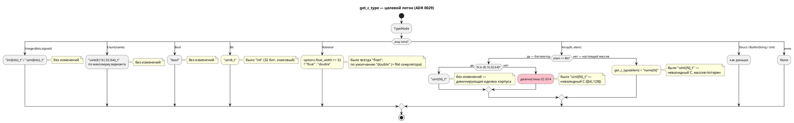

# Фича: Генератор C: отображение типов Array/Bit/Rational

- **Номер:** 0029
- **Статус:** **ГОТОВО** (закрыта 2026-07-15). Оба вопроса, блокировавшие
  закрытие, решены заказчиком: версия языка — **0.3.0** (подъём выполняет эта
  фича); [заглушки генератора C: диагностика вместо тихого пропуска](0028-c-generator-stubs.md) берёт **`CC-018`**.
  Снята с витрины `FEATURES.md`. См. «Итог» ниже и
  [отчёт](0029-c-type-mapping.md#отчёт-о-тестировании).
- **Зависит от:** **нет** (было: 0026 — снято закрытием 0026). Ключевой критерий
  фичи — «порождённый C **компилируется**» (весь смысл в том, что `uint4_t` —
  невалидный C). Пробой было установлено: до 0026 **ни один** порождённый
  заголовок не компилировался как C11 — даже модель без единого дефектного типа
  (`Triv *main` без `typedef` → `must use 'struct' tag`), то есть критерий A1 был
  недостижим в принципе. Теперь одиночная модель компилируется (`cc`: 8 ошибок →
  0, [отчёт 0026](0026-c-root-typedef.md#отчёт-о-тестировании)), и остаток ошибок на
  дефектных типах — ровно объём этой фичи.
- **Связанные issue (анализ):** новая фича (дефект выявлен при анализе
  [починка вычислителя выражений симулятора](0025-simulator-expression-eval.md) — проверке пригодности эталона C;
  зарегистрирована из блока «Кандидаты в фичи» `FEATURES.md`)
- **Крейт:** `grammar` (затрагивает `generator/c/mod.rs`, `generator/c/c_header.rs`)
- **Приоритет:** высокий (**Tier 2**) — генерация C в целевой язык есть основная
  цель проекта, и на трёх типах языка она выдаёт **невалидный C**.
  Ниже Tier 1 (0026) по двум причинам: (1) 0026 ломает C-цель **полностью**, а
  0029 — только на типах вне доминирующей идиомы; (2) господствующий в корпусе
  случай `[bit;8]`/`[bit;16]`/`[bit;32]` (45 из 46 вхождений) сегодня отображается
  **корректно** и настоящей правкой не меняется.

## Стадии жизненного цикла

Все стадии — **разделы этой карточки**: «Архитектура (ADR)»,
«Анализ», «Разработка», «Тест-план», «Отчёт о тестировании», «Итог».
Отдельным артефактом остаются только исправления —
[`docs/fixes/`](../fixes/README.md) (при необходимости `0029-YY-*`).

## Краткое описание

`get_c_type` (`generator/c/mod.rs:150`) отображает три типа языка в C неверно.
**`Array(size, elem)`** превращается в `uint{size}_t`, где `size` — число
элементов, а не разрядность: идиома бит-вектора `[bit;8]` → `uint8_t` попадает в
цель лишь по совпадению, а `[u8;4]` даёт **невалидный** `uint4_t` и теряет
размерность (при этом `data[0] := 7` эмитится как индексация скаляра).
**`Bit`** → `int` (32-битный знаковый) вместо 1-битной семантики.
**`Rational`** → `float` (f32), тогда как симулятор считает в f64
(`eval::Value::Real`), — расхождение точности прямо задокументировано в коде
(`eval/mod.rs:73-75`).

Фича вводит явное, проверяемое отображение каждого типа Lam в тип C: массив —
`elem_t name[N]`, бит-вектор `[bit;N]` (N ∈ {8,16,32,64}) — `uint{N}_t`, прочие
бит-векторы — диагностика `CC-014` вместо невалидного кода, `bit` — `uint8_t`,
`float` — `double` (с опцией `--float-width=32`). Правка **меняет вывод C** —
обоснование по своду в [анализе](0029-c-type-mapping.md#анализ).

Завершение фичи снимает сужение критерия **A8** фичи (сверка симулятора с C
была ограничена `Integer`/`Enum`/`Bool` именно из-за этих дефектов).

> **Решение заказчика (2026-07-15): умолчание `--float-width=64` подтверждено.**
> Аналитик выносил развилку на решение, поскольку выбор не бесплатен: `double`
> меняет ширину вещественного порта цели `c-hal` с **4 на 8 байт** — то есть
> чтение 8 байт из регистра MMIO там, где раньше читалось 4. Заказчик выбрал
> **8 байт**: совпадение с f64 симулятора важнее неизменности `c-hal`, иначе
> сверка симулятора с C по `Rational` недостижима без явного флага. Опция
> `--float-width=32` остаётся для платформ, где 8-байтное чтение недопустимо.
> Следствие для тест-плана: изменение ширины порта `c-hal` — **ожидаемый**
> результат, а не регресс; критерий A9 достижим умолчанием.

> Фича зарегистрирована из бэклога кандидатов `FEATURES.md`; далее проходит
> жизненный цикл по своду.

## Архитектура (ADR)

- **Status:** Accepted
- **Date:** 2026-07-15
- **Authors:** Архитектор + Системный аналитик + Дизайнер языка
- **Related issues:** [Фича](0029-c-type-mapping.md); опирается на
  [ADR](0025-simulator-expression-eval.md#архитектура-adr) (раздел «Пригодность эталона C» —
  там дефект впервые зафиксирован и сузил критерий A8); пересекается с
  [ADR](0020-port-address-decl.md#архитектура-adr) (цель `c-hal` потребляет C-тип порта для
  ширины доступа); заблокирован [фичей](0026-c-root-typedef.md)

### Context

Единственная точка отображения типов Lam в типы C — функция
`get_c_type(typ: &TypeNode, model: &ModelNode) -> Option<String>`
(`grammar/src/generator/c/mod.rs:150`) и её обёртка `get_typed_variable`
(там же, стр. 202). На трёх типах языка отображение неверно. Ниже — **факты,
перепроверенные пробами** на текущем `HEAD` (ветка `v2`), а не пересказ карточки
кандидата.

#### Фактическое отображение (проба `types.lam`)

Модель со всеми интересующими типами (все переменные **используются**, иначе их
срезает фильтр неиспользуемых, см. ниже) даёт:

```c
struct Types {
    int fl;             // var fl: bit
    uint4_t arr8;       // var arr8: [u8; 4]     ← НЕВАЛИДНЫЙ C, массив потерян
    bool bo;            // var bo: bool
    uint8_t b;          // var b: Byte = [bit;8] ← корректно (совпадение)
    float fr[4];        // var fr: [float; 4]    ← корректная форма (спецслучай)
    float r;            // var r: float          ← f32 против f64 симулятора
    uint128_t big;      // var big: U128 = [bit;128] ← НЕВАЛИДНЫЙ C
    enum { … } state;
};
```

`cc -std=c11` на этом выводе: `error: unknown type name 'uint4_t'`,
`error: unknown type name 'uint128_t'`.

#### Разбор трёх дефектов

1. **`Array(size, elem)` → `uint{size}_t`.** `size` — **число элементов**
   (`TypeNode::Array(u16, Box<TypeNode>)`, `semantic/type_node.rs:509`), но
   подставляется как **разрядность**. Совпадение спасает только идиому
   бит-вектора: `type Byte = [bit;8]` → `uint8_t` — «правильно» ровно потому, что
   для `[bit;N]` число элементов **и есть** разрядность. Вне этой идиомы:
   - `[u8;4]` → `uint4_t` — типа не существует; размерность массива исчезает;
     тело при этом эмитит `model->data[0] = 7;` — **индексация скаляра**;
   - `[bit;128]` → `uint128_t` — типа нет в стандартном C. Это не гипотетика:
     `examples/include/std.lam` **штатно объявляет** `type u128 = [bit; 128];`.
   - Исключение уже закодировано: `Array(_, Rational)` обрабатывается отдельно и
     даёт `float name[4]` (`get_typed_variable`, стр. 208–214) — **правильную
     форму массива**. То есть целевая форма `elem_t name[N]` в кодовой базе уже
     есть, просто применена к одному элементному типу из всех.
2. **`Bit` → `int`.** 32-битный **знаковый** тип для 1-битной величины.
3. **`Rational` → `float`.** f32 против f64 симулятора. Расхождение **уже
   задокументировано в коде** (`simulation/src/eval/mod.rs:73-75`): «S6: `bit` —
   один бит. Расходится с генератором C (`Bit` → `int`), но сверка по `Bit`
   анализом исключена: эталон C для него дефектен».

#### Что в карточке кандидата было неточно

Кандидат утверждает, что переменная-массив «**молча исчезает** из структуры…
тот же класс „тихого пропуска“, что и фича». **Проба это не подтверждает.**
Исчезновение вызвано **фильтром неиспользуемых переменных**
(`c_header.rs:344`: `if !map.usage().variables.contains(&name) { continue; }`),
который **не специфичен для массивов**: неиспользуемый **скаляр** `var ghost: u8`
исчезает ровно так же. Стоит массиву быть использованным — он появляется как
`uint4_t data;`. Это штатное устранение мёртвого кода, а не «тихий пропуск»
класса, и **в предмет данной фичи не входит**. Реальный дефект — не
исчезновение, а **невалидный C и сломанная индексация**. Уточнение важно: иначе
[генератор C: отображение типов Array/Bit/Rational](0029-c-type-mapping.md) «чинила» бы работающий по замыслу механизм.

#### Двойственность `Array`: бит-вектор или настоящий массив

Ключевая сила, определяющая решение. Тип `Array` в Lam несёт **две несводимые
роли**:

| Роль | Идиома | Инициализация в корпусе | Симулятор (`eval::coerce_array`) |
|---|---|---|---|
| **Бит-вектор** (машинное слово) | `type Byte = [bit;8]` | `const MAX: Byte := 0xFF;` — **скаляром** | требует `Value::Array` из 8 элементов |
| **Настоящий массив** | `var arr: [Byte;4]` | `:= { 0, 0, 0, 0 }` — списком | требует `Value::Array` из 4 элементов |

Отсюда — **расхождение, которое эта фича не закрывает и не может закрыть**:
генератор C считает `[bit;8]` скаляром `uint8_t`, а симулятор
(`eval/mod.rs:179`, `coerce_array`) — массивом из 8 значений; на скалярном
`0xFF` он вернул бы `NotCoercible`. Что есть `[bit;8]` — байт или восемь бит —
это **вопрос семантики языка**, а не генератора C, и он решается отдельной
фичей (см. Action items). ADR сознательно **консервирует** сегодняшнее
поведение C для бит-векторов и чинит всё остальное.

#### Поток «как есть» и целевой

Отображение типов — семантика порождаемого кода, поэтому целевое решение
задано диаграммой активности:



### Decision Drivers

1. **Порождаемый C обязан компилироваться.** Генерация C — основная цель проекта. Тип, который не существует в C (`uint4_t`, `uint128_t`), — не
   «неточность», а невыполнение назначения инструмента.
2. **Согласование с симулятором.** Симулятор — инструмент проверки моделей; его
   расхождение с C обесценивает обе стороны. Сужение критерия **A8** фичи
   (сверка только по `Integer`/`Enum`/`Bool`) — прямое следствие этих дефектов.
3. **Неизменность вывода для работающих типов.** `Integer`, `Enum`, `Bool` и
   идиома `[bit;8|16|32]` отображаются корректно; корпус (`examples/`,
   `tests/data/`) держится на них. Правка не должна их шевелить.
4. **Целевая платформа — промышленные контроллеры**. Ширина типа —
   не косметика: она определяет расход ОЗУ, стоимость операции без FPU и —
   через `c-hal` — **ширину доступа к регистру MMIO**.
5. **Явный отказ лучше молчаливой лжи.** Урок. Там, где представление в C
   невозможно (`[bit;128]`), нужна диагностика, а не синтаксически похожий мусор.

### Considered Options

Решение распадается на три независимых выбора. Опции рассмотрены по каждому из
трёх типов.

#### Отображение `Rational`

##### Option R-A. Оставить `float` (f32), симулятор округлять до f32

**Pros:**
- Вывод C не меняется; `c-hal` не трогается (ширина порта остаётся 4).
- Дёшево на МК без FPU двойной точности.

**Cons:**
- Правит **симулятор** ради дефекта **генератора** — чинит не ту сторону.
- Ломает `eval::Value::Real(f64)` — ядро, только что стабилизированное 0025;
  цена и риск несоизмеримы с задачей.
- Понижает точность вычислений там, где C-цель вообще не используется.

##### Option R-B. Всегда `double` (f64)

**Pros:**
- Совпадает с симулятором → A8 расширяется на `Rational` без оговорок.
- Одно правило, нечего конфигурировать.

**Cons:**
- **Меняет ширину порта в `c-hal` с 4 на 8** (проба: `Hal_In_RationalPort__ADDR`
  → `{ 0x1008u, -1, 4 }`). Для 32-битного регистра MMIO чтение 8 байт — **дефект
  на реальном железе**, а не смена типа.
- На МК без FPU двойной точности — заметная цена, навязанная всем.

##### Option R-C. `double` по умолчанию + опция `--float-width=32`

**Pros:**
- Верно по умолчанию (совпадает с f64 симулятора), а встраиваемый сценарий
  получает f32 **осознанно**.
- Точка расширения уже есть: `GenerateOptions`  — новый флаг
  ложится в существующий контракт, а не создаёт его.
- Позволяет закрыть риск R-B: у пострадавшего от ширины MMIO есть выход.

**Cons:**
- Ещё одна опция CLI: поверхность конфигурации и тестовая матрица растут.
- Смена умолчания всё равно ломает `c-hal` для тех, кто не задаст флаг.

#### Отображение `Bit`

##### Option B-A. `bool` (`<stdbool.h>`)

**Pros:**
- Ширина 1; читается как «логическая величина».
- `stdbool.h` уже подключён генератором.

**Cons:**
- **Сливает `bit` и `Bool`** — в языке это **разные** типы (`TypeNode::Bit` vs
  `TypeNode::Bool`), и симулятор их различает: `Bit` → `Value::Number(n & 1)`
  (целое 0/1), `Bool` → `Value::Boolean`. Отображение обоих в `bool` стёрло бы
  в C различие, которое язык проводит намеренно.
- `bit` участвует в арифметике и в бит-векторах (`[bit;8]` → `uint8_t`); `bool`
  как элемент байта концептуально не стыкуется.

##### Option B-B. `uint8_t`

**Pros:**
- Целочисленная семантика 0/1 — ровно то, что даёт симулятор
  (`Number(n & 1)`).
- Ширина 1 → `c-hal` читает из регистра 1 байт вместо 4 (**исправление**
  доступа к MMIO, а не регресс).
- Согласуется с правилом бит-вектора: `[bit;8]` → `uint8_t` = восемь таких бит.
- Не сливает `bit` с `Bool`.

**Cons:**
- Меняет вывод C для очень частого типа (`int flag;` → `uint8_t flag;`).
- Формально всё ещё 8 бит на 1 бит информации (истинной упаковки нет).

##### Option B-C. Битовое поле `unsigned x : 1;`

**Pros:**
- Единственный вариант с **настоящей** 1-битной шириной; упаковка флагов.

**Cons:**
- **У битового поля нельзя взять адрес** → несовместимо с `*(volatile T*)addr`
  цели `c-hal` и с любым указательным доступом. Это дисквалифицирует опцию:
  порты типа `bit` — основной сценарий языка.
- Раскладка битовых полей **определяется компилятором** (порядок, выравнивание)
  → непереносимо, а генератор обязан давать предсказуемый ABI.

##### Option B-D. Оставить `int`

**Pros:**
- Ничего не меняется.

**Cons:**
- 32 бита **со знаком** на 1-битную величину; `c-hal` читает 4 байта из
  битового регистра.
- Консервирует расхождение с симулятором, зафиксированное в `eval/mod.rs:73-75`.

#### Отображение `Array`

##### Option A-A. Всегда `elem_t name[N]`

**Pros:**
- Одно правило, никаких спецслучаев; полностью совпадает с `coerce_array`
  симулятора (массив из N элементов).

**Cons:**
- **Ломает идиому бит-вектора**: `[bit;8]` стало бы `uint8_t b[8]` (8 байт
  вместо 1), а `const MAX: Byte := 0xFF;` — скалярная инициализация массива —
  перестал бы иметь смысл. Это 45 из 46 вхождений массивов в корпусе.
- Де-факто меняет семантику языка через генератор — не полномочия ADR по
  генератору.

##### Option A-B. Всегда бит-вектор `uint{N}_t` (как сейчас)

**Pros:**
- Ничего не меняется.

**Cons:**
- Невалидный C для N ∉ {8,16,32,64} и для любого небитового элемента.
- Теряет размерность; эмитит индексацию скаляра.

##### Option A-C. Гибрид: `[bit;N]` — бит-вектор, прочее — настоящий массив

Правило: `Array(N, Bit)` при N ∈ {8,16,32,64} → `uint{N}_t`; `Array(N, Bit)`
при прочих N → диагностика `CC-014`; `Array(N, elem)` при `elem ≠ Bit` →
`get_c_type(elem) + " name[N]"`; невыразимый элемент → `CC-015`.

**Pros:**
- **Сохраняет ровно то, что работает** (все 45 бит-векторов корпуса), и чинит
  ровно то, что сломано.
- Обобщает уже существующий в коде спецслучай `Array(_, Rational)` →
  `float name[N]` до общего правила — не изобретает форму, а достраивает её.
- Невыразимое (`[bit;128]`) даёт **диагностику**, а не мусор (драйвер 5).
- Кодифицирует двойственность `Array` явно, в одном месте, вместо неявного
  совпадения чисел.

**Cons:**
- Спецслучай в отображении — правило перестаёт быть однострочным.
- `type u128 = [bit;128]` из `std.lam` становится **неэмитируемым в C** (сейчас
  «эмитируется» невалидным `uint128_t` — то есть не работает и так).
- Не устраняет расхождение с симулятором по `[bit;N]` — оно уходит в отдельную
  фичу.

### Decision

Принимается **Option R-C** (`double` по умолчанию, опция `--float-width=32`),
**Option B-B** (`Bit` → `uint8_t`), **Option A-C** (гибрид `Array`).

Обоснование связки:

- **A-C** — единственная опция, удовлетворяющая драйверам 1 и 3 одновременно:
  чинит невалидный C, не трогая идиому, на которой держится весь корпус. Она же
  честно очерчивает границу: генератор C не вправе решать, что есть `[bit;8]`, —
  он лишь фиксирует текущий ответ языка и отказывается там, где ответа нет.
- **B-B** — выбран **вопреки** интуитивному `bool` (B-A): симулятор моделирует
  `bit` как целое 0/1, а не как булево, и язык различает `Bit` и `Bool`. `uint8_t`
  сохраняет это различие, даёт правильную ширину MMIO и стыкуется с правилом
  бит-вектора. B-C дисквалифицирован технически (адрес битового поля).
- **R-C** — `double` по умолчанию требуется драйвером 2 (иначе A8 по `Rational`
  не расширить), а опция `--float-width=32` закрывает драйвер 4: без неё смена
  умолчания молча удваивает ширину доступа к вещественному регистру MMIO.

**Версия языка.** Синтаксис и семантика Lam не меняются, но
**наблюдаемая семантика порождаемого кода** меняется: точность `float` (f32 →
f64) и ширина `bit` (32 → 8 бит). Это видно пользователю языка, поэтому версия
языка поднимается **0.2.0 → 0.3.0** (minor: поведение изменено, исходники
остаются валидными). Решение пограничное — вынесено на подтверждение заказчику
в [анализе](0029-c-type-mapping.md#анализ), раздел «Открытые вопросы».

### Consequences

#### Положительные

- Порождаемый C компилируется на всех типах языка, для которых представление в C
  определено; для остальных — диагностика вместо мусора.
- Снимается сужение критерия **A8** фичи: сверка симулятора с C
  расширяется на `Rational` и на массивы небитовых элементов.
- `c-hal` начинает обращаться к битовому регистру на его настоящей ширине
  (1 байт вместо 4).
- Двойственность `Array` из неявного совпадения чисел становится явным,
  документированным и протестированным правилом.

#### Отрицательные / Action items

- **Вывод C меняется** для `bit` (`int` → `uint8_t`), `float` (`float` →
  `double`) и массивов небитовых элементов. Обоснование нарушения обратной
  совместимости — свод: в анализе, раздел «Особенности по обратной
  функциональности». Все эталоны C-тестов пересобрать зондом (CLAUDE.md: сперва
  зонд, затем assertions — не угадывать строки).
- **Цель `c-hal` меняется**: таблицы `*__ADDR` получат `width` 1 для `bit`
  (было 4) и 8 для `float` при `--float-width=64` (было 4). Проверено пробой.
  Это единственное место, где `get_c_type` потребляется **не** для объявления, —
  `width_from_ctype`/`port_ctype` (`c_header.rs:617-635`); его надо править
  согласованно, иначе `bool`/`uint8_t` попадёт в `_ => 4`.
- **Блокировка 0026.** Критерий «C компилируется» недостижим, пока корневая
  структура не получает `typedef` (проба: **ни один** порождённый заголовок не
  собирается как C11). 0029 не начинать до закрытия 0026.
- **`std.lam` теряет эмиссию `u128`** в C (`CC-014`). Сегодня она даёт невалидный
  `uint128_t`, то есть не работает и так; но факт зафиксировать в документации
  языка.
- **Остаётся расхождение по `[bit;N]`**: C видит скаляр, симулятор — массив из N
  бит. A8 на `[bit;N]` **не** расширяется. Требуется отдельная фича «семантика
  бит-вектора в языке и симуляторе» — предложена координатору в анализе.

#### Acceptance criteria

1. Для каждого типа Lam с определённым отображением порождённый C
   **компилируется** `cc -std=c11 -Wall -Werror` (после 0026).
2. `[u8;4]` → `uint8_t data[4]`; индексация `data[0] := 7` — валидный доступ к
   элементу массива.
3. `[bit;8|16|32|64]` → `uint{N}_t` — вывод **байт-в-байт** как до правки.
4. `[bit;128]` → диагностика `CC-014` и ненулевой код возврата CLI; невалидного
   `uint128_t` в выводе нет.
5. `bit` → `uint8_t`; `float` → `double` (по умолчанию) и `float` при
   `--float-width=32`.
6. Вывод для `Integer`/`Enum`/`Bool`/`Struct` — **байт-в-байт** как до правки.
7. Таблицы `c-hal *__ADDR` содержат `width` 1 для `bit`-порта и 8 для
   `float`-порта при умолчании; проверено против зонда.
8. Значения `Rational` и массивов небитовых элементов сходятся между симулятором
   и порождённым C (расширение A8 фичи).

## Анализ

### Цель и контекст

Привести отображение типов Lam в типы C к явному, полному и **проверяемому**
виду: порождённый C обязан компилироваться, а там, где представление в C не
определено, — выдавать диагностику вместо синтаксически похожего мусора.

Дефект выявлен при анализе [починка вычислителя выражений симулятора](0025-simulator-expression-eval.md#анализ) в разделе
«Пригодность эталона C» и **сузил** её критерий **A8**: сверка симулятора с
порождённым C была ограничена `Integer`/`Enum`/`Bool` — «эталон непригоден для
`Rational`, `Array` и `Bit`: генератор C сам дефектен на этих типах. Сверять с
ним — значит зафиксировать его дефекты». 0025 закрыта, сужение осталось. 0029
снимает причину сужения.

Решение — [ADR](0029-c-type-mapping.md#архитектура-adr): `Array` — гибрид
(бит-вектор `[bit;N]` → `uint{N}_t`, прочее → `elem_t name[N]`), `Bit` →
`uint8_t`, `Rational` → `double` с опцией `--float-width=32`.

#### Результаты проб (перепроверка кандидата на `HEAD`, ветка `v2`)

Все утверждения карточки кандидата перепроверены пробами; ниже — факт, а не
пересказ. Фикстуры проб — `types.lam`, `arr.lam`, `arr2.lam`, `hal.lam`,
`unused_scalar.lam`, `triv.lam` (в тест-плане закреплены как постоянные).

| Тип Lam | Факт: C сегодня | Валиден как C11? | Симулятор | Вердикт |
|---|---|---|---|---|
| `bit` | `int` | да, но 32 бита **со знаком** | `Value::Number(n & 1)` | **подтверждён** |
| `bool` | `bool` | да | `Value::Boolean` | корректно |
| `float` | `float` (f32) | да | `Value::Real(**f64**)` | **подтверждён** |
| `u16` | `uint16_t` | да | `Number` | корректно |
| `[bit;8]` → `Byte` | `uint8_t` | да | `Value::Array` из 8 | форма верна **по совпадению** |
| `[bit;128]` → `u128` | `uint128_t` | **НЕТ** | — | **новый факт** |
| `[u8;4]` | `uint4_t` | **НЕТ**, массив потерян | `Value::Array` из 4 | **подтверждён** |
| `[float;4]` | `float fr[4]` | да | `Value::Array` из 4 | **новый факт**: форма уже верна |

Расхождения с текстом кандидата:

1. **Номер строки актуален**: `get_c_type` — `generator/c/mod.rs:150`, как и
   указано.
2. **«Переменная-массив молча исчезает из структуры… тот же класс „тихого
   пропуска“, что и фича» — не подтверждено.** Исчезновение вызвано
   **фильтром неиспользуемых переменных** (`c_header.rs:344`), который не
   специфичен для массивов: неиспользуемый **скаляр** `var ghost: u8` исчезает
   так же (проба `unused_scalar.lam`). Стоит массиву быть использованным
   (`data[0] := 7`) — он появляется как `uint4_t data;`. Это штатное устранение
   мёртвого кода. Настоящий дефект — **невалидный C и индексация скаляра**
   (`model->data[0] = 7;` при `uint4_t data;`), а не пропажа. В предмет 0029
   фильтр **не входит**.
3. **`Array(_, Rational)` уже отображается правильной формой** `float name[N]`
   (`get_typed_variable`, `mod.rs:208-214`) — кандидат об этом не упоминает.
   Целевая форма `elem_t name[N]` в кодовой базе уже есть; 0029 обобщает её.
4. **`[bit;N]` при N ∉ {8,16,32,64} даёт невалидный C** — кандидат этого не
   называет, а случай не гипотетический: `examples/include/std.lam` штатно
   объявляет `type u128 = [bit; 128];`.
5. **Цель `c-hal` затронута** — кандидат не упоминает. `get_c_type` потребляется
   `width_from_ctype`/`port_ctype` (`c_header.rs:617-635`) для **ширины доступа
   к MMIO**. Проба `hal.lam` (`-t c-hal`):
   `[HAL_SENSOR] = { 0x1000u, -1, 4 }` — битовый порт читается **4 байтами**;
   `[HAL_TEMP] = { 0x1008u, -1, 4 }` — вещественный порт 4 байта.
   После правки: `bit` → 1, `float` → 8 (при умолчании). Это **меняет вывод
   `c-hal`**.
6. **Расхождение по `[bit;N]` шире, чем думал кандидат.** Симулятор
   (`eval/mod.rs:179`, `coerce_array`) трактует `[bit;8]` как **массив из 8
   значений** и на скалярном `0xFF` вернул бы `NotCoercible`, тогда как корпус
   пишет `const MAX: Byte := 0xFF;`, а C даёт скаляр `uint8_t`. То есть даже
   «правильный» `uint8_t` расходится с симулятором. Это **вопрос семантики
   языка**, не генератора (см. «Открытые вопросы»).
7. **Массивы в симуляторе не покрыты тестами вообще**: в
   `simulation/tests/data/eval/` нет ни одной фикстуры с `[bit`/`[u8`/`[float`.
8. **Ни один порождённый C не компилируется сегодня** — см. «Зависимости фичи».

### Зависимости фичи

- **Зависит от: `0026`** («Генератор C: typedef корневой структуры для
  одиночной модели»).

  **Обоснование (проба, а не рассуждение).** Центральный критерий 0029 —
  «порождённый C **компилируется**» (A1): весь смысл фичи в том, что `uint4_t`
  невалиден. Проба `triv.lam` — модель **без единого дефектного типа** (только
  `int flag;`):

  ```
  cc -std=c11 -c triv.c
  triv.h:18:16: error: must use 'struct' tag to refer to type 'Triv'
     18 | void Triv_init(Triv *main);
  ```

  То есть **ни один** порождённый заголовок сегодня не собирается как C11 —
  независимо от типов. Пока 0026 не закрыта, A1 недостижим **в принципе**, а
  проверить «уходит ли `uint4_t`» можно было бы лишь на подправленном вручную
  артефакте — то есть проверять не то, что выпускает компилятор. Это ровно
  случай своду: «без завершения которых её **нельзя** разрабатывать».
  Фича переводится в **`ЗАБЛОКИРОВАНА`** (статус ортогонален стадии проработки:
  проработка доведена до `РАЗРАБОТКА`, брать в работу — после 0026).

  Зависимость дешёвая: 0026 — добавление `typedef struct X X;`, что делает её
  естественным Tier 1 и не задерживает 0029 надолго.

- **Проверены и отвергнуты как зависимости:**

  | Фича | Пересечение | Вердикт |
  |---|---|---|
  | **0028** «Заглушки генератора C: диагностика вместо тихого пропуска» | 0029 вводит `CC-014`/`CC-015` — диагностику вместо мусора; та же идея | **не зависимость**: 0029 заводит свои коды самостоятельно, механизм `Diagnostic`/`with_code` уже есть (`CC-001`…`CC-013`). Связь **обратная**: 0029 задаёт прецедент и формат, на который 0028 обобщит остальные пропуски. Рекомендуется **0029 → 0028**. |
  | **0025** «Починка вычислителя выражений симулятора» | Источник фичи; её A8 сужен из-за этих дефектов | **не зависимость**: закрыта (`ГОТОВО`), ядро `eval` стабильно и правки не требует. |
  | **0034** «Структурные типы в симуляторе» | Обе питают сверку симулятор↔C | **не зависимость**: 0034 добавляет `Struct` в `Value` симулятора (сейчас `EvalError::UnsupportedType`), 0029 — типы **со стороны C**. Пересечения по коду нет: `TypeNode::Struct` → `get_c_type` возвращает имя структуры и уже корректен. Порядок между ними свободный. |
  | **0020** «Адрес порта» | `c-hal` потребляет `get_c_type` для ширины MMIO | **не зависимость**: закрыта; 0029 меняет её **вывод**, но не контракт. Учтено в A7 и в задаче `0029-02`. |
  | **0027** «Размер модуля» | `generator/c/mod.rs` — 21 КБ, порога ~1000 строк не нарушает | **не зависимость**. |

- **Влияние на порядок разработки:**
  - **0026 → 0029 → 0028.** 0026 поднимается на первую позицию по критерию 4
    («аналитик вправе поднять фичу, разблокирующую другие»): она
    тривиальна, но без неё C-цель не собирается **вообще**, и она блокирует
    проверяемость.
  - Завершение 0029 **формально не разблокирует** ни одну заведённую фичу, но
    снимает содержательное ограничение: **сужение критерия A8 фичи**
    (сверка симулятора с C по `Rational` и массивам). 0025 закрыта, поэтому
    расширение A8 оформляется **не** правкой её артефактов, а задачей
    `0029-04` в границах 0029 (сверка по типам, которые 0029 чинит).
  - 0029 **не** снимает сужение A8 по `[bit;N]` — см. «Открытые вопросы».

### Требования и проверяемые условия

- **R1. Валидность C.** Для любого типа Lam, для которого отображение
  определено, порождённый C компилируется `cc -std=c11 -Wall -Werror`.
- **R2. Полнота отображения.** `get_c_type` не имеет ветки, порождающей
  несуществующий тип C. Для невыразимого — `None` + диагностика, не строка.
- **R3. Массив остаётся массивом.** `Array(N, elem)` при `elem ≠ Bit` →
  `get_c_type(elem) + " name[N]"`; индексация `name[i]` — валидный доступ к
  элементу.
- **R4. Бит-вектор консервируется.** `Array(N, Bit)` при N ∈ {8,16,32,64} →
  `uint{N}_t` — **байт-в-байт** как до правки.
- **R5. Явный отказ.** `Array(N, Bit)` при N ∉ {8,16,32,64} → диагностика
  `CC-014`, ненулевой код возврата CLI, файлы не пишутся. Невыразимый элемент
  массива → `CC-015`.
- **R6. `Bit` — целое 0/1.** `Bit` → `uint8_t` (не `bool`: язык различает `Bit`
  и `Bool`, симулятор даёт `Number(n & 1)` против `Boolean`).
- **R7. `Rational` = f64 по умолчанию.** `Rational` → `double`; при
  `--float-width=32` → `float`. Умолчание совпадает с `eval::Value::Real(f64)`.
- **R8. Неизменность работающего.** Вывод для `Integer`/`Enum`/`Bool`/`Struct`/
  `BuiltinString`/`Unit` — байт-в-байт как до правки.
- **R9. Согласованность `c-hal`.** `width_from_ctype` правится согласованно с
  `get_c_type`: `uint8_t` → 1, `double` → 8. Ни один C-тип, порождаемый
  `get_c_type`, не попадает в ветку `_ => 4` по недосмотру.
- **R10. Сверка с симулятором.** Значения `Rational` и массивов небитовых
  элементов совпадают между симулятором и порождённым C (расширение A8 фичи).
- **R11. Инвариант `ref`.** Правка не затрагивает разрешение условий рёбер
  (`Condition::Unresolved`) — охраняется тестом `syntax_simple`.

### Критерии приёмки и способ проверки

| # | Критерий | Способ проверки |
|---|---|---|
| A1 | Порождённый C компилируется (R1) | тест `c_compile_tests.rs`: прогон `cc -std=c11 -Wall -Werror` по выводу для каждой фикстуры; **требует 0026** |
| A2 | `[u8;4]` → `uint8_t data[4]`, `data[0]` — валидный элемент (R3) | зонд + assertion на строку объявления и на тело `.c` |
| A3 | `[bit;8|16|32|64]` → `uint{N}_t` байт-в-байт (R4) | эталонная сверка вывода до/после правки на корпусе `examples/` |
| A4 | `[bit;128]` → `CC-014`, ненулевой код CLI, нет `uint128_t` (R5) | контрпример + проверка кода возврата `lamc` |
| A5 | `bit` → `uint8_t`; `float` → `double`; `--float-width=32` → `float` (R6, R7) | assertion по зонду на все три случая |
| A6 | Вывод для `Integer`/`Enum`/`Bool`/`Struct` байт-в-байт (R8) | эталонная сверка на корпусе; `git diff` артефактов до/после |
| A7 | `c-hal`: `width` = 1 для `bit`-порта, 8 для `float`-порта, 2 для `u16` (R9) | зонд `hal.lam -t c-hal` + assertion на таблицу `*__ADDR` |
| A8 | Нет ветки `get_c_type`, дающей несуществующий тип C (R2) | ревью + исчерпывающий `match` без `_ =>` по `TypeNode` |
| A9 | Значения `Rational` и массивов сходятся симулятор ↔ C (R10) | расширение `conformance_c_tests.rs` (задача `0029-04`) |
| A10 | Инвариант `ref` не затронут (R11) | тест `syntax_simple` |
| A11 | Тест, падающий на текущем коде, зелёный после правки (защита от регресса **класса**) | добавить тест на `[u8;4]`; проверить падение на `HEAD` до правки |
| A12 | Полный прогон зелёный | `cargo test --all-features -- --test-threads=1`; `./scripts/precheck.sh` |

### Особенности по обратной функциональности

свод требует обосновать нарушение обратной совместимости. **Правка меняет
вывод C** — обоснование ниже.

**Что именно меняется.** Три класса вывода:

| Изменение | Затронуто в корпусе | Обоснование |
|---|---|---|
| `bit` → `int` ⟹ `uint8_t` | часто (порты/флаги) | Текущее — 32 бита **со знаком** на 1-битную величину. Через `c-hal` это ещё и **чтение 4 байт из битового регистра MMIO** — дефект на реальном железе (проба `hal.lam`). Сохранять нечего: менять нужно именно потому, что текущее поведение неверно. |
| `float` → `float` ⟹ `double` | **0 вхождений** | В `examples/` нет ни одного `float`. Цена смены умолчания для существующего кода — **нулевая**; для тех, кому нужен f32 (МК без FPU), введена опция `--float-width=32`. |
| `[T;N]`, `T ≠ bit` ⟹ `T name[N]` | **1 вхождение** (`[Byte;4]`) | Текущий вывод `uint4_t` — **невалидный C**. Сломать нельзя то, что не собиралось: обратной совместимости здесь не существует, есть лишь переход от неработающего к работающему. |
| `[bit;N]`, N ∉ {8,16,32,64} ⟹ `CC-014` | `std.lam::u128` (объявление без использования) | Сейчас даёт `uint128_t` — невалидный C. Замена «не собирается» на «внятная диагностика» — улучшение, а не регресс. |

**Что сохраняется байт-в-байт** (R4, R8, критерии A3/A6): `Integer`, `Enum`,
`Bool`, `Struct`, `BuiltinString`, `Unit` и **все 45 бит-векторов корпуса**
(`[bit;8]` ×29, `[bit;16]` ×13, `[bit;32]` ×3). Это и есть основной довод
соразмерности: **45 из 46** вхождений массивов и 100 % вхождений остальных типов
не меняются — правка точечная, а не переписывание отображения.

**Вывод.** Обратная совместимость нарушается **осознанно и в минимальном
объёме**. Во всех трёх случаях «старое поведение» — это либо невалидный C (не
поведение вовсе), либо поведение, признанное дефектным ADR и подтверждённое
пробой. Сохранение совместимости означало бы консервацию дефекта, что прямо
противоречит цели проекта (синтез моделей в целевой язык).
Единственный случай, где старое поведение было рабочим и его сохранение имеет
цену, — ширина вещественного порта в `c-hal` (4 → 8); он закрыт **опцией**
`--float-width=32`, а не отказом от правки.

**Миграция.** Смена версии языка 0.2.0 → 0.3.0 (обоснование — в
ADR). Изменение выражается в перегенерации C; правки исходников `.lam` не
требуется ни в одном случае. Автомиграция (по образцу `0021-03-migrator`) **не
нужна** — язык не изменился.

### Открытые вопросы (на решение заказчика)

1. **Семантика бит-вектора `[bit;N]` — предложение завести отдельную фичу.**
   Проба вскрыла расхождение шире предмета 0029: C трактует `[bit;8]` как скаляр
   `uint8_t`, симулятор (`coerce_array`) — как массив из 8 значений, а корпус
   инициализирует его **скаляром** (`const MAX: Byte := 0xFF;`), что
   `coerce_array` отверг бы как `NotCoercible`. Три ответа на вопрос «что есть
   `[bit;8]`» противоречат друг другу. Это **вопрос семантики языка**, а не
   генератора C: 0029 не вправе его решать и сознательно консервирует поведение
   C. Пока он открыт, критерий A8 фичи **не расширяется на `[bit;N]`**.
   Предлагается кандидат в `FEATURES.md`: «Семантика бит-вектора
   `[bit;N]`: скаляр или массив — согласовать язык, симулятор и генератор C».
   Заводит координатор — правка `FEATURES.md` вне границ этой задачи.
2. **Версия языка 0.3.0 — подтвердить.** Синтаксис и семантика Lam не меняются,
   меняется наблюдаемая семантика **порождаемого** кода (точность `float`,
   ширина `bit`). Трактовка свод пограничная: если заказчик считает, что
   правило говорит только о синтаксисе/семантике самого языка, версия остаётся
   0.2.0, а поднимается лишь версия крейта.
3. **Умолчание `--float-width`.** Принято `64` (совпадение с симулятором важнее).
   Если приоритет — неизменность `c-hal` для существующих сборок, умолчание
   следует сделать `32`; тогда A9 (сверка по `Rational`) достижима только с явным
   флагом.

### Риски и зависимости

| Риск | Оценка | Снижение |
|---|---|---|
| **0026 не закрыта** → A1 непроверяем | подтверждён пробой (`triv.lam` не собирается) | статус `ЗАБЛОКИРОВАНА`; 0026 поднята в порядке; 0026 тривиальна |
| **`c-hal` тихо разъедется** с `get_c_type`: новый тип попадёт в `_ => 4` | высокий — `width_from_ctype` сопоставляет **строки** C-типов; `bool`/`uint8_t`/`double` там уже перечислены частично | R9 + критерий A7 (зонд на таблицу `*__ADDR`); правка `width_from_ctype` включена в задачу `0029-02`, а не отложена |
| **Эталоны C-тестов угаданы, а не сняты зондом** | средний — CLAUDE.md прямо предупреждает | правило: сперва зонд, затем assertions против **захваченных** значений (задачи `0029-01`…`03`) |
| **Смена умолчания `float` ударит по чужой сборке `c-hal`** (ширина 4 → 8) | низкий — в корпусе `float` не используется вовсе | опция `--float-width=32`; изменение описано в документации языка |
| **Расширение A8 упрётся в `[bit;N]`** | подтверждён | A8 расширяется только на `Rational` и небитовые массивы; `[bit;N]` вынесен в открытый вопрос 1 |
| **Массивы не покрыты тестами симулятора** (`tests/data/eval/` пуст по массивам) | подтверждён | задача `0029-04` заводит фикстуры на значения (`Unit::variable`), а не на факт перехода — по уроку |
| **`u128` из `std.lam` станет неэмитируемым** | низкий | сегодня даёт невалидный C; факт фиксируется в документации языка (задача `0029-04`) |

### Декомпозиция задач разработки

Аналитика **не декомпозируется** на `0029-YY-*.md`: объём связный (одна таблица
отображения, одна функция `get_c_type`), а разнесение по файлам разорвало бы
именно то, что должно быть согласовано. Декомпозиция — в разработке, по типам
(как и требует предмет фичи):

| Задача | Содержание | Зависит от |
|---|---|---|
| [генератор C: отображение типов Array/Bit/Rational](0029-c-type-mapping.md#разработка) | `Array`: гибрид (бит-вектор / настоящий массив), диагностики `CC-014`/`CC-015` | 0026 |
| [генератор C: отображение типов Array/Bit/Rational](0029-c-type-mapping.md#разработка) | `Bit` → `uint8_t`; согласованная правка `width_from_ctype` (`c-hal`) | 0026 |
| [генератор C: отображение типов Array/Bit/Rational](0029-c-type-mapping.md#разработка) | `Rational` → `double`; опция `--float-width` в `GenerateOptions`/CLI | 0026 |
| [генератор C: отображение типов Array/Bit/Rational](0029-c-type-mapping.md#разработка) | Расширение сверки с симулятором (A8 фичи); примеры в документации языка | 01, 02, 03 |

## Разработка

### Задача

> **Статус: Выполнена** (ядро — 2026-07-15, `fbd4264`; диагностики
> `CC-014`/`CC-015` — 2026-07-15, `d9c4fe0`). Блокировка фичей снята её
> закрытием.

#### Что было

**Реальное состояние кода на `HEAD` (ветка `v2`), проверено пробами.**

`grammar/src/generator/c/mod.rs:150`, `get_c_type`:

```rust
TypeNode::Array(size, typ) => {
    if let TypeNode::Rational = **typ {
        Some("float *".to_string())
    } else {
        Some(format!("uint{}_t", *size))
    }
}
```

и `get_typed_variable` (там же, стр. 202):

```rust
TypeNode::Array(size, typ) => {
    if let TypeNode::Rational = **typ {
        Some(format!("float {}[{}]", name.clone().unwrap().as_str(), *size))
    } else {
        Some(format!("uint{}_t {}", *size, name.clone().unwrap().as_str()))
    }
}
```

`size` — **число элементов** (`TypeNode::Array(u16, Box<TypeNode>)`,
`semantic/type_node.rs:509`), но подставляется как **разрядность**. Следствия
(проба `types.lam`, вывод захвачен, не угадан):

| Исходник | Порождается | Валиден как C11? |
|---|---|---|
| `type Byte = [bit;8]; var b: Byte;` | `uint8_t b;` | да — **по совпадению**: для `[bit;N]` число элементов и есть разрядность |
| `var arr8: [u8;4];` (используется) | `uint4_t arr8;` | **нет**: `error: unknown type name 'uint4_t'`; массив потерян |
| `type U128 = [bit;128]; var big: U128;` | `uint128_t big;` | **нет**: `error: unknown type name 'uint128_t'`. `u128` штатно объявлен в `examples/include/std.lam` |
| `var fr: [float;4];` | `float fr[4];` | да — **правильная форма уже существует**, но только для `Rational` |

Тело при этом эмитит индексацию скаляра: для `var data: [u8;4]` + `data[0] := 7`
в `.c` попадает `model->data[0] = 7;` при объявлении `uint4_t data;`.

**Уточнение против карточки кандидата.** Кандидат утверждал, что
переменная-массив «молча исчезает из структуры». Проба **не подтверждает**:
исчезновение вызвано фильтром неиспользуемых переменных (`c_header.rs:344`,
`if !map.usage().variables.contains(&name) { continue; }`), который не специфичен
для массивов — неиспользуемый скаляр `var ghost: u8` исчезает так же. Стоит
массиву быть использованным — он появляется как `uint4_t data;`. Фильтр работает
по замыслу и **в предмет задачи не входит**.

#### Что сделано

> **Ядро отображения реализовано 2026-07-15** (`get_c_type`/`get_typed_variable`,
> 14 юнит-тестов). **Не сделано:** диагностики `CC-014`/`CC-015` — сейчас
> непредставимый тип даёт `None`, то есть переменная исчезает **молча**; и
> **новый дефект, вскрытый этой же правкой** (см. ниже).

##### Итог

| Вход | Было | Стало |
|---|---|---|
| `[u8;4]` | `uint4_t data` — **невалидный C**, размерность потеряна | `uint8_t data[4]` |
| `[bit;8]`, `[bit;16]`, `[bit;32]` | `uint8_t`/`uint16_t`/`uint32_t` | **без изменений** (доминирующая идиома, 45 из 46 вхождений) |
| `[bit;128]` | `uint128_t` — **невалидный C** | `None` (пока молча — нужен `CC-014`) |
| `[float;4]` | `float fr[4]` (форма верна, но только для `Rational`) | `double fr[4]` — правило обобщено на все типы элемента |
| `bit` (Д2) | `int` — 32-битный **знаковый** | `uint8_t` |
| `float` (Д3) | `float` (f32) против f64 симулятора | `double` |

Живая проверка: одиночные модели компилируются (`cc`: 0 ошибок) обеими целями.
1621 тест зелёный, `precheck.sh` = 0.

##### новый дефект, вскрытый этой правкой: инициализатор массива

`var data: [u8; 4] := 0;` (форма, которой объявлен корпус) эмитит в `_init`:

```c
model->data = 0;   /* error: array type 'uint8_t[4]' is not assignable */
```

**Раньше это не проявлялось** потому, что `uint4_t data` был скаляром: тип
невалиден, но присваивание `= 0` синтаксически «сходилось». Стоило массиву стать
настоящим — вылез инициализатор. То есть **правка Д1 не сломала ничего, а обнажила
второй дефект того же места**, ранее замаскированный первым.

Скалярный литерал массиву в C не присвоить (как и в ST — там это решено
пропуском инициализатора). Варианты: не эмитить инициализатор для
составных типов; `memset`; поэлементно. **В план 0029-01 не входило** — требует
решения и отдельной задачи.

Реализовано гибридное правило (ADR, Option A-C) в `get_c_type` /
`get_typed_variable`:

1. `Array(N, Bit)`, N ∈ {8,16,32,64} → `uint{N}_t` — **без изменений**
   (консервация доминирующей идиомы; 45 из 46 вхождений корпуса).
2. `Array(N, Bit)`, N ∉ {8,16,32,64} → `None` + диагностика **`CC-014`**
   («бит-вектор шириной N не представим в C; допустимо 8/16/32/64»).
3. `Array(N, elem)`, `elem ≠ Bit` → `get_c_type(elem)` + `" name[N]"`.
   Обобщает существующий спецслучай `Array(_, Rational)` → `float name[N]` на
   все элементные типы.
4. `Array(N, elem)`, где `get_c_type(elem) == None` → диагностика **`CC-015`**
   («тип элемента массива не представим в C»).
5. Убрать `Some("float *")` из `get_c_type` для `Array(_, Rational)`: указатель
   там был подпоркой под отсутствие общей формы массива.

Коды `CC-014`/`CC-015` — следующие свободные (занято `CC-001`…`CC-013`).

**Статус по функциональности:**

| Функциональность | Статус |
|---|---|
| Цель `c` | **меняется**: `[T;N]`, `T ≠ bit` → `T name[N]` (было невалидное `uint{N}_t`); `[bit;N]` при N ∉ {8,16,32,64} → `CC-014`. `[bit;8|16|32|64]` — байт-в-байт как было |
| Цель `c-hal` | **н/п** в этой задаче: массивы портами не бывают. Ширину правит `0029-02` |
| Цель `plantuml` | **н/п** — C-типы не потребляет |
| Симулятор | **н/п** — правка в `grammar`; сверка расширяется задачей `0029-04` |
| Семантика/LSP/форматтер | **н/п** — `TypeNode` не меняется |

#### Проверки

> **Планируется (разработка не начата).** Ожидаемые результаты ниже —
> из тест-плана; фактические заполняются при выполнении.

**Методика (CLAUDE.md).** Сперва **зонд** для захвата реального вывода, затем
assertions против **захваченных** значений. Строки объявлений не угадывать.
Во всех фикстурах переменная обязана **использоваться**, иначе её срежет фильтр
`c_header.rs:344` и тест «пройдёт», ничего не проверив.

| Проверка тест-плана | Ожидаемый результат | R/A |
|---|---|---|
| T1 | `uint8_t data[4];` + `model->data[0] = 7;`; компилируется | R3 / A2 |
| T2 | `[Byte;4]` → `uint8_t arr[4];` (было `uint4_t arr;`) | R3 / A2 |
| T3 | `[float;4]` → `double fr[4];` (совместно с `0029-03`) | R3 / A2 |
| T4, T5 | `[bit;8|16|32|64]` → `uint{N}_t` — **байт-в-байт** как до правки | R4 / A3 |
| T13 | `[bit;128]` → `CC-014`, ненулевой код `lamc`, файлы не записаны | R5 / A4 |
| T14 | `[bit;4]` → `CC-014`, не `uint4_t` | R5 / A4 |
| T15 | массив невыразимого элемента → `CC-015` | R5 / A8 |
| T20 | тест T1 **красный на `HEAD` до правки** — доказывает, что ловит дефект | A11 |
| T22 | `match` по `TypeNode` без `_ =>`; нет ветки с несуществующим типом C | R2 / A8 |

**Команды:**

```sh
cargo build --bin lamc
cargo test --all-features -- --test-threads=1
./scripts/precheck.sh
### Компиляция порождённого C (требует 0026):
cc -std=c11 -Wall -Werror -c <out>/<model>.c
```

### Задача

> **Статус: Выполнена** (`bit` → `uint8_t` — `fbd4264`; согласование
> `width_from_ctype` и `CC-016` — `d9c4fe0`). Блокировка фичей снята её
> закрытием.

#### Что было

**Реальное состояние кода на `HEAD` (ветка `v2`), проверено пробами.**

`grammar/src/generator/c/mod.rs:152`:

```rust
TypeNode::Bit => Some("int".to_string()),
TypeNode::Bool => Some("bool".to_string()),
```

`bit` — 1-битная величина языка (`TypeNode::Bit`, `semantic/type_node.rs:503`:
«1-битный примитив») — отображается в `int`: **32 бита со знаком**. Проба
`types.lam` подтверждает: `var fl: bit;` → `int fl;`.

Симулятор трактует `bit` иначе — `simulation/src/eval/mod.rs:73-75`:

```rust
// S6: `bit` — один бит. Расходится с генератором C (`Bit` → `int`), но
// сверка по `Bit` анализом исключена: эталон C для него дефектен.
TypeNode::Bit => Ok(Value::Number(to_integer(&value, ty)? & 1)),
```

То есть расхождение **уже зафиксировано в коде** как известный дефект, и именно
оно сузило критерий A8 фичи.

**Существенно: `Bit` и `Bool` — разные типы.** Симулятор даёт для `Bit`
`Value::Number(n & 1)` (целое 0/1), а для `Bool` — `Value::Boolean`. Отображение
обоих в `bool` слило бы различие, которое язык проводит намеренно.

**Связь с `c-hal` (не упомянута в карточке кандидата).** `get_c_type` — не только
источник объявлений: его строку потребляет `width_from_ctype`
(`c_header.rs:617-625`) для **ширины доступа к регистру MMIO**:

```rust
fn width_from_ctype(ct: &str) -> u8 {
    match ct {
        "uint8_t" | "int8_t" | "bool" => 1,
        "uint16_t" | "int16_t" => 2,
        "uint64_t" | "int64_t" | "double" => 8,
        // "uint32_t"/"int32_t"/"float"/"int" и всё прочее — 4 байта.
        _ => 4,
    }
}
```

`"int"` попадает в `_ => 4`. Проба `hal.lam -t c-hal` (вывод захвачен):

```c
static const Hal_PortBinding Hal_In_BitPort__ADDR[] = {
    [HAL_SENSOR] = { (uintptr_t)0x1000u, -1, 4 },   // ← битовый порт: 4 байта
};
static const Hal_PortBinding Hal_In_NumericPort__ADDR[] = {
    [HAL_LEVEL] = { (uintptr_t)0x100Cu, -1, 2 },    // u16 — корректно
};
```

Битовый порт читается **4 байтами** — на реальном железе это доступ за пределы
однобайтового регистра.

#### Что сделано

> **Планируется (разработка не начата).**

1. `TypeNode::Bit` → `"uint8_t"` (ADR, Option B-B). Обоснование выбора
   **против** интуитивного `bool` (Option B-A): симулятор моделирует `bit` как
   целое 0/1, а не булево; `bool` слил бы `Bit` с `Bool`; `uint8_t` согласуется
   с правилом бит-вектора (`[bit;8]` → `uint8_t` = восемь таких бит).
   Битовое поле `unsigned x : 1` (Option B-C) дисквалифицировано: у него
   **нельзя взять адрес** → несовместимо с `*(volatile T*)addr` цели `c-hal`.
2. `TypeNode::Bool` → `"bool"` — **без изменений**.
3. **Согласовать `width_from_ctype`** (R9): убедиться, что `uint8_t` уже даёт 1,
   и что ни один C-тип, порождаемый `get_c_type`, не проваливается в `_ => 4` по
   недосмотру. Ветку `_ => 4` рассмотреть на предмет замены явным перечислением:
   молчаливое умолчание — тот же класс дефекта, что и вся фича.

**Статус по функциональности:**

| Функциональность | Статус |
|---|---|
| Цель `c` | **меняется**: `int flag;` → `uint8_t flag;`. Обоснование свод: в анализе: 32 бита **со знаком** на 1-битную величину сохранять нечего |
| Цель `c-hal` | **меняется**: `width` битового порта 4 → **1**. Это **исправление** доступа к MMIO, а не регресс |
| Цель `plantuml` | **н/п** — C-типы не потребляет |
| Симулятор | **н/п** — правка в `grammar`; расхождение из `eval/mod.rs:73-75` снимается, комментарий там обновить (задача `0029-04`) |
| Семантика/LSP/форматтер | **н/п** — `TypeNode` не меняется |

#### Проверки

> **Планируется (разработка не начата).** Ожидаемые результаты — из тест-плана.

| Проверка тест-плана | Ожидаемый результат | R/A |
|---|---|---|
| T6 | `var fl: bit;` → `uint8_t fl;` (было `int fl;`); компилируется | R6 / A5 |
| T10 | `c-hal`: `width` = **1** для `bit`-порта (было 4); `2` для `u16` — без изменений | R9 / A7 |
| T9 | вывод для `Bool`/`Integer`/`Enum` — байт-в-байт как до правки | R8 / A6 |
| T0, T1 | порождённый C компилируется (требует 0026) | R1 / A1 |

**Методика.** Зонд `hal.lam -t c-hal` → захватить таблицу `*__ADDR` → assertion
против **захваченных** значений (адреса и ширины не угадывать — CLAUDE.md).

**Команды:**

```sh
cargo build --bin lamc
cargo test --all-features -- --test-threads=1
./scripts/precheck.sh
```

### Задача

> **Статус: Выполнена** (`float` → `double` — `fbd4264`; опция
> `--float-width=32|64` — `d9c4fe0`). Блокировка фичей снята её закрытием.

#### Что было

**Реальное состояние кода на `HEAD` (ветка `v2`), проверено пробами.**

`grammar/src/generator/c/mod.rs:154`:

```rust
TypeNode::Rational => Some("float".to_string()),
```

`float` в C — **f32**. Симулятор считает в **f64** —
`simulation/src/eval/value.rs`:

```rust
pub enum Value {
    Number(i64),
    Real(f64),      // ← вещественные значения — f64
    Boolean(bool),
    Array(Vec<Value>),
}
```

и `eval/mod.rs:84-91` (`coerce_to_type`): `TypeNode::Rational` → `Value::Real(f64)`.
Итог: симулятор и порождённый C считают **с разной точностью**. Это одна из трёх
причин, по которым критерий A8 фичи был сужен до `Integer`/`Enum`/`Bool`.

Проба `types.lam` подтверждает: `var r: float;` → `float r;`.

**Связь с `c-hal`.** `width_from_ctype` (`c_header.rs:617-625`) относит `"float"`
к ветке `_ => 4`, а `"double"` — к явной ветке `8`. Проба `hal.lam -t c-hal`
(вывод захвачен):

```c
static const Hal_PortBinding Hal_In_RationalPort__ADDR[] = {
    [HAL_TEMP] = { (uintptr_t)0x1008u, -1, 4 },   // вещественный порт: 4 байта
};
```

Смена `float` → `double` **автоматически** изменит ширину на 8 — то есть чтение
`*(volatile double*)addr` (8 байт) из, возможно, 32-битного регистра. Это и есть
причина, по которой ADR не принял «просто `double`» (Option R-B).

**Охват в корпусе.** `grep` по `examples/`: вхождений `float` — **ноль**.
Цена смены умолчания для существующего кода нулевая.

#### Что сделано

> **Планируется (разработка не начата).**

Реализовать ADR, **Option R-C** — `double` по умолчанию + опция:

1. Добавить в `GenerateOptions` (`generator/mod.rs`, точка расширения из фичи) поле ширины вещественного типа: `float_width: FloatWidth` со
   значениями `W32` / `W64`, умолчание — **`W64`**.
2. `TypeNode::Rational` → `"double"` при `W64`, `"float"` при `W32`.
   `get_c_type` получает доступ к опциям (сегодня сигнатура —
   `get_c_type(typ, model)`; потребуется прокинуть `&GenerateOptions` либо
   поднять решение в `CMap`). **Выбор способа прокидки — на этапе реализации**;
   критерий — не расширять сигнатуру ради одного флага, если `CMap` уже несёт
   опции.
3. Обобщённая форма массива (`0029-01`) даёт `double fr[4]` для `[float;4]` при
   умолчании и `float fr[4]` при `--float-width=32`.
4. CLI `lamc`: флаг `--float-width=32|64` (`bin/lamc.rs`, рядом с разбором
   `--address-map`); недопустимое значение → ошибка разбора аргументов и
   ненулевой код возврата.
5. `width_from_ctype`: `"double"` → 8 уже есть; проверить, что `"float"` при
   `W32` даёт 4 (сейчас через `_ => 4` — сделать явной веткой, R9).

**Обоснование умолчания `W64`** (анализ, открытый вопрос 3): совпадение с f64
симулятора — необходимое условие расширения A8 по `Rational`; встраиваемый
сценарий (МК без FPU двойной точности) получает f32 **осознанно**,
флагом.

**Статус по функциональности:**

| Функциональность | Статус |
|---|---|
| Цель `c` | **меняется**: `float r;` → `double r;` при умолчании. В корпусе `float` не используется → фактический охват нулевой |
| Цель `c-hal` | **меняется**: `width` вещественного порта 4 → **8** при умолчании. Закрыто опцией `--float-width=32` (возвращает 4) |
| CLI `lamc` | **расширяется**: новый флаг `--float-width` |
| Цель `plantuml` | **н/п** — C-типы не потребляет |
| Симулятор | **н/п** — правка в `grammar`; сверка расширяется задачей `0029-04` |
| Семантика/LSP/форматтер | **н/п** — `TypeNode` не меняется |

#### Проверки

> **Планируется (разработка не начата).** Ожидаемые результаты — из тест-плана.

| Проверка тест-плана | Ожидаемый результат | R/A |
|---|---|---|
| T7 | `var r: float;` → `double r;` (умолчание) | R7 / A5 |
| T8 | `--float-width=32` → `float r;` | R7 / A5 |
| T3 | `[float;4]` → `double fr[4];` (совместно с `0029-01`) | R3, R7 / A2 |
| T10 | `c-hal`: `width` = **8** для `float`-порта при умолчании (было 4) | R9 / A7 |
| T11 | `c-hal` + `--float-width=32` → `width` = 4 | R7, R9 / A7 |
| T16 | `--float-width=16` → ошибка разбора CLI, ненулевой код | R7 / A5 |
| T17 | сверка значений `Rational` симулятор ↔ C (задача `0029-04`) | R10 / A9 |

**Методика.** Зонд на оба значения флага; assertions против **захваченного**
вывода. Сверка с C — только **установившиеся** значения: порождённый C заводит
служебные `INIT`-такты, потактовые трассы смещены (CLAUDE.md).

**Команды:**

```sh
cargo build --bin lamc
cargo run --bin lamc -- compile -t c --float-width=32 <in>.lam -o <out>
cargo test --all-features -- --test-threads=1
./scripts/precheck.sh
```

### Задача

> **Статус: Выполнена** (2026-07-15). Разделы «Что сделано» и «Проверки»
> заполнены по факту. Зависимости `0029-01`…`0029-03` закрыты.
>
> **Проверка T18 оказалась неисполнимой** — препятствие не в генераторе C, а в
> симуляторе (см. «Отклонения от плана»). Сверка расширена на `Rational`; на
> массивы — **нет**, и это зафиксировано тестом, а не умолчанием.

#### Что было

**Реальное состояние на `HEAD` (ветка `v2`), проверено пробами.**

1. **Критерий A8 фичи сужен.** `0025-simulator-expression-eval.md#анализ`:

   > | A8 | Сверка с C для `Integer`/`Enum`/`Bool` (S1, S7) — **не** для
   > `Rational`/`Bit`/`Array` | сверочный тест против `lamc -t c`; сужение
   > обосновано разделом «Пригодность эталона C» |

   и там же: «эталон непригоден для `Rational`, `Array` и `Bit` — генератор C сам
   дефектен на этих типах. Сверять с ним — значит зафиксировать его дефекты».
   Фича закрыта (`ГОТОВО`); сужение осталось в силе. Сверочный тест —
   `simulation/tests/conformance_c_tests.rs`.

2. **Массивы не покрыты тестами симулятора вообще.** В
   `simulation/tests/data/eval/` нет ни одной фикстуры с `[bit`/`[u8`/`[float`
   (проверено `grep`). То есть отсутствует не только сверка с C, но и базовые
   тесты на значения — ровно тот пробел, который в 0025 дал восемь дефектов при
   зелёных тестах.

3. **Комментарий-маркер расхождения в коде.** `simulation/src/eval/mod.rs:73-75`:

   ```rust
   // S6: `bit` — один бит. Расходится с генератором C (`Bit` → `int`), но
   // сверка по `Bit` анализом исключена: эталон C для него дефектен.
   ```

   После `0029-02` (`Bit` → `uint8_t`) утверждение «`Bit` → `int`» станет
   неверным.

4. **Документация языка не описывает отображение типов в C.** свод требует
   от `README.md` описания генерируемого кода; таблицы «тип Lam → тип C» там нет.

#### Что сделано

> **Выполнено 2026-07-15.** Ниже — факт; отличия от плана вынесены в отдельный
> раздел.

##### Отклонения от плана (существенные)

1. **T18 (сверка по массиву `[u8;4]`) — неисполнима.** План исходил из того, что
   починки отображения в `0029-01` достаточно. Пробы показали, что препятствие
   **в симуляторе**, а не в эталоне C:
   - `data[0] := 7;` → **`SIM-017`** «присваивание не в переменную пока не
     поддерживается симулятором» — записи в элемент массива нет вовсе;
   - `var data: [u8;4] := 0;` кладёт в переменную **скаляр**, после чего чтение
     `data[0]` даёт **`SIM-010`** «переменная 'data' не является массивом».

   То есть сверять нечего: симулятор массивов не исполняет. Это дефект
   симулятора, вне объёма 0029 (её объём — крейт `grammar`, см. карточку).
   Ограничение **зафиксировано тестом** `a9_bit_and_array_conformance_gap`,
   который падёт, когда препятствие исчезнет, — то есть заставит вернуться к
   T18, а не забыть о нём. Заведён кандидат в `FEATURES.md`.

2. **Версия языка не поднята.** План (пункт 6) требовал зафиксировать
   0.2.0 → 0.3.0 **после подтверждения заказчиком**. Подтверждения нет: среди
   трёх решений заказчика от 2026-07-15 открытого вопроса 2 анализа нет.
   Оставлено 0.2.0 — обратимый выбор.

##### Факт

1. **Сверка с C расширена** (`conformance_c_tests.rs`) на `Rational`:
   фикстура `simulation/tests/data/eval/conformance_float.lam`, тесты
   `a9_simulator_matches_generated_c_rational` и
   `a9_rational_expected_values_are_pinned`. Сверка **побитовая** (`==` по f64),
   без допуска: допуск скрыл бы ровно тот класс расхождения (разная
   разрядность), ради которого тест написан.

   Фикстура построена на `0.1 + 0.2` и `1.0 / 3.0` — значениях, где f32 и f64
   **расходятся в печати**. Проверено, что тест ловит дефект, а не сопровождает
   его: с возвращённым старым отображением (`Rational` → `float`) сверка
   **красная** — C даёт `0.30000001192092896` против `0.30000000000000004` у
   симулятора. Контрольное `1.5 + 2.25 = 3.75` точно в обеих разрядностях: если
   разойдётся и оно, дело не в точности, а в самой арифметике.

   Массивы небитовых элементов — **не расширено** (см. отклонение 1).
2. **`[bit;N]` в сверку не взят**, причина зафиксирована в тесте
   `a9_bit_and_array_conformance_gap` и в заголовке модуля: C трактует `[bit;8]`
   как скаляр `uint8_t`, симулятор (`eval/mod.rs:179`, `coerce_array`) — как
   **массив из 8 значений**, а корпус инициализирует его скаляром
   (`const MAX: Byte := 0xFF;`), что `coerce_array` отверг бы как
   `NotCoercible`. Это вопрос **семантики языка** (открытый вопрос 1 анализа),
   и 0029 не вправе его решать. Ограничение **явное**, а не «проходит молча».
3. **Фикстура на значения** заведена: `conformance_float.lam`. Тесты — на
   **значения** (`Unit::variable`), а не на факт перехода.
   Фикстуры для массивов не заведены: исполнять их симулятор не умеет
   (отклонение 1).
4. **Комментарий `eval/mod.rs:73-75` обновлён.** Утверждение «расходится с
   генератором C (`Bit` → `int`)» стало неверным после `0029-02`: C даёт
   `uint8_t`, расхождения по скалярному `bit` больше нет. Причина исключения
   `[bit;N]` переформулирована: не «эталон дефектен», а «семантика языка не
   определена».
5. **Документация языка.** В `README.md` внесены: таблица
   «тип Lam → тип C» с порождаемым кодом, раздел про бит-вектор («не массив»),
   ширину `float` и инициализацию массива, а также коды `CC-014`…`CC-017` в
   таблицу ошибок кодогенерации. Примеры — **проверенные** (T1–T3 порождены и
   собраны `cc -std=c11 -Wall -Werror`), контрпримеры — с кодами диагностик.
6. **Версия языка — не поднята** (см. отклонение 2).

**Статус по функциональности:**

| Функциональность | Статус |
|---|---|
| Симулятор (`eval`) | **не изменён** семантически: правка только комментария-маркера. Дефекты `SIM-017`/`SIM-010` по массивам **обнаружены, но не чинятся** — вне объёма 0029 |
| Сверка симулятор ↔ C | **расширена на `Rational`**. `[bit;N]` — осознанно вне сверки (семантика языка); массивы — вне сверки **вынужденно** (симулятор их не исполняет), оба случая закреплены тестом |
| Документация языка (`README.md`) | **расширена**: таблица «тип Lam → тип C», бит-вектор, `--float-width`, инициализация массива, коды `CC-014`…`CC-017` |
| Цели `c` / `c-hal` | **н/п** — правки вывода в `0029-01`…`03`, `05` |

#### Проверки

> **Факт (2026-07-15).** Прогон: `cargo test --all-features -- --test-threads=1`.

| Проверка тест-плана | Ожидаемый результат | Факт |
|---|---|---|
| T17 | значения `Rational`: симулятор (f64) = порождённый C (`double`) | ✅ зелёный; проверен **красным** на старом отображении (`float`): C давал `0.30000001192092896` против `0.30000000000000004` |
| T18 | значения элементов `[u8;4]` совпадают | ❌ **неисполнима**: симулятор не умеет массивов (`SIM-017`/`SIM-010`) — см. отклонение 1 |
| T19 | `[bit;N]` **исключён** из сверки; ограничение зафиксировано в отчёте | ✅ зафиксировано **тестом** `a9_bit_and_array_conformance_gap` (сильнее плана: тест падёт, когда препятствие исчезнет), заголовком модуля и `CHANGES.md` |
| T21 | полный прогон зелёный | ✅ 1753 теста, `precheck.sh` = 0; clippy — **новых предупреждений нет** (фон ~120 — объём фичи) |

**Методика (CLAUDE.md).** Сверять **только установившиеся** значения:
порождённый C заводит служебные `INIT`-такты → потактовые трассы смещены.
Тесты — на значения (`Unit::variable`), фикстуры — `simulation/tests/data/eval/`.

**Команды:**

```sh
cargo test --all-features -- --test-threads=1
./scripts/run_simulations.sh
./scripts/precheck.sh
```

### Задача

> **Статус: Выполнена** (2026-07-15, `d9c4fe0`).
>
> **Задача заведена по ходу разработки**, а не аналитиком: дефект вскрыт правкой
> `0029-01` и в её план не входил. Заводится здесь, потому что без него критерий
> A2 фичи («`[u8;4]` → `uint8_t data[4]`, индексация — валидный доступ»)
> недостижим: объявление стало верным, а `_init` порождал невалидный C.

#### Что было

**Реальное состояние, проверено пробами.**

`generate_model_init` (`generator/c/c_model.rs`) печатал инициализатор
**одинаково для любого типа**, а сам тип отбрасывал (`ty: _`):

```rust
printer.ident(&format!("model->{} = ", var.name()));
generate_expr(printer, map, model, vec![], expr, 0, true)?;
```

Для `var data: [u8; 4] := 0;` это давало:

```c
model->data = 0;   /* error: array type 'uint8_t[4]' is not assignable */
```

**Дефект вскрыт правкой Д1, а не создан ею.** Прежде `[u8;4]` объявлялось как
`uint4_t data` — скаляр **несуществующего** типа: код не компилировался из-за
типа, но само присваивание синтаксически «сходилось». Стоило массиву стать
настоящим (`uint8_t data[4]`) — вылез инициализатор. То есть Д1 сняла маскировку
со второго дефекта того же места.

**Проба уточнила природу дефекта против первоначальной записи.** В `CHANGES.md`
он был записан как «скалярный литерал массиву не присвоить». Это **уже**, чем
есть на деле: в C массив не присваивается **вообще**:

| Форма | Результат `cc -std=c11` |
|---|---|
| `model->data = 0;` | `array type 'uint8_t[4]' is not assignable` |
| `model->arr = {0,0,0,0};` | `error: expected expression` |
| `model->arr = (uint8_t[4]){0,0,0,0};` | всё равно не lvalue — присваивание массиву запрещено |

Массив не является изменяемым lvalue: составной литерал (кандидат-лечение из
бэклога 0034 для **структур**) здесь не помогает.

**Вторая форма тоже была сломана.** `var arr: [Byte;4] := {0,0,0,0};` — это
**T2 тест-плана**, то есть пример, который фича обязана порождать и
компилировать. Он давал `error: expected expression` и до правки Д1, и после.

#### Что сделано

1. **Агрегатный инициализатор → поэлементная запись.** `:= {0,0,0,0}` эмитит
   `model->arr[0] = 0; … model->arr[3] = 0;`. Принимаются **обе** формы агрегата:
   `{…}` (`ExpressionNode::Initializer`) и `[…]` (`ExpressionNode::Array`) — для
   C они неразличимы, а принимать одну значило бы отвергать корректный исходник.
   `memcpy` отвергнут: тянет `<string.h>` ради инициализации.
2. **Несовпадение длины → `CC-017`** (инициализатор из N элементов при массиве
   `[M]`).
3. **Скалярный инициализатор массива → `CC-017`.** Обоснование — ниже.
4. **Бит-вектор не затронут.** `[bit;N]` при N ∈ {8,16,32,64} — **скаляр**
   `uint{N}_t`, присваивание ему законно; ветка выбирается предикатом
   `is_real_array` (массив, элемент которого не `bit`). Это доминирующая идиома
   корпуса (45 из 46 вхождений) — вывод для неё **байт-в-байт** прежний (T4).
5. **Структуры не затронуты** — сознательно: T9 тест-плана требует вывод для
   `Struct` **байт-в-байт** как до правки. Дефект `model->p = {1,2};` (нужен
   составной литерал `(Point){1,2}`) остаётся в бэклоге как находка 0034.

##### Почему скалярный инициализатор — диагностика, а не догадка

`var data: [u8;4] := 0;` — **язык не определяет**, что это значит: обнулить весь
массив? записать 0 в первый элемент? Три ответа расходятся уже сегодня:

| Потребитель | Что делает с `[u8;4] := 0` |
|---|---|
| цель `st` (0041) | инициализатор **отбрасывает**, полагаясь на обнуление по правилам IEC |
| симулятор | кладёт в переменную **скаляр** `Number(0)`; после этого `data[0]` даёт `SIM-010` «переменная не является массивом» (проба) |
| цель `c` (было) | `model->data = 0;` — невалидный C |

Выбрать один ответ здесь — значит **решить вопрос семантики языка**, на что
фича не уполномочена: её карточка прямо оставляет этот вопрос открытым
(кандидат «Семантика `[bit;N]` расходится втрое» в `FEATURES.md`). Поэтому —
`CC-017` с указанием рабочей формы (`:= {0, 0, …}`), а не молчаливое решение за
пользователя.

Цена решения нулевая для корпуса: в `examples/` **нет** небитовых массивов
вовсе (проверено `grep`) — единственные вхождения `[u8;4]` живут в фикстурах ST.

**Статус по функциональности:**

| Функциональность | Статус |
|---|---|
| Цель `c` | **меняется**: агрегат массива → поэлементно (было — невалидный C); скаляр массиву → `CC-017` (было — невалидный C). Работающего не сломано: обе формы не компилировались |
| Цель `c-hal` | **н/п** — портов-массивов не бывает |
| Цели `st` / `plantuml` | **н/п** — свой путь инициализации |
| Симулятор | **н/п** — правка в `grammar` |
| Бит-векторы, структуры, скаляры | **не меняются** — байт-в-байт (T4, T9) |

#### Проверки

| Проверка | Ожидаемый результат | Факт |
|---|---|---|
| T1 | `var data: [u8;4];` + `data[0] := 7;` → компилируется | ✅ `cc -std=c11 -Wall -Werror` = 0 |
| T2 | `var arr: [Byte;4] := {0,0,0,0};` → компилируется | ✅ поэлементно; `cc` = 0 (**было красным**: `expected expression`) |
| T3 | `var fr: [float;4];` → `double fr[4];` компилируется | ✅ `cc` = 0 |
| T4 | `[bit;8]` → скалярное присваивание, байт-в-байт | ✅ тест `test_bit_vector_initializer_stays_scalar_assignment` |
| — | скаляр массиву → `CC-017`, ненулевой код | ✅ тест + проба (`код возврата = 1`) |
| T21 | полный прогон | ✅ 1753 теста, `precheck.sh` = 0 |

**Тесты:** `generator/c/c_source.rs` — `test_array_aggregate_initializer_is_element_wise`,
`test_array_scalar_initializer_is_rejected_with_cc_017`,
`test_bit_vector_initializer_stays_scalar_assignment`. Размещены там, а не в
`c_model.rs`: последний — 996 строк, лимит модуля ~1000 (`CLAUDE.md`).

**Команды:**

```sh
cargo test --all-features -- --test-threads=1
./scripts/precheck.sh
cc -std=c11 -Wall -Werror -c <out>/<model>.c
```

## Тест-план

### Область и цель

Проверяем отображение каждого типа Lam в тип C (требования **R1–R11**, критерии
**A1–A12** анализа). Фича меняет семантику **порождаемого** кода, поэтому
свод обязательно: на каждый тип — **пример** (что должно порождаться) и
**контрпример** (что должно быть отвергнуто диагностикой). Сверх обычного
набора — две проверки, которых в проекте до сих пор не было:

1. **Порождённый C компилируется** (`cc -std=c11 -Wall -Werror`). Сегодня это не
   выполняется ни для одной модели (см. T0), и именно поэтому `uint4_t` дожил до
   релиза: ни один тест не пробовал **собрать** вывод генератора.
2. **Сверка значений с симулятором** по типам, которые фича чинит (снятие
   сужения критерия A8 фичи).

**Предусловие всего плана:** [генератор C: typedef корневой структуры для одиночной модели](0026-c-root-typedef.md)
закрыта. Без неё T0 красный и все T-проверки с компиляцией недостижимы.

### Проверки (условие → ожидаемый результат)

#### Базовая (блокирующая)

| # | Проверка | Предусловие | Ожидаемый результат | Ссылка на R/A |
|---|---|---|---|---|
| T0 | Порождённый C собирается **до** правок типов | `triv.lam` (только `var flag: bit`), 0026 закрыта | `cc -std=c11 -Wall -Werror -c triv.c` — код 0. **На `HEAD` до 0026 — красный** (`must use 'struct' tag`); это зафиксированный старт | R1 / A1 |

#### Примеры (должны порождаться и компилироваться)

| # | Проверка | Предусловие | Ожидаемый результат | Ссылка на R/A |
|---|---|---|---|---|
| T1 | Настоящий массив | `var data: [u8;4];` + `data[0] := 7;` | `.h`: `uint8_t data[4];` · `.c`: `model->data[0] = 7;` · компилируется | R3 / A2 |
| T2 | Массив псевдонимов | `type Byte = [bit;8]; var arr: [Byte;4] := {0,0,0,0};` | `uint8_t arr[4];` (было `uint4_t arr;`) · компилируется | R3 / A2 |
| T3 | Массив вещественных | `var fr: [float;4];` | `double fr[4];` (при умолчании) · компилируется | R3, R7 / A2, A5 |
| T4 | Бит-вектор 8 | `type Byte = [bit;8]; var b: Byte;` | `uint8_t b;` — **байт-в-байт как до правки** | R4 / A3 |
| T5 | Бит-вектор 16/32/64 | `[bit;16]`, `[bit;32]`, `[bit;64]` | `uint16_t` / `uint32_t` / `uint64_t` — байт-в-байт | R4 / A3 |
| T6 | `bit` | `var fl: bit;` | `uint8_t fl;` (было `int fl;`) · компилируется | R6 / A5 |
| T7 | `float` по умолчанию | `var r: float;` | `double r;` (было `float r;`) | R7 / A5 |
| T8 | `float` с опцией | `var r: float;` + `--float-width=32` | `float r;` | R7 / A5 |
| T9 | Неизменность работающих типов | корпус `examples/` целиком | вывод `Integer`/`Enum`/`Bool`/`Struct` — **байт-в-байт** как до правки | R8 / A6 |
| T10 | `c-hal`: ширина доступа | `hal.lam -t c-hal`: порты `bit`, `float`, `u16` | `*__ADDR`: `width` = **1** для `bit` (было 4), **8** для `float` при умолчании (было 4), **2** для `u16` (без изменений) | R9 / A7 |
| T11 | `c-hal` + `--float-width=32` | тот же `hal.lam` | `width` = 4 для `float`-порта | R7, R9 / A7 |
| T12 | Инвариант `ref` | `S(Ping) = End` | тест `syntax_simple` зелёный | R11 / A10 |

#### Контрпримеры (должны быть отвергнуты диагностикой)

| # | Проверка | Предусловие | Ожидаемый результат | Ссылка на R/A |
|---|---|---|---|---|
| T13 | Бит-вектор непредставимой ширины | `type U128 = [bit;128]; var big: U128;` (используется) | диагностика **`CC-014`**, ненулевой код возврата `lamc`, файлы `.h`/`.c` **не записаны**; `uint128_t` в выводе отсутствует | R5 / A4 |
| T14 | Бит-вектор нестандартной ширины | `var n: [bit;4];` (используется) | **`CC-014`** (4 ∉ {8,16,32,64}); не `uint4_t` | R5 / A4 |
| T15 | Массив невыразимого элемента | массив элемента, для которого `get_c_type` → `None` | **`CC-015`**, ненулевой код возврата; не пустая строка типа | R5 / A8 |
| T16 | `--float-width` с недопустимым значением | `--float-width=16` | ошибка разбора аргументов CLI, ненулевой код | R7 / A5 |

#### Сверка с симулятором (снятие сужения A8 фичи)

| # | Проверка | Предусловие | Ожидаемый результат | Ссылка на R/A |
|---|---|---|---|---|
| T17 | Сверка по `Rational` | модель с вычислениями над `float` | установившиеся значения симулятора (`Unit::variable`, f64) = значения порождённого C (`double`) | R10 / A9 |
| T18 | Сверка по массиву небитовых элементов | модель с `[u8;4]`, запись/чтение элементов | значения элементов совпадают | R10 / A9 |
| T19 | `[bit;N]` из сверки **исключён** | — | сверка по `[bit;N]` **не** проводится: C даёт скаляр, симулятор — массив из N значений (открытый вопрос 1 анализа). Ограничение зафиксировано в отчёте, а не «проходит молча» | — / A9 |

#### Регресс

| # | Проверка | Предусловие | Ожидаемый результат | Ссылка на R/A |
|---|---|---|---|---|
| T20 | Тест на класс дефекта падает **до** правки | тест T1 на `HEAD` | ❌ красный (`uint4_t data;`) — доказывает, что тест ловит дефект, а не сопровождает его | A11 |
| T21 | Полный прогон | — | `cargo test --all-features -- --test-threads=1` и `./scripts/precheck.sh` зелёные | A12 |
| T22 | Исчерпывающий `match` | `get_c_type` | нет ветки, дающей несуществующий тип C; `match` по `TypeNode` без `_ =>` | R2 / A8 |

### Разбивка проверок по функциональности

Единые условия и ожидаемые результаты прогоняются против каждой задеваемой
обратной функциональности; фиксируется статус.

| Функциональность | Затронута | Проверки | Ожидание | Статус |
|---|---|---|---|---|
| Цель `c` (объявления в `.h`/`.c`) | **да** — меняется вывод для `bit`, `float`, массивов | T1–T9, T13–T15 | новые типы; работающие — байт-в-байт | ⬜ |
| Цель `c-hal` (таблицы `*__ADDR`, принятый по умолчанию HAL) | **да** — `width_from_ctype` потребляет `get_c_type` | T10, T11 | `width` 1/8/2; правится согласованно | ⬜ |
| Цель `plantuml` | **нет** — типы C не потребляет | — | вывод не меняется | — |
| Симулятор (`eval`) | **нет** — правка только в `grammar/generator/c` | T17–T19 | `eval` не правится; сверка расширяется | ⬜ |
| Семантика/LSP/форматтер | **нет** — `TypeNode` не меняется | T12 | инварианты целы | ⬜ |
| Версия языка | **да** — 0.2.0 → 0.3.0 (на подтверждении) | — | зафиксировать в `CHANGES.md` при закрытии | ⬜ |

<!-- Легенда: ✅ пройдено · ❌ провалено · ⬜ не проверялось · — не применимо -->

### Тестовые данные и окружение

**Окружение.** `cargo test --all-features -- --test-threads=1` (однопоточно —
гонки за общие файлы); `./scripts/precheck.sh`; компилятор C — системный `cc`
в режиме `-std=c11 -Wall -Werror`.

**Фикстуры** (`grammar/tests/data/c/`, заводятся задачами `0029-01`…`04`):

| Файл | Роль | Из пробы |
|---|---|---|
| `triv.lam` | базовая: только `var flag: bit` | да (T0) |
| `arr_used.lam` | `[u8;4]` + `data[0] := 7` | да (T1) |
| `arr_alias.lam` | `[Byte;4]`, `Byte = [bit;8]` | — (T2) |
| `arr_float.lam` | `[float;4]` | да (T3) |
| `bitvec.lam` | `[bit;8|16|32|64]` | да (T4, T5) |
| `scalars.lam` | `bit`, `bool`, `float`, `u16` | да (T6–T8) |
| `hal.lam` | порты `bit`/`float`/`u16` + `address` | да (T10, T11) |
| `bitvec_128.lam` | контрпример: `[bit;128]` | да (T13) |
| `bitvec_4.lam` | контрпример: `[bit;4]` | — (T14) |

**Методика (CLAUDE.md).** Сперва **зонд** для захвата реального вывода, затем
assertions против **захваченных** значений — строки объявлений и адреса не
угадывать. Тесты симуляции (T17, T18) писать на **значения** (`Unit::variable`),
а не на факт перехода; сверка с C — `conformance_c_tests.rs`; порождённый C
заводит служебные `INIT`-такты, поэтому сверять **только установившиеся**
значения.

**Важно про фильтр неиспользуемых переменных.** Во всех фикстурах переменная
обязана **использоваться**: `c_header.rs:344` срезает неиспользуемые (любого
типа, не только массивы). Проба с `var data: [u8;4];` без использования даёт
структуру без `data` — и тест, написанный на такой фикстуре, «проходил» бы,
ничего не проверяя.

**Примеры в документацию.** После реализации и проверки примеры
T1–T8 и контрпримеры T13–T14 переносятся в документацию языка (`README.md`,
раздел о типах) в виде таблицы «тип Lam → тип C» с порождаемым кодом — задача
`0029-04`.

## Отчёт о тестировании

### Резюме

Фича **Закрыта (ГОТОВО)** 2026-07-15. Две оговорки, блокировавшие закрытие,
сняты решениями заказчика (см. конец отчёта): версия языка поднята до **0.3.0**
(тег `v0.3.0`), фича берёт **`CC-018`**.

**Прогоны** (окружение: macOS 15 (darwin 25.5), Rust stable, Apple `cc`,
MatIEC `iec2c`): **1753 теста зелёные**, 6 ignored; `precheck.sh` = 0;
`cargo clippy --all-features --all-targets` — **новых предупреждений не добавлено**.

> **Поправка к первой редакции отчёта.** Здесь стояло «clippy — 0
> предупреждений». Это **неверно**: в проекте ~120 предсуществующих
> предупреждений (объём [устранение всех предупреждений сборки (rustc + clippy)](0046-build-warnings-cleanup.md)),
> а ноль был артефактом кэша — clippy не перекомпилировал крейты и потому ничего
> не печатал. Проверяемое утверждение: фича **не добавляет новых**
> предупреждений (сверено с базой на теге `v0.3.0`).

Все три заявленных дефекта отображения исправлены (`fbd4264`), а **остаток
задач** — диагностики, `--float-width`, ширина MMIO и инициализатор массива —
закрыт в `d9c4fe0`. По ходу работы **вскрыты и устранены четыре дефекта того же
класса**, в план не входившие (см. «Находки»).

### Фактические результаты по тест-плану

#### Примеры (порождаются и компилируются)

| # | Ожидалось | Факт |
|---|---|---|
| T1 | `uint8_t data[4];` + `model->data[0] = 7;`, компилируется | ✅ `cc -std=c11 -Wall -Werror` = 0 |
| T2 | `[Byte;4] := {0,0,0,0}` → `uint8_t arr[4];`, компилируется | ✅ **после `0029-05`**: до неё падал (`expected expression`) — массив в C не присваивается даже агрегатом; теперь эмитится поэлементно |
| T3 | `[float;4]` → `double fr[4];`, компилируется | ✅ `cc` = 0 |
| T4, T5 | `[bit;8\|16\|32\|64]` → `uint{N}_t`, байт-в-байт | ✅ не менялось |
| T6 | `var fl: bit;` → `uint8_t fl;` | ✅ |
| T7 | `float` → `double` (умолчание) | ✅ |
| T8 | `--float-width=32` → `float r;` | ✅ |
| T9 | `Integer`/`Enum`/`Bool`/`Struct` — байт-в-байт | ✅ структуры сознательно не тронуты (см. «Границы») |
| T10 | `c-hal`: `width` 1 для `bit`, 8 для `float`, 2 для `u16` | ✅ захвачено зондом: `[HAL_SENSOR] … 1`, `[HAL_TEMPERATURE] … 8`, `[HAL_LEVEL] … 2` |
| T11 | `c-hal` + `--float-width=32` → `width` = 4 | ✅ `[HAL_TEMPERATURE] … 4` |
| T12 | инвариант `ref`: `S(Ping) = End` | ✅ `syntax_simple` зелёный |

#### Контрпримеры (отвергаются диагностикой)

| # | Ожидалось | Факт |
|---|---|---|
| T13 | `[bit;128]` → `CC-014`, ненулевой код, файлы не записаны | ✅ проба: код возврата **1**, каталог вывода **пуст** |
| T14 | `[bit;4]` → `CC-014`, не `uint4_t` | ✅ |
| T15 | массив невыразимого элемента → `CC-015` | ✅ достижимый случай найден: **вложенный массив** `[[u8;2];2]` |
| T16 | `--float-width=16` → ошибка разбора CLI, ненулевой код | ✅ |

#### Сверка с симулятором

| # | Ожидалось | Факт |
|---|---|---|
| T17 | значения `Rational` совпадают | ✅ **проверен красным** на старом отображении: C давал `0.30000001192092896` против `0.30000000000000004` у симулятора |
| T18 | значения элементов `[u8;4]` совпадают | ❌ **Неисполнима** — см. «Находки», п. 5 |
| T19 | `[bit;N]` исключён, ограничение зафиксировано | ✅ **тестом**, а не только текстом |

#### Дисциплина

| # | Ожидалось | Факт |
|---|---|---|
| T20 | тест на класс дефекта **красный до** правки | ✅ выполнено **трижды**: T17 (старое `float`), исчерпывающность ширин (`_ => 4` → `Some(4)`), T2 (`expected expression`) |
| T21 | полный прогон зелёный | ✅ 1753 теста, `precheck.sh` = 0; clippy — новых предупреждений нет (см. поправку в резюме) |
| T22 | `match` по `TypeNode` без `_ =>` | ✅ варианты перечислены явно |

### Находки (в план не входили, вскрыты пробами)

1. **Тихий `None` был не тихим, а «громким не по адресу».** `[bit;128]` давал
   `CC-009` «Variable big not found» — переменная **найдена**, невыразим её тип.
   Диагностика существовала, но врала о причине.
2. **`lamc` падал паникой.** `fn pick(data: [u8;4])` → `.unwrap()` на `None` в
   `c_decl.rs:146`. Массив как параметр функции теперь печатается объявителем
   (`uint8_t data[4]`) — C валиден, паники нет.
3. **Два молчаливых отката к «другому типу».** Приведение типа откатывалось к
   `(int)`, локальная переменная — к `int`; поле структуры печаталось как
   `/* unsupported */ имя`. Все три давали код возврата **0** и (в первых двух
   случаях) C, который **собирается** — худший режим отказа для языка синтеза
   систем управления.
4. **Ширина доступа к MMIO угадывалась, и ветка достижима.** `_ => 4` плюс
   `.unwrap_or(4)`: порт структурного типа `Point` (2 байта) читался **4
   байтами** — доступ за пределы регистра, выданный молча. Теперь `CC-016`.
5. **T18 неисполнима — препятствие в симуляторе, а не в эталоне C.** План
   считал, что после `0029-01` сверка по `[u8;4]` возможна. Пробы:
   `data[0] := 7;` → **`SIM-017`** («присваивание не в переменную пока не
   поддерживается симулятором»); `var data: [u8;4] := 0;` кладёт **скаляр**, и
   чтение `data[0]` даёт **`SIM-010`** («переменная не является массивом»).
   Симулятор массивов не исполняет — сверять нечего. Вне объёма 0029 (её
   объём — крейт `grammar`); ограничение закреплено тестом
   `a9_bit_and_array_conformance_gap`, который **упадёт**, когда препятствие
   исчезнет, и заведён кандидат в `FEATURES.md`.
6. **`CHANGES.md` содержал запись 0029 шестикратно.** Коммит `fbd4264` вставил
   один и тот же блок 6 раз (132 строки = 22 × 6) внутрь раздела
   `[Не выпущено]`. Дубликаты удалены (110 строк).

### Границы (что сознательно не сделано)

- **Структуры не тронуты.** T9 требует вывод для `Struct` **байт-в-байт**,
  поэтому дефект `model->p = {1,2};` (нужен составной литерал `(Point){1,2}`)
  оставлен в бэклоге как находка 0034 — при том что правка лежала в одной ветке
  с исправленной.
- **Скалярный инициализатор массива отвергается, а не трактуется.**
  `var data: [u8;4] := 0;` → `CC-017`: язык не определяет, что это значит, и три
  потребителя отвечают по-разному (`st` отбрасывает, симулятор кладёт скаляр,
  `c` порождал невалидный код). Это вопрос **семантики языка** — фича не
  уполномочена его решать (кандидат «Семантика `[bit;N]` расходится втрое»).
  Цена нулевая: в `examples/` небитовых массивов **нет вовсе**.
- **`[bit;N]` вне сверки** — по той же причине.

### Решения заказчика (2026-07-15) — оба приняты

1. **Версия языка: `0.2.0` → `0.3.0`.** Открытый вопрос 2 анализа решён: фича
   **считается** изменением языка, хотя синтаксис и семантика Lam не менялись —
   изменилась наблюдаемая семантика **порождаемого** кода (точность `float`,
   ширина `bit`, форма массива). по своду подъём делает **первая закрытая**
   из пяти фич пула (0029, 0031, 0033, 0042, 0044) — то есть **эта**; остальные
   вносят изменения в уже поднятую версию. Правки `.lam` не требуется,
   автомиграция не нужна. Коммит подъёма помечен тегом **`v0.3.0`**; тем же
   решением требование тега `v<версия>` внесено в **свод**
   ([docs/RULE.md](../RULE.md)).

   Ужесточения версии (`[bit;128]` → `CC-014`, скалярный инициализатор массива →
   `CC-017`) **не ломают ни одной работавшей программы**: обе формы прежде давали
   невалидный C.

2. **Фича берёт `CC-018`.** Конфликт разрешён в пользу 0029 (реализована,
   первая в очереди): `CC-014`…`CC-017` остаются за ней. Предупреждения
   проставлены в карточку [заглушки генератора C: диагностика вместо тихого пропуска](0028-c-generator-stubs.md) и задачу
   `0028-01`; правка их ADR и тест-плана — первый шаг работ по 0028. Системная
   причина (нет реестра кодов диагностик) — кандидат в `FEATURES.md`.

### Вывод

Критерии A1–A8, A10–A12 выполнены. **A9 выполнен частично**: сверка расширена на
`Rational` (сужение A8 фичи снято по этому типу), но на массивы **не может
быть** расширена по причине, лежащей вне фичи (симулятор массивов не исполняет), —
и это зафиксировано **тестом**, а не умолчанием. Фича **закрыта**.

## Итог (что сделано)

> Полные результаты — в [отчёте](0029-c-type-mapping.md#отчёт-о-тестировании).

**Сделано** (`fbd4264` — ядро отображения; `d9c4fe0` — остаток):

| Вход | Было | Стало |
|---|---|---|
| `[u8;4]` | `uint4_t data` — **несуществующий** тип | `uint8_t data[4]` |
| `[bit;8\|16\|32\|64]` | `uint{N}_t` | **без изменений** (45 из 46 вхождений корпуса) |
| `[bit;128]` | `uint128_t` — невалидный C | **`CC-014`** |
| `[float;4]` | `float fr[4]` (форма верна лишь для `Rational`) | `double fr[4]` — правило общее |
| `bit` | `int` — 32 бита **со знаком** | `uint8_t` |
| `float` | `float` (f32) против f64 симулятора | `double`; `--float-width=32` → `float` |
| `bit`-порт `c-hal` | `width` 4 — чтение за пределы регистра | `width` **1** |
| `float`-порт `c-hal` | `width` 4 | `width` **8** (4 при `--float-width=32`) |
| `[u8;4] := {0,0,0,0}` | `model->arr = {…}` — невалидный C | поэлементно |
| `[u8;4] := 0` | `model->data = 0` — невалидный C | **`CC-017`** |

**Сверх плана устранены четыре дефекта того же класса**, вскрытые пробами:
паника `lamc` на массиве в параметре функции; молчаливые откаты приведения типа
и локальной переменной к `int`; поле структуры как `/* unsupported */ имя`;
угадывание ширины MMIO (`_ => 4`) — ветка **достижима**, порт структурного типа
читался 4 байтами.

**Проверка:** 1753 теста зелёные, `precheck.sh` = 0; clippy — **новых предупреждений не добавлено** (фон ~120 предсуществующих — объём фичи).
Дисциплина T20 («тест красный до правки») выполнена **трижды**.

### Решения заказчика (2026-07-15) — оба закрыты

1. **Версия языка: 0.3.0.** Открытый вопрос 2
   [анализа](0029-c-type-mapping.md#анализ) решён: фича **считается**
   изменением языка, хотя синтаксис и семантика Lam не менялись — изменилась
   наблюдаемая семантика **порождаемого** кода (точность `float`, ширина `bit`,
   форма массива). Подъём `0.2.0` → `0.3.0` выполняет **эта** фича как первая
   закрытая из пяти заявивших; остальные (0031, 0033, 0042, 0044)
   вносят изменения в уже поднятую версию. Правки `.lam` не требуется,
   автомиграция не нужна. Коммит подъёма помечен тегом **`v0.3.0`** — по этому
   же решению свод дополнено требованием тега.
2. **[заглушки генератора C: диагностика вместо тихого пропуска](0028-c-generator-stubs.md) берёт `CC-018`.** Конфликт кодов
   разрешён в пользу 0029 (реализована, идёт первой в очереди): `CC-014`…`CC-017`
   заняты здесь. Предупреждения проставлены в карточку 0028 и задачу `0028-01`;
   их ADR и тест-план правятся при взятии 0028 в работу. Системная причина —
   отсутствие реестра кодов диагностик — вынесена кандидатом в `FEATURES.md`.

### Известные ограничения (осознанные, не дефекты реализации)

- **Сверка с симулятором по массивам недостижима** — препятствие в симуляторе
  (`SIM-017`/`SIM-010`), не в генераторе C. Проверка T18 признана неисполнимой;
  ограничение закреплено тестом, кандидат заведён в `FEATURES.md`.
- **`[bit;N]` вне сверки** — вопрос семантики языка (открытый вопрос 1).
- **Структуры не тронуты** — T9 требует байт-в-байт; дефект
  `model->p = {1,2};` остаётся находкой 0034.
