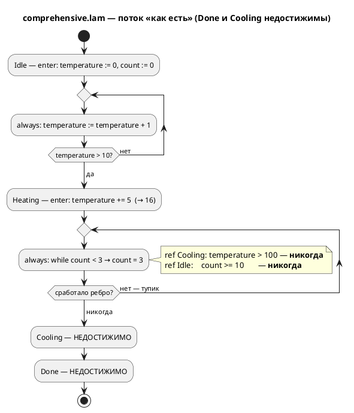
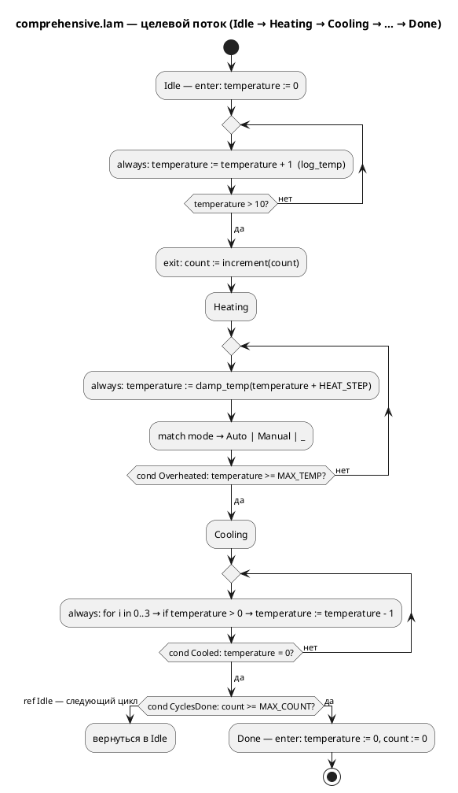

# Фича: Исправление примера comprehensive.lam (недостижимый сценарий)

- **Номер:** 0030
- **Статус:** **ГОТОВО** (2026-07-17; подзадачи
  [исправление примера comprehensive.lam (недостижимый сценарий)](0030-comprehensive-example-fix.md#разработка) и
  [исправление примера comprehensive.lam (недостижимый сценарий)](0030-comprehensive-example-fix.md#разработка) выполнены,
  [отчёт](0030-comprehensive-example-fix.md#отчёт-о-тестировании) — вердикт «пройдено»)
- **Зависит от:** **нет.** Фича автономна: правка — в одном файле
  `examples/comprehensive.lam` плюс новый тест в крейте `simulation`; язык,
  компилятор и симулятор **не меняются**. [починка вычислителя выражений симулятора](0025-simulator-expression-eval.md) (вычислитель симулятора), при
  реализации которой дефект был выявлен, **закрыта** — именно её результат и
  делает проверку сценария прогоном возможной; блокировки нет. Смежные
  кандидаты по симулятору ([вызов функции из тела функции](0031-fn-calls-fn.md) — вызов функции из
  функции, [согласование тактов симулятора и порождённого C (INIT-такты)](0033-init-tick-alignment.md) — сдвиг `INIT`-тактов) —
  **ограничения**, а не зависимости: целевая модель их не задействует.
  Обоснование и разбор — в [анализе](0030-comprehensive-example-fix.md#анализ),
  раздел «Зависимости фичи».
- **Приоритет:** **Tier 2 (средний)** — см. раздел «Приоритет» ниже.
- **Связанные issue (анализ):** новая фича (из блока «Кандидаты в фичи»
  `FEATURES.md`; дефект найден попутно задачей
  [0025-02b-1](0025-simulator-expression-eval.md#разработка), подтверждён
  отчётом [починка вычислителя выражений симулятора](0025-simulator-expression-eval.md#отчёт-о-тестировании), находка Н1).

## Стадии жизненного цикла (правило 17)

Все стадии — **разделы этой карточки** (правило 32): «Архитектура (ADR)»,
«Анализ», «Разработка», «Тест-план», «Отчёт о тестировании», «Итог».
Отдельным артефактом остаются только исправления —
[`docs/fixes/`](../fixes/README.md) (при необходимости `0030-YY-*`).

## Краткое описание

`examples/comprehensive.lam` объявляет автомат `Idle → Heating → Cooling → Done`,
в котором **половина состояний недостижима, а 4 из 6 переходов мертвы по логике
самой модели**: `Heating` — тупик (ни `ref Cooling`, ни `ref Idle` не могут
сработать никогда), поэтому `Cooling` и `Done` не достигаются ни при каких
входах. Фича приводит пример в состояние, где заявленный сценарий **действительно
проходит**, и закрепляет это **прогоном симулятора** в тесте — чтобы дефект не
вернулся. Язык, компилятор и симулятор не меняются: правится модель-пример и
добавляется тест.

## Мотивация / контекст

Примеры `examples/*.lam` — **часть документации по языку** (правила 15, 16):
`precheck.sh` генерирует из них C и собирает его, форматтер обязан держать их в
каноне, а правило 16 прямо требует, чтобы проверенные примеры попадали в
документацию по языку. Пример с недостижимыми состояниями учит читателя неверному:
он демонстрирует не «состояние охлаждения», а **мёртвый код**, поданный как
образцовая модель.

Дефект уже причинил измеримый вред: критерий приёмки **A6** [починка вычислителя выражений симулятора](0025-simulator-expression-eval.md) был сформулирован как «`comprehensive.lam`
проходит `Idle → Heating → Cooling → Done`» — то есть от **симулятора** потребовали
поведения, невозможного по модели. Критерий пришлось исправлять по ходу
реализации ([0025-02b-1](0025-simulator-expression-eval.md#разработка)),
а сам дефект зафиксирован контрпримером T19a
[тест-плана 0025](0025-simulator-expression-eval.md#тест-план) и находкой Н1
[отчёта 0025](0025-simulator-expression-eval.md#отчёт-о-тестировании). Пока пример не
починен, он остаётся ловушкой для каждой следующей фичи, которая возьмёт его как
эталон.

Профиль проекта (правило 12) — промышленные системы управления. Контроллер
нагрева, который по своей же спецификации никогда не выходит из нагрева, —
ровно тот класс ошибки проектирования, который язык Lam призван **отлавливать**,
а не демонстрировать.

## Объём

- Починка `examples/comprehensive.lam`: модель должна проходить заявленный
  сценарий и не содержать мёртвых переходов, оставаясь правдоподобной моделью
  управления (правило 12) и сохраняя покрытие конструкций языка, заявленное в
  её шапке.
- Приведение шапочного комментария в соответствие с фактом (сегодня он обещает
  `loop`, `cond` и `else`, которых в примере **нет** — проверено).
- **Приёмочный тест прогоном симулятора** (правило 16): сценарий проверяется
  автоматически, а не глазами.
- **Корпусной проверка** (`0030-02`): достижимость заявленных сценариев проверяется
  для всего каталога `examples/`, с явным списком исключений и причин — по
  образцу проверки непокрытых узлов из [канонический форматтер .lam (lamc fmt)](0024-lam-formatter.md).

## Приоритет (правило 19 п.3)

**Tier 2 (средний).** Аргументы:

1. **Дефект — в документации, а не в продукте.** Компилятор, генератор C и
   симулятор работают правильно: они честно исполняют то, что написано в
   примере. Неработоспособности инструмента нет — поэтому не Tier 1.
2. **Но вред уже нанесён и повторяем.** Пример однажды заставил ошибиться
   **аналитика** (критерий A6 фичи). Ошибка такого рода дороже опечатки:
   она попадает в критерии приёмки и оттуда — в требования к коду.
3. **Цена минимальна, риск близок к нулю.** Правка — один файл примера плюс
   тест; исходный код не затрагивается, обратная совместимость не при чём
   (правило 11).
4. **По правилу 19 п.4** аналитик ставит фичу **выше** прочих кандидатов по
   симулятору ([вызов функции из тела функции](0031-fn-calls-fn.md), [сохранение переменных модели в --save-state/--load-state](0032-state-io-variables.md),
   [согласование тактов симулятора и порождённого C (INIT-такты)](0033-init-tick-alignment.md)): те расширяют возможности, эта —
   восстанавливает **доверие к эталону**, на который опираются остальные. Проверка
   `0030-02` вдобавок страхует все будущие примеры. Жёстких зависимостей между
   ними нет.

## Риски / открытые вопросы

- **Соблазн «минимальной правки» обманчив.** Предложение кандидата — «нагрев в
  `always` состояния `Heating`» — **проверено пробой и недостаточно**: даже с
  нагревом модель идёт `Idle → Heating → Cooling → Idle → …`, а `Done` остаётся
  недостижимым (второй, независимый дефект — в `Cooling`). Разбор — в
  [ADR](0030-comprehensive-example-fix.md#архитектура-adr), раздел «Context».
- **Пример — вход `precheck.sh`**: из него генерируется C и собирается
  cmake/ninja, а `lamc fmt --check examples/` требует канона. Правка обязана
  пройти оба проверки (на эскизе проверено: C генерируется; `lamc fmt` прогнать
  обязательно — эскиз канону не соответствовал).
- **Границы проверки `0030-02`.** Не всякий пример исполним симулятором:
  `elevator_mini.lam` падает с `SIM-009` (найдено при анализе — **дефект
  симулятора**, не примера, см. анализ). Проверка обязан иметь явный список
  исключений с причинами, иначе он либо не включится, либо будет отключён
  первым же красным прогоном.
- **Обратная совместимость (правило 11):** язык **не** меняется — версия языка не
  растёт (правило 22). На публичный API, грамматику и семантику влияния нет.
  **Уточнено при реализации (решение заказчика 2026-07-17):** утверждение
  «на генераторы влияния нет» **не выдержало проверки** — в объём введена починка
  генератора `st` (порядок секций `VAR`/`VAR CONSTANT` в `FUNCTION`). Вывод цели
  `st` меняется для **любой** модели, чьи функции имеют локальные переменные; в
  корпусе такая одна — `comprehensive`. Разбор — в
  [анализе](0030-comprehensive-example-fix.md#анализ), врезка «Пересмотр A9».

> Фича зарегистрирована из блока «Кандидаты в фичи» `FEATURES.md`; далее проходит
> жизненный цикл по правилу 17.

## Архитектура (ADR)

- **Status:** Accepted
- **Date:** 2026-07-15
- **Authors:** Архитектор + Аналитик
- **Related issues:** [Фича](0030-comprehensive-example-fix.md);
  вытекает из [ADR](0025-simulator-expression-eval.md#архитектура-adr) (вычислитель
  симулятора — именно он сделал дефект видимым)

### Context

`examples/comprehensive.lam` — «витринный» пример языка: единственный файл в
`examples/`, чья задача — показать **все** конструкции Lam разом. Примеры входят
в документацию по языку (правила 15, 16), собираются в C через `precheck.sh` и
обязаны быть в каноне форматтера. Значит, пример — не иллюстрация, а
**спецификация в исполняемом виде**.

#### Что заявлено

Модель `Controller` объявляет четыре состояния с говорящими комментариями:
`Idle` («начальное»), `Heating` («состояние нагрева»), `Cooling` («состояние
охлаждения») и `Done` («конечное состояние — работа завершена»). Между ними
объявлено шесть переходов `ref`. Читатель — и, как показала практика, аналитик —
достраивает из этого сценарий `Idle → Heating → Cooling → Done`.

**Уточнение факта (важно для формулировок).** Шапка примера этот сценарий
**дословно не обещает** — в ней нет строки `Idle → Heating → Cooling → Done`.
Обещание сделано **структурой**: именами состояний, их комментариями и
объявленными рёбрами `ref`. Поэтому дефект нельзя свести к «неточному
комментарию»: **мертвы сами рёбра**, а не текст рядом с ними. Именно из этой
структуры был выведен (и оказался неверным) критерий A6 фичи.

#### Что есть на самом деле (проверено прогоном)

```sh
cargo build --bin simulation
./target/debug/simulation examples/comprehensive.lam -n 30
```

```
Шаг   1..10:  [Idle]
Шаг  11..30:  [Heating]
Выполнено 30 шагов (лимит достигнут).
```

`Heating` — **тупик**. Разбор по логике самой модели:

| Ребро | Условие | Почему мертво |
|---|---|---|
| `Heating → Cooling` | `temperature > MAX_TEMP` (100) | в `Heating` температура **не меняется**: `enter` даёт +5 (11 → **16**), `always` её не трогает |
| `Heating → Idle` | `count >= MAX_COUNT` (10) | `while count < 3` упирает счётчик в **3**; `Idle.enter` его к тому же обнуляет |
| `Cooling → Done` | `temperature <= 0` | `Cooling` недостижим (следствие тупика) |
| `Cooling → Idle` | `temperature > 0` | то же |

Итог: **достижимы 2 состояния из 4** (`Idle`, `Heating`), **мертвы 4 ребра из
6**. Значение `temperature = 16` подтверждено пробой (во временную копию
добавлено `ref Done: temperature = 16;` — переход срабатывает на шаге 12).

#### Ключевая находка: «минимальная правка» из бэклога недостаточна

Кандидат в `FEATURES.md` предлагал починить логику, «например, нагрев в `always`
состояния `Heating`». **Проверено пробой — этого мало.** С добавленным
`temperature := temperature + 10;` в `always` состояния `Heating`:

```
Шаг  11..19:  [Heating]
Шаг  20:      [Cooling]
Шаг  21..30:  [Idle]
```

`Done` по-прежнему **недостижим** — из-за **второго, независимого дефекта**: в
`Cooling` объявлены `ref Done: temperature <= 0;` и `ref Idle: temperature > 0;`,
а тело охлаждения снимает лишь 3 градуса за такт. Войдя в `Cooling` со 101,
модель на первом же такте имеет `temperature = 98 > 0` → уходит в `Idle`, где
`enter` обнуляет температуру. Ребро `Cooling → Done` мертво **при любом
нагреве**: чтобы оно сработало, вход в `Cooling` должен происходить при
`temperature <= 3`, а вход требует `temperature > 100`.

Вывод для решения: дефект **не один и не локальный**. Это ошибка проектирования
автомата в целом — `Cooling` спроектирован как «шаг охлаждения», а не как
«состояние охлаждения», и потому не удерживает управление до охлаждения.

#### Третье расхождение: шапка обещает конструкции, которых нет

Шапка заявляет «условные операторы (**if/else**), циклы (**loop**, for, while),
… именованные условия (**cond**)». Подсчёт по телу примера (без шапки):

| Заявлено | Фактически в теле |
|---|---|
| `else` | **0** |
| `loop` | **0** |
| `cond` | **0** |
| `while` / `for` / `match` / `if` | 2 / 1 / 2 / 3 |

То есть «всесторонний» пример не покрывает три из заявленных им же конструкций.
Это тот же класс дефекта (документ обещает то, чего нет) и правится тем же
действием.

#### Поток «как есть»



### Decision Drivers

1. **Пример — документация по языку (правила 15, 16).** Он обязан быть
   корректным: то, что он объявляет, должно исполняться. Мёртвое ребро в витрине
   языка — антипример.
2. **Правдоподобие модели управления (правило 12).** Профиль проекта —
   промышленные системы управления. Контроллер нагрева обязан читаться как
   контроллер нагрева: греет в `Heating`, охлаждает в `Cooling`, завершает в
   `Done`.
3. **Доказуемость, а не убеждение.** Заявленный сценарий обязан проверяться
   **прогоном симулятора** в тесте. Именно отсутствие такой проверки позволило
   дефекту дожить до критерия приёмки чужой фичи.
4. **Язык не меняется (правило 18/22).** Правка — в модели-примере. Ни
   грамматика, ни семантика, ни генераторы не затрагиваются; версия языка не
   растёт. Поэтому диаграмма здесь — **не** EBNF, а **активности целевого
   сценария**: она нужна, чтобы зафиксировать предмет договорённости (какой
   именно автомат считается починенным).
5. **Соразмерность.** Пример — 105 строк. Решение не должно превращаться в
   переписывание документации или в статический анализатор достижимости.

### Considered Options

#### Option A. Починить логику модели

Изменить тела состояний и условия рёбер так, чтобы заявленный автомат
действительно проходился: нагрев — в `always` состояния `Heating`, охлаждение —
удерживающее управление в `Cooling`, `Done` — достижимое завершение. Шапка
приводится в соответствие; заявленные `else`/`loop`/`cond` **добавляются** в
модель (а не вычёркиваются из шапки).

**Pros:**
- Устраняет **причину**, а не её описание: мёртвых рёбер не остаётся.
- Единственный вариант, совместимый с драйвером 2: модель начинает быть
  правдоподобным контроллером нагрева, а не автоматом, застревающим в нагреве.
- Сохраняет ценность примера как «всестороннего»: покрытие конструкций не
  сокращается, а дорастает до заявленного.
- Делает возможным приёмочный тест на **достижение `Done`** — самый сильный из
  доступных (терминальное состояние, симуляция завершается сама).
- **Проверено на эскизе**: целевая модель существует и работает (см. Decision).

**Cons:**
- Диффа больше, чем в B: правятся тела `Heating`/`Cooling`, условия рёбер и
  константы.
- Требует прогнать `lamc fmt examples/` и пересобрать порождённый C
  (`precheck.sh`) — впрочем, это обязательная гигиена для любой правки примера.
- «Минимальной» правки не выйдет: как показано в Context, дефектов **два**.

#### Option B. Привести комментарий в соответствие с фактическим поведением

Оставить модель как есть, переписав комментарии: `Heating` описать как тупик,
`Cooling`/`Done` — как недостижимые.

**Pros:**
- Минимальный дифф; нулевой риск для `precheck.sh` и генерации C.
- Формально устраняет расхождение «сказано ↔ сделано».

**Cons:**
- **Не устраняет дефект, а узаконивает его.** Мёртвые рёбра остаются в коде
  примера; витрина языка начинает демонстрировать мёртвый код как норму.
- **Противоречит драйверу 2.** Получается «контроллер нагрева, который никогда
  не прекращает нагрев» — модель, которую промышленный инженер обязан
  забраковать. Пример учил бы ровно тому классу ошибок, который Lam призван
  ловить.
- **Противоречит драйверу 3**: проверять прогоном будет **нечего** — тест
  зафиксирует «модель навсегда висит в `Heating`», то есть закрепит дефект
  тестом. Это ровно то, что уже сделано контрпримером T19a в тест-плане 0025 —
  как **констатация**, а не как цель.
- Состояния `Cooling`/`Done` и константа `MAX_COUNT` остаются недостижимым
  балластом: читатель не поймёт, зачем они написаны.
- Не решает третье расхождение (`else`/`loop`/`cond`) иначе как **сокращением**
  заявленного покрытия — «всесторонний» пример становится менее всесторонним.

#### Option C. Переписать пример целиком

Спроектировать новую витринную модель с нуля (новый домен, новая структура),
попутно покрыв все конструкции языка.

**Pros:**
- Позволяет заодно выправить структуру примера и покрыть конструкции с запасом.
- Свобода выбрать более выразительный домен управления.

**Cons:**
- **Несоразмерно** (драйвер 5): дефекты локализованы в двух состояниях —
  переписывать 105 строк ради этого нет причин.
- Теряется история файла и узнаваемость примера; ссылки на него из `CHANGES.md`,
  тест-плана и отчёта 0025 перестают соотноситься с содержимым.
- Максимальный риск задеть смежные проверки (формат, генерация C, cmake/ninja) —
  при том, что задача фичи узкая.
- Скрывает урок: ценность в том, чтобы **починить именно этот** автомат, а не
  заменить его другим.

### Decision

Принимается **Option A — починить логику модели**.

Основание: только A удовлетворяет драйверам 1–3 одновременно. B и C отпадают по
разным причинам, но обе — принципиальные: **B закрепляет дефект** (мёртвые рёбра
остаются, а тест сможет проверять лишь факт тупика — то есть узаконит его), **C
несоразмерен** объёму дефекта и рвёт связь с историей файла.

Дополнительно постановляется: **правка не «минимальная», а полная**.
Предложенная бэклогом правка «нагрев в `always` состояния `Heating`» отвергнута
как **проверенно недостаточная** (Context): она чинит первый дефект и оставляет
второй, после чего `Done` остаётся недостижимым — то есть даёт **иллюзию**
починки, которую поймал бы только тест на достижение `Done`.

#### Целевой автомат (термоциклирование)

Модель переосмысливается как **контроллер термоциклирования** — правдоподобный
промышленный сценарий (испытательная камера): прогреть объект до `MAX_TEMP`,
охладить до нуля, повторить `MAX_COUNT` раз, завершить работу. Такое прочтение
**даёт смысл всем** элементам, которые сегодня мертвы: `Cooling` удерживает
управление до конца охлаждения, `count`/`MAX_COUNT` считают выполненные циклы (а
не такты `while`), `Done` — завершение программы испытаний.



Ключевые отличия от нынешней модели — каждое закрывает конкретное мёртвое ребро:

| Что | Было | Стало | Какой дефект чинит |
|---|---|---|---|
| Нагрев | только `enter` (+5 → 16) | `always`: `temperature := clamp_temp(temperature + HEAT_STEP)` | `Heating → Cooling` |
| Порог выхода из нагрева | `temperature > MAX_TEMP` (недостижим) | `cond Overheated = temperature >= MAX_TEMP` (достижим) | `Heating → Cooling` |
| Счётчик циклов | `count` обнулялся в `Idle.enter`, упирался в 3 | считает **завершённые циклы** (`Idle.exit`), не обнуляется | `Heating → Idle` (ребро убрано как бессмысленное) |
| Выход из охлаждения | `ref Idle: temperature > 0` срывал охлаждение на первом такте | `ref Idle: Cooled & !CyclesDone` — только по завершении охлаждения | `Cooling → Done` |
| Завершение | `ref Done: temperature <= 0` (недостижим) | `ref Done: Cooled & CyclesDone` | `Cooling → Done` |
| `else`/`loop`/`cond` | заявлены в шапке, отсутствуют | присутствуют (`cond` — три штуки; `else` — в `clamp_temp`) | расхождение шапки |

**Эскиз проверен прогоном** (см. анализ, раздел «Проверка целевого эскиза»):
`Idle(10) → Heating(12) → Cooling(34) → Idle → … ×3 → Done`, завершение за
**172 шага**; `lamc compile -t c` — успешно. Эскиз — доказательство
осуществимости, а не финальный текст: окончательная модель формируется задачей
[исправление примера comprehensive.lam (недостижимый сценарий)](0030-comprehensive-example-fix.md#разработка).

#### Границы решения

> **Граница пересмотрена при реализации (решение заказчика, 2026-07-17).**
> Пункт «генераторы не правятся» **снят в части цели `st`**. Причина: целевой
> автомат — первый в корпусе, чьи функции имеют **локальные переменные**, и это
> обнажило **латентный дефект генератора ST**: секция `VAR CONSTANT` печаталась
> **перед** `VAR`, а MatIEC протаскивает квалификатор `CONSTANT` на следующую
> секцию → «Assignment to CONSTANT variables is not allowed». Обойти его в
> примере было можно (передать пороги параметрами), но заказчик выбрал **чинить
> причину**: дефект бьёт по любой будущей модели с функциями, а не только по
> витрине. Правка — перестановка секций в `generator/st/st_func.rs` + тест-контроль.
> Критерий **A9** изменён соответственно (см. ниже). Осуществимость эскиза,
> которую доказывал анализ, была проверена лишь симулятором и целью `c` — проверки
> `iec2c` и `clippy` на эскизе не гонялись, поэтому оба дефекта проработка не
> увидела.

- **Язык не меняется** (правило 22): версия языка не растёт. Правится
  `.lam`-файл примера; грамматика, семантика и симулятор — нет. Генератор `st` —
  **правится** (см. врезку выше).
- **Симулятор не чинится этой фичей.** Найденный при анализе отказ
  `elevator_mini.lam` (`SIM-009`) — **дефект симулятора**, не примера, и лежит
  за границами 0030 (см. анализ, «Находки по остальным примерам»).
- **Статический анализ достижимости не вводится.** Соблазн «пусть компилятор
  сам ловит мёртвые рёбра» отклонён как отдельная крупная фича (и в общем виде
  неразрешимый при свободных входных портах). Здесь достижимость проверяется
  **прогоном** — эмпирически, но честно и дёшево.

### Consequences

#### Положительные

- Витринный пример языка начинает демонстрировать **работающий** автомат:
  достижимы все 4 состояния, мёртвых рёбер — 0.
- Заявленный сценарий становится **проверяемым машиной** (правило 16), а не
  предметом веры. Класс дефекта, стоивший ошибки в критерии A6 фичи, ловится
  автоматически.
- Пример начинает соответствовать профилю проекта (правило 12): термоциклирование
  — реальный промышленный сценарий, а `count`/`MAX_COUNT`/`Cooling`/`Done`
  получают смысл.
- Ловушка «`comprehensive.lam` дефектен» уходит из контекста проекта (`CLAUDE.md`,
  раздел про симулятор) — её больше не нужно помнить каждой сессии.
- Проверка `0030-02` распространяет защиту на **все** примеры каталога.

#### Отрицательные / Action items

- **Меняются ожидания зафиксированных проверок.** Тест-план 0025 содержит
  T19 («`Idle → Heating` на шаге 11») и контрпример T19a («`Heating` — тупик»);
  отчёт 0025 фиксирует находку Н1. После починки T19a **перестаёт
  воспроизводиться** — по замыслу. Артефакты закрытой фичи **не
  переписываются** (правило 21: они — история решения); расхождение снимается
  ссылкой из отчёта 0030. **Action item:** явно отметить это в отчёте 0030.
- **`examples/generated/c` требует перегенерации** — `precheck.sh` делает это
  сам, но дифф порождённого C попадёт в коммит.
- **Пример становится длиннее по трассе** (≈172 шага против 30) — тест обязан
  задавать бюджет шагов с запасом и проверять **факт завершения**, а не только
  цепочку.
- **Action item:** решить в `0030-02`, как проверка трактует примеры, не исполнимые
  симулятором (`elevator_mini` — `SIM-009`); без явного списка исключений с
  причинами проверка не включится.
- **Action item:** после реализации перенести пример (или его ключевой фрагмент)
  в документацию по языку — правило 16 требует, чтобы проверенные примеры
  попадали в README.

#### Acceptance criteria

1. Прогон `./target/debug/simulation examples/comprehensive.lam -n <бюджет>`
   проходит `Idle → Heating → Cooling → … → Done` и **завершается** сообщением о
   достижении терминального состояния (а не «лимит достигнут»).
2. В `examples/comprehensive.lam` **нет мёртвых рёбер**: каждое объявленное `ref`
   срабатывает хотя бы раз в приёмочном прогоне; все 4 состояния достижимы.
3. Шапка примера соответствует телу: каждая заявленная конструкция
   (`if/else`, `loop`, `while`, `for`, `match`, `cond`, `enum`, `extern fn`,
   функции, состояния) **присутствует** — проверяется тестом/`grep`.
4. Сценарий закреплён **автоматическим тестом** в крейте `simulation`
   (прогон симулятора, сверка цепочки состояний и факта завершения), а не только
   документом.
5. Проверка достижимости покрывает **весь** каталог `examples/`: у каждого файла есть
   либо контракт сценария, либо исключение с указанной причиной; новый пример без
   того и другого **валит** тест.
6. `lamc fmt --check examples/` и `./scripts/precheck.sh` проходят (канон формата,
   генерация C, сборка cmake/ninja).
7. Язык не изменён (правило 22): версия языка не растёт; грамматика, семантика и
   симулятор не тронуты. **Уточнено 2026-07-17:** прежняя формулировка «диффа в
   `grammar/src/`, кроме тестов, нет» **снята** — решением заказчика в объём
   введена починка генератора `st` (`st_func.rs`: локальный `VAR` печатается до
   `VAR CONSTANT`) вместе с тестом-контролем. Дифф в `grammar/src/` ограничен
   **этой** правкой.

## Анализ

### Цель и контекст

Привести `examples/comprehensive.lam` в состояние, в котором объявленный им
автомат **исполняется как объявлен**, и закрепить это прогоном симулятора в
тесте. [ADR](0030-comprehensive-example-fix.md#архитектура-adr) принял **Option A**
(починить логику модели), отвергнув B (переписать комментарий — узаконивает
мёртвые рёбра) и C (переписать пример — несоразмерно).

Основание для работы — правила 15 и 16 (примеры суть документация по языку и
обязаны проверяться), правило 12 (профиль — промышленные системы управления:
контроллер нагрева обязан быть правдоподобным). Язык не меняется, поэтому
правило 22 не срабатывает: версия языка остаётся **0.2.0**.

### Факт: дефект перепроверен, подтверждён и оказался шире заявленного

Кандидат в `FEATURES.md` перепроверен самостоятельно — **подтверждён**, но
формулировку требуется уточнить в двух местах, и найден **второй дефект**,
которого кандидат не видел.

#### Команда воспроизведения

```sh
cd /Volumes/HOME/GitHub/BuT
cargo build --bin simulation
./target/debug/simulation examples/comprehensive.lam -n 30
```

#### Фактическая трасса (2026-07-15, ветка v2, коммит 6984471)

```
Шаг   1:  [Idle]
…
Шаг  10:  [Idle]
Шаг  11:  [Heating]
…
Шаг  30:  [Heating]
Выполнено 30 шагов (лимит достигнут).
```

Модель навсегда остаётся в `Heating`. **Это корректное поведение симулятора и
дефект примера** — не спутать: `lamc compile -t c examples/comprehensive.lam`
отрабатывает без ошибок, семантика примера валидна, симулятор честно исполняет
написанное. Ловушки симулятора из `CLAUDE.md` (сдвиг `INIT`-тактов; `--save-state`
не пишет переменные; дефекты `Array`/`Bit`/`Rational` в генераторе C) на этот
вывод **не влияют**: пример считает только в `u8` (`Integer`), а вывод сделан по
цепочке состояний внутри симулятора, без сверки с C и без save/load.

#### Разбор мёртвых рёбер

| Ребро | Условие | Факт |
|---|---|---|
| `Heating → Cooling` | `temperature > MAX_TEMP` (100) | в `Heating` температура не меняется: `enter` даёт +5 (11 → **16**), `always` её не трогает → **мертво** |
| `Heating → Idle` | `count >= MAX_COUNT` (10) | `while count < 3` упирает счётчик в **3** → **мертво** |
| `Cooling → Done` | `temperature <= 0` | `Cooling` недостижим → **мертво** |
| `Cooling → Idle` | `temperature > 0` | то же → **мертво** |

Достижимы **2 состояния из 4**; мертвы **4 ребра из 6**.

**Проба на значение** (`temperature = 16` в `Heating`): во временную копию
добавлено `ref Done: temperature = 16;` в `Heating` → переход срабатывает на шаге
12. Значение подтверждено, а не выведено умозрительно.

#### Уточнение 1: «комментарий обещает» — неточно

Формулировка кандидата — «комментарий примера обещает `Idle → Heating → Cooling →
Done`». **Фактически такой строки в примере нет.** Проверено чтением файла
целиком: шапка перечисляет конструкции языка, а комментарии состояний говорят
«Состояние охлаждения» и «Конечное состояние — работа завершена (нет переходов)».

Сценарий обещан **структурой**: именами состояний, их комментариями и
объявленными рёбрами `ref`. Уточнение не косметическое: оно определяет выбор
решения. Будь дефект «в комментарии», Option B (переписать комментарий) была бы
законным исходом. Но мертвы **рёбра**, а не текст рядом с ними, — и никакой
комментарий не делает недостижимое состояние достижимым.

#### Уточнение 2 (находка): предложенная бэклогом правка недостаточна

Кандидат предлагал «нагрев в `always` состояния `Heating`». **Проверено пробой:**
с `temperature := temperature + 10;` в `always` состояния `Heating` трасса даёт

```
Шаг  11..19:  [Heating]
Шаг  20:      [Cooling]
Шаг  21..30:  [Idle]
```

`Cooling` достигнут — **`Done` по-прежнему нет.** Причина — **второй, независимый
дефект**: `Cooling` объявляет `ref Done: temperature <= 0;` и `ref Idle:
temperature > 0;`, а тело снимает 3 градуса за такт. Войдя со 101, модель на
первом такте имеет 98 > 0 → уходит в `Idle`, где `enter` обнуляет температуру.
Ребро `Cooling → Done` мертво **при любом нагреве**: срабатывание требует входа в
`Cooling` при `temperature <= 3`, а вход требует `temperature > 100`.

Следствие для планирования: задача **не сводится** к однострочной правке, и
«починка», проверенная только достижением `Cooling`, дала бы **ложноположительный
результат**. Именно поэтому приёмочный критерий — **достижение `Done` и
завершение симуляции**.

#### Уточнение 3 (находка): шапка обещает конструкции, которых в примере нет

Подсчёт по телу примера (шапка исключена):

| Заявлено в шапке | Фактически |
|---|---|
| `else` («условные операторы (if/else)») | **0** |
| `loop` («циклы (loop, for, while)») | **0** |
| `cond` («именованные условия (cond)») | **0** |
| `while` / `for` / `match` / `if` | 2 / 1 / 2 / 3 |

Тот же класс дефекта (документ обещает несуществующее) в том же файле; правится
тем же действием — добавлением конструкций в модель (ADR: покрытие не
сокращается, а дорастает до заявленного).

### Проверка целевого эскиза (осуществимость доказана)

Чтобы решение ADR не осталось намерением, целевой автомат (термоциклирование)
собран во временном файле и **прогнан**:

```sh
## эскиз во временном каталоге, не в репозитории
./target/debug/simulation <эскиз>.lam -n 250
```

```
  10 × [Idle]  →  12 × [Heating]  →  34 × [Cooling]
  11 × [Idle]  →  12 × [Heating]  →  34 × [Cooling]
  11 × [Idle]  →  12 × [Heating]  →  34 × [Cooling]
   2 × [Done]
Завершено: модель достигла терминального состояния за 172 шагов.
```

Дополнительно на эскизе проверено:

- `lamc compile -t c` — **успешно** (пример участвует в генерации C в `precheck.sh`).
- `lamc fmt --check` — **требует форматирования**: задача обязана
  прогнать `lamc fmt examples/`, иначе `precheck.sh` упадёт на проверке канона.
- `cond` в условии ребра (`ref Done: Cooled & CyclesDone;`) — **работает**:
  инвариант «условия рёбер `ref` не разрешаются» (`Condition::Unresolved`,
  `CLAUDE.md`) этому не мешает; тот же приём уже используется в `elevator.lam`
  (`ref DoorClosing: ShouldMove;`).
- Вызов `fn` из блока состояния (`clamp_temp`) — **работает**; вызовов «функция
  из функции» модель **не содержит** (см. ограничение по фиче ниже).

Эскиз — доказательство осуществимости и опора для 0030-01, **не** финальный
текст примера.

### Находки по остальным примерам каталога `examples/`

Проверены все пять файлов: `lamc compile -t c` — **успешно на всех**; прогон
симулятора — по 20–25 шагов.

| Пример | Результат прогона | Оценка |
|---|---|---|
| `comprehensive.lam` | вечный `Heating` | **дефект примера** — предмет этой фичи |
| `elevator.lam` | «терминальное состояние за 1 шаг» | **не дефект этого класса.** Шапка прямо объявляет файл «позитивный тест парсера»; сценария не обещает. Корень (`start Main = Engine { next Middle; }`) — цепочка `next` без условий; никакого поведения не заявлено, нечему быть недостижимым |
| `elevator_mini.lam` | `ОШИБКА вычисления на шаге 1: переменная 'FloorSensor_F1_Bottom' не найдена (SIM-009)` | **дефект симулятора, не примера** (см. ниже) |
| `extend_complex.lam` | «терминальное состояние за 1 шаг» | **не дефект этого класса** — файл-стенд синтаксиса (структуры, порты с адресами, композиция `A + B + (C \| D) + E`); сценария не обещает |
| `stacker.lam` | стоит в `[WaitingForTask, MovementIdle, LiftIdle]` | **не дефект** — модель ждёт входных портов; сценарии поданы отдельно (`examples/simulations/stacker_*.json`, харнесс `scripts/run_simulations.sh`), и они работают |

**Вывод:** дефект «объявлен недостижимый сценарий» в каталоге **один** —
`comprehensive.lam`. Он же единственный пример, который заявляет поведение
**без** внешних входов, то есть единственный, чей сценарий вообще можно проверить
безусловным прогоном. Это объясняет, почему дефект дожил до сегодня, и задаёт
границы проверки `0030-02`: проверять достижимость можно лишь там, где сценарий
задан — сам моделью или JSON-файлом.

#### Отдельная находка: `elevator_mini.lam` не исполняется симулятором (SIM-009)

```sh
./target/debug/simulation examples/elevator_mini.lam -n 20
## ОШИБКА вычисления на шаге 1: переменная 'FloorSensor_F1_Bottom' не найдена (SIM-009)
```

Порт **объявлен** — `examples/elevator_mini.lam:239`, `in FloorSensor_F1_Bottom:
bit;`, внутри той же модели `Cabin`, что и его использование (строка 68).
Семантика его принимает: `lamc compile -t c examples/elevator_mini.lam` проходит
успешно. Значит, **это дефект симулятора**: порты, объявленные в под-модели
композиции `start Main = Cabin | Motor;`, не попадают в среду вычисления. Класс —
ровно тот, о котором предупреждает `CLAUDE.md` («разрешение переменных проверяй в
обоих путях — верхнеуровневый и вложенный»).

За границами 0030 (ADR: симулятор этой фичей не чинится). **Рекомендация
координатору:** завести отдельным кандидатом/фичей; до её закрытия
`elevator_mini.lam` попадает в список исключений проверки `0030-02` — с этой
причиной, а не «просто пропустить».

### Зависимости фичи (правило 17/19)

> **Обязательный раздел аналитика.** Проверить зависимости от других фич (по
> контракту/схеме БД/инфраструктуре/процессу) и зафиксировать их здесь, в
> карточке фичи (поле «Зависит от») и в таблице `FEATURES.md` (колонка «Зависит
> от»). Если есть незакрытая зависимость — перевести фичу в `ЗАБЛОКИРОВАНА` и
> пересмотреть последовательность разработки (правило 19).

- **Зависит от:** **нет.** Проверено по контракту (язык/грамматика), по
  инфраструктуре (симулятор, форматтер, `precheck.sh`) и по процессу:

  | Фича | Статус | Разбор |
  |---|---|---|
  | [починка вычислителя выражений симулятора](0025-simulator-expression-eval.md) — вычислитель симулятора | **ГОТОВО** | **Историческая, а не блокирующая.** До 0025 симулятор не исполнял присваивания, и `comprehensive.lam` вечно висел в `Idle` — проверить сценарий прогоном было **нечем**; 0025 и сделала дефект видимым. Фича закрыта → блокировки нет, `ЗАБЛОКИРОВАНА` не ставится |
  | [канонический форматтер .lam (lamc fmt)](0024-lam-formatter.md) — форматтер | **ГОТОВО** | Даёт проверка `lamc fmt --check examples/` в `precheck.sh`. Правка обязана его пройти — это **условие приёмки**, не зависимость |
  | [вызов функции из тела функции](0031-fn-calls-fn.md) — вызов функции из функции | открыта | **Ограничение, не зависимость.** Целевая модель вызовов «функция из функции» не содержит (проверено на эскизе: `clamp_temp`/`increment` вызываются из блоков состояний — работает). 0030-01 **обязана** удержать это ограничение, иначе фича станет заблокированной |
  | [согласование тактов симулятора и порождённого C (INIT-такты)](0033-init-tick-alignment.md) — сдвиг `INIT`-тактов | открыта | **Ограничение, не зависимость.** Сдвиг проявляется только при потактовой сверке симулятора с порождённым C. Тесты сверяют **цепочку состояний внутри симулятора** — сверки с C не делают |
  | [генератор C: отображение типов Array/Bit/Rational](0029-c-type-mapping.md) — типы `Array`/`Bit`/`Rational` в C | открыта | **Не задевается**: пример считает в `u8` (`Integer`) |
  | [сохранение переменных модели в --save-state/--load-state](0032-state-io-variables.md) — `--save-state` не пишет переменные | открыта | **Не задевается**: тесты читают трассу, а не файл состояния |
  | Дефект симулятора `SIM-009` (`elevator_mini`) | не заведена | **Не блокирует 0030-01.** Для `0030-02` — причина исключения из проверки. Рекомендация: завести отдельно |

- **Влияние на порядок разработки:** фича **никого не разблокирует** (жёстких
  зависимостей от неё нет) и **ни от кого не зависит** — берётся в работу в любой
  момент. По правилу 19 п.4 аналитик ставит её **выше** прочих открытых кандидатов
  по симулятору (0031, 0032, 0033): те расширяют возможности, а 0030
  восстанавливает **доверие к эталону**, на который эти же фичи будут опираться
  при проверке. Прецедент прямой: дефект уже исказил критерий приёмки A6 фичи. Стоимость при этом наименьшая среди них (один файл примера + тест).

### Требования и проверяемые условия

- **R1. Заявленный сценарий исполняется.** Прогон
  `examples/comprehensive.lam` без входных данных проходит
  `Idle → Heating → Cooling → … → Done` и **завершается** достижением
  терминального состояния (сообщение «Завершено: модель достигла терминального
  состояния»), а не исчерпанием лимита шагов.
- **R2. Мёртвых рёбер нет.** Каждое объявленное в примере ребро `ref` срабатывает
  хотя бы раз в приёмочном прогоне; все объявленные состояния достижимы.
  (Сегодня: 4 мёртвых ребра из 6, 2 недостижимых состояния из 4.)
- **R3. Шапка соответствует телу.** Каждая конструкция, заявленная шапкой
  примера, в теле **присутствует**. Сегодня отсутствуют `else`, `loop`, `cond`.
- **R4. Модель правдоподобна как система управления (правило 12).** Автомат
  читается как контроллер: греет в `Heating`, охлаждает в `Cooling` (удерживая
  управление до конца охлаждения), завершает в `Done`; `count`/`MAX_COUNT` имеют
  смысл (число выполненных циклов), а не остаются недостижимым балластом.
- **R5. Сценарий закреплён машиной, а не текстом (правило 16).** Проверка —
  автоматический тест, прогоняющий симулятор и сверяющий цепочку состояний;
  падает, если `Done` перестал достигаться.
- **R6. Класс дефекта не воспроизводится на других примерах.** Для **каждого**
  файла `examples/*.lam` существует либо контракт сценария, либо запись об
  исключении **с причиной**; новый пример без того и другого валит тест.
- **R7. Смежные проверки зелёные.** `lamc fmt --check examples/` проходит;
  `precheck.sh` (генерация C из примеров + сборка cmake/ninja) проходит.
- **R8. Язык и код продукта не тронуты.** Диффа в `grammar/src/` и
  `simulation/src/` нет (только `examples/` и тесты). Версия языка — **0.2.0**.
- **R9. Ограничения открытых фич удержаны.** Модель не использует вызов функции
  из функции (0031) и не требует потактовой сверки с C (0033) — иначе фича
  становится заблокированной.

### Критерии приёмки и способ проверки

| # | Критерий | Способ проверки |
|---|---|---|
| A1 | `examples/comprehensive.lam` проходит `Idle → Heating → Cooling → … → Done` и завершается сам | прогон `./target/debug/simulation examples/comprehensive.lam -n <бюджет>`; в выводе — «Завершено: модель достигла терминального состояния»; сверка цепочки. Автоматизировано тестом (A5) |
| A2 | Все 4 состояния достижимы; каждое ребро `ref` срабатывает хотя бы раз | тест собирает множество посещённых состояний и наблюдённых переходов из трассы и сверяет с множеством объявленных в примере `ref` (R2) |
| A3 | Шапка соответствует телу: `if/else`, `loop`, `while`, `for`, `match`, `cond`, `enum`, `extern fn`, `fn`, состояния — **присутствуют** | тест/`grep` по телу примера (шапка исключена); ср. таблицу уточнения 3 |
| A4 | Модель читается как контроллер термоциклирования (R4) | ревью на стадии тестирования против целевой диаграммы активности ADR; формально — следствие A1+A2 (мёртвых элементов нет ⇒ балласта нет) |
| A5 | Сценарий закреплён автоматическим тестом в `simulation` | `cargo test -- --test-threads=1`: новый тест зелёный; **негативная проверка** — на текущей (дефектной) версии примера тест обязан падать (иначе он ничего не проверяет) |
| A6 | Проверка покрывает весь `examples/`: у каждого файла контракт или исключение с причиной | негативная проверка: временно добавить `.lam` без контракта → тест **падает** с внятным сообщением |
| A7 | `lamc fmt --check examples/` проходит | прогон бинарника; входит в `precheck.sh` |
| A8 | `./scripts/precheck.sh` проходит (в т.ч. генерация C и сборка cmake/ninja) | прогон скрипта |
| A9 | ~~Диффа в `grammar/src/`, `simulation/src/` нет~~ → **пересмотрен 2026-07-17**: `simulation/src/` не тронут; в `grammar/src/` допущена **одна** правка — генератор `st` (`st_func.rs`), см. ниже. Версия языка не растёт | `git diff --stat`; проверка, что правки вне `examples/`/тестов ограничены `generator/st/st_func.rs` |

> **Пересмотр A9 (решение заказчика, 2026-07-17): в объём введена починка
> генератора ST.** Реализация вскрыла то, чего этот анализ не увидел: **эскиз
> проверялся симулятором и целью `c`, но не проверками `iec2c`/`clippy`**, а целей в
> проекте пять. Целевой автомат — первый в корпусе, чьи функции имеют локальные
> переменные, и он обнажил **два латентных дефекта генераторов**:
>
> | Цель | Дефект | Исход |
> |---|---|---|
> | `st` | `VAR CONSTANT` печатался **перед** `VAR`; MatIEC протаскивает `CONSTANT` на следующую секцию → «Assignment to CONSTANT variables is not allowed» | **починен** в объёме 0030 (перестановка секций + тест-контроль) |
> | `rust` | хвостовой `if/else` с `return` в обеих ветках → `needless_return`, проверка `-D warnings` красный | обойдён в примере, заведён кандидатом в `FEATURES.md` |
>
> Оба были **латентны при зелёном проверке**: до 0030 ни одна функция корпуса не
> имела локальных переменных. Урок для будущих правок примеров: *осуществимость
> эскиза доказывается всеми проверками корпуса, а не только симулятором* — иначе
> «доказано» означает лишь «две цели из пяти».

### Особенности по обратной функциональности

**Строка для реестра аналитики:** `нет (правится пример-документация; язык, API и
генераторы не тронуты) + аддитивный тест-проверка достижимости для examples/`.

Разбор по правилу 11:

- **Язык (`.lam`).** Обратная совместимость **не затрагивается**: правится
  содержимое примера, а не грамматика/семантика. Ни один пользовательский
  `.lam`-файл не перестанет компилироваться. Версия языка не растёт (правило 22),
  остаётся **0.2.0**.
- **Публичный API `grammar`/`simulation`.** Не меняется — диффа в `src/` нет.
- **Порождённый C.** Изменится **только** для `comprehensive.lam` — как следствие
  изменения модели, а не генератора. `examples/generated/c/comprehensive.*`
  перегенерируется `precheck.sh`.
- **Сломанная обратная функциональность — одна, и намеренно.** Контрпример **T19a**
  [тест-плана 0025](0025-simulator-expression-eval.md#тест-план) («`Heating` —
  тупик по логике примера») после починки **перестаёт воспроизводиться**, и
  находка Н1 [отчёта 0025](0025-simulator-expression-eval.md#отчёт-о-тестировании)
  становится историей. Это **цель фичи**, а не регрессия. Артефакты закрытой фичи **не переписываются** (правило 21 — они фиксируют историю решения);
  расхождение снимается ссылкой из отчёта 0030. Проверка T19 («`Idle → Heating` на
  шаге 11») остаётся в силе: в целевом эскизе переход происходит на том же шаге
  11 — начало сценария не меняется.
- **`CLAUDE.md`.** Содержит ловушку «`examples/comprehensive.lam` дефектен
  (заявленный сценарий `→ Cooling → Done` недостижим по его же логике)». После
  закрытия фичи запись подлежит снятию — **вне границ этой проработки** (правкой
  `CLAUDE.md` занимается координатор при закрытии, правило 4).
- **`FEATURES.md`.** Кандидат «`examples/comprehensive.lam` заявляет недостижимый
  сценарий» удаляется из блока кандидатов при заведении фичи (правило 10) —
  действие координатора.

### Риски и зависимости

- **Ложноположительная починка** (риск №1, реализовался бы при буквальном
  следовании кандидату). «Нагрев в `always`» даёт `Cooling`, но не `Done`;
  проверка, останавливающаяся на достижении `Cooling`, признала бы фичу
  сделанной. **Снижение:** критерий A1 требует **достижения `Done` и завершения
  симуляции**, A2 — срабатывания **каждого** ребра.
- **Тест, который ничего не проверяет.** Тест на цепочку состояний легко написать
  так, что он зелен и на дефектной модели (например, проверяя лишь «`Idle` был»).
  **Снижение:** A5 требует **негативной проверки** — на текущей версии примера
  новый тест обязан падать. Порядок работ 0030-01: сперва тест (красный), потом
  правка примера (зелёный).
- **Проверка `0030-02` не включится.** Если потребовать контракт от всех примеров без
  списка исключений, тест сразу красный (`elevator_mini` — `SIM-009`;
  `elevator.lam`/`extend_complex.lam` — стенды парсера без сценария), и его
  отключат. **Снижение:** явный список исключений **с причинами** и ссылками —
  по образцу проверки непокрытых узлов фичи (отказ вместо тихого пропуска).
- **Дрейф бюджета шагов.** Целевой сценарий — ≈172 шага против нынешних 30; при
  изменении констант бюджет может не хватить, и тест упадёт по «лимиту», а не по
  сути. **Снижение:** бюджет с запасом (например, 400) и **раздельные**
  сообщения об ошибке: «не достигнут `Done`» против «исчерпан лимит».
- **Правка примера ломает смежные проверки.** Пример — вход генерации C и сборки
  cmake/ninja в `precheck.sh` и объект `lamc fmt --check`. **Снижение:** на
  эскизе генерация C уже проверена (успешно); `lamc fmt examples/` — обязательный
  шаг 0030-01 (эскиз канону **не** соответствовал); A8 требует полного прогона
  `precheck.sh`.
- **Соблазн расширить границы.** Рядом лежат два настоящих дефекта продукта
  (`SIM-009` в `elevator_mini`; статический анализ достижимости в компиляторе).
  **Снижение:** ADR явно вынес их за границы; здесь — только пример и тесты.
- **Зависимость от ограничений открытых фич** (R9). Если 0030-01 при
  проектировании модели захочет вызвать функцию из функции (0031) — фича станет
  **заблокированной**. **Снижение:** эскиз проверен без таких вызовов; ограничение
  зафиксировано требованием R9.

### Подзадачи (декомпозиция, правило 17)

| Задача | Файл | Содержание |
|---|---|---|
| **0030-01** | [`0030-comprehensive-example-fix.md#разработка`](0030-comprehensive-example-fix.md#разработка) | Починка модели `examples/comprehensive.lam` + приёмочный тест сценария (прогон симулятора). Закрывает R1–R5, R7–R9; критерии A1–A5, A7–A9 |
| **0030-02** | [`0030-comprehensive-example-fix.md#разработка`](0030-comprehensive-example-fix.md#разработка) | Корпусной проверка: контракт сценария для каждого `examples/*.lam` либо исключение с причиной; тест валится на примере без того и другого. Закрывает R6; критерий A6 |

Аналитика **не декомпозируется** (правило 17): объём фичи мал — этого документа
достаточно, подзадачи `0030-YY-*.md` в `docs/analyze/` не заводятся.

## Разработка

### Задача

#### Что было

> Реальное состояние на коммите `6984471` (ветка `v2`, 2026-07-15), проверено
> прогоном при анализе фичи.

`examples/comprehensive.lam` (105 строк) — витринный пример языка: единственный
файл `examples/`, задача которого показать все конструкции Lam разом. Он
компилируется (`lamc compile -t c` — успешно), форматируется, участвует в
генерации C и сборке cmake/ninja в `precheck.sh`. **Но объявленный им автомат не
исполняется как объявлен.**

```sh
cargo build --bin simulation
./target/debug/simulation examples/comprehensive.lam -n 30
```

```
Шаг   1..10:  [Idle]
Шаг  11..30:  [Heating]
Выполнено 30 шагов (лимит достигнут).
```

`Heating` — тупик по логике самой модели. Разбор:

| Ребро | Условие | Почему мертво |
|---|---|---|
| `Heating → Cooling` | `temperature > MAX_TEMP` (100) | в `Heating` температура не меняется: `enter` даёт +5 (11 → **16**), `always` её не трогает |
| `Heating → Idle` | `count >= MAX_COUNT` (10) | `while count < 3` упирает счётчик в **3**; `Idle.enter` его обнуляет |
| `Cooling → Done` | `temperature <= 0` | `Cooling` недостижим |
| `Cooling → Idle` | `temperature > 0` | то же |

Итого: достижимы **2 состояния из 4**, мертвы **4 ребра из 6**. Значение
`temperature = 16` подтверждено пробой (временная копия с `ref Done: temperature =
16;` в `Heating` → переход на шаге 12).

**Второй, независимый дефект.** Предложенная бэклогом «минимальная правка» —
нагрев в `always` состояния `Heating` — **проверена пробой и недостаточна**:

```
Шаг  11..19:  [Heating]
Шаг  20:      [Cooling]
Шаг  21..30:  [Idle]      ← Done по-прежнему недостижим
```

`Cooling` объявляет `ref Done: temperature <= 0;` и `ref Idle: temperature > 0;`,
а тело снимает 3 градуса за такт. Войдя со 101, модель на первом такте имеет
98 > 0 → уходит в `Idle`, где `enter` обнуляет температуру. Ребро `Cooling → Done`
мертво **при любом нагреве**.

**Третье расхождение.** Шапка обещает `if/else`, `loop` и `cond`; в теле примера
(без шапки) `else` — **0**, `loop` — **0**, `cond` — **0**.

**Цена дефекта уже заплачена.** Критерий приёмки A6 [починка вычислителя выражений симулятора](0025-simulator-expression-eval.md) был сформулирован как
«`comprehensive.lam` проходит `Idle → Heating → Cooling → Done`» — то есть от
симулятора потребовали невозможного по модели. Критерий исправлен при
[0025-02b-1](0025-simulator-expression-eval.md#разработка); дефект зафиксирован
контрпримером T19a [тест-плана 0025](0025-simulator-expression-eval.md#тест-план) и
находкой Н1 [отчёта 0025](0025-simulator-expression-eval.md#отчёт-о-тестировании).

**Проверки сценария не существует.** Ни один тест не запускает пример и не
смотрит, куда он приходит, — поэтому дефект и дожил до сегодня при полностью
зелёных проверках.

#### Что сделано

> **Выполнено** (2026-07-17). Реализовано по
> [ADR](0030-comprehensive-example-fix.md#архитектура-adr) (принят **Option A** —
> починить логику модели). Порядок «тест первым» соблюдён; трасса совпала с
> эскизом анализа **точно** — 172 шага.

##### Итог

`examples/comprehensive.lam` переосмыслен как контроллер термоциклирования.
Фактическая трасса после починки:

```
[Idle]×10 → [Heating]×12 → [Cooling]×34 → [Idle]×11 → … ×3 → [Done]×2
Завершено: модель достигла терминального состояния за 172 шагов.
```

Достижимы **4 состояния из 4**, мёртвых рёбер — **0** (было: 2 из 4 и 4 из 6).
Переход `Idle → Heating` остался на шаге **11** — проверка T19 фичи в силе.

Константы целевого автомата: `MAX_TEMP := 100`, `MAX_COUNT := 3` (циклов),
`HEAT_STEP := 8`, `COOL_STEP := 3`, `WARMUP_TEMP := 10`. Ребро `Heating → Idle`
убрано как бессмысленное (счётчик считает циклы, а не такты `while`).

Расхождение шапки закрыто **добавлением** конструкций, а не вычёркиванием из
шапки: `cond` ×3 (`Overheated`/`Cooled`/`CyclesDone`), `else` — в `clamp_temp` и
`steps_to_zero`, `loop` — в `steps_to_zero` (телеметрия остатка охлаждения),
`while` — в `steps_to_limit` (телеметрия остатка нагрева).

**Тесты:** `simulation/tests/examples_scenario_tests.rs` (9 проверок, зелёные) +
фикстуры `simulation/tests/data/scenario/{deadlock,hold_break,hold_keep}.lam`.

**Находка (главная): проверка сценария существовала — и закрепляла дефект.**
Анализ утверждал, что «ни один тест не запускает пример и не смотрит, куда он
приходит». **На момент анализа (2026-07-15) это было верно, но устарело за день:**
закрытая 2026-07-16 [генератор генерации в Rust](0050-rust-backend.md) завела **проверка
исполнения цели `rust`**, и его харнесс
`examples/generated/rust/src/bin/comprehensive.rs` фиксировал **дефектное**
поведение как эталон (`«в Heating температура не меняется: 16 навсегда»`,
`assert!(!m.is_done())`) — намеренно, с припиской «когда 0030 исправит пример,
этот `main` упадёт — в этом и смысл». Так и произошло: починка модели уронила
предкоммит. Харнесс переписан под верное поведение. Это ровно то, о чём
предупреждал ADR в разборе Option B: **проверка, написанная под дефект,
узаконивает его** — и снять такую проверку обязана та фича, что чинит причину.

**Следствие — сверка целей, которой не было в плане.** Порождённый Rust
завершает модель за **172 такта** — ровно столько же, сколько шагов тратит
симулятор. Две независимые реализации семантики сошлись такт-в-такт; значение
захвачено зондом, а не угадано. Проверка `rustc`/`clippy` такого не доказывает
(`CLAUDE.md`, урок фич: проверка целевого языка доказывает
компилируемость, но не верность).

**Побочно: снят пропуск в `precheck.sh`.** Проверка цели `rust` **громко пропускал**
`comprehensive` из-за `clippy::absurd_extreme_comparisons` на `temperature <= 0`
при `u8` (clippy был прав: на беззнаковом это значит только `== 0`). Причина
устранена вместе с дефектом — порог выражен как `cond Cooled = temperature = 0`,
пропуск удалён, пример проходит проверка наравне с остальными.

**Находка (T7/T8): ожидания тактов в тест-плане были на единицу больше.**
Контрпример «срыв удержания» удерживает `Cooling` **0** наблюдаемых тактов (не 1),
а `hold_keep` — **33** (не 34). Причина — не дефект, а **контракт [согласование тактов симулятора и порождённого C (INIT-такты)](0033-init-tick-alignment.md)**: вход в стартовое состояние не
расходует такт, тело идёт уже на такте 1, а переход срабатывает в том же такте,
поэтому активным на нём виден уже целевой узел. Ожидания тестов приведены к
факту, зафиксировано комментарием в тесте.

##### Порядок работ (важен: тест первым)

1. **Приёмочный тест — сначала, красным.** Новый тест в крейте `simulation`
   (например, `simulation/tests/examples_scenario_tests.rs`): прогоняет
   `examples/comprehensive.lam` с бюджетом ≈400 шагов, собирает цепочку состояний
   и проверяет `Idle → Heating → Cooling → … → Done` + **факт завершения**
   (терминальное состояние, а не исчерпание лимита). На текущем примере тест
   **обязан падать** — это проверка T4 тест-плана и единственное доказательство,
   что тест не слеп.
2. **Починка модели** `examples/comprehensive.lam` под целевой автомат ADR
   (термоциклирование: прогреть до `MAX_TEMP`, охладить до нуля, повторить
   `MAX_COUNT` раз, завершить). Каждая правка закрывает конкретное мёртвое ребро:

   | Что | Было | Станет | Чинит |
   |---|---|---|---|
   | нагрев | только `enter` (+5 → 16) | `always`: `temperature := clamp_temp(temperature + HEAT_STEP)` | `Heating → Cooling` |
   | порог нагрева | `temperature > MAX_TEMP` (недостижим) | `cond Overheated = temperature >= MAX_TEMP` | `Heating → Cooling` |
   | счётчик | обнулялся в `Idle.enter`, упирался в 3 | считает завершённые циклы (`Idle.exit`), не обнуляется | `Heating → Idle` (ребро убирается как бессмысленное) |
   | выход из охлаждения | `ref Idle: temperature > 0` срывал охлаждение на 1-м такте | `ref Idle: Cooled & !CyclesDone` | `Cooling → Done` |
   | завершение | `ref Done: temperature <= 0` (недостижим) | `ref Done: Cooled & CyclesDone` | `Cooling → Done` |
   | `else`/`loop`/`cond` | заявлены, отсутствуют | присутствуют (`cond` ×3; `else` — в `clamp_temp`) | расхождение шапки |

3. **Шапка** приводится в соответствие с телом: заявленные конструкции
   присутствуют (не вычёркиваются из шапки, а добавляются в модель), сценарий
   называется явно.
4. **Контрпримеры и пример** (T6–T8 тест-плана) — минимальные фикстуры в
   `simulation/tests/data/…`: «тупик», «срыв удержания», «удержание до конца
   охлаждения». Они изолируют **класс** ошибки и переживут любую переделку
   примера.
5. **Канон и регенерация:** `lamc fmt examples/` (обязательно — эскиз канону
   **не** соответствовал), затем полный `./scripts/precheck.sh` (перегенерирует
   `examples/generated/c`).

##### Эскиз целевой модели проверен (осуществимость доказана)

Целевой автомат собран во временном файле и прогнан при анализе:

```
[Idle]×10 → [Heating]×12 → [Cooling]×34 → [Idle] → … ×3 → [Done]
«Завершено: модель достигла терминального состояния за 172 шагов.»
```

Также на эскизе подтверждено: `lamc compile -t c` — успешно; `cond` в условии
ребра (`ref Done: Cooled & CyclesDone;`) работает (инвариант «условия `ref` не
разрешаются» не мешает — тот же приём в `elevator.lam`); вызов `fn` из блока
состояния работает. **Эскиз — доказательство осуществимости, а не финальный
текст**: окончательная модель формируется этой задачей.

##### Статус по функциональности (правило 11)

| Функциональность | Работа | Обоснование |
|---|---|---|
| `examples/comprehensive.lam` | **да** — предмет задачи | объект дефекта |
| Тесты `simulation` | **да** — новый приёмочный тест + фикстуры T6–T8 | R5: сценарий закрепляется машиной |
| `examples/generated/c` | **да** — перегенерация | следствие изменения модели; делает `precheck.sh` |
| Язык (`grammar.lalrpop`, `lexer.rs`, AST) | **н/п** | язык не меняется; версия остаётся **0.2.0** (правило 22) |
| Семантика, генераторы C/PlantUML | **н/п** | диффа в `grammar/src/` нет |
| Симулятор (`simulation/src/`) | **н/п** | симулятор **прав**: он честно исполняет написанное. Чинится модель |
| Прочие примеры `examples/` | **н/п** | не правятся; учитываются проверкой [исправление примера comprehensive.lam (недостижимый сценарий)](0030-comprehensive-example-fix.md#разработка) |

##### Ограничения (удержать)

- **Не вызывать функцию из функции** — [вызов функции из тела функции](0031-fn-calls-fn.md)
  открыта; нарушение сделает фичу заблокированной. Эскиз проверен без таких
  вызовов.
- **Не сверять потактовую трассу с порождённым C** — [согласование тактов симулятора и порождённого C (INIT-такты)](0033-init-tick-alignment.md) открыта (служебные `INIT`-такты
  смещают трассы). Проверяется цепочка состояний внутри симулятора.
- **Не использовать `--save-state`** — [сохранение переменных модели в --save-state/--load-state](0032-state-io-variables.md) открыта (переменные не
  сохраняются). Данные берутся из трассы.
- **Не расширять границы**: `SIM-009` в `elevator_mini.lam` (дефект симулятора,
  найден при анализе) и статический анализ достижимости в компиляторе — **вне**
  этой фичи (ADR, «Границы решения»).

#### Проверки

> **Планируется (разработка не начата).** Условия — из анализа (R1–R9) и
> тест-плана (T1–T19).

```sh
### Сборка (правило 5)
cargo build --bin simulation
cargo build --bin lamc

### T4 — негативная: ДО правки примера новый тест обязан падать
cargo test --test examples_scenario_tests -- --test-threads=1   # ожидается: КРАСНЫЙ

### T1–T3, T5 — после правки: сценарий проходит и завершается сам
./target/debug/simulation examples/comprehensive.lam -n 400
### ожидается: Idle → Heating → Cooling → … → Done,
###            «Завершено: модель достигла терминального состояния»
###            (НЕ «лимит достигнут»)

### T9 — шапка соответствует телу: else / loop / cond присутствуют
### T6–T8 — контрпримеры и пример на минимальных фикстурах
### T19 — общий регресс (однопоточно: иначе гонки за общие файлы)
cargo test -- --test-threads=1

### T15 — канон формата (эскиз канону НЕ соответствовал)
./target/debug/lamc fmt examples/
./target/debug/lamc fmt --check examples/

### T16 — генерация C + сборка cmake/ninja + все гейты
./scripts/precheck.sh

### T17 — продукт не тронут: диффа в grammar/src и simulation/src нет
git diff --stat
```

**Ожидаемые результаты (соответствие критериям анализа):**

| Критерий | Ожидание |
|---|---|
| A1 | `Idle → Heating → Cooling → … → Done`, симуляция завершается сама (≈172 шага на эскизе) |
| A2 | 4 состояния из 4 достижимы; каждое `ref` срабатывает ≥ 1 раза; мёртвых рёбер — 0 |
| A3 | `if/else`, `loop`, `while`, `for`, `match`, `cond`, `enum`, `extern fn`, `fn`, состояния — присутствуют в теле |
| A5 | новый тест зелёный **после** правки и был красным **до** неё |
| A7 | `lamc fmt --check examples/` — код возврата 0 |
| A8 | `./scripts/precheck.sh` — проходит |
| A9 | диффа в `grammar/src/`, `simulation/src/` нет; версия языка **0.2.0** |

**Отдельно зафиксировать в отчёте** (правило 11, «сломанная обратная
функциональность» — намеренно): контрпример **T19a** тест-плана 0025 после
починки **перестаёт воспроизводиться**, находка Н1 отчёта 0025 становится
историей. Артефакты закрытой фичи **не переписываются** (правило 21);
расхождение снимается ссылкой из отчёта 0030. Проверка T19 фичи (`Idle →
Heating` на шаге **11**) обязана остаться в силе — в эскизе переход происходит на
том же шаге.

### Задача

#### Что было

> Реальное состояние на коммите `6984471` (ветка `v2`, 2026-07-15), проверено
> прогоном при анализе фичи.

**Примеры проверяются всем, кроме того, ради чего они написаны.** Сегодня к
`examples/*.lam` применяются четыре проверки:

| Проверка | Что проверяет | Где |
|---|---|---|
| `lamc fmt --check examples/` | канон форматирования  | `scripts/precheck.sh` |
| `lamc compile -t c` / `-t plantuml` | генерация кода | `scripts/precheck.sh` |
| cmake/ninja | порождённый C **собирается** | `scripts/precheck.sh` |
| `grammar/tests/format_tests.rs` | печать всех узлов АСД по всему корпусу | тесты |

**Ни один не запускает модель.** Проверено: единственное, чего не делает никто, —
не смотрит, куда пример приходит. Именно поэтому `comprehensive.lam` годами
объявлял недостижимый сценарий при полностью зелёных проверках, а его мнимый
сценарий попал в критерий приёмки A6 [починка вычислителя выражений симулятора](0025-simulator-expression-eval.md).

Частичное исключение — `stacker.lam`: для него есть внешние сценарии
`examples/simulations/stacker_*.json` и харнесс `scripts/run_simulations.sh` с
механизмом `guard`. Но `guard` проверяет **выходные порты и переменные**
(`simulation/src/json_input.rs`) — **состояния он проверять не умеет**, а сам
харнесс не входит в `cargo test` и не обязателен для примеров.

##### Фактическое состояние каталога (прогнано при анализе)

| Пример | Прогон симулятора | Заявляет ли сценарий |
|---|---|---|
| `comprehensive.lam` | вечный `Heating` (`-n 30`) | **да** — и он недостижим (предмет [исправление примера comprehensive.lam (недостижимый сценарий)](0030-comprehensive-example-fix.md#разработка)) |
| `elevator.lam` | «терминальное состояние за 1 шаг» | нет — шапка прямо объявляет файл «позитивный тест парсера»; корень — цепочка `next` без условий |
| `elevator_mini.lam` | **`ОШИБКА … 'FloorSensor_F1_Bottom' не найдена (SIM-009)`** | нет — **не исполняется вовсе** (дефект симулятора, см. ниже) |
| `extend_complex.lam` | «терминальное состояние за 1 шаг» | нет — стенд синтаксиса (структуры, порты с адресами, композиция) |
| `stacker.lam` | ждёт в `[WaitingForTask, MovementIdle, LiftIdle]` | нет — сценарии подаются извне (`examples/simulations/*.json`) |

`lamc compile -t c` — **успешно на всех пяти**.

**Вывод:** дефект «объявлен недостижимый сценарий» в каталоге **один**, и это
`comprehensive.lam` — единственный пример, задающий поведение **без внешних
входов**, то есть единственный, чей сценарий вообще можно проверить безусловным
прогоном. Проверка нужен не потому, что каталог полон дефектов, а потому, что **ничто
не помешает следующему примеру повторить эту ошибку**.

##### Находка: `elevator_mini.lam` не исполняется симулятором

```sh
./target/debug/simulation examples/elevator_mini.lam -n 20
### ОШИБКА вычисления на шаге 1: переменная 'FloorSensor_F1_Bottom' не найдена (SIM-009)
```

Порт **объявлен** — `examples/elevator_mini.lam:239`, `in FloorSensor_F1_Bottom:
bit;`, внутри той же модели `Cabin`, что и его использование (строка 68).
Семантика принимает файл: `lamc compile -t c examples/elevator_mini.lam` проходит.
Значит, **дефект симулятора**: порты, объявленные в под-модели композиции
`start Main = Cabin | Motor;`, не попадают в среду вычисления. Класс — ровно тот,
о котором предупреждает `CLAUDE.md` («разрешение переменных проверяй в обоих
путях — верхнеуровневый и вложенный»).

**Вне границ фичи** (ADR: симулятор этой фичей не чинится). Для проверки — это
причина исключения; координатору рекомендовано завести отдельным кандидатом.

#### Что сделано

> **Выполнено** (2026-07-17). Закрыты требование **R6** и критерий **A6**.

##### Итог

Проверка живёт в `simulation/tests/examples_scenario_tests.rs` — там же, где
приёмочный тест сценария: контракт оказался естественнее
**таблицей в теле теста**, а не манифестом рядом с `examples/` (открытый вопрос
задачи закрыт в пользу таблицы). Довод, решивший выбор: контракт живёт вплотную к
проверке, которая его исполняет, и не заводит нового формата, который пришлось бы
разбирать и валидировать.

Состав: `CONTRACTS` (имя, ожидаемая цепочка, бюджет, требование завершения) и
`EXCEPTIONS` (имя + причина). Проверки:

- `every_example_is_accounted_for` — **третьего не дано**: файл без контракта и
  без исключения валит тест. Сюда же обратная сторона, которой план не
  предусматривал: контракт/исключение на **несуществующий** файл — тоже провал
  (иначе переименованный пример молча выпадет из проверки, а список продолжит
  «проверять» пустоту).
- `every_exception_states_a_reason` — исключение без причины неотличимо от
  забывчивости.
- `contracts_are_executed` — контракт **исполняется**: цепочка сверяется с
  трассой, сообщения «не завершился» и «исчерпан лимит» **различаются** (риск
  «дрейф бюджета шагов» из анализа).

Цепочка контракта — **подпоследовательность** (`Idle → Heating → Cooling → Done`),
а не точная трасса: число циклов задают константы модели, и вписывать его в тест
значило бы ломать проверка при каждой правке `MAX_COUNT`.

**T12 проверена живьём:** `cp examples/comprehensive.lam examples/probe_no_contract.lam`
→ тест краснеет с внятным сообщением («примеры не имеют ни контракта сценария, ни
исключения с причиной: ["probe_no_contract.lam"]»); после удаления пробы —
зелёный.

##### Замысел: контракт или исключение — третьего не дано

Проверка строится по образцу проверки непокрытых узлов [канонический форматтер .lam (lamc fmt)](0024-lam-formatter.md) («отказ вместо тихого пропуска»): для
**каждого** файла `examples/*.lam` обязан существовать **либо** контракт
сценария, **либо** запись об исключении **с причиной**. Файл без того и другого
**валит тест**.

Именно требование «третьего не дано» и делает проверка работающим: добавить пример,
молча ничего не проверив, станет невозможно.

1. **Контракт сценария** — машиночитаемое объявление: имя примера, ожидаемая
   цепочка состояний, бюджет шагов, требование завершения. Форма (решается при
   реализации): таблица в самом тесте либо манифест рядом с `examples/`. Довод в
   пользу таблицы в тесте — контракт живёт рядом с проверкой и не требует нового
   формата; довод в пользу манифеста — его видно из каталога примеров.
   **Использовать `guard`-JSON нельзя**: он не умеет проверять состояния.
2. **Список исключений с причинами** — обязателен, иначе проверка красный с первого
   дня (`elevator_mini` — `SIM-009`) и его отключат:

   | Пример | Причина исключения |
   |---|---|
   | `elevator.lam` | стенд парсера; шапка сценария не заявляет |
   | `extend_complex.lam` | стенд синтаксиса; сценария не заявляет |
   | `stacker.lam` | сценарии подаются извне (`examples/simulations/*.json`, `run_simulations.sh`) |
   | `elevator_mini.lam` | **дефект симулятора `SIM-009`** (порт под-модели не виден вычислителю) — снять исключение после починки |

3. **Негативная проверка проверки** (T12) — временно добавленный `.lam` без
   контракта и без исключения **валит** тест с внятным сообщением. Без неё проверка —
   украшение.
4. **Прогон контрактов** (T14) — для примеров с контрактом трасса сверяется с
   заявленной цепочкой. Сегодня контракт возможен только у `comprehensive.lam`.

##### Границы (сознательно)

- **Статический анализ достижимости не вводится.** «Пусть компилятор сам ловит
  мёртвые рёбра» — отдельная крупная фича, а в общем виде задача неразрешима при
  свободных входных портах. Здесь достижимость проверяется **прогоном** —
  эмпирически, но честно и дёшево.
- **Примеры не правятся** (кроме `comprehensive.lam` в
  [исправление примера comprehensive.lam (недостижимый сценарий)](0030-comprehensive-example-fix.md#разработка)) — только учитываются.
- **`SIM-009` не чинится** — фиксируется как исключение с причиной.
- **`guard`-механизм не расширяется** проверкой состояний: это изменение
  `simulation/src/` и контракта JSON — за границами фичи (ADR: продукт не
  трогаем). Если такая проверка понадобится — отдельная фича.

##### Статус по функциональности (правило 11)

| Функциональность | Работа | Обоснование |
|---|---|---|
| Тесты `simulation` | **да** — новый корпусной проверка | предмет задачи |
| `examples/*.lam` | **н/п** | не правятся; `comprehensive.lam` — задача |
| Симулятор (`simulation/src/`) | **н/п** | проверка использует существующий API; `SIM-009` не чинится |
| Язык, семантика, генераторы | **н/п** | не затрагиваются; версия языка **0.2.0** |
| `scripts/run_simulations.sh`, `guard`-JSON | **н/п** | не расширяются (см. «Границы») |

#### Проверки

> **Планируется (разработка не начата).** Условия — из анализа (R6) и тест-плана
> (T11–T14).

```sh
### Сборка (правило 5)
cargo build --bin simulation

### T11, T14 — каждый пример учтён; контракты исполняются
cargo test -- --test-threads=1

### T12 — негативная: пример без контракта и без исключения валит гейт
cp examples/comprehensive.lam examples/probe_no_contract.lam
cargo test -- --test-threads=1        # ожидается: КРАСНЫЙ, сообщение о неучтённом примере
rm examples/probe_no_contract.lam
cargo test -- --test-threads=1        # ожидается: ЗЕЛЁНЫЙ

### Полный прогон гейтов
./scripts/precheck.sh
```

**Ожидаемые результаты:**

| Критерий | Ожидание |
|---|---|
| A6 | у всех 5 файлов `examples/*.lam` — контракт либо исключение с причиной; неучтённых нет |
| A6 (негативная) | новый `.lam` без контракта **валит** тест с внятным сообщением |
| R6 | `comprehensive.lam` имеет контракт (`Idle → Heating → Cooling → … → Done`, завершение); 4 примера — исключения с причинами |

**Открытый вопрос к реализации** (решается при взятии в работу, не блокирует):
форма контракта — таблица в теле теста или манифест рядом с `examples/`. Доводы —
в разделе «Замысел».

**Зафиксировать в отчёте:** исключение `elevator_mini.lam` — **временное**;
подлежит снятию после починки `SIM-009` (рекомендовано завести отдельной
фичей — см. [анализ](0030-comprehensive-example-fix.md#анализ), раздел
«Отдельная находка»).

## Тест-план

### Область и цель

Проверить требования R1–R9 и критерии A1–A9 анализа: заявленный сценарий примера
исполняется и завершается, мёртвых рёбер не осталось, шапка соответствует телу,
и — главное — всё это закреплено **машиной**, а не документом (правило 16).

### Главная мысль плана: проверять прогоном, а не глазами

Дефект прожил в репозитории до фичи не потому, что его трудно увидеть, а
потому, что **никто и ничто его не проверяло**. Пример компилировался,
форматировался, генерировал C и собирался в cmake — все проверки зелёные;
**единственное, чего никто не делал, — не запускал его и не смотрел, куда он
приходит**. Именно поэтому ошибочный сценарий добрался до критерия приёмки A6
чужой фичи (0025).

Отсюда два следствия для плана:

1. **Приёмка — по достижению `Done` и завершению симуляции**, а не по достижению
   `Cooling`. Проверено пробой (анализ): «починка» в объёме, предложенном
   бэклогом, даёт `Cooling` и **не даёт** `Done` — критерий, останавливающийся на
   `Cooling`, признал бы дефектную модель исправной.
2. **Тест обязан быть красным до правки.** Тест на цепочку состояний слишком
   легко написать зелёным и на дефектной модели. Поэтому T4 — **обязательная
   негативная проверка**: сначала тест (красный на текущем примере), затем правка
   (зелёный). Без T4 остальные проверки ничего не гарантируют.

### Проверки (условие → ожидаемый результат)

#### Группа 1. Сценарий примера (ядро фичи)

| # | Проверка | Предусловие | Ожидаемый результат | Ссылка на R/A |
|---|---|---|---|---|
| T1 | Заявленный сценарий проходится | `examples/comprehensive.lam`, без входных данных, бюджет шагов с запасом (≈400) | цепочка состояний содержит `Idle → Heating → Cooling → … → Done` **в этом порядке** | R1 / A1 |
| T2 | Симуляция завершается сама | то же | результат — «достигнуто терминальное состояние», **не** «исчерпан лимит шагов». Сообщения об ошибке различаются: «`Done` не достигнут» ≠ «лимит исчерпан» | R1 / A1 |
| T3 | Все состояния достижимы | то же | множество посещённых состояний = `{Idle, Heating, Cooling, Done}` (4 из 4) | R2 / A2 |
| T4 | **Негативная: тест валит дефектную модель** | текущая (недочиненная) версия примера | тест T1/T2 **падает**. Проверяется до правки примера; фиксируется в отчёте как доказательство неслепоты теста | R5 / A5 |
| T5 | Мёртвых рёбер нет | трасса приёмочного прогона | каждое объявленное в примере `ref` наблюдается в трассе **хотя бы раз**; необъявленных переходов нет | R2 / A2 |

#### Группа 2. Контрпримеры (правило 16)

| # | Проверка | Предусловие | Ожидаемый результат | Ссылка на R/A |
|---|---|---|---|---|
| T6 | **Контрпример «тупик»** — выход из состояния недостижим по логике самой модели | фикстура: `enter` даёт +5, `ref` требует `> 100`, тело не греет (сжатая копия нынешнего дефекта) | модель **навсегда** остаётся в состоянии; прогон упирается в лимит. Фиксирует, что **симулятор прав, а дефектна модель**, и что проверка на такое реагирует | R5 / A5 |
| T7 | **Контрпример «срыв удержания»** — выход из `Cooling` по `temperature > 0` | фикстура: охлаждение 3 ед./такт, вход при 101, ребро «уйти, если > 0» | модель уходит из охлаждения на **первом** такте, `Done` недостижим. Это ровно тот второй дефект, который «минимальная правка» не чинит | R1 / A1 |
| T8 | **Пример (положительный)** — удержание до конца охлаждения | фикстура: `ref Done: Cooled & CyclesDone;`, `ref Idle: Cooled & !CyclesDone;` | `Done` достигается; переход из `Cooling` происходит **только** при `temperature = 0` | R4 / A1 |

> **Уточнено реализацией: ожидания T7/T8 в тактах были на единицу больше.**
> План считал, что `Cooling` контрпримера T7 удержится **1** такт, а `hold_keep`
> (T8) — **34**. Факт: **0** и **33**. Это не дефект, а **контракт фичи
> [согласование тактов симулятора и порождённого C (INIT-такты)](0033-init-tick-alignment.md)**: `Cooling` в обеих фикстурах —
> **стартовое** состояние, его тело исполняется уже на такте 1 (вход не расходует
> такт), и сработавшее в том же такте ребро делает активным уже целевой узел.
> Наблюдаемых тактов поэтому на один меньше числа исполнений тела. Ожидание «уход
> ровно при `temperature = 0`» проверяется **прямо** — значением переменной
> (`Unit::variable`), а не только счётом тактов.

> T6–T8 — минимальные фикстуры (`simulation/tests/data/…`), а не копии примера:
> они изолируют **класс** ошибки проектирования и переживут любую переделку
> `comprehensive.lam`. По правилу 16 пример из T8 после проверки годится для
> раздела документации по языку о проектировании состояний.

#### Группа 3. Соответствие шапки телу

| # | Проверка | Предусловие | Ожидаемый результат | Ссылка на R/A |
|---|---|---|---|---|
| T9 | Заявленные конструкции присутствуют | тело `examples/comprehensive.lam` (шапка исключена) | найдены **все**: `if`, `else`, `loop`, `while`, `for`, `match`, `cond`, `enum`, `extern fn`, `fn`, `start`/`state`. Сегодня отсутствуют `else`, `loop`, `cond` — проверка красная **до** правки | R3 / A3 |
| T10 | Шапка не обещает лишнего | шапка примера | каждая названная конструкция подтверждена T9; сценарий, названный в шапке, подтверждён T1 | R3 / A3 |

#### Группа 4. Корпусной проверка достижимости

| # | Проверка | Предусловие | Ожидаемый результат | Ссылка на R/A |
|---|---|---|---|---|
| T11 | Каждый пример каталога учтён | `examples/*.lam` (5 файлов) | у каждого — **либо** контракт сценария (ожидаемая цепочка + бюджет), **либо** запись об исключении **с причиной**. Неучтённых нет | R6 / A6 |
| T12 | **Негативная: новый пример без контракта валит проверка** | временно добавленный `examples/<проба>.lam` | тест **падает** с внятным сообщением («пример не имеет ни контракта сценария, ни исключения»). Без этой проверки проверка — украшение | R6 / A6 |
| T13 | Исключения обоснованы, а не удобны | список исключений | у каждого — причина и ссылка: `elevator_mini.lam` — дефект симулятора `SIM-009` (порт под-модели не виден вычислителю); `elevator.lam`, `extend_complex.lam` — стенды парсера, сценария не заявляют; `stacker.lam` — сценарии подаются извне (`examples/simulations/*.json`, `run_simulations.sh`) | R6 / A6 |
| T14 | Контракты исполняются, а не просто существуют | примеры с контрактом | прогон подтверждает заявленную цепочку (сегодня контракт возможен только у `comprehensive.lam` — единственного примера, задающего поведение без внешних входов) | R6 / A6 |

#### Группа 5. Смежные проверки (регресс)

| # | Проверка | Ожидаемый результат | Ссылка на R/A |
|---|---|---|---|
| T15 | Канон формата | `lamc fmt --check examples/` — код возврата 0. **Внимание:** эскиз целевой модели канону **не** соответствовал → `lamc fmt examples/` обязателен перед коммитом | R7 / A7 |
| T16 | Генерация и сборка C | `./scripts/precheck.sh` проходит: C из примера генерируется, cmake/ninja собирает. На эскизе `lamc compile -t c` уже проверен — успешно | R7 / A8 |
| T17 | Продукт не тронут | `git diff --stat`: правки только в `examples/` и тестах; в `grammar/src/`, `simulation/src/` — пусто. Версия языка **0.2.0** | R8 / A9 |
| T18 | Ограничения открытых фич удержаны | пример не вызывает функцию из функции (0031 открыта); тесты не сверяют потактовую трассу с C (0033 открыта) | R9 |
| T19 | Общий регресс | `cargo test -- --test-threads=1` — зелёный (однопоточно: иначе гонки за общие файлы) | A5 |

### Разбивка проверок по функциональности

Единые условия и ожидаемые результаты прогоняются против каждой задеваемой обратной функциональности
(правило 11); фиксируется статус.

| Функциональность | Затрагивается | Проверки | Статус |
|---|---|---|---|
| Язык `.lam` (грамматика/семантика) | **нет** — правится пример, не язык | T17 | ✅ |
| Публичный API `grammar`/`simulation` | **нет** — диффа в `src/` нет | T17 | ✅ |
| Компиляция примера в C | да — вывод меняется вслед за моделью | T16 | ✅ |
| Форматтер (канон `examples/`) | да — правка обязана быть в каноне | T15 | ✅ |
| Симулятор (исполнение) | **нет** — чинится модель, не симулятор | T6, T19 | ✅ |
| Тест-план/отчёт фичи | **да, намеренно** — T19a («`Heating` — тупик») перестаёт воспроизводиться; артефакты 0025 **не** переписываются (правило 21), расхождение снимается ссылкой из отчёта 0030 | T1, T4 | ✅ |
| Проверка T19 фичи (`Idle → Heating` на шаге 11) | да — обязана остаться в силе: в эскизе переход на том же шаге **11** | T1 | ✅ |
| Прочие примеры `examples/` | **нет** — не правятся; только учитываются проверкой | T11–T14 | ✅ |

<!-- Легенда: ✅ пройдено · ❌ провалено · ⬜ не проверялось · — не применимо -->

### Тестовые данные и окружение

**Окружение.** Ветка `v2`; сборка `cargo build --bin simulation`,
`cargo build --bin lamc`; тесты — **однопоточно**: `cargo test --
--test-threads=1` (иначе гонки за общие файлы, `CLAUDE.md`).

**Данные.**

- `examples/comprehensive.lam` — объект правки и приёмки (T1–T5, T9, T10).
- Фикстуры контрпримеров и примера — `simulation/tests/data/…` (T6–T8):
  минимальные модели на `u8`, изолирующие класс ошибки проектирования.
- Каталог `examples/` целиком — вход корпусного проверки (T11–T14).

**Ограничения области (ловушки симулятора, `CLAUDE.md`).**

- Сверка с порождённым C **не проводится**: генератор заводит служебные
  `INIT`-такты → потактовые трассы смещены (фича открыта). Проверяется
  цепочка состояний **внутри симулятора**.
- `--save-state` **не используется**: он не сохраняет переменные модели (фича открыта). Данные берутся из трассы.
- Типы `Array`/`Bit`/`Rational` **не задействованы**: пример считает в `u8`
  (`Integer`), где эталон C пригоден.

**Базовая линия для отчёта** (зафиксирована анализом на коммите `6984471`,
2026-07-15):

```sh
./target/debug/simulation examples/comprehensive.lam -n 30
## Шаг 1..10: [Idle]; Шаг 11..30: [Heating]; «Выполнено 30 шагов (лимит достигнут).»
```

**Целевая линия** (проверена на эскизе целевой модели, 172 шага):

```
[Idle]×10 → [Heating]×12 → [Cooling]×34 → [Idle] → … ×3 → [Done]
«Завершено: модель достигла терминального состояния за 172 шагов.»
```

## Отчёт о тестировании

### Резюме

**Пройдено; фича готова к закрытию (`ГОТОВО`).** T1–T19 зелёные,
`./scripts/precheck.sh` — код возврата 0, общий регресс — **1929** тестов, 0
падений.

`examples/comprehensive.lam` проходит заявленный сценарий
`Idle → Heating → Cooling → … ×3 → Done` за **172 шага** и **завершается сам**
(было: вечный `Heating`, 2 достижимых состояния из 4, 4 мёртвых ребра из 6).
Мёртвых рёбер — **0**, достижимы 4 состояния из 4. Значение 172 совпало с
эскизом анализа **точно**.

**Объём был расширен по ходу — решением заказчика** (2026-07-17): в него введена
починка генератора `st`. Причина и разбор — ниже, раздел «Выводы».

### Фактические результаты по проверкам

#### Группа 1. Сценарий примера

| # | Проверка | Результат | Комментарий |
|---|---|---|---|
| T1 | Заявленный сценарий проходится | ✅ | `Idle → Heating → Cooling → … → Done`; сверка подпоследовательностью, а не точной трассой (число циклов задают константы модели) |
| T2 | Симуляция завершается сама | ✅ | «Завершено: модель достигла терминального состояния за 172 шагов» — не «лимит достигнут». Сообщения «не завершился» и «исчерпан лимит» в тесте различаются |
| T3 | Все состояния достижимы | ✅ | `{Idle, Heating, Cooling, Done}` — 4 из 4 |
| T4 | **Негативная: тест валит дефектную модель** | ✅ | **Выполнена до правки.** 4 из 6 проверок красные, и **по делу**: мёртвые рёбра `[(Cooling,Done),(Cooling,Idle),(Heating,Cooling),(Heating,Idle)]`, недостижимые `["Cooling","Done"]`, отсутствие `else`/`loop`/`cond`. Тест не слеп |
| T5 | Мёртвых рёбер нет | ✅ | Объявленные `ref` собираются из семантической модели и сверяются с наблюдёнными переходами; проверяется и обратное — необъявленных переходов нет |

#### Группа 2. Контрпримеры и пример (правило 16)

| # | Проверка | Результат | Комментарий |
|---|---|---|---|
| T6 | Контрпример «тупик» | ✅ | `deadlock.lam`: модель не покидает `Heating` весь бюджет (50 шагов), не завершается |
| T7 | Контрпример «срыв удержания» | ✅ | `hold_break.lam`: `Cooling` не удерживается **ни одного** наблюдаемого такта; `Done` недостижим. Ожидание плана (1 такт) **уточнено до 0** — см. ниже |
| T8 | Пример «удержание до конца охлаждения» | ✅ | `hold_keep.lam`: `Done` достигается, `temperature = 0` на выходе, `Cooling` держится 33 такта. Ожидание плана (34) **уточнено до 33** |

**Уточнение ожиданий T7/T8 — не дефект, а контракт [согласование тактов симулятора и порождённого C (INIT-такты)](0033-init-tick-alignment.md).** `Cooling` в обеих фикстурах —
**стартовое** состояние: его тело исполняется уже на такте 1 (вход не расходует
такт), и сработавшее в том же такте ребро делает активным уже целевой узел.
Поэтому наблюдаемых тактов на один меньше числа исполнений тела. Ожидание «уход
ровно при `temperature = 0`» проверяется **прямо** — значением переменной, а не
только счётом тактов.

#### Группа 3. Соответствие шапки телу

| # | Проверка | Результат | Комментарий |
|---|---|---|---|
| T9 | Заявленные конструкции присутствуют | ✅ | Расхождение закрыто **добавлением** конструкций, а не вычёркиванием из шапки: `cond` ×3 (`Overheated`/`Cooled`/`CyclesDone`), `else` — в `steps_to_zero`, `loop` — там же, `while` — в `steps_to_limit` |
| T10 | Шапка не обещает лишнего | ✅ | Шапка переписана: сценарий назван явно и подтверждён T1 |

#### Группа 4. Корпусной проверка достижимости

| # | Проверка | Результат | Комментарий |
|---|---|---|---|
| T11 | Каждый пример учтён | ✅ | 5 файлов: 1 контракт (`comprehensive`) + 4 исключения |
| T12 | **Негативная: пример без контракта валит проверка** | ✅ | Проверено живьём: `cp … probe_no_contract.lam` → красный с внятным сообщением; после удаления — зелёный |
| T13 | Исключения обоснованы | ✅ | У каждого причина; `elevator_mini` помечено **временным** (`SIM-009`) |
| T14 | Контракты исполняются | ✅ | Трасса сверяется с заявленной цепочкой |

Сверх плана добавлена обратная проверка: контракт/исключение на **несуществующий**
файл тоже валит проверка — иначе переименованный пример молча выпал бы, а список
продолжил бы «проверять» пустоту.

#### Группа 5. Смежные проверки

| # | Проверка | Результат | Комментарий |
|---|---|---|---|
| T15 | Канон формата | ✅ | `lamc fmt --check examples/` — 0. Предупреждение плана подтвердилось: черновик канону **не** соответствовал (`else` канон печатает с новой строки) |
| T16 | Генерация и сборка C | ✅ | `precheck.sh` — 0; C компилируется, cmake/ninja собирает |
| T17 | Продукт не тронут | **пересмотрен** | `simulation/src/` — пусто. В `grammar/src/` **одна** правка: `generator/st/st_func.rs` (+86/−22) — введена в объём решением заказчика. Язык не менялся, версия не росла |
| T18 | Ограничения открытых фич удержаны | ✅ | Вызова «функция из функции» нет; потактовой сверки с C нет; `--save-state` не используется |
| T19 | Общий регресс | ✅ | **1929** пройдено, 0 падений (`--test-threads=1`) |

### Результаты по функциональности

| Функциональность | Затрагивается | Статус |
|---|---|---|
| Язык `.lam` (грамматика/семантика) | нет | ✅ версия не росла |
| Публичный API `grammar`/`simulation` | нет | ✅ |
| Компиляция примера в C | да — вслед за моделью | ✅ компилируется |
| Генератор `st` | **да — пересмотр объёма** | ✅ весь корпус ST валиден по `iec2c` |
| Генератор `rust` | вывод меняется вслед за моделью | ✅ `rustc` + `clippy` принимают; **пропуск снят** |
| Форматтер (канон `examples/`) | да | ✅ |
| Симулятор | нет — чинилась модель | ✅ |
| Артефакты 0025 (T19a, находка Н1) | **да, намеренно** | ✅ см. ниже |
| Прочие примеры | нет | ✅ учтены проверкой |

**Намеренно сломанная обратная функциональность (правило 11).** Контрпример
**T19a** [тест-плана 0025](0025-simulator-expression-eval.md#тест-план)
(«`Heating` — тупик по логике примера») после починки **перестал
воспроизводиться**, находка **Н1** [отчёта 0025](0025-simulator-expression-eval.md#отчёт-о-тестировании)
стала историей. Это **цель фичи**, а не регрессия. Артефакты закрытой 0025 **не
переписаны** (правило 21 — они фиксируют историю решения); расхождение снимается
этой ссылкой. Проверка **T19** фичи («`Idle → Heating` на шаге 11»)
**осталась в силе**: переход происходит на том же шаге 11.

### Выводы и дальнейшие шаги

**Главный вывод: проверка сценария существовала — и закрепляла дефект.** Анализ
утверждал, что «ни один тест не запускает пример». На 2026-07-15 это было верно,
но **устарело за день**: закрытая 2026-07-16 [генератор генерации в Rust](0050-rust-backend.md) завела проверка исполнения цели `rust`, чей
харнесс `examples/generated/rust/src/bin/comprehensive.rs` фиксировал **дефектное**
поведение как эталон — намеренно, с припиской «когда 0030 исправит пример, этот
`main` упадёт — в этом и смысл». Так и вышло: починка уронила предкоммит. Харнесс
переписан. Это ровно то, о чём предупреждал ADR в разборе Option B: **проверка,
написанная под дефект, узаконивает его**, и снять её обязана та фича, что чинит
причину.

**Осуществимость эскиза была доказана не полностью.** Анализ проверил эскиз
симулятором и целью `c` — но не проверками `iec2c` и `clippy`, а целей в проекте
**пять**. Целевой автомат оказался первым в корпусе, чьи функции имеют локальные
переменные, и обнажил **два латентных дефекта генераторов**, оба невидимых при
зелёном проверке:

| Цель | Дефект | Исход |
|---|---|---|
| `st` | `VAR CONSTANT` печатался **перед** `VAR`; MatIEC протаскивает `CONSTANT` на следующую секцию → «Assignment to CONSTANT variables is not allowed» | **починен** (решение заказчика): `st_func.rs` печатает локальный `VAR` до констант; контроль `test_function_var_precedes_var_constant` — проверен негативно (при возврате прежнего порядка краснеет) |
| `rust` | хвостовой `if/else` с `return` в обеих ветках → `needless_return` при `-D warnings` | обойдён в примере (`if { return } value`), заведён кандидатом в `FEATURES.md` |

**Урок:** *осуществимость правки примера доказывается всеми проверками корпуса, а не
только симулятором* — иначе «доказано» означает «две цели из пяти».

**Побочный результат — сверка целей.** Порождённый Rust завершает модель за
**172** такта: ровно столько же, сколько шагов тратит симулятор. Две независимые
реализации одной семантики сошлись такт-в-такт; значение захвачено зондом, а не
угадано. Проверка `rustc`/`clippy` такого не доказывает (`CLAUDE.md`).

**Снят пропуск в `precheck.sh`.** Проверка цели `rust` громко пропускал
`comprehensive` (`clippy::absurd_extreme_comparisons` на `temperature <= 0` при
`u8`). Причина устранена вместе с дефектом. **Пропуск прятал больше, чем
объявлял:** за ним скрывался и дефект `needless_return`, вскрывшийся только при
снятии — довод против пропусков по имени файла.

**Заведено в бэклог** (правило 7):

- дефект цели `rust` (хвостовой `if/else` с `return`);
- **капкан имён IEC шире, чем считалось**: он бьёт не только по POU, но и по
  **обычным переменным** — `left`/`right`/`mid`/`limit`/`step` отвергаются
  `iec2c` (идентификаторы IEC регистронезависимы), а диагностика обманчива
  («invalid located variable declaration» про `AT %…`, которых в объявлении нет).
  Обойдено переименованием в примере (`left` → `remaining`); системное лечение —
  изоляция пространства имён цели `st`, уже записанная кандидатом для POU.

**Исправлений (`docs/fixes/0030-YY-*`) не потребовалось.**

**Остаётся вне границ фичи** (как и постановил ADR): дефект симулятора `SIM-009`
на `elevator_mini.lam` — временное исключение проверки, снять после починки;
статический анализ достижимости в компиляторе — отдельная крупная фича.

## Итог (что сделано)

Закрыта **2026-07-17**. Детали — в [отчёте](0030-comprehensive-example-fix.md#отчёт-о-тестировании)
(вердикт «пройдено», T1–T19 зелёные, `precheck.sh` — 0, регресс 1929 тестов).

**Пример (`examples/`).** `comprehensive.lam` переосмыслен как контроллер
**термоциклирования** (ADR, Option A). Проходит `Idle → Heating → Cooling → … ×3
→ Done` за **172 шага** и завершается сам; достижимы 4 состояния из 4, мёртвых
рёбер **0** (было: 2 из 4 и 4 из 6). Расхождение шапки закрыто **добавлением**
обещанных конструкций (`cond` ×3, `else`, `loop`), а не вычёркиванием их из шапки.

**Тесты (`simulation`).** Заведён корпусной проверка достижимости
`tests/examples_scenario_tests.rs` (9 проверок): у каждого `examples/*.lam` обязан
быть **либо** контракт сценария, **либо** исключение с причиной — третьего не
дано. Контрпримеры и пример класса ошибки — `tests/data/scenario/`. Порядок «тест
первым» соблюдён: до правки тест падал, и **по делу**.

**Продукт (`grammar`) — объём расширен решением заказчика.** Починен генератор
`st` (`generator/st/st_func.rs`): локальный `VAR` печатается **до**
`VAR CONSTANT`, иначе MatIEC считает локальные переменные константами. Дефект был
**латентным**: до 0030 ни одна функция корпуса не имела локальных переменных.
Контроль — `test_function_var_precedes_var_constant` (проверен негативно). Прежняя
граница ADR «продукт не трогаем» и критерий A9 пересмотрены — см. врезки в
[ADR](0030-comprehensive-example-fix.md#архитектура-adr) и
[анализе](0030-comprehensive-example-fix.md#анализ).

**Проверка (`scripts/precheck.sh`).** Снят пропуск `comprehensive` в проверке цели
`rust` — его причина устранена вместе с дефектом. Пропуск прятал **больше**,
чем объявлял: за ним скрывался второй дефект (`needless_return`), вскрывшийся
только при снятии.

**Ключевая находка.** Проверка сценария **существовала и закрепляла дефект**:
харнесс проверки `rust` (закрыта за день до взятия 0030) фиксировал
«`Heating` не выпускает» как эталон и упал при починке — как и было задумано его
автором. Переписан; попутно дал **сверку целей**: порождённый Rust завершает
модель за те же **172** такта, что и симулятор.

**Заведено в бэклог:** дефект цели `rust` (хвостовой `if/else` с `return` в обеих
ветках → `needless_return`); капкан имён IEC **шире, чем считалось** — бьёт не
только по POU, но и по обычным переменным (`left`/`right`/`mid`/`limit`/`step`).

**Вне границ (как постановил ADR):** `SIM-009` на `elevator_mini.lam` — временное
исключение проверки, снять после починки; статический анализ достижимости —
отдельная фича.
