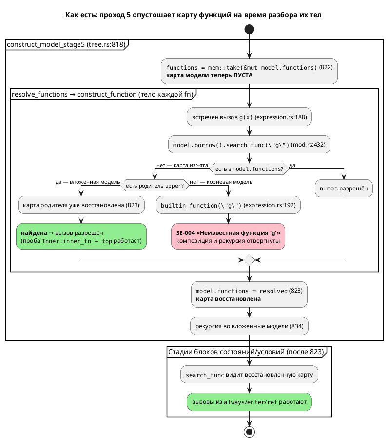
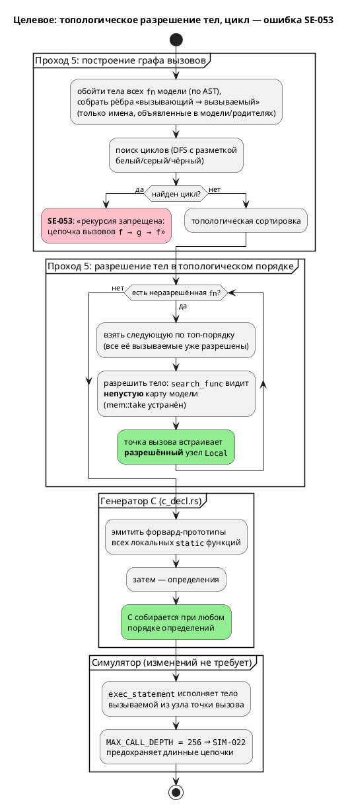
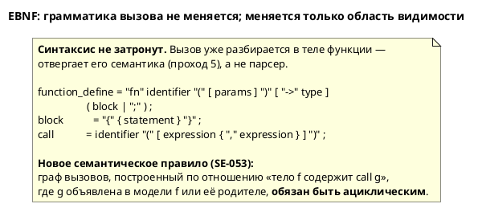

# Фича: Вызов функции из тела функции

- **Номер:** 0031
- **Статус:** **ГОТОВО**
- **Зависит от:** нет
- **Приоритет / Tier:** Tier 1 (высокий) — дефект семантики базовой конструкции
  языка; блокирует композицию функций во всех `.lam`
- **Связанные issue (анализ):** новая фича (кандидат из витрины `FEATURES.md`,
  выявлен при реализации 0025-02b-2)

## Стадии жизненного цикла

Все стадии — **разделы этой карточки**: «Архитектура (ADR)»,
«Анализ», «Разработка», «Тест-план», «Отчёт о тестировании», «Итог».
Отдельным артефактом остаются только исправления —
[`docs/fixes/`](../fixes/README.md) (при необходимости `0031-YY-*`).

## Краткое описание

Семантика Lam отвергает вызов одной функции из тела другой в пределах **одной
модели**: `fn g(x: u8) -> u8 { return x; } fn f(x: u8) -> u8 { return g(x); }`
даёт `Ошибка компиляции: Неизвестная функция 'g'` (SE-004). Фича снимает это
ограничение: тело функции получает доступ к другим функциям своей модели, то
есть композиция функций (`f → g`) начинает работать так же, как она уже работает
из блоков состояний и условий.

Ограничение **не является осознанным решением** — это дефект прохода 5 «Тела
функций»: `std::mem::take` в `semantic/tree.rs:822` опустошает карту функций
модели ровно на время разрешения их тел. Доказательство — вложенная модель
**уже сегодня** успешно вызывает функцию родительской модели (проба
воспроизведена в анализе): пробел проявляется только внутри одного уровня.

**Рекурсия (прямая `f→f` и взаимная `f→g→f`) остаётся запрещённой** и получает
внятную диагностику вместо нынешнего «Неизвестная функция» (ADR, Option B).
Запрет обоснован доменом: промышленные системы управления требуют
ограниченного стека и верифицируемости (ср. MISRA C:2012 Rule 17.2, IEC 61131-3),
а текущая архитектура семантики (функции хранятся **по значению** и копируются
в точку вызова) рекурсию структурно выразить не может.

Изменение языка → рост версии языка **0.2.0 → 0.3.0** (аддитивно).

> Фича зарегистрирована из бэклога кандидатов `FEATURES.md`; далее проходит
> жизненный цикл по своду.

## Архитектура (ADR)

- **Status:** Accepted
- **Date:** 2026-07-15
- **Authors:** Архитектор + системный аналитик + дизайнер языка
- **Related issues:** [Фича](0031-fn-calls-fn.md); связь с
  [ADR](0025-simulator-expression-eval.md#архитектура-adr) (дефект выявлен при реализации
  0025-02b-2; там же появился предохранитель `MAX_CALL_DEPTH`)

### Context

Семантика Lam отвергает вызов одной функции из тела другой. Обе пробы
воспроизведены (`cargo run --bin lamc -- compile -t c <файл>.lam -o <вывод>`):

| Проба | Исходник | Фактическое сообщение |
|---|---|---|
| Композиция | `fn g(x: u8) -> u8 { return x; }`<br>`fn f(x: u8) -> u8 { return g(x); }` | `Ошибка компиляции: Неизвестная функция 'g'` |
| Прямая рекурсия | `fn f(x: u8) -> u8 { return f(x); }` | `Ошибка компиляции: Неизвестная функция 'f'` |
| Вызов из `always` (контроль) | `start Main { always { y := g(1); } }` | **успех** — C сгенерирован |

Диагностика — `SE-004` (`semantic/builtin.rs:50`). Формулировка вводит в
заблуждение: функция `g` объявлена, но на момент разбора тела `f` **не видна**.

#### Корневая причина

Проход 5 «Тела функций», `semantic/tree.rs:818-823`:

```rust
fn construct_model_stage5(model: Rc<RefCell<ModelNode>>) -> … {
    // Разрешаем функции на уровне текущей модели
    let functions = std::mem::take(&mut model.borrow_mut().functions);   // ← строка 822
    model.borrow_mut().functions = resolve_functions(functions, model.clone())?;  // ← 823
    …
    for (name, nested_model) in nested {          // ← 834: вложенные модели ПОСЛЕ восстановления
        models.insert(name, construct_model_stage5(nested_model)?);
    }
```

`std::mem::take` **изымает** карту функций из модели (оставляя `HashMap`
по умолчанию) и отдаёт её в `resolve_functions`, которая разрешает тела против
**той же самой** `model` — а её `functions` в этот момент пуста. Далее
`search_func` (`semantic/mod.rs:432-440`) не находит имя локально, поднимается по
цепочке `upper` (для корневой модели её нет) и возвращает `None`; точка вызова
`expression.rs:188-193` трактует ненайденное имя как **встроенную** функцию и
падает в `builtin_function` → `SE-004`.

`mem::take` здесь — обход двойного заимствования `RefCell` (нельзя держать
`borrow_mut()` на `model`, пока `resolve_functions` берёт `borrow()`), то есть
**артефакт дисциплины заимствования, а не решение о языке**.

**Ключевое доказательство, что запрет случаен.** Стадия 5 восстанавливает карту
родителя (строка 823) **до** рекурсии во вложенные модели (строка 834), поэтому
функция вложенной модели **уже сегодня успешно вызывает** функцию родительской —
проба скомпилирована, порождённый C собран `cc` без ошибок:

```lam
fn top(x: u8) -> u8 { return x; }
model Inner {
    fn inner_fn(x: u8) -> u8 { return top(x); }   // работает!
    …
}
```

Язык, таким образом, уже допускает `fn → fn` **между** уровнями моделей и
запрещает только **внутри** одного уровня. Такая асимметрия не может быть
осознанной семантикой.

#### Поток «как есть»



#### Что ещё вскрыл разбор (влияет на выбор варианта)

1. **Функции хранятся по значению.** `ModelNode.functions:
   HashMap<String, FunctionDefinitionNode>` (`mod.rs:77`), а `search_func`
   возвращает `Rc::new(RefCell::new(func.clone()))` (`mod.rs:434`) — **свежую
   копию** узла с телом (`body: StatementNode` лежит в узле по значению,
   `mod.rs:628`). Точка вызова `ExpressionNode::Function` встраивает **глубокий
   снимок** тела вызываемой функции. Следствие: **рекурсия структурно
   невыразима** — копия тела `f` обязана содержать копию тела `f`. Композиция же
   выражается штатно, если разрешать функции в **топологическом порядке** графа
   вызовов (сначала `g`, затем `f` встроит уже разрешённую копию `g`).
2. **Генератор C: прототипов нет, порядок алфавитный.** `c_decl.rs:211-216`
   печатает определения после `local_funcs.sort()` — сортировки **строк
   определений**, а не топологической. Проба: `fn zz`, `fn aa` → в C
   `Order_aa` перед `Order_zz`. Значит для `f → g` в одной модели генератор
   выдал бы `Compose_f` **до** `Compose_g`; такой C не собирается:
   `error: call to undeclared function 'Compose_g'` (проверено `cc -std=c99`).
   Тезис витрины «генератор C её, судя по всему, поддержал бы» подтверждён лишь
   **частично**: для **межмодельных** вызовов C корректен и собирается (проба
   `nested.lam`), для **внутримодельных** — требуется эмиссия форвард-прототипов.
3. **`SE-009` («Функция с именем … уже определена», `function.rs:43-47`) —
   мёртвый код и ловушка.** Проверка `model.borrow().functions.contains_key(&name)`
   проходит только потому, что карта изъята `mem::take`. Наивная правка
   «клонировать вместо take» заставит **каждую** функцию сообщить «уже
   определена». Сегодня же дубликат `fn f` принимается молча — побеждает
   последний (проба: две `fn f` → в C `return 2;`).
4. **Симулятор к вызову `fn → fn` уже готов.** `unit/statement.rs` разбирает
   вызываемую функцию из узла в точке вызова (ветки `Local`/`External`/
   `Builtin`/`Unresolved`, `statement.rs:395-421`), а не из карты модели; тело
   исполняет общий `exec_statement`. Предохранитель `MAX_CALL_DEPTH = 256`
   (`statement.rs:41`) со счётчиком `CALL_DEPTH` (`statement.rs:438-444`) и
   диагностикой `SIM-022` (`statement.rs:459-465`) уже на месте. Изменений кода
   симулятора фича не требует.

### Decision Drivers

1. **Композиция функций — базовое ожидание от языка.** Без неё `fn` вырождается
   в плоские, дублирующие друг друга тела; это бьёт по читаемости спецификаций.
2. **Запрет случаен, а не спроектирован.** Межмодельный `fn → fn` уже работает
   (доказано пробой). Закреплять асимметрию как правило языка нельзя.
3. **Домен — промышленные системы управления.** Целевой C —
   встраиваемый: стек ограничен, требуется верифицируемость и оценка WCET.
   Рекурсия в этом классе систем запрещается отраслевыми стандартами: MISRA
   C:2012 Rule 17.2 («Functions shall not call themselves, either directly or
   indirectly»), IEC 61131-3 не допускает рекурсию в POU. Отсутствие рекурсии —
   **преимущество** языка автоматных моделей, а не пробел.
4. **Архитектура семантики.** Хранение функций по значению делает композицию
   дешёвой, а рекурсию — невыразимой. Решение не должно втягивать проект в
   рефакторинг модели владения ради возможности, противопоказанной домену.
5. **Честная диагностика.** Любой отвергнутый случай обязан объясняться по
   существу («рекурсия запрещена»), а не «Неизвестная функция».

### Considered Options

#### Option A. Разрешить вызовы функций из функций, включая рекурсию

Перевести `ModelNode.functions` на разделяемые дескрипторы
(`HashMap<String, Rc<RefCell<FunctionDefinitionNode>>>`), `search_func` — на
возврат общего `Rc`, разрешение сделать двухфазным («объявить все → разрешить
тела»). В генераторе C эмитить форвард-прототипы; в симуляторе положиться на
`MAX_CALL_DEPTH`.

**Pros:**
- Композиция и рекурсия доступны; язык выразительнее.
- Устраняет снимочное копирование тел — точка вызова ссылается на определение
  (побочно экономит память и чинит класс «снимок устарел»).
- Симулятор готов: `MAX_CALL_DEPTH`/`SIM-022` дают диагностику вместо срыва стека.
- C-рекурсия компилируется штатно (при наличии прототипов).

**Cons:**
- **Противопоказано домену.** Рекурсия на встраиваемой цели —
  неограниченный стек и неоценимый WCET; прямо запрещена MISRA C:2012 Rule 17.2
  и IEC 61131-3. Язык синтеза управляющих автоматов не должен порождать C,
  который заказчик обязан запретить у себя.
- **Крупный рефакторинг модели владения** — `functions` по значению читают
  семантика, оба генератора, симулятор, LSP и `unused.rs`; смена типа карты
  задевает всех потребителей и все снапшот-тесты codegen.
- **Глубокий `clone()` становится ловушкой:** `FunctionDefinitionNode: Clone`
  (`mod.rs:608`) — при рекурсии любое случайное значение-клонирование даёт
  зацикливание; инвариант «клонировать только `Rc`» ничем не охраняется.
- Верификация (LTL/Бюхи) и оценка завершимости моделей усложняются.
- `MAX_CALL_DEPTH = 256` превращается из предохранителя в **семантику языка**
  (предел рекурсии), причём в симуляторе он есть, а в порождённом C — нет:
  симулятор и C разойдутся на глубоких рекурсиях.

#### Option B. Разрешить вызовы функций, запретив циклы в графе вызовов

Тело функции видит функции своей модели (и родительских — как уже сегодня).
Граф вызовов строится на стадии 5; **цикл** (`f→f`, `f→g→f`, любой длины) —
ошибка с новым кодом `SE-053`. Тела разрешаются в **топологическом** порядке.
В генераторе C эмитятся форвард-прототипы локальных функций.

**Pros:**
- Даёт ровно то, чего не хватает (композицию), и снимает случайную асимметрию
  «внутри модели нельзя, между моделями можно».
- **Ложится на текущую архитектуру:** топологический порядок разрешения — это
  именно то, что умеет модель хранения по значению; ацикличность и есть условие
  выразимости. Рефакторинг владения не нужен.
- **Соответствует домену и стандартам** (MISRA C:2012 Rule 17.2, IEC 61131-3):
  ограниченный стек, вычислимый WCET, верифицируемость.
- Граф вызовов ациклический ⇒ топологический порядок эмиссии/прототипы в C
  делаются тривиально и детерминированно.
- Рекурсия отвергается **по существу** (`SE-053` с цепочкой вызовов), а не
  «Неизвестная функция».
- `MAX_CALL_DEPTH` остаётся честным предохранителем: он **достижим** и без
  рекурсии — длинной нерекурсивной цепочкой `f1→f2→…→f257`.

**Cons:**
- Нужна реализация поиска циклов (обход в глубину с цветовой разметкой) и
  внятное сообщение с цепочкой.
- Рекурсивные алгоритмы (обход деревьев и т. п.) на Lam невыразимы — обходятся
  циклами `while`/`loop`, которые в языке есть.
- Порядок разрешения функций перестаёт быть произвольным — вводится зависимость
  от графа; при ошибке реализации возможен регресс уже работающих межмодельных
  вызовов (снимается тестами).

#### Option C. Оставить запрет, зафиксировав диагностикой и документацией

Не менять семантику; заменить `SE-004` на явное «вызов функции из тела функции
не поддерживается» и записать ограничение в README.

**Pros:**
- Нулевой риск для кода; минимальные трудозатраты.
- Честнее нынешнего вводящего в заблуждение «Неизвестная функция 'g'».
- Сохраняет плоский, тривиально верифицируемый граф вызовов.

**Cons:**
- **Возводит дефект в ранг правила языка.** Запрет доказуемо случаен: он не
  распространяется на межмодельные вызовы, которые работают (проба `nested.lam`).
- Ставит перед выбором, каждый вариант которого плох: либо документировать
  асимметрию «внутри модели нельзя, между моделями можно» (несогласованная,
  необъяснимая семантика), либо **запретить и межмодельные вызовы** — то есть
  сломать обратную совместимость и уже работающую функциональность ради
  сохранения дефекта.
- Композиция — базовое ожидание; её отсутствие бьёт по главной цели проекта — спецификации промышленных автоматов дублируют логику.
- Не даёт ничего домену: безопасность обеспечивает запрет **рекурсии**, а не
  запрет вызовов; Option B даёт ту же безопасность без потери выразительности.

### Decision

Принимается **Option B** — вызовы функций из тел функций разрешаются, циклы в
графе вызовов запрещаются новой диагностикой `SE-053`.

Обоснование. Option C отвергнут: он закрепляет доказуемо случайный дефект и, если
доводить его до логической согласованности, требует сломать уже работающие
межмодельные вызовы. Option A отвергнут не из-за трудоёмкости, а по **существу
домена**: рекурсия на встраиваемой цели противопоказана и прямо запрещена
отраслевыми стандартами (MISRA C:2012 Rule 17.2, IEC 61131-3), поэтому платить за
неё сменой модели владения во всех потребителях — значит покупать возможность,
которую заказчик обязан запретить у себя. Option B закрывает реальную потребность
(композицию), совпадает с ограничением, которое отрасль вводит **намеренно**, и
ложится на существующую архитектуру: ацикличность графа вызовов — ровно то
условие, при котором хранение функций по значению корректно, а эмиссия C
детерминирована.

Запрет рекурсии тем самым перестаёт быть побочным эффектом дефекта и становится
**осознанным свойством языка**, зафиксированным диагностикой и документацией —
то есть выполняется и рекомендация исходного кандидата из витрины.

#### Целевой поток



#### Целевой EBNF (справочно — грамматика не меняется)



### Consequences

#### Положительные

- Композиция функций работает внутри модели — как уже работает между моделями и
  из блоков `always`/`enter`/`exit`/`ref`.
- Запрет рекурсии становится осознанным и объяснённым: `SE-053` с цепочкой
  вызовов вместо `SE-004` «Неизвестная функция 'f'».
- Устраняется асимметрия уровней моделей — семантика становится объяснимой.
- Побочно чинится `SE-009`: дубликат `fn` перестаёт молча приниматься (сегодня
  побеждает последний).
- `MAX_CALL_DEPTH` (`statement.rs:41`) обретает смысл: он остаётся достижимым
  через длинные нерекурсивные цепочки и сохраняется как предохранитель.
- Генератор C становится устойчив к порядку определений (форвард-прототипы).

#### Отрицательные / Action items

- **A1.** Устранить `mem::take` (`tree.rs:822`) — разрешать тела в топологическом
  порядке, не изымая карту. Осторожно: наивная замена на `clone()` **сломает**
  `SE-009` (`function.rs:43`) — проверка дубликата должна переехать к точке
  вставки (`tree.rs:458`), где сегодня `HashMap::insert` молча перетирает.
- **A2.** Реализовать построение графа вызовов и поиск циклов → `SE-053`
  (следующий свободный код: занято по `SE-052`).
- **A3.** Генератор C — эмиссия форвард-прототипов локальных функций
  (`c_decl.rs:211-216`); иначе `f → g` в одной модели даёт несобираемый C
  (проверено `cc`).
- **A4.** Рекурсивные алгоритмы невыразимы — задокументировать в README
  (раздел «Функции») с обходным путём через `while`/`loop`.
- **A5.** Версия языка **0.2.0 → 0.3.0**: расширение аддитивно —
  ранее отвергавшиеся программы компилируются, ни одна валидная программа не
  меняет смысла.
- **A6.** `compute_usage` (`unused.rs:56-58`) уже обходит тела функций, поэтому
  транзитивно вызываемая `g` не будет отброшена фильтром `usage()` в
  `c_decl.rs:132`; проверить тестом (множество — надмножество нужного, ошибка
  безопасна).

#### Acceptance criteria

1. `fn f(x: u8) -> u8 { return g(x); }` с объявленной `fn g` компилируется; в
   порождённом C `Model_f` вызывает `Model_g`, и вывод собирается `cc -std=c99`
   без ошибок и предупреждений о неявных объявлениях.
2. `fn f(x: u8) -> u8 { return f(x); }` отвергается с кодом `SE-053` и
   сообщением, называющим рекурсию и цепочку вызовов (не `SE-004`).
3. Взаимная рекурсия `f→g→f` отвергается тем же `SE-053` с полной цепочкой.
4. Вызов действительно неизвестного имени (`ghost()`) по-прежнему даёт `SE-004`.
5. Межмодельный вызов (`Inner.inner_fn → top`) продолжает работать — регресса нет.
6. Симулятор и порождённый C дают одинаковые значения на композиции функций
   (сверка `conformance_c_tests.rs` по установившимся значениям, `Integer`/`Bool`).
7. Версия языка в README — `0.3.0`, раздел «Функции» описывает композицию и
   явный запрет рекурсии; примеры и контрпримеры перенесены в документацию.

## Анализ

### Цель и контекст

Снять случайный запрет на вызов функции из тела другой функции в пределах одной
модели и зафиксировать запрет **рекурсии** как осознанное свойство языка с
внятной диагностикой (ADR, Option B).

Кандидат пришёл из витрины `FEATURES.md` (выявлен при реализации 0025-02b-2).
Анализ **подтвердил обе пробы дословно** и **уточнил три утверждения кандидата**
(см. «Проверка утверждений кандидата»).

#### Воспроизведение (пробы)

Команда (для каждого файла):

```sh
cargo run --bin lamc -- compile -t c <файл>.lam -o <вывод>
```

| Проба | Исходник (существенная часть) | Фактический вывод |
|---|---|---|
| П1. Композиция | `fn g(x: u8) -> u8 { return x; }`<br>`fn f(x: u8) -> u8 { return g(x); }` | `Ошибка компиляции: Неизвестная функция 'g'` |
| П2. Прямая рекурсия | `fn f(x: u8) -> u8 { return f(x); }` | `Ошибка компиляции: Неизвестная функция 'f'` |
| П3. Вызов из `always` | `start Main { always { y := g(1); } }` | **успех**, C сгенерирован |
| П4. Вложенная → родительская | `model Inner { fn inner_fn(x: u8) -> u8 { return top(x); } }` при `fn top` на верхнем уровне | **успех**, C сгенерирован и собран `cc` |
| П5. Порядок эмиссии C | `fn zz`, `fn aa`, обе вызваны из `always` | в C `Order_aa` **перед** `Order_zz` (алфавит) |
| П6. Дубликат имени | две `fn f` подряд | **успех** (!), в C `return 2;` — побеждает последняя |

Диагностика П1/П2 — `SE-004`, `semantic/builtin.rs:50`.

#### Корневая причина

**`grammar/src/semantic/tree.rs:822`** (проход 5 «Тела функций»):

```rust
let functions = std::mem::take(&mut model.borrow_mut().functions);          // 822
model.borrow_mut().functions = resolve_functions(functions, model.clone())?; // 823
```

`mem::take` изымает карту функций модели, оставляя на её месте пустой `HashMap`,
и передаёт содержимое в `resolve_functions`, которая разрешает тела против **той
же** `model` — с уже пустой картой. Цепочка отказа:

1. `expression.rs:188` — встречен `ast::Expression::Function`;
2. `expression.rs:189` → `model.borrow().search_func("g")`;
3. `mod.rs:433` — `self.functions.get("g")` → `None` (карта изъята);
4. `mod.rs:435` — подъём по `upper`; у корневой модели родителя нет → `None`;
5. `expression.rs:192` — ненайденное имя трактуется как **встроенное** →
   `builtin_function("g")` → `SE-004` «Неизвестная функция 'g'».

`mem::take` — обход двойного заимствования `RefCell` (иначе `borrow_mut()` на
`model` конфликтует с `borrow()` внутри `resolve_functions`), то есть **артефакт
дисциплины заимствования, а не решение о языке**.

**Доказательство случайности запрета (П4).** `construct_model_stage5`
восстанавливает карту на строке 823 **до** рекурсии во вложенные модели (строка
834), поэтому функция вложенной модели уже сегодня успешно вызывает функцию
родительской. Запрет действует **только внутри одного уровня** — такая асимметрия
не может быть осознанной семантикой.

#### Проверка утверждений кандидата

| Утверждение витрины | Вердикт | Уточнение |
|---|---|---|
| `fn g … fn f { return g(n); }` → «Неизвестная функция 'g'» | **подтверждено** | дословно, П1 |
| `fn f { return f(n); }` → «Неизвестная функция 'f'» | **подтверждено** | дословно, П2 |
| «из блоков состояний и условий вызовы работают» | **подтверждено** | П3; причина — карта восстановлена к моменту разбора блоков (823 до 834) |
| «пробел прохода 5, а не осознанное ограничение» | **подтверждено, усилено** | П4: межмодельный `fn → fn` уже работает |
| «генератор C её, судя по всему, поддержал бы» | **подтверждено частично** | межмодельный C корректен и собирается (П4); **внутримодельный — нет**: `local_funcs.sort()` (`c_decl.rs:213`) сортирует **строки определений**, форвард-прототипов нет → `f` эмитится до `g` (П5), и такой C не собирается (`cc -std=c99`: `call to undeclared function 'Compose_g'`). Требуется работа по генератору — задача |
| «`MAX_CALL_DEPTH` — защита от недостижимого сегодня сценария» | **подтверждено, но перестанет быть верным** | `statement.rs:41`, `= 256`; после 0031 предел **достижим** без рекурсии — цепочкой `f1→f2→…→f257` |

#### Смежные находки

- **`SE-009` — мёртвый код и ловушка.** `function.rs:43` проверяет
  `model.borrow().functions.contains_key(&name)`, что при изъятой карте **всегда
  false**. Наивная правка «`clone()` вместо `take`» заставит **каждую** функцию
  сообщить «уже определена». Сегодня дубликат `fn` принимается молча (П6),
  побеждает последний: `HashMap::insert` в `tree.rs:458` перетирает без
  диагностики. Входит в объём 0031-01 как **вынужденное** следствие правки.
- **Функции хранятся по значению.** `ModelNode.functions:
  HashMap<String, FunctionDefinitionNode>` (`mod.rs:77`); `search_func`
  возвращает `Rc::new(RefCell::new(func.clone()))` (`mod.rs:434`) — глубокую
  копию узла вместе с телом (`body: StatementNode`, `mod.rs:628`). Точка вызова
  встраивает **снимок** тела. Отсюда: рекурсия структурно невыразима (копия тела
  `f` обязана содержать копию тела `f`), а композиция выражается штатно при
  **топологическом** порядке разрешения. Это и есть архитектурное обоснование
  Option B в ADR.
- **`compute_usage` уже обходит тела функций** (`unused.rs:56-58`), поэтому `g`,
  вызываемая только из `f`, не будет отброшена фильтром `usage()`
  (`c_decl.rs:132`). Обход — надмножество (помечает вызываемых и у неиспользуемых
  функций), то есть ошибка безопасна: лишний код, а не потерянный.
- **Симулятор изменений не требует.** `unit/statement.rs:395-421` берёт
  определение вызываемой функции **из узла точки вызова** (ветки `Local`/
  `External`/`Builtin`/`Unresolved`), а не из карты модели; тело исполняет общий
  `exec_statement`. Ветка `Unresolved` → `SIM-016` служит страховкой, если
  неразрешённый снимок всё же просочится.

### Зависимости фичи

- **Зависит от:** **нет**.

  Обоснование. Таблица последовательности разработки в `FEATURES.md` пуста —
  незакрытых фич нет, поэтому блокирующих зависимостей быть не может. Проверены
  и смежные кандидаты, оформляемые параллельно:

  | Кандидат | Пересечение | Зависимость? |
  |---|---|---|
  | 0026 (typedef корня в C) | оба трогают вывод C, но разные места: 0026 — заголовок/typedef, 0031-02 — прототипы функций в `.c` | **нет** (независимые правки; конфликт только текстовый при слиянии) |
  | 0027 (деление модулей) | `c_expr.rs` в списке переросших; 0031 правит `c_decl.rs`/`tree.rs`/`function.rs` | **нет** (рефакторинг-переезд; порядок не важен, но 0031 раньше — меньше конфликтов) |
  | 0028 (заглушки генератора C) | тот же класс «тихого пропуска», другие ветки | **нет** |
  | 0029 (типы `Array`/`Bit`/`Rational` в C) | тесты используют `u8`/`int`/`bool` — исправные типы | **нет** (сознательно не задеваем дефектные типы, ср. `CLAUDE.md`) |
  | 0030 (`comprehensive.lam`) | пример не использует `fn → fn` | **нет** |

  Обратное направление: 0031 **никого не блокирует**, но снимает ограничение
  «рекурсия невозможна», на которое ссылается контекст `MAX_CALL_DEPTH` в
  описании 0025 (фича закрыта — правок не требует; актуализация формулировки
  входит в 0031-03).

- **Влияние на порядок разработки:** фича независима и полностью проработана
  (ADR + анализ), поэтому по своду (критерий 2 «проработанность» +
  критерий 3 «приоритетность», Tier 1) может браться в работу немедленно и
  претендует на верхнюю позицию таблицы среди фич без зависимостей. Статус
  `ЗАБЛОКИРОВАНА` **не ставится**.

### Версия языка

Текущая версия языка — **0.2.0** (`README.md:1007`, раздел «10. Расширение и
версии»). Фича меняет **семантику языка** (область видимости имён функций),
следовательно версия обязана вырасти.

**Решение: 0.2.0 → 0.3.0** (MINOR, аддитивное расширение). Обоснование по
семантическому версионированию:

- Программы, которые **ранее отвергались** (`f → g`), теперь компилируются —
  чистое расширение множества принимаемых программ;
- **ни одна валидная программа не меняет смысла**: `search_func` для тел блоков
  и условий работает как прежде; межмодельные вызовы (П4) сохраняют поведение;
- новая диагностика `SE-053` (цикл вызовов) ужесточает **только** то, что и
  сегодня отвергается (сейчас — как `SE-004`), то есть валидного кода не ломает;
- восстановление `SE-009` (дубликат `fn`) формально сужает язык, но касается
  кода, который сегодня принимается **молча и недетерминированно по смыслу**
  (побеждает последний, П6) — это исправление дефекта, а не слом контракта; в
  корпусе `examples/` и фикстурах дубликатов нет (проверить `grep` при
  реализации, R7).

MAJOR-бамп не требуется: слома совместимости нет (ср. 0.0.x → 0.1.0 в фиче,
где менялись операторы).

### Требования и проверяемые условия

- **R1. Композиция функций внутри модели.** Тело `fn` видит функции, объявленные
  в той же модели, независимо от порядка объявления в исходнике (`f` может
  вызывать `g`, объявленную ниже). Проверяется П1-сценарием.
- **R2. Межмодельная видимость сохранена.** Тело `fn` вложенной модели
  по-прежнему видит функции родительских моделей (П4) — регресса нет.
- **R3. Циклы в графе вызовов отвергаются.** Прямая (`f→f`) и взаимная
  (`f→g→f`, любой длины) рекурсия — ошибка `SE-053` с сообщением, называющим
  рекурсию и **цепочку вызовов**. Сообщение на русском.
- **R4. Неизвестное имя остаётся `SE-004`.** Вызов необъявленной функции
  (`ghost()`) даёт прежний код и сообщение — `SE-053` не подменяет `SE-004`.
- **R5. Встроенные функции не затронуты.** `debug`, `S`, `min`, `max`, `abs`,
  `clamp` разрешаются как раньше, в том числе из тела `fn`; они не участвуют в
  графе вызовов (тела не имеют).
- **R6. Порождённый C собирается.** Для композиции внутри одной модели вывод
  цели `c` компилируется `cc -std=c99 -Wall` без ошибок и без
  `-Wimplicit-function-declaration`. Требуется эмиссия форвард-прототипов
  локальных `static`-функций.
- **R7. `SE-009` восстановлен.** Дубликат `fn` с одним именем в одной модели —
  ошибка, а не молчаливое перетирание (П6). Корпус `examples/` и фикстуры
  дубликатов не содержат (проверить перед включением).
- **R8. Байт-в-байт неизменность вывода C там, где вызовов `fn → fn` нет.**
  Добавление прототипов меняет вывод `c` для **любой** модели с локальными
  функциями → снапшоты codegen требуют осознанной переутверждённой сверки
  (не «переутвердить не глядя»).
- **R9. Симулятор согласован с C.** На композиции функций симулятор и
  порождённый C дают одинаковые **установившиеся** значения (`Integer`/`Bool`/
  `Enum`; `Array`/`Bit`/`Rational` не использовать, `CLAUDE.md`).
- **R10. Кода симулятора не трогаем.** `MAX_CALL_DEPTH = 256` и `SIM-022`
  сохраняются как есть; меняется лишь их обоснование (предел стал достижим без
  рекурсии) — фиксируется в документации, не в коде.
- **R11. Форматтер не затронут.** Узлы АСД не добавляются, печать
  (`grammar/src/format/`) правок не требует; `format_tests.rs` обязан остаться
  зелёным на новых фикстурах.
- **R12. Документация языка.** README: версия `0.3.0`; раздел «Функции»
  описывает композицию и **явный запрет рекурсии** с обходом через `while`/
  `loop`; примеры и контрпримеры перенесены в документацию.
  Устаревший комментарий в `tests/data/semantic/valid/functions.lam` («тело
  функции видит только переменные модели, но не другие функции — это
  архитектурное ограничение текущей реализации») обязан быть исправлен.

### Критерии приёмки и способ проверки

| # | Критерий | Способ проверки |
|---|---|---|
| A1 | Композиция `f → g` внутри модели компилируется (R1) | фикстура `tests/data/semantic/valid/fn_calls_fn.lam` + тест в `semantic_tests.rs`; проба П1 даёт успех |
| A2 | Порядок объявления не важен: `f` вызывает `g`, объявленную ниже (R1) | фикстура с обратным порядком; тест `semantic_tests.rs` |
| A3 | Межмодельный вызов работает (R2) | фикстура `fn_calls_parent_fn.lam` (сценарий П4); тест `semantic_tests.rs` |
| A4 | Прямая рекурсия `f→f` → `SE-053`, цепочка в сообщении (R3) | фикстура `tests/data/semantic/invalid/fn_direct_recursion.lam`; assert на код **и** подстроку цепочки |
| A5 | Взаимная рекурсия `f→g→f` → `SE-053` (R3) | фикстура `invalid/fn_mutual_recursion.lam`; assert кода и цепочки |
| A6 | Цикл длины 3 `f→g→h→f` → `SE-053` (R3) | фикстура `invalid/fn_cycle_three.lam` |
| A7 | `ghost()` → `SE-004`, не `SE-053` (R4) | фикстура `invalid/fn_unknown_call.lam`; assert кода `SE-004` |
| A8 | Встроенные функции из тела `fn` работают (R5) | фикстура с `min`/`abs` внутри `fn`; тест `semantic_tests.rs` |
| A9 | Порождённый C для композиции собирается (R6) | `codegen_tests.rs`: генерация + `cc -std=c99 -Wall -Werror=implicit-function-declaration`; в выводе есть прототип `static … Model_g(…);` до определения `Model_f` |
| A10 | Дубликат `fn` → `SE-009` (R7) | фикстура `invalid/fn_duplicate_name.lam`; сегодня тест провалится (П6) — служит зондом |
| A11 | Снапшоты codegen пересверены осознанно (R8) | ревью diff снапшотов: изменения **только** добавленные строки прототипов |
| A12 | Симулятор == C на композиции (R9) | `simulation/tests/conformance_c_tests.rs` + `eval_tests.rs` на **значения** (`Unit::variable`), фикстура `tests/data/eval/` |
| A13 | `MAX_CALL_DEPTH` не тронут (R10) | `grep -n "MAX_CALL_DEPTH" simulation/src/unit/statement.rs` → `= 256`, строка 41 |
| A14 | Форматтер зелёный на новых фикстурах (R11) | `cargo test --test format_tests -- --test-threads=1` |
| A15 | README: версия `0.3.0`, раздел «Функции» (R12) | ревью; `grep -n "Версия языка" README.md` |
| A16 | Комментарий-ограничение в фикстуре исправлен (R12) | `grep -n "не другие функции" grammar/tests/data/semantic/valid/functions.lam` → пусто |
| A17 | Полная сборка и тесты зелёные | `./scripts/precheck.sh`; `cargo test -- --test-threads=1`; `cargo test --features lsp -- --test-threads=1` |

### Особенности по обратной функциональности

свод. **Обратная совместимость сохраняется полностью** — слом не требуется
и не обосновывается.

| Функциональность | Влияние | Статус |
|---|---|---|
| Существующие `.lam` (`examples/`, фикстуры) | ни одна валидная программа не меняет смысла: расширяется только область видимости имён в телах `fn` | совместимо |
| Вызовы из `always`/`enter`/`exit`/`ref` | путь не трогается (карта и так восстановлена к этому моменту) | без изменений |
| Межмодельные вызовы `fn → fn` (П4) | **работают сегодня** — обязаны продолжать; главный кандидат на регресс при перестройке порядка разрешения | под тестом A3 |
| Встроенные функции | `builtin_function` остаётся резервным путём для ненайденных имён | без изменений |
| Цель `c` | вывод **меняется** для любой модели с локальными функциями: добавляются форвард-прототипы (R8). Изменение аддитивное (новые строки), поведение C идентично | снапшоты пересверить |
| Цель `c-hal` | тот же генератор функций → то же добавление прототипов | снапшоты пересверить |
| Цель `plantuml` | функции не эмитит | не затронута |
| Симулятор | кода не трогаем; ранее невозможные программы теперь исполняются | расширение |
| LSP (`hover`, `index`) | читает `ModelNode.functions`; тип карты не меняется (Option B не трогает модель владения) | не затронут |
| Форматтер | узлы АСД не добавляются | не затронут |
| Мигратор 0021 | язык не ломается → миграция не нужна | не затронут |

Единственное формальное сужение — восстановление `SE-009` (R7): код с дубликатом
`fn` перестанет компилироваться. Это **исправление дефекта**: сегодня такой код
принимается молча, а выбор победившего тела определяется порядком в `HashMap`,
то есть смысл программы не определён. Обоснование сужения — недопустимость
молчаливого недетерминизма в языке промышленных систем управления.

### Риски и зависимости

| # | Риск | Вероятность / эффект | Снижение |
|---|---|---|---|
| Р1 | Наивная правка «`clone()` вместо `mem::take`» ломает `SE-009`: **каждая** функция сообщит «уже определена» (`function.rs:43`) | высокая / сборка красная | зафиксировано в 0031-01: проверку дубликата перенести к точке вставки (`tree.rs:458`), из `construct_function` убрать |
| Р2 | Регресс межмодельных вызовов при перестройке порядка разрешения (работают сегодня — П4) | средняя / слом рабочей функциональности | тест A3 заводится **до** правки (зонд), фикстура `fn_calls_parent_fn.lam` |
| Р3 | Забыть прототипы в C → композиция компилируется в Lam, но порождённый C не собирается (П5, проверено `cc`) | высокая, если не запланировать / «зелёные тесты при сломанном выводе» | задача + критерий A9 с реальным вызовом `cc` |
| Р4 | Снапшоты codegen переутверждаются «не глядя», маскируя дефект | средняя / тихая деградация вывода C | A11: ревью diff — только добавленные строки прототипов |
| Р5 | Граф вызовов строится по AST **до** разрешения имён → можно принять за вызов функции обращение к переменной/встроенной функции | средняя / ложный `SE-053` | рёбра только для имён, объявленных как `fn` в модели/родителях; встроенные и `extern` (без тела) рёбер не дают (R5); тест A8 |
| Р6 | Топологический порядок недостаточен при вызовах **вверх** по `upper` (функция родителя вызывает функцию родителя) | низкая / неполное покрытие | граф строится в пределах одной модели; межмодельные рёбра уже упорядочены стадийностью (823 до 834) — зафиксировать тестом A3 |
| Р7 | `MAX_CALL_DEPTH` станет достижим (цепочка `f1→…→f257`) и даст `SIM-022` там, где C просто исполнится | низкая / расхождение симулятора и C | поведение осознанное; зафиксировать в документации (0031-03), в тестах не воспроизводить как «норму» |
| Р8 | Новые тесты написаны на угаданные строки сообщений | средняя / хрупкие тесты | `CLAUDE.md`: сперва зонд для захвата реального вывода, затем assertions против захваченного |
| Р9 | Текстовый конфликт с 0026/0027 по файлам генератора C | низкая / конфликт слияния | 0031 берётся раньше 0027 (переезд модулей); координация — за координатором |

Зависимостей от других фич нет (см. «Зависимости фичи»).

### Декомпозиция на подзадачи

Объём умеренный — базовый анализ не декомпозируется; разработка
делится на три задачи:

| Задача | Файл | Содержание |
|---|---|---|
| 0031-01 | [`0031-fn-calls-fn.md#разработка`](0031-fn-calls-fn.md#разработка) | Семантика: устранение `mem::take` (`tree.rs:822`), топологическое разрешение тел, граф вызовов и `SE-053`, восстановление `SE-009`, фикстуры |
| 0031-02 | [`0031-fn-calls-fn.md#разработка`](0031-fn-calls-fn.md#разработка) | Генератор C: форвард-прототипы локальных функций (`c_decl.rs`), сверка снапшотов, сборка вывода `cc` |
| 0031-03 | [`0031-fn-calls-fn.md#разработка`](0031-fn-calls-fn.md#разработка) | Версия языка 0.3.0, README (раздел «Функции»: композиция + запрет рекурсии), примеры/контрпримеры в документацию, актуализация комментария в фикстуре и обоснования `MAX_CALL_DEPTH` |

## Разработка

### Задача

#### Что было

> **Реальное состояние кода на 2026-07-15** (ветка `v2`, коммит `6984471`).
> Все утверждения ниже воспроизведены пробами, а не реконструированы по документам.

Семантика отвергает вызов функции из тела другой функции **в пределах одной
модели**. Команда воспроизведения:

```sh
cargo run --bin lamc -- compile -t c <файл>.lam -o <вывод>
```

| Проба | Исходник | Фактический вывод |
|---|---|---|
| Композиция | `fn g(x: u8) -> u8 { return x; }`<br>`fn f(x: u8) -> u8 { return g(x); }` | `Ошибка компиляции: Неизвестная функция 'g'` |
| Прямая рекурсия | `fn f(x: u8) -> u8 { return f(x); }` | `Ошибка компиляции: Неизвестная функция 'f'` |
| Вызов из `always` | `start Main { always { y := g(1); } }` | **успех** |
| Вложенная → родительская | `model Inner { fn inner_fn(x: u8) -> u8 { return top(x); } }` при `fn top` наверху | **успех** |
| Дубликат `fn f` (дважды) | две `fn f` с разными телами | **успех** (!), в C `return 2;` |

##### Корневая причина — `grammar/src/semantic/tree.rs:822`

```rust
fn construct_model_stage5(model: Rc<RefCell<ModelNode>>) -> … {
    let functions = std::mem::take(&mut model.borrow_mut().functions);          // 822 ← причина
    model.borrow_mut().functions = resolve_functions(functions, model.clone())?; // 823
    …
    for (name, nested_model) in nested {                                         // 834
        models.insert(name, construct_model_stage5(nested_model)?);
    }
```

`mem::take` изымает карту функций модели (оставляя пустой `HashMap`) и отдаёт
содержимое в `resolve_functions`, разрешающую тела против **той же** `model` —
с уже пустой картой. Цепочка отказа:

1. `semantic/expression.rs:188` — встречен `ast::Expression::Function`;
2. `semantic/expression.rs:189` → `model.borrow().search_func("g")`;
3. `semantic/mod.rs:433` — `self.functions.get("g")` → `None` (карта изъята);
4. `semantic/mod.rs:435` — подъём по `upper`; у корневой модели родителя нет;
5. `semantic/expression.rs:192` — ненайденное имя считается **встроенным** →
   `builtin_function("g")` → `semantic/builtin.rs:50` → `SE-004`.

`mem::take` — обход двойного заимствования `RefCell` (нельзя держать
`borrow_mut()` на `model`, пока `resolve_functions` берёт `borrow()`), то есть
артефакт дисциплины заимствования, **а не решение о языке**.

**Запрет случаен** (доказано пробой): стадия 5 восстанавливает карту на строке
823 **до** рекурсии во вложенные модели (строка 834), поэтому функция вложенной
модели уже сегодня вызывает функцию родительской. Ограничение действует только
внутри одного уровня.

##### Сопутствующее состояние

- **`SE-009` мёртв и является ловушкой.** `semantic/function.rs:43-47`
  проверяет `model.borrow().functions.contains_key(&name)` — при изъятой карте
  **всегда false**. Наивная правка «`clone()` вместо `take`» заставит **каждую**
  функцию сообщить «уже определена». Дубликаты сегодня принимаются молча
  (`tree.rs:458` — `HashMap::insert` перетирает без диагностики).
- **Функции хранятся по значению.** `ModelNode.functions:
  HashMap<String, FunctionDefinitionNode>` (`mod.rs:77`); `search_func` возвращает
  `Rc::new(RefCell::new(func.clone()))` (`mod.rs:434`) — глубокую копию узла
  вместе с телом (`body: StatementNode`, `mod.rs:628`). Точка вызова встраивает
  **снимок**. Отсюда: рекурсия структурно невыразима; композиция выражается при
  **топологическом** порядке разрешения (обоснование Option B в ADR).
- Максимальный занятый код диагностики — `SE-052`; следующий свободный —
  **`SE-053`**.
- Устаревший комментарий в `grammar/tests/data/semantic/valid/functions.lam`:
  «тело функции видит только переменные модели, но не другие функции — это
  архитектурное ограничение текущей реализации» (снимается задачей).

#### Что сделано

> **Выполнено** (2026-07-16). Итог: `mem::take` (`tree.rs`) устранён; проход 5
> разрешает тела в **топологическом** порядке графа вызовов, не изымая карту, —
> `search_func` видит уже разрешённые локальные функции (композиция `f → g`
> работает). Новый модуль `semantic/callgraph.rs`: сбор имён вызовов из сырого
> AST (обходчик `ast::Statement`/`ast::Expression`), построение графа, DFS
> «белый/серый/чёрный» с восстановлением цепочки → **SE-053** при цикле. SE-009
> (дубликат `fn`) перенесён из `construct_function` в точку вставки (`tree.rs`),
> где `HashMap::insert` прежде молча перетирал. Пробы: композиция (прямой и
> обратный порядок), `f→f`/`f→g→f`/`f→g→h→f` → SE-053 с цепочкой, `ghost()` →
> SE-004, дубликат → SE-009, межмодельный вызов (регресса нет). Тесты —
> `semantic_tests.rs` (A1–A8, A10).
>
> Ниже — план по ADR (Option B).

Разрешить телам функций видеть функции своей модели; циклы в графе вызовов
отвергать новым кодом `SE-053`; попутно восстановить `SE-009`.

1. **Граф вызовов (новый модуль `grammar/src/semantic/call_graph.rs`).**
   По AST тел функций модели построить рёбра «вызывающий → вызываемый»
   **только** для имён, объявленных как `fn` в этой модели (`extern` и
   встроенные тела не имеют → рёбер не дают, R5). Поиск циклов — DFS с разметкой
   белый/серый/чёрный; серое ребро → цикл, цепочка сохраняется для сообщения.
   Модуль — до ~1000 строк с тестами (`CLAUDE.md`).
2. **Диагностика `SE-053`.** Сообщение на русском, называет рекурсию
   и **цепочку**: `рекурсия запрещена: цепочка вызовов 'f → g → f'`. Точную
   формулировку зафиксировать зондом до написания assertions.
3. **Проход 5 (`tree.rs:818-839`).** Устранить `mem::take`: разрешать тела
   **по одному** в топологическом порядке, записывая результат обратно в карту
   сразу (`model.borrow_mut().functions.insert(name, resolved)`), чтобы
   `search_func` последующих функций видел уже разрешённые. Заимствование
   `RefCell` держать **точечно** (брать и отпускать вокруг каждого вызова
   `construct_function`), а не на весь цикл — именно ради этого и стоял
   `mem::take`.
4. **`SE-009` (`function.rs:43-47` → `tree.rs:458`).** Убрать проверку из
   `construct_function` (после п. 3 она даёт ложное срабатывание на каждой
   функции) и перенести к точке вставки, где `HashMap::insert` сегодня молча
   перетирает: перед вставкой проверять `contains_key` → `SE-009`.
5. **Фикстуры** — примеры 1–6 и контрпримеры 1–6 из тест-плана
   (`tests/data/semantic/{valid,invalid}/`).

##### Статус по функциональности

| Функциональность | Работа | Обоснование |
|---|---|---|
| Семантика `grammar` (проход 5, граф вызовов, `SE-053`, `SE-009`) | **основная** | предмет задачи |
| Генератор C | **н/п в этой задаче** | требуется, но выделено в **0031-02** (форвард-прототипы): без него композиция даёт несобираемый C |
| Симулятор `simulation` | **н/п — кода не трогаем** | `unit/statement.rs:395-421` берёт определение из узла точки вызова, а не из карты модели; тело исполняет общий `exec_statement`. `MAX_CALL_DEPTH = 256` (`statement.rs:41`) и `SIM-022` остаются как есть (R10) |
| Генератор PlantUML | **н/п** | функции не эмитит |
| LSP | **н/п** | читает `ModelNode.functions`; тип карты не меняется (Option B не трогает модель владения) |
| Форматтер `grammar/src/format/` | **н/п** | узлы АСД не добавляются (R11) |
| Мигратор 0021 | **н/п** | язык не ломается — миграция не нужна |
| Документация, версия языка | **н/п в этой задаче** | выделено в **0031-03** |

#### Проверки

> **Планируется (разработка не начата).**

Порядок — по разделу «Порядок постановки тестов» тест-плана: **сперва зонды**
(захват реального вывода), затем assertions против захваченного (`CLAUDE.md`).

1. **Зонды до правки:** T1 (композиция → сегодня `SE-004`), T6 (рекурсия →
   сегодня `SE-004`), T11 (дубликат → сегодня **принимается**). Фиксируют
   фактические строки.
2. **Страж регресса до правки:** T4 — межмодельный вызов работает **сегодня**
   (риск Р2: перестройка порядка разрешения — главный кандидат на регресс).
3. **После правки** — проверки тест-плана T1–T12:

| Проверка | Ожидаемый результат | R / A |
|---|---|---|
| T1–T3 | композиция, обратный порядок объявления, цепочка `c→b→a` компилируются | R1 / A1, A2 |
| T4 | межмодельный вызов работает как прежде | R2 / A3 |
| T5 | `clamp`/`abs` в теле `fn` работают; рёбер графа не дают | R5 / A8 |
| T6–T9 | `f→f`, `f→g→f`, `f→g→h→f`, рекурсия в ветке → **`SE-053`** с цепочкой | R3 / A4–A6 |
| T10 | `ghost()` → **`SE-004`** (`SE-053` не подменяет) | R4 / A7 |
| T11 | дубликат `fn` → **`SE-009`** | R7 / A10 |
| T12 | `SE-009` не срабатывает на корпусе `examples/` и `tests/data/` | R7 / A10 |

4. **Команды** (полная сборка с очисткой + тесты):

```sh
cargo build --bin lamc
cargo test -- --test-threads=1                  # однопоточно: гонки за общие файлы
cargo test --features lsp -- --test-threads=1   # LSP не должен деградировать (T27)
cargo test --test format_tests -- --test-threads=1   # форматтер зелёный (T26)
./scripts/precheck.sh                           # fmt + check + clippy + test + примеры
```

5. **Ручная сверка проб** — обе пробы из «Что было» обязаны сменить вердикт:

```sh
cargo run --bin lamc -- compile -t c compose.lam -o out/   # успех (было SE-004)
cargo run --bin lamc -- compile -t c recur.lam   -o out/   # SE-053 (было SE-004)
```

> **Внимание.** После этой задачи `.lam` с композицией компилируется, но
> порождённый C **ещё не собирается** (`f` эмитится до `g`, прототипов нет —
> проба П5 анализа). Проверка T13 (`cc`) закрывается только задачей **0031-02**;
> до неё фича не считается работающей end-to-end.

### Задача

#### Что было

> **Реальное состояние кода на 2026-07-15** (ветка `v2`, коммит `6984471`).
> Утверждения воспроизведены пробами.

Генератор C печатает определения локальных функций модели **без форвард-
прототипов**, в порядке **алфавитной сортировки строк определений**.

`grammar/src/generator/c/c_decl.rs:211-216`:

```rust
if !local_funcs.is_empty() {
    printer.print("///Функции моделей").nl();
    local_funcs.sort();            // ← сортировка СТРОК определений, не топологическая
    for func in local_funcs {
        printer.print(func.as_str()).nl();
    }
}
```

Каждый элемент `local_funcs` — целое определение, начинающееся с
`static <тип> <Имя>(…) {`, поэтому `sort()` упорядочивает по тексту, то есть
фактически по возвращаемому типу, затем по имени. Прототипы не эмитятся ни в
`.c`, ни в `.h` (в заголовок попадают только `init`/`tick`/`reset`/`is_done`).

**Проба порядка.** `fn zz`, `fn aa` (обе вызваны из `always`) →

```c
static uint8_t Order_aa(const Order *model, uint8_t x) { … }   // строка 5
static uint8_t Order_zz(const Order *model, uint8_t x) { … }   // строка 9
```

**Следствие для фичи.** После 0031-01 композиция `f → g` пройдёт семантику,
но генератор выдаст `Compose_f` **до** `Compose_g` (алфавит), а такой C не
собирается — проверено `cc -std=c99` на выводе, воспроизводящем порядок
генератора:

```
error: call to undeclared function 'Compose_g'; ISO C99 and later do not
support implicit function declarations [-Wimplicit-function-declaration]
    return Compose_g(model, x);
```

**Что уже корректно.** Межмодельные вызовы собираются: модели обходятся
родитель-первым и каждая печатает свою группу `///Функции моделей`, поэтому
`Nested_top` (строка 10) оказывается до `NestedInner_inner_fn` (строка 15),
который его вызывает; вывод собран `cc` без ошибок. Тезис витрины «генератор C
её, судя по всему, поддержал бы» верен **только** для этого случая.

**Смежное.** `c_decl.rs:132` отбрасывает функции вне `map.usage().functions`.
`compute_usage` (`semantic/unused.rs:56-58`) обходит тела функций, поэтому `g`,
вызываемая только из `f`, не потеряется. Обход — надмножество (помечает
вызываемых и у неиспользуемых функций): ошибка безопасна (лишний код, а не
потерянный), но подлежит проверке тестом T16.

#### Что сделано

> **Выполнено** (2026-07-16). Итог: `c_decl.rs` эмитит **форвард-прототипы**
> локальных `static`-функций до их определений. Композиция `f → g` внутри модели
> печатает `f` раньше `g` (алфавит), и без прототипа вызов `g` из `f` был бы
> обращением к необъявленной функции (`cc -std=c99`:
> implicit-function-declaration). Прототипы собираются в `local_protos`
> параллельно определениям и печатаются отсортированными перед ними — порядок
> определений больше не значим. Пробы: composition-C собирается
> `cc -std=c99 -Wall -Werror=implicit-function-declaration`; дифф `stacker.c` —
> **одна** добавленная строка прототипа (R8/A11), поведение C неизменно.
> Тесты: `codegen_tests::test_fn_composition_generates_compilable_c` (A9),
> `eval_tests::fn_composition_is_evaluated` + сверка с C `r=16` (A12).
>
> Ниже — план по ADR (action item A3).

1. **Эмиссия форвард-прототипов** (`c_decl.rs`, рядом с 211-216). Перед блоком
   определений печатать прототипы всех локальных функций модели, попавших в
   вывод:

   ```c
   ///Прототипы функций моделей
   static uint8_t Compose_f(const Compose *model, uint8_t x);
   static uint8_t Compose_g(const Compose *model, uint8_t x);
   ///Функции моделей
   static uint8_t Compose_f(const Compose *model, uint8_t x) { … }
   static uint8_t Compose_g(const Compose *model, uint8_t x) { … }
   ```

   Сигнатура строится тем же кодом, что и заголовок определения (первый параметр
   `const {Root} *model`, затем параметры) — **вынести формирование сигнатуры в
   общую функцию**, чтобы прототип и определение не могли разойтись.
2. **Порядок.** Прототипы делают порядок определений безразличным, поэтому
   существующая `local_funcs.sort()` **сохраняется** (детерминизм вывода при
   недетерминированном обходе `HashMap`). Топологическая сортировка не нужна —
   ацикличность гарантирована `SE-053` (0031-01), но опираться на неё в
   генераторе незачем.
3. **Прототипы — в `.c`, не в `.h`.** Функции `static`; вынос в заголовок дал бы
   `static`-объявления в каждом включающем модуле (предупреждения о
   неиспользуемых). Заголовок не трогаем.
4. **Цель `c-hal`** использует тот же код генерации функций → получает прототипы
   автоматически; проверить отдельно (T17).
5. **Пересверка снапшотов codegen.** Вывод меняется для **любой** модели с
   локальными функциями (R8) — diff обязан содержать **только** добавленные
   строки прототипов.

##### Статус по функциональности

| Функциональность | Работа | Обоснование |
|---|---|---|
| Генератор C, цель `c` (`c_decl.rs`) | **основная** | предмет задачи |
| Генератор C, цель `c-hal` | **затронута** | общий код генерации функций; проверить сборку вывода (T17) |
| Снапшоты codegen | **пересверка** | вывод меняется аддитивно; ревью diff (A11) |
| Семантика `grammar` | **н/п** | сделано в 0031-01 |
| Симулятор | **н/п** | вывод C не потребляет; сверка значений — тест-план T23 |
| Генератор PlantUML | **н/п** | функции не эмитит |
| LSP, форматтер | **н/п** | вывод C не потребляют |

#### Проверки

> **Планируется (разработка не начата).**

1. **Снимок до правки:** зафиксировать текущие снапшоты codegen, чтобы diff
   после правки читался как «только прототипы» (риск Р4 — переутверждение
   снапшотов «не глядя»).
2. **Проверки тест-плана T13–T19:**

| Проверка | Ожидаемый результат | R / A |
|---|---|---|
| T13 | C для композиции **собирается**: `cc -std=c99 -Wall -Werror=implicit-function-declaration` → код 0. Ключевая проверка задачи | R6 / A9 |
| T14 | в `.c` есть `static uint8_t Main_double(const Main *model, uint8_t x);` **до** определения `Main_quad` | R6 / A9 |
| T15 | тело `Main_quad` содержит `Main_double(model, …)` | R6 / A9 |
| T16 | `g`, вызываемая **только** из `f`, присутствует в `.c` (фильтр `usage()` не отбросил) | R1 / A9 |
| T17 | вывод цели `c-hal` собирается `cc`; прототипы на месте | R6 / A9 |
| T18 | diff снапшотов = **только** добавленные строки прототипов | R8 / A11 |
| T19 | межмодельный вывод (собирался до фичи) собирается | R2 / A3 |

3. **Команды**:

```sh
cargo build --bin lamc
cargo test -- --test-threads=1
cargo test --test codegen_tests -- --test-threads=1
./scripts/precheck.sh                    # включает сборку примеров
```

4. **Сборка вывода реальным компилятором** (сердце задачи — без неё дефект
   остаётся при зелёных тестах, ср. урок фичи):

```sh
cargo run --bin lamc -- compile -t c examples/<пример>.lam -o out/
cc -std=c99 -Wall -Werror=implicit-function-declaration -c out/<имя>.c -o /dev/null
```

5. **Ограничение по типам.** В фикстурах использовать только `u8`/`int`/`bool`/
   `enum`: отображение `Array`/`Bit`/`Rational` в C дефектно (`CLAUDE.md`) — вывод C для них **не эталон**.

### Задача

#### Что было

> **Реальное состояние документации на 2026-07-15** (ветка `v2`, коммит `6984471`).

1. **Версия языка — `0.2.0`.** `README.md:1007`, раздел «10. Расширение и
   версии»: «**Версия языка: 0.2.0** (крейт `grammar`). Документ актуален для
   ветки `v2`». Там же — история: аддитивное `0.1.0 → 0.2.0`  и слом
   `0.0.x → 0.1.0`.
2. **README, раздел «Функции»** (`README.md:280-289`) — три примера
   (`fn add`, прототип без тела, `extern fn`). Про **область видимости имён в
   теле `fn` не сказано ничего**: ни что композиция запрещена (сегодня), ни что
   разрешена (после фичи), ни про рекурсию.
3. **Краткая грамматика EBNF** (`README.md:301+`) описывает `model_element` и
   `state_element`; правило вызова функции область видимости не задаёт —
   синтаксис фичей не меняется, правки EBNF не требуется.
4. **Устаревший комментарий в фикстуре.**
   `grammar/tests/data/semantic/valid/functions.lam:6-7`:

   > «Примечание: тело функции видит только переменные модели, но не другие
   > функции — это архитектурное ограничение текущей реализации.»

   После 0031-01 утверждение становится **ложным**.
5. **Обоснование `MAX_CALL_DEPTH`.** `simulation/src/unit/statement.rs:36-41`:

   ```rust
   /// S10: предел глубины рекурсии — симулятор не имеет права переполнить стек.
   const MAX_CALL_DEPTH: u32 = 256;
   ```

   `CLAUDE.md` и карточка 0025 фиксируют: «функции не могут вызывать функции →
   рекурсия невозможна, поэтому предел `MAX_CALL_DEPTH` — защита от недостижимого
   сегодня сценария (оставлена намеренно)». После фичи это **перестаёт быть
   верным**: предел достижим длинной **нерекурсивной** цепочкой `f1→f2→…→f257`.
6. **Витрина.** Кандидат «Функции не могут вызывать функции» описан в
   `FEATURES.md:78`; после закрытия фичи удаляется по своду (**не входит в
   эту задачу** — правится координатором при закрытии).

#### Что сделано

> **Выполнено** (2026-07-16). Итог: README — в раздел «Функции» добавлены
> композиция (пример с обратным порядком объявления), явный запрет рекурсии
> (`SE-053`, обход через `while`/`loop`) и контрпример дубликата (`SE-009`);
> `SE-009`/`SE-053` внесены в таблицу семантических ошибок; блок «Версия»
> отмечает вклад 0031 в накапливаемую 0.3.0 (нового подъёма нет,
> версия уже поднята 0029). `CHANGES.md` — запись в `[Не выпущено]`. `CLAUDE.md`
> — ловушка «функции не могут вызывать функции» снята; зафиксировано, что
> рекурсия запрещена (`SE-053`) и `MAX_CALL_DEPTH=256` стал достижим без рекурсии.
> Устаревший комментарий в `tests/data/semantic/valid/functions.lam` («тело видит
> только переменные, но не другие функции») исправлен (A16).
>
> Ниже — план по ADR (action items A4, A5) и свод.

1. **Версия языка `0.2.0 → 0.3.0`**. `README.md:1007` + запись в
   историю раздела «10. Расширение и версии» по образцу:

   > **Аддитивное расширение 0.2.0 → 0.3.0:** тело функции видит
   > функции своей модели — композиция `f → g` разрешена. Рекурсия (прямая и
   > взаимная) запрещена и диагностируется `SE-053`. Совместимость полная: ранее
   > отвергавшиеся программы компилируются, смысл валидных программ не меняется.

   MINOR-бамп: множество принимаемых программ расширяется, ни одна валидная
   программа не меняет смысла (обоснование — раздел «Версия языка» анализа).
2. **README, раздел «Функции»** — описать область видимости и
   запрет рекурсии, с примерами и **контрпримерами**, перенесёнными
   из тест-плана после их фактической проверки:

   ```lam
   fn double(x: u8) -> u8 { return x * 2; }
   fn quad(x: u8) -> u8 { return double(double(x)); }   // композиция — можно
   ```

   ```lam
   fn f(x: u8) -> u8 { return f(x); }        // ошибка SE-053: рекурсия запрещена
   fn a(x: u8) -> u8 { return b(x); }
   fn b(x: u8) -> u8 { return a(x); }        // ошибка SE-053: цепочка a → b → a
   ```

   Зафиксировать **обоснование** запрета (не «так вышло»): ограниченный стек и
   верифицируемость промышленных систем управления, ср. MISRA
   C:2012 Rule 17.2 и IEC 61131-3. Дать **обходной путь** — итеративная замена
   через `while`/`loop` (пример 6 тест-плана, `factorial`).
3. **Порядок объявления** — отметить, что он не важен: `f` может вызывать `g`,
   объявленную ниже (пример 2 тест-плана).
4. **Реестр диагностик** — добавить `SE-053` («рекурсия запрещена: цепочка
   вызовов …») туда, где перечислены коды семантики (`0008-diagnostics.md#архитектура-adr`
   и/или соответствующий раздел README — уточнить при реализации).
5. **Фикстура `functions.lam`** — снять устаревший комментарий (п. 4 «Что было»)
   и заменить на актуальную формулировку: тело функции видит переменные и
   функции своей модели и родительских; рекурсия запрещена (`SE-053`).
6. **Обоснование `MAX_CALL_DEPTH`** — актуализировать формулировку «защита от
   недостижимого сценария»: предел стал достижим без рекурсии. **Код не
   трогаем** (R10): правится только сопроводительный текст — doc-комментарий
   `statement.rs:36-40` и контекст в `CLAUDE.md`.

   > **Граница задачи.** `CLAUDE.md` правится **координатором** при закрытии
   > фичи (в объём этой задачи не входит — см. «Границы» ниже). Здесь
   > фиксируется лишь **что именно** подлежит правке.

##### Статус по функциональности

| Функциональность | Работа | Обоснование |
|---|---|---|
| README (версия, раздел «Функции», примеры/контрпримеры) | **основная** | свод |
| Версия языка `grammar` | **основная** | свод: `0.2.0 → 0.3.0` |
| Реестр диагностик (`SE-053`) | **основная** | новая диагностика 0031-01 |
| Фикстура `valid/functions.lam` (комментарий) | **правка текста** | утверждение стало ложным |
| Doc-комментарий `MAX_CALL_DEPTH` | **правка текста** | код не трогаем (R10) |
| Код `grammar`/`simulation` | **н/п** | сделано в 0031-01/0031-02 |
| `CHANGES.md`, `FEATURES.md`, `CLAUDE.md` | **н/п — вне объёма** | правятся координатором при закрытии |

#### Проверки

> **Планируется (разработка не начата).**

| Проверка | Ожидаемый результат | R / A |
|---|---|---|
| T28 | `grep -n "не другие функции" grammar/tests/data/semantic/valid/functions.lam` → **пусто** | R12 / A16 |
| T29 | `grep -n "Версия языка" README.md` → `Версия языка: 0.3.0`; раздел «Функции» описывает композицию и запрет рекурсии | R12 / A15 |
| — | все примеры README компилируются **фактически** (не «на глаз»): каждый прогнать `lamc compile` | свод |
| — | все контрпримеры README **отвергаются** с заявленным кодом `SE-053`/`SE-004` | свод |
| — | ссылки в правленых документах целы | `grep` по `](../development/...)` |
| T26/T27/T30 | форматтер, LSP, полная сборка — зелёные | A14, A17 |

**Команды**:

```sh
cargo test -- --test-threads=1
cargo test --features lsp -- --test-threads=1
./scripts/precheck.sh                      # включает проверку канона examples/ и сборку примеров
cargo run --bin lamc -- fmt --check examples/    # примеры из README, попавшие в examples/, — в каноне
```

**Проверка примеров документации** — для каждого фрагмента README:

```sh
cargo run --bin lamc -- compile -t c <пример>.lam -o out/    # примеры: успех
cargo run --bin lamc -- compile -t c <контрпример>.lam -o out/  # контрпримеры: SE-053 / SE-004
```

> **свод.** Примеры попадают в документацию **после** реализации и
> проверки — не раньше: формулировки диагностик берутся из фактического вывода
> (зонд), а не угадываются.

## Тест-план

### Область и цель

Фича меняет **семантику языка** (область видимости имён функций в телах `fn`),
поэтому по **своду** план обязан проверять корректность работы языка, его
**компилятора** и **интерпретатора** (симулятора) и содержать **примеры и
контрпримеры**. После реализации и проверки примеры переносятся в документацию
по языку (README, раздел «Функции»).

Покрываются требования **R1–R12** и критерии **A1–A17** анализа.

Три уровня проверки:

1. **Компилятор — семантика.** Принимается ли программа и с каким кодом
   диагностики отвергается (`semantic_tests.rs`, фикстуры `valid/`/`invalid/`).
2. **Компилятор — генератор C.** Порождается ли корректный C и **собирается** ли
   он реальным `cc` (`codegen_tests.rs`). Это ключевое: анализ показал (проба
   П5), что композиция может пройти семантику и дать **несобираемый** C.
3. **Интерпретатор — симулятор.** Совпадают ли **значения** с порождённым C
   (`eval_tests.rs`, `conformance_c_tests.rs`).

> **Метод (из `CLAUDE.md`).** Новые тесты — сперва **зонд** для захвата реального
> вывода, затем assertions против **захваченных** значений (строки сообщений и
> цепочки вызовов не угадывать). Тесты симуляции писать на **значения**
> (`Unit::variable`), а не на факт перехода.

### Примеры

Должны компилироваться, попадают в документацию после проверки.

**Пример 1. Композиция функций** (`valid/fn_calls_fn.lam`) — R1/A1:

```lam
fn double(x: u8) -> u8 { return x * 2; }
fn quad(x: u8) -> u8 { return double(double(x)); }

var y: u8 := 0;
start Main { always { y := quad(3); } }   // y = 12
```

**Пример 2. Порядок объявления не важен** (`valid/fn_forward_ref.lam`) — R1/A2:

```lam
fn caller(x: u8) -> u8 { return helper(x); }   // helper объявлена ниже
fn helper(x: u8) -> u8 { return x + 1; }
```

**Пример 3. Цепочка вызовов** (`valid/fn_chain.lam`) — R1/A1:

```lam
fn a(x: u8) -> u8 { return x + 1; }
fn b(x: u8) -> u8 { return a(x) + 1; }
fn c(x: u8) -> u8 { return b(x) + 1; }        // c → b → a
```

**Пример 4. Вызов функции родительской модели** (`valid/fn_calls_parent_fn.lam`)
— R2/A3. **Работает уже сегодня** (проба П4) — фикстура-страж от регресса:

```lam
fn top(x: u8) -> u8 { return x; }
model Inner {
    fn inner_fn(x: u8) -> u8 { return top(x); }
    var w: u8 := 0;
    start S { always { w := inner_fn(1); } }
}
start Main = Inner { always { } }
```

**Пример 5. Встроенные функции внутри тела `fn`** (`valid/fn_calls_builtin.lam`)
— R5/A8:

```lam
fn limit(x: u8) -> u8 { return clamp(x, 1, 10); }
fn dist(a: u8, b: u8) -> u8 { return abs(a - b); }
```

**Пример 6. Итеративная замена рекурсии** (`valid/fn_iterative.lam`) — R12/A15.
Документирует обходной путь для запрещённой рекурсии:

```lam
fn factorial(n: u8) -> u8 {          // рекурсия запрещена — используем цикл
    var acc: u8 := 1;
    var i: u8 := 2;
    while i <= n { acc := acc * i; i := i + 1; }
    return acc;
}
```

### Контрпримеры

Должны **отвергаться** — с точным кодом диагностики.

**Контрпример 1. Прямая рекурсия** (`invalid/fn_direct_recursion.lam`) — R3/A4:

```lam
fn f(x: u8) -> u8 { return f(x); }   // SE-053: рекурсия запрещена: f → f
```

**Контрпример 2. Взаимная рекурсия** (`invalid/fn_mutual_recursion.lam`) — R3/A5:

```lam
fn f(x: u8) -> u8 { return g(x); }
fn g(x: u8) -> u8 { return f(x); }   // SE-053: цепочка f → g → f
```

**Контрпример 3. Цикл длины 3** (`invalid/fn_cycle_three.lam`) — R3/A6:

```lam
fn f(x: u8) -> u8 { return g(x); }
fn g(x: u8) -> u8 { return h(x); }
fn h(x: u8) -> u8 { return f(x); }   // SE-053: f → g → h → f
```

**Контрпример 4. Неизвестная функция** (`invalid/fn_unknown_call.lam`) — R4/A7.
Граница: `SE-053` **не должен** подменять `SE-004`:

```lam
fn f(x: u8) -> u8 { return ghost(x); }   // SE-004: Неизвестная функция 'ghost'
```

**Контрпример 5. Дубликат имени** (`invalid/fn_duplicate_name.lam`) — R7/A10.
**Сегодня принимается молча** (проба П6) — тест служит зондом дефекта:

```lam
fn f(x: u8) -> u8 { return 1; }
fn f(x: u8) -> u8 { return 2; }      // SE-009: Функция с именем 'f' уже определена
```

**Контрпример 6. Самовызов в цепочке через ветвление**
(`invalid/fn_recursion_in_branch.lam`) — R3/A4. Цикл ищется по **графу**, а не по
достижимости: недостижимая ветка всё равно образует ребро:

```lam
fn f(x: u8) -> u8 {
    if x > 0 { return f(x - 1); }     // SE-053 — даже если ветка «не сработает»
    return 0;
}
```

### Проверки (условие → ожидаемый результат)

| # | Проверка | Предусловие | Ожидаемый результат | Ссылка на R/A |
|---|---|---|---|---|
| **Семантика компилятора** ||||
| T1 | Композиция `f → g` принимается | Пример 1 | компиляция успешна; в АСД точка вызова — `FunctionDefinitionNode::Local` (не `Unresolved`) | R1 / A1 |
| T2 | Порядок объявления не важен | Пример 2 | компиляция успешна | R1 / A2 |
| T3 | Цепочка `c → b → a` принимается | Пример 3 | компиляция успешна | R1 / A1 |
| T4 | Межмодельный вызов не сломан | Пример 4 | компиляция успешна (как до фичи) | R2 / A3 |
| T5 | Встроенные из тела `fn` работают | Пример 5 | компиляция успешна; `clamp`/`abs` — `Builtin`, рёбер графа не дают | R5 / A8 |
| T6 | Прямая рекурсия отвергнута | Контрпример 1 | ошибка **`SE-053`**; сообщение называет рекурсию и цепочку `f → f`; **не** `SE-004` | R3 / A4 |
| T7 | Взаимная рекурсия отвергнута | Контрпример 2 | ошибка `SE-053`; цепочка `f → g → f` | R3 / A5 |
| T8 | Цикл длины 3 отвергнут | Контрпример 3 | ошибка `SE-053`; цепочка `f → g → h → f` | R3 / A6 |
| T9 | Рекурсия в ветке отвергнута | Контрпример 6 | ошибка `SE-053` (граф, не достижимость) | R3 / A4 |
| T10 | Неизвестное имя — прежний код | Контрпример 4 | ошибка **`SE-004`** «Неизвестная функция 'ghost'» | R4 / A7 |
| T11 | Дубликат `fn` отвергнут | Контрпример 5 | ошибка `SE-009`; **сегодня тест провалится** (принимается, побеждает `return 2`) | R7 / A10 |
| T12 | Корпус без дубликатов | `examples/`, `tests/data/` | `SE-009` не срабатывает нигде в корпусе | R7 / A10 |
| **Генератор C** ||||
| T13 | C для композиции **собирается** | Пример 1, цель `c` | `cc -std=c99 -Wall -Werror=implicit-function-declaration` → код 0. **Ключевая проверка**: до фичи такой C не собрался бы (П5) | R6 / A9 |
| T14 | Прототипы эмитятся | Пример 1, цель `c` | в `.c` присутствует `static uint8_t Main_double(const Main *model, uint8_t x);` **до** определения `Main_quad` | R6 / A9 |
| T15 | Вызов в C корректен | Пример 1 | тело `Main_quad` содержит `Main_double(model, …)` | R6 / A9 |
| T16 | Транзитивно вызванная функция не отброшена | `g` вызывается **только** из `f`, `f` — из `always` | `Main_g` присутствует в `.c` (фильтр `usage()`, `c_decl.rs:132`, не отбросил) | R1 / A9 |
| T17 | Цель `c-hal` собирается | Пример 1, цель `c-hal` | вывод собирается `cc`; прототипы на месте | R6 / A9 |
| T18 | Снапшоты codegen пересверены | весь корпус | diff снапшотов = **только добавленные строки прототипов**; никаких иных изменений вывода | R8 / A11 |
| T19 | Межмодельный C не деградировал | Пример 4 | вывод собирается `cc` (собирался и до фичи) | R2 / A3 |
| **Интерпретатор (симулятор)** ||||
| T20 | Композиция вычисляется верно | Пример 1, симуляция | `Unit::variable("y")` = **12** (проверка на **значение**, не на факт перехода) | R9 / A12 |
| T21 | Цепочка вычисляется верно | Пример 3, `c(1)` | значение = **4** | R9 / A12 |
| T22 | Итеративная замена рекурсии | Пример 6, `factorial(5)` | значение = **120** | R12 / A12 |
| T23 | Сверка симулятор ↔ C | Пример 1 | **установившиеся** значения совпадают. Только `Integer`/`Bool`/`Enum`; `Array`/`Bit`/`Rational` **не использовать**. Потактовые трассы **не сверять** — C заводит служебные `INIT`-такты  | R9 / A12 |
| T24 | `MAX_CALL_DEPTH` не тронут | код | `simulation/src/unit/statement.rs:41` → `= 256`; `SIM-022` на месте | R10 / A13 |
| T25 | Глубокая нерекурсивная цепочка | цепочка `f1→…→f257` | `SIM-022` «превышена глубина рекурсии (256)». Фиксирует **новое** свойство: предел стал достижим без рекурсии. Оформляется как **известное расхождение** с C (C исполнит), не как норма | R10 / Р7 |
| **Регресс и сопутствующее** ||||
| T26 | Форматтер зелёный | новые фикстуры | `cargo test --test format_tests -- --test-threads=1` — зелёный (узлы АСД не добавлялись) | R11 / A14 |
| T27 | LSP не затронут | — | `cargo test --features lsp -- --test-threads=1` — зелёный | R11 / A17 |
| T28 | Комментарий в фикстуре исправлен | `valid/functions.lam` | `grep -n "не другие функции"` → пусто (ограничение снято) | R12 / A16 |
| T29 | Версия языка | README | `Версия языка: 0.3.0`; раздел «Функции» описывает композицию и запрет рекурсии | R12 / A15 |
| T30 | Полная сборка и тесты | чистая сборка | `./scripts/precheck.sh` зелёный; `cargo test -- --test-threads=1` зелёный | свод / A17 |

### Разбивка проверок по функциональности

Единые условия и ожидаемые результаты прогоняются против каждой задеваемой
обратной функциональности; фиксируется статус.

| Функциональность | Композиция принимается (T1–T3) | Рекурсия → SE-053 (T6–T9) | Неизвестная → SE-004 (T10) | Вывод собирается (T13) | Значения верны (T20–T23) |
|---|---|---|---|---|---|
| Семантика (`grammar`, проход 5) | ⬜ | ⬜ | ⬜ | — | — |
| Генератор C (цель `c`) | ⬜ | — | — | ⬜ | ⬜ |
| Генератор C (цель `c-hal`) | ⬜ | — | — | ⬜ (T17) | — |
| Генератор PlantUML | — (функции не эмитит) | — | — | — | — |
| Симулятор (`simulation`) | ⬜ | — | — | — | ⬜ |
| Межмодельные вызовы (работали до фичи) | ⬜ (T4) | — | — | ⬜ (T19) | — |
| Вызовы из `always`/`enter`/`exit`/`ref` (работали до фичи) | ⬜ | — | ⬜ | ⬜ | ⬜ |
| Встроенные функции | ⬜ (T5) | — (рёбер не дают) | ⬜ | ⬜ | ⬜ |
| `extern fn` (без тела) | ⬜ (рёбер не дают) | — | — | ⬜ | — (SIM-019) |
| LSP | — | — | — | — | — (T27: регресс) |
| Форматтер | — | — | — | — | — (T26: регресс) |

<!-- Легенда: ✅ пройдено · ❌ провалено · ⬜ не проверялось · — не применимо -->

### Тестовые данные и окружение

**Фикстуры компилятора** (`grammar/tests/data/semantic/`):

- `valid/fn_calls_fn.lam`, `valid/fn_forward_ref.lam`, `valid/fn_chain.lam`,
  `valid/fn_calls_parent_fn.lam`, `valid/fn_calls_builtin.lam`,
  `valid/fn_iterative.lam` — примеры 1–6;
- `invalid/fn_direct_recursion.lam`, `invalid/fn_mutual_recursion.lam`,
  `invalid/fn_cycle_three.lam`, `invalid/fn_unknown_call.lam`,
  `invalid/fn_duplicate_name.lam`, `invalid/fn_recursion_in_branch.lam` —
  контрпримеры 1–6.

**Фикстуры симулятора:** `simulation/tests/data/eval/` — примеры 1, 3, 6
(тесты на значения в `eval_tests.rs`; сверка с C — `conformance_c_tests.rs`).

> Фикстуры `tests/data/` намеренно **не** нормализуются форматтером — тесты
> завязаны на их позиции (`CLAUDE.md`).

**Тестовые файлы:** `grammar/tests/semantic_tests.rs` (T1–T12),
`grammar/tests/codegen_tests.rs` (T13–T19), `simulation/tests/eval_tests.rs`
(T20–T22, T25), `simulation/tests/conformance_c_tests.rs` (T23).

**Команды:**

```sh
cargo test -- --test-threads=1                  # однопоточно: гонки за общие файлы
cargo test --features lsp -- --test-threads=1   # включая LSP (T27)
cargo test <имя> -- --test-threads=1            # один тест
./scripts/precheck.sh                           # fmt + check + clippy + test + примеры (T30)
cc -std=c99 -Wall -Werror=implicit-function-declaration -c <вывод>.c   # T13/T17
```

**Окружение:** ветка `v2`; `cargo build --bin lamc`; для целей C — системный `cc`
(проверка сборки вывода). Версия языка после фичи — **0.3.0**.

### Порядок постановки тестов

1. **Зонды до реализации** (правило «сперва зонд»): T1, T6, T11 — фиксируют
   текущее фактическое поведение (`SE-004` вместо `SE-053`; дубликат принимается)
   и захватывают реальные строки сообщений.
2. **Страж регресса до реализации:** T4, T19 — межмодельные вызовы работают
   **сегодня**; тест заводится до правки прохода 5 (риск Р2).
3. **Снимок вывода C до реализации:** T18 — зафиксировать нынешние снапшоты,
   чтобы diff после 0031-02 читался как «только прототипы» (риск Р4).
4. После 0031-01 — T1–T12; после 0031-02 — T13–T19; после 0031-03 — T28–T29.
   T20–T25 — по готовности 0031-01/02. T30 — на закрытие.

## Отчёт о тестировании

### Резюме

**Фича готова к закрытию (`ГОТОВО`).** Композиция функций внутри модели заработала
(ADR, Option B): случайный запрет прохода 5 устранён, тела разрешаются в
топологическом порядке графа вызовов. Рекурсия стала **осознанным** запретом с
новой диагностикой `SE-053` (цепочка вызовов) вместо вводящего в заблуждение
`SE-004`. Восстановлена `SE-009` (дубликат `fn`). Генератор C эмитит
форвард-прототипы — порождённый C композиции собирается. Регрессов нет; версия
языка накапливается в `0.3.0`.

### Окружение и прогоны

- Ветка `v2`, macOS (darwin). `cargo test --features lsp -- --test-threads=1` →
  **25 сьютов ok, 0 FAILED**. `cargo build --all-features --all-targets` — без
  ошибок; clippy на изменённом коде — без предупреждений.
- Живой C: `cc -std=c99 -Wall -Werror=implicit-function-declaration`; cmake+ninja
  по `examples/generated/c`. Детерминизм  — `repro_failed=0`.

### Фактические результаты по проверкам

| # | Проверка | Результат | Комментарий |
|---|---|---|---|
| A1 | Композиция `f → g` внутри модели компилируется (R1) | ✅ | `semantic_tests::fn_calls_fn_composition_compiles`; проба: успех (был SE-004) |
| A2 | Порядок объявления не важен (`f` вызывает `g` ниже) | ✅ | `fn_calls_fn_declaration_order_independent` |
| A3 | Межмодельный вызов работает (R2) | ✅ | `fn_calls_parent_fn_still_works`; проба `Inner.inner_fn → top` |
| A4 | Прямая рекурсия `f→f` → `SE-053` с цепочкой (R3) | ✅ | `fn_direct_recursion_is_se053`; сообщение `f → f` |
| A5 | Взаимная `f→g→f` → `SE-053` (R3) | ✅ | `fn_mutual_recursion_is_se053` |
| A6 | Цикл длины 3 `f→g→h→f` → `SE-053` (R3) | ✅ | `fn_cycle_three_is_se053` |
| A7 | `ghost()` → `SE-004`, не `SE-053` (R4) | ✅ | `fn_unknown_call_is_se004` |
| A8 | Встроенные функции из тела `fn` (R5) | ✅ | `fn_calls_builtin_compiles` (`min` рёбер не даёт) |
| A9 | Порождённый C композиции собирается (R6) | ✅ | `codegen_tests::test_fn_composition_generates_compilable_c`; прототип `Compose_g` до определений; `cc -Werror=implicit-function-declaration` |
| A10 | Дубликат `fn` → `SE-009` (R7) | ✅ | `fn_duplicate_name_is_se009` |
| A11 | Снапшоты codegen пересверены осознанно (R8) | ✅ | дифф `stacker.c` — **одна** добавленная строка прототипа `Stacker_travel_time`, поведение неизменно |
| A12 | Симулятор == C на композиции (R9) | ✅ | `eval_tests::fn_composition_is_evaluated` (r=16), сверено с C (r=16) |
| A13 | `MAX_CALL_DEPTH` не тронут (R10) | ✅ | `statement.rs` без изменений; обоснование актуализировано в документации |
| A14 | Форматтер зелёный (R11) | ✅ | `format_tests` — 14/14 |
| A15 | README: раздел «Функции» + версия (R12) | ✅ | композиция, `SE-053`, обход через `while`/`loop`; вклад 0031 в 0.3.0 |
| A16 | Комментарий-ограничение в фикстуре исправлен (R12) | ✅ | `functions.lam` — «видит переменные И функции своей модели» |
| A17 | Полная сборка и тесты | ✅ | 25 сьютов ok; cmake+ninja собирают C |

### Результаты по функциональности

| Функциональность | Статус | Примечание |
|---|---|---|
| Семантика (проход 5) | ✅ | `mem::take` устранён; топологическое разрешение; `semantic/callgraph.rs` |
| Диагностика | ✅ | `SE-053` (рекурсия, с цепочкой), `SE-009` восстановлена, `SE-004` сохранена |
| Генератор C (`c`/`c-hal`) | ✅ | форвард-прототипы; дифф — только добавленные строки |
| Симулятор | ✅ (н/п по коду) | композицию исполняет из коробки; `MAX_CALL_DEPTH` не тронут |
| Форматтер / LSP | ✅ (н/п) | узлы АСД не добавлены; тип карты функций не менялся |
| Язык `.lam` | ✅ | аддитивное расширение; мигратор не нужен |

### Примеры и контрпримеры

Перенесены в README (раздел «Функции»):

- **Пример:** `fn f(x) { return g(x) + 10; } fn g(x) { return x + 1; }` —
  композиция с обратным порядком объявления, компилируется; симулятор и C дают
  `r = 16`.
- **Контрпример:** `fn f(x) { return f(x); }` → `SE-053: Рекурсия функций
  запрещена: f → f`. Дубликат `fn f` → `SE-009`.

### Выводы и дальнейшие шаги

- **Асимметрия устранена:** внутримодельный `fn → fn` теперь работает так же, как
  межмодельный (который работал и раньше). Запрет рекурсии стал осознанным
  свойством языка, совпадающим с отраслевыми стандартами встраиваемых систем.
- **Граф вызовов** (`semantic/callgraph.rs`) строится по сырому AST до разрешения
  тел; рёбра — только к локальным функциям (встроенные и `extern` рёбер не дают),
  что исключает ложный `SE-053` (риск Р5).
- **Исправлений (`docs/fixes/`) не потребовалось.**
- `MAX_CALL_DEPTH = 256` стал достижим без рекурсии (длинная цепочка) — поведение
  осознанное, зафиксировано в документации, в тестах как «норма» не
  воспроизводится (риск Р7).

## Итог (что сделано)

Композиция функций внутри модели заработала (ADR, Option B): случайный
запрет прохода 5 устранён. Рекурсия стала **осознанным** запретом с диагностикой
`SE-053`.

**Реализация** (крейт `grammar`, [вызов функции из тела функции](0031-fn-calls-fn.md#разработка)…[вызов функции из тела функции](0031-fn-calls-fn.md#разработка)):

- **Семантика** (`semantic/tree.rs`, `function.rs`): `std::mem::take` устранён —
  проход 5 разрешает тела в **топологическом** порядке графа вызовов, не изымая
  карту, поэтому `search_func` видит уже разрешённые локальные функции.
- **Граф вызовов** (новый `semantic/callgraph.rs`): сбор имён вызовов из сырого
  AST, DFS «белый/серый/чёрный» → **`SE-053`** с цепочкой при цикле (прямая и
  взаимная рекурсия любой длины). `SE-009` (дубликат `fn`) перенесён из
  `construct_function` в точку вставки, где `HashMap::insert` прежде молча
  перетирал.
- **Генератор C** (`generator/c/c_decl.rs`): форвард-прототипы локальных
  `static`-функций до определений — композиция `f→g` собирается `cc -std=c99`.
  Дифф `stacker.c` — одна добавленная строка прототипа (R8).
- **Симулятор** изменений не потребовал (композицию исполняет из коробки).
- **Документация:** README (раздел «Функции»: композиция + запрет рекурсии,
  `SE-053`, обход через `while`/`loop`), `SE-009`/`SE-053` в таблице ошибок;
  версия языка накапливается в 0.3.0 (нового подъёма нет).

**Живая проверка:** `cargo test --features lsp` — 25 сьютов ok (17 критериев
A1–A17 покрыты); cmake+ninja собирают порождённый C; детерминизм  цел.
Исправлений (`docs/fixes/`) не потребовалось.

Детали — в [отчёте](0031-fn-calls-fn.md#отчёт-о-тестировании) и
[анализе](0031-fn-calls-fn.md#анализ).
