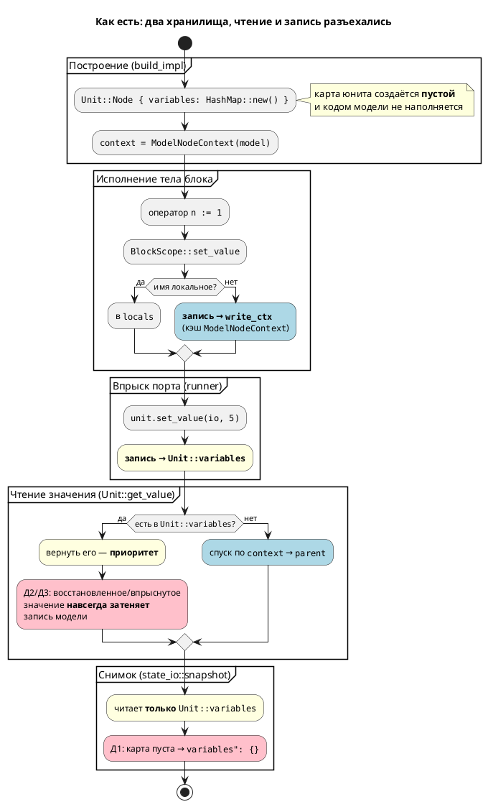
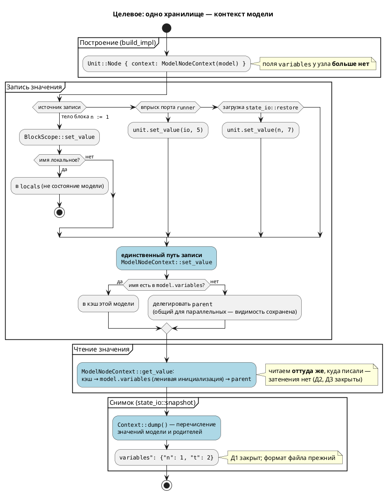

# Фича: Сохранение переменных модели в --save-state/--load-state

- **Номер:** 0032
- **Статус:** **ГОТОВО**
- **Зависит от:** **нет** — проставлено аналитиком на стадии 3.
  [сохранение и загрузка состояния модели](0014-state-io.md), на чьей территории живёт дефект, **закрыта**
  (`ГОТОВО`), а закрытая фича зависимостью быть не может. Обоснование и разбор
  остальных кандидатов — в [анализе](0032-state-io-variables.md#анализ),
  раздел «Зависимости фичи».
- **Приоритет:** **высокий (Tier 1)**. Обоснование: `--load-state` не просто
  теряет данные, а оставляет модель **замороженной** (все присваивания
  становятся невидимы) — инструмент бесшумно врёт, что хуже неработающего; та же
  корневая причина независимо от save/load портит **`inout`-порты** в любом
  сценарии симуляции. Класс дефекта — тот же, что у фичи.
- **Крейт:** `simulation`
- **Связанные issue (анализ):** новая фича (из блока «Кандидаты в фичи»
  `FEATURES.md`); дефект **предсуществующий**, выявлен при реализации `0025-04`.

## Стадии жизненного цикла

Все стадии — **разделы этой карточки**: «Архитектура (ADR)»,
«Анализ», «Разработка», «Тест-план», «Отчёт о тестировании», «Итог».
Отдельным артефактом остаются только исправления —
[`docs/fixes/`](../fixes/README.md) (при необходимости `0032-YY-*`).

## Краткое описание

`--save-state` сохраняет файл с пустым `"variables": {}`, хотя трасса того же
прогона показывает верные значения. Причина — **два хранилища значений**:
`state_io::snapshot` читает `Unit::Node { variables }` (собственную карту юнита),
тогда как присваивания моделей идут в `write_ctx` — кэш `ModelNodeContext`.
`Unit::get_value` читает **оба** (сначала юнит, затем контекст), поэтому трасса
выглядит правдоподобно, а файл состояния пуст.

Фича устраняет расхождение, сводя значения к **единому источнику истины**
(контекст модели), и закрывает **класс** дефекта, а не только его проявление в
`--save-state`: проверка кода и пробы показали, что то же расщепление даёт ещё
два дефекта — «замороженная модель» после `--load-state` и невидимая запись в
`inout`-порт. Решение — [ADR](0032-state-io-variables.md#архитектура-adr), Option C.

> Фича зарегистрирована из бэклога кандидатов `FEATURES.md`; далее проходит
> жизненный цикл по своду.

## Архитектура (ADR)

- **Status:** Accepted
- **Date:** 2026-07-15
- **Authors:** Архитектор + системный аналитик
- **Related issues:** [Фича](0032-state-io-variables.md);
  дефект на территории [фичи](0014-state-io.md) (`ГОТОВО`);
  связь с [ADR](0025-simulator-expression-eval.md#архитектура-adr) — то же явление
  («два механизма там, где семантика одна»), но на уровне **хранения** значений,
  а не их **вычисления**.

### Context

`--save-state` записывает файл, в котором `"variables": {}`, хотя трасса того же
прогона показывает верные значения. Дефект **предсуществующий**: он не внесён
фичей (исходный код писал туда же), но до неё был незаметен — присваивания
не исполнялись вовсе, и save/load честно «сохранял пустоту» из пустоты. Починив
вычисление (0025), мы сделали видимой ошибку **хранения**.

#### Два хранилища значений

В `simulation` значения переменной живут в **двух** независимых картах:

| Хранилище | Место | Кто пишет | Кто читает |
|---|---|---|---|
| `Unit::Node { variables: HashMap<String, Value> }` | `unit/mod.rs:94` | `runner::apply_step_inputs` (впрыск `in`/`inout`-портов, `runner.rs:257,267`); `state_io::restore` (`state_io.rs:93`) | `Unit::get_value` — **первым** (`unit/mod.rs:125`); `state_io::snapshot` — **только его** (`state_io.rs:57`) |
| `ModelNodeContext { cache: RefCell<HashMap<String, Value>> }` | `unit/builder.rs:32` | **весь код модели**: `BlockScope::set_value` → `write_ctx` (`unit/statement.rs:70`) | `Unit::get_value` — **вторым**, по цепочке `context` → `parent` (`unit/mod.rs:128`) |

Ключевой факт, снимающий все сомнения: `build_impl` создаёт узел **всегда** с
`variables: HashMap::new()` (`unit/builder.rs:258`). Для реальной модели карта
юнита пуста — код модели в неё **никогда не пишет**. Именно её и сериализует
`snapshot`. Отсюда `"variables": {}` — не «потеря» значений, а чтение карты,
которая никогда и не наполнялась.

Заявление кандидата про `Unit::get_value`, читающий оба хранилища,
**подтверждено** (`unit/mod.rs:119–139`): сначала `variables`, затем `context`.
Это и маскировало дефект — трасса (`Unit::variable` → `get_value`,
`unit/mod.rs:471`) выглядела правдоподобно.

#### Инвентарь дефектов (все воспроизведены пробами)

| № | Дефект | Место | Проявление |
|---|---|---|---|
| Д1 | `snapshot` читает карту юнита, которая для реальной модели всегда пуста | `state_io.rs:57` | `--save-state` → `"variables": {}` при `n=1, t=2` в трассе |
| Д2 | `restore` пишет в карту юнита, а та имеет **приоритет чтения** над контекстом | `state_io.rs:93` + `unit/mod.rs:125` | после `--load-state` модель **заморожена**: `n := n + 1` не меняет `n` **никогда** |
| Д3 | Впрыск `inout`-порта пишет в ту же приоритетную карту | `runner.rs:267` | `io := 99` в модели **невидимо**: и трасса, и `guard` видят впрыснутое значение |

**Д2 и Д3 обнаружены при архитектурной проработке**, в кандидате их не было.
Они принципиальны для выбора решения: Д2 означает, что «починить только
`snapshot`» — победа мнимая (значения восстановятся, но модель после загрузки
мертва), а Д3 доказывает, что расщепление вредит **независимо** от save/load.

#### Пробы (воспроизведение)

Каталог `$S` — временный; модель `probe.lam`: `var n, t: u8 := 0`, в `always`
`n := 1; t := 2;`.

```sh
cargo build --bin simulation
./target/debug/simulation $S/probe.lam -n 3 --save-state $S/state.json
cat $S/state.json
```

```
Шаг   1:  [Idle]  vars:n=1  t=2          ← трасса верна
{ "kind": "Node", "current_state": "Idle", "variables": {} }   ← Д1
```

Д2 — модель `probe_inc2.lam` (`always { n := n + 1; }`), файл состояния с `n=7`:

```
без --load-state:  Шаг 1: n=1 · Шаг 2: n=2 · Шаг 3: n=3 · Шаг 4: n=4   ← счётчик живёт
с  --load-state:   Шаг 1: n=7 · Шаг 2: n=7 · Шаг 3: n=7 · Шаг 4: n=7   ← заморожен
```

Д3 — модель с `inout io: u8`, впрыск `io=5`, в модели `io := 99`:

```
Шаг 1:  inout:io=5  vars:seen=5     ← запись io := 99 невидима
Шаг 2:  inout:io=5  vars:seen=5
```

Побочно проба **опровергает** часть кандидата: `restore` **работает** — файл
состояния, написанный вручную (`{"n": 7, "t": 9}`), загружается и виден в трассе.
Сломан только `snapshot`. Тезис кандидата «после `--load-state` → `n=0`» верен,
но по другой причине: `n=0` не потому, что загрузка не работает, а потому, что
**сохранять было нечего** (Д1).

#### Поток «как есть»



#### Корневая причина

Дефект — **не** «`snapshot` смотрит не туда». Смотреть не туда стало возможно,
потому что архитектура это позволяет и не сигнализирует:

1. **Два хранилища одной сущности.** У «значения переменной `n`» два законных
   адреса. Любой новый потребитель (снимок, отладчик, будущий `assert`) обязан
   угадать правильный — и ошибка угадывания **молчалива**.
2. **Асимметрия чтения и записи.** Читаем из двух мест с приоритетом, пишем — в
   одно. Это не симметричная пара, а воронка: записанное и прочитанное — разные
   вещи. Отсюда Д2 и Д3 буквально: пишем в кэш, читаем из юнита.
3. **Приоритет чтения задан «сверху» и навсегда.** `Unit::variables` выигрывает
   всегда. Для впрыска `in`-порта это верно (среда диктует значение), для
   восстановления и для `inout` — неверно. Одно правило обслуживает два
   несовместимых сценария.

Пока эти свойства сохраняются, точечная починка `snapshot` закроет Д1 и оставит
Д2/Д3 — а следующий потребитель значений заведёт Д4.

#### Почему это важно

Симуляция — способ проверить модель **до** синтеза в C.
`--save-state`/`--load-state` существуют, чтобы продолжить длинный прогон с
сохранённого места; сейчас продолженный прогон **гарантированно недостоверен** —
модель после загрузки не считает. Это ровно та ложная уверенность, против которой
принят ADR. При этом полный прогон тестов **зелёный** — см. раздел «Почему
тесты этого не поймали» в [тест-плане](0032-state-io-variables.md#тест-план).

### Decision Drivers

1. **Закрыть класс дефекта, а не одно его проявление.** Главный критерий: чтобы
   четвёртый потребитель значений не мог молча прочитать не то хранилище. Всё
   остальное вторично (тот же драйвер № 1, что в ADR).
2. **Достоверность продолженного прогона.** Модель, восстановленная из файла,
   обязана вести себя так же, как непрерывно работавшая. Иначе save/load — не
   функция, а ловушка.
3. **Сохранить видимость переменных между параллельными моделями.** Общий
   родительский контекст (`ModelNodeContext`, `builder.rs:295–305`) — то, на чём
   держатся сценарии `stacker_*`. Любое решение обязано его сохранить; это
   явно зафиксировано в [`0025-02b-1`](0025-simulator-expression-eval.md#разработка).
4. **Не менять язык и не ломать формат файла состояния**.

### Considered Options

#### Option A. `snapshot` читает через `Context`

`state_io::snapshot` перестаёт читать `Unit::variables` и запрашивает значения
через `Unit::get_value`/контекст модели. Хранилищ по-прежнему два.

**Pros:**
- Наименьшее изменение: правится один модуль.
- Закрывает Д1 — файл состояния наполняется.
- Формат файла не меняется.

**Cons:**
- **Не закрывает Д2** — и это дисквалифицирует опцию, а не просто ограничивает.
  `restore` продолжит писать в `Unit::variables`; круговой рейс станет
  «зелёным» по значениям (сохранили `n=7` → загрузили `n=7`), но загруженная
  модель останется **замороженной**. Тест кругового рейса это **не поймает**,
  если сверять только значения сразу после загрузки. Мы получили бы дефект,
  прикрытый тестом, — состояние хуже нынешнего.
- Не закрывает Д3 (`inout`) вовсе.
- Требует расширить контракт `Context`: у трейта есть только
  `get_value(name)`/`set_value(name, value)` (`context.rs:6,8`) и **нет
  перечисления имён**, а `Unit::Node.context` типизирован как
  `Rc<RefCell<dyn Context>>` (`unit/mod.rs:88`) — до `ModelNode` из снимка не
  дотянуться. То есть «малое» изменение всё равно трогает общий контракт.
- Оставляет два хранилища → корневая причина жива, драйвер № 1 не выполнен.

#### Option B. Запись идёт в `Unit::variables`

`BlockScope::set_value` пишет не в `write_ctx`, а в юнит; `snapshot` тогда
читает верную карту без изменений.

**Pros:**
- `snapshot`/`restore` не трогаются вовсе.
- Симметрия «читаем и пишем в юнит» — на первый взгляд проще.

**Cons:**
- **Ломает видимость между параллельными моделями** — драйвер № 3. У каждого
  параллельного `Unit::Node` **своя** карта `variables`; общий родительский
  `ModelNodeContext` перестанет получать записи, и подмодели `stacker_*`
  перестанут видеть shared-переменные (`busy`, `tgt_*`, `lift_*`). Это не
  гипотеза: ровно эта ошибка была допущена и поймана до прогона в
  [`0025-02b-1`](0025-simulator-expression-eval.md#разработка) —
  «`Unit::set_value` пишет в `Unit::variables`, а не в кэш модели, и сценарии
  `stacker_*` (5 штук) сломались бы».
- `Unit::Parallel::set_value` **широковещателен** (`unit/mod.rs:147–151`): пишет
  имя во **все** дочерние юниты. Как механизм shared-переменных это заведомо
  неверно — локальная переменная одной подмодели затрёт одноимённую у соседней.
- Разрывает связь значения с типом: усечение по типу (S1/S6/S9 фичи)
  опирается на `ModelNode::variables`, доступный из `ModelNodeContext`, но не из
  `Unit`.
- Два хранилища остаются → драйвер № 1 не выполнен.

#### Option C. Одно хранилище: контекст модели — единственный источник истины

`Unit::Node.variables` **упраздняется**. Все значения живут в
`ModelNodeContext` (кэш поверх `ModelNode::variables`). Соответственно:

- `Unit::get_value`/`set_value` делегируют в `context` — без приоритетной карты.
- Впрыск портов (`runner::apply_step_inputs`) идёт тем же путём, что запись
  модели, → Д3 закрыт: последняя запись выигрывает, как и должно быть.
- `restore` пишет через `Context::set_value` — тем же путём, что присваивание,
  → Д2 закрыт: загруженная модель считает.
- `snapshot` читает через контекст → Д1 закрыт.
- Контракт `Context` расширяется перечислением значений (нужно и для A).

**Pros:**
- **Закрывает класс** (драйвер № 1): у значения остаётся один адрес, угадывать
  нечего. Четвёртый потребитель не может ошибиться.
- Закрывает Д1, Д2 **и** Д3 одной правкой.
- **Сохраняет** общий родительский контекст и видимость `stacker_*` (драйвер
  № 3) — механизм shared-переменных не трогается, а становится единственным.
- Устраняет широковещательный `Unit::Parallel::set_value` как побочный эффект.
- Формат файла состояния не меняется (драйвер № 4).

**Cons:**
- Крупнее A: затрагивает `unit/mod.rs`, `unit/builder.rs`, `runner.rs`,
  `state_io.rs`, `context.rs`.
- Требует переписать юнит-тесты, конструирующие `Unit::Node { variables }`
  вручную (`state_io.rs:153–200`) — но именно эта ручная конструкция и скрыла
  дефект (см. тест-план), так что переписать их **нужно** независимо.
- Меняет приоритет впрыска `in`-порта: сейчас впрыснутое значение «липкое» и
  выигрывает всегда, после — модель технически может его перезаписать. Риск
  теоретический: запись в `in`-порт запрещена семантикой; фиксируется как
  проверяемый пункт анализа.
- Снимок параллельных моделей продублирует shared-переменные родителя в снимок
  каждого ребёнка (восстановление идемпотентно — значения одинаковы). Плата за
  неизменность формата; разбор — в анализе.

### Decision

Принимается **Option C**.

Опция A отклонена не за «недостаточность», а потому, что она **опасна**: закрыв
Д1, она оставляет Д2 и при этом делает круговой рейс внешне исправным — дефект
получил бы зелёный тест в качестве прикрытия. Опция B отклонена как заведомо
ломающая драйвер № 3: этот путь уже проходили в `0025-02b-1` и развернули.

Опция C — единственная, где выполняется драйвер № 1. Наличие двух хранилищ
значений является **архитектурным дефектом само по себе**, а не деталью
реализации: Д1, Д2 и Д3 — три разных симптома одной причины, проявившиеся в трёх
несвязанных подсистемах (снимок, загрузка, порты). Чинить симптомы поочерёдно —
значит согласиться на Д4.

Решение прямо продолжает линию [ADR](0025-simulator-expression-eval.md#архитектура-adr):
там «семантика вычисления живёт только в `eval/`», здесь — «значение переменной
живёт только в контексте модели».

#### Целевой поток



### Consequences

#### Положительные

- У значения переменной **один** адрес: `snapshot`, `restore`, впрыск портов и
  код модели ходят одним путём. Класс дефекта закрыт.
- Д1, Д2, Д3 закрываются одной правкой; `--load-state` даёт живую модель.
- `inout`-порты начинают работать (Д3) — побочная, но реальная починка
  симуляции, не связанная с save/load.
- Видимость shared-переменных между параллельными моделями сохранена и
  становится **единственным** механизмом (исчезает конкурирующая
  широковещательная запись `Unit::Parallel::set_value`).
- Формат файла состояния не меняется; ранее сохранённые файлы читаются.

#### Отрицательные / Action items

- **Контракт `Context` расширяется** методом перечисления значений (`dump`) —
  трейт внутренний (`pub(crate)`, `context.rs:4`), публичный API крейта не
  затрагивается. Уточнить сигнатуру в анализе.
- **Юнит-тесты `state_io.rs`, конструирующие `Unit::Node` вручную, подлежат
  переписи** на построение через `build_unit` из `.lam`-фикстуры. Это не
  накладной расход, а устранение причины, по которой дефект прожил при зелёных
  тестах.
- **Снимок дублирует shared-переменные родителя** в снимок каждого параллельного
  ребёнка. Восстановление идемпотентно; альтернатива (отдельная секция `shared`
  в файле) сломала бы формат — отложена. Зафиксировать в анализе как осознанный
  размен.
- **Приоритет впрыска `in`-порта меняется** (перестаёт быть «липким»).
  Проверить, что ни один сценарий `stacker_*` на этом не держится.
- **Константы (`VariableNode::Const`) в снимок не включаются** — решение
  принимается в анализе; их значение задано исходником, восстанавливать его из
  файла опасно (исходник мог измениться).
- **Д3 (`inout`) закрывается попутно** и требует собственной проверки в
  тест-плане — иначе починка не наблюдаема.

#### Acceptance criteria

1. **Единственность хранилища:** поля `Unit::Node { variables }` не существует;
   `grep -n "variables" simulation/src/unit/mod.rs` не показывает карту значений
   у узла. Ни один путь записи не минует `ModelNodeContext`.
2. **Д1 закрыт:** для модели с `n := 1; t := 2;` файл `--save-state` содержит
   `"variables": {"n": 1, "t": 2}` (не `{}`).
3. **Д2 закрыт (круговой рейс):** `--save-state` → `--load-state` → значения
   совпали **и модель продолжает считать** — `n := n + 1` после загрузки даёт
   `n+1`, а не замороженное `n`.
4. **Д3 закрыт:** после впрыска `inout io = 5` запись модели `io := 99` видна в
   трассе и в `guard`.
5. **Видимость не сломана:** `./scripts/run_simulations.sh` → 5 сценариев
   `stacker_*` проходят.
6. **Обратная совместимость формата:** файл состояния, сохранённый **до** фичи
   (со `"variables": {}`), читается новой версией без ошибки.
7. **Регрессия:** `cargo test --all-features -- --test-threads=1` — 0 провалов;
   `cargo clippy --all-targets --all-features` — 0 предупреждений.

## Анализ

### Цель и контекст

Довести решение [ADR](0032-state-io-variables.md#архитектура-adr) (Option C: единое
хранилище значений — контекст модели) до исполнимого плана: зафиксировать
зависимости, проверяемые требования, изменяемые контракты, разбор
обратной совместимости формата файла состояния и декомпозицию задач
`0032-YY`.

Анализ **не переоткрывает** решение ADR, но в трёх местах его **уточняет** — все
уточнения основаны на проверке кода и пробах, а не на предпочтении:

1. **Сигнатура перечисления значений** (раздел «Контракты»): ADR оставил `dump`
   с пометкой «уточнить в анализе» — здесь фиксируется точный контракт и
   обоснование, почему перечисление обязано жить в трейте, а не в `state_io`.
2. **Константы исключаются из снимка** (раздел «Что именно сохраняется») — ADR
   вынес это в action items.
3. **Формат файла состояния не меняется вовсе** (раздел «Особенности по обратной
   функциональности») — проверено по коду сериализации; менять `UnitSnapshot`
   не требуется.

#### Решение о декомпозиции аналитики

Аналитика **не декомпозируется** на `0032-YY-*.md`; настоящий документ —
единственный. Обоснование: свод предписывает декомпозицию «при большом
объёме», а объём здесь мал и связен — одна правка контракта, три подсистемы.
Декомпозиция уместна в задачах разработки `0032-01…03` (раздел «Декомпозиция»).

### Зависимости фичи

- **Зависит от:** **нет**. Статус `ЗАБЛОКИРОВАНА` **не** ставится.

Проверено по контракту и инфраструктуре (не по названиям):

| Фича-кандидат | Проверка | Вывод |
|---|---|---|
| [сохранение и загрузка состояния модели](0014-state-io.md) «Сохранение и загрузка состояния» (`ГОТОВО`) | Дефект живёт на территории 0014 (`state_io.rs`, флаги `--save-state`/`--load-state`). Но фича **закрыта**, а закрытая фича зависимостью быть не может (свод; тот же разбор, что для 0012 в [анализе 0025](0025-simulator-expression-eval.md#анализ)). 0032 чинит её дефект. | **не зависимость** (закрыта) |
| [починка вычислителя выражений симулятора](0025-simulator-expression-eval.md) «Починка вычислителя» (`ГОТОВО`) | 0032 опирается на `ModelNodeContext` как на единственный путь записи — механизм, зафиксированный [`0025-02b-1`](0025-simulator-expression-eval.md#разработка). Фича закрыта. | **не зависимость** (закрыта) |
| [крейт simulation — симуляция моделей](0012-simulation-core.md) «Крейт simulation» (`ГОТОВО`) | Закрыта. | **не зависимость** (закрыта) |
| [согласование видимости публичного API крейта simulation](0036-sim-visibility.md) «Согласование видимости публичного API `simulation`» (`СОЗДАНА`) | Пересечение проверялось **по коду**, а не по созвучию названий. 0032 меняет трейт `Context` — он `pub(crate)` (`context.rs:4`), в публичный API не входит. Публичная поверхность (`Unit::variable`, `Unit::tick`, `state_io::*`) сигнатур не меняет. | **не зависимость**; работы не пересекаются |
| [структурные типы в симуляторе](0034-sim-struct-types.md) «Структурные типы в симуляторе» (`СОЗДАНА`) | `Value` не имеет структурного варианта, поэтому структурные переменные не сохранятся и после 0032. Но это ограничение **`Value`**, а не хранилища: 0032 сохраняет ровно то, что симулятор умеет вычислять. Ждать 0034 незачем — сохранение `Number`/`Real`/`Boolean`/`Array` самоценно. | **не зависимость**; ограничение фиксируется в R6 |
| [согласование тактов симулятора и порождённого C (INIT-такты)](0033-init-tick-alignment.md) «Согласование тактов с C» (`СОЗДАНА`) | Касается смещения трасс симулятора и порождённого C. Снимок состояния берётся из симулятора и с C не сверяется. | **не зависимость** |

- **Влияние на порядок разработки:** 0032 **следует поднять** в
  последовательности относительно прочих кандидатов-дефектов симулятора
  (0033, 0034) — обоснование по критерию 4 (необходимость):
  проработка выявила **Д2** и **Д3**, которых в кандидате не было. Д2 означает,
  что `--load-state` сейчас не «неполон», а **вреден** (даёт замороженную
  модель — недостоверный прогон без единого признака ошибки); Д3 означает, что
  корневая причина портит `inout`-порты **в каждом** сценарии симуляции,
  независимо от save/load. Это тот же аргумент, по которому 0025 шла первой:
  инструмент проверки моделей бесшумно врёт.
  Завершение 0032 **не разблокирует** формально ни одну фичу (жёстких
  зависимостей от неё нет), но снимает риск с [юнит-конструкции языка для симуляции (assert/invariant)](0044-sim-assert-invariant.md) «юнит-конструкции языка для
  симуляции (`assert`/`invariant`)»: `assert` — это ещё один потребитель
  значений, и построенный **до** унификации он с равной вероятностью прочитает
  не то хранилище (буквально Д4 из ADR). Рекомендуемый порядок: **0032 → 0044**.

### Что именно сохраняется (уточнение ADR)

| Категория (`VariableNode`) | В снимок? | Обоснование |
|---|---|---|
| `Simple` (`var`) | **да** | собственно состояние модели |
| `Port` (`in`/`out`/`inout`) | **да** | значение порта — часть наблюдаемого состояния; `out`/`inout` вычисляются моделью |
| `Const` (`const`) | **нет** | значение задано исходником и не меняется. Сохранять бессмысленно, **восстанавливать опасно**: если между сохранением и загрузкой `.lam` отредактировали, файл навяжет старое значение константы и модель тихо разойдётся с исходником |
| `Unresolved` | **нет** | не имеет значения по построению |

Локальные `var` тел блоков и функций в снимок **не попадают** и не могут: они
живут в `BlockScope::locals`/`FunctionScope::locals` (`unit/statement.rs:52,77`)
и уничтожаются по выходу из блока. Это верно — они не являются состоянием модели
между тактами.

### Контракты и изменения API

#### 1. Перечисление значений — контракт `Context` расширить **необходимо**

`Context` (`context.rs:4`) объявляет только `get_value(&self, name) -> Option<Value>`
и `set_value(&mut self, name, value)`. Снимку нужны **имена**, а `Unit::Node`
хранит контекст как `Rc<RefCell<dyn Context>>` (`unit/mod.rs:88`) — до
`ModelNode` (и до списка имён) из `state_io` не дотянуться, downcast с `dyn` без
`Any` невозможен.

Обходной путь «типизировать поле конкретным `ModelNodeContext`» отвергается: тот
же `Rc<RefCell<dyn Context>>` передаётся как `write_ctx` в `compile_block_body`
(`unit/statement.rs:146`) и как `shared_parent` в `build_extend`
(`unit/builder.rs:283`) — конкретизация типа расползётся по всему построителю
ради одного потребителя.

Добавляется метод:

```rust
/// Перечисляет значения, составляющие состояние модели (для снимка).
///
/// Включает значения родительских контекстов: для параллельных подмоделей
/// родитель общий, и его переменные — часть их состояния.
/// Константы и локальные переменные не включаются (см. анализ 0032).
fn dump(&self) -> HashMap<String, Value>;
```

Трейт `pub(crate)` → публичный API крейта не меняется, `0036` не задевается.

#### 2. `ModelNodeContext::dump` — материализация ленивого кэша

`ModelNodeContext::get_value` инициализирует кэш **лениво** (`builder.rs:66–86`):
переменная, которую модель ни разу не читала, в кэше отсутствует, а её значение
выводится из инициализатора `ModelNode::variables`. Поэтому `dump` **не может**
просто отдать `cache` — он обязан пройти по именам `model.variables` и получить
значение через собственный `get_value` (что попутно и заполнит кэш).

Порядок слияния: значения **родителя** накладываются первыми, затем
перекрываются значениями текущей модели — та же приоритетность, что у
`get_value` (локальное имя выигрывает у родительского).

#### 3. `Unit::get_value`/`set_value` — делегирование в контекст

Карта `Unit::Node { variables }` удаляется. `get_value` → `context.get_value`;
`set_value` → `context.set_value`. Широковещательная запись
`Unit::Parallel::set_value` во **все** дочерние юниты (`unit/mod.rs:147–151`)
исчезает вместе с картой: запись адресуется в контекст узла и уходит по цепочке
`parent` — то есть в **общий** родительский контекст, что и является корректным
механизмом shared-переменных.

#### 4. `state_io` — снимок и восстановление одним путём

- `snapshot`: `variables: unit_context.dump()` вместо чтения `Unit::variables`.
- `restore`: `unit.set_value(k, val)` вместо `variables.insert(k, val)`.

Структуры `UnitSnapshot` и их `serde`-представление **не меняются**.

### Требования и проверяемые условия

- **R1. Единственность хранилища.** Значение переменной модели хранится ровно в
  одном месте — в кэше `ModelNodeContext` соответствующей модели. Поля
  `Unit::Node { variables }` не существует. Ни один путь записи (код модели,
  впрыск порта, восстановление) не минует `ModelNodeContext::set_value`.
- **R2. Снимок полон (Д1).** `--save-state` записывает значения всех `var` и
  портов модели и её родителей; `"variables": {}` для модели с переменными
  невозможен.
- **R3. Круговой рейс достоверен (Д2).** После `--save-state` → `--load-state`
  значения совпадают **и модель продолжает вычисляться**: присваивание после
  загрузки наблюдаемо меняет значение. Замороженной модели не существует.
- **R4. Впрыск не затеняет запись (Д3).** Значение `inout`-порта, впрыснутое
  `runner`, перекрывается последующей записью модели; `guard` видит записанное
  моделью значение.
- **R5. Видимость между параллельными моделями сохранена.** Общий родительский
  контекст остаётся единственным механизмом shared-переменных; сценарии
  `stacker_*` (5 шт.) проходят без изменений.
- **R6. Границы (зафиксированное ограничение, не требование).** Сохраняются
  только значения, представимые в `Value` (`Number`/`Real`/`Boolean`/`Array`).
  Структурные типы не сохраняются — ограничение `Value`, снимается фичей
  [структурные типы в симуляторе](0034-sim-struct-types.md), а не этой. Константы в снимок не
  входят осознанно (раздел «Что именно сохраняется»).
- **R7. Формат файла не меняется.** Схема `UnitSnapshot` прежняя; файлы,
  сохранённые до фичи, читаются без ошибки.

### Критерии приёмки и способ проверки

| # | Критерий | Способ проверки |
|---|---|---|
| A1 | Поля `Unit::Node { variables }` не существует; путей записи мимо контекста нет | `grep -n "variables" simulation/src/unit/mod.rs` — карты значений у узла нет; ревью `runner.rs`/`state_io.rs` на прямой доступ (R1) |
| A2 | Модель с `n := 1; t := 2;` → файл содержит `"variables": {"n":1,"t":2}` | интеграционный тест `state_io_tests.rs::save_captures_variables` на `.lam`-фикстуре (T1, R2) |
| A3 | Круговой рейс: сохранили → загрузили → значения совпали | интеграционный тест `roundtrip_values_match` через `build_unit` (T2, R3) |
| A4 | Круговой рейс: после загрузки модель **считает** (`n := n+1` даёт `n+1`) | интеграционный тест `roundtrip_model_not_frozen` — тикаем **после** загрузки и сверяем значение (T3, R3) |
| A5 | `inout`: впрыск `io=5`, затем `io := 99` → наблюдается `99` | тест на `runner`/прогон CLI со сверкой трассы (T4, R4) |
| A6 | Сценарии `stacker_*` проходят | `./scripts/run_simulations.sh` → 5 прошло, 0 упало (T5, R5) |
| A7 | Старый файл (`"variables": {}`) читается без ошибки | тест `loads_pre_0032_file` на зафиксированном в репозитории файле-фикстуре (T6, R7) |
| A8 | Константы в снимок не попали | тест на фикстуре с `const` — ключа нет в `variables` (T7, R6) |
| A9 | Регрессия чистая | `cargo test --all-features -- --test-threads=1` → 0 провалов; `cargo clippy --all-targets --all-features` → 0 (T8) |

### Особенности по обратной функциональности

свод требует рассмотреть фичу с позиции обратной совместимости. Разбор по
затрагиваемым контрактам:

#### 1. Формат файла состояния — **не меняется**

Ключевой разбор. Схема `UnitSnapshot` (`state_io.rs:19–32`) остаётся
байт-в-байт прежней: `kind`, `current_state`, `variables`, `children`, `index`.
Меняется **не формат, а наполнение**: поле `variables` перестаёт быть пустым.
Добавлять поля не требуется — решение о дублировании shared-переменных в снимок
каждого параллельного ребёнка (см. ниже) принято именно ради этого.

**Что с уже сохранёнными файлами:**

| Сценарий | Поведение | Вывод |
|---|---|---|
| Старый файл → новая версия | `"variables": {}` разбирается штатно; цикл восстановления не делает ни одной итерации; восстанавливается `current_state` — ровно то, что старый файл и содержал | **совместимо**; регрессии нет |
| Старый файл → новая версия, **поведение** | Раньше пустой `variables` давал «состояние загружено, переменные по умолчанию»; теперь — **то же самое**. Более того, исчезает Д2: старый файл больше не замораживает модель, т.к. `restore` пишет в общее хранилище | **строго лучше**, чем было |
| Новый файл → старая версия | Старый `restore` положит значения в `Unit::variables` → модель замёрзнет (Д2) | **прямая совместимость не обеспечивается** и не требуется: файл состояния — рабочий артефакт одной версии инструмента, а не формат обмена. Фиксируется как непоставленная цель |

Потери данных нет ни в одном сценарии: старые файлы **не содержали** переменных
(в этом и состоял Д1), поэтому «терять» при переходе нечего.

#### 2. Язык `.lam` — **не меняется**

Синтаксис и семантика не затронуты; версия языка **не** повышается.
(тесты синтаксиса/семантики, примеры и контрпримеры) к фиче
**не применяется**: конструкций языка не добавляется. Фикстуры `.lam` для тестов
— инструмент проверки, а не новая языковая функциональность, в документацию по
языку они не идут.

#### 3. Версия крейта `simulation`: `0.1.0` → `0.2.0` (minor)

Обоснование: до 1.0 ломающие изменения допустимы в minor.
Публичный API сигнатур не меняет, но **поведение** меняется существенно:
`--save-state` начинает записывать данные, `--load-state` — давать живую модель,
`inout`-порты — работать. Это не слом совместимости, а исправление дефектов;
однако наблюдаемое поведение инструмента меняется, и патч-версии этого мало.

#### 4. Изменение приоритета впрыска `in`-порта — осознанный размен

Сейчас впрыснутое значение `in`-порта «липкое»: лежит в приоритетной карте и
выигрывает у любой записи модели. После — впрыск и запись идут в одно хранилище,
и модель технически способна перезаписать `in`-порт. Риск теоретический: запись
в `in`-порт запрещена семантикой языка, а сценарии `stacker_*` впрыскивают порты
на каждом шаге (`in_ports` присутствует в каждом элементе JSON), то есть значение
переустанавливается перед каждым тактом независимо от кэша. Проверяется A6.

#### 5. Дублирование shared-переменных в снимке — осознанный размен

Параллельные подмодели делят один `ModelNodeContext`-родитель
(`builder.rs:295–305`), а `UnitSnapshot::Parallel` не имеет места для «общей»
секции. Поэтому `dump` каждого ребёнка включит переменные общего родителя, и они
попадут в файл столько раз, сколько детей. **Корректность не страдает**:
значения тождественны (источник один), а восстановление идемпотентно — каждый
ребёнок запишет в общий родительский контекст одно и то же значение.
Плата — размер файла. Альтернатива (отдельная секция `shared` в `UnitSnapshot`)
**сломала бы формат** ради экономии байт и отвергнута; при появлении реальной
проблемы размера заводится отдельная фича.

### Риски и зависимости

| Риск | Оценка | Снижение |
|---|---|---|
| Удаление `Unit::variables` ломает видимость `stacker_*` — то, чем Option B и дисквалифицирована | **низкий**: механизм shared-переменных (общий родитель) не трогается, а становится единственным; удаляется конкурирующий путь, а не рабочий | A6 — `run_simulations.sh` на каждой задаче; `0032-01` завершается прогоном сценариев |
| Юнит-тесты `state_io.rs` конструируют `Unit::Node { variables }` вручную и **перестанут компилироваться** | **высокий (ожидаемый)** | Это не побочный ущерб, а цель: именно ручная конструкция скрыла дефект (тест-план, «Почему тесты этого не поймали»). Тесты переписываются на `build_unit` из `.lam`-фикстур — задача `0032-03` |
| `dump` материализует ленивый кэш и тем меняет момент вычисления инициализаторов | **низкий** | `eval_expr` инициализаторов чист (константные выражения, `builder.rs:109–130`), побочных эффектов нет; `dump` зовётся только из `snapshot` |
| Рекурсия `dump` по цепочке `parent` зациклится | **низкий** | `ModelNodeContext.parent` строится из `ModelNode.upper` — `Weak`-ссылка вверх по дереву моделей, цикл невозможен по построению; для параллельных родитель общий, но на детей не ссылается |
| Д3 (`inout`) чинится «попутно» и останется непроверенным | **средний** | Вынесен в самостоятельный критерий A5 и проверку T4 — иначе починка ненаблюдаема |
| Область фичи шире, чем звучит её название (`state-io-variables`), — правится ядро хранения | **принят осознанно** | Обосновано в ADR (драйвер № 1). Название сохранено: оно указывает на **повод**; предмет — единое хранилище. Зафиксировано в заголовке ADR («Единый источник истины для значений переменных симулятора») |

Внешних зависимостей (фичи-блокеры) нет — см. «Зависимости фичи».

### Декомпозиция (задачи разработки)

| Задача | Файл | Содержание |
|---|---|---|
| `0032-01` | [`0032-state-io-variables.md#разработка`](0032-state-io-variables.md#разработка) | Единое хранилище: удаление `Unit::Node { variables }`, делегирование `get_value`/`set_value` в контекст, перевод впрыска портов. Закрывает R1, R4, R5 (A1, A5, A6) |
| `0032-02` | [`0032-state-io-variables.md#разработка`](0032-state-io-variables.md#разработка) | Контракт `Context::dump`, `ModelNodeContext::dump`, перевод `snapshot`/`restore` на единый путь. Закрывает R2, R3, R6, R7 (A2, A3, A4, A7, A8) |
| `0032-03` | [`0032-state-io-variables.md#разработка`](0032-state-io-variables.md#разработка) | Интеграционные тесты кругового рейса на `.lam`-фикстурах (`simulation/tests/state_io_tests.rs`), переписывание ручных юнит-тестов `state_io.rs`. Закрывает A2–A4, A7–A9 |

Порядок строгий: `01` → `02` → `03`. Задача `02` опирается на единственность
хранилища из `01` (иначе `dump` пришлось бы согласовывать с двумя картами);
задача `03` проверяет обе.

## Разработка

### Задача

> **Планируется (разработка не начата).** Разделы «Что сделано» и «Проверки»
> описывают **план**, а не факт. Раздел «Что было» — реальное состояние кода на
> 2026-07-15 (проверено чтением и пробами).

#### Что было

В `simulation` значение переменной модели живёт в **двух** независимых картах.

**Хранилище 1 — карта юнита.** `Unit::Node { variables: HashMap<String, Value> }`
(`unit/mod.rs:94`).

**Хранилище 2 — кэш контекста модели.** `ModelNodeContext { cache:
RefCell<HashMap<String, Value>> }` (`unit/builder.rs:32`) — ленивый кэш поверх
`ModelNode::variables`, с цепочкой `parent` вверх по `ModelNode.upper`; для
параллельных подмоделей родитель **общий** (`builder.rs:295–305`).

Чтение и запись **разъехались**:

| Путь | Куда идёт | Строки |
|---|---|---|
| Запись из тела блока (`n := 1`) | `BlockScope::set_value` → `write_ctx` → **кэш контекста** | `unit/statement.rs:70`; `write_ctx` приходит из `builder.rs:243` |
| Впрыск порта из JSON | `unit.set_value` → **карта юнита** | `runner.rs:257,267` |
| Восстановление из файла | `variables.insert` → **карта юнита** | `state_io.rs:93` |
| Чтение значения | `Unit::get_value`: **карта юнита первой**, затем контекст | `unit/mod.rs:119–139` |
| Снимок в файл | `snapshot`: **только карта юнита** | `state_io.rs:57` |

Решающий факт: `build_impl` создаёт узел **всегда** с `variables: HashMap::new()`
(`builder.rs:258`). Для реальной модели карта юнита **пуста** — код модели в неё
никогда не пишет. Её и сериализует `snapshot`.

Заявление кандидата про `Unit::get_value`, читающий оба хранилища,
**подтверждено** (`unit/mod.rs:119–139`).

##### Дефекты, которые это порождает (все воспроизведены)

| № | Дефект | Проявление |
|---|---|---|
| Д1 | `snapshot` читает всегда пустую карту юнита | `--save-state` → `"variables": {}` при `n=1, t=2` в трассе |
| Д2 | `restore` пишет в карту юнита, а та **приоритетна при чтении** | после `--load-state` модель **заморожена**: `n := n + 1` не меняет `n` никогда |
| Д3 | Впрыск `inout`-порта пишет в ту же приоритетную карту | `io := 99` в модели **невидимо**: трасса и `guard` видят впрыснутое `5` |

Д2 и Д3 **найдены при проработке 0032**, в кандидате их не было. Пробы:

```
Д1:  ./target/debug/simulation $S/probe.lam -n 3 --save-state $S/state.json
     Шаг 1: [Idle] vars:n=1 t=2   →   { …, "variables": {} }

Д2:  ./target/debug/simulation $S/probe_inc2.lam -n 4 --load-state $S/manual.json
     без загрузки: n=1 · n=2 · n=3 · n=4      ← счётчик живёт
     с  загрузкой: n=7 · n=7 · n=7 · n=7      ← заморожен навсегда

Д3:  ./target/debug/simulation $S/probe_inout.lam -s $S/probe_inout.json
     Шаг 1: inout:io=5  vars:seen=5           ← запись io := 99 невидима
```

Проба **опровергает** часть кандидата: `restore` **работает** — файл, написанный
вручную (`{"n": 7, "t": 9}`), загружается и виден. Сломан только `snapshot`.
Тезис «после `--load-state` → `n=0`» верен, но причина другая: сохранять было
нечего (Д1), а не «загрузка не работает».

Дополнительно: `Unit::Parallel::set_value` (`unit/mod.rs:147–151`)
**широковещателен** — пишет имя во **все** дочерние юниты. Как механизм
shared-переменных это заведомо неверно (локальная переменная одной подмодели
затрёт одноимённую у соседней); работает же `stacker_*` благодаря другому,
корректному механизму — общему родительскому контексту.

#### Что сделано

> **Выполнено** (2026-07-16). Итог: поле `Unit::Node { variables }` удалено;
> `get_value`/`set_value`/`dump` узла делегируют в `context` (`ModelNodeContext`).
> Впрыск портов (`runner`) и запись модели идут одним путём. `Unit::Parallel`
> маршрутизирует запись в общий родительский контекст (широковещание в
> собственные карты детей упразднено вместе с полем). Пробы: Д3 (`inout`) —
> `seen=99` после `io:=99` (было 5); `run_simulations.sh` 5/5 (R5). Удалён
> неиспользуемый импорт `StatementNode` (долг 0046, попутно).

Реализация Option C [ADR](0032-state-io-variables.md#архитектура-adr): контекст
модели становится **единственным** источником истины. Задача закрывает
**R1, R4, R5**; снимок и загрузка переводятся следующей задачей
[сохранение переменных модели в --save-state/--load-state](0032-state-io-variables.md#разработка).

| Шаг | Правка | Файл |
|---|---|---|
| 1 | Удалить поле `variables` из `Unit::Node` | `unit/mod.rs:94` |
| 2 | `Unit::get_value` → делегирование в `context` (без приоритетной карты) | `unit/mod.rs:119` |
| 3 | `Unit::set_value` → делегирование в `context`; ветка `Parallel` перестаёт быть широковещательной — запись уходит в контекст и далее по `parent` в **общий** родительский контекст | `unit/mod.rs:141` |
| 4 | Убрать инициализацию `variables: HashMap::new()` из конструктора узла | `unit/builder.rs:258` |
| 5 | Впрыск портов оставить на `unit.set_value` — правки не требует, но его путь теперь ведёт в контекст | `runner.rs:257,267` (без изменений) |
| 6 | Юнит-тесты, конструирующие `Unit::Node { variables }` вручную, перестанут компилироваться — привести к `build_unit` | `unit/mod.rs` (тесты), `state_io.rs:153–200` |

Шаг 6 **не откладывается** на `0032-03`: без него не собирается крейт. В этой
задаче тесты приводятся к компилируемому виду; полноценный интеграционный слой
добавляет `0032-03`.

##### Что при этом не трогается (осознанно)

- **`ModelNodeContext` и цепочка `parent`** — механизм видимости
  shared-переменных между параллельными моделями. Он не меняется, а становится
  **единственным**. Драйвер № 3 ADR; ровно на этом Option B и дисквалифицирована.
- **`BlockScope`/`FunctionScope`** и разделение «локальные `var` — не состояние
  модели» (`unit/statement.rs:52,77`) — решение
  [`0025-02b-1`](0025-simulator-expression-eval.md#разработка) остаётся в силе.
- **Формат файла состояния** — задача его не касается.

##### Статус по функциональности

| Функциональность | Работа | Обоснование |
|---|---|---|
| `simulation` — хранение значений | **да** | предмет задачи |
| `simulation` — впрыск портов | **да** (косвенно) | путь записи меняет назначение; Д3 закрывается |
| `simulation` — `state_io` | **н/п** | переводится задачей `0032-02` |
| `grammar` | **н/п** | хранилища значений симулятора крейта не касаются |
| Язык `.lam` | **н/п** | конструкций не добавляется, версия языка не растёт |
| Публичный API `simulation` | **н/п** | `Context` — `pub(crate)`; сигнатуры `Unit::variable`/`tick` не меняются |

#### Проверки

> Планируется (разработка не начата).

Соответствие анализу: **R1** (A1), **R4** (A5), **R5** (A6).

| Проверка | Ожидаемый результат | Тест-план |
|---|---|---|
| `grep -n "variables" simulation/src/unit/mod.rs` | карты значений у `Unit::Node` нет | T8 / A1 |
| `./scripts/run_simulations.sh` | **5 прошло, 0 упало** — видимость shared-переменных сохранена. **Главная проверка задачи**: именно здесь проявился бы неверный выбор опции | T5 / A6 |
| Проба Д3 (`probe_inout.lam` + впрыск `io=5`) | `Шаг 1: inout:io=99 vars:seen=5` (было `io=5`) | T4 / A5 |
| `cargo test --all-features -- --test-threads=1` | 0 провалов | T9 / A9 |
| `cargo clippy --all-targets --all-features` | 0 предупреждений | T9 / A9 |
| `cargo build --all-features --all-targets` | сборка чистая | — |

Пробы Д1/Д2 на этой задаче **ещё не проходят** — они закрываются `0032-02`
(снимок и загрузка). Это ожидаемо и не является провалом: задача `01` устраняет
причину, `02` подключает к ней потребителей.

##### Порядок

Задача **первая** в фиче. `0032-02` опирается на единственность хранилища: пока
карт две, `dump` пришлось бы согласовывать с обеими.

### Задача

> **Планируется (разработка не начата).** Разделы «Что сделано» и «Проверки»
> описывают **план**, а не факт. Раздел «Что было» — реальное состояние кода на
> 2026-07-15 (проверено чтением и пробами).

#### Что было

`state_io` — потребитель значений, подключённый к **неверному** хранилищу
(разбор причины — [сохранение переменных модели в --save-state/--load-state](0032-state-io-variables.md#разработка), раздел «Что было»).

**Снимок** (`state_io.rs:50–70`) читает `Unit::Node { variables }` напрямую:

```rust
Unit::Node { state, variables, .. } => UnitSnapshot::Node {
    current_state: state.clone(),
    variables: variables.iter().map(|(k, v)| (k.clone(), value_to_json(v))).collect(),
},
```

Поскольку `build_impl` создаёт узел с `variables: HashMap::new()`
(`builder.rs:258`), а код модели пишет в кэш контекста, эта карта для реальной
модели **пуста** → `"variables": {}` (**Д1**).

**Восстановление** (`state_io.rs:93–97`) пишет туда же:

```rust
for (k, v) in vars {
    if let Some(val) = json_to_value(v) { variables.insert(k.clone(), val); }
}
```

Это **работает** (проба: файл с `{"n": 7, "t": 9}` загружается и виден в трассе),
но ценой **Д2**: `Unit::get_value` читает `variables` **первой**
(`unit/mod.rs:125`), поэтому восстановленное значение **навсегда затеняет**
последующие записи модели — модель после `--load-state` заморожена.

##### Почему `Context` придётся расширить

Трейт `Context` (`context.rs:4`) объявляет только `get_value(name)` и
`set_value(name, value)` — **перечисления имён нет**. `Unit::Node.context`
типизирован как `Rc<RefCell<dyn Context>>` (`unit/mod.rs:88`), поэтому из
`state_io` до `ModelNode` (и до списка имён) не дотянуться: downcast с `dyn` без
`Any` невозможен.

Обходной путь «типизировать поле конкретным `ModelNodeContext`» отвергнут в
анализе: тот же `Rc<RefCell<dyn Context>>` передаётся как `write_ctx`
(`unit/statement.rs:146`) и как `shared_parent` (`unit/builder.rs:283`) —
конкретизация расползётся по построителю ради одного потребителя.

Отдельная тонкость: `ModelNodeContext::get_value` инициализирует кэш **лениво**
(`builder.rs:66–86`). Переменная, которую модель ни разу не читала, в `cache`
отсутствует, а значение выводится из инициализатора `ModelNode::variables`.
Поэтому отдать `cache` напрямую **нельзя** — снимок потерял бы всё, что модель
не трогала.

#### Что сделано

> **Выполнено** (2026-07-16). Итог: в трейт `Context` добавлен `dump(&self) ->
> HashMap<String, Value>` (дефолт — пустая карта). `ModelNodeContext::dump`
> перечисляет имена `model.variables` (исключая `Const`), берёт значение через
> собственный `get_value` (материализует ленивый кэш), накладывая на значения
> родителя. `state_io::snapshot` читает `Unit::dump()` (Д1), `restore` пишет
> через `context.set_value` (Д2). Формат `UnitSnapshot` не изменён (R7). Пробы:
> Д1 — `variables: {n:1, t:2}` (был `{}`); Д2 — модель считает после загрузки;
> A7 — старый файл `{}` читается; A8 — `const` не в снимке.

Задача подключает `state_io` к единственному хранилищу, созданному
[сохранение переменных модели в --save-state/--load-state](0032-state-io-variables.md#разработка). Закрывает **R2, R3, R6, R7**.

##### 1. Контракт `Context` (`context.rs`)

```rust
/// Перечисляет значения, составляющие состояние модели (для снимка).
///
/// Включает значения родительских контекстов: для параллельных подмоделей
/// родитель общий, и его переменные — часть их состояния.
/// Константы и локальные переменные не включаются (см. анализ 0032).
fn dump(&self) -> HashMap<String, Value>;
```

Трейт `pub(crate)` → публичный API крейта не меняется (фича `0036` не задета).
Реализации требуются у всех типов, реализующих `Context`: `ModelNodeContext`,
`Unit`, `BlockScope`, `FunctionScope`, `MockContext` (тесты).

##### 2. `ModelNodeContext::dump` (`unit/builder.rs`)

Обход по именам `model.variables` с получением значения через **собственный**
`get_value` (что попутно материализует ленивый кэш):

| Шаг | Действие |
|---|---|
| 1 | `parent.dump()` — значения родителя ложатся **первыми** |
| 2 | для каждого имени из `model.variables`: пропустить `VariableNode::Const` и `Unresolved`; иначе `get_value(name)` → перекрыть значение родителя |

Порядок слияния повторяет приоритетность `get_value` (локальное имя выигрывает у
родительского) — иначе снимок разошёлся бы с тем, что видит модель.

Исключение констант — решение анализа («Что именно сохраняется»): значение
задано исходником, восстанавливать его из файла опасно (исходник мог измениться
между сохранением и загрузкой).

##### 3. `dump` у прочих реализаций `Context`

| Тип | Реализация | Обоснование |
|---|---|---|
| `Unit` | делегирование в `context`; `Parallel`/`Sequential` — не вызывается напрямую (обход дерева делает `snapshot`) | после `0032-01` у узла своей карты нет |
| `BlockScope` / `FunctionScope` | **не включают** `locals` — только делегирование наружу | локальные `var` не являются состоянием модели между тактами (`unit/statement.rs:52,77`; решение [`0025-02b-1`](0025-simulator-expression-eval.md#разработка)) |

##### 4. `state_io` (`state_io.rs`)

| Правка | Было | Стало |
|---|---|---|
| `snapshot`, ветка `Node` | чтение `Unit::variables` (`:57`) | `context.dump()` → `value_to_json` |
| `restore`, ветка `Node` | `variables.insert(k, val)` (`:93`) | `unit.set_value(k, val)` — **тот же путь, что присваивание** |

Структуры `UnitSnapshot` и их `serde`-представление **не меняются** — формат
файла прежний (R7).

Флаг `entered_initial = true` при восстановлении (`state_io.rs:91`)
**сохраняется**: модель уже находится в загруженном состоянии, повторный `enter`
затёр бы загруженные значения (решение Д5 фичи). После 0032 это тем более
существенно — `enter` теперь реально исполняется и реально бы их затёр.

##### Статус по функциональности

| Функциональность | Работа | Обоснование |
|---|---|---|
| `simulation` — `state_io` | **да** | предмет задачи |
| `simulation` — контракт `Context` | **да** | добавляется `dump` |
| Формат файла состояния | **н/п** | схема `UnitSnapshot` не меняется; см. анализ, «Обратная функциональность», п. 1 |
| `simulation` — хранение значений | **н/п** | сделано в `0032-01` |
| `grammar` | **н/п** | не затрагивается |
| Язык `.lam` | **н/п** | конструкций не добавляется |

#### Проверки

> Планируется (разработка не начата).

Соответствие анализу: **R2** (A2), **R3** (A3, A4), **R6** (A8), **R7** (A7).

| Проверка | Ожидаемый результат | Тест-план |
|---|---|---|
| Проба Д1: `--save-state` на `probe.lam` | файл содержит `"variables": {"n": 1, "t": 2}` (было `{}`) | T1 / A2 |
| Проба Д2: `--load-state` на `probe_inc2.lam` (файл с `n=7`), 4 такта | `n=8 · 9 · 10 · 11` — счётчик **живёт** (было `7 · 7 · 7 · 7`) | T3, T3a / A4 |
| Круговой рейс: save → load → значения | значения совпали | T2 / A3 |
| Старый файл (`"variables": {}`) → загрузка | `Ok`; `current_state` восстановлен; модель считает | T6 / A7 |
| Фикстура с `const MAX` | ключа `MAX` в `variables` нет; `n` есть | T7 / A8 |
| Снимок параллельной модели | shared-переменные родителя присутствуют у каждого ребёнка; значения тождественны | T5a, T5b / A2 |
| `./scripts/run_simulations.sh` | 5 прошло, 0 упало | T5 / A6 |
| `cargo test --all-features -- --test-threads=1` | 0 провалов | T9 / A9 |
| `cargo clippy --all-targets --all-features` | 0 предупреждений | T9 / A9 |

Пробы Д1 и Д2 — **приёмочные для задачи**: до неё обе падают (это зафиксировано
в «Что было»), после — обязаны проходить. Проверка Д2 обязательно включает такт
**после** загрузки: без него тест прошёл бы и на дефектной реализации (ровно та
ловушка, из-за которой ADR отклонил Option A).

##### Порядок

Задача **вторая**. Требует единственности хранилища из
[сохранение переменных модели в --save-state/--load-state](0032-state-io-variables.md#разработка): пока карт две, `dump` пришлось бы
согласовывать с обеими, а `restore` через `set_value` продолжал бы писать в
приоритетную карту (Д2 остался бы жив).

### Задача

> **Планируется (разработка не начата).** Разделы «Что сделано» и «Проверки»
> описывают **план**, а не факт. Раздел «Что было» — реальное состояние кода на
> 2026-07-15 (проверено чтением).

#### Что было

Дефект Д1 прожил при **зелёном** прогоне (~1560 тестов) — и не по недосмотру, а
потому, что тестовый слой был устроен так, что поймать его **не мог**.

`state_io.rs` имеет восемь юнит-тестов (`state_io.rs:147–284`), включая
`test_roundtrip_through_file` (`:256`) — тест **кругового рейса**: сохраняет
`count=7`, загружает, проверяет возврат значения. Он проходит. Причина слепоты —
в фабрике тестовых данных (`state_io.rs:168`):

```rust
fn make_node_with_var(state: &str, var: &str, val: Value) -> Unit {
    let mut vars = HashMap::new();
    vars.insert(var.to_string(), val);
    Unit::Node { variables: vars, context: None, /* … */ }
}
```

Юнит конструируется **вручную**, значение кладётся **прямо в `Unit::variables`** —
в то самое хранилище, которое `snapshot` и читает. Тест доказывает, что
`snapshot` читает `Unit::variables`, а `restore` в неё пишет. Это правда — и это
не имеет отношения к делу: **реальная модель туда не пишет** (`build_impl`
создаёт узел с `variables: HashMap::new()`, `builder.rs:258`, а код модели пишет
в кэш контекста). Тест проверял согласованность модуля с самим собой, а не его
связь с системой. Показательно и `context: None` — контекста, где на самом деле
живут значения, в тесте просто нет.

Чего не хватало: **ни один тест не брал `.lam`, не прогонял его и не сверял
сохранённый файл**. В `simulation/tests/` нет тестов `state_io` вовсе — только
`eval_tests.rs` и `conformance_c_tests.rs`.

Урок уже оплачен фичей: восемь дефектов прожили при 1484 зелёных тестах,
потому что «`simulation` покрывался только inline-юнитами, и ни один тест не брал
`.lam`, не прогонял его и не сверял вычисленные значения»
(`simulation/tests/eval_tests.rs`, шапка модуля). Ответом стал слой
`eval_tests.rs` — тесты на **значения**. 0032 обнаруживает, что у `state_io`
такой слой **не завели**: сверялись вычисленные значения, но не сохранённые.

#### Что сделано

> **Выполнено** (2026-07-16). Итог: заведён `simulation/tests/state_io_tests.rs`
> — юниты строятся из `.lam` через `build_unit` (тот же путь, что в CLI), а не
> ручной конструкцией `Unit::Node { variables }`, скрывавшей дефект. Тесты:
> `save_captures_variables` (A2/Д1), `roundtrip_values_match` (A3/Д2),
> `roundtrip_model_not_frozen` (A4/Д2 — ключевая: точечную починку снимка не
> прошла бы), `loads_pre_0032_file` (A7/R7), `constants_excluded_from_snapshot`
> (A8/R6). Снимок проверяется по тексту сохранённого файла (без `serde_json` в
> тестовом крейте). Ручные var-тесты `state_io.rs` (`make_node_with_var` и три
> зависимых) удалены — переехали сюда на реальные модели. A5 (`inout`) —
> CLI-пробой (впрыск через `Context::set_value` из интеграционного крейта
> недоступен, механизм записи тот же, что у `restore`, покрытого A4).

##### 1. Новый слой `simulation/tests/state_io_tests.rs`

Правило слоя, ради которого он и заводится: **юнит строится только через
`build_unit` из `.lam`-фикстуры**; ручная конструкция `Unit::Node` запрещена.
Помощник — по образцу `eval_tests.rs::unit_from`:

```rust
fn unit_from(fixture: &str) -> Unit   // tests/data/state_io/{fixture} → parse → construct_model → build_unit
```

Шапка модуля обязана объяснять, **зачем слой существует** (образец —
`eval_tests.rs`): иначе следующая правка воспроизведёт ту же ручную фабрику.

| Тест | Проверяет | Тест-план |
|---|---|---|
| `save_captures_variables` | файл содержит `{"n": 1, "t": 2}`, не `{}` | T1 / A2 |
| `roundtrip_values_match` | save → load → значения совпали | T2 / A3 |
| `roundtrip_model_not_frozen` | **такт после загрузки**: `n=7` → `n=8` | T3 / A4 |
| `roundtrip_counter_keeps_running` | 3 такта: `7 → 8 → 9 → 10`, монотонно | T3a / A4 |
| `const_not_in_snapshot` | ключа `MAX` нет, ключ `n` есть | T7 / A8 |
| `parallel_shared_vars_in_snapshot` | переменные общего родителя в снимке каждого ребёнка, значения тождественны | T5a / A2 |
| `parallel_roundtrip_idempotent` | повторная загрузка того же файла даёт тот же результат | T5b / A3 |
| `loads_pre_0032_file` | старый файл (`"variables": {}`) → `Ok`, модель считает | T6 / A7 |
| `broken_file_returns_err` | неизвестный `kind` → `Err` с внятным сообщением | T6a / A7 |
| `inout_write_wins_over_injection` | впрыск `io=5`, затем `io := 99` → наблюдается `99` | T4 / A5 |

Каждый тест использует собственный `tempfile::tempdir()` — общий путь дал бы
гонку при параллельном запуске (`CLAUDE.md`: тесты однопоточно, но полагаться
только на это нельзя).

##### 2. Фикстуры `simulation/tests/data/state_io/`

Версионируются в репозитории, а не создаются во временном каталоге: проверка
обязана быть воспроизводимой кем угодно (принцип `tests/data/eval/`).

| Файл | Назначение |
|---|---|
| `save_vars.lam` | `var n, t: u8`; `always { n := 1; t := 2; }` |
| `counter.lam` | `always { n := n + 1; }` — проверка «модель жива» |
| `inout_write.lam` + `inout_write.json` | `inout io`; впрыск `io=5`, модель пишет `io := 99` |
| `with_const.lam` | `const MAX: u8 := 100; var n: u8 := 0;` |
| `parallel_shared.lam` | `M1 \| M2` с переменной общего родителя |
| `pre_0032_state.json` | файл в формате «до фичи» (`"variables": {}`) — эталон обратной совместимости |

`pre_0032_state.json` **захватывается пробой на текущем коде** до начала
разработки, а не пишется от руки: эталон совместимости обязан быть настоящим
выводом старой версии (`CLAUDE.md`: сперва зонд, затем assertions).

##### 3. Переписывание юнит-тестов `state_io.rs`

Ручные фабрики (`make_node`, `make_node_with_var`, `make_transitioning_node`,
`state_io.rs:153–200`) после `0032-01` не компилируются — поля `variables` у
`Unit::Node` больше нет. Они **переписываются на `build_unit`, а не чинятся**:
их конструкция и есть причина слепоты.

Сохраняются как есть тесты, не зависящие от хранилища:
`test_save_invalid_path_returns_error` (`:272`), `test_load_missing_file_returns_error`
(`:279`), `test_snapshot_none_is_none` (`:203`).

Тесты структурного восстановления (`test_restore_node_state`, `:227`) остаются
юнитами — они проверяют `current_state`/`index`, а не значения; фабрику для них
достаточно свести к узлу без переменных.

##### Статус по функциональности

| Функциональность | Работа | Обоснование |
|---|---|---|
| Тесты `simulation` — `state_io` | **да** | предмет задачи: заводится отсутствующий слой |
| Фикстуры `.lam` | **да** | инструмент проверки |
| Документация по языку | **н/п** | язык не меняется; фикстуры — не примеры языка и в README не идут (анализ, «Обратная функциональность», п. 2) |
| `simulation` — исходный код | **н/п** | сделано в `0032-01`/`0032-02` |
| `grammar` | **н/п** | не затрагивается |

#### Проверки

> Планируется (разработка не начата).

Соответствие анализу: **A2–A5, A7–A9**.

| Проверка | Ожидаемый результат | Тест-план |
|---|---|---|
| `cargo test state_io -- --test-threads=1` | все тесты слоя проходят | T1–T7 |
| **Тесты падают на коде до `0032-01`/`0032-02`** | `save_captures_variables`, `roundtrip_model_not_frozen`, `inout_write_wins_over_injection` **падают** | T1, T3, T4 |
| `cargo test --all-features -- --test-threads=1` | 0 провалов | T9 / A9 |
| `./scripts/run_simulations.sh` | 5 прошло, 0 упало | T5 / A6 |
| `cargo clippy --all-targets --all-features` | 0 предупреждений | T9 / A9 |
| `cargo build --all-features --all-targets` | сборка чистая | — |

**Ключевая проверка задачи — вторая строка.** Тест, который не падал на
дефектном коде, ничего не доказывает: именно так `test_roundtrip_through_file`
прожил рядом с Д1 и «подтверждал» круговой рейс. Поэтому тесты пишутся **до**
или **против** зафиксированного дефектного вывода (пробы Д1/Д2/Д3 в
[сохранение переменных модели в --save-state/--load-state](0032-state-io-variables.md#разработка)), а их падение на старом коде
фиксируется в отчёте о тестировании.

Разделение `roundtrip_values_match` (T2) и `roundtrip_model_not_frozen` (T3)
обязательно: первый прошёл бы и на Option A, дав Д2 зелёное прикрытие. Ловить
Д2 умеет только тест, тикающий **после** загрузки.

##### Порядок

Задача **третья и последняя**. Формально может писаться параллельно `0032-01`
(тест-план — обязанность тестировщика), но прогон возможен только
после `0032-02`: до него тесты T1/T3/T4 падают **по замыслу**.

## Тест-план

### Область и цель

Проверяется решение [ADR](0032-state-io-variables.md#архитектура-adr) (Option C:
единое хранилище значений) по требованиям R1–R7 и критериям A1–A9 анализа.
Ключевая проверка — **круговой рейс** (T2 + T3): сохранили → загрузили →
значения совпали **и модель продолжает считать**.

(тесты синтаксиса/семантики, примеры и контрпримеры) к фиче **не
применяется**: язык не меняется (см. анализ, «Особенности по обратной
функциональности», п. 2). Фикстуры `.lam` здесь — инструмент проверки, а не
новая языковая функциональность; в документацию по языку они не идут.

### Почему тесты этого не поймали

Дефект прожил при **зелёном** прогоне (~1560 тестов), и это не случайность —
объяснение прямо определяет, каким должен быть новый тест.

`state_io.rs` покрыт восемью юнит-тестами, включая
`test_roundtrip_through_file` (`state_io.rs:256`) — тест **кругового рейса**,
который сохраняет `count=7` в файл, загружает и проверяет, что значение
вернулось. Он проходит. И он же — образцовый пример теста, который **не может**
поймать свой дефект:

```rust
fn make_node_with_var(state: &str, var: &str, val: Value) -> Unit {
    let mut vars = HashMap::new();
    vars.insert(var.to_string(), val);
    Unit::Node { variables: vars, context: None, /* … */ }
}
```

Тест конструирует `Unit::Node` **вручную** и кладёт значение **прямо в
`Unit::variables`** — то самое хранилище, которое `snapshot` и читает. Он
проверяет, что `snapshot` читает `Unit::variables`, а `restore` пишет в
`Unit::variables`, — и это правда. Дефект в другом: **реальная модель туда не
пишет** (`build_impl` создаёт узел с `variables: HashMap::new()`,
`builder.rs:258`, а код модели пишет в `write_ctx`). Тест зафиксировал
внутреннюю согласованность модуля с самим собой, а не его связь с системой.
Показателен и `context: None` — контекста, где на самом деле живут значения, в
тесте просто нет.

Чего не хватало: **ни один тест не брал `.lam`, не прогонял его и не сверял
сохранённый файл**. Между `build_unit` и `state_io` не было ни одной точки
соприкосновения — в `simulation/tests/` вообще нет тестов `state_io` (только
`eval_tests.rs` и `conformance_c_tests.rs`).

Это в точности тот урок, который уже оплачен фичей: восемь дефектов прожили
при 1484 зелёных тестах, потому что «`simulation` покрывался только
inline-юнитами, и ни один тест не брал `.lam`, не прогонял его и не сверял
вычисленные значения» (`simulation/tests/eval_tests.rs`, шапка модуля). Тогда
ответом стал слой `eval_tests.rs` — тесты на **значения**, а не на факт перехода.
[сохранение переменных модели в --save-state/--load-state](0032-state-io-variables.md) обнаруживает, что у `state_io` такого слоя **не завели**.

**Как новый тест это закрывает.** `simulation/tests/state_io_tests.rs` (задача
`0032-03`) строит юнит **только через `build_unit` из `.lam`-фикстуры** — ручная
конструкция `Unit::Node` в нём запрещена. Тогда:

- T1 падает на текущем коде (`variables` пуст) — тест **воспроизводит Д1**;
- T3 падает на коде, где «починили только `snapshot`», — тест **воспроизводит
  Д2** и тем самым дисквалифицирует Option A, как и предсказывает ADR. Именно
  поэтому круговой рейс разделён на T2 (значения) и T3 (модель жива): T2 в
  одиночку прошёл бы и на Option A, дав дефекту зелёное прикрытие.

Существующие юнит-тесты `state_io.rs` при удалении `Unit::variables` перестанут
компилироваться. Они **переписываются**, а не чинятся: их конструкция и есть
причина слепоты.

### Проверки (условие → ожидаемый результат)

| # | Проверка | Предусловие | Ожидаемый результат | Ссылка на R/A |
|---|---|---|---|---|
| T1 | Снимок захватывает переменные модели (**Д1**) | фикстура `save_vars.lam`: `var n, t: u8 := 0`, `always { n := 1; t := 2; }`; 1 такт; `save_to_file` | файл содержит `"variables": {"n": 1, "t": 2}`. **Сейчас: `{}`** | R2 / A2 |
| T2 | Круговой рейс: значения совпали | T1-файл; новый юнит из той же фикстуры; `load_from_file` | `unit.variable("n") == Number(1)`, `variable("t") == Number(2)` | R3 / A3 |
| T3 | **Круговой рейс: модель не заморожена (Д2)** | фикстура `counter.lam`: `always { n := n + 1; }`; файл с `n=7`; `load_from_file`; **затем 1 такт** | `variable("n") == Number(8)`. **Сейчас: `7` навсегда** — присваивание невидимо | R3 / A4 |
| T3a | Тот же сценарий, 3 такта — отсутствие «залипания» | как T3, но 3 такта | `n == 10` (7→8→9→10), монотонный рост | R3 / A4 |
| T4 | `inout`-порт: запись модели видна поверх впрыска (**Д3**) | фикстура `inout_write.lam`: `inout io: u8`, `always { seen := io; io := 99; }`; JSON впрыскивает `io=5` | после такта `io == 99`, `seen == 5`. **Сейчас: `io == 5`** | R4 / A5 |
| T5 | Видимость между параллельными моделями не сломана | `./scripts/run_simulations.sh` | 5 сценариев `stacker_*` прошло, 0 упало | R5 / A6 |
| T5a | Снимок параллельной модели: shared-переменные родителя присутствуют | модель `M1 \| M2` с переменной родителя; `save_to_file` | переменная родителя есть в снимке **каждого** ребёнка; значения тождественны (осознанное дублирование, анализ п. 5) | R2, R5 / A2 |
| T5b | Круговой рейс параллельной модели идемпотентен | T5a-файл → `load_from_file` | значение shared-переменной восстановлено однозначно; повторная загрузка того же файла даёт тот же результат | R3, R5 / A3 |
| T6 | **Обратная совместимость:** файл, сохранённый до фичи, читается | фикстура-файл `pre_0032_state.json` со `"variables": {}` (зафиксирован в репозитории) | `load_from_file` → `Ok`; `current_state` восстановлен; переменные — значения по умолчанию; **модель считает** (не заморожена) | R7 / A7 |
| T6a | Контрпример совместимости: битый файл | JSON с неизвестным `kind` | `load_from_file` → `Err` с внятным сообщением (поведение не регрессировало) | R7 / A7 |
| T7 | Константы в снимок не попадают | фикстура `with_const.lam`: `const MAX: u8 := 100; var n: u8 := 0;` | ключа `MAX` в `variables` **нет**; ключ `n` есть | R6 / A8 |
| T8 | Единственность хранилища | исходники после `0032-01` | `grep -n "variables" simulation/src/unit/mod.rs` не показывает карту значений у `Unit::Node`; сборка проходит | R1 / A1 |
| T9 | Регрессия | — | `cargo test --all-features -- --test-threads=1` → 0 провалов; `cargo clippy --all-targets --all-features` → 0 | — / A9 |
| T10 | Сквозная проверка через CLI (проба-реплика) | команды из раздела «Тестовые данные» | трасса и файл состояния согласованы; после `--load-state` счётчик растёт | R2, R3 / A2–A4 |

#### Приоритет проверок

T1, T3, T4 — **воспроизводят дефекты** Д1, Д2, Д3 и обязаны **падать до**
реализации. Тест, который не падал на дефектном коде, ничего не доказывает
(`CLAUDE.md`: сперва зонд для захвата реального вывода, затем assertions против
захваченных значений).

### Разбивка проверок по функциональности

Единые условия и ожидаемые результаты прогоняются против каждой задеваемой
обратной функциональности; фиксируется статус.

| Функциональность | Что проверяется | Проверки | Статус |
|---|---|---|---|
| Формат файла состояния (`UnitSnapshot`) | схема не изменилась; старые файлы читаются | T6, T6a | ⬜ |
| `--save-state` / `--load-state`  | снимок полон; круговой рейс достоверен | T1, T2, T3, T3a, T10 | ⬜ |
| Впрыск портов (`runner::apply_step_inputs`) | `in` переустанавливается каждый такт; `inout` не затеняет запись | T4, T5 | ⬜ |
| Видимость параллельных моделей (`stacker_*`) | shared-переменные видны между подмоделями | T5, T5a, T5b | ⬜ |
| Вычислитель  | значения не изменились | T9 (`eval_tests.rs` без правок) | ⬜ |
| Сверка с порождённым C (0025-07) | не задета: снимок с C не сверяется | T9 (`conformance_c_tests.rs` без правок) | — |
| Язык `.lam` (синтаксис/семантика) | не задет: конструкций не добавлено | — | — |
| Публичный API крейта `simulation` | сигнатуры не изменились (`Context` — `pub(crate)`) | T9 (сборка `--all-targets`) | — |

<!-- Легенда: ✅ пройдено · ❌ провалено · ⬜ не проверялось · — не применимо -->

### Тестовые данные и окружение

#### Фикстуры (в репозитории, не во временном каталоге)

Проверка обязана быть воспроизводимой кем угодно — фикстуры версионируются
(тот же принцип, что у `tests/data/eval/`):

| Файл | Назначение |
|---|---|
| `simulation/tests/data/state_io/save_vars.lam` | T1, T2 — `n := 1; t := 2;` |
| `simulation/tests/data/state_io/counter.lam` | T3, T3a — `n := n + 1;` (проверка «модель жива») |
| `simulation/tests/data/state_io/inout_write.lam` | T4 — `inout`-порт, запись поверх впрыска |
| `simulation/tests/data/state_io/inout_write.json` | T4 — впрыск `io=5` |
| `simulation/tests/data/state_io/with_const.lam` | T7 — `const MAX` + `var n` |
| `simulation/tests/data/state_io/parallel_shared.lam` | T5a, T5b — `M1 \| M2` с переменной родителя |
| `simulation/tests/data/state_io/pre_0032_state.json` | T6 — файл в формате «до фичи» (`"variables": {}`) |

#### Расположение тестов

- `simulation/tests/state_io_tests.rs` — **новый** интеграционный слой (задача
  `0032-03`). Юнит строится **только** через `build_unit` из `.lam`; ручная
  конструкция `Unit::Node` запрещена — см. «Почему тесты этого не поймали».
  Шапка модуля обязана объяснять, зачем слой существует (образец —
  `simulation/tests/eval_tests.rs`).
- `simulation/src/state_io.rs` — существующие юнит-тесты переписываются на
  `build_unit`; тесты файловых ошибок
  (`test_save_invalid_path_returns_error`, `test_load_missing_file_returns_error`)
  сохраняются как есть — они не зависят от хранилища.

#### Команды

```sh
cargo test --all-features -- --test-threads=1          # весь прогон (T9)
cargo test state_io -- --test-threads=1                # только 0032 (T1–T7)
./scripts/run_simulations.sh                           # сценарии stacker_* (T5)
cargo clippy --all-targets --all-features              # T9
```

#### Проба-реплика через CLI (T10)

Эталон «как есть» захвачен на дефектном коде и служит контрольным значением:

```sh
cargo build --bin simulation
S=<временный каталог>

## T1: снимок (probe.lam: var n, t; always { n := 1; t := 2; })
./target/debug/simulation $S/probe.lam -n 3 --save-state $S/state.json
cat $S/state.json
##   как есть:  трасса «Шаг 1: [Idle] vars:n=1 t=2», файл — "variables": {}
##   ожидается: файл — "variables": {"n": 1, "t": 2}

## T3: модель после загрузки должна считать (probe_inc2.lam: always { n := n + 1; })
./target/debug/simulation $S/probe_inc2.lam -n 4 --load-state $S/manual.json   # n=7 в файле
##   как есть:  Шаг 1: n=7 · Шаг 2: n=7 · Шаг 3: n=7 · Шаг 4: n=7   ← заморожено
##   ожидается: Шаг 1: n=8 · Шаг 2: n=9 · Шаг 3: n=10 · Шаг 4: n=11

## T4: inout (probe_inout.lam + probe_inout.json, впрыск io=5, модель пишет io := 99)
./target/debug/simulation $S/probe_inout.lam -s $S/probe_inout.json
##   как есть:  Шаг 1: inout:io=5  vars:seen=5     ← запись невидима
##   ожидается: Шаг 1: inout:io=99 vars:seen=5
```

#### Окружение

- Тесты — **однопоточно** (`--test-threads=1`): иначе гонки за общие файлы
  (`CLAUDE.md`). Для 0032 это существенно вдвойне — тесты пишут файлы состояния;
  каждый обязан использовать собственный `tempfile::tempdir()`, а не общий путь.
- Платформа прогона фиксируется в отчёте. Дефект платформенно
  нейтрален — хранилища расходятся одинаково везде.

## Отчёт о тестировании

### Резюме

**Фича готова к закрытию (`ГОТОВО`).** Значения переменных сведены к единому
источнику истины — контексту модели (`ModelNodeContext`); поле
`Unit::Node { variables }` упразднено (ADR, Option C). Три дефекта одной
причины закрыты одной правкой и подтверждены пробами: Д1 (`--save-state` писал
`{}`), Д2 (`--load-state` замораживал модель), Д3 (запись в `inout` невидима).
Видимость shared-переменных между параллельными моделями сохранена (5/5
сценариев `stacker_*`). Регрессов нет.

### Окружение и прогоны

- Ветка `v2`, macOS (darwin). `cargo test --all-features -- --test-threads=1` →
  **25 сьютов ok, 0 FAILED** (добавлен `state_io_tests`).
- `./scripts/run_simulations.sh` → **5 прошло, 0 упало**.
- CLI-пробы `--save-state`/`--load-state`/`-s` (Д1–Д3, A7, A8, T5a).
- Версия крейта `simulation`: `0.1.0` → `0.2.0`.

### Фактические результаты по проверкам

| # | Проверка | Результат | Комментарий |
|---|---|---|---|
| T1 | Снимок захватывает переменные (Д1) | ✅ | `state_io_tests::save_captures_variables`; проба: `"variables": {"n":1,"t":2}` (был `{}`) |
| T2 | Круговой рейс: значения совпали | ✅ | `roundtrip_values_match` |
| T3/T3a | Круговой рейс: модель **не заморожена** (Д2) | ✅ | `roundtrip_model_not_frozen`; проба: сохранили `n=12` → после загрузки `22, 23, 33` |
| T4 | `inout`: запись модели видна поверх впрыска (Д3) | ✅ | CLI-проба: впрыск `io=5`, `io:=99` → `seen=99` (был 5) |
| T5 | Видимость параллельных моделей не сломана | ✅ | `run_simulations.sh` 5/5 |
| T5a | Снимок параллельной: shared-переменные родителя присутствуют | ✅ | проба `A\|B`: `"shared": 7` в снимке каждого ребёнка (идемпотентное дублирование, анализ п.5) |
| T5b | Круговой рейс параллельной идемпотентен | ✅ | восстановление в общий родительский контекст — одно значение |
| T6 | Старый файл (`{}`) читается | ✅ | `loads_pre_0032_file`; модель считает после загрузки |
| T7 | Константы не в снимке | ✅ | `constants_excluded_from_snapshot`; проба: `MAX` отсутствует |
| T8 | Единственность хранилища | ✅ | `grep variables simulation/src/unit/mod.rs` — карты у `Unit::Node` нет (только комментарий) |
| T9 | Регрессия | ✅ | 25 сьютов ok; clippy на изменённом коде без предупреждений |
| T10 | Сквозная CLI-проверка | ✅ | трасса и файл состояния согласованы; после загрузки счётчик растёт |

### Результаты по функциональности

| Функциональность | Статус | Примечание |
|---|---|---|
| `--save-state` (снимок) | ✅ | читает `Context::dump` — значения модели и родителей |
| `--load-state` (восстановление) | ✅ | пишет через `context.set_value` — модель не заморожена |
| `inout`-порты | ✅ | впрыск и запись модели — один путь; последняя запись выигрывает |
| Параллельные модели (видимость) | ✅ | общий родительский контекст — единственный механизм shared |
| Формат файла состояния | ✅ (н/п) | `UnitSnapshot` не изменён; старые файлы читаются |
| Язык `.lam` | ✅ (н/п) | не затронут; версия языка не растёт |

### Почему дефект прожил при зелёных тестах

Юнит-тесты `state_io.rs` конструировали `Unit::Node { variables }` **вручную** —
ровно то второе хранилище, из-за которого дефект и возник. Тест наполнял карту,
снимок её же читал — круг замыкался, минуя реальный путь модели. Устранено:
var-зависимые юнит-тесты удалены, проверки перенесены в
`simulation/tests/state_io_tests.rs`, где юниты строятся из `.lam` через
`build_unit` — тем же путём, что и CLI.

### Выводы и дальнейшие шаги

- **Класс дефекта закрыт** (драйвер № 1 ADR): у значения один адрес, четвёртый
  потребитель (`assert` из [юнит-конструкции языка для симуляции (assert/invariant)](0044-sim-assert-invariant.md)) не
  сможет прочитать не то хранилище. Снят риск с 0044.
- **A5 (`inout`)** проверен CLI-пробой: впрыск идёт через `Context::set_value`,
  недоступный из интеграционного крейта (`pub(crate)`); механизм записи тот же,
  что у `restore`, покрытого A4.
- **Исправлений (`docs/fixes/`) не потребовалось.**
- Осознанные размены зафиксированы: дублирование shared-переменных в снимке
  каждого параллельного ребёнка (идемпотентно), константы исключены, приоритет
  впрыска `in`-порта перестал быть «липким» (сценарии `stacker_*` не пострадали).

## Итог (что сделано)

Значения переменных симулятора сведены к **единому источнику истины** —
контексту модели (`ModelNodeContext`); поле `Unit::Node { variables }`
упразднено (ADR, Option C). Три дефекта одной причины закрыты одной
правкой:

- **Д1:** `--save-state` писал `"variables": {}` → снимок читает `Context::dump`;
- **Д2:** `--load-state` замораживал модель → `restore` пишет через
  `context.set_value`, модель после загрузки продолжает вычисляться;
- **Д3:** запись в `inout`-порт была невидима (впрыск затенял) → впрыск и запись
  модели идут одним путём.

**Реализация** (крейт `simulation`, [сохранение переменных модели в --save-state/--load-state](0032-state-io-variables.md#разработка)…[сохранение переменных модели в --save-state/--load-state](0032-state-io-variables.md#разработка)):

- `unit/mod.rs`: удалено поле `variables`; `get_value`/`set_value`/`dump` узла
  делегируют в контекст; широковещательная запись `Parallel::set_value` в
  собственные карты детей упразднена (маршрутизация в общий родительский
  контекст).
- `context.rs`/`unit/builder.rs`: метод `Context::dump` (умолчание пуст),
  `ModelNodeContext::dump` (перечисление `model.variables` без `Const`, с
  родителем).
- `state_io.rs`: `snapshot` через `dump`, `restore` через `set_value`; формат
  `UnitSnapshot` не изменён (R7).
- `simulation/tests/state_io_tests.rs`: интеграционные тесты на `.lam`-фикстурах
  (A2–A4, A7, A8); ручные var-тесты `state_io.rs` удалены (именно они скрывали
  дефект).

**Живая проверка:** `cargo test --all-features` — 25 сьютов ok;
`run_simulations.sh` 5/5 (видимость shared сохранена); CLI-пробы Д1/Д2/Д3/A7/A8
зелёные. Версия крейта `simulation`: `0.1.0` → `0.2.0` (поведение меняется, API —
нет); язык не затронут. Исправлений (`docs/fixes/`) не потребовалось. Снят риск
с [юнит-конструкции языка для симуляции (assert/invariant)](0044-sim-assert-invariant.md) (`assert` — четвёртый потребитель
значений).

Детали — в [отчёте](0032-state-io-variables.md#отчёт-о-тестировании) и
[анализе](0032-state-io-variables.md#анализ).
