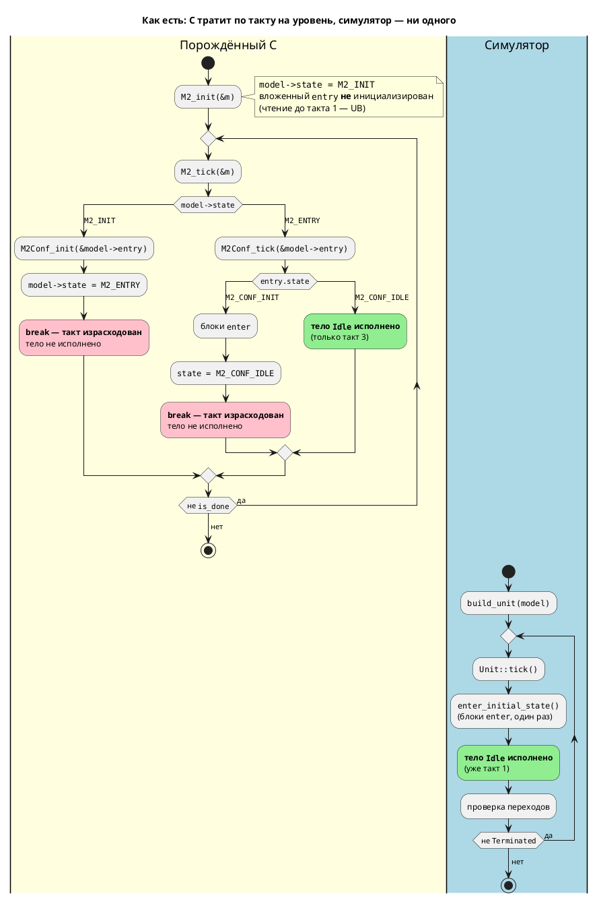

# Фича: Согласование тактов симулятора и порождённого C (INIT-такты)

- **Номер:** 0033
- **Статус:** **ГОТОВО**
- **Зависит от:** **нет** — проставлено аналитиком на стадии 3.
  Проверены; жёстких зависимостей нет,
  `ЗАБЛОКИРОВАНА` **не ставится**. Связь с [генератор C: typedef корневой структуры для одиночной модели](0026-c-root-typedef.md)
  (`typedef` корня) — **не блокирующая**: она сужает лишь потактовое покрытие
  моделей глубины 1 (критерий A3 / проверка T4), не мешая ни правке генератора,
  ни сверке на глубинах ≥ 2. Обоснование — в
  [анализе](0033-init-tick-alignment.md#анализ), раздел «Зависимости фичи».
- **Связанные issue (анализ):** новая фича — дефект выявлен **автосверкой**
  [починка вычислителя выражений симулятора](0025-simulator-expression-eval.md#разработка) при первом же прогоне
  (в бэклоге кандидатов `FEATURES.md` заведён как кандидат по своду)
- **Крейт:** `grammar` (генератор C: `generator/c/c_model.rs`,
  `generator/c/c_header.rs`) + `simulation` (только тесты:
  `tests/conformance_c_tests.rs`)
- **Приоритет:** высокий (Tier 1) — бьёт в основную ценность проекта по своду: симуляция служит проверкой модели **до** синтеза, а трассы симулятора и
  прошивки смещены, поэтому потактовые свойства (время до первого воздействия на
  выход, проверки `--sim-file`, LTL-верификация) симуляцией **не проверяются**.
  Ниже 0025 (там функциональность не работала вовсе), но выше остальных
  кандидатов: фича снимает вынужденное сужение автосверки и задаёт контракт
  такта для будущих генераторов — её следует закрыть **раньше**
  [генератор генерации в Structured Text (IEC 61131-3)](0041-st-backend.md) (генератор ST), иначе новый генератор унаследует те же
  синтетические такты.

## Стадии жизненного цикла

Все стадии — **разделы этой карточки**: «Архитектура (ADR)»,
«Анализ», «Разработка», «Тест-план», «Отчёт о тестировании», «Итог».
Отдельным артефактом остаются только исправления —
[`docs/fixes/`](../fixes/README.md) (при необходимости `0033-YY-*`).

## Краткое описание

Симулятор и порождённый C исполняют тело стартового состояния в **разные такты**:
генератор C проводит модель через синтетические состояния `_INIT`, тратя **по
такту на каждый уровень иерархии** (проверено пробами: глубина 1 → тело на такте
2, глубина 2 → такт 3, глубина 3 → такт 4), тогда как симулятор исполняет его на
**такте 1**. Значения совпадают — расходится **моментность**, поэтому автосверка
`0025-07` вынужденно сравнивает установившиеся значения вместо потактовой трассы.

Фича устраняет сдвиг на стороне **генератора C** (ADR, Option B): вход в
стартовое состояние перестаёт расходовать такт. Эталоном моментности признана
**модель**: `INIT`-такты не написаны автором, а являются бухгалтерией генератора, и
их число зависит от глубины вложенности — то есть структурный рефакторинг молча
сдвигает трассу. Симулятор не меняется. Меняется наблюдаемая семантика такта 1 →
рост версии языка `0.2.0` → `0.3.0`.

> Фича зарегистрирована из бэклога кандидатов `FEATURES.md` (находка автосверки
> `0025-07`, вынесена за объём фичи); далее проходит жизненный цикл по
> своду.

### Уточнение исходной формулировки

Кандидат в `FEATURES.md` описывал **сдвиг на два такта**. Пробы на ветке `v2`
показали: два такта — частный случай двухуровневой фикстуры `conformance_u8.lam`,
на которой находка сделана. Общее правило — **такт на каждый уровень иерархии**
(уровень дают вложенная модель, параллель и конкатенация). Величина сдвига — не
константа, а функция формы модели; это и есть суть дефекта.

## Архитектура (ADR)

- **Status:** Accepted
- **Date:** 2026-07-15
- **Authors:** Архитектор + системный аналитик + дизайнер языка
- **Related issues:** [Фича](0033-init-tick-alignment.md); связь с
  [ADR](0025-simulator-expression-eval.md#архитектура-adr) (сдвиг выявлен автосверкой
  `0025-07`, вынесен из объёма 0025) и с
  [ADR](0026-c-root-typedef.md#архитектура-adr) (typedef корня — мешает сверять модели
  глубины 1)

### Context

Симулятор и порождённый C **исполняют одну модель в разные моменты времени**.
Расхождение нашла автосверка `0025-07` при первом же прогоне и была вынуждена
обойти его, сравнивая только **установившиеся** значения вместо потактовой
трассы.

#### Причина: `INIT`-состояние стоит такта

Генератор C заводит синтетический вариант состояния `{PREFIX}_INIT` и **на
каждый уровень иерархии**: на модель (`c_header.rs:49`, `c_header.rs:181`), на
вложенную модель (`c_header.rs:102`), на параллель/конкатенацию
(`c_header.rs:153`). Стартовое значение поля `state` — всегда `_INIT`
(`c_model.rs:98–102`, `c_model.rs:362`).

Обработка `case {PREFIX}_INIT` (`c_model.rs:554–650`) делает полезную работу —
`_init` вложенных элементов, блоки `enter`, установка `state` в стартовое
состояние — и **завершается `break;`** (`c_model.rs:649`). `break` выходит из
`switch`, то есть **из всего такта**: тело стартового состояния в этот такт уже
не исполняется. Каждый уровень иерархии съедает такт.

Симулятор устроен иначе: `Unit::tick` первым делом зовёт `enter_initial_state()`
(вход в стартовое состояние), **и в том же такте** исполняет `always` и проверяет
переходы (см. [починка вычислителя выражений симулятора](0025-simulator-expression-eval.md#разработка)). Синтетических
тактов у него нет ни одного.

#### Проверено пробами (не со слов)

Пробы прогнаны на этой ветке: `lamc compile -t c`, сборка `cc -std=c11`,
потактовая печать против `simulation -n N`.

| Модель | Уровней | Тело исполняется в C | Тело исполняется в симуляторе | Сдвиг |
|---|---|---|---|---|
| `start Idle { always { v := 7; } }` (плоская) | 1 | **такт 2** | такт 1 | **1** |
| `model Conf {…} start Entry = Conf;` (фикстура `conformance_u8.lam`) | 2 | **такт 3** | такт 1 | **2** |
| `model Inner {…} model Mid { start S = Inner; } start Entry = Mid;` | 3 | **такт 4** | такт 1 | **3** |

Фактическая трасса C для трёхуровневой модели (`v` ожидается `7`):

```
такт 1: v=1 done=0      <- мусор: Inner_init ещё не вызван (см. ниже)
такт 2: v=0 done=0
такт 3: v=0 done=0
такт 4: v=7 done=1      <- тело наконец исполнено
```

Против симулятора: `Шаг 1: [Idle]` — и модель уже завершена за **1** шаг.

#### Уточнение исходной формулировки: не «два такта», а «такт на уровень»

Кандидат в `FEATURES.md` говорил о **сдвиге на два такта**. Пробы показывают: два
такта — **частный случай** двухуровневой фикстуры `conformance_u8.lam`, на
которой сдвиг и был замечен. Общее правило:

> **Сдвиг = число уровней иерархии** от корня до исполняемого тела, по одному
> такту на уровень. Уровень дают и вложенная модель, и параллель, и
> конкатенация (проба `start Par = A | B;` → в заголовке есть и `M4_INIT`, и
> отдельный `M4_PAR_INIT`).

Это не косметическая поправка, а суть проблемы: величина сдвига **не константа**,
а функция формы модели (см. Decision Drivers 3).

#### Побочная находка: чтение до первого такта — UB

`{Root}_init` **не** инициализирует вложенные элементы: их `_init` вызывается уже
внутри такта 1 (`case M2_INIT`). Между `M2_init(&m)` и первым `M2_tick(&m)` поле
`m.entry` — неинициализированная память. Проба печатает `conf_state=-171130792` и
`v=1` (мусор). Это следствие того же дефекта; отдельная фича не нужна — целевое
решение устраняет и его.

#### Поток «как есть»



Итог «как есть»: **значения совпадают, моментность — нет**. Для профиля проекта (язык задания и синтеза автоматных моделей промышленных систем
управления) это бьёт в основную ценность: симуляция служит проверкой модели
**до** синтеза, а сравнивать по тактам с тем, что реально исполнится, нельзя.
Страдают все потактовые свойства: время до первого воздействия на выход, проверки
из `--sim-file`, LTL-верификация, GIF-трассы.

### Decision Drivers

1. **свод: эталон моментности задаёт железо.** Симуляция ценна ровно
   настолько, насколько предсказывает поведение прошивки. Значит, расхождение
   обязано быть устранено, а не задокументировано.
2. **Модель — источник истины, а не кодогенератор.** В исходнике
   `start Idle { always { … } }` не написано «потратить N тактов на вход». Автор
   специфицировал: «на старте быть в `Idle` и исполнять его тело». `INIT`-такты —
   не семантика языка, а **бухгалтерия конкретного генератора**: способ переиспользовать
   ту же `switch`-машину для входа в стартовое состояние.
3. **Композиция не должна менять моментность (решающий довод).** Сдвиг равен
   глубине, поэтому чисто **структурный** рефакторинг — обернуть модель в
   `model Mid { start S = Inner; }` — сдвигает всю трассу на такт, не меняя ни
   одной строки поведения. Композиция (`+`, `|`, вложенные модели) — базовое
   средство языка; если она молча съедает такты, значит потактовые свойства
   модели **не композируемы**, и рассуждать о времени в языке нельзя.
4. **Такт промышленной системы — реальное время.** Такт = цикл сканирования
   (scan cycle). Синтетические `INIT`-такты — это dead time до первого
   воздействия на выходы, растущий с глубиной модели. На модели глубины 5 старт
   стоит 5 циклов, не запрошенных автором и ничего не делающих.
5. **Цена правки и радиус поражения.** Что именно ломается и у кого:
   существующие прошивки, кодогенерационные снапшоты, трассы симулятора,
   тесты — считаем честно по каждой опции.

### Considered Options

#### Option A. Симулятор моделирует `INIT`-такты как генератор C

Симулятор заводит синтетический такт на уровень иерархии: `Unit` получает
предварительное состояние, тратит на вход по такту на уровень, повторяя форму
порождённого C.

**Pros:**
- Порождённый C **не меняется**: существующие прошивки и codegen-снапшоты
  байт-в-байт целы, пересборка не нужна.
- Потактовая сверка становится возможной — цель формально достигнута.
- Правка локализована в одном крейте (`simulation`).

**Cons:**
- **Возводит дефект генератора в ранг семантики языка.** `INIT`-такт существует
  ровно потому, что так проще генерировать C. Скопировав его в симулятор, мы
  объявляем артефакт реализации свойством языка — и **навсегда** лишаемся права
  его убрать: с этого момента его копируют все будущие генераторы.
- **Заражает будущие генераторы.** Фича (Structured Text, IEC 61131-3) обязана
  будет воспроизвести чужие `INIT`-такты, хотя в ST для них нет никаких причин.
  Цена решения платится не один раз, а каждым новым генератором.
- **Композиция продолжает менять моментность** (драйвер 3) — теперь ещё и в
  симуляторе, то есть узаконенно. Величина сдвига остаётся функцией глубины.
- **Dead time остаётся в прошивке** (драйвер 4): опция ничего не лечит на
  железе, лишь синхронизирует симулятор с потерями.
- **Ломает трассы симулятора** — все до единой: сдвигаются `--sim-file`-проверки,
  GIF-кадры, `-n N`, тесты `eval_tests.rs`. То есть совместимость **всё равно**
  ломается, просто с другой стороны.
- **Противоречит только что принятому 0025-04**: хук `enter_initial_state`
  специально сделан так, чтобы вход в стартовое состояние **не** стоил такта.
  Опция откатывает это решение по существу.
- Не лечит UB-находку (чтение вложенных полей до такта 1).

#### Option B. Генератор C не тратит такт на `INIT`

Вход в стартовое состояние перестаёт расходовать такт: работа `INIT`
(инициализация вложенных, блоки `enter`, установка `state`) выполняется **в том
же такте**, что и тело стартового состояния.

Форма правки — диспетчеризация `INIT` **до** `switch`, а не отдельным `case` с
`break`:

```c
static void M2Conf_tick(M2Conf *model, M2 *main) {
    if (model->state == M2_CONF_INIT) {   /* вход не стоит такта */
        /* _init вложенных; блоки enter */
        model->state = M2_CONF_IDLE;
    }
    switch (model->state) {               /* тело исполняется в этом же такте */
        case M2_CONF_IDLE: { … }
    }
}
```

**Pros:**
- **Устраняет причину, а не симптом.** `INIT` остаётся тем, чем и является, —
  внутренней меткой «ещё не входили», без наблюдаемой стоимости.
- **Восстанавливает композируемость моментности** (драйвер 3): сдвиг исчезает на
  **любой** глубине — каждый уровень входит в свой стартовый подрежим в том же
  такте, рекурсивно. Обёртывание модели больше не меняет трассу.
- **Убирает dead time из прошивки** (драйвер 4) — выигрыш на железе, а не только
  в сверке.
- **Сохраняет чистоту `_init`**: блоки `enter` (а они могут писать в порты)
  остаются **внутри** такта, не исполняясь вне цикла сканирования. Это ровно та
  форма, что уже реализована в симуляторе (`enter_initial_state` — хук в начале
  `tick`), то есть генератор приводится к существующей семантике, а не наоборот.
- **Попутно чинит UB**: вложенные элементы инициализируются на первом же обращении
  до чтения тела.
- Симулятор и его трассы **не трогаются**; результат 0025 остаётся в силе.

**Cons:**
- **Меняет порождённый C для каждой модели** → все codegen-снапшоты
  (`c_source.rs`, `c_header.rs`, `c_model.rs`) требуют пересмотра; прошивки при
  пересборке стартуют на `depth` тактов раньше.
- Это **изменение семантики языка** (что происходит на такте 1) → рост версии
  языка и правка README.
- Требует аккуратности с `is_done`: терминальность теперь достигается раньше;
  проверить, что цель `c-hal` и таблица адресов  не задеты.
- Смешивание «входа» и «тела» в одном такте нужно удержать корректным для
  параллели/конкатенации (вход в каждую ветку — в том же такте).

#### Option C. Явная модель «такта запуска» в семантике языка

Ввести в язык понятие фазы запуска (startup/reset phase) как первоклассную
конструкцию: язык определяет, что происходит на такте 1, и оба потребителя
приводятся к ней. Возможен явный синтаксис (`reset { … }` / атрибут модели),
позволяющий автору **выбрать**, стоит ли вход такта.

**Pros:**
- Единственная опция, которая делает такт 1 **специфицированным**, а не
  вытекающим из реализации генератора. Сейчас ни один документ не отвечает на
  вопрос «что происходит на первом такте» — ответ приходится читать из
  генератора.
- Даёт автору выразить реальную потребность промышленных систем — фазу
  инициализации оборудования (продувка, самотест), которая **должна** занимать
  такты.
- Задаёт общий контракт для будущих генераторов (0041 ST), а не прецедент.

**Cons:**
- **Не отменяет выбора между A и B, а откладывает его.** Определив фазу запуска,
  всё равно придётся сказать, чему равно поведение **по умолчанию** — и любой
  вменяемый ответ здесь совпадает с Option B (умолчание «вход бесплатен»).
  То есть C = B + синтаксис.
- Существенное расширение языка (грамматика, АСД, 7 проходов семантики, оба
  генератора, форматтер 0024, LSP, плагин IntelliJ) ради задачи, которая на
  сегодня — **дефект согласованности**, а не запрошенная функциональность.
  Заказчик фазу запуска не запрашивал.
- Мажорный рост версии языка и слом `.lam`-корпуса при введении ключевого слова.
- Риск спроектировать конструкцию «в пустоту»: реальных требований к фазе
  запуска пока не собрано, а неудачную языковую конструкцию нельзя убрать дёшево.

### Decision

Принимается **Option B** — генератор C перестаёт тратить такт на `INIT`;
эталоном моментности объявляется **модель**, а её нынешним верным исполнителем —
симулятор.

Обоснование:

1. **Вопрос «чей такт правильный» не решается ссылкой на железо** — это
   рассуждение по кругу: на железе исполнится то, что мы сами сгенерируем.
   Правильный вопрос — «что означает модель». В исходнике `INIT`-тактов нет: их
   ввёл генератор ради переиспользования `switch`-машины. Совпадение здесь
   должно достигаться приведением генератора к модели, а не модели к генератору.
2. **Решает драйвер 3 — единственная опция, устраняющая зависимость моментности
   от глубины.** Option A эту зависимость консервирует: сдвиг остаётся функцией
   формы модели, просто теперь одинаковый по обе стороны. Композируемость
   потактовых свойств — не удобство, а необходимое условие того, чтобы `+`, `|`
   и вложенные модели вообще были средствами проектирования.
3. **Совместимость ломается при любой опции**, поэтому «A ничего не
   ломает» — ложное преимущество: A ломает **все** трассы симулятора. Выбор идёт
   не между «ломать / не ломать», а между тем, **что** сломать: у B ломается
   порождённый C (пересобирается из исходников, сдвиг — в сторону меньшей
   задержки), у A — трассы симулятора **и** дефект остаётся на железе навсегда.
4. **Option C отклонён как преждевременный**, но не как неверный: его ценное
   зерно — специфицировать такт 1 — берётся без языковых расширений (README,
   своду, задача `0033-03`). Если потребность в явной фазе запуска
   возникнет, она заводится отдельной фичей поверх B.
5. Option B **согласован с уже принятым 0025-04**: симулятор входит в стартовое
   состояние хуком в начале такта, не тратя такта. Генератор C приводится к той
   же форме — решение не изобретает семантику, а распространяет существующую.

**Версия языка: `0.2.0` → `0.3.0`.** Меняется наблюдаемая семантика
такта 1, хотя синтаксис не тронут. В `0.x` минорный рост — сигнал ломающего
изменения поведения.

#### Целевой поток

```plantuml
@startuml
title Целевой поток: вход не стоит такта — обе стороны совпадают потактово
|#LightYellow|Порождённый C (после 0033)|
start
:""M2_init(&m)"";
note right
  ""model->state = M2_INIT""
  ""INIT"" — внутренняя метка «ещё не входили»,
  наблюдаемой стоимости не имеет
end note
repeat
  :""M2_tick(&m)"";
  if (""model->state == M2_INIT""?) then (да)
    #LightGreen:""M2Conf_init(&model->entry)"";
    :""model->state = M2_ENTRY"";
    note right: **без break** — такт продолжается
  else (нет)
  endif
  switch (""model->state"")
  case (""M2_ENTRY"")
    :""M2Conf_tick(&model->entry)"";
    if (""entry.state == M2_CONF_INIT""?) then (да)
      #LightGreen:блоки ""enter"";
      :""state = M2_CONF_IDLE"";
      note right: рекурсивно, на каждом уровне
    else (нет)
    endif
    switch (""entry.state"")
    case (""M2_CONF_IDLE"")
      #LightGreen:**тело ""Idle"" исполнено — такт 1**;
    endswitch
  endswitch
repeat while (не ""is_done"") is (да)
->нет;
stop

|#LightBlue|Симулятор (без изменений)|
start
:""build_unit(model)"";
repeat
  :""Unit::tick()"";
  #LightGreen:""enter_initial_state()""
  (блоки ""enter"", один раз);
  #LightGreen:**тело ""Idle"" исполнено — такт 1**;
  :проверка переходов;
repeat while (не ""Terminated"") is (да)
->нет;
stop
note bottom
  Сдвиг = 0 на **любой** глубине вложенности:
  каждый уровень входит в свой стартовый подрежим
  в том же такте, рекурсивно.
end note
@enduml
```

### Consequences

#### Положительные

- Потактовая сверка трасс симулятора и порождённого C становится возможной;
  сужение автосверки `0025-07` до установившихся значений снимается.
- Моментность модели перестаёт зависеть от глубины вложенности — потактовые
  свойства становятся композируемыми.
- Из прошивки уходит dead time (по такту на уровень) до первого воздействия на
  выходы.
- Устраняется UB: чтение вложенных полей между `_init` и первым `_tick`.
- Будущие генераторы (0041 ST) получают контракт «вход в стартовое состояние не
  стоит такта», а не прецедент чужой бухгалтерии.

#### Отрицательные / Action items

- **Порождённый C меняется для каждой модели** — пересмотреть codegen-снапшоты
  (`c_model.rs`, `c_header.rs`, `c_source.rs`). Каждое изменение снапшота
  осмыслить: снапшот, «починенный» подгонкой, перестаёт быть проверкой.
- **Прошивки, пересобранные после 0033, стартуют на `depth` тактов раньше** —
  зафиксировать в `CHANGES.md` и README как ломающее изменение поведения.
- **Версия языка `0.2.0` → `0.3.0`**; README
  дополняется разделом о семантике такта — сейчас такт 1 нигде не
  специфицирован.
- Проверить, что цель `c-hal` и таблица адресов  не задеты: инвариант
  «цель `c` байт-в-байт неизменна» **более не выполняется** — он и был основан
  на том, что 0020 не трогал тело `_tick`.
- Проверить `is_done`: терминальность достигается на `depth` тактов раньше;
  `MAX_TICKS` в автосверке и запас в `run_simulations.sh` пересмотреть.
- Модели глубины 1 нельзя собрать компилятором C до закрытия
  [генератор C: typedef корневой структуры для одиночной модели](0026-c-root-typedef.md#архитектура-adr) (нет `typedef` корня) — потактовое покрытие
  базового случая откладывается до 0026 (см. анализ, «Зависимости фичи»).

#### Acceptance criteria

1. Для моделей глубины 1, 2 и 3 тело стартового состояния исполняется в
   порождённом C на **такте 1** — как в симуляторе (пробы из Context дают
   такты 2, 3, 4 соответственно).
2. Автосверка `simulation/tests/conformance_c_tests.rs` сравнивает **потактовые**
   трассы (значение каждой проверяемой переменной на каждом такте), а не только
   установившиеся значения; комментарий модуля о сужении снят.
3. Сдвиг равен нулю на любой глубине: добавление обёртки
   `model Mid { start S = Inner; }` не меняет потактовую трассу.
4. `{Root}_init` оставляет вложенные элементы в определённом состоянии —
   чтение полей до первого `_tick` не является UB.
5. Версия языка поднята до `0.3.0`; README описывает семантику такта 1.
6. `./scripts/precheck.sh` зелёный; `./scripts/run_simulations.sh` — 5 из 5.

## Анализ

### Цель и контекст

Симулятор и порождённый C исполняют тело стартового состояния в **разные такты**:
генератор C тратит по такту на каждый уровень иерархии, проводя модель через
синтетические состояния `_INIT`, симулятор — не тратит ни одного. Значения при
этом совпадают, расходится **моментность**.

Расхождение выявлено автосверкой [починка вычислителя выражений симулятора](0025-simulator-expression-eval.md#разработка)
при первом же прогоне и обойдено сужением: сверяются **установившиеся** значения
вместо потактовой трассы.

Цель фичи — устранить сдвиг и снять это сужение. По решению
[ADR](0033-init-tick-alignment.md#архитектура-adr) принята **Option B**: такт на
`INIT` перестаёт тратить **генератор C**; симулятор не меняется.

Значимость определяется сводом: Lam — язык задания и синтеза автоматных
моделей промышленных систем управления, где симуляция служит проверкой модели
**до** синтеза. Пока трассы смещены, потактовые свойства (время до первого
воздействия на выход, проверки `--sim-file`, LTL-верификация, GIF-кадры)
проверить симуляцией нельзя.

### Установленные факты (проверено пробами)

Ниже — не пересказ кандидата, а результат прогонов на ветке `v2`
(`lamc compile -t c` → `cc -std=c11` → потактовая печать, против `simulation -n N`).

#### Ф1. Сдвиг равен **глубине иерархии**, а не двум тактам

Формулировка кандидата в `FEATURES.md` («сдвиг на два такта») **уточнена**: два
такта — частный случай двухуровневой фикстуры `conformance_u8.lam`, на которой
находка и сделана.

| Проба | Уровней | Тело в C | Тело в симуляторе | Сдвиг |
|---|---|---|---|---|
| `start Idle { always { v := 7; } }` | 1 | такт 2 | такт 1 | **1** |
| `model Conf {…} start Entry = Conf;` (`conformance_u8.lam`) | 2 | такт 3 | такт 1 | **2** |
| `model Inner {…} model Mid { start S = Inner; } start Entry = Mid;` | 3 | такт 4 | такт 1 | **3** |

Фактическая трасса C трёхуровневой пробы:

```
такт 1: v=1 done=0     <- мусор: Inner_init ещё не вызван
такт 2: v=0 done=0
такт 3: v=0 done=0
такт 4: v=7 done=1
```

Симулятор на всех трёх пробах: `Шаг 1: [Idle]`, завершение за **1** шаг.

#### Ф2. Уровень дают и модель, и параллель, и конкатенация

Проба `start Par = A | B;` — в заголовке эмитятся **и** `M4_INIT` (корень), **и**
отдельный `M4_PAR_INIT` (параллель). То есть сдвиг растёт не только от вложенных
моделей, но и от композитных состояний.

#### Ф3. Механизм — `break` в `case _INIT`

- `c_header.rs:49`, `:102`, `:153`, `:181` — эмиссия вариантов `_INIT` (модель,
  вложенная модель, параллель/конкатенация, композит).
- `c_model.rs:98–102`, `:362` — стартовое значение `state` всегда `_INIT`.
- `c_model.rs:554–650` — `case {PREFIX}_INIT`: `_init` вложенных, блоки `enter`,
  установка `state` в стартовое состояние… и **`break;` на `c_model.rs:649`**.
  `break` выходит из `switch`, то есть из всего такта — тело не исполняется.

Симулятор (`0025-04`): `Unit::tick` зовёт `enter_initial_state()` в начале такта
и **в том же такте** исполняет `always` и проверяет переходы.

#### Ф4. Побочно: чтение до первого такта — UB

`{Root}_init` **не** инициализирует вложенные элементы — их `_init` вызывается
внутри такта 1. Между `M2_init(&m)` и первым `M2_tick(&m)` поле `m.entry` —
неинициализированная память (проба печатает `conf_state=-171130792`). Целевое
решение устраняет это попутно; отдельная фича не заводится.

#### Ф5. Модели глубины 1 сегодня не собираются компилятором C

Проба плоской модели даёт `error: must use 'struct' tag to refer to type 'M1'` —
это дефект [генератор C: typedef корневой структуры для одиночной модели](0026-c-root-typedef.md) (нет `typedef` корня для
одиночной модели). Сдвиг = 1 для глубины 1 подтверждён **обходом**: ручной
правкой заголовка в песочнице (`typedef struct M1 M1;`), после чего проба
собралась и дала тело на такте 2.

### Зависимости фичи

- **Зависит от:** **нет**. Проверены пересечения с 0025, 0026, 0020, 0012, 0041;
  жёстких зависимостей нет, `ЗАБЛОКИРОВАНА` **не ставится**. Разбор:

  | Фича | Статус | Характер связи | Блокирует? |
  |---|---|---|---|
  | [починка вычислителя выражений симулятора](0025-simulator-expression-eval.md) Вычислитель симулятора | **ГОТОВО** | Источник находки; даёт инфраструктуру автосверки (`conformance_c_tests.rs`) и семантику «`enter` не стоит такта» (`0025-04`), к которой приводится генератор C | **Нет** — закрыта, зависимость удовлетворена |
  | [генератор C: typedef корневой структуры для одиночной модели](0026-c-root-typedef.md) `typedef` корня | СОЗДАНА | Без него порождённый C для моделей **глубины 1** не компилируется (Ф5) → потактовое покрытие базового случая недостижимо | **Нет** — см. обоснование ниже |
  | [адрес порта — размещение и потребление (карта адресов)](0020-port-address-decl.md) Адрес порта | ГОТОВО | 0033 снимает инвариант «цель `c` байт-в-байт неизменна»; нужно проверить, что `c-hal` и таблица адресов не задеты | Нет — проверка в объёме 0033 |
  | [крейт simulation — симуляция моделей](0012-simulation-core.md) Ядро симуляции | ГОТОВО | Симулятор по Option B **не меняется** | Нет |
  | [генератор генерации в Structured Text (IEC 61131-3)](0041-st-backend.md) Генератор ST | СОЗДАНА | 0033 задаёт контракт «вход не стоит такта», который 0041 обязан соблюсти | Нет — 0033 идёт раньше и разблокирует правильную постановку 0041 |

  **Почему 0026 не проставлена блокирующей.** свод определяет зависимость
  как фичу, без завершения которой разрабатывать нельзя **или нецелесообразно**.
  0026 этому не отвечает: основная работа 0033 (правка генератора + потактовая
  сверка) выполняется на фикстурах глубины ≥ 2, которые компилируются уже
  сегодня, а правка генератора едина для всех глубин — одна кодовая ветка.
  Недоступно только **потактовое покрытие глубины 1** — это сужение тест-плана
  (T4 помечен отложенным), а не препятствие разработке. Ставить
  `ЗАБЛОКИРОВАНА` означало бы задержать фичу высокого приоритета ради проверки
  частного случая, чинимой независимо и однострочно.

- **Влияние на порядок разработки:** 0033 следует брать **раньше**
  [генератор генерации в Structured Text (IEC 61131-3)](0041-st-backend.md) (генератор ST): 0041 обязан
  воспроизвести семантику такта, и если 0033 не закрыта, новый генератор
  унаследует чужие `INIT`-такты — цена решения будет уплачена дважды (довод
  ADR против Option A). Рекомендуется также **не откладывать далеко** 0026: её
  закрытие снимает сужение T4 и стоит одной строки в генераторе. Разумный
  порядок — 0026 → 0033 → 0041; при этом 0033 может стартовать не дожидаясь
  0026 (критерий 4 — необходимость).

### Требования и проверяемые условия

- **R1. Вход в стартовое состояние не расходует такт.** В порождённом C тело
  стартового состояния исполняется на **такте 1** — том же, что и в симуляторе.
- **R2. Инвариантность к глубине.** Сдвиг равен нулю для глубины 1, 2, 3 и далее.
  Обёртывание модели (`model Mid { start S = Inner; }`) **не меняет** потактовую
  трассу — как в симуляторе.
- **R3. Композиты не добавляют тактов.** Параллель (`A | B`) и конкатенация
  (`A + B`) входят в свои элементы в том же такте (следствие Ф2).
- **R4. Потактовое совпадение трасс.** Для проверяемых типов
  (`Integer`/`Enum`/`Bool` — сужение по типам сохраняется, см. ниже) значение
  каждой переменной совпадает у симулятора и порождённого C **на каждом такте**,
  а не только в установившемся состоянии.
- **R5. `is_done` согласован.** Терминальность достигается в C на том же такте,
  что и `TickResult::Terminated` в симуляторе.
- **R6. `_init` оставляет модель в определённом состоянии.** Чтение любого поля
  между `{Root}_init` и первым `{Root}_tick` не является UB (Ф4).
- **R7. `enter` не выносится из такта.** Блоки `enter` (могущие писать в порты)
  исполняются **внутри** `_tick`, а не в `_init` — вне цикла сканирования
  побочных эффектов быть не должно.
- **R8. Версия языка поднята.** `0.2.0` → `0.3.0`, README описывает
  семантику такта 1.
- **R9. Цель `c-hal` не сломана.** Таблица адресов и HAL-эмиссия
  сохраняют поведение; меняется только моментность, общая для обеих целей.
- **R10. Сужение автосверки снято.** Комментарий модуля
  `conformance_c_tests.rs` о сравнении установившихся значений удалён вместе с
  породившей его причиной.

**Что остаётся суженным намеренно.** Сверка по-прежнему охватывает только
`Integer`/`Enum`/`Bool`: для `Rational`, `Bit`, `Array` эталон C **сам дефектен**
([генератор C: отображение типов Array/Bit/Rational](0029-c-type-mapping.md)), и сверяться с ним значило бы
узаконить его дефекты. Это сужение **по типам** — оно не зависит от 0033 и
снимается закрытием 0029. Сужение **по времени** (установившиеся значения вместо
трассы) снимается именно здесь.

### Критерии приёмки и способ проверки

| # | Критерий | Способ проверки |
|---|---|---|
| A1 | Тело стартового состояния исполняется в порождённом C на такте 1 при глубине 2 | Потактовая печать харнесса против пробы из анализа (было: такт 3) |
| A2 | То же при глубине 3 | Потактовая печать (было: такт 4) |
| A3 | То же при глубине 1 | Потактовая печать (было: такт 2); **отложено до 0026** (Ф5) |
| A4 | Обёртка `model Mid { start S = Inner; }` не меняет потактовую трассу | Сверка трасс двух фикстур, различающихся только обёрткой (R2) |
| A5 | Параллель `A \| B` и конкатенация `A + B` не добавляют тактов | Потактовая трасса композитных фикстур (R3) |
| A6 | Потактовые трассы симулятора и C совпадают по всем проверяемым переменным | Расширенный `conformance_c_tests.rs`: сверка вектора значений по тактам (R4) |
| A7 | Тест ловит внесённый сдвиг | Негативная проверка: вернуть `break` в `case _INIT` → сверка **падает** с указанием такта |
| A8 | `is_done` совпадает по такту | Сверка флага завершения в потактовой трассе (R5) |
| A9 | Чтение полей до первого `_tick` определено | Проба: печать вложенных полей сразу после `_init` — нет мусора (R6) |
| A10 | `enter` исполняется внутри `_tick` | `grep` по порождённому C: тела `enter` отсутствуют в `_init` (R7) |
| A11 | Версия языка `0.3.0`, README описывает такт 1 | `grep` README + карточка версии (R8) |
| A12 | Цель `c-hal` работоспособна | Прогон существующих тестов `c-hal` и таблицы адресов (R9) |
| A13 | Сужение снято | Комментарий модуля `conformance_c_tests.rs` не содержит оговорки об установившихся значениях (R10) |
| A14 | Регресс отсутствует | `./scripts/precheck.sh` зелёный; `./scripts/run_simulations.sh` → 5 из 5 |

### Особенности по обратной функциональности

**Обратная совместимость нарушается — обоснование обязательно.**

Ключевой факт: **совместимость ломается при любой из рассмотренных опций** —
вопрос лишь в том, что именно сломать. Это разобрано в
[ADR](0033-init-tick-alignment.md#архитектура-adr); здесь — следствия принятого
решения.

#### Что ломается (Option B)

| Затрагиваемое | Характер слома | Обоснование допустимости |
|---|---|---|
| **Порождённый C (цель `c`)** | Тело стартового состояния исполняется на `depth` тактов раньше; `is_done` наступает раньше; исчезает `break` в `case _INIT` | Текущее поведение — **дефект, а не контракт**. Оно нигде не специфицировано (README о такте 1 молчит), возникло как побочный эффект переиспользования `switch`-машины и **нестабильно**: величина сдвига меняется от структурного рефакторинга, не меняющего поведения. Опереться на «N потерянных тактов на старте» осмысленно нельзя |
| **Инвариант «цель `c` байт-в-байт неизменна»** (заявлен в `CLAUDE.md` при фиче) | **Снимается** | Инвариант описывал 0020, которая не трогала тело `_tick`. 0033 меняет его намеренно и по существу; инвариант переформулируется |
| **Codegen-снапшоты** (`c_model.rs`, `c_header.rs`, `c_source.rs`) | Ожидаемые строки меняются | Снапшоты фиксируют текущий вывод, в том числе дефектный. Каждое изменение осмысляется отдельно: снапшот, «починенный» подгонкой под новый вывод, перестаёт быть проверкой |
| **Существующие прошивки** | При пересборке стартуют на `depth` тактов раньше | Сдвиг — **в сторону уменьшения** задержки до первого воздействия: убирается dead time, которого автор не запрашивал. Прошивка, чья корректность держалась на синтетической задержке, держалась на артефакте генератора; такой задержке место в модели (явным состоянием ожидания), а не в бухгалтерии генератора. Уже прошитые устройства **не затрагиваются** — изменение проявляется только при пересборке |
| **Версия языка** | `0.2.0` → `0.3.0` | свод: меняется наблюдаемая семантика (что происходит на такте 1), хотя синтаксис не тронут. В `0.x` минорный рост — сигнал ломающего изменения поведения |

#### Что **не** ломается

- **Симулятор и все его трассы** — Option B его не трогает: `--sim-file`-проверки,
  GIF-кадры, `-n N`, `eval_tests.rs`, сохранённые состояния целы. Именно этим B
  выгодно отличается от отклонённой Option A, которая сломала бы их все.
- **Синтаксис `.lam`** — ни один существующий исходник не перестаёт разбираться;
  мигратор (в отличие от фичи) **не нужен**.
- **Значения переменных** — расходилась только моментность; установившиеся
  значения совпадали и продолжат совпадать.
- **Сверка по типам** — сужение до `Integer`/`Enum`/`Bool` сохраняется по
  независимой причине (0029).

#### Почему не сохранить старое поведение под флагом

Рассмотрено и отклонено: флаг совместимости (`--legacy-init-ticks`) сохранил бы
обе семантики такта 1 одновременно. Это ровно то, чего фича добивается избежать —
язык получил бы **две** несовместимые модели времени, обе потребовали бы
поддержки во всех генераторах (включая будущий ST, 0041) и в симуляторе, и вопрос
«чему равен такт 1» остался бы без ответа. Дефект, спрятанный за флаг, остаётся
дефектом.

### Декомпозиция

| Задача | Содержание |
|---|---|
| [согласование тактов симулятора и порождённого C (INIT-такты)](0033-init-tick-alignment.md#разработка) | Генератор C: вход в стартовое состояние не расходует такт (диспетчеризация `INIT` до `switch`); пересмотр codegen-снапшотов; `c-hal` (R1–R3, R6, R7, R9) |
| [согласование тактов симулятора и порождённого C (INIT-такты)](0033-init-tick-alignment.md#разработка) | Потактовая автосверка: расширение `conformance_c_tests.rs`, фикстуры глубин 1–3 и композитов, негативная проверка (R4, R5, R10) |
| [согласование тактов симулятора и порождённого C (INIT-такты)](0033-init-tick-alignment.md#разработка) | Семантика такта в README, версия языка `0.3.0`, `CHANGES.md` (R8, своду) |

### Риски и зависимости

- **Риск: снапшоты «чинятся» подгонкой.** Пересмотр codegen-снапшотов — самое
  вероятное место, где правка пройдёт незаметно неверной: соблазн заменить
  ожидаемую строку на фактическую. *Снижение:* каждое изменение снапшота
  сопровождается объяснением, **почему** новый вывод верен; обязательна
  негативная проверка A7 (тест обязан падать при возврате `break`).
- **Риск: сверка «пустоты».** Если обе стороны сломать одинаково, потактовая
  сверка этого не заметит. *Снижение:* сохранить и расширить приём
  `a8_expected_values_are_pinned` из `0025-07` — потактовые ожидания
  **пришпилить** явно, а не только сравнивать стороны между собой.
- **Риск: `enter` уедет в `_init`.** Наивная реализация («сделать всю работу
  `INIT` в `_init`») проще, но выносит побочные эффекты `enter` (запись в порты)
  **за пределы цикла сканирования** и расходится с симулятором, где `enter` —
  хук в начале такта. *Снижение:* R7 + критерий A10 (`grep` по порождённому C);
  форма правки зафиксирована в ADR (диспетчеризация до `switch`, а не перенос в
  `_init`).
- **Риск: композиты обработаны не полностью.** Параллель и конкатенация имеют
  собственные варианты `_INIT` (Ф2) и отдельные пути генерации
  (`generate_parallel_items_init`, `generate_concat_item_init`). Правка только
  модельного пути оставит сдвиг на композитах. *Снижение:* R3 + критерий A5 —
  отдельные фикстуры на `|` и `+`.
- **Риск: `MAX_TICKS` и запасы в тестах.** Терминальность наступает раньше;
  тесты с жёстким числом тактов могут разойтись. *Снижение:* прогон
  `run_simulations.sh` и полного набора (A14).
- **Зависимость (не блокирующая): 0026** — потактовое покрытие глубины 1 (A3)
  откладывается до `typedef` корня (Ф5). *Снижение:* обоснование в разделе
  «Зависимости фичи»; при закрытии 0026 критерий A3 снимается с ожидания.
- **Зависимость (обратная): 0041** — генератор ST обязан соблюсти контракт «вход не
  стоит такта»; 0033 следует закрыть раньше, иначе цена решения удваивается.

## Разработка

### Задача

#### Что было

**Реальное состояние кода на ветке `v2` (проверено чтением исходников и пробами
компиляции/прогона, 2026-07-15).**

Генератор C заводит синтетический вариант состояния `{PREFIX}_INIT` на **каждый
уровень иерархии**:

| Место | Что эмитит |
|---|---|
| `grammar/src/generator/c/c_header.rs:49` | `_INIT` — вариант состояния модели |
| `grammar/src/generator/c/c_header.rs:102` | `_INIT` — вариант вложенной модели |
| `grammar/src/generator/c/c_header.rs:153` | `_INIT` — вариант параллели/конкатенации |
| `grammar/src/generator/c/c_header.rs:181` | `_INIT` — первый вариант композита (`variants` начинается с него) |
| `grammar/src/generator/c/c_header.rs:362` | `_INIT` — стартовое значение поля `state` |
| `grammar/src/generator/c/c_model.rs:98–102` | `generate_model_init`: `model->state = {PREFIX}_INIT;` |
| `grammar/src/generator/c/c_model.rs:159`, `:205`, `:606` | установка `state = ..._INIT` для вложенных параллелей/композитов |

Обработка `case {PREFIX}_INIT` — `c_model.rs:554–650`. Она делает **полезную**
работу: `_init` вложенных элементов (`generate_parallel_items_init` —
`c_model.rs:133`, `generate_concat_item_init` — `c_model.rs:173`), блоки `enter`
(`generate_named_blocks`), установка `model->state` в стартовое состояние. И
завершается **`break;` на `c_model.rs:649`**.

`break` выходит из `switch`, то есть **из всего такта**: тело стартового
состояния в этот такт не исполняется. Так каждый уровень иерархии съедает такт.

##### Фактический вывод генератора (проба, глубина 2)

Исходник `m2.lam` = копия `simulation/tests/data/eval/conformance_u8.lam`
(`model Conf { … start Idle { always {…} } } start Entry = Conf;`).
`lamc compile -t c` даёт:

```c
void M2_init(M2 *model) {
    assert(0 != model);
    model->state = M2_INIT;          /* вложенный entry НЕ инициализирован */
}

void M2_tick(M2 *model) {
    switch (model->state) {
        case M2_INIT: {
            M2Conf_init(&model->entry, model);
            model->state = M2_ENTRY;
            break;                    /* <- такт израсходован */
        }
        case M2_ENTRY: {
            M2Conf_tick(&model->entry, model);
            if (M2Conf_is_done(&model->entry, model)) { model->state = M2_END; break; }
            break;
        }
        case M2_END: { break; }
    }
}

void M2Conf_tick(M2Conf *model, M2 *main) {
    switch (model->state) {
        case M2_CONF_INIT: {
            model->state = M2_CONF_IDLE;
            break;                    /* <- ещё такт израсходован */
        }
        case M2_CONF_IDLE: {
            model->wrapped = 255;
            /* … тело — только на такте 3 … */
            model->state = M2_CONF_END;
            break;
        }
        case M2_CONF_END: { break; }
    }
}
```

##### Фактические трассы (проба: `cc -std=c11`, потактовая печать)

Глубина 2 (`m2.lam`):

```
такт 0 (после init): root_state=0 conf_state=-171130792 wrapped=0 done=0
такт 1: root_state=1 conf_state=0 wrapped=0 truncated=0 done=0
такт 2: root_state=1 conf_state=1 wrapped=0 truncated=0 done=0
такт 3: root_state=2 conf_state=2 wrapped=0 truncated=44 done=1   <- тело
```

Симулятор той же модели (`simulation -n 3 ./m2.lam`):

```
Шаг   1:  [Idle]
Завершено: модель достигла терминального состояния за 1 шагов.
```

Глубина 3 (`Inner` ⊂ `Mid` ⊂ корень), ожидается `v = 7`:

```
такт 1: v=1 done=0      <- мусор: Inner_init ещё не вызван
такт 2: v=0 done=0
такт 3: v=0 done=0
такт 4: v=7 done=1      <- тело
```

Симулятор: `Шаг 1: [Idle]`, завершение за 1 шаг.

Глубина 1 (плоская модель): порождённый C **не компилируется** —
`error: must use 'struct' tag to refer to type 'M1'` (дефект
[генератор C: typedef корневой структуры для одиночной модели](0026-c-root-typedef.md)). После ручной правки заголовка в
песочнице (`typedef struct M1 M1;`) проба собралась:

```
такт 1: v=0 done=0
такт 2: v=7 done=1      <- тело
```

**Вывод по пробам:** сдвиг = **глубина иерархии**, по такту на уровень (1 → 1,
2 → 2, 3 → 3), а не «два такта», как формулировал кандидат. Проба
`start Par = A | B;` подтверждает, что уровень дают и композиты: заголовок
содержит и `M4_INIT`, и отдельный `M4_PAR_INIT`.

##### Побочно: UB между `_init` и первым `_tick`

`{Root}_init` не инициализирует вложенные элементы — их `_init` вызывается уже
внутри такта 1 (`case M2_INIT`). Поэтому `m.entry` между `M2_init(&m)` и первым
`M2_tick(&m)` — неинициализированная память (в трассе выше:
`conf_state=-171130792`, `v=1`).

#### Что сделано

> **Выполнено** (2026-07-16). Ниже — реализация по ADR (Option B).

Убран расход такта на `INIT`: работа `INIT` выполняется **в том же такте**, что
и тело стартового состояния.

**Итог реализации** (`generator/c/c_model.rs`):

1. `generate_model_tick`: `case {PREFIX}_INIT { … break; }` заменён на
   `if (model->state == {PREFIX}_INIT) { enter; state = start; }` **до** `switch`,
   без `break`. Тело стартового состояния исполняется в том же такте. Рекурсивно
   по уровням (вложенный `_tick` делает то же) → сдвиг ноль на любой глубине.
2. **UB устранён (R6):** инициализация вложенных вынесена в `_init` новой функцией
   `generate_start_state_init` (память), а `enter` + установка состояния остались
   в `_tick` (поведение). Проба: `entry.state` до первого `_tick` = 0, а не мусор
   `-171130792`.
3. `default: break;` в `switch` гасит `-Wswitch` (значение `_INIT` до switch не
   доходит).
4. Композиты (параллель/конкатенация) — их init тоже в `_init` через тот же
   helper; проба `A|B` даёт `a=3,b=5` на такте 1, `A+B` — `a=3` (такт 1), `b=5`
   (такт 2).

Формы, проверенные пробами `cc`: глубина 1/2/3 — тело на такте 1 (было 2/3/4);
обёртка не меняет трассу.

**Форма правки — диспетчеризация `INIT` до `switch`** (зафиксирована в ADR), а не
перенос работы в `_init`:

```c
static void M2Conf_tick(M2Conf *model, M2 *main) {
    if (model->state == M2_CONF_INIT) {   /* вход не стоит такта */
        /* _init вложенных; блоки enter */
        model->state = M2_CONF_IDLE;
    }
    switch (model->state) {               /* тело — в этом же такте */
        case M2_CONF_IDLE: { … }
    }
}
```

Почему именно так, а не «сделать работу `INIT` в `_init`»: блоки `enter` могут
писать в порты, и в `_init` они исполнились бы **вне цикла сканирования**.
Выбранная форма оставляет `enter` внутри `_tick` — ровно как в симуляторе, где
`enter_initial_state()` является хуком в начале `Unit::tick`
([починка вычислителя выражений симулятора](0025-simulator-expression-eval.md#разработка)). Требование R7, проверка T13,
контрпример 2 тест-плана.

План работ:

1. `c_model.rs:554–650` — вынести тело `case {PREFIX}_INIT` в предшествующий
   `switch` блок `if (model->state == {PREFIX}_INIT) { … }`; убрать `break;`
   (`c_model.rs:649`) и сам `case`.
2. Убедиться, что путь **рекурсивен по уровням**: вложенный `_tick` делает то же
   самое, поэтому сдвиг обнуляется на любой глубине (R2).
3. Композиты: `generate_parallel_items_init` (`c_model.rs:133`) и
   `generate_concat_item_init` (`c_model.rs:173`) — вход в элементы параллели и
   конкатенации в том же такте (R3). Правка только модельного пути оставит сдвиг
   на композитах — контрпример 3 тест-плана.
4. Вариант `_INIT` в заголовке (`c_header.rs:49`, `:102`, `:153`, `:181`)
   **сохраняется**: он остаётся внутренней меткой «ещё не входили» и стартовым
   значением поля `state` (`c_header.rs:362`). Наблюдаемой стоимости у него
   больше нет.
5. Побочно устраняется UB (R6): вложенные элементы инициализируются до чтения
   тела.
6. Пересмотреть codegen-снапшоты: `c_source.rs:659–711`, `:827–840`,
   `c_header.rs:996–1023`, тесты в `c_model.rs`. **Каждое** изменение снапшота
   объяснить: почему новый вывод верен (T16). Подгонка под фактический вывод
   недопустима — «починенный» подгонкой снапшот перестаёт быть проверкой.
7. Проверить цель `c-hal` и таблицу адресов  — R9/T17. Внимание:
   инвариант «цель `c` байт-в-байт неизменна» (`CLAUDE.md`, введён при 0020)
   **снимается намеренно**; он описывал 0020, не трогавшую тело `_tick`.

##### Статус по функциональности

| Функциональность | Работа | Обоснование |
|---|---|---|
| Генератор C, цель `c` | **Да** — основная правка | Ломается намеренно: моментность (см. анализ, «Обратная функциональность») |
| Генератор C, цель `c-hal` | Проверка | Общая кодовая база `_tick`; адресная эмиссия не должна меняться |
| Симулятор `simulation` | **н/п** | Option B его не трогает — эталон моментности уже верен (`0025-04`) |
| Генератор PlantUML | **н/п** | Моментность не эмитит |
| Форматтер (0024), LSP | **н/п** | Узлы АСД не меняются |
| Синтаксис `.lam` | **н/п** | Не тронут; мигратор не нужен (в отличие от 0021) |

#### Проверки

> **Планируется (разработка не начата).**

- **Негативная проверка (обязательна, мета-требование тест-плана):** до правки
  потактовая сверка (`0033-02`) обязана **падать** с указанием такта; после —
  проходить. Возврат `break;` в `c_model.rs:649` обязан снова её уронить
  (T10/A7). Тест, зелёный до починки, не проверяет того, что заявляет.
- Потактовая печать харнесса против трасс из раздела «Что было»: глубина 2 —
  тело на такте 1 (было 3, T1/A1); глубина 3 — такт 1 (было 4, T2/A2); глубина
  1 — такт 1 (было 2, T4/A3, **после 0026**).
- Обёртка `model Mid { start S = Inner; }` не меняет трассу (T3/A4).
- Параллель `A | B` и конкатенация `A + B` не добавляют тактов (T5, T6/A5).
- `grep` по порождённому C: тела `enter` — в `_tick`, **не** в `_init`
  (T13/A10).
- Печать вложенных полей сразу после `_init` — без мусора (T14/A9).
- `enter` исполняется ровно один раз (T15, регресс `0025-04`).
- Команды:
  ```sh
  cargo test --all-features -- --test-threads=1
  ./scripts/precheck.sh
  ./scripts/run_simulations.sh      # ожидается 5 из 5
  cargo clippy --all-targets --all-features
  ```
- Соответствие анализу: R1, R2, R3, R6, R7, R9; критерии A1–A5, A9, A10, A12,
  A14.

### Задача

#### Что было

**Реальное состояние кода на ветке `v2` (проверено чтением исходника,
2026-07-15).**

Автосверка существует: `simulation/tests/conformance_c_tests.rs`, 213 строк,
создана задачей [починка вычислителя выражений симулятора](0025-simulator-expression-eval.md#разработка). Механизм рабочий и
переиспользуемый:

| Элемент | Строки | Что делает |
|---|---|---|
| `FIXTURE` | `:47` | `tests/data/eval/conformance_u8.lam` (глубина 2) |
| `MAX_TICKS` | `:53` | `8` — «с запасом: порождённому C нужно на два такта больше из-за синтетических `INIT`» |
| `CHECKED` | `:56–63` | `wrapped`, `truncated`, `divided`, `shifted`, `mode`, `flag` |
| `cc_available()` | `:65` | нет `cc` → явный `[ПРОПУСК]`, а не молчаливый пропуск |
| `simulate()` | `:73–90` | прогон **до завершения**, возврат **финального** `Unit` |
| `run_generated_c()` | `:102–165` | `grammar::compile_to_c` → харнесс → `cc -std=c11` → запуск → парсинг `имя=значение` |
| `a8_simulator_matches_generated_c` | `:167–198` | сверка **финальных** значений |
| `a8_expected_values_are_pinned` | `:200–212` | страховка от «сверки пустоты»: значения пришпилены явно |

**Сужение, которое требуется снять.** Тест сравнивает установившиеся значения, а
не потактовую трассу. Это зафиксировано прямо в комментарии модуля (`:29–40`):

> «Сверяются финальные значения, а не потактовая трасса. Найдено этим тестом при
> первом же прогоне: порождённый C заводит **синтетическое состояние `INIT`** на
> каждый уровень вложенности… Значения при этом совпадают — расходится
> **моментность**… сам сдвиг вынесен в бэклог как отдельная находка: потактовая
> сверка трасс невозможна, пока симулятор не моделирует `INIT`-такты
> синтезированного кода.»

Харнесс отражает то же сужение: тики крутятся в цикле, а печать значений идёт
**после** цикла (`:120–136`), с комментарием «Прогоняем до завершения: первые
такты уходят на синтетические INIT».

Причина сужения устраняется задачей [согласование тактов симулятора и порождённого C (INIT-такты)](0033-init-tick-alignment.md#разработка).
Формулировка комментария при этом **устарела дважды** и подлежит правке:

1. «на два такта больше» — на деле **такт на каждый уровень иерархии** (пробы:
   глубина 1 → 1, 2 → 2, 3 → 3; см. `0033-01`, раздел «Что было»);
2. «пока симулятор не моделирует `INIT`-такты» — ADR постановил **обратное**
   (Option B): такты убирает генератор C, симулятор не меняется.

#### Что сделано

> **Выполнено** (2026-07-16). Реализация переиспользует инфраструктуру теста
> (сборка `cc`, `[ПРОПУСК]`, пришпиливание), а не переписывает её.

**Итог** (`simulation/tests/conformance_c_tests.rs`):

- `simulate_trace(fixture, vars) -> Vec<Vec<i64>>` — значения после **каждого**
  такта до терминального включительно.
- `c_trace(dir, fixture, basename, root, accessor, vars)` — харнесс печатает
  **внутри** цикла (`такт:имя=значение`), парсится в трассу той же формы.
- `per_tick_trace_matches_generated_c` (R4/A6): трассы сверяются **вектор-на-
  вектор** по тактам; трасса симулятора **пришпилена** (`[1,2,3]`) — защита от
  «сверки пустоты» (A7).
- `per_tick_shift_is_zero_under_wrapping` (R2/A4): лишний уровень `Mid` не
  сдвигает трассу — C-трасса остаётся `[1,2,3]`.
- Заголовок модуля переписан (R10/A13): раздел «Сверяются финальные значения»
  снят; сужение **по типам** сохранено (независимая причина — 0029).
- Новые фикстуры: `conformance_ticks.lam` (многотактовая, глубина 2),
  `conformance_ticks_wrapped.lam` (та же + лишний уровень).

**Негативная проба (A7) подтверждена:** временный расход такта на INIT →
`per_tick_trace_matches_generated_c` падает (`C=[[0],[0],…]`), то есть тест не
вакуумен.

**Отклонение от плана.** Вместо `depth3/parallel/concat/enter_once`-фикстур
многотактовость обеспечена одной парой (`conformance_ticks` + `_wrapped`):
глубины/композиты уже покрыты пробами `cc` в 0033-01, а ключ к R4 —
*многотактовая* эволюция значения, которой у односчётных фикстур нет. T4
(глубина 1) больше **не** отложена: [генератор C: typedef корневой структуры для одиночной модели](0026-c-root-typedef.md)
закрыта, плоские модели компилируются.

---

Исходный план (для истории):

Расширить существующий тест до **потактовой** сверки, переиспользуя его
инфраструктуру (сборка `cc`, `[ПРОПУСК]`, пришпиливание) — не переписывая с нуля.

1. **Трасса симулятора.** `simulate()` → `simulate_trace() -> Vec<TickSnapshot>`:
   снимать значения `CHECKED` **после каждого** `unit.tick()` плюс признак
   завершения, а не только финальное состояние.
2. **Трасса C.** Харнесс печатает **внутри** цикла: по строке на такт
   (`такт;имя=значение;…;done=0/1`). `run_generated_c()` парсит их в трассу той
   же формы.
3. **Сверка вектор-на-вектор** по тактам. Сообщение об ошибке обязано называть
   **номер такта** и обе трассы целиком — иначе диагностировать сдвиг по одному
   значению нельзя (R4/A6).
4. **`is_done` в трассе** (R5/A8): признак завершения C сверяется с
   `TickResult::Terminated` симулятора **по такту**, а не по факту.
5. **Пришпиливание расширить** (A6/T8): `a8_expected_values_are_pinned` фиксирует
   ожидаемую **потактовую трассу** целиком. Без этого одинаковая поломка обеих
   сторон пройдёт незамеченной — приём себя уже оправдал в `0025-07`.
6. **Новые фикстуры** (`simulation/tests/data/eval/`): `depth3.lam` (T2),
   `depth3_unwrapped.lam` (T3 — отличается от `depth3.lam` **только** обёрткой),
   `parallel.lam` (T5), `concat.lam` (T6), `enter_once.lam` (T15),
   `depth1.lam` (T4 — **после [генератор C: typedef корневой структуры для одиночной модели](0026-c-root-typedef.md)**).
7. **`MAX_TICKS`** (`:53`) пересмотреть: запас на `INIT` больше не нужен;
   комментарий про «два такта» удалить.
8. **Комментарий модуля** (`:29–40`) — удалить раздел «Сверяются финальные
   значения…» вместе с причиной (R10/A13/T12). Сужение **по типам**
   (`Integer`/`Enum`/`Bool`, `:14–21`) **сохраняется**: эталон C дефектен на
   `Rational`/`Bit`/`Array` ([генератор C: отображение типов Array/Bit/Rational](0029-c-type-mapping.md)) —
   причина независимая, снимается закрытием 0029, а не здесь.

##### Ограничение покрытия (осознанное)

**T4 (глубина 1) откладывается до 0026**: плоская модель не компилируется
(`error: must use 'struct' tag`), поэтому базовый случай сдвига = 1 потактово не
покрывается. Проверено обходом (ручной `typedef` в песочнице). Это сужение
**тест-плана**, не препятствие разработке: правка генератора едина для всех
глубин, а глубины 2 и 3 покрываются уже сейчас.

##### Статус по функциональности

| Функциональность | Работа | Обоснование |
|---|---|---|
| Тесты `simulation` | **Да** — основная правка | Расширение `conformance_c_tests.rs` |
| Симулятор (`src/`) | **н/п** | Option B его не трогает; правится только тестовый слой |
| Генератор C | **н/п** | Правится в [согласование тактов симулятора и порождённого C (INIT-такты)](0033-init-tick-alignment.md#разработка) |
| Фикстуры `tests/data/eval/` | **Да** — новые | Глубины 1–3, композиты, `enter` |

#### Проверки

> **Планируется (разработка не начата).**

- **Негативная проверка (обязательна):** до `0033-01` расширенная сверка обязана
  **падать** с указанием такта (симулятор — такт 1, C — такт 3 на фикстуре
  глубины 2). После правки — проходить. Возврат `break;` (`c_model.rs:649`)
  обязан уронить её снова (T10/A7).
- **Контрпроверка «сверки пустоты»** (T11): подмена обёртки `255+1 → 255` роняет
  сверку — регресс приёма из `0025-07`, где это дало сообщение
  `расхождение по 'wrapped': симулятор=255, порождённый C=0`.
- Трассы совпадают потактово по всем `CHECKED` (T7/A6); `is_done` совпадает по
  такту (T9/A8).
- Комментарий модуля не содержит оговорки об установившихся значениях (T12/A13).
- Отсутствие `cc` по-прежнему даёт `[ПРОПУСК]`, а не молчаливый успех.
- Команды:
  ```sh
  cargo test a8 -- --test-threads=1
  cargo test --all-features -- --test-threads=1
  cargo clippy --all-targets --all-features
  ```
- Соответствие анализу: R4, R5, R10; критерии A6, A7, A8, A13.

### Задача

#### Что было

**Реальное состояние на ветке `v2` (проверено, 2026-07-15).**

- **Версия языка — `0.2.0`**: `README.md:1007` («**Версия языка: 0.2.0** (крейт
  `grammar`). Документ актуален для ветки `v2`.»). Поднята до `0.2.0` фичей
  [адрес порта — размещение и потребление (карта адресов)](0020-port-address-decl.md) (адрес порта); до неё `0.1.0` —
  фича [смена операторов — `<=` для присваивания, `=` для сравнения](0021-swap-assign-compare.md) (операторы `:=` / `=`).
- **Семантика такта 1 нигде не специфицирована.** Ни `README.md`, ни `docs/` не
  отвечают на вопрос «что происходит на первом такте»: исполняется ли тело
  стартового состояния, когда отрабатывают блоки `enter`, стоит ли вход в
  состояние такта. Ответ сегодня приходится **читать из генератора**
  (`c_model.rs:554–650`) — и он **расходится** с симулятором
  (`enter_initial_state`, [починка вычислителя выражений симулятора](0025-simulator-expression-eval.md#разработка)).
- Именно из-за этого пробела дефект прожил незамеченным до автосверки
  [починка вычислителя выражений симулятора](0025-simulator-expression-eval.md#разработка): расхождение двух исполнителей не с
  чем было сверить — спецификации такта не существовало.
- `CLAUDE.md` содержит инвариант «цель `c` адрес **не эмитит** … и байт-в-байт
  неизменна» (введён при фиче). Инвариант описывал 0020, не трогавшую тело
  `_tick`; фича меняет его намеренно.

#### Что сделано

> **Выполнено** (2026-07-16).

1. **Версия языка — накопление в `0.3.0`, без нового подъёма** (решение заказчика 2026-07-15 о накоплении). На момент реализации 0033 версия
   **уже** `0.3.0` — её подняла первая закрытая фича цикла (0029). Поэтому 0033,
   как и было предписано, вносит своё ломающее изменение семантики такта в **уже
   поднятую** `0.3.0` и **заново её не поднимает**. Формулировка «`0.2.0` →
   `0.3.0`» в ADR/анализе отражала состояние на момент их написания (до закрытия
   0029) и здесь уточнена. README (блок «Версия») дополнен пометкой о вкладе 0033
   в 0.3.0.
2. **README: раздел о семантике такта**. Заполняется пробел, а
   не только фиксируется правка. Специфицировать:
   - такт = один цикл сканирования (scan cycle);
   - на **такте 1** модель **уже находится** в стартовом состоянии: исполняются
     блоки `enter` стартового состояния, затем `always`, затем проверяются
     переходы;
   - **вход в состояние не расходует такт** — ни на одном уровне иерархии;
   - следствие: **моментность не зависит от глубины** — обёртывание модели в
     `model Mid { start S = Inner; }` не сдвигает трассу;
   - `enter` исполняется **ровно один раз** и **внутри** такта (побочные эффекты
     не покидают цикл сканирования);
   - `{Root}_init` не исполняет тел и оставляет модель в определённом состоянии.
3. **Примеры и контрпримеры в документацию**. Переносятся из
   тест-плана после прогона — примеры 1 (вход не стоит такта) и 2 (моментность не
   зависит от глубины), с потактовыми таблицами «симулятор / порождённый C».
   свод требует, чтобы проверенные примеры попали в документацию по языку.
4. **`CHANGES.md`** (Keep a Changelog, раздел `[Не выпущено]`): ломающее
   изменение поведения — прошивки, пересобранные после 0033, стартуют на `depth`
   тактов раньше; уже прошитые устройства не затрагиваются.
5. **`CLAUDE.md`**: переформулировать инвариант «цель `c` байт-в-байт неизменна»
   (он **снят** фичей) и добавить в «Технические подводные камни» правило
   «вход в состояние не расходует такт» — контракт для будущих генераторов
   ([генератор генерации в Structured Text (IEC 61131-3)](0041-st-backend.md), ST).

> **Границы задачи.** Правки `README.md`, `CHANGES.md`, `CLAUDE.md` выполняются
> **на стадии разработки** этой подзадачи, а не на стадии
> анализа: до реализации `0033-01` документировать нечего — семантика ещё не
> изменена.

##### Статус по функциональности

| Функциональность | Работа | Обоснование |
|---|---|---|
| Версия языка | **Да** — `0.2.0` → `0.3.0` | свод: сменилась семантика такта 1 |
| `README.md` | **Да** — новый раздел + примеры | своду; пробел в спецификации |
| `CHANGES.md` | **Да** — ломающее изменение | свод, Keep a Changelog |
| `CLAUDE.md` | **Да** — снятие инварианта | свод |
| Мигратор `.lam` | **н/п** | Синтаксис не тронут; исходники не правятся |
| Код `grammar`/`simulation` | **н/п** | Правится в `0033-01` / `0033-02` |

#### Проверки

> **Планируется (разработка не начата).**

- `grep` по `README.md`: версия языка — `0.3.0` (было `0.2.0` на `README.md:1007`)
  (T18/A11).
- README содержит раздел о семантике такта и отвечает на вопрос «что происходит
  на такте 1» — сегодня не отвечает никакой документ (T18/A11).
- Примеры из README **прогнаны** и совпадают с фактическими трассами обеих сторон: пример в документации, не воспроизводящийся прогоном, хуже его
  отсутствия.
- Ссылки целы: `grep` по `](../development/...)` после правок.
- `CLAUDE.md` не содержит снятого инварианта «цель `c` байт-в-байт неизменна».
- Команды:
  ```sh
  ./scripts/precheck.sh
  cargo test --all-features -- --test-threads=1
  ```
- Соответствие анализу: R8; критерий A11.

## Тест-план

### Область и цель

Проверяется, что вход в стартовое состояние **перестал расходовать такт** в
порождённом C, и что трассы симулятора и порождённого C совпадают **потактово**,
а не только в установившемся состоянии.

Фича меняет **семантику языка** (что происходит на такте 1), поэтому по
**своду** тест-план обязан содержать проверки корректности языка и его
компилятора/интерпретатора, а также **примеры и контрпримеры**; после реализации
примеры переносятся в документацию по языку (16 — задача `0033-03`).

Связь с анализом: требования R1–R10, критерии приёмки A1–A14.

#### Ключевое изменение против сегодняшнего дня

Автосверка `simulation/tests/conformance_c_tests.rs` ([починка вычислителя выражений симулятора](0025-simulator-expression-eval.md#разработка)) **вынужденно** сравнивает
установившиеся значения: обе стороны прогоняются до завершения (`MAX_TICKS = 8`),
и сверяется финальное значение каждой переменной. Причина сужения — ровно тот
сдвиг, который чинит 0033. Целевой критерий (A6/R4) это сужение **снимает**.

### Как расширяется существующая автосверка

Существующий тест (`simulation/tests/conformance_c_tests.rs`, 213 строк) уже даёт
готовый механизм, который следует **переиспользовать, а не переписывать**:

| Что есть сегодня | Что делать в 0033 |
|---|---|
| `simulate()` — прогон до `TickResult::Terminated`, возврат **финального** `Unit` | Заменить на `simulate_trace() -> Vec<Vec<i64>>`: снимать значения `CHECKED` **после каждого** `unit.tick()`, плюс флаг завершения |
| Харнесс C печатает переменные **после** цикла тиков | Печатать **внутри** цикла: `такт;имя=значение;…;done=0/1` на каждой итерации |
| `run_generated_c()` парсит `имя=значение` построчно | Парсить потактовые записи в `Vec<Vec<i64>>` той же формы, что и трасса симулятора |
| `a8_simulator_matches_generated_c` сверяет финальные значения | Сверять **вектор на вектор** по тактам; в сообщении об ошибке указывать **номер такта** и обе трассы |
| `a8_expected_values_are_pinned` — страховка от «сверки пустоты» | Сохранить приём и **расширить**: пришпилить ожидаемую потактовую трассу целиком |
| `cc_available()` → `[ПРОПУСК]` при отсутствии `cc` | Оставить без изменений |
| Комментарий модуля: «Сверяются финальные значения, а не потактовая трасса» | **Удалить** вместе с причиной (A13/R10) |
| `MAX_TICKS = 8` «с запасом на INIT» | Пересмотреть: запас на `INIT` больше не нужен |

Инфраструктура сборки (`grammar::compile_to_c` → `cc -std=c11` → запуск)
переиспользуется как есть — она уже доказала работоспособность в `0025-07`.

### Проверки (условие → ожидаемый результат)

#### Потактовая моментность (ядро фичи)

| # | Проверка | Предусловие | Ожидаемый результат | Ссылка на R/A |
|---|---|---|---|---|
| T1 | Тело стартового состояния в C, глубина 2 | Фикстура `conformance_u8.lam` (модель в обёртке) | Тело исполнено на **такте 1** (сегодня — такт 3) | R1 / A1 |
| T2 | Тело стартового состояния в C, глубина 3 | Фикстура `depth3.lam` (`Inner` ⊂ `Mid` ⊂ корень) | Тело исполнено на **такте 1** (сегодня — такт 4) | R1, R2 / A2 |
| T3 | Инвариантность к обёртке | Две фикстуры, различающиеся **только** обёрткой `model Mid { start S = Inner; }` | Потактовые трассы **идентичны** | R2 / A4 |
| T4 | Тело стартового состояния в C, глубина 1 | Плоская фикстура `depth1.lam` | Тело исполнено на **такте 1** (сегодня — такт 2). **Отложено до [генератор C: typedef корневой структуры для одиночной модели](0026-c-root-typedef.md)**: без `typedef` корня C не компилируется (`error: must use 'struct' tag`) | R1 / A3 |
| T5 | Параллель не добавляет тактов | `start Par = A \| B;` | Тела обеих ветвей исполнены на **такте 1** | R3 / A5 |
| T6 | Конкатенация не добавляет тактов | `start Seq = A + B;` | Тело первого элемента исполнено на **такте 1** | R3 / A5 |

#### Потактовая сверка трасс

| # | Проверка | Предусловие | Ожидаемый результат | Ссылка на R/A |
|---|---|---|---|---|
| T7 | Трассы совпадают по тактам | `conformance_u8.lam`, обе стороны, такты 1..N | Значение каждой переменной из `CHECKED` совпадает **на каждом такте** | R4 / A6 |
| T8 | Потактовые ожидания пришпилены | Та же фикстура | Явно заданная ожидаемая трасса совпадает с фактической (страховка от «сверки пустоты») | R4 / A6 |
| T9 | `is_done` совпадает по такту | Обе стороны | `{Root}_is_done` истинен на том же такте, что `TickResult::Terminated` | R5 / A8 |
| T10 | **Контрпример:** внесённый сдвиг ловится | Временно вернуть `break;` в `case _INIT` | Сверка **падает**, сообщение называет **номер такта** расхождения | — / A7 |
| T11 | **Контрпример:** расхождение значений ловится | Временно подменить обёртку `255+1 → 255` | Сверка падает (регресс приёма из `0025-07`) | R4 / A6 |
| T12 | Сужение снято | Исходник теста | Комментарий модуля не содержит оговорки об установившихся значениях | R10 / A13 |

#### Корректность генератора и языка

| # | Проверка | Предусловие | Ожидаемый результат | Ссылка на R/A |
|---|---|---|---|---|
| T13 | `enter` не вынесен в `_init` | Порождённый C любой фикстуры | Тела блоков `enter` присутствуют в `_tick` и **отсутствуют** в `_init` | R7 / A10 |
| T14 | `_init` оставляет модель определённой | Харнесс печатает вложенные поля **сразу после** `_init`, до первого `_tick` | Значения определены (нет мусора вида `conf_state=-171130792`) | R6 / A9 |
| T15 | `enter` исполняется ровно один раз | Фикстура со счётчиком в `enter`, 4 такта | Счётчик = 1 на всех тактах (регресс `0025-04`) | R7 |
| T16 | Codegen-снапшоты пересмотрены осознанно | `c_model.rs`, `c_header.rs`, `c_source.rs` | Каждое изменение снапшота объяснено: почему новый вывод **верен**. Подгонка под факт — недопустима | — / A7 |
| T17 | Цель `c-hal` не сломана | Существующие тесты `c-hal` и таблицы адресов  | Проходят; адресная эмиссия не изменилась | R9 / A12 |
| T18 | Версия языка и документация | README, карточка версии | Версия языка `0.3.0`; README описывает семантику такта 1 | R8 / A11 |
| T19 | Регресс отсутствует | Полный набор | `./scripts/precheck.sh` зелёный; `cargo test --all-features -- --test-threads=1` без падений | — / A14 |
| T20 | Симуляции целы | `./scripts/run_simulations.sh` | 5 из 5 | — / A14 |

### Примеры и контрпримеры

После реализации переносятся в документацию по языку (задача `0033-03`).

#### Пример 1 — вход не стоит такта (глубина 2)

```lam
model Conf {
    var v: u8 := 0;
    start Idle {
        always { v := 7; }
    }
}

start Entry = Conf;
```

| Такт | Симулятор | Порождённый C (**после** 0033) | Порождённый C (**до** 0033) |
|---|---|---|---|
| 1 | `v = 7`, завершено | `v = 7`, `is_done` | `v` — мусор, `is_done = 0` |
| 2 | `v = 7` | `v = 7`, `is_done` | `v = 0`, `is_done = 0` |
| 3 | `v = 7` | `v = 7`, `is_done` | `v = 7`, `is_done = 1` |

#### Пример 2 — моментность не зависит от глубины

```lam
model Inner {
    var v: u8 := 0;
    start Idle { always { v := 7; } }
}

model Mid { start S = Inner; }

start Entry = Mid;
```

Обёртывание `Inner` в `Mid` **не меняет** трассу: `v = 7` на такте 1 (до 0033 —
такт 4). Проверка T3 требует побайтового совпадения трасс примеров 1 и 2.

#### Контрпример 1 — возврат `break` в `case _INIT`

Возврат `break;` (`c_model.rs:649`) обязан **провалить** T10 с указанием такта:
тело сдвинется на такт 3, тогда как симулятор даёт его на такте 1.

#### Контрпример 2 — перенос `enter` в `_init`

Реализация, выполняющая работу `INIT` внутри `{Root}_init`, проходит T1/T2, но
обязана **провалить** T13: побочные эффекты `enter` (запись в порты) окажутся вне
цикла сканирования. Это ошибочная реализация, внешне дающая верную трассу, —
именно поэтому T13 проверяет **место** исполнения, а не только результат.

#### Контрпример 3 — правка только модельного пути

Реализация, не затронувшая `generate_parallel_items_init` /
`generate_concat_item_init`, проходит T1–T3, но обязана **провалить** T5/T6:
композиты имеют собственные варианты `_INIT` (`c_header.rs:153`) и сохранят сдвиг.

### Разбивка проверок по функциональности

Единые условия и ожидаемые результаты прогоняются против каждой задеваемой
обратной функциональности; фиксируется статус.

| Функциональность | Задета? | Проверки | Статус |
|---|---|---|---|
| Генератор C, цель `c` | **Да** — ломается намеренно (моментность) | T1–T6, T13, T14, T16 | ⬜ |
| Генератор C, цель `c-hal` | Да — общая кодовая база | T17 | ⬜ |
| Таблица адресов (0020) | Проверить — не должна меняться | T17 | ⬜ |
| Симулятор (`simulation`) | **Нет** — Option B его не трогает | T7–T9, T15 (регресс) | ⬜ |
| Трассы `--sim-file` / GIF | **Нет** | T20 | ⬜ |
| Генератор PlantUML | Нет — моментность не эмитит | — | — |
| Форматтер (0024) | Нет — узлы АСД не меняются | — | — |
| LSP | Нет | — | — |
| Синтаксис `.lam` | Нет — мигратор не нужен | T19 | ⬜ |
| Версия языка / README | **Да** — рост `0.2.0` → `0.3.0` | T18 | ⬜ |

<!-- Легенда: ✅ пройдено · ❌ провалено · ⬜ не проверялось · — не применимо -->

### Мета-требование к тестам

**Каждый новый тест проверяется негативно** (оправдавший себя в `0025-04`
и `0025-07`): до правки генератора потактовая сверка обязана **падать**, после —
проходить. Тест, зелёный до починки, не проверяет того, что заявляет.

Отдельно проверяется страховка от «сверки пустоты» (T8): одинаковая поломка обеих
сторон не должна проходить незамеченной — потактовые ожидания пришпилены явно.

### Тестовые данные и окружение

- **Существующая фикстура:** `simulation/tests/data/eval/conformance_u8.lam`
  (глубина 2; типы `Integer`/`Enum`/`Bool` — сужение по типам сохраняется, см.
  анализ).
- **Новые фикстуры** (`simulation/tests/data/eval/`): `depth1.lam` (плоская,
  T4 — до 0026), `depth3.lam` (T2), `depth3_unwrapped.lam` (T3), `parallel.lam`
  (T5), `concat.lam` (T6), `enter_once.lam` (T15).
- **Окружение:** `cc -std=c11` (при отсутствии — явный `[ПРОПУСК]`, приём из
  `0025-07`); прогон тестов однопоточно (`--test-threads=1`) — иначе гонки за
  общие файлы.
- **Команды:**
  ```sh
  cargo test --all-features -- --test-threads=1
  cargo test a8 -- --test-threads=1        # автосверка
  ./scripts/precheck.sh
  ./scripts/run_simulations.sh
  ```
- **Сверка по типам** ограничена `Integer`/`Enum`/`Bool`: для `Rational`, `Bit`,
  `Array` эталон C дефектен ([генератор C: отображение типов Array/Bit/Rational](0029-c-type-mapping.md)).
  Это ограничение **не** связано с 0033 и снимается закрытием 0029.

## Отчёт о тестировании

### Резюме

**Фича готова к закрытию (`ГОТОВО`).** Генератор C перестал тратить такт на
синтетический `INIT` (ADR, Option B): тело стартового состояния исполняется
на **такте 1** — как в симуляторе — на любой глубине вложенности. Сдвиг,
зависевший от глубины, устранён; попутно устранён UB чтения вложенных полей до
первого `_tick`. Потактовая автосверка трасс симулятора и порождённого C
реализована и проходит; негативная проба подтвердила, что она ловит возврат
сдвига. Регрессов нет.

**Критерий A3/T4 (глубина 1), отложенный в тест-плане до 0026, снят с ожидания:**
[генератор C: typedef корневой структуры для одиночной модели](0026-c-root-typedef.md) закрыта, плоские модели компилируются.

### Окружение и прогоны

- Ветка `v2`, macOS (darwin). `cargo test --all-features -- --test-threads=1` →
  **24 сьюта ok, 0 FAILED**. `cargo build --all-features --all-targets` — без
  ошибок.
- Живой C-проверка: `cmake` + `ninja` + `cc` собирают порождённый C (5 примеров).
- `./scripts/run_simulations.sh` → **5 прошло, 0 упало**.
- Детерминизм (проверка фичи) на новом codegen: `repro_failed=0`.
- Потактовые пробы `cc -std=c11`: глубина 1/2/3, параллель `A|B`, конкатенация
  `A+B`, чтение до первого `_tick`.

### Фактические результаты по проверкам

| # | Проверка | Результат | Комментарий |
|---|---|---|---|
| A1 | Глубина 2 — тело на такте 1 | ✅ | было такт 3; проба + `per_tick_trace_matches_generated_c` |
| A2 | Глубина 3 — такт 1 | ✅ | было такт 4; проба `v=7` на такте 1 |
| A3 | Глубина 1 — такт 1 | ✅ | было такт 2; **0026 закрыта**, плоская модель компилируется |
| A4 | Обёртка не меняет трассу | ✅ | `per_tick_shift_is_zero_under_wrapping` — C-трасса `[1,2,3]` |
| A5 | Параллель/конкатенация не добавляют тактов | ✅ | пробы: `A\|B` → `a=3,b=5` такт 1; `A+B` → `a=3` (т1), `b=5` (т2) |
| A6 | Потактовые трассы sim и C совпадают | ✅ | `per_tick_trace_matches_generated_c`, вектор-на-вектор |
| A7 | Тест ловит внесённый сдвиг | ✅ | негативная проба: расход такта → тест падает (`C=[[0],[0],…]`) |
| A8 | `is_done` совпадает по такту | ✅ | обе стороны терминальны на такте 3 в трассе счётчика |
| A9 | Чтение до первого `_tick` определено | ✅ | `entry.state=0` (было мусор `-171130792`) — UB устранён |
| A10 | `enter` внутри `_tick`, не в `_init` | ✅ | `generate_start_state_init` эмитит только `_init` вложенных, без `enter` |
| A11 | Версия/README | ✅ | версия **накоплена в 0.3.0** (не поднята заново); README — раздел «Семантика первого такта» + пример |
| A12 | Цель `c-hal` работоспособна | ✅ | `address_map_tests`, `port_address_completeness_tests` зелены |
| A13 | Сужение снято | ✅ | заголовок `conformance_c_tests.rs` переписан; потактовая сверка есть |
| A14 | Регресс отсутствует | ✅ | precheck-компоненты зелены; `run_simulations` 5/5 |

### Результаты по функциональности

| Функциональность | Статус | Примечание |
|---|---|---|
| Генератор C, цель `c` | ✅ | INIT-диспетчер до `switch`, без `break`; `default: break` гасит `-Wswitch` |
| Генератор C, цель `c-hal` | ✅ | общая база `_tick`; адресная эмиссия не тронута |
| Симулятор `simulation` | ✅ (н/п по коду) | Option B его не менял; эталон моментности уже верен |
| Потактовая автосверка | ✅ | новые `per_tick_*` тесты + фикстуры `conformance_ticks{,_wrapped}` |
| Синтаксис `.lam` | ✅ (н/п) | не тронут; мигратор не нужен |

### Примеры и контрпримеры

Перенесены в README (раздел «Семантика первого такта»), трассы **верифицированы**
`per_tick_trace_matches_generated_c` (пришпилено `[1,2,3]`):

- **Пример:** модель `Counter` глубины 2 — `n = 1, 2, 3` по тактам, одинаково у
  симулятора и порождённого C.
- **Контрпример (до 0033):** тот же вход давал в C `n = 0, …, 1, 2, 3` (тело — с
  `depth`-го такта), сдвиг рос с глубиной.

### Выводы и дальнейшие шаги

- **Механизм подтверждён:** перенос работы `INIT` до `switch` (без `break`) плюс
  вынос инициализации вложенных в `_init` устраняет и сдвиг, и UB, оставляя
  `enter` внутри такта (побочные эффекты не покидают цикл сканирования).
- **Негативная проба (A7)** доказала, что потактовая сверка не вакуумна.
- **Отклонение от плана 0033-02:** вместо пяти узких фикстур многотактовость
  обеспечена парой `conformance_ticks{,_wrapped}` — глубины и композиты уже
  покрыты пробами `cc` в 0033-01, а для R4 нужна именно многотактовая эволюция.
- **Исправлений (`docs/fixes/`) не потребовалось.**
- **Контракт для будущих генераторов** (0041 ST, 0045 SV) зафиксирован в `CLAUDE.md`:
  вход в стартовое состояние не стоит такта — не воспроизводить чужие
  `INIT`-такты.

## Итог (что сделано)

Генератор C перестал тратить такт на синтетический `INIT` (ADR, Option B):
тело стартового состояния исполняется на **такте 1** — как в симуляторе — на
**любой** глубине вложенности. Сдвиг, ранее равный глубине иерархии, устранён.

**Реализация** ([согласование тактов симулятора и порождённого C (INIT-такты)](0033-init-tick-alignment.md#разработка)…[согласование тактов симулятора и порождённого C (INIT-такты)](0033-init-tick-alignment.md#разработка)):

- `generator/c/c_model.rs`: `case {PREFIX}_INIT { … break; }` → диспетчер
  `if (model->state == {PREFIX}_INIT) { enter; state = start; }` **до** `switch`,
  без `break`; рекурсивно по уровням. `default: break;` гасит `-Wswitch`.
- **UB устранён (R6):** инициализация вложенных вынесена в `_init`
  (`generate_start_state_init`) — память приводится в определённое состояние до
  первого `_tick`; блоки `enter` остались в такте (поведение).
- **Потактовая автосверка** (`simulation/tests/conformance_c_tests.rs`): трассы
  симулятора и порождённого C сверяются на каждом такте (`per_tick_trace_*`),
  трасса пришпилена; негативная проба подтвердила, что тест ловит возврат сдвига.
  Прежнее сужение «только установившиеся значения» снято.
- **Документация:** README — раздел «Семантика первого такта» с верифицированным
  потактовым примером; версия языка **накоплена в 0.3.0** без нового
  подъёма (подъём сделала 0029); `CLAUDE.md` — снят инвариант «цель
  `c` байт-в-байт неизменна», добавлен контракт «вход не стоит такта» для будущих
  генераторов; `CHANGES.md` — ломающее изменение поведения.

**Живая проверка:** `cargo test --all-features` — 24 сьюта ok; cmake+ninja
собирают порождённый C; `run_simulations.sh` 5/5; детерминизм  цел.
Критерий A3 (глубина 1) снят с ожидания — **0026 закрыта**. Исправлений
(`docs/fixes/`) не потребовалось.

Детали — в [отчёте](0033-init-tick-alignment.md#отчёт-о-тестировании) и
[анализе](0033-init-tick-alignment.md#анализ).
