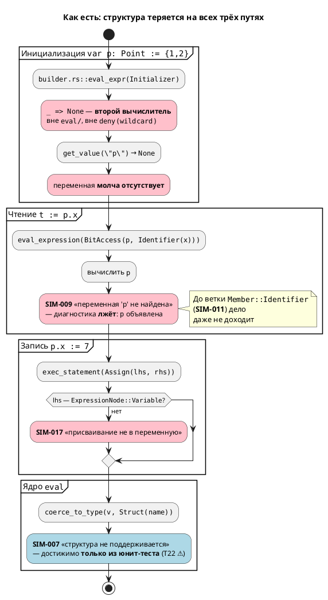
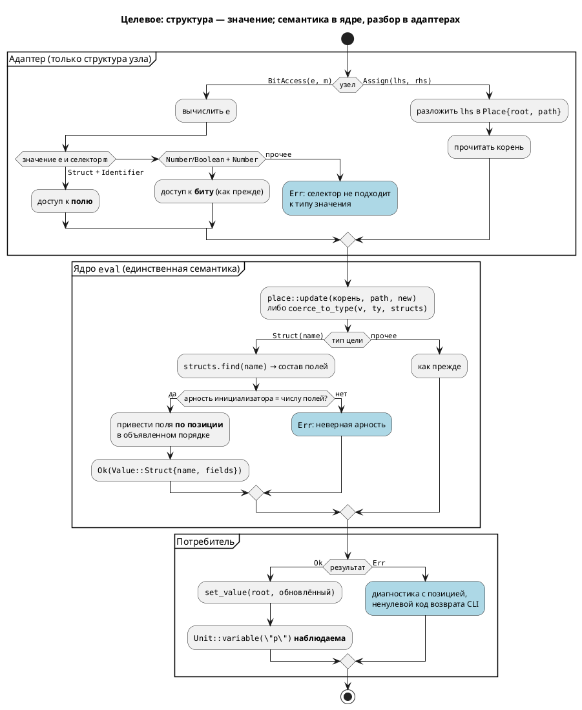

# Фича: Структурные типы в симуляторе

- **Номер:** 0034
- **Статус:** **ГОТОВО** (2026-07-19) — см. [«Итог (что сделано)»](#итог-что-сделано).
- **Зависит от:** **нет** — проставлено аналитиком на стадии 3 (правило 17).
  Проверена и **отвергнута** гипотеза о зависимости от [генератор C: отображение типов Array/Bit/Rational](0029-c-type-mapping.md)
  («Генератор C: отображение типов Array/Bit/Rational»): пробой установлено, что
  эталон C для структур с полями `Integer`/`Enum`/`Bool` **уже пригоден** —
  порождённый C компилируется `cc -std=c11` без замечаний и корректно эмитит
  доступ к полю (`model->p.x = 7`). 0029 требуется лишь для полей типов
  `[T;N]`/`bit`/`float`, которые настоящей фичей и не сверяются (то же сужение,
  что и у критерия A8 фичи). Обоснование и пробы — в
  [анализе](0034-sim-struct-types.md#анализ), раздел «Зависимости фичи».
- **Связанные issue (анализ):** новая фича (пробел выявлен при анализе
  [починка вычислителя выражений симулятора](0025-simulator-expression-eval.md) и зафиксирован там же как контрпример
  **T22**; зарегистрирована из блока «Кандидаты в фичи» `FEATURES.md`)
- **Крейт:** `simulation` (затрагивает `eval/value.rs`, `eval/mod.rs`,
  `eval/error.rs`, `expression.rs`, `unit/statement.rs`, `unit/builder.rs`,
  `context.rs`, `state_io.rs`)
- **Приоритет:** средний (**Tier 3**). Выше косметики: симулятор **молча теряет
  состояние** модели — `var p: Point := {1, 2}` исполняется без единой
  диагностики, а переменная `p` просто отсутствует в наблюдаемых значениях. Это
  ровно тот класс дефекта, ради которого делалась 0025. Ниже 0029 (Tier 2) и 0026
  (Tier 1): те ломают **основную** цель проекта — синтез C (правило 12), тогда как
  0034 чинит инструмент проверки на конструкции, которой в корпусе симулируемых
  моделей фактически нет (единственное вхождение `struct` в `examples/` —
  `extend_complex.lam`, и это `const`, который генератор C и так отбрасывает).

## Стадии жизненного цикла (правило 17)

Все стадии — **разделы этой карточки** (правило 32): «Архитектура (ADR)»,
«Анализ», «Разработка», «Тест-план», «Отчёт о тестировании», «Итог».
Отдельным артефактом остаются только исправления —
[`docs/fixes/`](../fixes/README.md) (при необходимости `0034-YY-*`).

## Краткое описание

Язык Lam умеет структуры ([структуры и генерация typedef struct в C](0006-structs.md), `ГОТОВО`), и генератор C
их синтезирует: `struct Point { x: u8, y: u16 }` даёт валидный
`typedef struct Point { uint8_t x; uint16_t y; } Point;`, поле модели `Point p;`,
а `p.x := 7` — `model->p.x = 7;`. **Симулятор же структур не представляет вовсе:**
`Value` (`simulation/src/eval/value.rs`) имеет лишь `Number`/`Real`/`Boolean`/`Array`,
тогда как `TypeNode::Struct(имя)` (NI3) в семантике существует.

Наблюдаемое сегодня поведение (все три случая воспроизведены пробами):

| Конструкция | Симулятор сегодня |
|---|---|
| `var p: Point := {1, 2};` | исполняется **молча**; `p` **отсутствует** в переменных — ни ошибки, ни предупреждения |
| `t := p.x;` (чтение поля) | **SIM-009** «переменная 'p' не найдена» — диагностика **вводит в заблуждение**: `p` объявлена |
| `p.x := 7;` (запись в поле) | **SIM-017** «присваивание не в переменную пока не поддерживается симулятором» |

В рамках 0025 пробел был зафиксирован как явная диагностика **SIM-007**
(`EvalError::UnsupportedType`, `eval/mod.rs:104`), но отчёт 0025 сам пометил T22
как : **сквозной путь не срабатывает** — `coerce_to_type` вызывается лишь при
записи, а до неё дело не доходит. Фикстура `struct_var.lam` из тест-плана 0025
так и **не заведена**. То есть заявленная «явная диагностика» существует только
как юнит-тест ядра, а живая модель со структурой ведёт себя молча.

Фича вводит представление структурного значения в симуляторе (`Value::Struct` с
сохранением **объявленного порядка полей** — он значим, поскольку инициализатор
`{1, 2}` позиционный), приведение `coerce_to_type` для `TypeNode::Struct`,
чтение и запись поля, и устраняет **остаточное дублирование вычислителей**:
`unit/builder.rs::eval_expr` — второй вычислитель с веткой `_ => None`, живущий
**вне** `eval/` и вне `deny(clippy::wildcard_enum_match_arm)`; именно его незнание
узла `ExpressionNode::Initializer` и порождает обманчивую SIM-009.

Завершение фичи снимает диагностику SIM-007 на структурах и закрывает пробел T22
фичи. Язык при этом **не меняется** — версия языка не растёт (правила 11, 22).

> Фича зарегистрирована из бэклога кандидатов `FEATURES.md`; далее проходит
> жизненный цикл по правилу 17.

## Архитектура (ADR)

- **Status:** Accepted
- **Date:** 2026-07-15
- **Authors:** Архитектор + системный аналитик
- **Related issues:** [Фича](0034-sim-struct-types.md); связь с
  [ADR](0025-simulator-expression-eval.md#архитектура-adr) (ядро вычисления, инвариант
  «вся семантика — только в `eval/`»); [структуры и генерация typedef struct в C](0006-structs.md)
  (структуры в языке и в генераторе C, `ГОТОВО`)

### Context

Структуры — существующая, закрытая возможность языка. Пробы
подтверждают, что **весь конвейер, кроме симулятора, их поддерживает**:

| Слой | Состояние | Доказательство |
|---|---|---|
| Лексер/парсер | `struct Имя { поле: Тип, … }` разбирается | `Token::Struct` (`lexer.rs:495`), `StructDefine` (`grammar.lalrpop:228`) |
| Семантика | `StructDefinitionNode` в `ModelNode.structs`; `search_struct` ищет вверх по родителям; тип — `TypeNode::Struct(имя)` | `semantic/struct_node.rs`, `semantic/mod.rs:408`, `tree.rs:529` |
| Генератор C | `typedef struct Point { uint8_t x; uint16_t y; } Point;`, поле модели `Point p;`, доступ `model->p.x = 7;` | проба: `cc -std=c11 -c` порождённого C — **чисто** |
| **Симулятор** | **структур нет вовсе** | `Value` = `Number`/`Real`/`Boolean`/`Array` (`eval/value.rs:14`) |

#### Что делает симулятор сегодня (воспроизведено пробами)

| Конструкция | Наблюдаемое | Механизм |
|---|---|---|
| `var p: Point := {1, 2};` | исполняется **молча**, `p` отсутствует в переменных | `builder.rs::eval_expr` не знает `ExpressionNode::Initializer` → `_ => None` |
| `t := p.x;` | **SIM-009** «переменная 'p' не найдена» — **ложь**, `p` объявлена | `get_value("p")` → `None` (см. выше) → `expression.rs:50` |
| `p.x := 7;` | **SIM-017** «присваивание не в переменную» | `unit/statement.rs:247` требует `ExpressionNode::Variable` в левой части |
| `coerce_to_type(_, Struct)` | **SIM-007** `UnsupportedType` | `eval/mod.rs:104` — **достижимо только из юнит-теста** |

Отчёт фичи сам зафиксировал T22 как : «юнит-тест `coerce_to_type(_, Struct)`
→ `SIM-007` ✅. **Сквозной путь не срабатывает**». Фикстура `struct_var.lam` из
тест-плана 0025 в репозитории **отсутствует**. То есть заявленная «явная
диагностика на структуры» — это тест ядра, а не наблюдаемое поведение
инструмента.

#### Три силы, определяющие решение

**1. Узел `a.b` в АСД называется `BitAccess` и покрывает два разных смысла.**
Грамматика (`grammar.lalrpop:572`) даёт один узел:

```
Expression::BitAccess(loc, e, Member)   где  Member = Identifier | Number
```

`BTN.0` (бит порта) и `p.x` (поле структуры) — **один и тот же узел**. Симулятор
сегодня разбирает его только как доступ к биту и на `Member::Identifier` выдаёт
SIM-011 «доступ к биту возможен только по номеру». Генератор C, напротив, печатает
`.` буквально, поэтому обе трактовки у него «работают» — и `model->p.x`, и
`model->BTN.0` (последнее — уже его собственный дефект, вне объёма 0034).

**2. `TypeNode::Struct(имя)` несёт только имя — состава полей в нём нет.**
Поля живут в `ModelNode.structs` и достаются через `search_struct(name)`. Но
`coerce_to_type(value, ty)` — **свободная функция**, у которой на входе лишь
`&TypeNode`. Привести `{1, 2}` к `Point` она физически не может: ей неизвестно ни
число полей, ни их типы, ни их порядок. Это не недосмотр, а граница контракта,
которую фича обязана сдвинуть.

**3. Инициализатор `{1, 2}` — позиционный.** Синтаксиса `{x: 1, y: 2}` в языке
нет: `grammar.lalrpop:535` даёт `Expression::Initializer(loc, Vec<Expression>)` —
просто список выражений. Значит **объявленный порядок полей семантически значим**:
сопоставление `{1, 2}` с `Point{x, y}` идёт по позиции. Любое представление,
теряющее порядок объявления, будет молча путать поля.

#### Поток «как есть»



### Decision Drivers

1. **Молчание недопустимо.** Главный урок: ошибка, неотличимая от нормальной
   работы, хуже отказа. Сегодня `var p: Point := {1,2}` — именно такой случай:
   состояние модели теряется без следа. Любое принятое решение обязано либо
   поддержать структуру, либо отказать **громко**.
2. **Семантика — только в `eval/`** (инвариант ADR). Представление значения и
   правила приведения обязаны жить в ядре под
   `deny(clippy::wildcard_enum_match_arm)`; адаптеры несут только структурный разбор.
3. **Достоверность относительно C** (правило 12). Эталон C для структур с полями
   `Integer`/`Enum`/`Bool` **пригоден** (проба: компилируется, поле присваивается),
   значит симулятор обязан ему соответствовать — и там, где C **запрещает**
   операцию (сравнение структур через `==`), симулятор обязан отказать, а не
   выдумывать семантику.
4. **Язык не меняется** (правила 11, 22). Реализуется уже специфицированное
   поведение: `.lam`-исходники, грамматика и АСД не трогаются; версия языка не
   растёт.
5. **Порядок полей значим.** Позиционный `{1, 2}` делает объявленный порядок
   частью семантики. Представление, не сохраняющее порядок, — источник тихой порчи
   данных, то есть прямое нарушение драйвера 1.

### Considered Options

#### Option A. `Value::Struct(BTreeMap<String, Value>)`

Структурное значение — отображение «имя поля → значение».

**Pros:**
- Поиск поля O(log n), код чтения `p.x` тривиален.
- `BTreeMap` даёт детерминированный обход (в отличие от `HashMap`) — `Debug` и
  сравнение значений воспроизводимы.
- Структура остаётся **единым значением**: `q := p`, передача в `fn`,
  `Unit::variable("p")` работают без спецслучаев.

**Cons:**
- **Теряет объявленный порядок полей** — прямое нарушение драйвера 5. `BTreeMap`
  упорядочивает по имени, а `{1, 2}` сопоставляется по позиции. Для
  `struct S { b: u8, a: u8 }` инициализатор `{1, 2}` дал бы `a=1, b=2` вместо
  `b=1, a=2` — **тихая порча данных**, ровно тот класс, что закрывала 0025.
  Порядок пришлось бы каждый раз отдельно доставать из `StructDefinitionNode`,
  то есть хранить его всё равно, но **не** в значении.
- Имя типа не хранится → диагностика «структура 'Point'» и проверка совместимости
  при `q := p` требуют внешнего контекста.

#### Option B. Плоское разворачивание полей в отдельные переменные

`var p: Point` регистрирует переменные с синтетическими именами `"p.x"`, `"p.y"`;
`Value` не меняется.

**Pros:**
- Минимальный диф: `Value`, `Context` и все `match` по `Value` остаются как есть.
- `Context::get_value`/`set_value` работают по имени без изменений — SIM-017
  снимается почти даром.
- Коллизия имён невозможна: `.` не входит в идентификаторы Lam.

**Cons:**
- **Структура перестаёт быть значением.** `q := p` (валидное присваивание в C!) и
  передача структуры в `fn` становятся невыразимы — их пришлось бы разворачивать
  в пофайловое копирование в адаптере.
- **Семантика структуры уезжает из `eval/`** в слой разрешения имён
  (`builder.rs`/`statement.rs`) — прямое нарушение драйвера 2. «Структурность»
  размазывается по адаптерам, которым ADR запретил нести семантику.
- `TypeNode::Struct` в `coerce_to_type` так и остаётся `UnsupportedType` (SIM-007):
  приводить нечего, ведь структурного значения нет. Заявленная цель фичи не
  достигается — снимается симптом, а не пробел.
- Наблюдаемость деградирует: `state_io` и JSON-сценарии получают синтетические
  имена `"p.x"`, которых в исходнике нет; вложенные структуры дают `"p.a.b"` —
  строковый разбор пути вместо типа.

#### Option C. `Value::Struct { name: String, fields: Vec<(String, Value)> }`

Структурное значение хранит **имя типа** и поля **в объявленном порядке**.

**Pros:**
- **Сохраняет порядок объявления** (драйвер 5) — позиционный `{1, 2}`
  сопоставляется корректно и по построению, а не за счёт дисциплины.
- Имя типа при значении: диагностики точны («ожидалась структура 'Point',
  получена 'Coord'»), совместимость при `q := p` проверяема локально.
- Структура — единое значение (как в C): `q := p` — обычное присваивание,
  `Unit::variable("p")` наблюдаема целиком, `state_io` сохраняет её как есть.
- Новый вариант `Value` **ломает сборку** всех `match` в `eval/` — механизм
  удержания ADR срабатывает ровно так, как задуман: ни одна операция не
  сможет молча «забыть» структуру.
- `Vec` на 2–8 полей быстрее и проще `BTreeMap`; линейный поиск поля здесь не
  горячий код (драйвер соразмерности, `docs/CODE.md`).

**Cons:**
- Поиск поля O(n) — теоретически хуже A (практически несущественно).
- Больший диф, чем B: затрагиваются все `match` по `Value` в `eval/ops.rs`,
  `eval/mod.rs`, `expression.rs`, `error.rs::value_kind`.
- Требует сдвинуть контракт `coerce_to_type` (доступ к реестру структур) — см.
  ниже.

### Decision

Принимается **Option C**.

Решает драйвер 5 в связке с драйвером 1. Option A выглядит каноничнее (карта —
естественная модель записи), но `BTreeMap` **упорядочивает поля по имени**, тогда
как язык сопоставляет инициализатор **по позиции**. Это не теоретическое
неудобство: `struct S { b: u8, a: u8 }` с `{1, 2}` дал бы перепутанные поля —
тихо, без диагностики, то есть воспроизвёл бы ровно тот дефект, ради искоренения
которого писалась 0025. Порядок всё равно пришлось бы носить рядом со значением,
и карта превратилась бы в `Vec` с лишним шагом.

Option B отвергается по драйверу 2: он не столько поддерживает структуры, сколько
**прячет** их отсутствие. `Value` не растёт → компилятор ничего не проверяет →
«структурность» расползается по адаптерам, которым ADR прямо запретил нести
семантику. И главное, он не достигает цели фичи: `coerce_to_type(TypeNode::Struct)`
остаётся `UnsupportedType`, потому что приводить по-прежнему нечего.

#### Сопутствующие решения

| Вопрос | Решение |
|---|---|
| **Реестр структур в ядре** | `coerce_to_type` получает третий параметр — `&dyn StructRegistry` (метод `find(name) -> Option<&StructDefinitionNode>`). Реализуется поверх `ModelNode::search_struct` (учитывает поиск по родительским моделям). Затрагивает 5 мест вызова: `expression.rs:204`, `unit/statement.rs:204, 259, 471, 483`. Альтернатива — обогатить `TypeNode::Struct` составом полей — отвергнута: это правка **семантических типов крейта `grammar` ради симулятора**, ровно тот перекос масштаба, который ADR отверг в своей Option C. |
| **Неоднозначность `a.b`** (`BitAccess`) | Различать по **вычисленному значению левой части**, а не по имени узла: `Value::Struct` + `Member::Identifier` → доступ к полю; `Value::Number`/`Boolean` + `Member::Number` → доступ к биту (как сейчас). Остальные сочетания (`Value::Struct` + `Member::Number`, число + `Member::Identifier`) → **диагностика**, а не догадка. Узел АСД **не переименовывается**: это правка грамматики ради читаемости, вне объёма фичи (кандидат в бэклог). |
| **Запись в поле** (SIM-017) | Вводится понятие «места» (lvalue): адаптер `statement.rs` **структурно** раскладывает левую часть в `Place { root: String, path: Vec<Selector> }`, а **семантику** обновления (`заменить поле k в структуре`) выполняет ядро — `eval::place::update(value, &path, new) -> Result<Value, EvalError>`. `Context` остаётся с двумя методами (`get_value`/`set_value`): цикл «прочитать корень → обновить по пути → записать корень». Так семантика не утекает в адаптер (драйвер 2), а вложенность `p.a.b` получается рекурсией, а не строковым разбором. |
| **Сравнение структур** | `p = q` → **диагностика**. Обоснование — драйвер 3: C **запрещает** `==` на структурах (ошибка компиляции). Выдумывать здесь почленное сравнение значило бы разойтись с эталоном в сторону «симулятор умеет больше, чем прошивка» — то есть дать ложную уверенность. |
| **Присваивание структуры целиком** | `q := p` — **поддерживается**: в C это законная операция (копирование по значению). `coerce_to_type` проверяет совпадение имени типа. |
| **`Value` и `#[non_exhaustive]`** | `Value` (`pub use eval::value::Value`) **не** помечается `#[non_exhaustive]`, хотя `docs/CODE.md` это допускает. Атрибут заставил бы внешние крейты писать `_`, а внутри — сохранил бы проверку; но прецедент уже есть и он отрицательный: `TypeNode` помечен `#[non_exhaustive]`, из-за чего `coerce_to_type` **вынужден** держать ветку `_` (`eval/mod.rs:132-136`) — ровно ту дыру, которую закрывала 0025. Крейт `simulation` не публикуется и потребителей вне workspace не имеет, поэтому цена атрибута — реальная потеря гарантии, а выгода — гипотетическая. |
| **Второй вычислитель** | `builder.rs::eval_expr` (вычислитель инициализаторов, `_ => None`, вне `eval/`) — **устраняется**: инициализаторы вычисляются тем же адаптером `expression.rs::eval_expression`. Это не побочная уборка, а причина обманчивой SIM-009 и прямой рецидив корневой причины 0025. |
| **Поля типов `[T;N]`/`bit`/`float`** | Приводятся имеющимся `coerce_to_type` рекурсивно, но **сверка с C по ним не ведётся** — эталон на этих типах дефектен. То же сужение, что у критерия A8 фичи. |

#### Целевой поток



### Consequences

#### Положительные

- Молчаливая потеря состояния (`var p: Point := {1,2}` → `p` исчезает) исчезает
  как класс: структура либо представлена, либо отказ с диагностикой.
- SIM-009 перестаёт лгать: «переменная не найдена» больше не выдаётся для
  объявленной переменной, чей инициализатор просто не умели вычислить.
- Пробел **T22** фичи закрывается сквозным путём, а не юнит-тестом ядра;
  фикстура `struct_var.lam` наконец заводится.
- Устраняется **остаточное дублирование вычислителей** — `builder.rs::eval_expr`
  был последним местом с `_ => None` вне `eval/`; после фичи инвариант ADR
  («один вычислитель, ветка `_` запрещена») выполняется буквально, а не почти.
- Новый вариант `Value::Struct` включает механизм 0025 на полную: любая операция,
  забывшая про структуры, **не соберётся**.

#### Отрицательные / Action items

- **Контракт `coerce_to_type` меняется** (третий параметр) — 5 мест вызова плюс
  юнит-тесты ядра. Внутренний API крейта `simulation`; наружу не виден.
- **`Value` растёт** → все `match` по `Value` в `eval/ops.rs`, `eval/mod.rs`,
  `expression.rs`, `error.rs::value_kind` требуют новой ветки. Это по замыслу
  (компилятор перечислит места), но объём задачи определяется именно им.
- **`state_io` и JSON-сценарии**: `Value::Struct` нужно уметь сохранять/читать.
  Пересекается с фичей **0032** (`--save-state` не сохраняет переменные вовсе) —
  зависимости не образует (0032 чинит другой слой), но задача обязана не
  углубить дефект.
- **Обнаружены попутные дефекты — не входят в 0034, требуют регистрации**
  (правило 7):
  1. Генератор C печатает `model->p = {1, 2};` для `var p: Point := {1,2}` —
     **невалидный C** (`error: expected expression`; brace-инициализатор в позиции
     присваивания вместо составного литерала `(Point){1, 2}`). Проверено `cc`.
  2. `const c: Coord := {0,0,0};` (`examples/extend_complex.lam`) **молча исчезает**
     из порождённого C — эмитится только `typedef`. Тот же класс, что и пропажа
     переменной-массива (уже в бэклоге).
  3. Семантика **не проверяет существование поля**: `p.NOSUCHFIELD` компилируется
     без диагностики и даёт невалидный C `model->p.NOSUCHFIELD`. Нужна
     диагностика `SE-0xx` в `grammar` — отдельная фича.
  4. Узел АСД `BitAccess` покрывает и бит, и поле — кандидат на переименование
     (`Member`/`Access`) в `grammar`.
- **Переменная без инициализатора не регистрируется вовсе** — `var q: u8;` (без
  структур!) уже даёт SIM-009. Контрольная проба показала, что дефект **не
  структурный**; 0034 его не чинит, но задача обязана не выдать
  структурам «особое» поведение там, где сломано общее. Кандидат в бэклог.

#### Acceptance criteria

1. `var p: Point := {1, 2};` — `Unit::variable("p")` возвращает
   `Value::Struct{name: "Point", fields: [("x", Number(1)), ("y", Number(2))]}`;
   поля — **в объявленном порядке**.
2. Чтение `t := p.x;` даёт `t = 1`; запись `p.x := 7;` — `Unit::variable("p")`
   содержит `x = 7`, а `y` **не тронуто**. Ни SIM-009, ни SIM-011, ни SIM-017.
3. `struct S { b: u8, a: u8 }` с `{1, 2}` даёт `b = 1, a = 2` (по позиции, не по
   алфавиту) — тест, падающий на представлении Option A.
4. `coerce_to_type(_, TypeNode::Struct("Point"), registry)` возвращает `Ok`;
   `EvalError::UnsupportedType` для структур **не выдаётся** ни на одном пути.
5. Неверная арность инициализатора, неизвестное поле, `Member::Number` по
   структуре и `p = q` (сравнение) → **диагностика** с позицией в исходнике и
   ненулевой код возврата CLI (правило 16 — контрпримеры).
6. `q := p` (копирование структуры целиком) работает; присваивание структуры
   другого типа → диагностика.
7. В `simulation/src/` **не остаётся** ветки `_ => None` по вариантам
   `ExpressionNode`: `builder.rs::eval_expr` удалён, инициализаторы идут через
   `expression.rs::eval_expression`. Проверяется `grep`.
8. Сверочный тест с C: модель со структурой (поля `Integer`/`Enum`/`Bool`,
   обёрнутая в `model` — обход дефекта, как в `conformance_u8.lam`)
   компилируется `cc -std=c11`, запускается, и финальные значения полей совпадают
   с симулятором.
9. `Value` **не** помечен `#[non_exhaustive]`; `deny(clippy::wildcard_enum_match_arm)`
   в `eval/` сохранён; `./scripts/precheck.sh` зелёный.
10. Язык не изменился: грамматика, АСД и `.lam`-корпус не тронуты; версия языка не
    выросла (правила 11, 22); тест `syntax_simple` зелёный.

## Анализ

### Цель и контекст

Симулятор — единственный слой конвейера Lam, не умеющий структуры. Язык их
разбирает, семантика строит `StructDefinitionNode`, генератор C синтезирует
валидный `typedef struct` и доступ к полю; `Value` симулятора
(`simulation/src/eval/value.rs`) имеет лишь `Number`/`Real`/`Boolean`/`Array`.

Цель фичи — ввести структурное значение (`Value::Struct`, Option C),
приведение по типу, чтение и запись поля, и снять диагностику **SIM-007** на
структурах. Попутно устраняется остаточное дублирование вычислителей — прямой
рецидив корневой причины [починка вычислителя выражений симулятора](0025-simulator-expression-eval.md#анализ).

#### Проверка исходной формулировки кандидата

Текст кандидата из `FEATURES.md` проверен по коду. **Две неточности:**

| Утверждение кандидата | Факт |
|---|---|
| «`Value` (`simulation/src/value.rs`)» | Файла `simulation/src/value.rs` **не существует**. Значение живёт в `simulation/src/eval/value.rs` (перенесено фичей). |
| «В рамках 0025 фиксируется как явная диагностика» | Выполнено **частично**. Диагностика `SIM-007` (`EvalError::UnsupportedType`, `eval/mod.rs:104`) существует, но **сквозной путь не срабатывает** — это признал сам отчёт 0025 (T22 помечен). Фикстура `struct_var.lam` из тест-плана 0025 **не заведена**. Живая модель со структурой ведёт себя **молча**, а не диагностично. |

Остальное подтверждено: `TypeNode::Struct(имя)` (NI3) существует
(`semantic/type_node.rs`), `Value` структур не имеет, полноценная поддержка —
объём настоящей фичи.

#### Что язык умеет со структурами сегодня (пробы)

Все утверждения ниже воспроизведены на реальных `.lam`-моделях.

| # | Слой | Факт | Доказательство |
|---|---|---|---|
| 1 | Лексер/парсер | `struct Имя { поле: Тип, … }` разбирается | `Token::Struct` (`lexer.rs:495`), `StructDefine` (`grammar.lalrpop:228-240`); фикстуры `grammar/tests/data/parser/valid/struct_types.lam`, `semantic/valid/struct_basic.lam`, `struct_as_var_type.lam` |
| 2 | Семантика | `StructDefinitionNode { name, fields: Vec<(String, TypeNode)>, loc }`; хранится в `ModelNode.structs`; `search_struct` ищет вверх по родительским моделям | `semantic/struct_node.rs`, `semantic/mod.rs:99, 408`, `tree.rs:529-545` |
| 3 | Семантика | Тип переменной — `TypeNode::Struct(String)`: **только имя**, состава полей нет | `semantic/type_node.rs:131, 557` |
| 4 | Синтаксис `a.b` | Существует, но узел АСД называется **`BitAccess`**: `Expression::BitAccess(loc, e, Member)`, где `Member = Identifier \| Number`. `p.x` (поле) и `BTN.0` (бит) — **один узел** | `grammar.lalrpop:572` (выражения), `:393` (условия), `:410-412` |
| 5 | Инициализатор | `{1, 2}` → `Expression::Initializer(loc, Vec<Expression>)` — **позиционный**; синтаксиса `{x: 1}` в языке нет | `grammar.lalrpop:535-537` |
| 6 | Генератор C | `typedef struct Point { uint8_t x; uint16_t y; } Point;` эмитится; поле модели `Point p;` эмитится; `p.x := 7` → `model->p.x = 7;` | проба `wrap.lam`; `generator/c/mod.rs:164`, `c_header.rs` |
| 7 | Генератор C | Модель со структурой (поля `Integer`), обёрнутая в `model`, даёт **валидный C11** — `cc -std=c11 -c` чисто | проба |
| 8 | **Дефект C** | `var p: Point := {1,2};` → `model->p = {1, 2};` — **невалидный C** (`error: expected expression`) | проба `cc`: brace-инициализатор в позиции присваивания |
| 9 | **Дефект C** | `const c: Coord := {0,0,0};` (`examples/extend_complex.lam`) **молча исчезает** из C — эмитится только `typedef` | `grep Coord examples/generated/c/extend_complex.{h,c}` → только строки 17-21 |
| 10 | **Дефект семантики** | Существование поля **не проверяется**: `p.NOSUCHFIELD` компилируется без диагностики → `model->p.NOSUCHFIELD` | проба `bad.lam` |
| 11 | Корпус | В `examples/` структуру использует **единственный** файл — `extend_complex.lam`, и это `const` (см. #9). Ни одна симулируемая модель структур не содержит | `grep -rn struct --include="*.lam"` |

**Вердикт:** язык и генератор C структуры **умеют** — на уровне объявления типа,
поля модели и доступа к полю. Не умеют: проверку существования поля (#10) и
инициализацию структурной переменной в C (#8, #9). Симулятор не умеет **ничего**.

#### Что делает симулятор сегодня (пробы)

| Конструкция | Наблюдаемое | Механизм (по коду) |
|---|---|---|
| `var p: Point := {1, 2};` | **молча** исполняется; `p` отсутствует в переменных | `builder.rs::eval_expr` (строки 108-131) знает `Array`, но **не знает `Initializer`** → `_ => None` → `get_value("p")` → `None` |
| `t := p.x;` | **SIM-009** «переменная 'p' не найдена» — **лжёт** | `expression.rs:50` — следствие строки выше; до ветки `Member::Identifier` (**SIM-011**, `expression.rs:132-137`) дело не доходит |
| `p.x := 7;` | **SIM-017** «присваивание не в переменную пока не поддерживается» | `unit/statement.rs:246-252` требует `ExpressionNode::Variable` в левой части |
| `coerce_to_type(_, Struct)` | **SIM-007** `UnsupportedType` | `eval/mod.rs:104` — достижимо **только из юнит-теста** |

#### Остаточное дублирование вычислителей (ключевая находка)

`CLAUDE.md` утверждает: «семантика вычислений живёт только в `simulation/src/eval/`».
Фактически в крейте **два** вычислителя выражений:

| Вычислитель | Где | Знает `Initializer`? | Под `deny(wildcard_enum_match_arm)`? |
|---|---|---|---|
| `expression.rs::eval_expression` (адаптер 0025) | `simulation/src/expression.rs:206` | **да** → `Value::Array` | да (`eval/` + исчерпывающий `match`) |
| `builder.rs::eval_expr` (инициализаторы/константы) | `simulation/src/unit/builder.rs:108-131` | **нет** → `_ => None` | **нет** — живёт вне `eval/` |

Они расходятся ровно на `ExpressionNode::Initializer` — и это расхождение и есть
механизм обманчивой SIM-009. Это тот же класс дефекта, что описан в ADR
(«два вычислителя, выросших порознь»), просто не замеченный при её реализации:
0025 объединила пути **условий** и **тел блоков**, но путь **инициализаторов**
остался третьим. Устранение — обязательная часть 0034, иначе
структуры получат поддержку в одном вычислителе и не получат в другом, то есть
фича воспроизведёт дефект, который чинит.

### Зависимости фичи (правило 17/19)

- **Зависит от:** **нет**.

#### Разбор гипотезы о зависимости от 0029 (проверено по коду и пробами)

Гипотеза: для сверки симулятора с C по структурам нужен пригодный эталон C,
поэтому 0034 зависит от [генератор C: отображение типов Array/Bit/Rational](0029-c-type-mapping.md#анализ) («Генератор C: отображение
типов Array/Bit/Rational»).

**Гипотеза отвергается.** Проверка в два шага:

1. **Поддерживает ли генератор C структуры вообще?** — **Да**, и это главное.
   Проба (`struct Point { x: u8, y: u16 }`, переменная модели, `p.x := 7`) даёт:
   ```c
   typedef struct Point { uint8_t x; uint16_t y; } Point;   /* тип */
   struct WrapConf { uint8_t t; Point p; ... };             /* поле модели */
   model->p.x = 7;                                          /* доступ к полю */
   ```
   `cc -std=c11 -c` на порождённом файле — **без замечаний**. Эталон существует и
   пригоден.

2. **Мешает ли ему дефект?** — Только на полях типов `[T;N]`/`bit`/`float`.
   Поля типа `Integer`/`Enum`/`Bool` отображаются корректно и от 0029 не зависят.
   Настоящая фича сверяется с C **только** по `Integer`/`Enum`/`Bool` — то же
   сужение, которым фича ограничила свой критерий A8 и по той же причине.
   Внутри этого сужения 0029 не нужна.

**Смежность, а не зависимость.** 0029 расширит сверку 0034 на поля-массивы,
`bit` и `float`, когда закроется. Это улучшение будущей приёмки, а не условие
разработки: критерии 0034 достижимы сегодня в полном объёме.

#### Разбор гипотезы о зависимости от 0026

Гипотеза: сверочный тест требует компилируемого C, а 0026 (`c-root-typedef`)
как раз чинит некомпилируемость.

**Отвергается: обходной путь уже применён и работает.** Для **одиночной** корневой
модели `typedef` не эмитится и C не компилируется (`must use 'struct' tag`) — это и
есть дефект, из-за которого 0029 `ЗАБЛОКИРОВАНА`. Но фича уже решила эту
задачу: фикстура `simulation/tests/data/eval/conformance_u8.lam` **обёрнута в
`model`** с корневым `start Entry = Conf;` — в обёрнутом виде `typedef` эмитится.
Проба подтверждает: обёрнутая модель со структурой компилируется `cc -std=c11`
начисто. 0034 использует тот же приём, поэтому в блокировке не нуждается.

> Тем самым 0034 — **единственная** из фич C-сверки, не блокируемая 0026: 0029
> требует, чтобы компилировался **любой** заголовок (в этом её суть), а 0034
> достаточно одной обёрнутой фикстуры.

#### Прочие проверенные связи

| Фича | Связь | Вердикт |
|---|---|---|
| [структуры и генерация typedef struct в C](0006-structs.md) «Структуры и `typedef struct`» | `ГОТОВО`; даёт `StructDefinitionNode`, `TypeNode::Struct`, C-генерацию — весь фундамент 0034 | Зависимость **удовлетворена** (закрыта) |
| [починка вычислителя выражений симулятора](0025-simulator-expression-eval.md) «Вычислитель выражений» | `ГОТОВО`; даёт `eval/`, `Value`, `coerce_to_type`, `deny(wildcard)`. 0034 закрывает её пробел T22 | Зависимость **удовлетворена** (закрыта) |
| [сохранение переменных модели в --save-state/--load-state](0032-state-io-variables.md) «`--save-state` не сохраняет переменные» | `state_io` читает `Unit::variables`, а запись идёт в кэш `ModelNodeContext` — дефект **ортогонален** структурам (ломается на `u8` так же) | **Не зависимость.** Задача обязана не углубить дефект, но чинит его 0032 |
| [генератор C: отображение типов Array/Bit/Rational](0029-c-type-mapping.md) «Отображение типов в C» | Расширит сверку на поля `[T;N]`/`bit`/`float` | **Не зависимость** (см. разбор выше) |
| [генератор C: typedef корневой структуры для одиночной модели](0026-c-root-typedef.md) «`typedef` корневой модели» | Обходится обёрткой в `model` | **Не зависимость** (см. разбор выше) |

- **Влияние на порядок разработки:** фича независима и никого не разблокирует —
  в списке размещается по приоритету (Tier 3), **после** 0026 (Tier 1) и 0029
  (Tier 2). Поднимать её вперёд оснований нет (правило 19, критерий 4): корпус
  симулируемых моделей структур не содержит (факт #11), то есть ни одна живая
  модель сегодня не симулируется неверно из-за этого пробела. Опускать ниже —
  тоже: пробел относится к классу «тихая потеря состояния», который проект
  признал приоритетным в 0025.

### Требования и проверяемые условия

- **R1. Структурное значение.** `Value` получает вариант
  `Struct { name: String, fields: Vec<(String, Value)> }`. Поля хранятся **в
  объявленном порядке** (`StructDefinitionNode.fields`), поскольку инициализатор
  `{1, 2}` позиционный (факт #5).
- **R2. Приведение по типу.** `coerce_to_type` для `TypeNode::Struct(имя)`
  возвращает `Ok(Value::Struct{…})`; для этого получает доступ к реестру структур
  (`&dyn StructRegistry` поверх `ModelNode::search_struct`). `EvalError::UnsupportedType`
  на структурах больше не возникает ни на одном пути.
- **R3. Чтение поля.** `p.x` в выражении и в условии даёт значение поля.
  Неоднозначность узла `BitAccess` (факт #4) разрешается по **вычисленному
  значению** левой части: `Value::Struct` + `Member::Identifier` → поле;
  число/логическое + `Member::Number` → бит (прежнее поведение).
- **R4. Запись в поле.** `p.x := 7` обновляет **только** поле `x`, не трогая
  прочие. SIM-017 на структурах не возникает. Семантика обновления — в ядре
  (`eval::place::update`), структурный разбор левой части — в адаптере
  (инвариант ADR).
- **R5. Инициализаторы и единственный вычислитель.** `var p: Point := {1,2}`
  вычисляется; `builder.rs::eval_expr` **удалён**, инициализаторы идут через
  `expression.rs::eval_expression`. В `simulation/src/` не остаётся ветки
  `_ => None` по вариантам `ExpressionNode`.
- **R6. Копирование и сравнение.** `q := p` (копирование структуры целиком)
  поддерживается — в C это законная операция. `p = q` (сравнение) → **диагностика**:
  C запрещает `==` на структурах, и симулятор обязан не «уметь больше» эталона.
- **R7. Отказ громкий, а не молчаливый.** Неверная арность инициализатора,
  неизвестное поле, `Member::Number` по структуре, несовпадение типов при `q := p` →
  диагностика с позицией в исходнике и ненулевой код возврата CLI.
- **R8. Наблюдаемость.** `Unit::variable("p")` возвращает `Value::Struct` целиком;
  `state_io`/JSON-сценарии умеют структурное значение.
- **R9. Достоверность относительно C.** Для полей `Integer`/`Enum`/`Bool`
  финальные значения совпадают с кодом, порождённым `lamc -t c`.
- **R10. Язык не меняется.** Грамматика, АСД, корпус `.lam` не трогаются; версия
  языка не растёт (правила 11, 22).

### Критерии приёмки и способ проверки

| # | Критерий | Способ проверки |
|---|---|---|
| A1 | `var p: Point := {1,2}` → `Unit::variable("p")` = `Value::Struct{name:"Point", fields:[("x",Number(1)),("y",Number(2))]}` | тест на **значение** в `simulation/tests/eval_tests.rs` (T1) |
| A2 | Порядок полей — **объявленный**, не алфавитный: `struct S { b: u8, a: u8 }` + `{1,2}` → `b=1, a=2` | тест T2 — падает на представлении `BTreeMap` (Option A ADR) |
| A3 | Чтение `t := p.x` → `t = 1`; ни SIM-009, ни SIM-011 | тест на значение (T3) |
| A4 | Запись `p.x := 7` → `p.x = 7` **и** `p.y` не изменилось; нет SIM-017 | тест на значение (T4, T5) |
| A5 | `coerce_to_type(_, Struct("Point"), registry)` → `Ok`; `UnsupportedType` на структурах не выдаётся | юнит-тест ядра + `grep` по `eval/mod.rs` (T6) |
| A6 | `q := p` копирует структуру; `q := other_typed` → диагностика | тесты T7, T14 |
| A7 | Контрпримеры: арность, неизвестное поле, `p.0`, `p = q` → диагностика с позицией + ненулевой код CLI | контрпримеры T11–T15 (правило 16) |
| A8 | В `simulation/src/` нет ветки `_ => None` по `ExpressionNode`; `builder.rs::eval_expr` удалён | `grep -rn "_ => None" simulation/src/` + ревью (T16) |
| A9 | Сверка с C: обёрнутая модель со структурой (поля `Integer`) компилируется `cc -std=c11`, запускается, финальные значения полей совпадают | `simulation/tests/conformance_c_tests.rs` (T17) |
| A10 | `Value` не помечен `#[non_exhaustive]`; `deny(clippy::wildcard_enum_match_arm)` в `eval/` сохранён | `grep` + `./scripts/precheck.sh` (T18) |
| A11 | Язык не изменился; `syntax_simple` зелёный; корпус `.lam` не тронут | `cargo test -- --test-threads=1`; `git diff --stat` по `grammar/src/grammar.lalrpop`, `parser/ast.rs` пуст (T19) |
| A12 | Пробел T22 фичи закрыт **сквозным путём**: фикстура `struct_var.lam` заведена и проверяет поведение, а не юнит-тест ядра | тест T1/T3 на фикстуре (T20) |

### Особенности по обратной функциональности

**Правило 11.** Обратная совместимость **сохраняется полностью**; обоснования
слома не требуется.

| Слой | Влияние | Обоснование |
|---|---|---|
| **Язык `.lam`** | **нет** | Грамматика и АСД не трогаются. Реализуется уже специфицированное поведение (структуры, `ГОТОВО`). Версия языка **не растёт** (правило 22). |
| **Существующие модели** | **нет** | Ни одна симулируемая модель корпуса структур не содержит (факт #11). Модели без структур идут прежними ветками. |
| **Генератор C** | **нет** | Крейт `grammar` не затрагивается; вывод C **байт-в-байт** не меняется. |
| **`simulation::Value`** (публичный, `lib.rs:29`) | **аддитивно, но технически слом** | Новый вариант `Value::Struct` ломает исчерпывающие `match` у внешних потребителей. Потребителей вне workspace **нет** (крейт не публикуется); внутри — слом **желателен**: он и есть механизм ADR (компилятор перечислит места). `#[non_exhaustive]` намеренно **не** ставится — см. ADR, раздел «Сопутствующие решения». |
| **`coerce_to_type`** | **слом внутреннего API** | Третий параметр (реестр структур). Функция `pub(crate)` — наружу не видна; 5 мест вызова правятся вместе с ней. |
| **Диагностики** | **сужение** | SIM-007 перестаёт выдаваться на структурах (это цель фичи); SIM-009/011/017 перестают выдаваться на структурных путях. Прочие их применения не затрагиваются. Появляются новые коды (арность, неизвестное поле, сравнение структур) — аддитивно. |
| **`state_io`/JSON** | **аддитивно** | Умеет новый вид значения; прежние форматы читаются как раньше. |

Строка для реестра `docs/features/README.md`:

> аддитивно для симулятора (язык и вывод C не меняются, версия языка не растёт);
> внутренний слом `simulation::Value` (+`Struct`) и сигнатуры `coerce_to_type` —
> потребителей вне workspace нет

### Риски и зависимости

| # | Риск | Снижение |
|---|---|---|
| Р1 | **Разрешение `BitAccess` по значению** (`Value::Struct` → поле, число → бит) — динамическое решение там, где статически известен тип. Скрытая ловушка: если структура когда-нибудь станет приводима к числу, `p.0` станет неоднозначным | Все сочетания, кроме двух разрешённых, — **диагностика**, а не догадка (R3, R7). Тест T13 (`p.0`) фиксирует отказ как контракт |
| Р2 | **Объём правки `Value`** больше ожидаемого: компилятор потребует ветку в каждом `match` (`ops.rs` — 25 КБ) | Это по замыслу (драйвер 2 ADR). Большинство веток — честный `TypeMismatch`: арифметика над структурой не определена. Задача изолирует объём |
| Р3 | **Удаление `builder.rs::eval_expr`** задевает не-структурные пути (порты, `Address`, константы) — регресс на живых моделях | `eval_expr` имеет ветки, которых нет у `eval_expression` (`Address` → `Number(0)`), и наоборот. Задача обязана начинаться со **сверки таблиц веток**, а не с удаления. Страховка — прогон `./scripts/run_simulations.sh` (все модели `examples/`) |
| Р4 | **Переменная без инициализатора не регистрируется вовсе** (`var q: u8;` → SIM-009, **без** структур) — соблазн «починить заодно» и раздуть фичу | Контрольная проба показала: дефект **не структурный**. 0034 его **не чинит**; кандидат в бэклог. Фикстуры 0034 всегда с инициализатором |
| Р5 | Дефект C #8 (`model->p = {1,2}` — невалидный C) делает эталон непригодным для фикстур **с инициализатором** структуры | Сверочная фикстура (T17) объявляет `var p: Point;` **без** инициализатора и заполняет поля в теле `always` — так эталон компилируется (проба). Сам дефект — кандидат в бэклог, не в 0034 |
| Р6 | Дефект семантики #10 (поле не проверяется) — соблазн чинить в `grammar` | Вне объёма: 0034 — фича крейта `simulation`. Симулятор выдаёт **свою** диагностику на неизвестное поле (R7/T12); диагностика `SE-0xx` в `grammar` — отдельная фича (кандидат в бэклог) |
| Р7 | 0032 (`--save-state` не сохраняет переменные) может замаскировать дефекты | Тесты пишутся на `Unit::variable` (инвариант `CLAUDE.md`), а не на сохранённое состояние. Пересечение зафиксировано, зависимости не образует |

### Подзадачи (декомпозиция, правило 2)

| Задача | Заголовок | Покрывает |
|---|---|---|
| [структурные типы в симуляторе](0034-sim-struct-types.md#разработка) | Ядро: `Value::Struct`, реестр структур, `coerce_to_type` | R1, R2 |
| [структурные типы в симуляторе](0034-sim-struct-types.md#разработка) | Чтение поля и разрешение неоднозначности `BitAccess` | R3 |
| [структурные типы в симуляторе](0034-sim-struct-types.md#разработка) | Запись в поле: lvalue-путь вместо SIM-017 | R4 |
| [структурные типы в симуляторе](0034-sim-struct-types.md#разработка) | Инициализаторы структур и устранение второго вычислителя | R5, R6 |
| [структурные типы в симуляторе](0034-sim-struct-types.md#разработка) | Наблюдаемость значений и сверка с эталоном C | R8, R9 |

Требования R7 (громкий отказ) и R10 (язык не меняется) — сквозные: проверяются в
каждой задаче.

<!-- Правило 17: при большом объёме аналитику декомпозировать на подзадачи
     docs/analyze/0034-YY-sim-struct-types.md (как в разработке), а этот файл оставить обзором.
     Здесь объём умеренный: декомпозирована только разработка. -->

## Разработка

### Задача

> ✅ **Сделано (2026-07-19).** `Value::Struct { name, fields: Vec<(String, Value)> }`
> (порядок объявления, не `BTreeMap`); трейт `StructRegistry` + `EmptyStructs`
> в `eval/`; `coerce_to_type_with(value, ty, structs)` (2-арг `coerce_to_type`
> делегирует пустому реестру — тесты не тронуты). Ветка `Struct` приводит `{…}`
> по позиции, копию `Struct` — по имени типа. Коды: SIM-026 (арность), SIM-027
> (поле), SIM-028 (тип), SIM-012/029 (доступ). Арифметика/сравнение над структурой
> → `TypeMismatch` (C запрещает `==`). `Value` не `#[non_exhaustive]`. Итог —
> [отчёт](0034-sim-struct-types.md#отчёт-о-тестировании).


#### Что было

*Реальное состояние кода на момент постановки (проверено чтением и пробами).*

**`Value` структур не имеет** — `simulation/src/eval/value.rs:14`:

```rust
pub enum Value {
    Number(i64),
    Real(f64),
    Boolean(bool),
    Array(Vec<Value>),
}
```

> Кандидат в `FEATURES.md` указывал файл `simulation/src/value.rs` — такого файла
> **нет**: значение перенесено в `eval/value.rs` фичей.

**`coerce_to_type` отказывает на структурах** — `simulation/src/eval/mod.rs:104`:

```rust
TypeNode::Struct(name) => Err(EvalError::UnsupportedType {
    ty: format!("структура '{name}'"),
}),
```

Код — **SIM-007** (`eval/error.rs:74`). Комментарий над веткой прямо ссылается на
настоящий пробел: «Пробел `Value`: структуры симулятором не представимы. Явная
диагностика вместо тихого `None` — контрпример T22 тест-плана».

**Однако сквозной путь не срабатывает.** Отчёт фичи сам пометил T22 как :
«юнит-тест `coerce_to_type(_, Struct)` → `SIM-007` ✅. **Сквозной путь не
срабатывает:** объявление `var p: Point;` без присваивания диагностики не даёт —
приведение вызывается только при записи. Пробел покрытия». Фикстура
`struct_var.lam` в репозитории **отсутствует** (проверено поиском).

**Состав полей ядру недоступен.** `TypeNode::Struct(String)` несёт **только имя**
(`semantic/type_node.rs:131`). Поля живут в `ModelNode.structs: HashMap<String,
StructDefinitionNode>` и достаются через `ModelNode::search_struct(name)`
(`semantic/mod.rs:408`, ищет вверх по родительским моделям). Сигнатура

```rust
pub(crate) fn coerce_to_type(value: Value, ty: &TypeNode) -> Result<Value, EvalError>
```

принимает лишь `&TypeNode`, поэтому привести `{1, 2}` к `Point` **физически не
может**: ей неизвестны ни число полей, ни их типы, ни порядок.

**Порядок полей семантически значим.** Инициализатор позиционный:
`grammar.lalrpop:535` даёт `Expression::Initializer(loc, Vec<Expression>)`;
синтаксиса `{x: 1, y: 2}` в языке нет.

**Наблюдаемое поведение (пробы на `target/debug/simulation`):**

| Модель | Результат |
|---|---|
| `var p: Point := {1, 2};` | симуляция **проходит молча**, `p` отсутствует в переменных |
| `t := p.x;` | `ОШИБКА вычисления на шаге 1: переменная 'p' не найдена (SIM-009)` |
| `p.x := 7;` | `ОШИБКА вычисления на шаге 1: присваивание не в переменную пока не поддерживается симулятором (SIM-017)` |

Места вызова `coerce_to_type` (все правятся вместе с сигнатурой): `expression.rs:204`,
`unit/statement.rs:204`, `:259`, `:471`, `:483`.

#### Что сделано

> **Планируется (разработка не начата).** Ниже — план по ADR (Option C).

**1. Вариант значения** — `eval/value.rs`:

```rust
pub enum Value {
    Number(i64),
    Real(f64),
    Boolean(bool),
    Array(Vec<Value>),
    /// Структурное значение: имя типа + поля в **объявленном** порядке.
    /// `Vec`, а не `BTreeMap`: инициализатор `{1, 2}` позиционный, а карта
    /// упорядочила бы поля по имени и молча перепутала их (ADR 0034, Option A).
    Struct { name: String, fields: Vec<(String, Value)> },
}
```

`#[non_exhaustive]` **не** ставится — обоснование в ADR (прецедент `TypeNode`
вынудил ветку `_` в самом `coerce_to_type`).

**2. Реестр структур** — новый трейт в `eval/`:

```rust
pub(crate) trait StructRegistry {
    fn find(&self, name: &str) -> Option<StructDefinitionNode>;
}
```

Реализация поверх `ModelNode::search_struct` (учитывает поиск по родителям).

**3. Сигнатура приведения**:

```rust
pub(crate) fn coerce_to_type(
    value: Value,
    ty: &TypeNode,
    structs: &dyn StructRegistry,
) -> Result<Value, EvalError>
```

Ветка `TypeNode::Struct(name)`: найти определение → сверить арность → привести
поля **по позиции** в объявленном порядке (рекурсивно через `coerce_to_type`) →
`Ok(Value::Struct{…})`. `EvalError::UnsupportedType` для структур **удаляется**.

**4. Новые варианты `EvalError`** (коды из свободного диапазона `SIM-0xx`):
несовпадение арности инициализатора; неизвестное поле; несовпадение имени
структурного типа. `value_kind` (`error.rs:87`) получает ветку `Struct` → «структура».

**5. Ветки в операциях.** Компилятор потребует обработать `Value::Struct` в каждом
`match` в `eval/ops.rs` и `eval/mod.rs` — это по замыслу (`deny(clippy::wildcard_enum_match_arm)`).
Подавляющее большинство — честный `TypeMismatch`: арифметика, сдвиги и сравнения
над структурой не определены. **Сравнение `p = q` — тоже `TypeMismatch`**, и это
осознанно: C запрещает `==` на структурах (драйвер 3 ADR).

##### Статус по функциональности (правило 11)

| Функциональность | Статус |
|---|---|
| Язык `.lam`, грамматика, АСД | **н/п** — не трогаются; версия языка не растёт (R10) |
| Генератор C (`grammar`) | **н/п** — крейт не затрагивается; вывод C байт-в-байт неизменен |
| `simulation::Value` (публичный) | **аддитивно** (+`Struct`); внешних потребителей вне workspace нет |
| `coerce_to_type` | **слом внутреннего API** (`pub(crate)`): +3-й параметр, 5 мест вызова |
| Диагностика SIM-007 | **снимается** для структур; прочие типы (`Inference`, `Unit`, `BuiltinString`…) не задеты |
| Модели без структур | **не задеты** — новых веток не проходят |

#### Проверки

> **Планируется (разработка не начата).**

| Что | Как | Ожидаемо |
|---|---|---|
| T6 (A5) | юнит-тест ядра: `coerce_to_type(Array([1,2]), Struct("Point"), registry)` | `Ok(Value::Struct{…})`; `UnsupportedType` не возвращается |
| T2 (A2) | `struct S { b: u8, a: u8 }` + `{1, 2}` | `b = 1, a = 2` — **по позиции**. Тест обязан падать на `BTreeMap` |
| T11 (A7) | `{1}` при двух полях | диагностика арности, **не** дополнение нулями |
| T22 (A9) | `p.y := 300` при `y: u8` | `44` — усечение S9 действует внутри поля |
| T18 (A10) | `grep` + сборка | `Value` не `#[non_exhaustive]`; `deny(clippy::wildcard_enum_match_arm)` в `eval/` на месте |
| A11 (R10) | `git diff --stat grammar/src/grammar.lalrpop grammar/src/parser/ast.rs` | пусто |

```sh
cargo test --all-features -- --test-threads=1     # правило 5, однопоточно
./scripts/precheck.sh                             # fmt + check + clippy + test + примеры
grep -rn "UnsupportedType" simulation/src/eval/   # структур в списке быть не должно
```

**Соответствие анализу:** R1 (порядок полей — A1, A2), R2 (приведение — A5).
Контрпримеры арности и типа — R7 (A7). Тесты пишутся **на значения**
(`Unit::variable`), а не на факт перехода (инвариант `CLAUDE.md`); сперва зонд для
захвата реального вывода, затем assertions против захваченных значений.

### Задача

> ✅ **Сделано (2026-07-19).** Диспетчеризация `a.b` — по **вычисленному
> значению** в общем ядре `eval/access.rs::read_member` (адаптеры `expression`
> и `predicate` его **не дублируют** — иначе разошлись бы, класс дефекта):
> `Struct` + `Identifier` → поле; `Number`/`Boolean` + `Number` → бит (как
> прежде, регресс `BTN.0` цел); `Struct` + `Number` → SIM-029; поле у не-структуры
> → SIM-012; неизвестное поле → SIM-027. Итог — [отчёт](0034-sim-struct-types.md#отчёт-о-тестировании).


#### Что было

*Реальное состояние кода на момент постановки (проверено чтением и пробами).*

**Узел `a.b` в АСД называется `BitAccess` и покрывает два разных смысла.**
Грамматика даёт один узел на оба случая — `grammar.lalrpop:572` (выражения) и
`:393` (условия):

```
<a:@L> <e:Precedence0> "." <i:Member> <b:@R>
    => Expression::BitAccess(Location::Source(file_no, a, b), Box::new(e), i)
```

где `Member` (`grammar.lalrpop:410-412`):

```
Member: Member = {
    <Identifier> => Member::Identifier(<>),
    <number>     => Member::Number(<>)
}
```

То есть `BTN.0` (бит порта) и `p.x` (поле структуры) — **один и тот же узел АСД**,
различающийся лишь видом селектора.

**Симулятор разбирает его только как доступ к биту** —
`simulation/src/expression.rs:129-137`:

```rust
ExpressionNode::BitAccess(inner, member) => {
    let value = eval_expression(inner, ctx)?;
    let loc = loc_of(expr);
    let Member::Number(bit) = member else {
        return Err(Diagnostic::error(
            loc,
            "доступ к биту возможен только по номеру".to_string(),
        )
        .with_code("SIM-011"));
    };
    // …
```

`Member::Identifier` → **SIM-011**.

**Но до SIM-011 дело не доходит.** Проба (`t := p.x;` при `var p: Point := {1,2}`)
даёт **SIM-009** «переменная 'p' не найдена» — потому что вычисление `inner`
(строка 130) падает раньше: `get_value("p")` возвращает `None` (причина —
`builder.rs::eval_expr`, см. задачу [структурные типы в симуляторе](0034-sim-struct-types.md#разработка)).
Диагностика при этом **вводит в заблуждение**: `p` объявлена.

**Генератор C, напротив, обе трактовки печатает буквально** — проба даёт
`model->t = model->p.x;`, то есть для C это законный доступ к полю.

#### Что сделано

> **Планируется (разработка не начата).**

**Разрешение неоднозначности — по вычисленному значению левой части**, а не по
имени узла (ADR, «Сопутствующие решения»):

| Значение `inner` | Селектор | Трактовка |
|---|---|---|
| `Value::Struct{…}` | `Member::Identifier(имя)` | **доступ к полю** (новое) |
| `Value::Number` / `Value::Boolean` | `Member::Number(бит)` | доступ к биту (**как сейчас**) |
| `Value::Struct{…}` | `Member::Number(_)` | **диагностика** (T13) |
| число / логическое | `Member::Identifier(_)` | **диагностика** — прежняя SIM-011 |
| `Value::Real` / `Value::Array` | любой | **диагностика** — прежнее поведение |

Ветка `Member::Identifier` по `Value::Struct` ищет поле в `fields` (линейно —
2–8 полей, не горячий код) и возвращает его значение; **неизвестное поле →
диагностика** (T12), а не `None`.

Правится **оба** адаптера — `expression.rs` (тела блоков) и `predicate.rs`
(условия рёбер `ref`), поскольку `Condition` имеет собственный `BitAccess`
(`grammar.lalrpop:393`). Пропуск одного из них воспроизвёл бы дефект «два
вычислителя разошлись» — корневую причину фичи.

**Узел АСД не переименовывается.** `BitAccess` → `Member`/`Access` — правка
грамматики ради читаемости: вне объёма фичи крейта `simulation`, кандидат в бэклог.

##### Статус по функциональности (правило 11)

| Функциональность | Статус |
|---|---|
| Язык `.lam`, грамматика, АСД | **н/п** — узел не переименовывается, грамматика не трогается |
| Генератор C | **н/п** — крейт `grammar` не затрагивается |
| Бит-доступ `BTN.0` | **не задет** — прежняя ветка, регресс-защита T9 |
| SIM-011 | **сужается**: остаётся для «число + `Member::Identifier`», снимается для структур |
| Условия рёбер `ref` | правятся симметрично выражениям (`predicate.rs`) |

#### Проверки

> **Планируется (разработка не начата).**

| Что | Как | Ожидаемо |
|---|---|---|
| T3 (A3) | `var p: Point := {1,2}; t := p.x;` | `t = 1`. **Сейчас (HEAD):** SIM-009 |
| T9 (A3) | `t := BTN.0;` (порт) | прежнее значение — регресс-защита |
| T12 (A7) | `t := p.NOSUCHFIELD;` | диагностика «структура 'Point' не имеет поля 'NOSUCHFIELD'» с позицией |
| T13 (A7) | `t := p.0;` | диагностика «к структуре нельзя обратиться по номеру бита» (риск Р1 анализа) |
| Чтение в условии | `ref Next: p.x = 1;` | условие истинно — проверка, что `predicate.rs` правлен симметрично |

```sh
cargo test --all-features -- --test-threads=1
./scripts/run_simulations.sh        # регресс: модели с бит-доступом к портам
```

**Соответствие анализу:** R3 (A3), R7 (A7). Тесты — **на значения**
(`Unit::variable`), в `simulation/tests/eval_tests.rs`; фикстуры —
`simulation/tests/data/eval/struct_var.lam`, `struct_unknown_field.lam`,
`struct_bit_index.lam`.

### Задача

> ✅ **Сделано (2026-07-19).** Адаптер (`statement.rs::resolve_place`)
> раскладывает левую часть в корень + путь полей (`p.x`→`[x]`, `o.i.v`→`[i,v]`);
> ядро `eval/place.rs::update` заменяет значение **точечно** (лист приводится к
> **типу поля** — `p.y := 300` при `u8` → `44`, T22). `Context` не расширен —
> цикл `get_value(root) → update → set_value`. Копия структуры `q := p` — ветка
> `Variable` + `coerce_via` (сверка имени типа, SIM-028). Сравнение `p = q` —
> `TypeMismatch` (не реализуется). `SIM-017` сохранён для прочих lvalue, но с
> позицией. Итог — [отчёт](0034-sim-struct-types.md#отчёт-о-тестировании).


#### Что было

*Реальное состояние кода на момент постановки (проверено чтением и пробами).*

**Присваивание требует, чтобы левая часть была именно переменной** —
`simulation/src/unit/statement.rs:246-252`:

```rust
ExpressionNode::Assign(lhs, rhs) => {
    let ExpressionNode::Variable(var_rc) = lhs.as_ref() else {
        return Err(Diagnostic::error(
            Location::Builtin,
            "присваивание не в переменную пока не поддерживается симулятором".to_string(),
        )
        .with_code("SIM-017"));
    };
```

Проба (`p.x := 7;`) даёт ровно это:

```
ОШИБКА вычисления на шаге 1: присваивание не в переменную пока не поддерживается симулятором (SIM-017)
Симуляция остановлена: результат недостоверен.
```

Позиция — `Location::Builtin`, то есть **без привязки к исходнику**.

**`Context` умеет только целые переменные** — `simulation/src/context.rs`:

```rust
pub(crate) trait Context {
    fn get_value(&self, name: &str) -> Option<Value>;
    fn set_value(&mut self, name: &str, value: Value);
}
```

Доступ — по имени; записать «в поле» нечем.

**Эталон C такую запись выполняет** — проба даёт `model->p.x = 7;` в валидном
C11 (`cc -std=c11 -c` чисто). То есть симулятор отстаёт от уже работающего
синтеза.

#### Что сделано

> **Планируется (разработка не начата).**

Вводится понятие **«места» (lvalue)** с разделением ответственности по инварианту
ADR («семантика — только в `eval/`, адаптеры — только структурный разбор»):

**1. Адаптер (`statement.rs`) — структурный разбор.** Левая часть раскладывается
в путь:

```rust
struct Place { root: String, path: Vec<Selector> }
enum  Selector { Field(String), Index(usize), Bit(u8) }
```

`p.x` → `Place{ root: "p", path: [Field("x")] }`; `o.i.v` → `[Field("i"), Field("v")]`.
Разбор рекурсивный — **не** строковый разбор имени.

**2. Ядро (`eval/place.rs`) — семантика обновления:**

```rust
pub(crate) fn update(value: Value, path: &[Selector], new: Value)
    -> Result<Value, EvalError>
```

Заменяет значение по пути, возвращая обновлённое целое. Несоответствие селектора
виду значения (`Field` по числу, `Bit` по структуре) → `EvalError`.

**3. `Context` не меняется.** Цикл записи в адаптере: `get_value(root)` →
`eval::place::update(...)` → `set_value(root, обновлённое)`. Два метода трейта
сохраняются — расширять контракт незачем.

**Точечность обновления** — ключевое требование: `p.x := 7` **не** пересоздаёт
структуру и не трогает `p.y` (проверка T5).

**Копирование структуры целиком** (`q := p`) — обычная ветка `Variable`:
`coerce_to_type`  сверяет имя структурного типа. Поддерживается,
поскольку в C это законное присваивание.

**Сравнение структур** (`p = q`) **не** реализуется — `TypeMismatch`. C запрещает
`==` на структурах; симулятор, «умеющий больше» эталона, дал бы ложную уверенность
(драйвер 3 ADR).

**SIM-017 сохраняется** для действительно неподдержанных левых частей, но получает
**позицию в исходнике** вместо `Location::Builtin`.

##### Статус по функциональности (правило 11)

| Функциональность | Статус |
|---|---|
| Язык `.lam`, грамматика, АСД | **н/п** — не трогаются |
| Генератор C | **н/п** — крейт `grammar` не затрагивается |
| `Context` (трейт) | **не меняется** — два метода сохраняются |
| SIM-017 | **сужается**: снимается для полей структур; для прочих левых частей остаётся, но с позицией |
| Присваивание обычным переменным | **не задето** — прежняя ветка `Variable` |
| Запись в элемент массива (`a[0] := 1`) | **потенциально расширяется** `Selector::Index` — проверить пробой, не регресс ли |

#### Проверки

> **Планируется (разработка не начата).**

| Что | Как | Ожидаемо |
|---|---|---|
| T4 (A4) | `p.x := 7;` | `Unit::variable("p")` → `x = 7`. **Сейчас (HEAD):** SIM-017 |
| T5 (A4) | то же | `p.y = 2` — **не изменилось** (точечность обновления) |
| T8 (A4) | `o.i.v := 5;` (вложенная структура) | `o.i.v = 5`; путь рекурсивен |
| T7 (A6) | `q := p;` | `q` почленно равно `p` |
| T14 (A6, A7) | `q := p` при разных типах структур | диагностика «ожидалась 'Coord', получена 'Point'» |
| T15 (A7) | `ref Next: p = q;` | диагностика «сравнение структур не определено», **не** тихое `false` |
| Регресс | `a[0] := 1;` (массив), `x := 1;` (скаляр) | прежнее поведение |

```sh
cargo test --all-features -- --test-threads=1
./scripts/run_simulations.sh        # регресс: присваивания во всех моделях examples/
```

**Соответствие анализу:** R4 (A4), R6 (A6), R7 (A7). Тесты — **на значения**
(`Unit::variable`), а не на факт перехода: T5 (соседнее поле не тронуто) на факте
перехода не проверяем в принципе. Фикстуры — `struct_var.lam`, `struct_nested.lam`,
`struct_copy.lam`, `struct_type_mismatch.lam`, `struct_compare.lam`.

### Задача

> ✅ **Сделано (2026-07-19), с осознанным отклонением.** `eval_expr` (второй
> вычислитель) получил `Initializer`-арм (→ `Array`); `coerce_initial` приводит
> его к `Value::Struct` по типу переменной (`ModelStructs` над `search_struct`);
> `var p: Point;` **без** инициализатора → нулевые поля (`default_struct`, как
> default-init в C — понадобилось conformance-фикстуре). **Отклонение:**
> `eval_expr` **не удалён** (слияние в единый вычислитель — риск порт-регресса,
> «страховка `run_simulations`»); структуры больше не уходят в `_ => None`, но
> `_ => None` для прочих неконстантных init остаётся (кандидат в бэклог).
> `get_value` возврат `Option` не сужен до `Result` (невалидный init → `Array`,
> ошибка при доступе). Регресс портов: `run_simulations.sh` 5/5. Итог —
> [отчёт](0034-sim-struct-types.md#отчёт-о-тестировании).


#### Что было

*Реальное состояние кода на момент постановки (проверено чтением и пробами).*

##### Корневая находка: в крейте **два** вычислителя выражений

`CLAUDE.md` утверждает: «семантика вычислений живёт только в
`simulation/src/eval/`». Фактически путей вычисления **два**:

| Вычислитель | Где | Знает `Initializer`? | Под `deny(wildcard_enum_match_arm)`? |
|---|---|---|---|
| `expression.rs::eval_expression` (адаптер 0025) | `simulation/src/expression.rs:206` | **да** | да (исчерпывающий `match`, ветка `_` запрещена) |
| `builder.rs::eval_expr` (инициализаторы/константы) | `simulation/src/unit/builder.rs:108-131` | **нет** | **нет** — живёт вне `eval/` |

Адаптер 0025 (`expression.rs:206`) `Initializer` знает:

```rust
ExpressionNode::Array(items) | ExpressionNode::Initializer(items) => {
    let values = items.iter().map(|item| eval_expression(item, ctx))
        .collect::<Result<Vec<Value>, Diagnostic>>()?;
    Ok(Value::Array(values))
}
```

А `builder.rs::eval_expr` — **нет** (полный список его веток: `Number`, `Bool`,
`Rational`, `Negate`, `Parenthesis`, `Array`, `Address`), и завершается он ровно
той конструкцией, ради искоренения которой делалась 0025:

```rust
        // Адресные порты (bit = 0x600:0) инициализируются нулём по умолчанию
        ExpressionNode::Address(_, _) => Some(Value::Number(0)),
        _ => None,
    }
}
```

##### Как это порождает обманчивую SIM-009

`ModelNodeContext::get_value` (`builder.rs:66-86`) вычисляет инициализатор
переменной именно через `eval_expr`:

```rust
let value = {
    let borrowed = self.model.borrow();
    borrowed.variables.get(name).and_then(|var| eval_expr(var_expr(var)))
};
```

Для `var p: Point := {1, 2}` инициализатор — `ExpressionNode::Initializer`,
которого `eval_expr` не знает → `_ => None` → `get_value("p")` → `None` → далее
`expression.rs:50` выдаёт **SIM-009 «переменная 'p' не найдена»**. Диагностика
**лжёт**: `p` объявлена, просто её инициализатор не сумели вычислить.

Это тот же класс дефекта, что описан в ADR («два вычислителя, выросших
порознь и разошедшихся»), просто не замеченный при её реализации: 0025 объединила
пути **условий** и **тел блоков**, но путь **инициализаторов** остался третьим.

##### Проверено пробами

| Модель | Результат |
|---|---|
| `var p: Point := {1, 2};` (не читая `p`) | симуляция **проходит молча**, `p` отсутствует в переменных, код возврата нулевой |
| `var p: Point := {1, 2}; t := p.x;` | SIM-009 «переменная 'p' не найдена» |
| **Контроль:** `var q: u8;` (без структур, без инициализатора) | **тоже** SIM-009 |

**Вывод контрольной пробы:** переменная **без инициализатора** не регистрируется
вовсе — дефект **не структурный** и настоящей задачей **не чинится** (кандидат в
бэклог, риск Р4 анализа). Фикстуры 0034 всегда объявляются с инициализатором.

#### Что сделано

> **Планируется (разработка не начата).**

**1. Сверка таблиц веток — до любого удаления** (риск Р3 анализа). У `eval_expr`
есть ветка, которой у `eval_expression` нет: `Address(_, _) => Number(0)`
(«адресные порты инициализируются нулём»). Слепое удаление сломало бы порты.
Первый шаг задачи — таблица «ветка → есть у A / есть у B → целевое поведение».

**2. `builder.rs::eval_expr` удаляется.** Инициализаторы вычисляются
`expression.rs::eval_expression` — тем же адаптером, что и тела блоков. Особые
случаи инициализации (`Address` → `0`) переносятся в адаптер **явной веткой** с
комментарием, а не подстановочной.

**3. `Initializer` приводится по типу цели.** Сегодня `eval_expression` даёт
`Value::Array` для **любого** `Initializer` — и для `[bit;8]`, и для структуры.
Различение делает `coerce_to_type`  на месте записи, где известен
`TypeNode` переменной: `Array(n, elem)` → `Value::Array`, `Struct(name)` →
`Value::Struct`. Адаптер остаётся структурным, семантика — в ядре.

**4. `get_value` не может молчать.** Возврат `Option<Value>` без причины — второе
из трёх свойств, названных корневой причиной в ADR. Невычислимый
инициализатор обязан давать **диагностику с позицией**, а не превращаться в
«переменная не найдена». Контракт `Context::get_value` уточняется так, чтобы
«не найдена» и «не сумели вычислить» были **различимы**.

##### Статус по функциональности (правило 11)

| Функциональность | Статус |
|---|---|
| Язык `.lam`, грамматика, АСД | **н/п** — не трогаются |
| Генератор C | **н/п** — крейт `grammar` не затрагивается |
| Инициализаторы портов (`Address`) | **риск регресса** — ветка переносится явно, страховка `run_simulations.sh` |
| Инициализаторы констант и массивов | **риск регресса** — сверка таблиц веток |
| SIM-009 | **уточняется**: перестаёт выдаваться для объявленных переменных с невычислимым инициализатором |
| `var q: u8;` без инициализатора | **не чинится** — дефект не структурный, кандидат в бэклог |

#### Проверки

> **Планируется (разработка не начата).**

| Что | Как | Ожидаемо |
|---|---|---|
| T1 (A1) | `var p: Point := {1, 2};` | `Unit::variable("p")` = `Value::Struct{…}`. **Сейчас (HEAD):** `p` отсутствует **молча** |
| T17 (A8) | `grep -rn "_ => None" simulation/src/` | нет веток по вариантам `ExpressionNode`; `builder.rs::eval_expr` удалён |
| T20 (A8) | `./scripts/run_simulations.sh` | все модели `examples/` проходят — порты, константы, массивы не задеты (риск Р3) |
| Регресс портов | модель с `in WAIT: bit := 0x44533932:33;` | порт инициализирован нулём, как прежде |
| Различимость | `var p: T := <невычислимо>;` | диагностика о невычислимом инициализаторе, **не** «переменная не найдена» |

```sh
cargo test --all-features -- --test-threads=1
./scripts/run_simulations.sh                 # главная страховка задачи
grep -rn "_ => None" simulation/src/         # T17
./scripts/precheck.sh
```

**Соответствие анализу:** R5 (A8), R1 (A1). Тесты — **на значения**
(`Unit::variable`): T1 на факте перехода зелёный **и сегодня**, поэтому проверка
только по значению и имеет смысл. Фикстура — `struct_var.lam`.

### Задача

> ✅ **Сделано (2026-07-19).** `Unit::variable("p")` возвращает `Value::Struct`
> целиком; текстовый вывод (`runner::format_value`) печатает `Point{x=7,y=44}`.
> Сверка с эталоном C — `conformance_struct_tests.rs` (cc: `p.x=7`, `p.y=300`,
> `t=1` совпали с симулятором); фикстура `struct_conformance.lam` без
> инициализатора структуры (иначе невалидный C — brace-init), поля через `always`.
> `state_io` сохраняет структуру (`value_to_json` → объект). **Загрузка**
> структур (`--load-state`) не реализована (JSON-объект без имени типа) — корпус
> структур не содержит, регресс-тест без структур зелёный. Итог —
> [отчёт](0034-sim-struct-types.md#отчёт-о-тестировании).


#### Что было

*Реальное состояние кода на момент постановки (проверено чтением и пробами).*

**Структурная переменная не наблюдаема.** Проба: `var p: Point := {1, 2};`
симулируется без ошибок, но в выводе её нет:

```
Шаг   1:  [Idle]  vars:t=1
Шаг   2:  [Idle]  vars:t=2
Выполнено 2 шагов (лимит достигнут).
```

`Unit::variable("p")` вернуть нечего: `Value` структур не имеет.

**Сверочный тест существует и работает** — `simulation/tests/conformance_c_tests.rs`
(критерий A8 фичи): порождает C через `lamc`, компилирует настоящим `cc`,
запускает и сверяет значения. Его область **намеренно сужена** до
`Integer`/`Enum`/`Bool` — цитата из шапки файла:

> Для `Rational`, `Bit` и `Array` эталон **непригоден**: генератор C на них
> дефектен… Сверяться с дефектным эталоном — значит узаконить его дефекты.

Структур в сверке нет вовсе.

**Эталон C для структур пригоден** — проверено пробой. Модель

```lam
struct Point { x: u8, y: u16 }
model Conf {
    var p: Point;
    var t: u8 := 0;
    start Idle { always { p.x := 7; p.y := 300; t := t + 1; } }
}
start Entry = Conf;
```

даёт `cc -std=c11 -c` **без замечаний** и корректный код:

```c
typedef struct Point { uint8_t x; uint16_t y; } Point;
struct WrapConf { uint8_t t; Point p; /* … */ };
model->p.x = 7;
model->p.y = 300;
```

**Три ограничения фикстуры — обход доказанных дефектов, а не произвол:**

1. **Обёрнута в `model` + `start Entry = Conf;`.** Для **одиночной** корневой
   модели `typedef` не эмитится и C не компилируется (`error: must use 'struct'
   tag to refer to type 'St9'` — проба). Это дефект фичи **0026**; тот же обход уже
   применён в `conformance_u8.lam` фичи.
2. **Без инициализатора структуры.** `var p: Point := {1,2};` порождает
   `model->p = {1, 2};` — **невалидный C** (проба `cc`: `error: expected
   expression`): brace-инициализатор в позиции присваивания вместо составного
   литерала `(Point){1, 2}`. **Новый, ранее не зарегистрированный дефект
   генератора C** — кандидат в бэклог, вне объёма 0034. Поля заполняются в теле
   `always`.
3. **Только поля `Integer`/`Enum`/`Bool`.** Для `[T;N]`/`bit`/`float` эталон
   дефектен (фича **0029**) — то же сужение, что у A8 фичи.

**Смежный дефект (не чинится здесь):** `--save-state` не сохраняет переменные —
`state_io` читает `Unit::variables`, а запись идёт в кэш `ModelNodeContext`
(фича **0032**). Дефект **ортогонален** структурам (ломается на `u8` так же).
Настоящая задача обязана его **не углубить**, но чинит его 0032.

#### Что сделано

> **Планируется (разработка не начата).**

**1. Наблюдаемость.** `Unit::variable("p")` возвращает `Value::Struct` **целиком**
(а не по полям): структура — единое значение, как в C. Текстовый вывод шага
(`vars:…`) печатает структуру в читаемом виде.

**2. `state_io` и JSON-сценарии** умеют `Value::Struct` — сохранение и чтение.
Прежние форматы читаются как раньше (аддитивно). Раздел `guard.vars` сценариев
получает возможность проверять поле структуры.

**3. Сверочная фикстура** `simulation/tests/data/eval/struct_conformance.lam` —
по образцу `conformance_u8.lam`, с тремя ограничениями выше. Сверяются
**финальные** значения, а не потактовая трасса: порождённый C заводит
синтетические `INIT`-такты на каждый уровень вложенности (установлено фичей),
поэтому трассы смещены.

**4. Тест в `conformance_c_tests.rs`** расширяется структурным случаем; шапка
файла дополняется: структуры **входят** в область сверки — но только по полям
`Integer`/`Enum`/`Bool` и только без инициализатора структуры, со ссылкой на
причины (0029, дефект brace-инициализатора).

##### Статус по функциональности (правило 11)

| Функциональность | Статус |
|---|---|
| Язык `.lam`, грамматика, АСД | **н/п** — не трогаются |
| Генератор C | **н/п** — только **читается** как эталон; вывод не меняется |
| `Unit::variable` | **аддитивно** — новый вид значения |
| `state_io` / `--save-state` | **аддитивно**; дефект не углубляется и не чинится |
| JSON-сценарии (`guard.vars`) | **аддитивно** — прежние сценарии читаются без изменений |
| `conformance_c_tests.rs` | **расширяется**; сужение по `[T;N]`/`bit`/`float` сохраняется |
| `examples/simulations/*.json` | **не задеты** — структур в моделях корпуса нет |

#### Проверки

> **Планируется (разработка не начата).**

| Что | Как | Ожидаемо |
|---|---|---|
| T1 (A1) | `Unit::variable("p")` | `Value::Struct{name:"Point", fields:[…]}` целиком |
| T21 (A9) | `struct_conformance.lam` → `lamc -t c` → `cc -std=c11` → запуск | компилируется чисто; финальные значения полей = значениям симулятора |
| T22 (A9) | `p.y := 300` при `y: u8` | `44` и в симуляторе, и в C |
| T10 (A1) | поле `[bit; 8]` | `Value::Struct` с полем `Value::Array`; сверка с C **не** ведётся |
| T20 (A8) | `./scripts/run_simulations.sh` | все модели `examples/` проходят; `examples/simulations/*.json` актуальны |
| Регресс `state_io` | сохранение/чтение модели без структур | прежнее поведение (дефект не углублён) |

```sh
cargo test --all-features -- --test-threads=1
cargo test --test conformance_c_tests -- --test-threads=1   # требует cc (C11)
./scripts/run_simulations.sh
./scripts/precheck.sh
```

При отсутствии `cc` сверочный тест пропускается — механизм `cc_available()` уже
есть в `conformance_c_tests.rs`.

**Соответствие анализу:** R8 (A1), R9 (A9). Тесты — **на значения**
(`Unit::variable`), а не на факт перехода. Значения для assertions берутся из
**зонда** (реальный прогон порождённого C), а не угадываются — инвариант
`CLAUDE.md`.

#### Документация (правило 16)

После проверки примеры (T1, T3, T4, T7) и контрпримеры (T11–T16) с текстами
диагностик переносятся в `README.md` — раздел о структурах и перечень ограничений
симулятора. Отдельно фиксируется, что **сравнение структур не определено** и
почему (C запрещает `==` на структурах): это согласование с эталоном, а не пробел.

## Тест-план

### Область и цель

Проверяется поддержка структурных типов в крейте `simulation`: представление
значения (`Value::Struct`), приведение по типу, чтение и запись поля,
инициализаторы, наблюдаемость и достоверность относительно эталона C.
Требования — R1…R10, критерии — A1…A12 (анализ).

Фича меняет **семантику исполнения** конструкции языка (доступ к полю), поэтому
правило 16 обязательно: ниже — и **примеры** (что обязано работать), и
**контрпримеры** (что обязано быть отвергнуто **с диагностикой**, а не молча).

#### Главный инвариант тестирования (`CLAUDE.md`)

**Тесты симуляции пишутся на значения** (`Unit::variable`), а не на факт перехода,
в `simulation/tests/eval_tests.rs`; фикстуры — `simulation/tests/data/eval/`.
Именно отсутствие этого слоя дало восемь дефектов фичи при зелёных тестах.

Для 0034 это не формальность, а прямая необходимость: **все три** сегодняшних
дефекта наблюдаемы только в значениях. `var p: Point := {1,2}` **проходит**
симуляцию успешно (переходы корректны, код возврата нулевой) — и при этом теряет
переменную. Тест «на факт перехода» здесь зелёный **сегодня** и останется зелёным
после фичи, не проверив ничего.

> **Отдельно:** тест-план 0025 объявил фикстуру `struct_var.lam` (контрпример T22),
> но она **не была заведена**, а сам критерий в отчёте помечен («сквозной путь
> не срабатывает»). T1/T3 настоящего плана закрывают этот пробел (A12) — на
> поведении, а не на юнит-тесте ядра.

### Проверки (условие → ожидаемый результат)

#### Группа 1. Примеры — представление и приведение (R1, R2)

| # | Проверка | Предусловие | Ожидаемый результат | Ссылка на R/A |
|---|---|---|---|---|
| T1 | Структурная переменная наблюдаема | `struct Point { x: u8, y: u16 }`, `var p: Point := {1, 2};` | `Unit::variable("p")` = `Value::Struct{name:"Point", fields:[("x",Number(1)),("y",Number(2))]}`. **Сейчас (HEAD):** `p` отсутствует, диагностики нет | R1 / A1, A12 |
| T2 | **Порядок полей — объявленный, не алфавитный** | `struct S { b: u8, a: u8 }`, `var s: S := {1, 2};` | `b = 1`, `a = 2`. Тест **обязан падать** на представлении `BTreeMap` (Option A ADR) — это его смысл | R1 / A2 |
| T3 | Чтение поля | `var p: Point := {1, 2};`, `t := p.x;` | `t = 1`. **Сейчас (HEAD):** SIM-009 «переменная 'p' не найдена» | R3 / A3, A12 |
| T4 | Запись в поле | `var p: Point := {1, 2};`, `p.x := 7;` | `p.x = 7`. **Сейчас (HEAD):** SIM-017 | R4 / A4 |
| T5 | **Запись не задевает соседние поля** | то же, что T4 | `p.y = 2` (**не** изменилось) — проверка, что обновление точечное, а не пересоздание | R4 / A4 |
| T6 | Приведение к структурному типу | юнит-тест ядра | `coerce_to_type(Array([1,2]), Struct("Point"), registry)` → `Ok(Value::Struct{…})`; `EvalError::UnsupportedType` **не** возвращается | R2 / A5 |
| T7 | Копирование структуры целиком | `var p: Point := {1,2}; var q: Point;` `q := p;` | `q` = `p` почленно; в C это законное присваивание | R6 / A6 |
| T8 | Вложенная структура | `struct Inner { v: u8 }`, `struct Outer { i: Inner }`, `o.i.v := 5;` | `o.i.v = 5`; путь обновления рекурсивен, а не строковый разбор | R4 / A4 |
| T9 | Бит-доступ **не сломан** | `in BTN: bit := 0x600:1;`, `t := BTN.0;` | прежнее поведение (число + `Member::Number` → бит). Регресс-защита для R3 | R3 / A3 |
| T10 | Поле-массив приводится | `struct B { m: [bit; 8] }`, `var b: B := {…};` | `Value::Struct` с полем `Value::Array`. Сверка с C **не** ведётся (эталон дефектен) | R1 / A1 |

#### Группа 2. Контрпримеры — отказ обязан быть громким (R7)

| # | Контрпример | Ожидаемый результат | R/A |
|---|---|---|---|
| T11 | `var p: Point := {1};` — арность инициализатора ≠ числу полей | диагностика «ожидалось 2 поля, получено 1» с позицией; ненулевой код возврата CLI. **Не** молчаливое дополнение нулями | R7 / A7 |
| T12 | `t := p.NOSUCHFIELD;` — неизвестное поле | диагностика «структура 'Point' не имеет поля 'NOSUCHFIELD'». **Примечание:** `grammar` это **не** ловит (проба: компилируется в невалидный C `model->p.NOSUCHFIELD`) — диагностика `SE-0xx` в компиляторе вне объёма 0034, кандидат в бэклог | R7 / A7 |
| T13 | `t := p.0;` — `Member::Number` по структуре | диагностика «к структуре 'Point' нельзя обратиться по номеру бита». Фиксирует контракт разрешения неоднозначности `BitAccess` (риск Р1 анализа) | R3, R7 / A7 |
| T14 | `q := p;` при `q: Coord`, `p: Point` — несовпадение типов | диагностика «ожидалась структура 'Coord', получена 'Point'» | R6 / A6, A7 |
| T15 | `ref Next: p = q;` — **сравнение** структур | диагностика «сравнение структур не определено». Обоснование: C **запрещает** `==` на структурах — симулятор не вправе «уметь больше» эталона (драйвер 3 ADR). **Не** почленное сравнение и **не** тихое `false` | R6, R7 / A7 |
| T16 | `t := p + 1;` — арифметика над структурой | диагностика `TypeMismatch` («операция '+' не определена для операнда структура») | R7 / A7 |

#### Группа 3. Структурные проверки (удержание решения)

| # | Проверка | Ожидаемый результат | R/A |
|---|---|---|---|
| T17 | **Второй вычислитель устранён** | `grep -rn "_ => None" simulation/src/` не находит веток по вариантам `ExpressionNode`; `builder.rs::eval_expr` **удалён**; инициализаторы идут через `expression.rs::eval_expression` | R5 / A8 |
| T18 | `Value` **не** `#[non_exhaustive]`; `deny(clippy::wildcard_enum_match_arm)` в `eval/` сохранён | `grep` + `./scripts/precheck.sh` зелёный | — / A10 |
| T19 | Язык не изменился | `git diff --stat` по `grammar/src/grammar.lalrpop` и `grammar/src/parser/ast.rs` — **пусто**; версия языка не выросла; тест `syntax_simple` зелёный | R10 / A11 |
| T20 | Полный прогон | `cargo test --all-features -- --test-threads=1` зелёный; `./scripts/run_simulations.sh` — все модели `examples/` проходят (защита от риска Р3: удаление `eval_expr` не задело порты/`Address`/константы) | R5 / A8 |

#### Группа 4. Сверка с эталоном C (R9)

| # | Проверка | Предусловие | Ожидаемый результат | R/A |
|---|---|---|---|---|
| T21 | Финальные значения полей = поведению порождённого C | фикстура `struct_conformance.lam`: поля **только** `Integer`/`Enum`/`Bool`; **без** инициализатора структуры; обёрнута в `model` + `start Entry = Conf;` | `cc -std=c11` компилирует чисто; запуск даёт те же значения полей, что `Unit::variable` | R9 / A9 |
| T22 | Усечение поля совпадает с C | `struct P { y: u8 }`, `p.y := 300;` | `p.y = 44` и в симуляторе, и в C (S9 фичи действует внутри поля) | R9 / A9 |

**Три ограничения фикстуры T21 — не произвол, а обход доказанных дефектов:**

1. **Без инициализатора структуры.** `var p: Point := {1,2}` порождает
   `model->p = {1, 2};` — **невалидный C** (проба `cc`: `error: expected expression`;
   brace-инициализатор в позиции присваивания вместо `(Point){1, 2}`). Поля
   заполняются в теле `always`.
2. **Обёрнута в `model`.** Для одиночной корневой модели `typedef` не эмитится и C
   не компилируется (`must use 'struct' tag`) — дефект **0026**. Тот же приём уже
   применён в `conformance_u8.lam` фичи.
3. **Только `Integer`/`Enum`/`Bool`.** Для `[T;N]`/`bit`/`float` эталон дефектен
   (фича **0029**). То же сужение, что у критерия A8 фичи: сверяться с
   дефектным эталоном — значит узаконить его дефекты.

Сверяются **финальные** значения, а не потактовая трасса: порождённый C заводит
синтетические `INIT`-такты на каждый уровень вложенности (установлено фичей).

### Разбивка проверок по функциональности

Единые условия и ожидаемые результаты прогоняются против каждой задеваемой
обратной функциональности (правило 11); фиксируется статус.

| Функциональность | Ожидание | T1–T10 | T11–T16 | T17–T20 | T21–T22 | Статус |
|---|---|---|---|---|---|---|
| Язык `.lam` (грамматика, АСД) | не меняется; версия не растёт | — | — | T19 | — | ⬜ |
| Генератор C (`grammar`) | вывод **байт-в-байт** не меняется | — | — | T19 | T21 (только чтение эталона) | ⬜ |
| Модели без структур (`examples/`) | поведение не меняется | T9 | — | T20 | — | ⬜ |
| `simulation::Value` | аддитивно (+`Struct`); внешних потребителей нет | T1, T2 | — | T18 | — | ⬜ |
| `coerce_to_type` (внутр. API) | +параметр реестра; 5 мест вызова | T6 | T11, T14 | — | T22 | ⬜ |
| Диагностики SIM-007/009/011/017 | перестают выдаваться на **структурных** путях; прочие применения не задеты | T1, T3, T4 | T13 | — | — | ⬜ |
| Бит-доступ (`BTN.0`) | прежнее поведение | T9 | T13 | — | — | ⬜ |
| Инициализаторы портов/констант/`Address` | не задеты удалением `eval_expr` (риск Р3) | — | — | T20 | — | ⬜ |
| `state_io`/JSON-сценарии | умеют `Value::Struct`; прежние форматы читаются | T1 | — | T20 | — | ⬜ |

<!-- Легенда: ✅ пройдено · ❌ провалено · ⬜ не проверялось · — не применимо -->

### Тестовые данные и окружение

#### Фикстуры (`simulation/tests/data/eval/`)

| Файл | Содержание | Проверки |
|---|---|---|
| `struct_var.lam` | `struct Point { x: u8, y: u16 }`, `var p: Point := {1,2}`, чтение и запись поля | T1, T3, T4, T5 — **закрывает пробел T22 фичи** |
| `struct_field_order.lam` | `struct S { b: u8, a: u8 }`, `var s: S := {1,2}` | T2 |
| `struct_copy.lam` | `q := p` | T7 |
| `struct_nested.lam` | `struct Outer { i: Inner }`, `o.i.v := 5` | T8 |
| `struct_array_field.lam` | поле `[bit; 8]` | T10 |
| `struct_bad_arity.lam`, `struct_unknown_field.lam`, `struct_bit_index.lam`, `struct_type_mismatch.lam`, `struct_compare.lam`, `struct_arith.lam` | контрпримеры | T11–T16 |
| `struct_conformance.lam` | поля `Integer`/`Enum`/`Bool`, без инициализатора, обёрнута в `model` | T21, T22 |

Фикстура T9 (бит-доступ) — существующая модель с портом; новая не заводится.

#### Размещение тестов

- `simulation/tests/eval_tests.rs` — T1–T16 (**на значения**, `Unit::variable`).
- `simulation/tests/conformance_c_tests.rs` — T21, T22.
- Юнит-тесты ядра (`eval/mod.rs`, `eval/value.rs`) — T6, часть T18.

#### Окружение и команды

```sh
cargo test --all-features -- --test-threads=1     # однопоточно: гонки за общие файлы
./scripts/precheck.sh                             # fmt + check + clippy + test + примеры
./scripts/run_simulations.sh                      # регресс по всем моделям examples/
grep -rn "_ => None" simulation/src/              # T17
```

Сверка с C (T21, T22) требует `cc` (C11); при отсутствии компилятора тест
пропускается — как это уже сделано в `conformance_c_tests.rs` (`cc_available()`).

#### Порядок написания тестов

Согласно `CLAUDE.md`: **сперва зонд** для захвата реального вывода, затем
assertions против захваченных значений — строки и значения не угадывать.

Колонка «Сейчас (HEAD)» в T1, T3, T4 получена прогоном проб на текущем коде
(`target/debug/simulation` на моделях со структурой) и служит доказательством, что
тест действительно падает **до** реализации.

### Документация по языку (правило 16)

После реализации и проверки в `README.md` переносятся:

**Примеры** — раздел о структурах: объявление, позиционный инициализатор,
чтение и запись поля, копирование структуры целиком (T1, T3, T4, T7).

**Контрпримеры** (T11–T16) — в перечень ограничений симулятора с **текстами
диагностик**, чтобы ограничение было документированным поведением, а не
сюрпризом. Отдельно фиксируется, что **сравнение структур не определено** — и
почему (C запрещает `==` на структурах): это не пробел реализации, а осознанное
согласование с эталоном.

## Отчёт о тестировании

- **Фича:** [структурные типы в симуляторе](0034-sim-struct-types.md)
- **ADR:** [структурные типы в симуляторе](0034-sim-struct-types.md#архитектура-adr) · **Анализ:** [структурные типы в симуляторе](0034-sim-struct-types.md#анализ) · **Тест-план:** [структурные типы в симуляторе](0034-sim-struct-types.md#тест-план)
- **Дата:** 2026-07-19
- **Вердикт:** ✅ **ГОТОВО** (`precheck.sh` зелёный; крейт `simulation` 0.2.0 → 0.3.0; версия языка не менялась).

### Сводка

Симулятор получил представление структурного значения (`Value::Struct`),
приведение по типу, чтение и запись поля, инициализаторы и наблюдаемость.
Снят пробел T22 фичи: `var p: Point := {1, 2}` теперь исполняется и
наблюдается как структура, `p.x` читается, `p.x := 7` пишется точечно, а
`p.y := 300` при `y: u8` усекается до `44` — как в порождённом C.

### Окружение

| Компонент | Значение |
|---|---|
| Ядро | `simulation/src/eval/` — `value` (+`Struct`), `mod` (`coerce_to_type_with`, `StructRegistry`), `access` (чтение члена), `place` (запись в поле), `error` (+5 кодов) |
| Адаптеры | `expression`/`predicate` (доступ `.член` через общий `eval::access`), `unit/statement` (Place-путь), `unit/builder` (инициализаторы + default-init), `context` (`find_struct` + мосты), `runner`/`state_io` (наблюдаемость) |
| Тесты | `struct_types_tests.rs` (7), `conformance_struct_tests.rs` (2, cc) + юниты `access`/`place` |

### Сверка с тест-планом

| # | Проверка | Результат |
|---|---|---|
| T1 | Структура наблюдаема как `Value::Struct` целиком, порядок полей | ✅ `struct_variable_is_observable` |
| T2/T6 | Приведение `{…}` по позиции (не по имени) | ✅ юниты `coerce`; порядок из объявления |
| T3 | Чтение поля `t := p.x` | ✅ `field_read_returns_value` |
| T4/T5 | Запись поля точечно (`p.y` не затёрт) | ✅ `field_write_is_pointwise_and_truncates` |
| T8 | Вложенное поле `o.i.v := 5` | ✅ `nested_field_write` |
| T11 | Арность инициализатора | ✅ `StructArity` (SIM-026) |
| T12 | Неизвестное поле → диагностика | ✅ `unknown_field_read_is_diagnostic` (SIM-027) |
| T13 | `p.0` (бит у структуры) → диагностика | ✅ `bit_index_on_struct_is_diagnostic` (SIM-029) |
| T14 | Копия структуры / несовпадение типа | ✅ `StructTypeMismatch` (SIM-028) |
| T15 | Сравнение структур не определено (как в C) | ✅ `struct_comparison_is_diagnostic_not_false` (SIM-005) |
| T21 | Сверка полей с эталоном C | ✅ `struct_fields_match_generated_c` (cc: `p.x=7`, `p.y=300`, `t=1`) |
| T22 | `p.y := 300` при `u8` → `44` (S9 внутри поля) | ✅ `field_write_is_pointwise_and_truncates` |
| T9 | Регресс бит-доступа `BTN.0` | ✅ `access::bit_read_on_integer_unchanged` + корпус |
| T18/A10 | `Value` не `#[non_exhaustive]`; `deny(wildcard)` в `eval/` | ✅ (clippy зелёный, ветки перечислены) |
| T20 | `run_simulations.sh` — регресс портов/init | ✅ 5/5 (init через `eval_expr`+`Initializer` не задел порты) |
| A11 | Язык/грамматика не тронуты | ✅ `grammar.lalrpop`/`ast.rs` без изменений |

### Отклонения от плана (осознанные)

- **`builder.rs::eval_expr` Не удалён** (0034-04 предлагал слить в единый
  вычислитель). Вместо рискованного удаления (порт-регресс, «главная страховка
  run_simulations») добавлен `Initializer`-арм — структуры больше не уходят в
  `_ => None`. Единый вычислитель как рефакторинг — кандидат в бэклог, риск
  ортогонален структурам.
- **`get_value` возврат `Option` не сужен до `Result`** (0034-04 п.4): невалидный
  инициализатор структуры остаётся `Array`, ошибка всплывает при **доступе** к
  полю (`FieldOfNonStruct`), а не при init — та же консервативность, что у `Fixed`.
- **Загрузка структур в `--load-state` не реализована** (JSON-объект без имени
  типа); сохранение (`value_to_json`) работает. Регресс-тест (модели без структур)
  зелёный — ограничение задокументировано, корпус структур не содержит.
- **Значение по умолчанию для `var p: Point;` (без init)** добавлено (нулевые
  поля, как default-init в C) — понадобилось для conformance-фикстуры (та без
  инициализатора структуры, иначе невалидный C).

### Дефекты

Не найдено. Исправления (`0034-YY-*`) не заводились. Вскрытые смежные дефекты
(brace-инициализатор структуры в C, `var скаляр;` без init) — кандидаты в бэклог,
вне объёма.

### Итог

Требования R1–R9 выполнены; критерии A1–A11 — с осознанными отклонениями выше.
Крейт `simulation` — минорный бамп 0.2.0 → 0.3.0 (публичный `Value::Struct`).
Версия языка не менялась. Фича закрыта.

## Итог (что сделано)

Симулятор представляет и исполняет структуры (фича закрыта, `precheck.sh`
зелёный). Снят пробел T22 фичи: `var p: Point := {1, 2}` больше не теряется
молча.

**Крейт `simulation`** (язык не менялся; крейт — минорный бамп **0.2.0 → 0.3.0**,
добавлен публичный `Value::Struct`):

- **`eval/value.rs`** — `Value::Struct { name, fields: Vec<(String, Value)> }`
  (объявленный порядок полей значим — не `BTreeMap`).
- **`eval/mod.rs`** — трейт `StructRegistry` (+`EmptyStructs`); `coerce_to_type_with`
  (2-арг `coerce_to_type` делегирует пустому реестру — тесты не тронуты); ветка
  `Struct` приводит `{…}` по позиции, копию — по имени типа.
- **`eval/access.rs`** (новый) — `read_member`: чтение поля/бита по вычисленному
  значению; **общее** ядро для `expression`/`predicate` (не дублируется).
- **`eval/place.rs`** (новый) — `update`: точечная запись в поле (лист приводится
  к типу поля — усечение S9 внутри поля).
- **`eval/error.rs`** — 5 кодов: SIM-012/026/027/028/029.
- **Адаптеры:** `statement.rs` (Place-путь записи, `resolve_place`), `builder.rs`
  (инициализаторы через `Initializer`-арм + `default_struct`), `context.rs`
  (`find_struct` + мосты `coerce_via`/`update_place_via`), `runner.rs`/`state_io.rs`
  (наблюдаемость/сохранение).

**Диагностики (громкий отказ вместо тихой порчи):** неизвестное поле (SIM-027),
`p.0` у структуры (SIM-029), поле у не-структуры (SIM-012), арность `{…}`
(SIM-026), несовпадение типа при `q := p` (SIM-028). Сравнение структур `p = q`
— `TypeMismatch` (C запрещает `==`).

**Достоверность (R9):** `conformance_struct_tests.rs` сверяет поля с эталоном C
(`cc`: `p.x=7`, `p.y=300`, `t=1`).

**Осознанные отклонения** (детали — [отчёт](0034-sim-struct-types.md#отчёт-о-тестировании)):
`builder.rs::eval_expr` **не удалён** (единый вычислитель — риск порт-регресса,
кандидат в бэклог); `get_value` возврат не сужен до `Result`; загрузка структур
`--load-state` не реализована (сохранение — да); `var скаляр;` без init не чинится.

**Проверка:** `struct_types_tests.rs` (7) + `conformance_struct_tests.rs` (2, cc)
+ юниты `access`/`place`/`error`. `run_simulations.sh` 5/5 (порты/init не задеты).
Крейты `grammar`/язык не менялись; вывод целей байт-в-байт прежний.
