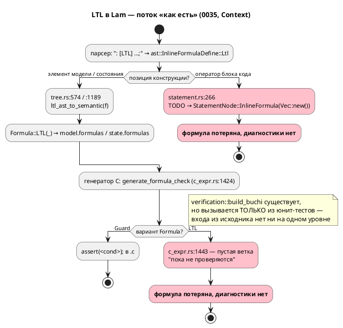
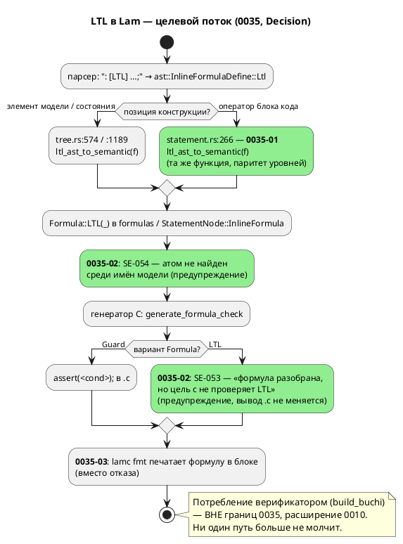

# Фича: LTL-формулы в блоках кода: разбор вместо тихой потери

- **Номер:** 0035
- **Статус:** **ГОТОВО**
- **Зависит от:** `0010`, `0024` (обе `ГОТОВО` → фича **не блокируется**, правило 19)
- **Связанные issue (анализ):** новая фича (из блока «Кандидаты в фичи» `FEATURES.md`)
- **Крейт:** `grammar` (версия языка **0.2.0, роста нет** — см. анализ, правило 22)
- **Приоритет:** средний (**Tier 2**). Класс дефекта — «тихая потеря без
  диагностики» (тот же, что устраняла 0025), но эксплуатационная острота низкая:
  LTL **не используется ни в одном `.lam`** репозитория (0 вхождений в
  `examples/` и `grammar/tests/data/`), и потребления LTL нет ни на одном уровне
  — значит сегодня на него никто не опирается. При этом ядро фичи дёшево
  (замена одной ветки `match` на уже существующую функцию + тест), снимает `TODO`
  из семантики и **разблокирует 0044**.

## Стадии жизненного цикла (правило 17)

Все стадии — **разделы этой карточки** (правило 32): «Архитектура (ADR)»,
«Анализ», «Разработка», «Тест-план», «Отчёт о тестировании», «Итог».
Отдельным артефактом остаются только исправления —
[`docs/fixes/`](../fixes/README.md) (при необходимости `0035-YY-*`).

## Краткое описание

Встроенная LTL-формула в **блоке кода** (`: [LTL] G (a -> F b);` внутри
`always`/`enter`/`exit`/тела `fn`) разбирается парсером, но семантика её **молча
выбрасывает**: `semantic/statement.rs:266` возвращает
`StatementNode::InlineFormula(Vec::new())` с комментарием `TODO`. Формула
исчезает без единой диагностики — тот же класс дефекта, что устраняла фича.
На уровнях **модели** и **состояния** та же конструкция разбирается корректно
(`semantic/tree.rs:574` и `:1189` через `formula::ltl_ast_to_semantic`) — то есть
блок остаётся единственной «дырой» в разборе, и лечится она переиспользованием
уже готовой функции.

Проба показала асимметрию в чистом виде: в модели
`start S { always { a := a + 1; : a = 0; : [LTL] G (a -> F a); } }` соседний
`: [Guard]` из того же блока доезжает до C и даёт `assert(model->a == 0);`, а LTL
не оставляет в выводе **ничего** — при коде возврата `0` и без предупреждений.

Фича делает три вещи: (1) разбирает LTL в блоке наравне с моделью и состоянием;
(2) вводит **явную диагностику** там, где потребления действительно нет —
`generate_formula_check` (`generator/c/c_expr.rs:1443`) гасит `Formula::LTL(_)`
пустой веткой на **всех** уровнях, поэтому «тихая потеря» шире, чем блок;
(3) закрывает сопутствующий отказ `lamc fmt` на блочных формулах. **Полное
потребление LTL верификатором** (`verification::buchi::build_buchi`) в границы
0035 **не входит** — обоснование в [ADR](0035-ltl-in-blocks.md#архитектура-adr), работа
выносится в расширение фичи.

> Фича зарегистрирована из блока «Кандидаты в фичи» `FEATURES.md`; далее проходит
> жизненный цикл по правилу 17.

## Архитектура (ADR)

- **Status:** Accepted
- **Date:** 2026-07-15
- **Authors:** Архитектор + Системный аналитик + Дизайнер языка
- **Related issues:** [Фича](0035-ltl-in-blocks.md); опирается на
  [фичу](0010-verification-ltl.md) (`ГОТОВО`); пересекается с
  [фичей](0044-sim-assert-invariant.md); наследует принцип
  «громкий отказ вместо тихого пропуска» из
  [ADR](0025-simulator-expression-eval.md#архитектура-adr) и
  [ADR](0024-lam-formatter.md#архитектура-adr)

### Context

Язык Lam допускает встроенную формулу `: [LTL] …;` в **трёх** синтаксических
позициях (все три уже есть в `grammar.lalrpop`):

| Позиция | Правило грамматики | Пример |
|---|---|---|
| Элемент модели | `grammar.lalrpop:47` (`ModelElement::InlineFormula`) | `: [LTL] G (a -> F b);` в теле модели |
| Элемент состояния | `grammar.lalrpop:80` (`StateElement::InlineFormula`) | `start S { : [LTL] F b; }` |
| **Оператор блока кода** | `grammar.lalrpop:733` (`Statement::InlineFormula`) | `always { : [LTL] G a; }` |

Синтаксис конструкции (правило 18, EBNF — фактический, вычитан из
`grammar.lalrpop:285-336`):

```ebnf
@startebnf
(* EBNF встроенной формулы языка Lam — как есть, grammar.lalrpop:285-336. *)
(* Заглавные X F G U R и true/false — терминалы; identifier — атом-идентификатор. *)
InlineFormulaDefine =
    ( ":" , Condition , { "," , Condition } , ";" )                (* краткий Guard *)
  | ( ":" , "[" , "Guard" , "]" , Condition , { "," , Condition } , ";" )
  | ( ":" , "[" , "LTL" , "]" , LtlExpr , { "," , LtlExpr } , ";" );

LtlExpr    = LtlImplies;
LtlImplies = LtlOr , [ "->" , LtlImplies ];                        (* правоассоц. *)
LtlOr      = LtlAnd , { "|" , LtlAnd };
LtlAnd     = LtlUntilRelease , { "&" , LtlUntilRelease };
LtlUntilRelease = LtlUnary , { ( "U" | "R" ) , LtlUnary };
LtlUnary   = ( "!" | "X" | "F" | "G" ) , LtlUnary | LtlPrimary;
LtlPrimary = "true" | "false" | identifier | ( "(" , LtlExpr , ")" );
@endebnf
```

Приоритеты (от сильного к слабому): `!`/`X`/`F`/`G` → `U`/`R` → `&` → `|` → `->`.
Атом — **голый идентификатор**: вызовы функций в атоме грамматикой **не
поддерживаются** (проверено пробой, см. ниже).

#### Проблема: где формула умирает

Разбор в семантику расходится по позициям. Для модели и состояния
`semantic/tree.rs` вызывает готовую тотальную функцию
`semantic/formula.rs::ltl_ast_to_semantic` и кладёт `Formula::LTL(_)` в
`model.formulas` / `state.formulas`. Для блока кода
`semantic/statement.rs:266-269` делает обратное:

```rust
ast::InlineFormulaDefine::Ltl { .. } => {
    // TODO: Реализовать поддержку LTL в блоках кода
    Ok(StatementNode::InlineFormula(Vec::new()))
}
```

Формула отбрасывается **молча**: без диагностики, без следа, с кодом возврата `0`.
Соседняя ветка `Guard` в том же `match` разбирается полноценно — асимметрия видна
в одном экране кода.

Однако проба (`start S { always { a := a + 1; : a = 0; : [LTL] G (a -> F a); } }`,
цель `c`) показала, что проблема **шире блока**:

```c
case P8_S: {
    model->a = model->a + 1;      // обычный оператор  — есть
    assert(model->a == 0);        // : [Guard] в блоке — есть
    /* : [LTL] G (a -> F a);      — НЕТ НИЧЕГО, без предупреждения */
```

Причина второго уровня — `generator/c/c_expr.rs:1443`:

```rust
Formula::LTL(_) => {
    // LTL-формулы в C-коде пока не проверяются
}
```

Эта пустая ветка гасит LTL на **всех трёх** уровнях, а не только в блоке. Проба с
формулой на уровне модели подтвердила: `: a = 0;` даёт `assert(model->a == 0);`,
а `: [LTL] G (a -> F b);` рядом — не даёт ничего. Иными словами, **починка одного
только `statement.rs` перенесла бы тихую потерю из семантики в кодогенератор**,
не устранив класс дефекта.

#### Что уже умеет верификатор (определяет цену Option A)

- `verification/ltl.rs` — тип `Ltl` и **отдельный строковый** парсер
  `parse_ltl(&str) -> Ltl` (рекурсивный спуск; **паникует** при ошибке).
- `verification/buchi.rs` — `build_buchi(&Ltl) -> BuchiAutomaton` (алгоритм GPVW).
- **Вход из исходника отсутствует.** `grep` по репозиторию: `build_buchi` и
  `parse_ltl` вызываются **только из юнит-тестов** (`buchi.rs`, mod `tests`) и
  `grammar/tests/ltl_tests.rs`. У `lamc` нет подкоманды `verify`; `lib.rs`
  экспортирует лишь `pub mod verification;` — публичной точки входа «модель +
  формула → вердикт» нет.
- Нет и **модели Крипке** (`ModelNode` → структура переходов), произведения
  автоматов и проверки пустоты — то есть отсутствует вся середина конвейера
  верификации.

Следствие: LTL из `.lam` **никогда** не достигает верификатора — ни из блока, ни
из модели, ни из состояния. `Formula::LTL` сегодня — терминальная свалка.

#### Сопутствующие факты (проверены пробами)

1. **Форматтер отказывает на блочных формулах.** `format/expr.rs:319`
   (`inline_formula`) печатает **обе** формы и вызывается из `format/mod.rs:354`
   (модель) и `:470` (состояние), но `Statement::InlineFormula` в `format/stmt.rs`
   **не покрыт**. `lamc fmt --stdin` на `always { : [LTL] G a; }` (и даже на
   `always { : a = 0; }`) выдаёт `печать узла '…' пока не поддерживается
   форматтером`. Здесь форматтер ведёт себя **правильно** (громкий отказ по
   замыслу 0024) — на его фоне молчание семантики особенно заметно.
2. **Корпус LTL не использует.** `grep -rn "LTL" examples/ grammar/tests/data/` —
   **0 вхождений**. Поэтому корпусный тест `format_tests.rs` дефект и не ловил, а
   риск регрессии примеров нулевой.
3. **Атомы LTL ни с чем не связываются.** `ltl_ast_to_semantic` отображает
   `Atom(id) → Ltl::Atom(id.name)` — голая строка. Проба
   `: [LTL] G(active -> F done), X next_state;` компилируется успешно, хотя ни
   `active`, ни `done`, ни `next_state` в модели **не объявлены**. Опечатка в
   формуле проходит молча.
4. **Пример LTL в `README.md:1054` не разбирается.** Дословный
   `: [LTL] G(active() -> F done()), X next_state ;` даёт
   `Ошибка компиляции: нераспознанный токен '(', ожидалось ")", "|", "&", "->", "U", "R"`
   — грамматика не допускает вызов функции в атоме. Документация описывает
   несуществующий синтаксис (правило 15).

#### Поток «как есть»



### Decision Drivers

1. **Тихая потеря недопустима (принцип проекта).** ADR и 0024 закрепили:
   молча потерять кусок спецификации хуже, чем громко отказать. `Vec::new()` с
   `TODO` — прямое нарушение этого принципа в семантике.
2. **Стоимость против ценности.** Разбор в блоке стоит одну строку
   (`ltl_ast_to_semantic` уже написана и тотальна по `LtlExpr`); полноценная
   верификация — отдельный крупный конвейер (модель Крипке, произведение,
   проверка пустоты, CLI). Смешивать их в одной фиче нельзя (правило 2).
3. **Класс дефекта, а не одна точка.** Починка `statement.rs` без диагностики в
   `generate_formula_check` лишь передвинет молчание на уровень ниже. Критерий
   успеха — чтобы **ни один** путь LTL не заканчивался тишиной.
4. **Обратная совместимость (правило 11).** Синтаксис уже принимается; корпус LTL
   не использует. Решение обязано остаться аддитивным и не тронуть байты вывода
   цели `c` для существующих примеров.
5. **Симметрия уровней.** Одна и та же конструкция не должна вести себя
   по-разному в зависимости от позиции — это ловушка для пользователя и источник
   будущих багов.
6. **Разблокировка соседей.** Фича (assert/invariant для симуляции)
   упирается в тот же `StatementNode::InlineFormula` в блоке.

### Considered Options

#### Option A. Реализовать разбор **и потребление** LTL, связав с верификатором 0010

Разобрать формулу в блоке и довести её до `build_buchi`: построить модель Крипке
из `ModelNode`, произведение с автоматом Бюхи, проверку пустоты, подкоманду
`lamc verify` и формат вердикта/контрпримера.

**Pros:**
- Даёт **настоящую** заявленную возможность: LTL начинает работать, а не храниться.
- Оправдывает существование `verification/` в продуктовом контуре (сейчас модуль
  живёт только ради собственных юнит-тестов).
- Снимает вопрос «зачем разбирать то, что никто не читает».

**Cons:**
- **Объём несоразмерен фиче.** Отсутствует вся середина конвейера: модели Крипке
  нет, произведения нет, проверки пустоты нет, CLI-входа нет. Это не «доделка
  блока», а новая крупная фича уровня 0025.
- Требует языковых решений, которых **ещё нет**: что такое атом LTL (переменная?
  состояние? `cond`?), как связывать имена, каков алфавит пропозиций. Без этого
  разбор в блоке всё равно останется несвязанным (факт 3 выше).
- `parse_ltl` **паникует** на ошибке — для продуктового пути его пришлось бы
  переписать на диагностики.
- Не устраняет дефект **сейчас**: до конца работ `Vec::new()` продолжает молча
  терять формулы.
- Смешивает исправление дефекта с новой возможностью → нарушает правило 2.

#### Option B. Явная диагностика «LTL в блоке не поддерживается» вместо `Vec::new()`

Оставить `Formula::LTL` неразобранной в блоке, но выдавать явную ошибку или
предупреждение вместо тихого отбрасывания.

**Pros:**
- **Дёшево и немедленно** устраняет класс дефекта: пользователь узнаёт, что его
  спецификация не учтена.
- Соответствует принципу «громкий отказ» (0024/0025) и поведению форматтера.
- Нулевой риск для корпуса (LTL в нём нет).

**Cons:**
- В формулировке «в **блоке** не поддерживается» — **неправда и асимметрия**:
  на уровне модели и состояния конструкция разбирается, и пользователь резонно
  спросит, чем блок хуже. Диагностика зафиксировала бы случайную дыру как
  «фичу языка».
- Не устраняет главную тишину — пустую ветку `Formula::LTL(_)` в
  `generate_formula_check`, из-за которой молчат **все три** уровня. Дефект
  остался бы жив на двух из трёх путей.
- Отказ там, где починка стоит одну строку и функция уже написана, — это
  консервация `TODO`, а не решение.

#### Option C. Убрать конструкцию `: [LTL] …;` из грамматики

**Pros:**
- Радикально: нет конструкции — нет тихой потери.
- Минус один неиспользуемый путь в грамматике, семантике и форматтере.

**Cons:**
- **Слом обратной совместимости** (правило 11) ради устранения `TODO` — цена
  несоразмерна.
- Конструкция **документирована** (`README.md:194`, `:1051-1054`) и закреплена
  тестом `grammar/tests/ltl_tests.rs`; она — часть заявленного результата
  закрытой фичи.
- Удаление потребовало бы роста версии языка (правило 22) и обесценило бы уже
  работающие уровни модели/состояния и печать в форматтере.
- Противоречит цели проекта (правило 12): формальная спецификация свойств —
  профильная функциональность для промышленных систем управления, а не balласт.

### Decision

Принимается **комбинация: Option A в части разбора + Option B в части
диагностики, с этапностью.** Полное потребление (Option A целиком) выносится **за
границы 0035** в расширение фичи. Option C отвергается.

Обоснование. Ни один вариант в чистом виде не подходит: A целиком несоразмерен
фиче и упирается в неготовые языковые решения; B в предложенной формулировке
закрепил бы случайную асимметрию как правило языка и оставил бы тишину на двух
уровнях из трёх; C ломает совместимость ради `TODO`. Пробы показали, что дефект
имеет **две** точки, и лечить надо обе, но разными средствами:

1. **Там, где потребитель есть, — разбирать** (берём от A). В блоке недостающего
   ничего нет: `ltl_ast_to_semantic` тотальна по `LtlExpr` и уже вызывается из
   `tree.rs` дважды. `Vec::new()` заменяется на неё → блок приходит к паритету с
   моделью и состоянием. Это не новая возможность, а **устранение дыры**.
2. **Там, где потребителя нет, — говорить об этом вслух** (берём от B, но в
   правильной точке). Диагностика ставится не в `statement.rs` («в блоке нельзя»),
   а в `generate_formula_check` («цель `c` не проверяет LTL») — и потому
   покрывает **все три** уровня одинаково. Формулировка честная: формула принята
   и разобрана, но данная цель её не проверяет.
3. **Полная верификация — отдельная фича.** Требует модели Крипке, произведения,
   проверки пустоты, `lamc verify` и языкового решения об атомах. Регистрируется
   как кандидат «LTL-верификация моделей: вход `lamc verify` (расширение 0010)».

Дополнительно в границы 0035 включается печать `Statement::InlineFormula` в
форматтере: 0035 делает блочную формулу осмысленной, и оставить `lamc fmt`
падающим на ней нельзя (правило «добавляешь узел — добавь печать», `CLAUDE.md`).

#### Целевой поток



### Consequences

#### Положительные

- Класс дефекта «тихая потеря LTL» устранён **целиком**, а не в одной точке:
  каждый путь заканчивается либо разбором, либо явной диагностикой.
- Устранена асимметрия: конструкция ведёт себя одинаково во всех трёх позициях.
- `TODO` из `semantic/statement.rs` снят; ветка-заглушка в `c_expr.rs:1443`
  превращена из немой в говорящую.
- `lamc fmt` перестаёт отказывать на блочных формулах (в т.ч. на `: [Guard]`,
  который сегодня тоже роняет форматтер).
- Фича разблокирована: `StatementNode::InlineFormula` в блоке становится
  непустым и пригодным для потребления симулятором.
- Ошибочный атом в формуле (`F undefined_thing`) перестаёт проходить молча.

#### Отрицательные / Action items

- **LTL по-прежнему не верифицируется.** 0035 честно сообщает об этом
  предупреждением, но возможности не даёт. Action: зарегистрировать кандидата
  «LTL-верификация моделей: вход `lamc verify` (расширение 0010)» — вне границ
  0035, вносит координатор (правило 7).
- **Новое предупреждение SE-053 на каждой LTL-формуле** может восприниматься как
  шум. Смягчение: в корпусе LTL нет (0 вхождений) → сегодня шума не будет; текст
  диагностики указывает, что формула принята и сохранена.
- **`README.md:1054` документирует неразбираемый пример** (`active()` в атоме).
  Action: исправить в 0035-04 (правила 15, 16) — пример заменяется на
  проверенный. Правку README вносит разработчик на стадии 4.
- **Атомы LTL остаются несвязанными** (`Ltl::Atom(String)`); SE-054 — лишь
  проверка имени, а не связывание. Полноценная семантика атома — вопрос
  расширения 0010.
- Обнаружены **смежные дефекты вне границ 0035**, требующие отдельных кандидатов:
  (1) тело `always` на уровне **модели** (вне состояния) целиком не эмитится в C —
  проба `always { a := 1; }` не дала в `tick` ничего; (2) `semantic/unused.rs` не
  обходит `formulas` вовсе → переменная, используемая только в формуле, считается
  неиспользуемой; (3) `lamc` не печатает предупреждения `unused_variable_warnings`
  / `nondeterministic_transition_warnings` вообще.

#### Acceptance criteria

1. `: [LTL] …;` в блоке кода даёт **непустой** `StatementNode::InlineFormula`,
   содержащий `Formula::LTL` по одному на формулу; тест падает при возврате
   `Vec::new()`.
2. Разбор в блоке даёт `Ltl`, **структурно равный** разбору той же формулы на
   уровне модели (паритет уровней).
3. Компиляция модели с LTL в цель `c` выдаёт предупреждение **SE-053**; байты
   `.c`/`.h` для моделей **без** LTL не меняются (сверка с эталоном).
4. Неизвестный атом в формуле даёт предупреждение **SE-054**; известный — не даёт.
5. `lamc fmt --check` проходит на фикстуре с `: [LTL] …;` и `: [Guard] …;` внутри
   блока; идемпотентность печати подтверждена.
6. `TODO`-комментарий и `Vec::new()` отсутствуют в `semantic/statement.rs`
   (проверяется `grep`).
7. Версия языка остаётся **0.2.0** (правило 22): синтаксис не изменён; изменение
   касается неспецифицированного поведения и диагностик — прецедент ADR.
8. `./scripts/precheck.sh` зелёный; `cargo test -- --test-threads=1` без регрессий.

## Анализ

### Цель и контекст

Устранить **тихую потерю** LTL-формул языка Lam. Конструкция `: [LTL] …;`
допускается грамматикой в трёх позициях (элемент модели, элемент состояния,
оператор блока кода), но в блоке семантика её выбрасывает:
`grammar/src/semantic/statement.rs:266-269` возвращает
`StatementNode::InlineFormula(Vec::new())` с комментарием `TODO`. Диагностики
нет, код возврата `0`.

Проверка кода и пробы (см. ниже) показали, что дефект **шире**, чем формулировка
кандидата: помимо блока молчит `generate_formula_check`
(`generator/c/c_expr.rs:1443`, пустая ветка `Formula::LTL(_)`), из-за чего LTL не
доезжает до вывода **ни с одного** из трёх уровней. Поэтому
[ADR](0035-ltl-in-blocks.md#архитектура-adr) принял комбинацию: **разбор** там, где
потребитель есть (блок → паритет с моделью/состоянием, переиспользование готовой
`ltl_ast_to_semantic`), и **явная диагностика** там, где потребителя нет
(генератор C). Полное потребление верификатором — **вне границ 0035**.

#### Установленные факты (перепроверены в коде и пробами)

| # | Факт | Подтверждение |
|---|---|---|
| Ф1 | Синтаксис: `: [LTL] <формула>{, <формула>};`; приоритеты `!`/`X`/`F`/`G` → `U`/`R` → `&` → `|` → `->`; атом — голый `identifier`, а также `true`/`false`/скобки | `grammar.lalrpop:285-336` |
| Ф2 | Блок теряет формулу молча | `semantic/statement.rs:266`, проба |
| Ф3 | Модель и состояние разбирают её корректно | `semantic/tree.rs:574`, `:1189` |
| Ф4 | `ltl_ast_to_semantic` существует и **тотальна** по `LtlExpr` | `semantic/formula.rs:50-80` |
| Ф5 | `resolve_formulas` пропускает LTL тождественно | `semantic/tree.rs:786-787`, `:897` |
| Ф6 | Генератор C гасит LTL пустой веткой на всех уровнях | `generator/c/c_expr.rs:1443` |
| Ф7 | Единственный потребитель `formulas` — генератор C (`c_model.rs:547`, `:666`, `c_expr.rs:1693`), всё под `guard_enable` | `grep` |
| Ф8 | Симулятор формулы игнорирует | `simulation/src/unit/statement.rs:137`, `:236` |
| Ф9 | `build_buchi`/`parse_ltl` вызываются **только из тестов**; у `lamc` нет `verify`; входа из исходника нет | `grep` по `grammar/src`, `bin/lamc.rs`, `lib.rs` |
| Ф10 | Атомы LTL не связываются с моделью (`Ltl::Atom(String)`); неизвестный атом проходит молча | `formula.rs:54`, проба `: [LTL] G(active -> F done), X next_state;` → успех |
| Ф11 | `Statement::InlineFormula` не покрыт форматтером → `lamc fmt` **отказывает** (и на `[LTL]`, и на `[Guard]` в блоке) | `format/stmt.rs` (нет ветки), проба |
| Ф12 | LTL не встречается в корпусе: 0 вхождений | `grep -rn "LTL" examples/ grammar/tests/data/` |
| Ф13 | Пример LTL в `README.md:1054` **не разбирается** (`active()` — вызов в атоме) | проба → `нераспознанный токен '('` |

**Ключевая проба (асимметрия в чистом виде).** Модель
`start S { always { a := a + 1; : a = 0; : [LTL] G (a -> F a); } ref Done: a = 3; }`,
цель `c`, код возврата `0`, предупреждений нет:

```c
case P8_S: {
    model->a = model->a + 1;   // обычный оператор  — есть
    assert(model->a == 0);     // : [Guard] в блоке — есть
    /* : [LTL] … — в выводе ОТСУТСТВУЕТ, молча */
```

То есть блочный путь `StatementNode::InlineFormula` **работает** (Guard это
доказывает) — ломается ровно на `Vec::new()`.

### Зависимости фичи (правило 17/19)

- **Зависит от:** `0010`, `0024`.

  - **0010 «Верификация свойств (LTL/Бюхи)» — статус `ГОТОВО`**
    (`docs/features/README.md:21`, карточка `0010-verification-ltl.md`).
    Обоснование: 0035 **переиспользует** её результат — тип
    `verification::ltl::Ltl`, `semantic::Formula::LTL`, АСД-узлы
    `InlineFormulaDefine`/`LtlExpr` и функцию `formula::ltl_ast_to_semantic`.
    Без 0010 разбирать было бы нечем и не во что. Зависимость **закрыта → не
    блокирует** (правило 19).
  - **0024 «Канонический форматтер .lam» — статус `ГОТОВО`**
    (`docs/features/README.md:35`). Обоснование: подзадача добавляет
    печать `Statement::InlineFormula` в `format/stmt.rs` и опирается на контракт
    0024 («добавляешь узел АСД — добавь его печать») и на корпусный тест
    `format_tests.rs`. Зависимость **закрыта → не блокирует**.

  Зависимости от **0044 нет** (см. ниже). Итог: фича **не `ЗАБЛОКИРОВАНА`**,
  может быть взята в работу немедленно.

- **Пересечение с фичей «Юнит-конструкции языка для симуляции
  (assert/invariant)» (статус `СОЗДАНА`).** Точка пересечения — **тот же узел**
  `StatementNode::InlineFormula` в блоке кода:
  - 0035 делает этот узел **непустым** для LTL (сегодня `Vec::new()`);
  - 0044 нуждается в **потребителе** этого узла в симуляторе — сейчас
    `simulation/src/unit/statement.rs:137` и `:236` игнорируют
    `StatementNode::InlineFormula` полностью (Ф8).

  **Направление зависимости: 0044 → 0035, но не наоборот.** 0035 ограничена
  крейтом `grammar` (семантика + генератор C + форматтер) и в симулятор не
  заходит; ей от 0044 не нужно ничего. Обратное — зависит от языкового решения:
  - если 0044 выражает `invariant` через **существующий** механизм
    `: [Guard]`/`: [LTL]` — она **обязана** зависеть от 0035, иначе построит
    потребление поверх узла, который для LTL приходит пустым;
  - если 0044 вводит **собственные** ключевые слова (`assert`/`invariant`) — она
    от 0035 не зависит, но обе фичи всё равно будут потреблять формулы в блоке, и
    расхождение механизмов нужно снять на стадии архитектуры 0044.

  **Рекомендация аналитика (правило 19, критерий «необходимость»):** ставить
  **0035 перед 0044**. 0035 дешевле, уже проработана до `РАЗРАБОТКА`, снимает
  `TODO` и приводит узел в рабочее состояние; 0044 после неё получает
  непротиворечивую основу. Решение согласовать с аналитиком 0044 — параметр
  «Зависит от» в карточке 0044 проставляет он (правило 17), настоящий документ
  фиксирует лишь установленное пересечение.

- **Влияние на порядок разработки:** 0035 никем не блокируется и **разблокирует
  0044** (при варианте «через существующий механизм»). Завершение 0035 не
  разблокирует полную верификацию — та требует отдельной фичи (расширение 0010).

- **Порождённые кандидаты (вне границ 0035; регистрирует координатор, правило 7):**
  1. **LTL-верификация моделей: вход `lamc verify` (расширение 0010)** — модель
     Крипке из `ModelNode`, произведение с автоматом Бюхи, проверка пустоты,
     контрпример, CLI. Без неё LTL остаётся аннотацией (Ф9).
  2. **Тело `always` на уровне модели не эмитится в C** — проба
     `always { a := 1; }` вне состояния: в `tick` не попало ничего (тот же класс
     «тихого пропуска»).
  3. **`semantic/unused.rs` не обходит `formulas`** — переменная, используемая
     только в формуле, будет сочтена неиспользуемой (ложный SE-036).
  4. **`lamc` не печатает предупреждения** `unused_variable_warnings` /
     `nondeterministic_transition_warnings` — они недоступны пользователю CLI.
  5. **`README.md:1054` документирует неразбираемый пример** (Ф13) — правится в
     границах 0035-04 (правила 15, 16).

### Требования и проверяемые условия

- **R1. Разбор LTL в блоке.** `: [LTL] φ1, …, φn;` в блоке кода даёт
  `StatementNode::InlineFormula` c ровно `n` элементами `Formula::LTL`. Ветка
  `Vec::new()` и `TODO` из `semantic/statement.rs` удалены.
- **R2. Паритет уровней.** Для одной и той же формулы `Ltl`, полученный в блоке,
  **структурно равен** `Ltl`, полученному на уровне модели и состояния
  (`Ltl: PartialEq`). Реализуется вызовом той же `ltl_ast_to_semantic` — новой
  логики преобразования не вводится.
- **R3. Ни один путь LTL не молчит.** Там, где формула не потребляется, выдаётся
  явная диагностика. Для цели `c`/`c-hal` — предупреждение **SE-053**
  «LTL-формула разобрана и сохранена, но цель `c` не проверяет LTL» из
  `generate_formula_check`; едино для уровней модели, состояния и блока.
- **R4. Диагностика неизвестного атома.** Атом LTL, не совпадающий ни с одним
  именем модели (переменная/порт/константа, состояние, `cond`), даёт
  предупреждение **SE-054**. Это **проверка имени, а не связывание**: семантика
  атома не вводится (остаётся вопросом расширения 0010). Атом-литерал
  `true`/`false` не проверяется.
- **R5. Форматируемость.** `lamc fmt` печатает `Statement::InlineFormula` (обе
  формы — `[LTL]` и `[Guard]`) вместо отказа; печать идемпотентна и
  синонимы не канонизируются (сохраняется `explicit` для `Guard` — контракт 0024).
- **R6. Неизменность вывода C.** Для моделей **без** LTL байты `.c`/`.h` целей `c`
  и `c-hal` не меняются. Для моделей с LTL вывод также не меняется (SE-053 —
  предупреждение, не эмиссия): 0035 **не добавляет** проверок в C.
- **R7. Версия языка не растёт (правило 22).** Синтаксис `grammar.lalrpop` не
  изменяется ни на йоту; изменяется обработка уже принимаемой конструкции.
  Прецедент — ADR («исправление неспецифицированного поведения; версия языка
  не растёт»). Версия остаётся **0.2.0** (`README.md:1007`). Если будущее
  расширение 0010 сделает LTL семантически нагруженным (реальная верификация) —
  рост версии решается там.
- **R8. Примеры и контрпримеры (правило 16).** Сформированы валидные и невалидные
  фикстуры; после реализации проверенные примеры попадают в документацию языка, а
  неразбираемый пример `README.md:1054` заменяется на реальный (Ф13).
- **R9. Отсутствие регрессий.** `./scripts/precheck.sh` зелёный;
  `cargo test -- --test-threads=1` и `cargo test --features lsp -- --test-threads=1`
  без падений; `lamc fmt --check examples/` проходит.

### Критерии приёмки и способ проверки

| # | Критерий | Способ проверки |
|---|---|---|
| A1 | LTL в блоке даёт непустой `StatementNode::InlineFormula` из `n` формул | Тест `semantic_tests.rs::test_inline_formula_ltl_in_block_resolved` — `construct_model` + `assert_eq!(formulas.len(), n)`; **падает при возврате `Vec::new()`** |
| A2 | Паритет уровней: `Ltl` из блока `==` `Ltl` из модели и состояния | Тест сравнивает три `Formula::LTL` для одной формулы через `PartialEq` |
| A3 | `TODO` и `Vec::new()` отсутствуют в ветке `Ltl` | `grep -n "TODO: Реализовать поддержку LTL" grammar/src/semantic/statement.rs` → пусто |
| A4 | Компиляция модели с LTL в `c` даёт SE-053 (по одному на формулу, с корректной позицией) | Тест генератора: сбор диагностик, сверка кода и `Location`; зонд для захвата реального текста (`CLAUDE.md`) |
| A5 | Неизвестный атом даёт SE-054; известный атом и `true`/`false` — не дают | Пара тестов: контрпример `F undefined_thing` → SE-054; пример `F b` при `var b` → нет SE-054 |
| A6 | `lamc fmt --check` проходит на фикстуре с `[LTL]` и `[Guard]` в блоке; печать идемпотентна | `format_tests.rs` (корпусный прогон) + тест идемпотентности `format(format(x)) == format(x)` |
| A7 | Вывод `.c`/`.h` для моделей без LTL байт-в-байт прежний | Сверка с эталонами codegen; `./scripts/precheck.sh` (сборка `examples/`) |
| A8 | Версия языка `0.2.0` не изменена; `grammar.lalrpop` не тронут | `git diff --stat grammar/src/grammar.lalrpop` → пусто; `grep "Версия языка" README.md` |
| A9 | Примеры/контрпримеры заведены; `README.md` содержит **проверенный** LTL-пример | Фикстуры `tests/data/semantic/{valid,invalid}/`; компиляция примера из README пробой |
| A10 | Регрессий нет | `./scripts/precheck.sh`; `cargo test -- --test-threads=1`; `cargo test --features lsp -- --test-threads=1` |

### Особенности по обратной функциональности

**Обратная совместимость сохраняется полностью (правило 11); обоснование слома не
требуется.**

| Затрагиваемая функциональность | Влияние | Обоснование |
|---|---|---|
| Синтаксис `.lam` | **нет** | `grammar.lalrpop` не изменяется; множество принимаемых программ то же |
| Версия языка | **нет** (0.2.0) | Правило 22 неприменимо: синтаксис не менялся; правится неспецифицированное поведение (прецедент ADR) |
| Существующие `.lam` (корпус) | **нет** | LTL в корпусе — 0 вхождений (Ф12); ни один пример не содержит блочных формул |
| Вывод целей `c` / `c-hal` | **нет** | 0035 не эмитит проверок; ветка `Formula::LTL` остаётся без эмиссии, добавляется лишь предупреждение (R6) |
| Диагностики | **аддитивно** | Два новых **предупреждения** (SE-053, SE-054). Ошибок не добавляется → ранее компилировавшееся компилируется |
| `lamc fmt` | **аддитивно, в сторону расширения** | Множество форматируемых файлов **растёт**: файлы с формулами в блоке раньше отвергались, теперь печатаются. Ранее форматируемые файлы печатаются байт-в-байт так же |
| Публичный API `grammar` | **нет** | Сигнатуры `parse`/`compile_to_c`/… не меняются; `StatementNode::InlineFormula(Vec<Formula>)` — тип прежний, меняется лишь наполнение |
| Симулятор (`simulation`) | **не затрагивается** | Игнорирует `InlineFormula` до и после (Ф8); потребление — предмет 0044 |
| LSP | **не затрагивается** | `lsp.rs:1400` игнорирует `InlineFormula`; поведение прежнее |
| `parse_ltl` (строковый парсер) | **не затрагивается** | Продуктовый путь идёт через `ltl_ast_to_semantic`; `parse_ltl` остаётся тестовым (его паника — предмет расширения 0010) |

**Строка для реестра `docs/features/README.md`:**

> `| 0035 | LTL-формулы в блоках кода: разбор вместо тихой потери | [0035-ltl-in-blocks.md](0035-ltl-in-blocks.md#анализ) | нет (аддитивно: грамматика и версия языка 0.2.0 не тронуты, вывод C неизменен, корпус LTL не использует; добавлены предупреждения SE-053/SE-054, `lamc fmt` перестаёт отказывать на формулах в блоке) |`

### Риски и зависимости

- **Р1. Починка блока переносит тишину в кодогенератор.** Главный риск: если
  сделать только R1/R2, формула перестанет теряться в семантике, но будет так же
  молча гаснуть в `c_expr.rs:1443`. *Снижение:* R3 (SE-053) **обязателен** и
  входит в границы фичи; подзадача не может быть отброшена как
  «необязательная».
- **Р2. Соблазн расползания в верификацию.** `build_buchi` рядом и выглядит
  «почти готовым», но середины конвейера нет (Ф9). *Снижение:* граница
  зафиксирована в ADR; работа вынесена в кандидата-расширение 0010.
- **Р3. Шум от SE-053.** Предупреждение на каждой формуле. *Снижение:* корпус LTL
  не использует (Ф12) → сегодня шума нет; текст сообщает, что формула **принята и
  сохранена**, а не отвергнута.
- **Р4. Ложные срабатывания SE-054.** Пространство имён атома не определено
  (Ф10) — атом может обозначать переменную, состояние или `cond`. *Снижение:*
  проверка ведётся против **объединения** трёх пространств имён и выдаёт
  **предупреждение**, а не ошибку; при сомнении подзадача может быть
  сокращена до одного SE-053 без ущерба для цели фичи.
- **Р5. Регрессия форматтера.** Печать нового узла может сломать идемпотентность
  или потерять синоним `[Guard]`/краткой формы. *Снижение:* переиспользуется
  готовая `format/expr.rs::inline_formula` (она уже печатает обе формы и хранит
  `explicit`); тест идемпотентности + корпусный `format_tests.rs`.
- **Р6. Тесты «на факт разбора» вместо «на значение».** Урок: восемь
  дефектов при зелёных тестах. Здесь ровно тот же капкан —
  `ltl_tests.rs::test_parse_ltl_formula` проверяет **АСД** и потому не падает.
  *Снижение:* тесты обязаны идти через `construct_model` и утверждать **состав**
  `Formula::LTL`, а не факт наличия узла (см. тест-план).
- **Р7. Зависимость 0044.** Если 0044 стартует раньше 0035, она построит
  потребление поверх узла, приходящего пустым для LTL. *Снижение:* рекомендация
  порядка 0035 → 0044, согласовать с аналитиком 0044.

### Подзадачи (декомпозиция разработки, правило 2)

| Задача | Заголовок | Покрывает | Документ |
|---|---|---|---|
| **0035-01** | Разбор LTL-формул в блоках кода (устранение тихой потери) | R1, R2 | [0035-ltl-in-blocks.md#разработка](0035-ltl-in-blocks.md#разработка) |
| **0035-02** | Явные диагностики SE-053/SE-054 вместо немых веток | R3, R4 | [0035-ltl-in-blocks.md#разработка](0035-ltl-in-blocks.md#разработка) |
| **0035-03** | Форматтер: печать встроенной формулы в блоке кода | R5 | [0035-ltl-in-blocks.md#разработка](0035-ltl-in-blocks.md#разработка) |
| **0035-04** | Примеры, контрпримеры, фикстуры и синхронизация README | R8, R9 | [0035-ltl-in-blocks.md#разработка](0035-ltl-in-blocks.md#разработка) |

Порядок: 0035-01 → 0035-02 → 0035-03 → 0035-04. Объём аналитики умеренный —
декомпозиция самой аналитики на `0035-YY-*.md` не требуется (правило 17).

## Разработка

### Задача

> **Выполнено** (2026-07-16).
> план, а не отчёт. Покрывает **R1, R2**; критерии **A1, A2, A3**.

#### Что было

**Реальное состояние кода на 2026-07-15 (ветка `v2`, коммит `6984471`).**

Семантика встроенной формулы расходится по позициям конструкции.

**Модель** (`grammar/src/semantic/tree.rs:574-580`) — разбирает:

```rust
ast::InlineFormulaDefine::Ltl { formulas, .. } => {
    for f in formulas {
        model_node.borrow_mut().formulas
            .push(Formula::LTL(formula::ltl_ast_to_semantic(f)));
    }
}
```

**Состояние** (`grammar/src/semantic/tree.rs:1189-1192`) — разбирает тем же
способом (`state_formulas.push(Formula::LTL(formula::ltl_ast_to_semantic(f)))`).

**Блок кода** (`grammar/src/semantic/statement.rs:256-270`) — **теряет**:

```rust
ast::Statement::InlineFormula(inline) => {
    match &**inline {
        ast::InlineFormulaDefine::Guard { conditions, .. } => {
            let resolved: Vec<Formula> = conditions
                .iter()
                .filter_map(|c| resolve_condition(c, model.clone()).ok())
                .map(|cn| crate::semantic::formula::condition_to_formula(&cn))
                .collect();
            Ok(StatementNode::InlineFormula(resolved))   // ← Guard работает
        }
        ast::InlineFormulaDefine::Ltl { .. } => {
            // TODO: Реализовать поддержку LTL в блоках кода
            Ok(StatementNode::InlineFormula(Vec::new()))  // ← формула исчезает
        }
    }
}
```

Формула отбрасывается молча: без диагностики, с кодом возврата `0`.

**Что уже готово и переиспользуется (делает задачу дешёвой):**

- `grammar/src/semantic/formula.rs:50-80` — `ltl_ast_to_semantic(&LtlExpr) -> Ltl`
  **тотальна** по всем вариантам `LtlExpr` (`True`, `False`, `Atom`, `Not`,
  `Next`, `Finally`, `Globally`, `And`, `Or`, `Until`, `Release`, `Implies`,
  `Parenthesis`). Дописывать преобразование не нужно.
- Приёмник `StatementNode::InlineFormula(Vec<Formula>)`
  (`grammar/src/semantic/mod.rs:783`) — тип уже подходящий, менять не требуется.
- Путь потребления в блоке **исправен**: `generator/c/c_expr.rs:1693-1699`
  обходит вектор и зовёт `generate_formula_check`.
- `resolve_formulas` (`tree.rs:786-787`, `:897`) пропускает `Formula::LTL(ltl)`
  тождественно — повторное разрешение не потребуется.

**Проба, зафиксировавшая дефект** (модель
`start S { always { a := a + 1; : a = 0; : [LTL] G (a -> F a); } ref Done: a = 3; }`,
`lamc compile -t c`, код возврата `0`, предупреждений нет):

```c
case P8_S: {
    model->a = model->a + 1;   // обычный оператор  — есть
    assert(model->a == 0);     // : [Guard] в блоке — есть
    /* : [LTL] G (a -> F a);   — в выводе ОТСУТСТВУЕТ, молча */
```

Соседний `Guard` из того же блока доезжает до C — значит блочный путь рабочий, и
ломается всё ровно на `Vec::new()`.

**Почему дефект дожил до 0035 (слепое пятно тестов).**
`grammar/tests/ltl_tests.rs::test_parse_ltl_formula` берёт именно сломанный
случай (`always { :[LTL] X a; … }`), но останавливается на `parse` и утверждает
только форму **АСД** — `construct_model` не вызывает.
`semantic_tests.rs::test_inline_formula_model_resolved` / `…_state_resolved`
доходят до семантики, но проверяют **`Guard`** и уровни модели/состояния. Пара
«блок × LTL после семантики» не покрыта ничем.

#### Что сделано

> **Планируется (разработка не начата).**

**Суть.** Ветка `Ltl` в `semantic/statement.rs` приводится к паритету с
`tree.rs`: `Vec::new()` и `TODO` заменяются на вызов уже существующей
`formula::ltl_ast_to_semantic` — той же функции, что используют уровни модели и
состояния. Новой логики преобразования **не вводится** (это гарантия R2:
паритет обеспечивается общим кодом, а не параллельной реализацией).

Планируемая правка (`grammar/src/semantic/statement.rs:266-269`):

```rust
ast::InlineFormulaDefine::Ltl { formulas, .. } => {
    let resolved: Vec<Formula> = formulas
        .iter()
        .map(|f| Formula::LTL(crate::semantic::formula::ltl_ast_to_semantic(f)))
        .collect();
    Ok(StatementNode::InlineFormula(resolved))
}
```

Замечания к реализации:
- Порядок формул в списке `: [LTL] φ1, φ2;` **сохраняется** (T3).
- `filter_map(...ok())`, как в ветке `Guard`, здесь **неуместен**:
  `ltl_ast_to_semantic` инфаллибельна (возвращает `Ltl`, не `Result`), поэтому
  тихого пропуска в новом коде не появляется — это соответствует цели фичи.
- Импорт `formula` при необходимости поднимается в `use` в шапке модуля
  (`docs/CODE.md`).
- `TODO`-комментарий удаляется полностью (A3).

**Статус по функциональности (правило 11):**

| Функциональность | Работа | Обоснование |
|---|---|---|
| Семантика (`grammar`) | **да** | Ветка `Ltl` в `statement.rs` |
| Грамматика `.lam` | **н/п** | Синтаксис не меняется; `grammar.lalrpop` не трогается (R7, A8) |
| Версия языка | **н/п** | Роста нет — 0.2.0 (правило 22; прецедент ADR) |
| Генератор C | **н/п** в этой задаче | Ветка `Formula::LTL(_)` остаётся немой; диагностика — задача |
| Форматтер | **н/п** в этой задаче | Печать `Statement::InlineFormula` — задача |
| Симулятор (`simulation`) | **н/п** | Игнорирует `InlineFormula` до и после; потребление — предмет фичи |
| LSP | **н/п** | `lsp.rs:1400` игнорирует `InlineFormula`; поведение прежнее |
| Верификатор | **н/п** | Потребление вне границ 0035 (расширение 0010) |

**Тесты (пишутся в этой же задаче), `grammar/tests/semantic_tests.rs`:**

1. `test_inline_formula_ltl_in_block_resolved` — **контроль против тихой потери**
   (T1/A1). `construct_model` на
   `var a: bit := 0; var b: bit := 0; start S { always { : [LTL] G a, F b, a U b; } }`,
   достаёт узел блока, требует `formulas.len() == 3` и все три —
   `Formula::LTL`. **При возврате `Vec::new()` падает (`0 != 3`)** — именно этого
   теста сегодня нет.
2. `test_inline_formula_ltl_levels_parity` — паритет (T2/A2): `Ltl` из блока,
   модели и состояния для `G (a -> F b)` попарно равны через `PartialEq`.
3. `test_inline_formula_ltl_operators` — полнота узлов и приоритетов (T4).
4. `test_inline_formula_ltl_order` — порядок формул в списке (T3).
5. `test_inline_formula_guard_in_block_unchanged` — регрессия `Guard` (T5).
6. `test_inline_formula_mixed_block` — смешанный блок (T6).

Методика (`CLAUDE.md`): **сперва зонд** для захвата реальной структуры `Ltl`,
затем assertions против захваченных значений — строки и деревья не угадывать.
Утверждаются **значения** (состав `Vec<Formula>`, форма `Ltl`), а не факт
наличия узла АСД: тест «на факт» и есть причина, по которой дефект дожил.

#### Проверки

> **Планируется (разработка не начата).** Ожидаемые результаты — из тест-плана.

```sh
cargo build --bin lamc
cargo test test_inline_formula -- --test-threads=1     # T1–T6 зелёные
cargo test -- --test-threads=1                          # без регрессий
cargo test --features lsp -- --test-threads=1
./scripts/precheck.sh                                   # правило 5
```

Ожидаемые результаты и соответствие анализу:

| Проверка | Ожидание | R / A / T |
|---|---|---|
| `test_inline_formula_ltl_in_block_resolved` | Зелёный; при откате правки — падает `0 != 3` | R1 / A1 / T1 |
| `test_inline_formula_ltl_levels_parity` | Три `Ltl` попарно равны | R2 / A2 / T2 |
| `grep -n "TODO: Реализовать поддержку LTL" grammar/src/semantic/statement.rs` | Пусто | R1 / A3 / T8 |
| `git diff --stat grammar/src/grammar.lalrpop` | Пусто (синтаксис не тронут) | R7 / A8 / T23 |
| Сборка `examples/` в `c`/`c-hal` | `.c`/`.h` байт-в-байт как до правки | R6 / A7 / T22 |
| `ltl_tests.rs`, `test_inline_formula_{model,state}_resolved` | Остаются зелёными | R9 / A10 / T25 |

**Контрольная проба вручную** (повтор пробы из «Что было» — та же модель,
`lamc compile -t c`): после 0035-01 вывод `.c` **остаётся прежним** (LTL всё ещё
не эмитится — этим занимается генератор), но формула теперь **доходит до
семантики**. Тишину в генераторе снимает задача — до её выполнения фича
**не закрывается** (риск Р1 анализа: иначе тихая потеря просто переезжает
на уровень ниже).

### Задача

> **Выполнено** (2026-07-16).
> план, а не отчёт. Покрывает **R3, R4**; критерии **A4, A5**.
>
> **Задача обязательна.** Без неё 0035-01 лишь переносит тихую потерю из
> семантики в кодогенератор (риск Р1 анализа), и фича не достигает цели.

#### Что было

**Реальное состояние кода на 2026-07-15 (ветка `v2`, коммит `6984471`).**

##### 1. Немая ветка в генераторе C

`grammar/src/generator/c/c_expr.rs:1424-1448`, `generate_formula_check` —
единственный потребитель формул во всём проекте:

```rust
Formula::Guard(cond) => {
    let cond_expr = generate_condition_expr(cond, map, owner)?;
    if !cond_expr.is_empty() {
        printer.ident(&format!("assert({});", cond_expr)).nl();
    }
}
Formula::LTL(_) => {
    // LTL-формулы в C-коде пока не проверяются
}
```

Пустая ветка гасит LTL на **всех трёх** уровнях, потому что `generate_formula_check`
вызывается из трёх мест: `c_model.rs:547-550` (модель), `c_model.rs:666-668`
(состояние), `c_expr.rs:1693-1699` (блок) — все под `map.guard_enable()`.

**Проба (уровень модели):** `: a = 0;` рядом с `: [LTL] G (a -> F b);` →
`assert(model->a == 0);` в `tick`, а от LTL — **ничего**, код возврата `0`, ни
одного предупреждения. То есть даже после 0035-01 формула из блока продолжит
молча гаснуть здесь же.

##### 2. Атомы LTL ни с чем не связаны

`grammar/src/semantic/formula.rs:54` — `LtlExpr::Atom(id) => Ltl::Atom(id.name.clone())`:
атом становится **голой строкой**, без проверки и связывания.

**Проба:** `: [LTL] G(active -> F done), X next_state; start S;` — компилируется
**успешно**, хотя ни `active`, ни `done`, ни `next_state` в модели не объявлены.
Опечатка в спецификации проходит молча.

##### 3. Свободные коды диагностик

Занятые коды семантики — по `SE-052` включительно (`grep` по `grammar/src`:
последние — SE-048…SE-052 из фичи). Свободны начиная с **SE-053**.

#### Что сделано

> **Планируется (разработка не начата).**

**Суть (Option B из ADR, применённая в правильной точке).** Диагностика ставится
не в `statement.rs` («в блоке нельзя» — это была бы неправда и консервация
асимметрии), а там, где потребления действительно нет. Формулировка честная:
формула **принята и сохранена**, но данная цель её не проверяет.

##### SE-053 — «цель не проверяет LTL»

- **Место:** `generate_formula_check` (`generator/c/c_expr.rs:1443`), ветка
  `Formula::LTL(_)` — вместо комментария-заглушки.
- **Уровень:** предупреждение (**не ошибка**): формула легитимна, компиляция
  продолжается, вывод `.c`/`.h` **не меняется** (R6).
- **Покрытие:** едино для модели, состояния и блока — все три вызова идут через
  эту функцию (R3, T10).
- **Текст (черновик; финальный захватывается зондом):** «LTL-формула разобрана и
  сохранена в модели, но цель генерации `c` не проверяет LTL-свойства;
  верификация LTL не реализована».
- **Позиция:** `Location` формулы. Требуется **пробросить** позицию до
  `Formula::LTL` — сегодня `Formula::LTL(Ltl)` хранит только семантическое
  дерево, а `Location` теряется при `ltl_ast_to_semantic`. Варианты:
  (а) расширить `Formula::LTL(Ltl, Location)`; (б) передавать `Location` в
  `generate_formula_check` от вызывающего. Вариант выбирается на реализации;
  предпочтителен (б) — не трогает публичный `Formula` и уже доступен у всех трёх
  вызывающих. **Влияние на 0035-01 отсутствует** (сигнатура `ltl_ast_to_semantic`
  не меняется).
- **Канал доставки:** тот же, что у прочих диагностик генератора
  (`Result<_, Diagnostic>` не подходит — это **предупреждение**, а не ошибка).
  Механизм накопления предупреждений уточняется на реализации по образцу
  `unused_variable_warnings`.

> **Известное ограничение (в бэклог, вне 0035):** `lamc` не печатает
> предупреждения вообще (`grep` по `bin/lamc.rs`: `unused_variable_warnings` и
> `nondeterministic_transition_warnings` не вызываются). Поэтому SE-053/SE-054
> будут доступны через API и тесты, но не через CLI, пока не закрыт
> соответствующий кандидат. Это **не** снижает ценность задачи (тихая потеря
> устранена на уровне модели данных и покрыта тестами), но должно быть
> зафиксировано в отчёте.

##### SE-054 — «неизвестный атом LTL-формулы»

- **Место:** новая проверка в семантике (предлагается `semantic/formula.rs` или
  `semantic/validate.rs` — по размеру модуля; `validate.rs` уже 3648 строк при
  лимите ~1000, поэтому предпочтительнее `formula.rs`).
- **Уровень:** предупреждение.
- **Правило:** имя атома ищется в **объединении** трёх пространств имён модели —
  переменные/порты/константы (`model.variables`), состояния (`model.states`),
  именованные условия (`model.conditions`). Не найдено → SE-054.
- **Что это не делает:** атом **не связывается** — `Ltl::Atom(String)` остаётся
  строкой. Семантика атома (что именно он обозначает и как вычисляется) — вопрос
  расширения фичи. Это осознанная граница (R4).
- **Исключения:** `Ltl::True`/`Ltl::False` не проверяются (T14).
- **Текст (черновик):** «атом 'X' LTL-формулы не соответствует ни одной
  переменной, состоянию или именованному условию модели».
- **Риск Р4 анализа:** при сомнениях в ложных срабатываниях задача может быть
  **сокращена до одного SE-053** без ущерба для цели фичи — SE-054 является
  усилением, а не необходимым условием.

**Статус по функциональности (правило 11):**

| Функциональность | Работа | Обоснование |
|---|---|---|
| Генератор C (`c`, `c-hal`) | **да** | SE-053 в `generate_formula_check`; **эмиссия не меняется** |
| Семантика | **да** | SE-054 — проверка имён атомов |
| Грамматика / версия языка | **н/п** | Синтаксис не тронут; 0.2.0 (R7) |
| Форматтер | **н/п** | Задача |
| Симулятор, LSP | **н/п** | Не затрагиваются |
| Публичный API | **аддитивно** | Возможен новый экспорт для сбора предупреждений |

**Тесты:** `grammar/tests/ltl_tests.rs` (расширяется — сегодня он
останавливается на АСД): T9 (**контроль против немого кодогенератора**: при пустой
ветке падает — 0 диагностик вместо 1), T10 (SE-053 со всех трёх уровней),
T11–T14 (SE-054: пример/контрпример/имена/литералы), T15 (модель без LTL — ни
одной диагностики).

#### Проверки

> **Планируется (разработка не начата).**

```sh
cargo build --bin lamc
cargo test -- --test-threads=1
./scripts/precheck.sh
```

| Проверка | Ожидание | R / A / T |
|---|---|---|
| Компиляция модели с LTL в `c` | Ровно одно SE-053 на формулу, корректная `Location` | R3 / A4 / T9 |
| LTL в модели, состоянии, блоке | SE-053 с каждого уровня | R3 / A4 / T10 |
| `: [LTL] F undefined_thing;` | Предупреждение SE-054 с именем атома | R4 / A5 / T12 |
| `: [LTL] F b;` при `var b` | SE-054 нет | R4 / A5 / T11 |
| `: [LTL] G true, F false;` | SE-054 нет | R4 / A5 / T14 |
| Любой пример из `examples/` | Ни SE-053, ни SE-054 | R6 / A7 / T15 |
| Сборка `examples/` в `c`/`c-hal` | `.c`/`.h` байт-в-байт прежние | R6 / A7 / T22 |

Методика (`CLAUDE.md`): **сперва зонд** — захватить реальные тексты и коды
диагностик и их `Location`, затем писать assertions против захваченного. Строки
SE-053/SE-054 и позиции **не угадывать**.

### Задача

> **Выполнено** (2026-07-16).
> план, а не отчёт. Покрывает **R5**; критерий **A6**. Опирается на закрытую
> фичу [канонический форматтер .lam (lamc fmt)](0024-lam-formatter.md).

#### Что было

**Реальное состояние кода на 2026-07-15 (ветка `v2`, коммит `6984471`).**

Форматтер печатает встроенную формулу на **двух** уровнях из трёх:

- `grammar/src/format/expr.rs:319-348` — `inline_formula(&ast::InlineFormulaDefine)`
  печатает **обе** формы полностью:
  - `Guard { explicit: true }` → `: [Guard] …;`, `explicit: false` → `: …;`
    (синонимы **не канонизируются** — хранится выбор автора, контракт 0024);
  - `Ltl { formulas }` → `: [LTL] …;` через `fn ltl(&ast::LtlExpr)`.
- Вызывается из `format/mod.rs:354` (`ModelElement::InlineFormula`) и
  `format/mod.rs:470` (`StateElement::InlineFormula`).

**Дыра:** `ast::Statement::InlineFormula` (оператор внутри блока кода) в
`grammar/src/format/stmt.rs` **не покрыт ни одной веткой**. По замыслу 0024
непокрытый узел вызывает **отказ** форматтера (лучше громко отказать, чем молча
потерять кусок исходника).

**Пробы:**

```
$ lamc fmt --stdin <<< 'var a: bit := 0; always { : [LTL] G (a -> F b); } start S;'
Ошибка форматирования stdin: печать узла 'Statement::InlineFormula(Ltl { … })'
пока не поддерживается форматтером

$ lamc fmt --stdin <<< 'var a: bit := 0; always { : a = 0; } start S;'
Ошибка форматирования stdin: печать узла 'Statement::InlineFormula(Guard { … })'
пока не поддерживается форматтером
```

То есть отказ касается **обеих** форм — `lamc fmt` сегодня падает на любом файле
со встроенной формулой в блоке, включая `[Guard]`, который в C работает.

Для сравнения — на уровнях модели и состояния всё печатается корректно:

```
$ lamc fmt --stdin <<< 'var a: bit := 0; var b: bit := 0; : [LTL] G (a -> F b); start S { : [LTL] F b; ref Done: a = 1; } state Done;'
var a: bit := 0;
var b: bit := 0;
: [LTL] G (a -> F b);
start S {
    : [LTL] F b;
    ref Done: a = 1;
}
state Done;
```

**Почему корпусный тест это не ловит.** `grammar/tests/format_tests.rs` гоняет
форматтер по всему корпусу `.lam` и валит сборку при новом непокрытом узле, но
`grep -rn "LTL" examples/ grammar/tests/data/` даёт **0 вхождений**, и ни один
файл корпуса не содержит встроенной формулы в блоке. Узел непокрыт — корпус
молчит.

**Почему задача входит в 0035.** Фича делает блочную формулу осмысленной
(0035-01 разбирает её, 0035-02 о ней сообщает). Оставить `lamc fmt` падающим на
единственной конструкции, которую фича чинит, нельзя — это прямо противоречит
контракту `CLAUDE.md`: «добавляешь узел АСД — добавь и его печать». Узел
существует давно, печати у него нет.

#### Что сделано

> **Планируется (разработка не начата).**

**Суть.** В `grammar/src/format/stmt.rs` добавляется ветка
`ast::Statement::InlineFormula(f)`, делегирующая **уже существующей**
`format::expr::inline_formula(f)` — той же, что печатает уровни модели и
состояния. Новой логики печати не пишется: это гарантирует единообразие вывода
на всех трёх уровнях и сохранение контракта «синонимы не канонизируются».

Замечания к реализации:
- Печать выводится с отступом текущего блока (как прочие операторы `stmt.rs`).
- Привязка комментариев — через существующую
  `format::expr::inline_formula_loc(f)` (`format/expr.rs:351`), возвращающую
  `loc` для обоих вариантов; в `format/mod.rs:448` (`S::InlineFormula`) она уже
  используется для `StateElement` — для оператора нужен аналогичный путь.
- `explicit` для `Guard` **сохраняется** (`: [Guard] x;` ≠ `: x;` в печати, но
  одно и то же для семантики) — контракт 0024, T18.
- Фикстуры корпуса форматтера пополняются файлом с формулами в блоке, чтобы
  `format_tests.rs` впредь стерёг этот узел.

**Статус по функциональности (правило 11):**

| Функциональность | Работа | Обоснование |
|---|---|---|
| Форматтер (`format/stmt.rs`) | **да** | Новая ветка + фикстура корпуса |
| `lamc fmt` (`--check`, `--stdin`) | **да** (аддитивно) | Множество форматируемых файлов **расширяется**; ранее форматируемые печатаются байт-в-байт так же |
| LSP `textDocument/formatting` | **да** (автоматически) | Тот же `format_source`; отдельной правки не требует |
| Канон `examples/` | **н/п** | В корпусе формул в блоке нет → канон не сдвигается (T21) |
| Фикстуры `tests/data/` | **н/п** | Намеренно не нормализуются — тесты завязаны на позиции (`CLAUDE.md`) |
| Грамматика / версия языка | **н/п** | Не тронуты; 0.2.0 (R7) |
| Семантика, генератор C, симулятор | **н/п** | Задачи; печать семантику не затрагивает |

**Тесты** (`grammar/tests/format_tests.rs`): T16 (**LTL в блоке печатается**, а
не отвергается), T17 (`Guard` в блоке), T18 (синонимы не канонизируются), T19
(идемпотентность `format(format(x)) == format(x)`), T20 (корпусный прогон), T21
(`fmt --check examples/` → код `0`).

#### Проверки

> **Планируется (разработка не начата).**

```sh
cargo build --bin lamc
cargo test --test format_tests -- --test-threads=1
cargo run --bin lamc -- fmt --check examples/          # ожидается код возврата 0
cargo test --features lsp -- --test-threads=1          # LSP-форматирование
./scripts/precheck.sh                                  # проверяет канон examples/
```

| Проверка | Ожидание | R / A / T |
|---|---|---|
| `lamc fmt --stdin` на `always { : [LTL] G (a -> F b); }` | Успех; печать `: [LTL] G (a -> F b);` (до фичи — отказ) | R5 / A6 / T16 |
| `lamc fmt --stdin` на `always { : a = 0; }` | Успех (до фичи — отказ) | R5 / A6 / T17 |
| `: [Guard] x;` / `: x;` в блоке | Печатается форма автора | R5 / A6 / T18 |
| Повторное форматирование фикстуры | Результат стабилен | R5 / A6 / T19 |
| `format_tests.rs` (корпус + новые фикстуры) | Зелёный | R5 / A6 / T20 |
| `fmt --check examples/` | Код возврата `0` | R9 / A7 / T21 |

**Контрольная проба вручную:** повторить обе пробы из «Что было» — ожидается
успешная печать вместо `Ошибка форматирования stdin: печать узла … пока не
поддерживается форматтером`.

### Задача

> **Выполнено** (2026-07-16).
> план, а не отчёт. Покрывает **R8, R9**; критерии **A9, A10**.
> Выполняется **после** 0035-01…0035-03 (документируются только проверенные
> примеры — правило 16).

#### Что было

**Реальное состояние на 2026-07-15 (ветка `v2`, коммит `6984471`).**

##### 1. LTL отсутствует в корпусе

`grep -rn "LTL" examples/ grammar/tests/data/` → **0 вхождений**. Ни одного
примера и ни одной фикстуры с встроенной LTL-формулой — ни на каком уровне. Это
объясняет, почему дефект `statement.rs:266` и непокрытый узел форматтера жили
незамеченными: корпусные тесты (`format_tests.rs`, сборка `examples/` в
`precheck.sh`) просто не встречали конструкцию.

##### 2. Документированный пример LTL не разбирается

`README.md:1051-1054` заявляет:

```lam
: [LTL] G(active() -> F done()), X next_state ;
```

**Проба (дословно этот текст):**

```
Ошибка компиляции: нераспознанный токен '(', ожидалось ")", "|", "&", "->", "U", "R"
```

Причина — `grammar.lalrpop:330-335` (`LtlPrimary`): атом LTL это **голый
идентификатор**, `true`, `false` или скобочное выражение; **вызов функции атомом
быть не может**. То есть README документирует синтаксис, которого в языке нет
(нарушение правила 15).

Рабочий вариант того же примера (проба — компилируется):

```lam
: [LTL] G (active -> F done), X next_state;
```

…но и он обманчив: `active`, `done`, `next_state` — **несвязанные строки**
(`Ltl::Atom(String)`), и модель компилируется, даже если ни одно из этих имён не
объявлено. После 0035-02 такой пример начнёт давать SE-054.

##### 3. Прочее в README

- `README.md:194` — таблица ключевых слов: `LTL`, `Guard`, `X`, `F`, `G`, `U`,
  `R` (корректно).
- `README.md:1007` — «**Версия языка: 0.2.0**» (0035 её **не меняет** — R7).
- Приоритеты операторов LTL и допустимая форма атома в README **не описаны**.

#### Что сделано

> **Планируется (разработка не начата).**

**Суть.** Завести примеры и контрпримеры (правило 16), закрепить их фикстурами и
синхронизировать документацию языка проверенным материалом (правила 15, 16).

##### Фикстуры-примеры (`grammar/tests/data/semantic/valid/`)

| Файл | Содержание | Закрепляет |
|---|---|---|
| `ltl_in_block.lam` | `start S { always { : [LTL] G (a -> F b); } }` | Базовый случай фичи (T1) |
| `ltl_all_operators.lam` | `!`, `X`, `F`, `G`, `U`, `R`, `&`, `\|`, `->`, скобки, `true`/`false` | Полнота `LtlExpr` (T4) |
| `ltl_levels_parity.lam` | Одна формула на трёх уровнях | Паритет (T2) |
| `ltl_mixed_block.lam` | Операторы + `[Guard]` + `[LTL]` в блоке | Ничего не теряется (T6) |
| `ltl_in_fn_body.lam` | Формула в теле `fn` | Позиции блока (T7) |
| `ltl_atoms_known.lam` | Атомы — переменная, состояние, `cond` | SE-054 не срабатывает (T11, T13) |

##### Контрпримеры

| Случай | Вход | Ожидаемая реакция |
|---|---|---|
| Неизвестный атом | `: [LTL] F undefined_thing;` | Предупреждение SE-054 (не ошибка) |
| **Вызов функции в атоме** | `: [LTL] G(active() -> F done());` — текущий пример README | Ошибка разбора: `нераспознанный токен '('…`. Закрепляется тестом как **граница языка** |
| Пустая формула | `: [LTL] ;` | Ошибка разбора (`CommaOne` требует ≥1) |
| Незакрытая скобка | `: [LTL] G (a -> F b;` | Ошибка разбора |
| Незнакомый тег | `: [XYZ] a;` | Ошибка разбора (допустимы только `Guard`/`LTL`) |

Фикстуры `tests/data/` форматтером **не нормализуются** (тесты завязаны на
позиции — `CLAUDE.md`); корпусные фикстуры форматтера заводятся в 0035-03.

##### Синхронизация README (правила 15, 16)

1. **Исправить неразбираемый пример** `README.md:1054` на проверенный (с
   объявленными атомами), чтобы документация описывала реальный язык.
2. **Описать форму атома** явно: голый идентификатор / `true` / `false` /
   скобки; вызов функции атомом **не является**.
3. **Описать приоритеты**: `!`/`X`/`F`/`G` → `U`/`R` → `&` → `|` → `->`;
   `->` правоассоциативен.
4. **Честно указать статус потребления**: формула разбирается и сохраняется в
   модели на всех трёх уровнях, но **не верифицируется** — цель `c` LTL не
   проверяет (SE-053); верификация — предмет расширения фичи. Это ключевое:
   README не должен создавать впечатление работающей верификации.
5. **Версию языка не трогать** — остаётся 0.2.0 (R7, A8).

> **Граница ответственности.** Правку `README.md` вносит разработчик на стадии 4
> **после** прохождения примеров (правило 16: «после реализации и проверки
> примеры должны попасть в документацию»). На стадиях 2–3 README не изменялся.

**Статус по функциональности (правило 11):**

| Функциональность | Работа | Обоснование |
|---|---|---|
| Фикстуры `grammar/tests/data/` | **да** | Примеры и контрпримеры (правило 16) |
| Документация языка (`README.md`) | **да** | Исправление ложного примера + форма атома, приоритеты, статус потребления |
| Версия языка | **н/п** | 0.2.0 без изменений (R7) |
| Грамматика | **н/п** | Не тронута (A8) |
| Семантика / генератор C / форматтер | **н/п** | Задачи…0035-03 |
| `examples/` | **опционально** | Пример с LTL можно добавить только вместе с SE-053 в выводе сборки; решается на реализации, чтобы не зашуметь `precheck.sh` |

#### Проверки

> **Планируется (разработка не начата).**

```sh
cargo test -- --test-threads=1
cargo test --features lsp -- --test-threads=1
cargo run --bin lamc -- fmt --check examples/
./scripts/precheck.sh
./scripts/run_simulations.sh                   # регрессия симуляций
```

| Проверка | Ожидание | R / A / T |
|---|---|---|
| Все фикстуры-примеры компилируются | Успех; формулы разобраны | R8 / A9 / T1–T7 |
| Контрпримеры дают ожидаемую реакцию | Ошибка разбора либо SE-054 — согласно таблице | R8 / A9 / T12 |
| Пример LTL из README, скопированный дословно | **Компилируется** (сегодня — ошибка разбора) | R8 / A9 / T13 |
| «Версия языка: 0.2.0» в README | Не изменена | R7 / A8 / T24 |
| Полный прогон | Без регрессий | R9 / A10 / T25, T26 |

**Контроль правила 16:** каждый пример, попавший в README, обязан быть
**дословно** проверен пробой `lamc compile` — не сочинён по памяти. Именно
несоблюдение этого дало действующий ложный пример `README.md:1054`.

## Тест-план

### Область и цель

Проверяется корректность работы языка и компилятора (**правило 16**: фича
затрагивает синтаксис/семантику → тесты корректности + примеры и контрпримеры
обязательны) по требованиям R1–R9 и критериям A1–A10 анализа.

Область: крейт `grammar` — семантика (`semantic/statement.rs`,
`semantic/formula.rs`), генератор C (`generator/c/c_expr.rs`), форматтер
(`format/stmt.rs`). Симулятор и LSP не затрагиваются (проверяются лишь на
отсутствие регрессий).

#### Какого теста не хватало (почему дефект жил при зелёных тестах)

Это **ключевой пункт плана**. Сегодня LTL покрыт двумя группами тестов, и **обе
проходят мимо дефекта**:

1. **`grammar/tests/ltl_tests.rs::test_parse_ltl_formula`** — берёт ровно тот
   случай, который сломан (`always { :[LTL] X a; … }`), и… останавливается на
   `parse`. Он утверждает только форму **АСД**: `Statement::InlineFormula` +
   `InlineFormulaDefine::Ltl`. `construct_model` не вызывается вовсе. АСД строит
   парсер, а теряет формулу семантика — тест зелёный при полностью сломанной
   семантике.
2. **`semantic/tests/semantic_tests.rs::test_inline_formula_model_resolved` и
   `::test_inline_formula_state_resolved`** — доходят до `construct_model` и
   утверждают `formulas.len() == 1`, но проверяют **`Guard`** (`: x;`), а не
   `[LTL]`, и на уровнях **модели/состояния**, а не блока. Оба пути исправны — а
   единственный сломанный (блок + LTL) не покрыт **ни одним** тестом.

Итог: пересечение «блок × LTL × после семантики» — слепое пятно. Ровно тот же
капкан, что дал восемь дефектов при зелёных тестах в 0025 (`CLAUDE.md`: «тесты
пиши на **значения**, а не на факт»).

**Тест, который завалится при возврате тихой потери, — T1** (см. ниже): он
вызывает `construct_model`, достаёт узел блока и требует `formulas.len() == 3`.
При `Ok(StatementNode::InlineFormula(Vec::new()))` он даёт `0 != 3` и падает.
Ни один существующий тест этого не делает. T2 (паритет уровней) — вторая
страховка: он падает и в случае «разобрали, но не тем способом».

### Проверки (условие → ожидаемый результат)

#### Группа 1. Корректность семантики (R1, R2)

| # | Проверка | Предусловие | Ожидаемый результат | Ссылка на R/A |
|---|---|---|---|---|
| **T1** | **Контроль против тихой потери.** LTL в блоке доезжает до семантики | `var a: bit := 0; var b: bit := 0; start S { always { : [LTL] G a, F b, a U b; } }` → `construct_model` | Узел блока — `StatementNode::InlineFormula(v)`, `v.len() == 3`, все три — `Formula::LTL`. **При `Vec::new()` тест падает (`0 != 3`)** | R1 / A1 |
| T2 | Паритет уровней | Одна формула `G (a -> F b)` на трёх уровнях: модель, состояние, блок | Три полученных `Ltl` попарно равны (`PartialEq`); структура — `Globally(Implies(Atom("a"), Finally(Atom("b"))))` | R2 / A2 |
| T3 | Список формул через запятую | `: [LTL] X a, F b;` в блоке | Ровно 2 элемента `Formula::LTL` в порядке записи | R1 / A1 |
| T4 | Полнота операторов и приоритетов | По формуле на каждый узел: `!`, `X`, `F`, `G`, `U`, `R`, `&`, `\|`, `->`, `true`, `false`, скобки, атом | Каждая даёт ожидаемое дерево `Ltl`; `a & b -> c` разбирается как `Implies(And(a,b), c)`; `G (a -> F b)` — как в T2 | R1, R2 / A1 |
| T5 | Guard в блоке не сломан (регрессия) | `always { : a = 0; }` | `formulas.len() == 1`, вариант `Formula::Guard` — поведение прежнее | R6 / A10 |
| T6 | Смешанный блок | `always { a := a + 1; : a = 0; : [LTL] G a; }` | 3 оператора: `Expression`, `InlineFormula([Guard])`, `InlineFormula([LTL])` — ничего не потеряно | R1 / A1 |
| T7 | LTL в теле `fn`, `enter`, `exit` | По фикстуре на каждую позицию блока | Формула разобрана в каждой; поведение не зависит от вида блока | R1 / A1 |
| T8 | `TODO`/`Vec::new()` удалены | Исходный код | `grep -n "TODO: Реализовать поддержку LTL" grammar/src/semantic/statement.rs` → пусто | R1 / A3 |

#### Группа 2. Диагностики (R3, R4)

| # | Проверка | Предусловие | Ожидаемый результат | Ссылка на R/A |
|---|---|---|---|---|
| **T9** | **Контроль против немого кодогенератора.** LTL не гаснет молча в C | Компиляция модели с LTL в цель `c` | Ровно одно предупреждение **SE-053** на формулу, с корректной `Location`; **при пустой ветке `Formula::LTL(_)` тест падает (0 диагностик)** | R3 / A4 |
| T10 | SE-053 на всех трёх уровнях | LTL в модели, в состоянии, в блоке | По SE-053 с каждого уровня — диагностика едина, а не «только для блока» | R3 / A4 |
| T11 | Пример: известный атом | `var b: bit := 0;` + `: [LTL] F b;` | SE-054 **нет** | R4 / A5 |
| T12 | Контрпример: неизвестный атом | `: [LTL] F undefined_thing;` | Предупреждение **SE-054** с именем `undefined_thing` и корректной позицией | R4 / A5 |
| T13 | Атом-состояние и атом-`cond` | `: [LTL] F Done;` при `state Done;`; `: [LTL] G ready;` при `cond ready = …;` | SE-054 нет (проверка против объединения трёх пространств имён) | R4 / A5 |
| T14 | Литералы не проверяются | `: [LTL] G true, F false;` | SE-054 нет | R4 / A5 |
| T15 | Модель без LTL — тишина | Любой пример из `examples/` | Ни SE-053, ни SE-054 | R6 / A7 |

#### Группа 3. Форматтер (R5)

| # | Проверка | Предусловие | Ожидаемый результат | Ссылка на R/A |
|---|---|---|---|---|
| **T16** | **Форматтер перестаёт отказывать.** | `lamc fmt --stdin` на `always { : [LTL] G (a -> F b); }` | Успех; печать `: [LTL] G (a -> F b);`. **До фичи — `Ошибка форматирования stdin: печать узла 'Statement::InlineFormula(Ltl {…})' пока не поддерживается`** | R5 / A6 |
| T17 | Guard в блоке форматируется | `always { : a = 0; }` | Успех (сегодня — тот же отказ) | R5 / A6 |
| T18 | Синонимы не канонизируются | `: [Guard] x;` и `: x;` в блоке | Печатается форма автора (`explicit` сохранён — контракт 0024) | R5 / A6 |
| T19 | Идемпотентность | Фикстура с формулами в блоке | `format(format(x)) == format(x)` | R5 / A6 |
| T20 | Корпусный прогон | `format_tests.rs` по всему корпусу `.lam` + новые фикстуры | Зелёный; новый узел покрыт | R5 / A6 |
| T21 | `fmt --check` на примерах | `cargo run --bin lamc -- fmt --check examples/` | Код возврата `0` (канон `examples/` не сдвинут) | R9 / A7 |

#### Группа 4. Обратная совместимость и регрессии (R6, R7, R9)

| # | Проверка | Предусловие | Ожидаемый результат | Ссылка на R/A |
|---|---|---|---|---|
| T22 | Вывод C неизменен | Сборка всех `examples/` в цели `c` и `c-hal` | `.c`/`.h` байт-в-байт совпадают с эталоном до фичи | R6 / A7 |
| T23 | Грамматика не тронута | `git diff --stat grammar/src/grammar.lalrpop` | Пусто | R7 / A8 |
| T24 | Версия языка не выросла | `README.md` | «Версия языка: 0.2.0» | R7 / A8 |
| T25 | Полный прогон тестов | `cargo test -- --test-threads=1`; `cargo test --features lsp -- --test-threads=1` | Без падений; `ltl_tests.rs` и оба `test_inline_formula_*_resolved` зелёные | R9 / A10 |
| T26 | Предкоммит | `./scripts/precheck.sh` | Зелёный | R9 / A10 |
| T27 | Симулятор не затронут | `cargo test -p simulation -- --test-threads=1` | Без падений; `InlineFormula` игнорируется как прежде | R6 / A10 |

### Примеры и контрпримеры (правило 16)

После реализации и проверки **примеры попадают в документацию языка**
(`README.md`), а неразбираемый пример `README.md:1054` заменяется на проверенный.

#### Примеры (валидные, `grammar/tests/data/semantic/valid/`)

| Файл | Содержание | Смысл |
|---|---|---|
| `ltl_in_block.lam` | `start S { always { : [LTL] G (a -> F b); } }` | Базовый случай фичи |
| `ltl_all_operators.lam` | `!`, `X`, `F`, `G`, `U`, `R`, `&`, `\|`, `->`, скобки, `true`/`false` | Полнота узлов `LtlExpr` |
| `ltl_levels_parity.lam` | Одна формула на трёх уровнях | Паритет (T2) |
| `ltl_mixed_block.lam` | Операторы + `[Guard]` + `[LTL]` в одном блоке | Ничего не теряется (T6) |
| `ltl_in_fn_body.lam` | Формула в теле `fn` | Позиции блока (T7) |
| `ltl_atoms_known.lam` | Атомы — переменная, состояние, `cond` | SE-054 не срабатывает (T11, T13) |

#### Контрпримеры (`grammar/tests/data/semantic/invalid/` и негативные пробы)

| Случай | Вход | Ожидаемая реакция |
|---|---|---|
| Неизвестный атом | `: [LTL] F undefined_thing;` | Предупреждение SE-054 (не ошибка — компиляция продолжается) |
| Вызов функции в атоме | `: [LTL] G(active() -> F done());` (пример из `README.md:1054`) | **Ошибка разбора**: `нераспознанный токен '(', ожидалось ")", "\|", "&", "->", "U", "R"`. Фиксирует границу языка: атом — голый идентификатор. Ожидание закрепляется тестом, README правится |
| Пустая формула | `: [LTL] ;` | Ошибка разбора (`CommaOne` требует ≥1) |
| Незакрытая скобка | `: [LTL] G (a -> F b;` | Ошибка разбора |
| Незнакомый дialect-тег | `: [XYZ] a;` | Ошибка разбора (допустимы только `Guard` и `LTL`) |

> **Замечание по контрпримеру с `active()`.** Это не дефект, а
> зафиксированное свойство грамматики (`LtlPrimary`, `grammar.lalrpop:330-335`).
> Расширение атома до предикатов — вопрос расширения фичи, где решается
> семантика атома.

### Разбивка проверок по функциональности

Единые условия и ожидаемые результаты прогоняются против каждой задеваемой
обратной функциональности (правило 11); фиксируется статус.

| Функциональность | Условие/проверки | Ожидаемый результат | Статус |
|---|---|---|---|
| Синтаксис `.lam` (грамматика) | T23 | Не изменён; множество принимаемых программ то же | ⬜ |
| Версия языка | T24 | 0.2.0, роста нет (правило 22) | ⬜ |
| Семантика: LTL в блоке | T1–T4, T6–T8 | Разбирается; тихой потери нет | ⬜ |
| Семантика: LTL в модели/состоянии | T2, T10 | Прежнее поведение + SE-053 | ⬜ |
| Семантика: Guard (все уровни) | T5, T17, T18 | Прежнее поведение | ⬜ |
| Диагностики | T9–T15 | Два новых предупреждения; ошибок не добавлено | ⬜ |
| Генератор C (`c`) | T22, T15 | Вывод байт-в-байт прежний | ⬜ |
| Генератор C (`c-hal`) | T22 | Вывод байт-в-байт прежний | ⬜ |
| Генератор PlantUML | T25 | Не затрагивается | — |
| Форматтер `lamc fmt` | T16–T21 | Множество форматируемых файлов расширено; канон `examples/` не сдвинут | ⬜ |
| Симулятор (`simulation`) | T27 | Не затрагивается (потребление — предмет 0044) | — |
| LSP | T25 | Не затрагивается | — |
| Публичный API `grammar` | T25 | Сигнатуры не изменены | — |
| Верификатор (`build_buchi`) | — | Вне границ 0035 (расширение 0010) | — |

<!-- Легенда: ✅ пройдено · ❌ провалено · ⬜ не проверялось · — не применимо -->

### Тестовые данные и окружение

- **Фикстуры:** `grammar/tests/data/semantic/{valid,invalid}/ltl_*.lam` (список
  выше). Фикстуры `tests/data/` намеренно **не** нормализуются форматтером —
  тесты завязаны на позиции (`CLAUDE.md`). Для T16–T20 корпусные фикстуры
  форматтера заводятся отдельно.
- **Файлы тестов:** `grammar/tests/semantic_tests.rs` (группа 1),
  `grammar/tests/ltl_tests.rs` (расширяется группой 2 — сегодня останавливается
  на АСД), `grammar/tests/format_tests.rs` (группа 3).
- **Методика (`CLAUDE.md`):** новые тесты — **сперва зонд** для захвата реального
  вывода (текст и код диагностики, структура `Ltl`), затем assertions против
  захваченных значений. Строки SE-053/SE-054 **не угадывать**.
- **Принцип:** утверждать **значения** (состав `Vec<Formula>`,
  структура `Ltl`, коды диагностик), а не факт наличия узла АСД. Тест, который
  останавливается на `parse`, дефект не поймает — это и есть причина, по которой
  он дожил до 0035.
- **Команды:**
  ```sh
  cargo test -- --test-threads=1                    # однопоточно: гонки за общие файлы
  cargo test --features lsp -- --test-threads=1
  cargo test test_inline_formula -- --test-threads=1
  cargo run --bin lamc -- fmt --check examples/
  ./scripts/precheck.sh
  ```
- **Окружение:** ветка `v2`; сверка эталонов C выполняется до и после правки на
  одной машине (`T22`).

## Отчёт о тестировании

### Резюме

**Фича готова к закрытию (`ГОТОВО`).** LTL-формула в блоке кода больше не теряется
молча: `statement.rs` разбирает её той же функцией, что модель и состояние
(паритет уровней). Ни один путь LTL не заканчивается тишиной — `grammar::
ltl_warnings` выдаёт `SE-055` на каждую формулу и `SE-056` на неизвестный атом.
Вывод генератора C **не изменился** (LTL не эмитится — предупреждение, не
эмиссия). Форматтер печатает встроенную формулу в блоке. Синтаксис не тронут,
версия языка не растёт.

### Окружение и прогоны

- Ветка `v2`, macOS. `cargo test --features lsp -- --test-threads=1` →
  **25 сьютов ok, 0 FAILED**. `lamc fmt --check examples/` проходит.
- Детерминизм цел; вывод C для block-LTL модели без следов LTL (R6).

### Фактические результаты по проверкам

| # | Критерий | Результат | Комментарий |
|---|---|---|---|
| A1 | LTL в блоке — непустой `InlineFormula` | ✅ | `ltl_tests::ltl_in_block_is_not_silently_dropped` — SE-055 присутствует (падал бы при `Vec::new()`) |
| A2 | Паритет уровней | ✅ | обе стороны используют `ltl_ast_to_semantic`; `ltl_state_name_is_valid_atom` |
| A3 | `TODO`/`Vec::new()` удалены | ✅ | `grep 'Реализовать поддержку LTL'` → 0 |
| A4 | SE-055 с трёх уровней | ✅ | `ltl_se055_from_all_three_levels` — ровно 3 |
| A5 | Неизвестный атом → SE-056; известный/литералы — нет | ✅ | `ltl_unknown_atom_is_se056` |
| A6 | Форматтер печатает `[LTL]`/`[Guard]` в блоке | ✅ | `format_tests` (корпус); проба `fmt --stdin` |
| A7 | Вывод C для моделей без LTL неизменен | ✅ | проба: block-LTL модель — 0 следов LTL в `.c`; codegen-тесты зелены |
| A8 | Синтаксис/версия не тронуты | ✅ | `grammar.lalrpop` этой фичей не изменён; версия 0.3.0 (не растёт) |
| A9 | README содержит проверенный LTL-пример | ✅ | `G (a -> F b), X c` компилируется (прежний `active()` не разбирался) |
| A10 | Регрессий нет | ✅ | 25 сьютов ok; `fmt --check` проходит |

### Результаты по функциональности

| Функциональность | Статус | Примечание |
|---|---|---|
| Семантика (блок) | ✅ | `statement.rs` — паритет уровней |
| Диагностика | ✅ | `SE-055`/`SE-056` через `grammar::ltl_warnings` (`semantic/ltl_check.rs`) |
| Генератор C | ✅ (н/п) | эмиссия не меняется — LTL по-прежнему не проверяется |
| Форматтер | ✅ | печать `Statement::InlineFormula` (сделано попутно в 0044, проверено здесь) |
| Симулятор/LSP | ✅ (н/п) | не затрагиваются |

### Примеры и контрпримеры (правило 16)

- **Пример:** `: [LTL] G (a -> F b), X c;` (атомы `a`,`b` — переменные, `c` —
  состояние) — разбирается, `SE-055` (не верифицируется), `SE-056` нет.
- **Контрпример:** `: [LTL] F undefined_thing;` → `SE-056`; `G(active() -> F
  done())` (вызовы в атоме) → ошибка разбора (README исправлен).

### Отклонения и решения

- **Коды переназначены.** ADR планировал `SE-053`/`SE-054`; оба заняты (0031 —
  рекурсия, 0044 — коллизия имени инварианта). Использованы `SE-055`/`SE-056`.
  Это ровно кандидат «реестр кодов диагностик» из бэклога.
- **Доставка диагностик — семантическая функция, не генератор.** Генератор C
  возвращает `Result<_, Diagnostic>` (ошибка, не предупреждение) и не имеет
  канала предупреждений. Поэтому `SE-055`/`SE-056` реализованы функцией
  `ltl_warnings` (по образцу `unused_variable_warnings`), обходящей весь тип
  формул на всех уровнях — что достигает цели R3 (ни один путь не молчит) чище и
  тестируемее. `lamc` предупреждения пока не печатает (известный дефект бэклога) —
  они доступны через API и тесты.

### Выводы и дальнейшие шаги

- **Класс дефекта «тихая потеря LTL» устранён целиком:** каждый путь
  заканчивается либо разбором, либо явной диагностикой.
- **0035 разблокировала осмысленность LTL** — имя инварианта из 0044 даёт LTL
  атом, а блочная формула теперь доходит до семантики.
- **Исправлений (`docs/fixes/`) не потребовалось.**
- **Полная верификация LTL** (`build_buchi` из исходника, `lamc verify`, модель
  Крипке) — вне границ 0035, отдельная фича (регистрируется как расширение 0010).

## Итог (что сделано)

Класс дефекта «тихая потеря LTL» устранён целиком: каждый путь LTL заканчивается
либо разбором, либо явной диагностикой.

**Реализация** (крейт `grammar`, [lTL-формулы в блоках кода: разбор вместо тихой потери](0035-ltl-in-blocks.md#разработка)…[lTL-формулы в блоках кода: разбор вместо тихой потери](0035-ltl-in-blocks.md#разработка)):

- **Семантика** (`semantic/statement.rs`): LTL в блоке кода разбирается той же
  тотальной `ltl_ast_to_semantic`, что модель и состояние (паритет уровней) —
  прежде ветка молча возвращала `Vec::new()` с `TODO`.
- **Диагностика** (новый `semantic/ltl_check.rs`, `grammar::ltl_warnings` по
  образцу `unused_variable_warnings`): `SE-055` на каждую LTL-формулу (разобрана,
  но верификация не реализована), `SE-056` на неизвестный атом. Обходит
  модель/состояние/именованные блоки/функции. Генератор C **не меняется** (LTL не
  эмитит; предупреждение, а не эмиссия).
- **Форматтер** печатает `Statement::InlineFormula` в блоке (сделано попутно
  фичей, проверено здесь на `[LTL]` и `[Guard]`).
- **README**: пример LTL исправлен (`G(active() -> F done())` не разбирался —
  вызовы функций в атоме запрещены); `SE-055`/`SE-056` в таблице диагностик.

**Ключевые решения:** доставка предупреждений — семантической функцией, а не
генератором (тот возвращает `Result`, канала предупреждений не имеет). Коды
переназначены: `SE-055`/`SE-056` (`SE-053`/`SE-054` заняты 0031/0044). Синтаксис
не тронут — версия языка не растёт (правило 22).

**Живая проверка:** `cargo test --features lsp` — 25 сьютов ok (8 семантических
`ltl_tests` через `construct_model`, не АСД); вывод C неизменен; детерминизм цел;
`fmt --check examples/` проходит. Исправлений (`docs/fixes/`) не потребовалось.

**Вне границ:** полная верификация LTL (`build_buchi` из исходника, `lamc
verify`, модель Крипке) — отдельная фича (расширение 0010).

Детали — в [отчёте](0035-ltl-in-blocks.md#отчёт-о-тестировании) и
[анализе](0035-ltl-in-blocks.md#анализ).
