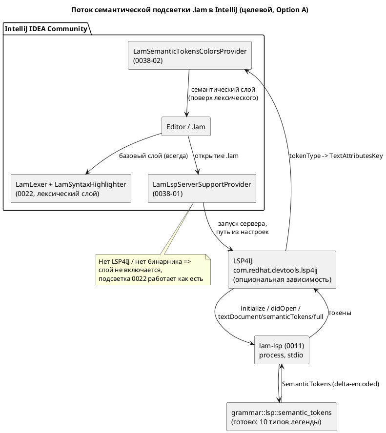

# Фича: Семантическая подсветка Lam в IntelliJ через lam-lsp

- **Номер:** 0038
- **Статус:** **ГОТОВО** (2026-07-19; функционально закрыта, A11 — визуальный остаток GUI)
- **Зависит от:** нет. Обе предпосылки уже закрыты (`ГОТОВО`):
  [lSP-сервер lam-lsp](0011-lsp-server.md) (`lam-lsp`, **включая готовый**
  `textDocument/semanticTokens/full`) и [плагин IntelliJ IDEA — подсветка синтаксиса Lam](0022-intellij-syntax-highlight.md)
  (плагин `extensions/intellij-lam` с лексической подсветкой). Незакрытых
  зависимостей нет ⇒ состояние `ЗАБЛОКИРОВАНА` **не ставится**.
  Обратная связь: [действие Reformat Code в плагине IntelliJ](0039-intellij-reformat.md) (Reformat Code) при
  выборе LSP4IJ-пути будет зависеть **от 0038**, а не наоборот — обоснование в
  [анализе](0038-intellij-semantic-tokens.md#анализ).
- **Приоритет / Tier:** **Tier 2** (оснастка языка, не ядро — свод),
  приоритет **средний**. В последовательности разработки ставится
  **перед 0039**: закрывает общую для обеих фич инфраструктуру LSP4IJ
  (критерий 4 — «раньше берётся фича, разблокирующая другие»).
- **Связанные issue (анализ):** новая фича (из блока «Кандидаты» `FEATURES.md`:
  «Семантическая подсветка Lam в IntelliJ через `lam-lsp`»; задел
  [ADR](0022-intellij-syntax-highlight.md#архитектура-adr), Option C)
- **Крейт/подпроект:** существующий подпроект `extensions/intellij-lam/`
  (Kotlin + Gradle IntelliJ Platform Plugin). Крейт `grammar` затрагивается
  **только тестами** (серверная реализация уже есть).

## Стадии жизненного цикла

Все стадии — **разделы этой карточки**: «Архитектура (ADR)»,
«Анализ», «Разработка», «Тест-план», «Отчёт о тестировании», «Итог».
Отдельным артефактом остаются только исправления —
[`docs/fixes/`](../fixes/README.md) (при необходимости `0038-YY-*`).

## Краткое описание

**Семантическая** надстройка над лексической подсветкой плагина
`extensions/intellij-lam`: плагин через **LSP4IJ** запускает `lam-lsp`, получает
`textDocument/semanticTokens/full` и перекрашивает идентификаторы по их
**смыслу**, а не по внешнему виду. Сегодня `LamLexer` видит любое имя как
`IDENTIFIER` и красит одинаково; сервер же различает функции, типы, варианты
`enum`, состояния/модели и обычные переменные — это ровно то, чего лексическому
плагину не хватает и чего он в принципе не может дать без семантической модели.

**Ключевой факт, изменивший объём фичи** (перепроверен при анализе): серверная
часть **уже готова**. `grammar/src/lsp.rs::semantic_tokens` реализован (легенда
`SEMANTIC_TOKEN_TYPES` из 10 типов, дельта-кодирование, корректная длина в
UTF-16), а `grammar/src/bin/lam_lsp.rs` объявляет `semantic_tokens_provider` в
capabilities и обрабатывает запрос `textDocument/semanticTokens/full`. Поэтому
фича — **почти целиком клиентская**: писать сервер не нужно, нужен потребитель.
Со стороны `grammar` остаются только **тесты** классификации (существующие
юнит-тесты покрывают лишь «не паникует» и длину UTF-16, но не то, что имя `fn`
приходит как `FUNCTION`).

Подсветка остаётся **деградируемой**: без установленного LSP4IJ или без бинарника
`lam-lsp` плагин работает ровно как сегодня (лексическая подсветка 0022) — без
ошибок и навязчивых уведомлений. Фича аддитивна: синтаксис/семантика языка и
версия языка не меняются (свод неприменим).

> Фича зарегистрирована из блока «Кандидаты» `FEATURES.md` (задел Option C
> [ADR](0022-intellij-syntax-highlight.md#архитектура-adr)); далее проходит жизненный
> цикл по своду.

## Архитектура (ADR)

> ## Пересмотр (2026-07-19): драйвер 1 (платформа) изменён
>
> **Факт, вскрытый при реализации:** современный **LSP4IJ несовместим с build
> 241** (IntelliJ 2024.1). Все актуальные версии (0.19+, включая 0.20.1) требуют
> `sinceBuild = 242` (IntelliJ 2024.2), а 2024.2 требует **JDK 21**. Плагин был
> закреплён на `platformVersion = 2024.1.7` / JDK 17 (драйвер 1, «Community/JDK17»).
> Пиннинг старой версии LSP4IJ (последняя с поддержкой 241 — ~год давности)
> отвергнут заказчиком в пользу **современного** клиента.
>
> **Решение заказчика (2026-07-19):** поднять платформу до **2024.2.5** (`sinceBuild
> = 242`), toolchain — **JDK 21** (авто-провижининг через foojay-резолвер в
> `settings.gradle.kts`; проверено — JDK 21 скачивается и компилирует). **Community
> сохранён** (`platformType = IC`) — суть драйвера 1 (не Ultimate) цела; менялась
> лишь минимальная линейка/JDK. Открытый `until-build`  сохранён.
>
> Прочие решения ADR (Option A, LSP4IJ, единый источник семантики, неломающая
> надстройка, перенос проверок на сервер) — **без изменений**. Драйвер 1
> переформулирован: «Community (не Ultimate), минимум 2024.2/JDK 21» вместо
> «Community 2024.1/JDK 17».

- **Status:** Accepted (драйвер 1 пересмотрен 2026-07-19 — см. врезку выше)
- **Date:** 2026-07-15
- **Authors:** Архитектор + дизайнер инструментов разработки + лид разработки
- **Related issues:** [Фича](0038-intellij-semantic-tokens.md);
  реализует **отложенный Option C** из [ADR](0022-intellij-syntax-highlight.md#архитектура-adr);
  наследует ограничения плагина из [ADR](0023-intellij-navigation-include.md#архитектура-adr);
  потребляет `lam-lsp` из [lSP-сервер lam-lsp](0011-lsp-server.md)

### Context

Плагин `extensions/intellij-lam` ([плагин IntelliJ IDEA — подсветка синтаксиса Lam](0022-intellij-syntax-highlight.md),
[плагин IntelliJ IDEA — навигация к декларации и include](0023-intellij-navigation-include.md), обе `ГОТОВО`, версия
плагина `0.4.0`) даёт **лексическую** подсветку: рукописный `LexerBase`
(`LamLexer`), `LamSyntaxHighlighter`, `LamColorSettingsPage`, эргономику
редактора, плоский PSI и навигацию. Его потолок структурен: лексер видит
**только форму токена**. Любое имя — `IDENTIFIER`, и `process` (функция),
`Celsius` (тип), `RED` (вариант `enum`), `Idle` (состояние) и `counter`
(переменная) окрашены **одинаково**. Различить их можно лишь имея семантическую
модель, которой у плагина нет и не будет без второго парсера языка.

**Ключевой факт (перепроверен при заведении фичи).** Серверная часть
**существует и работает** — это меняет объём решения радикально:

- `grammar/src/lsp.rs:17` — легенда `SEMANTIC_TOKEN_TYPES`: 10 типов
  (`KEYWORD`, `VARIABLE`, `FUNCTION`, `TYPE`, `ENUM_MEMBER`, `STRING`, `NUMBER`,
  `COMMENT`, `OPERATOR`, `CLASS` — последний для состояний и моделей);
- `grammar/src/lsp.rs:1412` — `pub fn semantic_tokens(source: &str) -> SemanticTokens`:
  токенизирует лексером, **обогащает идентификаторы семантической моделью**
  (`search_func` → `FUNCTION`, `types`/`enums` → `TYPE`, `search_enum_variant` →
  `ENUM_MEMBER`, `search_state`/`models` → `CLASS`, иначе `VARIABLE`), добавляет
  комментарии, сортирует и кодирует в дельта-формат LSP; длина считается в
  **кодовых единицах UTF-16** (кириллица учтена);
- `grammar/src/bin/lam_lsp.rs:51` — `semantic_tokens_provider` в
  `ServerCapabilities` (`full: true`, без `range`, без модификаторов);
  `lam_lsp.rs:200` — обработчик `textDocument/semanticTokens/full`.

Сервер деградирует мягко: если файл не парсится, `semantic_tokens` строит модель
через `.ok()` и при неудаче красит идентификаторы как `VARIABLE` — токены есть
всегда, подсветка «худеет», но не исчезает.

Итого решаемая задача — **не «сделать семантическую подсветку»**, а **«подключить
готовый источник токенов к IntelliJ»**. Вопрос ADR: каким транспортом.

**Силы, действующие на решение.**

1. **Редакция IDE.** Плагин собирается под `platformType = IC`
   (`gradle.properties`) — IntelliJ IDEA **Community**. Платформенный LSP API
   (`com.intellij.platform.lsp`) — **Ultimate-only** (требует
   `com.intellij.modules.ultimate`); в Community он недоступен. Это зафиксировано
   ещё в [ADR](0022-intellij-syntax-highlight.md#архитектура-adr) (Option C, Cons) и
   [ADR](0023-intellij-navigation-include.md#архитектура-adr) (Option C, Cons).
2. **Автономность 0022 — инвариант, а не пожелание.** Базовая подсветка обязана
   работать офлайн, в Community, без `lam-lsp`. Семантика может быть только
   **надстройкой**, включающейся при наличии сервера, и не вправе ломать
   лексический слой при его отсутствии.
3. **Никакого дублирования семантики.** Второе (Kotlin-) зеркало семантической
   модели немыслимо: ADR отвергли даже дублирование **грамматики**.
   Единственный законный источник классификации имён — крейт `grammar`.
4. **Общая инфраструктура с 0039.** [действие Reformat Code в плагине IntelliJ](0039-intellij-reformat.md)
   (Reformat Code) рассматривает тот же LSP4IJ-путь: `textDocument/formatting`
   пришёл бы «бесплатно» поверх той же интеграции. Решение предопределяет
   объём 0039 — это учитывается в Decision, но не делает 0038 зависимой.
5. **Проверяемость.** `runIde` требует GUI, собрать/прогнать плагин в CI-среде
   нельзя (остаточные пункты 0022/0023). Решение обязано максимизировать долю
   автоматически проверяемого — то есть по возможности переносить проверяемую
   логику на **сторону сервера** (Rust-тесты в CI).

### Decision Drivers

1. **Работа в Community** — плагин собран под IC; решение, требующее Ultimate,
   не решает задачу для целевой аудитории.
2. **Единый источник семантики** — классификация имён только из `grammar`,
   никаких вторых реализаций.
3. **Неломающая надстройка** — при отсутствии сервера поведение плагина
   **байт-в-байт** прежнее.
4. **Максимум автопроверок** — проверяемая логика по возможности на стороне
   Rust (CI), а не за GUI.
5. **Учёт 0039** — не закрывать, а по возможности удешевить путь к
   `textDocument/formatting`.

### Considered Options

#### Option A. LSP4IJ + `textDocument/semanticTokens` из `lam-lsp`

Опциональная зависимость плагина на LSP4IJ (`com.redhat.devtools.lsp4ij`),
`LamLspServerSupportProvider` (дескриптор сервера: команда запуска `lam-lsp`,
маппинг языка Lam), `SemanticTokensColorsProvider` — маппинг 10 типов легенды в
`TextAttributesKey` (переиспользуя ключи `LamHighlighterColors` из 0022).
Путь к бинарнику — настройка плагина + автопоиск в `PATH`.

**Pros:**
- **Работает в Community** — LSP4IJ ставится из Marketplace в IC (в этом весь
  смысл проекта LSP4IJ от Red Hat).
- Переиспользует **готовую** серверную реализацию (0011) целиком — объём фичи
  сводится к клиентскому связыванию; дублирования семантики нет.
- Надстройка: при отсутствии LSP4IJ/бинарника лексический слой 0022 не тронут
  (`<depends optional="true">` не срывает загрузку плагина).
- Открывает 0039 (`textDocument/formatting` — та же интеграция, ~одна точка
  расширения) и будущую LSP-навигацию/hover/completion — сервер уже всё это умеет.
- Заметная часть проверок уходит в Rust-тесты `semantic_tokens` (CI), где нет
  проблемы GUI.

**Cons:**
- **Внешняя зависимость плагина** от стороннего LSP4IJ: пользователь ставит два
  плагина; API LSP4IJ моложе платформенных и может меняться между версиями.
- Требует собранный `lam-lsp` (`cargo build --features lsp --bin lam-lsp`) —
  нужны UI настройки пути, диагностика отсутствия бинарника, документация.
- LSP4IJ тянет собственный `sinceBuild`; **открытый `until-build`** плагина
  ([проверка совместимости с новыми IDE (verifyPlugin) + валидность дескриптора](../fixes/0023-01-verifyplugin-descriptor.md)) придётся
  сверить с диапазоном LSP4IJ через `verifyPlugin`.
- Оптиональная зависимость усложняет тесты: часть путей исполняется только при
  наличии LSP4IJ в тестовом classpath.

#### Option B. Нативный LSP API платформы IntelliJ (`com.intellij.platform.lsp`)

`LspServerSupportProvider` из платформы + `LspSemanticTokensSupport`.

**Pros:**
- API «от первоисточника», без сторонних плагинов; лучше интегрирован в
  платформу и стабильнее по контракту.
- Нет второго плагина в установке пользователя.

**Cons:**
- **Ultimate-only — дисквалифицирующий минус.** `com.intellij.platform.lsp`
  требует `com.intellij.modules.ultimate`; плагин собирается под
  `platformType = IC` (`gradle.properties`) и заявляет
  `<depends>com.intellij.modules.platform</depends>`. Переход означал бы либо
  отказ от Community-аудитории, либо раздвоение плагина на IC/IU-редакции.
- Ломает драйвер 1 (инженеры асу тп, массово — Community/RustRover).
- Сборочная платформа (IC 2024.1.7, JDK 17) сменилась бы на IU — новый
  toolchain, новый диапазон, перепроверка всего `verifyPlugin`.

#### Option C. Семантическая подсветка через собственный PSI/аннотатор без LSP

`Annotator`/`HighlightVisitor` поверх полноценного PSI-парсера ([полноценный PSI-парсер плагина IntelliJ](0040-intellij-psi-parser.md)), классифицирующий имена
собственными средствами плагина.

**Pros:**
- Полная автономность: ни LSP4IJ, ни бинарника `lam-lsp`, ни внешних процессов.
- Мгновенный отклик (без IPC), нативная интеграция с инспекциями/подсказками.
- Тестируется штатным `BasePlatformTestCase` (в пределах ограничения GUI).

**Cons:**
- **Требует третьей реализации семантики языка на Kotlin** — разрешение имён,
  области видимости, импорты, псевдонимы типов, варианты `enum`. Это ровно то
  дублирование, которое ADR и 0023 отвергли **дважды** (там речь шла лишь о
  грамматике; здесь — о семантической модели, которая много сложнее).
- Гарантированный дрейф от `grammar`: подсветка начнёт врать при эволюции языка,
  причём **молча** (тот же класс «тихого расхождения», что дал восемь дефектов в
  фиче).
- Блокируется фичей (полный PSI) — сама по себе крупная многозадачная фича;
  объём несоразмерен задаче раскраски.
- Не переиспользует ничего из готовых 0011/`semantic_tokens`.

### Decision

Принимается **Option A** — LSP4IJ + `textDocument/semanticTokens` из `lam-lsp`.

**Обоснование.**

1. **Option B отпадает по факту, а не по вкусу:** платформенный LSP API —
   Ultimate-only, плагин собран и заявлен под Community (`platformType = IC`).
   Выбрать B — значит либо потерять целевую аудиторию, либо
   раздвоить плагин; цена несоразмерна выигрышу «нет второго плагина».
2. **Option C отпадает по стоимости и по риску:** он требует третьего зеркала
   семантики языка на Kotlin — то самое дублирование, которое проект отвергал
   дважды, причём здесь дублируется не грамматика, а
   семантическая модель. Расхождение с `grammar` было бы **тихим**, а подсветка,
   которая врёт, хуже подсветки, которой нет.
3. **Option A почти ничего не строит заново.** Сервер готов: легенда, обогащение
   идентификаторов моделью, дельта-кодирование, UTF-16 — всё в
   `grammar/src/lsp.rs`. Остаётся клиентское связывание. Это единственный
   вариант, где семантика имеет **ровно один** источник — крейт `grammar`.
4. **Драйвер 3 соблюдён:** зависимость от LSP4IJ — `optional="true"`, слой
   включается при наличии сервера; иначе плагин ведёт себя как сегодня.
5. **Драйвер 5 соблюдён:** ограничение GUI не обойти, но его удаётся **обойти по
   касательной** — классификация токенов (то, что фича реально утверждает)
   проверяется Rust-тестами в CI; за GUI остаётся только «цвета доехали».

**Про 0039.** Решение делает LSP4IJ-путь для 0039 практически бесплатным
(`textDocument/formatting` сервер уже реализует — `lam_lsp.rs:50`,
`document_formatting_provider`). Но 0038 **не зависит** от 0039: инфраструктура
LSP4IJ входит в объём 0038 целиком  и строится независимо от
того, какой путь выберет ADR. Направление зависимости — обратное
(0039 → 0038), и только если ADR выберет LSP4IJ; подробности — в
[анализе](0038-intellij-semantic-tokens.md#анализ).

### Consequences

#### Положительные

- Идентификаторы `.lam` в IntelliJ различаются **по смыслу**: функции, типы,
  варианты `enum`, состояния/модели, переменные — каждый своим цветом.
- Семантика имеет один источник (`grammar`); дрейфа между IDE и компилятором
  нет по построению.
- Готовая интеграция LSP4IJ открывает 0039 (formatting) и будущие
  hover/completion/definition от `lam-lsp` — сервер их уже отдаёт.
- Плагин остаётся автономным в базовом режиме: 0022/0023 работают без сервера.
- Rust-тесты `semantic_tokens` усиливаются и закрывают реальную дыру: сейчас
  проверяется только «не паникует», а не корректность классификации.

#### Отрицательные / Action items

- **Внешняя зависимость LSP4IJ** — документировать установку (README плагина); `<depends optional="true" config-file="lam-lsp4ij.xml">`, чтобы
  отсутствие LSP4IJ не срывало загрузку плагина.
- **Требуется бинарник `lam-lsp`** (`cargo build --features lsp --bin lam-lsp`) —
  нужны настройка пути, автопоиск в `PATH`, тихая деградация при отсутствии
  (без модальных ошибок при каждом открытии файла).
- **Диапазон совместимости** — сверить открытый `until-build` плагина с
  `sinceBuild` LSP4IJ через `verifyPlugin`; при конфликте зафиксировать нижнюю
  границу в `gradle.properties` и отразить в README.
- **Ограничение проверяемости сохраняется** (остаточные пункты 0022/0023):
  фактическая раскраска в редакторе проверяется только визуально в среде с GUI
  (`runIde`); в CI — Rust-тесты токенов + Gradle-тесты чистой логики.
- **Сервер не отдаёт `range`-токены и модификаторы** (`full: true`, `range: None`,
  `token_modifiers: vec![]`) — для больших файлов возможна перерисовка целиком;
  если проявится, вынести `semanticTokens/range` и модификаторы
  (`declaration`/`readonly` для `const`) в бэклог отдельной фичей.
- **Версия плагина** `0.4.0 → 0.5.0` (аддитивная функциональность, SemVer,
  свод к **языку** неприменим — язык не меняется).

#### Acceptance criteria

1. При установленном LSP4IJ и доступном `lam-lsp` открытие `.lam` в IntelliJ IDEA
   **Community** поднимает сервер, а идентификаторы окрашиваются по семантике:
   имя `fn` — как функция, имя `type`/`enum` — как тип, вариант `enum` — как
   константа перечисления, `state`/`model` — как класс, прочие — как переменная.
2. Без LSP4IJ **или** без бинарника `lam-lsp` плагин загружается и работает ровно
   как версия `0.4.0` (лексическая подсветка, навигация, эргономика), без
   исключений и модальных ошибок; регресс-тесты зелёные.
3. Все 10 типов легенды `grammar::lsp::SEMANTIC_TOKEN_TYPES` имеют маппинг в
   `TextAttributesKey`; несопоставленных типов нет (проверяется тестом).
4. Rust-тесты подтверждают **классификацию** (не только отсутствие паники):
   для эталонного `.lam` имя функции приходит с типом `FUNCTION`, тип — `TYPE`,
   вариант `enum` — `ENUM_MEMBER`, состояние/модель — `CLASS`, переменная —
   `VARIABLE`; на непарсящемся исходнике токены отдаются (деградация без паники).
5. `./gradlew buildPlugin test` — BUILD SUCCESSFUL, все тесты зелёные;
   `verifyPlugin` — Compatible для заявленного диапазона IDE.
6. Язык, его синтаксис/семантика и версия языка не изменены; изменения в
   `grammar` ограничены тестами (аддитивность).

## Анализ

### Цель и контекст

Дать плагину `extensions/intellij-lam` **семантический** слой подсветки поверх
лексического (0022): различать имена по смыслу (функция / тип / вариант `enum` /
состояние-модель / переменная), а не по форме токена. Реализация — **Option A**
[ADR](0038-intellij-semantic-tokens.md#архитектура-adr): LSP4IJ + готовый
`textDocument/semanticTokens/full` из `lam-lsp`.

**Проверка ключевого факта (выполнена при анализе, а не принята на веру).**
Кандидат в `FEATURES.md` описывал фичу как задел Option C из ADR, оставляя
открытым вопрос, есть ли серверная часть. Ответ: **есть, полностью**.

| Что | Где | Состояние |
|---|---|---|
| Легенда из 10 типов токенов | `grammar/src/lsp.rs:17` (`SEMANTIC_TOKEN_TYPES`) | готово |
| Генерация токенов + обогащение семантической моделью | `grammar/src/lsp.rs:1412` (`pub fn semantic_tokens`) | готово |
| Дельта-кодирование LSP | `grammar/src/lsp.rs:1535–1575` | готово |
| Длина токена в UTF-16 (кириллица) | `grammar/src/lsp.rs:1544–1555` | готово |
| Объявление `semantic_tokens_provider` | `grammar/src/bin/lam_lsp.rs:51` (`full: true`, `range: None`, без модификаторов) | готово |
| Обработчик `textDocument/semanticTokens/full` | `grammar/src/bin/lam_lsp.rs:200` | готово |
| **Тесты классификации токенов** | `grammar/src/lsp.rs:2117–2150` | **дыра**: только «не паникует» (валидный/пустой ввод) и длина UTF-16; **корректность классификации не проверяется ничем** |
| Потребитель в IntelliJ | — | **отсутствует** (предмет фичи) |

Следствие для объёма: фича **клиентская**. Писать сервер не нужно — нужен
потребитель. Со стороны `grammar` — только тесты, закрывающие
выявленную дыру: сегодня можно сломать классификацию (например, порядок ветвей в
`match` по `Token::Identifier`) и **не уронить ни одного теста**.

Классификация идентификатора сервером (`lsp.rs:1432–1451`), в порядке
приоритета: встроенный тип (`BUT_BUILTIN_TYPES`) → `TYPE`; `search_func` →
`FUNCTION`; `types`/`enums` → `TYPE`; `search_enum_variant` → `ENUM_MEMBER`;
`search_state`/`models` → `CLASS`; иначе → `VARIABLE`. При непарсящемся исходнике
модель не строится (`.ok()`), и все идентификаторы деградируют в `VARIABLE` —
токены отдаются всегда.

### Зависимости фичи

- **Зависит от:** **нет**. Обе предпосылки закрыты (`ГОТОВО`):
  - [lSP-сервер lam-lsp](0011-lsp-server.md) — `lam-lsp` с реализованными semantic
    tokens (см. таблицу выше). Не «в планах», а рабочий код.
  - [плагин IntelliJ IDEA — подсветка синтаксиса Lam](0022-intellij-syntax-highlight.md) — плагин, поверх
    которого строится надстройка (`LamHighlighterColors`, `LamFileType`,
    Gradle-сборка). Также используется плоский PSI из
    [плагин IntelliJ IDEA — навигация к декларации и include](0023-intellij-navigation-include.md) (`ГОТОВО`), но
    жёсткой связи нет: LSP4IJ работает по `VirtualFile`/`Document`, а не по PSI.

  Незакрытых зависимостей нет ⇒ **состояние `ЗАБЛОКИРОВАНА` Не ставится** (блокировка — только при незакрытой зависимости). Фичу можно брать
  в разработку немедленно.

- **Вердикт по связи с [действие Reformat Code в плагине IntelliJ](0039-intellij-reformat.md) (Reformat
  Code) — зависимость направлена 0039 → 0038, не наоборот.**

  Соблазн поставить `0038 → 0039` («общая интеграция LSP4IJ делается в 0039»)
  проверен и **отклонён** по трём причинам:

  1. **Решение ещё не принято, и оно может не дать LSP4IJ вовсе.** Витрина
     оставляет 0039 три пути: полный PSI (0040), LSP4IJ, внешний
     `lamc fmt --stdin`. Два из трёх **не создают** LSP4IJ-интеграцию. Ставить
     0038 в зависимость от решения, которого нет и которое с вероятностью 2 из 3
     её не удовлетворит, — значит блокировать проработанную фичу ради
     непроработанной. свод требует обратного: выше идёт более
     проработанная фича.
  2. **0038 самодостаточна.** Её ADR **уже принял** LSP4IJ, и интеграция входит
     в её объём целиком (задача: опциональная зависимость,
     `LamLspServerSupportProvider`, настройка пути к бинарнику, деградация).
     Ничего от 0039 ей не требуется — 0039 не производит артефактов, которые
     потребляет 0038.
  3. **Выгода асимметрична в пользу порядка 0038 → 0039.** После 0038
     `textDocument/formatting` (сервер уже отдаёт —
     `lam_lsp.rs:50`, `document_formatting_provider`) для 0039 сводится к одной
     точке расширения поверх готовой интеграции. Обратный порядок такой выгоды
     не даёт: если 0039 пойдёт путём `lamc fmt --stdin` или PSI, 0038 не получит
     от неё ничего и всё равно построит LSP4IJ сама.

  **Рекомендация аналитика для 0039** (решение — за ADR, не за этой фичей):
  проставить 0039 «Зависит от: 0038» и статус `ЗАБЛОКИРОВАНА`, **если** ADR
  выберет LSP4IJ-путь. Если 0039 выберет `lamc fmt --stdin` или PSI — фичи
  независимы, и порядок между ними свободный. Формулировка витрины «путь LSP4IJ
  выглядит самым выгодным, потому что закрывает обе задачи разом» **верна**, но
  из неё следует именно порядок 0038 → 0039: инфраструктуру строит та фича, чей
  выбор уже сделан.

- **Вердикт по связи с [полноценный PSI-парсер плагина IntelliJ](0040-intellij-psi-parser.md)
  (полноценный PSI-парсер) — фичи ортогональны, зависимости нет ни в одну
  сторону.**

  0038 не нуждается в PSI: LSP4IJ получает содержимое документа и отдаёт
  диапазоны токенов, ни один шаг не проходит через PSI-дерево. Обратно 0040 не
  нуждается в 0038. Единственная точка контакта — **конкурирующая** (Option C
  ADR: семантическая подсветка через PSI/аннотатор), и она **отвергнута**:
  требует третьего зеркала семантики языка на Kotlin. Практическое следствие:
  при последующей реализации 0040 **не** добавлять в неё семантическую
  подсветку — этот слой закреплён за LSP (иначе два источника раскраски начнут
  спорить за одни диапазоны).

- **Влияние на порядок разработки.** Фича независима и полностью
  проработана (ADR + анализ + тест-план) ⇒ по критерию 2 («проработанность»)
  идёт выше непроработанных 0039/0040. По критерию 4 («необходимость»)
  аналитик **поднимает** её относительно 0039: 0038 разблокирует 0039 в его
  наиболее выгодном варианте. Рекомендуемый порядок в витрине: **0038 → 0039**;
  0040 — независимо, по своему приоритету. Завершение 0038 разблокирует 0039
  (при LSP4IJ-пути) и открывает бэклог-фичи «LSP-навигация/hover/completion в
  IntelliJ».

### Требования и проверяемые условия

- **R1. Опциональная интеграция LSP4IJ.** Плагин объявляет зависимость на
  `com.redhat.devtools.lsp4ij` как `<depends optional="true"
  config-file="…">`. При отсутствии LSP4IJ плагин **загружается и работает**
  (лексический слой 0022, навигация 0023) — отсутствие зависимости не срывает
  загрузку и не пишет ошибок в лог IDE.
- **R2. Дескриптор и запуск сервера.** `LamLspServerSupportProvider` поднимает
  `lam-lsp` для файлов `LamFileType`. Команда запуска берётся из настройки
  плагина; при пустой настройке — автопоиск исполняемого `lam-lsp` в `PATH`.
- **R3. Тихая деградация при отсутствии бинарника.** Если `lam-lsp` не найден или
  не запускается, семантический слой **не включается**: подсветка 0022 остаётся,
  исключения не выбрасываются, модальные диалоги не показываются. Уведомление —
  не чаще одного на проект, с действием «указать путь» и возможностью отключить.
- **R4. Полнота маппинга легенды.** Каждый из 10 типов
  `grammar::lsp::SEMANTIC_TOKEN_TYPES` (`keyword`, `variable`, `function`,
  `type`, `enumMember`, `string`, `number`, `comment`, `operator`, `class`)
  сопоставлен `TextAttributesKey`. Несопоставленных типов нет; ключи
  переиспользуют `LamHighlighterColors` (0022), чтобы семантический слой не спорил
  с лексическим по палитре и уважал настройки цветов пользователя.
- **R5. Наслоение, а не замена.** Семантический слой накладывается **поверх**
  лексического: при активном сервере ключевые слова/литералы/комментарии не
  «мигают» и не меняют цвет относительно режима без сервера; меняется только
  окраска **идентификаторов** (которые лексер красит одинаково).
- **R6. Корректность классификации (сторона сервера).** Для эталонного `.lam`
  `semantic_tokens` возвращает: имя `fn` → `FUNCTION` (2); имя `type`/`enum` и
  встроенный тип → `TYPE` (3); вариант `enum` → `ENUM_MEMBER` (4); имя
  `state`/`start`/`model` → `CLASS` (9); прочий идентификатор → `VARIABLE` (1);
  ключевое слово → `KEYWORD` (0); число → `NUMBER` (6); строка → `STRING` (5);
  комментарий (`//`, `///`, блочный) → `COMMENT` (7); оператор (`:=`, `=`, `<=`)
  → `OPERATOR` (8).
- **R7. Робастность сервера.** На непарсящемся исходнике `semantic_tokens`
  возвращает токены (идентификаторы деградируют в `VARIABLE`) и не паникует; на
  пустом вводе — пустой список; кириллические идентификаторы имеют длину в
  кодовых единицах UTF-16.
- **R8. Совместимость диапазона IDE.** Открытый `until-build` плагина
  ([проверка совместимости с новыми IDE (verifyPlugin) + валидность дескриптора](../fixes/0023-01-verifyplugin-descriptor.md)) сохраняется;
  диапазон LSP4IJ сверяется `verifyPlugin`. Плагин остаётся собираемым под
  `platformType = IC` / JDK 17 (Community — драйвер 1 ADR).
- **R9. Аддитивность.** Изменения в `grammar` — **только тесты**.
  Язык, синтаксис, семантика и версия языка не затрагиваются (свод неприменим). Версия плагина `0.4.0 → 0.5.0` (SemVer: аддитивная
  функциональность).
- **R10. Документация.** README плагина описывает: установку LSP4IJ,
  сборку `cargo build --features lsp --bin lam-lsp`, настройку пути, поведение
  без сервера и разницу лексического/семантического слоёв.

### Критерии приёмки и способ проверки

| # | Критерий | Способ проверки |
|---|---|---|
| A1 | Классификация имён сервером верна для всех 6 категорий идентификаторов (R6) | Rust-тест `semantic_tokens_classification` (`grammar/src/lsp.rs`, `--features lsp`): декодирует дельта-поток и сверяет `token_type` в позиции — **автотест, CI** |
| A2 | Ключевые слова/числа/строки/комментарии/операторы получают свои типы (R6) | Rust-тест по эталонной фикстуре — **автотест, CI** |
| A3 | Непарсящийся исходник → токены есть, паники нет; идентификаторы = `VARIABLE` (R7) | Rust-тест `semantic_tokens_broken_source` — **автотест, CI** |
| A4 | Легенда покрыта маппингом полностью: 10 из 10 типов → `TextAttributesKey` (R4) | Gradle-тест `LamSemanticTokensColorsTest`: перебор всех значений легенды, отсутствие `null` — **автотест** |
| A5 | Набор типов маппинга **совпадает** с `SEMANTIC_TOKEN_TYPES` из Rust (R4) | Регресс-тест по образцу `LamKeywordSyncTest` (0022): **читает** `grammar/src/lsp.rs` и сверяет список — краснеет при добавлении типа в легенду — **автотест** |
| A6 | Без LSP4IJ плагин загружается, тесты зелёные (R1, R5) | `./gradlew buildPlugin test` без LSP4IJ в classpath: 47 регресс-тестов зелёные — **автотест** |
| A7 | Отсутствие/битый путь `lam-lsp` → нет исключений, слой выключен (R3) | Gradle-тест логики резолвинга пути (несуществующий бинарник → `null`/пустой дескриптор, без throw) — **автотест** |
| A8 | Сборка и весь набор тестов зелёные (R8, R9) | `./gradlew buildPlugin test` → BUILD SUCCESSFUL |
| A9 | Совместимость с новыми IDE сохранена (R8) | `./gradlew verifyPlugin` → Compatible для IC 2024.3 / 2025.1 / 2025.2 |
| A10 | `grammar` изменён только тестами; язык и его версия не тронуты (R9) | `git diff --stat` по `grammar/src/` (только `#[cfg(test)]`-блоки); `cargo test --features lsp -- --test-threads=1` |
| A11 | **Визуально:** в IDEA Community с LSP4IJ и `lam-lsp` имена окрашены по смыслу; без сервера — как в 0.4.0 (R2, R5) | **Только вручную**, `./gradlew runIde` в среде с GUI — в CI **невозможно** (см. тест-план и остаточные пункты 0022/0023) |
| A12 | README плагина описывает установку/настройку/деградацию (R10) | Ревью README + `scripts/check-links.py` |

### Особенности по обратной функциональности

**Полная обратная совместимость; обоснование слома не требуется —
слома нет.**

- **Язык Lam** — не затронут. Синтаксис, семантика, компилятор, генераторы не
  меняются; версия языка не растёт (свод неприменим). Фича не относится к
  своду (нет изменений синтаксиса/семантики → примеры/контрпримеры языка не
  формируются).
- **Крейт `grammar`** — изменения **только в тестах** (`#[cfg(test)]`).
  Продуктивный код `lsp.rs`/`lam_lsp.rs` не трогается: он уже реализует
  требуемое. Если тесты **выявят** дефект классификации — он оформляется
  отдельным исправлением `0038-YY`, а не правкой «заодно».
- **Крейт `simulation`** — н/п (не затрагивается).
- **Плагин 0022 (лексическая подсветка, FileType, цвета, эргономика)** — работает
  без изменений; семантика **накладывается поверх** и активна только при живом
  сервере. Регресс — 27 тестов (A6).
- **Плагин 0023 (навигация, плоский PSI)** — не затрагивается: LSP4IJ не
  использует PSI. Регресс — 20 тестов (A6). Навигация остаётся
  **автономной** (собственный `GotoDeclarationHandler`), на LSP не переводится —
  это отдельная возможная фича бэклога.
- **Zed-расширение (`extensions/zed-lam`)** — не затрагивается, но получает
  косвенную выгоду: усиление тестов `semantic_tokens` защищает и его подсветку
  (Zed делегирует раскраску тому же серверу).
- **Пользователь без LSP4IJ / без `lam-lsp`** — ключевой сценарий совместимости:
  поведение плагина **идентично** версии `0.4.0` (R1, R3, A6).

### Риски и зависимости

- **Риск: API LSP4IJ моложе платформенных и меняется между версиями**
  (`LspServerSupportProvider`/`SemanticTokensColorsProvider`). *Снижение:*
  зафиксировать версию LSP4IJ в `build.gradle.kts`; интеграцию держать в тонком
  слое (одна точка расширения на возможность); прогнать `verifyPlugin` (A9);
  при конфликте диапазонов — зафиксировать нижнюю границу в `gradle.properties`.
- **Риск: конфликт `sinceBuild` LSP4IJ с открытым `until-build` плагина** (R8).
  *Снижение:* зависимость **опциональная** — плагин ставится и работает в IDE без
  LSP4IJ; сверка через `verifyPlugin` (A9).
- **Риск: главный — ограничение проверяемости.** Итоговый результат фичи (цвет
  на экране) **автотестом не подтверждается**: `runIde` требует GUI, собрать и
  прогнать плагин в CI-среде нельзя (остаточные пункты 0022/0023). *Снижение:*
  архитектурное — центр тяжести проверок перенесён **на сервер**, где
  классификация (то, что фича реально утверждает) проверяется Rust-тестами в CI
  (A1–A3); на клиенте автотестами закрыты полнота маппинга (A4), синхронизация с
  легендой (A5), регресс (A6) и деградация (A7). За GUI остаётся **только** A11
  («цвета доехали») — визуальная проверка в среде с GUI, фиксируется в отчёте как
  выполненная вручную либо как непроверенный остаточный пункт.
- **Риск: дрейф легенды.** Добавление типа в `SEMANTIC_TOKEN_TYPES` без маппинга
  в плагине → токены нового типа молча теряют цвет. *Снижение:* регресс-тест A5,
  читающий Rust-исходник (проверенный приём — `LamKeywordSyncTest` из 0022 так
  сверяет `KEYWORDS`).
- **Риск: производительность на больших файлах.** Сервер отдаёт только
  `full`-токены (`range: None`) и пересобирает семантическую модель на каждый
  запрос. *Снижение:* принять как есть (файлы `.lam` невелики); при жалобах —
  `semanticTokens/range` + `full/delta` отдельной фичей бэклога.
- **Риск: два источника раскраски.** Если 0040 (PSI) добавит собственный
  аннотатор-подсветку, слои начнут спорить за одни диапазоны. *Снижение:*
  зафиксировано в ADR (Option C отвергнут) и здесь: семантический слой закреплён
  за LSP; 0040 занимается структурой (find usages/rename/структура), не цветом.
- **Зависимость (инфраструктурная, не фичевая): бинарник `lam-lsp` собирается
  только с `--features lsp`** (`grammar/Cargo.toml`: `required-features = ["lsp"]`).
  *Снижение:* README (R10); автопоиск в `PATH`; понятное уведомление (R3).

### Декомпозиция (задачи разработки)

| Задача | Файл | Содержание |
|---|---|---|
| 0038-01 | [`0038-intellij-semantic-tokens.md#разработка`](0038-intellij-semantic-tokens.md#разработка) | Интеграция LSP4IJ: опциональная зависимость, `LamLspServerSupportProvider`, резолвинг пути к `lam-lsp` (настройка + `PATH`), тихая деградация (R1–R3, R8) |
| 0038-02 | [`0038-intellij-semantic-tokens.md#разработка`](0038-intellij-semantic-tokens.md#разработка) | `SemanticTokensColorsProvider`: маппинг 10 типов легенды в `TextAttributesKey` поверх `LamHighlighterColors`, наслоение над лексикой, регресс-тест синхронизации с легендой (R4, R5) |
| 0038-03 | [`0038-intellij-semantic-tokens.md#разработка`](0038-intellij-semantic-tokens.md#разработка) | Тесты классификации на стороне `lam-lsp` (закрытие выявленной дыры), робастность, README плагина (R6, R7, R9, R10) |

Аналитика **не декомпозируется**: объём умеренный — серверная часть
готова, клиентская сводится к трём тонким слоям.

## Разработка

### Задача

#### Что было

**Реальное состояние на 2026-07-15** (проверено чтением кода, а не по документам).

##### Плагин `extensions/intellij-lam` — версия `0.4.0`

Собирается под IntelliJ IDEA **Community**: `platformType = IC`,
`platformVersion = 2024.1.7` (последняя линейка на Java 17), `jvmToolchain(17)`,
IntelliJ Platform Gradle Plugin `2.1.0`, Kotlin `2.0.21`. Диапазон:
`pluginSinceBuild = 241`, `pluginUntilBuild` **пуст** (открытый верхний диапазон,
[проверка совместимости с новыми IDE (verifyPlugin) + валидность дескриптора](../fixes/0023-01-verifyplugin-descriptor.md)); `verifyPlugin`
настроен на IC 2024.3 / 2025.1 / 2025.2.

Что умеет (21 Kotlin-файл в `src/main`, 10 тестовых классов):

| Возможность | Реализация | Фича |
|---|---|---|
| Тип файла `.lam`, язык, иконка | `LamFileType`, `LamLanguage`, `LamIcons` | 0022-01 |
| **Лексическая** подсветка | `LamLexer` (рукописный `LexerBase`, зеркалит `parser/lexer.rs`), `LamSyntaxHighlighter`, `LamHighlighterColors` | 0022-02 |
| Настройка цветов, commenter, brace matcher | `LamColorSettingsPage`, `LamCommenter`, `LamBraceMatcher` | 0022-03 |
| Плоский PSI (токены листьями под корень) | `LamParser`, `LamParserDefinition`, `LamFile` | 0023 |
| Go to Declaration, навигация по `import` | `LamGotoDeclarationHandler`, `LamSymbolScanner`, `LamImports` | 0023 |

**Чего нет:** ни одного упоминания LSP в плагине. `plugin.xml` объявляет только
`<depends>com.intellij.modules.platform</depends>`; точек расширения LSP нет,
LSP4IJ в `build.gradle.kts` не подключён, внешние процессы не запускаются.
Подсветка целиком автономна и целиком лексическая.

**Потолок лексического слоя (проблема из ADR).** `LamLexer` видит только форму
токена: любое имя — `IDENTIFIER`. Функция `process`, тип `Celsius`, вариант
`enum` `RED`, состояние `Idle` и переменная `counter` окрашены **одинаково**.
Различить их без семантической модели невозможно в принципе.

##### Сервер `lam-lsp` — semantic tokens **уже реализованы**

Ключевой факт, перепроверенный при анализе (кандидат в `FEATURES.md` оставлял его
открытым; вердикт — **умеет**):

- `grammar/src/lsp.rs:17` — `pub const SEMANTIC_TOKEN_TYPES` — легенда из 10
  типов: `KEYWORD`, `VARIABLE`, `FUNCTION`, `TYPE`, `ENUM_MEMBER`, `STRING`,
  `NUMBER`, `COMMENT`, `OPERATOR`, `CLASS` (состояния и модели).
- `grammar/src/lsp.rs:1412` — `pub fn semantic_tokens(source: &str) -> SemanticTokens`:
  токенизация лексером, **обогащение идентификаторов семантической моделью**
  (`search_func` → `FUNCTION`; `types`/`enums` → `TYPE`; `search_enum_variant` →
  `ENUM_MEMBER`; `search_state`/`models` → `CLASS`; иначе `VARIABLE`;
  `BUT_BUILTIN_TYPES` имеют приоритет → `TYPE`), добавление комментариев,
  сортировка, дельта-кодирование, длина в кодовых единицах **UTF-16**.
- `grammar/src/bin/lam_lsp.rs:51` — `semantic_tokens_provider` в
  `ServerCapabilities`: `full: Some(Bool(true))`, `range: None`,
  `token_modifiers: vec![]`.
- `grammar/src/bin/lam_lsp.rs:200` — обработчик
  `textDocument/semanticTokens/full` → `grammar::lsp::semantic_tokens(text)`.
- Бинарник собирается **только** с флагом: `grammar/Cargo.toml` —
  `[[bin]] name = "lam-lsp"`, `required-features = ["lsp"]`.

Сервер также уже отдаёт `document_formatting_provider` (`lam_lsp.rs:50`) — это
делает LSP4IJ-путь выгодным и для [действие Reformat Code в плагине IntelliJ](0039-intellij-reformat.md).

**Вывод:** серверную часть писать не нужно. Отсутствует **потребитель** — это и
есть предмет фичи.

#### Что сделано

> **Этап 1 — миграция платформы (2026-07-19).** Клиентский Kotlin-слой
> (`LamLspServerSupportProvider`, резолвинг пути, настройки, деградация) — далее.

**Пересмотр драйвера 1 ADR (см. врезку в [ADR](0038-intellij-semantic-tokens.md#архитектура-adr)).**
Реализация вскрыла: **LSP4IJ несовместим с build 241** — все актуальные версии
(0.19+, 0.20.1) требуют `sinceBuild = 242` (2024.2 → JDK 21). Плагин был на
2024.1.7/JDK 17. Решение заказчика — **поднять платформу**, не пиннить старый
LSP4IJ. Сделано:

- `settings.gradle.kts` — foojay-резолвер (`org.gradle.toolchains.foojay-resolver-convention`):
  toolchain **авто-провизионирует JDK 21** (проверено — скачивается и компилирует).
- `gradle.properties` — `platformVersion 2024.1.7 → 2024.2.5`, `pluginSinceBuild
  241 → 242`, `pluginVersion 0.4.0 → 0.5.0`. `platformType = IC` (Community цел).
- `build.gradle.kts` — `jvmToolchain(17 → 21)`; зависимость
  `plugin("com.redhat.devtools.lsp4ij:0.20.1")` (опциональность — в plugin.xml);
  `testImplementation("org.opentest4j:opentest4j:1.3.0")` — тест-фреймворк 2024.2
  требует opentest4j на classpath (при 2024.1 подтягивался транзитивно).
- **Исправление дрейфа (побочно):** `LamTokenTypes.KEYWORDS` не содержал `invariant`
  (ключевое слово фичи) — `LamKeywordSyncTest` это ловит, но был **закэширован
  зелёным** на старой платформе; свежий прогон под 2024.2 вскрыл. Добавлено.
- **53 существующих теста плагина зелёные** под 2024.2.5/JDK 21 (`./gradlew test`).

##### Клиентский слой (этап 2, 2026-07-19)

Реализован в пакете `org.lam.intellij.lsp` (LSP4IJ 0.20.1):

- **`LamLspBinary`** — резолвинг пути (настройка → `PATH` → `null`), чистая логика,
  тест `LamLspBinaryTest` (6 тестов: приоритеты, деградация без исключений).
- **`LamLspSettings`** — `PersistentStateComponent` уровня приложения (путь к
  серверу); зарегистрирован `applicationService` в `plugin.xml` (класс не зависит
  от LSP4IJ, доступен всегда).
- **`LamLspServerFactory`** (`LanguageServerFactory`) + `LamLspConnectionProvider`
  (`OSProcessStreamConnectionProvider`, stdio): поднимает `lam-lsp`. Тихая
  деградация (R3): нет бинарника → `commandLine` не задан → `start()` бросает
  `CannotStartProcessException`, LSP4IJ показывает сервер остановленным **без**
  модального диалога.
- **`plugin.xml`**: `<depends optional="true" config-file="lam-lsp4ij.xml">com.redhat.devtools.lsp4ij</depends>`
  (R1 — без LSP4IJ плагин грузится). **`lam-lsp4ij.xml`**: `<server>` +
  `<languageMapping>` + `<semanticTokensColorsProvider>` (атрибут класса —
  `class`, не `className`; вскрыто `buildSearchableOptions`).
- **Проверки:** `./gradlew clean buildPlugin test` — BUILD SUCCESSFUL, все тесты
  зелёные (53 регресс 0022/0023 + 6 резолвер + 3 цвета 0038-02); плагин
  `0.5.0.zip` собран, LSP4IJ-провайдеры инстанцируются без ошибок.

**Отложено (GUI-уточнения R3, слабо проверяемы без `runIde`):** страница
настроек (`Configurable`) для правки пути в UI и одноразовое уведомление о
ненайденном бинарнике. Ядро работает без них: `PATH`-автопоиск даёт сервер
«из коробки», путь хранится в `LamLspSettings`. **A11** (цвета в редакторе) —
только визуально в среде с GUI.

##### План клиентского слоя (исходный)

Тонкий слой интеграции LSP4IJ в `extensions/intellij-lam`, включающий сервер
`lam-lsp` **опционально** и деградирующий молча при его отсутствии.

1. **Опциональная зависимость на LSP4IJ (R1).**
   `build.gradle.kts`: `intellijPlatform { plugins("com.redhat.devtools.lsp4ij:<версия>") }`
   (версия фиксируется явно — API LSP4IJ моложе платформенных, риск анализа).
   `plugin.xml`: `<depends optional="true" config-file="lam-lsp4ij.xml">com.redhat.devtools.lsp4ij</depends>`;
   все LSP-точки расширения выносятся в **отдельный** `lam-lsp4ij.xml`, чтобы
   отсутствие LSP4IJ не срывало загрузку плагина.

2. **Дескриптор сервера (R2).** `org.lam.intellij.lsp.LamLspServerSupportProvider` +
   `LamLspServerDescriptor`: сопоставление `LamFileType` → сервер; команда
   запуска — резолвнутый путь к `lam-lsp`; транспорт stdio (сервер поднимается
   через `Connection::stdio()`).

3. **Резолвинг пути к бинарнику (R2, R3).**
   `org.lam.intellij.lsp.LamLspBinary` — чистая, тестируемая **без GUI** логика:
   (1) явная настройка плагина; (2) автопоиск `lam-lsp` в `PATH`;
   (3) не найден / не исполняемый → `null`.

4. **UI настройки (R3).** Страница настроек плагина: поле «Путь к `lam-lsp`»,
   кнопка проверки, чекбокс «не напоминать». Хранилище — `PersistentStateComponent`.

5. **Тихая деградация (R3).** `null` от резолвера ⇒ дескриптор не создаётся,
   сервер не стартует, семантический слой не включается. Модальных диалогов нет;
   уведомление — **не чаще одного на проект**, уровень `INFORMATION`, с действием
   «указать путь» и возможностью отключить.

6. **Совместимость (R8).** Сверить `sinceBuild` LSP4IJ с открытым `until-build`
   плагина; при конфликте — поднять `pluginSinceBuild` в `gradle.properties` и
   отразить в README. Платформа остаётся IC / JDK 17 (Community — драйвер 1 ADR).

**Статус по функциональности:**

| Функциональность | Статус |
|---|---|
| Плагин `extensions/intellij-lam` | новая функциональность (LSP-слой), версия `0.4.0 → 0.5.0` |
| Крейт `grammar` | **н/п** — сервер уже реализует semantic tokens; тесты — [семантическая подсветка Lam в IntelliJ через lam-lsp](0038-intellij-semantic-tokens.md#разработка) |
| Крейт `simulation` | **н/п** — не затрагивается |
| Язык Lam (синтаксис/семантика/версия) | **н/п** — не затрагивается (свод неприменим) |
| Лексическая подсветка 0022 / навигация 0023 | не изменяются; регресс обязателен (T10, T11) |

#### Проверки

> **Планируется (разработка не начата).** Команды и ожидаемые результаты — из
> тест-плана; фактические — по ходу реализации.

| Проверка | Команда | Ожидаемый результат | T |
|---|---|---|---|
| Резолвинг: бинарник не найден | `./gradlew test` | «нет сервера», исключения нет | T12 |
| Резолвинг: битый путь | `./gradlew test` | слой выключен, без throw | T13 |
| Регресс 0022 без LSP4IJ | `./gradlew test` | 27 тестов зелёные | T10 |
| Регресс 0023 без LSP4IJ | `./gradlew test` | 20 тестов зелёные | T11 |
| Сборка плагина | `./gradlew clean buildPlugin test` | BUILD SUCCESSFUL, все тесты зелёные | T14 |
| Совместимость IDE | `./gradlew verifyPlugin` | Compatible для IC 2024.3 / 2025.1 / 2025.2 | T15 |
| **Живой запуск сервера из IDE** | `./gradlew runIde` (**GUI**) | LSP4IJ поднимает `lam-lsp`, статус «running» в окне LSP4IJ | T16 |
| **Деградация без сервера / без LSP4IJ** | `./gradlew runIde` (**GUI**) | подсветка = `0.4.0`, модальных ошибок нет | T18, T19 |

**Ограничение (предсуществующее, не снимается этой задачей):** собрать и
прогнать плагин в CI-среде нельзя, `runIde` требует GUI (остаточные пункты
0022/0023). Логика резолвинга пути вынесена в чистый класс **специально**, чтобы
её можно было проверить автотестом без GUI; живой запуск сервера проверяется
только визуально.

### Задача

#### Что было

**Реальное состояние на 2026-07-15** (проверено чтением кода).

##### Палитра плагина — есть, потребителя семантики — нет

`org.lam.intellij.highlight.LamHighlighterColors`  определяет
`TextAttributesKey` для лексических категорий, `LamSyntaxHighlighter` отображает
в них токены `LamLexer`, а `LamColorSettingsPage` (0022-03) даёт пользователю
страницу настройки цветов с демо-текстом Lam.

Все идентификаторы приходят из лексера **одной** категорией (`IDENTIFIER`) и
получают **один** цвет: `LamLexer` — лексический анализатор, он не знает, что
`process` — функция, а `Idle` — состояние.

##### Легенда сервера — есть, маппинга в плагине — нет

`grammar/src/lsp.rs:17` (`SEMANTIC_TOKEN_TYPES`) — **10 типов**, порядок важен:
индекс в массиве и есть `token_type` в дельта-потоке.

| Индекс | Тип LSP | Что означает в Lam (`lsp.rs:1432–1451`) |
|---|---|---|
| 0 | `KEYWORD` | ключевые слова (`model`, `state`, `ref`, `fn`, …) |
| 1 | `VARIABLE` | идентификатор, не опознанный как что-либо иное (в т.ч. **вся** деградация при непарсящемся файле) |
| 2 | `FUNCTION` | имя, найденное `search_func` |
| 3 | `TYPE` | встроенный тип (`BUT_BUILTIN_TYPES`, приоритет), имя `type`, имя `enum` |
| 4 | `ENUM_MEMBER` | вариант `enum` (`search_enum_variant`) |
| 5 | `STRING` | строковый литерал |
| 6 | `NUMBER` | число, рациональное, литерал адреса |
| 7 | `COMMENT` | `//`, `///`, блочный |
| 8 | `OPERATOR` | `:=`, `=`, `<=`, арифметика/логика/битовые, `.` |
| 9 | `CLASS` | **состояния и модели** (`search_state`, `models`) |

Модификаторов нет (`token_modifiers: vec![]`), `range`-запросов нет
(`range: None`) — только `full`.

**Проблема:** в плагине нет ничего, что превращает `token_type` в цвет. Токены,
которые сервер уже готов отдать, некому принять.

#### Что сделано (2026-07-19)

- **`LamSemanticTokensColorsProvider`** (`SemanticTokensColorsProvider` LSP4IJ):
  маппинг **всех 10** типов легенды в `TextAttributesKey` (`keyFor`); неизвестный
  тип → `null` (цвет не навязывается). Зарегистрирован в `lam-lsp4ij.xml`
  (`<semanticTokensColorsProvider serverId="lamLsp" class="…"/>`).
- **`LamHighlighterColors`** дополнен семантическими ключами `FUNCTION`/`TYPE`/
  `ENUM_MEMBER`/`CLASS` (наследуют цвет от `DefaultLanguageHighlighterColors`:
  `FUNCTION_DECLARATION`/`CLASS_REFERENCE`/`STATIC_FIELD`/`CLASS_NAME`); прочие
  типы переиспользуют ключи 0022 (`KEYWORD`/`IDENTIFIER`/`NUMBER`/`STRING`/
  `LINE_COMMENT`/`OPERATOR`) — палитра лексики уважается (R4/R5).
- **Контроль синхронизации (A5):** `LamSemanticTokensColorsTest` читает
  `SEMANTIC_TOKEN_TYPES` из `grammar/src/lsp/keywords.rs`, сверяет множество с
  локальным и требует ненулевого ключа для каждого — добавление типа в легенду без
  маппинга краснит тест (приём `LamKeywordSyncTest`). A4 — все 10 типов сопоставлены.

##### План (исходный)

Маппинг легенды в палитру плагина поверх интеграции LSP4IJ из
[семантическая подсветка Lam в IntelliJ через lam-lsp](0038-intellij-semantic-tokens.md#разработка).

1. **`LamSemanticTokensColorsProvider` (R4).**
   `org.lam.intellij.lsp.LamSemanticTokensColorsProvider` реализует
   `SemanticTokensColorsProvider` LSP4IJ: `tokenType` (+ модификаторы, которых
   сервер пока не шлёт) → `TextAttributesKey`. Регистрация — в `lam-lsp4ij.xml`
   (опциональный дескриптор 0038-01).

2. **Переиспользование палитры 0022 (R4).** Ключи берутся из
   `LamHighlighterColors`; **новые** ключи заводятся только для категорий, у
   лексера отсутствующих — `FUNCTION`, `TYPE`, `ENUM_MEMBER`, `CLASS`,
   `VARIABLE` (лексер их не различает). `KEYWORD`/`STRING`/`NUMBER`/`COMMENT`/
   `OPERATOR` отображаются в **существующие** ключи 0022 — иначе слои разойдутся
   по палитре и цвет «прыгнет» при старте сервера.
   Новые ключи наследуют стандартные `DefaultLanguageHighlighterColors`
   (`FUNCTION_DECLARATION`, `CLASS_NAME`, `STATIC_FIELD`, …) — чтобы цвета
   работали в любой теме «из коробки».

3. **Расширение страницы цветов (R4).** Новые ключи добавляются в
   `LamColorSettingsPage`, чтобы пользователь мог их настроить; демо-текст
   дополняется примерами функции/типа/варианта `enum`/состояния.

4. **Наслоение, а не замена (R5).** Семантический слой накладывается **поверх**
   лексического (штатная модель платформы: semantic tokens — это наложение над
   раскраской лексера). `LamSyntaxHighlighter` **не трогается**: при отсутствии
   сервера подсветка остаётся ровно такой, как в `0.4.0`.

5. **Регресс-тест синхронизации с легендой (R4).**
   `LamSemanticTokensColorsTest` по образцу **проверенного приёма**
   `LamKeywordSyncTest` (0022, читает `KEYWORDS` из Rust-лексера): тест **читает**
   `grammar/src/lsp.rs`, извлекает `SEMANTIC_TOKEN_TYPES` и сверяет с набором
   маппинга. Добавили тип в легенду и забыли цвет — тест **краснеет** (иначе
   токен молча потеряет окраску — тот же класс «тихого расхождения», что дал
   восемь дефектов в фиче).

**Статус по функциональности:**

| Функциональность | Статус |
|---|---|
| Плагин: семантический слой | новая функциональность |
| Плагин: `LamHighlighterColors`, `LamColorSettingsPage` | **аддитивно** — новые ключи; существующие не переименованы и не удалены |
| Плагин: `LamSyntaxHighlighter`, `LamLexer` | **не изменяются** |
| Крейт `grammar` | **н/п** — легенда уже есть; тесты — [семантическая подсветка Lam в IntelliJ через lam-lsp](0038-intellij-semantic-tokens.md#разработка) |
| Крейт `simulation`, язык Lam | **н/п** — не затрагиваются |

#### Проверки

> **Планируется (разработка не начата).** Команды и ожидаемые результаты — из
> тест-плана; фактические — по ходу реализации.

| Проверка | Команда | Ожидаемый результат | T |
|---|---|---|---|
| Полнота маппинга: 10 из 10 типов | `./gradlew test` | каждый тип → непустой `TextAttributesKey`, `null` нет | T8 |
| Синхронизация с легендой Rust | `./gradlew test` | набор типов плагина = `SEMANTIC_TOKEN_TYPES`; при добавлении типа в Rust тест краснеет | T9 |
| Регресс подсветки 0022 | `./gradlew test` | 27 тестов зелёные; `LamSyntaxHighlighter` не затронут | T10 |
| Страница цветов не сломана | `./gradlew test` | `LamColorSettingsPageTest` зелёный (новые ключи имеют дескрипторы) | T10 |
| Сборка | `./gradlew clean buildPlugin test` | BUILD SUCCESSFUL | T14 |
| **Раскраска по смыслу** | `./gradlew runIde` (**GUI**) | имена `fn`/типов/вариантов `enum`/состояний/переменных различимы | T16 |
| **Лексика не «мигает»** | `./gradlew runIde` (**GUI**) | ключевые слова/литералы/комментарии — как без сервера; меняется только окраска идентификаторов | T17 |

**Ограничение (предсуществующее):** соответствие цвета ожиданию проверяется
**только визуально** в среде с GUI — `runIde` требует GUI, в CI плагин не
собирается (остаточные пункты 0022/0023). Автотестами закрыто всё, что не
требует отрисовки: **полнота** маппинга (T8) и его **синхронизация** с легендой
(T9). Именно они ловят реальный класс дефектов (забытый тип → нет цвета); T16/T17
подтверждают лишь «доехало до экрана».

### Задача

#### Что было

**Реальное состояние на 2026-07-15** (проверено чтением кода).

##### Реализация semantic tokens в `lam-lsp` — полная

`grammar/src/lsp.rs::semantic_tokens` (строка 1412) работает и покрывает всё
необходимое: легенда из 10 типов (`SEMANTIC_TOKEN_TYPES`, строка 17),
обогащение идентификаторов семантической моделью, комментарии, сортировка,
дельта-кодирование, длина в кодовых единицах UTF-16. Сервер объявляет
возможность (`lam_lsp.rs:51`) и обрабатывает запрос (`lam_lsp.rs:200`).

##### Тесты этой реализации — дыра

Весь существующий охват — три юнит-теста в `grammar/src/lsp.rs:2117–2150`:

| Тест | Что проверяет | Чего **не** проверяет |
|---|---|---|
| `test_semantic_tokens_no_panic` | не паникует на валидном исходнике | **классификацию** — какой `token_type` у какого имени |
| `test_semantic_tokens_empty_source` | не паникует на пустом вводе | то же |
| `test_semantic_tokens_utf16_length` | длину кириллического идентификатора в UTF-16 | то же |

**Проблема.** Корректность классификации — то, ради чего фича существует —
**не проверяется ничем**. Сегодня можно переставить ветви в `match` по
`Token::Identifier` (`lsp.rs:1432–1451`) — например, поменять местами проверки
`search_func` и `search_state` — и **не уронить ни одного теста**: функции
поедут в `CLASS`, подсветка начнёт врать, сборка останется зелёной.

Это ровно тот класс дефектов, который проект уже проходил: в фиче
**0025** отсутствие слоя тестов **на значения** дало восемь дефектов при зелёных
тестах, потому что тесты проверяли «факт перехода», а не результат. Здесь то же
самое: тесты проверяют «факт отсутствия паники», а не результат классификации.

Дыра станет критичной сразу после 0038-01/0038-02: до появления потребителя
неверная классификация никого не задевала, после — она **и есть** видимый
пользователю баг.

#### Что сделано (2026-07-19)

> **Серверные тесты реализованы; вскрыт и исправлен дефект классификации.**
> Клиентские пункты (README плагина о семантической подсветке, версия
> `0.4.0 → 0.5.0`) отложены к задачам **0038-01/02** — они описывают работающий
> клиент, которого пока нет (интеграция LSP4IJ ещё не сделана).

- **Фикстура** `grammar/tests/data/lsp/semantic_tokens.lam` — по представителю
  каждой категории (fn+использование, `type`, `enum`+варианты+использование,
  `model`/`start`/`state`, `var`/`const`, встроенный тип, число, комментарии
  `///`/`//`/`/* */`, операторы `:=`/`=`/`<=`).
- **Тесты** `grammar/tests/semantic_tokens_tests.rs` (новый файл, `#![cfg(feature
  = "lsp")]`): декодер дельта-потока + зонд (`probe_semantic_tokens`, пишет в файл
  по `LAM_PROBE_OUT`), `semantic_tokens_classification` (R6/A1 — все 6 категорий
  идентификаторов, **включая члены под-модели**), `semantic_tokens_non_identifier_kinds`
  (R6/A2 — keyword/number/comment/operator), `semantic_tokens_string_literal`
  (STRING на `import "…"`), `semantic_tokens_broken_source` (R7 — деградация в
  `variable`), `..._empty_source`, `..._cyrillic_utf16_length`.
- **Зонд вскрыл дефект (как и задумано).** До assertions распечатан реальный
  вывод: члены под-модели (`fn scale`, `state Idle/Done` внутри `model Thermostat`)
  классифицировались как `variable`, а не `function`/`class`. Причина — `search_*`
  ищут **вверх** по `upper`, а `semantic_tokens` строит корень и вниз не спускается.
  Оформлено **отдельным исправлением** [`semantic_tokens` не классифицирует члены под-моделей](../fixes/0038-01-subtree-token-classification.md)
  (Tier 2): `semantic_tokens` собирает имена всего дерева моделей. Премиса анализа
  «сервер полностью готов, R9 — только тесты» **опровергнута**: без правки
  продуктивного кода фича не работает на реальных (вложенных) файлах.

##### Оставшийся план (клиентские пункты — к 0038-01/02)

Закрытие тестовой дыры на стороне сервера + документация. **Продуктивный код
`grammar` не трогается** (R9): изменения — только `#[cfg(test)]` и новая
фикстура.

1. **Эталонная фикстура.** Новый файл
   `grammar/tests/data/lsp/semantic_tokens.lam` — минимальный валидный `.lam` с
   **одним представителем каждой категории**: объявление и использование `fn`;
   `type`-псевдоним; `enum` с вариантами и использование варианта; `model` со
   `start`/`state`; `var`/`const`; встроенный тип; число; строка; строчный, doc-
   и блочный комментарии; операторы `:=`, `=`, `<=`.
   Существующие фикстуры `data/lsp/*.lam` **не правятся** — тесты/LSP1
   завязаны на их позиции (`CLAUDE.md`).

2. **Зонд перед assertions (обязательно, `CLAUDE.md`).** Правило проекта:
   «сперва зонд для захвата реального вывода, затем assertions против захваченных
   значений — не угадывать». Порядок работ:
   (1) написать вспомогательный декодер дельта-потока `SemanticTokens` →
   `(строка, столбец, длина, тип)`;
   (2) распечатать реальный вывод на фикстуре;
   (3) сверить с ожиданиями, выведенными из чтения кода (таблица T1–T6
   тест-плана);
   (4) **при расхождении — не подгонять тест под код**: расхождение означает либо
   ошибку анализа, либо **дефект сервера**. Дефект оформляется отдельным исправлением
   `0038-YY`, а не «правкой заодно» (R9: продуктивный код вне объёма задачи).

3. **Тесты классификации (R6).** `semantic_tokens_classification`: для каждой
   категории — тип токена в позиции. Ожидания: `fn` → `FUNCTION` (2);
   `type`/`enum`/встроенный тип → `TYPE` (3); вариант `enum` → `ENUM_MEMBER` (4);
   `state`/`start`/`model` → `CLASS` (9); прочий идентификатор → `VARIABLE` (1);
   ключевое слово → `KEYWORD` (0); число → `NUMBER` (6); строка → `STRING` (5);
   комментарий → `COMMENT` (7); оператор → `OPERATOR` (8).
   Отдельным случаем — **приоритет** `BUT_BUILTIN_TYPES` над пользовательскими
   именами (`lsp.rs:1434`): встроенный тип остаётся `TYPE`, даже если в модели
   есть одноимённая сущность.

4. **Тесты робастности (R7).** `semantic_tokens_broken_source`: непарсящийся
   исходник → токены отдаются, паники нет, идентификаторы деградируют в
   `VARIABLE` (модель не строится через `.ok()`, `lsp.rs:1418`). Существующие
   три теста сохраняются (регресс).

5. **Документация (R10).** README плагина
   (`extensions/intellij-lam/README.md`) дополняется разделом о семантической
   подсветке: установка LSP4IJ из Marketplace; сборка сервера
   `cargo build --features lsp --bin lam-lsp` (флаг обязателен —
   `required-features = ["lsp"]`); настройка пути; **поведение без сервера**
   (лексическая подсветка как в `0.4.0`); разница лексического и семантического
   слоёв. Корневой `README.md` — упоминание в разделе об оснастке IDE.

6. **Версия плагина.** `0.4.0 → 0.5.0` в `gradle.properties` (SemVer: аддитивная
   функциональность). Версия **языка** не меняется — свод неприменимо.

**Статус по функциональности:**

| Функциональность | Статус |
|---|---|
| Крейт `grammar`: `lsp.rs` (продуктивный код) | **не изменяется** — только `#[cfg(test)]`-блоки |
| Крейт `grammar`: тесты + фикстура | новая функциональность (закрытие дыры) |
| Крейт `simulation` | **н/п** — не затрагивается |
| Язык Lam (синтаксис/семантика/версия) | **н/п** — не затрагивается; свод неприменимо (нет изменений языка) |
| Zed-расширение | **н/п** — не изменяется; косвенно выигрывает (делегирует подсветку тому же серверу) |
| Документация (README плагина, корневой README) | обновляется |

#### Проверки

> **Планируется (разработка не начата).** Команды и ожидаемые результаты — из
> тест-плана; фактические — по ходу реализации.

| Проверка | Команда | Ожидаемый результат | T |
|---|---|---|---|
| Классификация всех 6 категорий идентификаторов | `cargo test --features lsp -- --test-threads=1` | типы совпадают с ожидаемыми (T1–T5) | T1–T5 |
| Ключевые слова/числа/строки/комментарии/операторы | `cargo test --features lsp -- --test-threads=1` | `KEYWORD`=0, `NUMBER`=6, `STRING`=5, `COMMENT`=7, `OPERATOR`=8 | T6 |
| Робастность: битый ввод, пустой ввод, кириллица | `cargo test --features lsp -- --test-threads=1` | паники нет; деградация в `VARIABLE`; пустой список; длина в UTF-16 | T7 |
| `grammar` изменён только тестами | `git diff --stat grammar/src/` | правки только в `#[cfg(test)]` | T15a |
| Полный набор тестов проекта | `cargo test --features lsp -- --test-threads=1` | все тесты зелёные | T15b |
| Предкоммит-проверка | `./scripts/precheck.sh` | fmt + check + clippy + test + сборка примеров зелёные | — |
| Целостность ссылок в документации | `scripts/check-links.py` | битых ссылок нет | T… (A12) |

**Отличие этой задачи от 0038-01/0038-02:** её проверки **полностью
автоматизированы и идут в CI** — ограничение GUI на неё **не распространяется**
(это Rust-тесты, плагин не собирается). В том и смысл переноса центра тяжести
проверок на сервер (ADR, драйвер 5): то, что фича реально утверждает про
классификацию, проверяется без GUI.

## Тест-план

### Область и цель

Проверить, что плагин `extensions/intellij-lam` получает от `lam-lsp`
семантические токены и красит идентификаторы по смыслу (R2, R4–R6), **не ломая**
лексический слой 0022/0023 при отсутствии LSP4IJ или бинарника сервера
(R1, R3, R5). Связь с критериями приёмки A1–A12 анализа.

**свод не применяется:** фича не меняет синтаксис/семантику языка (R9), это
оснастка IDE. Примеры и контрпримеры **языка** не формируются; вместо них —
эталонная `.lam`-фикстура для проверки классификации токенов (см. «Тестовые
данные»).

#### Известное ограничение проверяемости (честно, до начала работ)

Оно **предсуществующее**, зафиксировано в остаточных пунктах 0022/0023 и данной
фичей **не снимается**:

- **Собрать и прогнать плагин в CI-среде нельзя.** Gradle-сборка плагина не
  входит в `cargo`-CI, а `./gradlew runIde` требует **GUI**.
- Следствие: **конечный результат фичи — цвет на экране — автотестом не
  подтверждается.** Ни один тест не докажет, что пользователь видит функцию
  жёлтой.

**Как ограничение обойдено (архитектурно, а не декларативно).** Центр тяжести
проверок перенесён на **сервер**: то, что фича реально утверждает — «имя `fn`
классифицируется как `FUNCTION`» — проверяется Rust-тестами в CI без всякого GUI
(T1–T7). На клиенте автотестами закрыто всё, что не требует отрисовки: полнота
маппинга (T8), синхронизация с легендой (T9), регресс (T10–T11), деградация
(T12–T13), сборка/совместимость (T14–T15).

| Что проверяется | Чем | Где идёт |
|---|---|---|
| Классификация токенов, робастность сервера | Rust-тесты `--features lsp` | **CI, автоматически** |
| Полнота и синхронизация маппинга легенды | Gradle-тесты (чистая логика) | локально, автоматически |
| Регресс 0022/0023, деградация без сервера | Gradle-тесты (`BasePlatformTestCase`) | локально, автоматически |
| Сборка, совместимость IDE | `buildPlugin`, `verifyPlugin` | локально, автоматически |
| **Фактическая раскраска в редакторе** | **глаза человека, `runIde`** | **только среда с GUI** |
| **Живой запуск `lam-lsp` из IDE** | **глаза человека, `runIde`** | **только среда с GUI** |

Итог: **T1–T15 автоматизируются, T16–T19 — только вручную в среде с GUI.**
Если визуальные проверки на момент отчёта не выполнены — они фиксируются в отчёте
как **остаточные пункты** (по образцу), а не выдаются за пройденные.

### Проверки (условие → ожидаемый результат)

#### Автоматические — сторона сервера (`grammar`, CI)

| # | Проверка | Предусловие | Ожидаемый результат | Ссылка на R/A |
|---|---|---|---|---|
| T1 | Имя функции классифицируется как `FUNCTION` | эталонная фикстура с `fn process(...)`, вызов `semantic_tokens` | в позиции имени `fn` — `token_type = 2` (`FUNCTION`) | R6 / A1 |
| T2 | Имя `type`/`enum` и встроенный тип → `TYPE` | фикстура с `type Celsius = i32;`, `enum Color {…}`, `var x: u8` | `token_type = 3` (`TYPE`) во всех трёх позициях | R6 / A1 |
| T3 | Вариант `enum` → `ENUM_MEMBER` | фикстура с `enum Color { RED, GREEN }`, использование `RED` | `token_type = 4` (`ENUM_MEMBER`) | R6 / A1 |
| T4 | Имя `state`/`start`/`model` → `CLASS` | фикстура с `model M { start Idle = …; state Run = …; }` | `token_type = 9` (`CLASS`) | R6 / A1 |
| T5 | Прочий идентификатор → `VARIABLE` | фикстура с `var counter: u8;` | `token_type = 1` (`VARIABLE`) | R6 / A1 |
| T6 | Ключевые слова, числа, строки, комментарии, операторы получают свои типы | эталонная фикстура (`model`, `42`, `"s"`, `// c`, `:=`) | `KEYWORD`=0, `NUMBER`=6, `STRING`=5, `COMMENT`=7, `OPERATOR`=8 | R6 / A2 |
| T7 | Робастность: битый исходник, пустой ввод, кириллица | `semantic_tokens("model {{{")`; `""`; идентификатор `счётчик` | паники нет; токены отдаются, идентификаторы → `VARIABLE`; пустой ввод → пустой список; длина кириллицы — в UTF-16 | R7 / A3 |

> **Замечание для разработчика (правило «сперва зонд», `CLAUDE.md`).** Ожидаемые
> `token_type` выше выведены **из чтения кода** (`grammar/src/lsp.rs:17–27`,
> `1432–1451`), а не из прогона. Перед фиксацией assertions прогнать зонд,
> печатающий декодированный дельта-поток на фикстуре, и сверить с реальным
> выводом — как требует правило о новых тестах.

#### Автоматические — сторона плагина (Gradle, локально)

| # | Проверка | Предусловие | Ожидаемый результат | Ссылка на R/A |
|---|---|---|---|---|
| T8 | Полнота маппинга легенды | перебор всех 10 типов `SEMANTIC_TOKEN_TYPES` | каждый тип → непустой `TextAttributesKey`; `null` нет | R4 / A4 |
| T9 | Синхронизация маппинга с легендой Rust | тест **читает** `grammar/src/lsp.rs` (приём `LamKeywordSyncTest` из 0022) | набор типов в плагине = набор в `SEMANTIC_TOKEN_TYPES`; при добавлении типа в Rust тест **краснеет** | R4 / A5 |
| T10 | Регресс 0022 без LSP4IJ в classpath | `./gradlew test` | 27 тестов зелёные (лексер, FileType, highlighter, цвета, эргономика) | R1, R5 / A6 |
| T11 | Регресс 0023 без LSP4IJ | `./gradlew test` | 20 тестов зелёные (сканер, переход, импорт) | R1, R5 / A6 |
| T12 | Резолвинг пути: бинарник не найден | настройка пуста, `lam-lsp` отсутствует в `PATH` | резолвер вернул «нет сервера»; исключения нет | R3 / A7 |
| T13 | Резолвинг пути: битый путь | настройка указывает на несуществующий/неисполняемый файл | то же: слой выключен, без throw | R3 / A7 |
| T14 | Сборка плагина и полный набор тестов | `./gradlew clean buildPlugin test` | BUILD SUCCESSFUL; все тесты зелёные (47 регресс + новые) | R8, R9 / A8 |
| T15 | Совместимость с новыми IDE | `./gradlew verifyPlugin` | Compatible для IC 2024.3 / 2025.1 / 2025.2; `sinceBuild` LSP4IJ не конфликтует с диапазоном | R8 / A9 |

#### Автоматические — аддитивность (`grammar`, CI)

| # | Проверка | Предусловие | Ожидаемый результат | Ссылка на R/A |
|---|---|---|---|---|
| T15a | `grammar` изменён только тестами | `git diff --stat grammar/src/` | правки только в `#[cfg(test)]`-блоках; продуктивный код `lsp.rs`/`lam_lsp.rs` не тронут | R9 / A10 |
| T15b | Полный набор тестов проекта не сломан | `cargo test --features lsp -- --test-threads=1` | все тесты зелёные; язык и его версия не изменены | R9 / A10 |

#### Ручные — только в среде с GUI (`runIde`)

| # | Проверка | Предусловие | Ожидаемый результат | Ссылка на R/A |
|---|---|---|---|---|
| T16 | Семантическая раскраска работает | IDEA **Community** + LSP4IJ из Marketplace + собранный `lam-lsp` в `PATH`; открыт `examples/*.lam` | имена `fn` / типов / вариантов `enum` / состояний / переменных окрашены **различимо**; цвета соответствуют `LamHighlighterColors` | R2, R4, R5 / A11 |
| T17 | Наслоение не ломает лексику | тот же стенд, сравнение с версией `0.4.0` | ключевые слова/литералы/комментарии выглядят **так же**, как без сервера; мигания при открытии нет; меняется только окраска идентификаторов | R5 / A11 |
| T18 | Деградация без сервера | LSP4IJ установлен, `lam-lsp` **удалён** из `PATH` и настройки | подсветка = 0022; модальных ошибок нет; уведомление — не чаще одного на проект, с действием «указать путь» | R3 / A11 |
| T19 | Деградация без LSP4IJ | LSP4IJ **не установлен** | плагин загружается; поведение идентично `0.4.0`; в логе IDE нет ошибок о ненайденной зависимости | R1 / A11 |

### Разбивка проверок по функциональности

Единые условия и ожидаемые результаты прогоняются против каждой задеваемой
обратной функциональности; фиксируется статус.

| Функциональность | Проверки | Ожидаемый статус | Статус |
|---|---|---|---|
| Язык Lam (синтаксис/семантика/версия) | — | не затрагивается (R9); свод неприменимо | — |
| `grammar`: `semantic_tokens` (продуктивный код) | T1–T7 | **правки не только в тестах**: зонд вскрыл дефект классификации под-моделей → исправление [`semantic_tokens` не классифицирует члены под-моделей](../fixes/0038-01-subtree-token-classification.md) | ✅ (0038-03 + исправление) |
| `grammar`: прочее (компилятор, генераторы) | T15b | регресс зелёный | ✅ (полный набор `--features lsp` зелёный) |
| `simulation` | — | не затрагивается | — |
| Плагин 0022: лексическая подсветка, FileType, цвета, эргономика | T10, T17, T19 | без изменений | ✅ (53 регресс-теста зелёные под 2024.2.5) |
| Плагин 0023: навигация, плоский PSI | T11 | без изменений (LSP4IJ не использует PSI) | ✅ |
| Плагин: новый семантический слой | T8, T9, T12, T13, T16, T18 | новая функциональность | ✅ маппинг/резолвинг/деградация (авто); T16/T18 — GUI-остаток (A11) |
| Сборка/совместимость плагина | T14, T15 | зелёные, диапазон открыт | ✅ `buildPlugin test` + `verifyPlugin` Compatible (IC 2024.3/2025.1/2025.2) |
| Zed-расширение (`extensions/zed-lam`) | T1–T7 (косвенно) | не затрагивается; выигрывает от усиления тестов сервера | — |

<!-- Легенда: ✅ пройдено · ❌ провалено · ⬜ не проверялось · — не применимо -->

### Тестовые данные и окружение

#### Эталонная фикстура (для T1–T6)

Новая фикстура `grammar/tests/data/lsp/semantic_tokens.lam` — минимальный
валидный `.lam`, содержащий **по одному представителю каждой категории**:
объявление и использование `fn`; `type`-псевдоним; `enum` с вариантами и
использование варианта; `model` со `start`/`state`; `var`/`const`; встроенный тип;
число; строка; строчный, doc- и блочный комментарии; операторы `:=`, `=`, `<=`.
Кириллический идентификатор — отдельным случаем в T7 (проверка длины UTF-16).

Существующие фикстуры `grammar/tests/data/lsp/*.lam` (0011, LSP1) **не
нормализуются и не правятся**: тесты завязаны на их позиции (`CLAUDE.md`).

#### Окружение

| Что | Значение |
|---|---|
| Rust-тесты | `cargo test --features lsp -- --test-threads=1` (однопоточно — гонки за общие файлы) |
| Сборка сервера | `cargo build --features lsp --bin lam-lsp` (`required-features = ["lsp"]`) |
| Сборка плагина | `./gradlew clean buildPlugin test` в `extensions/intellij-lam` |
| Платформа плагина | `platformType = IC`, `platformVersion = 2024.1.7`, JDK 17 (`gradle.properties`) |
| Совместимость | `./gradlew verifyPlugin` → IC 2024.3 / 2025.1 / 2025.2 |
| LSP4IJ | `com.redhat.devtools.lsp4ij`, версия фиксируется в `build.gradle.kts`  |
| Визуальный стенд (T16–T19) | **машина с GUI**: `./gradlew runIde`, IDEA Community + LSP4IJ + `lam-lsp` в `PATH` |

#### Что не проверяется (осознанно, вне объёма)

- `semanticTokens/range` и `full/delta` — сервер их не объявляет
  (`range: None`); производительность на больших файлах — в бэклоге.
- Модификаторы токенов (`declaration`, `readonly`) — легенда сервера их не
  содержит (`token_modifiers: vec![]`).
- LSP-навигация/hover/completion в IntelliJ — вне объёма (навигация остаётся
  автономной, 0023); отдельные фичи бэклога.
- `textDocument/formatting` в IntelliJ — предмет [действие Reformat Code в плагине IntelliJ](0039-intellij-reformat.md).

## Отчёт о тестировании

- **Дата:** 2026-07-19
- **Окружение:** macOS (darwin 25.5.0); Gradle 8.10.2, JDK 21 (авто-провижининг
  foojay), IntelliJ Platform 2024.2.5, LSP4IJ 0.20.1; cargo/rustc для сервера
  `lam-lsp`. GUI (`runIde`) недоступен.
- **Вердикт:** **готово. Фича закрыта** (функционально; A11 — визуальный остаток
  GUI, уведомление R3 — отложенный кандидат). Идентификаторы `.lam` в IntelliJ
  различаются по смыслу через `lam-lsp`+LSP4IJ; без сервера плагин работает как
  лексический (0022).

### Две находки, изменившие фичу (премисы анализа опровергнуты)

Анализ полагал: (1) сервер `semantic_tokens` **полностью готов**, со стороны
`grammar` — только тесты (R9); (2) LSP4IJ совместим с целевой платформой. **Оба
неверны:**

1. **Дефект сервера** ([исправление](../fixes/0038-01-subtree-token-classification.md),
   Tier 2): `semantic_tokens` не классифицировал члены **под-моделей** (`fn`/`state`
   в `model X` → `variable`). Вскрыт зондом задачи. Весь корпус вложен в
   под-модель → на реальных файлах подсветка врала бы. Исправлено (поиск по всему
   дереву моделей). Премиса «R9 — только тесты» опровергнута.
2. **LSP4IJ несовместим с build 241:** современные версии требуют 242 (2024.2 →
   JDK 21). **Пересмотр драйвера 1 ADR** (решение заказчика): платформа поднята
   2024.1.7/JDK17 → **2024.2.5/JDK21** (Community сохранён), toolchain
   авто-провизионирует JDK 21.

### Сверка с критериями приёмки

| # | Критерий | Результат | Способ |
|---|---|---|---|
| A1 | Классификация имён (fn→FUNCTION, …) | ✅ | Rust-тест `semantic_tokens_classification` (вкл. под-модели) |
| A2 | kw/num/str/comment/op → свои типы | ✅ | `semantic_tokens_non_identifier_kinds`, `..._string_literal` |
| A3 | Битый исходник → токены, паники нет, деградация в VARIABLE | ✅ | `semantic_tokens_broken_source`, `..._empty_source`, `..._cyrillic_utf16_length` |
| A4 | 10/10 типов легенды → `TextAttributesKey` | ✅ | `LamSemanticTokensColorsTest.testEveryLegendTypeHasKey` |
| A5 | Набор маппинга = `SEMANTIC_TOKEN_TYPES` (Rust) | ✅ | `testLegendMatchesRustSource` (читает `keywords.rs`) |
| A6 | Без LSP4IJ регресс 0022/0023 зелёный | ✅ | 53 теста плагина зелёные (`./gradlew test`) |
| A7 | Резолвинг пути: нет бинарника → `null`, без throw | ✅ | `LamLspBinaryTest` (6 тестов приоритетов и деградации) |
| A8 | `buildPlugin test` — SUCCESSFUL | ✅ | BUILD SUCCESSFUL, 62 теста; `intellij-lam-0.5.0.zip` |
| A9 | `verifyPlugin` Compatible | ✅ | IC-243 (2024.3), IC-251 (2025.1), IC-252 (2025.2) — все **Compatible** |
| A10 | `grammar` изменён только тестами | **нет** | премиса неверна: исправление тронул `lsp/semantic_tokens.rs` (оформлен отдельным исправлением, не «заодно») |
| A11 | **Визуально:** цвета в редакторе | ⏸️ **GUI-остаток** | только `runIde` в среде с GUI — в этом окружении невозможно (как 0022/0023) |
| A12 | README документирует установку/настройку/деградацию | ✅ | README плагина §«Семантическая подсветка через LSP4IJ» + корневой README; `check-links` зелёный |

### Что реализовано

**Сервер (grammar):** исправление (классификация по всему дереву моделей) +
тесты (`grammar/tests/semantic_tokens_tests.rs` + фикстура) — зонд,
классификация, робастность.

**Платформа (плагин):** миграция на 2024.2.5/JDK21 (foojay), LSP4IJ 0.20.1,
opentest4j, версия `0.4.0 → 0.5.0`; исправление дрейфа `invariant` в `LamTokenTypes`.

**Клиент (0038-01/02):** `LamLspBinary` (резолвинг), `LamLspSettings`
(persistence), `LamLspConfigurable` (панель настроек), `LamLspServerFactory` +
`OSProcessStreamConnectionProvider` (stdio), `LamSemanticTokensColorsProvider`
(маппинг 10 типов) + семантические ключи `LamHighlighterColors`; регистрация
`<depends optional>` + `lam-lsp4ij.xml`.

### Остатки (документированы, не блокируют функциональность)

- **A11 (цвета в редакторе)** — визуальная проверка только в GUI (`runIde`);
  недостижима в CI (тот же класс, что остаточные пункты 0022/0023). Центр тяжести
  проверок перенесён на сервер (Rust-тесты A1–A3) — драйвер 5 ADR соблюдён.
- **Уведомление о ненайденном бинарнике (R3)** — отложено (кандидат-исправление). Тихая
  деградация уже работает: сервер не стартует **без** модального диалога (LSP4IJ
  показывает его остановленным в LSP Consoles); функциональность не страдает,
  `PATH`-автопоиск даёт сервер из коробки.

### Итог

Все проверяемые в CI критерии (A1–A9, A12) — зелёные; A10 честно отмечен как
неприменимый (премиса опровергнута, дефект оформлен исправлением); A11 — визуальный
остаток GUI. Фича функционально готова и закрыта. Разблокирует
[действие Reformat Code в плагине IntelliJ](0039-intellij-reformat.md) в LSP4IJ-варианте (`textDocument/formatting`
сервер уже отдаёт) и снимает блок с [rename и `PsiReference` для `import` в плагине IntelliJ](0067-intellij-rename-psi-import.md).

## Итог (что сделано)

Идентификаторы `.lam` в IntelliJ различаются **по смыслу** (функция/тип/вариант
`enum`/состояние-модель/переменная) через готовый сервер `lam-lsp` + клиент
**LSP4IJ** (Option A ADR). Единый источник классификации — крейт `grammar`;
дублирования семантики на Kotlin нет. Без LSP4IJ/сервера плагин работает как
лексический (0022) — надстройка деградируема.

**Две премисы анализа опровергнуты реализацией:**
- **Сервер был готов не полностью** — [исправление](../fixes/0038-01-subtree-token-classification.md)
  (Tier 2): `semantic_tokens` не классифицировал члены под-моделей (весь корпус
  вложен → подсветка врала бы). Вскрыт зондом 0038-03, исправлен (поиск по всему
  дереву моделей).
- **LSP4IJ несовместим с 241** → **пересмотр драйвера 1 ADR** (решение заказчика):
  платформа поднята 2024.1.7/JDK17 → **2024.2.5/JDK21** (Community сохранён),
  toolchain авто-провизионирует JDK 21 (foojay).

Задачи: 0038-01 (миграция платформы + клиент LSP4IJ: резолвинг, настройки, фабрика
сервера), 0038-02 (маппинг 10 типов легенды → цвета + контроль синхронизации),
[семантическая подсветка Lam в IntelliJ через lam-lsp](0038-intellij-semantic-tokens.md)-03 (серверные тесты классификации). Версия плагина `0.4.0 → 0.5.0`;
`verifyPlugin` — Compatible для IC 2024.3/2025.1/2025.2. Язык не менялся.

- **Отчёт:** [`0038-intellij-semantic-tokens.md#отчёт-о-тестировании`](0038-intellij-semantic-tokens.md#отчёт-о-тестировании).
- **Остатки** (документированы, не блокируют): A11 (цвета в редакторе — визуально
  только в `runIde`, как 0022/0023); уведомление о ненайденном бинарнике (R3) —
  кандидат-исправление (тихая деградация уже работает).
- **Разблокирует:** [действие Reformat Code в плагине IntelliJ](0039-intellij-reformat.md) в LSP4IJ-варианте
  (`textDocument/formatting` сервер отдаёт) и [rename и `PsiReference` для `import` в плагине IntelliJ](0067-intellij-rename-psi-import.md).
- **Уроки:** *«сервер готов» — проверяй зондом, а не по документам* (класс дефекта: зелёные тесты «не паникует», результат не сверялся); *внешняя зависимость
  может уронить совместимость платформы* (LSP4IJ ↛ 241).
