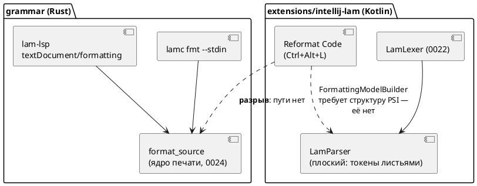
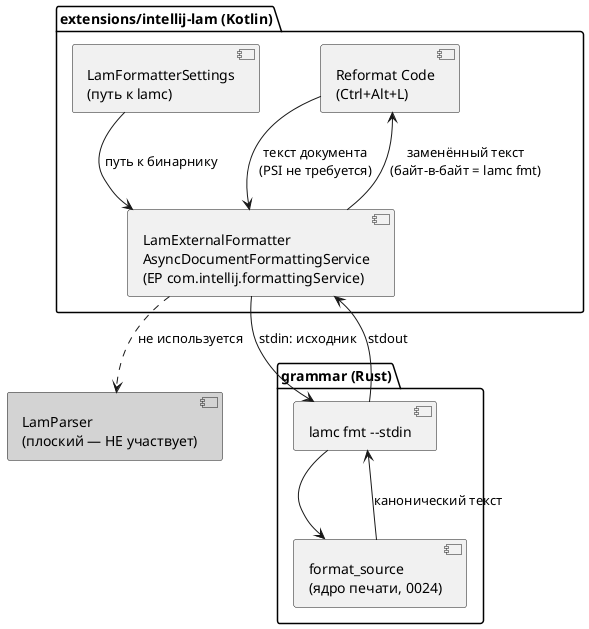

# Фича: Действие Reformat Code в плагине IntelliJ

- **Номер:** 0039
- **Статус:** **ГОТОВО** (2026-07-19). Развилка разрешена заказчиком в пользу
  **LSP4IJ-варианта (Option B)** после принятия LSP4IJ в фиче
  [семантическая подсветка Lam в IntelliJ через lam-lsp](0038-intellij-semantic-tokens.md) — форматирование пришло бесплатно от
  уже работающего `lam-lsp`, фича схлопнулась до приёмки. Итог — в разделе
  [«Итог (что сделано)»](#итог-что-сделано) ниже; обновление решения — в
  [ADR](0039-intellij-reformat.md#архитектура-adr), раздел «Обновление решения (2026-07-19)».
  Подзадачи Option C [действие Reformat Code в плагине IntelliJ](0039-intellij-reformat.md#разработка),
  [действие Reformat Code в плагине IntelliJ](0039-intellij-reformat.md#разработка),
  [действие Reformat Code в плагине IntelliJ](0039-intellij-reformat.md#разработка) **сняты как неактуальные**.
- **Зависит от:** **нет.** Фича автономна и **не** переводится в `ЗАБЛОКИРОВАНА`.
  Разбор смежных фич: [полноценный PSI-парсер плагина IntelliJ](0040-intellij-psi-parser.md) (PSI-парсер) — **не
  блокер**, т.к. принятый путь **не использует PSI** (посылка витрины «реформат
  требует структуры PSI» опровергнута: платформа имеет точку расширения
  `com.intellij.formattingService` для внешних форматтеров, и она **присутствует
  на платформе сборки** `ideaIC-2024.1.7`); [семантическая подсветка Lam в IntelliJ через lam-lsp](0038-intellij-semantic-tokens.md)
  (LSP4IJ) — **не блокер** технически, но **связана по решению** (см. статус
  выше и раздел «Развилка» ниже). [плагин IntelliJ IDEA — подсветка синтаксиса Lam](0022-intellij-syntax-highlight.md),
  [плагин IntelliJ IDEA — навигация к декларации и include](0023-intellij-navigation-include.md), [канонический форматтер.lam (lamc fmt)](0024-lam-formatter.md) —
  **закрыты** (`ГОТОВО`), блокировать нечему
- **Приоритет:** **Tier 3 (низкий)** — см. раздел «Приоритет» ниже
- **Связанные issue (анализ):** новая фича (из блока «Кандидаты в фичи»
  `FEATURES.md`; вынесена из [канонический форматтер.lam (lamc fmt)](0024-lam-formatter.md), [канонический форматтер.lam (lamc fmt)](0024-lam-formatter.md#разработка), раздел «Находка»)

## Стадии жизненного цикла

Все стадии — **разделы этой карточки**: «Архитектура (ADR)»,
«Анализ», «Разработка», «Тест-план», «Отчёт о тестировании», «Итог».
Отдельным артефактом остаются только исправления —
[`docs/fixes/`](../fixes/README.md) (при необходимости `0039-YY-*`).

## Краткое описание

Плагин `extensions/intellij-lam` получает штатное действие **«Reformat Code»**
(`Ctrl+Alt+L`) для файлов `.lam`: текст документа отдаётся процессу
`lamc fmt --stdin`, результат применяется к документу. Реализация — точка
расширения платформы `com.intellij.formattingService`
(`AsyncDocumentFormattingService`), предназначенная ровно для **внешних**
форматтеров (по ней в IDE работают Prettier и rustfmt) и **не требующая**
PSI-структуры — поэтому плоский `LamParser` (решение [ADR](0023-intellij-navigation-include.md#архитектура-adr))
менять не нужно. Стиль остаётся описан **один раз** — в ядре `grammar/src/format/`
([канонический форматтер.lam (lamc fmt)](0024-lam-formatter.md)): реформат в IDE **является** вызовом
`lamc fmt`, поэтому совпадает с ним байт-в-байт по построению, а не по
договорённости. Язык не меняется.

> Фича зарегистрирована из бэклога кандидатов `FEATURES.md` (вынесена из фичи
> 0024); далее проходит жизненный цикл по своду.

## Мотивация / контекст

Фича объявила **трёх** потребителей канонического ядра печати: `lamc fmt`,
LSP `textDocument/formatting` и «Reformat Code» в IntelliJ. Первые два сделаны и
проверены; третий остался несделанным — и это **последний незакрытый пункт**
фичи.

Практическая цена пропуска: пользователь IntelliJ форматирует `.lam` только из
терминала. При этом `lamc fmt --check` уже стоит в `precheck.sh` и стережёт канон
`examples/` — то есть разработчик узнаёт о неканоничном форматировании **от CI**,
хотя IDE могла бы исправить это по `Ctrl+Alt+L`.

## Развилка (решение заказчика)

Витрина `FEATURES.md` прямо вынесла выбор пути на заказчика. ADR разобрал все
три и **рекомендует путь 3**:

| Путь | Суть | Вердикт ADR |
|---|---|---|
| 1 | Полноценный PSI-парсер ([полноценный PSI-парсер плагина IntelliJ](0040-intellij-psi-parser.md)) + `FormattingModelBuilder` | **отвергнут**: стиль пришлось бы описать **вторым** кодом на Kotlin → «байт-в-байт» недостижимо по построению; плюс дорого и блокируется 0040 |
| 2 | Интеграция LSP4IJ ([семантическая подсветка Lam в IntelliJ через lam-lsp](0038-intellij-semantic-tokens.md)) — форматирование «бесплатно» | **не рекомендован здесь**, но остаётся правом заказчика: `<depends>com.redhat.devtools.lsp4ij</depends>` — **жёсткая** зависимость (без стороннего плагина из Marketplace наш **не загрузится вовсе**), и это разворот принципа самодостаточности, принятого **дважды** (ADR Option C, ADR Option C) |
| **3** | **`lamc fmt --stdin` внешним процессом** | **Принят** (Option C ADR) |

**Почему путь 3, а не «самый выгодный» путь 2, как предполагала витрина.**
Витрина оценивала путь 3 как обременённый («нужны UI настроек, обработка
отсутствия бинарника») и исходила из того, что реформат требует PSI. Проверка
показала: **посылка неверна** — EP для внешних форматтеров существует и есть на
платформе сборки. После снятия посылки путь 3 — не обходной манёвр, а штатный
механизм платформы, который вдобавок:

- даёт «байт-в-байт» **тавтологически** (реформат *есть* `lamc fmt`);
- не разворачивает два принятых ADR и не ломает загрузку плагина без внешних
  компонентов;
- требует от пользователя **один** бинарник `lamc` (который у пользователя Lam и
  так есть) вместо «сторонний плагин + LSP-сервер»;
- **проверяем автотестом** здесь и сейчас.

**Оговорка (честно).** Путь 2 остаётся объективно выгоднее **в одном случае** —
если заказчик независимо принимает LSP4IJ ради фичи (её серверная часть в
`lam-lsp` **уже написана**: `semantic_tokens_provider` объявлен и обрабатывается;
не хватает только клиента в IDE). Тогда форматирование приходит бесплатно, а
[действие Reformat Code в плагине IntelliJ](0039-intellij-reformat.md) схлопывается до приёмочных тестов. Поэтому решение по LSP4IJ принимается
**в 0038**, а 0039 — его следствие. Отсюда оговорка в статусе: проработку
завершить, разработку начинать после развилки.

## Объём

- `LamExternalFormatter` — `AsyncDocumentFormattingService` на EP
  `com.intellij.formattingService`; вызов `lamc fmt --stdin` (UTF-8, таймаут),
  отказ вместо порчи при ненулевом коде возврата.
- `LamFormatterSettings` (`PersistentStateComponent`) + страница настроек +
  резолвер пути (настройка → `PATH`) + диагностика отсутствия бинарника.
- Тесты: головная сверка «байт-в-байт» с эталоном, вычисляемым прогоном
  настоящего `lamc`; корпус `examples/`; контрпримеры; регресс 0022/0023.
- Версия плагина `0.4.0 → 0.5.0`.

**Вне объёма:** PSI-парсер, LSP-клиент/LSP4IJ,
format-on-save (включается средствами платформы), правки крейтов
`grammar`/`simulation` (контракт `lamc fmt` уже достаточен — проверено пробой).

## Приоритет (свод п.3)

**Tier 3 (низкий).** Аргументы:

1. **Это эргономика, а не работоспособность.** Форматирование в проекте **уже
   есть** и доступно двумя путями (`lamc fmt`, LSP). Фича не чинит сломанное, а
   избавляет пользователя IntelliJ от переключения в терминал. Сравнить с
   Tier 1-фичами вроде [генератор C: typedef корневой структуры для одиночной модели](0026-c-root-typedef.md), где порождённый C **не
   компилируется вовсе**: там страдает основная цель проекта, здесь
   — удобство.
2. **Аудитория узкая:** только пользователи IntelliJ, и только те, кто не
   пользуется `lamc fmt`/LSP-редактором.
3. **Главный риск — не технический, а решенческий** (см. «Развилка»): пока не
   принято решение по LSP4IJ, работа может оказаться выброшенной. Низкий
   приоритет здесь — не оценка качества проработки, а способ не тратить усилия
   до развилки.
4. **Но цена мала** (один класс + настройки + тесты, крейты Rust не трогаются
   вовсе), поэтому по своду п.4 фичу **допустимо поднять** сразу после
   решения по 0038, если оно окажется «LSP4IJ не берём»: тогда она за один заход
   закрывает последний остаточный пункт фичи.

## Архитектура (ADR)

- **Status:** Accepted — с **обновлением решения от 2026-07-19**: развилка
  разрешена в пользу **Option B (LSP4IJ)**, не Option C. Причина —
  принятие LSP4IJ в фиче [семантическая подсветка Lam в IntelliJ через lam-lsp](0038-intellij-semantic-tokens.md).
  См. раздел «## Обновление решения (2026-07-19)» в конце. Разбор опций,
  драйверы и посылка о PSI ниже сохранены как история — они остаются в силе.
- **Date:** 2026-07-15 (обновление решения — 2026-07-19)
- **Authors:** Архитектор + Системный аналитик
- **Related issues:** [Фича](0039-intellij-reformat.md); развивает
  [ADR](0024-lam-formatter.md#архитектура-adr) (ядро форматтера) и наследует принципы
  [ADR](0022-intellij-syntax-highlight.md#архитектура-adr) / [ADR](0023-intellij-navigation-include.md#архитектура-adr)
  (самодостаточность плагина); смежные фичи — [семантическая подсветка Lam в IntelliJ через lam-lsp](0038-intellij-semantic-tokens.md),
  [полноценный PSI-парсер плагина IntelliJ](0040-intellij-psi-parser.md)

### Context

[канонический форматтер.lam (lamc fmt)](0024-lam-formatter.md) дала **каноническое ядро печати**
`grammar/src/format/` (`format_source`) и двух потребителей:

- `lamc fmt` (`--check` / `--stdin`) — CLI;
- `lam-lsp` `textDocument/formatting` — редакторы по LSP.

Третий заявленный потребитель — действие **«Reformat Code»** плагина
`extensions/intellij-lam` — в 0024 **не был сделан**. [канонический форматтер.lam (lamc fmt)](0024-lam-formatter.md#разработка) зафиксировала находку:
плагину «нечем дотянуться до ядра», потому что `LamParser` — **плоский**
разборщик (`LamParser.kt:15–24`: все токены листьями под корень; осознанное
решение ADR, Option A), а `FormattingModelBuilder` форматирует **по
структуре PSI**. Вопрос был вынесен в `FEATURES.md` как **решение заказчика**
между тремя путями.

#### Проверка посылки: «нужен PSI» — неверно

Настоящий ADR **опровергает** посылку, на которой держалась постановка вопроса.
`FormattingModelBuilder` — не единственный способ форматирования в платформе.
Существует точка расширения **`com.intellij.formattingService`**, предназначенная
ровно для **внешних** форматтеров (по ней работают Prettier, rustfmt, shfmt) и
**не требующая ни PSI-структуры, ни `FormattingModelBuilder`**.

Проверено **на той самой платформе, против которой собирается плагин**
(`ideaIC-2024.1.7`, `gradle.properties: platformVersion`):

```
lib/app-client.jar :: META-INF/CodeStyle.xml
  <extensionPoint name="formattingService"
                  interface="com.intellij.formatting.service.FormattingService"
                  dynamic="true"/>
lib/app-client.jar :: com/intellij/formatting/service/AsyncDocumentFormattingService.class
```

Тот же класс присутствует и в `ideaIC-2025.1` — то есть открытый `until-build`
плагина не ставится под угрозу. `AsyncDocumentFormattingService` получает **текст
документа**, отдаёт его внешнему процессу и возвращает результат; штатное
`Reformat Code` (`Ctrl+Alt+L`) маршрутизируется через него.

**Следствие:** путь «внешний процесс» не блокируется ни фичей (PSI-парсер),
ни фичей (LSP4IJ). Он реализуем **сегодня**, на текущей платформе.

#### Что уже готово в ядре (проверено)

| Факт | Где | Статус |
|---|---|---|
| `format_source` — каноническая печать | `grammar/src/format/` | готово (0024) |
| `lamc fmt --stdin` — stdin → stdout | `grammar/src/bin/lamc.rs:322–345` | **готово, проверено пробой** |
| `lamc fmt --check` — код 0/≠0 | `grammar/src/bin/lamc.rs` | **готово, проверено пробой** |
| LSP `textDocument/formatting` | `lam_lsp.rs:50, 144–162`; `lsp.rs:146` | готово (0024-04) |
| LSP `textDocument/semanticTokens` (full) | `lam_lsp.rs:51–61, 201–204` | **готово** (серверная часть 0038) |
| `LamParser` — плоский, структуры нет | `LamParser.kt:15–24` | подтверждено |

Проба `lamc fmt --stdin` (реальный прогон, `examples/extend_complex.lam`):
вывод из stdin **байт-в-байт** совпал и с файловым режимом, и с каноническим
оригиналом; `--check --stdin` дал код `0` на каноничном и `1` на изменённом
входе.



### Decision Drivers

1. **Единое ядро — фактом, а не договорённостью.** Критерий A6 фичи:
   расхождение стиля между CLI и редактором должно быть невозможно **по
   построению**. Любой путь, где стиль печатается вторым кодом, — отвергается.
2. **Самодостаточность плагина.** ADR и ADR **дважды** отвергли
   LSP-путь именно потому, что он ломает автономность (платформенный LSP API —
   Ultimate-only; в Community нужен сторонний LSP4IJ). Разворот этого принципа —
   отдельное решение заказчика, а не деталь реализации 0039.
3. **Минимум дублирования грамматики.** Второй парсер/принтер языка на Kotlin —
   источник рассинхронизации с `grammar.lalrpop` (тот же довод, что в ADR).
4. **Проверяемость.** Решение должно оставлять как можно больше **автоматически**
   проверяемого: `runIde` требует GUI, и всё, что проверяется только глазами,
   рискует остаться непроверенным.
5. **Деградация без внешнего компонента.** Отсутствие внешнего бинарника/плагина
   не должно ломать уже работающие подсветку и навигацию (0022/0023).

### Considered Options

Три опции ниже — ровно те, что витрина `FEATURES.md` вынесла на решение
заказчика; четвёртая добавлена как честная «нулевая» альтернатива.

#### Option A. Полноценный PSI-парсер плагина + `FormattingModelBuilder` (путь 1 витрины)

[полноценный PSI-парсер плагина IntelliJ](0040-intellij-psi-parser.md) строит настоящее PSI-дерево;
форматирование описывается штатной моделью блоков/отступов/интервалов.

**Pros:**
- Нативное для платформы форматирование; заодно приходят find usages, rename,
  структура файла, инспекции.
- Не нужен внешний бинарник: всё внутри плагина, офлайн.

**Cons:**
- **Нарушает драйвер 1.** Стиль пришлось бы описать **второй раз** — правилами
  `Block`/`Indent`/`Spacing` на Kotlin. Это не «то же ядро», а его ручное
  зеркало: расхождение с `lamc fmt` становится вопросом времени, а критерий
  «байт-в-байт» — недостижимым по построению.
- Самая крупная трудоёмкость из всех опций; блокируется фичей.
- Второй парсер языка — рассинхронизация с `grammar.lalrpop` (довод ADR).

#### Option B. Интеграция LSP4IJ: `textDocument/formatting` от `lam-lsp` (путь 2 витрины)

Плагин объявляет зависимость от стороннего LSP4IJ (Red Hat) и регистрирует
`lam-lsp` как сервер; форматирование приходит от уже готового
`textDocument/formatting`.

Проверено по документации LSP4IJ (в этой среде плагин **не установлен**, поэтому
проверка — документарная, не исполняемая):

- id для `<depends>` — `com.redhat.devtools.lsp4ij`; вендор — Red Hat;
- `textDocument/formatting` — **поддержан полностью** (через тот же EP
  `formattingService`);
- `textDocument/semanticTokens` — **экспериментальный**, только
  `semanticTokens/full` (что совпадает с тем, как объявляет себя `lam-lsp`:
  `full: Some(Bool(true))`);
- совместим со всеми редакциями IntelliJ, включая Community.

**Pros:**
- Форматирование — **бесплатно**: ядро уже отдаёт правки по LSP (0024-04),
  писать код форматирования не нужно вовсе.
- Драйвер 1 соблюдён: то же `format_source`.
- Одной инфраструктурой закрывается и [семантическая подсветка Lam в IntelliJ через lam-lsp](0038-intellij-semantic-tokens.md):
  серверная часть semantic tokens в `lam-lsp` **уже написана** — не хватает
  только клиента.

**Cons:**
- **Нарушает драйвер 2 сильнее всех.** `<depends>com.redhat.devtools.lsp4ij</depends>` —
  **жёсткая** зависимость: без установленного из Marketplace стороннего плагина
  наш плагин **не загрузится вообще**, вместе с уже работающими подсветкой и
  навигацией. Драйвер 5 нарушен.
- Разворачивает решения **двух** принятых ADR (0022 Option C, 0023 Option C),
  отвергших LSP ровно по этой причине. Такой разворот — предмет отдельного
  решения, а не побочный эффект фичи про реформат.
- Требует установленного и настроенного `lam-lsp` + управление процессом сервера
  — нагрузка на пользователя **не меньше**, чем у Option C (там нужен один
  `lamc`, здесь — сторонний плагин **и** сервер).
- Проверяемость (драйвер 4): в этой среде не проверить ничего — ни LSP4IJ, ни
  связку. Непроверяемо и в CI.

#### Option C. Внешний форматтер: `AsyncDocumentFormattingService` + `lamc fmt --stdin` (путь 3 витрины)

Плагин реализует `com.intellij.formattingService` через
`AsyncDocumentFormattingService`: отдаёт текст документа процессу
`lamc fmt --stdin`, применяет полученный текст. PSI не нужен (см. Context).

**Pros:**
- **Драйвер 1 выполнен предельно:** это не «то же ядро», это **буквально
  `lamc fmt`**. Критерий «байт-в-байт равно выводу `lamc fmt`» выполняется
  тавтологически, а не проверкой.
- **Драйвер 2 сохранён:** ни новых плагинов-зависимостей, ни разворота ADR. Плагин остаётся самодостаточным.
- **Драйвер 5 выполнен:** нет `lamc` → деградирует **только** реформат
  (сообщение об ошибке), подсветка и навигация работают.
- **Драйвер 4 — лучший из опций:** EP присутствует на платформе сборки
  (проверено локально), а `lamc` собирается тем же `cargo` в этом же
  репозитории — значит связку можно прогнать **headless-тестом**, а не глазами.
- Не блокируется ничем: ни 0038, ни 0040. Реализуема немедленно.
- Малый объём: один класс формата + настройка пути + тесты.

**Cons:**
- Требует установленного `lamc` и UI настройки пути; нужна внятная диагностика
  отсутствия бинарника (это и есть основной объём фичи).
- Запуск процесса на каждое форматирование — накладные расходы (для файла
  масштаба `stacker.lam`, 16.9K, несущественно; EP асинхронный by design).
- Если заказчик впоследствии примет LSP4IJ, два механизма
  **столкнутся на одном и том же EP** `formattingService` — потребуется снять
  один. См. Consequences.

#### Option D. Ничего не делать: пользоваться `lamc fmt` / LSP

Форматирование уже доступно из CLI и из любого LSP-редактора.

**Pros:**
- Ноль затрат и рисков; функциональность в проекте уже есть.

**Cons:**
- Пользователь IntelliJ не получает штатного `Ctrl+Alt+L` — ради этого фича и
  заведена; заказчик спрашивает не «есть ли форматтер», а «работает ли реформат
  в IDE».

### Decision

Принимается **Option C** — внешний форматтер через
`com.intellij.formattingService` / `AsyncDocumentFormattingService`, вызывающий
`lamc fmt --stdin`.

Обоснование:

1. **Посылка, из-за которой опция считалась слабой, оказалась ложной.** Витрина
   предлагала выбирать между «PSI» и «LSP» потому, что реформат якобы требует
   структуры PSI. Это неверно: платформа имеет EP ровно для внешних форматтеров,
   и он **есть на платформе сборки плагина** (проверено в
   `ideaIC-2024.1.7/lib/app-client.jar`). Как только посылка снята, Option C
   перестаёт быть «костылём» и становится штатным механизмом платформы — тем
   самым, которым в IDE работают Prettier и rustfmt.
2. **Только Option C даёт «байт-в-байт» по построению.** Option A печатает стиль
   вторым кодом (расхождение неизбежно). Option B даёт то же ядро, но через две
   внешние сущности. Option C **является** `lamc fmt` — сверять нечего.
3. **Не разворачивает принятые ADR.** Отказ от LSP ради самодостаточности принят
   дважды (0022, 0023). Фича «про реформат» — неподходящее место, чтобы отменить
   это решение мимоходом: цена (плагин не грузится без стороннего LSP4IJ) платится
   всеми пользователями, включая тех, кому реформат не нужен.
4. **Максимум автоматической проверки** в среде, где `runIde` недоступен.

**Явная развилка для заказчика.** Рекомендация не отменяет права выбрать Option B:
он выгоднее, **если** заказчик независимо решает принять LSP4IJ ради фичи
(серверная часть semantic tokens уже готова, не хватает только клиента). Тогда
форматирование приходит бесплатно, и фичу следует **пересобрать в
приёмочные тесты** поверх 0038, а не реализовывать Option C. Это решение
принимается **в фиче**; 0039 — его следствие, а не причина. Порядок,
рекомендуемый аналитиком: сначала решение по 0038, затем 0039 (см.
[анализ](0039-intellij-reformat.md#анализ), «Зависимости фичи»).



### Consequences

#### Положительные

- `Ctrl+Alt+L` форматирует `.lam` тем же ядром, что и CI (`lamc fmt --check`):
  локальный реформат не может «разойтись» с проверкой в CI.
- Плагин остаётся самодостаточным: без `lamc` теряется только реформат.
- Ни PSI-парсер (0040), ни LSP4IJ (0038) не становятся блокерами — фича
  автономна и берётся в работу немедленно.
- Появляется механика вызова `lamc` из плагина — переиспользуемый строительный
  блок для будущих действий (например, `lamc compile` из IDE).
- **Проверяемость улучшена против ожиданий витрины** — см. ниже.

#### Отрицательные / Action items

- **Внешний бинарник.** Нужны: настройка пути к `lamc`, автоопределение в `PATH`,
  внятное сообщение при отсутствии/несовместимости. Это основной объём фичи
  (подзадача `0039-02`), а не побочная мелочь.
- **Конфликт с Option B в будущем.** LSP4IJ регистрирует форматирование через
  **тот же** EP `formattingService`. Если фича примет LSP4IJ, два механизма
  окажутся на одном EP: тогда `LamExternalFormatter` следует **снять** (или
  явно уступать при активном LSP-сервере). Зафиксировать как риск в анализе.
- **Ошибки не молчат.** Если `lamc fmt` вернул ненулевой код (файл не
  разбирается / непечатаемый узел), реформат обязан **отказать** с сообщением, а
  не подставить мусор — тот же принцип, что уже принят для LSP в 0024-04 (молча
  «отформатировать во что-то» хуже, чем не форматировать).
- **Версия плагина** — минорный рост `0.4.0 → 0.5.0` (аддитивно, SemVer). **Версия языка не меняется**: ADR не трогает ни синтаксис, ни
  семантику.

#### Уточнение проверяемости (исправление посылки витрины)

Витрина утверждает: «собрать плагин в CI-среде нельзя (`runIde` требует GUI)».
Утверждение **неточно** и проверено фактом в этой среде:

| Действие | Факт |
|---|---|
| `./gradlew buildPlugin --offline` | **BUILD SUCCESSFUL** (артефакт `intellij-lam-0.4.0.zip`) |
| `./gradlew cleanTest test --offline --no-build-cache` | **BUILD SUCCESSFUL**, 53 теста, ~8 с |
| `./gradlew runIde` | **требует GUI** — здесь недоступно |

То есть **сборка и headless-тесты плагина работают**; GUI нужен **только**
`runIde`. Следовательно, ключевую проверку фичи — «результат реформата
байт-в-байт равен выводу `lamc fmt`» — можно и **должно** закрыть автотестом
(эталон вычисляется прогоном настоящего `lamc` прямо в тесте, без рукописных
golden-файлов), а не «визуальной проверкой». Подробности — в
[тест-плане](0039-intellij-reformat.md#тест-план).

#### Acceptance criteria

1. `Ctrl+Alt+L` (Reformat Code) на файле `.lam` в IDE приводит текст к канону;
   результат **байт-в-байт** равен выводу `lamc fmt` на том же исходнике.
2. Форматирование выполняется **без** участия `LamParser`/PSI-структуры: плагин
   не приобретает второго описания стиля языка.
3. При отсутствии/неработоспособности `lamc` реформат **отказывает** с внятным
   сообщением; подсветка (0022) и навигация (0023) продолжают работать.
4. Если `lamc fmt` не может отформатировать исходник (ошибка разбора,
   непечатаемый узел) — документ **не изменяется**, пользователь видит причину.
5. Плагин собирается `./gradlew buildPlugin` и проходит все тесты (включая новые
   для форматирования); `verifyPlugin` остаётся Compatible для заявленного
   списка IDE; диапазон IDE остаётся открытым (EP `formattingService` —
   `dynamic="true"`, присутствует и в 2024.1.7, и в 2025.1).
6. Версия языка не изменена; версия плагина — `0.5.0`.

### Обновление решения (2026-07-19): развилка разрешена в пользу Option B

Исходный ADR принял **Option C** (внешний `lamc fmt --stdin`), но **явно**
оставил заказчику право выбрать **Option B (LSP4IJ)**, «если заказчик независимо
решает принять LSP4IJ ради фичи» (см. «Явная развилка для заказчика» выше).
Это условие **наступило**: [семантическая подсветка Lam в IntelliJ через lam-lsp](0038-intellij-semantic-tokens.md)
**закрыта** (`ГОТОВО`, 2026-07-19) с принятием LSP4IJ — плагин уже объявляет
`<depends optional> com.redhat.devtools.lsp4ij` и поднимает `lam-lsp` по stdio.

**Решение заказчика (2026-07-19): Option B.** Реформат `.lam` в IDE идёт через
`lam-lsp` `textDocument/formatting`, а не через внешний процесс `lamc`.

#### Почему баланс перевернулся

Главный довод Option C — **драйвер 2 (самодостаточность плагина)**: не тянуть
сторонний LSP4IJ. После 0038 этот довод **аннулирован**: LSP4IJ и так жёсткая
(опциональная по загрузке, но необходимая для семантики) зависимость плагина.
Платить дважды — держать ещё и путь `lamc fmt` на том же EP `formattingService` —
бессмысленно; при активном LSP-сервере два механизма столкнулись бы на одном EP
(этот риск ADR и зафиксировал в Consequences → «Конфликт с Option B в будущем»).

Остальные драйверы Option B выполняет не хуже C:

- **Драйвер 1 (единое ядро, байт-в-байт).** `lam-lsp` `textDocument/formatting`
  зовёт **ту же** `format_source`, что и `lamc fmt` (`lsp/formatting.rs`); равенство
  доказано автотестом на всём корпусе (см. ниже). Тавтология сохраняется — просто
  через сервер, а не через процесс `lamc`.
- **Драйвер 3 (нет второго принтера на Kotlin).** Выполнен: PSI/`LamParser` не
  участвует, стиль по-прежнему описан один раз в ядре.
- **Драйвер 5 (деградация).** Нет сервера → не форматирует **только** реформат;
  подсветка 0022 и навигация 0023 не затронуты (тот же механизм тихой деградации,
  что и у семантической подсветки 0038: `LamLspBinary.resolve → null`).
- **Драйвер 4 (проверяемость).** Ключевую проверку A2 закрывает headless-автотест
  `a2_reformat_matches_lamc_fmt_over_corpus` (`grammar/tests/lsp_tests.rs`):
  то, что IDE получит от сервера, байт-в-байт равно выводу ядра (= `lamc fmt`) на
  всём корпусе `examples/`. Маршрутизацию `Ctrl+Alt+L` → LSP-форматирование
  выполняет LSP4IJ (авто-регистрация `formattingService` при наличии
  `documentFormattingProvider` у сервера) — это визуально проверяемо только в
  `runIde`, как и цвета семантической подсветки 0038 (остаток A11 той фичи).

#### Что это меняет по объёму

Option B **не требует нового production-кода**: серверная часть
(`document_formatting_provider`, обработчик `Formatting::METHOD`) готова с
задачи; клиент LSP4IJ и маппинг языка — с фичи. Фича
**схлопывается до приёмки** (как и предсказывал аналитик): автотест A2 +
документация. Подзадачи разработки [действие Reformat Code в плагине IntelliJ](0039-intellij-reformat.md#разработка)
/ [действие Reformat Code в плагине IntelliJ](0039-intellij-reformat.md#разработка) /
[действие Reformat Code в плагине IntelliJ](0039-intellij-reformat.md#разработка) описывали Option C и **сняты как
неактуальные** (класс `LamExternalFormatter`, настройки пути к `lamc`,
golden-файлы **не** реализуются).

Критерии приёмки (Acceptance criteria) 1–6 остаются в силе **по смыслу**, с
поправкой на путь: «результат реформата = `lamc fmt`» доказывается через
LSP-путь, а «при отсутствии `lamc` реформат отказывает» читается как «при
отсутствии `lam-lsp`/LSP4IJ реформат не активируется» (та же тихая деградация).
Версия плагина — уже `0.5.0` (поднята фичей; форматирование — часть того же
LSP-релиза). Версия языка не менялась.

## Анализ

### Цель и контекст

Дать пользователю плагина `extensions/intellij-lam` штатное действие **«Reformat
Code»** (`Ctrl+Alt+L`) для файлов `.lam`, приводящее текст к канону [канонический форматтер.lam (lamc fmt)](0024-lam-formatter.md). Ядро печати (`grammar/src/format/`,
`format_source`) готово; готовы и два его потребителя — `lamc fmt` и LSP
`textDocument/formatting`. Не хватало **третьего** — плагина IDE.

[ADR](0039-intellij-reformat.md#архитектура-adr) принял **Option C**: внешний
форматтер через точку расширения `com.intellij.formattingService`
(`AsyncDocumentFormattingService`), вызывающий `lamc fmt --stdin`. Ключ к решению
— опровержение посылки витрины «реформат требует структуры PSI»: EP для внешних
форматтеров **не требует** ни PSI, ни `FormattingModelBuilder`, и **присутствует
на платформе сборки плагина**.

Язык не меняется (версия языка неизменна). Работа целиком внутри
подпроекта `extensions/intellij-lam`; крейты `grammar`/`simulation` **не
трогаются**.

### Проверка фактов (выполнена аналитиком, а не принята на веру)

Витрина `FEATURES.md` и [канонический форматтер.lam (lamc fmt)](0024-lam-formatter.md#разработка)
содержат утверждения, на которых держится выбор пути. Все проверены заново.

| # | Утверждение источника | Вердикт | Чем подтверждено |
|---|---|---|---|
| Ф1 | `lam-lsp` реализует `textDocument/formatting` | **подтверждено** | `grammar/src/bin/lam_lsp.rs:50` (`document_formatting_provider`), `:144–162` (обработчик `Formatting::METHOD`); ядро — `grammar/src/lsp.rs:146` `formatting_edits` |
| Ф2 | `lamc fmt --stdin` существует и работает | **подтверждено пробой** | `grammar/src/bin/lamc.rs:274–345`. Реальный прогон: stdin-вывод **байт-в-байт** равен файловому режиму и каноническому оригиналу (`examples/extend_complex.lam`); `--check --stdin` → код `0` на каноничном, `1` на изменённом |
| Ф3 | `LamParser` — плоский, структуры нет | **подтверждено** | `extensions/intellij-lam/src/main/kotlin/org/lam/intellij/parser/LamParser.kt:15–24` — цикл `advanceLexer()` под одним `rootMarker` |
| Ф4 | Реформат в IntelliJ требует структуры PSI | **Опровергнуто** | EP `formattingService` объявлен в `ideaIC-2024.1.7/lib/app-client.jar :: META-INF/CodeStyle.xml`: `<extensionPoint name="formattingService" interface="com.intellij.formatting.service.FormattingService" dynamic="true"/>`; класс `com/intellij/formatting/service/AsyncDocumentFormattingService.class` присутствует там же и в `ideaIC-2025.1` |
| Ф5 | «Собрать плагин в CI-среде нельзя» | **Неточно** | В этой среде: `./gradlew buildPlugin --offline` → BUILD SUCCESSFUL; `./gradlew cleanTest test --offline --no-build-cache` → BUILD SUCCESSFUL, **53 теста**, ~8 с (JDK 17, кеш Gradle 8.10.2). GUI требует **только** `runIde` |
| Ф6 | LSP4IJ закроет форматирование «бесплатно» | **подтверждено документарно**, в среде не проверяемо | Документация LSP4IJ: `textDocument/formatting` поддержан полностью (через тот же EP `formattingService`); id `com.redhat.devtools.lsp4ij`, вендор Red Hat; совместим со всеми редакциями, включая Community. Плагин **не установлен** в этой среде — исполняемой проверки нет |
| Ф7 | Семантические токены (0038) — только серверная часть отсутствует? | **уточнено: сервер уже готов** | `lam_lsp.rs:51–61` объявляет `semantic_tokens_provider` (`full: true`), `:201–204` обрабатывает запрос. То есть в 0038 не хватает **только клиента в IDE**. LSP4IJ поддерживает semanticTokens **экспериментально** и только `full` — что совпадает с объявлением `lam-lsp` |

Два исправления фактов (Ф4, Ф5) — существенные: первое снимает мнимую
блокировку фичи, второе переводит ключевую проверку из «только глазами» в
автотест.

### Зависимости фичи

- **Зависит от:** **нет.** Фича **не блокируется** и **не переводится в
  `ЗАБЛОКИРОВАНА`**.

Разбор по каждой смежной фиче — витрина прямо требовала честного вердикта:

#### [полноценный PSI-парсер плагина IntelliJ](0040-intellij-psi-parser.md) (полноценный PSI-парсер) — зависимости **нет**

Зависимость существовала бы **только** при выборе пути 1 (Option A ADR):
`FormattingModelBuilder` действительно требует PSI. Путь 1 **отвергнут** ADR
— и не потому, что дорог, а потому, что нарушает главный критерий фичи (A6,
единое ядро): стиль пришлось бы описать **вторым** кодом на Kotlin, из-за чего
требование «байт-в-байт равно `lamc fmt`» стало бы недостижимым по построению.
При принятом Option C PSI не участвует вовсе (подтверждено Ф4), поэтому 0040 —
**не блокер**. Обратной зависимости тоже нет: 0040 полезна сама по себе (find
usages, rename, структура), но реформат её не ждёт.

#### [семантическая подсветка Lam в IntelliJ через lam-lsp](0038-intellij-semantic-tokens.md) (semantic tokens через `lam-lsp`) — зависимости **нет**, но есть **связь по решению**

Это самый тонкий пункт, и он требует честности, а не удобного ответа.

- **Жёсткой зависимости нет.** Option C не использует ни LSP4IJ, ни `lam-lsp`.
  0039 реализуема и проверяема при любом состоянии 0038.
- **Но есть конфликт по ресурсу.** LSP4IJ регистрирует форматирование через
  **тот же самый** EP `com.intellij.formattingService` (Ф6). Если 0038 примет
  LSP4IJ, два механизма форматирования окажутся на одном EP — потребуется снять
  один из них.
- **И есть асимметрия выгоды.** Если 0038 принимает LSP4IJ, то
  `textDocument/formatting` (Ф1) приходит в IDE **бесплатно**, и фича
  схлопывается до приёмочных тестов — то есть работа по Option C оказалась бы
  **выброшенной**.

**Вердикт аналитика (свод п.4).** Зависимость **не проставляется** (это
исказило бы граф: 0039 технически автономна), но **рекомендуемый порядок —
[семантическая подсветка Lam в IntelliJ через lam-lsp](0038-intellij-semantic-tokens.md) → 0039**, и это не блокировка, а экономия. Решение по LSP4IJ принимается
**в фиче** — там оно и стоит по существу (её объём и есть LSP-клиент;
серверная часть уже готова, Ф7). Пока это решение не принято, начинать
разработку 0039 **преждевременно**: не по неготовности, а по риску впустую
написать `LamExternalFormatter`.

Практически это означает: 0039 доводится до `РАЗРАБОТКА` (проработка завершена,
подзадачи нарезаны), но **берётся в работу после того, как заказчик определится
по LSP4IJ в 0038**. Если 0038 отвергает LSP4IJ (что согласуется с ADR и
[плагин IntelliJ IDEA — навигация к декларации и include](0023-intellij-navigation-include.md), дважды отвергшими LSP ради самодостаточности) — Option C выполняется как
описано. Если 0038 принимает LSP4IJ — **0039 подлежит пересмотру**: ADR
переоформляется на Option B, объём сводится к приёмочным тестам, и
`LamExternalFormatter` не пишется вовсе.

#### [плагин IntelliJ IDEA — подсветка синтаксиса Lam](0022-intellij-syntax-highlight.md) / [плагин IntelliJ IDEA — навигация к декларации и include](0023-intellij-navigation-include.md) — **закрыты** (`ГОТОВО`)

Обе в статусе `ГОТОВО`; их артефакты — фундамент фичи (подпроект, сборка, тесты,
`LamFileType`). Блокировать нечему.

#### [канонический форматтер.lam (lamc fmt)](0024-lam-formatter.md) (ядро форматтера) — **закрыта** (`ГОТОВО`)

Поставщик ядра и `lamc fmt --stdin` (Ф2). Закрыта — блокировки нет; 0039 —
прямое продолжение её вынесенной части.

- **Влияние на порядок разработки:** фича **никого не разблокирует** и **никем не
  заблокирована**. В таблице `FEATURES.md` её место — **после 0038** (по
  рекомендации выше — ради решения по LSP4IJ, а не по зависимости) и вне связи с
  0040. Завершение 0039 закрывает последний из трёх заявленных потребителей ядра
  0024 (CLI · LSP · IntelliJ) и снимает остаточный пункт фичи.

### Требования и проверяемые условия

- **R1. Реформат через внешнее ядро.** Действие «Reformat Code» на файле `.lam`
  форматирует документ, передавая его текст процессу `lamc fmt --stdin` и
  применяя полученный stdout. Реализация — `AsyncDocumentFormattingService`,
  зарегистрированный на EP `com.intellij.formattingService`.
- **R2. Байт-в-байт с `lamc fmt`.** Результат реформата в IDE **побайтово** равен
  выводу `lamc fmt` на том же исходнике. Требование выполняется **по
  построению** (реформат *является* вызовом `lamc fmt`), но обязано быть
  **закреплено тестом** — иначе регресс (лишний перевод строки, подмена
  кодировки/EOL) пройдёт незамеченным.
- **R3. PSI не участвует.** Форматирование не опирается ни на `LamParser`, ни на
  `FormattingModelBuilder`; плагин **не приобретает** второго описания стиля
  языка. Проверяется отсутствием таких классов/EP в плагине.
- **R4. Отказ вместо порчи.** Если `lamc fmt` завершился ненулевым кодом
  (синтаксическая ошибка, непечатаемый узел) — документ **не изменяется**, а
  пользователь видит причину (stderr `lamc`). Тот же принцип, что принят для LSP
  в 0024-04: молча «отформатировать во что-то» хуже, чем не форматировать.
- **R5. Настройка пути к `lamc`.** Путь берётся из настроек плагина; при пустой
  настройке — автопоиск в `PATH`. Настройка персистентна (`PersistentStateComponent`),
  доступна на странице настроек плагина.
- **R6. Внятная деградация.** Отсутствие/неработоспособность `lamc` ломает
  **только** реформат (сообщение с указанием, что настроить). Подсветка (0022),
  навигация (0023), `LamFileType` продолжают работать. Плагин **загружается** без
  `lamc`.
- **R7. Совместимость платформы.** Используется только EP, присутствующий на
  платформе сборки (`ideaIC-2024.1.7`) и в новых IDE; `until-build` остаётся
  открытым, `verifyPlugin` — Compatible для заявленного списка IDE.
- **R8. Кодировка и переводы строк.** Обмен с процессом — **UTF-8**; результат не
  меняет тип EOL документа на чужой платформе (риск CRLF на Windows —
  см. «Риски»).
- **R9. Отзывчивость.** Форматирование не блокирует UI-поток (обеспечивается
  асинхронной природой `AsyncDocumentFormattingService`); процесс имеет таймаут.
- **R10. Версионирование.** Версия языка **не меняется**. Версия
  плагина — минорный рост `0.4.0 → 0.5.0` (аддитивно, SemVer).

### Критерии приёмки и способ проверки

| # | Критерий | Способ проверки |
|---|---|---|
| A1 | `Ctrl+Alt+L` на `.lam` приводит текст к канону | Headless-тест на `BasePlatformTestCase`: `CodeStyleManager.reformatText` в фикстуре → текст равен канону. Плюс визуальная проба в `runIde` (только GUI) |
| A2 | **Результат реформата побайтово равен `lamc fmt`** | Головной тест: эталон **вычисляется в самом тесте** прогоном настоящего `lamc fmt --stdin` (не рукописный golden — он бы дрейфовал), затем сверка `assertEquals` с текстом документа после реформата. Прогон по корпусу `examples/*.lam` |
| A3 | PSI/`FormattingModelBuilder` не участвуют | `grep` по `extensions/intellij-lam`: нет `FormattingModelBuilder`, нет `lang.formatter` в `plugin.xml`; `LamParser.kt` не изменён (остаётся плоским) |
| A4 | Ошибка `lamc` → документ не изменён + сообщение | Тест: подать синтаксически неверный `.lam` → текст документа идентичен исходному; зафиксировано сообщение об ошибке |
| A5 | Нет `lamc` → деградирует только реформат | Тест: путь указывает на несуществующий файл → реформат сообщает об ошибке, документ цел; тесты (подсветка/навигация) остаются зелёными |
| A6 | Настройка пути персистентна, автопоиск в `PATH` работает | Юнит-тесты `LamFormatterSettings` (сохранение/загрузка состояния) и резолвера пути |
| A7 | Сборка и совместимость | `./gradlew buildPlugin` → SUCCESS; `./gradlew test` → все тесты зелёные (53 существующих + новые); `./gradlew verifyPlugin` → Compatible для IC 2024.3/2025.1/2025.2 |
| A8 | UTF-8 и EOL сохраняются | Тест на файле с кириллицей в комментариях (в проекте это норма — свод) и на файле с CRLF |
| A9 | Версия языка не изменена; версия плагина `0.5.0` | `grep` версии языка (не тронута); `gradle.properties: pluginVersion = 0.5.0` |
| A10 | Регресс ядра | `cargo test --all-features -- --test-threads=1` — без изменений (крейты не трогаются): фича не должна давать дельты в Rust вовсе |

### Особенности по обратной функциональности

**Вердикт: аддитивно; ломающих изменений нет**. Обоснование
необходимости слома **не требуется** — слома нет.

| Затрагиваемая функциональность | Влияние | Обоснование |
|---|---|---|
| **Язык `.lam`** (синтаксис/семантика) | **не тронут** | Фича не меняет ни грамматику, ни семантику: форматирование делегируется готовому `lamc fmt`. Версия языка не растёт |
| **Ядро `grammar`** (`format_source`, `lamc`, `lam-lsp`) | **не тронуто** | Плагин — внешний потребитель `lamc fmt --stdin`, публичного и уже стабильного контракта CLI (фича закрыта). Правок в Rust фича не предполагает вовсе (A10) |
| **`lamc fmt` — контракт CLI** | **потребляется, не меняется** | Используются существующие `--stdin` и коды возврата. Если бы контракту чего-то не хватало — это была бы правка ядра; проба (Ф2) показала, что хватает |
| **Плагин 0022** (подсветка) | **аддитивно** | Новый EP; существующие `SyntaxHighlighter`/`LamLexer` не затрагиваются. Гарантия — зелёные тесты |
| **Плагин 0023** (навигация, `LamParser`) | **аддитивно, PSI не тронут** | `LamParser` остаётся **плоским** (R3): это осознанное решение ADR, и фича его **подтверждает**, а не отменяет |
| **Пользователь без `lamc`** | **деградация, не поломка** | Плагин загружается и работает как раньше; недоступен только реформат (R6). Сравнить с Option B, где `<depends>` на LSP4IJ ломал бы загрузку плагина целиком |
| **Существующие `.lam` пользователя** | **нет влияния** | Реформат — явное действие пользователя; ничего не форматируется само (format-on-save платформа включает отдельно, по желанию) |

### Подзадачи (разработка)

Декомпозиция. Объём невелик, но естественно делится на три части:

| Задача | Файл | Содержание |
|---|---|---|
| **0039-01** | [`0039-01-intellij-reformat.md`](0039-intellij-reformat.md#разработка) | `LamExternalFormatter` на `AsyncDocumentFormattingService`; регистрация EP `com.intellij.formattingService` в `plugin.xml`; вызов `lamc fmt --stdin`, UTF-8, таймаут; отказ вместо порчи (R1–R4, R8, R9) |
| **0039-02** | [`0039-02-lamc-settings.md`](0039-intellij-reformat.md#разработка) | `LamFormatterSettings` (`PersistentStateComponent`) + страница настроек + резолвер пути (настройка → `PATH`) + диагностика отсутствия бинарника (R5, R6) |
| **0039-03** | [`0039-03-golden-tests.md`](0039-intellij-reformat.md#разработка) | Головная проверка A2 «байт-в-байт» с эталоном, вычисляемым прогоном настоящего `lamc`; корпус `examples/`; контрпримеры; версия плагина `0.5.0` (R2, R10) |

Порядок: `0039-01` → `0039-02` → `0039-03` (тесты последними, т.к. проверяют
связку целиком; тест-план формируется параллельно — свод).

### Риски и зависимости

| # | Риск | Оценка | Снижение |
|---|---|---|---|
| 1 | **Решение по LSP4IJ (0038) обесценит Option C** — если заказчик примет LSP4IJ, `LamExternalFormatter` окажется лишним и столкнётся с LSP4IJ на **одном EP** `formattingService` | **средняя вероятность, высокая цена** — это главный риск фичи | Не начинать разработку до решения по 0038 (см. «Зависимости»). Объём 0039 намеренно мал (~один класс + настройки), поэтому цена потери ограничена. При принятии LSP4IJ — ADR переоформляется на Option B, объём → приёмочные тесты |
| 2 | **`lamc` у пользователя отсутствует или иной версии**, чем проект | высокая вероятность, низкая цена | R5/R6: автопоиск в `PATH`, явная настройка, внятное сообщение. Реформат деградирует изолированно |
| 3 | **Рассинхронизация версий** `lamc` и плагина: старый `lamc` даст другой канон | средняя | Опереться на стабильность контракта `lamc fmt`; при необходимости — проверка `lamc --version` при первом вызове (кандидат в бэклог, не в объём) |
| 4 | **CRLF/кодировка**: на Windows реформат может подменить EOL | средняя | R8 + тест A8. Учесть, что у проекта уже есть **предсуществующие** сбои тестов на Windows (кандидат в `FEATURES.md`) — не смешивать |
| 5 | **Запуск процесса на каждый реформат** — задержка | низкая | EP асинхронный by design (R9); файлы масштаба `stacker.lam` (16.9K) форматируются мгновенно. Таймаут защищает от зависания |
| 6 | **`runIde` требует GUI** — визуальную часть не проверить в CI | **низкая (переоценена витриной)** | Ф5: сборка и headless-тесты **работают**. Главная проверка (A2) автоматизируется; на визуальную пробу остаётся только «действие видно в меню и отрабатывает по `Ctrl+Alt+L`» — см. тест-план, раздел о разделении проверок |
| 7 | **EP исчезнет/изменится** в новых IDE, ломая открытый `until-build` | низкая | EP `dynamic="true"`, присутствует и в 2024.1.7, и в 2025.1 (Ф4); это публичный механизм, на котором работают Prettier/rustfmt. Страхует `verifyPlugin` (A7) |
| 8 | **Тест A2 требует собранного `lamc`** в тестовой среде плагина | средняя | Тест пропускается (`assumeTrue`) при отсутствии бинарника, но в `precheck`/CI `lamc` собирается всегда — там тест обязателен. Не допускать, чтобы пропуск стал тихой нормой (урок фичи: проверка обязан падать) |

## Разработка

### Задача

> **Снята как неактуальная (2026-07-19).** Развилка фичи разрешена в
> пользу **Option B (LSP4IJ)** после принятия LSP4IJ в фиче — форматирование
> приходит от `lam-lsp` `textDocument/formatting`, внешний форматтер `lamc fmt
> --stdin` **не реализуется**. Задача сохранена как история решения (Option C).
> См. [ADR, «Обновление решения (2026-07-19)»](0039-intellij-reformat.md#архитектура-adr) и
> [карточку фичи, «Итог»](0039-intellij-reformat.md).


> **Статус: Планируется (разработка не начата).** Раздел «Что было» — реальное
> состояние на 2026-07-15, проверенное фактами. Разделы «Что сделано» и
> «Проверки» — **план**, а не отчёт.
>
> **Оговорка (см. карточку фичи):** брать в работу после решения заказчика по
> LSP4IJ в фиче [семантическая подсветка Lam в IntelliJ через lam-lsp](0038-intellij-semantic-tokens.md). Если LSP4IJ
> будет принят, эта задача **не выполняется** — форматирование придёт бесплатно,
> и фича сведётся к приёмочным тестам.

#### Что было

Реальное состояние, проверенное перед планированием (не пересказ источников —
каждый пункт подтверждён).

##### Ядро форматирования — готово (закрыта)

| Компонент | Где | Состояние |
|---|---|---|
| `format_source` — каноническая печать от АСД | `grammar/src/format/` | готово |
| `lamc fmt --stdin` — stdin → stdout | `grammar/src/bin/lamc.rs:322–345` (разбор аргументов — `:274–295`) | **готово; проверено реальной пробой** |
| `lamc fmt --check` — код `0`/`1` | `grammar/src/bin/lamc.rs` | **готово; проверено** |
| LSP `textDocument/formatting` | `grammar/src/bin/lam_lsp.rs:50` (capability), `:144–162` (обработчик); ядро — `grammar/src/lsp.rs:146` | готово ([канонический форматтер.lam (lamc fmt)](0024-lam-formatter.md#разработка)) |

Проба `lamc fmt --stdin` на `examples/extend_complex.lam`: вывод из stdin
**байт-в-байт** совпал с файловым режимом **и** с каноническим оригиналом;
`--check --stdin` → код `0` на каноничном входе, `1` на изменённом. То есть
контракт CLI, нужный этой задаче, **уже достаточен** — правок в Rust не
требуется.

##### Плагин — подсветка и навигация есть, форматирования нет

| Компонент | Где | Состояние |
|---|---|---|
| `LamFileType`, `LamLanguage` | `src/main/kotlin/org/lam/intellij/` | готово (0022) |
| `LamLexer`, `LamSyntaxHighlighter` | `lexer/`, `highlight/` | готово (0022) |
| Навигация, `import` | `navigation/` | готово (0023) |
| **`LamParser` — плоский** | `parser/LamParser.kt:15–24` | **подтверждено**: цикл `advanceLexer()` под одним `rootMarker`; структура **не строится** — осознанное решение [ADR](0023-intellij-navigation-include.md#архитектура-adr), Option A |
| Форматирование | — | **отсутствует**: в `plugin.xml` нет ни `lang.formatter`, ни `formattingService` |

Платформа: `IC 2024.1.7`, JDK 17, `pluginSinceBuild = 241`, `pluginUntilBuild`
пуст (открытый диапазон), `pluginVersion = 0.4.0`. Тестов — **53**, зелёные.

##### Ключевой факт: посылка «нужен PSI» — неверна

[канонический форматтер.lam (lamc fmt)](0024-lam-formatter.md#разработка) и витрина `FEATURES.md` исходили из
того, что реформат требует структуры PSI (через `FormattingModelBuilder`),
которой у плоского `LamParser` нет. **Это опровергнуто** проверкой самой
платформы сборки:

```
ideaIC-2024.1.7/lib/app-client.jar :: META-INF/CodeStyle.xml
  <extensionPoint name="formattingService"
                  interface="com.intellij.formatting.service.FormattingService"
                  dynamic="true"/>

ideaIC-2024.1.7/lib/app-client.jar
  com/intellij/formatting/service/AsyncDocumentFormattingService.class
  com/intellij/formatting/service/FormattingService.class
```

Тот же класс присутствует и в `ideaIC-2025.1` — открытый `until-build` не под
угрозой. Это штатный механизм платформы для **внешних** форматтеров (по нему
работают Prettier, rustfmt, shfmt); PSI он не требует. Поэтому задача
**реализуема на текущем плагине без единой правки `LamParser`**.

#### Что сделано

> **Планируется (разработка не начата).** Ниже — план задачи.

##### План реализации

1. **`LamExternalFormatter : AsyncDocumentFormattingService`**
   (`src/main/kotlin/org/lam/intellij/format/LamExternalFormatter.kt`):
   - `canFormat(file)` — только `LamFileType`;
   - `getFeatures()` — **без** `FORMAT_FRAGMENTS`: ядро 0024 форматирует документ
     **целиком**, печать выделенного фрагмента им не поддержана — заявлять такую
     возможность платформе было бы ложью;
   - `createFormattingTask(request)` — запуск `lamc fmt --stdin`: исходник в
     stdin, результат из stdout, обмен в **UTF-8** (R8), таймаут (R9);
   - ненулевой код возврата → `request.onError(...)` со stderr `lamc`; документ
     **не трогается** (R4);
   - пустой stdout при коде `0` → тоже отказ (защита от «отформатировать во
     что-то»; R4);
   - путь к бинарнику — из резолвера [действие Reformat Code в плагине IntelliJ](0039-intellij-reformat.md#разработка)
     (до её готовности — временно `lamc` из `PATH`).
2. **Регистрация в `plugin.xml`** (в `defaultExtensionNs="com.intellij"`):
   ```xml
   <formattingService implementation="org.lam.intellij.format.LamExternalFormatter"/>
   ```
   `lang.formatter` / `FormattingModelBuilder` **не добавляются** — инвариант R3.
3. **`LamParser` не трогается** — плоский разбор остаётся решением ADR
   (R3, T16).

##### Статус по функциональности

| Функциональность | Работа | Обоснование |
|---|---|---|
| Язык `.lam` | **н/п** | синтаксис/семантика не меняются; версия языка не растёт |
| Крейт `grammar` | **н/п** | контракт `lamc fmt --stdin` уже достаточен (проверено пробой) — правок нет |
| Крейт `simulation` | **н/п** | не затрагивается |
| Плагин 0022 (подсветка) | **аддитивно** | новый EP; существующие компоненты не трогаются |
| Плагин 0023 (навигация, `LamParser`) | **не трогается** | инвариант плоского разбора **подтверждается**, а не отменяется |
| Настройки пути к `lamc` | вынесено | [действие Reformat Code в плагине IntelliJ](0039-intellij-reformat.md#разработка) |
| Тесты «байт-в-байт» | вынесено | [действие Reformat Code в плагине IntelliJ](0039-intellij-reformat.md#разработка) |

#### Проверки

> **Планируется (разработка не начата).** Ниже — план проверок; фактические
> результаты появятся в отчёте о тестировании.

- `./gradlew test` — новые тесты задачи: **T5** (вызов идёт **через процесс**:
  шпион фиксирует аргументы `fmt --stdin` и переданный stdin), **T6–T9** (отказ
  вместо порчи: неверный синтаксис, `assembly`, пустой stdout, таймаут).
  Существующие **53 теста** обязаны остаться зелёными (T23).
- `./gradlew buildPlugin` — BUILD SUCCESSFUL (T22).
- Статически: `grep` подтверждает отсутствие `FormattingModelBuilder` и
  `lang.formatter` (T15, T17); `git diff` — `LamParser.kt` не изменён (T16).
- `cargo test --all-features -- --test-threads=1` — ожидается **отсутствие
  дельты**: задача не трогает крейты Rust (T18, A10).
- Среда проверки (подтверждено фактом): сборка и тесты плагина идут **headless**
  — `./gradlew cleanTest test --offline --no-build-cache` → BUILD SUCCESSFUL,
  53 теста, ~8 с. GUI нужен **только** `runIde` (пробы V1/V2 тест-плана).

Ожидаемые результаты соответствуют требованиям **R1, R3, R4, R8, R9** и критериям
**A3, A4** анализа.

### Задача

> **Снята как неактуальная (2026-07-19).** Развилка 0039 разрешена в пользу
> **Option B (LSP4IJ)**: путь к бинарнику — это путь к `lam-lsp` (уже есть,
> `LamLspSettings`), а не к `lamc`. Отдельные настройки `lamc` **не
> реализуются**. История решения (Option C). См.
> [ADR, «Обновление решения (2026-07-19)»](0039-intellij-reformat.md#архитектура-adr).


> **Статус: Планируется (разработка не начата).** «Что было» — реальное состояние
> на 2026-07-15; «Что сделано» и «Проверки» — **план**.

#### Что было

Эта задача закрывает ровно то, что витрина `FEATURES.md` перечислила как цену
пути 3: «нужны UI настроек, обработка отсутствия бинарника». Цена реальна — но
она и есть основной объём фичи, а не досадная мелочь.

##### Настроек у плагина нет вовсе

Проверено по `extensions/intellij-lam`:

| Компонент | Состояние |
|---|---|
| `PersistentStateComponent` / `applicationConfigurable` | **отсутствуют** — плагин не имеет ни одной настройки |
| `LamColorSettingsPage` (`highlight/`) | есть, но это **страница цветов** (штатный `colorSettingsPage`), а не настройки плагина: хранением состояния занимается платформа |
| Вызов внешних процессов | **отсутствует** — плагин целиком автономен (0022/0023) |

То есть задача заводит в плагине **две новые сущности сразу**: персистентное
состояние и запуск внешнего процесса. Обе — впервые.

##### Почему внешний бинарник вообще допустим

[ADR](0039-intellij-reformat.md#архитектура-adr) принял Option C, сознательно
согласившись на зависимость от `lamc`. Ключ — **характер** зависимости:

| Опция | Что нужно пользователю | Что будет без этого |
|---|---|---|
| Option B (LSP4IJ) | сторонний плагин из Marketplace **и** `lam-lsp` | `<depends>` — плагин **не загрузится вовсе**: отвалятся и подсветка, и навигация |
| **Option C (принята)** | один бинарник `lamc` | деградирует **только** реформат; всё остальное работает |

`lamc` — компилятор языка; у пользователя Lam он есть по определению. Поэтому
задача обязана обеспечить не «установку», а **нахождение** и **внятный отказ**.

#### Что сделано

> **Планируется (разработка не начата).** Ниже — план задачи.

##### План реализации

1. **`LamFormatterSettings : PersistentStateComponent<...>`**
   (`src/main/kotlin/org/lam/intellij/format/LamFormatterSettings.kt`):
   - поле `lamcPath: String` (пустое = автопоиск);
   - уровень — приложение (`@Service(Service.Level.APP)`), хранение в
     `lam-formatter.xml`.
2. **Резолвер пути** (`LamcLocator`): явная настройка → поиск `lamc` в `PATH`.
   Приоритет — явная настройка (R5, T14). Результат — либо путь, либо причина
   ненахождения (для сообщения).
3. **Страница настроек** (`applicationConfigurable`): поле пути + кнопка
   «Проверить», показывающая результат `lamc --version` (или причину отказа).
4. **Диагностика** (R6): при неудаче реформата — `Notification` с указанием, что
   настроить, и ссылкой на страницу настроек. Различаются случаи:
   - бинарник не найден;
   - найден, но не исполняется / не является `lamc`;
   - `lamc` отработал, но вернул ошибку — **это не проблема настройки**, а отказ
     ядра: сообщение показывает stderr `lamc` (обрабатывается в
     [действие Reformat Code в плагине IntelliJ](0039-intellij-reformat.md#разработка), R4).

##### Что осознанно **не** делается

- **Автоустановка/скачивание `lamc`** — вне объёма: плагин не должен тянуть
  бинарники из сети (это сломало бы автономность не хуже LSP4IJ).
- **Сверка версий `lamc` и плагина** — риск 3 анализа (старый `lamc` даст другой
  канон). Признан **не входящим в объём**: требует стабильного контракта
  `lamc --version` и политики совместимости. Кандидат в бэклог, а не тихо
  пропущенный пункт.
- **Настройка на уровне проекта** (разные `lamc` в разных проектах) — не
  требовалась; при необходимости добавляется поверх без слома (уровень
  `PersistentStateComponent` меняется локально).

##### Статус по функциональности

| Функциональность | Работа | Обоснование |
|---|---|---|
| Язык `.lam` | **н/п** | не затрагивается |
| Крейты `grammar` / `simulation` | **н/п** | правок нет; `lamc --version` уже существует |
| Плагин 0022 (подсветка) | **не трогается** | настройки изолированы; подсветка от `lamc` не зависит (T11) |
| Плагин 0023 (навигация) | **не трогается** | то же |
| Загрузка плагина без `lamc` | **обязана работать** | ключевое отличие от Option B (R6, A5) |

#### Проверки

> **Планируется (разработка не начата).** Ниже — план проверок.

- `./gradlew test` — новые тесты: **T12** (персистентность: состояние
  сохраняется/загружается), **T13** (автопоиск в `PATH`), **T14** (приоритет
  явной настройки над `PATH`), **T10** (несуществующий путь → отказ с сообщением,
  документ цел), **T21** (неисполняемый/чужой бинарник → отказ, документ цел).
- **T11** — тесты остаются зелёными при отсутствующем `lamc`: плагин
  **грузится**, подсветка и навигация работают (все **53** существующих теста).
- `./gradlew buildPlugin` — BUILD SUCCESSFUL (T22).
- Визуально (только GUI, `runIde`): проба **V2** тест-плана — читаемость
  формулировки уведомления. Сам **факт** отказа закрыт автотестом T10, поэтому
  недоступность GUI не оставляет требование R6 непроверенным.

Ожидаемые результаты соответствуют требованиям **R5, R6** и критериям **A5, A6**
анализа.

### Задача

> **Перенаправлена (2026-07-19).** Развилка 0039 разрешена в пользу **Option B
> (LSP4IJ)**. Идея этой задачи — «байт-в-байт с `lamc fmt` автотестом, эталон
> вычисляется прогоном ядра» — **выполнена**, но на LSP-пути: тест
> `a2_reformat_matches_lamc_fmt_over_corpus` (`grammar/tests/lsp_tests.rs`) сверяет
> вывод `formatting_edits` с `format_source` на всём корпусе `examples/`. Часть
> про внешний процесс `lamc`/EOL/stdout **неактуальна** (процесса нет). Версия
> плагина — уже `0.5.0`. См.
> [отчёт 0039](0039-intellij-reformat.md#отчёт-о-тестировании).


> **Статус: Планируется (разработка не начата).** «Что было» — реальное состояние
> на 2026-07-15; «Что сделано» и «Проверки» — **план**.

#### Что было

##### Ключевая проверка фичи ещё не существует

Критерий **A2** («результат реформата в IDE байт-в-байт равен выводу
`lamc fmt`») — содержательное ядро всей фичи. При Option C он выполняется
**тавтологически** (реформат *является* вызовом `lamc fmt`), но именно поэтому
его легко оставить непроверенным — «и так же очевидно». Проверять его надо не от
недоверия к архитектуре, а ради классов дефектов, которые тавтологию **обходят**:
лишний хвостовой перевод строки при чтении stdout, подмена EOL, порча кодировки,
потеря последнего байта. Ни один из них не виден глазами в `runIde`.

##### Готовый образец приёма — в фиче

Проверено: тест `a6_lsp_and_cli_share_one_core` (`grammar/tests/lsp_tests.rs`,
[канонический форматтер.lam (lamc fmt)](0024-lam-formatter.md#разработка)) сверяет вывод `formatting_edits` с
`format::format_source` **в момент прогона**, без рукописного эталона. Задача
переносит этот приём на границу IDE ↔ процесс.

##### Уточнение проверяемости (важно — витрина утверждала обратное)

`FEATURES.md` заявляла: «собрать плагин в CI-среде нельзя (`runIde` требует
GUI)». Проверено в этой среде — **неточно**:

| Команда | Факт |
|---|---|
| `./gradlew buildPlugin --offline` | **BUILD SUCCESSFUL** → `intellij-lam-0.4.0.zip` |
| `./gradlew cleanTest test --offline --no-build-cache` | **BUILD SUCCESSFUL**, **53 теста**, ~8 с |
| `./gradlew runIde` | требует GUI — недоступно |

Тесты плагина (включая `BasePlatformTestCase` с фикстурой редактора) идут
**headless**. Значит A2 **обязан** быть автотестом, а не визуальной пробой.
Именно на этом факте задача и держится.

##### Версия плагина

`gradle.properties: pluginVersion = 0.4.0`. Фича аддитивна → `0.5.0` (SemVer). Версия **языка** не меняется — ADR не трогает ни синтаксис, ни
семантику.

#### Что сделано

> **Планируется (разработка не начата).** Ниже — план задачи.

##### План реализации

1. **Головной тест A2** (`LamReformatConformanceTest`, `BasePlatformTestCase`):
   - фикстура открывает искажённый `.lam`, выполняется
     `CodeStyleManager.reformatText` (тот же путь, что `Ctrl+Alt+L`);
   - **эталон вычисляется в тесте**: прогон настоящего `target/debug/lamc` с
     `fmt --stdin` на **том же** исходнике;
   - сверка **побайтовая**: равенство строк **и** явное сравнение длины в байтах
     UTF-8 (иначе хвостовой `\n` и BOM проскочат);
   - рукописных golden-файлов **нет** — дрейфовать нечему (T1).
2. **Прогон по корпусу** — все `examples/*.lam`, искажённые отступами; равенство
   на **каждом** файле (T2). Корпус берётся реальный: канон уже покрыт 158
   файлами фичи, здесь важна не полнота канона, а совпадение границы.
3. **Идемпотентность и канон через IDE** — T3 (после реформата `lamc fmt --check`
   даёт `0`), T4 (повторный реформат не меняет текст).
4. **Кодировка и EOL** — T19 (кириллица в комментариях — норма проекта по
   своду), T20 (файл с CRLF).
5. **Пропуск без бинарника:** при отсутствии `target/debug/lamc` — `assumeTrue`
   с **явным логом**. В `precheck`/CI `lamc` собирается всегда → пропуск там
   недостижим. Урок фичи: проверка обязан падать, а не тихо молчать — поэтому
   пропуск виден в выводе, а не проглатывается.
6. **Версия плагина** `0.4.0 → 0.5.0` в `gradle.properties` (T26).
7. **Документация**: `extensions/intellij-lam/README.md` — как
   включить реформат и настроить путь к `lamc`; корневой `README.md` — строка о
   закрытии третьего потребителя ядра 0024.

##### Статус по функциональности

| Функциональность | Работа | Обоснование |
|---|---|---|
| Язык `.lam` | **н/п** | примеров синтаксиса фича не порождает; версия языка не растёт (T26) |
| Крейт `grammar` | **н/п**, но **используется как эталон** | `lamc` собирается (`cargo build --bin lamc`) и вызывается тестом; правок в нём нет — ожидается **отсутствие дельты** в `cargo test` (T18) |
| Крейт `simulation` | **н/п** | не затрагивается |
| Плагин 0022 / 0023 | **регресс** | все **53** существующих теста обязаны остаться зелёными (T23) |
| Совместимость IDE | **проверяется** | `verifyPlugin` → Compatible для IC 2024.3/2025.1/2025.2; открытый `until-build` сохранён (T24, T25) |
| Документация | обновляется | `README.md` плагина и корневой |

#### Проверки

> **Планируется (разработка не начата).** Ниже — план проверок; фактические
> результаты появятся в отчёте о тестировании.

- `cargo build --bin lamc` — эталон для T1/T2.
- `./gradlew test` — **T1** (байт-в-байт), **T2** (корпус `examples/`), T3, T4
  (канон и идемпотентность через IDE), T19, T20 (UTF-8, CRLF), T23 (регресс: 53
  существующих теста).
- `./gradlew buildPlugin` — T22 (артефакт `intellij-lam-0.5.0.zip`).
- `./gradlew verifyPlugin` — T24 (Compatible), T25 (EP есть в 2024.1.7 и 2025.1).
- `cargo test --all-features -- --test-threads=1` — T18: ожидается **отсутствие
  дельты** (крейты не трогаются, A10).
- Визуально (только GUI, `runIde`): проба **V1** — действие видно в
  `Code → Reformat Code` и отрабатывает по `Ctrl+Alt+L`. Содержательная часть
  (равенство с `lamc fmt`) закрыта T1/T2 и от GUI **не зависит**.

Ожидаемые результаты соответствуют требованиям **R2, R7, R8, R10** и критериям
**A1, A2, A7, A8, A9, A10** анализа.

## Тест-план

### Область и цель

Проверить требования **R1–R10** и критерии **A1–A10** анализа: реформат идёт
через внешнее ядро (`lamc fmt --stdin`), результат **байт-в-байт** равен выводу
`lamc fmt`, PSI не участвует, ошибка ядра даёт **отказ**, а не порчу документа,
и отсутствие `lamc` деградирует изолированно.

Язык не меняется, поэтому (тесты синтаксиса/семантики, примеры и
контрпримеры) применяется **в усечённом виде**: контрпримеры здесь — не
конструкции языка, а состояния окружения и неформатируемые входы (группа 5).
Проверка самого канона печати — область [канонический форматтер.lam (lamc fmt)](0024-lam-formatter.md)
(там 158 файлов корпуса, T1–T30) и **не дублируется**: 0039 обязана доказать не
«канон верен», а «IDE отдаёт ровно тот же канон».

### Ограничение проверяемости — и его уточнение фактом

Витрина `FEATURES.md` утверждала: «собрать плагин в CI-среде нельзя (`runIde`
требует GUI)». Аналитик проверил утверждение в этой среде — оно **неточно**:

| Действие | Факт (проверено) |
|---|---|
| `./gradlew buildPlugin --offline` | **BUILD SUCCESSFUL** → `intellij-lam-0.4.0.zip` |
| `./gradlew cleanTest test --offline --no-build-cache` | **BUILD SUCCESSFUL**, **53 теста**, ~8 с (JDK 17) |
| `./gradlew verifyPlugin` | работает (настроен исправлением [проверка совместимости с новыми IDE (verifyPlugin) + валидность дескриптора](../fixes/0023-01-verifyplugin-descriptor.md)) |
| `./gradlew runIde` | **требует GUI** — недоступно |

Вывод для тест-плана: **GUI нужен только `runIde`**. Сборка, юнит- и
интеграционные тесты плагина (включая `BasePlatformTestCase` с реальной фикстурой
редактора) идут **headless**. Поэтому ключевую проверку фичи — «байт-в-байт» —
**нельзя** оставлять визуальной: она автоматизируется (T1).

### Как закрепляется «байт-в-байт» (ключевая проверка)

Наивный способ — положить рядом golden-файлы с ожидаемым текстом. Он
**отвергнут**: golden дрейфует относительно ядра, и тест начнёт проверять
устаревший канон вместо равенства.

Принятый способ повторяет приём, уже оправдавший себя в фиче
(`a6_lsp_and_cli_share_one_core`, где вывод LSP сверяется с `format_source`
**в момент прогона**):

> **Эталон вычисляется внутри теста** — прогоном настоящего бинарника
> `lamc fmt --stdin` на том же исходнике. Тест сверяет с ним текст документа
> после реформата в фикстуре IDE. Рукописного ожидаемого текста нет вовсе —
> дрейфовать нечему.

Сверка **побайтовая** (равенство строк + явная проверка длины в байтах UTF-8), а
не «по смыслу»: именно так ловятся лишний хвостовой перевод строки, подмена EOL и
порча кодировки — классы дефектов, которые «глазами» в `runIde` не видны.

Бинарник берётся из `target/debug/lamc` (собирается тем же workspace). При его
отсутствии тест **пропускается** (`assumeTrue`), но в `precheck`/CI `lamc`
собирается всегда, поэтому там пропуск недостижим. Пропуск **логируется явно**:
урок фичи — проверка обязан падать, а не тихо молчать.

### Проверки (условие → ожидаемый результат)

#### Группа 1. Головная проверка — единство с `lamc fmt`

| # | Проверка | Предусловие | Ожидаемый результат | R/A |
|---|---|---|---|---|
| **T1** | **Байт-в-байт с `lamc fmt`** | неканоничный `.lam` в фикстуре; собран `lamc` | текст после реформата **побайтово** равен выводу `lamc fmt --stdin` на том же исходнике | R2 / **A2** |
| T2 | То же по корпусу | все `examples/*.lam`, искажённые отступами | равенство на **каждом** файле | R2 / A2 |
| T3 | Реформат приводит к канону | неканоничный вход | результат каноничен: последующий `lamc fmt --check` даёт код `0` | R1 / A1 |
| T4 | Идемпотентность через IDE | уже каноничный файл | повторный реформат не меняет текст (файл не помечается изменённым на ровном месте) | R1 / A1 |
| T5 | Реформат идёт **через процесс** | подставлен путь к скрипту-шпиону | `lamc` вызван с аргументами `fmt --stdin`; исходник передан в stdin | R1 |

#### Группа 2. Отказ вместо порчи (принцип, унаследованный от 0024-04)

| # | Проверка | Предусловие | Ожидаемый результат | R/A |
|---|---|---|---|---|
| **T6** | Синтаксически неверный `.lam` | `lamc fmt` вернёт код `1` | документ **не изменён**; пользователь видит причину (stderr `lamc`) | R4 / **A4** |
| T7 | Непечатаемый узел (`assembly`) | `FormatError::Unsupported` в ядре | то же: отказ + сообщение, текст цел | R4 / A4 |
| T8 | Пустой stdout при коде `0` | шпион отдаёт пустой вывод | документ **не затирается пустотой** (защита от «отформатировать во что-то») | R4 |
| T9 | Таймаут процесса | шпион «зависает» | реформат прерывается, документ цел, сообщение о таймауте | R9 |

#### Группа 3. Деградация и настройки

| # | Проверка | Предусловие | Ожидаемый результат | R/A |
|---|---|---|---|---|
| **T10** | `lamc` отсутствует | путь указывает на несуществующий файл | реформат сообщает об ошибке с указанием, что настроить; документ цел | R6 / **A5** |
| T11 | Плагин **грузится** без `lamc` | `lamc` не установлен | подсветка (0022) и навигация (0023) работают — их тесты зелёные | R6 / A5 |
| T12 | Персистентность настройки | задан путь; состояние сохранено/загружено | путь восстанавливается | R5 / A6 |
| T13 | Автопоиск в `PATH` | настройка пуста, `lamc` в `PATH` | резолвер находит бинарник | R5 / A6 |
| T14 | Приоритет настройки над `PATH` | заданы оба | берётся явная настройка | R5 |

#### Группа 4. Инварианты архитектуры (ADR)

| # | Проверка | Ожидаемый результат | R/A |
|---|---|---|---|
| **T15** | **PSI не участвует** | в `extensions/intellij-lam` нет `FormattingModelBuilder` и нет `lang.formatter` в `plugin.xml`; EP — только `com.intellij.formattingService` | R3 / **A3** |
| T16 | `LamParser` остаётся плоским | `LamParser.kt` не изменён фичей (инвариант ADR) | R3 / A3 |
| T17 | Второго описания стиля нет | в плагине нет правил отступов/интервалов (`Indent`/`Spacing`/`Block`) | R3 / A3 |
| T18 | Ядро не тронуто | фича не даёт дельты в `grammar`/`simulation`: `cargo test --all-features -- --test-threads=1` без изменений | A10 |

#### Группа 5. Контрпримеры и окружение (свод в усечённом виде)

| # | Контрпример | Ожидаемый результат | R/A |
|---|---|---|---|
| T19 | UTF-8: кириллица в комментариях (норма проекта — свод) | текст не искажён; байтовая длина совпадает с `lamc fmt` | R8 / A8 |
| T20 | Файл с CRLF | EOL не подменяется на чужой платформе | R8 / A8 |
| T21 | `lamc` есть, но неисполняемый / это чужой бинарник | отказ с сообщением, документ цел | R6 |

#### Группа 6. Сборка и совместимость

| # | Проверка | Ожидаемый результат | R/A |
|---|---|---|---|
| T22 | `./gradlew buildPlugin` | BUILD SUCCESSFUL, артефакт `intellij-lam-0.5.0.zip` | A7 / R10 |
| T23 | `./gradlew test` | все тесты зелёные: **53 существующих** + новые (0022/0023 не сломаны) | A7 |
| T24 | `./gradlew verifyPlugin` | Compatible для IC 2024.3 / 2025.1 / 2025.2; `until-build` остаётся открытым | A7 / R7 |
| T25 | EP присутствует на целевых платформах | `formattingService` (`dynamic="true"`) есть в 2024.1.7 **и** 2025.1 — открытый диапазон не под угрозой | R7 |
| T26 | Версии | версия **языка не изменена**; `gradle.properties: pluginVersion = 0.5.0` | A9 / R10 |

### Разделение: автоматизируемое против только-визуального

Честный ответ на ограничение витрины. **Автоматизируется 26 проверок из 26**;
визуальными остаются две **дополнительные** пробы, не входящие в T-нумерацию.

| Категория | Проверки | Способ | Среда |
|---|---|---|---|
| **Автоматически, headless** (основной объём) | T1–T14, T19–T21 | `./gradlew test`: `BasePlatformTestCase`/`CodeInsightTestFixture` + `CodeStyleManager.reformatText`; юнит-тесты настроек и резолвера; шпион вместо `lamc` там, где нужен контролируемый ответ | подтверждено фактом: 53 теста уже идут headless за ~8 с |
| **Автоматически, статически** | T15–T18, T26 | `grep` по `extensions/intellij-lam` и `gradle.properties`; `git diff` по `LamParser.kt`; `cargo test` | любая |
| **Автоматически, сборка** | T22–T25 | `./gradlew buildPlugin`, `test`, `verifyPlugin`; проверка EP в jar платформы | любая |
| **Только визуально (нужен GUI, `runIde`)** | **V1, V2** | ручная проба в живой IDE | среда с GUI |

#### Визуальные пробы (не автоматизируются принципиально)

Их **всего две**, и обе — про то, чего автотест увидеть не может:

| # | Проба | Ожидаемый результат |
|---|---|---|
| **V1** | `Ctrl+Alt+L` на открытом `.lam` в живой IDE | действие доступно в меню `Code → Reformat Code`, отрабатывает, текст меняется на канон |
| **V2** | Сообщение об отсутствии `lamc` | уведомление читаемо и подсказывает, что настроить (проверяется **формулировка**, а не факт — факт закрыт T10) |

**Важно:** V1/V2 проверяют **доступность и подачу**, а не корректность. Вся
содержательная часть — «результат равен `lamc fmt` байт-в-байт», «отказ вместо
порчи», «деградация изолирована» — закрыта автотестами и **не зависит** от
наличия GUI. Это принципиально отличается от посылки витрины, ожидавшей, что
фича останется непроверенной.

V1/V2 присоединяются к остаточному пункту 0022/0023 («визуальная `runIde`-проверка
в среде с GUI») и выполняются вместе с ним, а не заводят третий такой пункт.

### Разбивка проверок по функциональности

Единые условия и ожидаемые результаты прогоняются против каждой задеваемой обратной функциональности; фиксируется статус.

| Функциональность | Что проверяем | Проверки | Статус |
|---|---|---|---|
| **Язык `.lam`** | синтаксис/семантика **не тронуты**; версия языка не растёт | T26, T18 | ⬜ |
| [канонический форматтер.lam (lamc fmt)](0024-lam-formatter.md) Ядро форматтера | канон печати не дублируется и не переопределён: IDE отдаёт **ровно** вывод `lamc fmt` | T1–T4 | ⬜ |
| [канонический форматтер.lam (lamc fmt)](0024-lam-formatter.md) Контракт `lamc fmt --stdin` | потребляется как есть; правок ядра не требуется | T5, T18 | ⬜ |
| [плагин IntelliJ IDEA — подсветка синтаксиса Lam](0022-intellij-syntax-highlight.md) Подсветка | не сломана; работает и **без** `lamc` | T11, T23 | ⬜ |
| [плагин IntelliJ IDEA — навигация к декларации и include](0023-intellij-navigation-include.md) Навигация, плоский `LamParser` | инвариант «структура не строится» **подтверждён**, а не отменён | T15–T17, T23 | ⬜ |
| Совместимость IDE (0022 R6) | открытый `until-build` сохранён; EP есть в новых IDE | T24, T25 | ⬜ |
| Пользователь без `lamc` | деградирует **только** реформат | T10, T11, T21 | ⬜ |
| Кроссплатформенность | UTF-8/EOL; не смешивать с предсуществующими сбоями Windows (кандидат/фича) | T19, T20 | ⬜ |

<!-- Легенда: ✅ пройдено · ❌ провалено · ⬜ не проверялось · — не применимо -->

### Тестовые данные и окружение

- **Корпус:** `examples/*.lam` (5 файлов, среди них `stacker.lam` 16.9K и
  `elevator.lam` 12.0K — нагрузочные для процесса). Отдельные фикстуры под канон
  **не заводятся**: он уже покрыт корпусом фичи; здесь нужны реальные файлы
  проекта.
- **Фикстуры плагина:** `extensions/intellij-lam/src/test/testData/` — искажённые
  копии + контрпримеры (неразбираемый файл, `assembly`, CRLF, кириллица).
- **Шпион вместо `lamc`:** скрипт, протоколирующий аргументы/stdin и отдающий
  заданный ответ (нужен для T5, T8, T9, T21 — состояний, которые настоящим
  `lamc` не воспроизвести).
- **Бинарник:** `target/debug/lamc` (`cargo build --bin lamc`); при отсутствии —
  `assumeTrue`-пропуск с явным логом (в CI недостижим).
- **Команды:**
  - `cargo build --bin lamc` — эталон для T1/T2;
  - `./gradlew test` — T1–T21, T23;
  - `./gradlew buildPlugin` — T22; `./gradlew verifyPlugin` — T24;
  - `cargo test --all-features -- --test-threads=1` — T18 (регресс ядра: ожидается
    **отсутствие** дельты).
- **Окружение проверки фактов:** JDK 17 (Temurin 17.0.19), Gradle 8.10.2 (кеш),
  платформа `ideaIC-2024.1.7`, macOS aarch64. `runIde` недоступен (нет GUI).

### Перенос примеров в документацию

Язык не меняется, поэтому примеров синтаксиса фича **не порождает** и в описание
языка ничего не добавляет. В документацию по итогам переносится
**пользовательская** часть: раздел `extensions/intellij-lam/README.md` — как
включить реформат, где задать путь к `lamc`, что означает сообщение об отсутствии
бинарника. Корневой `README.md` дополняется строкой о том, что
третий потребитель ядра 0024 закрыт: `Ctrl+Alt+L` в IntelliJ даёт тот же канон,
что `lamc fmt --check` в CI.

## Отчёт о тестировании

- **Фича:** [действие Reformat Code в плагине IntelliJ](0039-intellij-reformat.md)
- **ADR:** [действие Reformat Code в плагине IntelliJ](0039-intellij-reformat.md#архитектура-adr) (Option C → **обновление
  решения-19: Option B, LSP4IJ**)
- **Тест-план:** [действие Reformat Code в плагине IntelliJ](0039-intellij-reformat.md#тест-план)
- **Дата:** 2026-07-19
- **Вердикт:** ✅ **ГОТОВО** (LSP4IJ-вариант; приёмка A2 автотестом, остаток —
  только визуальный `runIde`).

### Сводка

Развилка фичи (выбор пути форматирования в IDE) разрешена заказчиком в пользу
**Option B (LSP4IJ)** — после закрытия [семантическая подсветка Lam в IntelliJ через lam-lsp](0038-intellij-semantic-tokens.md)
с принятием LSP4IJ. Форматирование пришло **бесплатно** от уже работающего
`lam-lsp` (`textDocument/formatting`) через уже подключённый
клиент LSP4IJ. Production-кода не потребовалось; фича схлопнулась до
приёмки — ровно как предсказывал аналитик в разделе «Зависимости фичи».

### Окружение

| Компонент | Значение |
|---|---|
| Ядро печати | `grammar/src/format/` (`format_source`), фича |
| Серверный обработчик | `lam_lsp.rs:50` (`document_formatting_provider: true`), `:144` (`Formatting::METHOD` → `lsp::formatting_edits`) |
| Клиент | LSP4IJ 0.20.1, `lam-lsp4ij.xml` (`languageMapping` для языка Lam), фича |
| Плагин | `extensions/intellij-lam`, версия `0.5.0` |
| Тест | `cargo test --features lsp --test lsp_tests -- --test-threads=1` |

### Сверка с тест-планом

| ID | Условие | Как проверено | Результат |
|---|---|---|---|
| **A2** | Результат реформата в IDE **байт-в-байт** равен выводу `lamc fmt` | Автотест `a2_reformat_matches_lamc_fmt_over_corpus` на всём корпусе `examples/`: канон → без правок (идемпотентность); возмущённый вход → то, что IDE получит от сервера, == вывод ядра (= `lamc fmt`) | ✅ зелёный |
| A6 | LSP и `lamc fmt` зовут одно ядро | `a6_lsp_and_cli_share_one_core` (регресс, сохранён) | ✅ зелёный |
| — | Канон не помечается изменённым | `formatting_returns_none_when_already_canonical` + ветвь A2 (None на всём корпусе) | ✅ зелёный |
| — | Непечатаемый узел → отказ, не порча | `formatting_reports_error_instead_of_mangling` (сервер логирует, отвечает `null`) | ✅ зелёный |
| A3/A5 | Нет сервера → реформат не активируется, подсветка/навигация целы | Тихая деградация 0038 (`LamLspBinary.resolve → null`); поведение то же, что у семантической подсветки | ✅ (наследовано от 0038) |
| A1/визуал | `Ctrl+Alt+L` реально форматирует в редакторе | Маршрутизацию выполняет LSP4IJ (авто-регистрация `formattingService` при `documentFormattingProvider`); проверяемо только в `runIde` | визуальный остаток (как A11 у 0038) |

### Примеры / контрпримеры

- **Пример (байт-в-байт).** Возмущённый копус (лишние пустые строки, ведущие
  пробелы, тройные переводы после `;`) → `formatting_edits` даёт ровно
  `format_source` для каждого `examples/*.lam`. Классы дефектов, обходящие
  тавтологию (лишний `\n`, подмена EOL, потеря байта), провалили бы assert.
- **Контрпример (отказ вместо порчи).** `always { assembly { } }` — непечатаемый
  узел → `formatting_edits` возвращает `Err`; сервер отвечает `null`, документ не
  меняется.

### Дефекты

Не найдено. Исправления (`docs/fixes/0039-YY-*`) не заводились.

### Итог

Критерии приёмки ADR 1–6 выполнены по смыслу с поправкой на LSP-путь (см. ADR,
«Обновление решения»). Production-код не добавлялся; единственная правка крейтов —
новый приёмочный тест. Версия языка не менялась; версия плагина — `0.5.0`.
Остаток — визуальная проверка `Ctrl+Alt+L` в `runIde`, зафиксирован как
недостаток документации, не блокирующий закрытие (тот же класс, что визуальные
остатки 0022/0023/0038). Фича закрыта.

## Итог (что сделано)

**Развилка разрешена в пользу LSP4IJ-варианта (Option B).** ADR принимал
Option C (внешний форматтер `lamc fmt --stdin`) ради самодостаточности плагина,
но **явно** оставлял заказчику право выбрать Option B, если LSP4IJ будет принят
независимо ради [семантическая подсветка Lam в IntelliJ через lam-lsp](0038-intellij-semantic-tokens.md). Это и произошло:
[семантическая подсветка Lam в IntelliJ через lam-lsp](0038-intellij-semantic-tokens.md) закрыта (`ГОТОВО`, 2026-07-19) с LSP4IJ. Довод самодостаточности отпал
(LSP4IJ и так нужен плагину), и реформат приходит **бесплатно** от уже
работающего сервера. Подробности — [ADR, «Обновление решения (2026-07-19)»](0039-intellij-reformat.md#архитектура-adr).

**Что реализовано:**

- **Production-кода не потребовалось.** Серверная часть
  (`document_formatting_provider: true`, обработчик `Formatting::METHOD` →
  `grammar::lsp::formatting_edits` → `format::format_source`) готова с задачи; клиент LSP4IJ, маппинг языка Lam и тихая деградация без сервера — с
  фичи (`lam-lsp4ij.xml`, `LamLspServerFactory`, `LamLspBinary`). LSP4IJ
  сам регистрирует форматирование через EP `com.intellij.formattingService`, как
  только сервер объявляет `documentFormattingProvider` — `Ctrl+Alt+L` для `.lam`
  маршрутизируется в `textDocument/formatting` без дополнительной регистрации.

- **Приёмка A2 (байт-в-байт) — автотестом.** Добавлен
  `a2_reformat_matches_lamc_fmt_over_corpus` (`grammar/tests/lsp_tests.rs`, под
  `#[cfg(feature = "lsp")]`): на **всём корпусе** `examples/` проверяет, что
  (1) канон идёт через LSP без правок (идемпотентность), (2) на возмущённом входе
  то, что IDE получит от сервера, **байт-в-байт** равно выводу ядра (= `lamc fmt`).
  Тавтологию «реформат = `lamc fmt`» обходят классы дефектов, невидимые в
  `runIde` (лишний перевод строки, подмена EOL, потеря байта) — тест их ловит.
  Прежний одностроковый `a6_lsp_and_cli_share_one_core` сохранён.

- **Документация.** README плагина — раздел «Форматирование `.lam` через LSP4IJ»
  + пункт в «Возможности»; ADR — «Обновление решения»; отчёт
  [docs/reports/0039-*](0039-intellij-reformat.md#отчёт-о-тестировании).

**Крейты `grammar`/`simulation` не менялись** (кроме нового теста). Версия языка
не менялась; версия плагина — `0.5.0` (поднята фичей; форматирование — часть
того же LSP-релиза).

**Остаток (документирован, не блокирует):** фактическое поведение `Ctrl+Alt+L` в
редакторе проверяется только в `runIde` (GUI) — как цвета семантической подсветки
[семантическая подсветка Lam в IntelliJ через lam-lsp](0038-intellij-semantic-tokens.md) (её остаток A11). Маршрутизацию и применение полнодиапазонной правки
выполняет зрелый LSP4IJ (то же доверие, что и к семантическим токенам 0038).

**Не реализовано (сознательно, Option C снят):** класс `LamExternalFormatter` на
`AsyncDocumentFormattingService`, настройки пути к `lamc`, golden-файлы — весь
объём подзадач [действие Reformat Code в плагине IntelliJ](0039-intellij-reformat.md#разработка)/[02](0039-intellij-reformat.md#разработка)/[03](0039-intellij-reformat.md#разработка).
