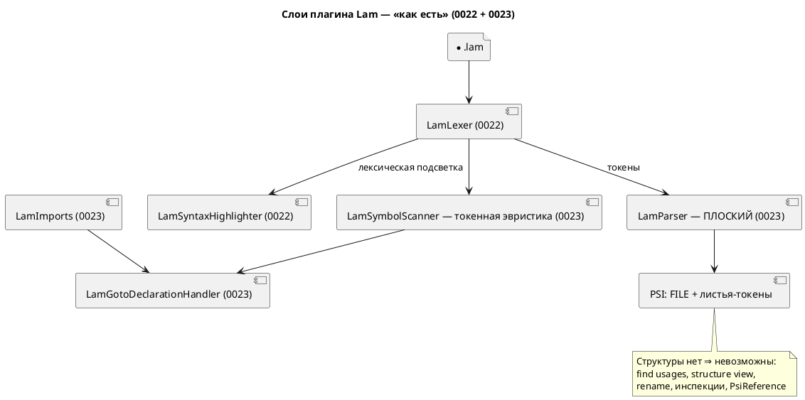
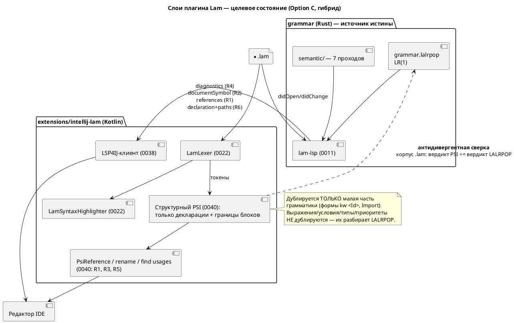

# Фича: Полноценный PSI-парсер плагина IntelliJ

- **Номер:** 0040
- **Статус:** **ОТМЕНА** (2026-07-15, решение заказчика — см. «Итог (отмена)»
  в конце карточки; правила 17, 21). До отмены: РАЗРАБОТКА · ЗАБЛОКИРОВАНА.
- **Зависит от:** **0038** — интеграция LSP4IJ. Обоснование: по ADR (Option C)
  структура файла и инспекции **поглощаются** фичей целиком (`documentSymbol`
  и `publishDiagnostics` в `lam-lsp` уже реализованы), а find usages и
  кросс-файловое разрешение — в основном. Объём 0040 нельзя ни зафиксировать, ни
  оправдать, пока LSP-путь не измерен в живой проверке.
- **Приоритет / Tier:** **низкий (Tier 3)** — большая часть заявленной ценности
  достаётся дешевле через 0038; собственная ценность 0040 сведена к нативным
  rename и `PsiReference` для путей `import`. Цена — вторая реализация грамматики
  Lam рядом с LALRPOP (класс дефектов фичи).
- **Связанные issue (анализ):** — (новая фича; из блока «Кандидаты в фичи»
  `FEATURES.md` — «Полноценный PSI-парсер плагина IntelliJ»). Является **путём 1**
  из трёх, перечисленных кандидатом [действие Reformat Code в плагине IntelliJ](0039-intellij-reformat.md)
  (Reformat Code); 0039 от 0040 **не зависит** — у неё есть путь 2 (LSP4IJ, 0038).
- **Крейт/подпроект:** существующий подпроект `extensions/intellij-lam/`
  (Kotlin + Gradle IntelliJ Platform Plugin); при необходимости — доработки
  `grammar` (`lam-lsp`), отнесённые к 0038.

## Стадии жизненного цикла (правило 17)

Все стадии — **разделы этой карточки** (правило 32): «Архитектура (ADR)»,
«Анализ», «Разработка», «Тест-план», «Отчёт о тестировании», «Итог».
Отдельным артефактом остаются только исправления —
[`docs/fixes/`](../fixes/README.md) (при необходимости `0040-YY-*`).

## Краткое описание

Надстройка над плагином IntelliJ для Lam ([плагин IntelliJ IDEA — подсветка синтаксиса Lam](0022-intellij-syntax-highlight.md)
— лексер и подсветка, [плагин IntelliJ IDEA — навигация к декларации и include](0023-intellij-navigation-include.md) — навигация)
поверх того, что **лёгкий путь 0023 сознательно не покрывает**: **find usages**,
**структура файла**, **rename**, **инспекции/диагностики**, настоящие
`PsiReference` для путей `import`, **кросс-файловое разрешение имён** (переход к
символу *внутри* импортированного файла). Go to Declaration и переход к файлу
`import` **уже сделаны в 0023** и в объём фичи не входят. Причина невозможности:
`LamParser` (0023) — **плоский** разборщик (все токены листьями под корнем,
структура не строится — осознанное решение ADR), а все перечисленные
возможности платформа строит **по структуре PSI**.

По результатам архитектурной проработки объём фичи **сокращён**: ADR
принимает **гибрид** (Option C) — тонкий *структурный* PSI (только декларации и
границы блоков) для rename/`PsiReference`/find usages, а всё, что требует смысла
(инспекции, структура файла, кросс-файловость), берётся у `lam-lsp` через LSP4IJ. Язык не меняется: синтаксис/семантика и версия языка не затрагиваются
(правило 22 неприменим), растёт лишь версия плагина.

> **Главный вывод проработки (для заказчика):** фича **существенно поглощается**
> фичей. Из шести заявленных возможностей две (структура файла, инспекции)
> закрываются ею полностью и **бесплатно** — `lam-lsp` уже сегодня отдаёт
> `textDocument/documentSymbol` и `publishDiagnostics`; ещё две (find usages,
> кросс-файловое разрешение) — в основном (нужны `references` в сервере и
> подключение уже написанной `goto_declaration_with_paths`). Собственную ценность
> сохраняют только rename и `PsiReference` для `import`. Аналитик **предлагает
> заказчику рассмотреть `ОТМЕНУ` фичи** на контрольной точке после закрытия
> 0038 (правило 17: отмена — решение заказчика). Детали — в
> [анализе](0040-intellij-psi-parser.md#анализ), раздел «Зависимости фичи».

> Фича зарегистрирована из блока «Кандидаты в фичи» `FEATURES.md`; прошла стадии
> 2–3 жизненного цикла (правило 17) и отменена на стадии 4 — см. ниже.

## Архитектура (ADR)

- **Status:** Accepted
- **Date:** 2026-07-15
- **Authors:** Архитектор + Системный аналитик
- **Related issues:** [Фича](0040-intellij-psi-parser.md); развивает
  [ADR](0023-intellij-navigation-include.md#архитектура-adr) (плоский `LamParser`) и
  [ADR](0022-intellij-syntax-highlight.md#архитектура-adr) (лексер, автономность плагина);
  пересекается с фичами [семантическая подсветка Lam в IntelliJ через lam-lsp](0038-intellij-semantic-tokens.md)
  (LSP4IJ / семантическая подсветка) и [действие Reformat Code в плагине IntelliJ](0039-intellij-reformat.md)
  (Reformat Code — путь 1 = данная фича)

### Context

#### Что есть сегодня (проверено по коду, 2026-07-15)

Плагин `extensions/intellij-lam` (версия `0.4.0`, Kotlin + Gradle IntelliJ
Platform Plugin 2.1.0, платформа IC `2024.1.7`, JDK 17) состоит из:

- **0022** — рукописный `LamLexer` (`lexer/LamLexer.kt`, 224 строки, `LexerBase`,
  без JFlex), `SyntaxHighlighter`, `Commenter`, `BraceMatcher`, `ColorSettingsPage`.
- **0023** — **плоский разбор**: `parser/LamParser.kt` (24 строки) в цикле
  `while (!builder.eof()) builder.advanceLexer()` кладёт **все токены листьями
  под единственный корень** `FILE`; `LamParserDefinition.createElement` помечен
  как фактически не вызываемый («в плоском дереве составных узлов (кроме FILE)
  нет»). **Факт подтверждён: синтаксической структуры нет.**
- **0023** — навигация: `LamSymbolScanner` (167 строк) — токенная эвристика
  `kw <Id>` (индекс `имя → TextRange`, без областей видимости);
  `LamGotoDeclarationHandler` (51 строка) — Go to Declaration в пределах **одного
  файла**; `LamImports` (70 строк) — резолв строки-пути `import` в файл.
  **Факт подтверждён: Go to Declaration и переход к файлу `import` уже работают.**
  `PsiReferenceContributor` в `plugin.xml` **не зарегистрирован** — итог 0023
  честно фиксирует: «ссылки не привязываются к листовым токенам».

Потолок плоского пути прямо назван в ADR (Option A, Cons) и в отчёте 0023:
find usages, структура файла, rename, инспекции, настоящие `PsiReference`,
кросс-файловое разрешение имён — **вне досягаемости**, потому что все они в
платформе строятся **по структуре PSI** (`PsiNamedElement`, `PsiReference`,
`PsiElement.getUseScope`, `StructureViewModel`, `FormattingModelBuilder`).



#### Неудобный вопрос: не поглощается ли фича путём LSP4IJ?

У языка **уже есть** сервер `lam-lsp`, и его возможности проверены
по коду `grammar/src/bin/lam_lsp.rs` (280 строк) и `grammar/src/lsp.rs`
(2163 строки). Сервер **сегодня** объявляет и обслуживает:

| Возможность LSP | Статус в `lam-lsp` | Что закрывает из объёма 0040 |
|---|---|---|
| `publishDiagnostics` (`didOpen`/`didChange`/`didClose`) | **есть** (`collect_diagnostics`) | **инспекции/диагностики — полностью** |
| `textDocument/documentSymbol` | **есть** (`document_symbols`, `symbols_from_model`) | **структура файла — полностью** |
| `textDocument/formatting` | **есть** (`formatting_edits`, ядро 0024) | объём фичи **0039** |
| `textDocument/semanticTokens/full` | **есть** (`SEMANTIC_TOKEN_TYPES`) | объём фичи **0038** |
| `textDocument/hover` | **есть** (`hover_info`) | сверх объёма 0040 (бонус) |
| `textDocument/declaration` | **есть** (`goto_declaration`) | уже сделано в 0023 (плоским путём) |
| `textDocument/completion` | **есть** (`completion_items`) | сверх объёма 0040 (бонус) |
| `textDocument/references` (find usages) | **НЕТ** | R1 не закрыт |
| `textDocument/rename` / `prepareRename` | **НЕТ** | R3 не закрыт |
| `textDocument/documentLink` (путь `import` → файл) | **НЕТ** | R5 не закрыт |
| кросс-файловое разрешение в **сервере** | **НЕТ** (но ядро умеет — см. ниже) | R6 не закрыт |

Существенная деталь, проверенная в коде: `grammar/src/lsp.rs:508`
`goto_declaration_with_paths(source, position, search_paths) -> Option<Location>`
**уже реализует кросс-файловый переход** (строит семантику импортированного
файла, ищет декларацию в его `SemanticIndex`, возвращает `Location` с URI
другого файла). Сервер (`lam_lsp.rs:174`) её **не вызывает** — он использует
однофайловую `goto_declaration` и подставляет URI текущего документа. То есть R6
для LSP-пути — это **подключение уже написанной функции**, а не новая разработка.

#### Главная сила: где живёт истина о языке

Разбор Lam — это `grammar/src/grammar.lalrpop` (LALRPOP, LR(1)), а смысл имён —
**семь семантических проходов** (`semantic/tree.rs`, `type_inference.rs`, …).
Собственный PSI-парсер на Kotlin — это:

1. **вторая реализация грамматики** рядом с LALRPOP (обязана не разойтись);
2. для find usages/rename с областями видимости и для инспекций — ещё и
   **вторая реализация семантики** (импорты, составные состояния `M1 + M2`,
   вывод типов, `Condition::Unresolved` у `ref`-рёбер). Это заведомо
   невыполнимый объём.

Проект уже имеет **болезненный прецедент молчаливого расхождения двух
реализаций**: фича — вычислитель выражений симулятора разошёлся со
спецификацией/генератором C, дав **восемь дефектов при полностью зелёных
тестах**; лечение потребовало вынести семантику в единственное место
(`simulation/src/eval/`) и запретить дублирование. `CLAUDE.md` прямо
предупреждает: «Добавляешь узел АСД — добавь и его печать в `format/`» —
проект сознательно строит инварианты против второй реализации.

### Decision Drivers

1. **Единственный источник истины по языку.** Всё, что знает о синтаксисе, —
   `grammar.lalrpop`; всё, что знает о смысле, — `semantic/`. Любая вторая
   реализация обязана быть механически сверяема, иначе повторится 0025.
2. **Автономность плагина (наследие 0022/0023).** Базовая подсветка и навигация
   работают офлайн, в Community, без установленного `lam-lsp` и без
   кодогенераторов. Это завоёванное свойство — терять его нельзя.
3. **Стоимость против ценности.** Шесть возможностей фичи имеют **очень разную**
   цену по разным путям; решение должно исходить из остаточного объёма после
   0038, а не из «сделаем всё нативно».
4. **Открытый диапазон IDE.** 0022/0023 держат пустой `until-build` и только
   давно стабильные API (подтверждено Plugin Verifier для IC 2024.3/2025.1/2025.2).
5. **Проверяемость.** Плагин **не собирается в CI** (`.github/workflows/ci.yml` —
   только `cargo`), `runIde` требует GUI. Любое решение должно максимально
   ложиться на автоматизируемые тесты (`BasePlatformTestCase`).
6. **Отсутствие изменений языка.** Фича редакторная: синтаксис/семантика и версия
   языка не трогаются (правило 22 неприменим; схема слоёв приведена по правилу 18
   как строго необходимая для понимания решения).

### Considered Options

#### Option A. Собственный полноценный PSI-парсер на Kotlin

Рекурсивно-нисходящий (или grammar-kit) парсер, зеркалящий `grammar.lalrpop`,
строит настоящее PSI-дерево: `PsiNamedElement`, `PsiReference`, области
видимости; поверх него — штатные find usages, Structure View, rename, инспекции,
`FormattingModelBuilder` (закрывает и путь 1 фичи).

**Pros:**
- Нативный IDE-опыт: все шесть возможностей — штатными механизмами платформы,
  без внешних процессов; работает офлайн, в Community, без `lam-lsp`.
- Разблокирует 0039 путём 1 (`FormattingModelBuilder`) и даёт задел под
  intention actions/quick fixes, недоступные LSP-пути в полном объёме.
- Не зависит от стороннего плагина LSP4IJ и его совместимости.

**Cons:**
- **Вторая реализация грамматики Lam.** Обязана не разойтись с LALRPOP при
  каждой эволюции языка (0020 `address`, 0021 `:=`/`=`, будущие) — ровно тот
  класс дефектов, который дал восемь молчаливых ошибок в 0025.
- **Инспекции нативно неосуществимы честно.** Диагностики Lam (SE-0xx, AM-0xx,
  Ce13/Ce14, вывод типов, импорты) рождаются семью семантическими проходами на
  Rust. Их «нативная» версия = третья реализация — или инспекции всё равно
  придётся брать из `lam-lsp`/`lamc`.
- **Кросс-файловое разрешение** требует своей индексации проекта (стабы,
  `FileBasedIndex`) — дорого и снова дублирует `semantic/tree.rs` (импорты,
  `import … as`, составные состояния).
- Крупнейший объём среди опций; риск сломать уже работающие 0022/0023
  (`createElement` перестанет быть заглушкой, изменится форма дерева).
- grammar-kit/JFlex вернёт кодогенератор в сборку — отказ от осознанного решения о самодостаточности.

#### Option B. LSP4IJ: всё через `lam-lsp` (объём фичи)

Плагин подключает LSP4IJ (Community-совместим, в отличие от платформенного
LSP API — Ultimate-only, см. ADR, Drivers п.2) и запускает `lam-lsp`.
Возможности приходят по протоколу; недостающие методы (`references`, `rename`,
`documentLink`) дописываются **в Rust**, поверх готового `SemanticIndex`.

**Pros:**
- **Структура файла (R2) и инспекции (R4) — бесплатно, уже сегодня**
  (`documentSymbol` и `publishDiagnostics` реализованы и обслуживаются сервером).
- Ноль дублирования грамматики: разбор и смысл — единственные, на LALRPOP +
  `semantic/`. Эволюция языка автоматически доезжает до IDE.
- Недостающее дописывается один раз на Rust и **достаётся всем клиентам сразу**
  (Zed, VS Code, IntelliJ) — а не только IntelliJ.
- R6 (кросс-файловое) — почти готов: `goto_declaration_with_paths` написана,
  нужно лишь подключить её в сервере и передать корни проекта.
- Заодно закрывает 0038 (semantic tokens) и 0039 (`textDocument/formatting`).
- Диагностики в IDE — **настоящие диагностики компилятора**, а не их имитация.

**Cons:**
- **Ломает автономность:** требуется установленный/собранный бинарник `lam-lsp`
  и работающий процесс; без него всё гаснет (базовая подсветка 0022 останется —
  она лексическая и от LSP не зависит).
- Зависимость от стороннего плагина LSP4IJ (его версии/совместимость), которую
  ADR и 0023 сознательно отклоняли.
- **Rename по LSP слабее нативного:** переименование через `WorkspaceEdit`
  не интегрируется с рефакторингом IDEA в полном объёме (превью, конфликты,
  «переименовать файл вместе с символом»).
- `PsiReference` для `import` (R5) по LSP заменяется на `documentLink` — это
  Ctrl+Click, но **не** ссылка: автообновление пути при перемещении/переименовании
  файла средствами IDEA не работает.
- Find usages по `references` работает, но не даёт группировки/скоупов уровня
  нативного `UsageType`.

#### Option C. Гибрид: PSI — для структуры, LSP — для семантики

Плагин получает **структурный (неглубокий) PSI**: узлы деклараций верхнего
уровня и границы блоков (`model`/`state`/`type`/`enum`/`cond`/`var`/`const`/`fn`/
`import`, тела — непрозрачные блоки) — **без** выражений, условий, приоритетов
операторов и типов. На нём стоят `PsiNamedElement`/`PsiReference` (R5), rename
внутри файла (R3), find usages (R1). Всё, что требует **смысла** — инспекции
(R4), кросс-файловое разрешение (R6), структура файла (R2, `documentSymbol`) —
берётся у `lam-lsp` через LSP4IJ.

**Pros:**
- Дублируется **малая и самая стабильная** часть грамматики (формы `kw <Id>`,
  правило `Import`) — та, что уже фактически продублирована сканером 0023 и
  редко меняется; риск расхождения на порядок ниже, чем в Option A.
- Настоящие `PsiReference`/rename с интеграцией в рефакторинг IDEA — то, чего
  LSP-путь дать не может.
- Семантика не дублируется вовсе: инспекции и кросс-файловость — из компилятора.
- Деградация мягкая: нет `lam-lsp` — остаются подсветка, навигация, rename,
  find usages в файле; есть — добавляются инспекции и кросс-файловость.

**Cons:**
- **Два механизма в одном плагине** — сложность интеграции и риск конфликта
  (двойная подсветка/двойные цели навигации от PSI и LSP4IJ; нужен явный арбитраж).
- Зависимость от 0038: без LSP4IJ гибрид не собирается в целевом виде ⇒
  **`ЗАБЛОКИРОВАНА`**.
- Всё равно требует антидивергентной сверки с LALRPOP (пусть и узкой).

### Decision

Принимается **Option C (гибрид)** — с прямой и обязательной фиксацией того, что
**значительная часть исходного объёма фичи поглощается фичей (LSP4IJ)**.

Разбор по возможностям (это и есть главный результат проработки):

| # | Возможность | Кто закрывает | Остаток для 0040 |
|---|---|---|---|
| R1 | find usages | 0038 + `references` в `lam-lsp` **или** PSI | частично (нативный `UsageType`, группировка) |
| R2 | структура файла | **0038 — полностью и бесплатно** (`documentSymbol` уже есть) | **нет** |
| R3 | rename | только PSI даёт нативный рефакторинг | **да — ядро остатка** |
| R4 | инспекции/диагностики | **0038 — полностью и бесплатно** (`publishDiagnostics` уже есть) | **нет** (нативно = третья реализация семантики — отвергнуто) |
| R5 | `PsiReference` для `import` | только PSI (LSP даёт лишь `documentLink`) | **да — ядро остатка** |
| R6 | кросс-файловое разрешение | 0038 + подключение готовой `goto_declaration_with_paths` | **нет** |

Итог: **из шести возможностей две (R2, R4) поглощаются фичей целиком, ещё
две (R1, R6) — в основном; собственную ценность сохраняют только R3 и R5.**

Поэтому:

1. **Фича `ЗАБЛОКИРОВАНА` зависимостью 0038.** Пока LSP4IJ не подключён,
   невозможно измерить остаточное покрытие — а строить PSI «на всякий случай»
   значит платить дублированием грамматики за то, что, возможно, уже работает.
2. **Объём 0040 сокращается** до структурного PSI + R3 + R5 (+ нативный слой R1
   поверх него, если после 0038 `references` окажется недостаточным).
3. **Аналитик выносит заказчику предложение об `ОТМЕНЕ` фичи** (правило 17 —
   отмена есть решение заказчика; аналитик вправе лишь предложить, обосновав)
   на контрольной точке **после закрытия 0038**: если LSP-путь в живой проверке
   даст приемлемые find usages/rename/навигацию, остаточная ценность (нативный
   rename и ссылки на файлы `import`) не оправдает второй реализации грамматики.
4. **Option A отвергается** как несущий главный риск проекта (вторая реализация
   грамматики + неизбежная третья реализация семантики ради инспекций) при
   ценности, большая часть которой достаётся дешевле путём 0038.
5. **Option B в чистом виде отвергается** только по двум пунктам (нативный
   rename и `PsiReference` для путей); во всём остальном он принимается —
   гибрид и означает «Option B плюс тонкий структурный PSI».



#### Риск дублирования грамматики — как удерживается

Собственный PSI-парсер — это **вторая реализация грамматики Lam рядом с
LALRPOP**, и проект уже знает цену молчаливому расхождению (0025: два
вычислителя разошлись, восемь дефектов при зелёных тестах). Меры, обязательные
к реализации в рамках 0040:

1. **Сузить площадь дублирования.** PSI разбирает только формы деклараций и
   границы блоков; выражения/условия/приоритеты (`Chain<Atom>`, `:=`/`=`,
   `Condition` vs `Expression` — инварианты `CLAUDE.md`) **не дублируются**:
   тело блока — непрозрачный узел из токенов. Всё, что не разобрано структурно,
   не может разойтись по смыслу.
2. **Механическая антидивергентная сверка** (аналог `format_tests.rs`, гоняющего
   форматтер по всему корпусу): тест плагина проходит по **всем** `.lam`
   репозитория (`examples/`, `grammar/tests/data/**`) и требует
   (а) round-trip: текст, собранный обратно из PSI, **байт-в-байт** равен
   исходному (потеря куска исходника невозможна по построению);
   (б) сверку **синтаксического** вердикта с оракулом, порождённым LALRPOP
   (`lamc` на том же корпусе): где LALRPOP разобрал — PSI не даёт
   `PsiErrorElement`. Семантически невалидные файлы (`tests/data/semantic/invalid/`)
   входят в сверку как **синтаксически валидные** — различие «ошибка разбора»
   vs «ошибка семантики» обязано соблюдаться.
3. **Отказ вместо тихой потери.** Незнакомая конструкция ⇒ явный
   `PsiErrorElement`/провал теста корпуса, а не молчаливое проглатывание — тот
   же принцип, что закреплён у форматтера 0024 («молча потерять кусок исходника
   хуже»).
4. **Запись в `CLAUDE.md` при закрытии фичи** (по образцу форматтера):
   «добавляешь узел АСД — добавь и его разбор в PSI плагина, иначе тест корпуса
   завалит сборку».

### Consequences

#### Положительные

- **Честная экономия:** две из шести возможностей (структура файла, инспекции)
  не разрабатываются вовсе — они уже написаны и лишь ждут транспорта (0038).
- Семантика Lam остаётся в **одном** месте (`semantic/`); инспекции в IDE —
  настоящие диагностики компилятора, а не их kotlin-имитация.
- Площадь дублирования грамматики сведена к формам `kw <Id>` и `Import` —
  фактически к тому, что уже дублирует `LamSymbolScanner` (0023), с той разницей,
  что теперь это дублирование **механически сверяется** с LALRPOP.
- Доработки `lam-lsp` (`references`, `rename`, `documentLink`, подключение
  `goto_declaration_with_paths`) достаются **всем** редакторам, а не только IDEA.
- 0039 получает второй, более дешёвый путь (LSP `textDocument/formatting` через
  0038) и не обязан ждать полного PSI.

#### Отрицательные / Action items

- **Фича `ЗАБЛОКИРОВАНА` до закрытия 0038** — работа не начинается (правило 17).
- **Контрольная точка после 0038 (обязательна):** переоценить остаток R1/R3/R5 в
  живой проверке; при достаточности LSP-пути — вынести заказчику **предложение
  об `ОТМЕНЕ` 0040** (правило 17: решение заказчика).
- **Action item в `lam-lsp` (вне объёма 0040; отнести к 0038 или отдельной фиче):**
  реализовать `textDocument/references`, `textDocument/rename`,
  `textDocument/documentLink`; подключить `goto_declaration_with_paths` вместо
  однофайловой `goto_declaration` (`bin/lam_lsp.rs:174`) и передавать корни
  проекта из `initialize`.
- **Риск конфликта двух механизмов** (PSI и LSP4IJ дают цели навигации/подсветку
  одновременно) — требует явного арбитража: PSI молчит там, где отвечает LSP.
- **Обратная совместимость 0023** (правило 11): `LamParser` перестаёт быть
  плоским ⇒ `LamGotoDeclarationHandler`/`LamSymbolScanner`/`LamImports`,
  опирающиеся на `findElementAt`/листовые токены, обязаны продолжать работать
  (или быть перенесены на PSI без потери поведения). Все 47 тестов —
  регресс, обязаны остаться зелёными.
- **Проверяемость ограничена:** плагин не собирается в CI (`ci.yml` — только
  `cargo`), `runIde` требует GUI ⇒ часть критериев остаётся визуальной
  (остаточные пункты 0022/0023 сохраняются).
- Язык не меняется: версия языка не растёт (правило 22 неприменим); растёт
  версия плагина (минорная — аддитивные возможности).

#### Acceptance criteria

1. **Зависимость соблюдена:** работы по 0040 не начаты, пока 0038 не в `ГОТОВО`;
   после закрытия 0038 в анализе 0040 зафиксирована переоценка остатка (R1/R3/R5)
   и решение «продолжать / предложить `ОТМЕНУ`».
2. **Антидивергенция:** тест по **всему корпусу** `.lam` репозитория зелёный —
   round-trip PSI байт-в-байт и совпадение синтаксического вердикта с оракулом
   LALRPOP; новый узел АСД без разбора в PSI **валит** сборку плагина.
3. **R5:** путь в `import "…";`, `import "…" as X;`, `import * as X from "…";`,
   `import { … } from "…";` имеет настоящий `PsiReference` (`FileReference`):
   Ctrl+Click ведёт к файлу, переименование/перемещение файла средствами IDEA
   обновляет путь в `.lam`.
4. **R3:** rename имени Lam (`model`/`state`/`type`/`enum`/`cond`/`var`/`const`/
   `fn`/алиас `import`) переименовывает декларацию и все её использования в
   файле; на конфликте — штатное предупреждение IDEA; Undo возвращает исходный текст.
5. **R1:** find usages по декларации отдаёт список использований в файле
   (кросс-файловый — от LSP `references`, если реализован в 0038).
6. **R2, R4, R6 закрыты фичей** — в 0040 отдельно не реализуются; критерий
   считается выполненным ссылкой на отчёт 0038.
7. **Регресс:** `./gradlew --offline clean buildPlugin test` зелёный, все тесты (47) проходят без изменения поведения; Plugin Verifier —
   **Compatible** на текущем спреде IC; `until-build` остаётся пустым.

## Анализ

### Цель и контекст

Дать в плагине `extensions/intellij-lam` то, что лёгкий путь [плагин IntelliJ IDEA — навигация к декларации и include](0023-intellij-navigation-include.md)
сознательно не покрывает: find usages, структуру файла, rename, инспекции,
настоящие `PsiReference` для путей `import`, кросс-файловое разрешение имён.
Go to Declaration и переход к файлу `import` **уже сделаны в 0023** — в объём не
входят.

#### Реальное состояние (перепроверено по коду, 2026-07-15)

| Утверждение | Вердикт | Подтверждение |
|---|---|---|
| Парсер плагина **плоский** | **подтверждено** | `parser/LamParser.kt` (24 строки): `while (!builder.eof()) builder.advanceLexer()` — все токены листьями под корнем `FILE`; `LamParserDefinition.createElement` помечен «фактически не вызывается» |
| Go to Declaration **готов** | **подтверждено** | `navigation/LamGotoDeclarationHandler.kt` (51 строка) + `LamSymbolScanner.kt` (167 строк); `gotoDeclarationHandler` зарегистрирован в `plugin.xml`; тесты `LamGotoDeclarationTest`, `LamSymbolScannerTest` |
| Переход к файлу `import` **готов** | **подтверждено** | `navigation/LamImports.kt` (70 строк) — `pathOf`/`resolve`; тот же handler; тест `LamImportReferenceTest` |
| `PsiReference` для `import` **Не сделан** | **подтверждено** | `PsiReferenceContributor` в `plugin.xml` отсутствует; итог 0023: «ссылки не привязываются к листовым токенам» |
| Разрешение имён — токенная эвристика одного файла | **подтверждено** | `LamSymbolScanner`: индекс `имя → TextRange` по формам `kw <Id>`, без областей видимости (осознанное ограничение ADR) |
| Плагин: версия `0.4.0`, IC `2024.1.7`, JDK 17, 47 тестов зелёные | **подтверждено** | `gradle.properties`, `build.gradle.kts`, итог 0023 |

#### Что уже умеет `lam-lsp` (перепроверено: `grammar/src/bin/lam_lsp.rs`, `grammar/src/lsp.rs`)

**Реализовано и обслуживается сервером:** `publishDiagnostics` (на
`didOpen`/`didChange`/`didClose`, через `collect_diagnostics`),
`textDocument/documentSymbol` (`document_symbols`), `textDocument/formatting`
(`formatting_edits`, ядро 0024), `textDocument/semanticTokens/full`,
`textDocument/hover`, `textDocument/declaration` (`goto_declaration`),
`textDocument/completion`.

**Не реализовано:** `textDocument/references` (find usages),
`textDocument/rename`/`prepareRename`, `textDocument/documentLink`,
`workspace/symbol`, кросс-файловость **в сервере**.

**Важная находка:** `grammar/src/lsp.rs:508` `goto_declaration_with_paths(source,
position, search_paths) -> Option<Location>` **уже реализует кросс-файловый
переход** (строит семантику импортированного файла, ищет в его `SemanticIndex`,
возвращает `Location` с URI другого файла), но сервер (`bin/lam_lsp.rs:174`) её
**не вызывает** — использует однофайловую `goto_declaration` и подставляет URI
текущего документа. Для LSP-пути R6 — это подключение готовой функции, а не
разработка.

### Зависимости фичи (правило 17/19)

- **Зависит от:** **0038** (интеграция LSP4IJ / семантическая подсветка).
  **Фича переводится в `ЗАБЛОКИРОВАНА`** до закрытия 0038.

  **Обоснование (вердикт по поглощению — главный результат анализа).** Разбор
  заявленных возможностей против фактических возможностей `lam-lsp`:

  | # | Возможность 0040 | Закрывается путём 0038 (LSP4IJ)? | Остаток для 0040 |
  |---|---|---|---|
  | R1 | find usages | **в основном** — нужен `textDocument/references` в `lam-lsp` (логика есть: `SemanticIndex`) | нативный `UsageType`/группировка |
  | R2 | структура файла | **ДА, полностью и бесплатно** — `documentSymbol` уже реализован и обслуживается | **нет** |
  | R3 | rename | **частично** — `textDocument/rename` дал бы правку текста, но без нативного рефакторинга IDEA (превью/конфликты/файл вместе с символом) | **да — ядро остатка** |
  | R4 | инспекции/диагностики | **ДА, полностью и бесплатно** — `publishDiagnostics` уже реализован; это **настоящие** диагностики компилятора (SE-0xx/AM-0xx/Ce13/Ce14) | **нет** — нативная версия = третья реализация семантики (отвергнуто ADR) |
  | R5 | `PsiReference` для `import` | **нет** — LSP даёт лишь `documentLink` (Ctrl+Click без рефакторинга путей) | **да — ядро остатка** |
  | R6 | кросс-файловое разрешение | **в основном** — `goto_declaration_with_paths` написана, нужно подключить в сервере | **нет** |

  **Вердикт: 2 из 6 возможностей поглощаются фичей целиком (R2, R4), ещё 2 —
  в основном (R1, R6). Собственную ценность сохраняют R3 и R5.** Витрина
  `FEATURES.md` в кандидате 0039 не ошибается: путь LSP4IJ «выглядит самым
  выгодным». Строить PSI до 0038 значит платить **второй реализацией грамматики
  Lam** (класс дефектов фичи — восемь молчаливых расхождений при зелёных
  тестах) за то, что, возможно, уже работает.

- **Вердикт по 0039** (Reformat Code): **зависимости нет ни в одну сторону**.
  0040 — путь 1 из трёх, перечисленных 0039; но у 0039 есть путь 2 (LSP4IJ через
  0038: `textDocument/formatting` **уже реализован** в сервере) и путь 3
  (`lamc fmt --stdin` внешним процессом). Ставить 0039 в зависимость от 0040
  **нельзя** — это заставило бы ждать самый дорогой путь ради возможности,
  доступной дешевле. Рекомендация аналитика: **0039 зависит от 0038**, не от
  0040. (Решение по 0039 — за её аналитиком; здесь фиксируется как вход.)

- **Влияние на порядок разработки (правило 19):** 0040 ставится в таблице
  `FEATURES.md` **после 0038** со статусом `ЗАБЛОКИРОВАНА` и приоритетом Tier 3
  (правило 19 п.1 — зависимость выполняется первой, даже если менее приоритетна;
  п.3 — низкий приоритет). Завершение 0040 **никого не разблокирует** (0039
  разблокируется фичей). Дополнительный аргумент по п.4 (необходимость):
  0038 разблокирует и 0039, и большую часть 0040 — её ценность для порядка
  существенно выше.

- **Контрольная точка (обязательна).** После закрытия 0038 аналитик
  **переоценивает** остаток R1/R3/R5 в живой проверке и фиксирует решение здесь:
  продолжать 0040 в сокращённом объёме **или** вынести заказчику **предложение об
  `ОТМЕНЕ`** (правило 17: отмена — решение заказчика; аналитик вправе лишь
  предложить). Критерий: если после 0038 find usages и rename по LSP признаны
  приемлемыми, остаточная ценность (нативный rename + рефакторинг путей `import`)
  **не оправдывает** второй реализации грамматики → предложить `ОТМЕНУ`.

- **Action items для `lam-lsp` (вне объёма 0040; отнести к 0038 или отдельной
  фиче):** `textDocument/references`, `textDocument/rename`/`prepareRename`,
  `textDocument/documentLink`; подключить `goto_declaration_with_paths` вместо
  `goto_declaration` (`bin/lam_lsp.rs:174`) и передавать корни проекта из
  `initialize`. Выигрыш достаётся **всем** клиентам (Zed, VS Code, IntelliJ).

### Требования и проверяемые условия

Объём по ADR (Option C, гибрид). Помечено, что реализуется в 0040, а что
**принимается от 0038**.

- **R1. Find usages** *(0040 — нативный слой поверх структурного PSI;
  кросс-файловый — от 0038)*. По декларации имени Lam (`model`/`state`/`start`/
  `type`/`enum`/`cond`/`var`/`const`/`fn`/порты `in`/`out`/`inout`/алиасы
  `import`) IDE отдаёт список использований в файле. На не-декларации — молчит.
  Ложных срабатываний по совпадению имён в строках/комментариях нет.
- **R2. Структура файла** *(принимается от 0038 — `textDocument/documentSymbol`)*.
  Structure View показывает дерево деклараций файла. В 0040 **не реализуется**;
  критерий закрывается ссылкой на отчёт 0038. Условие приёмки: если после 0038
  Structure View пуст/некорректен — дефект заводится **на 0038**, а не на 0040.
- **R3. Rename** *(0040 — ядро остатка)*. Переименование имени Lam через штатный
  рефакторинг IDEA (`Shift+F6`) меняет декларацию и все использования в файле
  атомарно; конфликт имён даёт штатное предупреждение; Undo возвращает исходный
  текст байт-в-байт. Строки/комментарии не задеваются. Rename **не должен**
  затрагивать имя, объявленное в другом файле (без 0038 — вне области).
- **R4. Инспекции/диагностики** *(принимается от 0038 — `publishDiagnostics`)*.
  Ошибки и предупреждения компилятора (SE-0xx, AM-0xx, Ce13 unused, Ce14
  недетерминированные переходы) подсвечиваются в редакторе. В 0040 **не
  реализуется**: нативная реализация потребовала бы третьей реализации семантики
  (7 проходов) — отвергнуто ADR как главный риск проекта.
- **R5. Настоящий `PsiReference` для путей `import`** *(0040 — ядро остатка)*.
  Строковый литерал-путь во всех формах (`import "P";`, `import "P" as X;`,
  `import * as X from "P";`, `import { A as C } from "P";`) несёт
  `PsiReference`/`FileReference`: Ctrl+Click ведёт к файлу (**не хуже 0023**), а
  переименование/перемещение файла средствами IDEA **обновляет путь** в `.lam`.
  Битый путь → ссылка не разрешается (подсветка «файл не найден»), без исключений.
- **R6. Кросс-файловое разрешение имён** *(принимается от 0038)*. Переход к
  символу *внутри* импортированного файла. В 0040 **не реализуется**: собственная
  индексация проекта (стабы/`FileBasedIndex`) дублировала бы `semantic/tree.rs`
  (импорты, `import … as`, составные состояния `M1 + M2`), тогда как
  `goto_declaration_with_paths` уже написана и ждёт подключения в сервере.
- **R7. Антидивергенция с LALRPOP** *(0040 — обязательное сопровождение)*.
  Структурный PSI разбирает **только** формы деклараций и границы блоков; тела
  блоков, выражения, условия, приоритеты (`Chain<Atom>`, `:=`/`=`, разделение
  `Condition`/`Expression` — инварианты `CLAUDE.md`) **не дублируются**.
  Механическая сверка по всему корпусу `.lam`: (а) round-trip PSI → текст
  байт-в-байт; (б) синтаксический вердикт PSI совпадает с вердиктом LALRPOP
  (семантически невалидные файлы — синтаксически валидны). Новый узел АСД без
  разбора в PSI **валит** сборку плагина (принцип форматтера 0024: «молча
  потерять кусок исходника хуже»).
- **R8. Обратная совместимость 0022/0023** *(правило 11)*. Переход от плоского
  PSI к структурному не меняет наблюдаемого поведения: подсветка, Commenter,
  BraceMatcher, Go to Declaration (имена и пути `import`) работают как прежде;
  все 47 существующих тестов зелёные **без правок ожиданий**.
- **R9. Стабильные API и диапазон IDE.** Только давно стабильные точки
  расширения; `until-build` остаётся пустым; Plugin Verifier — Compatible на
  текущем спреде IC. Кодогенераторы (JFlex/grammar-kit) в сборку **не вводятся**
  (решение о самодостаточности) — парсер рукописный, как и лексер.
- **R10. Мягкая деградация и арбитраж с LSP4IJ.** Без установленного
  `lam-lsp`/LSP4IJ плагин сохраняет подсветку, навигацию, rename и find usages в
  файле (гаснут лишь R2/R4/R6). PSI и LSP4IJ не конфликтуют: PSI молчит там, где
  отвечает LSP (явный арбитраж целей навигации и подсветки).

### Критерии приёмки и способ проверки

| # | Критерий | Способ проверки |
|---|---|---|
| A1 | 0038 закрыта (`ГОТОВО`); остаток R1/R3/R5 переоценён, решение «продолжать / предложить `ОТМЕНУ`» зафиксировано в этом файле | ревью артефактов: статус 0038 в `docs/features/README.md` + запись в разделе «Контрольная точка» |
| A2 | Round-trip: текст, собранный из PSI, байт-в-байт равен исходнику — на **всём** корпусе `.lam` (`examples/`, `grammar/tests/data/**`) | тест `LamPsiCorpusTest` (`BasePlatformTestCase`), обход корпуса |
| A3 | Синтаксический вердикт PSI совпадает с вердиктом LALRPOP на всём корпусе; расхождение валит сборку | `LamPsiCorpusTest` против оракула, порождённого `lamc` (тест-план, T3) |
| A4 | Новый узел АСД без разбора в PSI обнаруживается механически | негативная проба: фикстура с неизвестной конструкцией → `PsiErrorElement`/провал теста корпуса |
| A5 | `PsiReference` на пути `import` (4 формы): Ctrl+Click ведёт к файлу | тест `LamImportPsiReferenceTest`: `reference.resolve()` == ожидаемый `PsiFile` |
| A6 | Переименование файла `.lam` средствами IDEA обновляет путь в `import` | тест: `myFixture.renameElement(psiFile, …)` → текст `.lam` содержит новый путь |
| A7 | Битый путь: ссылка не резолвится, исключений нет | негативный тест |
| A8 | Rename имени: декларация + все использования в файле; строки/комментарии не тронуты | тест `LamRenameTest` (`myFixture.renameElementAtCaret`) + сверка с эталоном |
| A9 | Rename: Undo возвращает исходный текст | тест `myFixture` с undo |
| A10 | Find usages по декларации отдаёт ожидаемое число/позиции использований | тест `LamFindUsagesTest` (`myFixture.testFindUsages`) |
| A11 | Find usages на не-декларации/ключевом слове — пусто, без исключений | негативный тест |
| A12 | R2/R4/R6 закрыты фичей | ссылка на отчёт 0038; в 0040 не реализуются (н/п) |
| A13 | Регресс 0022/0023: все 47 тестов зелёные, поведение навигации не изменилось | `./gradlew --offline clean buildPlugin test` |
| A14 | Диапазон IDE не сужен; бинарная совместимость подтверждена | `./gradlew verifyPlugin` → Compatible; `pluginUntilBuild` пуст |
| A15 | Живая проверка в IDE (визуально): rename, find usages, Structure View, инспекции | ручной прогон `runIde` (GUI; не автоматизируется — см. тест-план) |

### Особенности по обратной функциональности

Правило 11 — совместимость **полная**, но требует внимания в одной точке:

- **Язык не затронут.** Синтаксис, семантика, `grammar`/`simulation`, генераторы,
  форматтер, версия языка — без изменений (правило 22 неприменим). Фича живёт
  целиком в `extensions/intellij-lam/`; при реализации action items — ещё в
  `lam-lsp`, но и там аддитивно (новые методы протокола).
- **Точка риска — замена плоского PSI структурным (0023).**
  `LamGotoDeclarationHandler` опирается на
  `element.node?.elementType == LamTokenTypes.IDENTIFIER`/`STRING` и
  `file.findElementAt(...)`, `LamSymbolScanner` — на собственную токенизацию
  текста, `LamImports` — на листовой токен-строку. Появление составных узлов
  меняет форму дерева: `sourceElement` под кареткой останется листом
  (`findElementAt` всегда отдаёт лист), но родительская цепочка изменится.
  Требование: **поведение 0023 не меняется** (R8), 47 тестов — регресс без правок
  ожиданий. При переносе резолва на PSI старые классы либо сохраняются, либо
  заменяются с сохранением наблюдаемого поведения.
- **Совместимость с 0022 не затрагивается:** подсветка лексическая, от PSI не
  зависит (`SyntaxHighlighter` работает на `LamLexer`).
- **Пользовательская совместимость:** возможности **аддитивны** — новых
  ограничений и изменений существующих действий нет; версия плагина растёт
  минорно (SemVer; правило 22 — к плагину, не к языку).
- **Совместимость с 0038:** оба механизма в одном плагине — обязателен арбитраж
  (R10), иначе пользователь увидит дублирующиеся цели навигации/подсветку.

### Риски и зависимости

- **Риск (главный): вторая реализация грамматики расходится с LALRPOP молча.**
  Прецедент — фича (два вычислителя разошлись; восемь дефектов при зелёных
  тестах). Снижение: (1) сузить площадь до форм `kw <Id>` и `Import` — выражения/
  условия/типы **не разбирать**; (2) механическая сверка по всему корпусу с
  оракулом LALRPOP + round-trip (R7, A2–A4); (3) отказ вместо тихой потери;
  (4) запись-инвариант в `CLAUDE.md` при закрытии (по образцу форматтера 0024).
- **Риск: фича обесценивается фичей.** Уже реализовавшийся на 2/3 сценарий —
  зафиксирован вердиктом выше. Снижение: блокировка до 0038 + обязательная
  контрольная точка с возможным предложением `ОТМЕНЫ` (A1). Это дешевле, чем
  обнаружить дублирование после разработки.
- **Риск: конфликт PSI и LSP4IJ** (двойные цели навигации, двойная подсветка).
  Снижение: явный арбитраж (R10), проверка в живом прогоне (A15).
- **Риск: регресс навигации 0023** при смене формы дерева. Снижение: R8/A13 —
  47 тестов как жёсткий контракт; правка ожиданий существующих тестов
  **запрещена** (изменение ожиданий = изменение поведения).
- **Риск/ограничение: проверяемость.** Плагин **не собирается в CI**
  (`.github/workflows/ci.yml` — только `cargo build/check/test`), `runIde`
  требует GUI. Снижение: максимум критериев на `BasePlatformTestCase`
  (A2–A11, A13), локальный прогон `./gradlew --offline clean buildPlugin test`
  как обязательный шлюз; визуальным остаётся только A15. Остаточные пункты
  0022/0023 сохраняются.
- **Риск: оракул LALRPOP требует моста Rust ↔ Kotlin.** Плагин не может вызвать
  `lamc` в тесте, если бинарник не собран. Снижение: оракул — **артефакт**
  (текстовый файл вердиктов), порождаемый заранее; тест плагина читает его;
  отсутствие/устаревание оракула → тест **падает** (а не пропускается).
- **Зависимость:** 0038 (жёсткая, блокирующая — см. раздел «Зависимости фичи»).
  От 0039 не зависит; 0039 не должна зависеть от 0040.

### Подзадачи разработки

| Задача | Заголовок | Объём |
|---|---|---|
| [полноценный PSI-парсер плагина IntelliJ](0040-intellij-psi-parser.md#разработка) | Структурный PSI-парсер: каркас и узлы деклараций | R7, R8, R9 (ядро) |
| [полноценный PSI-парсер плагина IntelliJ](0040-intellij-psi-parser.md#разработка) | Ссылки и резолв имён на PSI; `PsiReference` для путей `import` | R5, R8 |
| [полноценный PSI-парсер плагина IntelliJ](0040-intellij-psi-parser.md#разработка) | Find usages поверх PSI | R1 |
| [полноценный PSI-парсер плагина IntelliJ](0040-intellij-psi-parser.md#разработка) | Rename (штатный рефакторинг IDEA) | R3 |
| [полноценный PSI-парсер плагина IntelliJ](0040-intellij-psi-parser.md#разработка) | Арбитраж с LSP4IJ и приёмка R2/R4/R6 от 0038 | R2, R4, R6, R10 |

<!-- Правило 17: при большом объёме аналитику декомпозировать на подзадачи
     docs/analyze/0040-YY-intellij-psi-parser.md (как в разработке), а этот файл оставить обзором.
     Объём анализа умещается в обзор — декомпозиция аналитики не требуется. -->

## Разработка

### Задача

> **Планируется (разработка не начата).** Фича **ЗАБЛОКИРОВАНА** зависимостью
> [семантическая подсветка Lam в IntelliJ через lam-lsp](0038-intellij-semantic-tokens.md) (правило 17): работы не
> начинаются, пока 0038 не в статусе `ГОТОВО` и не пройдена контрольная точка
> переоценки остатка (анализ, A1). Ниже — план, а не отчёт.

#### Что было

**Реальное состояние плагина `extensions/intellij-lam` на 2026-07-15** (проверено
по коду; версия плагина `0.4.0`, IntelliJ Platform IC `2024.1.7`, JDK 17,
Gradle wrapper 8.10.2, Kotlin 2.0.21, **47 тестов зелёные**):

- **Фича (закрыта):** рукописный `lexer/LamLexer.kt` (224 строки, `LexerBase`,
  без JFlex/кодогенераторов), `highlight/LamSyntaxHighlighter.kt` +
  `LamSyntaxHighlighterFactory`, `LamHighlighterColors`, `LamColorSettingsPage`,
  `editor/LamCommenter.kt`, `editor/LamBraceMatcher.kt`, `LamFileType`/`LamLanguage`
  (регистрация `.lam`). Подсветка **лексическая** и от PSI не зависит.
- **Фича (закрыта):** `parser/LamParser.kt` — **плоский** разборщик (24
  строки): `val rootMarker = builder.mark(); while (!builder.eof())
  builder.advanceLexer(); rootMarker.done(root)`. Все токены лежат **листьями под
  единственным корнем** `FILE`. Комментарий в коде честен: «Синтаксическая
  структура не строится (ADR, Option A)». `LamParserDefinition.createElement`
  возвращает `ASTWrapperPsiElement` и помечен «фактически не вызывается».
- **Навигация 0023 (работает):** `navigation/LamSymbolScanner.kt` (167 строк) —
  токенная эвристика форм `kw <Id>` (`model`/`state`/`start`/`type`/`cond`/`var`/
  `const`/`fn`/`in`/`out`/`inout`, варианты `enum`, локальные имена `import`),
  строит `имя → TextRange` **без областей видимости**;
  `navigation/LamGotoDeclarationHandler.kt` (51 строка) — Go to Declaration в
  пределах одного файла; `navigation/LamImports.kt` (70 строк) — резолв строки-пути
  `import` в `VirtualFile`/`PsiFile`. В `plugin.xml` зарегистрированы
  `lang.parserDefinition` и `gotoDeclarationHandler`.
- **`PsiReferenceContributor` отсутствует** — итог 0023: «ссылки не привязываются
  к листовым токенам».

**Проблема (ADR, Context).** Всё, чего просит фича, платформа строит **по
структуре PSI** (`PsiNamedElement`, `PsiReference`, `StructureViewModel`,
`FormattingModelBuilder`). Структуры нет ⇒ find usages, rename, настоящие ссылки
недостижимы в принципе.

**Ограничение решения (ADR, Decision — Option C).** Строить **полную**
грамматику в PSI **запрещено**: это вторая реализация `grammar.lalrpop` (а ради
инспекций — ещё и третья реализация семантики), класс дефектов фичи (два
вычислителя разошлись молча — восемь дефектов при зелёных тестах). Разрешён
**структурный (неглубокий)** PSI.

#### Что сделано

**Планируется (разработка не начата).** План задачи:

1. **Узлы PSI — только структура.** Ввести составные элементы:
   `LAM_FILE` → `IMPORT_DECL` | `MODEL_DECL` | `TYPE_DECL` | `ENUM_DECL` |
   `STATE_DECL` | `COND_DECL` | `VAR_DECL` | `CONST_DECL` | `FN_DECL` |
   `PORT_DECL` | `ADDRESS_DECL` (0020); у каждого — дочерний `NAME_ID`
   (`PsiNamedElement`-носитель) и **непрозрачный** `BODY_BLOCK`/`TAIL` (набор
   листовых токенов до разделителя).
2. **Что не разбирается (осознанно):** выражения, условия, цепочки приоритетов
   (`Chain<Atom>`), `:=`/`=`, разделение `Condition`/`Expression`, типы. Это
   инварианты `CLAUDE.md`, живущие в LALRPOP; их дублирование запрещено.
   Тело блока — непрозрачный узел: **то, что не разобрано, не может разойтись**.
3. **`LamParser` переписывается** с плоского на структурный: `PsiBuilder.Marker`
   на декларацию, восстановление после ошибки — по границам `;`/`}`/следующему
   ключевому слову декларации. Разбор **не должен** становиться менее
   устойчивым, чем плоский (0023: «любой набор токенов принимается»): незнакомое
   → `PsiErrorElement`, но **никогда** не потеря текста.
4. **`LamParserDefinition.createElement`** перестаёт быть заглушкой — фабрика
   реальных PSI-классов; `LamFile` без изменений.
5. **Антидивергентный тест `LamPsiCorpusTest` (R7)** — центральный артефакт
   задачи, по образцу `grammar/tests/format_tests.rs` (гоняет форматтер по всему
   корпусу и валит сборку на новом узле): обход **всех** `.lam` из `examples/` и
   `grammar/tests/data/**`; round-trip байт-в-байт (T1); сверка синтаксического
   вердикта с оракулом `psi-oracle.txt`, порождённым `lamc` (T3); отсутствие
   оракула → **провал** (T5).
6. **Кодогенераторы не вводятся** (R9): парсер рукописный, как и лексер 0022 —
   решение о самодостаточности сборки сохраняется.

**Статус по функциональности (правило 11):**

- Плагин `intellij-lam` — **основная работа** (парсер, PSI-узлы, тест корпуса).
- Навигация 0023 — **риск регресса**: форма дерева меняется; 47 тестов обязаны
  остаться зелёными **без правок ожиданий** (R8). Перенос `LamSymbolScanner`/
  `LamGotoDeclarationHandler` на PSI — [полноценный PSI-парсер плагина IntelliJ](0040-intellij-psi-parser.md#разработка).
- `grammar`/`simulation`, синтаксис/семантика/версия языка — **н/п**: фича
  редакторная, языковой слой не затрагивается (правила 16 и 22 неприменимы).
- `lam-lsp` — **н/п** в этой задаче (доработки протокола отнесены к 0038).

#### Проверки

**Планируется.** Соответствие: R7, R8, R9 анализа; критерии A2–A4, A13, A14;
проверки T1–T7, T21–T23 тест-плана.

```sh
cd extensions/intellij-lam
./gradlew --offline clean buildPlugin test   # шлюз: сборка + все тесты (47 регресс + новые)
./gradlew verifyPlugin                       # Compatible на спреде IC; until-build пуст
```

- **T1/A2** — round-trip по всему корпусу: текст из PSI байт-в-байт равен исходнику.
- **T3/A3** — вердикт PSI == вердикт оракула LALRPOP для каждого файла корпуса.
- **T4** — `semantic/invalid/*.lam` синтаксически валидны (различие «ошибка
  разбора» vs «ошибка семантики» соблюдено).
- **T6/A4** — фикстура с непокрытой конструкцией валит сборку (проверка самого
  механизма защиты).
- **T21/A13** — 47 существующих тестов зелёные **без правок ожиданий**.
- Правило 5 (полная сборка с очисткой) выполняется `clean buildPlugin test`.
  **Ограничение:** CI плагин не собирает (`ci.yml` — только `cargo`) ⇒ шлюз
  локальный; `runIde` (GUI) в этой задаче не нужен.

### Задача

> **Планируется (разработка не начата).** Фича **ЗАБЛОКИРОВАНА** зависимостью
> [семантическая подсветка Lam в IntelliJ через lam-lsp](0038-intellij-semantic-tokens.md); задача выполняется после
> [полноценный PSI-парсер плагина IntelliJ](0040-intellij-psi-parser.md#разработка).

#### Что было

- **Резолв имён (0023):** `LamSymbolScanner.scan(file.text)` заново токенизирует
  текст и отдаёт список `LamDeclaration(name, range, kind)`;
  `LamGotoDeclarationHandler` фильтрует по имени под кареткой и через
  `file.findElementAt(range.startOffset)` отдаёт **листовой токен** как цель.
  Настоящих `PsiReference` нет — платформа о связи «использование → декларация»
  не знает.
- **Пути `import` (0023):** `LamImports.pathOf(element)` достаёт путь из
  строкового токена, `LamImports.resolve(element, path)` ищет файл относительно
  каталога и корней контента. Навигация работает, но через тот же
  `GotoDeclarationHandler`. **`PsiReferenceContributor` в `plugin.xml`
  отсутствует** — итог 0023 фиксирует причину: «ссылки не привязываются к
  листовым токенам».
- **Следствие (ADR, Cons):** без `PsiReference` платформа не может ни
  переименовать, ни найти использования, ни обновить путь при перемещении файла.

#### Что сделано

**Планируется (разработка не начата).** План задачи:

1. **`LamNamedElement`** — `NAME_ID` из [полноценный PSI-парсер плагина IntelliJ](0040-intellij-psi-parser.md#разработка)
   реализует `PsiNamedElement` (`getName`/`setName`/`getNameIdentifier`).
   `setName` — основа rename ([полноценный PSI-парсер плагина IntelliJ](0040-intellij-psi-parser.md#разработка)).
2. **`LamNameReference`** — `PsiReferenceBase<LamNameElement>` на идентификаторе-
   использовании: `resolve()` ищет декларацию **в текущем файле** по PSI (не
   перетокенизацией текста). Область — файл; кросс-файловый резолв **не
   реализуется** (R6 принимается от 0038, см. [полноценный PSI-парсер плагина IntelliJ](0040-intellij-psi-parser.md#разработка)).
3. **`LamImportPathReference` (R5, ядро остатка фичи)** — `FileReference`/
   `PsiReferenceBase` на строковом литерале-пути, регистрируется через
   `psi.referenceContributor` в `plugin.xml`. Даёт то, чего LSP-путь дать не
   может: `bindToElement` ⇒ **переименование/перемещение файла средствами IDEA
   обновляет путь** в `.lam`. Все 4 формы: `import "P";`, `import "P" as X;`,
   `import * as X from "P";`, `import { A as C } from "P";`. Логика поиска файла
   **переиспользуется** из `LamImports` (не переписывается).
4. **Совместимость с 0023 (R8) — жёсткое требование.** `LamGotoDeclarationHandler`
   либо остаётся (поверх PSI-резолва), либо снимается в пользу штатного
   `PsiReference.resolve()` — **но наблюдаемое поведение не меняется**:
   `LamGotoDeclarationTest`, `LamSymbolScannerTest`, `LamImportReferenceTest`
   зелёные **без правок ожиданий**. Строка вне `import` ссылки не несёт (T11 —
   регресс поведения 0023).
5. **Токенная эвристика уходит из горячего пути:** резолв по PSI вместо
   `scan(file.text)` при каждом запросе.

**Статус по функциональности (правило 11):**

- Плагин `intellij-lam` — ссылки/резолв/контрибьютор (основная работа).
- Навигация 0023 — обязана работать без изменений (R8; T21).
- `grammar`/`simulation`, язык — **н/п** (не затрагиваются).
- `lam-lsp` — **н/п** (LSP-эквивалент `documentLink` отнесён к 0038).

#### Проверки

**Планируется.** Соответствие: R5, R8 анализа; критерии A5–A7, A13; проверки
T8–T11, T21 тест-плана.

```sh
cd extensions/intellij-lam
./gradlew --offline clean buildPlugin test
```

- **T8/A5** — `reference.resolve()` == ожидаемый `PsiFile` во всех 4 формах `import`.
- **T9/A6** — `myFixture.renameElement(psiFile, "t.lam")` → в тексте `import "t.lam";`.
- **T10/A7** — битый путь: `resolve()` == `null`, без исключений.
- **T11** — строка в `formula "…"` ссылки не несёт (регресс 0023).
- **T21/A13** — 47 существующих тестов зелёные без правок ожиданий.
- Новые тесты — по правилу `CLAUDE.md`: сперва зонд для захвата реального вывода,
  затем assertions против захваченных значений.

### Задача

> **Планируется (разработка не начата).** Фича **ЗАБЛОКИРОВАНА** зависимостью
> [семантическая подсветка Lam в IntelliJ через lam-lsp](0038-intellij-semantic-tokens.md); задача выполняется после
> [полноценный PSI-парсер плагина IntelliJ](0040-intellij-psi-parser.md#разработка).
>
> **Внимание — объём под вопросом.** Find usages **в основном поглощается**
> фичей: LSP `textDocument/references` (в `lam-lsp` пока **не реализован**,
> логика есть в `SemanticIndex`) даёт кросс-файловый поиск на настоящей семантике,
> тогда как эта задача даёт **только внутрифайловый** поиск на структурном PSI.

#### Что было

- Find usages для Lam **отсутствует полностью**: платформа строит его на
  `PsiReference`/`getUseScope`, а PSI 0023 плоский (`LamParser` — все токены
  листьями под корнем), ссылок нет (`PsiReferenceContributor` не зарегистрирован).
- Единственный поиск имени сегодня — `LamSymbolScanner.scan(text)` (0023): токенная
  эвристика **деклараций** (`kw <Id>`), **не использований**, без областей
  видимости, в пределах одного файла.
- `lam-lsp` **не реализует** `textDocument/references` (проверено:
  `grammar/src/bin/lam_lsp.rs`, `grammar/src/lsp.rs` — метод отсутствует).

#### Что сделано

**Планируется (разработка не начата).** План задачи:

1. **`LamFindUsagesProvider`** — `WordsScanner` на `LamLexer` (переиспользуется,
   не переписывается), `getType`/`getDescriptiveName`/`getNodeText` для видов
   деклараций Lam.
2. **Регистрация** `lang.findUsagesProvider` в `plugin.xml`.
3. **Опора на ссылки [полноценный PSI-парсер плагина IntelliJ](0040-intellij-psi-parser.md#разработка)**: usages — это
   разрешённые `LamNameReference`, а не совпадения текста. Отсюда прямое
   следствие: имя в строке/комментарии в usages **не попадает** (T18).
4. **Область — файл.** Кросс-файловые usages **не реализуются**: это работа
   `references` в `lam-lsp` (0038) на настоящей семантике; дублировать индексацию
   проекта (стабы/`FileBasedIndex`) запрещено ADR (вторая реализация
   `semantic/tree.rs`).
5. **Арбитраж с LSP4IJ** — [полноценный PSI-парсер плагина IntelliJ](0040-intellij-psi-parser.md#разработка): не показывать
   пользователю два независимых набора usages.

**Статус по функциональности (правило 11):**

- Плагин `intellij-lam` — основная работа (при условии, что задача не снята).
- Навигация/подсветка 0022/0023 — не затрагиваются, регресс обязателен (T21).
- `grammar`/`simulation`, язык — **н/п**.
- `lam-lsp` — **н/п** здесь; `textDocument/references` — action item фичи
  (анализ, «Action items»).

#### Проверки

**Планируется.** Соответствие: R1 анализа; критерии A10, A11, A13; проверки
T17–T19, T21, T27 тест-плана.

```sh
cd extensions/intellij-lam
./gradlew --offline clean buildPlugin test
```

- **T17/A10** — `myFixture.testFindUsages(...)`: ровно N usages с ожидаемыми
  позициями (значения захвачены зондом, не угаданы).
- **T18/A10** — вхождения имени в строке/комментарии в usages отсутствуют.
- **T19/A11** — на ключевом слове/не-декларации usages пусты, без исключений.
- **T21/A13** — 47 существующих тестов зелёные.
- **T27/A15** — панель Find Usages в живой IDE — **только визуально** (`runIde`,
  GUI; автоматизации не подлежит).

### Задача

> **Планируется (разработка не начата).** Фича **ЗАБЛОКИРОВАНА** зависимостью
> [семантическая подсветка Lam в IntelliJ через lam-lsp](0038-intellij-semantic-tokens.md); задача выполняется после
> [полноценный PSI-парсер плагина IntelliJ](0040-intellij-psi-parser.md#разработка).
>
> **Это — ядро остаточной ценности фичи.** Наряду с `PsiReference` для `import`
> ([полноценный PSI-парсер плагина IntelliJ](0040-intellij-psi-parser.md#разработка)) rename — единственное, чего путь LSP4IJ
> дать в полной мере **не может**: `textDocument/rename` (в `lam-lsp` пока не
> реализован) правит текст через `WorkspaceEdit`, но не даёт нативного
> рефакторинга IDEA — превью, обработки конфликтов, «переименовать файл вместе с
> символом».

#### Что было

- Rename для Lam **отсутствует полностью**. `Shift+F6` на имени в `.lam` не даёт
  ничего осмысленного: платформа переименовывает через `PsiNamedElement.setName`
  + `PsiReference.handleElementRename`, а в плагине нет ни того, ни другого —
  PSI 0023 плоский (`LamParser`: все токены листьями под корнем `FILE`),
  `PsiReferenceContributor` не зарегистрирован.
- `LamSymbolScanner` (0023) знает только **декларации** (`имя → TextRange`) и
  только по токенной эвристике одного файла, без областей видимости — для
  безопасного переименования этого недостаточно (совпадение имён в строках,
  комментариях, разных областях).
- `lam-lsp` **не реализует** `textDocument/rename`/`prepareRename` (проверено по
  `grammar/src/bin/lam_lsp.rs`).

#### Что сделано

**Планируется (разработка не начата).** План задачи:

1. **`LamNamedElement.setName`** (введён в [полноценный PSI-парсер плагина IntelliJ](0040-intellij-psi-parser.md#разработка)) —
   замена идентификатора декларации через `PsiElement` (не текстовой правкой).
2. **`LamNameReference.handleElementRename`** — обновление каждого использования
   через ссылку. Отсюда следует T13: строки и комментарии **не задеваются** —
   в них нет ссылок.
3. **`RenameInputValidator`/`NamesValidator`** — имя обязано быть валидным
   идентификатором Lam; ключевые слова (включая жёсткое `address`, 0020) — не
   принимаются. Источник списка ключевых слов — существующий `LamLexer`
   (переиспользовать; в 0022 уже есть `LamKeywordSyncTest`, стерегущий синхронизацию).
4. **Конфликты** — штатное предупреждение IDEA при переименовании в уже занятое
   имя (T16); молчаливая перезапись **недопустима**.
5. **Область — файл.** Имена, объявленные в других файлах, **не переименовываются**
   (кросс-файловый резолв — от 0038); попытка обязана деградировать безопасно, а
   не «переименовать половину».
6. **Атомарность и Undo** — стандартная механика платформы; проверяется явно (T15).

**Статус по функциональности (правило 11):**

- Плагин `intellij-lam` — основная работа.
- Навигация/подсветка 0022/0023 — не затрагиваются; регресс обязателен (T21).
- `grammar`/`simulation`, синтаксис/семантика/версия языка — **н/п**: rename
  правит **текст пользователя**, а не язык (правила 16 и 22 неприменимы).
- `lam-lsp` — **н/п**; при арбитраже ([полноценный PSI-парсер плагина IntelliJ](0040-intellij-psi-parser.md#разработка))
  LSP-rename, если появится в 0038, **не должен** конкурировать с нативным.

#### Проверки

**Планируется.** Соответствие: R3 анализа; критерии A8, A9, A13; проверки
T12–T16, T21, T26 тест-плана.

```sh
cd extensions/intellij-lam
./gradlew --offline clean buildPlugin test
```

- **T12/A8** — `myFixture.renameElementAtCaret("NewName")` → файл совпадает с
  эталоном (декларация + все использования).
- **T13/A8** — имя в `//`-комментарии и в строковом литерале **не изменено**.
- **T14/A8** — все виды имён: `model`/`state`/`start`/`type`/`enum`/`cond`/`var`/
  `const`/`fn`/порт (`in`/`out`/`inout`)/алиас `import`.
- **T15/A9** — Undo возвращает текст **байт-в-байт**.
- **T16/A8** — конфликт имён даёт штатное предупреждение.
- **T21/A13** — 47 существующих тестов зелёные.
- **T26/A15** — диалог rename и превью — **только визуально** (`runIde`, GUI).

### Задача

> **Планируется (разработка не начата).** Фича **ЗАБЛОКИРОВАНА** зависимостью
> [семантическая подсветка Lam в IntelliJ через lam-lsp](0038-intellij-semantic-tokens.md). Задача **завершающая**:
> сводит два механизма (структурный PSI и LSP4IJ) в один непротиворечивый
> пользовательский опыт и **формально принимает** от 0038 то, что 0040 не
> реализует.

#### Что было

**Что даёт `lam-lsp` уже сегодня** (проверено по `grammar/src/bin/lam_lsp.rs` и
`grammar/src/lsp.rs`, 2026-07-15): `publishDiagnostics` (`collect_diagnostics`),
`textDocument/documentSymbol` (`document_symbols`), `textDocument/formatting`
(ядро 0024), `textDocument/semanticTokens/full`, `textDocument/hover`,
`textDocument/declaration`, `textDocument/completion`.

**Чего нет:** `textDocument/references`, `textDocument/rename`/`prepareRename`,
`textDocument/documentLink`, `workspace/symbol`; кросс-файловость **в сервере** —
при том, что `grammar/src/lsp.rs:508` `goto_declaration_with_paths` её **уже
реализует**, а сервер (`bin/lam_lsp.rs:174`) вызывает однофайловую
`goto_declaration` и подставляет URI текущего документа.

**Что есть в плагине:** ни LSP4IJ, ни какого-либо LSP-клиента — плагин полностью
автономен (0022/0023, `plugin.xml`: `fileType`, `lang.syntaxHighlighterFactory`,
`colorSettingsPage`, `lang.commenter`, `lang.braceMatcher`, `lang.parserDefinition`,
`gotoDeclarationHandler`). Интеграция LSP4IJ — **объём фичи**, здесь не
выполняется.

**Проблема.** После 0038 в одном плагине окажутся **два** механизма: PSI
(0040-01…04) и LSP4IJ (0038). Оба способны отвечать на навигацию, оба способны
подсвечивать. Без явного арбитража пользователь увидит дублирующиеся цели Go to
Declaration, двойные диагностики и конкурирующую подсветку.

#### Что сделано

**Планируется (разработка не начата).** План задачи:

1. **Формальная приёмка от 0038** (R2/R4/R6, критерий A12) — в 0040 **не
   реализуются**:
   - **R2 структура файла** — Structure View от `textDocument/documentSymbol`.
   - **R4 инспекции/диагностики** — от `publishDiagnostics`; это **настоящие**
     диагностики компилятора (SE-0xx, AM-0xx, Ce13, Ce14). Нативная реализация
     потребовала бы третьей реализации семантики — отвергнута ADR.
   - **R6 кросс-файловое разрешение** — от LSP.
   Дефект в любом из трёх заводится **на 0038**, не на 0040.
2. **Правило арбитража (R10):** **PSI молчит там, где отвечает LSP.**
   При активной LSP-сессии PSI не поставляет вторые цели навигации и вторые
   диагностики; при отсутствии сессии — работает автономно.
3. **Мягкая деградация (R10):** без установленного `lam-lsp`/LSP4IJ обязаны
   работать подсветка (0022, лексическая — от LSP не зависит), Go to Declaration
   и `import` (0023), rename и find usages в файле (0040-03/04). Гаснут **только**
   Structure View, инспекции и кросс-файловый переход. Ошибок в Event Log быть не
   должно — отсутствие сервера **не аварийная** ситуация.
4. **Контрольная точка (анализ, A1) — фиксируется здесь по факту:** если
   LSP-путь после 0038 покрыл find usages/rename приемлемо, аналитик выносит
   заказчику **предложение об `ОТМЕНЕ`** фичи (правило 17 — решение
   заказчика), а задачи снимаются.
5. **Обновление `CLAUDE.md` при закрытии фичи** (по образцу форматтера 0024):
   «добавляешь узел АСД — добавь и его разбор в PSI плагина, иначе тест корпуса
   (`LamPsiCorpusTest`) завалит сборку» — инвариант против расхождения с LALRPOP.

**Статус по функциональности (правило 11):**

- Плагин `intellij-lam` — арбитраж, деградация, приёмка.
- Фича — **источник** R2/R4/R6; в 0040 не переделывается.
- `grammar`/`simulation`, язык — **н/п**.
- `lam-lsp` — **н/п** здесь; доработки (`references`, `rename`, `documentLink`,
  подключение `goto_declaration_with_paths`, передача корней проекта из
  `initialize`) — action items фичи.

#### Проверки

**Планируется.** Соответствие: R2, R4, R6, R10 анализа; критерии A12, A15;
проверки T20, T24–T29 тест-плана.

```sh
cd extensions/intellij-lam
./gradlew --offline clean buildPlugin test   # автоматическая часть (регресс, деградация где тестируема)
./gradlew runIde                             # визуальные T24–T29 (GUI; автоматизации не подлежит)
```

- **T20/A12** — R2/R4/R6 подтверждены отчётом 0038 (сверка артефактов, не код).
- **T24/T25/A15** — Structure View и инспекции в живой IDE — **только визуально**.
- **T28/A15** — **мягкая деградация**: с удалённым/неустановленным `lam-lsp`
  подсветка, навигация, rename, find usages работают; ошибок в Event Log нет.
- **T29/A15** — **арбитраж**: нет дублирующихся целей Go to Declaration, нет
  двойной подсветки и двойных диагностик.
- Ограничение (наследие 0022/0023): CI плагин не собирает (`ci.yml` — только
  `cargo`), `runIde` требует GUI ⇒ T24–T29 остаются в **остаточных пунктах**
  отчёта, как и в 0022/0023.

## Тест-план

### Область и цель

Проверить сокращённый объём фичи (ADR, Option C — гибрид): структурный PSI
(R7–R9), настоящий `PsiReference` для путей `import` (R5), find usages (R1),
rename (R3), арбитраж с LSP4IJ и мягкая деградация (R10), обратная совместимость
0022/0023 (R8). Требования **R2 (структура файла), R4 (инспекции), R6
(кросс-файловое разрешение)** в 0040 **не реализуются** — они закрыты фичей
[семантическая подсветка Lam в IntelliJ через lam-lsp](0038-intellij-semantic-tokens.md) и проверяются её тест-планом
(в этом плане — только приёмочная сверка T20).

Правило 16 **неприменимо**: фича не меняет синтаксис/семантику языка (редакторная
оснастка), поэтому тестов компилятора/интерпретатора и примеров/контрпримеров
языка не требуется. **Но** ключевую проверку правило 16 всё же диктует по духу:
PSI обязан **не разойтись** с эталонным разбором LALRPOP — это T3/T4 ниже.

### Ограничение проверяемости (честное разделение)

Наследуется от 0022/0023 и остаётся в силе:

- **CI не собирает плагин.** `.github/workflows/ci.yml` — только `cargo build /
  check / test`; Gradle-сборки IntelliJ-плагина в конвейере нет. Значит,
  автоматические тесты плагина — **локальный шлюз** (`./gradlew --offline clean
  buildPlugin test`), а не CI-проверка. Ввод плагина в CI — отдельный процессный
  пункт (в бэклоге; здесь не решается).
- **`runIde` требует GUI** — автоматизировать нельзя.

| Категория | Что попадает | Как проверяется |
|---|---|---|
| **Автоматизируемое** (основная масса) | round-trip и сверка с LALRPOP по корпусу, `PsiReference.resolve`, rename/undo, find usages, регресс 0022/0023 | `BasePlatformTestCase`/`CodeInsightTestFixture`, `./gradlew --offline clean buildPlugin test` (локально) |
| **Автоматизируемое, но вне Gradle** | порождение оракула вердиктов LALRPOP по корпусу | `cargo` + `lamc`, артефакт-файл в ресурсах теста |
| **Механически проверяемое** | бинарная совместимость с новыми IDE | `./gradlew verifyPlugin` (локально; сеть нужна для скачивания IDE) |
| **Только визуальное (GUI)** | реальный вид Structure View, всплывающие инспекции, диалог rename, панель Find Usages, поведение без запущенного `lam-lsp` | ручной прогон `runIde`, чек-лист T21–T25 |

### Проверки (условие → ожидаемый результат)

#### Антидивергенция PSI ↔ LALRPOP (ключевой блок, R7)

| # | Проверка | Предусловие | Ожидаемый результат | R/A |
|---|---|---|---|---|
| T1 | Round-trip по корпусу | все `.lam` из `examples/` и `grammar/tests/data/**` | конкатенация текстов листьев PSI **байт-в-байт** равна исходнику для каждого файла (ни один символ не потерян и не добавлен) | R7/A2 |
| T2 | Отсутствие `PsiErrorElement` на валидном корпусе | файлы, которые `lamc` разбирает успешно | в PSI нет `PsiErrorElement` | R7/A3 |
| T3 | **Сверка вердикта с оракулом LALRPOP** | оракул: файл `psi-oracle.txt` вида `<путь> = OK\|PARSE_ERR`, порождённый прогоном `lamc` по тому же корпусу | вердикт PSI (`есть PsiErrorElement`) совпадает с вердиктом оракула **для каждого файла**; расхождение = провал теста | R7/A3 |
| T4 | Различение «ошибка разбора» vs «ошибка семантики» | `grammar/tests/data/semantic/invalid/*.lam` (синтаксически валидны, семантически — нет) | PSI **не** даёт `PsiErrorElement` (это не его забота); оракул для них = `OK` | R7/A3 |
| T5 | Оракул обязателен | оракул отсутствует/пуст | тест **падает** (а не пропускается молча) | R7/A3 |
| T6 | Новый узел без разбора обнаруживается | фикстура с конструкцией, не покрытой PSI | `PsiErrorElement`/провал T3 → сборка красная | R7/A4 |
| T7 | Эволюция языка ловится | фикстуры с `address` (0020) и `:=`/`=` (0021) | разбираются структурно; `==` даёт ошибку (выведен из языка) — как в LALRPOP | R7/A3 |

#### `PsiReference` для путей `import` (R5)

| # | Проверка | Предусловие | Ожидаемый результат | R/A |
|---|---|---|---|---|
| T8 | Ссылка резолвится (4 формы) | `import "s.lam";` · `import "s.lam" as S;` · `import * as S from "s.lam";` · `import { A as C } from "s.lam";` | `reference.resolve()` == `PsiFile` файла `s.lam` во всех четырёх формах | R5/A5 |
| T9 | Переименование файла обновляет путь | `import "s.lam";`, rename файла `s.lam` → `t.lam` | текст `.lam` содержит `import "t.lam";` | R5/A6 |
| T10 | Битый путь | `import "нет.lam";` | `resolve()` == `null`, ссылка помечена нерезолвящейся, исключений нет | R5/A7 |
| T11 | Строка вне `import` ссылки не несёт | строка в `formula "…"` | `PsiReference` отсутствует (регресс T11 из 0023) | R5/A5 |

#### Rename (R3)

| # | Проверка | Предусловие | Ожидаемый результат | R/A |
|---|---|---|---|---|
| T12 | Rename декларации + использований | `model Producer{} … Producer …`, каретка на имени | все вхождения имени переименованы, файл соответствует эталону | R3/A8 |
| T13 | Rename не трогает строки/комментарии | имя встречается в `//`-комментарии и в строковом литерале | текст комментария/строки не изменён | R3/A8 |
| T14 | Rename всех видов имён | `state`/`type`/`enum`/`cond`/`var`/`const`/`fn`/порт/алиас `import` | для каждого вида — декларация и использования переименованы | R3/A8 |
| T15 | Undo | после rename выполнен Undo | текст байт-в-байт равен исходному | R3/A9 |
| T16 | Конфликт имён | rename в имя, уже объявленное в файле | штатное предупреждение IDEA о конфликте (не молчаливая перезапись) | R3/A8 |

#### Find usages (R1)

| # | Проверка | Предусловие | Ожидаемый результат | R/A |
|---|---|---|---|---|
| T17 | Использования найдены | декларация с N использованиями в файле | ровно N usages с ожидаемыми позициями | R1/A10 |
| T18 | Ложных срабатываний нет | имя встречается в строке/комментарии | эти вхождения в usages **не попадают** | R1/A10 |
| T19 | Негатив | каретка на ключевом слове/не-декларации | usages пусты, исключений нет | R1/A11 |

#### Приёмка от 0038 и регресс

| # | Проверка | Предусловие | Ожидаемый результат | R/A |
|---|---|---|---|---|
| T20 | R2/R4/R6 приняты от 0038 | отчёт 0038 в статусе ГОТОВО | структура файла, инспекции, кросс-файловый переход подтверждены отчётом 0038; в 0040 не реализуются (**н/п**) | R2,R4,R6/A12 |
| T21 | **Регресс 0022/0023** | существующие 47 тестов | все зелёные **без правок ожиданий** (правка ожиданий = слом обратной совместимости) | R8/A13 |
| T22 | Сборка и весь набор | — | `./gradlew --offline clean buildPlugin test` → BUILD SUCCESSFUL | R8,R9/A13 |
| T23 | Бинарная совместимость | — | `./gradlew verifyPlugin` → **Compatible** на спреде IC (2024.3/2025.1/2025.2+), `pluginUntilBuild` пуст | R9/A14 |

#### Только визуальное (GUI, `runIde` — автоматизации не подлежит)

| # | Проверка | Предусловие | Ожидаемый результат | R/A |
|---|---|---|---|---|
| T24 | Structure View | открыт `.lam`, `lam-lsp` запущен | дерево деклараций отображается (приходит от 0038) | R2/A15 |
| T25 | Инспекции в редакторе | файл с ошибкой семантики (SE-0xx) и с `Ce13`/`Ce14` | подчёркивания и всплывающие сообщения компилятора | R4/A15 |
| T26 | Диалог rename и превью | `Shift+F6` на имени | штатный диалог/inline-rename, превью изменений корректно | R3/A15 |
| T27 | Панель Find Usages | `Alt+F7` на декларации | группировка/навигация по usages не пуста и осмысленна | R1/A15 |
| T28 | **Мягкая деградация** | `lam-lsp`/LSP4IJ **не установлен** | подсветка, Go to Declaration, rename, find usages в файле **работают**; гаснут только Structure View/инспекции/кросс-файловый переход; ошибок в Event Log нет | R10/A15 |
| T29 | **Арбитраж с LSP4IJ** | `lam-lsp` запущен | нет дублирующихся целей Go to Declaration, нет двойной подсветки/двойных диагностик | R10/A15 |

### Разбивка проверок по функциональности

Единые условия и ожидаемые результаты прогоняются против каждой задеваемой
обратной функциональности (правило 11); фиксируется статус.

- Плагин `intellij-lam` — PSI/ссылки/rename/find usages (новое): ⬜ (T1–T19)
- Плагин `intellij-lam` — навигация 0023 (Go to Declaration, `import`): ⬜ регресс (T21)
- Плагин `intellij-lam` — подсветка/эргономика 0022 (лексические, от PSI не зависят): ⬜ регресс (T21)
- Приёмка от фичи (R2/R4/R6): ⬜ (T20)
- `grammar`/`simulation`, синтаксис/семантика/версия языка: **—** (не затронуты;
  фича редакторная, правила 16 и 22 неприменимы)
- `lam-lsp`: **—** в объёме 0040 (доработки `references`/`rename`/`documentLink`
  отнесены к 0038 — см. анализ, «Action items»)

<!-- Легенда: ✅ пройдено · ❌ провалено · ⬜ не проверялось · — не применимо -->

### Тестовые данные и окружение

**Корпус для антидивергенции (T1–T7):** все `.lam` репозитория —
`examples/**/*.lam` и `grammar/tests/data/**/*.lam` (включая `semantic/invalid/`
как **синтаксически валидные**). Принцип заимствован у `grammar/tests/format_tests.rs`,
который гоняет форматтер по всему корпусу и валит сборку на новом непокрытом узле.

**Оракул (T3):** артефакт `src/test/resources/psi-oracle.txt` — строки
`<относительный путь> = OK|PARSE_ERR`, порождаемые прогоном `lamc` по корпусу
(Rust-сторона; плагин в тесте `lamc` не запускает — бинарника может не быть).
Оракул **версионируется** и обновляется вместе с корпусом; расхождение состава
файлов корпуса и оракула → провал (T5).

**Новые тесты (правило «сперва зонд, потом assertions» — `CLAUDE.md`):**
`LamPsiCorpusTest`, `LamImportPsiReferenceTest`, `LamRenameTest`,
`LamFindUsagesTest`. Ожидаемые значения **захватываются зондом** с реального
вывода, а не угадываются.

**Существующие тесты (регресс, T21):** `LamLexerTest`, `LamSyntaxHighlighterTest`,
`LamFileTypeTest`, `LamColorSettingsPageTest`, `LamEditorSupportTest`,
`LamKeywordSyncTest`, `LamSymbolScannerTest`, `LamGotoDeclarationTest`,
`LamImportReferenceTest` — суммарно 47.

**Окружение:** IntelliJ Platform IC `2024.1.7`, JDK 17, Gradle wrapper 8.10.2,
`TestFrameworkType.Platform`, `pluginVerifier()`. Команды:

```sh
cd extensions/intellij-lam
./gradlew --offline clean buildPlugin test   # автоматический шлюз (локально)
./gradlew verifyPlugin                       # бинарная совместимость (нужна сеть)
./gradlew runIde                             # только визуальные T24–T29 (GUI)
```

## Итог (отмена)

**Решение:** фича **не будет сделана**. Принято заказчиком **2026-07-15** по
результатам архитектурной и аналитической проработки (стадии 2–3), до начала
разработки. Артефакты стадий сохранены как история решения (правило 17): ADR,
анализ, тест-план и подзадачи `0040-01`…`0040-05` **не удалены** и остаются
доступны — если решение будет пересматриваться, проработка не потеряна.

**Причина: фича поглощается фичей [семантическая подсветка Lam в IntelliJ через lam-lsp](0038-intellij-semantic-tokens.md)**
(интеграция LSP4IJ). Проработка показала, что из шести заявленных возможностей
четыре достаются через LSP-путь несоизмеримо дешевле, а цена собственного
PSI — **вторая реализация грамматики Lam рядом с LALRPOP**, то есть ровно тот
класс дефектов, который в фиче дал восемь находок при зелёных тестах (два
вычислителя разошлись молча).

| Возможность | Судьба |
|---|---|
| Структура файла | закрывается 0038 **целиком и бесплатно** — `textDocument/documentSymbol` в `lam-lsp` уже написан |
| Инспекции/диагностики | закрывается 0038 **целиком и бесплатно** — `publishDiagnostics` уже написан |
| Кросс-файловое разрешение имён | закрывается 0038 **в основном** — `lsp.rs:508` `goto_declaration_with_paths` уже реализует переход, сервер её просто не вызывает |
| Find usages | закрывается 0038 **в основном** — нужен `textDocument/references` в сервере |
| **Rename** | **не закрывается** → вынесено в кандидаты |
| **`PsiReference` для путей `import`** | **не закрывается** → вынесено в кандидаты |

**Что делать вместо:** вести [семантическая подсветка Lam в IntelliJ через lam-lsp](0038-intellij-semantic-tokens.md) — она
закрывает четыре из шести возможностей. Остаточная ценность (нативный rename и
`PsiReference` для `import` с автообновлением путей при перемещении файлов) **не
потеряна**: вынесена отдельным кандидатом в
[`FEATURES.md`](../../FEATURES.md), блок «Кандидаты в фичи». Кандидат ставится
**после** 0038 — тогда остаточный объём можно будет измерить в живой проверке,
а не оценивать умозрительно.

**Влияние на другие фичи:** нулевое. От 0040 **не зависит ни одна** фича
(правило 17 требует проверки: зависящие фичи не разблокируются автоматически).
[действие Reformat Code в плагине IntelliJ](0039-intellij-reformat.md) перечисляла 0040 как «путь 1» из трёх, но её
ADR выбрал независимый путь (`lamc fmt --stdin`), а посылка «Reformat требует
структуры PSI» была **опровергнута** её же пробой — платформа предоставляет
`AsyncDocumentFormattingService` для внешних форматтеров. Отмена 0040 ничего в
0039 не меняет.
