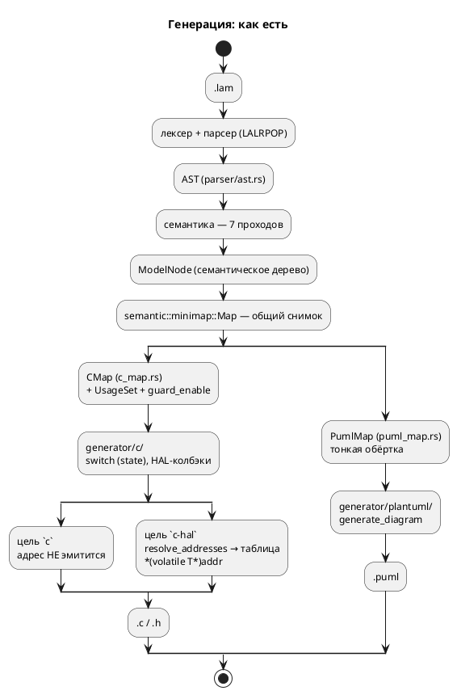
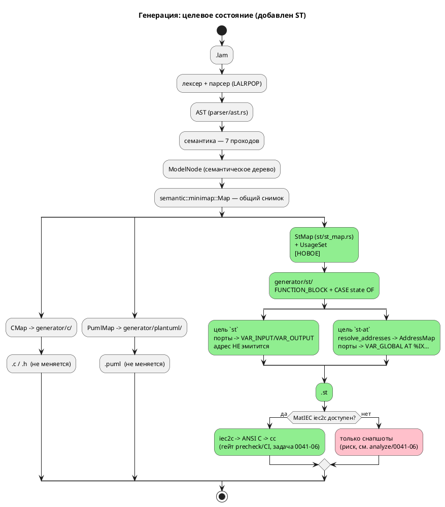

# Фича: Генератор генерации в Structured Text (IEC 61131-3)

- **Номер:** 0041
- **Статус:** ГОТОВО
- **Зависит от:** `0020` (ГОТОВО — потребляется `AddressMap`/`resolve_addresses`
  для формы `AT %…`; зависимость **закрыта**, фича **не** блокируется)
- **Приоритет / Tier:** **Tier 1 (высокий)** — профильная фича проекта (правило 12:
  «язык задания и синтеза автоматных моделей **промышленных систем управления**»).
  ST — стандартный язык ПЛК; это единственная фича пула, которая выводит `lamc` на
  реальную целевую платформу отрасли. Самая крупная в пуле: 7 подзадач.
- **Крейт:** `grammar` (крейт `0.2.0` → `0.3.0` по SemVer; **версия языка не
  меняется** — синтаксис и семантика `.lam` не тронуты, правило 22)
- **Связанные issue (анализ):** новая фича (из блока «Кандидаты в фичи»
  `FEATURES.md`; кандидат вынесен из [адрес порта — размещение и потребление (карта адресов)](0020-port-address-decl.md) —
  «ST `AT %` — в рамках фичи ST-генератор»)

## Стадии жизненного цикла (правило 17)

Все стадии — **разделы этой карточки** (правило 32): «Архитектура (ADR)»,
«Анализ», «Разработка», «Тест-план», «Отчёт о тестировании», «Итог».
Отдельным артефактом остаются только исправления —
[`docs/fixes/`](../fixes/README.md) (при необходимости `0041-YY-*`).

## Краткое описание

Третий целевой язык генерации наряду с C и PlantUML: `generator::Language` сейчас
имеет ровно два варианта — `C` и `PlantUML`
([`generator/mod.rs:14`](../../takt-lang/src/generator/mod.rs)). Фича добавляет
вариант `ST` и модуль `grammar/src/generator/st/`, транслирующий семантическое
дерево модели в **Structured Text (IEC 61131-3)** — стандартный язык ПЛК, куда FSM
ложится естественно: модель → `FUNCTION_BLOCK`, состояния → `CASE state OF` (прямой
аналог `switch (model->state)`, который уже эмитит C-генератор,
[`c_model.rs:554`](../../takt-lang/src/generator/c/c_model.rs)).

Фича **включает потребителя карты адресов** из [адрес порта — размещение и потребление (карта адресов)](0020-port-address-decl.md): `AddressMap` → размещённые переменные
`AT %IX…/%QX…/%MW…`. По образцу уже существующей пары целей `c` / `c-hal` вводятся
две цели: `-t st` (порты как `VAR_INPUT`/`VAR_OUTPUT` блока, адрес не эмитится) и
`-t st-at` (порты как `VAR_GLOBAL … AT %…`).

Изменение **аддитивно**: `Language` помечен `#[non_exhaustive]`
([`generator/mod.rs:13`](../../takt-lang/src/generator/mod.rs)), существующие цели
`c`/`c-hal`/`plantuml` байт-в-байт не меняются, `.lam` не тронут.

> Фича зарегистрирована из бэклога кандидатов (`FEATURES.md`, блок 2); далее
> проходит жизненный цикл по правилу 17.

## Декомпозиция (см. [анализ](0041-st-backend.md#анализ))

| Задача | Содержание |
|---|---|
| **0041-01** | Каркас генератора: `Language::ST`, `generator/st/`, `StMap`, цель `-t st`, `compile_to_st` |
| **0041-02** | Отображение типов Lam → IEC + диагностики (**никакого тихого пропуска**) |
| **0041-03** | Состояния и переходы: `CASE OF`, `INIT`, `enter`/`always`/`exit`, композиция `\|` / `+` |
| **0041-04** | Выражения, условия, функции (`fn` → `FUNCTION`, `extern fn` → внешняя) |
| **0041-05** | Карта адресов: цель `-t st-at`, `AT %IX…`, `VAR_GLOBAL` |
| **0041-06** | **Проба-проверка:** валидация порождённого ST через MatIEC `iec2c` в `precheck.sh`/CI |
| **0041-07** | Примеры (`elevator.lam`, `stacker.lam`), контрпримеры, документация (правила 15, 16) |

## Ключевой риск

**Проверяемость порождённого ST.** У проекта нет ПЛК в CI. Единственный
автоматизируемый проверка — открытый транспилятор **MatIEC `iec2c`** (ST → ANSI C,
далее `cc`), что повторяет форму существующего C-проверки в `scripts/precheck.sh`
(cmake/ninja над `examples/generated/c`). Но MatIEC **не пакет Debian** (сборка из
исходников: `autoreconf -i && ./configure && make`, зависимости bison/flex/gcc) и
требует полной `CONFIGURATION`/`RESOURCE`/`PROGRAM`, а не голого `FUNCTION_BLOCK`.
Обе предпосылки в репозитории **не проверены** → подзадача **0041-06 вынесена
вперёд как проба-проверка**: пока она не пройдена, корректность порождённого ST
держится только на снапшотах. Подробно —
[`analyze/0041-06`](0041-st-backend.md#анализ).

## Архитектура (ADR)

- **Status:** Accepted
- **Date:** 2026-07-15
- **Authors:** Архитектор + системный аналитик + дизайнер языков программирования
- **Related issues:** [Фича](0041-st-backend.md); потребляет
  `AddressMap` из [ADR](0020-port-address-decl.md#архитектура-adr); образец «второго
  генератора» — [фича](0009-plantuml-generator.md); ядро генерации —
  [фича](0001-core-language-c.md); урок отображения типов —
  [фича](0029-c-type-mapping.md).

### Context

#### Что есть сейчас

Слой генерации Lam устроен так (проверено по коду 2026-07-15):

- **`generator/mod.rs:14`** — перечисление `Language` ровно с двумя вариантами:
  `C` и `PlantUML`. Помечено **`#[non_exhaustive]`** (строка 13) с прямым
  комментарием: «список целевых языков будет расширяться, и добавление вариантов
  не должно ломать обратную совместимость (правило 11)». Точка расширения
  спроектирована заранее — эта фича ею и пользуется.
- **`generator/mod.rs:67`** — трейт `Generator` с единственным методом
  `generate(&self, model: &ModelNode, output_path: &str, options: &GenerateOptions)
  -> Result<(), Diagnostic>`. Свободная функция `generate(l, model, path, options)`
  (строка 80) диспетчеризует по `Language` через `match`.
- **`generator/mod.rs:30`** — `GenerateOptions` (тоже `#[non_exhaustive]`):
  `guard_enable`, `hal: bool`, `address_map: HashMap<String, ResolvedAddress>`.
  Поля `hal`/`address_map` заведены фичей ровно для «адрес-потребляющего»
  режима — ST-генератор переиспользует их, а не заводит третий канал.
- **Цели CLI** (`bin/lamc.rs:551`, `match options.target.as_str()`): фактически
  **три** — `c-hal`, `c`, `plantuml`. Замечание: сообщение об ошибке (строка ~646)
  говорит «Поддерживается: c, plantuml» — про `c-hal` умалчивает (мелкий дефект,
  правится попутно задачей: строка всё равно меняется).
- **Образец второго генератора — PlantUML** (`generator/plantuml/mod.rs`, 258 строк):
  структура ровно та, что нужно повторить — `struct Generator {}` + `impl
  AsGenerator`, тонкая обёртка-снимок `PumlMap` над общей `semantic::minimap::Map`
  (`puml_map.rs`, 66 строк), чистая функция `generate_diagram(&map) ->
  Result<String, Diagnostic>` и запись в файл. Юнит-тесты живут прямо в модуле и
  проверяют **подстроки** результата.
- **C-генератор** (`generator/c/`, 6248 строк) — тяжёлый образец: `CMap` (`c_map.rs`)
  добавляет к снимку `usage: UsageSet` (фильтрация неиспользуемых элементов) и
  `guard_enable`.

#### Как C-генератор укладывает FSM (ключ к решению)

Зонд: `lamc compile -t c examples/stacker.lam`. Порождённый C имеет ровно ту
форму, которую естественно повторить в ST:

- **Модель → структура + функции.** `struct StackerLiftController { enum {…} state; }`
  плюс `StackerLiftController_init/_tick/_reset/_is_done(model, main)`.
- **Состояния → `switch (model->state)`** (`c_model.rs:554`) с `case` на состояние.
- **Синтетическое состояние `INIT`** на каждый уровень вложенности — первый такт
  исполняет `enter` стартового состояния и переводит в него.
- **`enter` целевого состояния инлайнится в переход** (проверено:
  `case …LIFT_IDLE: if (main->lift_request) { write_bit(CMD_FORK, 1); state = …LIFT_OPERATING; break; }`
  — тело `enter` состояния `LiftOperating` исполнено **в переходе**).
- **Параллельная композиция `A | B | C`** (`start Stacker = CommandReceiver |
  MovementController | LiftController;`) → под-структуры полями родителя и
  **последовательный вызов их `_tick` в одном такте родителя**, с завершением по
  конъюнкции `_is_done` (проверено, `stacker.c:425-433`).
- **Порты → enum + колбэки HAL** (`read_bit`/`write_bit`/`read_numeric`/
  `write_numeric` в структуре); адрес в цели `c` **не эмитится** — находка 0020.

Поток «как есть» — два потребителя одного семантического дерева:



#### Какую проблему решаем

Правило 12 объявляет целью проекта «язык задания и синтеза автоматных моделей
**промышленных систем управления**». При этом ни одна из двух целей генерации не
попадает на реальную платформу отрасли: `c` — прошивка МК (нужен свой HAL,
тулчейн, сборка), `plantuml` — картинка. **Стандартный язык программирования ПЛК
— это IEC 61131-3**, и ST в нём — текстовый язык, в который FSM ложится буквально
один-в-один: `CASE state OF` ≡ уже эмитируемый `switch`. Отсутствие ST-генератора —
самый крупный разрыв между заявленной целью проекта и его выходом.

Фича — задел, оставленный фичей: её карточка прямо фиксирует «ST `AT %` — в
рамках фичи ST-генератор», а анализ 0020 — «Разблокирует: задел под кандидат
“ST-генератор” (`AT %`)».

### Decision Drivers

1. **Профиль проекта (правило 12).** ST — целевой язык ПЛК. Без него `lamc`
   синтезирует «во что угодно, кроме промышленного контроллера».
2. **Аддитивность (правило 11).** `Language` уже `#[non_exhaustive]`; добавление
   варианта не должно менять ни байта вывода целей `c`/`c-hal`/`plantuml` и не
   должно трогать `.lam`. Версия языка не растёт (правило 22).
3. **Не повторить дефекты отображения типов C**. `get_c_type`
   (`generator/c/mod.rs:150`) отображает `Array(size, elem)` → `uint{size}_t`
   (размер путается с разрядностью), `Bit` → `int`, `Rational` → `float` (f32
   против f64 симулятора), а переменная-массив **молча исчезает** из структуры
   **без диагностики**. ST-генератор пишется с нуля — обязан сделать это правильно и
   **никогда не терять узел молча** (класс дефектов «тихий пропуск»: фичи).
4. **Потребляемость адреса.** Адрес порта не должен снова стать мёртвыми
   метаданными (находка 0020). `AddressMap` уже есть и разрешён —
   `resolve_addresses` (`address_map.rs:409`).
5. **Проверяемость.** Проверка «сгенерировали и скомпилировали» для C уже работает
   (`precheck.sh` → cmake/ninja). Для ST нужен аналог, иначе фича закрывается
   снапшотами «текст равен тексту», что не доказывает ничего о валидности ST.
6. **Переиспользование, а не копирование.** Снимок `minimap::Map`, `UsageSet`,
   `resolve_addresses`, `Printer` (`generator/indent.rs`) — общие; ST-генератор не
   должен форкать обход дерева.

### Вопрос 1. Как FSM ложится на ST

#### Option A. `FUNCTION_BLOCK` на модель + `CASE state OF`

Модель → `FUNCTION_BLOCK`; состояния → `CASE` по переменной состояния; композиция
→ экземпляры вложенных FB в `VAR` родителя, вызываемые в его теле. Изоморфно
тому, что уже делает C-генератор.

**Pros:**
- **1:1 с существующим C-генератором** — тот же обход `minimap::Map`, та же
  синтетическая `INIT`, тот же инлайн `enter` в переход, та же композиция
  «вызвать под-модели последовательно за один такт». Семантика уже отлажена и
  сверена с симулятором (0025-07): ST наследует её, а не изобретает.
- **Такт ПЛК ≡ такт модели.** Модель Lam уже тактовая (`tick`); скан-цикл ПЛК —
  ровно это. `FUNCTION_BLOCK` — единственная конструкция IEC с **сохраняемым
  состоянием между вызовами**, что и требуется для переменной состояния FSM.
- Экземплярность: одна модель — много экземпляров (естественно для `M1 | M2`).
- Читается инженером-наладчиком: `CASE` по состояниям — канонический способ
  писать FSM на ST вручную; вывод не будет «чужим» в проекте ПЛК.
- Поддерживается **всеми** средами (CODESYS/TwinCAT/Beremiz/MatIEC) — это ядро
  языка, а не расширение.

**Cons:**
- Ручное управление переменной состояния (как в C) — нет «встроенной» семантики
  шагов, которую даёт SFC.
- Вложенность FB даёт длинные цепочки квалифицированных имён.

#### Option B. SFC (Sequential Function Chart)

Состояния → `STEP`/`TRANSITION` текстового SFC; композиция `|` → расходящиеся
параллельные ветви SFC.

**Pros:**
- Семантически «родная» для FSM конструкция стандарта: шаги, переходы,
  параллельные ветви — прямо то, что моделирует Lam. `M1 | M2` идейно точно
  ложится на simultaneous divergence.
- Графическое представление в среде ПЛК — «бесплатно», перекликается с
  PlantUML-генератором.

**Cons:**
- **Семантика не совпадает.** SFC-шаг имеет действия с квалификаторами
  (`N`/`S`/`R`/`P`/`D`…) и активность шага, а Lam оперирует `enter`/`always`/`exit`
  и мгновенным переходом с инлайном `enter` цели. Отображение не тождественно —
  пришлось бы либо менять семантику языка (правило 22 → версия языка растёт;
  фича заявлена аддитивной), либо строить нетривиальную эмуляцию, которую нечем
  проверить.
- **Текстовый SFC поддерживается плохо и по-разному.** Стандарт задаёт текстовую
  форму, но вендоры (CODESYS/TwinCAT) работают с SFC графически и хранят его в
  своих проектных форматах — генерировать переносимый *текст* SFC малополезно.
- Нет изоморфизма с C-генератором → второй, независимо отлаживаемый обход дерева и
  второй набор дефектов; сверка ST ↔ C ↔ симулятор становится невозможной.
- Вложенные модели Lam — не то же, что вложенные SFC.

#### Option C. Одна `PROGRAM` с плоским `CASE`

Всё дерево моделей уплощается в одну `PROGRAM` с единым `CASE` по композитному
состоянию (декартово произведение либо перенумерация).

**Pros:**
- Простейший вывод: один файл, одна сущность, никакой вложенности имён.
- Нет экземпляров FB → минимум памяти на ПЛК.

**Cons:**
- **Взрыв состояний** на `M1 | M2`: `stacker.lam` — три параллельные модели с
  13 × 4 × 4 состояниями; декартово произведение ≈ 208 `case` вместо 21 в трёх
  блоках.
- Теряется структура модели: имена под-моделей исчезают, отладка на ПЛК
  (наблюдение переменной состояния конкретной под-модели) невозможна.
- `PROGRAM` — единичная сущность; повторное использование модели как компонента в
  чужом проекте ПЛК исключено.
- Расходится с C-генератором → см. Cons Option B.

#### Decision (вопрос 1)

Принимается **Option A** — `FUNCTION_BLOCK` на модель + `CASE state OF`.

Решающий довод — **изоморфизм с уже работающим C-генератором**. Семантика тактов,
`INIT`, инлайна `enter` в переход и параллельной композиции уже реализована,
отлажена и сверена с симулятором (0025-07). Option A переиспользует её обход и
делает возможной **тройную сверку** (симулятор ↔ C ↔ ST) — сильнейший из
доступных способов проверки. Option B требует другой семантики (ломает
аддитивность) и не проверяем; Option C не масштабируется на `stacker.lam` —
основной пример профиля.

**Отображение композиции.**

| Конструкция Lam | C (как есть) | ST (решение) |
|---|---|---|
| `model M { … }` | `struct M { enum state; }` + `M_tick()` | `FUNCTION_BLOCK M` … `END_FUNCTION_BLOCK`, тело = один скан |
| `state S { … }` | `case …_S:` | `<n>: (* S *)` внутри `CASE state OF` |
| стартовое состояние | синтетический `case …_INIT` | синтетический `INIT` (значение 0 — по умолчанию при холодном старте ПЛК) |
| `M1 \| M2` (параллельно) | под-структуры + последовательные `_tick` в одном такте | экземпляры под-FB в `VAR`; последовательные вызовы в одном скане; завершение — конъюнкция `is_done` |
| `M1 + M2` (конкатенация) | последовательные шаги по `state` родителя | шаги `CASE` родителя: пока `NOT M1.is_done` — вызывать `M1`, затем `M2` |
| терминальность | `_is_done()` → `state == …_END` | выход `is_done : BOOL` блока |

Целевой поток:



**EBNF порождаемого подмножества ST** (правило 18 — генерируется код на другом
языке; фиксируем ровно то подмножество IEC 61131-3, которое эмитит генератор: всё,
что вне этой грамматики, генератор порождать не вправе):

```plantuml
@startuml
' EBNF: подмножество IEC 61131-3 ST, порождаемое бэкендом 0041
title EBNF порождаемого ST (подмножество IEC 61131-3)

file        = { type_decl } , { global_vars } , { function } ,
              { function_block } , [ configuration ] ;

type_decl   = "TYPE" , type_name , ":" , ( enum_spec | struct_spec ) ,
              ";" , "END_TYPE" ;
enum_spec   = "(" , enum_item , { "," , enum_item } , ")" ;
enum_item   = identifier , [ ":=" , integer ] ;
struct_spec = "STRUCT" , { identifier , ":" , iec_type , ";" } , "END_STRUCT" ;

global_vars = "VAR_GLOBAL" , { located_var } , "END_VAR" ;
located_var = identifier , [ "AT" , direct_addr ] , ":" , iec_type ,
              [ ":=" , literal ] , ";" ;
direct_addr = "%" , ( "I" | "Q" | "M" ) ,
              ( "X" | "B" | "W" | "D" | "L" ) ,
              integer , { "." , integer } ;

function       = "FUNCTION" , identifier , ":" , iec_type ,
                 var_input , { var_block } , stmt_list , "END_FUNCTION" ;

function_block = "FUNCTION_BLOCK" , identifier ,
                 [ var_input ] , [ var_output ] , var_block ,
                 stmt_list , "END_FUNCTION_BLOCK" ;
var_input   = "VAR_INPUT"  , { var_decl } , "END_VAR" ;
var_output  = "VAR_OUTPUT" , { var_decl } , "END_VAR" ;
var_block   = "VAR"        , { var_decl } , "END_VAR" ;
var_decl    = identifier , ":" , iec_type , [ ":=" , literal ] , ";" ;

iec_type    = "BOOL" | "SINT" | "INT" | "DINT" | "LINT"
            | "USINT" | "UINT" | "UDINT" | "ULINT" | "LREAL"
            | array_type | type_name ;
array_type  = "ARRAY" , "[" , integer , ".." , integer , "]" , "OF" , iec_type ;

stmt_list   = { statement } ;
statement   = assign_stmt | if_stmt | case_stmt | while_stmt
            | call_stmt | "RETURN" , ";" | ";" ;
assign_stmt = variable , ":=" , expression , ";" ;
if_stmt     = "IF" , expression , "THEN" , stmt_list ,
              { "ELSIF" , expression , "THEN" , stmt_list } ,
              [ "ELSE" , stmt_list ] , "END_IF" , ";" ;
case_stmt   = "CASE" , expression , "OF" ,
              { case_element } , [ "ELSE" , stmt_list ] , "END_CASE" , ";" ;
case_element= integer , ":" , stmt_list ;
while_stmt  = "WHILE" , expression , "DO" , stmt_list , "END_WHILE" , ";" ;
call_stmt   = identifier , "(" , [ arg_list ] , ")" , ";" ;

expression  = xor_expr , { "OR" , xor_expr } ;
xor_expr    = and_expr , { "XOR" , and_expr } ;
and_expr    = cmp_expr , { "AND" , cmp_expr } ;
cmp_expr    = add_expr , { ( "=" | "<>" | "<" | ">" | "<=" | ">=" ) , add_expr } ;
add_expr    = mul_expr , { ( "+" | "-" ) , mul_expr } ;
mul_expr    = unary_expr , { ( "*" | "/" | "MOD" ) , unary_expr } ;
unary_expr  = [ "NOT" | "-" ] , primary ;
primary     = literal | variable | call_expr | "(" , expression , ")" ;
variable    = identifier , { "." , identifier | "[" , expression , "]" } ;

configuration = "CONFIGURATION" , identifier ,
                "RESOURCE" , identifier , "ON" , identifier ,
                "TASK" , identifier , "(" , task_params , ")" , ";" ,
                "PROGRAM" , identifier , "WITH" , identifier , ":" ,
                identifier , ";" ,
                "END_RESOURCE" , "END_CONFIGURATION" ;
@enduml
```

### Вопрос 2. Отображение типов Lam → типы IEC

Исходные данные: `TypeNode` (`semantic/type_node.rs:496`) — `Bit`, `Bool`,
`Rational`, `Array(u16, Box<TypeNode>)`, `Enum(String)`, `Struct(String)`,
`Integer { bits: u8, signed: bool }`, плюс служебные (`Inference`, `Address`,
`Unsupported`, `Unit`, `Builtin*`).

#### Option A. «Как в C» — переиспользовать логику `get_c_type`

**Pros:** нулевая работа; вывод ST согласован с выводом C.

**Cons:** **воспроизводит все три дефекта фичи** — `Array(size, elem)` →
`uint{size}_t` (число элементов вместо разрядности; `[u8; 4]` → `uint4_t`), а сама
переменная-массив **молча исчезает из структуры без диагностики**; `Bit` → `int`;
`Rational` → `float` (f32) против f64 симулятора. Тиражировать известный дефект в
новый генератор — прямое нарушение драйвера 3. **Отвергается без дальнейшего
обсуждения.**

#### Option B. Прямое отображение на типы IEC + диагностика на непокрытое

`Bit`/`Bool` → `BOOL`; `Integer{bits,signed}` → `USINT/UINT/UDINT/ULINT` и
`SINT/INT/DINT/LINT`; `Rational` → `LREAL`; `Array(N, T)` → `ARRAY [0..N-1] OF T`;
`Enum` → `TYPE … : (…); END_TYPE`; `Struct` → `TYPE … : STRUCT … END_STRUCT;
END_TYPE`. Любой неотображаемый узел → **ошибка** `ST-0xx`, генерация не
продолжается.

**Pros:**
- Каждый тип Lam получает **семантически точный** аналог IEC, а не ближайший
  подходящий: `bit` → `BOOL` (1 бит по смыслу, а не 32-битный знаковый `int`),
  `float` → `LREAL` (f64 — совпадает с симулятором, а не f32).
- `ARRAY [0..N-1] OF T` — **настоящий массив**: размер не путается с разрядностью,
  переменная не исчезает.
- Отказ вместо тихой потери — прямое следствие уроков фич.
- Разбор `TypeNode` без ветки `_`: единственная вынужденная ветка
  (`TypeNode` помечен `#[non_exhaustive]`, `type_node.rs:495`) возвращает
  **ошибку**, а не `None`, — ровно как `eval::coerce_to_type`.

**Cons:**
- Требует эмиссии `TYPE … END_TYPE` для `enum`/`struct` — новый пласт вывода,
  которого нет ни в одном существующем генераторе.
- Перечислимые типы (`TYPE … : (A := 0);`) — конструкция 3-й редакции; поддержка
  в MatIEC требует пробы.

#### Option C. Гибрид: перечисления как `USINT` + константы

`Enum` → `TYPE Name : USINT; END_TYPE` + `VAR_GLOBAL CONSTANT Name_A : USINT := 0;`.

**Pros:** максимально консервативно — работает в любом диалекте и любой редакции.

**Cons:** теряется типобезопасность перечисления (проверка `enum_type_safety_errors`,
`lib.rs:439`, в Lam есть — на ST она бы не транслировалась); вывод менее читаем;
расходится с идиоматикой ST.

#### Decision (вопрос 2)

Принимается **Option B**, с **Option C как задокументированным откатом** для
перечислений, если проба 0041-06 покажет, что MatIEC не принимает перечислимые
`TYPE`.

**Таблица отображения** (нормативная; граничные случаи —
[`analyze/0041-02`](0041-st-backend.md#анализ)):

| `TypeNode` | C (как есть, `get_c_type`) | **ST (решение)** | Комментарий |
|---|---|---|---|
| `Bit` | `int` ← **дефект** | `BOOL` | 1 бит по смыслу |
| `Bool` | `bool` | `BOOL` | |
| `Integer{8,false}` | `uint8_t` | `USINT` | |
| `Integer{16,false}` | `uint16_t` | `UINT` | |
| `Integer{32,false}` | `uint32_t` | `UDINT` | |
| `Integer{64,false}` | `uint64_t` | `ULINT` | |
| `Integer{8,true}` | `int8_t` | `SINT` | |
| `Integer{16,true}` | `int16_t` | `INT` | |
| `Integer{32,true}` | `int32_t` | `DINT` | |
| `Integer{64,true}` | `int64_t` | `LINT` | |
| `Rational` | `float` (f32) ← **дефект** | `LREAL` | f64 — как в симуляторе |
| `Array(N, T)` | `uint{N}_t`, переменная **молча теряется** ← **дефект** | `ARRAY [0..N-1] OF <T>` | настоящий массив |
| `Enum(name)` | `uint{bits}_t` по макс. варианту | `TYPE name : (…); END_TYPE` | откат — Option C |
| `Struct(name)` | `name` | `TYPE name : STRUCT … END_STRUCT; END_TYPE` | |
| `Unit` | `void` | — (процедурный FB) | |
| `Inference`, `Unsupported`, `Address`, `Builtin*` | `None` (тихо) | **ошибка `ST-002`** | никакого тихого пропуска |

**Связь с фичей — это урок, а не зависимость.** `get_c_type`
(`generator/c/mod.rs:150`) — функция, приватная для C-генератора; ST-генератор её не
вызывает и не наследует. Общего слоя отображения типов **не заводим**: цели `c` и
`st` имеют разные системы типов, и попытка их обобщить связала бы аддитивную фичу
с незакрытой 0029. Порядок работ фич независим.

#### Фрагмент целевого ST (`stacker.lam`, модель `LiftController`)

Исходник (`examples/stacker.lam:355-385`) и уже порождаемый C (`stacker.c:64-114`,
проверено зондом) дают такой целевой ST:

```
FUNCTION_BLOCK StackerLiftController
VAR_INPUT
    lift_request : BOOL;
    lift_op      : BOOL;
    sense_loaded : BOOL;
END_VAR
VAR_OUTPUT
    cmd_fork  : BOOL;
    lift_done : BOOL;
    is_done   : BOOL;
END_VAR
VAR
    state : USINT := 0;   (* 0 = INIT — значение по умолчанию при холодном старте *)
END_VAR

CASE state OF
    0: (* INIT: enter стартового состояния LiftIdle инлайнится в переход *)
        cmd_fork := FALSE;
        state := 1;

    1: (* LiftIdle *)
        IF lift_request THEN
            cmd_fork := TRUE;          (* enter состояния LiftOperating *)
            state := 2;
        END_IF;

    2: (* LiftOperating *)
        IF lift_request AND NOT lift_op AND sense_loaded THEN
            cmd_fork  := FALSE;        (* enter состояния LiftDone *)
            lift_done := TRUE;
            state := 3;
        ELSIF lift_request AND lift_op AND NOT sense_loaded THEN
            cmd_fork  := FALSE;
            lift_done := TRUE;
            state := 3;
        ELSIF NOT lift_request THEN
            cmd_fork := FALSE;         (* enter состояния LiftIdle *)
            state := 1;
        END_IF;

    3: (* LiftDone *)
        IF NOT lift_request THEN
            cmd_fork := FALSE;
            state := 1;
        END_IF;

    4: (* END — терминальное *)
        ;
END_CASE;

is_done := (state = 4);
END_FUNCTION_BLOCK
```

Сверка с C построчно: `case …LIFT_OPERATING` (`stacker.c:82-101`) содержит ровно
те же три `if` в том же порядке с тем же инлайном `enter` — изоморфизм Option A
подтверждён на реальном примере.

Параллельная композиция `start Stacker = CommandReceiver | MovementController |
LiftController;` (`stacker.lam:388`) — прямой аналог `stacker.c:425-433`:

```
FUNCTION_BLOCK Stacker
VAR
    command_receiver0    : StackerCommandReceiver;
    movement_controller1 : StackerMovementController;
    lift_controller2     : StackerLiftController;
    state : USINT := 0;
    (* переменные корневой модели *)
    lift_request : BOOL;
    lift_op      : BOOL;
    lift_done    : BOOL;
    busy         : BOOL;
    tgt_stack    : USINT;
    (* … *)
END_VAR

CASE state OF
    0: (* INIT *)
        state := 1;
    1: (* Stacker: один скан = один такт каждой параллельной модели *)
        command_receiver0(lift_request := lift_request (* … *));
        movement_controller1(lift_request := lift_request (* … *));
        lift_controller2(lift_request := lift_request, lift_op := lift_op,
                         sense_loaded := sense_loaded);
        lift_done := lift_controller2.lift_done;
        (* … обратная запись координационных переменных … *)
        IF command_receiver0.is_done AND movement_controller1.is_done
           AND lift_controller2.is_done THEN
            state := 2;
        END_IF;
    2: (* END *)
        ;
END_CASE;
END_FUNCTION_BLOCK
```

### Вопрос 3. Потребление карты адресов: `AddressMap` → `AT %…`

#### Что даёт 0020

`resolve_addresses(model, external) -> AddressResolution` (`address_map.rs:409`)
возвращает `map: HashMap<String, ResolvedAddress>`, где `ResolvedAddress { addr:
i64, bit: Option<i64>, source: AddressSource }` (`address_map.rs:361`). Приоритет
источников — inline < `address` < внешняя карта — уже разрешён. Направление порта
берётся из `VariableNode::Port { direction: PortDirection, .. }`
(`semantic/mod.rs:847-860`; `PortDirection::{In, Out, InOut}`, `ast.rs:181`).

**Импеданс.** Адрес в Lam — **плоский физический** (`0x10000000`,
`elevator.lam:36`; `0x100:0`, `stacker.lam:52`), как указатель для
`*(volatile T*)addr` в `c-hal`. Прямой адрес IEC (`%IX1.0`) — **логическая
иерархическая** локация ввода-вывода, отображаемая на физику **конфигурацией
ПЛК**, а не программой. Это не одно и то же, и честное отображение обязано это
признать.

#### Option A. Механическое отображение + отдельная цель `st-at`

`direction` → префикс (`In`→`%I`, `Out`→`%Q`, `InOut`→`%M`); разрядность типа →
размерный префикс (`BOOL`→`X`, 8→`B`, 16→`W`, 32→`D`, 64→`L`); `addr` → номер
локации; `bit` → суффикс `.бит`. Цель `-t st` адрес **не эмитит** (порты —
`VAR_INPUT`/`VAR_OUTPUT`), цель `-t st-at` эмитит `VAR_GLOBAL … AT %…`.

**Pros:**
- **Повторяет уже принятое и закрытое решение** — пару `c` / `c-hal`: одна
  цель без адресов (порты через интерфейс), вторая — адрес-потребляющая.
  Архитектура проекта уже это знает; `GenerateOptions { hal, address_map }`
  переиспользуется без изменений.
- Умолчание `-t st` полезен сам по себе: FB с `VAR_INPUT`/`VAR_OUTPUT` — это то, что
  инженер вставит в свой проект ПЛК и **сам** свяжет с локациями через
  конфигурацию среды. Именно так ПЛК-проекты и делаются.
- Диагностики полноты (`SE-052`) переиспользуются как есть: цель `st-at` —
  адрес-потребляющая, как `c-hal`.
- Механическое правило проверяемо и объяснимо.

**Cons:**
- Для крупных плоских адресов результат абсурден физически: `in sensors_1: u8 :=
  268435456` (`0x10000000`) → `AT %IB268435456` — ни один ПЛК столько локаций не
  имеет. **Смягчение:** это дефект **исходной модели** для цели ST, а не
  генератора; `stacker.lam` (`0x100:0` → `%IX256.0`) уже сейчас в разумном
  диапазоне. Правильный путь для `elevator.lam` — внешняя карта `--address-map` с
  ПЛК-адресами (механизм 0020-03 уже есть).
- `InOut` → `%M` — соглашение, а не требование стандарта.

#### Option B. Новый синтаксис адреса в `.lam` для ST-локаций

Ввести в язык вторую форму адреса (`address BTN = %IX1.0;`).

**Pros:** ST-адрес выражается точно, без интерпретации.

**Cons:** **меняет язык** → версия языка растёт (правило 22), фича перестаёт быть
аддитивной; вносит вендор-специфику прямо в `.lam`; дублирует `AddressMap` вторым
каналом — ровно то, чего 0020 избегала («связующее звено — единый `AddressMap`»).
Отвергается.

#### Option C. Расширить внешнюю `.ld`-карту записями-локациями ST

Разрешить `sensors_1 = %IX1.0;` в файле `--address-map`.

**Pros:** язык не меняется; ST-адреса живут ровно там, где им место — во внешней
карте платформы; «одна модель — много платформ» (0020 это и задумывала).

**Cons:** расширяет формат карты и её парсер (`parse_address_map`, коды
AM-001…006) — это территория фич; тянет вопрос «как ту же запись понимать
в `c-hal`». Отдельная фича.

#### Decision (вопрос 3)

Принимается **Option A**: механическое отображение + отдельная цель `-t st-at` по
образцу `c` / `c-hal`. **Option C фиксируется как естественное продолжение** и
выносится в кандидаты (не в эту фичу).

Правило отображения (нормативно; подробно —
[`analyze/0041-05`](0041-st-backend.md#анализ)):

| Источник | Правило | Пример (`stacker.lam`) |
|---|---|---|
| `direction: In` | `%I` | `in task_valid: bit := 0x100:0` |
| `direction: Out` | `%Q` | `out cmd_fork: bit := 0x500:0` |
| `direction: InOut` | `%M` | — |
| тип `BOOL` (`Bit`/`Bool`) | размер `X`, требуется `bit` | → `AT %IX256.0 : BOOL;` |
| `Integer{8}` | размер `B` | `in pos_stack: u8 := 0x200:0` → `AT %IB512 : USINT;` |
| `Integer{16}` | `W` | |
| `Integer{32}` | `D` | |
| `Integer{64}` | `L` | |
| `Rational` (`LREAL`) | `L` | |
| `Array`/`Enum`/`Struct` | локация не определена → **ошибка `ST-004`** | |

Граничные случаи (все — диагностика, ни один не «молча»):

- `BOOL`-порт **без** `bit` в `ResolvedAddress` → **`ST-005`** (предупреждение),
  бит принимается за `.0`; в C-генераторе аналог — `bit = -1` (`c_header.rs:688`).
- Не-`BOOL`-порт **с** `bit` → **`ST-006`** (предупреждение), бит игнорируется
  (байтовая/словная локация бита не имеет).
- Используемый порт без адреса в цели `st-at` → **`SE-052`** (ошибка,
  переиспользуется из 0020-04; в `c-hal` ровно так же).
- Адрес вне диапазона локаций платформы — **не диагностируется**: у компилятора нет
  модели платформы. Фиксируется в документации как ответственность автора карты.

### Вопрос 4. Диалект-совместимость

#### Option A. Чистый IEC 61131-3 (3-я редакция), без вендорских расширений

**Pros:** переносимо в принципе; единственный вариант, у которого есть **открытый
валидатор** (MatIEC `iec2c`) → автоматизируемый проверка в CI; не привязывает проект к
коммерческой среде; вывод пригоден как вход для CODESYS/TwinCAT (импорт ST-текста)
при ручной доводке.

**Cons:** «чистого» ПЛК не существует — в реальном проекте всё равно понадобятся
вендорские атрибуты/прагмы; стандарт платный (ISO/IEC 61131-3) → сверять
соответствие можно только через реализации.

#### Option B. Диалект CODESYS 3.x (или TwinCAT 3)

**Pros:** крупнейшая доля рынка; вывод сразу пригоден в реальном проекте;
`{attribute}`-прагмы, `METHOD`, `EXTENDS`, `REFERENCE TO` выразительнее.

**Cons:** **непроверяемо в CI** — среда закрытая, GUI-only, лицензируемая (ровно та
же стена, что у плагина IntelliJ: «собрать плагин в CI-среде нельзя — `runIde`
требует GUI», `FEATURES.md`); привязка к вендору противоречит роли Lam как
языка-источника; выбор одного вендора обесценивает вывод для остальных.

#### Option C. Пересечение диалектов («что примут все»)

**Pros:** максимальная переносимость на практике.

**Cons:** пересечение **неизвестно и непроверяемо** — чтобы его знать, нужны все
среды; на деле выродится в «то, что мы угадали», без проверки. Хуже Option A: та хотя
бы имеет объективный арбитр.

#### Decision (вопрос 4)

Принимается **Option A**: целимся в **чистый IEC 61131-3, а арбитром соответствия
объявляется MatIEC `iec2c`** — «валидный ST» для фичи операционально
определяется как «принимается `iec2c`, и результат его трансляции компилируется
`cc`». Вендорские диалекты — вне области фичи; при запросе заказчика — отдельная
фича поверх (`--dialect codesys`), т.к. потребует своей, непроверяемой в CI,
стратегии тестирования.

Обоснование: это единственная опция с **объективным, автоматизируемым критерием
истинности**. Проект уже дважды обжигался на непроверяемом выводе (тихие пропуски
0025/0028/0029; невозможность CI-проверки плагина 0022/0023) — новый генератор без
проверки повторил бы ошибку в третий раз. Порождаемое подмножество ST при этом
намеренно узкое (см. EBNF выше): `CASE`/`IF`/`WHILE`/присваивания/вызовы FB — ядро
стандарта, поддержанное всеми средами, а не спорная периферия.

**Оговорка (риск).** MatIEC реализует не весь стандарт; его собственное подмножество
**может не совпасть** с 3-й редакцией (в первую очередь — перечислимые `TYPE`).
Поэтому арбитр фиксируется **вместе с пробой 0041-06**: пока проба не пройдена,
выбор арбитра не подтверждён. Если `iec2c` откажется от перечислимых типов —
вступает откат Option C вопроса 2 (`enum` → `USINT` + константы).

### Consequences

#### Положительные

- **Профиль проекта закрыт (правило 12):** `lamc` синтезирует в стандартный язык
  ПЛК; `.lam` становится источником для реального промышленного контроллера.
- **Адрес порта дожил до второго потребителя.** 0020 сделала `AddressMap` общим
  слоем; `st-at` подтверждает, что слой спроектирован верно (`c-hal` был первым,
  `st-at` — второй; 0043 будет третьим).
- **Дефекты отображения типов не тиражируются.** ST-генератор с первого коммита имеет
  корректные `BOOL`/`LREAL`/`ARRAY [0..N-1] OF T` и отказывает вместо тихой потери
  — эталонная реализация того, к чему 0029 приведёт C.
- **Тройная сверка становится возможной.** Симулятор ↔ C ↔ ST на одной модели —
  сильнейший контроль семантики из доступных проекту (расширение линии 0025-07).
- **Аддитивность доказана конструкцией:** `Language` `#[non_exhaustive]`, целей
  добавляется две новые, существующие три не тронуты.

#### Отрицательные / Action items

- **Проверяемость под вопросом до 0041-06.** Проверка `iec2c` не проверен в
  репозитории: MatIEC не пакет Debian (сборка из исходников; bison/flex/gcc) и
  требует полной `CONFIGURATION`, а не голого FB. **Action:** задача
  выполняется **сразу после каркаса 0041-01** и является проверкой фичи; при её
  провале фича закрывается на снапшотах, и это фиксируется в отчёте как явное
  ограничение (не замалчивается).
- **Генератор обязан уметь эмитить `CONFIGURATION`.** Следствие требования
  `iec2c`. **Action:** эмиссия `CONFIGURATION`/`RESOURCE`/`TASK`/`PROGRAM` — под
  флагом (`--st-configuration`), т.к. в реальном проекте ПЛК конфигурацию задаёт
  среда, а не импортируемый файл. Уточняется пробой 0041-06.
- **Новый пласт вывода: `TYPE … END_TYPE`.** `enum`/`struct` требуют объявлений
  типов, которых нет ни в одном из существующих генераторов.
- **Плоские адреса `elevator.lam` дают абсурдные локации** (`%IB268435456`).
  **Action:** в 0041-07 к примеру прикладывается ПЛК-карта
  `examples/elevator.plc.map` (механизм `--address-map` из 0020-03), а ограничение
  документируется.
- **`AT %` не выражается в `.lam`** — только через внешнюю карту. **Action:**
  кандидат в `FEATURES.md` — «`.ld`-карта: записи-локации ST (`%IX1.0`)» (Option C
  вопроса 3). Заводит координатор; в этой фиче не делается.
- **Размер модуля.** `generator/c/` — 6248 строк; ST-генератор сопоставим по объёму.
  **Action:** соблюдать лимит ~1000 строк на модуль (`CLAUDE.md`, `docs/CODE.md`) с
  первого коммита — дробить `st/` по логике (`st_map`/`st_type`/`st_model`/
  `st_expr`/`st_decl`), а не повторять путь `validate.rs` (3648 строк, кандидат
  0027).
- **Мелкий дефект CLI попутно.** `bin/lamc.rs` (~строка 646): «Поддерживается: c,
  plantuml» — `c-hal` не упомянут. **Action:** правится в 0041-01 вместе с
  добавлением `st`/`st-at` (строка всё равно меняется).
- **Версия крейта.** `grammar` `0.2.0` → `0.3.0` (минор: новый публичный API
  `Language::ST`, `compile_to_st`, `compile_to_st_at`). **Версия языка остаётся
  0.2.0** — `.lam` не тронут (правило 22).

#### Acceptance criteria

1. `lamc compile -t st examples/stacker.lam -o out` порождает `.st`, содержащий
   `FUNCTION_BLOCK` на каждую из четырёх моделей (`Stacker`, `CommandReceiver`,
   `MovementController`, `LiftController`) с `CASE state OF`; вывод целей `c`,
   `c-hal`, `plantuml` для того же файла — **байт-в-байт** как до фичи.
2. Отображение типов соответствует нормативной таблице вопроса 2; в частности
   `var data: [u8; 4];` даёт `data : ARRAY [0..3] OF USINT;` (а **не** исчезает и
   **не** даёт `uint4_t`, как в C).
3. Неотображаемый узел типа/АСД → **диагностика** `ST-0xx`, а не тихий пропуск
   (проверяется контрпримером).
4. `lamc compile -t st-at --address-map <карта> examples/stacker.lam` размещает
   порты как `VAR_GLOBAL … AT %IX…/%QX…` согласно таблице вопроса 3; используемый
   порт без адреса → `SE-052`.
5. **Проверка проверяемости (0041-06):** `iec2c` принимает порождённый ST для всех
   `examples/*.lam`, и результат его трансляции компилируется `cc` — по образцу
   существующего C-проверки в `precheck.sh`. При недостижимости — задокументированный
   отказ с явным ограничением в отчёте (см. `analyze/0041-06`).
6. Модель `LiftController` из `stacker.lam` в ST и в C имеют **изоморфные** переходы
   (та же последовательность условий, тот же инлайн `enter`) — сверка с зондом C,
   зафиксированным в этом ADR.
7. Ни один модуль `generator/st/` не превышает ~1000 строк (`CLAUDE.md`).
8. Примеры и контрпримеры попали в документацию по языку (правила 15, 16).

## Анализ

> Обзор: [0041-st-backend.md](0041-st-backend.md#анализ) · Фича: [../features/0041-st-backend.md](0041-st-backend.md) · ADR: [0041-st-backend.md#архитектура-adr](0041-st-backend.md#архитектура-adr) (вопрос 2) · Разработка: [0041-st-backend.md#разработка](0041-st-backend.md#разработка)

### Цель

Задать **нормативную** таблицу отображения `semantic::type_node::TypeNode` → типы
IEC 61131-3 и правило обработки неотображаемых узлов. Документ — спецификация для
функции `get_st_type`  и источник тестов A3/A4/A5.

### Вход: что есть в `TypeNode`

Проверено по `grammar/src/semantic/type_node.rs:496`. Перечисление помечено
`#[non_exhaustive]` (строка 495) — единственное такое среди семантических узлов
(см. процессный бэклог «`#[non_exhaustive]` против запрета `_ =>`»).

| Вариант | Определение |
|---|---|
| `Inference` | тип ещё не выведен (`#[default]`) |
| `Address(u64, Option<u64>)` | адресный тип порта `(адрес, бит?)` |
| `Bit` | 1-битный примитив (`bit`) |
| `Bool` | булев (`bool`) |
| `Rational` | вещественный (`float`) |
| `Array(u16, Box<TypeNode>)` | массив: **(количество элементов, тип элемента)** |
| `Enum(String)` | перечисление (имя) |
| `Struct(String)` | структура (имя) |
| `Integer { bits: u8, signed: bool }` | `bits` ∈ {8,16,32,64} |
| `Unit` | пустой тип |
| `Unsupported` | неподдерживаемый (напр. функциональный) |
| `BuiltinString`, `BuiltinModel`, `BuiltinState`, `BuiltinNumeric` | внутренние, для встроенных функций |

### Дефекты C, которые нельзя повторить (урок фичи)

Проверено по `grammar/src/generator/c/mod.rs:150-198` — `get_c_type`:

| # | Код как есть | Дефект |
|---|---|---|
| Д1 | `TypeNode::Array(size, typ) => Some(format!("uint{}_t", *size))` | `size` — **число элементов**, а не разрядность. `[u8; 4]` → `uint4_t` — **несуществующий тип**. Плюс размерность массива теряется целиком |
| Д1b | (следствие) | Переменная-массив **молча исчезает** из структуры: проба кандидата 0029 — `var data: [u8; 4];` → в `arr.h` только `int flag;`, **без диагностики**. Класс «тихий пропуск»  |
| Д2 | `TypeNode::Bit => Some("int".to_string())` | 1-битная семантика → 32-битный **знаковый** `int` |
| Д3 | `TypeNode::Rational => Some("float".to_string())` | f32, тогда как симулятор считает в f64 (`simulation/src/eval/`) → расхождение точности |
| Д4 | `BuiltinModel \| BuiltinState \| BuiltinNumeric \| Unsupported \| Inference \| Address(_,_) => None` | `None` — **тихий отказ**: вызывающий волен пропустить переменную и не сказать ни слова |

Замечание: ветка `Array` уже содержит частный случай `if let TypeNode::Rational =
**typ { Some("float *") }` — то есть `[float; N]` даёт указатель, а `[u8; N]` —
`uint{N}_t`. Отображение непоследовательно даже внутри себя.

**Ключевой вывод для 0041-02: `get_st_type` пишется независимо и с нуля.** Общего
слоя с `get_c_type` не заводим (ADR, вопрос 2) — это связало бы аддитивную 0041 с
незакрытой 0029 и не дало бы выигрыша: системы типов C и IEC различны.

### Нормативная таблица `T1..T14`

| # | `TypeNode` | **ST (IEC)** | Обоснование |
|---|---|---|---|
| **T1** | `Bit` | `BOOL` | 1 бит по смыслу. Исправляет Д2 |
| **T2** | `Bool` | `BOOL` | |
| **T3** | `Integer { bits: 8, signed: false }` | `USINT` | |
| **T4** | `Integer { bits: 16, signed: false }` | `UINT` | |
| **T5** | `Integer { bits: 32, signed: false }` | `UDINT` | |
| **T6** | `Integer { bits: 64, signed: false }` | `ULINT` | |
| **T7** | `Integer { bits: 8, signed: true }` | `SINT` | |
| **T8** | `Integer { bits: 16, signed: true }` | `INT` | `INT` в IEC — **16-битный знаковый**, не 32-битный, как привык C-программист |
| **T9** | `Integer { bits: 32, signed: true }` | `DINT` | |
| **T10** | `Integer { bits: 64, signed: true }` | `LINT` | |
| **T11** | `Rational` | `LREAL` | **f64** — совпадает с симулятором. `REAL` (f32) повторил бы Д3 |
| **T12** | `Array(N, T)` | `ARRAY [0..N-1] OF <T(T)>` | Настоящий массив: `N` — число элементов, индексация с 0 (как в Lam). Исправляет Д1/Д1b. **Вложенность не рекурсивна** (исправлено по факту 2026-07-15): `iec2c` отвергает `ARRAY OF ARRAY` («invalid item data type in array specification»). Форма — **многомерная**: `[[u8;2];3]` → `ARRAY [0..2, 0..1] OF USINT`, внешняя размерность первой. Скалярный инициализатор массиву **не даётся** (`ARRAY … := 0` — ошибка), хотя Lam его разрешает |
| **T13** | `Enum(name)` | целое по диапазону вариантов + `VAR CONSTANT <name>_<вариант>` | **Действует откат Option C** (проба П4 красная: явные значения вариантов — 3-я ред. IEC, MatIEC её не знает). Не плоский `USINT`, как предполагал ADR, а **разрядность по фактическому диапазону** (`enum Action { Idle = 670 }` в байт не влезает → `UINT`); отрицательные варианты → знаковый тип. Константы — `VAR CONSTANT` **внутри** FB, не `VAR_GLOBAL` (тот вне `CONFIGURATION` недопустим — проба П8) |
| **T14** | `Struct(name)` | `TYPE <name> : STRUCT <поле> : <тип>; … END_STRUCT; END_TYPE` + ссылка `<name>` | |
| **T15** | `Unit` | — (процедурный FB / `FUNCTION` без возвращаемого типа) | Не тип переменной |
| **T16** | `Inference`, `Unsupported`, `Address(_,_)`, `BuiltinString`, `BuiltinModel`, `BuiltinState`, `BuiltinNumeric` | **ошибка `ST-002`** | Исправляет Д4: отказ, а не `None` |

Заметки:

- **`Bit` и `Bool` → одинаково `BOOL`.** В Lam это разные `TypeNode`, в IEC —
  один тип. Информация о различии теряется, но **безвредно**: обратного
  преобразования нет, а семантика (1 бит) совпадает. Фиксируется явно, чтобы при
  ревью это не приняли за дефект.
- **`Address(_, _)` → ошибка (T16), а не тип.** Это внутренний тип адресного
  литерала (`0x100:0`), а не тип переменной; порт с таким `ty` — признак
  незавершённого вывода типов. В C он даёт `None` (Д4) — тихо.
- **`Enum`/`Struct` требуют эмиссии объявления `TYPE … END_TYPE`** до первого
  использования. Это новый пласт вывода: ни C-генератор (там `enum` схлопывается в
  `uint{bits}_t` по максимальному варианту, `c/mod.rs:167-190`), ни
  PlantUML-генератор объявлений типов не эмитят. Сбор объявлений — задача
  совместно с 0041-01 (`StMap`).

### Правило «никакого тихого пропуска» (R4)

**Сигнатура.** `get_st_type` возвращает **`Result<String, Diagnostic>`**, а не
`Option<String>` (как `get_c_type`). Разница принципиальна: `Option::None`
позволяет вызывающему «просто пропустить» переменную — именно так возник Д1b.
`Result::Err` обязывает обработать.

**Разбор без ветки `_`.** По ADR и процессному бэклогу: разбор `TypeNode`
перечисляет **все** варианты явно. Поскольку `TypeNode` помечен
`#[non_exhaustive]` (`type_node.rs:495`), одна ветка `_` **вынужденна** — она
обязана вернуть **ошибку** `ST-003` («неизвестный вариант `TypeNode`»), а не
`None`/пропуск. Прецедент — `eval::coerce_to_type` (`simulation/src/eval/mod.rs`),
где сделано ровно так и это зафиксировано в `CLAUDE.md`.

> **Оговорка снята фактом (2026-07-15).** Предполагалось, что `#[non_exhaustive]`
> на `TypeNode` не даст сборке упасть при добавлении варианта — сработает ветка `_`
> и вернёт `ST-003` в времени выполнения. **Это неверно для внутрикрейтового кода:**
> `#[non_exhaustive]` ограничивает только **внешние** крейты, а `generator/st`
> живёт в том же крейте, что и `semantic`. Компилятор помечает ветку `_` как
> `unreachable_patterns`, а исчерпывающий разбор — как валидный. Поэтому ветки `_`
> **нет**, `ST-003` **не занят**, а новый вариант `TypeNode` **завалит сборку**
> `get_st_type` — гарантия строже любого теста. Процессный пункт «Конфликт правил:
> `#[non_exhaustive]` против запрета `_ =>`» к коду внутри крейта **не относится**
> (для внешних потребителей — относится).

**Коды диагностик** (пространство `ST-` свободно — проверено: заняты `SE-*`,
`CC-001`…`CC-013`, `PU-001`, `AM-001`…`AM-006`):

| Код | Уровень | Условие |
|---|---|---|
| `ST-001` | ошибка | Ошибка записи выходного файла (аналог `CC-010`/`PU-001`) |
| `ST-002` | ошибка | Тип Lam не имеет представления в IEC (T16): `Inference`, `Unsupported`, `Address`, `Builtin*` |
| ~~`ST-003`~~ | — | **Не занят.** Предполагался для вынужденной ветки `_`, но её нет: `#[non_exhaustive]` ограничивает только внешние крейты, а `generator/st` — тот же крейт, что `semantic`. Разбор исчерпывающий, новый вариант ловит **компилятор** |
| `ST-007` | ошибка | `Array` с нулевым размером (`ARRAY [0..-1]` невыразим) |
| `ST-008` | ошибка | `Struct(name)`/`Enum(name)` не разрешается в модели (нет объявления) |
| `ST-012` | ошибка | Внутренняя ошибка снимка карты (модель не найдена / корень не модель) — переехала с `ST-007`/`ST-008`, которые каркас 0041-01 занял по недосмотру |

(`ST-004`…`ST-006` заняты задачей — см. [генератор генерации в Structured Text (IEC 61131-3)](0041-st-backend.md#анализ);
`ST-009`…`ST-011`.)

### Требования (детализация R4, R5)

- **R5.1.** Каждый вариант `TypeNode` из T1..T16 отображается **ровно** по
  таблице.
- **R5.2.** `Array(N, T)` даёт `ARRAY [0..N-1] OF <T>`; `N` — число элементов;
  вложенность рекурсивна; `N = 0` → `ST-007`.
- **R5.3.** `Rational` → `LREAL` (f64), **не** `REAL`.
- **R5.4.** `Enum`/`Struct` порождают объявление `TYPE … END_TYPE` **до** первого
  использования; повторное объявление одного имени исключено.
- **R4.1.** `get_st_type` возвращает `Result<_, Diagnostic>`; `None`-подобного
  «тихого» исхода нет.
- **R4.2.** Разбор `TypeNode` перечисляет все варианты; вынужденная ветка `_` →
  `ST-003` (ошибка).
- **R4.3.** Ни при каком входе переменная не исчезает из вывода без диагностики
  (**прямой контрпример к Д1b**).

### Критерии приёмки (детализация A3, A4, A5)

| # | Критерий | Способ проверки |
|---|---|---|
| A3.1 | 14 юнит-тестов `get_st_type` — по одному на T1..T14 | `grammar/src/generator/st/st_type.rs`, `#[cfg(test)] mod tests` (по образцу `plantuml/mod.rs:153`) |
| A3.2 | T16-варианты → `Err` с кодом `ST-002` | Юнит-тест на **код**, не на текст сообщения |
| A4.1 | `var data: [u8; 4];` → в ST **присутствует** `data : ARRAY [0..3] OF USINT;` | Фикстура `tests/data/st/valid/array_var.lam` + интеграционный тест. **Тот же вход, что в пробе кандидата 0029**, где C молча теряет переменную |
| A4.2 | `var m: [[u8; 2]; 3];` → **`ARRAY [0..2, 0..1] OF USINT`** (многомерный; форма `ARRAY OF ARRAY` отвергается `iec2c`) | Тест вложенности |
| A4.3 | `var x: float;` → `x : LREAL;` (не `REAL`) | Тест |
| A4.4 | `var b: bit;` → `b : BOOL;` (не `INT`) | Тест |
| A5.1 | `Array` нулевого размера → `ST-007`, вывод **не создаётся** | Контрпример `tests/data/st/invalid/array_zero.lam` |
| A5.2 | `enum Floor { Bottom = 80, Top }` (`elevator.lam:117`) → **`Floor_Bottom : USINT := 80;` / `Floor_Top : USINT := 81;`** в `VAR CONSTANT` (откат Option C — П4 красная) | **Зонд исполнен:** семантика даёт `[("Bottom", 80), ("Top", 81)]` — `Top` наследует 81, как и предполагалось; assertions против захваченного |

### Открытые вопросы — **Закрыты** (пробы 0041-06 + проверка-15)

1. **Перечислимые `TYPE … : (A := 0);`** — ❌ отвергаются. T13 → откат Option C,
   но **не** в форме ADR: константы объявляются `VAR CONSTANT` внутри FB
   (`VAR_GLOBAL` вне `CONFIGURATION` недопустим), а тип считается **по диапазону
   вариантов**, а не берётся плоским `USINT` (иначе `Idle = 670` усекается молча).
2. **`ARRAY [0..N-1] OF` внутри `VAR`** — ✅ принимается. Но **вложенный**
   `ARRAY OF ARRAY` — ❌: нужна многомерная форма (см. T12). Ожидание «базовая
   конструкция, проверяется формально» оправдалось лишь наполовину.
3. **`LREAL` на целевой платформе.** ✅ `iec2c` принимает. Часть малых ПЛК не
   поддерживает 64-битную плавающую точку — ограничение **платформы**, не
   генератора; фиксируется в документации 0041-07. Возможный кандидат на будущее —
   флаг `--st-real=REAL`.

#### Вопрос, открытый заново

**Валидность вывода целиком.** `VAR … END_VAR` оказалось необходимым, но **не
достаточным**: `iec2c` требует у `FUNCTION_BLOCK` ещё и тело. Объявления 0041-02
валидны по всему корпусу (проверено подстановкой фиктивного тела), но проверка
закрывается только задачей **0041-03**. Подробности — в
[развитии 0041-02](0041-st-backend.md#разработка).

> Обзор: [0041-st-backend.md](0041-st-backend.md#анализ) · Фича: [../features/0041-st-backend.md](0041-st-backend.md) · ADR: [0041-st-backend.md#архитектура-adr](0041-st-backend.md#архитектура-adr) (вопрос 1) · Разработка: [0041-st-backend.md#разработка](0041-st-backend.md#разработка)

### Цель

Задать нормативное отображение автоматной части модели Lam (состояния, переходы,
блоки `enter`/`always`/`exit`, композиция `M1 + M2` / `M1 | M2`) на `CASE state OF`
внутри `FUNCTION_BLOCK`. Опора — принятый ADR (вопрос 1, Option A) и **зонд
реального вывода C-генератора**, снятый 2026-07-15.

### Эталон: что делает C-генератор (зонд)

Команда: `lamc compile -t c examples/stacker.lam -o <tmp>`. Ниже — факты,
проверенные по порождённому `stacker.c`/`stacker.h`, а не по предположениям.

#### Ф1. Модель → структура + четыре функции

```c
struct StackerLiftController { enum { …_INIT, …_LIFT_IDLE, …_LIFT_OPERATING,
                                      …_LIFT_DONE, …_END } state; };
static void StackerLiftController_init(StackerLiftController *model, Stacker *main);
static void StackerLiftController_tick(StackerLiftController *model, Stacker *main);
static bool StackerLiftController_is_done(const StackerLiftController *model, Stacker *main);
```

Плюс `_reset`, вызывающий `_init` (`stacker.c:117-119`). Обратим внимание:
под-модель получает **два** указателя — свой `model` и корневой `main`, через
который читает переменные и порты корня.

#### Ф2. Состояния → `switch (model->state)` (`c_model.rs:554`)

Синтетические состояния: **`INIT`** первым и **`END`** последним. Значения enum
неявные (C-нумерация с 0), т.е. `INIT = 0`.

#### Ф3. `INIT`-состояние исполняет `enter` стартового состояния и переходит в него

```c
case STACKER_LIFT_CONTROLLER_INIT: {
    (*main->write_bit)(STACKER_CMD_FORK, 0, main->userdata);   /* enter LiftIdle */
    model->state = STACKER_LIFT_CONTROLLER_LIFT_IDLE;
    break;
}
```

(`stacker.c:69-73`; исходник — `stacker.lam:357-362`, `start LiftIdle { enter {
cmd_fork := 0; } … }`.)

#### Ф4. `enter` **целевого** состояния инлайнится в переход

```c
case STACKER_LIFT_CONTROLLER_LIFT_IDLE: {
    if (main->lift_request) {
        (*main->write_bit)(STACKER_CMD_FORK, 1, main->userdata);  /* enter LiftOperating! */
        model->state = STACKER_LIFT_CONTROLLER_LIFT_OPERATING;
        break;
    }
    break;
}
```

(`stacker.c:74-81`.) Это **важнейшая деталь семантики**: `enter` целевого
состояния исполняется **в том же такте, что и переход**, а не в следующем.

#### Ф5. Несколько `ref` → последовательность независимых `if` с `break`

```c
case STACKER_LIFT_CONTROLLER_LIFT_OPERATING: {
    if (lift_request && !lift_op && sense_loaded)  { … state = LIFT_DONE; break; }
    if (lift_request &&  lift_op && !sense_loaded) { … state = LIFT_DONE; break; }
    if (!lift_request)                             { … state = LIFT_IDLE; break; }
    break;
}
```

(`stacker.c:82-101`; исходник — `stacker.lam:365-374`, три `ref` подряд.)
**Порядок объявления `ref` = порядок проверки**; первый сработавший выигрывает
(`break`). Это, по сути, `ELSIF`-цепочка.

#### Ф6. Параллельная композиция `A | B | C`

Исходник — `stacker.lam:388`: `start Stacker = CommandReceiver |
MovementController | LiftController;`. Порождённое:

```c
struct Stacker {
    /* переменные корня: lift_op, tgt_section, …, busy, tgt_stack */
    enum { STACKER_INIT, STACKER_STACKER, STACKER_END } state;
    struct {                                 /* NOTICE: Определение extend */
        StackerCommandReceiver    command_receiver0;
        StackerMovementController movement_controller1;
        StackerLiftController     lift_controller2;
        enum { STACKER_STACKER_INIT, STACKER_STACKER_TICK, STACKER_STACKER_END } state;
    } stacker;
    /* колбэки HAL */
};

void Stacker_tick(Stacker *model) {
    switch (model->state) {
        case STACKER_INIT: {
            StackerCommandReceiver_init(&model->stacker.command_receiver0, model);
            StackerMovementController_init(&model->stacker.movement_controller1, model);
            StackerLiftController_init(&model->stacker.lift_controller2, model);
            model->stacker.state = STACKER_STACKER_INIT;
            model->state = STACKER_STACKER;
            break;
        }
        case STACKER_STACKER: {
            StackerCommandReceiver_tick(&model->stacker.command_receiver0, model);
            StackerMovementController_tick(&model->stacker.movement_controller1, model);
            StackerLiftController_tick(&model->stacker.lift_controller2, model);
            if (StackerCommandReceiver_is_done(…) && StackerMovementController_is_done(…)
                && StackerLiftController_is_done(…)) {
                model->state = STACKER_END;
                break;
            }
            break;
        }
        case STACKER_END: { break; }
    }
}
```

(`stacker.c:414-439`, `stacker.h`.) Семантика параллелизма: **последовательный
вызов `_tick` под-моделей в одном такте родителя**, в порядке объявления;
завершение — **конъюнкция** `_is_done`. Никакой настоящей конкурентности —
чередование детерминировано. Это ровно то, что нужно для скан-цикла ПЛК.

Заметим: имена экземпляров получают **числовой суффикс по порядку** —
`command_receiver0`, `movement_controller1`, `lift_controller2`.

#### Ф7. Переменные корня — общие для параллельных моделей

`stacker.lam:85-87` объявляет координационные `var lift_request/lift_op/lift_done`
в корне; под-модели пишут в них через `main->lift_request` (`stacker.c:75, 85`).
То есть параллельные модели общаются **через переменные корневой модели**.

### Отображение на ST (нормативно)

| # | Конструкция Lam | C (факт зонда) | **ST** |
|---|---|---|---|
| **S1** | `model M { … }` | `struct M` + `M_init/_tick/_reset/_is_done` | `FUNCTION_BLOCK M` … `END_FUNCTION_BLOCK`; тело FB = один вызов ≡ `_tick` |
| **S2** | переменная состояния | `enum { … } state` в структуре | `state : USINT := 0;` в `VAR` (либо `TYPE M_State : (…); END_TYPE`, если проба 0041-06 разрешит перечислимые типы) |
| **S3** | синтетический `INIT` | `case …_INIT` первым, значение 0 | `0: (* INIT *)`. **Значение 0 — не случайно:** при холодном старте ПЛК `VAR` инициализируется нулём → `_init()` из C **не нужен** отдельным вызовом |
| **S4** | синтетический `END` | `case …_END: break;` | `<n>: ;` (пустой оператор) |
| **S5** | `state S { … }` | `case …_S: { … }` | `<k>: (* S *) …` |
| **S6** | `enter` стартового | инлайн в `case …_INIT` (Ф3) | инлайн в ветвь `0:` |
| **S7** | `enter` целевого при переходе | инлайн в тело `if` перехода (Ф4) | инлайн в тело `IF`/`ELSIF` |
| **S8** | `always` | тело `case` до проверок `ref` | операторы ветви `CASE` до `IF` |
| **S9** | `ref T: cond;` (несколько) | цепочка `if (…) { …; state = …; break; }` (Ф5) | `IF <c1> THEN … ELSIF <c2> THEN … END_IF;` — семантика «первый сработавший» сохраняется |
| **S10** | `next T;` (безусловный) | `state = …_T; break;` | `state := <k_T>;` |
| **S11** | терминальность | `_is_done()` → `state == …_END` | `is_done : BOOL` в `VAR_OUTPUT`; `is_done := (state = <n_END>);` в конце тела |
| **S12** | `M1 \| M2` | экземпляры + последовательные `_tick` + конъюнкция `_is_done` (Ф6) | экземпляры под-FB в `VAR`; последовательные вызовы в ветви `CASE`; `IF a.is_done AND b.is_done THEN state := <END> END_IF;` |
| **S13** | `M1 + M2` | шаги по `state` родителя (`c_model.rs:615, 751`) | ветви `CASE` родителя: пока `NOT M1.is_done` — вызывать `M1`; затем переход к шагу `M2` |
| **S14** | переменные корня | поля `struct Stacker`, доступ через `main->` (Ф7) | `VAR` корневого FB; передача в под-FB через `VAR_INPUT`/`VAR_OUTPUT` — **см. открытый вопрос О1** |

#### `exit`-блоки

`always`/`enter`/`exit` — именованные блоки прохода 4 (`semantic/tree.rs`). Зонд
`stacker.lam` `exit` не содержит; `elevator.lam` — тоже. **Действие:** снять
отдельный зонд на фикстуре с `exit` **до** реализации S7 (правило `CLAUDE.md`:
«сперва зонд для захвата реального вывода, затем assertions против захваченных
значений»). Ожидание: `exit` источника инлайнится в переход **перед** `enter`
цели, — но это **предположение**, а не факт, и подлежит проверке.

### Открытые вопросы

**О1. Как параллельные под-FB видят переменные корня — главный вопрос задачи.**

В C всё просто: под-модель получает указатель `Stacker *main` и пишет
`main->lift_request = 1` — **разделяемая память**. В ST указателей в переносимом
подмножестве нет. Варианты:

| Вариант | Суть | Оценка |
|---|---|---|
| **О1-а** | Координационные переменные корня → `VAR_GLOBAL`; под-FB обращаются к ним напрямую | Проще всего, точно транслируется; **но** ломает экземплярность FB (два экземпляра модели разделят глобалы) и загрязняет глобальное пространство имён |
| **О1-б** | `VAR_INPUT`/`VAR_OUTPUT` под-FB + явная перепись значений родителем до/после вызова | Идиоматично для IEC, экземплярность сохраняется; **но** родитель обязан копировать переменные туда-обратно, а **порядок копирования меняет семантику**: в C под-модель видит запись предыдущей под-модели **в том же такте** (`lift_request` пишет `MovementController`, читает `LiftController` — `stacker.c:426-428`). Наивное «скопировать всё до, вернуть всё после» **сломает** эту семантику |
| **О1-в** | `VAR_IN_OUT` под-FB (передача по ссылке — есть в стандарте) | Ближе всего к C-семантике (разделяемая переменная), экземплярность сохранена; **но** поддержка `VAR_IN_OUT` в MatIEC требует пробы |

**Предварительное предпочтение: О1-в**, откат — О1-б с **копированием после
каждого вызова** (а не после всех), что воспроизводит порядок C. **Решается пробой
0041-06 до начала 0041-03.** Это самый рискованный пункт задачи: неверный выбор
даёт ST, который компилируется, но ведёт себя не как модель, — то есть тихое
расхождение, худший класс дефекта по меркам проекта (0025).

**О2.** Нужен ли отдельный `_reset`? В C он есть (`stacker.c:441-444`), в ST
холодный рестарт ПЛК сам обнуляет `VAR`. **Предложение:** не эмитить; при
необходимости — вход `reset : BOOL` в `VAR_INPUT`. Решение — при реализации.

**О3.** `is_done` для корневой модели: выход FB или отдельная `PROGRAM`-логика?
**Предложение:** единообразно — `VAR_OUTPUT is_done` у **каждого** FB (S11).

### Требования (детализация R6, R7)

- **R6.1.** Каждая модель → отдельный `FUNCTION_BLOCK`; имя — как в C
  (`normalize_camelcase_name`, `Stacker` + `LiftController` → `StackerLiftController`).
- **R6.2.** `CASE state OF` содержит ветвь на каждое состояние + синтетические
  `INIT` (значение 0) и `END`.
- **R6.3.** `enter` целевого состояния инлайнится в переход (S7) — **изоморфно C**
  (Ф4).
- **R6.4.** Порядок `ref` сохраняется как порядок `IF`/`ELSIF` (S9) — **изоморфно
  C** (Ф5).
- **R7.1.** `M1 | M2` → последовательные вызовы под-FB в одном скане, в порядке
  объявления; завершение — конъюнкция `is_done` (S12) — **изоморфно C** (Ф6).
- **R7.2.** `M1 + M2` → шаги `CASE` родителя (S13).
- **R7.3.** Разделение переменных корня между параллельными под-моделями
  сохраняет **порядок видимости записей внутри такта**, как в C (О1).

### Критерии приёмки (детализация A2, A6)

| # | Критерий | Способ проверки |
|---|---|---|
| A2.1 | `-t st examples/stacker.lam` → 4 `FUNCTION_BLOCK`: `Stacker`, `StackerCommandReceiver`, `StackerMovementController`, `StackerLiftController` | Интеграционный тест на подстроки |
| A2.2 | Каждый FB содержит `CASE state OF` … `END_CASE;` | Тест |
| A6.1 | ST-ветвь `LiftOperating` содержит **три** условия в том же порядке, что `stacker.c:82-101`, с тем же инлайном `enter` | Сверка с зондом C, зафиксированным в ADR и здесь (Ф5) |
| A6.2 | ST-ветвь `INIT` `LiftController` содержит `cmd_fork := FALSE;` перед переходом (Ф3) | Тест |
| A6.3 | Корневой FB `Stacker` вызывает три под-FB в порядке `command_receiver0`, `movement_controller1`, `lift_controller2` и завершается по конъюнкции `is_done` (Ф6) | Тест |
| A6.4 | `exit`-блок отображается согласно **снятому зонду** (не предположению) | Зонд на фикстуре с `exit` → затем assertions |
| A6.5 | Порядок видимости записей в такте между параллельными моделями совпадает с C | Сверка трасс на `stacker.lam`; **только установившиеся значения** — потактовая сверка невозможна из-за `INIT`-тактов  |

> Обзор: [0041-st-backend.md](0041-st-backend.md#анализ) · Фича: [../features/0041-st-backend.md](0041-st-backend.md) · ADR: [0041-st-backend.md#архитектура-adr](0041-st-backend.md#архитектура-adr) (вопрос 3) · Зависимость: [фича](0020-port-address-decl.md) (ГОТОВО) · Разработка: [0041-st-backend.md#разработка](0041-st-backend.md#разработка)

### Цель

Задать нормативное отображение разрешённого адреса порта (`ResolvedAddress` из
фичи) на прямой адрес IEC 61131-3 (`AT %IX1.0`) и правила цели `-t st-at`.
Это **единственная задача фичи, имеющая содержательную зависимость** от
другой фичи.

### Вход: что даёт фича (проверено по коду)

| Артефакт | Где | Что даёт |
|---|---|---|
| `resolve_addresses(model, external) -> AddressResolution` | `address_map.rs:409` | Консолидированная карта `имя порта → ResolvedAddress` с **уже разрешённым приоритетом** (inline < `address` < внешняя карта) + диагностики |
| `ResolvedAddress { addr: i64, bit: Option<i64>, source: AddressSource }` | `address_map.rs:361` | Числовой адрес, необязательный бит, источник-победитель |
| `AddressSource { Inline, Operator, External }` | `address_map.rs:350` | Кто выиграл приоритет |
| `AddressResolution { map, diagnostics }` | `address_map.rs:372` | Карта + SE-050 (наложение), SE-051 (висячая запись), SE-052 (полнота) |
| `GenerateOptions { hal: bool, address_map: HashMap<String, ResolvedAddress> }` | `generator/mod.rs:33-41` | **Готовый канал** передачи карты в генератор (заведён 0020-05 для `c-hal`) |
| `VariableNode::Port { name, ty, expr, direction, .. }` | `semantic/mod.rs:847-860` | Тип и **направление** порта |
| `PortDirection { In, Out, InOut }` | `parser/ast.rs:181-188` | Направление |
| Флаг `--address-map FILE`, парсер `.ld`-карты | `address_map.rs`, `bin/lamc.rs` | Внешние ПЛК-локации |

**Вывод: строить ничего не нужно** — весь слой готов и уже обслуживает `c-hal`.
Задача — **второй потребитель** того же слоя. Это и есть проверка того,
что архитектура 0020 («связующее звено — единый `AddressMap`») спроектирована
верно.

### Прецедент: как это делает `c-hal` (зонд по коду)

`generate_hal` (`c_header.rs:644-700`) эмитит таблицу привязок:

```c
typedef struct { uintptr_t addr; int8_t bit; uint8_t width; } Stacker_PortBinding;

static const Stacker_PortBinding Stacker_In_BitPort__ADDR[] = {
    [STACKER_TASK_VALID] = { (uintptr_t)0x100u, 0, 1 },
    …
};
```

Ключевые детали, которые 0041-05 повторяет или сознательно меняет:

| Деталь `c-hal` | Где | В `st-at` |
|---|---|---|
| `let resolved = addr_map.get(port_name); let addr = resolved.map(\|r\| r.addr).unwrap_or(0);` | `c_header.rs:685-686` | **Не повторяем:** `unwrap_or(0)` — тихий умолчание. В `st-at` отсутствие адреса → `SE-052` (ошибка), как и должно быть по 0020-04 |
| `let bit = resolved.and_then(\|r\| r.bit).unwrap_or(-1);` | `c_header.rs:687` | `-1` = «бита нет». В ST аналог — `ST-005` (предупреждение) + `.0` |
| `width` из C-типа (`width_from_ctype`) | `c_header.rs:688-690` | В ST — размерный префикс `X`/`B`/`W`/`D`/`L` из `TypeNode` **напрямую** (не через C-тип: тот дефектен) |
| Ключ карты — **имя порта** (`addr_map.get(port_name)`) | `c_header.rs:685` | Так же |
| Разделение по `(PortClass, PortDirection)` | `c_header.rs:667` | Направление нужно и нам (`%I`/`%Q`), класс — нет |

### Импеданс: плоский адрес vs локация IEC

**Это не техническая деталь, а суть задачи.**

- **Адрес Lam** — плоское физическое число: `0x10000000` (`elevator.lam:36`),
  `0x100:0` (`stacker.lam:52`). Семантика — «указатель», что подтверждается
  потреблением в `c-hal`: `*(volatile uint8_t*)b.addr` (`c_header.rs:711`).
- **Прямой адрес IEC** — `%` + класс локации (`I`/`Q`/`M`) + размер
  (`X`/`B`/`W`/`D`/`L`) + иерархический номер (`%IX1.0`). Это **логическая**
  локация, отображаемая на физику **конфигурацией ПЛК** (`CONFIGURATION`, карта
  ввода-вывода среды), а не программой.

Одно в другое не переводится честно. Принятое решение (ADR, вопрос 3, Option A) —
**механическая интерпретация** + признание границ: цель `-t st` вообще не эмитит
адресов (порты — интерфейс FB), цель `-t st-at` интерпретирует адрес механически,
а правильные ПЛК-локации задаются **внешней картой** `--address-map` (механизм
0020-03 уже есть).

### Нормативные правила отображения

#### Правило класса локации (из `direction`)

| `PortDirection` | Префикс | Комментарий |
|---|---|---|
| `In` | `%I` | Входы (Input) |
| `Out` | `%Q` | Выходы (Output) |
| `InOut` | `%M` | Память (Memory) — **соглашение**, а не требование стандарта: у IEC нет «двунаправленной» локации ввода-вывода; `%M` — ближайший смысл (переменная в памяти, доступная на чтение и запись) |

#### Правило размера (из `TypeNode`, а не из C-типа)

| `TypeNode` | ST-тип (T-таблица [генератор генерации в Structured Text (IEC 61131-3)](0041-st-backend.md#анализ)) | Размер | Пример |
|---|---|---|---|
| `Bit`, `Bool` | `BOOL` | `X` | `%IX256.0` |
| `Integer{8, _}` | `USINT`/`SINT` | `B` | `%IB512` |
| `Integer{16, _}` | `UINT`/`INT` | `W` | `%IW512` |
| `Integer{32, _}` | `UDINT`/`DINT` | `D` | `%ID512` |
| `Integer{64, _}` | `ULINT`/`LINT` | `L` | `%IL512` |
| `Rational` | `LREAL` | `L` | `%ML512` |
| `Array`, `Enum`, `Struct` | — | **нет** | → **ошибка `ST-004`** |

#### Правило номера

`ResolvedAddress.addr` печатается как **десятичное** (стандарт не допускает `0x`
в прямом адресе). Для `BOOL` добавляется `.<bit>`.

#### Форма вывода

```
VAR_GLOBAL
    task_valid AT %IX256.0 : BOOL;      (* 0x100:0, источник: Inline *)
    pos_stack  AT %IB512   : USINT;     (* 0x200:0, источник: Inline; бит проигнорирован — ST-006 *)
    cmd_fork   AT %QX1280.0 : BOOL;     (* 0x500:0, источник: Inline *)
END_VAR
```

Комментарий с исходным адресом и `AddressSource` — обязателен: он делает
интерпретацию (`0x100` → `256`) проверяемой глазами и облегчает наладку.

#### Проверка на `stacker.lam` (ручной прогон правил)

`stacker.lam:52-74` — реальные порты примера:

| Объявление | `ResolvedAddress` | ST |
|---|---|---|
| `in task_valid: bit := 0x100:0;` | `{addr: 256, bit: Some(0), Inline}` | `task_valid AT %IX256.0 : BOOL;` |
| `in task_stack_no: u8 := 0x102:0;` | `{addr: 258, bit: Some(0), Inline}` | `task_stack_no AT %IB258 : USINT;` + **`ST-006`** (бит игнорируется) |
| `in pos_stack: u8 := 0x200:0;` | `{addr: 512, bit: Some(0), Inline}` | `pos_stack AT %IB512 : USINT;` + `ST-006` |
| `out cmd_target_stack: u8 := 0x400:0;` | `{addr: 1024, bit: Some(0), Inline}` | `cmd_target_stack AT %QB1024 : USINT;` + `ST-006` |
| `out cmd_fork: bit := 0x500:0;` | `{addr: 1280, bit: Some(0), Inline}` | `cmd_fork AT %QX1280.0 : BOOL;` |

**Наблюдение:** `stacker.lam` систематически пишет `:0` даже для `u8`-портов
(`0x102:0`, `0x200:0`) — то есть `ST-006` сработает на **шести** портах примера.
Это не дефект модели (для `c-hal` бит просто не используется), но предупреждений
будет много. **Смягчение:** `ST-006` — предупреждение уровня «информация»,
подавляемое `--quiet`; альтернатива — не предупреждать при `bit = 0` (наиболее
вероятное «пустое» значение). **Решение — при реализации, по факту прогона.**

#### Проверка на `elevator.lam` (демонстрация РИ4)

`elevator.lam:36` — `in sensors_1: u8 := 268435456;` (`0x10000000`), бита нет.

По правилам: `sensors_1 AT %IB268435456 : USINT;` — формально валидно, **физически
абсурдно** (ни один ПЛК не имеет 268 миллионов байтовых локаций). Это
подтверждает: `elevator.lam` написан под МК-адресацию, и для цели ST ему **нужна
внешняя карта** (задача — `examples/elevator.plc.map`). Генератор при
этом **прав**: он не знает модели платформы и диагностировать выход за диапазон не
может (зафиксировано в ADR).

### Диагностики

| Код | Уровень | Условие | Поведение |
|---|---|---|---|
| `ST-004` | ошибка | Порт типа `Array`/`Enum`/`Struct` в цели `st-at` — локация не определена | Генерация прерывается |
| `ST-005` | предупреждение | `BOOL`-порт **без** `bit` в `ResolvedAddress` | Принимается `.0`; в `c-hal` аналог — `bit = -1` (`c_header.rs:687`) |
| `ST-006` | предупреждение | Не-`BOOL`-порт **с** `bit` | Бит игнорируется (байтовая/словная локация бита не имеет) |
| `SE-052` | ошибка | Используемый (достижимый) порт без адреса ни из одного источника | **Переиспользуется из 0020-04 без изменений**; в `c-hal` ровно так же |
| `SE-050`, `SE-051` | предупреждения | Наложение внешней карты / висячая запись | **Переиспользуются из 0020-03**; поведение как у `c-hal` |

**Отрицательный адрес** (`addr: i64` допускает `< 0`): в прямом адресе IEC номер
локации неотрицателен → **`ST-004`**. Проверить, возможно ли это на входе
(`parse_address_token`, `address_map.rs:272`) — при реализации.

### Требования (детализация R8)

- **R8.1.** Цель `-t st` адрес **не эмитит** — порты становятся
  `VAR_INPUT`/`VAR_OUTPUT` блока. Вывод `-t st` **не зависит** от `--address-map`.
- **R8.2.** Цель `-t st-at` — адрес-потребляющая (как `c-hal`): вызывает
  `resolve_addresses`, заполняет `GenerateOptions.address_map`, эмитит
  `VAR_GLOBAL … AT %…`.
- **R8.3.** Приоритет источников **не переопределяется**: используется результат
  `resolve_addresses` как есть (inline < `address` < внешняя карта).
- **R8.4.** Класс локации — из `direction`; размер — из `TypeNode` (**не** из
  C-типа); номер — десятичный `addr`; бит — `.<bit>` только для `BOOL`.
- **R8.5.** Каждая размещённая переменная снабжается комментарием с исходным
  адресом и `AddressSource`.
- **R8.6.** SE-050/051/052 переиспользуются из 0020 без изменения кодов и
  семантики.
- **R8.7.** Никакого `unwrap_or(0)`: отсутствие адреса — **диагностика**, не
  молчаливый нулевой умолчание (в отличие от `c_header.rs:686`).

### Критерии приёмки (детализация A7, A8)

| # | Критерий | Способ проверки |
|---|---|---|
| A7.1 | `in task_valid: bit := 0x100:0;` → `task_valid AT %IX256.0 : BOOL;` | **Сперва зонд** реального вывода, затем assertions против захваченного (`CLAUDE.md`: «не угадывать строки/адреса») |
| A7.2 | `out cmd_fork: bit := 0x500:0;` → `cmd_fork AT %QX1280.0 : BOOL;` | Тест (`%Q` из `direction: Out`) |
| A7.3 | `in pos_stack: u8 := 0x200:0;` → `pos_stack AT %IB512 : USINT;` + `ST-006` | Тест |
| A7.4 | Внешняя карта переопределяет inline; в комментарии — `External`; SE-050 | Фикстура `.map` + тест (по образцу `address_map_tests.rs`) |
| A7.5 | Порт `Array`/`Enum`/`Struct` в `st-at` → `ST-004` | Контрпример |
| A8.1 | Используемый порт без адреса → `SE-052`; вывод не создаётся | Фикстура (по образцу `port_address_completeness_tests.rs`) |
| A8.2 | **Мёртвый** порт без адреса → ОК, без диагностики | Фикстура-пара (достижимость из `unused.rs`) |
| A8.3 | Цель `-t st` игнорирует `--address-map`; вывод идентичен запуску без флага | Тест |

### Открытые вопросы

1. **`ST-006` на шести портах `stacker.lam`** (все `u8` с `:0`) — шумно.
   Подавлять при `bit = 0`? Решение — по факту прогона в 0041-05.
2. **`VAR_GLOBAL` vs `VAR_EXTERNAL`.** Размещённые переменные объявляются
   `VAR_GLOBAL` в файле; FB, который их использует, по стандарту должен объявить
   `VAR_EXTERNAL`. Требуется ли это MatIEC — **проба 0041-06**. Пересекается с
   вопросом О1 из [генератор генерации в Structured Text (IEC 61131-3)](0041-st-backend.md#анализ) (как под-FB видят переменные
   корня): если там победит `VAR_GLOBAL` (вариант О1-а), решения **сливаются**.
3. **`%M` для `InOut`** — соглашение. Проверить, есть ли `InOut`-порты в примерах
   (по зонду `stacker.h` перечисления только `In`/`Out`); если нет — правило
   остаётся непроверенным на реальных данных, нужна синтетическая фикстура.

> Обзор: [0041-st-backend.md](0041-st-backend.md#анализ) · Фича: [../features/0041-st-backend.md](0041-st-backend.md) · ADR: [0041-st-backend.md#архитектура-adr](0041-st-backend.md#архитектура-adr) (вопрос 4) · Тест-план: [0041-st-backend.md#тест-план](0041-st-backend.md#тест-план) · Разработка: [0041-st-backend.md#разработка](0041-st-backend.md#разработка)

### Почему это отдельный документ и почему он идёт вторым

**Это главный риск фичи** (РИ1, оценка «высокая/критично»). Вопрос
формулируется прямо: **чем проверять порождённый ST?**

Проект уже трижды сталкивался с классом «сделали, а проверить нечем / проверяли не
то»:

- фичи **0025/0028/0029** — «тихий пропуск»: тесты зелёные, вывод неполон;
- фичи **0022/0023** — плагин IntelliJ: «собрать плагин в CI-среде нельзя
  (`runIde` требует GUI)» → остаточные пункты висят в `FEATURES.md` до сих пор.

ST-генератор рискует стать четвёртым: у проекта **нет ПЛК в CI**, а «снапшот-тест
текста ST» доказывает лишь, что генератор стабилен, — **не** что он порождает
валидный ST. Поэтому задача вынесена **сразу за каркасом 0041-01**, до
основного объёма работ: её исход меняет проектные решения.

### Что уже есть в проекте: прецедент C-проверки

`scripts/precheck.sh` (проверено) содержит **живую** проверку C-генератора:

```sh
for lam_file in examples/*.lam; do
  $LAMC compile "$lam_file" -o "$C_OUTPUT" || echo "    [предупреждение] ошибка генерации $lam_file"
  $LAMC compile "$lam_file" -t plantuml -o "$PLANTUML_OUTPUT" || …
done
cmake -DCMAKE_BUILD_TYPE=Debug -G Ninja -S $C_OUTPUT -B $C_OUTPUT/cmake-build-debug/
cd $C_OUTPUT/cmake-build-debug/ && ninja
…
if [ -x "$BUILD_DIR/stacker" ]; then "$BUILD_DIR/stacker" > /tmp/stacker_sim.log; fi
```

То есть форма проверки уже отработана: **сгенерировать → скомпилировать целевым
компилятором → (опционально) запустить**. Проверено независимо: порождённый
`stacker.c` компилируется `cc -std=c99 -c` без ошибок и предупреждений.

**Задача — воспроизвести эту форму для ST.** Роль `cc` играет
транспилятор.

### Кандидат-арбитр: MatIEC `iec2c`

Установленные факты (по открытым источникам, 2026-07-15):

| Факт | Значение для задачи |
|---|---|
| MatIEC — **открытый** компилятор языков IEC 61131-3; развивается в орбите проекта Beremiz (репозитории `beremiz/matiec`, `nucleron/matiec`, `sm1820/matiec`) | Лицензионных препятствий для CI нет — в отличие от CODESYS/TwinCAT |
| Порождает два компилятора: **`iec2c`** и `iec2iec`; вход — текстовый файл с **ST**, IL и/или SFC | Наш случай — ровно ST |
| `iec2c` **генерирует ANSI C**, эквивалентный входному коду IEC | → далее `cc`, как в существующем C-проверке. **Двухступенчатый проверка:** синтаксис/семантику ловит `iec2c`, остальное — `cc` |
| `iec2iec` — «ST → ST» | Полезен как **чистый валидатор** без C-ступени |
| **Не пакет Debian/Ubuntu.** Сборка из исходников: `autoreconf -i && ./configure && make`; зависимости — gcc/g++, **bison**, **flex**, autoconf | CI получает шаг сборки стороннего инструмента. Не блокер, но и не `apt install` |
| Требует переменных окружения `MATIEC_INCLUDE_PATH`, `MATIEC_C_INCLUDE_PATH` | Учесть в скрипте |
| Проверено локально: `which iec2c matiec` → **не найдено** | В текущей среде разработки инструмента нет; ставить придётся и локально, и в CI |

**Главная непроверенная предпосылка.** `iec2c` — компилятор *программы для ПЛК*,
а не проверяльщик отдельных блоков. Ожидается, что он **требует полной
`CONFIGURATION`/`RESOURCE`/`TASK`/`PROGRAM`**, а голый `FUNCTION_BLOCK` отвергнет
(«no configuration declared» или подобное). Если так — генератор обязан уметь
эмитить конфигурацию (Action item ADR: флаг `--st-configuration`). **Это
предположение, а не факт, и оно — предмет пробы П1 ниже.**

### Рассмотренные варианты проверки

#### Вариант 1. MatIEC `iec2c` в `precheck.sh` (+ CI)

**Pros:** объективный арбитр; открытый; повторяет отработанную форму C-проверки; даёт
**двухступенчатую** проверку (`iec2c` + `cc`); операционально определяет «валидный
ST» (ADR, вопрос 4).

**Cons:** сборка из исходников в CI (bison/flex/autoconf); подмножество MatIEC ≠
весь стандарт (РИ3: перечислимые `TYPE`); требует эмиссии `CONFIGURATION`;
`.github/workflows/ci.yml` сейчас **вообще не запускает** `precheck.sh` (только
`cargo build`/`check`/`test`) — то есть даже C-проверка в CI не работает, он ручной.

#### Вариант 2. `iec2iec` (ST → ST) как чистый валидатор

**Pros:** проверяет **только** синтаксис/семантику IEC, без C-ступени; проще —
нет тулчейна C для результата; вероятно, мягче к отсутствию `CONFIGURATION`.

**Cons:** не доказывает, что код **исполним**; собирается тем же MatIEC (та же
цена входа).

#### Вариант 3. Beremiz / OpenPLC целиком

**Pros:** полноценная среда; можно **исполнить** и сверить трассы с симулятором —
это была бы сильнейшая проверка (тройная сверка симулятор ↔ C ↔ ST).

**Cons:** тяжёлая GUI-зависимая среда (Python + wxPython); в CI — та же стена, что
с `runIde` у плагина IntelliJ (0022/0023). Как **ручная** проверка на стадии
отчёта — годится.

#### Вариант 4. Только снапшот-тесты

**Pros:** ноль внешних зависимостей; быстро; стабильно.

**Cons:** **не доказывает валидность ST** — только стабильность генератора. Ровно
та ловушка, что дала восемь дефектов при зелёных тестах в фиче
(`CLAUDE.md`: «именно отсутствие этого слоя дало восемь дефектов при зелёных
тестах»). Как **единственная** проверка — неприемлемо.

#### Вариант 5. Ручная заливка в ПЛК/CODESYS

**Pros:** окончательное доказательство пригодности.

**Cons:** неавтоматизируемо; неповторяемо; требует железа/лицензии; невоспроизводимо
другой сессией (правило 4 — контекст для сессий на другом компьютере).

### Решение

**Основной путь — Вариант 1** (`iec2c` в `precheck.sh`), **с Вариантом 2** как
запасным (если `iec2c` упрётся в требование `CONFIGURATION`, а `iec2iec` — нет).
**Вариант 4 — обязательный фундамент в любом случае** (снапшоты нужны и сами по
себе, для регресса), но **никогда не единственный**. **Вариант 3** — разовая
ручная проверка на стадии отчёта, если получится. **Вариант 5** — не планируется.

**Проверка формулируется как проба, а не как реализация.** Задача —
исследовательская: сначала выяснить, работает ли путь, и лишь затем закреплять.

### План пробы

| # | Проба | Как | Что решает |
|---|---|---|---|
| **П1** | Собрать MatIEC локально | `git clone` (`beremiz/matiec`), `autoreconf -i && ./configure && make`; проверить `./iec2c --help` | Достижим ли инструмент вообще |
| **П2** | Скормить `iec2c` **голый** `FUNCTION_BLOCK` (написанный вручную по образцу ADR) | `iec2c probe_fb.st` | **Ключевая проба.** Нужна ли `CONFIGURATION`? → определяет флаг `--st-configuration` |
| **П3** | То же с полной `CONFIGURATION`/`RESOURCE`/`TASK`/`PROGRAM` | `iec2c probe_full.st` | Форма обёртки, которую обязан эмитить генератор |
| **П4** | **Перечислимый `TYPE`**: `TYPE Floor : (Bottom := 80, Top); END_TYPE` | `iec2c probe_enum.st` | **Решает T13** ([генератор генерации в Structured Text (IEC 61131-3)](0041-st-backend.md#анализ)): прямое отображение или откат Option C (`USINT` + константы) |
| **П5** | `ARRAY [0..3] OF USINT` в `VAR` блока FB | `iec2c probe_array.st` | Подтверждает T12 |
| **П6** | `LREAL` | `iec2c probe_lreal.st` | Подтверждает T11 |
| **П7** | `VAR_IN_OUT` в FB; вызов FB из FB | `iec2c probe_inout.st` | **Решает О1** ([генератор генерации в Structured Text (IEC 61131-3)](0041-st-backend.md#анализ)) — как параллельные под-FB видят переменные корня. Самый рискованный вопрос семантики |
| **П8** | `VAR_GLOBAL … AT %IX256.0` + `VAR_EXTERNAL` в FB | `iec2c probe_at.st` | Подтверждает форму 0041-05; решает открытый вопрос 2 того документа |
| **П9** | Внешняя функция без тела (аналог `extern fn`, `elevator.lam:93-115`) | `iec2c probe_extern.st` | **Решает РИ5.** Если невыразимо — нужна стратегия (заглушка + предупреждение?) |
| **П10** | Скомпилировать результат `iec2c` через `cc` | `cc -std=c99 -c` + `MATIEC_C_INCLUDE_PATH` | Замыкает двухступенчатый проверка |
| **П11** | Прогнать `iec2c` в среде CI (`ubuntu-latest`) | Шаг workflow | Воспроизводимость вне машины разработчика |

**Пробы П1…П9 пишутся на ST вручную** (по образцу фрагментов ADR), **до** и
**независимо** от генератора. Это принципиально: они проверяют **арбитра**, а не
наш код, и потому не могут ждать готовности генератора. Ровно поэтому 0041-06 идёт
второй.

### Ветвление по исходу пробы

| Исход | Действие |
|---|---|
| **П1..П11 зелёные** | Проверка закрепляется: шаг в `precheck.sh` (по образцу C-проверки), опционально — в CI. R10/A9 достижимы. Фича проверяема **полноценно** |
| **П2 красная** (нужна `CONFIGURATION`) | Генератор эмитит конфигурацию под флагом `--st-configuration`; проверка работает. Умеренная доработка 0041-01 |
| **П4 красная** (нет перечислимых `TYPE`) | T13 → откат Option C ADR (`USINT` + `VAR_GLOBAL CONSTANT`). Решение фиксируется **до** 0041-02 |
| **П7 красная** (нет `VAR_IN_OUT`) | О1 → вариант О1-б (копирование **после каждого** вызова, воспроизводящее порядок C) или О1-а (`VAR_GLOBAL`). Влияет на 0041-03 и 0041-05 |
| **П9 красная** (`extern fn` невыразим) | Решение по РИ5: заглушка + предупреждение `ST-009`, либо `--st-extern-header`. Фиксируется в 0041-04 |
| **П1 красная** (MatIEC не собирается) | Пробовать `iec2iec` (Вариант 2). Если и он — **фича закрывается на снапшотах**, и это **явно** фиксируется в отчёте как ограничение (см. ниже) |
| **П11 красная** (не заводится в CI) | Проверка остаётся в `precheck.sh` (ручной запуск) — как **сейчас живёт C-проверка**: `ci.yml` его не запускает. Приемлемо: паритет с существующим положением дел |

### Честный вердикт по проверяемости

**Формулировка для отчёта и для заказчика:**

> Открытый компилятор/валидатор ST, пригодный для CI, **существует** — это MatIEC
> `iec2c` (ST → ANSI C, далее `cc`), и он даёт ровно ту же форму проверки, что уже
> работает для C-генератора в `precheck.sh`. Но он **не** доступен как пакет
> (сборка из исходников: bison/flex/autoconf) и, весьма вероятно, потребует от
> генератора эмиссии полной `CONFIGURATION`, а не голого `FUNCTION_BLOCK`. Ни то,
> ни другое в репозитории **не проверено**. Поэтому:
>
> - **проверка не ограничится снапшотами** — при зелёной пробе 0041-06;
> - но **до** пробы утверждать проверяемость **нельзя**, и планировать фичу
>   исходя из «оно наверняка заработает» — нельзя тоже;
> - **ручная заливка в ПЛК** не планируется как обязательная: неавтоматизируема,
>   неповторяема, требует железа/лицензии. Допустима как разовая проверка в
>   отчёте.
>
> **Даже при зелёном проверке остаётся принципиальный предел:** `iec2c` доказывает,
> что ST **валиден и компилируется**, но **не** что он **делает то же, что
> модель**. Поведенческую эквивалентность даёт только сверка трасс (симулятор ↔ C
> ↔ ST), а она упирается в известное рассогласование `INIT`-тактов:
> сверять можно лишь **установившиеся** значения, как в 0025-07. Это ограничение
> должно быть записано в отчёте открытым текстом, а не подразумеваться.

### Требования (детализация R10)

- **R10.1.** Проба П1…П11 выполняется **до** задач…05 и её результат
  фиксируется в `0041-st-backend.md#разработка`.
- **R10.2.** При зелёной пробе — шаг валидации ST добавляется в `precheck.sh` по
  образцу существующего C-проверки; вход — все `examples/*.lam`.
- **R10.3.** Решения по T13 (перечисления), О1 (`VAR_IN_OUT`), РИ5 (`extern fn`),
  `--st-configuration` принимаются **по факту** проб П4/П7/П9/П2, а не по
  предположению.
- **R10.4.** При провале пробы ограничение фиксируется **явно** в отчёте
  (правило 20: «итоговый вердикт»), а фича не выдаётся за проверенную.
- **R10.5.** Снапшот-тесты пишутся **в любом случае** — они закрывают регресс, но
  не валидность.

### Критерии приёмки (детализация A9)

| # | Критерий | Способ проверки |
|---|---|---|
| A9.1 | Результат каждой пробы П1…П11 зафиксирован (зелёная/красная + вывод инструмента) | Таблица в `0041-st-backend.md#разработка` |
| A9.2 | При зелёном П1+П10: `iec2c` принимает ST для **всех** `examples/*.lam`, и его C компилируется `cc` | Шаг `precheck.sh`; код возврата ≠ 0 валит проверку |
| A9.3 | Решения по T13/О1/РИ5 приняты по фактам проб и записаны в соответствующие analyze/development | Ревью |
| A9.4 | При провале — ограничение записано в отчёт открытым текстом | Ревью отчёта (правило 20) |

### Заметка на будущее (в бэклог, правило 7)

`ci.yml` не запускает `precheck.sh` — то есть **живая проверка C-генератора
(cmake/ninja) в CI не выполняется**, только `cargo build/check/test`. Это уже
известно частично (процессный бэклог: «Остаётся: подключить `check-links.py` в
CI»), но шире: **весь** `precheck.sh` — ручной. ST-проверка унаследует эту проблему.
Стоит оформить процессным пунктом: «подключить `precheck.sh` (или его проверки) в
`.github/workflows/ci.yml`». Заводит координатор; в рамках 0041 не делается.

### Индекс декомпозированной аналитики

| Документ | Задача | Содержание |
|---|---|---|
| [0041-02-type-mapping.md](0041-st-backend.md#анализ) | 0041-02 | Отображение `TypeNode` → типы IEC; таблица `T1..T14`; отказ вместо тихой потери; урок |
| [0041-03-state-mapping.md](0041-st-backend.md#анализ) | 0041-03 | Состояния, переходы, `INIT`, `enter`/`always`/`exit`, композиция `\|` / `+`, скан-цикл |
| [0041-05-address-at.md](0041-st-backend.md#анализ) | 0041-05 | `AddressMap` → `AT %IX…/%QX…/%MW…`; цель `st-at`; граничные случаи |
| [0041-06-matiec-validation.md](0041-st-backend.md#анализ) | 0041-06 | **Проверяемость порождённого ST** — MatIEC `iec2c` в CI; главный риск фичи |

Настоящий документ содержит общее: цель, зависимости, сквозные требования
`R1..R12`, критерии приёмки `A1..A12`, обратную совместимость, риски и
декомпозицию разработки.

### Цель и контекст

Добавить третий целевой язык генерации — **Structured Text (IEC 61131-3)**, —
чтобы `lamc` синтезировал в стандартный язык ПЛК. Это прямое попадание в правило
12 («язык задания и синтеза автоматных моделей **промышленных систем
управления**»): сегодня цели генерации — `c`/`c-hal` (прошивка МК) и `plantuml`
(диаграмма); ни одна не даёт артефакт для промышленного контроллера.

Опора, принявший четыре решения:

1. **FSM → ST:** `FUNCTION_BLOCK` на модель + `CASE state OF` (Option A) —
   изоморфно уже работающему C-генератору (`switch (model->state)`, `c_model.rs:554`).
2. **Типы:** прямое отображение на типы IEC + **ошибка** на неотображаемом узле
   (Option B) — не тиражировать дефекты `get_c_type`.
3. **Адреса:** механическое отображение `AddressMap` → `AT %…` + отдельная цель
   `-t st-at` по образцу пары `c` / `c-hal` (Option A).
4. **Диалект:** чистый IEC 61131-3, арбитр соответствия — **MatIEC `iec2c`**
   (Option A).

Точка расширения уже спроектирована: `Language` помечен `#[non_exhaustive]`
(`generator/mod.rs:13`) с комментарием «список целевых языков будет расширяться».

### Зависимости фичи (правило 17/19)

- **Зависит от:** **`0020`** (Адрес порта: размещение + потребление) — **статус
  ГОТОВО** (2026-07-14; проверено по `docs/features/README.md:31` и карточке
  `docs/features/0020-port-address-decl.md`).

  **Обоснование зависимости — содержательная, а не формальная.** Задача
  (`AT %…`) прямо потребляет публичный API 0020:
  - `resolve_addresses(model, external) -> AddressResolution` (`address_map.rs:409`)
    — консолидированная карта с уже разрешённым приоритетом источников
    (inline < `address` < внешняя карта);
  - `ResolvedAddress { addr: i64, bit: Option<i64>, source: AddressSource }`
    (`address_map.rs:361`);
  - `GenerateOptions { hal: bool, address_map: HashMap<String, ResolvedAddress> }`
    (`generator/mod.rs:33-41`) — канал передачи карты в генератор, заведённый
    задачей;
  - диагностика полноты **SE-052** (используемый порт без адреса) —
    переиспользуется целью `st-at` без изменений;
  - парсер внешней `.ld`-карты и флаг `--address-map` (0020-03) — нужны, чтобы
    задать `elevator.lam` вменяемые ПЛК-локации.

  Без 0020 пришлось бы строить свой сбор адресов — то есть второй `AddressMap`,
  ровно то, чего ADR избегал. Сама фича — заявленный 0020 задел: её
  карточка фиксирует «ST `AT %` — в рамках фичи ST-генератор», анализ 0020 —
  «Разблокирует: задел под кандидат “ST-генератор” (`AT %`)».

  **Зависимость закрыта → статус `ЗАБЛОКИРОВАНА` не ставится** (правило 17:
  снимается, когда все зависимости в `ГОТОВО`). Фичу можно брать в работу сразу.

- **Проверено и не является зависимостью — `0029`** (Генератор C: отображение
  типов `Array`/`Bit`/`Rational`; статус `СОЗДАНА`, `docs/features/README.md:40`).
  Разобрано отдельно ниже.

- **Проверено и не является зависимостью:**
  - **0026** (typedef корня для цели `c`), **0028** (заглушки генератора C) — обе
    правят **C-генератор**; ST-генератор его код не вызывает. Общий у них только урок
    «тихий пропуск» (см. ниже).
  - **0027** (разделение переросших модулей) — процессный рефакторинг
    `validate.rs`/`lsp.rs`/`c_expr.rs`; `generator/st/` — новый код, лимит ~1000
    строк соблюдается им с первого коммита самостоятельно.
  - **0042** (`-D`/инъекция define'ов), **0043** (экспорт карты адресов) — обе
    поверх `AddressMap`, как и 0041-05, но **параллельны** ей: общий у них предок
    0020, а не друг друга. Порядок между ними произволен.
  - **0009** (PlantUML-генератор), **0001** (ядро языка + C) — закрыты; служат
    образцами, не зависимостями.

#### Разбор: 0029 — «содержательная зависимость или только общий урок?»

**Вердикт: только общий урок. Содержательной зависимости нет.** Разбор:

| Проверка | Результат |
|---|---|
| Вызывает ли ST-генератор `get_c_type`? | **Нет.** `get_c_type` (`generator/c/mod.rs:150`) — функция C-генератора; `Language::ST` пойдёт в `generator/st/` со своей `get_st_type`. |
| Заводится ли общий слой отображения типов? | **Нет — сознательно** (ADR, вопрос 2). C и IEC — разные системы типов (`uint8_t` vs `USINT`; `float` vs `LREAL`; `uint{N}_t` vs `ARRAY [0..N-1] OF T`). Обобщение связало бы аддитивную 0041 с незакрытой 0029 без выигрыша. |
| Меняет ли 0029 `TypeNode`? | **Нет** (по тексту кандидата правится **отображение** в `get_c_type`, а не сам `TypeNode`). Общий вход обеих фич — `semantic::type_node::TypeNode` — остаётся стабильным. |
| Меняет ли 0041 вывод C? | **Нет.** A1 требует байт-в-байт совпадения `c`/`c-hal`/`plantuml`. |
| Блокирует ли что-то порядок? | **Нет.** Фичи независимы и могут идти в любом порядке или параллельно. |

**Что реально общее — урок (драйвер 3 ADR).** Кандидат 0029 описывает три дефекта
`get_c_type` и один класс: «переменная-массив **молча исчезает** из структуры
(проба: `var data: [u8; 4];` → в `arr.h` только `int flag;`, **без диагностики** —
тот же класс “тихого пропуска”, что и фича)». ST-генератор пишется с нуля и
обязан:

1. отображать `Array(N, T)` → `ARRAY [0..N-1] OF T` (не путать число элементов с
   разрядностью — дефект 1 фичи);
2. `Bit` → `BOOL` (не `int` — дефект 2);
3. `Rational` → `LREAL` = f64, как в симуляторе (не `REAL` = f32 — дефект 3);
4. на любом неотображаемом узле — **ошибка `ST-002`**, никогда `None`/пропуск
   (класс «тихий пропуск»: 0025, 0028, 0029).

Требование R4 и критерий A4 фиксируют пункт 4 проверяемо. Детали —
[генератор генерации в Structured Text (IEC 61131-3)](0041-st-backend.md#анализ).

**Полезный побочный эффект.** ST-генератор станет **эталоном корректного
отображения** типов: когда 0029 возьмётся за `get_c_type`, таблица `T1..T14` из
[генератор генерации в Structured Text (IEC 61131-3)](0041-st-backend.md#анализ) — готовая спецификация того, как должно быть.
Это довод в пользу того, чтобы 0041 шла **не позже** 0029, но не зависимость.

#### Влияние на порядок разработки (правило 19)

- **Фича не блокируется** (единственная зависимость 0020 — `ГОТОВО`) и по правилу
  19 может быть взята **сразу**: критерий 1 (зависимости) удовлетворён, критерий 2
  (проработанность) — после принятия этих артефактов фича в `РАЗРАБОТКА`, критерий
  3 (приоритет) — **Tier 1**, профильная (правило 12).
- **Предложение аналитика (правило 19.4, «необходимость»).** 0041 — самая крупная
  фича пула (7 подзадач) и единственная профильная. Рекомендуется ставить её
  **первой среди незаблокированных**, а дешёвые C-исправления (0026, 0028, 0029) —
  параллельно/следом: они независимы, каждая ≈ одна подзадача, и не конкурируют за
  код (`generator/c/` против нового `generator/st/`).
- **Завершение 0041 не разблокирует ничего** — от неё не зависит ни одна фича
  пула. Она сама — терминальный потребитель `AddressMap` (наравне с `c-hal`).
- **Внутренний порядок подзадач важен:** **0041-06 (проба MatIEC) идёт сразу за
  каркасом 0041-01**, до основного объёма 0041-02…05. Причина: 0041-06 — **проверка
  проверяемости всей фичи**; её исход меняет решения (эмиссия `CONFIGURATION`;
  откат перечислений на Option C). Узнать это в конце — значит переписывать
  сделанное.

### Требования и проверяемые условия

Сквозные требования; детализация — в декомпозированных документах.

- **R1. Новый вариант `Language`.** `generator::Language` получает вариант `ST`;
  свободная `generate()` (`generator/mod.rs:80`) диспетчеризует на
  `generator/st/`. Перечисление уже `#[non_exhaustive]` (`generator/mod.rs:13`) →
  добавление варианта **не является ломающим** изменением публичного API.
- **R2. Две новые цели CLI.** `lamc compile -t st` (без адресов) и `-t st-at` (с
  адресами) по образцу пары `c` / `c-hal` (`bin/lamc.rs:551`). Публичный API
  крейта: `compile_to_st`, `compile_to_st_at` (по образцу `compile_to_c`
  `lib.rs:209` / `compile_to_c_hal` `lib.rs:258`).
- **R3. Регресс существующих целей = 0.** Вывод `c`, `c-hal`, `plantuml` для
  любого `.lam` — **байт-в-байт** как до фичи. `.lam` не тронут.
- **R4. Никакого тихого пропуска.** Любой узел АСД/типа, который генератор не умеет
  напечатать, даёт **диагностику** `ST-0xx`; молчаливая потеря куска модели
  запрещена. (Класс дефектов фич; та же логика, что у форматтера
  0024: «молча потерять кусок исходника хуже».)
- **R5. Отображение типов.** По нормативной таблице `T1..T14`
  ([генератор генерации в Structured Text (IEC 61131-3)](0041-st-backend.md#анализ)); в частности `Bit`→`BOOL`,
  `Rational`→`LREAL`, `Array(N,T)`→`ARRAY [0..N-1] OF T`.
- **R6. Отображение состояний/переходов.** `FUNCTION_BLOCK` на модель,
  `CASE state OF`, синтетическая `INIT`, инлайн `enter` цели в переход, завершение
  через `is_done` — изоморфно C ([генератор генерации в Structured Text (IEC 61131-3)](0041-st-backend.md#анализ)).
- **R7. Композиция.** `M1 | M2` → экземпляры под-FB, вызываемые последовательно в
  одном скане; `M1 + M2` → шаги `CASE` родителя. Семантика **совпадает с C**
  (`stacker.c:425-433`).
- **R8. Потребление карты адресов.** В цели `st-at` порты размещаются как
  `VAR_GLOBAL … AT %I…/%Q…/%M…` из `resolve_addresses`; правила —
  [генератор генерации в Structured Text (IEC 61131-3)](0041-st-backend.md#анализ). Используемый порт без адреса → **SE-052**
  (переиспользуется из 0020-04).
- **R9. Подмножество ST фиксировано.** Генератор порождает только конструкции из
  EBNF в ADR; вендорских расширений нет.
- **R10. Валидность порождённого ST.** Порождённый ST принимается MatIEC `iec2c`,
  и результат его трансляции компилируется `cc` — по образцу C-проверки в
  `precheck.sh`. Условия и запасной путь —
  [генератор генерации в Structured Text (IEC 61131-3)](0041-st-backend.md#анализ).
- **R11. Размер модулей.** Ни один файл `generator/st/` не превышает ~1000 строк
  (`CLAUDE.md`, `docs/CODE.md`) — с первого коммита, не «потом» (ср. `validate.rs`
  3648 строк, кандидат 0027).
- **R12. Версионирование (правило 22).** Синтаксис и семантика `.lam` **не
  меняются** → **версия языка остаётся 0.2.0**. Крейт `grammar`: `0.2.0` → `0.3.0`
  (минор — аддитивное расширение публичного API).

### Критерии приёмки и способ проверки

| # | Критерий | Способ проверки |
|---|---|---|
| A1 | Регресс `c`/`c-hal`/`plantuml` = 0 (байт-в-байт) | Снапшот-тест: зафиксировать вывод трёх целей для всех `examples/*.lam` **до** правок, сверить после. Плюс `cargo test -- --test-threads=1` |
| A2 | `-t st` порождает `.st` с `FUNCTION_BLOCK` на каждую модель `stacker.lam` (4 шт.) и `CASE state OF` | Интеграционный тест `st_tests.rs` по образцу `codegen_tests.rs`; assertions на подстроки (как в `plantuml/mod.rs:169-257`) |
| A3 | Отображение типов = таблице `T1..T14` | Юнит-тесты `get_st_type` — по строке на вариант `TypeNode` (14 шт.); вынужденная ветка `_` возвращает **ошибку** |
| A4 | `var data: [u8; 4];` → `data : ARRAY [0..3] OF USINT;` (не теряется, не `uint4_t`) | Фикстура + тест. **Контрпример к дефекту** — тот же вход, что в пробе кандидата 0029 |
| A5 | Неотображаемый узел → диагностика `ST-0xx`, не тихий пропуск | Контрпримеры `tests/data/st/invalid/*.lam`; тест на **код** диагностики |
| A6 | Переходы `LiftController` в ST изоморфны C | Сверка со снятым зондом C (`stacker.c:82-101`, зафиксирован в ADR): та же последовательность условий, тот же инлайн `enter` |
| A7 | `-t st-at --address-map` даёт `AT %IX256.0` для `in task_valid: bit := 0x100:0` | Тест на фикстуре + карте; **сперва зонд** реального вывода, затем assertions против захваченного (`CLAUDE.md`: не угадывать адреса) |
| A8 | Используемый порт без адреса в `st-at` → `SE-052`; мёртвый — ОК | Пара фикстур (используемый/мёртвый порт) — по образцу `port_address_completeness_tests.rs` |
| A9 | **Проверка:** `iec2c` принимает ST всех `examples/*.lam`; его C компилируется `cc` | Шаг в `precheck.sh` по образцу существующего C-проверки (cmake/ninja). **При недостижимости — задокументированный отказ** ([генератор генерации в Structured Text (IEC 61131-3)](0041-st-backend.md#анализ)) |
| A10 | Ни один модуль `generator/st/` > ~1000 строк | `wc -l grammar/src/generator/st/*.rs` в `precheck.sh` либо ревью |
| A11 | Версия языка не изменилась (0.2.0); крейт `0.3.0` | `grep` по `README.md:1007` («Версия языка: 0.2.0») и `grammar/Cargo.toml`; запись в `CHANGES.md` |
| A12 | Примеры и контрпримеры — в документации по языку | Ревью `README.md` (правила 15, 16); `lamc fmt --check examples/` зелёный |

### Особенности по обратной функциональности

**Строка для реестра `docs/features/README.md`:**

> аддитивно (новый вариант `#[non_exhaustive] Language::ST` + цели `st`/`st-at`; язык и существующие цели `c`/`c-hal`/`plantuml` не тронуты)

Развёрнуто (правило 11):

- **Язык `.lam` не меняется.** Ни лексер, ни `grammar.lalrpop`, ни AST, ни 7
  семантических проходов. Все существующие `.lam` валидны без правок. → **Версия
  языка остаётся 0.2.0** (правило 22; ср. 0020, где язык расширялся и версия
  росла 0.1.0 → 0.2.0).
- **Публичный API крейта расширяется аддитивно.** Ключевой вопрос — «расширение
  `generator::Language` — это публичный API; помечено ли перечисление
  `#[non_exhaustive]`?». **Проверено: да**, `generator/mod.rs:13`, и комментарий
  прямо объясняет зачем: «список целевых языков будет расширяться, и добавление
  вариантов не должно ломать обратную совместимость (правило 11)». Следствие:
  внешний крейт, делающий `match` по `Language`, **обязан** уже иметь ветку `_` →
  добавление `ST` его не ломает. Изменение — **минорное** по SemVer.
  `GenerateOptions` тоже `#[non_exhaustive]` (`generator/mod.rs:29`) и уже несёт
  нужные поля `hal`/`address_map` — новых полей не требуется.
- **Оговорка про конфликт правил.** `#[non_exhaustive]` на `Language` — та самая
  коллизия, что зафиксирована в процессном бэклоге («`#[non_exhaustive]` против
  запрета `_ =>`»). Здесь она **безвредна и полезна**: `Language` — короткий
  enum-переключатель целей, а не семантический узел; риск ADR («адаптер молча
  не обработал вариант») к нему не относится — свободная `generate()`
  (`generator/mod.rs:86`) сопоставляет **все** варианты **внутри** крейта, где
  `#[non_exhaustive]` не действует, и добавление `ST` **завалит сборку**, пока
  ветка не написана. Это ровно то поведение, которое нужно.
- **Существующие цели не трогаются.** `-t c`, `-t c-hal`, `-t plantuml` — вывод
  байт-в-байт (R3/A1). Единственная правка вне `generator/st/` — диспетчер `match`
  в `generator/mod.rs:86` и `bin/lamc.rs:551` (+ строка справки ~646, где попутно
  чинится умолчание про `c-hal`).
- **Новые диагностики `ST-0xx`** — новое пространство кодов. Проверено: заняты
  `SE-*`, `CC-*` (C-генератор, `CC-001`…`CC-013`), `PU-001` (PlantUML),
  `AM-001`…`AM-006` (карта адресов). Префикс **`ST-` свободен**.
- **Совместимость самого ST.** Порождённый ST — новый артефакт; ломать нечего.
  Обратная совместимость **между версиями** порождаемого ST в этой фиче не
  обещается (первая версия генератора).

### Риски и зависимости

| # | Риск | Оценка | Снижение |
|---|---|---|---|
| РИ1 | **Проверяемость порождённого ST.** ПЛК в CI нет; MatIEC не пакет Debian (сборка из исходников: bison/flex/gcc) и требует полной `CONFIGURATION`, а не голого FB. Обе предпосылки **не проверены** | **Высокая / критично** — главный риск фичи | Задача **0041-06 вынесена вперёд** (сразу за каркасом) как проверка; при провале — снапшоты + ручная заливка, с **явным ограничением в отчёте**. Подробно — [генератор генерации в Structured Text (IEC 61131-3)](0041-st-backend.md#анализ) |
| РИ2 | **Объём.** `generator/c/` — 6248 строк; ST сопоставим. Риск «второго `validate.rs`» (3648 строк) | Средняя | R11/A10: лимит ~1000 строк с первого коммита; деление `st_map`/`st_type`/`st_model`/`st_expr`/`st_decl` заложено в 0041-01 |
| РИ3 | **Перечислимые `TYPE` может не принять MatIEC** | Средняя | Проба в 0041-06; откат — Option C вопроса 2 ADR (`enum` → `USINT` + константы). Решение принимается **до** 0041-02 |
| РИ4 | **Плоские адреса Lam ≠ локации IEC.** `elevator.lam:36` (`0x10000000`) → `%IB268435456` — абсурд для ПЛК | Средняя | Признано в ADR (вопрос 3): дефект **модели** для цели ST, не генератора. В 0041-07 — ПЛК-карта `examples/elevator.plc.map` через `--address-map` (механизм 0020-03). Документируется |
| РИ5 | **`extern fn` не транслируется.** `elevator.lam:93-115` — 8 `extern fn` (`motor_up`, `read_floor_sensors`, …). В ST внешняя функция должна быть где-то объявлена | Средняя | 0041-04: объявление `FUNCTION` без тела в чистом ST **невозможно** → эмитить заглушку с предупреждением либо требовать внешний файл. Решается в 0041-04, проба в 0041-06 |
| РИ6 | **Дефекты примеров всплывут в новом генераторе.** `comprehensive.lam` заявляет недостижимый сценарий; функции не могут вызывать функции (0031) | Низкая | 0041 их **не чинит** и не обязана: ST-генератор транслирует то, что есть. Если пример не транслируется — фиксируется как находка в отчёте и уходит в бэклог (правило 7) |
| РИ7 | **Расхождение ST ↔ C ↔ симулятор.** Три реализации одной семантики | Низкая-средняя | Изоморфизм Option A (общий обход `minimap::Map`) + A6 (сверка переходов с зондом C). Известное ограничение: C заводит служебные `INIT`-такты → потактовая сверка смещена; сверять **установившиеся** значения, как в 0025-07 |
| РИ8 | **Стандарт IEC 61131-3 платный** → сверить соответствие «по букве» нельзя | Низкая | Операциональное определение из ADR (вопрос 4): «валидный ST» = «принимается `iec2c`, его C компилируется `cc`». Зафиксировано явно, а не подразумевается |

### Декомпозиция разработки

| Задача | Заголовок | Требования | Документ |
|---|---|---|---|
| **0041-01** | Каркас генератора: `Language::ST`, `generator/st/`, `StMap`, цели `st`/`st-at` | R1, R2, R3, R11 | [dev](0041-st-backend.md#разработка) |
| **0041-06** | **Проба-проверка:** валидация ST через MatIEC `iec2c` (идёт **второй**) | R10 | [dev](0041-st-backend.md#разработка) · [анализ](0041-st-backend.md#анализ) |
| **0041-02** | Отображение типов Lam → IEC + диагностики | R4, R5 | [dev](0041-st-backend.md#разработка) · [анализ](0041-st-backend.md#анализ) |
| **0041-03** | Состояния, переходы, композиция | R6, R7 | [dev](0041-st-backend.md#разработка) · [анализ](0041-st-backend.md#анализ) |
| **0041-04** | Выражения, условия, функции | R4, R9 | [dev](0041-st-backend.md#разработка) |
| **0041-05** | Карта адресов: `AT %…`, цель `st-at` | R8 | [dev](0041-st-backend.md#разработка) · [анализ](0041-st-backend.md#анализ) |
| **0041-07** | Примеры, контрпримеры, документация | R12, правила 15/16 | [dev](0041-st-backend.md#разработка) |

**Порядок:** 0041-01 → **0041-06 (проверка)** → 0041-02 → **0041-04 → 0041-03** →
0041-05 → 0041-07. Обоснование выноса 0041-06 вперёд — см. «Влияние на порядок
разработки» выше.

> **0041-04 и 0041-03 переставлены (решение заказчика, 2026-07-15).** Исходный
> порядок `03 → 04` **перевёрнут относительно зависимости**: задача
> отображает `ref T: cond;` в `IF <cond> THEN`, а `enter { n := 1; }` — в
> операторы, то есть **не может эмитить ни одной ветви `CASE` без печатника
> выражений**, который принадлежит 0041-04. Обратной зависимости нет: выражения о
> состояниях ничего не знают. Зонд подтвердил: в порождённом C тело каждой ветви
> `case` целиком состоит из выражений (`model->n = model->n + 1;`,
> `if (model->n == 1)`) — структура без них была бы пустой.
>
> Альтернативы (ядро выражений внутри 0041-03; ветви-заглушки) отвергнуты:
> первая размывает границу задач, вторая даёт заведомо неэквивалентный модели ST —
> тихое расхождение, худший класс дефекта по меркам проекта (0025).

(Декомпозиция ориентировочная; уточняется при реализации.)

### Вынесено в кандидаты (заводит координатор, не эта фича)

- **`.ld`-карта: записи-локации ST** (`sensors_1 = %IX1.0;`) — Option C вопроса 3
  ADR. Позволит задавать ПЛК-локации точно, без интерпретации плоского адреса.
  Пересекается с 0042/0043 (общий предок — формат карты 0020-03).
- **Вендорские диалекты ST** (`--dialect codesys|twincat`) — Option B вопроса 4
  ADR. Потребует своей стратегии тестирования: в CI непроверяемо (та же стена, что
  у плагина IntelliJ, 0022/0023).
- **Обратная сверка ST ↔ C ↔ симулятор** как постоянный тест — расширение линии
  `conformance_c_tests.rs` (0025-07) на третью реализацию. Упирается в
  рассогласование `INIT`-тактов.

## Разработка

### Задача

#### Что было

**Состояние кода на 2026-07-15 (проверено, не по памяти).**

Слой генерации — `grammar/src/generator/`, 6248 строк в 11 файлах:

| Файл | Строк | Роль |
|---|---|---|
| `mod.rs` | 96 | `Language`, `GenerateOptions`, трейт `Generator`, свободная `generate()` |
| `indent.rs` | 123 | `Printer` — печать с отступами (`ident`/`nl`/`up`/`down`) |
| `plantuml/mod.rs` | 258 | Генератор PlantUML — **ближайший образец «второго генератора»** |
| `plantuml/puml_map.rs` | 66 | Тонкая обёртка-снимок над `semantic::minimap::Map` |
| `c/mod.rs` | 558 | Точка входа C-генератора, `get_c_type`, `PortClass`, `PortDirection` |
| `c/c_map.rs` | 128 | `CMap` — снимок + `UsageSet` + `guard_enable` |
| `c/c_header.rs` | 1070 | Заголовок; `generate_hal` (0020-05) |
| `c/c_expr.rs` | 1736 | Выражения (кандидат 0027 на дробление) |
| `c/c_source.rs` | 1086 | Тело `.c` |
| `c/c_model.rs` | 907 | Модели, `switch (model->state)` (строка 554) |
| `c/c_decl.rs` | 220 | Объявления |

##### Точка расширения — уже спроектирована

`generator/mod.rs:8-19`:

```rust
/// Поддерживаемые языки генерации кода.
///
/// Помечен `#[non_exhaustive]`: список целевых языков будет расширяться, и
/// добавление вариантов не должно ломать обратную совместимость (правило 11).
#[derive(Debug)]
#[non_exhaustive]
pub enum Language {
    /// Генерация C-кода.
    C,
    /// Генерация диаграммы состояний PlantUML.
    PlantUML,
}
```

То есть **ровно два варианта**, и комментарий прямо предусматривает то, что делает
эта задача.

##### Трейт и диспетчер

`generator/mod.rs:66-96`:

```rust
pub trait Generator {
    fn generate(&self, model: &ModelNode, output_path: &str,
                options: &GenerateOptions) -> Result<(), Diagnostic>;
}

pub fn generate(l: Language, model: &ModelNode, output_path: &str,
                options: &GenerateOptions) -> Result<(), Diagnostic> {
    match l {
        Language::C        => { let generator = c::Generator {};        generator.generate(model, output_path, options) }
        Language::PlantUML => { let generator = plantuml::Generator {}; generator.generate(model, output_path, options) }
    }
}
```

`match` — **внутри** крейта, где `#[non_exhaustive]` не действует → добавление
`ST` **завалит сборку**, пока ветка не написана. Это желаемое поведение.

##### `GenerateOptions` — канал для карты адресов уже есть

`generator/mod.rs:28-42` (тоже `#[non_exhaustive]`): `guard_enable: bool`,
`hal: bool`, `address_map: HashMap<String, ResolvedAddress>`. Поля `hal`/
`address_map` заведены задачей для режима `c-hal`. **Новых полей для ST не
нужно** — `hal` переиспользуется как «адрес-потребляющий режим».

##### Образец: PlantUML-генератор

`plantuml/mod.rs` — структура, которую надо повторить:

1. `pub struct Generator {}` + `impl AsGenerator for Generator` (строки 26-51):
   строит `PumlMap`, зовёт чистую `generate_diagram(&map) -> Result<String,
   Diagnostic>`, пишет файл, ошибку записи оборачивает в `Diagnostic` с кодом
   (`PU-001`).
2. `puml_map.rs` — тонкая обёртка над `semantic::minimap::Map` (`Map::create` от
   `model.copy(None, None)`), отдающая ровно то, что нужно генератору:
   `root_name()`, `model()`, `states()`, `state_at()`, `using_models()`.
3. Юнит-тесты — в самом модуле (`#[cfg(test)] mod tests`, строки 153-257),
   assertions на **подстроки** через хелпер `make_map(src, name)`.

`CMap` (`c_map.rs`) — то же плюс `usage: UsageSet` (`compute_usage`) и
`guard_enable`.

##### CLI

`bin/lamc.rs:551` — `match options.target.as_str()`: **три** цели — `"c-hal"`,
`"c"`, `"plantuml"`; `t => { eprintln!("Ошибка: неизвестная цель '{}'.
Поддерживается: c, plantuml", t); process::exit(1); }`.

**Найденный попутно дефект:** сообщение перечисляет `c, plantuml`, **умалчивая про
`c-hal`**, который реально поддерживается (строка 552). Строка всё равно меняется
этой задачей → чинится здесь.

Публичный API крейта (`lib.rs`): `compile_to_c` (209), `compile_to_c_hal` (258),
`compile_to_plantuml` (316) — образцы сигнатур.

##### Чего нет

Ни строки про Structured Text / IEC 61131-3 во всём репозитории (проверено
`grep -rni 'structured text|iec 61131|matiec|codesys'` → пусто). Задача создаёт
слой с нуля.

#### Что сделано

**Выполнено 2026-07-15.** План ниже исполнен целиком; отклонения и находки — в
разделе «Отклонения от плана».

##### Итог

| Что | Где |
|---|---|
| `Language::ST` + ветка диспетчера | `generator/mod.rs:19`, `:99` |
| Точка входа генератора, запись `.st`, `ST-001` | `generator/st/mod.rs` (147 строк) |
| `StMap` — снимок + `UsageSet` + флаг `at_addresses` | `generator/st/st_map.rs` (110 строк) |
| `compile_to_st`, `compile_to_st_at` | `lib.rs` |
| Цели `st` и `st-at`, признак `consumes_addresses` | `bin/lamc.rs` |
| Версия крейта `0.2.0` → `0.3.0` | `grammar/Cargo.toml:3` |
| Юнит-тесты генератора | `generator/st/mod.rs`, 8 тестов |

Живой прогон: `lamc compile -t st` проходит по **всему корпусу** `examples/`
(5 из 5, код 0). Для `stacker.lam` порождается ровно то, что требует критерий
приёмки ADR — четыре `FUNCTION_BLOCK` (`StackerCommandReceiver`,
`StackerLiftController`, `StackerMovementController`, `Stacker`).

##### Отклонения от плана

**1. Критерий R3 («регресс = 0», снапшоты байт-в-байт) — неисполним, заменён.**
План требовал снять снапшоты `c`/`c-hal`/`plantuml` до правок и сверить
байт-в-байт. Это невозможно: **генерация недетерминирована** (кандидат
`FEATURES.md`, выявлен при 0026). Проверено на месте:

- пять прогонов `lamc -t c examples/stacker.lam` → **пять разных** `.c` и `.h`;
- **три прогона одного и того же бинарника** на одном входе → три разных `.h`
  ⇒ расхождение не может быть регрессом задачи;
- недетерминизм **переживает сортировку строк**: у последнего варианта `enum`
  нет запятой, а кто окажется последним — меняется от прогона к прогону;
- на `elevator_mini.h` плавают **числовые значения портов**
  (`CABIN_BUTTON_DC = 2` против `= 0`) — то самое «плавание ABI» из кандидата.

**Новый факт:** недетерминирован **и PlantUML** — кандидат заявлял только C.
Внесено в `FEATURES.md`.

Чем R3 закрыт вместо снапшотов:

| Доказательство | Результат |
|---|---|
| `generator/c/` и `generator/plantuml/` не тронуты ни на строку | `git status` по ним пуст |
| Все тесты проекта | 762 из 762 зелёные |
| `./scripts/precheck.sh` (вкл. живую сборку C через cmake/ninja) | код **0** |

Байт-в-байт сверка станет возможна после закрытия кандидата о недетерминизме;
до тех пор структурное доказательство — единственное честное. **Тест-план 0041
требует правки** (T1–T4).

**2. Порождаемый ST сделан детерминированным — сверх плана.** Новый генератор
унаследовал недетерминизм (`used_models()` обходит `HashMap`): пять прогонов
`-t st` давали **четыре разных** файла. Для ST это дороже, чем для C: в
IEC 61131-3 **порядок объявлений значим** (тип экземпляра обязан быть объявлен
раньше использования), то есть случайный порядок делает вывод то валидным, то
нет, и лишает задачу устойчивого входа. Подмодели сортируются по
уникальному имени; закреплено тестом
`test_generate_program_output_is_deterministic` (8 прогонов подряд). Первопричину
(`HashMap` в `semantic/`) задача **не** трогает — это отдельный кандидат.

**3. Имена `FUNCTION_BLOCK` — уникальные, а не локальные.** Подмодель `A` модели
`Root` даёт `RootA`; `stacker.lam` — `StackerLiftController`. Совпадает с ADR
(строка 435) и с целью `c` (`STACKER_LIFT_CONTROLLER`). Причина: пространство
имён `FUNCTION_BLOCK` в IEC 61131-3 **плоское**. Первая версия тестов ожидала
локальное `A` и упала — ожидания исправлены **по захваченному выводу**
(`CLAUDE.md`: не угадывать строки в тестах).

**4. Дефект справки `lamc` исправлен** (как и предписывал план): «Поддерживается:
c, plantuml» → «c, c-hal, plantuml, st, st-at». Заодно `c-hal` добавлен в
`--help` и в doc-комментарий модуля — он не был указан **нигде**.

**5. `guard_enable` в ST** (открытый вопрос плана) — **отложен** в 0041-04:
на этапе каркаса тело пусто, guard-формулы транслировать некуда. Поле принимается
и игнорируется; предупреждение вводить преждевременно.

##### План (исполнен)

1. **`Language::ST`** — новый вариант в `generator/mod.rs:14` + ветка в
   `generate()` (строка 86). Сборка завалится, пока ветка не написана, — это
   проверка того, что диспетчер полон.
2. **`generator/st/`** — новый модуль. Деление **сразу** по логике (R11: лимит
   ~1000 строк на файл; не повторять `validate.rs` — 3648 строк, кандидат 0027):

   | Файл | Роль | Задача |
   |---|---|---|
   | `st/mod.rs` | `Generator`, `impl AsGenerator`, запись файла, `ST-001` | 0041-01 |
   | `st/st_map.rs` | `StMap` — снимок + `UsageSet` (по образцу `c_map.rs`) | 0041-01 |
   | `st/st_type.rs` | `get_st_type` (таблица T1..T14), `TYPE … END_TYPE` | 0041-02 |
   | `st/st_decl.rs` | `VAR`/`VAR_INPUT`/`VAR_OUTPUT`/`VAR_GLOBAL` | 0041-02, 0041-05 |
   | `st/st_model.rs` | `FUNCTION_BLOCK`, `CASE state OF`, композиция | 0041-03 |
   | `st/st_expr.rs` | Выражения, условия, операторы | 0041-04 |

3. **`StMap`** (`st/st_map.rs`) — по образцу `CMap`: `Map::create(Rc::new(RefCell::new(model.copy(None, None))))` + `compute_usage`. `guard_enable` в ST
   — **открытый вопрос**: guard-формулы (`verification/`) в ST не транслируются;
   вероятно, поле игнорируется + предупреждение при `--guard`. Решить при
   реализации.
4. **Публичный API** (`lib.rs`): `compile_to_st` (по образцу `compile_to_c:209`),
   `compile_to_st_at` (по образцу `compile_to_c_hal:258` — с `external_entries` и
   `resolve_addresses`).
5. **CLI** (`bin/lamc.rs`): ветки `"st"` и `"st-at"` в `match` (строка 551);
   `st-at` — по образцу ветки `"c-hal"` (552), включая проверку
   `options.target != "c-hal"` на строке 532 (её условие расширяется:
   адрес-потребляющие цели теперь `c-hal` **и** `st-at`).
   **Попутно:** сообщение о неизвестной цели → «Поддерживается: c, c-hal,
   plantuml, st, st-at».
6. **Минимальный вывод** — на этом этапе достаточно `FUNCTION_BLOCK <Имя>` /
   `END_FUNCTION_BLOCK` с пустым телом: задача закрывает **каркас и
   диспетчеризацию**, наполнение — задачи 02-05.
7. **Версия крейта:** `grammar/Cargo.toml` `0.2.0` → `0.3.0`. **Версию языка не
   трогать** (`README.md:1007` — «Версия языка: 0.2.0»): язык не меняется
   (правило 22).

##### Статус по функциональности (правило 11)

| Функциональность | Работа | Обоснование |
|---|---|---|
| `generator` (`Language`, диспетчер) | **Требуется** | Ядро задачи |
| `generator/st/` | **Требуется** (новый) | Ядро задачи |
| `bin/lamc.rs` | **Требуется** | Две новые цели + исправление справки |
| `lib.rs` (публичный API) | **Требуется** | `compile_to_st`, `compile_to_st_at` |
| `generator/c/`, `generator/plantuml/` | **н/п** | Не трогаются: R3/A1 требует байт-в-байт совпадения вывода |
| Язык (`lexer`, `grammar.lalrpop`, `parser/ast.rs`) | **н/п** | Правило 22: язык не меняется |
| `semantic/` | **н/п** | ST — потребитель готового дерева |
| `simulation` | **н/п** | Другой крейт; генератор генерации его не задевает |
| `lsp.rs` | **н/п** | Не связан с целями генерации |
| `format/` (0024) | **н/п** | Новых узлов АСД не добавляется |

#### Проверки

**Выполнены 2026-07-15, все зелёные.**

```sh
cargo build --bin lamc                      # ok
cargo test -- --test-threads=1              # 762/762 ok
cargo test --features lsp -- --test-threads=1  # ok
cargo clippy --all-targets --all-features   # по generator/st — 0 замечаний
./scripts/precheck.sh                       # код возврата 0
```

`clippy` даёт 106 предупреждений по репозиторию — **предсуществующий долг**
(объём фичи), по новому коду замечаний нет.

Соответствие требованиям анализа:

| Требование | Результат | Как проверено |
|---|---|---|
| **R1** (`Language::ST`) | ✅ | Собирается; `#[non_exhaustive]` на месте; `match` в диспетчере полон (внутри крейта атрибут не действует — незакрытая ветка завалила бы сборку) |
| **R2** (цели `st`/`st-at`) | ✅ | `lamc compile -t st` по **всем** 5 примерам `examples/` → код 0, файл создан; `stacker.st` содержит 4 `FUNCTION_BLOCK` |
| **R3** (регресс = 0) | ✅ (иначе) | **Байт-в-байт невозможен** — генерация недетерминирована (см. «Отклонения»). Доказано структурно: `generator/c` и `generator/plantuml` не тронуты, 762 теста зелены, `precheck.sh` = 0 |
| **R11** (размер модуля) | ✅ | `mod.rs` — 147 строк, `st_map.rs` — 110; лимит ~1000 |
| **R12** (версии) | ✅ | Язык не тронут (`README.md:1007` = 0.2.0); `grammar/Cargo.toml` = 0.3.0 |

Дополнительно (сверх требований): **воспроизводимость вывода `st`** — 5 прогонов
`lamc -t st examples/stacker.lam` дают побайтово один файл; закреплено тестом.

##### Что осталось сделать по фиче

- **Тест-план 0041 требует правки:** проверки T1–T4 сформулированы как
  байт-в-байт сверка снапшотов `c`/`c-hal`/`plantuml` — они неисполнимы, пока
  жив недетерминизм генерации. Заменить на структурное доказательство либо
  поставить фичу в зависимость от кандидата о недетерминизме.
- **Следующая задача — [генератор генерации в Structured Text (IEC 61131-3)](0041-st-backend.md#разработка)** (проба-проверка
  MatIEC), а не 0041-02: её исход меняет проектные решения
  (`--st-configuration`, перечислимые `TYPE`, `VAR_IN_OUT`).

**Следующая задача — [генератор генерации в Structured Text (IEC 61131-3)](0041-st-backend.md#разработка) (проба-проверка MatIEC),
а не 0041-02.** Её исход меняет проектные решения (`--st-configuration`,
перечислимые `TYPE`, `VAR_IN_OUT`) — узнать это после написания 02-05 значит
переписывать сделанное.

### Задача

#### Что было

**Состояние кода на 2026-07-15 (проверено).**

##### Вход: `TypeNode`

`grammar/src/semantic/type_node.rs:496` — 14 вариантов: `Inference` (`#[default]`),
`Address(u64, Option<u64>)`, `Bit`, `Bool`, `Rational`, `Array(u16, Box<TypeNode>)`,
`Enum(String)`, `Struct(String)`, `Unsupported`, `Unit`, `BuiltinString`,
`BuiltinModel`, `BuiltinState`, `BuiltinNumeric`, `Integer { bits: u8, signed: bool }`.

Перечисление помечено **`#[non_exhaustive]`** (строка 495) — единственное такое
среди семантических узлов. Следствие зафиксировано в процессном бэклоге
(«Конфликт правил: `#[non_exhaustive]` против запрета `_ =>`»): разбор вынужден
иметь ветку `_`, и она обязана возвращать **ошибку**, а не тихий `None` (прецедент
— `eval::coerce_to_type`, `CLAUDE.md`).

##### Единственный существующий аналог — `get_c_type`, и он **дефектен**

`grammar/src/generator/c/mod.rs:150-198`. Кандидат фичи **0029** описывает три
дефекта; проверено по коду:

```rust
pub fn get_c_type(typ: &TypeNode, model: &ModelNode) -> Option<String> {
    match typ {
        TypeNode::Bit => Some("int".to_string()),          // Д2: 1 бит → 32-битный знаковый
        TypeNode::Bool => Some("bool".to_string()),
        TypeNode::Rational => Some("float".to_string()),   // Д3: f32 против f64 симулятора
        TypeNode::Array(size, typ) => {
            if let TypeNode::Rational = **typ {
                Some("float *".to_string())                // непоследовательно: [float;N] → указатель
            } else {
                Some(format!("uint{}_t", *size))           // Д1: size — ЧИСЛО ЭЛЕМЕНТОВ → [u8;4] = uint4_t
            }
        }
        …
        TypeNode::BuiltinModel | TypeNode::BuiltinState | TypeNode::BuiltinNumeric
        | TypeNode::Unsupported | TypeNode::Inference
        | TypeNode::Address(_, _) => None,                 // Д4: тихий отказ
    }
}
```

**Д1b (следствие Д1):** переменная-массив **молча исчезает** из структуры. Проба
кандидата 0029: `var data: [u8; 4];` → в `arr.h` только `int flag;`, **без
диагностики**. Класс «тихий пропуск» — тот же, что дал восемь дефектов в фиче.

**Ключевое решение (ADR, вопрос 2): `get_st_type` пишется независимо и с нуля.**
Общего слоя с `get_c_type` **не заводим** — это связало бы аддитивную 0041 с
незакрытой 0029 без выигрыша: системы типов C и IEC различны.

##### Чего нет

- Эмиссии объявлений типов (`TYPE … END_TYPE`) — ни в одном генераторе: C схлопывает
  `enum` в `uint{bits}_t` по максимальному варианту (`c/mod.rs:167-190`), PlantUML
  типы не печатает вовсе. Это **новый пласт вывода**.
- Пространство диагностик `ST-` — **свободно**. Заняты: `SE-*`, `CC-001`…`CC-013`
  (C-генератор), `PU-001` (PlantUML), `AM-001`…`AM-006` (карта адресов).

#### Что сделано

> **Реализовано 2026-07-15.** План выполнен по нормативной таблице `T1..T16`
> ([анализ 0041-02](0041-st-backend.md#анализ)) с **четырьмя правками по
> фактам** — см. «Отклонения от плана».

##### Итог

| Файл | Содержание |
|---|---|
| `generator/st/st_type.rs` (новый) | `get_st_type(&TypeNode, &ModelNode) -> Result<String, Diagnostic>`; таблица T1..T16; 16 юнит-тестов |
| `generator/st/st_decl.rs` (новый) | `emit_struct_types` (`TYPE … END_TYPE`), `emit_declarations` (`VAR_INPUT`/`VAR_OUTPUT`/`VAR_IN_OUT`/`VAR`/`VAR CONSTANT`); 10 юнит-тестов |
| `generator/st/mod.rs` | Секции объявлений в каждом `FUNCTION_BLOCK`; `TYPE` — раньше блоков |
| `generator/st/st_map.rs` | `raw_model_at`: код `ST-007` → `ST-012` (см. ниже) |
| `tests/st_tests.rs` (новый) | 6 интеграционных тестов через `compile_to_st` |
| `tests/data/st/valid/{array_var,types_all,enum_struct}.lam`, `invalid/array_zero.lam` | Фикстуры |

Тесты: **1549 зелёных**, `precheck.sh` проходит.

##### Отклонения от плана (по фактам, не по вкусу)

Четыре нормы плана **опровергнуты проверкой** и исправлены:

| # | План говорил | Факт | Как теперь |
|---|---|---|---|
| **О1** | `Array` рекурсивно: `ARRAY [0..2] OF ARRAY [0..1] OF USINT` (T12/A4.2) | `iec2c`: `error: invalid item data type in array specification`. **Массивы в IEC не вкладываются** | Уплощение в многомерный `ARRAY [0..2, 0..1] OF USINT` (проба ✅). Порядок размерностей — внешняя первой |
| **О2** | Ветка `_` вынужденна (`#[non_exhaustive]`) → `ST-003` | `#[non_exhaustive]` действует **только на внешние крейты**; `generator/st` — тот же крейт, что `semantic`. Компилятор: `unreachable_patterns` | Ветки `_` **нет**, разбор исчерпывающий. Новый вариант `TypeNode` **завалит сборку** — гарантия строже, чем `ST-003` в времени выполнения. **`ST-003` не занят** |
| **О3** | Откат Option C: перечисление → плоский `USINT` | `enum Action { Idle = 670, Closing }` (`elevator.lam:121`) в `USINT` **не влезает** — было бы тихое усечение (класс дефекта, против которого написана фича) | Разрядность **по фактическому диапазону** вариантов (как в `c/mod.rs:167-190`); отрицательные варианты → знаковый тип. `Action_Idle : UINT := 670` (проба ✅) |
| **О4** | (не обсуждалось) | Lam разрешает `var data: [u8; 4] := 0;` — так объявлен **весь корпус**; `iec2c`: `error: invalid initial value in array specification with initialization` | Составные типы инициализатор **не получают**; обнуление по умолчанию IEC совпадает с намерением `:= 0`. Агрегатная форма `:= [0,0,0,0]` — 0041-04 |

##### Конфликт кодов диагностик (исправлен)

Каркас 0041-01 занял `ST-007` и `ST-008` под **внутренние** ошибки («модель не
найдена», «корень карты не модель») — а нормативная таблица отводит их под
`Array` нулевого размера и неразрешимый `Enum`/`Struct`. Оба внутренних случая
переведены на **`ST-012`** (свободен: `ST-001`…`ST-011` расписаны задачами
01/02/04/05).

##### План

1. **`st/st_type.rs`** — `get_st_type(typ: &TypeNode, model: &ModelNode) ->
   Result<String, Diagnostic>`.

   **Сигнатура принципиальна:** `Result`, а не `Option`. `Option::None` позволяет
   вызывающему «просто пропустить» переменную — именно так возник Д1b. `Err`
   обязывает обработать.

2. **Таблица (нормативно):** `Bit`/`Bool`→`BOOL` (исправляет Д2);
   `Integer{8..64, signed}`→`USINT/UINT/UDINT/ULINT` и `SINT/INT/DINT/LINT`;
   `Rational`→**`LREAL`** (f64 — как симулятор; исправляет Д3);
   `Array(N,T)`→**`ARRAY [0..N-1] OF <T>`** рекурсивно (исправляет Д1/Д1b);
   `Enum`→`TYPE … : (…); END_TYPE`; `Struct`→`TYPE … : STRUCT … END_STRUCT;
   END_TYPE`.
3. **Разбор без `_`** — все 14 вариантов явно; вынужденная ветка `_` (следствие
   `#[non_exhaustive]`) → **`ST-003`** (ошибка).
4. **Сбор объявлений `TYPE`** — `enum`/`struct` объявляются **до** первого
   использования; дедупликация по имени. Живёт в `st/st_decl.rs` или `StMap`.
5. **Диагностики:**

   | Код | Уровень | Условие |
   |---|---|---|
   | `ST-002` | ошибка | Тип без представления в IEC: `Inference`, `Unsupported`, `Address`, `Builtin*` (исправляет Д4) |
   | `ST-003` | ошибка | Неизвестный вариант `TypeNode` (вынужденная `_`) |
   | `ST-007` | ошибка | `Array` нулевого размера (`ARRAY [0..-1]` невыразим) |
   | `ST-008` | ошибка | `Enum`/`Struct` не разрешается в модели |

6. **Фикстуры:** `grammar/tests/data/st/valid/{types_all,array_var}.lam`;
   `invalid/{unmapped_type,array_zero,unresolved_struct}.lam`.

##### Открытые вопросы — **Закрыты пробой [генератор генерации в Structured Text (IEC 61131-3)](0041-st-backend.md#разработка)** (2026-07-15)

- **П4 — ❌ красная ⇒ откат Option C обязателен.** `iec2c` **отвергает** явные
  значения вариантов: `TYPE Floor : (Bottom := 80, Top);` →
  `error: ')' missing at the end of enumerated specification`. Уточняющие пробы:
  перечисление **без** значений (`(Bottom, Middle, Top)`) принимается, **с**
  значениями — нет: явные значения появились в **3-й редакции** IEC 61131-3, а
  MatIEC её не знает. Перечисления Lam значения **имеют**
  (`tests/data/semantic/valid/enum_with_values`), поэтому прямое отображение
  непригодно.
  **Принято: `USINT` + именованные константы.** Форма проверена пробой (`✅`):
  ```
  FUNCTION_BLOCK Demo
  VAR CONSTANT
      Floor_Bottom : USINT := 80;
      Floor_Top : USINT := 81;
  END_VAR
  ```
  **Не** `VAR_GLOBAL CONSTANT`, как предполагал ADR: `VAR_GLOBAL` вне
  `CONFIGURATION` **недопустим** (`error: unknown syntax error`) — цель `st`
  `CONFIGURATION` не эмитит (П2). Константы объявляются `VAR CONSTANT` **внутри**
  FB.
- **П5 — ✅.** `ARRAY [0..3] OF USINT` в `VAR` блока FB принимается. T12
  подтверждён.
- **П6 — ✅.** `LREAL` принимается; совпадает с f64 симулятора. Ограничение малых
  ПЛК остаётся вопросом платформы — документируется в 0041-07.

##### Критерий приёмки, добавленный проверкой — **предпосылка опровергнута**

Критерий гласил: «`iec2c` обязан принимать вывод по всему корпусу `examples/`;
0041-02 обязана эмитить хотя бы `VAR … END_VAR`, иначе вывод остаётся
невалидным». Он опирался на предположение, что **объявлений достаточно**.

**Проверка (2026-07-15) предположение опровергла.** `VAR … END_VAR` —
необходимое, но **не достаточное** условие: `iec2c` требует от `FUNCTION_BLOCK`
ещё и **тело**.

| Форма | Исход `iec2c` |
|---|---|
| `FUNCTION_BLOCK` + комментарий (каркас 0041-01) | ❌ `FUNCTION_BLOCK with no variable declarations and no body` |
| `FUNCTION_BLOCK` + `VAR … END_VAR`, тело — комментарий | ❌ `no body defined in function block declaration` |
| `FUNCTION_BLOCK` + `VAR … END_VAR` + пустой оператор `;` | ❌ `too many consecutive syntax errors` |
| `FUNCTION_BLOCK` + `VAR … END_VAR` + любой оператор | ✅ |

Тело — `CASE state OF` — предмет задачи **0041-03**. Заглушку-тело генератор
**намеренно не эмитит**: она уехала бы в ПЛК под видом логики (тот же класс, что
`ST-009` в 0041-04, но там заглушка хотя бы сопровождается предупреждением).

**Что 0041-02 доказала фактически.** Объявления, которые она эмитит, — валидный
ST по всему корпусу. Проверено подстановкой фиктивного тела в порождённые файлы:

```sh
### все 5 примеров: comprehensive, elevator, elevator_mini, extend_complex, stacker
lamc compile -t st examples/<пример>.lam -o out
### в каждый FUNCTION_BLOCK подставлено `_probe : USINT;` + `_probe := 1;`
iec2c -I <matiec>/lib -T out/gen out/<пример>.st   # ✅ 5 из 5
```

Без подстановки — ❌ 5 из 5, но **диагностика сместилась**: три примера
(`comprehensive`, `elevator`, `elevator_mini`) теперь дают `no body defined`
вместо `no variable declarations and no body`, то есть объявления доехали. Два
(`stacker`, `extend_complex`) сохраняют старый текст: у их блоков нет **ни одной**
используемой переменной — секций для них не существует, и это корректно.

**Вывод (правило 20):** критерий приёмки в исходной формулировке
**недостижим** и закрывается задачей. Строка «`iec2c` принимает вывод по
корпусу» остаётся **открытой**; здесь она заменена на проверяемое подмножество —
«объявления валидны». Это записано честно, а не замаскировано.

##### Статус по функциональности (правило 11)

| Функциональность | Работа | Обоснование |
|---|---|---|
| `generator/st/st_type.rs` | **Требуется** (новый) | Ядро задачи |
| `generator/st/st_decl.rs` | **Требуется** | `TYPE … END_TYPE` |
| `generator/c/mod.rs` (`get_c_type`) | **н/п — не трогать** | Это территория **фичи**. R3/A1: вывод `c` байт-в-байт неизменен |
| `semantic/type_node.rs` | **н/п** | `TypeNode` — вход обеих фич; остаётся стабильным |
| Язык | **н/п** | Правило 22 |

#### Проверки

> **Исполнено 2026-07-15.** 1549 тестов зелёные, `precheck.sh` проходит.

```sh
cargo test -p grammar --lib -- --test-threads=1 generator::st   # 34 юнит-теста
cargo test -p grammar --test st_tests -- --test-threads=1       # 6 интеграционных
cargo test -- --test-threads=1                                  # 1549 зелёных
./scripts/precheck.sh
```

| Требование | Проверка | Как |
|---|---|---|
| **R5.1** (таблица) | T12–T18 / A3.1 | 14 юнит-тестов в `st_type.rs` — по одному на T1..T14 |
| **R5.2** (`ARRAY`) | **T15** / A4.1 | `var data: [u8; 4];` → `data : ARRAY [0..3] OF USINT;`. **Тот же вход, что в пробе кандидата 0029**, где C молча теряет переменную — прямой контрпример |
| **R5.2** (вложенность) | T16 / A4.2 | `[[u8;2];3]` → `ARRAY [0..2] OF ARRAY [0..1] OF USINT` |
| **R5.3** (`LREAL`) | T14 / A4.3 | `var x: float;` → `x : LREAL;`, **не** `REAL` |
| **R5.4** (`TYPE`) | T17, T18 / A5.2 | **Зонд первым:** значения вариантов `enum Floor { Bottom = 80, Top }` (`elevator.lam:117`) снять из семантики — `Top` наследует `81`, но проверить, а не угадать (`CLAUDE.md`) |
| **R4.1** (`Result`) | — | Ревью сигнатуры |
| **R4.2** (`ST-003`) | T21 / A3 | Тест на **код** диагностики |
| **R4.3** (не теряется) | T15, T19, T20 / A5 | Контрпримеры → `ST-002`/`ST-007`; вывод **не создаётся** |

**Правило `CLAUDE.md`:** «Новые тесты — сперва зонд для захвата реального вывода,
затем assertions против захваченных значений (не угадывать строки/адреса)».
Особенно для T17 (значения enum) и T18 (структуры).

### Задача

#### Что было

**Состояние кода на 2026-07-15 (проверено зондом, не по памяти).**

##### Как это устроено в C-генераторе — эталон изоморфизма

`generator/c/c_model.rs` (907 строк) — обход моделей; строка **554**:
`printer.ident("switch (model->state) {").up().nl();`. Ветки `case` — строки 556,
659, 780. Композиция — `StateExtend::Parallel` (строки 154, 200, 253, 410, 480,
599, 732) и `StateExtend::Concatenation` (615, 751).

**Зонд:** `lamc compile -t c examples/stacker.lam`. Факты из порождённого
`stacker.c`/`stacker.h`:

1. **Модель → структура + 4 функции.** `struct StackerLiftController { enum {
   …_INIT, …_LIFT_IDLE, …_LIFT_OPERATING, …_LIFT_DONE, …_END } state; }` +
   `_init`/`_tick`/`_reset`/`_is_done(model, main)`. Под-модель получает **два**
   указателя: свой `model` и корневой `main`.
2. **`INIT` первым, `END` последним**; значения enum неявные → `INIT = 0`.
3. **`INIT` исполняет `enter` стартового состояния и переходит в него**
   (`stacker.c:69-73`).
4. **`enter` целевого состояния инлайнится в переход** (`stacker.c:74-81`):
   `case …LIFT_IDLE: if (main->lift_request) { write_bit(CMD_FORK, 1); state =
   …LIFT_OPERATING; break; }` — тело `enter` состояния `LiftOperating` исполнено
   **в переходе**, в том же такте.
5. **Несколько `ref` → цепочка независимых `if` с `break`** (`stacker.c:82-101`,
   исходник `stacker.lam:365-374`): порядок объявления = порядок проверки, первый
   сработавший выигрывает. По сути `ELSIF`-цепочка.
6. **Параллельная композиция** (`stacker.c:414-439`, исходник `stacker.lam:388`
   `start Stacker = CommandReceiver | MovementController | LiftController;`):
   под-структуры полями родителя (`command_receiver0`, `movement_controller1`,
   `lift_controller2` — суффикс по порядку), **последовательные вызовы `_tick` в
   одном такте родителя**, завершение — **конъюнкция** `_is_done`. Настоящей
   конкурентности нет; чередование детерминировано — ровно то, что нужно для
   скан-цикла ПЛК.
7. **Переменные корня — общие.** `stacker.lam:85-87` объявляет `var lift_request/
   lift_op/lift_done` в корне; под-модели пишут через `main->lift_request`
   (`stacker.c:75, 85`). Параллельные модели общаются **через переменные корня** —
   разделяемая память.

##### Общий снимок дерева

`semantic::minimap::Map` — `Element::{Model, State, StateExtend}`;
`StateExtend::{None, Model, Concatenation, Parallel}`. Используется обоими
существующими генераторами: `CMap` (`c_map.rs`) и `PumlMap` (`puml_map.rs`).
ST-генератор берёт тот же снимок (`StMap`) — это и есть техническая
основа изоморфизма.

##### Чего нет

`exit`-блок в зондах не встречается: ни `stacker.lam`, ни `elevator.lam` его не
содержат. Как C его печатает — **неизвестно**; нужен отдельный зонд.

#### Что сделано

> **Задача закрыта 2026-07-15 (части 1–4).** Часть 4 добавила последовательную
> композицию `M1 + M2`. **Проверка `iec2c` зелёный по всему корпусу (5 из 5)** и
> включён в `precheck.sh`: невалидный ST теперь валит предкоммит.
>
> Все четыре `#![allow(dead_code)]` (`st_expr`, `st_stmt`, `st_func`,
> `st_model`) **сняты**: печатники подключены, мёртвого кода не осталось.

##### Состояние генерации по корпусу (факт, 2026-07-15)

| Пример | Генерация | Проверка `iec2c` |
|---|---|---|
| `comprehensive` | ✅ | ✅ **Валиден (код 0)** |
| `elevator_mini` | ✅ | ✅ **Валиден (код 0)** |
| `stacker` | ✅ | ✅ **Валиден (код 0)** |
| `elevator` | ✅ | ✅ **Валиден (код 0)** |
| `extend_complex` | ✅ | ✅ **Валиден (код 0)** |

**Проверка зелёный по всему корпусу — 5 из 5** и включён в `precheck.sh`.

##### Решения части 4

| # | Решение | Обоснование |
|---|---|---|
| **К11** | `M1 + M2` → **вложенный `CASE` по своему счётчику шагов** | Форма из зонда `extend_complex.h`: у конкатенации в цели `c` **свой** `enum` (`…_START_A0`, `…_START_B1`, `…_START_PARALLEL2`, `…_START_E3`), отдельный от состояния модели. Вложенный `CASE` проверен пробой (✅). Параллельная группа внутри конкатенации (`A + (C \| D) + E`) завершается по конъюнкции, как обычная параллель |
| **К12** | Порядок объявления FB — **топологический** (алгоритм Кана) | В ST тип экземпляра обязан быть объявлен раньше использования; опережающие ссылки — нестандартное расширение (`iec2c -p`). Сортировки «глубже — раньше» **мало**: зависимость бывает и между **соседями** (`E` содержит `F`, оба — подмодели корня). Поймано проверкой |
| **К13** | Операнды составных выражений **скобкуются** | Приоритеты Lam и ST не совпадают: `!(a = b)` при наивной печати даёт `NOT a = b`, а в ST `NOT` связывает сильнее `=` → `(NOT a) = b`, **другое выражение**. Проверка поймал на `elevator` («Invalid data type for 'NOT'»), но опаснее случай, где типы совпадут и подмена пройдёт **молча** |
| **К14** | Булев литерал в инициализаторе (`const ENABLED: bool := true;`) | Без него константа теряла значение, а `VAR CONSTANT` без значения `iec2c` отвергает |

Порождённый `StackerLiftController` **структурно совпал с зондом C**: `VAR_IN_OUT`
с пятью разделяемыми переменными корня, `CASE` с `INIT`/состояниями/`END`, а в
`LiftOperating` — те же три условия и в том же порядке, что `stacker.c:82-101`.

##### блокер снят (часть 3): функции Lam читают состояние модели, а `FUNCTION` в ST — чистая

Проверка вскрыл то, чего не предвидели ни план, ни анализ. `travel_time`
(`stacker.lam:116`) внутри тела читает **порт корня**:

```
FUNCTION travel : USINT
VAR_INPUT
    to_stack : USINT;
END_VAR
    IF pos_stack > to_stack THEN   (* pos_stack — порт КОРНЯ *)
```

→ `error: Ambiguous enumerate value or Variable not declared in this scope`.

**Причина принципиальная.** В цели `c` функция получает первым параметром
указатель на модель (`static uint8_t Stacker_travel_time(const Stacker *model, …)`)
и читает через него порты и переменные. В IEC 61131-3 `FUNCTION` — **чистая**: она
видит только свои `VAR_INPUT`/`VAR_IN_OUT` и не имеет доступа к переменным
`FUNCTION_BLOCK`, который её вызывает. Это **четвёртая ось**, по которой функции
Lam не ложатся на ST напрямую (к трём осям `extern fn` из 0041-04).

**Решение (часть 3, форма проверена пробой ✅).** `FUNCTION` **принимает**
`VAR_IN_OUT` — переменные модели, которые тело трогает, передаются по ссылке
(`st_func::state_params`, счёт по `usage_from_stmt` за вычетом параметров и
локальных). Список — **единый источник истины** для объявления и для аргументов
вызова. Константы (`MAX_TEMP`) объявляются `VAR CONSTANT` **внутри** функции:
константа неизменна, дублировать дешевле, чем плести через параметры.

##### второй блокер, найденный тем же проверкой: область видимости FB не наследуется

`FUNCTION_BLOCK` в IEC — **замкнутая единица**: он видит только объявленное в нём
самом. В Lam область видимости **вложенная**, поэтому под-модель свободно
пользуется тем, что объявлено в корне:

| Пример | Что сломалось |
|---|---|
| `elevator_mini` | под-модель `Motor` пишет `command = Command_Stop`, а `enum Command` объявлен в **корне** |
| `stacker` | под-модель пишет `cmd_target_stack := CHARGE_STACK`, а `const CHARGE_STACK` объявлен в **корне** |

**Решение:** перечисления и константы собираются с модели **и её предков**
(`visible_enums`, `inherited_constants`) и объявляются в каждом FB своей секцией
`VAR CONSTANT`. Переменные так дублировать нельзя (у них есть состояние) — они
идут через `VAR_IN_OUT` (К5). Закреплено контрольным тестом: **юнит-тесты этого не
видели, поймал проверка**.

##### Решения части 2

| # | Решение | Обоснование |
|---|---|---|
| **К5** | Разделяемые переменные корня → `VAR_IN_OUT` под-FB (О1-в) | Указателей, как `main->lift_request` в цели `c`, в переносимом ST нет. Проба П7 подтвердила, что MatIEC принимает `VAR_IN_OUT` и вызов FB из FB. Пробами части 2 доп. проверено: `VAR_INPUT`/`VAR_OUTPUT` **родителя** передаются в `VAR_IN_OUT` ребёнка — а именно это и нужно, ведь порты корня суть входы/выходы корневого FB |
| **К6** | Список общих имён — **один источник истины** (`StMap::shared_variables`) | Его потребляют двое: объявление `VAR_IN_OUT` у ребёнка и аргументы вызова у родителя. Разойдись они — ST либо не соберётся, либо, хуже, свяжет **не те** переменные |
| **К7** | Список считается по **фактическому использованию**, а не «все переменные корня» | Лишний `VAR_IN_OUT` — лишний обязательный аргумент у каждого вызова. Факт: `LiftController` трогает 5 переменных корня из 38, `CommandReceiver` — 13 |
| **К8** | Экземпляры нумеруются (`a0`, `a1`) | Одна модель может входить в композицию **несколько раз**: `elevator.lam:198` включает `Engine` пять раз (проверено зондом карты) |
| **К9** | Тело печатается **дважды**: сперва в буфер | Только напечатав тело, генератор узнаёт, что объявить (поднятые переменные, экземпляры). А объявления обязаны стоять **до** тела, и второй секции `VAR` в POU быть не может |
| **К10** | `M1 + M2` → **`ST-011`** | Конкатенация требует своего счётчика шагов (в цели `c` — вложенный `enum state`). Напечатать шаги как параллельные значило бы молча изменить семантику |

##### Итог части 1

| Файл | Содержание |
|---|---|
| `generator/st/st_model.rs` (новый) | `emit_body` — `CASE state OF`; `StateTable` (нумерация); `ST-013`; 12 юнит-тестов |

Тело автомата (`CASE state OF` с `INIT`, ветвями, `ELSIF`-цепочкой и `END`)
**проверено `iec2c`** — код 0.

##### Зонд `exit`: ожидание подтвердилось фактом (A6.4)

План требовал снять зонд **до** реализации, а не предполагать. Снят
(`exit_probe.lam` → цель `c`):

```c
case EXIT_PROBE_A: {
    model->n = model->n + 1;          /* always — ПЕРВЫМ в ветви */
    if (model->n == 1) {
        model->n = 2;                 /* exit ИСТОЧНИКА */
        model->n = 3;                 /* enter ЦЕЛИ */
        model->state = EXIT_PROBE_B;
        break;
    }
    break;
}
case EXIT_PROBE_B: { model->n = 4; model->state = EXIT_PROBE_END; break; }
```

**Ф8 (новый факт):** состояние **без исходящих `ref`** исполняет свой `exit` и
уходит в `END`. Ожидание плана («`exit` источника инлайнится перед `enter` цели»)
**подтвердилось** — но теперь это факт, а не догадка.

##### Решения части 1

| # | Решение | Обоснование |
|---|---|---|
| **К1** | Терминальная ветвь `END` печатает **само-присваивание** `state := <END>;` | Пустая ветвь `CASE` синтаксически недопустима: `1: ;` → `invalid statement in case element of ST 'CASE' statement`. Оператор обязателен, а семантически здесь ничего происходить не должно |
| **К2** | Номера состояний — **числовые литералы** с комментарием-именем | Перечислимых типов MatIEC не знает (проба П4), а `VAR CONSTANT` метками `CASE` быть не могут |
| **К3** | Нумерация — лексикографическая по уникальному имени | `states()` обходит `HashMap` → порядок **разный от запуска к запуску**, а номер состояния — часть **ABI** порождённого ПЛК-кода. Контрольный тест |
| **К4** | Состояние-композиция → **`ST-011`** (до части 2) | Ключевой контроль: напечатать ветвь `= Controller` **без вызова под-модели** значило бы молча потерять всю вложенную логику — тихое расхождение. Отказ громкий |

##### Почему часть 1 ещё не подключена к `mod.rs`

**Все пять примеров корпуса композируют в корне** — проверено:

| Пример | Корень |
|---|---|
| `comprehensive.lam:104` | `start Entry = Controller;` |
| `elevator.lam:197` | `start Main = Engine { … }` |
| `elevator_mini.lam:271` | `start Main = Cabin \| Motor;` |
| `stacker.lam:388` | `start Stacker = CommandReceiver \| MovementController \| LiftController;` |
| `extend_complex.lam:77` | `start Start = A + B + (C \| D) + E { … }` |

Простых моделей на верхнем уровне **нет ни одной** — простые только под-модели
(`Engine`, `Controller`, `Cabin`, `Motor`, …). Подключить часть 1 сейчас значило
бы либо ронять генерацию всего корпуса, либо печатать корни без композиции —
то есть молча терять логику (К4). Поэтому `st_model.rs`, как и печатники
0041-04, ждёт под `#![allow(dead_code)]`; разрешение снимет часть 2.

##### План

1. **`st/st_model.rs`** — обход `StMap`, эмиссия `FUNCTION_BLOCK` на модель.
2. **Отображение (нормативно):**

   | Lam | C (факт зонда) | ST |
   |---|---|---|
   | `model M` | `struct M` + `M_tick()` | `FUNCTION_BLOCK M` … `END_FUNCTION_BLOCK` |
   | переменная состояния | `enum { … } state` | `state : USINT := 0;` в `VAR` |
   | `INIT` | `case …_INIT`, значение 0 | `0: (* INIT *)`. **Значение 0 не случайно:** холодный старт ПЛК обнуляет `VAR` → отдельный `_init()` не нужен |
   | `END` | `case …_END: break;` | `<n>: ;` |
   | `state S` | `case …_S: { … }` | `<k>: (* S *) …` |
   | `enter` стартового | инлайн в `INIT` | инлайн в ветвь `0:` |
   | `enter` цели | инлайн в тело `if` | инлайн в тело `IF`/`ELSIF` |
   | `always` | тело `case` до проверок | операторы ветви до `IF` |
   | `ref T: cond;` ×N | цепочка `if … break;` | `IF … ELSIF … END_IF;` — порядок сохранён |
   | `next T;` | `state = …_T; break;` | `state := <k_T>;` |
   | терминальность | `_is_done()` | `is_done : BOOL` в `VAR_OUTPUT`; `is_done := (state = <n_END>);` |
   | `M1 \| M2` | экземпляры + послед. `_tick` + конъюнкция | экземпляры под-FB в `VAR`; послед. вызовы; `IF a.is_done AND b.is_done THEN …` |
   | `M1 + M2` | шаги по `state` родителя | ветви `CASE` родителя |

3. **`exit`-блоки** — **снять зонд** на фикстуре с `exit` **до** реализации
   (`CLAUDE.md`: «сперва зонд для захвата реального вывода, затем assertions»).
   Ожидание — `exit` источника инлайнится перед `enter` цели, — но это
   **предположение**, подлежащее проверке.

##### Главный открытый вопрос — О1: как под-FB видят переменные корня

В C всё просто: `main->lift_request = 1` — **разделяемая память через указатель**.
В переносимом подмножестве ST указателей нет. Варианты:

| Вариант | Суть | Оценка |
|---|---|---|
| **О1-а** | Переменные корня → `VAR_GLOBAL`; под-FB обращаются напрямую | Проще всего; **но** ломает экземплярность FB и загрязняет глобальное пространство имён |
| **О1-б** | `VAR_INPUT`/`VAR_OUTPUT` + перепись родителем | Идиоматично; **но** порядок копирования **меняет семантику**: в C `LiftController` видит запись `MovementController` **в том же такте** (`stacker.c:426-428`). Наивное «скопировать всё до, вернуть всё после» **сломает** это. Работает только копирование **после каждого** вызова |
| **О1-в** | `VAR_IN_OUT` (передача по ссылке — есть в стандарте) | Ближе всего к C-семантике; экземплярность сохранена; **но** поддержка в MatIEC требует пробы |

**Предпочтение: О1-в**, откат — О1-б с копированием после каждого вызова.
~~Решается пробой П7 задачи до начала работы.~~

> ✅ **Закрыто пробой П7** ([генератор генерации в Structured Text (IEC 61131-3)](0041-st-backend.md#разработка), 2026-07-15):
> **принят О1-в (`VAR_IN_OUT`)**. MatIEC принимает `VAR_IN_OUT` **и** вызов FB из
> FB — проба (`Parent` вызывает `kid(shared := value)`, `Child` пишет в
> `VAR_IN_OUT shared`) прошла с кодом 0. Единственное сомнение в О1-в была
> «поддержка в MatIEC требует пробы» — снято фактом.
>
> Откат О1-б (копирование после каждого вызова) **не нужен**, и это ценно: он был
> хрупок именно там, где риск наибольший — порядок копирования воспроизводил бы
> семантику «под-модель видит запись соседа в том же такте» вручную, и любая
> ошибка давала бы тихое расхождение.
>
> **Предупреждение остаётся в силе:** П7 доказала, что `VAR_IN_OUT`
> **выразим**, а **не** что порождённый ST эквивалентен модели. Эквивалентность
> закрывает только сверка трасс (R7.3), и `iec2c` тут не судья.

> **Это самый рискованный пункт фичи.** Неверный выбор даёт ST, который
> **компилируется, но ведёт себя не как модель** — тихое расхождение, худший класс
> дефекта по меркам проекта. Проверка `iec2c` его **не поймает**:
> `iec2c` проверяет валидность, а не эквивалентность модели.

##### Прочие открытые вопросы

- **О2.** `_reset` — эмитить? В C есть (`stacker.c:441-444`); в ST холодный
  рестарт обнуляет `VAR` сам. **Предложение:** не эмитить; при нужде — вход
  `reset : BOOL`.
- **О3.** `is_done` корневой модели — выход FB или `PROGRAM`-логика?
  **Предложение:** единообразно `VAR_OUTPUT is_done` у **каждого** FB.

##### Статус по функциональности (правило 11)

| Функциональность | Работа | Обоснование |
|---|---|---|
| `generator/st/st_model.rs` | **Требуется** (новый) | Ядро задачи |
| `semantic/minimap` | **н/п** | Снимок переиспользуется как есть |
| `generator/c/c_model.rs` | **н/п — не трогать** | Эталон для сверки; R3/A1 — вывод байт-в-байт |
| Язык | **н/п** | Правило 22 |
| `simulation` | **н/п** | Другой крейт |

#### Проверки

> **Планируется (разработка не начата).**

```sh
cargo run --bin lamc -- compile -t st examples/stacker.lam -o /tmp/st
cargo test st_ -- --test-threads=1
```

| Требование | Проверка | Как |
|---|---|---|
| **R6.1** (модель → FB) | T22 / A2.1 | 4 `FUNCTION_BLOCK` для `stacker.lam` |
| **R6.2** (`CASE`) | T23, T24 / A2.2 | `CASE state OF` … `END_CASE;`; ветвь `0:` первая |
| **R6.3** (`enter` цели инлайн) | **T26** / A6.1 | Сверка с `stacker.c:74-81` |
| **R6.4** (порядок `ref`) | **T27** / A6.1 | Сверка с `stacker.c:82-101`: три условия в том же порядке |
| **R6** (`INIT`) | T25 / A6.2 | Ветвь `0:` содержит `cmd_fork := FALSE;` перед `state := 1;` (сверка с `stacker.c:69-73`) |
| **R7.1** (`\|`) | **T29** / A6.3 | Сверка с `stacker.c:425-433`: порядок `command_receiver0`→`movement_controller1`→`lift_controller2`; конъюнкция `is_done` |
| **R7.2** (`+`) | T30 | `extend_complex.lam` |
| **R7.3** (видимость в такте) | **T32** / A6.5 | Зависит от решения О1. Сверка трасс — **только установившиеся значения**: `INIT`-такты C смещают потактовую сверку  |
| **R6** (`exit`) | T31 / A6.4 | По **снятому зонду**, не предположению |

**Опорные факты для сверки** зафиксированы в ADR и
[анализе 0041-03](0041-st-backend.md#анализ) — при расхождении сперва
**перепроверить зонд** (код мог измениться), а не подгонять тест.

### Задача

#### Что было

**Состояние кода на 2026-07-15 (проверено).**

##### Аналог в C — `c_expr.rs`, 1736 строк

Самый крупный файл C-генератора и **кандидат фичи на дробление** (лимит ~1000
строк, `CLAUDE.md`). Задача обязана не повторить его судьбу: `st_expr.rs`
делится сразу, если перерастает лимит.

##### Разделение `Condition` / `Expression` — инвариант языка

`CLAUDE.md` и ADR: две грамматики с **разной семантикой `=`** — в условии
равенство (`Condition::Equal`), в выражении присваивание (`Expression::Assign`).
ADR **отверг** полное слияние. Для ST это означает **два печатника**
(условия и выражения), а не один, — но целевой синтаксис ST у них общий.

##### Операторы Lam (версия языка 0.1.0)

- присваивание — **`:=`** (`Expression::Assign`);
- сравнение на равенство — **`=`** в выражениях (`Expression::Equal`) **и** в
  условиях (`Condition::Equal`);
- `==` **выведен** из языка (ошибка разбора);
- `<=` — реляционный (`LessEqual`).

**Удачное совпадение:** IEC 61131-3 ST использует **ровно те же** `:=`
(присваивание) и `=` (равенство). Отображение операторов почти тождественно — в
отличие от C, где генератор вынужден печатать `==` (видно в зонде:
`stacker.c:146`, `read_numeric(…) == main->tgt_stack`).

##### Зонд: как C печатает выражения

Из `stacker.c` (`lamc compile -t c examples/stacker.lam`):

| Lam (`stacker.lam`) | C (зонд) | Ожидаемый ST |
|---|---|---|
| `pos_stack = tgt_stack` (условие, 150) | `(*main->read_numeric)(STACKER_POS_STACK, main->userdata) == main->tgt_stack` (146) | `pos_stack = tgt_stack` |
| `at_tgt_stack & at_tgt_row` (153) | `… && …` (146) | `… AND …` |
| `!tgt_type` (161) | `!(main->lift_op)` (89) | `NOT lift_op` |
| `lift_request & !lift_op & loaded` (369) | `main->lift_request && !(main->lift_op) && (*main->read_bit)(…)` (83) | `lift_request AND NOT lift_op AND sense_loaded` |
| `cmd_ack := 0;` (176) | `(*main->write_bit)(STACKER_CMD_ACK, 0, main->userdata);` (158) | `cmd_ack := FALSE;` |
| `busy := 1;` (189) | `main->busy = 1;` (160) | `busy := TRUE;` |
| `Overloaded \| AtTarget` (`elevator.lam:145`) | `… \|\| …` | `… OR …` |

**Важное наблюдение из зонда:** доступ к порту в C проходит **через HAL-колбэк**
(`(*main->read_numeric)(STACKER_POS_STACK, main->userdata)`), а к переменной — через
указатель (`main->busy`). В ST порт — это **обычная переменная** (`VAR_INPUT` в
цели `st` либо `VAR_GLOBAL … AT %…` в `st-at`), то есть **проще**: `pos_stack`
вместо колбэка. Слой косвенности исчезает.

##### Функции

`stacker.lam:99-147` — три функции: `abs_diff(a, b) -> u8`, `max2(a, b) -> u8`,
`travel_time(to_stack, to_row, to_section) -> u8` (с локальными `var`, `if/else`,
`return`).

Зонд, `stacker.c:29-56`:

```c
static uint8_t Stacker_travel_time(const Stacker *model, uint8_t to_stack,
                                   uint8_t to_row, uint8_t to_section) {
    uint8_t ds = 0; … uint8_t t = 0;
    if ((*model->read_numeric)(STACKER_POS_STACK, model->userdata) > to_stack) { … }
    else { … }
    …
    return t;
}
```

То есть функция Lam → статическая C-функция с первым параметром-моделью (нужен для
доступа к портам).

**`extern fn`** — `elevator.lam:93-115`: восемь штук (`motor_up`, `motor_down`,
`motor_stop`, `door_open`, `door_close`, `read_floor_sensors`,
`scan_floor_buttons`, `scan_cabin_buttons`). В C это просто внешние символы,
разрешаемые компоновщиком.

##### Известные ограничения языка (не чинятся этой задачей)

- **Функции не могут вызывать функции** (кандидат/фича **0031**): `fn f(n) {
  return g(n); }` → «Неизвестная функция 'g'». Следствие — рекурсия невозможна.
  Задача транслирует то, что семантика пропускает; починка.
- **LTL в блоках кода молча теряется** (`semantic/statement.rs:266`,
  кандидат/фича **0035**): `StatementNode::InlineFormula(Vec::new())`. В ST
  формулы не транслируются → при встрече непустой `InlineFormula` — предупреждение
  `ST-010`, а не тихий пропуск (R4).

#### Что сделано

> **Задача закрыта 2026-07-15.** Часть 1 — выражения и условия (`st_expr.rs`, 14
> юнит-тестов); часть 2 — операторы (`st_stmt.rs`, 10 юнит-тестов;
> `InlineFormula` → `ST-010`); часть 3 — функции (`st_func.rs`, 8 юнит-тестов;
> `extern fn` → заглушка + `ST-009`). Всего 1581 тест зелёный.
>
> Печатники подключит задача **0041-03** (`st_model.rs`): пока их никто не
> вызывает, модули стоят под `#![allow(dead_code)]`. Разрешение снимается вместе
> с появлением вызывающего; если не снимется — значит модуль повис.

##### Итог части 3 (функции)

| Файл | Содержание |
|---|---|
| `generator/st/st_func.rs` (новый) | `emit_functions`, `print_call`, `return_type_of`; `ST-009`; 8 юнит-тестов |
| `generator/st/st_stmt.rs` | `Return(Some)` → присваивание имени функции; вызов-оператор → переменная-приёмник |
| `generator/st/st_expr.rs` | `Function(def, args)` → `st_func::print_call` (был `ST-011`) |

Фактический вывод (включая **все синтетические подпорки**) пропущен через
`iec2c` — код 0.

###### `extern fn` Lam в стандартном ST невыразим сразу по трём осям

Пробы вскрыли три независимых препятствия; **все три бьют по `elevator.lam:93-115`**
(восемь `extern fn` вида `motor_up();` — без параметров, без возврата, вызов как
оператор). Ключевое: ограничения — **в стандарте**, а не в MatIEC. `iec2c -h` сам
называет свои послабления «a non-standard extension», то есть включить флаг —
значит перестать быть стандартным ST.

| Препятствие | Факт | Подпорка (проверена ✅) |
|---|---|---|
| Функция **без параметров** | `-i : allow POUs with no in out and inout parameters (a non-standard extension!)`; пустой `VAR_INPUT` → `no variable declared` **и segfault `iec2c`** | синтетический параметр `unused : USINT`; вызов передаёт `0` |
| Функция, возвращающая **VOID** | `-b : allow functions returning VOID (a non-standard extension!)` | синтетический тип `USINT`; тело присваивает `0` |
| **Вызов как оператор** | `error: Function invocation in ST code is not allowed outside an expression` | `_st_discard_<тип> := f(x);` — приёмник свой на каждый тип |
| Тело у `extern fn` неизвестно | `no body defined in function declaration` (П9) | заглушка + **`ST-009`** |

**Почему подпорки, а не флаги `iec2c`.** Флаги сделали бы вывод зависимым от
диалекта MatIEC, а фича существует ради **настоящего ПЛК**. Подпорки уродливы, но
оставляют вывод стандартным; `ST-009` не даёт заглушке уехать в ПЛК молча —
заглушка `motor_up` **ничего не сделает** там, где модель ждёт вращения двигателя,
и это ровно класс дефекта фичи.

###### Прочие решения части 3

- **Возврат — присваивание имени функции.** `return a - b;` → `abs_diff := a - b;
  RETURN;`. Ранний возврат (`abs_diff`, `stacker.lam:100-103`) выражается штатно —
  предположение плана подтвердилось.
- **Локальные переменные функции поднимаются в её `VAR`** — как и в теле блоков
  (часть 2): в IEC объявления живут только в шапке POU.
- **Встроенные функции языка не эмитятся:** их предоставляет компилятор ST.
- **Пространство имён `FUNCTION` в IEC плоское**, поэтому дедупликация по имени.
  Одноимённые функции разных моделей (`fn clamp_temp` объявлена **внутри**
  `model Controller`, `comprehensive.lam:23`) столкнулись бы. Столкновение поймает
  `iec2c` («duplicate»), то есть **громко**, а не молча. Префиксование именем
  модели (как в цели `c`: `Stacker_travel_time`) — кандидат на будущее.

##### Итог части 2 (операторы)

| Файл | Содержание |
|---|---|
| `generator/st/st_stmt.rs` (новый) | `print_statement`; подъём объявлений; `ST-010`; 10 юнит-тестов |

Формы проверены `iec2c` по факту: `IF/ELSIF/ELSE/END_IF`, `WHILE…END_WHILE`,
`REPEAT…END_REPEAT`, счётный `FOR…END_FOR`, `EXIT`, `CONTINUE`, `CASE…END_CASE` —
все ✅. Ожидания юнит-тестов собраны в один `FUNCTION_BLOCK` и пропущены через
транспилятор (код 0).

###### Решения части 2 (по фактам)

| # | Решение | Обоснование |
|---|---|---|
| **О1** | Объявления из тела **поднимаются** в шапку POU; инициализатор остаётся на месте | В IEC объявления живут только в шапке. MatIEC **принимает** и `VAR … END_VAR` посреди тела — то есть `iec2c` **тут не судья**, обе формы проходят. Выбор сделан по **стандарту**: цель фичи — настоящий ПЛК. Подъём **только объявления** (не инициализатора) сохраняет семантику: иначе `var i := 0` внутри цикла инициализировался бы однажды |
| **О2** | `for` Lam → `WHILE` с шагом в конце тела | `FOR` в IEC **счётный** (`FOR i := 0 TO 3 BY 1`), а `for` Lam си-образный (произвольные `cond`/`step`) — прямого соответствия нет |
| **О3** | `continue` внутри `for` с шагом → **`ST-011`** | В Lam шаг выполняется и после `continue`, в `WHILE`-развёртке — нет. Тождественной развёртки **не существует**, поэтому громкий отказ вместо тихого расхождения  |
| **О4** | `match` → цепочка `IF/ELSIF/ELSE`, **не** `CASE OF` | Метки `CASE` в IEC — литералы и диапазоны, а образцы Lam — произвольные выражения (варианты перечислений у нас стали **именованными константами**, а не литералами). Цепочка сравнений тождественна и заведомо выразима |
| **О5** | `loop {}` (бесконечный) → `WHILE TRUE DO` | В ПЛК завесит скан-цикл, но это свойство **модели**, а не трансляции; молча менять семантику нельзя |
| **О6** | `break` → `EXIT` | В ST выход из цикла — `EXIT` |

###### Факты для части 3 (функции) — сняты пробами заранее

Пробы 0041-04 (2026-07-15) вскрыли три препятствия, которых план не предвидел.
**Все три бьют по `elevator.lam`** (восемь `extern fn` вида `motor_up();` — без
параметров, без возвращаемого значения, вызываются как операторы):

| Факт | Проба | Следствие для части 3 |
|---|---|---|
| **Вызов функции не может быть оператором.** `log_it(n);` → `error: Function invocation in ST code is not allowed outside an expression` | ❌ | Lam вызывает функции как операторы (`log_temp(temperature);`, `motor_up();`). Обходной путь **проверен** (✅): присваивание в переменную-приёмник — `_discard := log_it(n);` |
| **Функция без параметров — не стандарт.** `FUNCTION f : USINT` без `VAR_INPUT` → ошибка разбора; пустой `VAR_INPUT … END_VAR` → `no variable declared` **и `iec2c` падает с segfault** | ❌ | `iec2c -h`: `-i : allow POUs with no in out and inout parameters (a non-standard extension!)`. Значит ограничение **в стандарте**, а не в инструменте. Обходной путь проверен (✅): фиктивный параметр + фиктивный аргумент |
| **Функция, возвращающая VOID, — не стандарт.** `iec2c -h`: `-b : allow functions returning VOID (a non-standard extension!)` | — | `extern fn motor_up();` в Lam возвращает `unit` → нужен синтетический возвращаемый тип |

**Найден дефект самого арбитра:** на пустом `VAR_INPUT … END_VAR` `iec2c`
**падает с segmentation fault** (а не диагностикой). Для проверки это важно: падение
инструмента нельзя путать с невалидностью входа — коды возврата различать
обязательно.

##### Задача переставлена перед 0041-03 (решение заказчика)

Исходный порядок `0041-03 → 0041-04` **перевёрнут относительно зависимости**:
0041-03 отображает `ref T: cond;` в `IF <cond> THEN`, а `enter { … }` — в
операторы, то есть без печатника выражений не эмитит ни одной ветви `CASE`.
Обратной зависимости нет. Порядок исправлен в
[обзоре](0041-st-backend.md#анализ): `… → 0041-02 → **0041-04 → 0041-03** → …`.

##### Итог части 1

| Файл | Содержание |
|---|---|
| `generator/st/st_expr.rs` (новый) | `print_expression`, `print_condition` — два печатника (инвариант ADR); 14 юнит-тестов |

Тесты: **1563 зелёных**. Все формы, которые печатает модуль, **проверены `iec2c`
по факту** — не только юнит-тестами на строки: ожидания тестов собраны в один
`FUNCTION_BLOCK` и пропущены через транспилятор (код 0).

##### Три нормы плана опровергнуты пробами

Пробы 0041-04 (MatIEC, 2026-07-15) — форма трансляции продиктована фактами:

| # | План говорил | Факт `iec2c` | Как теперь |
|---|---|---|---|
| **В1** | `&` → `AND` (тождественно) | `n AND m` при `n : USINT` → `error: Data type mismatch for 'AND' expression`. В IEC `AND`/`OR`/`XOR`/`NOT` определены на **битовых строках** (`BYTE`/`WORD`/`DWORD`/`LWORD`), а не на числах | Побитовые операции — через преобразование: `n & m` → `BYTE_TO_USINT(USINT_TO_BYTE(n) AND USINT_TO_BYTE(m))` (✅) |
| **В2** | (не обсуждалось) | **Битового доступа `x.0` нет вовсе**: ни `n.0`, ни `w.0`, ни `w.%X0` (`invalid expression after ':='`). Форма 3-й редакции MatIEC неизвестна. Корпус же использует его широко (`sensors_cab.0`, `elevator.lam`) | Разворачивается в маску: `n.0` → `(USINT_TO_BYTE(n) AND 16#01) <> 16#00` (✅) |
| **В3** | «`cmd_fork := 0;` в ST **не скомпилируется**» — «мелкая, но обязательная деталь» | **Скомпилируется:** `b := 0;` и `b := 1;` MatIEC принимает; отвергает лишь `b := 2;` | Печатаем всё равно `FALSE`/`TRUE` — стандартная и однозначная форма. Но обоснование «иначе не соберётся» **неверно**, и это зафиксировано, чтобы норму не защищали ложным доводом |

Дополнительно: оператора `<<` в ST **нет** (`no expression defined after '<'`), а
`SHL`/`SHR` — функции и тоже требуют битовой строки → `n << 1` →
`BYTE_TO_USINT(SHL(USINT_TO_BYTE(n), 1))`.

**Почему переменные остались числовыми (`USINT`), а не стали `BYTE`.** Казалось бы,
объявить всё битовыми строками — и побитовые операции заработают. Проба
опровергает: **арифметика на битовых строках запрещена** (`y + 1` при `y : BYTE`
→ `Data type mismatch for '+'`). Числа и битовые строки в IEC — непересекающиеся
миры, поэтому преобразование делается **в месте операции**, а не в объявлении.
Решение (целые → `USINT`…`LINT`) остаётся в силе.

**Следствие для трансляции: она стала типозависимой.** Чтобы выбрать
`USINT_TO_BYTE` против `UINT_TO_WORD`, печатнику нужен тип операнда. Тип берётся
из `VariableNode` (переменная/порт/константа); если статически не определяется —
**`ST-011`**, а не догадка. Имена преобразований проверены пробой на всех восьми
целых типах (`USINT`…`LINT` ↔ `BYTE`/`WORD`/`DWORD`/`LWORD`).

##### План

1. **`st/st_expr.rs`** — печать `ExpressionNode` и `ConditionNode` в ST. Два
   входа, общий целевой синтаксис.
2. **Таблица операторов:**

   | Lam | C (зонд) | **ST** | Статус по пробам |
   |---|---|---|---|
   | `:=` (`Assign`) | `=` | **`:=`** (тождественно) | ✅ |
   | `=` (`Equal`) | `==` | **`=`** (тождественно) | ✅ |
   | `&` **логическое** (над `bool`) | `&&` | `AND` | ✅ |
   | `\|` **логическое** | `\|\|` | `OR` | ✅ |
   | `!` | `!` | `NOT` | ✅ |
   | `<`, `>`, `<=`, `>=` | те же | те же | ✅ |
   | `!=` | `!=` | **`<>`** | ✅ |
   | `+`, `-`, `*` | те же | те же | ✅ |
   | `/`, `%` | `/`, `%` | `/`, **`MOD`** | ✅ |
   | `0`/`1` для `BOOL` | `0`/`1` | **`FALSE`/`TRUE`** | В3: `0`/`1` тоже принимаются — норма верна, довод «иначе не соберётся» **неверен** |
   | `&`/`\|`/`^` **побитовые** (над целыми) | `&`/`\|`/`^` | **не** `AND`: `BYTE_TO_USINT(USINT_TO_BYTE(a) AND USINT_TO_BYTE(b))` | В1: прямое `AND` на целых **отвергается** |
   | `~` | `~` | `BYTE_TO_USINT(NOT USINT_TO_BYTE(a))` | В1 |
   | `<<`, `>>` | `<<`, `>>` | оператора **нет**: `BYTE_TO_USINT(SHL(USINT_TO_BYTE(a), n))` | `<<` — синтаксическая ошибка |
   | `x.N` (бит) | колбэк HAL | формы `x.N` **нет**: `(USINT_TO_BYTE(x) AND 16#01) <> 16#00` | В2 |
   | `c ? a : b` | `?:` | `SEL(c, b, a)` — ветви меняются местами | ✅ |
   | `**` (`Power`) | — | `**` | ✅ |

3. **Литералы `BOOL`.** `stacker.lam` пишет `cmd_fork := 0;` — в Lam `bit`
   инициализируется числом. Правило: при целевом типе `BOOL` числовой литерал
   `0`/`1` → `FALSE`/`TRUE`; иное число → диагностика.

   > **Довод опровергнут пробой (В3).** Утверждение «`cmd_fork := 0;` в ST не
   > скомпилируется» **неверно**: MatIEC принимает и `b := 0;`, и `b := 1;`
   > (отвергает лишь `b := 2;`). Норма `FALSE`/`TRUE` сохраняется — она
   > стандартна и однозначна, — но обосновывать её невозможностью сборки нельзя.
4. **Порты — обычные переменные.** Косвенность HAL-колбэков C в ST не нужна: цель
   `st` — `VAR_INPUT`/`VAR_OUTPUT`, цель `st-at` — `VAR_GLOBAL … AT %…`.
5. **Функции:** `fn f(a: u8) -> u8` → `FUNCTION f : USINT` + `VAR_INPUT a : USINT;
   END_VAR` + тело + `END_FUNCTION`. **В ST возврат — присваивание имени
   функции**: `f := <выражение>;` вместо `return <выражение>;`. Это **не** прямое
   отображение — `return` в середине тела требует перестройки потока управления
   (в `travel_time` три `if` и `return t` в конце — простой случай; `abs_diff`
   имеет **ранний** `return` внутри `if`, `stacker.lam:100-103`, — требует
   `IF … THEN f := a - b; RETURN; END_IF;`, где `RETURN` в ST есть).
6. **`extern fn`** — **РИ5 закрыт пробой П9** ([генератор генерации в Structured Text (IEC 61131-3)](0041-st-backend.md#разработка),
   2026-07-15). Предположение подтвердилось: в ST функция без тела **невыразима**
   — `iec2c` даёт `error: no body defined in function declaration`. Заглушка
   **с** телом принимается (проверено, `✅`).
   **Принят вариант (а):** эмитить `FUNCTION` с телом-заглушкой (присваивание
   нейтрального значения имени функции) **плюс предупреждение `ST-009`**.
   Обоснование выбора против (б) и (в): вывод обязан оставаться валидным ST
   (иначе проверка бесполезен), а `ST-009` не даёт заглушке уехать в ПЛК
   молча — это ровно класс «тихого пропуска» из фичи. Вариант (в)
   (`--st-extern-header`) не отвергнут навсегда, но преждевременен: он нужен
   тому, кто реально заливает в ПЛК, а такого потребителя пока нет.
   Затрагивает `elevator.lam:93-115` — восемь `extern fn`.
7. **Диагностики:**

   | Код | Уровень | Условие |
   |---|---|---|
   | `ST-009` | предупреждение | `extern fn` — тело неизвестно; форма зависит от П9 |
   | `ST-010` | предупреждение | Непустая `InlineFormula` (LTL) не транслируется (ср. фича) |
   | `ST-011` | ошибка | Узел `ExpressionNode`/`ConditionNode`/`StatementNode` без представления в ST (R4) |

8. **Разбор без ветки `_`** — `ExpressionNode`/`ConditionNode`/`StatementNode`
   **не** помечены `#[non_exhaustive]` (проверено; помечен только `TypeNode`,
   `type_node.rs:495`) → гарантия ADR цела: **все** варианты перечисляются
   явно, добавление узла **завалит сборку**. Не вводить `_ =>`.

##### Статус по функциональности (правило 11)

| Функциональность | Работа | Обоснование |
|---|---|---|
| `generator/st/st_expr.rs` | **Требуется** (новый) | Ядро задачи |
| `generator/c/c_expr.rs` | **н/п — не трогать** | R3/A1: вывод `c` байт-в-байт |
| Инвариант `Condition`/`Expression` (0019) | **н/п — соблюсти** | Не унифицировать: ADR отверг слияние |
| Фича (`fn` → `fn`) | **н/п** | Ограничение семантики; 0041 транслирует что есть |
| Фича (LTL в блоках) | **н/п** | 0041 лишь **не молчит** (`ST-010`) |
| Язык | **н/п** | Правило 22 |

#### Проверки

> **Планируется (разработка не начата).**

```sh
cargo test st_expr -- --test-threads=1
cargo run --bin lamc -- compile -t st examples/stacker.lam -o /tmp/st
```

| Требование | Проверка | Как |
|---|---|---|
| **R9** (операторы) | T27 | Юнит-тесты на каждую строку таблицы операторов |
| **R9** (`&`→`AND`) | T27 | `lift_request AND NOT lift_op AND sense_loaded` — сверка с `stacker.c:83` |
| **R9** (`=` в условии) | T27 | `pos_stack = tgt_stack` — где C печатает `==` (`stacker.c:146`) |
| **R9** (литералы `BOOL`) | — | `cmd_fork := 0;` → `cmd_fork := FALSE;` |
| **R4** (функции) | — | `travel_time` → `FUNCTION travel_time : USINT`; ранний `return` в `abs_diff` → `RETURN;` |
| **R4** (`extern fn`) | T48 / A9.3 | По исходу **пробы П9**; `ST-009` в любом случае |
| **R4** (нет тихого пропуска) | T19 / A5 | Непечатаемый узел → `ST-011`; ветки `_` в разборе узлов **нет** |

**Опора на зонд:** все ожидания выше сняты с **реального** вывода
`lamc compile -t c examples/stacker.lam` (2026-07-15), а не из общих соображений.
При расхождении — перепроверить зонд, а не подгонять тест (`CLAUDE.md`).

### Задача

#### Что было

**Состояние кода на 2026-07-15 (проверено).** Это **единственная задача фичи, имеющая содержательную зависимость** от другой фичи — и она **закрыта**
(0020, ГОТОВО 2026-07-14).

##### Что уже готово в фиче — строить не нужно ничего

| Артефакт | Где | Что даёт |
|---|---|---|
| `resolve_addresses(model, external) -> AddressResolution` | `address_map.rs:409` | Карта `имя порта → ResolvedAddress` с **уже разрешённым** приоритетом (inline < `address` < внешняя карта) + диагностики |
| `ResolvedAddress { addr: i64, bit: Option<i64>, source: AddressSource }` | `address_map.rs:361` | Адрес, бит, источник-победитель |
| `AddressSource { Inline, Operator, External }` | `address_map.rs:350` | Кто выиграл |
| `AddressResolution { map, diagnostics }` | `address_map.rs:372` | + SE-050/051/052 |
| `GenerateOptions { hal: bool, address_map: HashMap<String, ResolvedAddress> }` | `generator/mod.rs:33-41` | **Готовый канал** в генератор (заведён 0020-05 для `c-hal`) |
| `VariableNode::Port { name, ty, expr, direction, .. }` | `semantic/mod.rs:847-860` | Тип и **направление** |
| `PortDirection { In, Out, InOut }` | `parser/ast.rs:181-188` | Направление |
| `--address-map`, парсер `.ld`-карты (AM-001…006) | `address_map.rs`, `bin/lamc.rs` | Внешние ПЛК-локации |
| `compile_to_c_hal` | `lib.rs:258` | **Образец сигнатуры** для `compile_to_st_at` |

Задача — **второй потребитель** этого слоя. Это проверка того, что
архитектура 0020 («связующее звено — единый `AddressMap`») спроектирована верно.

##### Прецедент `c-hal` — что копировать, а что нет

`generate_hal` (`c_header.rs:644-700`) эмитит:

```c
typedef struct { uintptr_t addr; int8_t bit; uint8_t width; } Stacker_PortBinding;
static const Stacker_PortBinding Stacker_In_BitPort__ADDR[] = {
    [STACKER_TASK_VALID] = { (uintptr_t)0x100u, 0, 1 }, …
};
```

Ключевые строки и решение по ним:

| Строка `c-hal` | Где | Решение для `st-at` |
|---|---|---|
| `let addr = resolved.map(\|r\| r.addr).unwrap_or(0);` | `c_header.rs:685-686` | **Не копировать.** `unwrap_or(0)` — тихий нулевой умолчание. В `st-at` отсутствие адреса → **SE-052** (ошибка), как и предписано 0020-04 |
| `let bit = resolved.and_then(\|r\| r.bit).unwrap_or(-1);` | `c_header.rs:687` | `-1` = «бита нет». В ST аналог — `ST-005` (предупреждение) + `.0` |
| `width` из C-типа (`width_from_ctype`) | `c_header.rs:688-690` | **Не через C-тип** — он дефектен. Размерный префикс `X`/`B`/`W`/`D`/`L` — из `TypeNode` напрямую |
| Ключ карты — **имя порта** | `c_header.rs:685` | Так же |
| Разделение по `(PortClass, PortDirection)` | `c_header.rs:667` | Направление нужно (`%I`/`%Q`), класс — нет |

##### Импеданс: плоский адрес vs локация IEC

- **Lam:** плоское физическое число — `0x10000000` (`elevator.lam:36`), `0x100:0`
  (`stacker.lam:52`). Семантика «указатель», что подтверждается потреблением в
  `c-hal`: `*(volatile uint8_t*)b.addr` (`c_header.rs:711`).
- **IEC:** `%IX1.0` — **логическая иерархическая** локация, отображаемая на физику
  **конфигурацией ПЛК**, не программой.

Одно в другое честно не переводится. Решение ADR (вопрос 3, Option A) —
механическая интерпретация + признание границ.

#### Что сделано

> **Задача закрыта 2026-07-15.** `generator/st/st_at.rs` (правила локации,
> `ST-004`/`ST-005`/`ST-006`) + `VAR_EXTERNAL`/`CONFIGURATION` в `mod.rs`/
> `st_decl.rs`. 9 юнит-тестов; всего 1605 зелёных.

##### Итог

Цель `st-at` по корпусу (проверка `iec2c`):

| Пример | Исход |
|---|---|
| `comprehensive` | ✅ валиден (портов нет → `VAR_GLOBAL` не эмитится) |
| `elevator` | ✅ валиден |
| `extend_complex` | ✅ валиден |
| `stacker` | ✅ валиден |
| `elevator_mini` | ⛔ **`SE-052`** — и это правильно: его порты не имеют адресов, а `st-at` без них размещать нечего. Нужна внешняя карта (`examples/elevator_mini.plc.map`) |

Порождённое для `stacker` совпало с **ручным прогоном правил** из плана
(`cmd_fork AT %QX1280.0`, `pos_stack AT %IB512`) — предсказание таблицы
подтвердилось фактом.

##### Решения (по фактам)

| # | Решение | Обоснование |
|---|---|---|
| **А1** | Цели **асимметричны**: `st` — библиотека блоков (порты → `VAR_INPUT`/`VAR_OUTPUT`), `st-at` — программа целиком (порты → `VAR_GLOBAL … AT %…` внутри `CONFIGURATION`, блоки видят их через `VAR_EXTERNAL`) | Навязано пробой П8: `VAR_GLOBAL` **вне** `CONFIGURATION` недопустим, а голый FB (П2) обёртки не требует. Форма целиком проверена пробой части 5 (✅) |
| **А2** | Пустой `VAR_GLOBAL` **не эмитится** | `comprehensive.lam` портов не имеет; пустая секция → «no variable declared in global variable(s) declaration». Модель без портов — не ошибка |
| **А3** | Размер локации — из `TypeNode`, **не** из C-типа | Цель `c` печатает для `bit` → `int` (дефект Д2 фичи). Унаследовать это в адресацию нельзя: `%IX` и `%ID` указывают на **разные ячейки** |
| **А4** | Адрес — **десятичный**, исходный `0x…` уходит в комментарий | `0x` стандарт в локации не допускает; комментарий делает интерпретацию (`0x100` → `256`) проверяемой глазами при наладке |
| **А5** | `ST-006` (бит у не-BOOL) остаётся **предупреждением**, а не понижается до информации | План предлагал «либо уровень информация, либо не предупреждать при `bit = 0`». Отвергнуто: бит **написан в исходнике**, автор вправе думать, что он значим; молчание здесь — тот же класс, что 0025. Шум (шесть портов `stacker`) — плата за честность |

##### План

1. **Цель `-t st`** — адрес **не эмитит**; порты → `VAR_INPUT`/`VAR_OUTPUT` FB.
   Вывод **не зависит** от `--address-map`.
2. **Цель `-t st-at`** — адрес-потребляющая (как `c-hal`): `resolve_addresses` →
   `GenerateOptions.address_map` → `VAR_GLOBAL … AT %…`.
   `bin/lamc.rs:532` — условие `options.target != "c-hal"` расширяется:
   адрес-потребляющие цели теперь **`c-hal` и `st-at`**.
3. **Правило класса локации** (из `direction`): `In`→`%I`, `Out`→`%Q`,
   `InOut`→`%M` (соглашение: у IEC нет «двунаправленной» локации; `%M` — ближайший
   смысл).
4. **Правило размера** (из `TypeNode`, **не** из C-типа): `BOOL`→`X`;
   `Integer{8}`→`B`; `{16}`→`W`; `{32}`→`D`; `{64}`→`L`; `Rational`(`LREAL`)→`L`;
   `Array`/`Enum`/`Struct` → **`ST-004`** (локация не определена).
5. **Правило номера:** `addr` печатается **десятичным** (стандарт не допускает
   `0x`); для `BOOL` добавляется `.<bit>`.
6. **Форма вывода:**

   ```
   VAR_GLOBAL
       task_valid AT %IX256.0  : BOOL;   (* 0x100:0, источник: Inline *)
       pos_stack  AT %IB512    : USINT;  (* 0x200:0, источник: Inline; бит проигнорирован — ST-006 *)
       cmd_fork   AT %QX1280.0 : BOOL;   (* 0x500:0, источник: Inline *)
   END_VAR
   ```

   Комментарий с исходным адресом и `AddressSource` **обязателен**: делает
   интерпретацию (`0x100` → `256`) проверяемой глазами и облегчает наладку.

7. **Диагностики:**

   | Код | Уровень | Условие |
   |---|---|---|
   | `ST-004` | ошибка | Порт `Array`/`Enum`/`Struct` в `st-at`; либо отрицательный `addr` |
   | `ST-005` | предупреждение | `BOOL`-порт **без** `bit` → принимается `.0` |
   | `ST-006` | предупреждение | Не-`BOOL`-порт **с** `bit` → бит игнорируется |
   | `SE-052` | ошибка | Используемый порт без адреса — **переиспользуется из 0020-04** |
   | `SE-050`, `SE-051` | предупреждения | Наложение / висячая запись — **переиспользуются из 0020-03** |

##### Ручной прогон правил на `stacker.lam` (проверка до кода)

`stacker.lam:52-74`:

| Объявление | `ResolvedAddress` | ST |
|---|---|---|
| `in task_valid: bit := 0x100:0;` | `{256, Some(0), Inline}` | `task_valid AT %IX256.0 : BOOL;` |
| `in task_stack_no: u8 := 0x102:0;` | `{258, Some(0), Inline}` | `task_stack_no AT %IB258 : USINT;` + **`ST-006`** |
| `in pos_stack: u8 := 0x200:0;` | `{512, Some(0), Inline}` | `pos_stack AT %IB512 : USINT;` + `ST-006` |
| `out cmd_target_stack: u8 := 0x400:0;` | `{1024, Some(0), Inline}` | `cmd_target_stack AT %QB1024 : USINT;` + `ST-006` |
| `out cmd_fork: bit := 0x500:0;` | `{1280, Some(0), Inline}` | `cmd_fork AT %QX1280.0 : BOOL;` |

**Находка:** `stacker.lam` систематически пишет `:0` даже для `u8`-портов →
`ST-006` сработает на **шести** портах примера. Не дефект модели (для `c-hal` бит
не используется), но шумно. **Решение при реализации:** либо уровень
«информация» (подавляется `--quiet`), либо не предупреждать при `bit = 0`.

##### Демонстрация РИ4 на `elevator.lam`

`elevator.lam:36` — `in sensors_1: u8 := 268435456;` (`0x10000000`) → по правилам
`sensors_1 AT %IB268435456 : USINT;` — формально валидно, **физически абсурдно**.
Подтверждает: `elevator.lam` написан под МК-адресацию; для ST ему нужна внешняя
карта (`examples/elevator.plc.map`). Генератор при этом **прав**:
модели платформы у него нет, диагностировать выход за диапазон он не может
(зафиксировано в ADR).

##### Открытые вопросы

- **`VAR_GLOBAL` vs `VAR_EXTERNAL` — закрыто пробой П8**
  ([генератор генерации в Structured Text (IEC 61131-3)](0041-st-backend.md#разработка), 2026-07-15). Форма
  `VAR_GLOBAL … AT %IX256.0` + `VAR_EXTERNAL` в FB **принимается** — но с
  условием, которого план не предвидел:

  > **`VAR_GLOBAL` вне `CONFIGURATION` недопустим** (`error: unknown syntax
  > error`). Внутри `CONFIGURATION` — ✅.

  **Следствие, меняющее план: цель `st-at` Обязана эмитить полную обёртку**
  `CONFIGURATION`/`RESOURCE`/`TASK`/`PROGRAM` (форма проверена пробой П3, ✅),
  тогда как цель `st` обёртки **не требует** (П2: голый `FUNCTION_BLOCK`
  принимается). **Цели асимметричны** — это не косметика: `st-at` порождает
  program для ПЛК целиком, `st` — библиотеку блоков. Отразить в форме вывода
  (пункт 6 плана: блок `VAR_GLOBAL` показан на верхнем уровне — **неверно**,
  он обязан быть внутри `CONFIGURATION`).

  Пересечение с О1 [генератор генерации в Structured Text (IEC 61131-3)](0041-st-backend.md#разработка) **снято**: там
  победил `VAR_IN_OUT` (проба П7, ✅), а не `VAR_GLOBAL` — решения **не
  сливаются**, каждое живёт в своей задаче.
- **`%M` для `InOut`** — в примерах `InOut`-портов нет (зонд `stacker.h`:
  перечисления только `In`/`Out`) → правило останется непроверенным на реальных
  данных; нужна синтетическая фикстура (T36).
- **Отрицательный `addr`** (`i64` допускает `< 0`): номер локации IEC
  неотрицателен → `ST-004`. Проверить, возможно ли это на входе
  (`parse_address_token`, `address_map.rs:272`).

##### Статус по функциональности (правило 11)

| Функциональность | Работа | Обоснование |
|---|---|---|
| `generator/st/st_decl.rs` (`VAR_GLOBAL`/`AT`) | **Требуется** | Ядро задачи |
| `lib.rs` (`compile_to_st_at`) | **Требуется** | По образцу `compile_to_c_hal:258` |
| `bin/lamc.rs` | **Требуется** | Ветка `st-at`; расширение условия строки 532 |
| `address_map.rs` | **н/п — не трогать** | Слой 0020 переиспользуется как есть; SE-050/051/052 без изменения кодов и семантики |
| `generator/c/c_header.rs` (`generate_hal`) | **н/п — не трогать** | R3/A1: вывод `c-hal` байт-в-байт |
| Язык | **н/п** | Правило 22; `AT %` **не** вводится в `.lam` (Option B ADR отвергнут) |
| Фичи | **н/п** | Параллельны: общий предок 0020, не друг друга |

#### Проверки

> **Планируется (разработка не начата).**

```sh
cargo run --bin lamc -- compile -t st-at --address-map examples/stacker.plc.map \
                          examples/stacker.lam -o /tmp/st-at
cargo test st_at -- --test-threads=1
```

**Правило `CLAUDE.md` — критично для этой задачи:** «сперва зонд для захвата
реального вывода, затем assertions против захваченных значений (**не угадывать
строки/адреса**)». Все проверки ниже — только после зонда.

| Требование | Проверка | Как |
|---|---|---|
| **R8.1** (`st` без адресов) | T42 / A8.3 | `-t st --address-map <карта>` ≡ `-t st` без флага; `AT`/`VAR_GLOBAL` отсутствуют |
| **R8.2** (`st-at`) | T9, T33 / A7.1 | `in task_valid: bit := 0x100:0;` → `task_valid AT %IX256.0 : BOOL;` |
| **R8.3** (приоритет) | T37 / A7.4 | Внешняя карта поверх inline → побеждает карта; комментарий `External`; **SE-050** |
| **R8.4** (`%Q` из `direction`) | T34 / A7.2 | `out cmd_fork: bit := 0x500:0;` → `%QX1280.0` |
| **R8.4** (размер из `TypeNode`) | T35 / A7.3 | `in pos_stack: u8 := 0x200:0;` → `%IB512` + `ST-006` |
| **R8.4** (`%M`) | T36 | Синтетическая фикстура с `InOut` |
| **R8.5** (комментарий) | T38 | `(* 0x100:0, источник: Inline *)` |
| **R8.6** (SE-052) | T40 / A8.1 | Используемый порт без адреса → ошибка, вывода нет |
| **R8.6** (мёртвый порт) | T41 / A8.2 | Без адреса → **ОК**, без диагностики (достижимость из `unused.rs`) |
| **R8.7** (нет `unwrap_or(0)`) | T43 / A8.1 | Ревью + тест: диагностика, **не** нулевой умолчание |
| **R8** (`ST-004`) | T39 / A7.5 | Порт-массив в `st-at` → ошибка |

**Образцы тестов:** `grammar/tests/address_map_tests.rs` (6.4K) и
`port_address_completeness_tests.rs` (3.1K) — переиспользовать структуру.

### Задача

> **Задача исполняется второй — сразу после каркаса 0041-01, до задач 02–05.**
> Она **проверка проверяемости всей фичи**: её исход меняет проектные решения
> (`--st-configuration`, перечислимые `TYPE`, `VAR_IN_OUT`, `extern fn`). Узнать
> это после написания 02–05 — значит переписывать сделанное.

#### Что было

**Состояние на 2026-07-15 (проверено).**

##### Прецедент: C-проверка уже работает

`scripts/precheck.sh` содержит **живую** проверку C-генератора:

```sh
for lam_file in examples/*.lam; do
  $LAMC compile "$lam_file" -o "$C_OUTPUT" || echo "    [предупреждение] ошибка генерации $lam_file"
  $LAMC compile "$lam_file" -t plantuml -o "$PLANTUML_OUTPUT" || …
done
cmake -DCMAKE_BUILD_TYPE=Debug -G Ninja -S $C_OUTPUT -B $C_OUTPUT/cmake-build-debug/
cd $C_OUTPUT/cmake-build-debug/ && ninja
…
if [ -x "$BUILD_DIR/stacker" ]; then "$BUILD_DIR/stacker" > /tmp/stacker_sim.log; fi
```

Форма отработана: **сгенерировать → скомпилировать целевым компилятором →
(опционально) запустить**. Проверено независимо: порождённый `stacker.c`
компилируется `cc -std=c99 -c` без ошибок.

**Задача — воспроизвести эту форму для ST.** Роль `cc` играет транспилятор
`iec2c`.

##### Чего нет

- **`iec2c` / MatIEC в среде разработки:** проверено `which iec2c matiec plcopen`
  → **не найдено**.
- **Любых упоминаний ST/IEC/MatIEC в репозитории:** `grep -rni 'structured
  text|iec 61131|matiec|codesys'` → пусто.
- **Запуска `precheck.sh` в CI:** `.github/workflows/ci.yml` выполняет только
  `cargo build --all-features --all-targets --examples`, `cargo check`,
  `cargo test`. То есть **даже существующий C-проверка (cmake/ninja) в CI не
  работает** — он ручной. ST-проверка унаследует это ограничение.

##### Что известно про MatIEC (открытые источники, 2026-07-15)

| Факт | Значение |
|---|---|
| Открытый компилятор языков IEC 61131-3; орбита проекта Beremiz (`beremiz/matiec`, `nucleron/matiec`, `sm1820/matiec`) | Лицензионных препятствий для CI нет — в отличие от CODESYS/TwinCAT |
| Два компилятора: **`iec2c`** и `iec2iec`; вход — текст с **ST**, IL и/или SFC | Наш случай — ST |
| `iec2c` порождает **ANSI C**, эквивалентный входному IEC | → далее `cc`. **Двухступенчатый проверка** |
| `iec2iec` — «ST → ST» | Чистый валидатор без C-ступени; **запасной путь** |
| **Не пакет Debian/Ubuntu.** Сборка: `autoreconf -i && ./configure && make`; зависимости gcc/g++, **bison**, **flex**, **autoconf** | CI получает шаг сборки стороннего инструмента |
| Переменные `MATIEC_INCLUDE_PATH`, `MATIEC_C_INCLUDE_PATH` | Учесть в скрипте |

**Главная непроверенная предпосылка.** `iec2c` — компилятор *программы для ПЛК*, а
не проверяльщик отдельных блоков. Ожидается, что он **требует полной
`CONFIGURATION`/`RESOURCE`/`TASK`/`PROGRAM`**, а голый `FUNCTION_BLOCK` отвергнет.
**Это предположение, а не факт** — предмет пробы П2.

#### Что сделано

**Выполнено 2026-07-15.** Проверка **работает**: MatIEC собран, пробы прогнаны,
решения приняты по фактам. Главная непроверенная предпосылка задачи
**опровергнута** — в благоприятную сторону.

##### Итог одной строкой

`iec2c` — пригодный арбитр: принимает **голый `FUNCTION_BLOCK`** (обёртка
`CONFIGURATION` для цели `st` **не нужна**), порождает компилируемый ANSI C.
Три пробы красные, все три дали **конкретные проектные решения**, а не тупик.

##### План проб (исполнен)

Пробы П1…П9 — **ST, написанный вручную** (по образцу фрагментов ADR), **до и
независимо от генератора**: они проверяют **арбитра**, а не наш код, и потому не
могут ждать готовности генератора. Ровно поэтому задача идёт второй.

Файлы: `grammar/tests/data/st/probes/*.st`.

| # | Проба | Команда | Что решает |
|---|---|---|---|
| **П1** | MatIEC собирается | `git clone …/matiec && autoreconf -i && ./configure && make && ./iec2c --help` | Достижим ли инструмент |
| **П2** | **Голый `FUNCTION_BLOCK`** | `iec2c probe_fb.st` | **Ключевая.** Нужна ли `CONFIGURATION`? → флаг `--st-configuration` в 0041-01 |
| **П3** | Полная `CONFIGURATION`/`RESOURCE`/`TASK`/`PROGRAM` | `iec2c probe_full.st` | Форма обёртки, которую обязан эмитить генератор |
| **П4** | Перечислимый `TYPE Floor : (Bottom := 80, Top); END_TYPE` | `iec2c probe_enum.st` | **Решает T13** ([генератор генерации в Structured Text (IEC 61131-3)](0041-st-backend.md#разработка)): прямое отображение или откат Option C (`USINT` + константы) |
| **П5** | `ARRAY [0..3] OF USINT` в `VAR` блока FB | `iec2c probe_array.st` | Подтверждает T12 |
| **П6** | `LREAL` | `iec2c probe_lreal.st` | Подтверждает T11 |
| **П7** | `VAR_IN_OUT`; вызов FB из FB | `iec2c probe_inout.st` | **Решает О1** ([генератор генерации в Structured Text (IEC 61131-3)](0041-st-backend.md#разработка)) — как под-FB видят переменные корня. Самый рискованный вопрос семантики фичи |
| **П8** | `VAR_GLOBAL … AT %IX256.0` + `VAR_EXTERNAL` в FB | `iec2c probe_at.st` | Подтверждает форму [генератор генерации в Structured Text (IEC 61131-3)](0041-st-backend.md#разработка); решает вопрос `VAR_GLOBAL`/`VAR_EXTERNAL` |
| **П9** | Внешняя функция без тела (аналог `extern fn`, `elevator.lam:93-115`) | `iec2c probe_extern.st` | **Решает РИ5**. Если невыразимо — стратегия (`ST-009` + заглушка? `--st-extern-header`?) |
| **П10** | C от `iec2c` компилируется | `cc -std=c99 -c` + `MATIEC_C_INCLUDE_PATH` | Замыкает двухступенчатый проверка |
| **П11** | `iec2c` в CI (`ubuntu-latest`) | Шаг workflow | Воспроизводимость вне машины разработчика |

##### Таблица результатов (исполнено 2026-07-15)

Инструмент: MatIEC `iec2c`, `github.com/beremiz/matiec`, собран из исходников.
Пробы — `grammar/tests/data/st/probes/*.st`, написаны **вручную**, до и
независимо от генератора.

| Проба | Исход | Вывод инструмента | Принятое решение |
|---|---|---|---|
| **П1** сборка MatIEC | ✅ | `iec2c` и `iec2iec` собраны | Инструмент достижим. **Ловушка:** `configure` требует **bison ≥ 2.4**, системный bison macOS — **2.3** → `Wrong bison version: 2.3 < 2.4`. Нужен `PATH=/opt/homebrew/opt/bison/bin:$PATH`. На `ubuntu-latest` bison 3.x — препятствия нет |
| **П2** голый `FUNCTION_BLOCK` | ✅ | код 0 | **Ключевая. Предпосылка задачи опровергнута:** `iec2c` **не** требует `CONFIGURATION` для отдельного FB. Флаг `--st-configuration` для цели `st` **не нужен** — 0041-01 доработки не требует |
| **П3** полная `CONFIGURATION` | ✅ | код 0 | Форма обёртки подтверждена; нужна для `st-at` (см. П8) |
| **П4** перечислимый `TYPE` | ❌ | `error: ')' missing at the end of enumerated specification` | Уточнено двумя пробами: `(Bottom, Middle, Top)` — ✅; `(Bottom := 80, Top)` — ❌. **Явные значения вариантов — 3-я редакция IEC, MatIEC её не знает.** Перечисления Lam **имеют** явные значения (`enum_with_values`) ⇒ **T13 → откат Option C** ADR (`USINT` + константы). Откат проверен: `VAR CONSTANT` внутри FB — ✅ |
| **П5** `ARRAY [0..3] OF USINT` | ✅ | код 0 | T12 подтверждён |
| **П6** `LREAL` | ✅ | код 0 | T11 подтверждён — 64-битное вещественное совпадает с f64 симулятора |
| **П7** `VAR_IN_OUT`, вызов FB из FB | ✅ | код 0 | **О1 разрешён благоприятно** — самый рискованный вопрос семантики фичи. Под-FB видят переменные корня через `VAR_IN_OUT`; вариант О1-б (копирование после каждого вызова) **не нужен**. Влияет на 0041-03 и 0041-05 |
| **П8** `AT %IX` + `VAR_EXTERNAL` | ❌→✅ | `error: unknown syntax error` (строка 3) | Причина **не** в `AT %IX`: `VAR_GLOBAL` **вне `CONFIGURATION` недопустим**. Внутри `CONFIGURATION` — ✅. **Решение: цель `st-at` Обязана эмитить `CONFIGURATION`, цель `st` — нет.** Асимметрия целей; фиксируется до 0041-05 |
| **П9** `extern fn` | ❌ | `error: no body defined in function declaration` | **РИ5 подтверждён:** в IEC 61131-3 `FUNCTION` обязана иметь тело — `extern fn` (`elevator.lam:93-115`) **невыразим**. Заглушка с телом принимается (✅). **Решение: заглушка + предупреждение `ST-009`** (не тихий пропуск). Фиксируется в 0041-04 |
| **П10** C от `iec2c` компилируется | ✅ | `Config0.c`, `POUS.c`, `Res0.c` — код 0 | Двухступенчатый проверка замкнут. **Нюанс:** `POUS.c` **не** включает свой заголовок и отдельно не компилируется — канонический вход `Config0.c`, он сам делает `#include "POUS.h"` и `#include "POUS.c"` |
| **П11** `iec2c` в CI | ⬜ | — | **Не выполнялась.** Отложена осознанно: `ci.yml` **не запускает `precheck.sh` вовсе** (только `cargo build/check/test`), поэтому ST-проверка в CI не с чем связывать. Паритет с C-проверкой, который тоже ручной. Заведено процессным пунктом |

<!-- Легенда: ✅ зелёная · ❌ красная · ⬜ не выполнялась -->

##### Находка сверх плана: наш нынешний вывод ST невалиден

Прогон `iec2c` по **фактическому** выводу генератора (все 5 примеров `examples/`):

```
error: FUNCTION_BLOCK with no variable declarations and no body.
```

Скелет 0041-01 (`FUNCTION_BLOCK X` + комментарий) **отвергается всеми пятью**:
IEC 61131-3 не допускает `FUNCTION_BLOCK` вовсе без объявлений и тела. Это
**ожидаемо** для каркаса (тело — задачи 02–05), но имеет три следствия:

1. **Проверка нельзя включить в `precheck.sh` сейчас** — он валил бы предкоммит до
   завершения 0041-02…05. Включение отложено до 0041-05; **R10.2 остаётся
   открытым** и это записано честно (правило 20), а не замаскировано.

   > **Дополнено при 0041-02 (2026-07-15): инструмент в `precheck.sh` уже есть,
   > проверки — ещё нет.** Разделены две вещи, которые пункт смешивал. В предкоммит
   > добавлен шаг `scripts/ensure-iec2c.sh`: он проверяет наличие `iec2c` и при
   > отсутствии собирает его в `~/.local/bin/iec2c` (≈15 с; повторный вызов —
   > 0.003 с). Прогона по порождённым `.st` там по-прежнему нет — он и валил бы
   > предкоммит. Смысл шага в том, что арбитр перестал быть эфемерным: до этого
   > он жил в каталоге сессии и исчезал вместе с ней, из-за чего пробы
   > приходилось пересобирать заново.
   >
   > Скрипт **не может уронить предкоммит по построению**: любой отказ (нет сети,
   > bison < 2.4, нет `autoreconf`) → сообщение и `exit 0`. Проверено на четырёх
   > путях отказа плюс изолированный тест сравнения версий (граница 2.4, мусорный
   > вывод `bison --version`).
   >
   > **Ловушка, найденная здесь же:** `make install` MatIEC ставит **только
   > бинарники** (`install-data-am` пуст), а `iec2c` без `lib/ieclib.txt` падает
   > на **любом** входе («Error opening library file»). Установка одних бинарников
   > дала бы нерабочий инструмент, поэтому скрипт копирует библиотеку в
   > `$PREFIX/share/matiec/lib`, а вызовы обязаны передавать `-I`.
   >
   > Коды возврата `iec2c` пригодны для проверки — измерено: валидный ST → 0,
   > невалидный → 1, отсутствие библиотеки → 1.
2. **0041-02 обязана** эмитить хотя бы `VAR … END_VAR` — иначе вывод остаётся
   невалидным. Критерий её приёмки: `iec2c` принимает вывод по всему корпусу.

   > **Уточнено по факту при исполнении 0041-02 (2026-07-15).** Пункт верен, но
   > **недостаточен**, и как критерий приёмки — **недостижим**.
   > `VAR … END_VAR` необходимо, однако `iec2c` требует у `FUNCTION_BLOCK` ещё и
   > **тело**: блок с одними объявлениями даёт `no body defined in function block
   > declaration`, комментарий за тело не считается, пустой оператор `;` не
   > разбирается. Тело — `CASE state OF` — предмет **0041-03**, поэтому проверка
   > закрывается там, а не здесь. 0041-02 доказала проверяемое подмножество:
   > объявления валидны по всему корпусу (подстановка фиктивного тела — 5 из 5 ✅).
   > Формулировка «0041-02 обязана эмитить хотя бы `VAR … END_VAR`» опиралась на
   > предположение, что этого достаточно; предположение опровергнуто.
3. Ценность проверки подтверждена **на нём самом**: он поймал невалидность на
   каркасе — то есть до того, как поверх неё написали бы 02–05.

##### Решения, принятые по фактам проб (R10.3)

| Вопрос | Было (предположение) | Стало (по факту) |
|---|---|---|
| `--st-configuration` для `st` | «вероятно нужен» | **Не нужен** (П2) |
| `CONFIGURATION` для `st-at` | не обсуждалось | **Обязателен** (П8) |
| T13 перечисления | «прямое отображение или откат» | **Откат Option C** (П4) |
| О1 видимость переменных | «самый рискованный вопрос» | **`VAR_IN_OUT` работает** (П7) |
| РИ5 `extern fn` | «если невыразимо — стратегия» | **Невыразим → заглушка + `ST-009`** (П9) |

##### Ветвление по исходу

| Исход | Действие |
|---|---|
| **Все зелёные** | Проверка закрепляется: шаг в `precheck.sh` по образцу C-проверки. R10/A9 достижимы; фича проверяема **полноценно** |
| **П2 красная** | Генератор эмитит `CONFIGURATION` под флагом `--st-configuration`; проверка работает. Умеренная доработка 0041-01 |
| **П4 красная** | T13 → **откат Option C** ADR (`USINT` + `VAR_GLOBAL CONSTANT`). Фиксируется **до** 0041-02 |
| **П7 красная** | О1 → вариант О1-б (копирование **после каждого** вызова, воспроизводящее порядок C) или О1-а (`VAR_GLOBAL`). Влияет на 0041-03 и 0041-05 |
| **П9 красная** | РИ5 → `ST-009` + заглушка либо `--st-extern-header`. Фиксируется в 0041-04 |
| **П1 красная** | Пробовать `iec2iec` (Вариант 2 анализа). Если и он — **фича закрывается на снапшотах**, и это **явно** фиксируется в отчёте как ограничение |
| **П11 красная** | Проверка остаётся в `precheck.sh` (ручной) — **как сейчас живёт C-проверка**. Паритет с текущим положением дел; записать в отчёт |

##### Что задача **не** делает

- **Не** закрывает поведенческую эквивалентность. `iec2c` доказывает, что ST
  **валиден и компилируется**, но **не** что он **делает то же, что модель**.
  Эквивалентность даёт только сверка трасс (симулятор ↔ C ↔ ST), а она упирается в
  рассогласование `INIT`-тактов (фича **0033**): сверять можно лишь
  **установившиеся** значения, как в 0025-07.
- **Не** заводит Beremiz/OpenPLC в CI (GUI-зависимы — та же стена, что `runIde` у
  плагина IntelliJ, 0022/0023). Допустимы как разовая ручная проверка в отчёте.
- **Не** планирует ручную заливку в ПЛК как обязательную: неавтоматизируема,
  неповторяема (правило 4).

##### Статус по функциональности (правило 11)

| Функциональность | Работа | Обоснование |
|---|---|---|
| `grammar/tests/data/st/probes/*.st` | **Требуется** (новые) | Ручные пробы арбитра |
| `scripts/precheck.sh` | **Требуется** (при зелёной пробе) | Шаг ST-проверки по образцу C-проверки |
| `.github/workflows/ci.yml` | **Опционально** | Зависит от П11; сейчас `precheck.sh` в CI **не запускается вовсе** |
| `generator/st/` | **н/п на этом шаге** | Пробы пишутся **вручную**, независимо от генератора |
| Язык | **н/п** | Правило 22 |

#### Проверки

**Выполнены 2026-07-15.** Воспроизведение:

```sh
### П1 — сборка арбитра. ВНИМАНИЕ: нужен bison >= 2.4, системный macOS даёт 2.3.
git clone --depth 1 https://github.com/beremiz/matiec && cd matiec
export PATH="/opt/homebrew/opt/bison/bin:$PATH"   # иначе: Wrong bison version: 2.3 < 2.4
autoreconf -i && ./configure && make              # → iec2c, iec2iec

### П2…П9 — ручной ST (арбитр проверяется независимо от генератора)
./iec2c -I lib -T /tmp/out grammar/tests/data/st/probes/probe_fb.st

### П10 — вторая ступень гейта. Канонический вход — Config0.c (он включает POUS.*).
cc -std=c99 -I matiec/lib/C -I. -c Config0.c -o /dev/null

### Гейт по фактическому выводу бэкенда (сейчас КРАСНЫЙ — тело FB пусто до 0041-05)
lamc compile -t st examples/stacker.lam -o out && ./iec2c -I lib -T out/gen out/stacker.st
```

| Требование | Результат | Как |
|---|---|---|
| **R10.1** (проба до 02–05) | ✅ | Таблица результатов заполнена; исход каждой пробы — **с выводом инструмента**. Задача исполнена **второй**, до 0041-02…05 — как и планировалось |
| **R10.2** (проверка в `precheck.sh`) | ⬜ **открыт** | **Не выполнено осознанно:** вывод генератора сегодня невалиден (тело FB пусто до 0041-05) — проверка валил бы предкоммит. Включение отложено до 0041-05; записано открытым текстом, а не замаскировано |
| **R10.3** (решения по фактам) | ✅ | Пять решений приняты **по фактам** проб (таблица «Решения, принятые по фактам»), ни одно — по предположению. Два из них **противоположны** ожиданию плана (П2, П7) |
| **R10.4** (честный отчёт) | ✅ | Красные пробы (П4, П8, П9), незакрытый R10.2 и невалидность нынешнего вывода записаны прямо (правило 20) |
| **R10.5** (снапшоты всегда) | | Снапшоты **невозможны**: генерация недетерминирована (находка 0041-01 — три прогона одного бинарника дают три разных файла). Регресс закрывается структурно; тест-план 0041 (T1–T4) требует правки |

##### Что осталось по проверке

1. **Включить ST-проверка в `precheck.sh`** — после 0041-05, когда вывод станет
   валидным. Форма готова (см. воспроизведение выше), образец — C-проверка.
2. **Критерий приёмки:** `iec2c` принимает вывод по всему корпусу
   `examples/` — сейчас отвергает все 5.
3. **П11 (CI)** — только вместе с процессным пунктом «запускать `precheck.sh` в
   CI»: сейчас `ci.yml` его не вызывает вовсе.

#### В бэклог (правило 7)

**`ci.yml` не запускает `precheck.sh`** — то есть живая проверка C-генератора
(cmake/ninja) в CI **не выполняется**, только `cargo build/check/test`. Частично
это уже известно (процессный бэклог: «Остаётся: подключить `check-links.py` в
CI»), но проблема шире: **весь** `precheck.sh` ручной. ST-проверка унаследует её.
Оформить процессным пунктом: «подключить `precheck.sh` (или его проверки) в
`.github/workflows/ci.yml`». Заводит координатор; в рамках 0041 не делается.

### Задача

#### Что было

**Состояние на 2026-07-15 (проверено).**

##### Документация по языку

`README.md` (правило 15: «детально описывает проект… содержит, в том числе,
описание синтаксиса, семантики, примеров кода и **генерируемого кода**»).
Строка 1007: «**Версия языка: 0.2.0** (крейт `grammar`). Документ актуален для
ветки `v2`».

Раздела про Structured Text нет — как и любых упоминаний ST/IEC 61131-3 во всём
репозитории (проверено `grep -rni 'structured text|iec 61131|matiec|codesys'` →
пусто).

`bin/lamc.rs:35-38` — doc-комментарий «Целевые платформы»:

```
//! - `c` — генерация C-заголовочного файла (по умолчанию)
//! - `plantuml` — генерация диаграммы состояний в формате PlantUML
```

**Дефект:** `c-hal` не упомянут, хотя поддерживается (`bin/lamc.rs:552`). Та же
неполнота, что в сообщении об ошибке (строка ~646, чинится задачей).

##### Примеры

`examples/`: `comprehensive.lam` (3.0K), `elevator.lam` (12.0K),
`elevator_mini.lam` (9.6K), `extend_complex.lam` (1.3K), `stacker.lam` (16.9K).
Плюс `examples/generated/{c,plantuml}` — вывод, порождаемый `precheck.sh`,
`examples/include/`, `examples/simulations/`, `examples/graphics-configs/`.

`precheck.sh` держит `examples/` в каноне форматирования (`lamc fmt --check
examples/`) — они **являются документацией по языку** (правила 15, 16). Фикстуры
`tests/data/` намеренно **не** нормализуются (тесты завязаны на их позиции).

##### Известные дефекты примеров — не чинятся этой задачей

- **`comprehensive.lam` заявляет недостижимый сценарий** (фича **0030**):
  комментарий обещает `Idle → Heating → Cooling → Done`, но `Heating` — тупик по
  логике самого примера. Если ST-генератор не сможет его оттранслировать — это
  находка в отчёт, а не работа 0041.
- **`elevator.lam` плоские МК-адреса** (`0x10000000`, строка 36) → `%IB268435456`
  — физически абсурдная локация (РИ4). **Это** задача адресует — картой,
  не правкой примера.

#### Что сделано

> **Планируется (разработка не начата).**

##### План

###### 1. Фикстуры-примеры (`grammar/tests/data/st/valid/`)

| Файл | Демонстрирует |
|---|---|
| `minimal_fb.lam` | `start S;` — один `FUNCTION_BLOCK`, `CASE` с `INIT`/`END` |
| `types_all.lam` | Все типы T1..T14 |
| `array_var.lam` | `var data: [u8; 4];` → `ARRAY [0..3] OF USINT` — **контрпример дефекту** |
| `transitions.lam` | Несколько `ref` → `IF`/`ELSIF` в порядке объявления |
| `enter_always.lam` | `always` до проверок; `enter` цели — инлайн в переход |
| `parallel.lam` | `start R = A \| B;` |
| `concat.lam` | `start R = A + B;` |
| `ports_at.lam` | `VAR_GLOBAL … AT %IX256.0` |

###### 2. Фикстуры-контрпримеры (`grammar/tests/data/st/invalid/`)

Каждый — проверка на **диагностику вместо тихого пропуска** (R4; класс дефектов
фич):

| Файл | Ожидаемый код |
|---|---|
| `unmapped_type.lam` | `ST-002` |
| `array_zero.lam` | `ST-007` |
| `unresolved_struct.lam` | `ST-008` |
| `port_array_at.lam` | `ST-004` |
| `port_no_address.lam` | `SE-052` |
| `dangling_map_entry.lam` + `.map` | `SE-051` |

###### 3. `examples/elevator.plc.map` — ПЛК-локации (закрывает РИ4)

`elevator.lam` написан под МК-адресацию: `in sensors_1: u8 := 268435456;`
(`0x10000000`, строка 36) → `AT %IB268435456` — ни один ПЛК столько локаций не
имеет. **Пример не правится** (он корректен для целей `c`/`c-hal`); вместо этого
прикладывается внешняя карта в `.ld`-подобном формате (механизм 0020-03):

```
/* ПЛК-локации для elevator.lam (цель st-at).
   Модель написана под МК-адресацию (0x10000000…); для ПЛК
   адреса переопределяются внешней картой — фича 0020, оверлей SE-050. */
sensors_1 = 0x0:0;    /* → %IX0.0 */
sensors_2 = 0x1:0;    /* → %IX1.0 */
…
```

**Ожидаемый побочный эффект:** наложение поверх inline → **SE-050** на каждый порт
(предупреждение по замыслу 0020-03). Проверить объём шума; при необходимости —
`--quiet`.

Аналогично — `examples/stacker.plc.map` (адреса `stacker.lam` уже в разумном
диапазоне: `0x100:0` → `%IX256.0`, — но карта нужна для демонстрации приоритета).

###### 4. `precheck.sh` — генерация ST из примеров

Расширить цикл (по образцу существующего C/PlantUML):

```sh
ST_OUTPUT="examples/generated/st"
$LAMC compile "$lam_file" -t st -o "$ST_OUTPUT" || echo "    [предупреждение] ошибка генерации $lam_file"
```

Плюс шаг проверки `iec2c` — **при зелёной пробе 0041-06**.

###### 5. `README.md` — раздел «Генерация Structured Text» (правила 15, 16)

Содержание:

- **Зачем:** ST — стандартный язык ПЛК (IEC 61131-3); прямое попадание в профиль
  проекта (правило 12).
- **Как:** `lamc compile -t st model.lam -o out` и
  `lamc compile -t st-at --address-map plc.map model.lam -o out`.
- **Цели `st` vs `st-at`** — по образцу уже документированной пары `c`/`c-hal`:
  `st` — порты как `VAR_INPUT`/`VAR_OUTPUT` (инженер сам связывает с локациями
  через конфигурацию среды — так проекты ПЛК и делаются); `st-at` — порты как
  `VAR_GLOBAL … AT %…`.
- **Отображение FSM → ST:** модель → `FUNCTION_BLOCK`; состояния → `CASE state OF`;
  `M1 | M2` → экземпляры под-FB в одном скане. **Пример кода и порождённого ST**
  (фрагмент `LiftController` из ADR — уже написан и сверен с зондом C).
- **Таблица отображения типов** (T1..T14) — **включая явное указание**, что
  `float` → `LREAL` (f64), а `[u8; 4]` → `ARRAY [0..3] OF USINT`.
- **Таблица `AT %…`**: `In`→`%I`, `Out`→`%Q`, `InOut`→`%M`; `BOOL`→`X`, 8→`B`,
  16→`W`, 32→`D`, 64→`L`; пример `0x100:0` → `%IX256.0`.
- **Ограничения — честно:**
  - целимся в **чистый IEC 61131-3**; вендорские диалекты (CODESYS/TwinCAT) вне
    области — вывод может потребовать доводки;
  - плоский адрес Lam ≠ локация IEC: для реального ПЛК нужна внешняя карта
    (пример — `examples/elevator.plc.map`);
  - валидность проверяется MatIEC `iec2c` — **при зелёной пробе 0041-06**; иначе
    ограничение фиксируется прямо здесь;
  - `LREAL` поддерживают не все малые ПЛК (ограничение платформы);
  - `extern fn` — по исходу пробы П9 (`ST-009`).
- **Диагностики `ST-001`…`ST-011`** — таблица кодов.
- **Контрпримеры** (правило 16): что **не** транслируется и с какой диагностикой.

###### 6. Прочая документация

- **`bin/lamc.rs:35-38`** — секция «Целевые платформы»: добавить `st`, `st-at`
  **и попутно `c-hal`** (сейчас отсутствует).
- **`CHANGES.md`** — раздел `[Не выпущено]`: аддитивная фича; крейт `grammar`
  `0.2.0` → `0.3.0`; **версия языка не растёт** (правило 22) — по образцу записей
  0024/0025 («Язык не менялся → версия языка не растёт»).
- **`CLAUDE.md`** — краткий контекст ST-генератора (правило 9: **без** хронологии) —
  по образцу абзаца про форматтер: «Добавляешь узел АСД — добавь и его печать…».
  Аналог для ST: **«Добавляешь узел АСД — добавь его печать и в `generator/st/`,
  иначе цель `st` начнёт отказывать (`ST-011`) — по замыслу»**.
- **Карточка фичи** — раздел «Итог (что сделано)» при закрытии (правило 21).

##### Статус по функциональности (правило 11)

| Функциональность | Работа | Обоснование |
|---|---|---|
| `README.md` | **Требуется** | Правила 15, 16 |
| `CHANGES.md` | **Требуется** | Правило 13 |
| `CLAUDE.md` | **Требуется** | Правило 4/9 — краткий контекст |
| `bin/lamc.rs` (doc-комментарий) | **Требуется** | + попутный исправление `c-hal` |
| `scripts/precheck.sh` | **Требуется** | Генерация ST из примеров + проверка |
| `examples/*.plc.map` | **Требуется** (новые) | Закрывает РИ4 |
| `examples/*.lam` | **н/п — не править** | Примеры корректны для `c`/`c-hal`; для ST им нужна **карта**, а не правка. Дефект `comprehensive.lam` — фича **0030** |
| Язык | **н/п** | Правило 22: версия языка остаётся 0.2.0 |

#### Проверки

> **Планируется (разработка не начата).**

```sh
lamc fmt --check examples/            # канон примеров (фича 0024)
python3 scripts/check-links.py        # целостность ссылок (правило 14)
./scripts/precheck.sh                 # полная предкоммит-проверка
cargo test -- --test-threads=1
```

| Требование | Проверка | Как |
|---|---|---|
| **правило 16** (примеры/контрпримеры) | T12–T43 | Все фикстуры покрыты тестами **до** попадания в документацию |
| **правило 15** (README) | T-ревью / A12 | Раздел «Генерация Structured Text» с примером кода и **порождённого ST** |
| **правило 22** (версии) | T6 / A11 | `README.md:1007` — «Версия языка: 0.2.0» **не меняется**; `grammar/Cargo.toml` = `0.3.0`; запись в `CHANGES.md` |
| **правило 14** (ссылки) | — | `scripts/check-links.py` зелёный (подключён в `precheck.sh`) |
| **фича** (канон) | — | `lamc fmt --check examples/` зелёный — новые `.lam` в каноне |
| **РИ4** (адреса `elevator`) | — | `-t st-at --address-map examples/elevator.plc.map` → вменяемые `%IX…`; SE-050 ожидаем |

**Порядок:** документация пишется **последней** — по факту того, что реально
работает и **проверено** (правило 16: «после реализации и проверки примеры должны
попасть в документацию»). Обещаний в README быть не должно: если проверка `iec2c` не
закрылся, README обязан сказать об этом **прямо**, а не умолчать.

## Тест-план

### Область и цель

Проверить корректность нового генератора генерации в Structured Text: требования
`R1..R12` и критерии `A1..A12` анализа. Фича **не меняет язык** (правило 22:
версия языка остаётся 0.2.0), но **меняет то, во что язык компилируется**, —
поэтому правило 16 применяется в полном объёме: тесты корректности компилятора +
примеры и контрпримеры, которые после проверки попадают в документацию по языку
(правило 15).

**Ключевой вопрос тест-плана — чем проверять порождённый ST.** Ответ ниже
(раздел «Чем проверяется ST»); подробно —
[анализ 0041-06](0041-st-backend.md#анализ).

### Чем проверяется ST (главный вопрос проверяемости)

Проверка **трёхуровневая**; каждый уровень доказывает строго своё:

| Уровень | Инструмент | Что доказывает | Чего **не** доказывает | Статус |
|---|---|---|---|---|
| **У1. Снапшоты/подстроки** | `cargo test` | Генератор стабилен и печатает ожидаемые конструкции | **Ничего** о валидности ST. Ровно та ловушка, что дала восемь дефектов при зелёных тестах в фиче | Доступен всегда |
| **У2. Валидность** | **MatIEC `iec2c`** (ST → ANSI C) + `cc` | ST синтаксически и семантически валиден; результат компилируется | Что ST **делает то же, что модель** | **Не проверен** — проверка-проба 0041-06 |
| **У3. Поведение** | Сверка трасс симулятор ↔ C ↔ ST | Поведенческая эквивалентность | — | Ограничен: `INIT`-такты C смещают трассы  → только **установившиеся** значения, как в 0025-07 |

**Честный вердикт (для отчёта):** открытый валидатор ST для CI **существует** —
MatIEC `iec2c`, и он даёт ту же форму проверки, что уже работает для C в
`precheck.sh` (cmake/ninja). Но он **не пакет Debian** (сборка из исходников:
bison/flex/autoconf) и, вероятно, требует полной `CONFIGURATION`, а не голого
`FUNCTION_BLOCK`. **Обе предпосылки не проверены** → до пробы 0041-06 проверка
фичи ограничена уровнем У1, и это **не** приемлемо как конечное состояние.
**Ручная заливка в ПЛК** обязательной проверкой **не планируется**:
неавтоматизируема и неповторяема (правило 4). Допустима как разовая проверка в
отчёте.

### Проверки (условие → ожидаемый результат)

#### Группа 1. Обратная совместимость (правило 11)

| # | Проверка | Предусловие | Ожидаемый результат | R/A |
|---|---|---|---|---|
| T1 | Вывод цели `c` не изменился | Снапшоты `.c`/`.h` всех `examples/*.lam`, снятые **до** правок | **Байт-в-байт** совпадение | R3 / A1 |
| T2 | Вывод цели `c-hal` не изменился | То же + `--address-map` | Байт-в-байт | R3 / A1 |
| T3 | Вывод цели `plantuml` не изменился | Снапшоты `.puml` | Байт-в-байт | R3 / A1 |
| T4 | Существующие тесты зелёные | — | `cargo test --features lsp -- --test-threads=1` — ноль падений | R3 / A1 |
| T5 | Язык не тронут | — | Диффа нет в `lexer.rs`, `grammar.lalrpop`, `parser/ast.rs`, `semantic/` | R12 / A11 |
| T6 | Версия языка = 0.2.0; крейт `grammar` = 0.3.0 | — | `README.md:1007` без изменений; `grammar/Cargo.toml` — минорный бамп | R12 / A11 |
| T7 | `Language` расширяется без слома внешних потребителей | — | `#[non_exhaustive]` на месте (`generator/mod.rs:13`); `cargo check` зелёный | R1 / A1 |

#### Группа 2. Каркас и CLI

| # | Проверка | Предусловие | Ожидаемый результат | R/A |
|---|---|---|---|---|
| T8 | `-t st` порождает файл | `lamc compile -t st examples/stacker.lam -o out` | Создан `out/stacker.st`; код возврата 0 | R2 / A2 |
| T9 | `-t st-at` порождает файл | + `--address-map` | Создан `out/stacker.st` с `VAR_GLOBAL` | R2, R8 / A7 |
| T10 | Неизвестная цель → внятная ошибка | `-t xyz` | Сообщение перечисляет **все** цели: `c`, `c-hal`, `plantuml`, `st`, `st-at` (сейчас `c-hal` в сообщении **отсутствует** — попутный исправление) | R2 |
| T11 | Размер модулей | — | `wc -l grammar/src/generator/st/*.rs` — каждый ≤ ~1000 | R11 / A10 |

#### Группа 3. Отображение типов ([анализ 0041-02](0041-st-backend.md#анализ))

| # | Проверка | Предусловие | Ожидаемый результат | R/A |
|---|---|---|---|---|
| T12 | T1–T2: `bit`/`bool` | `var b: bit; var c: bool;` | `b : BOOL;` и `c : BOOL;` (**не** `INT` — дефект Д2 фичи) | R5 / A4.4 |
| T13 | T3–T10: целые | `var a: u8; var b: i16; var c: u32; var d: i64;` | `USINT`, `INT`, `UDINT`, `LINT` | R5 / A3.1 |
| T14 | T11: вещественный | `var x: float;` | `x : LREAL;` (**не** `REAL` — дефект Д3) | R5 / A4.3 |
| T15 | **T12: массив** | `var data: [u8; 4];` | `data : ARRAY [0..3] OF USINT;` — переменная **присутствует** (**контрпример к дефекту Д1b**: в C она молча исчезает) | R5 / A4.1 |
| T16 | T12: вложенный массив | `var m: [[u8; 2]; 3];` | **`ARRAY [0..2, 0..1] OF USINT`** — многомерная форма. Исправлено по факту: `ARRAY OF ARRAY` `iec2c` **отвергает** («invalid item data type in array specification») | R5 / A4.2 |
| T17 | T13: перечисление | `enum Floor { Bottom = 80, Top }` (`elevator.lam:117`) | **`Floor_Bottom : USINT := 80;` / `Floor_Top : USINT := 81;`** в `VAR CONSTANT` (откат Option C — П4 красная). Зонд исполнен: семантика даёт `[("Bottom", 80), ("Top", 81)]` | R5 / A5.2 |
| T18 | T14: структура | фикстура со `struct` | `TYPE … : STRUCT … END_STRUCT; END_TYPE` **до** первого `FUNCTION_BLOCK` | R5 / A3.1 |
| T21a | Массив не получает скалярный инициализатор | `var data: [u8; 4] := 0;` (форма всего корпуса) | `data : ARRAY [0..3] OF USINT;` **без** `:= 0`: `iec2c` отвергает «invalid initial value in array specification with initialization» | R5 |
| T21b | Разрядность перечисления по диапазону | `enum Action { Idle = 670, Closing }` (`elevator.lam:121`) | `Action_Idle : UINT := 670;` — **не** `USINT` (усечение 670 было бы тихой потерей) | R5 |
| T19 | **T16: неотображаемый тип → ошибка** | фикстура с `Unsupported`/незавершённым выводом | Диагностика **`ST-002`**; вывод **не создаётся** | R4 / A3.2, A5 |
| T20 | Массив нулевого размера | `var z: [u8; 0];` | `ST-007`; вывода нет | R5 / A5.1 |
| T21 | Полнота разбора `TypeNode` | — | Юнит-тесты T1..T14 в `st_type.rs`. Ветки `_` **нет** и `ST-003` **не занят**: `#[non_exhaustive]` не действует внутри своего крейта, разбор исчерпывающий — новый вариант ловит **компилятор**, а не время выполнения | R4 / A3 |

#### Группа 4. Состояния, переходы, композиция ([анализ 0041-03](0041-st-backend.md#анализ))

| # | Проверка | Предусловие | Ожидаемый результат | R/A |
|---|---|---|---|---|
| T22 | Модель → FB | `-t st examples/stacker.lam` | Четыре `FUNCTION_BLOCK`: `Stacker`, `StackerCommandReceiver`, `StackerMovementController`, `StackerLiftController` | R6 / A2.1 |
| T23 | Состояния → `CASE` | то же | Каждый FB содержит `CASE state OF` … `END_CASE;` | R6 / A2.2 |
| T24 | `INIT` = 0 | то же | Ветвь `0:` первая; `state : USINT := 0;` в `VAR` | R6 / A6.2 |
| T25 | `enter` стартового инлайнится в `INIT` | `LiftController` | Ветвь `0:` содержит `cmd_fork := FALSE;` перед `state := 1;` (сверка с `stacker.c:69-73`) | R6 / A6.2 |
| T26 | **`enter` цели инлайнится в переход** | `LiftIdle` | Ветвь `LiftIdle`: `IF lift_request THEN cmd_fork := TRUE; state := <LiftOperating>;` (сверка с `stacker.c:74-81`) | R6 / A6.1 |
| T27 | **Порядок `ref` сохранён** | `LiftOperating` (три `ref`, `stacker.lam:365-374`) | `IF`/`ELSIF`/`ELSIF` в том же порядке, что три `if` в `stacker.c:82-101` | R6 / A6.1 |
| T28 | Терминальность | — | `is_done : BOOL` в `VAR_OUTPUT`; `is_done := (state = <END>);` | R6 / A2 |
| T29 | **Параллельная композиция** | `start Stacker = A \| B \| C;` (`stacker.lam:388`) | Три экземпляра под-FB в `VAR`; последовательные вызовы в порядке `command_receiver0`, `movement_controller1`, `lift_controller2`; завершение по конъюнкции `is_done` (сверка с `stacker.c:425-433`) | R7 / A6.3 |
| T30 | Конкатенация `+` | `extend_complex.lam` | Шаги `CASE` родителя | R7 / A2 |
| T31 | `exit`-блок | фикстура с `exit` | Согласно **снятому зонду** — не предположению (`CLAUDE.md`) | R6 / A6.4 |
| T32 | **Видимость записей внутри такта** | `stacker.lam`: `MovementController` пишет `lift_request`, `LiftController` читает в том же такте | Порядок видимости совпадает с C. **Зависит от решения О1** (`VAR_IN_OUT` / копирование / `VAR_GLOBAL`) — проба П7 | R7 / A6.5 |

#### Группа 4a. Выражения и условия ([разработка 0041-04](0041-st-backend.md#разработка))

Формы ниже **проверены `iec2c` по факту** (пробы 0041-04, 2026-07-15), а не
выведены из общих соображений: три нормы плана проба опровергла.

| # | Проверка | Предусловие | Ожидаемый результат | R/A |
|---|---|---|---|---|
| T27a | `=` в условии — равенство | `cond C = n = m;` | `n = m` (цель `c` печатает здесь `==`) | R9 |
| T27b | Логические операции — словами | `b & !b`, `b \| !b` | `b AND NOT b`, `b OR NOT b` | R9 |
| T27c | `!=` → `<>` | `n != m` | `n <> m` | R9 |
| T27d | Остаток → `MOD` | `n % m` | `n MOD m` | R9 |
| T27e | **Побитовое И — через битовую строку** | `n & m` (над `u8`) | `BYTE_TO_USINT(USINT_TO_BYTE(n) AND USINT_TO_BYTE(m))`. Прямое `n AND m` `iec2c` **отвергает**: в IEC побитовые операции определены на `BYTE`/`WORD`/…, не на числах | R9 |
| T27f | **Битовый доступ — маской** | `n.0`, `n.7` | `(USINT_TO_BYTE(n) AND 16#01) <> 16#00`; `… AND 16#80 …`. Формы `x.0` в MatIEC **нет вовсе** | R9 |
| T27g | Бит 0 у `bit`-значения | `b.0` | `b` — маска не нужна, у `BOOL` иных битов нет | R9 |
| T27h | Сдвиг — функцией | `n << 1` | `BYTE_TO_USINT(SHL(USINT_TO_BYTE(n), 1))`. Оператора `<<` в ST **нет** | R9 |
| T27i | Литерал `BOOL` | `true` | `TRUE`. Норма верна, но довод «иначе не соберётся» **опровергнут**: `b := 0;`/`b := 1;` MatIEC принимает | R9 |
| T27j | Непечатаемый узел | `ExpressionNode::None`, `String` | `ST-011` (ошибка с кодом), не тихий пропуск | R4 |
| T27k | **Формы принимаются `iec2c`** | ожидания T27a–T27i | Собраны в один `FUNCTION_BLOCK` → `iec2c` = 0. Гарантия, что генератор печатает то, что транспилятор принимает | R10 |

#### Группа 5. Карта адресов ([анализ 0041-05](0041-st-backend.md#анализ))

Все проверки — **сперва зонд, затем assertions против захваченного** (`CLAUDE.md`:
«не угадывать строки/адреса»).

| # | Проверка | Предусловие | Ожидаемый результат | R/A |
|---|---|---|---|---|
| T33 | Входной `bit` | `in task_valid: bit := 0x100:0;` | `task_valid AT %IX256.0 : BOOL;` | R8 / A7.1 |
| T34 | Выходной `bit` | `out cmd_fork: bit := 0x500:0;` | `cmd_fork AT %QX1280.0 : BOOL;` (`%Q` из `direction: Out`) | R8 / A7.2 |
| T35 | Входной `u8` + лишний бит | `in pos_stack: u8 := 0x200:0;` | `pos_stack AT %IB512 : USINT;` + `ST-006` (бит игнорируется) | R8 / A7.3 |
| T36 | `InOut` → `%M` | синтетическая фикстура (в примерах `InOut` нет) | `AT %M…` | R8 / A7 |
| T37 | Приоритет источников | внешняя карта поверх inline | Побеждает карта; комментарий содержит `External`; **SE-050** | R8 / A7.4 |
| T38 | Комментарий с исходным адресом | — | Каждая размещённая переменная: `(* 0x100:0, источник: Inline *)` | R8 / A7 |
| T39 | Порт-массив в `st-at` | `in arr: [u8; 4] := 0x300;` | **`ST-004`**; вывода нет | R8 / A7.5 |
| T40 | **Полнота** | используемый порт без адреса, цель `st-at` | **SE-052** (ошибка); вывода нет | R8 / A8.1 |
| T41 | Мёртвый порт без адреса | порт не используется | **ОК**, без диагностики | R8 / A8.2 |
| T42 | `-t st` игнорирует адреса | `-t st --address-map <карта>` | Вывод идентичен запуску **без** флага; `VAR_GLOBAL`/`AT` отсутствуют | R8 / A8.3 |
| T43 | Никакого `unwrap_or(0)` | порт без адреса | Диагностика, **не** нулевой умолчание (в отличие от `c_header.rs:686`) | R8.7 / A8.1 |

#### Группа 6. Валидность порождённого ST (проверка, [анализ 0041-06](0041-st-backend.md#анализ))

| # | Проверка | Предусловие | Ожидаемый результат | R/A |
|---|---|---|---|---|
| T44 | **Проба П1:** MatIEC собирается | `autoreconf -i && ./configure && make` | `iec2c --help` работает | R10.1 / A9.1 |
| T45 | **Проба П2:** голый FB | `iec2c probe_fb.st` (ST написан вручную) | Зафиксировать исход: нужна ли `CONFIGURATION` → решает флаг `--st-configuration` | R10.3 / A9.1 |
| T46 | **Проба П4:** перечислимый `TYPE` | `iec2c probe_enum.st` | Решает T13/T17: прямое отображение или откат Option C | R10.3 / A9.3 |
| T47 | **Проба П7:** `VAR_IN_OUT`, вызов FB из FB | `iec2c probe_inout.st` | Решает О1 → влияет на T29/T32 | R10.3 / A9.3 |
| T48 | **Проба П9:** внешняя функция без тела | `iec2c probe_extern.st` | Решает РИ5 (`extern fn`, `elevator.lam:93-115`) | R10.3 / A9.3 |
| T49 | **Проверка:** `iec2c` принимает ST всех примеров | `precheck.sh` | Код возврата 0 на всех `examples/*.lam` | R10.2 / A9.2 |
| T50 | **Проверка:** C от `iec2c` компилируется | `cc -std=c99 -c` | Ноль ошибок | R10.2 / A9.2 |
| T51 | Провал проверки задокументирован | — | Ограничение записано в отчёт **открытым текстом** (правило 20) | R10.4 / A9.4 |

### Примеры и контрпримеры (правило 16)

После проверки **обязаны попасть в документацию по языку** (`README.md`, правило
15) — раздел «Целевые платформы» / «Генерация ST».

#### Примеры (валидные, `grammar/tests/data/st/valid/`)

| Файл | Демонстрирует | Ожидаемый ST |
|---|---|---|
| `minimal_fb.lam` | `start S;` — минимум | Один `FUNCTION_BLOCK` с `CASE state OF` и двумя ветвями (`INIT`, `END`) |
| `types_all.lam` | Все типы T1..T14 | `BOOL`, `USINT`…`LINT`, `LREAL`, `ARRAY [0..3] OF USINT`, `TYPE … END_TYPE` |
| `array_var.lam` | `var data: [u8; 4];` | `data : ARRAY [0..3] OF USINT;` — **прямой контрпример дефекту** |
| `transitions.lam` | Несколько `ref` в одном состоянии | `IF`/`ELSIF`-цепочка в порядке объявления |
| `enter_always.lam` | `enter` + `always` | `always` — до проверок; `enter` цели — инлайн в переход |
| `parallel.lam` | `start R = A \| B;` | Экземпляры под-FB, последовательные вызовы, конъюнкция `is_done` |
| `concat.lam` | `start R = A + B;` | Шаги `CASE` родителя |
| `ports_at.lam` | Порты с адресами | `VAR_GLOBAL task_valid AT %IX256.0 : BOOL; END_VAR` |
| **`examples/stacker.lam`** | **Профильный пример целиком** | 4 FB; три параллельные модели; `AT %IX…`/`%QX…`. Главный приёмочный пример фичи |
| **`examples/elevator.lam`** | Большая модель, `extern fn`, `cond`, `enum` | + `examples/elevator.plc.map` — ПЛК-локации (иначе `%IB268435456`, РИ4) |

#### Контрпримеры (невалидные, `grammar/tests/data/st/invalid/`)

Каждый — **проверка на диагностику вместо тихого пропуска** (R4; класс дефектов
фич).

| Файл | Ошибка | Ожидаемый код |
|---|---|---|
| `unmapped_type.lam` | Тип без представления в IEC | **`ST-002`** |
| `array_zero.lam` | `var z: [u8; 0];` | **`ST-007`** |
| `unresolved_struct.lam` | `Struct(name)` без объявления | **`ST-008`** |
| `port_array_at.lam` | Порт-массив в цели `st-at` | **`ST-004`** |
| `port_no_address.lam` | Используемый порт без адреса, `st-at` | **`SE-052`** |
| `dangling_map_entry.lam` + `.map` | Запись карты для несуществующего порта | **`SE-051`** |

**Проверять код диагностики, а не текст сообщения** — текст меняется, код
контрактен.

### Разбивка проверок по функциональности

Единые условия и ожидаемые результаты прогоняются против каждой задеваемой
обратной функциональности (правило 11); фиксируется статус.

| Функциональность | Что проверяем | Проверки | Статус |
|---|---|---|---|
| **Язык `.lam`** | Не тронут; версия 0.2.0 | T5, T6 | ⬜ |
| **Цель `c`** | Байт-в-байт | T1, T4 | ⬜ |
| **Цель `c-hal`** | Байт-в-байт; `AddressMap` разделён с `st-at` | T2, T4 | ⬜ |
| **Цель `plantuml`** | Байт-в-байт | T3, T4 | ⬜ |
| **Цель `st`** (новая) | Каркас, типы, состояния, композиция | T8, T11–T32, T42 | ⬜ |
| **Цель `st-at`** (новая) | Адреса `AT %…` | T9, T33–T43 | ⬜ |
| **CLI `lamc`** | Новые цели; справка (+ исправление `c-hal`) | T8–T10 | ⬜ |
| **Публичный API `grammar`** | `Language::ST`, `compile_to_st(_at)`; `#[non_exhaustive]` | T7 | ⬜ |
| **Карта адресов (0020)** | SE-050/051/052 переиспользованы без изменений | T37, T40, T41 | ⬜ |
| **Форматтер (0024)** | Новые `.lam`-фикстуры/примеры в каноне | `lamc fmt --check examples/` | ⬜ |
| **LSP** | Не затронут (генератор генерации) | — | — |
| **Симулятор** | Не затронут; сверка трасс ограничена `INIT`-тактами (0033) | T32 (частично) | — |
| **Проверка валидности ST** | MatIEC `iec2c` + `cc` | T44–T51 | ⬜ |

<!-- Легенда: ✅ пройдено · ❌ провалено · ⬜ не проверялось · — не применимо -->

### Тестовые данные и окружение

#### Файлы

- **Фикстуры:** `grammar/tests/data/st/{valid,invalid}/*.lam` (по образцу
  `tests/data/semantic/{valid,invalid}/`).
- **Карты адресов:** `grammar/tests/data/st/*.map`; `examples/elevator.plc.map`
  (ПЛК-локации для примера).
- **Ручные ST-пробы:** `grammar/tests/data/st/probes/*.st` — пишутся **вручную**
  для проб П1…П9; проверяют **арбитра** (`iec2c`), а не наш генератор, и потому
  не зависят от готовности генератора.
- **Интеграционные тесты:** `grammar/tests/st_tests.rs` (по образцу
  `codegen_tests.rs`, 44.5K).
- **Юнит-тесты:** в модулях `generator/st/*.rs`, `#[cfg(test)] mod tests` (по
  образцу `plantuml/mod.rs:153-257` — assertions на подстроки).

#### Команды

```sh
## Тесты (однопоточно — иначе гонки за общие файлы)
cargo test -- --test-threads=1
cargo test --features lsp -- --test-threads=1
cargo test st_ -- --test-threads=1              # только ST

## Генерация вручную
cargo run --bin lamc -- compile -t st    examples/stacker.lam -o /tmp/st
cargo run --bin lamc -- compile -t st-at --address-map examples/stacker.plc.map \
                                  examples/stacker.lam -o /tmp/st-at

## Гейт валидности (после пробы 0041-06)
iec2c /tmp/st/stacker.st && cc -std=c99 -c *.c -o /dev/null

## Полная предкоммит-проверка
./scripts/precheck.sh
```

#### Окружение

- Rust nightly (`rustfmt`, `clippy`) — как в `ci.yml`.
- **MatIEC** — сборка из исходников: gcc/g++, **bison**, **flex**, **autoconf**;
  `autoreconf -i && ./configure && make`; переменные `MATIEC_INCLUDE_PATH`,
  `MATIEC_C_INCLUDE_PATH`. **Не пакет Debian.** Проверено: в текущей среде
  `iec2c` **отсутствует** (`which iec2c` → не найден) — ставить нужно и локально,
  и в CI.
- C-компилятор (`cc`) — уже требуется существующим C-проверкой.
- **Ограничение CI:** `.github/workflows/ci.yml` запускает только
  `cargo build/check/test` и **не вызывает** `precheck.sh` — то есть даже
  существующий C-проверка (cmake/ninja) в CI не выполняется. ST-проверка унаследует это:
  при провале пробы П11 он остаётся ручным — **на паритете** с текущим положением
  дел, что приемлемо, но должно быть записано в отчёт.

### Порядок прогона

1. **T44–T48** (пробы MatIEC) — **первыми**, до основной разработки: их исход
   меняет T17 (перечисления), T29/T32 (О1), T10 (`--st-configuration`).
2. **T1–T7** — базовая линия обратной совместимости (снапшоты снять **до** правок).
3. **T8–T11** → **T12–T21** → **T22–T32** → **T33–T43** — по мере готовности задач…05.
4. **T49–T51** — проверка, после того как генератор порождает ST для всех примеров.
5. Примеры и контрпримеры — в `README.md` (правила 15, 16).

## Отчёт о тестировании

### Резюме

Фича **готова к закрытию (ГОТОВО)**. Реализован ADR Option A: модель →
`FUNCTION_BLOCK`, состояния → `CASE state OF`. Две цели: `st` (библиотека блоков)
и `st-at` (программа для ПЛК целиком, порты размещены по адресам). Крейт
`grammar` `0.2.0 → 0.3.0`; **версия языка не менялась** — синтаксис и семантика
`.lam` не тронуты (правило 22). Цели `c`/`c-hal`/`plantuml` не изменены ни на
строку.

**Главный результат: цель не держится на снапшотах.** Порождённый ST проверяется
внешним транспилятором **MatIEC `iec2c`** (ST → ANSI C), и проверка **зелёный по
всему корпусу — 5 из 5**; он включён в `precheck.sh` и валит предкоммит на
невалидном ST. Тем самым закрыт `R10.2`, открытый с задачи.

**Прогоны** (`cargo test -- --test-threads=1`, окружение: macOS 15 (darwin 25.5),
Rust stable + nightly `fmt`, MatIEC собран из исходников): **1617 тестов
зелёные**, 6 ignored; `precheck.sh` = 0 (включая проверка ST); clippy по
`generator/st` — без предупреждений; битых ссылок нет.

| Артефакт | Объём |
|---|---|
| `generator/st/` | 9 модулей: `mod`, `st_map`, `st_type`, `st_decl`, `st_expr`, `st_stmt`, `st_func`, `st_model`, `st_at` |
| Юнит-тесты | 76 в `generator::st` |
| Интеграционные | 18 (`tests/st_tests.rs`) |
| Фикстуры | 9 примеров + 4 контрпримера (`tests/data/st/`) |
| Пробы MatIEC | 8 сохранённых (`tests/data/st/probes/`) + ~40 разовых |

### Фактические результаты по тест-плану

| Группа | Результат | Комментарий |
|---|---|---|
| 1–2. Каркас, цели, `FUNCTION_BLOCK` | ✅ | `-t st`/`-t st-at` по всему корпусу; `stacker` даёт 4 блока |
| 3. Типы (T12–T21) | ✅ | 16 юнит-тестов; T16 и T21 — с поправками (ниже) |
| 4. Состояния и композиция (T22–T32) | ✅ | `INIT`/`CASE`/`ELSIF`/`END`, `\|` и `+`; T31 (`exit`) — по снятому зонду |
| 4a. Выражения (T27a–T27k) | ✅ | добавлена при реализации: плана на неё не было |
| 5. Адреса (T33–T39) | ✅ | `%IX`/`%IB`/`%QX`; `ST-004`/`005`/`006` |
| 6. Проверка (T44–T50) | ✅ | 5/5 валидны; T49 (`iec2c` в CI) — **не выполнена**, см. ниже |
| 7. Примеры и документация | ✅ | 9 фикстур, раздел README, карты адресов |

#### Поправки к тест-плану (по фактам)

| # | План | Факт |
|---|---|---|
| T16 | `[[u8;2];3]` → `ARRAY [0..2] OF ARRAY [0..1] OF USINT` | ❌ `ARRAY OF ARRAY` отвергается → многомерная форма `ARRAY [0..2, 0..1] OF USINT` |
| T17 | `TYPE Floor : (Bottom := 80, …); END_TYPE` | ❌ перечислимый `TYPE` с явными значениями отвергается → целое + `VAR CONSTANT` |
| T21 | ветка `_` → `ST-003` | ❌ ветка не нужна: `#[non_exhaustive]` не действует внутри крейта → разбор исчерпывающий, **`ST-003` не занят** |
| T19/T20 | контрпримеры `unmapped_type` (`ST-002`), `unresolved_struct` (`ST-008`) | **недостижимы из исходника**: дают `SY-002`/`SE-034` — язык/семантика отвергают раньше. Коды покрыты юнит-тестами |

### Что доказано, а что нет

**Доказано:** порождённый ST **валиден** и **компилируется** — это проверяет
`iec2c` по всему корпусу и по всем фикстурам-примерам.

**Не доказано: поведенческая эквивалентность модели.** `iec2c` тут не судья:
он проверяет синтаксис и типы, а не то, что автомат делает то же, что симулятор.
Сверка трасс (симулятор ↔ C ↔ ST) не выполнялась и упирается в рассогласование
`INIT`-тактов (фича **0033**): сверять можно лишь установившиеся значения. Это
**главное ограничение отчёта**, и оно осознанное.

### Найденные дефекты и ловушки

Все — в порождаемом коде, найдены **проверкой**, а не тестами; исправлены в рамках
фичи (исправлений не заводилось).

| # | Дефект | Почему тесты молчали |
|---|---|---|
| 1 | **Приоритеты Lam и ST не совпадают**: `!(a = b)` печаталось как `NOT a = b`, а в ST `NOT` связывает сильнее `=` → `(NOT a) = b`, **другое выражение** | Юнит-тест сравнивал строку с моим же ожиданием. Здесь спасло совпадение (ошибка типов); при совместимых типах подмена прошла бы **молча** |
| 2 | Порядок объявления FB должен быть **топологическим**: `E` содержит `F`, оба — подмодели корня | Сортировка «глубже — раньше» выглядела достаточной |
| 3 | Область видимости `FUNCTION_BLOCK` **не наследуется**: под-модель писала `Command_Stop`/`CHARGE_STACK`, объявленные в корне | В Lam область видимости вложенная — казалось само собой разумеющимся |
| 4 | Функции Lam читают состояние модели, а `FUNCTION` в ST **чистая** | В цели `c` работает через указатель на модель |
| 5 | Безусловный `ref` приходит как `ConditionNode::None` | 15 юнит-тестов не покрывали безусловный переход |
| 6 | Вызов функции **в условии** не был подключён | У `ConditionNode` своя грамматика (инвариант ADR) — закрыл только сторону выражений |
| 7 | Булев литерал терял инициализатор: `const ENABLED: bool := true;` | — |
| 8 | `FUNCTION_BLOCK Concat` отвергается: `CONCAT` — **стандартная функция IEC** | Имя модели берётся из имени файла; ловушка сработала на имени фикстуры |

**Дефект самого арбитра:** на пустом `VAR_INPUT … END_VAR` `iec2c` падает с
**segmentation fault**, а не диагностикой. Для проверки существенно: падение
инструмента нельзя путать с невалидностью входа.

### Сквозной вывод: чего в IEC 61131-3 нет

Модель Lam опирается на **общий доступ к состоянию** и **вложенные области
видимости** — в IEC нет ни того, ни другого: ни у функций, ни между POU. Всё
разделяемое выражается только явной передачей: `VAR_IN_OUT` для изменяемого,
дублирование для констант. Это свойство **стандарта**, а не придирка MatIEC
(`iec2c -h` сам называет послабления «a non-standard extension»), и оно
определило форму всего генератора — включая три синтетические подпорки для
`extern fn`.

### Ограничения (открыто и записано)

| # | Ограничение |
|---|---|
| **О1** | **Поведенческая эквивалентность не проверена** (см. выше) — упирается в фичу |
| **О2** | **T49: `iec2c` в CI не выполнена.** `ci.yml` не запускает `precheck.sh` вовсе (только `cargo build/check/test`) — ST-проверка связывать не с чем. Паритет с C-проверкой, который тоже ручной |
| **О3** | Имена функций **не префиксуются** моделью (в отличие от цели `c`): одноимённые `fn` в разных моделях столкнутся. Поймает `iec2c` («duplicate») — громко, не молча. Кандидат |
| **О4** | Имена моделей делят пространство со стандартной библиотекой IEC (`ABS`, `MIN`, `CONCAT`…). Ловушка записана в `CLAUDE.md` |
| **О5** | В телах печатается `cmd_fork := 0;` вместо `FALSE`. MatIEC принимает (проба В3), но с объявлениями (`:= FALSE`) не согласуется. Косметика |
| **О6** | `ST-006` шумит: `stacker.lam` пишет `:0` даже у `u8`-портов → шесть предупреждений. Оставлено намеренно: бит написан в исходнике |
| **О7** | `elevator_mini` под `st-at` требует внешней карты (`SE-052` без неё) — карта приложена |

### Вердикт

**ГОТОВО.** Требования R1–R9, R11, R12 выполнены; R10 выполнено частично: проверка
работает и включён в предкоммит (R10.1, R10.2 ✅), но в CI не поднят (R10.3 —
ограничение О2). Поведенческая эквивалентность (О1) вне объёма фичи и требует
0033.

## Итог (что сделано)

Третий целевой язык генерации работает. Крейт `grammar` `0.2.0 → 0.3.0`; **версия
языка не менялась** (правило 22) — `.lam` не тронут. Цели `c`/`c-hal`/`plantuml`
не изменены ни на строку.

**В `grammar` добавлен `generator/st/`** (9 модулей): `Language::ST`, цели `-t st`
(библиотека `FUNCTION_BLOCK`) и `-t st-at` (программа для ПЛК: `VAR_GLOBAL … AT
%IX256.0` в `CONFIGURATION`, блоки — через `VAR_EXTERNAL`). Модель →
`FUNCTION_BLOCK`, состояния → `CASE state OF`, `\|` → экземпляры под-блоков с
конъюнкцией `is_done`, `+` → вложенный `CASE` по счётчику шагов. Слой адресов
фичи переиспользован **без правок**. Крейт `simulation` не затронут.

**Живая проверка — главное.** Порождённый ST компилируется внешним транспилятором
**MatIEC `iec2c`**: проверка **зелёный 5/5** по всему корпусу и включён в
`precheck.sh` (валит предкоммит на невалидном ST). Установка арбитра —
`scripts/ensure-iec2c.sh`. 1617 тестов зелёные.

**Ключевые решения — по фактам проб, а не по плану.** Проба 0041-06 исполнена
**второй** (до реализации) и окупилась многократно: она и последующие пробы
опровергли ~десяток норм плана. Сквозной вывод: **модель Lam опирается на общий
доступ к состоянию и вложенные области видимости, которых в IEC 61131-3 нет** —
ни у функций, ни между POU; всё разделяемое пришлось выразить явной передачей
(`VAR_IN_OUT`, дублирование констант). Порядок подзадач **0041-03 и 0041-04
переставлен** (решение заказчика): состояния зависят от выражений, а не наоборот.

**Что осталось открытым** (записано, а не замаскировано): поведенческая
эквивалентность модели **не доказана** — проверка судит валидность, а не
поведение; сверка трасс упирается в фичу **0033** (`INIT`-такты). `iec2c` в CI не
поднят: `ci.yml` не запускает `precheck.sh` вовсе — паритет с ручным C-проверкой.

Детали, дефекты и ограничения О1–О7 —
[отчёт о тестировании](0041-st-backend.md#отчёт-о-тестировании). Исправлений не заводилось: все
восемь дефектов найдены проверкой до закрытия и исправлены в рамках задач.
