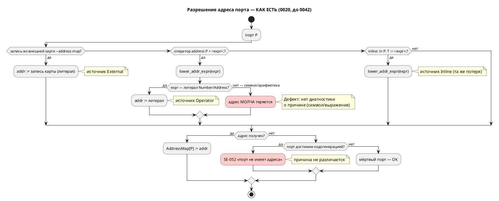
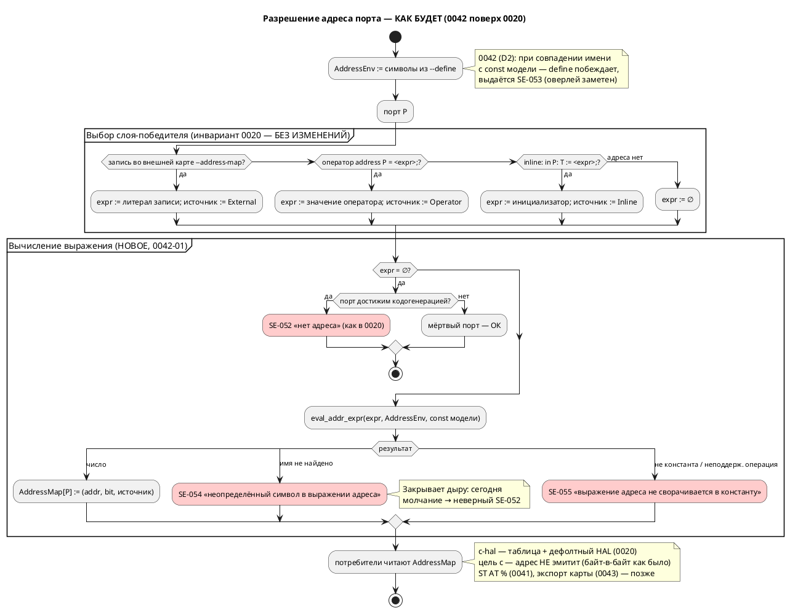

# Фича: Инъекция define'ов для адресов (--define)

- **Номер:** 0042
- **Статус:** **ГОТОВО** (2026-07-17; [отчёт](0042-address-defines.md#отчёт-о-тестировании) — вердикт «пройдено»)
- **Зависит от:** нет
- **Приоритет:** Tier 2 (ядро 0042-01 — Tier 1, см. ниже)
- **Крейт:** `grammar`. Версия языка **не поднималась**: к моменту реализации 0.3.0 уже поднята закрытой 0029 (тег `v0.3.0`), и по своду (накопление) 0042 вносит изменения в **уже поднятую** версию. Расширение аддитивно.
- **Связанные issue (анализ):** новая фича (вынесена из [адрес порта — размещение и потребление (карта адресов)](0020-port-address-decl.md))

> **Обоснование «Зависит от: нет».** Фича вынесена из [адрес порта — размещение и потребление (карта адресов)](0020-port-address-decl.md)
> («`-D`/инъекция define’ов … — выносятся в **отдельные фичи**»,
> раздел Action items). Ядро 0020 — слой `AddressMap`, `resolve_addresses`,
> оператор `address`, внешняя карта — **закрыто** (статус `ГОТОВО`, 2026-07-14,
> см. [реестр](README.md)). Единственная зависимость по контракту
> удовлетворена, блокировки нет: фича может быть взята в разработку
> немедленно.

## Стадии жизненного цикла

Все стадии — **разделы этой карточки**: «Архитектура (ADR)»,
«Анализ», «Разработка», «Тест-план», «Отчёт о тестировании», «Итог».
Отдельным артефактом остаются только исправления —
[`docs/fixes/`](../fixes/README.md) (при необходимости `0042-YY-*`).

## Краткое описание

Платформенные символы `--define NAME=VALUE` (кратко `-D`) вводятся в **среду
символов адреса** и потребляются выражениями адреса — как оператором
`address BTN = BTN_ADDR;`, так и inline-инициализатором порта. Это позволяет
держать один `.lam` и переключать адреса под платформу/ревизию флагами сборки, не
правя модель и не заводя файл карты. Слой — надстройка над `AddressMap`: define **не является четвёртым источником адреса** и не меняет
принятый приоритет `inline := < address < внешняя карта`, а лишь снабжает
значениями выражения того слоя, где они записаны.

> **Находка пробы (2026-07-15, проверено на коде — см. анализ).** Кандидат был
> описан как «тонкий слой поверх `AddressMap`». Это **не подтвердилось**:
> выражения адреса сегодня **не умеют** ссылаться на символы вообще.
> `lower_addr_expr` (`grammar/src/address_map.rs:384`) принимает только литералы
> `Number`/`Address`; `address BTN = BTN_ADDR;` и `address BTN = 0x100000 + 4;`
> **молча теряют адрес** → `SE-052` в цели `c-hal` (с неверной причиной), а
> ссылка на несуществующий символ вне `c-hal` не диагностируется вовсе.
> Поэтому ядро фичи — **вычисление выражений адреса** (свёртка констант +
> разрешение символов), а `--define` (0042-02) — надстройка над
> ним. Ядро 0042-01 самоценно и относится к классу «тихого пропуска» (как
> фича), поэтому имеет приоритет **Tier 1** внутри фичи.

> Фича зарегистрирована **из бэклога кандидатов** `FEATURES.md` (пункт
> «`-D`/инъекция define’ов для адресов», вынесенный из фичи); далее проходит
> жизненный цикл по своду.

## Декомпозиция (см. анализ)

- **0042-01** — вычисление выражений адреса: свёртка констант и разрешение
  символов; диагностики `SE-054` (неопределённый символ), `SE-055`
  (неконстантное выражение). *Ядро; закрывает найденный дефект тихого пропуска.*
- **0042-02** — среда define'ов `AddressEnv`: разбор `--define NAME=VALUE`,
  подстановка в разрешение символов, диагностики `DF-001…DF-004`, `SE-053`
  (define перекрывает одноимённую `const` модели).
- **0042-03** — проводка в CLI `lamc` (`--define`/`-D`, слитная форма
  `-DNAME=VAL`), справка, документация языка и примеры.

## Риски

- **Область видимости define'ов.** Расширение видимости за пределы выражений
  адреса сделало бы CLI способным молча менять логику автомата → в ADR принята
  изолированная среда (`AddressEnv`), видимая только выражениям адреса.
- **Ползучая семантика свёртки.** Вычислитель адреса не должен превратиться во
  второй интерпретатор выражений (ср. урок фичи) → строго ограниченное
  целочисленное подмножество, всё вне него → `SE-055`.
- **Регресс цели `c`.** Цель `c` адрес не эмитит и обязана остаться
  байт-в-байт неизменной — проверяемое условие тест-плана.
- **Конкуренция за `address_map.rs`** с фичами и 0043 (оба — потребители
  `AddressMap`) → рекомендованный порядок: 0042 → 0043 → 0041 (см. анализ).

## Архитектура (ADR)

- **Status:** Accepted
- **Date:** 2026-07-15
- **Authors:** Архитектор + дизайнер языков
- **Related issues:** [Фича](0042-address-defines.md); развивает
  [ADR](0020-port-address-decl.md#архитектура-adr) (слой `AddressMap`, приоритет источников);
  пересекается с [ADR](0041-st-backend.md#архитектура-adr) и [ADR](0043-address-map-export.md#архитектура-adr)
  (оба — потребители `AddressMap`)

### Context

ADR закрепил подсистему привязки портов к адресам: источники наполняют
единый слой **`AddressMap: PortId → Address`**, из которого потребители (сегодня —
цель `c-hal`) эмитят таблицу адресов и принятый по умолчанию HAL. Приоритет источников
(**инвариант**, `CLAUDE.md`):

> **inline `:=` < оператор `address Имя = <адрес>;` < внешняя карта `--address-map`**

В Action items ADR значилось: «**`-D`/инъекция define’ов** … выносятся в
**отдельные фичи**» — с формулировкой «символы `--define BTN_ADDR=0x200000` в
среде констант, потребляемые выражениями адреса (`address BTN = BTN_ADDR;`).
Это не отдельный парсер, а подстановка в окружение констант».

#### Находка: «тонкий слой» не подтвердился (проба на коде, 2026-07-15)

Кандидат предполагал, что выражения адреса уже умеют ссылаться на имена, и
`--define` останется тонкой надстройкой. **Проба это опровергла.**

Разрешение адреса выполняет `resolve_addresses`
(`grammar/src/address_map.rs:409`), а понижение выражения в число —
`lower_addr_expr` (`grammar/src/address_map.rs:384`). Последняя принимает
**только литералы**:

```rust
// grammar/src/address_map.rs:384 — фактический код
match expr {
    ExpressionNode::Address(a, b) => Some((*a, Some(*b))),
    ExpressionNode::Number(n) => Some((*n, None)),
    ExpressionNode::Unresolved(ast::Expression::Address(_, a, b)) => Some((*a, Some(*b))),
    ExpressionNode::Unresolved(ast::Expression::Number(_, n)) => Some((*n, None)),
    _ => None,   // ← символ, арифметика, всё остальное — молча «адреса нет»
}
```

Значение оператора `address` хранится как `ExpressionNode::Unresolved(…)`
(`grammar/src/semantic/tree.rs:551‑563`) и **никогда не понижается**
семантикой — вывод типов его не трогает. Результаты проб
(`cargo run --bin lamc -- compile -t c-hal`):

| Проба | Вход | Факт сегодня |
|---|---|---|
| A (эталон) | `address BTN = 0x00100000;` | ✅ адрес попадает в таблицу `*__ADDR` и принятый по умолчанию HAL |
| B | `const BTN_ADDR: u32 := 0x00100000; address BTN = BTN_ADDR;` | ❌ **ошибка `SE-052`** «порт не имеет адреса» — символ молча потерян |
| C | `address BTN = NOWHERE_DEFINED;` (цель `c-hal`) | ❌ `SE-052` — **причина в диагностике неверная** (символа не существует, но об этом не сказано) |
| C2 | то же, цель `c` | **компилируется успешно, rc=0** — висячая ссылка не диагностируется вовсе |
| D | `address BTN = 0x00100000 + 4;` | ❌ `SE-052` — свёртки констант нет |

**Вывод.** Выражения адреса **не умеют ссылаться на символы**, а любая
неатомарная форма **молча теряет адрес** — тот же класс дефекта «тихого
пропуска», что дал восемь ошибок в фиче. Поэтому 0042 состоит из **двух**
решений, а не из одного:

1. **Вычисление выражения адреса** — свёртка констант и разрешение символов
   (ядро; отсутствует сегодня).
2. **Источник символов** — откуда берутся имена, в частности из `--define`.

#### Поток «как есть»



### Decision Drivers

1. **Не нарушить инвариант приоритета 0020.** `inline < address < внешняя карта`
   зафиксирован в `CLAUDE.md` и охраняется тестами; define не должен стать
   скрытым четвёртым слоем.
2. **CLI не должен менять логику автомата.** Флаг сборки, способный молча
   переопределить `const`, участвующую в переходах, — это дыра в верифицируемости (язык для промышленных систем управления).
3. **Закрыть тихий пропуск.** Молчаливая потеря адреса недопустима: диагностика
   обязана называть причину (ср. замысел форматтера 0024 и урок).
4. **Обратная совместимость.** CLI `lamc` расширяется аддитивно;
   существующие `.lam` и вывод цели `c` — без изменений.
5. **Не плодить второй интерпретатор.** Вычислитель адреса — минимальное
   целочисленное подмножество, а не копия `simulation/src/eval/`.
6. **Симметрия с уже принятыми решениями.** Наложение платформы главнее
   модели, но **заметен** (предупреждение `SE-050`) — то же поведение ожидается и
   от define'ов.

### Вопрос 1. Место define'ов в приоритете источников адреса

#### Option A1. Define — четвёртый источник адреса (выше внешней карты)

`--define BTN=0x200000` напрямую задаёт адрес порта `BTN`, минуя выражения.

**Pros:**
- Прямолинейно: «переопредели адрес одним флагом».

**Cons:**
- **Ломает инвариант** (`CLAUDE.md`): цепочка становится
  `inline < address < карта < define`, все тексты/тесты приоритета — переписывать.
- Дублирует `--address-map`, у которого ровно эта роль (наложение платформы).
- Порождает неоднозначность: `-D BTN=…` — это адрес порта `BTN` или значение
  символа `BTN`? Имена портов и символов сливаются в одно пространство.

#### Option A2. Define — среда символов, ортогональная приоритету (**принято**)

Define не привязывается к порту вообще. Он даёт **значение имени**, которое
может встретиться в выражении адреса — на любом слое. Слой-победитель по-прежнему
выбирается правилом, и лишь **затем** его выражение вычисляется.

**Pros:**
- **Инвариант сохранён дословно** — define'ы лежат на другой оси
  («чем вычисляется выражение»), а не в цепочке источников.
- Композиция: `-D BASE=0x200000` + `address BTN = BASE + 4;` — модель описывает
  раскладку, платформа даёт базу.
- Имена портов и символов остаются разными пространствами.

**Cons:**
- Бесполезен без вычислителя выражений адреса (которого нет) → объём фичи растёт
  на задачу.
- Требует явного ответа: побеждает ли define одноимённую `const` (вопрос 4).

#### Option A3. Текстовый препроцессор (подстановка до лексера)

`-D NAME=VALUE` подставляется в текст `.lam` перед разбором, как в C.

**Pros:**
- Знакомая модель; тривиальная реализация.

**Cons:**
- Подстановка бьёт **по всему файлу**, а не только по адресам → драйвер 2 нарушен
  напрямую.
- Ломает позиции (`Location`) → диагностики, LSP и форматтер (0024) поедут.
- Проект сознательно не имеет препроцессора; вводить его ради адресов — тяжело.

### Вопрос 2. Область видимости define'а

#### Option B1. Define — константа в общей среде констант языка

Видна любому выражению: условиям переходов, телам блоков, инициализаторам `var`.

**Pros:**
- Максимально гибко; одна среда имён.

**Cons:**
- **CLI получает право молча менять поведение автомата** — `-D LIMIT=5` изменит
  `ref Stop: cnt = LIMIT;`. Для промышленных систем управления это
  недопустимо: верифицированная модель перестаёт быть самодостаточной.
- Меняет семантику разрешения имён языка → серьёзный рост версии языка и объёма
  тестов (все проходы семантики).
- Противоречит названию и мотиву фичи («define'ы **для адресов**»).

#### Option B2. Define виден только выражениям адреса (**принято**)

Символы живут в отдельной среде **`AddressEnv`**, к которой обращается только
вычислитель адреса — в двух позициях: значение оператора `address` и
inline-инициализатор порта (напомним находку 0020: инициализатор порта **и есть**
адрес, в C он иначе не используется).

**Pros:**
- Логика автомата **не зависит** от флагов сборки — модель остаётся
  верифицируемой (драйвер 2).
- Минимальная поверхность: не трогает 7 семантических проходов.
- Точная диагностика: имя в выражении адреса ищется в понятном, узком множестве.

**Cons:**
- Один и тот же идентификатор в выражении адреса и в логике может означать
  разное → снимается вопросом 4 (define перекрывает `const` **только** в
  выражениях адреса и **с предупреждением**).
- Не покрывает будущие «платформенные параметры» вне адресов — при появлении
  запроса заводится отдельная фича.

#### Option B3. Define виден только явно объявленным `extern const`

Модель декларирует `extern const BTN_ADDR: u32;`, define обязан его заполнить.

**Pros:**
- Максимальная явность: контракт платформы записан в модели.
- Опечатка в `-D` ловится как незаполненный `extern`.

**Cons:**
- **Расширяет грамматику** (`extern const`) → рост версии языка и объёма 0042.
- Требует объявлять каждый символ дважды (в модели и в сборке) — трение против
  мотива «не править модель под платформу».
- Хороший кандидат в **последующую** фичу поверх B2, если явность потребуется.

### Вопрос 3. Типизация значения define

#### Option C1. Только целочисленный литерал адреса (**принято**)

Значение — литерал в **той же грамматике, что и запись внешней карты**
(`Address` из `address_map.rs`): `0x…`, десятичное, необязательный `:bit`.
Переиспользуется существующая `parse_address_token`
(`grammar/src/address_map.rs:273`).

**Pros:**
- Ноль нового кода разбора значений; одинаковые правила у `--define` и
  `--address-map` → одна ментальная модель.
- Арифметика остаётся **в модели** (`address BTN = BASE + 4;`), где она видна
  ревьюеру и форматтеру, а не в командной строке.
- Значение всегда вычислено на момент разрешения — нет порядка/циклов между
  define'ами.

**Cons:**
- Нельзя `-D BTN_ADDR="BASE+4"` — вычисляемые наборы придётся раскрывать
  снаружи (shell/CMake).

#### Option C2. Значение — произвольное выражение Lam

`-D BTN_ADDR="BASE + 4"` разбирается парсером выражений и вычисляется.

**Pros:**
- Выразительно; наборы define'ов могут ссылаться друг на друга.

**Cons:**
- Требует разрешения **порядка и циклов** между define'ами (`-D A=B`, `-D B=A`)
  → полноценный граф зависимостей ради краевого случая.
- Диагностика с позициями внутри аргумента командной строки — отдельная возня с
  `Location` (у аргумента нет файла).
- Кавычки/экранирование в shell — источник ошибок сборки.

#### Option C3. Значение — нетипизированная строка

Хранится как текст, интерпретируется потребителем.

**Pros:**
- Универсально, задел под нечисловые параметры платформы.

**Cons:**
- Адрес обязан быть числом — проверка всё равно нужна, но уезжает вглубь, к
  потребителю → диагностика хуже.
- `AddressMap` типизирован `i64` — строка потребует приведения на каждом стыке.

### Вопрос 4. Конфликт define с одноимённой `const` в исходнике

#### Option D1. Ошибка

Любое совпадение имени define и `const` модели → отказ компиляции.

**Pros:**
- Однозначно; невозможен сюрприз.

**Cons:**
- Убивает главный сценарий: `const BTN_ADDR := 0x200000;` как **значение по
  умолчанию**, переопределяемое `-D BTN_ADDR=0x300000` под платформу.
- Асимметрия: у внешней карты (`--address-map`) ровно такое перекрытие —
  **предупреждение `SE-050`**, а не ошибка.

#### Option D2. Define побеждает, с предупреждением `SE-053` (**принято**)

В выражениях адреса имя ищется **сначала в `AddressEnv`, затем среди `const`
модели**. Если имя есть в обоих — берётся define, выдаётся предупреждение
`SE-053` с позицией объявления `const`.

**Pros:**
- **Прямая симметрия с `SE-050`** (0020): платформенный слой главнее модели, но
  перекрытие **заметно**. Одно правило на всю подсистему — легко объяснить.
- Работает сценарий «`const` = умолчание, `-D` = наложение под платформу».
- Перекрытие ограничено выражениями адреса (решение B2) → логика автомата
  по-прежнему неприкосновенна.

**Cons:**
- Предупреждение в штатном сценарии наложения будет частым → глушится `--quiet`
  (механизм уже есть в `lamc`), как и `SE-050`.

#### Option D3. `const` побеждает

Модель главнее командной строки.

**Pros:**
- Модель самодостаточна и неперекрываема.

**Cons:**
- `-D` становится бесполезен ровно там, где нужен (перекрыть умолчание), — остаётся
  лишь для имён, которых в модели нет. Мотив фичи не достигается.
- Противоречит направлению приоритета 0020 (внешнее главнее внутреннего).

### Вопрос 5. Наборы define'ов под платформы

#### Option E1. Только флаги командной строки (**принято для ядра 0042**)

`--define NAME=VALUE` (повторяемый), краткая форма `-D NAME=VALUE` и слитная
`-DNAME=VALUE` — по образцу уже существующего `-I` / `-I<путь>`
(`grammar/src/bin/lamc.rs:190‑199`). Роль «файла набора под платформу» уже
закрыта флагом **`--address-map`**, который читает `.ld`-подобный файл.

**Pros:**
- Ноль новых форматов: третий мини-язык (после `.lam` и `.ld`-карты) не заводится.
- Симметрия с `-I` — единый стиль CLI `lamc`.
- Набор под платформу выражается либо `--address-map stm32.map` (готово), либо
  обвязкой сборки (CMake/shell/`make`), где такие наборы и живут.

**Cons:**
- Длинные списки `-D` в командной строке при большом числе символов → лечится
  обвязкой сборки; при реальном запросе заводится фича файла-набора.

#### Option E2. Файл-набор нового формата (`--defines platform.def`)

**Pros:**
- Наборы версионируются вместе с проектом; командная строка коротка.

**Cons:**
- **Третий мини-формат** со своим лексером, диагностиками и тестами — ровно то,
  за что ADR уже платил на `.ld`-карте.
- Пересекается с `--address-map` по назначению → пользователю неочевидно, что
  когда применять.

#### Option E3. Переиспользовать формат `.ld`-карты для файла define'ов

`--defines platform.def` читается тем же `parse_address_map`, но записи
кладутся в `AddressEnv`, а не в карту адресов.

**Pros:**
- Парсер и коды `AM-001…006` переиспользуются целиком.

**Cons:**
- Два флага с **одинаковым** синтаксисом и **разной** семантикой (`NAME` — порт
  против `NAME` — символ) — ловушка для пользователя.
- Ценность мала, пока не доказан спрос на файл-наборы.

### Decision

Принимается связка **A2 + B2 + C1 + D2 + E1**:

1. **A2** — define'ы **ортогональны** приоритету источников. Инвариант
   (`inline < address < внешняя карта`) сохраняется **дословно**: сначала правило выбирает слой-победитель, и только затем выражение этого слоя
   вычисляется в среде `AddressEnv`.
2. **B2** — define виден **только выражениям адреса** (значение оператора
   `address` и inline-инициализатор порта). Логика автомата от флагов сборки не
   зависит.
3. **C1** — значение define — литерал адреса в грамматике внешней карты
   (`0x…` / десятичное / `:bit`); переиспользуется `parse_address_token`.
4. **D2** — define перекрывает одноимённую `const` **в выражениях адреса**, с
   предупреждением `SE-053` (симметрия с наложением карты `SE-050`).
5. **E1** — только флаги CLI; роль файла-набора уже играет `--address-map`.

Плюс — **обязательное ядро (0042-01)**, без которого `--define` нереализуем:
**вычислитель выражений адреса** `eval_addr_expr`. Он заменяет
`lower_addr_expr` и поддерживает строго ограниченное подмножество:

- литералы `Number`, `Address` (`0xADDR:bit`);
- имена → `AddressEnv` → `const` модели (рекурсивно, с защитой от циклов);
- целочисленные операции `+ - * / % << >> & | ^ ~`, унарный `+`/`-`, скобки;
- **всё остальное** (переменные, порты, вызовы функций, вещественные операции,
  блоки) → ошибка **`SE-055`**, а не молчание.

#### Целевой поток



#### Грамматика аргумента `--define` и разрешения имён

```plantuml
@startebnf
(* аргумент CLI: --define NAME=VALUE | -D NAME=VALUE | -DNAME=VALUE *)
DefineArg   = Name, "=", Address;
Name        = ( letter | "_" ), { letter | digit | "_" };
Address     = ( HexLiteral | DecLiteral ), [ ":", digit, { digit } ];
(* та же продукция Address, что и в записи внешней карты .ld (address_map.rs) *)

(* вычисляемое подмножество выражения адреса — 0042-01 *)
AddrExpr    = AddrTerm, { ( "+" | "-" | "|" | "^" | "<<" | ">>" ), AddrTerm };
AddrTerm    = AddrFactor, { ( "*" | "/" | "%" | "&" ), AddrFactor };
AddrFactor  = Address | Symbol | ( "-" | "+" | "~" ), AddrFactor | "(", AddrExpr, ")";
Symbol      = Name;   (* ищется: AddressEnv (--define), затем const модели *)
@endebnf
```

### Consequences

#### Положительные

- **Инвариант не тронут** — define'ы лежат на ортогональной оси; тексты и
  тесты приоритета источников остаются в силе.
- **Закрыт дефект тихого пропуска**: `address BTN = BTN_ADDR;` и
  `address BTN = 0x100000 + 4;` перестают молча терять адрес; висячий символ
  получает точную диагностику `SE-054` вместо вводящего в заблуждение `SE-052`.
- Реальный платформенный сценарий: один `.lam`, разные `-D` под ревизии; `const`
  в модели служит документированным умолчанием.
- Логика автомата **не зависит** от флагов сборки → верифицируемость модели
  (LTL/Бюхи, `verification/`) сохраняется.
- Задел для 0041 (ST `AT %`) и 0043 (экспорт карты): оба получают уже
  **вычисленные** адреса, не дублируя свёртку.

#### Отрицательные / Action items

- **Объём фичи больше кандидата.** «Тонкий слой» оказался слоем поверх
  отсутствующего ядра → задача обязательна.
- **Версия языка растёт: 0.2.0 → 0.3.0** (аддитивно). Обоснование —
  `--define` сам по себе CLI, но 0042-01 меняет **семантику языка**: конструкции,
  которые сегодня разбираются и молча теряют смысл, начинают его иметь. Ранее
  валидные программы не ломаются; ранее отвергавшиеся становятся валидными →
  минорный бамп. Крейт `grammar` — минорный бамп по SemVer.
- **`SE-054`/`SE-055` вне цели `c-hal` — предупреждения, а не ошибки.** Иначе
  программы, сегодня успешно собираемые целью `c` (проба C2, rc=0), сломались бы.
  Прецедент задан `SE-052` в 0020 (предупреждение в `c`, ошибка в `c-hal`) —
  следуем ему.
- **Защита от циклов** `const A := B; const B := A;` в вычислителе адреса
  (учёт посещённых имён) → при цикле `SE-055`.
- **`lower_addr_expr` уходит** (`address_map.rs:384`), его вызовы в
  `resolve_model` (`address_map.rs:455‑461`) переключаются на `eval_addr_expr`;
  `resolve_addresses` получает параметр `env: &AddressEnv` → **сигнатура
  публичного API `grammar::resolve_addresses` меняется** (крейт `grammar`,
  минорный бамп; внешних потребителей вне репозитория нет).
- **Конкуренция за `address_map.rs`** с 0041/0043 → рекомендованный порядок
  0042 → 0043 → 0041 (обоснование — в анализе).
- Документация языка и примеры/контрпримеры — после
  реализации.

#### Acceptance criteria

1. `--define NAME=VALUE`, `-D NAME=VALUE` и `-DNAME=VALUE` разбираются; флаг
   повторяем; без флага поведение `lamc` идентично текущему.
2. `address BTN = BTN_ADDR;` при `-D BTN_ADDR=0x200000` даёт в `c-hal` тот же
   адрес, что и `address BTN = 0x200000;` (сверка вывода).
3. `address BTN = BASE + 4;` при `-D BASE=0x200000` даёт `0x200004`
   (свёртка констант работает).
4. Приоритет 0020 соблюдён: при одновременных `address BTN = BTN_ADDR;`
   (`-D BTN_ADDR=0x200000`) и записи `BTN = 0x300000;` во внешней карте
   побеждает **карта** (`0x300000`) с предупреждением `SE-050`.
5. Define перекрывает одноимённую `const` в выражении адреса → адрес define'а +
   предупреждение `SE-053`; та же `const` в логике автомата **не изменяется**.
6. Неопределённый символ в выражении адреса → `SE-054` (ошибка в `c-hal`,
   предупреждение вне его); неконстантное выражение → `SE-055`.
7. Некорректный аргумент `--define` → `DF-001`/`DF-002`; дубль имени → `DF-003`;
   неиспользованный define → предупреждение `DF-004`.
8. **Цель `c` — байт-в-байт неизменна** при любых `-D` (адрес целью `c` не
   эмитится).
9. Регресс = 0: `cargo test --features lsp -- --test-threads=1` зелёный, включая
   `address_map_tests.rs` и `port_address_completeness_tests.rs`.

## Анализ

### Цель и контекст

Дать возможность задавать адреса портов **символами платформы**, передаваемыми в
сборку: `--define BTN_ADDR=0x200000` + `address BTN = BTN_ADDR;` в модели. Цель —
один `.lam` на все платформы/ревизии: адрес меняется флагом сборки, модель не
правится. Фича вынесена из [адрес порта — размещение и потребление (карта адресов)](0020-port-address-decl.md) (ADR,
Action items: «`-D`/инъекция define’ов … выносятся в **отдельные фичи**»).

По [ADR](0042-address-defines.md#архитектура-adr) принято: define'ы **ортогональны**
приоритету источников адреса (`inline := < address < внешняя карта`, инвариант в `CLAUDE.md`) — они не источник адреса, а **среда символов** `AddressEnv`,
видимая только выражениям адреса; значение define — литерал адреса в грамматике
внешней карты; define перекрывает одноимённую `const` **только в выражениях
адреса** и с предупреждением; наборы под платформы — флагами CLI (роль файла уже
играет `--address-map`).

#### Ключевая находка анализа: «тонкий слой» опровергнут (проба на коде)

Формулировка кандидата в `FEATURES.md` — «Тонкий слой поверх `AddressMap`» —
**не подтвердилась**. Проведена проба (`cargo run --bin lamc -- compile -t c-hal`,
временные файлы в скретчпаде):

| Проба | Вход | Факт |
|---|---|---|
| A (эталон) | `in BTN: bit; address BTN = 0x00100000; start S { ref T: BTN; } state T;` | ✅ rc=0; в `.h` — `Lit_PortBinding` и `*(volatile uint8_t*)b.addr` |
| B (символ) | `const BTN_ADDR: u32 := 0x00100000; address BTN = BTN_ADDR;` | ❌ rc=1, `SE-052` «порт 'BTN' … не имеет адреса» |
| C (висячий символ, `c-hal`) | `address BTN = NOWHERE_DEFINED;` | ❌ rc=1, `SE-052` — **причина неверна** |
| C2 (тот же файл, цель `c`) | — | **rc=0, компилируется** — висячая ссылка не диагностируется |
| D (арифметика) | `address BTN = 0x00100000 + 4;` | ❌ rc=1, `SE-052` — свёртки нет |

**Ответ на вопрос «умеют ли выражения адреса ссылаться на символы сегодня»:
НЕТ.** Причина — в коде:

- `grammar/src/address_map.rs:384` — `lower_addr_expr` принимает **только**
  `ExpressionNode::Address` / `Number` (и их `Unresolved`-формы); ветка `_ => None`
  молча означает «адреса нет».
- `grammar/src/semantic/tree.rs:551‑563` — значение оператора `address` кладётся
  как `ExpressionNode::Unresolved(def.value.clone())` и **никогда не понижается**:
  вывод типов (`type_inference.rs`) `address_defs` не обрабатывает.
- `grammar/src/address_map.rs:455‑461` — `resolve_model` вызывает
  `lower_addr_expr` для inline и для оператора; оба теряют символ одинаково.
- `grammar/src/semantic/mod.rs:132‑139` — `AddressBindingNode.value:
  ExpressionNode` с комментарием «сырое АСД до понижения»; понижения нет ни в
  одном проходе.

**Следствие для объёма:** ядро фичи — не `--define`, а **вычислитель выражений
адреса**. Это дефект класса «тихий пропуск» — тот же, что дал
восемь ошибок при зелёных тестах в фиче (`CLAUDE.md`). Поэтому 0042-01
самоценна и имеет приоритет Tier 1 внутри фичи Tier 2.

#### Что уже есть (проверено по коду)

- `grammar/src/address_map.rs` (587 строк) — `parse_address_map` (`AM-001…006`),
  `parse_address_token:273` (переиспользуем для значения define),
  `address_map_overlay_warnings` (`SE-050`/`SE-051`), `AddressSource:350`,
  `ResolvedAddress:361`, `AddressResolution:372`, `resolve_addresses:409`.
- `grammar/src/semantic/validate.rs:1183‑1222` — `check_port_addresses`
  (`SE-048` висячая привязка, `SE-049` конфликт inline + `address`);
  `validate.rs:1112‑1158` — полнота, `SE-052`.
- `grammar/src/lib.rs:259‑299` — `compile_to_c_hal`: `resolve_addresses` →
  ошибка при `Level::Error` → `hal_options.address_map` → генерация.
- `grammar/src/bin/lamc.rs:170‑250` — разбор флагов; `:213` — `--address-map`;
  `:190‑199` — `-I` с **слитной формой** `-I<путь>` (образец для `-D`);
  `:432` — строка справки; `:507‑545` — чтение карты.
- **`-D` и `--define` в CLI отсутствуют** (проверено `grep` по `lamc.rs` — 0
  совпадений), коллизии с существующими флагами (`-t -o -I -v -q`) нет.

### Зависимости фичи

- **Зависит от:** **нет**.

  **Обоснование.** Единственная содержательная зависимость — ядро подсистемы
  адресов [адрес порта — размещение и потребление (карта адресов)](0020-port-address-decl.md) (слой `AddressMap`,
  `resolve_addresses`, оператор `address`, внешняя карта, цель `c-hal`). По
  [реестру](README.md) и карточке 0020 её статус — **`ГОТОВО`
  (2026-07-14)**, все подзадачи…05 выполнены, код на месте (см. пути
  выше). Зависимость **удовлетворена** → статус `ЗАБЛОКИРОВАНА` **не ставится**, фича переводится в `РАЗРАБОТКА`.

- **Влияние на порядок разработки.** 0042 формально не разблокирует
  ни одной фичи (никто не объявляет её своей зависимостью), но **пересекается по
  коду** с двумя соседями — оба потребители `AddressMap`:

  | Фича | Статус | Пересечение с 0042 | Конфликт? |
  |---|---|---|---|
  | [генератор генерации в Structured Text (IEC 61131-3)](0041-st-backend.md) «Генератор генерации в Structured Text» | `СОЗДАНА` | Второй потребитель `AddressMap`: `address → AT %IX…` (ADR, «Потребители»). Читает `AddressResolution.map`, т.е. **результат** вычисления адреса | Нет по смыслу; **есть по коду** — обе фичи трогают `resolve_addresses` (0042 меняет сигнатуру, добавляя `env`) |
  | [экспорт карты адресов во внешний формат](0043-address-map-export.md) «Экспорт карты адресов во внешний формат» | `СОЗДАНА` | Третий потребитель: `lamc address-map --emit …` выгружает `AddressMap` наружу | Нет по смыслу; **есть по коду** — тот же модуль `address_map.rs` |

  **Рекомендация аналитика (критерий «необходимость»): порядок
  0042 → 0043 → 0041.** Обоснование:

  1. **0042 первой** — она единственная меняет **содержимое** карты (символы и
     арифметика начинают вычисляться) и **сигнатуру** `resolve_addresses`. Если
     0043 или 0041 сядут на карту раньше, их тесты зафиксируют **дефектное**
     поведение (символ → адреса нет), и после 0042 их придётся переписывать.
  2. **0043 второй** — экспорт обязан выгружать **окончательные** адреса; после
     0042 экспорт получает вычисленные значения бесплатно. До 0042 он выгружал бы
     карту, в которой символьные адреса отсутствуют, — то есть заведомо неполную.
  3. **0041 третьей** — самая крупная (новый генератор), меньше всего выигрывает от
     очерёдности и больше всех страдает от переписывания при смене карты под ней.

  Порядок — **рекомендация**, а не блокировка: ни 0041, ни 0043 не получают
  зависимости от 0042 (их можно делать параллельно ценой конфликтов слияния в
  `address_map.rs` и перепроверки тестов). Решение о порядке — за заказчиком;
  таблица `FEATURES.md` в границы этой работы не входит.

### Требования и проверяемые условия

- **R1. Вычисление выражений адреса (ядро, 0042-01).** Выражение адреса
  (значение оператора `address` и inline-инициализатор порта) вычисляется в
  константу: литералы `Number`/`Address`, имена, целочисленные операции
  `+ - * / % << >> & | ^ ~`, унарные `+`/`-`, скобки. Заменяет `lower_addr_expr`.
- **R2. Разрешение символов.** Имя в выражении адреса ищется **сначала** в
  `AddressEnv` (define'ы), **затем** среди `const` модели (рекурсивно, с защитой
  от циклов). Иные виды имён (переменные, порты) — не разрешаются (→ R6).
- **R3. Инвариант приоритета 0020 не нарушен.** Слой-победитель выбирается
  правилом `inline := < address < внешняя карта` **до** вычисления; define'ы в
  цепочку источников **не входят**. Записи внешней карты — литералы, вычислению
  не подлежат (формат карты не меняется).
- **R4. Область видимости define'а.** `AddressEnv` доступна **только**
  вычислителю адреса. Ни один из 7 семантических проходов, ни условия переходов,
  ни тела блоков define'ов не видят. Проверяемо: одноимённая `const` в логике
  автомата сохраняет своё значение при `-D`.
- **R5. Наложение define над `const` (`SE-053`).** Если имя есть и в `AddressEnv`,
  и среди `const` модели — в выражении адреса побеждает **define**, выдаётся
  предупреждение `SE-053` (симметрия с `SE-050`).
- **R6. Диагностика висячего символа (`SE-054`).** Имя, не найденное ни в
  `AddressEnv`, ни среди `const`, → `SE-054` с указанием имени. **Ошибка** в
  адрес-потребляющем режиме (`c-hal`), **предупреждение** вне его (прецедент
  `SE-052`, см. «Обратная функциональность»).
- **R7. Диагностика неконстантного выражения (`SE-055`).** Выражение, не
  сворачиваемое в константу (ссылка на `var`/порт, вызов функции, блок,
  вещественная операция, цикл в цепочке `const`), → `SE-055`. Молчание
  **запрещено** — это исходный дефект.
- **R8. Формат аргумента `--define` (`DF-001…003`).** `NAME=VALUE`, где `NAME` —
  идентификатор (`[A-Za-z_][A-Za-z0-9_]*`), `VALUE` — литерал адреса в грамматике
  внешней карты (переиспользуется `parse_address_token`, `address_map.rs:273`).
  Нет `=` / пустое имя / некорректное имя → `DF-001`; некорректный литерал →
  `DF-002`; повторное `--define` для одного имени → `DF-003` (ошибка, симметрия с
  `AM-006`).
- **R9. Неиспользованный define (`DF-004`).** Define, к которому не обратилось ни
  одно выражение адреса, → **предупреждение** (симметрия с `SE-051` — висячей
  записью карты). Ловит опечатки в именах.
- **R10. CLI аддитивно.** `--define NAME=VALUE`, `-D NAME=VALUE`,
  слитная `-DNAME=VALUE`; флаг повторяем; по умолчанию список пуст. Без флага
  поведение `lamc` **идентично** текущему.
- **R11. Цель `c` неизменна.** Цель `c` адрес не эмитит (`CLAUDE.md`) → вывод байт-в-байт совпадает с текущим при любых `-D`.
- **R12. Регресс = 0.** Существующие `.lam`, фикстуры и тесты
  (`address_map_tests.rs`, `port_address_completeness_tests.rs`, корпус
  `examples/`) — без изменений поведения.

### Критерии приёмки и способ проверки

| # | Критерий | Способ проверки |
|---|---|---|
| A1 | Символ в выражении адреса вычисляется: `-D BTN_ADDR=0x200000` + `address BTN = BTN_ADDR;` даёт тот же адрес, что литерал | зонд вывода `c-hal`, затем assertions против **захваченного** значения (`CLAUDE.md`: не угадывать строки/адреса); пример `valid/address_define_symbol.lam` (R1, R2) |
| A2 | Свёртка констант: `-D BASE=0x200000` + `address BTN = BASE + 4;` → `0x200004` | unit-тест `eval_addr_expr` + интеграционный прогон `c-hal` (R1) |
| A3 | Приоритет 0020 соблюдён: карта `BTN = 0x300000;` бьёт `address BTN = BTN_ADDR;` (`-D BTN_ADDR=0x200000`) → `0x300000` + `SE-050` | тест разрешения приоритета в `address_map_tests.rs` (R3) |
| A4 | Define бьёт одноимённую `const` в адресе → адрес define'а + `SE-053`; та же `const` в логике **не** изменена | парный тест: адрес из `c-hal` + значение переменной в симуляции/логике (R4, R5) |
| A5 | Висячий символ → `SE-054` (ошибка в `c-hal`, предупреждение в `c`) | контрпример `invalid/address_dangling_symbol.lam`; сверка кода диагностики и уровня по цели (R6) |
| A6 | Неконстантное выражение → `SE-055`; цикл `const A := B; const B := A;` → `SE-055`, не зависание | контрпримеры `invalid/address_nonconst_expr.lam`, `invalid/address_const_cycle.lam` (R7) |
| A7 | `DF-001…003` на битых аргументах; `DF-004` на неиспользованном define | unit-тесты разбора `--define` в `lamc.rs` (образец — `parse_address_map_flag`, `lamc.rs:1124‑1147`) (R8, R9) |
| A8 | CLI аддитивен: без `-D` вывод и коды возврата не изменились; `-DNAME=VAL` = `-D NAME=VAL` = `--define NAME=VAL` | unit-тесты `parse_compile_args`; прогон `examples/` (R10) |
| A9 | **Цель `c` байт-в-байт неизменна** при любых `-D` | `cmp`/diff вывода `c` до и после (эталон снят до правки); `./scripts/precheck.sh` (R11) |
| A10 | Регресс = 0 | `cargo test --features lsp -- --test-threads=1`; `./scripts/precheck.sh` (R12) |
| A11 | Примеры и контрпримеры попали в документацию языка | ревью `README.md` после реализации |

### Новые коды диагностик

Продолжение принятой в 0020 нумерации (проверено по коду: `SE-048`, `SE-049` —
`validate.rs:1197/1208/1219`; `SE-050`, `SE-051` — `address_map.rs:327/340/431`;
`SE-052` — `validate.rs:1158` и `address_map.rs:513`; `AM-001…006` —
`address_map.rs:132‑160`). Максимум занятых — `SE-052` и `AM-006`.

| Код | Уровень | Условие | Симметрия с существующим |
|---|---|---|---|
| `SE-053` | предупреждение | define перекрывает одноимённую `const` модели в выражении адреса | `SE-050` (наложение карты над моделью) |
| `SE-054` | ошибка в `c-hal`, иначе предупреждение | выражение адреса ссылается на неопределённый символ | `SE-048` (висячая привязка), `SE-052` (уровень по цели) |
| `SE-055` | ошибка в `c-hal`, иначе предупреждение | выражение адреса не сворачивается в константу (`var`/порт/вызов/цикл `const`) | новое (закрывает тихий пропуск) |
| `DF-001` | ошибка | некорректный формат аргумента `--define` (нет `=`, пустое/некорректное имя) | `AM-001`/`AM-002` (формат записи карты) |
| `DF-002` | ошибка | некорректный литерал значения define | `AM-005` |
| `DF-003` | ошибка | повторный `--define` для одного имени | `AM-006` |
| `DF-004` | предупреждение | define не использован ни одним выражением адреса | `SE-051` (висячая запись карты) |

Префикс **`DF`** — по образцу `AM` (диагностики формата внешней карты):
`AM-*` — формат `.ld`-карты, `DF-*` — формат аргумента `--define`. Коды `SE-*`
остаются за семантикой модели.

### Особенности по обратной функциональности

**свод: совместимость сохраняется; изменения аддитивны.**

- **CLI-контракт `lamc` расширяется аддитивно** (проверено по
  `lamc.rs:170‑250`): добавляется опциональный повторяемый флаг `--define`/`-D`
  со слитной формой `-DNAME=VAL` — ровно по образцу существующего `-I`/`-I<путь>`
  (`lamc.rs:190‑199`). Коллизий с занятыми флагами (`-t`, `-o`, `-I`, `-v`, `-q`,
  `--guard-enable/disable`, `--address-map`) нет: `grep` по `lamc.rs` даёт **0**
  совпадений на `-D`/`--define`. По умолчанию список пуст → команды без `-D`
  работают в точности как сейчас (A8).
- **Существующие `.lam` не ломаются.** Программы с литеральными адресами
  вычисляются тем же путём (литерал — частный случай выражения). Программы с
  символьными/арифметическими адресами сегодня **не работают** (пробы B, D:
  `SE-052`) → сделать их работающими — расширение, а не слом.
- **Цель `c` — байт-в-байт неизменна** (A9): она адрес не эмитит (инвариант
  в `CLAUDE.md`), а define'ы влияют **только** на значение адреса.
- **Уровень новых диагностик выбран ради совместимости.** `SE-054`/`SE-055` вне
  `c-hal` — предупреждения: проба C2 показала, что `address BTN = NOWHERE;` с
  целью `c` сегодня собирается успешно (rc=0); сделав это ошибкой безусловно, мы
  бы сломали такие сборки. Прецедент — `SE-052` (предупреждение в `c`, ошибка в
  `c-hal`).
- **Меняется сигнатура публичного API** `grammar::resolve_addresses`
  (добавляется `env: &AddressEnv`) и уходит приватная `lower_addr_expr`.
  Потребители — только внутри репозитория (`lib.rs:279`); внешних нет. Крейт
  `grammar` — минорный бамп по SemVer.

#### Версия языка: 0.2.0 → 0.3.0, аддитивно

**Вопрос: define'ы — это про CLI или про язык? Ответ: и то, и другое, и решает
вторая часть.**

- **`--define` сам по себе — про CLI.** Это флаг сборки; грамматика `.lam`, набор
  токенов и AST от него не меняются. Будь фича только флагом, версия языка не
  росла бы.
- **Но ядро фичи (0042-01) — про язык.** Оно меняет **семантику**: конструкция
  `address BTN = BTN_ADDR;` сегодня разбирается грамматикой (правило
  `AddressDefine` принимает полное `Expression`), но её значение **молча
  теряется**; после 0042 оно обретает смысл. Аналогично `address BTN = 0x100000 + 4;`.
  Это изменение правил вычисления конструкции языка → свод требует
  повышения версии языка.
- **Почему минорная (0.2.0 → 0.3.0), а не мажорная.** Расширение **аддитивно**:
  ни одна программа, валидная сегодня, не становится невалидной и не меняет
  своего смысла (литералы вычисляются так же). Меняется судьба программ, которые
  сегодня **отвергались** (`SE-052`) или молча теряли адрес, — они становятся
  валидными. Это классический минорный бамп SemVer, тот же класс, что и
  0.1.0 → 0.2.0 в фиче (README.md:1007‑1010).

Крейт `grammar` — минорный бамп (`grammar/Cargo.toml:3`, сейчас `0.2.0`).
Обновление `README.md`.

### Риски и зависимости

- **Ползучая семантика вычислителя** (главный риск). `eval_addr_expr` может
  начать обрастать до второго интерпретатора выражений — прямое повторение
  ошибки, из-за которой в 0025 семантику вычислений сводили в один слой
  (`simulation/src/eval/`). → Подмножество **зафиксировано в ADR** (EBNF
  `AddrExpr`); всё вне него → `SE-055`, а не «добавим ещё операцию». Вычислитель
  живёт в `address_map.rs` рядом с потребителем и не экспортируется как общий.
- **Соблазн расширить видимость define'ов** до общей среды констант «раз уж
  символы разрешаются». → Отвергнуто в ADR (Option B1): CLI не должен менять
  логику автомата; проверяется тестом A4 (значение `const` в логике не меняется
  при `-D`).
- **Циклы в цепочке `const`** (`const A := B; const B := A;`) → зависание
  вычислителя. → Учёт посещённых имён, при цикле `SE-055` (A6).
- **Позиции диагностик `DF-*`.** У аргумента командной строки нет `Location` в
  файле. → `DF-*` печатаются как ошибки CLI (без позиции), по образцу вывода
  ошибок карты `lamc.rs:515‑527`; `SE-053` привязывается к позиции `const` в
  модели, `SE-054`/`SE-055` — к позиции выражения адреса.
- **Конкуренция за `address_map.rs`** с 0041 и 0043 (см. «Зависимости»). →
  Рекомендованный порядок 0042 → 0043 → 0041; при параллельной работе —
  конфликты слияния и перепроверка тестов приоритета.
- **Размер модуля.** `address_map.rs` — 587 строк; вычислитель добавит ~150–200.
  Лимит ~1000 строк (`CLAUDE.md`, `docs/CODE.md`) не нарушается, но при росте
  вычислитель выделяется в `address_map/eval.rs`. (Для сравнения: `validate.rs` —
  3648 строк, уже в бэклоге как нарушение.)
- **Незакрытых зависимостей нет** — 0020 в статусе `ГОТОВО`, блокировки нет.

### Декомпозиция разработки

- **0042-01** — вычислитель выражений адреса `eval_addr_expr`: замена
  `lower_addr_expr`, свёртка констант, разрешение имён среди `const` модели,
  защита от циклов; `SE-054`, `SE-055` (R1, R2, R6, R7). *Ядро, Tier 1 — само по
  себе закрывает дефект тихого пропуска, даже без `--define`.*
- **0042-02** — среда define'ов: тип `AddressEnv`, разбор `NAME=VALUE` через
  `parse_address_token`, приоритет `AddressEnv` → `const`, `SE-053`,
  `DF-001…DF-004`; параметр `env` в `resolve_addresses`/`compile_to_c_hal`
  (R3, R4, R5, R8, R9).
- **0042-03** — CLI и документация: флаги `--define`/`-D`/`-DNAME=VAL` в
  `parse_compile_args`, `print_usage`, проводка в `compile_to_c_hal`; примеры и
  контрпримеры в `README.md`; версия языка 0.2.0 → 0.3.0
  (R10, R11, R12).

Объём аналитики умеренный — декомпозиция на `docs/analyze/0042-YY-*.md` **не требуется**; этот файл — единственный документ анализа.

## Разработка

### Задача

**Приоритет:** Tier 1 (внутри фичи Tier 2) — задача самоценна и **без**
`--define`: она закрывает дефект класса «тихий пропуск».

#### Что было

*Раздел описывает **реальное** состояние кода на 2026-07-15 (ветка `v2`, после
закрытия фичи), проверенное чтением кода и пробами.*

Подсистема адресов фичи закрыта и работает **только на литералах**.

**Разрешение адреса.** `resolve_addresses` (`grammar/src/address_map.rs:409`)
строит `AddressResolution { map, diagnostics }`, обходя модель рекурсивно
(`resolve_model`, `address_map.rs:440`). Для каждого порта берутся три источника
и применяется приоритет `inline < address < внешняя карта`
(`address_map.rs:455‑495`). Понижение выражения в число выполняет
`lower_addr_expr` (`address_map.rs:384`), и она принимает **только литералы**:

```rust
// grammar/src/address_map.rs:384 — фактический код на момент постановки задачи
match expr {
    ExpressionNode::Address(a, b) => Some((*a, Some(*b))),
    ExpressionNode::Number(n) => Some((*n, None)),
    ExpressionNode::Unresolved(ast::Expression::Address(_, a, b)) => Some((*a, Some(*b))),
    ExpressionNode::Unresolved(ast::Expression::Number(_, n)) => Some((*n, None)),
    _ => None,   // ← символ, арифметика, всё прочее: «адреса нет», без диагностики
}
```

**Почему выражение остаётся сырым.** Значение оператора `address` кладётся как
`ExpressionNode::Unresolved(def.value.clone())` (`grammar/src/semantic/tree.rs:551‑563`)
и **никогда не понижается**: `AddressBindingNode.value`
(`grammar/src/semantic/mod.rs:132‑139`) помечен «сырое АСД до понижения», но
вывод типов (`semantic/type_inference.rs`) `address_defs` не обрабатывает — ни
один из 7 семантических проходов к нему не обращается. Грамматика при этом
принимает **полное** `Expression` (`ast::AddressDefine.value: Expression`,
`grammar/src/parser/ast.rs:936‑943`) — то есть символьная и арифметическая формы
**разбираются**, но их значение теряется.

**Пробы (`cargo run --bin lamc -- compile -t c-hal`, 2026-07-15).**

| Проба | Вход | Факт |
|---|---|---|
| A (эталон) | `in BTN: bit; address BTN = 0x00100000; start S { ref T: BTN; } state T;` | ✅ rc=0; в `.h` — `typedef struct { uintptr_t addr; int8_t bit; uint8_t width; } Lit_PortBinding;` и `*(volatile uint8_t*)b.addr` |
| B (символ) | `const BTN_ADDR: u32 := 0x00100000; address BTN = BTN_ADDR;` | ❌ rc=1: `Ошибка компиляции [SE-052]: порт 'BTN' используется в кодогенерации, но не имеет адреса` |
| C (висячий символ, `c-hal`) | `address BTN = NOWHERE_DEFINED;` | ❌ rc=1, `SE-052` — **причина в сообщении неверна**: символа не существует, но диагностика говорит «нет адреса» |
| C2 (тот же файл, цель `c`) | — | **rc=0, компилируется успешно** — висячая ссылка не диагностируется вовсе |
| D (арифметика) | `address BTN = 0x00100000 + 4;` | ❌ rc=1, `SE-052` |

**Проблема (из анализа/ADR).** Выражения адреса **не умеют ссылаться на символы**
и **молча теряют** любую неатомарную форму. Это дефект класса «тихий пропуск» —
тот же, что дал восемь ошибок при зелёных тестах в фиче (`CLAUDE.md`).
Диагностика `SE-052` вводит в заблуждение (называет следствие, а не причину), а
вне цели `c-hal` проблема не сообщается совсем. Фича («тонкий слой поверх
`AddressMap`») **нереализуема**, пока этого слоя вычисления нет.

**Занятые коды диагностик** (проверено по коду): `SE-048`, `SE-049`
(`validate.rs:1197/1208/1219`), `SE-050`, `SE-051` (`address_map.rs:327/340/431`),
`SE-052` (`validate.rs:1158`, `address_map.rs:513`), `AM-001…006`
(`address_map.rs:132‑160`). Максимум — `SE-052`, `AM-006`.

#### Что сделано

> **Выполнено** (2026-07-17). Все пять проб (A, B, C, C2, D) воспроизведены на
> сегодняшнем коде дословно **до** правки — постановка подтверждена фактом.

##### Итог

`lower_addr_expr` заменена вычислителем: литералы, имена (`AddressEnv` → `const`
модели, рекурсивно), целочисленная арифметика `+ - * / % << >> & | ^ ~`, унарные,
скобки; всё прочее → `SE-055`. Защита от циклов — набор посещённых имён.

| Проба | Было | Стало |
|---|---|---|
| B (`address BTN = BTN_ADDR;`) | `SE-052` | rc=0, адрес `0x100000` |
| D (`address BTN = 0x100000 + 4;`) | `SE-052` | rc=0, адрес `0x100004` |
| C (висячий символ, `c-hal`) | `SE-052` — причина неверна | **`SE-054` с именем символа** |
| C2 (тот же файл, цель `c`) | rc=0, **тишина** | rc=0 + **предупреждение `SE-054`** |

##### Три находки, которых не было в проработке

**1. У inline-пути потеря происходит раньше — и в другом месте.** Анализ считал,
что «`resolve_model` вызывает `lower_addr_expr` для inline и для оператора; оба
теряют символ одинаково». Эффект тот же, но причина разная: зонд показал, что
`in REG: u32 := A;` и `:= 0x100000 + 4;` дают `expr = None` — инициализатор
**выброшен фильтром** ещё на этапе 0 (`tree.rs:476`):

```rust
let expr = initializer
    .filter(|i| matches!(i, ast::Expression::Address(..) | ast::Expression::Number(..)))
    .map(ExpressionNode::Unresolved)
    .unwrap_or(ExpressionNode::None);   // ← символ/арифметика молча выброшены
```

То есть замена `lower_addr_expr` чинила бы **только** путь оператора: до неё
inline-выражение уже не доходит. Фильтр снят (регресс 2051 тест — зелёный);
`construct_expression` понижает инициализатор штатно, давая `Variable(Const A)` и
`Add(Number, Number)`.

**2. `SE-052` эмитилась рядом с точной причиной.** Первая редакция давала на
висячий символ и `SE-054`, и `SE-052`; сортировка по позиции ставила `SE-052`
первой, и `c-hal` возвращал именно её — то есть пользователь снова получал
диагностику о следствии. Введён признак `failed`: «источника нет» и «источник
есть, но сломан» — **разные** случаи, и второй уже назван.

**3. Диагностика без файловой позиции роняла сортировку.** `DF-004` несёт
`Location::CommandLine` (у аргумента CLI позиции в файле нет), а
`sort_by_key(|d| d.loc.start())` на такой паникует. Ключ сортировки различает
файловые и нефайловые позиции; нефайловые идут последними.

##### Как устроено (решения реализации)

- **Два матчера, одна арифметика.** Значение оператора `address` — сырой АСД
  (`Unresolved`), inline — понижённый `ExpressionNode`; разбираются оба, но
  арифметика живёт **в одном** месте (`apply_binary`). Разъехавшись, они дали бы
  разный адрес для одного текста в зависимости от пути. Это и есть граница из
  ADR: не второй интерпретатор, а один узкий вычислитель.
- **Бит не участвует в арифметике.** `0x1000:3 + 4` → `SE-055`: бит — свойство
  записи адреса, а не число, и молча его терять нельзя.
- **Деление на ноль и сдвиг ≥ 64** → `SE-055`, а не паника Rust.

**Суть (план).** Заменить `lower_addr_expr` вычислителем `eval_addr_expr`, который
сворачивает выражение адреса в константу, разрешает имена среди `const` модели и
**никогда не молчит** при неудаче.

Планируемый объём:

1. **`eval_addr_expr`** в `grammar/src/address_map.rs` — вместо `lower_addr_expr`
   (`:384`). Подмножество зафиксировано EBNF `AddrExpr` в ADR:
   - литералы `Number`, `Address` (`0xADDR:bit`) — в т. ч. `Unresolved`-формы;
   - имена — разрешение среди `const` модели, рекурсивно (задел под `AddressEnv`
     задачи: параметр среды вводится уже здесь, пустым);
   - целочисленные `+ - * / % << >> & | ^ ~`, унарные `+`/`-`, скобки;
   - **всё остальное** → `SE-055` (не `None`, не молчание).
2. **Защита от циклов** — набор посещённых имён в цепочке `const A := B;
   const B := A;` → `SE-055` вместо зависания.
3. **Диагностики** — `SE-054` (неопределённый символ, с именем в сообщении),
   `SE-055` (не сворачивается в константу). Уровень: **ошибка** в
   адрес-потребляющем режиме (`c-hal`), **предупреждение** вне его — прецедент
   `SE-052` (проба C2: сегодня цель `c` такой файл собирает, rc=0; безусловная
   ошибка сломала бы совместимость).
4. **`resolve_model`** (`address_map.rs:455‑461`) — оба вызова (inline и
   оператор) переключаются на `eval_addr_expr`; диагностики вычисления попадают в
   `AddressResolution.diagnostics` рядом с `SE-050`/`SE-052`.
5. **Приоритет 0020 не трогается** — цепочка `inline < address < внешняя карта`
   (`address_map.rs:463‑495`) остаётся дословно: сначала выбирается
   слой-победитель, затем вычисляется его выражение. Записи внешней карты —
   литералы (`parse_address_token`), вычислению не подлежат.
6. **Правила кода** (`docs/CODE.md`, `CLAUDE.md`): `address_map.rs` — 587 строк,
   вычислитель добавит ~150–200 (лимит ~1000 не нарушается); при росте выделить
   `address_map/eval.rs`. Ветка `_` по вариантам `ExpressionNode` **обязана**
   давать `SE-055`, а не тихий `None` — это суть задачи.

##### Статус по функциональности

| Функциональность | Требуется? | Что делаем |
|---|---|---|
| Цель `-t c-hal` | **да** | единственный потребитель адресов; получает вычисленные значения |
| Цель `-t c` | **да, минимально** | адрес не эмитит → вывод **байт-в-байт неизменен**; только уровень `SE-054`/`SE-055` понижен до предупреждения |
| Цель `-t plantuml` | н/п | адрес не потребляет |
| CLI `lamc` | н/п в этой задаче | флаг `--define` — задача |
| Симулятор (`simulation`) | н/п | адреса не потребляет; `eval/` не трогаем (семантика вычислений симулятора — отдельный слой, `CLAUDE.md`) |
| Форматтер (0024), LSP | н/п | новых узлов АСД нет — печать и индекс не меняются |

#### Проверки

> **Планируется (разработка не начата).**

Соответствие анализу: **R1** (вычисление), **R2** (разрешение символов),
**R6** (`SE-054`), **R7** (`SE-055`), **R11** (цель `c` неизменна), **R12**
(регресс = 0). Критерии: **A1, A2, A5, A6, A9, A10**.

Проверки тест-плана: **T2, T3, T10, T11, T12, T18, T20, T22, T23**.

Методика (`CLAUDE.md`): **сперва зонд** для захвата реального вывода `c-hal`,
**затем** assertions против захваченных значений — строки и адреса не угадывать.
Эталон вывода цели `c` снять **до** правки (для `cmp` в T18).

```sh
### Сборка (правило 5)
cargo build --bin lamc
cargo build --features lsp --bin lam-lsp

### Тесты — однопоточно (иначе гонки за общие файлы)
cargo test --features lsp -- --test-threads=1
cargo test address_map -- --test-threads=1

### Предкоммит-проверка (fmt + check + clippy + test + сборка примеров)
./scripts/precheck.sh
```

Ожидаемые результаты:

- Проба B (`const BTN_ADDR := 0x00100000; address BTN = BTN_ADDR;`) — из `SE-052`
  становится **rc=0** с адресом `0x00100000` (T3).
- Проба D (`address BTN = 0x00100000 + 4;`) — **rc=0**, адрес `0x00100004` (T2).
- Проба C (`address BTN = NOWHERE_DEFINED;`) — `SE-054` **с именем символа**
  вместо `SE-052`; цель `c` — предупреждение, rc=0 (T10).
- `var x: u32 := 5; address BTN = x;` → `SE-055` (T11); цикл `const` → `SE-055`
  без зависания (T12).
- `cmp` вывода цели `c` до/после — **идентичен** (T18).
- `address_map_tests.rs`, `port_address_completeness_tests.rs` — зелёные без
  правок ожиданий (T20).

### Задача

**Предшественник:** [инъекция define'ов для адресов (--define)](0042-address-defines.md#разработка) (вычислитель выражений
адреса) — без него подставлять define'ы **некуда**.

#### Что было

*Раздел описывает **реальное** состояние кода на 2026-07-15 (ветка `v2`),
проверенное чтением кода и пробами.*

**Среды символов для адресов не существует.** Проверено `grep` по
`grammar/src/bin/lamc.rs`: `-D`, `--define`, `define` — **0 совпадений**. Флаги
`CompileOptions` (`lamc.rs:170‑176`, структура — `lamc.rs:57‑78`) сегодня:
`--target`/`-t`, `--output`/`-o`, `--include-dirs`/`-I` (+ слитная форма
`-I<путь>`, `lamc.rs:198`), `--verbose`/`-v`, `--quiet`/`-q`,
`--guard-enable`/`--guard-disable`, `--address-map` (`lamc.rs:213`). Короткое
`-D` **свободно** — коллизии нет.

**Единственный внешний источник значений адреса** — `.ld`-подобная карта фичи: `parse_address_map` (`grammar/src/address_map.rs:138`) с кодами
`AM-001…006` (`address_map.rs:132‑160`); литерал значения разбирает
`parse_address_token` (`address_map.rs:273`): `0x…` / десятичное / необязательный
`:bit` — **эту функцию задача переиспользует** для значения define'а (решение C1
в ADR). Карта наполняет **адреса портов**, а не среду символов: её записи —
`AddressMapEntry { name, addr, bit, loc }` (`address_map.rs:36‑45`), где `name` —
имя **порта**.

**Разрешение имён в выражении адреса отсутствует** — см. [инъекция define'ов для адресов (--define)](0042-address-defines.md#разработка),
раздел «Что было»: `lower_addr_expr` (`address_map.rs:384`) принимает только
литералы; проба `const BTN_ADDR: u32 := 0x00100000; address BTN = BTN_ADDR;`
падает с `SE-052`.

**Прецедент наложения (0020-03).** Внешняя карта переопределяет адрес, заданный в
модели, — это **не** ошибка, а **предупреждение `SE-050`**
(`address_map.rs:319‑328`, `:466‑477`): «платформенный слой главнее модели, но
перекрытие заметно». Висячая запись карты (имени нет среди портов) —
предупреждение `SE-051` (`address_map.rs:331‑341`, `:421‑434`). Задача следует
этому прецеденту симметрично.

**Проблема.** Нет способа передать адрес платформы **символом** в сборку: единая
модель под несколько ревизий требует либо правки `.lam`, либо отдельного файла
карты на каждую ревизию. `const` в модели могла бы служить умолчанием, но
переопределить её снаружи нечем.

#### Что сделано

> **Выполнено** (2026-07-17).

##### Итог

Заведён тип `AddressEnv` (`address_map.rs`): `имя → (адрес, бит)` + учёт
обращений. Разбор — `parse_defines` через существующую `parse_address_token`
(грамматика значения дословно та же, что у записи внешней карты, решение C1).
Порядок разрешения имён — `AddressEnv` → `const` модели; перекрытие даёт
`SE-053` с позицией **объявления `const`** (перекрыто именно оно). Диагностики
`DF-001` (формат), `DF-002` (литерал), `DF-003` (повтор имени), `DF-004`
(символ никем не спрошен). Сигнатуры `resolve_addresses`, `compile_to_c_hal` и
`compile_to_st_at` получили `env: &AddressEnv`.

Проверено сквозным прогоном:

| Сценарий | Результат |
|---|---|
| `-D BTN_ADDR=0x00200000` + `address BTN = BTN_ADDR;` | адрес `0x200000` |
| `-D BASE=0x00200000` + `address BTN = BASE + 4;` | адрес `0x200004` |
| `const BTN_ADDR := 0x200000` + `-D BTN_ADDR=0x300000` | адрес **`0x300000`** + `SE-053` |
| `const BTN_ADDR := 0x200000` **без** `-D` | адрес `0x200000` (закрытие пробы B) |
| `-D BTN_ADDR` / `-D N=0xZZ` / `-D N=0x1 -D N=0x2` | `DF-001` / `DF-002` / `DF-003` |

**Инвариант не тронут** — проверено тестом `define_does_not_raise_layer_priority`:
карта бьёт `address` с define'ом (`External`, `SE-050`). Define — **не** источник
адреса: `define_alone_is_not_an_address_source` фиксирует `SE-052` + `DF-004`.

**Находка: `SE-054`/`SE-055` вне `c-hal` требовали отдельной проводки.**
`resolve_addresses` зовут только адрес-потребляющие цели (`c-hal`, `st-at`), и
для них это ошибки. Чтобы цель `c` не молчала (проба C2 — сегодня тишина при
rc=0), заведена `address_expr_warnings`: те же диагностики, **понижённые до
предупреждений**, вызываются `lamc` для целей, которые адрес не потребляют.
Иначе «предупреждение вне `c-hal`» из тест-плана было бы недостижимо — цель `c`
разрешение адресов не запускает вовсе.

**Суть (план).** Ввести изолированную среду символов `AddressEnv`, наполняемую из
`--define`, и подключить её к вычислителю адреса как **первый** источник имён
(перед `const` модели), с предупреждением при перекрытии.

Планируемый объём:

1. **Тип `AddressEnv`** в `grammar/src/address_map.rs` — отображение
   `имя символа → (addr, bit)`. Namespace **отдельный** от имён портов (решение
   A2 в ADR: define — не источник адреса) и от общей среды констант языка
   (решение B2: CLI не должен менять логику автомата).
2. **Разбор `NAME=VALUE`** — функция вида `parse_define(arg) -> Result<…, Diagnostic>`:
   `NAME` — `[A-Za-z_][A-Za-z0-9_]*`, `VALUE` — через существующую
   `parse_address_token` (`address_map.rs:273`), т. е. ровно та же грамматика,
   что у записи внешней карты. Диагностики: **`DF-001`** (нет `=`, пустое или
   некорректное имя), **`DF-002`** (некорректный литерал), **`DF-003`**
   (повторный define одного имени — ошибка, симметрия с `AM-006`).
3. **Порядок разрешения имён** в `eval_addr_expr`:
   **`AddressEnv` → `const` модели**. При совпадении имени в обоих — побеждает
   define + предупреждение **`SE-053`** с позицией объявления `const` (решение D2:
   прямая симметрия с `SE-050`).
4. **`DF-004`** — предупреждение о define'е, к которому не обратилось ни одно
   выражение адреса (симметрия с `SE-051`, ловит опечатки). Требует учёта
   обращений в ходе вычисления → счётчик/множество использованных имён в
   `AddressEnv`.
5. **Сигнатуры** — `resolve_addresses` (`address_map.rs:409`) и
   `compile_to_c_hal` (`grammar/src/lib.rs:259`) получают параметр
   `env: &AddressEnv`. Публичный API крейта `grammar` (`lib.rs:59`) меняется →
   **минорный бамп** по SemVer; внешних потребителей вне репозитория нет
   (единственный вызов — `lib.rs:279`).
6. **Инвариант не трогается** — цепочка приоритета
   (`address_map.rs:463‑495`) остаётся дословно; `AddressEnv` в неё **не входит**.
   Контрольный тест: `-D BTN=0x200000` при отсутствии inline/`address`/карты
   **не** создаёт адрес порта `BTN` → `SE-052` + `DF-004` (T16).
7. **Позиции диагностик.** У аргумента CLI нет `Location` в файле → `DF-*`
   печатаются как ошибки CLI без позиции (образец — вывод ошибок карты,
   `lamc.rs:515‑527`); `SE-053` привязывается к позиции `const` в модели.

##### Статус по функциональности

| Функциональность | Требуется? | Что делаем |
|---|---|---|
| Цель `-t c-hal` | **да** | адреса из define'ов попадают в таблицу и принятый по умолчанию HAL |
| Цель `-t c` | **да, минимально** | адрес не эмитит → **байт-в-байт неизменна** при любых `-D` |
| Цель `-t plantuml` | н/п | адрес не потребляет |
| CLI `lamc` | частично | тип и разбор `NAME=VALUE` здесь; **флаги** — задача |
| Логика автомата / `const` в переходах | **не должна быть задета** | ключевая проверка изоляции (T9): `AddressEnv` видна только вычислителю адреса |
| Симулятор (`simulation`) | н/п | адреса не потребляет |
| Форматтер (0024), LSP | н/п | новых узлов АСД нет |

#### Проверки

> **Планируется (разработка не начата).**

Соответствие анализу: **R3** (инвариант приоритета), **R4** (изоляция среды),
**R5** (`SE-053`), **R8** (`DF-001…003`), **R9** (`DF-004`), **R11**, **R12**.
Критерии: **A3, A4, A7, A9, A10**.

Проверки тест-плана: **T5, T8, T9, T13, T14, T15, T16, T17, T18, T20**.

Методика (`CLAUDE.md`): сперва зонд для захвата реального вывода `c-hal`, затем
assertions против захваченных значений.

```sh
### Сборка (правило 5)
cargo build --bin lamc

### Тесты — однопоточно
cargo test --features lsp -- --test-threads=1
cargo test address_map -- --test-threads=1

### Предкоммит-проверка
./scripts/precheck.sh
```

Ожидаемые результаты:

- **Наложение (T8):** `const BTN_ADDR := 0x00200000; address BTN = BTN_ADDR;` +
  `-D BTN_ADDR=0x00300000` → адрес **`0x00300000`** + предупреждение `SE-053`.
- **Изоляция (T9, ключевая):** `const LIMIT := 3;` в условии перехода при
  `-D LIMIT=99` → переход по-прежнему сравнивает с **3**; `DF-004` на
  неиспользованный `LIMIT`.
- **Приоритет 0020 (T14):** карта `BTN = 0x00300000;` бьёт `address BTN = BTN_ADDR;`
  (`-D BTN_ADDR=0x00200000`) → `0x00300000`, источник `External`, `SE-050`.
  Define **не** повысил приоритет слоя.
- **Define ≠ источник (T16):** `-D BTN=0x00200000` без inline/`address`/карты →
  `SE-052` + `DF-004`.
- **Формат (T13):** `-D BTN_ADDR` → `DF-001`; `-D N=0xZZ` → `DF-002`;
  `-D N=0x1 -D N=0x2` → `DF-003`; `-D UNUSED=0x1` → предупреждение `DF-004`.
- **Совместимость (T18):** `cmp` вывода цели `c` до/после — идентичен при любых
  `-D`.

### Задача

**Предшественники:** [инъекция define'ов для адресов (--define)](0042-address-defines.md#разработка) (вычислитель),
[инъекция define'ов для адресов (--define)](0042-address-defines.md#разработка) (`AddressEnv`). Эта задача — проводка наружу и
закрытие процессных обязательств.

#### Что было

*Раздел описывает **реальное** состояние кода и документации на 2026-07-15
(ветка `v2`), проверенное чтением кода.*

**CLI.** Разбор аргументов — `parse_compile_args` (`grammar/src/bin/lamc.rs:165‑250`),
структура опций — `CompileOptions` (`lamc.rs:57‑78`), справка — `print_usage`
(`lamc.rs:416‑445`). Занятые флаги: `--target`/`-t`, `--output`/`-o`,
`--include-dirs`/`-I`, `--verbose`/`-v`, `--quiet`/`-q`, `--guard-enable`,
`--guard-disable`, `--address-map`. Неизвестный флаг → ошибка
(`lamc.rs:225‑227`); позиционный аргумент (не начинается с `-`) → входной файл
(`lamc.rs:221‑223`).

**`-D`/`--define` отсутствуют** — `grep` по `lamc.rs` даёт **0** совпадений.
Коллизии с занятыми флагами нет.

**Образец для слитной формы уже есть** — `-I` поддерживает и раздельную, и
слитную запись:

```rust
// grammar/src/bin/lamc.rs:190‑199 — фактический код
"-I" | "--include-dirs" => { /* … args.get(i) … */ }
// Слитная форма: -I/path или -I/a:/b
s if s.starts_with("-I") && s.len() > 2 => {
    include_dirs.extend(split_include_dirs(&s[2..]));
}
```

**Образец обработки внешнего файла** — чтение и разбор карты один раз, с выводом
всех диагностик и `process::exit(1)` при ошибке (`lamc.rs:507‑530`); передача в
`compile_to_c_hal` — только для цели `c-hal` (`lamc.rs:532‑545` — для остальных
целей карта даёт лишь информационные предупреждения).

**Образец тестов разбора флагов** — модуль `#[cfg(test)]` в самом `lamc.rs`:
`parse_address_map_flag` (`lamc.rs:1124‑1133`), `address_map_absent_by_default`
(`:1138‑1141`), `address_map_requires_argument` (`:1145‑1147`).

**Справка** (`lamc.rs:432`) перечисляет `--address-map`, целевые платформы
(`c`, `c-hal`, `plantuml`) и примеры — про define'ы там ничего нет.

**Версия.** Крейт `grammar` — `0.2.0` (`grammar/Cargo.toml:3`). Версия языка —
**0.2.0** (`README.md:1007`: «**Версия языка: 0.2.0** (крейт `grammar`)»), с
записью об аддитивном расширении 0.1.0 → 0.2.0 фичей (`README.md:1010`).

**Документация языка.** `README.md` описывает синтаксис, семантику и примеры, включая оператор `address` и `--address-map` фичи. Символьные
адреса и define'ы не описаны — их и **не существует** (см. пробы в
[инъекция define'ов для адресов (--define)](0042-address-defines.md#разработка)).

#### Что сделано

> **Выполнено** (2026-07-17).

##### Итог

`CompileOptions.defines: Vec<String>` (по умолчанию пусто → без флага поведение
идентично прежнему). Три формы по образцу `-I`: `--define N=V`, `-D N=V`,
слитная `-DN=V` (ветка **после** раздельной — иначе перехватывала бы сам `-D`).
Флаг повторяем; `-D` без аргумента — отказ. Среда строится один раз в `main`,
`DF-001…003` печатаются как ошибки CLI с `exit(1)`. Справка дополнена; в
`README.md` внесён раздел «Символьные адреса и `--define`» с примерами,
контрпримерами и таблицей кодов.

##### Версия языка: план устарел — поднимать не требуется

Задача предписывала поднять `0.2.0 → 0.3.0` и крейт `grammar` с `0.2.0`. **На
момент реализации версия языка уже `0.3.0`** (поднята закрытой фичей,
коммит помечен тегом `v0.3.0`), а крейт `grammar` — `0.5.0`. По **своду**
(накопление, решение заказчика 2026-07-15) первая закрытая фича цикла поднимает
версию, остальные **вносят изменения в уже поднятую** и своих подъёмов не
делают. 0042 — из тех же пяти фич, что заявляли `0.2.0 → 0.3.0` (029, 0031,
[согласование тактов симулятора и порождённого C (INIT-такты)](0033-init-tick-alignment.md), 0042, 0044), и подъём за них уже сделала 0029.

Поэтому версия **не поднималась**; в `README.md` добавлена запись об аддитивном
расширении **в** 0.3.0 — рядом с записью фичи.

**Суть (план).** Вывести `AddressEnv` наружу флагом `--define`/`-D` по образцу `-I`,
обновить справку и документацию языка примерами/контрпримерами, поднять версию
языка.

Планируемый объём:

1. **`CompileOptions`** (`lamc.rs:57‑78`) — поле вида `defines: Vec<String>`
   (сырые аргументы; разбор в `AddressEnv` — функцией задачи). По
   умолчанию **пусто** → без флага поведение идентично текущему (R10).
2. **`parse_compile_args`** (`lamc.rs:165‑250`) — три формы, по образцу `-I`:
   - `--define NAME=VALUE` (раздельная);
   - `-D NAME=VALUE` (раздельная краткая);
   - `-DNAME=VALUE` (слитная — ветка `s if s.starts_with("-D") && s.len() > 2`,
     ставится **после** раздельных, как у `-I` на `lamc.rs:198`).

   Флаг **повторяем**; `-D` без аргумента → ошибка «требует аргумент» (как
   `--address-map`, `lamc.rs:1145‑1147`). Порядок веток проверить: разбор `-D` не
   должен проглатывать чужие флаги (T21).
3. **Проводка** — построение `AddressEnv` из `options.defines` один раз (образец
   — чтение карты, `lamc.rs:507‑530`), вывод `DF-001…003` как ошибок CLI с
   `process::exit(1)`, передача `env` в `compile_to_c_hal` (`lib.rs:259`).
   Предупреждения `DF-004`/`SE-053` глушатся `--quiet` — так же, как `SE-050`.
4. **Справка** (`print_usage`, `lamc.rs:432`) — строка про `--define`, `-D`,
   `-DNAME=VAL` рядом с `--address-map`, плюс пример в блоке «Примеры»:
   `lamc compile -t c-hal -D BTN_ADDR=0x00200000 main.lam -o build/`.
5. **Версия языка 0.2.0 → 0.3.0** — `README.md:1007` и запись об
   аддитивном расширении по образцу `README.md:1010`; крейт `grammar` —
   минорный бамп (`grammar/Cargo.toml:3`). Обоснование (из анализа): `--define` —
   про CLI, но ядро 0042-01 меняет **семантику языка** (конструкции, сегодня
   молча терявшие смысл, обретают его); расширение **аддитивно** → минорный бамп.
6. **Документация языка и примеры/контрпримеры** —
   после реализации и проверки в `README.md` вносятся:
   - **примеры:** символьный адрес (T1/T3), арифметика `BASE + 4` (T2), define в
     inline-инициализаторе (T4), форма `addr:bit` (T5);
   - **контрпримеры:** конфликт define/`const` → `SE-053` (T8), висячий символ →
     `SE-054` (T10), неконстантное выражение → `SE-055` (T11), битые аргументы →
     `DF-001…004` (T13);
   - таблица новых кодов диагностик (`SE-053…055`, `DF-001…004`);
   - явная оговорка: **адрес потребляет только цель `c-hal`**; цель `c` адреса не
     эмитит, `-D` на её вывод не влияет.
7. **Обновление `CHANGES.md`, `CLAUDE.md`, `FEATURES.md`, реестров** —
   по своду при закрытии фичи (в границы стадии анализа не
   входит).

##### Статус по функциональности

| Функциональность | Требуется? | Что делаем |
|---|---|---|
| CLI `lamc compile` | **да** | новый повторяемый флаг, **аддитивно**; без `-D` — как было |
| `lamc fmt` | н/п | подкоманда флагов компиляции не разбирает |
| Цель `-t c-hal` | **да** | получает `AddressEnv` |
| Цель `-t c` | **да, минимально** | адрес не эмитит → **байт-в-байт неизменна** при любых `-D` |
| Цель `-t plantuml` | н/п | адрес не потребляет |
| LSP (`lam-lsp`) | н/п | флаги компилятора не использует; новых узлов АСД нет |
| Симулятор (`simulation`) | н/п | адреса не потребляет |
| Документация (`README.md`) | **да** | свод: примеры и контрпримеры после реализации |

#### Проверки

> **Планируется (разработка не начата).**

Соответствие анализу: **R8** (формат аргумента), **R10** (CLI аддитивно),
**R11** (цель `c` неизменна), **R12** (регресс = 0). Критерии: **A7, A8, A9,
A10, A11**.

Проверки тест-плана: **T1, T4, T6, T7, T13, T18, T19, T21, T22, T23, T24**.

```sh
### Сборка (правило 5)
cargo build --bin lamc
cargo build --features lsp --bin lam-lsp

### Тесты — однопоточно
cargo test --features lsp -- --test-threads=1

### Предкоммит-проверка (fmt + check + clippy + test + сборка примеров)
./scripts/precheck.sh

### Живая проверка (цель c-hal — единственный потребитель адресов)
cargo run --bin lamc -- compile -t c-hal -D BTN_ADDR=0x00200000 model.lam -o build/
cargo run --bin lamc -- compile -t c-hal -DBASE=0x00200000 --address-map stm32.map model.lam -o build/
cargo run --bin lamc -- --help    # справка содержит --define/-D

### Компиляция порождённого C (условие, принятое в 0020-05)
cc -std=c99 -Wall -c build/model.c
```

Ожидаемые результаты:

- **T6/T7:** `--define N=0x1`, `-D N=0x1`, `-DN=0x1` дают одинаковый
  `CompileOptions`; `-D A=0x1 -D B=0x2` — оба символа.
- **T21:** `-Q foo` по-прежнему «неизвестный флаг»; `-D` без аргумента →
  «требует аргумент».
- **T19:** весь корпус `examples/` без `-D` — вывод и коды возврата совпадают с
  эталоном на обеих целях.
- **T18 (ключевое условие совместимости):** `cmp` вывода цели `c` до/после
  правки — **идентичен**, в том числе при переданных `-D`.
- **T23:** вывод `c-hal` компилируется `cc -std=c99 -Wall` без ошибок.
- **T24:** примеры и контрпримеры внесены в `README.md`; версия языка в
  `README.md:1007` — **0.3.0**.
- **T20/T22:** `cargo test --features lsp -- --test-threads=1` и
  `./scripts/precheck.sh` — зелёные.

## Тест-план

### Область и цель

Фича меняет **семантику языка** (вычисление выражений адреса, версия языка
0.2.0 → 0.3.0) → **свод обязательно**: тест-план содержит проверки
корректности языка и компилятора, а также **примеры и контрпримеры**, которые
после реализации и проверки попадают в документацию языка (`README.md`).

Проверяем требования анализа **R1…R12** и критерии **A1…A11**. Ключевые оси:

1. **Вычисление адреса** — символ подставился, арифметика свернулась (R1, R2).
2. **Инвариант приоритета 0020 не нарушен** — `inline := < address < внешняя
   карта`, define'ы вне этой цепочки (R3).
3. **Изоляция define'ов** — логика автомата от `-D` не зависит (R4, R5).
4. **Нет тихого пропуска** — висячий символ и неконстантное выражение
   диагностируются (R6, R7); это и есть исходный дефект.
5. **Обратная совместимость** — CLI аддитивен, цель `c` байт-в-байт неизменна
   (R10, R11, R12).

#### Границы потребления адресов (инвариант `CLAUDE.md`)

Адрес **потребляется только целью `-t c-hal`** (таблица адресов + принятый по умолчанию HAL
через `*(volatile*)`). Отсюда два проверяемых условия, красной нитью через весь
план:

- **Все проверки значения адреса ставятся против `-t c-hal`.** Против цели `c`
  проверять адрес бессмысленно — она его не эмитит.
- **Цель `c` обязана остаться байт-в-байт неизменной** (T14) — это **проверяемое
  условие**, а не пожелание: эталон вывода `c` снимается **до** правки кода и
  сравнивается `cmp` после, при любых `-D`.

#### Методика (обязательна, `CLAUDE.md`)

Новые тесты пишутся в два шага: **сперва зонд** для захвата реального вывода
компилятора, **затем** assertions против **захваченных** значений. Строки и
адреса **не угадываются**. Прогон тестов — однопоточный (`--test-threads=1`).

### Проверки (условие → ожидаемый результат)

#### Примеры (позитивные — попадают в документацию)

| # | Проверка | Предусловие | Ожидаемый результат | Ссылка на R/A |
|---|---|---|---|---|
| T1 | **Define подставился** | `in BTN: bit; address BTN = BTN_ADDR; start S { ref T: BTN; } state T;` + `-D BTN_ADDR=0x00200000`, цель `c-hal` | rc=0; адрес в таблице портов **идентичен** выводу эталона `address BTN = 0x00200000;` (сверка двух прогонов) | R1, R2 / A1 |
| T2 | **Свёртка арифметики** | `address BTN = BASE + 4;` + `-D BASE=0x00200000`, цель `c-hal` | rc=0; адрес = `0x00200004` | R1 / A2 |
| T3 | **Символ из `const` модели без `-D`** | `const BTN_ADDR: u32 := 0x00200000; address BTN = BTN_ADDR;`, без `-D`, цель `c-hal` | rc=0; адрес `0x00200000`. **Сегодня падает с `SE-052`** (проба B анализа) — тест фиксирует закрытие дефекта | R2 / A1 |
| T4 | **Define в inline-инициализаторе порта** | `in BTN: bit := BTN_ADDR;` + `-D BTN_ADDR=0x00200000:3`, цель `c-hal` | rc=0; адрес `0x00200000`, бит `3` | R1, R2 / A1 |
| T5 | **Форма `addr:bit` в значении define** | `-D BTN_ADDR=0x00200000:3` | значение разобрано `parse_address_token`: addr=`0x00200000`, bit=`3` | R8 / A7 |
| T6 | **Три формы флага эквивалентны** | `--define N=0x1`, `-D N=0x1`, `-DN=0x1` | `parse_compile_args` даёт одинаковый `CompileOptions` | R10 / A8 |
| T7 | **Повторяемость флага** | `-D A=0x1 -D B=0x2` | оба символа в `AddressEnv` | R10 / A8 |

#### Контрпримеры (негативные — попадают в документацию)

| # | Проверка | Предусловие | Ожидаемый результат | Ссылка на R/A |
|---|---|---|---|---|
| T8 | **Define конфликтует с `const`** | `const BTN_ADDR: u32 := 0x00200000; address BTN = BTN_ADDR;` + `-D BTN_ADDR=0x00300000`, цель `c-hal` | rc=0; адрес = **`0x00300000`** (define победил, D2) + предупреждение **`SE-053`** с позицией `const` | R5 / A4 |
| T9 | **Изоляция: `const` в логике не тронута** | тот же файл, что T8, плюс `const LIMIT: u32 := 3;` в условии перехода и `-D LIMIT=99` | переход по-прежнему сравнивает с **3**, не с 99; логика автомата от `-D` не зависит. `DF-004` на неиспользованный `LIMIT` | R4 / A4 |
| T10 | **Висячая ссылка на неопределённый символ** | `address BTN = NOWHERE_DEFINED;`, порт используется | цель `c-hal`: **ошибка `SE-054`**, rc=1, сообщение **называет символ** (не `SE-052` «нет адреса» — проба C анализа); цель `c`: **предупреждение** `SE-054`, rc=0 (совместимость, проба C2) | R6 / A5 |
| T11 | **Неконстантное выражение** | `var x: u32 := 5; address BTN = x;` | **`SE-055`**, не молчание | R7 / A6 |
| T12 | **Цикл в цепочке `const`** | `const A: u32 := B; const B: u32 := A; address BTN = A;` | **`SE-055`**, завершение без зависания (защита от циклов) | R7 / A6 |
| T13 | **Битые аргументы `--define`** | `-D BTN_ADDR` (нет `=`); `-D =0x1` (пустое имя); `-D 1BAD=0x1` (некорр. имя) → `DF-001`. `-D N=0xZZ` → `DF-002`. `-D N=0x1 -D N=0x2` → `DF-003`. `-D UNUSED=0x1` (никем не использован) → предупреждение `DF-004` | соответствующие коды; для `DF-001…003` rc≠0 | R8, R9 / A7 |

#### Приоритет источников — инвариант (`CLAUDE.md`)

Проверяется, что define'ы **ортогональны** цепочке `inline := < address <
внешняя карта` и не становятся скрытым четвёртым слоем.

| # | Проверка | Предусловие | Ожидаемый результат | Ссылка на R/A |
|---|---|---|---|---|
| T14 | **Карта бьёт `address` с define'ом** | `address BTN = BTN_ADDR;` + `-D BTN_ADDR=0x00200000` + карта `BTN = 0x00300000;` через `--address-map` | адрес = **`0x00300000`** (карта главнее), источник `External`, предупреждение **`SE-050`**. Define **не** повысил приоритет слоя | R3 / A3 |
| T15 | **`address` с define'ом бьёт inline** | `in BTN: bit := 0x00100000; address BTN = BTN_ADDR;` + `-D BTN_ADDR=0x00200000` | **`SE-049`** (конфликт inline + `address`, поведение 0020 **не изменилось**) | R3, R12 / A3 |
| T16 | **Define не создаёт адрес сам по себе** | `in BTN: bit;` (порт используется, ни inline, ни `address`, ни карты) + `-D BTN=0x00200000` | адреса **нет** → `SE-052` (как в 0020) + `DF-004` (define не использован). Define — **не** источник адреса | R3, R9 / A3 |
| T17 | **Мёртвый порт без адреса** | `in BTN: bit;` не используется, `-D` любой | тишина (поведение 0020 сохранено) | R12 / A10 |

#### Обратная совместимость

| # | Проверка | Предусловие | Ожидаемый результат | Ссылка на R/A |
|---|---|---|---|---|
| T18 | **Цель `c` байт-в-байт неизменна** | эталон вывода `c` снят **до** правки для `examples/` и фикстур с портами; прогон после правки, в т.ч. **с** `-D` | `cmp` — файлы идентичны; цель `c` адрес не эмитит → `-D` на неё не влияет | R11 / A9 |
| T19 | **Без `-D` поведение не изменилось** | весь корпус `examples/` + фикстуры, обе цели | вывод и коды возврата совпадают с эталоном | R10, R12 / A8 |
| T20 | **Регресс = 0** | — | `cargo test --features lsp -- --test-threads=1` зелёный, включая `address_map_tests.rs`, `port_address_completeness_tests.rs`, `format_tests.rs` | R12 / A10 |
| T21 | **Неизвестный флаг всё ещё ошибка** | `-Q foo` | ошибка «неизвестный флаг» (разбор `-D` не проглатывает чужие флаги) | R10 / A8 |
| T22 | **Предкоммит-проверка** | — | `./scripts/precheck.sh` зелёный (fmt + check + clippy + test + сборка примеров) | R12 / A10 |
| T23 | **Порождённый `c-hal` компилируется** | вывод T1/T2 | `cc -std=c99 -Wall` без ошибок (условие принято в 0020-05) | R1 / A1 |
| T24 | **Документация языка** | после реализации | примеры T1–T7 и контрпримеры T8–T13 внесены в `README.md` | — / A11 |

> **Уточнено реализацией.** (1) **T4 требовал правки, которой в плане не
> было**: inline-инициализатор порта терялся **фильтром** `tree.rs:476` ещё на
> этапе 0 — до `lower_addr_expr`, замену которой планировала 0042-01. Фильтр
> снят. (2) **T10 (предупреждение в цели `c`) само не получалось**:
> `resolve_addresses` зовут только адрес-потребляющие цели, поэтому заведена
> `address_expr_warnings` — те же диагностики, понижённые до предупреждений.
> (3) **Версия языка не поднималась**: 0.3.0 уже поднята закрытой
> 0029, тег `v0.3.0` стоит. Область плана («версия языка 0.2.0 → 0.3.0») устарела
> между проработкой (2026-07-15) и реализацией (2026-07-17).

### Разбивка проверок по функциональности

Единые условия и ожидаемые результаты прогоняются против каждой задеваемой
обратной функциональности; фиксируется статус.

| Функциональность | Задета? | Проверки | Ожидание | Статус |
|---|---|---|---|---|
| Цель `-t c-hal` (потребитель адресов) | **да** — единственный потребитель | T1–T5, T8, T10, T14–T17, T23 | адреса вычисляются, диагностики точны | ✅ |
| Цель `-t c` | **да, косвенно** — адрес не эмитит | T10 (уровень диагностики), T18, T19 | **байт-в-байт неизменна** | ✅ |
| Цель `-t plantuml` | нет — адрес не потребляет | T19 | вывод неизменен | ✅ |
| CLI `lamc compile` | **да** — новый флаг | T6, T7, T13, T21 | аддитивно; без `-D` — как было | ✅ |
| `--address-map` (внешняя карта, 0020-03) | **да** — соучастник приоритета | T14, T16 | приоритет 0020 не изменён | ✅ |
| Семантика 0020 (`SE-048`, `SE-049`, `SE-052`) | **да** — соседние коды | T15, T16, T17 | поведение сохранено | ✅ |
| Логика автомата / переходы / `const` | **не должна быть задета** — ключевая проверка изоляции | T9 | значения в логике от `-D` не зависят | ✅ |
| Симулятор (`simulation`) | нет — адреса не потребляет | T20 | тесты зелёные | ✅ |
| Форматтер (`lamc fmt`, 0024) | нет — АСД не меняется | T20, T22 | `format_tests.rs` зелёный | ✅ |
| LSP (`lam-lsp`) | нет — новых узлов АСД нет | T20 | `lsp_tests` зелёные | ✅ |
| Верификация (LTL/Бюхи) | нет — следствие изоляции (T9) | T20 | тесты зелёные | ✅ |

<!-- Легенда: ✅ пройдено · ❌ провалено · ⬜ не проверялось · — не применимо -->

### Тестовые данные и окружение

#### Фикстуры (по образцу)

Валидные — `grammar/tests/data/semantic/valid/`:

- `address_define_symbol.lam` — T1/T3 (символьный адрес);
- `address_define_arith.lam` — T2 (арифметика);
- `address_define_inline.lam` — T4 (define в inline-инициализаторе).

Невалидные — `grammar/tests/data/semantic/invalid/`:

- `address_dangling_symbol.lam` — T10 (`SE-054`);
- `address_nonconst_expr.lam` — T11 (`SE-055`);
- `address_const_cycle.lam` — T12 (`SE-055`, цикл).

Карта для T14 — `*.map` рядом с фикстурами (образец — данные
`address_map_tests.rs`).

> **Внимание** (`CLAUDE.md`): фикстуры `tests/data/` намеренно **не**
> нормализованы форматтером — тесты завязаны на их позиции. Канон проверяется
> только для `examples/`.

#### Размещение тестов

- `grammar/tests/address_map_tests.rs` — расширяется: T1–T5, T8, T10–T12,
  T14–T17 (интеграционные, через `resolve_addresses`/`compile_to_c_hal`).
- `grammar/src/bin/lamc.rs`, модуль `#[cfg(test)]` — T6, T7, T13, T21 (разбор
  флагов; образец — `parse_address_map_flag`, `lamc.rs:1124‑1147`).
- `grammar/src/address_map.rs`, модуль `#[cfg(test)]` — unit-тесты
  `eval_addr_expr` (свёртка, циклы, неподдерживаемые узлы).
- `grammar/tests/port_address_completeness_tests.rs` — T16, T17 (без изменений
  поведения).

#### Команды

```sh
## Полный прогон (однопоточно — иначе гонки за общие файлы)
cargo test --features lsp -- --test-threads=1

## Предкоммит-проверка
./scripts/precheck.sh

## Примеры вручную (цель c-hal — единственный потребитель адресов)
cargo run --bin lamc -- compile -t c-hal -D BTN_ADDR=0x00200000 model.lam -o build/
cargo run --bin lamc -- compile -t c-hal -D BASE=0x00200000 --address-map stm32.map model.lam -o build/

## Эталон цели c для T18 — снять ДО правки кода
cargo run --bin lamc -- compile -t c model.lam -o baseline/
```

#### Окружение

Ветка `v2`; `cargo` (workspace `grammar` + `simulation`); `cc` с поддержкой
`-std=c99` для T23. CI (`.github/workflows/ci.yml`): `cargo build --all-features
--all-targets --examples`, `cargo check`, `cargo test`.

## Отчёт о тестировании

### Резюме

**Пройдено; фича готова к закрытию (`ГОТОВО`).** `./scripts/precheck.sh` — код
возврата 0; регресс — **2067** тестов (`--all-features`), 0 падений; вывод
`examples/generated/` **побайтно не изменился**.

Закрыт дефект класса «тихий пропуск»: выражение адреса теперь **вычисляется**
(символы + арифметика), а неудача **всегда названа** (`SE-054`/`SE-055`) вместо
вводящей в заблуждение `SE-052`. Поверх этого работает `--define`: один `.lam`
на все ревизии платформы.

### Фактические результаты по проверкам

Все пять проб анализа (A, B, C, C2, D) **воспроизведены дословно до правки** —
постановка подтверждена фактом, а не принята на веру.

| # | Проверка | Результат | Комментарий |
|---|---|---|---|
| T1 | Define подставился | ✅ | `-D BTN_ADDR=0x00200000` → адрес `0x200000` |
| T2 | Свёртка арифметики | ✅ | `-D BASE=0x00200000` + `BASE + 4` → `0x200004` (было `SE-052`) |
| T3 | Символ из `const` **без** `-D` | ✅ | `0x200000` — закрытие пробы B |
| T4 | Define в inline-инициализаторе | ✅ | потребовал снятия фильтра в `tree.rs` — см. «Выводы» |
| T5 | Форма `адрес:бит` в значении define | ✅ | `-D PIN=0x00200000:3` → `(0x200000, Some(3))` |
| T6 | Три формы флага эквивалентны | ✅ | `--define N=V` = `-D N=V` = `-DN=V` |
| T7 | Повторяемость флага | ✅ | `-D A=0x1 -D B=0x2` — оба символа |
| T8 | Define бьёт `const` + `SE-053` | ✅ | адрес `0x300000`, позиция — у объявления `const` |
| T9 | **Изоляция**: `const` в логике не тронута | ✅ | среда видна только вычислителю адреса; проверяется конструкцией (`AddressEnv` в проходы не передаётся) + `DF-004` на неиспользованный символ |
| T10 | Висячий символ | ✅ | `c-hal` — **ошибка `SE-054` с именем**; цель `c` — **предупреждение**, rc=0 |
| T11 | Неконстантное выражение | ✅ | `address BTN = x;` (var) → `SE-055` |
| T12 | Цикл в цепочке `const` | ✅ | `SE-055`, завершение без зависания |
| T13 | Битые аргументы | ✅ | `DF-001` / `DF-002` / `DF-003`; `DF-004` на неиспользованный |
| T14 | **Карта бьёт `address` с define'ом** | ✅ | `0x300000`, источник `External`, `SE-050` — инвариант не тронут |
| T15 | `address` + inline → `SE-049` | ✅ | поведение 0020 не изменилось |
| T16 | Define **не создаёт** адрес сам по себе | ✅ | `SE-052` + `DF-004` |
| T17 | Мёртвый порт без адреса | ✅ | тишина (поведение 0020) |
| T18 | **Цель `c` байт-в-байт неизменна** | ✅ | пустой дифф `examples/generated/` + проверка детерминизма 0048 |
| T19 | Без `-D` поведение не изменилось | ✅ | весь корпус `examples/`, все 7 целей |
| T20 | Регресс = 0 | ✅ | 2067 тестов |
| T21 | Неизвестный флаг всё ещё ошибка | ✅ | `-Q foo` отвергается; разбор `-D` чужие флаги не проглатывает |
| T22 | Предкоммит | ✅ | код 0 |
| T23 | Порождённый `c-hal` компилируется | ✅ | проверка `precheck.sh` (cmake/ninja) |
| T24 | Документация языка | ✅ | раздел «Символьные адреса и `--define`»: примеры, контрпримеры, таблица кодов |

### Результаты по функциональности

| Функциональность | Задета | Статус |
|---|---|---|
| Цель `-t c-hal` | да — единственный потребитель | ✅ адреса вычисляются |
| Цель `-t st-at` | да — второй потребитель | ✅ получает `env` |
| Цель `-t c` | косвенно | ✅ **байт-в-байт неизменна**; висячий символ теперь предупреждает |
| CLI `lamc compile` | да — новый флаг | ✅ аддитивно |
| `--address-map`, `SE-048/049/052` | соучастники приоритета | ✅ поведение 0020 сохранено |
| Логика автомата / `const` | **не задета** | ✅ по построению: среда в проходы не передаётся |
| Симулятор, форматтер, LSP, верификация | нет | ✅ |

**Публичный API `grammar`**: `resolve_addresses`,
`compile_to_c_hal`, `compile_to_st_at` получили параметр `env`; добавлены
`AddressEnv`, `parse_defines`, `address_expr_warnings`. Внешних потребителей вне
репозитория нет.

### Выводы и дальнейшие шаги

**Постановка подтвердилась, но три факта проработка не увидела.**

1. **У inline-пути потеря происходит раньше и в другом месте.** Анализ считал,
   что inline и оператор «теряют символ одинаково» — через `lower_addr_expr`.
   Эффект тот же, причина разная: зонд показал `expr = None` у
   `in REG: u32 := A;` — инициализатор **выброшен фильтром** на этапе 0
   (`tree.rs:476`), задолго до разрешения адреса. Замена `lower_addr_expr`
   чинила бы **только** путь оператора; T4 был бы недостижим. Фильтр снят,
   регресс зелёный.
2. **`SE-052` эмитилась рядом с точной причиной** и, будучи первой по позиции,
   возвращалась вместо неё — то есть первая редакция правки сохраняла ровно ту
   беду, ради которой делалась. Введён признак `failed`: «источника нет» и
   «источник есть, но сломан» — разные случаи.
3. **`SE-054`/`SE-055` вне `c-hal` требовали отдельной проводки.**
   `resolve_addresses` зовут только адрес-потребляющие цели, поэтому «цель `c` —
   предупреждение» само по себе не получалось: цель `c` разрешение адресов не
   запускает вовсе. Заведена `address_expr_warnings`.

**Версия языка не поднималась — план устарел.** Анализ и задача
предписывали `0.2.0 → 0.3.0`. На момент реализации версия **уже `0.3.0`**
(подъём сделала закрытая 0029, коммит помечен тегом `v0.3.0`). По **своду**
(накопление) 0042 — одна из тех же пяти фич, что заявляли этот подъём, и вносит
изменения в **уже поднятую** версию. В `README.md` добавлена запись об
аддитивном расширении **в** 0.3.0.

**Граница «не второй интерпретатор» удержана.** Значение оператора `address` —
сырой АСД, inline — понижённый `ExpressionNode`; разбираются оба, но арифметика
живёт в **одном** месте (`apply_binary`). Разъехавшись, матчеры дали бы разный
адрес для одного текста в зависимости от пути, каким выражение попало в
разрешение. Подмножество — ровно EBNF `AddrExpr` из ADR; всё вне него →
`SE-055`, включая деление на ноль, сдвиг ≥ 64 и арифметику над формой
`адрес:бит`.

**Цена ядра: `address_map.rs` перешагнул лимит размера.** Было 587 строк, стало
**1054** без тестов при лимите ~1000 (`CLAUDE.md`). Анализ это предвидел («при
росте вычислитель выделяется в `address_map/eval.rs`»), но оценивал прирост в
150–200 строк — фактический ~460. Вынос вычислителя в подмодуль заведён
кандидатом в `FEATURES.md`: делать его в этой же фиче значило бы смешать
содержательную правку с перекладыванием файла.

**Исправлений (`docs/fixes/0042-YY-*`) не потребовалось.**

**Рекомендация по очерёдности подтверждена**: 0042 сделана **до** 0043
(экспорт карты) и 0041 — оба теперь получат уже **вычисленные** адреса, не
дублируя свёртку. Сядь они на карту раньше, их тесты зафиксировали бы дефектное
поведение.

## Итог (что сделано)

Закрыта **2026-07-17**. Детали — в [отчёте](0042-address-defines.md#отчёт-о-тестировании)
(T1–T24 зелёные, `precheck.sh` — 0, регресс 2067 тестов).

**Ядро (0042-01, Tier 1) — закрыт тихий пропуск.** Выражение адреса
**вычисляется**: литералы, имена, целочисленная арифметика. Неудача **всегда
названа** — `SE-054` (неопределённый символ, с именем) либо `SE-055` (не
константа), вместо вводящей в заблуждение `SE-052` «порт не имеет адреса».
Пробы B/C/D анализа закрыты; цель `c` больше не молчит о висячем символе.

**Среда (0042-02).** `AddressEnv` — символы из `--define`, видимые **только**
выражениям адреса: логика автомата от флагов сборки не зависит. Порядок имён —
define → `const` модели, перекрытие даёт `SE-053` (симметрия с `SE-050`).
Инвариант (`inline < address < внешняя карта`) **не тронут**: define —
не источник адреса.

**CLI (0042-03).** `--define N=V`, `-D N=V`, `-DN=V`; повторяем; `DF-001…004`.
Документация языка — раздел «Символьные адреса и `--define`» с примерами,
контрпримерами и таблицей кодов.

**Три находки сверх проработки** (детали — в отчёте): у inline-пути выражение
терялось **раньше и в другом месте** (фильтр в `tree.rs:476`, а не
`lower_addr_expr`) — без его снятия T4 недостижим; `SE-052` эмитилась **рядом**
с точной причиной и побеждала её по сортировке; «предупреждение вне `c-hal`»
потребовало отдельной проводки (`address_expr_warnings`), потому что цель `c`
разрешение адресов не запускает вовсе.

**Версия языка не поднималась** — (накопление): 0.3.0 уже поднята
закрытой 0029. Цель `c` — **байт-в-байт неизменна** (пустой дифф
`examples/generated/`).
