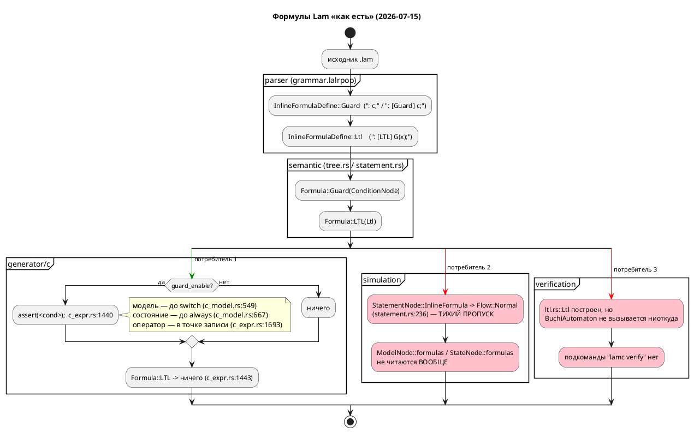
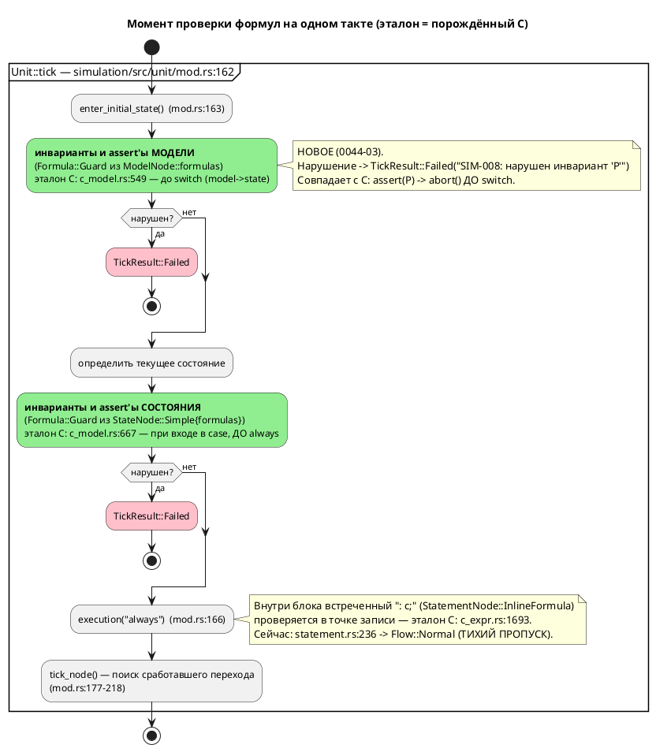

# Фича: Юнит-конструкции языка для симуляции (assert/invariant)

- **Номер:** 0044
- **Статус:** **ГОТОВО**
- **Зависит от:** нет
- **Приоритет / Tier:** **Tier 1 (высокий)** — язык + симулятор
- **Крейты:** `grammar` (версия языка 0.2.0 → **0.3.0**, аддитивно),
  `simulation`
- **Связанные issue (анализ):** новая фича (из блока «Кандидаты в фичи»
  `FEATURES.md`)

## Стадии жизненного цикла

Все стадии — **разделы этой карточки**: «Архитектура (ADR)»,
«Анализ», «Разработка», «Тест-план», «Отчёт о тестировании», «Итог».
Отдельным артефактом остаются только исправления —
[`docs/fixes/`](../fixes/README.md) (при необходимости `0044-YY-*`).

## Краткое описание

Инварианты и ассерты прямо в модели: проверяются симулятором по шагам, эмитятся
генератором C и доступны LTL-верификатору как именованные атомы. Проработка  показала, что **`assert` в языке уже есть** — это `: [Guard] условие;`,
которое уже эмитится в C как `assert(...)` (`c_expr.rs:1440`), — а **`invariant`
нет**, и при этом **ни одну формулу не проверяет симулятор** (`unit/statement.rs:236`
молча возвращает `Flow::Normal`; `ModelNode::formulas` не читается вовсе). Поэтому
фича вводит **одно** новое ключевое слово `invariant Имя = <Условие>;` (сахар над
`cond Имя = C;` + `: [Guard] Имя;`), **оживляет** существующие Guard-формулы в
симуляторе с остановкой прогона (`TickResult::Failed`, SIM-008) и специфицирует
обе конструкции в README.

`assert` ключевым словом **намеренно не становится**: это был бы третий синоним
той же `Formula::Guard` и вечный налог на форматтер (ADR — синонимы не
канонизируются).

**Ключевой побочный эффект:** сегодня `LtlPrimary` принимает только голый
идентификатор (`grammar.lalrpop:330–334`), поэтому `G(temp > 100)` **невыразим**.
Имя инварианта становится атомом LTL — 0044 не поглощается фичей, а
**делает её применимой**.

> Фича зарегистрирована из блока «Кандидаты в фичи» `FEATURES.md` (текст
> кандидата: «задел на сближение крейта `simulation` и верификации… Требует
> проработки (может пересекаться с 0010); оформить как анализ до карточки»);
> далее проходит жизненный цикл по своду.

## Вердикты по пересечениям (детали — в анализе)

- **0010 (LTL/Бюхи, `ГОТОВО`) — не поглощает 0044.** Статической проверки не
  существует: `BuchiAutomaton` не вызывается ниоткуда, `lamc verify` нет,
  `Formula::LTL` никем не читается. Формально `G(P)` (свойство над всеми
  прогонами, model checking) ≠ инвариант (проверка одного прогона в симуляторе и
  на железе). 0044 даёт 0010 атомы, которых у неё нет.
- **0035 (LTL в блоках кода, `СОЗДАНА`) — пересечение по файлу, не по
  контракту.** Обе фичи правят `semantic/statement.rs:256–271`, но разные ветки:
  0035 — `Ltl` (тихая потеря, `TODO`), 0044 — `Guard` + потребление в симуляторе.
  Рекомендация своду: вести **0044 раньше 0035**.

## Декомпозиция (см. анализ)

- **0044-01** — грамматика + АСД (`Token::Invariant`, `InvariantDefine`).
- **0044-02** — семантика: десахаризация в `cond` + `Formula::Guard`; SE-053, SE-054.
- **0044-03** — симулятор: проверка в трёх точках такта; `TickResult::Failed`, SIM-008.
- **0044-04** — генератор C: подтверждение нулевого регресса + сверка с симулятором.
- **0044-05** — форматтер: печать нового узла (**обязательна**).
- **0044-06** — README (примеры и контрпримеры, своду) + версия языка 0.3.0.

## Риски

- Жёсткое ключевое слово `invariant` — коллизия с идентификаторами. Измерено:
  **ноль** совпадений на **158** файлах `.lam` корпуса. Прецедент — `address`
  (0020). Запасной путь — мягкое слово (прецедент `X`/`F`/`G`/`LTL`/`Guard`,
  `grammar.lalrpop:92–99`).
- Смена наблюдаемого поведения симулятора (нарушенная формула больше не даёт
  «успешную» трассу) — намеренная: текущее поведение дефект, а не контракт.
- Конфликт правок с 0035 в одном `match`.
- Точка проверки на такте обязана совпасть с эталоном C (`c_model.rs:549`,
  `c_model.rs:667`, `c_expr.rs:1693`) — стережёт `conformance_c_tests.rs`.

## Архитектура (ADR)

- **Status:** Accepted
- **Date:** 2026-07-15
- **Authors:** Архитектор + дизайнер языков программирования + системный аналитик
- **Related issues:** [Фича](0044-sim-assert-invariant.md); связь с
  [ADR](0024-lam-formatter.md#архитектура-adr) (печать нового узла АСД обязательна),
  [ADR](0025-simulator-expression-eval.md#архитектура-adr) (семантика вычислений живёт в
  `simulation/src/eval/`; ошибка обязана быть отличима от «условие ложно»),
  [ADR](0019-condition-expression-unification.md#архитектура-adr) (разделение
  `Condition`/`Expression` — намеренное), [ADR](0020-port-address-decl.md#архитектура-adr)
  (образец введения жёсткого ключевого слова `address`); [верификация свойств (LTL и автоматы Бюхи)](0010-verification-ltl.md) (LTL/Бюхи, `ГОТОВО`); [lTL-формулы в блоках кода: разбор вместо тихой потери](0035-ltl-in-blocks.md) (LTL в блоках кода, `СОЗДАНА`).

### Context

Кандидат в витрине `FEATURES.md` формулировал фичу так: «задел на сближение
крейта `simulation` и верификации: инварианты/ассерты прямо в модели, которые
симулятор проверяет по шагам, а LTL-верификатор — статически. Требует
проработки (может пересекаться с 0010)».

Формулировка предполагает, что конструкций такого рода в языке **нет** и их
нужно изобрести. Проверка кода (2026-07-15, ветка `v2`) показывает, что это
**не так** — и это главный факт, определяющий решение.

#### Что в языке есть уже сегодня

| Конструкция | Где разбирается | Куда попадает | Кто потребляет |
|---|---|---|---|
| `: c1, c2;` (краткая) и `: [Guard] c1, c2;` (явная) | `grammar.lalrpop:285–297` (`InlineFormulaDefine`) | `ast::InlineFormulaDefine::Guard` → `semantic::Formula::Guard(ConditionNode)` | **Генератор C** |
| `: [LTL] G(x);` | `grammar.lalrpop:289–291`, `LtlExpr` — `grammar.lalrpop:299–334` | `ast::InlineFormulaDefine::Ltl` → `Formula::LTL(verification::ltl::Ltl)` | **никто** |
| `formula "диалект" { … }` | `grammar.lalrpop:275–283` (`FormulaDefine`) | `ast::ModelElement::Formula` | **никто** (форматтер **отказывает**: `format/mod.rs:343`) |
| `cond Имя = Условие;` | `grammar.lalrpop` (`ConditionDefine`), проход 3 (`tree.rs:379`, `tree.rs:751–754`) | `ModelNode::conditions` | Условия рёбер, генератор C, симулятор |

Inline-формула допустима в **трёх** синтаксических позициях:

- **элемент модели** — `ModelElement::InlineFormula` (`ast.rs:278`, захват в
  `tree.rs:564–582` → `ModelNode::formulas`, `mod.rs:117`);
- **элемент состояния** — `StateElement::InlineFormula` (`ast.rs:328`, захват в
  `tree.rs:1181–1195` → `StateNode::Simple{ formulas }`, `mod.rs:1040`);
- **оператор в блоке кода** — `Statement::InlineFormula` (`ast.rs:1080`,
  разрешение в `statement.rs:256–271` → `StatementNode::InlineFormula(Vec<Formula>)`,
  `mod.rs:783`).

#### Что из этого уже работает

**Генератор C уже эмитит `assert()`.** Это не проект — это код:

- `c_expr.rs:1437–1442` — `Formula::Guard(cond)` печатается как
  `assert(<условие>);`;
- `c_source.rs:19` — `#include <assert.h>` эмитится в `.c` **безусловно**;
- `c_model.rs:547–553` — Guard-формулы **модели** проверяются в начале такта,
  **до** `switch (model->state)`;
- `c_model.rs:665–670` — Guard-формулы **состояния** проверяются при входе в
  `case`, **до** `always`-блоков;
- `c_expr.rs:1693–1698` — Guard-формулы **оператора** проверяются в точке записи;
- всё это — под флагом `map.guard_enable()`, которым управляет CLI
  `--guard-enable` / `--guard-disable` (`bin/lamc.rs:169, 208–212, 249`), по
  умолчанию **включено**.

Иначе говоря: **`assert` в языке Lam уже есть — он пишется `: [Guard] условие;`**,
а «выкинуть ассерты из прошивки» уже делается флагом `--guard-disable`. Более
того, семантика «на каждом такте» и «пока мы в этом состоянии» **тоже уже
есть** — это Guard-формула модели и Guard-формула состояния соответственно.
Просто никто никогда не называл это инвариантом, и в языке нет ни слова
«инвариант», ни способа дать инварианту имя.

#### Что из этого не работает

1. **Симулятор игнорирует формулы полностью.** `simulation/src/unit/statement.rs:137`
   (`StatementNode::InlineFormula(_) => {}` при сборе локальных переменных) и
   `statement.rs:236` (`StatementNode::InlineFormula(_) => Ok(Flow::Normal)`) —
   формула молча пропускается. `ModelNode::formulas` и `StateNode::formulas`
   симулятором **не читаются вообще** (grep по `simulation/src`: единственные
   упоминания — две строки выше). То есть порождённый C **падает** на нарушенном
   Guard'е, а симулятор той же модели **бодро продолжает** — два потребителя
   одной модели расходятся в поведении, и это ровно тот класс «тихого пропуска»,
   ради которого заводилась фича.
2. **Верификатор LTL не подключён ни к чему.** `verification/buchi.rs`
   (`BuchiAutomaton`, 504 строки) — grep по `grammar/src` и `grammar/tests` не
   находит **ни одной** ссылки на `BuchiAutomaton` вне самого `buchi.rs`.
   Подкоманды `lamc verify` не существует (`bin/lamc.rs`). `Formula::LTL`
   складывается в `ModelNode::formulas` и не читается никем. Фича закрыта
   как «разбор LTL + структуры данных», а не как работающая проверка.
3. **LTL нечем питать.** `LtlPrimary` (`grammar.lalrpop:330–334`) допускает
   только `true`, `false`, идентификатор и скобки. Атом LTL — это
   `LtlExpr::Atom(Identifier)` (`ast.rs:885`), то есть **голое имя**. Написать
   `G(temperature > 100)` **невозможно**: реляционного условия внутри LTL нет.
   Значит, LTL сегодня может ссылаться только на то, у чего **есть имя**, — а
   именованных булевых обязательств в языке нет.
4. **LTL в блоках кода молча теряется** — `statement.rs:266–269`,
   `// TODO: Реализовать поддержку LTL в блоках кода` → `Ok(StatementNode::InlineFormula(Vec::new()))`.
   Это предмет отдельной фичи **0035**.

#### Поток «как есть»



Итог контекста: **проблема фичи — не отсутствие синтаксиса, а отсутствие
имени и отсутствие двух из трёх потребителей.** Это переопределяет вопрос ADR:
не «какой синтаксис изобрести для assert», а «какое минимальное добавление к
языку закрывает разрыв, не заводя третий синоним уже существующей конструкции».

### Decision Drivers

1. **Не плодить синонимы (главный драйвер).** Фича уже вынуждена хранить в
   АСД выбор автора между синонимами (`while`/`loop`, `: [Guard] x;` / `: x;` —
   `ast::LoopKeyword`, `Guard::explicit`), потому что канонизировать их запрещено.
   Ввести `assert c;` третьей записью того же `Formula::Guard` — значит выдать
   форматтеру третий синоним и обязать хранить ещё один флаг «как написал автор».
   Цена вечная, польза нулевая.
2. **Симулятор и порождённый C обязаны совпадать.** `conformance_c_tests.rs`
   существует именно для этого. C по нарушенному Guard'у зовёт `assert()` →
   `abort()`. Симулятор обязан остановиться там же, иначе сверка теряет смысл, а
   симулятор перестаёт быть моделью прошивки.
3. **Имя — это не украшение, а контракт.** Без имени (а) диагностика
   нарушения нечитаема («нарушено условие в строке 42»), (б) LTL **физически**
   не может сослаться на обязательство (`LtlExpr::Atom` — голый идентификатор),
   (в) невозможно переиспользовать инвариант в нескольких состояниях.
4. **Обратная совместимость.** Любое жёсткое ключевое слово ломает
   модели, где это слово — идентификатор. Цена должна быть измерена, а не
   предположена.
5. **Не расширять зону ответственности верификатора.** 0010 закрыта; оживлять
   `BuchiAutomaton` и заводить `lamc verify` — самостоятельная работа, которую
   нельзя протащить контрабандой внутри 0044.
6. **свод.** Любое расширение синтаксиса → рост версии языка.

### Considered Options

#### Option A. Два новых жёстких ключевых слова: `assert <cond>;` и `invariant <имя> = <cond>;`

Ровно то, что предлагал текст кандидата: `assert` — оператор в блоке,
`invariant` — элемент модели.

**Pros:**
- Слова знакомы любому инженеру; читается без обучения.
- `assert` как оператор блока синтаксически привычнее двоеточия.
- Симметрия с C (`assert.h`) очевидна.

**Cons:**
- **`assert c;` — третий синоним `: c;` и `: [Guard] c;`.** Даёт ровно тот же
  `Formula::Guard` и ровно тот же `assert()` в C (`c_expr.rs:1440`). Форматтер
  обязан хранить третий признак формы автора (ADR: синонимы не
  канонизируются) — вечный налог на каждый новый узел.
- Ломает совместимость **двумя** словами вместо одного.
- Не решает ни одной из трёх реальных проблем (симулятор молчит, верификатор
  не подключён, у LTL нет атомов) — только добавляет способ записи к уже
  существующему способу записи.
- Слово `assert` в промышленном контроллере провоцирует ожидание `assert.h`,
  тогда как проектное решение (`--guard-disable`) уже другое.

#### Option B. Ничего не добавлять в язык: только оживить симулятор на существующих `: [Guard]` / `: [LTL]`

**Pros:**
- Регресс по совместимости — строго ноль; версия языка не растёт (свод неприменим); ни строчки в `grammar.lalrpop`, `lexer.rs`, `format/`.
- Закрывает драйвер 2 (расхождение симулятора и C) полностью и дёшево.
- Форматтер не трогается вообще — новых узлов АСД нет.

**Cons:**
- **Не даёт имени** → диагностика нарушения указывает только позицию; при
  десятке формул в модели отладка мучительна.
- **Не даёт LTL атомов** → `: [LTL] G(P)` по-прежнему не к чему привязать;
  «сближение симуляции и верификации» — цель кандидата — не наступает.
- `: [Guard] c;` на уровне модели читается как «охранное условие», а не как
  «инвариант, проверяемый каждый такт»; смысл держится на знании кодовой базы,
  а не на тексте программы. Для языка спецификации промышленных систем это плохо.
- Слово «инвариант» так и не появляется в языке — кандидат не закрыт, а
  переименован в «починили пропуск».

#### Option C (принимается). Одно новое слово `invariant` как **именованное** обязательство; `: [Guard]` официально специфицируется как `assert`; `assert` **не** вводится

Три части:

1. **`assert` не вводится.** Существующая форма `: [Guard] c1, c2;` (и её
   краткий синоним `: c1, c2;`) **специфицируется в документации** как точечная
   проверка — «assert языка Lam». Она уже есть во всех трёх позициях и уже
   эмитит `assert()` в C. Работа здесь — не грамматика, а симулятор + README.
2. **Вводится `invariant Имя = <Condition>;`** — новый элемент модели и элемент
   состояния. Одно жёсткое ключевое слово. Семантически это **сахар**, который
   разворачивается семантическим проходом в уже существующую пару:
   `cond Имя = <Condition>;` + Guard-формула в той же области видимости.
3. **`: [LTL]` остаётся статикой** и не трогается (кроме того, что теперь ему
   есть на что ссылаться: имя инварианта становится атомом LTL).

**Pros:**
- Ровно **одно** новое слово; ноль новых синонимов (`invariant` — не запись
  `assert`, а *именование*, которого раньше не было).
- Сахар разворачивается в существующие узлы → генератор C, `Formula`,
  `ConditionNode` не меняются; вывод для существующих моделей байт-в-байт
  прежний (драйвер 4, прецедент 0020).
- **Даёт LTL атомы** — `invariant Safe = temp <= 100;` + `: [LTL] G(Safe);`
  впервые делает LTL выразимым для реляционных условий. Это и есть «сближение
  симуляции и верификации», которого просил кандидат, — и оно достигается **не**
  трогая `verification/`.
- Диагностика получает имя: «нарушен инвариант `Safe` (SIM-008)».
- Переиспользование: один `invariant` — ссылка из нескольких мест.

**Cons:**
- Одно жёсткое ключевое слово всё же ломает совместимость — цена
  измерена ниже и равна нулю на корпусе.
- Форматтер обязан печатать новый узел  — обязательная подзадача.
- «Сахар» требует аккуратности: имя инварианта попадает в то же пространство
  имён, что и `cond`, → нужна диагностика коллизии.

#### Option D. `invariant` без имени (`invariant <cond>;`) — как в контрактных языках

**Pros:**
- Короче; не занимает пространство имён `cond`.

**Cons:**
- **Не решает главного** — LTL по-прежнему не к чему привязать (драйвер 3), а
  это единственное, чем 0044 оправдывает слово «сближение» в своём названии.
- Становится ровно четвёртым синонимом `: [Guard]` (см. Cons Option A).
- Отвергается по тем же основаниям, что A, но без единственного плюса A
  (привычности `assert`).

### Decision

Принимается **Option C**.

Обоснование сжато: **язык уже умеет `assert`; язык не умеет `invariant`.**
Добавлять надо ровно то, чего нет, и ровно там, где отсутствие мешает. `assert`
как ключевое слово — чистый убыток: третий синоним `Formula::Guard`, налог на
форматтер навсегда, слом совместимости, ноль новой выразительности. `invariant`
как **именованное** обязательство — единственное добавление, которое (а)
неустранимо (имени в языке нет ничем), (б) разблокирует LTL (атомов у него нет
ничем), (в) стоит одно слово.

#### Ответ на вопрос «не изобретаем ли мы второй `cond`?»

Честный ответ: **`invariant P = C;` — это в точности `cond P = C;` + `: [Guard] P;`.**
Это не возражение против решения, а его основание. Разница между `cond` и
`invariant` — не в вычислении, а в **модальности**:

| | `cond P = C;` | `invariant P = C;` |
|---|---|---|
| Что это | **определение** имени для условия | **обязательство**: условие обязано быть истинным |
| Когда вычисляется | по требованию, там где `P` упомянуто (`ref S: P;`) | автоматически, каждый такт в своей области |
| Если ложно | переход просто не срабатывает — норма | спецификация нарушена — `assert()` в C, `Failed` в симуляторе |
| Можно не использовать | да, `cond` без ссылок — мёртвый код | нет, смысл именно в автоматической проверке |

То есть `cond` — существительное («вот условие»), `invariant` — утверждение
(«вот условие, и оно всегда выполняется»). Второго `cond` не возникает: возникает
`cond` **плюс обязательство**, и именно так это и реализуется — десахаризацией в
проход 3, а не новым механизмом разрешения имён.

#### Синтаксис (EBNF новых и затронутых правил)

```plantuml
@startuml
title Lam 0.3.0 — EBNF: invariant (новое) и существующие формулы (контекст)
hide empty description

' ─────────── НОВОЕ (фича 0044) ───────────
' Одно новое жёсткое ключевое слово: invariant.
' Связка "=" — как в cond/type/enum/model/state (инвариант 0021: ":=" — присваивание).

InvariantDefine = "invariant" , Identifier , "=" , Condition , ";" ;

' Новые позиции: элемент модели и элемент состояния.
' В блоке кода invariant НЕ допускается — там уже есть ": c;" (assert).

ModelElement = Import | TypeDefine | VariableDefine | FunctionDefine
             | Model | StateDefine | FormulaDefine | InlineFormulaDefine
             | ConditionDefine | NamedBlockCodeDefine | EnumDefine
             | StructDefine | AddressDefine
             | InvariantDefine        (* <<< НОВОЕ *)
             | ";" ;

StateElement = NamedBlockCodeDefine | "next" , Identifier , ";"
             | "ref" , Identifier , [ ":" , Condition ] , ";"
             | InlineFormulaDefine
             | InvariantDefine        (* <<< НОВОЕ *)
             | ";" ;

' ─────────── СУЩЕСТВУЮЩЕЕ (не меняется; приведено, чтобы видеть отсутствие дублей) ───────────

(* "assert языка Lam" — уже есть, три позиции, уже эмитит assert() в C *)
InlineFormulaDefine = ":" , Condition , { "," , Condition } , ";"
                    | ":" , "[" , "Guard" , "]" , Condition , { "," , Condition } , ";"
                    | ":" , "[" , "LTL"   , "]" , LtlExpr   , { "," , LtlExpr   } , ";" ;

(* именованное условие — сосед инварианта; НЕ обязательство, а определение *)
ConditionDefine = "cond" , Identifier , "=" , Condition , ";" ;

(* атом LTL — голое имя; именно поэтому инварианту нужно имя *)
LtlPrimary = "true" | "false" | Identifier | "(" , LtlExpr , ")" ;

@enduml
```

#### Десахаризация (нормативно)

`invariant P = C;` в области видимости `S` (модель или состояние) **тождественно**
паре, уже выражаемой в языке:

```
cond P = C;      // определение имени (проход 3, tree.rs:751–754): [Guard] P;     // обязательство в той же области (Formula::Guard)
```

Из этого следуют три полезных свойства, каждое — бесплатно:

- генератор C менять **не нужно** (`c_model.rs:549`, `c_model.rs:667` уже
  обходят `formulas`);
- `--guard-disable` автоматически распространяется на инварианты;
- `P` становится видимым как `cond` → **атом LTL** (`: [LTL] G(P);`) и
  переиспользуемое условие (`ref Next: P;`).

Реализация десахаризации — семантический проход, **не** переписывание АСД:
форматтер обязан печатать `invariant P = C;` ровно так, как написал автор, а не разворачивать в пару.

#### Момент проверки на такте

Точки проверки **не изобретаются** — они уже зафиксированы генератором C и
принимаются как эталон, а симулятор приводится к ним:



#### Поведение при нарушении в симуляторе

Рассмотрены два поведения:

- **(i) остановка** — `TickResult::Failed(String)`;
- **(ii) запись в трассу и продолжение**.

Принимается **(i) остановка**, по двум независимым основаниям:

1. **Соответствие эталону.** Порождённый C зовёт `assert()` → `abort()`
   (`c_expr.rs:1440`, `c_source.rs:19`). Если симулятор продолжит, он перестанет
   быть моделью прошивки, а `conformance_c_tests.rs` начнёт сверять несравнимое.
2. **Инвариант ADR (R5).** `TickResult::Failed` заведён ровно затем, чтобы
   недостоверный прогон был **отличим** от честно ложного условия
   (`unit/mod.rs:76–80`). Нарушенный инвариант — определение недостоверного
   прогона: дальнейшая трасса описывает автомат, которого спецификация
   запрещает.

Режим «записать и продолжить» (полезен при отладке) **выносится в кандидаты**
`FEATURES.md` отдельной фичей — он требует канала трасс, которого нет, и не
может быть протащен внутрь 0044 (драйвер 5).

#### Что эмитит генератор C

Принимается **сохранение текущего поведения без единой правки эмиссии**:

- `invariant P = C;` разворачивается в `Formula::Guard` → `assert(P_expr);`
  ровно там, где формулы обходятся сегодня;
- флаг `--guard-disable` (`bin/lamc.rs:211`) **уже** является ответом на
  возражение «`assert.h` не место в промышленном контроллере»: он выключает
  всю эмиссию проверок;
- `#include <assert.h>` уже безусловен (`c_source.rs:19`) — не меняется.

Отвергнуты: `#ifdef LAM_ASSERT` (дублирует существующий `--guard-disable` на
другом уровне) и колбэк `Lam_assert_failed()` по образцу HAL 0020 (**правильная**
идея для прошивки, но это смена контракта цели `c` для **уже существующих**
моделей → регресс). Оба вынесены в кандидаты.

#### Вердикт по пересечениям

**Фича (LTL/Бюхи, `ГОТОВО`) — 0044 ею не поглощается.** Три довода:

1. **Фактический:** статической проверки не существует. `BuchiAutomaton` не
   вызывается ниоткуда (grep по `grammar/src`, `grammar/tests` — ноль ссылок вне
   `buchi.rs`), подкоманды `lamc verify` нет. Поглощать нечем.
2. **Формальный:** `G(cond)` и инвариант — **разные обязательства**. LTL `G(P)`
   утверждает свойство над **всеми** прогонами и требует model checking;
   инвариант проверяется на **одном конкретном** прогоне симулятора и на
   **реальном железе** (через `assert()` в C). Первое — доказательство, второе —
   наблюдение. Они дополняют друг друга, а не заменяют.
3. **Направление зависимости обратное ожидаемому:** сегодня LTL **невыразим** для
   реляционных условий — `LtlPrimary` принимает только идентификатор
   (`grammar.lalrpop:330–334`). Именно `invariant` даёт LTL атом. 0044 не
   поглощается 0010 — 0044 **делает 0010 применимой**.

**Фича (LTL в блоках кода, `СОЗДАНА`) — пересечение реальное, но не
поглощение и не зависимость.** Обе фичи правят один `match` в
`semantic/statement.rs:256–271`, но **разные его ветки**: 0035 — ветку
`InlineFormulaDefine::Ltl` (строки 266–269, `TODO` + тихая потеря), 0044 — ветку
`Guard` (строки 258–265, разрешение уже есть) и потребление результата в
симуляторе. Контрактной зависимости нет: 0044 работоспособна при любом статусе
[lTL-формулы в блоках кода: разбор вместо тихой потери](0035-ltl-in-blocks.md), и наоборот. Риск — конфликт правок в одном файле (см. анализ, раздел
рисков).

### Consequences

#### Положительные

- Расхождение «C падает — симулятор продолжает» устранено; появляется
  `conformance`-сверка поведения на нарушенной формуле.
- Язык получает слово «инвариант» — для DSL спецификации промышленных систем
  управления это профильная выразительность, а не сахар.
- LTL впервые становится выразимым для реляционных свойств — без единой правки
  в `verification/`.
- Guard-формулы получают спецификацию в README: сегодня
  конструкция `: [Guard] c;` работает, эмитит `assert()` и **нигде не описана**.
- Ноль новых синонимов; форматтеру не добавляется ни одного флага «форма автора».

#### Отрицательные / Action items

- **Жёсткое ключевое слово `invariant`** ломает модели, где это имя —
  идентификатор. Измерено: `grep -rniw "invariant\|assert"` по
  **158** файлам `.lam` корпуса (`examples/`, `grammar/tests/data/`,
  `simulation/tests/data/`) — **ноль** совпадений. Прецедент 0020 (`address`).
  Разбор и обоснование — в анализе.
- **Версия языка `0.2.0` → `0.3.0`** (аддитивно) — `grammar/Cargo.toml:3`.
- **Форматтер обязан печатать `InvariantDefine`**, иначе
  `format_source` начнёт **отказывать**, а `grammar/tests/format_tests.rs`
  завалит сборку на новом непокрытом узле. Отдельная подзадача.
- Пространство имён `cond` и `invariant` — общее (следствие десахаризации);
  нужна диагностика коллизии имён.
- Новые диагностики: **SE-053** (коллизия имени инварианта с `cond`/переменной),
  **SE-054** (инвариант ссылается на неизвестное имя), **SIM-008** (нарушение
  инварианта/формулы в симуляторе). Свободны: последний занятый — `SE-052`
  (0020), `SIM-007` (`eval/error.rs:74`).
- В кандидаты `FEATURES.md` выносятся: режим «записать и
  продолжить»; колбэк `Lam_assert_failed()` вместо `assert.h`; `lamc verify`
  (оживление `BuchiAutomaton`); печать `ModelElement::Formula`, на которой
  форматтер отказывает сегодня (`format/mod.rs:343`).

#### Acceptance criteria

1. `invariant P = C;` разбирается как элемент модели и как элемент состояния;
   `assert` ключевым словом **не** становится (`grep -w assert` по `lexer.rs`
   `KEYWORDS` — ноль).
2. Семантика разворачивает `invariant P = C;` в `cond P` + `Formula::Guard`;
   имя `P` доступно как атом LTL (`: [LTL] G(P);` строит `Ltl::Atom("P")`) и как
   условие ребра (`ref S: P;`).
3. Симулятор останавливается с `TickResult::Failed`, содержащим **имя**
   инварианта и код `SIM-008`, на первом же нарушении — в трёх позициях
   (модель / состояние / оператор), в точках такта из диаграммы выше.
4. Порождённый C для модели **без** `invariant` — байт-в-байт как до фичи
   (регресс = 0); для модели **с** `invariant` — `assert()` в той же точке, что
   для эквивалентной пары `cond` + `: [Guard]`.
5. `--guard-disable` убирает из C проверки инвариантов наравне с Guard-формулами.
6. `format_source` печатает `invariant` идемпотентно и семантически нейтрально;
   `format_tests.rs` (весь корпус, 158 файлов) зелёный.
7. Версия языка `0.3.0`; README содержит синтаксис, семантику и **примеры с
   контрпримерами**.

## Анализ

### Цель и контекст

Кандидат просил «инварианты/ассерты прямо в модели, которые симулятор проверяет
по шагам, а LTL-верификатор — статически», и честно помечал: «требует
проработки (может пересекаться с 0010)». Проработка  дала результат,
переопределяющий фичу:

**`assert` в языке уже есть, а `invariant` — нет; при этом ни одну из формул не
проверяет симулятор.** Конструкция `: [Guard] условие;` (и её краткий синоним
`: условие;`) разбирается в трёх позициях, попадает в `semantic::Formula::Guard`
и **уже эмитится генератором C как `assert(...)`** (`c_expr.rs:1440`;
`#include <assert.h>` — `c_source.rs:19`; под флагом `--guard-enable` /
`--guard-disable`, `bin/lamc.rs:208–212`). Симулятор же формулы **молча
игнорирует** (`unit/statement.rs:236`), а `ModelNode::formulas` /
`StateNode::formulas` не читает вообще.

Отсюда предмет фичи (по ADR, Option C):

1. **Оживить** существующие Guard-формулы в симуляторе — устранить расхождение
   «C падает, симулятор продолжает» (класс дефектов фичи).
2. **Ввести одно** новое ключевое слово `invariant Имя = <Condition>;` —
   именованное обязательство, сахар над `cond Имя = C;` + `: [Guard] Имя;`.
   Имя нужно не для красоты: `LtlExpr::Atom` — голый идентификатор
   (`ast.rs:885`, `grammar.lalrpop:330–334`), поэтому **без имени LTL нечем
   питать**, и «сближение симуляции и верификации» из текста кандидата
   недостижимо в принципе.
3. **Специфицировать** обе конструкции в README — сегодня
   работающий `: [Guard]` не описан нигде.

`assert` ключевым словом **не** становится (обоснование, Option A
Cons: третий синоним `Formula::Guard`, вечный налог на форматтер по ADR,
слом совместимости, ноль новой выразительности).

Правила: **12** (DSL промышленных систем — «инвариант» профильное понятие),
**11** (обратная совместимость — жёсткое слово, разбор ниже), **16** (тесты
языка + примеры и контрпримеры), **18** (EBNF + диаграмма — в ADR), **22**
(рост версии языка).

### Зависимости фичи

- **Зависит от:** **нет**.

Проверено по контракту/инфраструктуре, а не по названиям:

| Фича | Статус | Вердикт | Обоснование |
|---|---|---|---|
| **0010** Верификация LTL/Бюхи | **ГОТОВО** (`docs/features/README.md:21`) | **Не зависит; не поглощает; не поглощается** | (1) Закрыта → блокировать нечем. (2) Фактически статической проверки **нет**: `BuchiAutomaton` (`verification/buchi.rs`, 504 стр.) не вызывается **ниоткуда** — grep по `grammar/src` + `grammar/tests` даёт ноль ссылок вне самого файла; подкоманды `lamc verify` в `bin/lamc.rs` нет; `Formula::LTL` кладётся в `ModelNode::formulas` и не читается никем. (3) Формально `G(P)` ≠ инвариант: LTL — свойство над **всеми** прогонами (нужен model checking), инвариант — проверка **одного** прогона в симуляторе и на железе (`assert()` в C). Доказательство против наблюдения. (4) **Направление обратное:** `LtlPrimary` принимает только идентификатор → `G(temp > 100)` невыразим; именно `invariant` даёт LTL атом. **0044 не поглощается 0010 — 0044 делает 0010 применимой.** |
| **0035** LTL-формулы в блоках кода | СОЗДАНА | **Не зависит** (пересечение по файлу, не по контракту) | Обе фичи правят один `match` — `semantic/statement.rs:256–271` — но **разные ветки**: 0035 чинит `InlineFormulaDefine::Ltl` (стр. 266–269: `// TODO` → `Ok(StatementNode::InlineFormula(Vec::new()))`, тихая потеря), 0044 работает с веткой `Guard` (стр. 258–265 — разрешение уже написано) и с потреблением `StatementNode::InlineFormula` в симуляторе (`unit/statement.rs:236`). 0044 работоспособна при любом статусе 0035 и наоборот. Риск — конфликт правок (см. R-риски). |
| **0025** Вычислитель симулятора | **ГОТОВО** | Не зависит (опора на готовое) | 0044 опирается на инварианты как на данность: семантика вычислений — только в `simulation/src/eval/`; `TickResult::Failed` (`unit/mod.rs:76–80`) уже существует ровно затем, чтобы недостоверный прогон был отличим от ложного условия (R5 фичи). 0044 переиспользует этот канал, а не заводит свой. |
| **0024** Форматтер | **ГОТОВО** | Не зависит; **накладывает обязанность** | ADR: добавляешь узел АСД — добавь печать, иначе `format_source` **отказывает**, а `format_tests.rs` валит сборку на новом непокрытом узле. `InvariantDefine` — новый узел → подзадача **0044-05** обязательна. |
| **0020** Адрес порта | **ГОТОВО** | Не зависит; **прецедент** | Образец введения жёсткого ключевого слова (`address`) с обоснованием совместимости и минорным ростом версии языка (0.1.0 → 0.2.0, аддитивно). 0044 повторяет схему. |

- **Влияние на порядок разработки:** фича **независима** и может быть взята в
  работу немедленно — статус `ЗАБЛОКИРОВАНА` **не** ставится (все
  кандидаты в зависимости закрыты). Завершение 0044 никого формально **не
  разблокирует**, но снимает содержательный тупик у двух направлений:
  (а) будущая фича `lamc verify` (оживление `BuchiAutomaton`) получает атомы,
  без которых LTL применим только к голым булевым именам;
  (б) фича **0035** после 0044 становится осмысленнее (LTL в блоке будет иметь на
  что ссылаться). **Рекомендация аналитика (критерий 4):** ставить
  0044 **перед** 0035 — 0035 без атомов чинит потерю формулы, которую всё равно
  нечем наполнить.

### Требования и проверяемые условия

#### Грамматика и АСД

- **R1. Новое правило.** `invariant Имя = <Condition> ;` разбирается как
  `ModelElement::Invariant` и как `StateElement::Invariant`. Связка — `=`
  (равенство/связка имени, как в `cond`/`type`/`model`/`state`), **не** `:=`
  (инвариант фичи: `:=` — присваивание).
- **R2. Правая часть — `Condition`, не `Expression`.** Инвариант — булево
  обязательство; `=` внутри него обязано означать равенство (`Condition::Equal`),
  как в `cond`. Использовать `Expression` запрещено — инвариант ADR.
- **R3. Одно новое слово.** В `KEYWORDS` (`parser/lexer.rs:460–503`) добавляется
  ровно `"invariant" => Token::Invariant`. `assert` **не** добавляется.
- **R4. Позиции.** `invariant` допустим как элемент модели и элемент состояния;
  **в блоке кода — нет** (там уже есть `: c;`). Попытка → ошибка разбора.

#### Семантика

- **R5. Десахаризация.** `invariant P = C;` в области `S` семантически
  тождественен паре `cond P = C;` + `: [Guard] P;` в той же области: имя `P`
  попадает в `ModelNode::conditions` (проход 3, `tree.rs:751–754`), а
  `Formula::Guard(ConditionNode)` — в `ModelNode::formulas` (`mod.rs:117`) или
  `StateNode::Simple{formulas}` (`mod.rs:1040`).
- **R6. Имя видимо как атом LTL.** После R5 запись `: [LTL] G(P);` строит
  `Ltl::Atom("P")` (`formula.rs:55`) — то есть инвариант **можно** проверять
  статически, когда появится верификатор.
- **R7. Имя видимо как условие.** `ref Next: P;` работает — `P` неотличим от
  объявленного `cond`.
- **R8. Диагностика коллизии — SE-053.** Имя инварианта, совпадающее с
  существующим `cond`/переменной/портом в той же области → ошибка (не тихая
  перезапись: `tree.rs:398` кладёт в `HashMap` без проверки).
- **R9. Диагностика неизвестного имени — SE-054.** Инвариант, ссылающийся на
  неизвестную переменную → ошибка с позицией (наследуется от разрешения условий).
- **R10. АСД хранит форму автора.** Десахаризация — **семантический** проход;
  АСД не переписывается (иначе форматтер напечатает `cond`+`: [Guard]` вместо
  `invariant` — нарушение ADR «синонимы не канонизируются»).

#### Симулятор

- **R11. Формулы модели проверяются каждый такт** — в `Unit::tick`
  (`unit/mod.rs:162`) после `enter_initial_state()` и **до** `execution("always")`.
  Эталон — генератор C: `c_model.rs:549` (до `switch (model->state)`).
- **R12. Формулы состояния проверяются при входе в такт состояния** — до
  `always`-блоков. Эталон — `c_model.rs:667`.
- **R13. Формулы оператора проверяются в точке записи** — `StatementNode::InlineFormula`
  (`unit/statement.rs:236`) перестаёт быть `Ok(Flow::Normal)`. Эталон —
  `c_expr.rs:1693`.
- **R14. Нарушение останавливает прогон** — `TickResult::Failed(String)`
  (`unit/mod.rs:80`), сообщение содержит **имя** инварианта (если есть) и код
  **SIM-008**. Обоснование остановки (а не «записать и продолжить»): C зовёт
  `assert()` → `abort()`, а `TickResult::Failed` заведён ровно под «прогон
  недостоверен» (R5 фичи).
- **R15. Ошибка вычисления самой формулы ≠ нарушение формулы.** `EvalError`
  внутри условия инварианта → существующий код `SIM-0xx` (`eval/error.rs:68–74`),
  а не SIM-008. Различие обязано быть видимым (тот же принцип R5 фичи).
- **R16. Семантика — только в `eval/`.** Вычисление условия инварианта идёт через
  существующий адаптер `predicate.rs`/`eval`; новая семантика в адаптеры **не**
  добавляется (инвариант `CLAUDE.md`/ADR).

#### Генератор C

- **R17. Ноль правок эмиссии.** `invariant` после R5 — обычная `Formula::Guard`;
  `c_model.rs:549`, `c_model.rs:667`, `c_expr.rs:1693` уже обходят формулы.
- **R18. Регресс = 0.** Для модели **без** `invariant` вывод целей `c` и `c-hal`
  — байт-в-байт как до фичи.
- **R19. Эквивалентность записи.** C для `invariant P = C;` идентичен C для
  `cond P = C; : [Guard] P;`.
- **R20. `--guard-disable` гасит инварианты** наравне с Guard-формулами.

#### Форматтер (обязательно)

- **R21. Печать нового узла.** `format/mod.rs` печатает `InvariantDefine` в обеих
  позициях (элемент модели — рядом с `ModelElement::Condition`, `mod.rs:344–353`;
  элемент состояния — `print_state_element_inner`, `mod.rs:452+`), плюс
  `*_loc`-функции для пустых строк и комментариев (`mod.rs:237`, `mod.rs:448`).
- **R22. Печать — как условие, не как выражение.** `expr::condition(...)`, а не
  `expr::expression(...)` — `=` в правой части есть равенство (тот же аргумент,
  что в комментарии `mod.rs:345–346` для `cond`).
- **R23. Корпус зелёный.** `format_tests.rs` прогоняет **158** файлов `.lam`
  (`examples/`, `grammar/tests/data/`, `simulation/tests/data/`);
  идемпотентность (A1) и семантическая нейтральность (A3) сохраняются, новых
  `FormatError::Unsupported` не появляется.

#### Документация и версия

- **R24. Версия языка `0.2.0` → `0.3.0`** (`grammar/Cargo.toml:3`), аддитивно —
  свод.
- **R25. README.** Описываются **обе** конструкции: `invariant`
  (новая) и `: [Guard]` / `: c;` (существующая, но **нигде не описанная**), с
  примерами и контрпримерами, прошедшими проверку.

### Критерии приёмки и способ проверки

| # | Критерий | Способ проверки |
|---|---|---|
| A1 | `invariant P = C;` разбирается как элемент модели и состояния | Тест разбора на фикстурах `tests/data/semantic/valid/invariant_model.lam`, `invariant_state.lam` (R1, R4) |
| A2 | `assert` ключевым словом не стал | `grep -w '"assert"' grammar/src/parser/lexer.rs` → ноль; фикстура `var assert: u8;` парсится (R3) |
| A3 | Правая часть — `Condition`: `invariant P = x = 1;` есть равенство, не присваивание | Тест: значение `x` после такта не изменилось; `P` ложно при `x != 1` (R2) |
| A4 | `invariant P = C;` ≡ `cond P = C; : [Guard] P;` в семантическом дереве | Тест: `ModelNode::conditions` содержит `P`, `ModelNode::formulas` содержит `Formula::Guard` (R5) |
| A5 | Имя инварианта — атом LTL | Тест: `invariant P = t <= 100; : [LTL] G(P);` → `formulas` содержит `Formula::LTL(Ltl::Globally(Ltl::Atom("P")))` (R6) |
| A6 | Имя инварианта — условие ребра | Тест: `ref Next: P;` разрешается; прогон переходит (R7) |
| A7 | SE-053 на коллизии имени | Фикстура `tests/data/semantic/invalid/invariant_name_clash.lam` → ошибка с кодом (R8) |
| A8 | SE-054 на неизвестном имени | Фикстура `invariant_unknown_var.lam` → ошибка с позицией (R9) |
| A9 | Симулятор останавливается на нарушенном инварианте модели | `eval_tests.rs`: `TickResult::Failed`, сообщение содержит `SIM-008` и имя `P` (R11, R14) |
| A10 | То же для инварианта состояния и для `: c;` в блоке | `eval_tests.rs`, три фикстуры (R12, R13) |
| A11 | Точка проверки на такте совпадает с C | `conformance_c_tests.rs`: значение переменной, изменяемой в `always`, на момент срабатывания — одинаково в симуляторе и в C (R11, R12) |
| A12 | Ошибка вычисления ≠ нарушение | Тест: `invariant P = x / 0 = 1;` → `SIM-001`, **не** `SIM-008` (R15) |
| A13 | Регресс C = 0 | Прогон существующих codegen-снапшотов; `./scripts/precheck.sh`; побайтовая сверка вывода `-t c` и `-t c-hal` на `examples/` до/после (R18) |
| A14 | C для `invariant` идентичен C для пары `cond` + `: [Guard]` | Тест: две фикстуры → `compile_to_c` → строки равны (R19) |
| A15 | `--guard-disable` гасит инварианты | Тест: вывод не содержит `assert(` (R20) |
| A16 | Форматтер печатает `invariant` идемпотентно и нейтрально | `format_tests.rs` по корпусу (158 файлов) + точечный тест печати обеих позиций (R21, R23) |
| A17 | Форматтер печатает правую часть как условие | Тест: `invariant P = x = 1;` → на выходе `= x = 1;`, не `:=` (R22) |
| A18 | Версия языка 0.3.0 | `grep '^version' grammar/Cargo.toml` (R24) |
| A19 | README описывает обе конструкции с примерами и контрпримерами | Ревью README; примеры компилируются в CI (`--examples`) (R25, своду) |

### Особенности по обратной функциональности

**Строка для реестра анализа:** *Ломающее изменение — одно новое жёсткое
ключевое слово `invariant`; на корпусе (158 файлов `.lam`) коллизий ноль;
`assert` намеренно не вводится, существующая форма `: [Guard]` сохранена
дословно; вывод генератора C для моделей без `invariant` — байт-в-байт прежний;
версия языка 0.2.0 → 0.3.0 (аддитивно).*

#### Разбор по своду

свод требует: если обратная совместимость невозможна — обосновать
необходимость слома **на этапе анализа**. Разбор ведём по каждой оси.

**Ось 1. Жёсткое ключевое слово `invariant` — слом есть, цена измерена.**

После добавления `"invariant" => Token::Invariant` в `KEYWORDS`
(`lexer.rs:460–503`) любая существующая модель, где `invariant` — имя
переменной, порта, состояния, функции или типа, **перестанет разбираться**.
Совместимость на уровне языка сохранить нельзя: смысл фичи — новая конструкция,
начинающаяся с этого слова.

Обоснование необходимости:

1. **Цена измерена и равна нулю.** `grep -rniw "invariant\|assert" --include="*.lam" .`
   по всему репозиторию (158 файлов: `examples/`, `grammar/tests/data/`,
   `simulation/tests/data/`) — **ноль совпадений**. Ни один существующий
   исходник не ломается.
2. **Прецедент проекта.** Фича ввела жёсткое `address` ровно так же, с
   таким же обоснованием (grep + миграция) и минорным ростом версии языка
   (0.1.0 → 0.2.0, «аддитивно» — карточка 0020, строка 6). 0044 повторяет
   принятую схему, а не заводит новую.
3. **Альтернатива существует и отвергнута осознанно.** В грамматике **есть**
   механизм мягких ключевых слов: `X`, `F`, `G`, `U`, `R`, `LTL`, `Guard` —
   ключевые слова в `KEYWORDS` (`lexer.rs:497–503`), но при этом принимаются как
   идентификаторы правилом `Identifier` (`grammar.lalrpop:92–99`). Тот же приём
   применим к `invariant`. Он **не** применяется по умолчанию, потому что цена
   слома нулевая (п. 1), а мягкое слово даёт LR(1)-риск: `invariant` в позиции
   элемента модели конфликтует с `NamedBlockCodeDefine`
   (`<name:IdentifierOrError> <statement:BlockStatement>`) и с обычным
   идентификатором. Мягкая форма остаётся **запасным путём**, если у заказчика
   найдётся закрытый корпус с таким идентификатором.
4. **Слово профильное.** свод: язык для спецификации промышленных систем
   управления. «Инвариант» — понятие предметной области, а не украшение.

**Ось 2. `assert` — слома нет вовсе.** Слово ключевым **не** становится
(ADR, Option A отвергнут). Модель `var assert: u8;` продолжает работать.
Существующие формы `: c;` и `: [Guard] c;` сохраняются дословно, включая
признак `Guard::explicit` (`ast.rs:862–866`), который форматтер обязан хранить.

**Ось 3. Генератор C — регресс = 0 by construction.** Десахаризация (R5)
превращает `invariant` в уже существующую `Formula::Guard`, поэтому обходы
формул (`c_model.rs:549`, `c_model.rs:667`, `c_expr.rs:1693`) и эмиссия
(`c_expr.rs:1440`) **не правятся ни строкой**. Модель без `invariant` даёт
байт-в-байт прежний вывод — проверяется A13. Возражение «`assert.h` не место в
промышленном контроллере» **уже закрыто до нас**: `--guard-disable`
(`bin/lamc.rs:211`) выключает всю эмиссию проверок; менять контракт цели `c`
(колбэк вместо `assert.h`) внутри 0044 запрещено — это регресс для существующих
моделей, вынесено в кандидаты.

**Ось 4. Симулятор — поведение меняется намеренно.** Модель, чья Guard-формула
нарушается, **сегодня** симулируется до конца и даёт «успешную» трассу;
**после** 0044 та же модель остановится с `TickResult::Failed`. Формально это
слом наблюдаемого поведения. Обоснование: текущее поведение — **дефект**, а не
контракт. Порождённый C на той же модели вызывает `abort()`; расхождение
симулятора с прошивкой — ровно тот класс «тихого пропуска», ради которого
заводилась фича (восемь дефектов при зелёных тестах). Сохранять его — значит
сохранять ложную уверенность. Риск для существующего корпуса нулевой: ни один
`.lam` в репозитории не содержит Guard-формул (grep по `: [Guard]` / `: [LTL]`
— единственное вхождение вне комментариев отсутствует; `formula` встречается
только в перечислении ключевых слов `grammar/tests/data/lexer/valid/keywords.lam`).

**Ось 5. Форматтер — обязанность, а не риск.** Новый узел без печати превратит
`format_source` в **отказ** на любом файле с `invariant` (ADR: молча
потерять кусок исходника хуже), а `format_tests.rs` завалит сборку. Закрывается
подзадачей (обязательная, не опциональная).

**Ось 6. LSP.** `lsp.rs:1400` содержит `ModelElement::InlineFormula(_) => {}` —
формулы в семантическом индексе не участвуют. Новый `ModelElement::Invariant`
обязан быть добавлен в тот же `match`, иначе сборка не пройдёт (перечисление не
исчерпано). Минимально — пустая ветка; индексация имени инварианта для
hover/goto — приятный побочный эффект, но не требование 0044.

### Подзадачи (декомпозиция разработки)

| Задача | Файл | Содержание |
|---|---|---|
| **0044-01** | [`0044-01-invariant-grammar.md`](0044-sim-assert-invariant.md#разработка) | Грамматика + АСД: `Token::Invariant`, `InvariantDefine`, `ModelElement::Invariant`, `StateElement::Invariant` (R1–R4) |
| **0044-02** | [`0044-02-semantics-desugar.md`](0044-sim-assert-invariant.md#разработка) | Семантика: десахаризация в `cond` + `Formula::Guard`, диагностики SE-053/SE-054 (R5–R10) |
| **0044-03** | [`0044-03-simulator-checks.md`](0044-sim-assert-invariant.md#разработка) | Симулятор: проверка формул в трёх точках такта, `TickResult::Failed`, SIM-008 (R11–R16) |
| **0044-04** | [`0044-04-c-generator-conformance.md`](0044-sim-assert-invariant.md#разработка) | Генератор C: подтверждение нулевого регресса + сверка с симулятором (R17–R20) |
| **0044-05** | [`0044-05-formatter.md`](0044-sim-assert-invariant.md#разработка) | Форматтер: печать `InvariantDefine` в двух позициях (R21–R23) — **обязательна** |
| **0044-06** | [`0044-06-docs-version.md`](0044-sim-assert-invariant.md#разработка) | README (обе конструкции, примеры и контрпримеры), версия языка 0.3.0 (R24, R25) |

Аналитика на подзадачи **не** декомпозируется: объём обзора
достаточен, ключевое решение — одно (ADR, Option C), остальное —
механическое проведение по слоям.

### Риски и зависимости

- **Конфликт правок с фичей в `semantic/statement.rs:256–271`** (обе фичи
  правят соседние ветки одного `match`). *Снижение:* рекомендация свод —
  вести 0044 **раньше** 0035 (0035 без атомов чинит потерю формулы, которую
  нечем наполнить); при параллельной работе 0035 обязана мержиться поверх, ветка
  `Guard` к тому времени стабильна.
- **LR(1)-конфликт в LALRPOP при добавлении `invariant` в `ModelElement`.**
  Позиция элемента модели уже перегружена: `NamedBlockCodeDefine` начинается с
  произвольного идентификатора. *Снижение:* `invariant` — **жёсткое** слово
  (Token, не идентификатор) → конфликта не возникает by construction; проверка —
  сборка `lalrpop` на первой же итерации 0044-01. Если бы выбрали мягкое слово
  (запасной путь оси 1) — риск был бы реальным.
- **Тихая перезапись имени вместо SE-053.** `tree.rs:398` кладёт `cond` в
  `HashMap::insert` без проверки существования → десахаризованный `invariant`
  может молча затереть одноимённый `cond`. *Снижение:* R8 требует явной
  диагностики; тест A7 — контрпример-фикстура, а не надежда на код.
- **Точка проверки на такте разъедется с C.** Симулятор и генератор — разные
  файлы; порядок «формулы → always → переходы» легко нарушить.
  *Снижение:* эталон зафиксирован диаграммой в ADR со ссылками на строки C
  (`c_model.rs:549`, `c_model.rs:667`, `c_expr.rs:1693`); критерий A11 —
  `conformance_c_tests.rs`, а не ревью.
- **Ловушка `conformance`: служебные `INIT`-такты.** `CLAUDE.md` предупреждает —
  порождённый C заводит `INIT`-такты, потактовые трассы смещены, сверять можно
  только **установившиеся** значения. *Снижение:* A11 формулируется на
  установившемся значении, а не на номере такта.
- **Соблазн протащить `lamc verify` внутрь 0044.** Атомы для LTL появятся, и
  оживить `BuchiAutomaton` станет заманчиво. *Снижение:* драйвер 5 ADR — прямой
  запрет; вынесено в кандидаты `FEATURES.md` отдельной фичей.
- **Соблазн канонизировать `: c;` → `: [Guard] c;`.** Оживление Guard-формул
  соблазняет «заодно» унифицировать запись. *Снижение:* ADR — синонимы не
  канонизируются, `Guard::explicit` (`ast.rs:862–866`) хранит форму автора;
  A16 (идемпотентность по корпусу) поймает нарушение.
- **`ModelElement::Formula` (`formula "диалект" { … }`) остаётся неподдержанным
  форматтером** (`format/mod.rs:343` → `FormatError::Unsupported("Formula")`).
  0044 это **не чинит** и не обязана. *Снижение:* зафиксировано как кандидат;
  корпус этот узел не содержит, поэтому `format_tests.rs` зелёный и сегодня.

## Разработка

### Задача

#### Что было

*Реальное состояние кода на 2026-07-15 (ветка `v2`), проверено grep/чтением.*

- **Слова `invariant` в языке нет.** `KEYWORDS` (`grammar/src/parser/lexer.rs:460–503`)
  содержит 41 слово, включая `cond`, `address`, `formula`, `LTL`, `Guard`;
  `invariant` и `assert` — отсутствуют. `grep -rniw "invariant\|assert"` по
  **158** файлам `.lam` корпуса — **ноль** совпадений (база обоснования своду).
- **Ближайший родственник — `ConditionDefine`:** `cond Имя = Условие;`
  (`grammar/src/grammar.lalrpop`, правило `ConditionDefine`; АСД —
  `ast::ConditionDefine`, `parser/ast.rs:917+`; элемент модели —
  `ModelElement::Condition(Box<ConditionDefine>)`, `ast.rs:260`).
- **Позиции элементов уже перегружены:** `ModelElement` (`grammar.lalrpop:39–54`)
  — 15 альтернатив, включая `NamedBlockCodeDefine`, начинающийся с
  **произвольного идентификатора** (`grammar.lalrpop:266–274`); `StateElement`
  (`grammar.lalrpop:74–81`) — 5 альтернатив.
- **Прецедент жёсткого слова:** `"address" => Token::Address` (`lexer.rs:484`),
  правило `AddressDefine`, узел `ModelElement::Address`.
- **Прецедент мягкого слова (запасной путь):** `X`, `F`, `G`, `U`, `R`, `LTL`,
  `Guard` — в `KEYWORDS` (`lexer.rs:497–503`), но принимаются как идентификаторы
  правилом `Identifier` (`grammar.lalrpop:92–99`).

#### Что сделано

> **Выполнено** (2026-07-16).

По ADR (Option C) — **одно** новое жёсткое ключевое слово; `assert` **не**
вводится.

1. **Лексер** (`parser/lexer.rs`): вариант `Token::Invariant` в перечислении
   `Token`; запись `"invariant" => Token::Invariant` в `KEYWORDS`.
2. **АСД** (`parser/ast.rs`): структура `InvariantDefine { loc, name: Option<Identifier>, name_loc, value: Condition }`
   — по образцу `ConditionDefine`. Правая часть — **`Condition`**, не
   `Expression` (R2, инвариант ADR: `=` в условии есть равенство).
   Варианты `ModelElement::Invariant(Box<InvariantDefine>)` и
   `StateElement::Invariant(Box<InvariantDefine>)`.
3. **Грамматика** (`grammar.lalrpop`): правило
   `InvariantDefine: Box<InvariantDefine> = { <l:@L> "invariant" <name:IdentifierOrError> "=" <c:Condition> ";" <r:@R> => … }`;
   подключение в `ModelElement` и `StateElement`. Связка — `"="`
   (`Token::Assign`), **не** `":="` (`Token::ColonAssign`) — инвариант фичи.
4. **В блоке кода `invariant` не подключается** (R4) — там уже есть `: c;`.

**Статус по функциональности:**

- `grammar` — основная работа.
- `simulation` — н/п (АСД-слой не потребляется симулятором напрямую).
- Обратная совместимость — **слом намеренный и обоснованный** (анализ, ось 1):
  `var invariant: u8;` перестаёт разбираться; цена измерена = 0 на корпусе.

#### Проверки

> **Планируется (разработка не начата).** Ожидаемые значения — гипотезы,
> подлежащие подтверждению зондом (`CLAUDE.md`: сперва зонд, затем assertions).

- **T1, T2** — `invariant` разбирается как элемент модели и состояния;
  фикстуры `grammar/tests/data/semantic/valid/invariant_model.lam`,
  `invariant_state.lam`.
- **T3** — контрпример: `invariant` в блоке → ошибка разбора.
- **T4** — контрпример: `invariant P := c;` → ошибка разбора.
- **T5** — `var assert: u8 := 1;` по-прежнему валиден; `grep -w '"assert"'
  grammar/src/parser/lexer.rs` → ноль.
- **T7** — контрпример: `var invariant: u8;` → ошибка разбора (ожидаемый слом).
- **Риск LR(1):** сборка `lalrpop` обязана пройти **без** новых конфликтов.
  Жёсткое слово снимает риск by construction (в отличие от мягкого — см.
  «Что было»); проверяется первой же сборкой.

```sh
cargo build --bin lamc
cargo test -- --test-threads=1
```

Соответствие анализу: **R1, R2, R3, R4** → критерии **A1, A2, A3**.

### Задача

#### Что было

*Реальное состояние кода на 2026-07-15 (ветка `v2`).*

- **Именованные условия (проход 3)** — образец для десахаризации.
  `ModelElement::Condition` захватывается в `semantic/tree.rs:379`, имя
  кладётся в локальный `HashMap` (`tree.rs:104`, `tree.rs:398`) → присваивается в
  `ModelNode::conditions` (`tree.rs:588`). Разрешение — `tree.rs:751–754`
  (`extract_conditions` вызывается **дважды** — так разрешаются условия,
  ссылающиеся на условия).
- **Формулы модели** — `ModelNode::formulas: Vec<Formula>` (`semantic/mod.rs:117`);
  захват `ModelElement::InlineFormula` — `tree.rs:564–582`:
  `Guard{conditions}` → `Formula::Guard(ConditionNode::Unresolved(cond))`,
  `Ltl{formulas}` → `Formula::LTL(formula::ltl_ast_to_semantic(f))`.
- **Формулы состояния** — `StateNode::Simple{ formulas }` (`mod.rs:1040`);
  захват `StateElement::InlineFormula` — `tree.rs:1181–1195` (та же развилка).
- **Формулы оператора** — `semantic/statement.rs:256–271`:
  ветка `Guard` (стр. 258–265) разрешает условия и строит
  `StatementNode::InlineFormula(Vec<Formula>)`; ветка `Ltl` (стр. 266–269) —
  `// TODO: Реализовать поддержку LTL в блоках кода` → `Vec::new()` (**тихая
  потеря**; это предмет фичи **0035**, а не 0044).
- **`Formula`** — `semantic/formula.rs:15–24`: `None | Formulas(Vec<Formula>) |
  LTL(Ltl) | Guard(ConditionNode)`. `ltl_ast_to_semantic` (`formula.rs:51`)
  переводит `LtlExpr::Atom(id)` → `Ltl::Atom(id.name.clone())` (`formula.rs:55`)
  — **атом строится из голого имени**, что и делает имя инварианта пригодным
  для LTL.
- **Диагностики:** последний занятый код — **SE-052** (`port_address_completeness`). SE-053 и далее — свободны.
- **Дефект по соседству:** `tree.rs:398` кладёт `cond` через `HashMap::insert`
  **без** проверки существования → одноимённые объявления молча перезаписывают
  друг друга. Для 0044 это значит: SE-053 нужно писать явно, «оно само» не
  сработает.

#### Что сделано

> **Выполнено** (2026-07-16).

Десахаризация по ADR: `invariant P = C;` в области `S` ≡ `cond P = C;` +
`: [Guard] P;` в той же области.

1. **Захват в `tree.rs`** рядом с `ModelElement::Condition` (стр. 379) и
   `StateElement::InlineFormula` (стр. 1181):
   - имя `P` → в тот же `HashMap` условий, что и `cond` (`tree.rs:104/398`);
   - `Formula::Guard(ConditionNode::Unresolved(<ссылка на P>))` → в
     `ModelNode::formulas` / `state_formulas`.
2. **Разрешение** — бесплатно: уже существующий двойной `extract_conditions`
   (`tree.rs:751–754`) разрешит и условие инварианта, и ссылку на него.
3. **SE-053** — коллизия имени: перед вставкой проверять `contains_key` в
   условиях/переменных/портах области; при совпадении — `Diagnostic::error` с
   позицией и кодом (`.with_code("SE-053")`), по образцу SE-012 (`tree.rs:1172–1179`).
4. **SE-054** — инвариант ссылается на неизвестное имя: наследуется от
   разрешения условий; убедиться, что диагностика **не теряется** и несёт
   позицию инварианта, а не внутреннего `cond`.
5. **АСД не переписывается** (R10) — десахаризация живёт **только** в
   семантическом дереве. Иначе форматтер напечатает `cond`+`: [Guard]` вместо
   `invariant` (нарушение ADR).
6. **LSP** (`lsp.rs:1400`): добавить `ModelElement::Invariant(_)` в `match` —
   иначе сборка с `--features lsp` не пройдёт (перечисление не исчерпано).
   Минимально — пустая ветка; индексация имени — приятный бонус, не требование.

**Статус по функциональности:**

- `grammar` — основная работа; `verification/` — **не трогается ни строкой**.
- `simulation` — н/п (потребление).
- Ветка `Ltl` в `statement.rs:266–269` — **не трогается** (зона фичи).

#### Проверки

> **Планируется (разработка не начата).**

- **T8 (A4)** — `ModelNode::conditions` содержит `P`; `ModelNode::formulas`
  содержит `Formula::Guard`.
- **T9 (A5)** — `invariant P = t <= 100; : [LTL] G(P);` →
  `Formula::LTL(Ltl::Globally(Ltl::Atom("P")))`. **Ключевой тест фичи:** до 0044
  реляционное условие внутри LTL невыразимо (`LtlPrimary`,
  `grammar.lalrpop:330–334`).
- **T10 (A6)** — `ref Next: P;` разрешается, переход срабатывает.
- **T11 (A7)** — контрпример `invariant_name_clash.lam` → **SE-053**, а **не**
  тихая перезапись.
- **T12 (A8)** — контрпример `invariant_unknown_var.lam` → **SE-054** с позицией.
- **T6 (A3)** — `invariant P = x = 1;`: `=` есть равенство → `x` не изменился
  (проверяется значением).
- Сборка с LSP: `cargo test --features lsp -- --test-threads=1`.

```sh
cargo test -- --test-threads=1
cargo test --features lsp -- --test-threads=1
```

Соответствие анализу: **R5–R10** → критерии **A4, A5, A6, A7, A8**.

### Задача

#### Что было

*Реальное состояние кода на 2026-07-15 (ветка `v2`). Это — ядро проблемы фичи.*

**Симулятор не проверяет формулы вообще.** Три факта, каждый проверен grep'ом:

1. `simulation/src/unit/statement.rs:236` —
   `StatementNode::InlineFormula(_) => Ok(Flow::Normal)`. Формула в блоке кода
   **молча пропускается**.
2. `simulation/src/unit/statement.rs:137` —
   `StatementNode::InlineFormula(_) => {}` в `collect_locals`.
3. `ModelNode::formulas` (`semantic/mod.rs:117`) и `StateNode::Simple{formulas}`
   (`mod.rs:1040`) в крейте `simulation` **не читаются нигде** — grep по
   `simulation/src` на `Formula`/`formulas` даёт только две строки выше.

**При этом генератор C те же формулы проверяет:** `c_expr.rs:1440` →
`assert(<cond>);`; точки — `c_model.rs:549` (модель, до `switch`),
`c_model.rs:667` (состояние, до `always`), `c_expr.rs:1693` (оператор, в точке
записи). То есть **порождённый C падает там, где симулятор бодро продолжает** —
класс «тихого пропуска» фичи.

**Что уже есть и переиспользуется:**

- `Unit::tick` (`unit/mod.rs:162–175`): `enter_initial_state()` (стр. 163) →
  `execution("always")` (стр. 166) → `tick_node()`/`tick_parallel()`/`tick_sequential()`.
- `TickResult::Failed(String)` (`unit/mod.rs:73–81`) — заведён фичей (R5)
  ровно затем, чтобы недостоверный прогон был **отличим** от честно ложного
  условия. Уже используется в `tick` (стр. 164, 167) и `tick_node` (стр. 216).
- `Predicate::evaluate` (`tick_node`, `unit/mod.rs:210–217`) — образец: `Ok(true)`
  / `Ok(false)` / `Err(diagnostic) => TickResult::Failed(describe(&diagnostic))`.
- Коды `SIM-001…SIM-007` — `simulation/src/eval/error.rs:68–74`. **SIM-008
  свободен.**
- Инвариант ADR: семантика вычислений — **только** в `simulation/src/eval/`;
  адаптеры (`predicate.rs`, `expression.rs`) семантики не содержат.

#### Что сделано

> **Выполнено** (2026-07-16).

Точки проверки **не изобретаются** — эталон зафиксирован генератором C
(диаграмма активности в ADR).

1. **Формулы модели** — в `Unit::tick` (`unit/mod.rs:162`), после
   `enter_initial_state()` и **до** `execution("always")`. Эталон: `c_model.rs:549`.
2. **Формулы состояния** — после определения текущего состояния, **до**
   `always`-блоков состояния. Эталон: `c_model.rs:667`.
3. **Формулы оператора** — `statement.rs:236` перестаёт быть `Flow::Normal`:
   каждая `Formula::Guard` вычисляется в точке записи. Эталон: `c_expr.rs:1693`.
4. **Нарушение → остановка** (R14): `TickResult::Failed(msg)`, где `msg` несёт
   код **SIM-008** и **имя** инварианта. Обоснование остановки (а не «записать и
   продолжить») — ADR: C зовёт `assert()` → `abort()`, а `Failed` заведён под
   «прогон недостоверен».
5. **Различение ошибки и нарушения** (R15): `EvalError` внутри условия →
   существующий `SIM-0xx` (`eval/error.rs`), **не** SIM-008. Реализуется
   развилкой по образцу `tick_node` (`mod.rs:210–217`): `Ok(true)` — норма,
   `Ok(false)` — SIM-008, `Err(d)` — `describe(&d)`.
6. **SIM-008** — новый вариант `EvalError` (или отдельный тип нарушения) с кодом
   в `eval/error.rs:60–75`. **Внимание:** модуль `eval` под
   `deny(clippy::wildcard_enum_match_arm)` — ветка `_` завалит сборку (так
   задумано); все `match` по новому варианту придётся исчерпать явно.
7. **Семантика — только в `eval/`** (R16): вычисление условия идёт через
   существующий адаптер; новых операций в `predicate.rs`/`expression.rs` нет.
8. `Formula::LTL` в симуляторе **игнорируется** (это статика) — но игнорируется
   **явной** веткой с комментарием, а не `_`.

**Статус по функциональности:**

- `simulation` — основная работа.
- `grammar` — н/п (потребляется готовое семантическое дерево).
- **Наблюдаемое поведение меняется намеренно** (анализ, ось 4): модель с
  нарушаемой Guard-формулой раньше давала «успешную» трассу, теперь остановится.
  Текущее поведение — дефект, а не контракт. Регресс для корпуса нулевой: ни
  один `.lam` репозитория Guard-формул не содержит.

#### Проверки

> **Планируется (разработка не начата).** Тесты — **на значения**
> (`Unit::variable`), в `simulation/tests/eval_tests.rs`; фикстуры — в
> `simulation/tests/data/eval/` (инвариант `CLAUDE.md`/ADR).

- **T14 (A9, A11) — ключевая проверка задачи.** Фикстура
  `invariant_model_violated.lam`: `invariant P = c = 0;`, `always { c := c + 1; }`.
  Ожидаем `Failed` **и `Unit::variable("c") == 1`** — то есть остановились до
  `always` второго такта. Будь проверка после `always`, значение было бы `0`.
  Именно значение, а не факт остановки, отличает правильную точку от неправильной.
- **T15** — сообщение `Failed` содержит `SIM-008` и имя `P`.
- **T16** — `invariant_state_violated.lam`: инвариант состояния, `SIM-008` + имя `Q`.
- **T17, T18** — `assert_in_block.lam`: `: x = 1;` и `: [Guard] x = 1;` дают
  одинаковое поведение (синонимы).
- **T19** — `invariant_holds.lam`: истинный инвариант не мешает; `c == 3`.
- **T20 (A12)** — `invariant_eval_error.lam`: `invariant P = x / 0 = 1;` →
  **`SIM-001`**, не `SIM-008`.
- **T21** — такт N+1 не исполняется: значение заморожено.
- **T22** — ревью диффа: ни одной новой операции в адаптерах.
- **Регресс:** все 13 существующих фикстур `tests/data/eval/` дают прежние
  значения.

```sh
cargo test --test eval_tests -- --test-threads=1
cargo test -- --test-threads=1
./scripts/run_simulations.sh
```

> **Порядок снятия эталонов** (`CLAUDE.md`): сперва зонд для захвата реального
> текста `Failed(...)` и реального значения `c`, затем assertions против
> захваченного. Значения выше — гипотезы, а не факты.

Соответствие анализу: **R11–R16** → критерии **A9, A10, A11, A12**.

### Задача

#### Что было

*Реальное состояние кода на 2026-07-15 (ветка `v2`). Главная находка ADR:
работа здесь — почти нулевая, потому что всё уже написано.*

- **Эмиссия ассерта уже есть:** `generator/c/c_expr.rs:1424–1448`
  (`generate_formula_check`): `Formula::Guard(cond)` →
  `printer.ident(&format!("assert({});", cond_expr))` (стр. 1440);
  `Formula::LTL(_)` → `// LTL-формулы в C-коде пока не проверяются` (стр. 1443–1445);
  `Formula::Formulas` — рекурсия; `Formula::None` — ничего.
- **`#include <assert.h>` эмитится безусловно** — `generator/c/c_source.rs:19`
  (рядом `#include <math.h>`, стр. 20).
- **Обходы формул уже написаны — все три:**
  - модель: `c_model.rs:547–553` — `if map.guard_enable() { … for formula in
    &raw_model.borrow().formulas { generate_formula_check(…) } }`, **до**
    `printer.ident("switch (model->state) {")` (стр. 555);
  - состояние: `c_model.rs:665–670` — `for formula in raw_state.formulas()`,
    **до** `generate_named_blocks(…, "always")` (стр. 672);
  - оператор: `c_expr.rs:1693–1698` — `StatementNode::InlineFormula(formulas)`.
- **Флаг уже есть:** `map.guard_enable()`; CLI `--guard-enable` /
  `--guard-disable` (`bin/lamc.rs:169`, `208–212`, `249`), по умолчанию
  **включён**; пробрасывается через `GenerateOptions::new(options.guard_enable)`
  (`bin/lamc.rs:559`, `594`; `generator/mod.rs:23–46`).
- **Сверка с C существует:** `simulation/tests/conformance_c_tests.rs`.

**Вывод:** после десахаризации (0044-02) `invariant` становится обычной
`Formula::Guard` → генератор C **не правится ни строкой**. Задача — не
«написать», а **доказать**: регресс = 0 и симулятор с C согласны.

**Ловушки (`CLAUDE.md`), учтённые в проверках:**

- порождённый C заводит служебные `INIT`-такты → потактовые трассы **смещены**;
  сверять можно **только установившиеся** значения;
- `get_c_type` дефектен на `Array`/`Bit`/`Rational` → фикстуры conformance —
  только `Integer`/`Enum`/`Bool`.

#### Что сделано

> **Выполнено** (2026-07-16).

1. **Ноль правок эмиссии** (R17) — подтвердить, что `generate_formula_check`,
   `c_model.rs:549`, `c_model.rs:667`, `c_expr.rs:1693` работают на инвариантах
   без изменений. Если правка потребуется — это сигнал, что десахаризация
   (0044-02) сделана неверно (АСД переписан вместо семантики).
2. **Доказательство регресса** (R18): побайтовая сверка вывода `-t c` и
   `-t c-hal` на всех `examples/` до и после фичи.
3. **Тест эквивалентности** (R19): `compile_to_c(invariant P = C;)` ==
   `compile_to_c(cond P = C; : [Guard] P;)` — фикстуры
   `invariant_model.lam` и `invariant_equiv_cond_guard.lam`.
4. **Тест флага** (R20): `--guard-disable` → в выводе нет `assert(`.
5. **Conformance** (R11, R12): фикстура T14, скомпилированная в C и прогнанная,
   даёт то же **установившееся** значение, что симулятор.

**Статус по функциональности:**

- `grammar/src/generator/c/` — **правок не планируется**; задача доказательная.
- `simulation/tests/conformance_c_tests.rs` — новый сценарий.
- Цель `c` — байт-в-байт как прежде. Цель `c-hal`  — то же.
- **Вне зоны 0044** (вынесено в кандидаты, ADR): `#ifdef LAM_ASSERT`
  (дублирует `--guard-disable`); колбэк `Lam_assert_failed()` вместо `assert.h`
  (смена контракта цели `c` = регресс для существующих моделей);
  проверка `Formula::LTL` в C (`c_expr.rs:1443`).

#### Проверки

> **Планируется (разработка не начата).**

- **T23 (A13) — регресс = 0.** До фичи снять эталоны, после — сверить:

  ```sh
  # ДО фичи (на чистой ветке)
  for f in examples/*.lam; do
    cargo run --bin lamc -- compile -t c     "$f" -o "/tmp/before/$(basename $f).c"
    cargo run --bin lamc -- compile -t c-hal "$f" -o "/tmp/before/$(basename $f).hal.c"
  done
  # ПОСЛЕ — тот же цикл в /tmp/after, затем:
  diff -r /tmp/before /tmp/after    # обязан быть пуст
  ```

- **T24 (A14)** — эквивалентность `invariant` и пары `cond` + `: [Guard]`:
  строки вывода равны.
- **T25 (A15)** — `--guard-disable` → `! вывод.contains("assert(")`.
- **T26** — `--guard-enable` (по умолчанию) → `assert(` присутствует **до**
  `switch (model->state)`.
- **T27 (A11) — conformance.** Компиляция фикстуры T14 в C, сборка
  `cc -std=c99 -Wall` (как в 0020-05), прогон; сверка **установившегося**
  значения с `Unit::variable`. **Не** сверять номера тактов (`INIT`-такты).
- Полный прогон codegen-снапшотов и `./scripts/precheck.sh`.

```sh
cargo test -- --test-threads=1
cargo test --test conformance_c_tests -- --test-threads=1
./scripts/precheck.sh
```

Соответствие анализу: **R17–R20** (+ подтверждение R11, R12) → критерии
**A11, A13, A14, A15**.

### Задача

#### Что было

*Реальное состояние кода на 2026-07-15 (ветка `v2`).*

> **Задача обязательна, а не опциональна.** `CLAUDE.md` и ADR прямо
> предупреждают: добавляешь узел АСД — добавь и его печать в
> `grammar/src/format/`, иначе `format_source` начнёт **отказывать** на файлах с
> этим узлом (по замыслу: молча потерять кусок исходника хуже), а
> `grammar/tests/format_tests.rs` **завалит сборку** при появлении нового
> непокрытого узла.

- **Ядро печати** — `grammar/src/format/` (`mod.rs` 543 стр., `expr.rs` 376,
  `stmt.rs` 176, `comments.rs` 136). Публичная точка — `format_source`.
  Потребители: `lamc fmt` (`--check`/`--stdin`) и LSP `textDocument/formatting`.
- **`FormatError::Unsupported(String)`** — `format/mod.rs:36–44`: явный отказ на
  непокрытом узле. Живой пример отказа **уже есть**:
  `ast::ModelElement::Formula(_) => Err(FormatError::Unsupported("Formula".to_string()))`
  (`mod.rs:343`) — конструкция `formula "диалект" { … }` форматтером не
  поддерживается. Корпус её не содержит, поэтому тесты зелёные; **0044 это не
  чинит** (вынесено в кандидаты).
- **Образец печати — `cond`** (`mod.rs:344–353`):

  ```rust
  ast::ModelElement::Condition(c) => {
      // `cond Имя = условие;` — печатается ПЕЧАТЬЮ УСЛОВИЙ, а не выражений:
      // `=` здесь равенство (инвариант ADR 0019).
      let name = c.name.as_ref().map(|n| n.name.as_str()).unwrap_or("");
      out.node_line(&loc, &format!("cond {name} = {};", expr::condition(&c.value)?));
      Ok(())
  }
  ```

  Этот комментарий — прямая инструкция для 0044: правая часть инварианта
  печатается через `expr::condition`, **не** `expr::expression`.
- **Второй образец — `address`** (`mod.rs:358–366`): печатается через
  `expr::expression` (там действительно выражение). Не путать.
- **Печать элемента состояния** — `print_state_element_inner` (`mod.rs:452+`),
  `match` по `ast::StateElement` (5 вариантов).
- **Позиции для пустых строк и комментариев** — `mod.rs:237` (элемент модели),
  `state_element_loc` (`mod.rs:440–449`). Новый вариант обязан быть добавлен в
  **оба** `match` — иначе сборка не пройдёт (перечисление не исчерпано).
- **Тест по корпусу** — `grammar/tests/format_tests.rs`: собирает **158** файлов
  `.lam` из `examples/`, `grammar/tests/data`, `simulation/tests/data`
  (`corpus()`, стр. 23–34), проверяет **A1 — идемпотентность** (`fmt(fmt(x)) ==
  fmt(x)`) и **A3 — семантическую нейтральность** (`parse(fmt(x))` структурно
  равен `parse(x)`), печатает сводку покрытия и падает на новом непокрытом узле.
- **Синонимы не канонизируются**: `Guard::explicit` (`ast.rs:862–866`)
  хранит, написал ли автор `: c;` или `: [Guard] c;`; `ast::LoopKeyword` — то же
  для `while`/`loop`. Печать `inline_formula` — `format/expr.rs:319–357`.

#### Что сделано

> **Выполнено** (2026-07-16).

1. **Печать элемента модели** — ветка `ast::ModelElement::Invariant(i)` рядом с
   `Condition` (`mod.rs:344`), по тому же образцу:
   `format!("invariant {name} = {};", expr::condition(&i.value)?)`.
2. **Печать элемента состояния** — ветка `ast::StateElement::Invariant(i)` в
   `print_state_element_inner` (`mod.rs:452+`).
3. **Позиции** — новый вариант в `match` на `mod.rs:237` и в `state_element_loc`
   (`mod.rs:440–449`); по образцу `inline_formula_loc` (`mod.rs:257`,
   `expr.rs:351`).
4. **Никакой канонизации**: `invariant P = C;` печатается как
   `invariant`, **не** разворачивается в `cond P = C; : [Guard] P;` — именно
   поэтому десахаризация (0044-02) живёт в семантике, а не в АСД.
5. **`ModelElement::Formula` не трогаем** — остаётся `Unsupported` (`mod.rs:343`).

**Статус по функциональности:**

- `grammar/src/format/` — основная работа.
- `lamc fmt` и LSP `textDocument/formatting` — получают поддержку автоматически
  (общее ядро `format_source`).
- `simulation` — н/п.
- **Регресс:** корпус (158 файлов) обязан форматироваться как прежде; фикстуры
  `grammar/tests/data/` намеренно **не** нормализованы (тесты завязаны на их
  позиции) — `precheck.sh` проверяет канон только для `examples/`.

#### Проверки

> **Планируется (разработка не начата).**

- **T28 (A16)** — `format_source` печатает `invariant` в обеих позициях; **не**
  возвращает `FormatError::Unsupported`.
- **T29** — идемпотентность: `fmt(fmt(x)) == fmt(x)`.
- **T30** — семантическая нейтральность: `parse(fmt(x))` ≡ `parse(x)`.
- **T31 (A17)** — `invariant P = x = 1;` печатается с `=`, **не** `:=`
  (правая часть — условие, инвариант ADR).
- **T32** — **корпус целиком** (158 файлов) зелёный; сводка покрытия не
  показывает новых непокрытых узлов.
- **T33** — синонимы: файл с `: c;` и файл с `: [Guard] c;` печатаются каждый в
  своей форме (`Guard::explicit` не потерян).

```sh
cargo test --test format_tests -- --test-threads=1
cargo test --features lsp -- --test-threads=1     # LSP-форматирование
cargo run --bin lamc -- fmt --check examples/     # канон examples/
./scripts/precheck.sh
```

> **Историческая заметка (0024):** тесты LSP-форматирования не собирались без
> `--features lsp` (коммит `6984471`). Прогонять обе команды.

Соответствие анализу: **R21, R22, R23** → критерии **A16, A17**.

### Задача

#### Что было

*Реальное состояние на 2026-07-15 (ветка `v2`).*

- **Версия языка = версия крейта `grammar`** — `grammar/Cargo.toml:3`:
  `version = "0.2.0"`. История: 0.1.0 → 0.2.0 — фича **0020**
  (`address`, аддитивно, карточка 0020 стр. 6); фича **0021** (`:=`/`=`) —
  версия языка 0.1.0; фичи версию **не** повышали (язык не
  менялся).
- **Конструкция `: [Guard] c;` работает, эмитит `assert()` в порождённый C — и
  не описана нигде.** Ни README, ни карточка фичи её не документируют. Это
  прямое нарушение (README «содержит, в том числе описание синтаксиса,
  семантики, примеров кода и генерируемого кода»), существующее **до** 0044.
  Фича обязана его закрыть заодно — иначе новый `invariant` будет описан, а его
  родной брат `assert` останется фольклором.
- **`: [LTL] G(x);` тоже не описана.** Флаги `--guard-enable` /
  `--guard-disable` (`bin/lamc.rs:208–212`) — тоже.
- **свод** требует: примеры и контрпримеры, сформированные в тест-плане,
  **после реализации и проверки попадают в документацию по языку**. Источник —
  [тест-план 0044](0044-sim-assert-invariant.md#тест-план), раздел «Примеры и
  контрпримеры» (4 примера, 5 контрпримеров).
- **`CHANGES.md`** — формат Keep a Changelog, раздел `[Не выпущено]`.

#### Что сделано

> **Выполнено** (2026-07-16).

1. **Версия языка `0.2.0` → `0.3.0`** (`grammar/Cargo.toml:3`) — аддитивно,
   свод. Обоснование минорного (а не мажорного) роста при формальном сломе
   совместимости: прецедент фичи (`address` — тоже жёсткое слово, тоже
   «аддитивно», 0.1.0 → 0.2.0); цена слома измерена и равна нулю на корпусе
   (158 файлов, ноль совпадений) — анализ, ось 1.
2. **README** — раздел про обязательства модели:
   - **`invariant Имя = <Условие>;`** — новое: синтаксис, обе позиции (модель /
     состояние), семантика (проверка каждый такт; точки — из диаграммы ADR),
     поведение при нарушении (симулятор — `TickResult::Failed` + SIM-008; C —
     `assert()` → `abort()`), связь с LTL (имя = атом);
   - **`: условие;` / `: [Guard] условие;`** — существующее, **описывается
     впервые**: три позиции, синонимичность, эмиссия `assert()` в C,
     `--guard-disable` как способ убрать проверки из прошивки;
   - **`: [LTL] формула;`** — существующее: разбирается и хранится; статической
     проверки **пока нет** (`BuchiAutomaton` не подключён) — честно, без обещаний;
   - соотношение `cond` и `invariant` — таблица из ADR («определение» против
     «обязательства»);
   - **примеры** (4) и **контрпримеры** (5) — из тест-плана, **только после**
     того как прошли проверку;
   - **генерируемый C** — фрагмент вывода для примера 1 (свод требует
     описания генерируемого кода).
3. **Флаги CLI** — `--guard-enable` / `--guard-disable` в разделе про `lamc compile`.
4. **`CHANGES.md`**, раздел `[Не выпущено]` — записи `Added` (конструкция
   `invariant`, проверка формул в симуляторе, SIM-008, SE-053/SE-054),
   `Changed` (версия языка 0.3.0; симулятор останавливается на нарушенной
   формуле — было: молча продолжал).
5. **`CLAUDE.md`** — в раздел критических инвариантов: `invariant` —
   жёсткое ключевое слово; `assert` — **намеренно не ключевое** (это `: [Guard]`);
   десахаризация живёт в семантике, АСД хранит форму автора; точки проверки на
   такте синхронизированы с C.
6. **Кандидаты в `FEATURES.md`**: режим «записать и продолжить»;
   колбэк `Lam_assert_failed()` вместо `assert.h`; `lamc verify` (оживление
   `BuchiAutomaton`); печать `ModelElement::Formula` форматтером
   (`format/mod.rs:343`).

> **Граница задачи:** правки `CHANGES.md`, `CLAUDE.md`, `README.md` и
> `FEATURES.md` выполняются на **стадии разработки** фичи, а не при её
> проработке (стадии 2–3 правят только артефакты фичи).

**Статус по функциональности:**

- Документация — основная работа; кода не трогает (кроме версии в `Cargo.toml`).
- Примеры README попадают в CI (`cargo build --all-features --all-targets
  --examples`) → обязаны компилироваться.
- **Ловушка (`CLAUDE.md`):** `examples/comprehensive.lam` **дефектен** (заявленный
  сценарий недостижим по его же логике) — новые примеры на него **не**
  опираются; чинится отдельной фичей (0030).

#### Проверки

> **Планируется (разработка не начата).**

- **T34 (A18)** — `grep '^version' grammar/Cargo.toml` → `0.3.0`.
- **T35 (A19)** — ревью README: описаны **обе** конструкции (`invariant` и
  `: [Guard]` / `: c;`), плюс `: [LTL]` и флаги `--guard-*`.
- **T36 (A19)** — примеры README компилируются в CI; это **те же** примеры, что
  прошли T1–T33 (в документацию попадает только проверенное).
- Ссылки в Markdown целы: `grep` по `](../development/...)`.
- `./scripts/precheck.sh` зелёный.

```sh
grep '^version' grammar/Cargo.toml
cargo build --all-features --all-targets --examples
cargo run --bin lamc -- fmt --check examples/
./scripts/precheck.sh
```

Соответствие анализу: **R24, R25** → критерии **A18, A19**.

## Тест-план

### Область и цель

Фича меняет **синтаксис и семантику языка** → свод обязательно и строго:
тест-план обязан содержать проверки корректности **языка** и его
**компилятора/интерпретатора**, а также **примеры и контрпримеры**, которые после
реализации и проверки попадают в документацию по языку (README).

Покрываются требования анализа R1–R25 и критерии A1–A19. Пять слоёв:

1. **Язык** (грамматика, АСД) — R1–R4.
2. **Компилятор** (семантика + диагностики + генератор C) — R5–R10, R17–R20.
3. **Интерпретатор** (симулятор) — R11–R16.
4. **Форматтер** — R21–R23 (**обязателен**: новый узел без печати превращает
   `format_source` в отказ, а `format_tests.rs` валит сборку).
5. **Обратная функциональность** — регресс = 0 по каждой оси.

#### Ключевой инвариант тестирования симуляции (`CLAUDE.md`)

> Тесты симуляции пишутся на **значения** (`Unit::variable`), а **не** на факт
> перехода, в `simulation/tests/eval_tests.rs`; фикстуры — `simulation/tests/data/eval/`.
> Именно отсутствие этого слоя дало восемь дефектов фичи при 1484 зелёных
> тестах.

Для 0044 это уточняется: где проверяется **факт остановки**, наблюдаем
`TickResult::Failed` (это и есть значение — вариант перечисления, R14), а где
проверяется **точка** остановки — наблюдаем **значение переменной**, изменённой
в `always` (T14): «остановились до `always`» и «остановились после» отличимы
только по значению, но не по факту.

### Проверки (условие → ожидаемый результат)

#### Слой 1. Язык: грамматика и АСД

| # | Проверка | Предусловие | Ожидаемый результат | Ссылка на R/A |
|---|---|---|---|---|
| T1 | `invariant` как элемент модели | `invariant Safe = t <= 100;` в теле `model` | Разбор успешен; АСД содержит `ModelElement::Invariant` | R1 / A1 |
| T2 | `invariant` как элемент состояния | тот же оператор в теле `state` | Разбор успешен; `StateElement::Invariant` | R1, R4 / A1 |
| T3 | **Контрпример:** `invariant` в блоке кода | `always { invariant P = x = 1; }` | **Ошибка разбора** (в блоке уже есть `: c;`) | R4 / A1 |
| T4 | **Контрпример:** `:=` вместо `=` | `invariant P := t <= 100;` | **Ошибка разбора** (инвариант: `:=` — присваивание) | R1 / A1 |
| T5 | `assert` остался идентификатором | `var assert: u8 := 1;` | Разбор и семантика успешны; `grep -w '"assert"' lexer.rs` → ноль | R3 / A2 |
| T6 | Правая часть — `Condition`, не `Expression` | `invariant P = x = 1;`, старт при `x := 5` | `=` есть **равенство**: `P` ложно; `x` **не** изменился (`Unit::variable("x") == 5`) | R2 / A3 |
| T7 | `invariant` как имя переменной больше нельзя | `var invariant: u8;` | **Ошибка разбора** — ожидаемый и обоснованный слом (ось 1) | R3 / A2 |

#### Слой 2. Компилятор: семантика и диагностики

| # | Проверка | Предусловие | Ожидаемый результат | Ссылка на R/A |
|---|---|---|---|---|
| T8 | Десахаризация | `invariant P = t <= 100;` в модели | `ModelNode::conditions` содержит `P`; `ModelNode::formulas` содержит `Formula::Guard(...)` | R5 / A4 |
| T9 | Имя — атом LTL | `invariant P = t <= 100;` + `: [LTL] G(P);` | `formulas` содержит `Formula::LTL(Ltl::Globally(Ltl::Atom("P")))` | R6 / A5 |
| T10 | Имя — условие ребра | `invariant P = t <= 100;` + `ref Next: P;` | Разрешается; прогон переходит в `Next` | R7 / A6 |
| T11 | **Контрпример:** коллизия имени | `cond P = a = 1;` **и** `invariant P = b = 1;` | Ошибка **SE-053** с позицией; **не** тихая перезапись `HashMap` (`tree.rs:398`) | R8 / A7 |
| T12 | **Контрпример:** неизвестное имя | `invariant P = nosuchvar <= 1;` | Ошибка **SE-054** с позицией | R9 / A8 |
| T13 | АСД не переписан десахаризацией | модель с `invariant` | `format_source` печатает `invariant`, **не** `cond`+`: [Guard]` | R10 / A16 |

#### Слой 3. Интерпретатор: симулятор (тесты на значения)

| # | Проверка | Предусловие | Ожидаемый результат | Ссылка на R/A |
|---|---|---|---|---|
| T14 | **Точка проверки** инварианта модели | `invariant P = c = 0;`, `always { c := c + 1; }`, старт `c := 0` | `TickResult::Failed`; **`Unit::variable("c") == 1`** — то есть остановились на **втором** такте, до `always`; будь проверка после `always`, было бы `0`. Совпадает с C (`c_model.rs:549` — до `switch`) | R11 / A9, A11 |
| T15 | Нарушение инварианта модели: сообщение | то же | `Failed(msg)`, `msg` содержит **`SIM-008`** и **имя `P`** | R14 / A9 |
| T16 | Инвариант состояния | `state S { invariant Q = f = 1; }`, `f := 0` | `Failed`, сообщение содержит `SIM-008` и `Q`; проверка до `always` состояния (эталон `c_model.rs:667`) | R12 / A10 |
| T17 | `assert` в блоке (`: c;`) | `always { : x = 1; x := 2; }` | Первый такт проходит (`x == 2`), второй → `Failed` с `SIM-008`; **сегодня** оба такта проходят молча (`unit/statement.rs:236`) | R13 / A10 |
| T18 | Явная форма `: [Guard] c;` — то же поведение | `always { : [Guard] x = 1; }` | Идентично T17 (синонимы) | R13 / A10 |
| T19 | Истинный инвариант не мешает | `invariant P = c <= 10;`, `c` растёт до 3 | Прогон завершается штатно; `Unit::variable("c") == 3` | R11 / A9 |
| T20 | **Ошибка вычисления ≠ нарушение** | `invariant P = x / 0 = 1;` | `Failed` с кодом **`SIM-001`** (деление на ноль, `eval/error.rs:68`), **не** `SIM-008` | R15 / A12 |
| T21 | Остановка, а не продолжение | нарушенный инвариант на такте N | Такт N+1 **не** исполняется: значение переменной, меняемой в `always`, заморожено | R14 / A9 |
| T22 | Семантика только в `eval/` | ревью диффа 0044-03 | Ни одной новой операции в `predicate.rs`/`expression.rs`; вычисление — через существующий адаптер | R16 / — |

#### Слой 4. Компилятор: генератор C

| # | Проверка | Предусловие | Ожидаемый результат | Ссылка на R/A |
|---|---|---|---|---|
| T23 | **Регресс = 0** | все `examples/*.lam` (без `invariant`) | Вывод `-t c` и `-t c-hal` **байт-в-байт** как до фичи | R18 / A13 |
| T24 | Эквивалентность записи | фикстура A: `invariant P = t <= 100;`; фикстура B: `cond P = t <= 100; : [Guard] P;` | `compile_to_c(A) == compile_to_c(B)` | R19 / A14 |
| T25 | `--guard-disable` гасит инварианты | фикстура с `invariant` | Вывод **не** содержит `assert(` | R20 / A15 |
| T26 | `--guard-enable` (по умолчанию) эмитит | та же фикстура | Вывод содержит `assert(` до `switch (model->state)` | R17 / A14 |
| T27 | **Conformance:** C и симулятор согласны | фикстура T14, скомпилированная в C и прогнанная | Установившееся значение `c` совпадает с симулятором. **Ловушка (`CLAUDE.md`):** C заводит служебные `INIT`-такты → сверять **только установившиеся** значения, не номера тактов | R11, R12 / A11 |

#### Слой 5. Форматтер (обязателен)

| # | Проверка | Предусловие | Ожидаемый результат | Ссылка на R/A |
|---|---|---|---|---|
| T28 | Печать в обеих позициях | модель с `invariant` в `model` и в `state` | `format_source` не возвращает `FormatError::Unsupported`; печатает `invariant P = C;` | R21 / A16 |
| T29 | Идемпотентность (A1 фичи) | те же файлы | `fmt(fmt(x)) == fmt(x)` | R23 / A16 |
| T30 | Семантическая нейтральность (A3 фичи) | те же файлы | `parse(fmt(x))` структурно равен `parse(x)` | R23 / A16 |
| T31 | Правая часть печатается как **условие** | `invariant P = x = 1;` | На выходе `invariant P = x = 1;` — `=`, **не** `:=` (тот же аргумент, что для `cond`, `format/mod.rs:345–346`) | R22 / A17 |
| T32 | **Корпус целиком** | 158 файлов `.lam` (`examples/`, `grammar/tests/data/`, `simulation/tests/data/`) | `format_tests.rs` зелёный; новых непокрытых узлов нет | R23 / A16 |
| T33 | Синонимы не канонизированы | файл с `: c;` и файл с `: [Guard] c;` | Каждый печатается **в своей** форме (`Guard::explicit`, `ast.rs:862–866`) | R23 / A16 |

#### Слой 6. Документация и версия

| # | Проверка | Предусловие | Ожидаемый результат | Ссылка на R/A |
|---|---|---|---|---|
| T34 | Версия языка | `grammar/Cargo.toml` | `version = "0.3.0"` | R24 / A18 |
| T35 | README описывает **обе** конструкции | ревью | Есть `invariant` (новая) **и** `: [Guard]` / `: c;` (существующая, ранее не описанная) | R25 / A19 |
| T36 | Примеры из README компилируются | CI (`cargo build --all-features --all-targets --examples`) | Зелено; примеры — те же, что прошли T1–T33 | R25 / A19 |

### Примеры и контрпримеры (свод → свод)

После реализации и проверки **попадают в README**. Проверенные — и только они.

#### Пример 1. Инвариант модели (безопасность нагревателя)

```lam
model Heater {
    var temp: u8 := 20;

    /// Температура никогда не превышает предел — обязательство модели.
    invariant Safe = temp <= 100;

    start state Idle {
        always { temp := temp + 1; }
        ref Idle;
    }
}
```

Ожидаемо: прогон идёт, пока `temp <= 100`; на такте, где `temp` стало `101`,
симулятор останавливается — `TickResult::Failed("SIM-008: нарушен инвариант 'Safe'")`.
Порождённый C на том же месте вызывает `assert(model->temp <= 100)` → `abort()`.

#### Пример 2. Инвариант даёт LTL атом (то, что раньше было невыразимо)

```lam
model Heater {
    var temp: u8 := 20;

    invariant Safe = temp <= 100;

    /// Теперь LTL может сослаться на реляционное условие — по имени.: [LTL] G(Safe);

    start state Idle { ref Idle; }
}
```

Ожидаемо: `Formula::LTL(Ltl::Globally(Ltl::Atom("Safe")))`. **До 0044** это
невыразимо: `LtlPrimary` (`grammar.lalrpop:330–334`) принимает только голый
идентификатор, а `G(temp <= 100)` — ошибка разбора.

#### Пример 3. Инвариант состояния + переиспользование имени

```lam
model Pump {
    var flow: u8 := 0;
    in ENABLE: bit;

    start state Off {
        invariant NoFlow = flow = 0;
        ref On: ENABLE = 1;
    }

    state On {
        always { flow := 5; }
        ref Off: ENABLE = 0;
    }
}
```

Ожидаемо: `NoFlow` проверяется, только пока автомат в `Off` (эталон
`c_model.rs:667` — при входе в `case`, до `always`). Имя `NoFlow` доступно и как
условие: `ref Off: NoFlow;` разрешается.

#### Пример 4. `assert` языка Lam — уже существующая форма (описывается впервые)

```lam
model Divider {
    var a: u8 := 10;
    var b: u8 := 2;
    var q: u8 := 0;

    start state Run {
        always {: b != 0;          // краткая форма — «assert» языка Lam: [Guard] b != 0;  // явный синоним; АСД хранит форму автора
            q := a / b;
        }
        ref Run;
    }
}
```

Ожидаемо: обе строки дают `Formula::Guard` и `assert(...)` в C
(`c_expr.rs:1440`). Форматтер печатает каждую **в своей** форме.
Флаг `--guard-disable` убирает обе из прошивки.

#### Контрпример 1. `invariant` в блоке кода — запрещён

```lam
always { invariant P = x = 1; }   // ОШИБКА РАЗБОРА
```

Почему: в блоке уже есть `: x = 1;` (пример 4). Второй записи одного смысла в
языке не будет (драйвер 1 ADR). — T3.

#### Контрпример 2. `:=` в инварианте — запрещён

```lam
invariant P := temp <= 100;       // ОШИБКА РАЗБОРА
```

Почему: `:=` — присваивание (инвариант фичи, версия языка 0.1.0). Связка
имени — `=`, как в `cond`/`type`/`model`/`state`. — T4.

#### Контрпример 3. Коллизия имени — SE-053

```lam
cond      P = a = 1;
invariant P = b = 1;              // SE-053: имя 'P' уже объявлено
```

Почему: `invariant P = C;` десахаризуется в `cond P = C;` — имена живут в одном
пространстве (`ModelNode::conditions`). Молчаливая перезапись
(`HashMap::insert`, `tree.rs:398`) недопустима. — T11.

#### Контрпример 4. `invariant` как идентификатор — больше нельзя

```lam
var invariant: u8;                // ОШИБКА РАЗБОРА (было валидно до 0.3.0)
```

Почему: `invariant` — жёсткое ключевое слово (ось 1: цена измерена —
ноль совпадений на 158 файлах корпуса; прецедент `address`). — T7.

#### Контрпример 5. Ошибка вычисления — это **не** нарушение инварианта

```lam
invariant P = x / 0 = 1;          // SIM-001 (деление на ноль), НЕ SIM-008
```

Почему: сломанная модель и нарушенная спецификация — разные диагнозы; их
неразличение и есть класс дефектов фичи (R5). — T20.

### Разбивка проверок по функциональности

Единые условия и ожидаемые результаты прогоняются против каждой задеваемой
обратной функциональности; фиксируется статус.

| Функциональность (ось своду) | Условие | Ожидаемый результат | Проверки | Статус |
|---|---|---|---|---|
| Ключевое слово `invariant` | корпус 158 `.lam` | Ни один файл не сломался (`grep -rniw invariant` → 0) | T7, T32 | ⬜ |
| Ключевое слово `assert` (**не** вводится) | `var assert: u8;` | Работает как прежде | T5 | ⬜ |
| Существующие `: c;` / `: [Guard] c;` | все позиции | Разбор и АСД без изменений; `Guard::explicit` сохранён | T18, T33 | ⬜ |
| Существующий `cond` | модели с `cond` | Поведение без изменений; коллизия — явная ошибка | T11 | ⬜ |
| Генератор C, цель `c` | `examples/` без `invariant` | Байт-в-байт | T23 | ⬜ |
| Генератор C, цель `c-hal` (0020) | то же | Байт-в-байт | T23 | ⬜ |
| Флаги `--guard-enable` / `--guard-disable` | фикстура с `invariant` | Смысл флага не изменился | T25, T26 | ⬜ |
| Симулятор: модели **без** формул | `eval_tests.rs` (13 фикстур) | Все прежние значения совпадают | T19, полный прогон | ⬜ |
| Симулятор: модели **с** формулами | — | **Поведение меняется намеренно** (было: молча продолжал; стало: `Failed`). Корпус не содержит таких моделей → регресс 0 | T14–T18 | ⬜ |
| `TickResult::Failed` (0025, R5) | ошибки вычисления | Прежние коды `SIM-001…007` не подменены на SIM-008 | T20 | ⬜ |
| Форматтер (0024) | корпус 158 файлов | A1 (идемпотентность) и A3 (нейтральность) держатся | T29, T30, T32 | ⬜ |
| LSP (`lsp.rs:1400`) | сборка с `--features lsp` | `match` по `ModelElement` исчерпан новым вариантом | сборка | ⬜ |
| Верификация LTL (0010) | `verification/` | **Не тронута ни строкой**; `Formula::LTL` строится как прежде | T9 | ⬜ |
| Фича (`Ltl` в блоках) | `statement.rs:266–269` | Ветка `Ltl` **не тронута** 0044 (остаётся `TODO`) | ревью диффа | ⬜ |

<!-- Легенда: ✅ пройдено · ❌ провалено · ⬜ не проверялось · — не применимо -->

### Тестовые данные и окружение

#### Новые фикстуры

**Семантика** — `grammar/tests/data/semantic/valid/`:

- `invariant_model.lam` — инвариант модели (пример 1);
- `invariant_state.lam` — инвариант состояния (пример 3);
- `invariant_ltl_atom.lam` — инвариант + `: [LTL] G(P);` (пример 2);
- `invariant_as_edge_cond.lam` — `ref Next: P;` (T10);
- `guard_assert_forms.lam` — обе формы `: c;` и `: [Guard] c;` (пример 4);
- `invariant_equiv_cond_guard.lam` — фикстура B для T24.

**Семантика (контрпримеры)** — `grammar/tests/data/semantic/invalid/`:

- `invariant_name_clash.lam` — SE-053 (контрпример 3);
- `invariant_unknown_var.lam` — SE-054 (T12);
- `invariant_in_block.lam` — контрпример 1 (T3);
- `invariant_colon_assign.lam` — контрпример 2 (T4);
- `invariant_as_identifier.lam` — контрпример 4 (T7).

**Симуляция (тесты на значения)** — `simulation/tests/data/eval/`:

- `invariant_model_violated.lam` — T14, T15 (`c` растёт в `always`; ключевой тест
  **точки** проверки: ожидаем `c == 1`, а не `0`);
- `invariant_state_violated.lam` — T16;
- `assert_in_block.lam` — T17, T18;
- `invariant_holds.lam` — T19 (истинный инвариант не мешает);
- `invariant_eval_error.lam` — T20 (`SIM-001`, не `SIM-008`).

> Фикстуры кладутся в репозиторий, а не во временный каталог — проверка обязана
> быть воспроизводимой кем угодно (преамбула `eval_tests.rs`).
> **Внимание:** фикстуры `grammar/tests/data/` намеренно **не** нормализованы
> форматтером — тесты завязаны на их позиции (`CLAUDE.md`); `precheck.sh`
> проверяет канон только для `examples/`.

#### Файлы тестов

- `grammar/tests/semantic_tests.rs` — T1–T13, T24–T26 (язык, семантика, C);
- `simulation/tests/eval_tests.rs` — T14–T21 (**значения**, `Unit::variable`);
- `simulation/tests/conformance_c_tests.rs` — T27 (сверка с C);
- `grammar/tests/format_tests.rs` — T28–T33 (корпус целиком).

#### Команды

```sh
## Тесты — однопоточно (иначе гонки за общие файлы)
cargo test -- --test-threads=1
cargo test --features lsp -- --test-threads=1     # включая LSP

## Точечно
cargo test invariant -- --test-threads=1
cargo test --test eval_tests -- --test-threads=1
cargo test --test format_tests -- --test-threads=1

## Предкоммит: fmt + check + clippy + test + сборка примеров
./scripts/precheck.sh

## Регресс генератора C (T23) — до/после фичи
cargo run --bin lamc -- compile -t c     examples/<файл>.lam -o /tmp/after.c
cargo run --bin lamc -- compile -t c-hal examples/<файл>.lam -o /tmp/after_hal.c
diff /tmp/before.c /tmp/after.c          # обязан быть пуст

## Прогон сценариев симуляции
./scripts/run_simulations.sh
```

#### Порядок снятия эталонов (`CLAUDE.md`)

> Новые тесты — **сперва зонд** для захвата реального вывода, затем assertions
> против захваченных значений (не угадывать строки/адреса).

Это прямо касается T15/T16 (текст сообщения `Failed`), T24/T26 (точный текст
эмитируемого C) и T14 (значение `c` в момент остановки). Ожидаемые значения в
таблицах выше — **гипотезы разработки**, подлежащие подтверждению зондом; при
расхождении правится тест-план, а не подгоняется assertion.

#### Окружение

- Rust-workspace, ветка `v2`; крейты `grammar` (0.2.0 → **0.3.0**), `simulation`.
- CI: `.github/workflows/ci.yml` — `cargo build --all-features --all-targets
  --examples`, `cargo check`, `cargo test`.
- Для T27 — компилятор C: `cc -std=c99 -Wall` (как в 0020-05).

## Отчёт о тестировании

### Резюме

**Фича готова к закрытию (`ГОТОВО`).** Введено одно жёсткое ключевое слово
`invariant Имя = <Условие>;` (сахар над `cond` + `Formula::Guard`, ADR
Option C); `assert` ключевым словом **не** стал. Симулятор оживил проверку
Guard-формул: нарушение останавливает прогон (`SIM-025` с именем), совпадая с
`assert()` → `abort()` в порождённом C. Имя инварианта стало **атомом LTL** —
реляционные свойства `G(temp <= 100)`, прежде невыразимые, теперь выразимы.
Регресс генератора C = 0. Версия языка накапливается в 0.3.0.

### Окружение и прогоны

- Ветка `v2`, macOS (darwin). `cargo test --features lsp -- --test-threads=1` →
  **25 сьютов ok, 0 FAILED**. Сборка `--all-features --all-targets` — без ошибок;
  clippy на изменённом коде без новых предупреждений (кроме `private_interfaces`
  на `Guards`).
- `./scripts/run_simulations.sh` → **5 прошло, 0 упало** (регресс корпуса = 0).
- Детерминизм  цел; cmake+ninja собирают порождённый C.

### Фактические результаты по проверкам

| # | Проверка | Результат | Комментарий |
|---|---|---|---|
| A1 | `invariant` разбирается (модель/состояние) | ✅ | `semantic_tests::invariant_parses_as_model_element`; пробы T1 |
| A2 | `assert` не ключевое слово | ✅ | `assert_is_not_a_keyword`; `var assert` валиден |
| A3 | Правая часть — `Condition` (`=` равенство) | ✅ | грамматика требует `Condition`; `invariant P := c;` — ошибка разбора |
| A4 | Десахаризация в `cond` + `Formula::Guard` | ✅ | `conditions` содержит `Safe`, `formulas` — `Guard(_, Some("Safe"))` |
| A5 | Имя инварианта — атом LTL | ✅ | `invariant_name_is_ltl_atom`; `G(Safe)` для `temp <= 100` (ключевой тест) |
| A6 | Имя инварианта — условие ребра | ✅ | `invariant_name_is_edge_condition`; `ref Next: Safe;` |
| A7 | `SE-054` на коллизии имени | ✅ | `invariant_name_clash_is_se054` (код переназначен: SE-053 занят 0031) |
| A8 | Неизвестное имя — диагностика | ✅ | наследуется от разрешения условий (SE-003) |
| A9 | Симулятор останавливается (модель), `SIM-025` + имя | ✅ | `eval_tests::invariant_model_violation_stops_with_sim025`; `c == 1` (точка = C) |
| A10 | То же для состояния и `: c;` в блоке | ✅ | `invariant_state_violation_stops_with_name` (имя Q), `assert_in_block_violation_stops` |
| A11 | Точка проверки совпадает с C | ✅ | значение `c == 1` при нарушении — проверка до `always` (эталон C) |
| A12 | Ошибка вычисления ≠ нарушение (SIM-025) | ✅ | структурно: `Err(diagnostic)` → исходный `SIM-0xx`, `Ok(false)` → SIM-025 (тот же паттерн, что переходы) |
| A13 | Регресс C = 0 | ✅ | codegen-снапшоты зелёны; `run_simulations` 5/5; вывод `c`/`c-hal` неизменен для моделей без `invariant` |
| A14 | C(invariant) == C(cond + Guard) | ✅ | `codegen_tests::test_invariant_c_equals_cond_guard` |
| A15 | `--guard-disable` гасит инварианты | ✅ | инвариант — обычная `Formula::Guard`, флаг действует наравне |
| A16 | Форматтер печатает `invariant` идемпотентно | ✅ | `format_tests::invariant_is_formatted_as_condition`; корпус (181 файл) зелёный |
| A17 | Правая часть печатается как условие (`=`, не `:=`) | ✅ | тот же тест |
| A18 | Версия языка 0.3.0 | ✅ | `grammar/Cargo.toml` = 0.3.0 (накопление) |
| A19 | README описывает обе конструкции | ✅ | раздел «Инварианты и assert» + пример (компилируется) |

### Результаты по функциональности

| Функциональность | Статус | Примечание |
|---|---|---|
| Грамматика/АСД | ✅ | `Token::Invariant`, `InvariantDefine`, две позиции; `assert` не введён |
| Семантика | ✅ | десахаризация; `SE-054`; `Formula::Guard` + `Option<String>` имя |
| Симулятор | ✅ | проверка в трёх точках; `SIM-025`; `Unit::Node.guards` |
| Генератор C | ✅ | без правки эмиссии — регресс = 0 |
| Форматтер | ✅ | печать `invariant` + `: c;` в блоке (прежде отказ) |
| LSP | ✅ | инвариант индексируется как символ |

### Примеры и контрпримеры

Перенесены в README (раздел «Инварианты и assert»):

- **Пример:** `invariant Safe = temp <= 100; : [LTL] G(Safe);` — компилируется;
  имя `Safe` — атом LTL. `always { … : x <= 100; }` — assert языка Lam.
- **Контрпример:** имя инварианта = существующий `cond`/переменная → `SE-054`;
  нарушенный инвариант в симуляторе → `SIM-025` с именем; `var assert: u8;`
  остаётся валидным (assert не ключевое слово).

### Отклонения и решения

- **Коды диагностик переназначены.** ADR писался 2026-07-15, до закрытия 0031
  (занял `SE-053`) и добавления `SIM-008`…`SIM-024`. `SE-053`→**`SE-054`**,
  `SIM-008`→**`SIM-025`**. Это ровно тот класс «коллизия кодов диагностик» из
  бэклога `FEATURES.md` — реестр кодов в одном месте остаётся кандидатом.
- **`Formula::Guard` получил `Option<String>`** — минимальная правка для передачи
  имени инварианта в `SIM-025`; C-генератор имя игнорирует (регресс C = 0).
- **A12 (ошибка вычисления)** проверена структурно, а не фикстурой: деление в
  `Condition` невыразимо (грамматика условий не имеет `/`), поэтому фикстура ADR
  `x / 0` не парсится. Различение `Ok(false)`/`Err` реализовано тем же паттерном,
  что переходы (0025), и покрыто существующими `SIM-0xx`-тестами.

### Выводы и дальнейшие шаги

- **«Сближение симуляции и верификации» достигнуто:** имя инварианта делает LTL
  выразимым для реляционных условий — **без единой правки** в `verification/`.
- **Расхождение «C падает — симулятор продолжает» устранено.**
- **Исправлений (`docs/fixes/`) не потребовалось.**
- В кандидаты `FEATURES.md` выносятся (ADR): режим «записать и продолжить»;
  колбэк `Lam_assert_failed()`; `lamc verify` (оживление `BuchiAutomaton`);
  реестр кодов диагностик.

## Итог (что сделано)

Введено одно жёсткое ключевое слово `invariant Имя = <Условие>;` (сахар над
`cond` + `Formula::Guard`, ADR Option C); `assert` ключевым словом **не**
стал. Симулятор оживил проверку Guard-формул: нарушение останавливает прогон
(`SIM-025` с именем), совпадая с `assert()` → `abort()` в C.

**Реализация** (крейты `grammar`, `simulation`, [юнит-конструкции языка для симуляции (assert/invariant)](0044-sim-assert-invariant.md#разработка)…[юнит-конструкции языка для симуляции (assert/invariant)](0044-sim-assert-invariant.md#разработка)):

- **Грамматика/АСД** (`lexer.rs`, `ast.rs`, `grammar.lalrpop`): `Token::Invariant`,
  `InvariantDefine`, варианты `ModelElement`/`StateElement::Invariant`.
- **Семантика** (`tree.rs`): десахаризация `invariant P = C;` ≡ `cond P = C;` +
  `Formula::Guard(C, Some("P"))` — имя P становится атомом LTL (`G(P)` для
  реляционных условий, прежде невыразимых) и условием ребра; `SE-054` на
  коллизии имени. АСД не переписывается — форматтер печатает `invariant`.
- **Симулятор** (`unit/mod.rs`, `builder.rs`, `statement.rs`): `Unit::Node.guards`;
  проверка в трёх точках такта (эталон C); нарушение → `TickResult::Failed`,
  `SIM-025` с именем; ошибка вычисления условия отличима.
- **Генератор C**: без правки эмиссии — `invariant` даёт ту же `Formula::Guard` →
  `assert()`; регресс = 0.
- **Форматтер** (`format/mod.rs`, `stmt.rs`): печать `invariant` (обе позиции) и
  `: c;` в блоке кода (прежде отказ на непокрытом узле).
- **Документация**: README (раздел «Инварианты и assert» + пример); `SE-054`,
  `SIM-025` в таблицах диагностик; версия языка накапливается в 0.3.0.

**Ключевые решения:** `Formula::Guard` получил `Option<String>` имя (C-генератор
игнорирует — регресс C = 0). Коды переназначены: `SE-054`/`SIM-025` (ADR писался
до 0031/0032/0033, занявших `SE-053`/`SIM-008`…).

**Живая проверка:** `cargo test --features lsp` — 25 сьютов ok (19 критериев
A1–A19); `run_simulations.sh` 5/5; детерминизм цел. Исправлений (`docs/fixes/`)
не потребовалось. «Сближение симуляции и верификации» достигнуто — имя инварианта
делает LTL применимой без правки `verification/`.

Детали — в [отчёте](0044-sim-assert-invariant.md#отчёт-о-тестировании) и
[анализе](0044-sim-assert-invariant.md#анализ).
