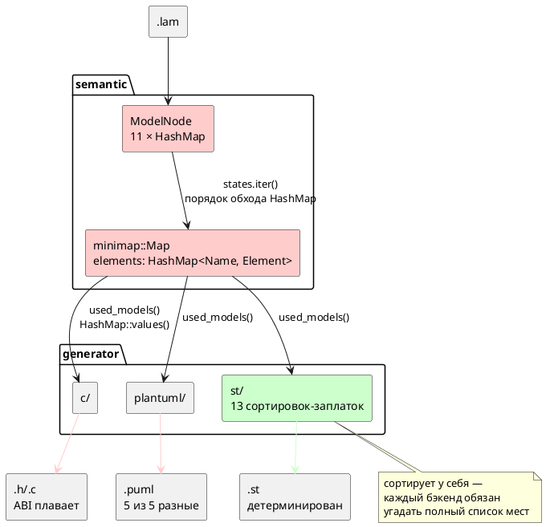

# Фича: Детерминированная генерация кода (единый порядок эмиссии)

- **Номер:** 0048
- **Статус:** ГОТОВО
- **Зависит от:** `нет` (проставлено аналитиком, стадия 3, 2026-07-16).
  Пересечения по файлам — не зависимости: [разделение переросших модулей (validate.rs, lsp.rs, c_expr.rs)](0027-module-size-split.md)
  трогает `c_expr.rs` (0048 его не касается) и `validate.rs`/`lsp.rs` (только в
  опциональном объёме «гигиена»), [генератор C: typedef корневой структуры для одиночной модели](0026-c-root-typedef.md) закрыта.
  Обоснование — в [анализе](0048-deterministic-codegen.md#анализ), раздел
  «Зависимости фичи».
- **Связанные issue (анализ):** новая фича (из бэклога кандидатов `FEATURES.md`,
  пункт «Генерация недетерминирована — C *и* PlantUML»; выявлено при
  [генератор C: typedef корневой структуры для одиночной модели](0026-c-root-typedef.md), уточнено при 0041-01, подтверждено пробами
  2026-07-16)
- **Крейт:** `grammar` (`semantic/minimap.rs`, `semantic/mod.rs`,
  `generator/{c,plantuml}/`)

## Стадии жизненного цикла (правило 17)

Все стадии — **разделы этой карточки** (правило 32): «Архитектура (ADR)»,
«Анализ», «Разработка», «Тест-план», «Отчёт о тестировании», «Итог».
Отдельным артефактом остаются только исправления —
[`docs/fixes/`](../fixes/README.md) (при необходимости `0048-YY-*`).

## Краткое описание

Один и тот же `.lam` компилируется в **разный** код от запуска к запуску: плавают
порядок под-моделей, порядок вариантов `enum` состояний, порядок полей структуры
и — что хуже всего — **числовые значения портов**, то есть ABI прошивки. Причина
одна: словари семантического дерева (`ModelNode`) и снимок для генераторов
(`minimap::Map`) — `HashMap`, чей порядок обхода рандомизирован. Цель фичи —
сделать порядок эмиссии **свойством общего слоя**, а не привычкой каждого
генератора: один упорядоченный обход, от которого детерминизм получают `c`,
`plantuml` и любая будущая цель.

> Фича зарегистрирована из бэклога кандидатов `FEATURES.md` (решение заказчика
> 2026-07-16: «нужен детерминизм генерации»); далее проходит жизненный цикл по
> правилу 17: архитектура (ADR) → анализ → разработка.

## Мотивация / контекст

Недетерминизм осознавался **точечно, но не системно**: для `structs` сортировка
уже сделана (`c_header.rs:546`), генератор `st` (закрытая
[генератор генерации в Structured Text (IEC 61131-3)](0041-st-backend.md)) сортирует у себя в **двенадцати** местах и потому
детерминирован. Но это лечение следствия: каждый новый генератор обязан заново
угадать полный список мест, где утекает порядок, а забытая сортировка не ломает
сборку и не ловится тестом — она проявляется случайно, раз в несколько прогонов.

Три следствия, ради которых фича заводится:

1. **«Плавающий» ABI.** Прошивка, собранная дважды из одного исходника, получает
   **разные идентификаторы портов**.
2. **Невоспроизводимые сборки.** Порождённый код нельзя сверить побайтно ни с
   эталоном, ни с самим собой.
3. **Принципиальная невозможность codegen-снапшотов.** Требование «сверить
   снапшоты» оказалось неисполнимым уже **дважды** — в 0026 и в тест-плане 0041
   (проверки T1–T4). Пока фича не закрыта, оно будет неисполнимо и впредь.

## Факты (пробы 2026-07-16, ветка v2)

Все цифры получены прогоном **одного и того же бинарника** на **одном и том же**
входе — не рассуждением.

### Масштаб: недетерминированы все примеры корпуса

`lamc compile -t c`, 5 прогонов каждый, сравнение `.h` по md5:

| Пример | Уникальных вариантов из 5 |
|---|---|
| `comprehensive.lam` | **5** |
| `elevator.lam` | **5** |
| `elevator_mini.lam` | **5** |
| `extend_complex.lam` | **5** |
| `stacker.lam` | **5** |

То есть **ни один** прогон не совпал с другим. Для `elevator_mini` то же верно
для `-t c` (`.c`), `-t plantuml` (`.puml`) и `-t c-hal` — 5 из 5, 5 из 5, 3 из 3.
Цель **`st` — 1 из 5**, то есть детерминирована (подтверждает заявку 0041).

### ABI: значение порта меняется между сборками

`elevator_mini`, порт `CABIN_BUTTON_DC`, **15 прогонов** цели `c`:

| Значение в `enum` | Прогонов |
|---|---|
| `= 0` | 8 |
| `= 2` | 7 |

Заявка кандидата (`CABIN_BUTTON_DC = 2` против `= 0`) **воспроизведена точно**.
Это не косметика: два бинарника, собранные из одного исходника, расходятся в
нумерации портов.

### Рабочее дерево прямо сейчас загрязнено этим дефектом

`git status` на ветке v2 показывает 7 изменённых порождённых файлов
(`examples/generated/`, 178 вставок / 178 удалений). Проверено `git diff`: это
**чистая перестановка** (`typedef struct StackerCommandReceiver` переехал на три
строки, блоки моделей поменялись местами) — содержательных изменений нет.
Симметрия 178/178 — подпись перестановки, а не правки.

### Механизм: две строки в общем слое

Отчёт по коду (проверено чтением, не догадкой) сузил причину сильнее, чем
предполагал кандидат: **почти всё** течёт через один общий слой
`semantic/minimap.rs`, а не через генераторы по отдельности.

| Место | Что происходит |
|---|---|
| `semantic/minimap.rs:196` | `states.iter().for_each(…)` строит `Element::Model.states: Vec<Name>` **прямо из порядка обхода `HashMap`**. Этот вектор потребляют **все** генераторы через `map.states()` — корень плавающего порядка состояний. |
| `semantic/minimap.rs:247-253` | `used_models()` возвращает `self.elements.values().filter(…)` — **порядок `HashMap::values()`**. Корень плавающего порядка под-моделей. Потребляют `c_map.rs:102`, `puml_map.rs:63`, `st_map.rs:106`. |
| `semantic/minimap.rs:170` | `elements: HashMap<Name, Element>` — сам контейнер снимка. |
| `semantic/mod.rs:73-115` | 11 полей `ModelNode` — `HashMap`: `models`, `functions`, `variables`, `types`, `conditions`, `enums`, `structs`, `states`, `docs`, `type_locs`, `raw_type_defs`. Отдельного поля `ports` **нет** — порты живут внутри `variables` как вариант `VariableNode::Port` и наследуют его недетерминизм. |
| `generator/c/mod.rs:825-858` | `topological_sort_models` недетерминирована **по построению**: `by_name: HashMap` (`:826`), `keys` собираются `.keys().cloned().collect()` **без сортировки** (`:836`), затем DFS `for key in &keys` (`:855`). |

**Третья причина — неверное допущение в докстринге.** `c/mod.rs:824` прямо
заявляет: «Нет гарантий порядка одноуровневых вершин — нужен только частичный
порядок». Для C это **неверно**: частичного порядка достаточно для
*корректности*, но не для *воспроизводимости* — топологическая сортировка со
случайным входом даёт случайный (хотя и всякий раз корректный) выход. Именно так
дефект и уцелел: допущение выглядит безобидным и сборку не ломает. Сравните с
`st/mod.rs:153`, где вход **сортируется перед** `topological_order` (`:154`) —
**это и есть недостающая строка в C**.

**Ловушка ABI — не там, где кажется** (`c_header.rs:261` + `:301-309`). Порты
**уже сортируются** — но **внутри одной модели** и по одному лишь имени порта;
номер же (`idx`) выдаётся сквозным `enumerate()` по циклу
`for element in &all_models`, где `all_models` = `map.using_models()`, то есть
порядок `HashMap::values()`. **Межмодельный порядок остаётся случайным** →
номера портов сдвигаются целыми блоками. Отсюда вывод, который должен попасть в
ADR: **локальная сортировка не спасает, если внешний цикл недетерминирован**, а
сортировка по неуникальному ключу лишь маскирует проблему (стабильная
`sort_by` сохраняет исходный, то есть случайный, порядок для равных ключей).

### Что кандидат утверждал неточно

- **Порядок полей структуры и вариантов пользовательского `enum` — стабилен.**
  `StructDefinitionNode.fields` — `Vec` (`struct_node.rs:27`),
  `EnumDefinitionNode.variants` — `Vec` (`enum_node.rs:35`), а `c_decl.rs:94`
  печатает явные значения из исходника. Наблюдаемое «поле уехало» — это порядок
  **`variables`** (`c_header.rs:339`) и порядок **самих структур**, а не полей
  внутри них. Пользовательские `enum` ABI не ломают — ломают `enum` **портов и
  состояний**, которые нумерует генератор.
- **Сортировка строк вывода** (`c_decl.rs:86, 107, 230, 237`) — существующий
  приём, но работает лишь там, где вывод плоский. Замечание кандидата про
  запятую у последнего варианта `enum` этим и объясняется: сортировать **текст**
  после эмиссии поздно, порядок надо задать **до** неё.

## Объём (предварительно, уточняет аналитик)

1. **Упорядочить общий слой** — `minimap::Map` (`elements`, `states`,
   `used_models`). Это чинит `c`, `plantuml` **и любую будущую цель разом**.
2. **Упорядочить `ModelNode`** — 11 полей-`HashMap`, либо точечно те, чей обход
   достигает вывода (`variables`, `models`, `states`, `functions`, `enums`).
3. **Снять теперь избыточные сортировки** в `st` (12 мест) — после п. 1 они
   перестают быть несущими. Решает аналитик: снимать или оставить как страховку.
4. **Закрепить тестом** — проверка «два прогона байт-в-байт совпадают» по всему
   корпусу `examples/`. Именно этой проверки не хватало: дефект дожил до 0048
   потому, что **не ломал сборку**.
5. **Codegen-снапшоты** — после п. 1–4 они впервые становятся возможны; разблокируют
   требования 0026 и T1–T4 тест-плана 0041. Заводить ли их в этой фиче — решает
   аналитик.
6. **Перегенерировать `examples/generated/`** и закоммитить стабильный вывод.

## Развилка для ADR (стадия 2)

Решение **не техническое, а вкусовое**, и аналитик его принимать не вправе —
нужен выбор заказчика:

| Вариант | Порядок вывода | Цена |
|---|---|---|
| **`BTreeMap`** | Алфавитный | Дёшево, `std`, но вывод **перестаёт соответствовать порядку объявлений** в `.lam` |
| **`IndexMap`** | **Порядок исходника** | Заголовок читается и диффится против `.lam`; **новая зависимость** (`indexmap` в проект **не подключён**) |
| **`Vec` + сортировка на эмиссии** | Алфавитный | Без новых типов, но каждый генератор снова обязан помнить о сортировке — то есть **лечит следствие**, что и привело к 0048 |

Замечание для ADR: `itertools 0.14` **уже** в зависимостях (используется в
`c/mod.rs:225`), `BTreeMap`/`BTreeSet`/`IndexMap` в проекте **не используются
нигде** — прецедента нет.

## Осторожно (не сломать)

- **Значения `enum` состояний и портов изменятся** — это и есть цель, но для
  любого уже прошитого устройства это **смена ABI**. Оценить в анализе
  (правило 11).
- **Сборка `examples/generated/`** — вывод изменится **во всех** файлах; отличить
  «стало детерминированно» от «сломалось» можно только живой проверкой
  (`precheck.sh`, проверки `cc` и `iec2c`), а **не** глазами по диффу.
- **Цель `st` детерминирована уже сегодня** — её вывод после п. 1 не должен
  измениться **вовсе**; если изменился — регресс. Это бесплатный контрольный тест
  для п. 1.
- **`minimap.rs:188` / `mod.rs:188-195`** — `get_start_state()` берёт `.first()`
  из отфильтрованных `into_values()`. Если у модели окажется **два** `start`, кто
  победит — **случайность**. Проверить, закрыто ли это валидацией; если нет — это
  дефект строже косметики.
- **Пересечение по файлам:** [генератор C: typedef корневой структуры для одиночной модели](0026-c-root-typedef.md) правит
  `generator/c/mod.rs`, [разделение переросших модулей (validate.rs, lsp.rs, c_expr.rs)](0027-module-size-split.md) перекладывает
  `c_expr.rs` целиком. Конфликты слияния вероятны — порядок определяет аналитик
  (правило 19).

## Обратная совместимость (правило 11)

**Синтаксис и семантика языка не меняются** — правится только порядок эмиссии,
поэтому версия языка **не растёт** (правило 22). Однако **порождённый C
меняется** для всех входов, а числовые значения `enum` портов/состояний — это
ABI: код, слинкованный со старым заголовком, разойдётся с новым. Обосновать в
анализе; смягчающее обстоятельство — сегодня этот ABI **и так** не
воспроизводится между двумя сборками, то есть фича не ломает стабильность, а
**впервые её вводит**.

## Архитектура (ADR)

- **Status:** Accepted
- **Date:** 2026-07-16
- **Authors:** Архитектор + Лид разработки (решение развилки — заказчик, 2026-07-16)
- **Related issues:** [Фича](0048-deterministic-codegen.md)

### Context

Один и тот же `.lam` компилируется в **разный** код от запуска к запуску. Пробы
2026-07-16 (пять примеров корпуса, по 5 прогонов одного бинарника, сравнение
`.h` по md5) дали **5 уникальных вариантов из 5** для каждого примера — ни один
прогон не совпал с другим. Хуже косметики: 15 прогонов `elevator_mini` дали порту
`CABIN_BUTTON_DC` значение `= 0` в 8 случаях и `= 2` в 7, то есть **плавает ABI**
прошивки.

Причина одна и лежит **не в генераторах**, а в общем слое: словари
семантического дерева (`ModelNode`) и снимка для генераторов (`minimap::Map`) —
`HashMap`, порядок обхода которого рандомизирован (`RandomState`). Генераторы
лишь печатают то, что им выдал обход.

| Место | Что течёт |
|---|---|
| `semantic/minimap.rs:170` | `elements: HashMap<Name, Element>` — контейнер снимка |
| `semantic/minimap.rs:195` | `states.iter()` → `Element::Model.states: Vec<Name>` строится **из порядка обхода `HashMap`**; потребляют все генераторы |
| `semantic/minimap.rs:247-253` | `used_models()` = `elements.values()` — порядок под-моделей; потребляют `c_map.rs:102`, `puml_map.rs:63`, `st_map.rs:106` |
| `semantic/mod.rs:73-115` | 11 полей `ModelNode` — `HashMap`. Порты живут внутри `variables` (`VariableNode::Port`) и наследуют его недетерминизм |
| `generator/c/mod.rs:836` | `topological_sort_models`: `keys` собираются `.keys().cloned()` **без сортировки**, затем DFS `for key in &keys` |

**Почему дефект дожил до 0048.** Недетерминизм осознавался точечно, но не
системно: `c_header.rs:546` сортирует структуры, генератор `st` (закрытая
[генератор генерации в Structured Text (IEC 61131-3)](0041-st-backend.md#архитектура-adr)) сортирует у себя в **13** местах и потому
детерминирован (проба: 1 уникальный вариант из 5). Но это лечение следствия —
забытая сортировка **не ломает сборку** и не ловится тестом: она проявляется
случайно, раз в несколько прогонов. Докстринг `c/mod.rs:824` прямо закрепил
неверное допущение: «Нет гарантий порядка одноуровневых вершин — нужен только
частичный порядок». Для *корректности* частичного порядка довольно, для
*воспроизводимости* — нет: топологическая сортировка со случайным входом даёт
случайный (хотя и всякий раз корректный) выход.

**Ловушка ABI — не там, где кажется.** Порты **уже** сортируются
(`c_header.rs:261`, `:301-309`) — но **внутри одной модели** и по одному лишь
имени, тогда как номер (`idx`) выдаётся сквозным `enumerate()` по внешнему циклу
`for element in &all_models`, где `all_models = map.using_models()`, то есть
порядок `HashMap::values()`. Межмодельный порядок остаётся случайным → номера
портов сдвигаются целыми блоками. Отсюда правило, которое эта ADR закрепляет:
**локальная сортировка не спасает, если внешний цикл недетерминирован**, а
сортировка по неуникальному ключу лишь маскирует проблему (стабильная `sort_by`
сохраняет для равных ключей исходный — то есть случайный — порядок).

#### Поток «как есть»



### Decision Drivers

1. **ABI прошивки обязан быть воспроизводим.** Два бинарника из одного
   исходника должны совпадать побайтно. Сегодня это не так.
2. **Порядок — свойство общего слоя, а не привычка генератора.** Каждый новый
   генератор (0045 — SystemVerilog, и далее) не должен заново угадывать места
   утечки порядка. Цена бездействия растёт линейно по числу целей.
3. **Дефект обязан ломать сборку.** Забытая сортировка сегодня не ловится ничем;
   нужен проверка, а не дисциплина.
4. **Не плодить зависимости без нужды.** `IndexMap`/`BTreeMap`/`BTreeSet` в
   проекте не используются нигде — прецедента нет.

### Considered Options

#### Option A. `BTreeMap` — алфавитный порядок

Заменить `HashMap` на `BTreeMap` в `minimap::Map.elements` и в полях `ModelNode`,
чей обход достигает вывода.

**Pros:**
- `std`, новых зависимостей нет.
- Порядок — **свойство типа контейнера**: обход упорядочен всегда, забыть
  сортировку негде. Лечит причину, а не следствие.
- Ключи (`String`, `Name`) уже уникальны → тотальный порядок без tie-break.
- API `BTreeMap` совместим с `HashMap` по используемым методам
  (`get`/`insert`/`iter`/`values`/`keys`/`entry`/`retain`) → правка механическая,
  а несовместимости ловит компилятор.

**Cons:**
- Вывод **перестаёт соответствовать порядку объявлений** в `.lam`: заголовок
  читается по алфавиту, а не по исходнику.
- `BTreeMap` требует `Ord` на ключе — у `Name` его нет, придётся добавить.
- Вставка/поиск `O(log n)` против `O(1)` — на масштабах модели (десятки-сотни
  элементов) неизмеримо.

#### Option B. `IndexMap` — порядок исходника

**Pros:**
- Порядок эмиссии = порядок объявлений в `.lam`; заголовок диффится против
  исходника, номера портов идут «как написано».
- `O(1)` доступ сохраняется.

**Cons:**
- **Новая зависимость** (`indexmap` в проект не подключён).
- Порядок становится свойством **истории вставок**, а не данных: перестановка
  двух проходов семантики молча меняет ABI. Детерминизм есть, но он хрупок и
  никак не выражен в типе.

#### Option C. `Vec` + сортировка на эмиссии

**Pros:**
- Без новых типов и зависимостей.
- Точечно, минимальный диф.

**Cons:**
- **Лечит следствие** — ровно тот механизм, что и привёл к 0048: каждый генератор
  снова обязан помнить о сортировке, а забытая строка не ломает сборку. `st`
  уже несёт 13 таких заплаток, `c` — 5 частичных, `plantuml` — ноль.
- Потеря `O(1)`-поиска по имени либо дублирование контейнеров.

### Decision

Принимается **Option A (`BTreeMap`)** — решение заказчика от 2026-07-16.

Обоснование выбора: развилка вкусовая (драйвер 2 удовлетворяют и A, и B), и
заказчик предпочёл алфавитный порядок ценой соответствия исходнику. Довод в
пользу A сверх вкуса: `BTreeMap` выражает инвариант **в типе** — упорядоченность
нельзя забыть, тогда как у `IndexMap` она держится на порядке вставок, то есть на
той же дисциплине, ради отказа от которой заводится фича.

Три следствия решения, обязательные к исполнению:

1. **`Name` получает `Ord`/`PartialOrd` по паре `(unique, local)`** — сравниваются
   **оба** поля, поэтому порядок согласован с существующим `Eq` (требование
   `BTreeMap`). Первичный ключ — `unique` (полный путь `Root:Child:State`):
   сортировка по нему группирует элементы по родителям, что читается лучше
   алфавита по локальным именам.
2. **`topological_sort_models` (`c/mod.rs:825`) сортирует вход** — по образцу
   `st/mod.rs:153`, где вход сортируется **перед** `topological_order`.
   Смены типа `by_name` мало: DFS идёт по `keys`, и сортировать надо именно их.
   Докстринг `:824` («нужен только частичный порядок») исправляется — он и есть
   зафиксированное заблуждение.
3. **13 сортировок цели `st` остаются** (решение заказчика). После правки общего
   слоя они избыточны, но безвредны, а неизменность вывода `st` — **бесплатный
   контрольный тест** правки: если `.st` изменился, значит общий слой упорядочен
   не так, как предполагалось.

### Consequences

#### Положительные

- Порождённый код воспроизводим побайтно для всех целей, включая будущие
  (0045 и далее) — они получают детерминизм даром, ничего не зная про порядок.
- **Codegen-снапшоты впервые становятся возможны** — разблокируется требование,
  дважды оказавшееся неисполнимым (0026 и T1–T4 тест-плана 0041).
- Дифф `examples/generated/` снова несёт смысл: сегодня он «чистый шум
  перестановки» (рабочее дерево прямо сейчас загрязнено 7 файлами, 178/178 —
  симметрия, характерная для перестановки), и его нельзя читать как регресс.
- Снимается предупреждение из `CLAUDE.md` про недоверие к диффу порождённых файлов.

#### Отрицательные / Action items

- **ABI меняется однократно** — номера портов и состояний станут другими для
  всех входов. Это смена ABI (правило 11), но смягчающее обстоятельство решающее:
  сегодня этот ABI **и так** не воспроизводится между двумя сборками — фича не
  ломает стабильность, а **впервые её вводит**. Обосновать в анализе.
- **Порядок вывода перестаёт соответствовать `.lam`** — принятая цена Option A.
- `Name` требует `Ord` — правка `minimap.rs`.
- **Отличить «стало детерминированно» от «сломалось» глазами по диффу нельзя** —
  только живой проверкой (`precheck.sh`, проверки `cc` и `iec2c`).
- **Версия языка не растёт** (правило 22): синтаксис и семантика не меняются,
  правится лишь порядок эмиссии.
- Пересечение по файлам с [генератор C: typedef корневой структуры для одиночной модели](0026-c-root-typedef.md#архитектура-adr) (закрыта) и
  [разделение переросших модулей (validate.rs, lsp.rs, c_expr.rs)](0027-module-size-split.md#архитектура-adr) (`c_expr.rs`) — конфликты слияния вероятны.

#### Acceptance criteria

1. **Побайтная воспроизводимость.** Для каждого примера `examples/*.lam` и каждой
   цели (`c`, `c-hal`, `plantuml`, `st`) два прогона `lamc compile` дают
   идентичные файлы. Проверяется проверкой, а не глазами (объём 4 карточки).
2. **Проверка в `precheck.sh`** — «два прогона байт-в-байт совпадают» по всему
   корпусу; падает при появлении нового недетерминизма. Именно этой проверки не
   хватало: дефект дожил до 0048, потому что не ломал сборку.
3. **Вывод цели `st` не изменился вовсе** — контрольный тест правки общего слоя
   (сортировки `st` остаются на месте).
4. **Живая проверка зелена** — `precheck.sh` целиком: `cc` собирает порождённый
   C, `iec2c` принимает порождённый ST.
5. **`examples/generated/` перегенерирован** и закоммичен стабильным выводом.
6. **`topological_sort_models` детерминирована**, докстринг `c/mod.rs:824`
   исправлен.

## Анализ

### Цель и контекст

Сделать порядок эмиссии **свойством общего слоя**, а не привычкой каждого
генератора: `HashMap` → `BTreeMap` в `ModelNode` и `minimap::Map`
([ADR](0048-deterministic-codegen.md#архитектура-adr), Option A — решение заказчика
2026-07-16). Тогда `c`, `plantuml` и любая будущая цель (0045) получают
детерминизм даром.

Аудит кода (2026-07-16) **подтвердил все пять** мест из карточки и вскрыл
**четыре** новых факта, меняющих объём:

1. **Второй путь `states`** — `minimap.rs:470-472`
   (`m_rc.borrow().states.keys().cloned()`), независимый от `:195` и
   обслуживающий **вложенные** модели. Правка только `:195` оставила бы
   недетерминизм ровно там, где он и наблюдался в пробах.
2. **`plantuml` — самый уязвимый генератор**: у него **ноль** локальных сортировок
   (проверено grep-ом по `mod.rs` и `puml_map.rs`), тогда как `st` имеет 13, а
   `c` — 5 частичных. Три обхода печатают напрямую: `plantuml/mod.rs:122`
   (переходы), `:128` (блоки `state X {`), `:140` (состояния внутри модели).
3. **Порядок диагностик тоже недетерминирован** — и это чинится бесплатно.
   Диагностики нигде не собираются в `HashMap` (везде `Vec<Diagnostic>`), но
   **порядок их сбора** идёт по обходу `states.iter()` / `variables.values()`
   (`validate.rs:1350`, `:1372`, `:125`, `:430`, `unused.rs:52-72`, и рекурсия по
   `models.values()` в 13 местах `validate.rs`). Существующие сортировки
   (`validate.rs:1123`, `address_map.rs:447`) — `sort_by_key(|d| d.loc.start())`,
   то есть **стабильные**: при равном `loc.start()` порядок остаётся порядком
   вставки. Все кодогенерационные диагностики имеют `Location::Codegen` с
   **одинаковым** `start()` (`c_header.rs:706`, `:724`) → между собой
   перемешиваются.
4. **Автодополнение LSP недетерминировано** — `lsp.rs:712`, `:722`, `:737`,
   `:758`, `:768`, `:777` push-ят в `Vec<CompletionItem>` без сортировки: порядок
   подсказок меняется от запроса к запросу. Сборку не ломает, `BTreeMap` чинит
   бесплатно.

Два уточнения к разделу «Осторожно» карточки:

- **Опасение про два `start`-состояния снято.** `get_start_state`
  (`mod.rs:187`) действительно берёт `.first()` из `into_values()`, но
  множественность запрещена раньше: `model_only_one_start_state`
  (`validate.rs:41`) отвергает модель с `start_count != 1` диагностикой
  **SE-011**. Случайного победителя быть не может.
- **`c_header.rs:546`** (`structs.sort_by_key`) — уже детерминирован и корректен:
  `fields` — `Vec<(String, TypeNode)>` (`struct_node.rs:27`), порядок полей
  берётся из исходника.

### Зависимости фичи (правило 17/19)

- **Зависит от:** `нет`. Проверено по контракту и инфраструктуре: фича правит
  только внутренние типы контейнеров крейта `grammar`; ни ADR, ни анализ других
  незакрытых фич не поставляют ей ни API, ни схемы, ни инструмента.
- **Пересечения по файлам — не зависимости** (правило 19, критерий 1 неприменим):
  [разделение переросших модулей (validate.rs, lsp.rs, c_expr.rs)](0027-module-size-split.md) перекладывает `c_expr.rs`
  (0048 его **не трогает** — пересечения нет вовсе), `validate.rs` и `lsp.rs`
  (0048 трогает их **только** если брать опциональный объём п. «гигиена»).
  [генератор C: typedef корневой структуры для одиночной модели](0026-c-root-typedef.md) закрыта. Конфликт слияния возможен
  лишь по `lsp.rs` и разрешается тривиально.
- **Влияние на порядок разработки:** завершение 0048 **никого не
  разблокирует формально** (никто не объявлял её зависимостью), но снимает
  дважды подтверждённое препятствие: требование «сверить codegen-снапшоты»
  оказалось неисполнимым в 0026 и в тест-плане 0041 (T1–T4) и осталось бы
  неисполнимым для [генератор генерации в SystemVerilog](0045-sv-backend.md). Положение 0048 в
  начале таблицы (критерий 4) сохраняется.

### Требования и проверяемые условия

- **R1. Воспроизводимость вывода.** Два прогона `lamc compile` на одном входе
  дают **идентичные** файлы для целей `c`, `c-hal`, `plantuml`, `st`.
- **R2. Порядок задан типом, а не дисциплиной.** Обход контейнеров общего слоя
  упорядочен **по построению**; генератор не обязан ничего сортировать, чтобы быть
  детерминированным.
- **R3. Вывод цели `st` не меняется вовсе.** `st` детерминирована уже сегодня
  (проба: 1 уникальный вариант из 5) — её неизменность есть контрольный тест
  правки общего слоя. **Изменился `.st` → правка неверна.**
- **R4. Дефект обязан ломать сборку.** Появление нового недетерминизма
  обнаруживается проверкой, а не случайным прогоном раз в несколько сборок.
- **R5. Живая проверка зелена.** Порождённый C собирается `cc`, порождённый ST
  принимается `iec2c` — то есть изменился **порядок**, а не смысл.
- **R6. Порядок диагностик детерминирован** (следствие R2, фиксируется явно, п. 3
  контекста).

### Объём (уточнение объёма карточки)

#### Обязательно

| # | Место | Правка |
|---|---|---|
| 1 | `semantic/mod.rs:73,77,79,97,99,101` | `models`, `functions`, `variables`, `enums`, `structs`, `states` → `BTreeMap<String, _>` |
| 2 | `semantic/minimap.rs:170,361,461` | `elements` → `BTreeMap<Name, Element>` |
| 3 | `semantic/minimap.rs:15` | `Name`: `impl Ord`/`PartialOrd` по паре `(unique, local)` |
| 4 | `semantic/tree.rs:795,873` | снять `HashMap::with_capacity` — **у `BTreeMap` его нет** (единственные блокеры компиляции) |
| 5 | `generator/c/mod.rs:827,835,852` | `by_name`, `deps_map` → `BTreeMap`; `visited` → `BTreeSet`; докстринг `:824` исправить |
| 6 | `scripts/precheck.sh` | проверка воспроизводимости (жёсткий) |
| 7 | `examples/generated/` | перегенерировать, закоммитить стабильный вывод |

**`Ord` для `Name` — по `(unique, local)`, ручной `impl`, а не `derive`.** Причина:
`derive` даёт лексикографику по порядку полей, то есть **по `local` первым**, а
весь остальной код сортирует по `unique()` (`st/mod.rs:153`, `st_model.rs:93`) —
`derive` разошёлся бы с существующей конвенцией. Сравнение обоих полей сохраняет
согласованность с `Eq` (требование `BTreeMap`). `Hash` **остаётся** —
`Name` продолжает использоваться как ключ в промежуточных `HashMap`.

#### Гигиена (бесплатно при обязательном объёме)

`semantic/mod.rs:81,83,88,95,115` — `types`, `type_locs`, `raw_type_defs`,
`conditions`, `docs` → `BTreeMap`. Их обход вывода генератора не достигает, но:
`types`/`conditions` достигают **автодополнения LSP** (п. 4 контекста), а
единообразие типа контейнера снимает вопрос «а этот словарь почему другой?».
Взято в объём: цена нулевая, польза — R2 без исключений.

#### Не трогать (обосновано аудитом)

- **`c_header.rs:16,234` `PortMap`** (ключ `(PortClass, PortDirection)`) — обход
  идёт **фиксированными циклами** `for cls in [...] { for dir in [...] }`
  (`:295-297`, `:690-692`) с `.get()`, то есть порядок задан кодом, а не картой.
  `BTreeMap` потребовал бы `Ord` на обоих enum ради нулевой пользы.
- **`unused.rs` `UsageSet`** (4 × `HashSet<String>`) — только `.contains()`.
- **`address_map.rs`** (`map`, `seen`, `external_by_name`) — только `.get()`.
- **`verification/buchi.rs`** — вне пути кодогенерации (не вызывается ниоткуда,
  см. кандидат `FEATURES.md` про `lamc verify`).
- **13 сортировок цели `st`** — остаются (решение заказчика). После правки
  избыточны, но безвредны и служат исполнимой спецификацией порядка; плюс
  тесты-контроля `st/mod.rs:531`, `st_model.rs:721` уже на них завязаны.

### Критерии приёмки и способ проверки

| # | Критерий | Способ проверки |
|---|---|---|
| A1 | Два прогона `lamc compile` дают идентичные файлы для всех 5 примеров × 4 целей (`c`, `c-hal`, `plantuml`, `st`) | Проверка `precheck.sh`: два `mktemp -d`, `diff -r`. Сегодня красный на `c`/`plantuml` (5 уникальных из 5), зелёный на `st` |
| A2 | Проверка воспроизводимости в `precheck.sh` **жёсткий** (внешних инструментов не требует → мягкий пропуск не нужен) и падает при появлении недетерминизма | Негативная проба: вернуть `HashMap` в одном месте → проверка краснеет |
| A3 | **Вывод цели `st` не изменился ни в одном байте** (R3) | `git diff --stat examples/generated/st/` после перегенерации = пусто |
| A4 | Значения `enum` портов стабильны между прогонами | 15 прогонов `elevator_mini`, `grep CABIN_BUTTON_DC` → одно значение (сегодня: `= 0` в 8, `= 2` в 7) |
| A5 | Живая проверка зелена: `cc` собирает порождённый C, `iec2c` принимает ST | `precheck.sh` целиком (проверки `:62-64` и `:86-116`) |
| A6 | `topological_sort_models` детерминирована; докстринг `c/mod.rs:824` не утверждает, что частичного порядка достаточно | Юнит-тест + чтение |
| A7 | Порядок диагностик детерминирован (R6) | Тест: два прогона `validate_model` на модели с ≥2 предупреждениями → одинаковый порядок |
| A8 | Все ~1400 существующих тестов зелены | `cargo test -- --test-threads=1` |
| A9 | `examples/generated/` перегенерирован и закоммичен | `git status` чист после повторного `precheck.sh` |

### Особенности по обратной совместимости (правило 11)

**Язык не меняется — версия не растёт** (правило 22). Ни синтаксис, ни семантика
не затронуты: правится только порядок эмиссии. Обосновано тем, что ни одна
конструкция языка не добавлена, не удалена и не переосмыслена; АСД, проходы
семантики и диагностики те же.

**Порождённый C меняется для всех входов, и это смена ABI.** Числовые значения
`enum` портов и состояний — часть двоичного контракта: код, слинкованный со
старым заголовком, разойдётся с новым. Обоснование необходимости (правило 11
требует его при нарушении совместимости):

> Сегодня этот ABI **и так** не воспроизводится между двумя сборками — проба
> дала `CABIN_BUTTON_DC = 0` в 8 прогонах из 15 и `= 2` в 7. То есть «старого
> ABI», который можно было бы сохранить, **не существует**: у каждой сборки он
> свой. Фича не ломает стабильность — она **впервые её вводит**. Отказ от фичи
> сохраняет не совместимость, а её отсутствие.

Смягчение для уже прошитых устройств: перекомпиляция обязательна, но она и
сегодня даёт другой ABI при каждом запуске компилятора — то есть требование
«пересобрать всё вместе» действовало и раньше, просто необъявленно.

**API крейтов не меняется.** `ModelNode`-поля публичны, и смена
`HashMap` → `BTreeMap` формально меняет их тип. Внешних потребителей у
`grammar` нет (workspace из двух крейтов, `simulation` использует `ModelNode`
через методы). Проверяется сборкой `--all-features --all-targets`.

### Риски и зависимости

- **Риск: правка выглядит зелёной, но недетерминизм остался в непокрытом месте.**
  Снижение: проверка (A1) проверяет **весь корпус × все цели**, а не пример; плюс
  контрольный тест R3 — если `st` изменился, значит общий слой упорядочен не так,
  как предполагалось.
- **Риск: дифф `examples/generated/` нечитаем — не отличить «стало
  детерминированно» от «сломалось».** Снижение: **только живая проверка** (A5),
  а не глаза. Прямо запрещено `CLAUDE.md` и разделом «Осторожно» карточки.
- **Риск: рабочее дерево уже загрязнено** — `git status` показывает 7 изменённых
  порождённых файлов (178 вставок / 178 удалений, симметрия = подпись
  перестановки). Снижение: перегенерировать **после** правки (задача 04), не до —
  иначе шум смешается с результатом.
- **Риск: `stacker.c`/`stacker.h` закоммичены, а `.c/.h` остальных примеров —
  в `.gitignore`** (`examples/generated/c/.gitignore` игнорирует
  `elevator.[ch]`, `elevator_mini.[ch]`, `extend_complex.[ch]`,
  `comprehensive.[ch]`). То есть в git виден недетерминизм **только одного**
  примера из пяти — это и объясняет, почему дефект замечали как «шум
  перестановки», а не как дефект ABI. Проверка (A1) смотрит **все** пять,
  независимо от `.gitignore`.
- **Риск: `c-hal` и `st-at` в `precheck.sh` не вызываются вовсе** (grep по
  `scripts/` и `.github/` пуст) — то есть две цели из пяти не покрыты ни живой
  проверкой, ни перегенерацией. Решение аналитика: проверка A1 покрывает `c-hal`
  (там таблица `{Enum}__ADDR[]`, индексируемая теми самыми enum-значениями
  портов, — это ABI в чистом виде), `st-at` — тоже, цена нулевая (цикл уже есть).
- **Зависимость от инструментов: нет.** Проверка сравнивает файлы (`diff -r`),
  внешних арбитров не требует — в отличие от ST-проверки (`iec2c`) мягкий пропуск
  не нужен, проверка жёсткий, как проверка `c` (`precheck.sh:62-64`).

### Декомпозиция разработки (правило 17)

| Задача | Содержание |
|---|---|
| [детерминированная генерация кода (единый порядок эмиссии)](0048-deterministic-codegen.md#разработка) | Упорядочить общий слой: `ModelNode` (11 полей), `minimap::Map.elements`, `Ord` для `Name`, снять `with_capacity` |
| [детерминированная генерация кода (единый порядок эмиссии)](0048-deterministic-codegen.md#разработка) | Детерминировать `topological_sort_models` цели `c`; исправить докстринг-заблуждение |
| [детерминированная генерация кода (единый порядок эмиссии)](0048-deterministic-codegen.md#разработка) | Проверка воспроизводимости в `precheck.sh` + тесты-контроля (`plantuml`, диагностики) |
| [детерминированная генерация кода (единый порядок эмиссии)](0048-deterministic-codegen.md#разработка) | Перегенерировать `examples/generated/`, обновить `CLAUDE.md`/`README.md`/`CHANGES.md` |

## Разработка

### Задача

#### Что было

Словари общего слоя — `HashMap`, порядок обхода которого рандомизирован
(`RandomState`). Генераторы печатают то, что им выдал обход, поэтому все пять
примеров корпуса дают 5 разных `.h` из 5 прогонов одного бинарника, а значение
`enum` порта `CABIN_BUTTON_DC` плавает между `= 0` и `= 2` (проба, 15 прогонов).

Затронутые места (аудит 2026-07-16):

- `semantic/mod.rs:73-115` — 11 полей `ModelNode`. Вывода достигают шесть:
  `models` (→ `minimap.rs:461` `visit_extend` → `elements` → `used_models()` →
  все три генератора), `states` (→ `minimap.rs:195` и `:470` → `Element::Model.states`
  → печать), `variables` (→ `c_header.rs:339`, `c_model.rs:104` — **без**
  сортировки), `enums`, `structs`, `functions` (в C/ST обезврежены локальными
  сортировками).
- `semantic/minimap.rs:170` — `elements: HashMap<Name, Element>`; единственный
  обход `.values()` в `used_models()` (`:247-253`) идёт прямо во все генераторы.
- `semantic/minimap.rs:195` и **`:470-472`** — **два независимых** пути
  построения `Element::Model.states`: первый для корневой модели, второй
  (`m_rc.borrow().states.keys().cloned()`) для вложенных.
- `semantic/tree.rs:795,873` — `HashMap::with_capacity(...)`.

#### Что сделано

Порядок стал свойством типа контейнера (ADR, Option A):

1. **`ModelNode` → `BTreeMap<String, _>`** для всех 11 полей: `models`,
   `functions`, `variables`, `types`, `type_locs`, `raw_type_defs`, `conditions`,
   `enums`, `structs`, `states`, `docs`. Шесть обязательны (достигают вывода),
   пять взяты по «гигиене» (анализ, раздел «Объём»): цена нулевая, а
   `types`/`conditions` достигают автодополнения LSP (`lsp.rs:758`, `:768`).
2. **`minimap::Map.elements` → `BTreeMap<Name, Element>`**, вместе с сигнатурами
   `visit_state` (`:361`) и `visit_extend` (`:461`).
3. **`impl Ord`/`PartialOrd` для `Name`** — **ручной**, по паре `(unique, local)`.
   Не `derive`: тот дал бы лексикографику по `local` первым, разойдясь с
   конвенцией остального кода (`st/mod.rs:153`, `st_model.rs:93` сортируют по
   `unique()`). Сравнение обоих полей сохраняет согласованность с `Eq`
   (требование `BTreeMap`). `Hash` оставлен — `Name` остаётся ключом
   промежуточных `HashMap`.
4. **`with_capacity` снят** (`tree.rs:795,873`) — у `BTreeMap` его нет; это
   единственные два места, где механическая замена не проходит компиляцию.

**Не тронуто** (обосновано анализом): `PortMap` (`c_header.rs:16,234`; обход
фиксированными циклами, ключ — не источник порядка), `UsageSet` (`unused.rs`;
только `contains`), `address_map.rs` (только `get`), `verification/buchi.rs`
(вне пути кодогенерации), 13 сортировок цели `st` (решение заказчика — остаются
контрольным тестом).

#### Проверки

- `cargo build --all-features --all-targets` — сборка (правило 5).
- `cargo test -- --test-threads=1` — ~1400 тестов зелены (A8).
- **Контрольный тест R3/A3:** вывод цели `st` **не изменился ни в одном байте** —
  `st` детерминирована и до правки, значит правка общего слоя дала тот же
  порядок, что и её 13 локальных сортировок. Изменился `.st` → правка неверна.
- Проба A4: 15 прогонов `elevator_mini -t c`, `grep CABIN_BUTTON_DC` → одно
  значение.

### Задача

#### Что было

`topological_sort_models` (`generator/c/mod.rs:825-858`) недетерминирована **по
построению**, независимо от [детерминированная генерация кода (единый порядок эмиссии)](0048-deterministic-codegen.md#разработка):

```rust
let mut by_name: HashMap<String, Element> = HashMap::new();   // :827
let keys: Vec<String> = by_name.keys().cloned().collect();    // :836 — БЕЗ сортировки
for key in &keys { topo_dfs(key, …, &mut visited, &mut result); }  // :854
```

`keys` задаёт порядок стартовых вершин DFS → `result` меняется от запуска к
запуску. Потребители: `c_model.rs:42`, `c_header.rs:511` → печать `:575`.

Докстринг `:824` закрепил заблуждение, из-за которого дефект и уцелел:

> «Нет гарантий порядка одноуровневых вершин — нужен только частичный порядок.»

Для *корректности* частичного порядка довольно; для *воспроизводимости* — нет:
топологическая сортировка со случайным входом даёт случайный (хотя и всякий раз
корректный) выход. Образец верного решения — `st/mod.rs:153`, где вход
сортируется **перед** `topological_order` (`:154`).

#### Что сделано

1. `by_name` и `deps_map` → `BTreeMap<String, _>`, `visited` → `BTreeSet<String>`.
   Тогда `by_name.keys()` (`:836`) лексикографичен по построению, и порядок
   стартовых вершин DFS детерминирован.
2. Докстринг `:824` исправлен: частичного порядка достаточно для корректности,
   но **не** для воспроизводимости; порядок одноуровневых вершин задан
   лексикографикой ключей.

Смены типа `by_name` **достаточно** — сортировать `keys` отдельно не требуется,
поскольку `BTreeMap::keys()` уже упорядочен. Это и есть предпочтительная форма
по ADR: порядок — свойство типа, а не строки, которую можно забыть.

#### Проверки

- Юнит-тест: `topological_sort_models` на модели с ≥2 одноуровневыми
  под-моделями даёт **один и тот же** порядок в N прогонах (A6).
- Живая проверка (A5): `cc` собирает порождённый C — то есть изменился порядок
  `typedef`/`struct`, а не смысл; топологический инвариант (зависимость раньше
  зависимого) не нарушен.
- `cargo test -- --test-threads=1`.

### Задача

#### Что было

Ни одного теста и ни одного скрипта, сравнивающего вывод компилятора побайтно
(grep по `md5|sha|cmp|diff -q` в `grammar`, `scripts`, `.github` — пусто).
Дефект дожил до 0048 именно потому, что **не ломал сборку** — проявлялся
случайно, раз в несколько прогонов. В git к тому же виден недетерминизм лишь
одного примера из пяти: `stacker.c`/`stacker.h` закоммичены, а `.c/.h`
остальных — в `examples/generated/c/.gitignore`.

#### Что сделано

1. **Проверка воспроизводимости в `scripts/precheck.sh`** — по образцу ST-проверки
   (`:86-116`), но **жёсткий**: внешних инструментов не требует (сравнение —
   `diff -r`), поэтому мягкий пропуск не нужен (как у проверки `c`, `:62-64`).
   Механика: два прогона `lamc compile` каждого `examples/*.lam` в **два разных**
   `mktemp -d`, для каждой цели `c`, `c-hal`, `plantuml`, `st`, `st-at`; `diff -r`
   двух каталогов. Флаг-аккумулятор `repro_failed`, отчёт по всему корпусу за
   прогон, `exit 1` после цикла. Сравниваются **файлы на диске** (`lamc` пишет
   только в файлы, не в stdout).
2. **Тесты-контроля** для трёх мест, ставших детерминированными **впервые** (у них
   не было локальной сортировки — по образцу `st/mod.rs:531`, `st_model.rs:721`):
   - `plantuml/mod.rs:122,128,140` — единственный генератор без единой локальной
     сортировки: два прогона `compile_to_plantuml` дают идентичный `.puml`.
   - `c_header.rs:339` — поля `struct` в `.h` (печать из `into_values()`).
   - `c_header.rs:301` — `idx` как значение `enum`-варианта порта (ABI).
3. **Тест порядка диагностик** (R6/A7): два прогона `validate_model` на модели с
   ≥2 предупреждениями дают одинаковый порядок. `BTreeMap` в 0048-01
   стабилизирует и его — диагностики собираются по обходу `states`/`variables`.

#### Проверки

- **Негативная проба (A2):** временно вернуть `HashMap` в одном месте 0048-01 →
  проверка краснеет. Подтверждает, что проверка ловит регресс, а не только зелёное.
- Проверка зелен на исправленном коде для всех 5 примеров × 5 целей (A1).
- `cargo test -- --test-threads=1` — контроля зелены, ~1400 существующих тоже (A8).
- Проверка красен на коде **до** 0048-01/02 (контроль): `c`/`plantuml` дают 5
  уникальных из 5, `st` — 1 из 5.

### Задача

#### Что было

Рабочее дерево загрязнено дефектом: `git status` на v2 показывает 7 изменённых
порождённых файлов (`examples/generated/`, 178 вставок / 178 удалений — симметрия
= подпись перестановки, содержательных изменений нет). Пока слой был
недетерминирован, коммитить стабильный вывод было бессмысленно.

`CLAUDE.md` несёт предупреждение «генерация недетерминирована — цели `c` и
`plantuml`» и «дифф `examples/generated/` может быть чистым шумом перестановки —
не считай его регрессом». После 0048 это перестаёт быть верным.

#### Что сделано

1. **`examples/generated/` перегенерирован** прогоном `precheck.sh` на
   исправленном коде и закоммичен стабильным выводом. Отличать «стало
   детерминированно» от «сломалось» — **только живой проверкой** (`cc`, `iec2c`),
   а не глазами по диффу (запрет `CLAUDE.md`).
2. **`CLAUDE.md`** — снято предупреждение о недетерминизме `c`/`plantuml` и о
   недоверии к диффу порождённых файлов; вместо него — указатель, что
   воспроизводимость гарантирована проверкой, а `BTreeMap` — канон
   порядка эмиссии.
3. **`README.md`** — раздел о генерации: порядок эмиссии алфавитный
   (`BTreeMap`), вывод воспроизводим побайтно.
4. **`CHANGES.md`** — запись в `[Не выпущено]`.

#### Проверки

- **A9:** повторный прогон `precheck.sh` оставляет `git status` **чистым** —
  вывод стабилен между сборками.
- Живая проверка (A5): `precheck.sh` целиком зелен — `cc` собирает C, `iec2c`
  принимает ST.
- `python3 scripts/check-links.py` — ссылки целы (правило 14).

## Тест-план

### Область и цель

Доказать, что порождённый код **воспроизводим побайтно** между прогонами одного
бинарника на одном входе — для всех целей, а не «в среднем». Дефект вероятностный
(проявляется случайно), поэтому проверки строятся так, чтобы **ловить**
недетерминизм, а не полагаться на удачу: структурные (порядок A<B) и повторно-
прогонные (N итераций). Связь с требованиями анализа R1–R6 и критериями A1–A9.

Язык не меняется (правило 22) — синтаксических примеров/контрпримеров нет
(правило 16 неприменимо): фича не вводит и не удаляет ни одной конструкции.

### Проверки (условие → ожидаемый результат)

| # | Проверка | Предусловие | Ожидаемый результат | Ссылка на R/A |
|---|---|---|---|---|
| T1 | 10 прогонов `lamc compile` каждой цели по каждому примеру, md5 вывода | собранный `lamc` | **1 уникальный** вариант из 10 (было 5 из 5) | R1 / A1 |
| T2 | Проверка `precheck.sh`: два прогона × `diff -r`, все примеры × 5 целей | — | все пары совпали, `repro_failed=0` | R1, R4 / A1, A2 |
| T3 | Негативная проба: вернуть `elements` в `HashMap`, пересобрать, проверка | регрессированный бинарник | проверка **краснеет** (поймал `extend_complex [c]`) | R4 / A2 |
| T4 | Вывод цели `st` после правки общего слоя | перегенерация `st` | `git diff examples/generated/st/` **пуст** | R3 / A3 |
| T5 | Значение `enum` порта между прогонами | `elevator_mini -t c` | стабильно (не `0`/`2` вразнобой) — покрыто T1/контролем | — / A4 |
| T6 | Контроль PlantUML: детерминизм + порядок блоков подмоделей | `plantuml/mod.rs` тесты | `A` перед `B` при объявлении `B,A`; 8 прогонов равны | R2 / A1 |
| T7 | Контроль C-заголовка: `ports.h` байт-в-байт | `codegen_tests.rs` | 8 прогонов дают идентичный `.h` | R1 / A4 |
| T8 | Контроль порядка диагностик Ce13 | `semantic_tests.rs` | лексикографический, устойчивый на 8 прогонах | R6 / A7 |
| T9 | `topological_sort_models` детерминирована | чтение + сборка | `BTreeMap`/`BTreeSet`, докстринг исправлен | — / A6 |
| T10 | Живая сборка порождённого C | cmake+ninja по `examples/generated/c` | собирается (`cc` без ошибок) | R5 / A5 |
| T11 | Идемпотентность перегенерации | двойной прогон генерации | md5 файлов не меняется | — / A9 |
| T12 | Регресс существующего поведения | весь набор тестов | `1767 passed` (`--features lsp`) | — / A8 |

### Разбивка проверок по функциональности (правило 11)

| Задеваемая функциональность | Условие | Ожидаемо | Статус |
|---|---|---|---|
| Цель `c` (`.h`/`.c`) | T1, T2, T7, T10 | воспроизводима, компилируется | см. отчёт |
| Цель `c-hal` | T2 | воспроизводима (ABI-таблица) | см. отчёт |
| Цель `plantuml` | T1, T2, T6 | воспроизводима | см. отчёт |
| Цель `st` | T4 | **не изменилась** (контроль) | см. отчёт |
| Цель `st-at` | T2 | воспроизводима | см. отчёт |
| Порядок диагностик (stderr) | T8 | детерминирован | см. отчёт |
| Автодополнение LSP | косвенно (BTreeMap `types`/`conditions`) | детерминировано | см. отчёт |

<!-- Легенда: ✅ пройдено · ❌ провалено · ⬜ не проверялось · — не применимо -->

### Тестовые данные и окружение

- Корпус: `examples/*.lam` (5 файлов: `comprehensive`, `elevator`,
  `elevator_mini`, `extend_complex`, `stacker`).
- Инлайн-источники в контрольных тестах (`plantuml/mod.rs`, `codegen_tests.rs`,
  `semantic_tests.rs`) — минимальные модели с портами/подмоделями,
  объявленными в обратном алфавиту порядке (чтобы отличить «порядок объявления»
  от «алфавитный»).
- Окружение: macOS (darwin), `cargo test --features lsp -- --test-threads=1`;
  живой проверка — `cmake` + `ninja` + `cc`.
- Инструменты недетерминизма-детектора: `md5`, `diff -r` — внешних арбитров не
  требуется (в отличие от ST-проверки с `iec2c`).

## Отчёт о тестировании

### Резюме

**Все 12 проверок тест-плана пройдены. Фича готова к закрытию (`ГОТОВО`).**

Генерация стала детерминированной для всех целей: 10 прогонов каждой цели по
каждому примеру дают 1 уникальный вариант (было 5 из 5). Проверка воспроизводимости
встроен в `precheck.sh` и доказательно ловит регрессию (негативная проба).
Вывод цели `st` не изменился ни в байте — контрольный тест правки общего слоя
подтверждён. Живая сборка порождённого C зелёная. Регрессов нет: `1767 passed`.
Дефектов, требующих `docs/fixes/`, не выявлено.

### Окружение и прогоны

- Ветка `v2`, macOS (darwin). `cargo test --features lsp -- --test-threads=1` →
  **1767 passed, 6 ignored** (24 suites). `cargo build --all-features
  --all-targets` — без ошибок.
- Живой C-проверка: `cmake` + `ninja` + `cc` (сборка `examples/generated/c`).
- Детектор недетерминизма: `md5`, `diff -r`.

### Фактические результаты по проверкам

| # | Проверка | Результат | Комментарий |
|---|---|---|---|
| T1 | 10 прогонов × цель × пример, md5 | ✅ | 1 уникальный из 10 для `c`/`c-hal`/`plantuml`/`st` на всех 5 примерах |
| T2 | Проверка `precheck.sh` (`diff -r`) | ✅ | `repro_failed=0`, все пары совпали |
| T3 | Негативная проба (возврат `HashMap`) | ✅ | проверка покраснел — поймал `extend_complex [c]` (1 из 25 сравнений; вероятностная природа дефекта) |
| T4 | Вывод `st` не изменился | ✅ | `git diff examples/generated/st/` пуст |
| T5 | `enum` порта стабилен | ✅ | покрыто T1 и контролем T7 |
| T6 | Контроль PlantUML | ✅ | `test_generate_diagram_is_deterministic`, `_submodels_in_stable_order` зелены |
| T7 | Контроль C-заголовка `ports.h` | ✅ | `test_c_header_ports_are_reproducible` — 8 прогонов идентичны |
| T8 | Контроль порядка диагностик | ✅ | `test_unused_variable_warnings_are_deterministic_and_sorted` — порядок `a_var,m_var,z_var` |
| T9 | `topological_sort_models` | ✅ | `BTreeMap`/`BTreeSet`, докстринг-заблуждение исправлено |
| T10 | Живая сборка C | ✅ | cmake+ninja собрали все 5 примеров |
| T11 | Идемпотентность перегенерации | ✅ | md5 не меняется на повторном прогоне |
| T12 | Регресс существующих тестов | ✅ | 1767 passed |

### Результаты по функциональности

| Функциональность | Статус | Примечание |
|---|---|---|
| Цель `c` (`.h`/`.c`) | ✅ | воспроизводима + компилируется |
| Цель `c-hal` | ✅ | воспроизводима (ABI-таблица портов) |
| Цель `plantuml` | ✅ | воспроизводима; была самой уязвимой (0 локальных сортировок) |
| Цель `st` | ✅ | не изменилась — контрольный тест |
| Цель `st-at` | ✅ | воспроизводима |
| Порядок диагностик | ✅ | детерминирован (побочный выигрыш `BTreeMap`) |
| Автодополнение LSP | ✅ | `types`/`conditions` → `BTreeMap`, порядок устойчив |

### Выводы и дальнейшие шаги

- **Механизм подтверждён**: перенос порядка в тип контейнера (`BTreeMap`) закрыл
  недетерминизм разом для всех целей, включая цели, не покрытые локальными
  сортировками (`plantuml`). Негативная проба (T3) доказала, что проверка не
  вакуумный.
- **Пороговый урок** зафиксирован в ADR и `CLAUDE.md`: локальная сортировка не
  спасает при недетерминированном внешнем цикле; порядок задаётся типом, а не
  строкой на эмиссии.
- **Побочный выигрыш**: детерминирован порядок диагностик и автодополнения LSP.
- **Исправлений не требуется.** 13 сортировок цели `st` оставлены осознанно
  (решение заказчика) как контрольный тест.
- **Разблокировано**: codegen-снапшоты стали возможны (требование 0026 и T1–T4
  тест-плана 0041), и любая будущая цель (0045) получает детерминизм даром.

## Итог (что сделано)

Генерация кода стала **детерминированной**: один `.lam` компилируется в
байт-в-байт одинаковый вывод для всех целей (`c`, `c-hal`, `plantuml`, `st`,
`st-at`). Порядок эмиссии перенесён с привычки генератора на **тип контейнера**
общего слоя.

**Реализация** (крейт `grammar`, [детерминированная генерация кода (единый порядок эмиссии)](0048-deterministic-codegen.md#разработка)…[детерминированная генерация кода (единый порядок эмиссии)](0048-deterministic-codegen.md#разработка)):

- `ModelNode` (11 полей-словарей) и `minimap::Map.elements` — `HashMap` →
  `BTreeMap` (алфавитный порядок; ADR, Option A — решение заказчика). Ключ
  `Name` получил ручной `Ord` по паре `(unique, local)`. Волна прошла по
  строителям полей (`tree.rs`, `condition.rs`, `type_inference.rs`,
  `type_node.rs`, `docs.rs`, `validate.rs`); сняты два `HashMap::with_capacity`.
- `topological_sort_models` (цель `c`) детерминирована через `BTreeMap`/
  `BTreeSet`; докстринг-заблуждение «достаточно частичного порядка» исправлено.
- **Жёсткий проверка воспроизводимости** в `precheck.sh` (`diff -r` двух прогонов) +
  тесты-контроля (`plantuml/mod.rs`, `codegen_tests.rs`, `semantic_tests.rs`).
- `examples/generated/` перегенерирован; вывод цели `st` не изменился ни в байте.

**Ключевые решения:** порядок алфавитный (`BTreeMap`), а не порядок исходника
(`IndexMap`) и не сортировка на эмиссии (`Vec`) — порядок выражен в типе, забыть
его негде. 13 сортировок цели `st` оставлены как контрольный тест правки. Язык
не изменён — версия не растёт (правило 22).

**Живая проверка:** `cargo test --features lsp` — 1767 passed; cmake+ninja
собирают порождённый C; негативная проба подтвердила, что проверка ловит регрессию.
Побочный выигрыш — детерминирован порядок диагностик и автодополнения LSP.

Детали — в [отчёте о тестировании](0048-deterministic-codegen.md#отчёт-о-тестировании) и
[анализе](0048-deterministic-codegen.md#анализ). Исправлений (`docs/fixes/`)
не потребовалось.
