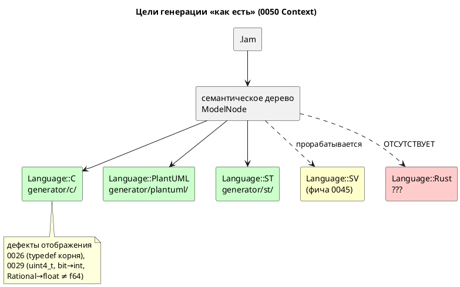
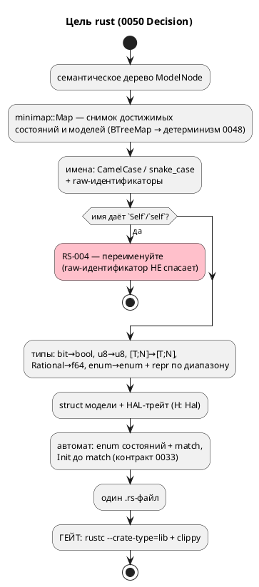

# Фича: Генератор генерации в Rust

- **Номер:** 0050
- **Статус:** ГОТОВО
- **Зависит от:** `нет`;
  содержательных зависимостей не найдено (разбор — [анализ](0050-rust-backend.md#анализ),
  раздел «Зависимости фичи»). Статус **`ЗАБЛОКИРОВАНА` не ставится**, фичу можно
  брать в работу сразу.
- **Приоритет / Tier:** **Tier 2 (высокий)** — профильная фича (правило 12),
  заведена **по прямому запросу заказчика**. Пятый целевой язык; закрывает контур
  **безопасных прошивок**: та же ниша, что у цели `c` (микроконтроллер, HAL,
  жёсткое реальное время), но без класса дефектов памяти. Сопоставима по объёму с
  0041/0045 (8 подзадач) и **ниже обеих по риску**: проверка не требует установки
  инструментов (см. «Проверяемость»).
- **Крейт:** `grammar` (минорный рост версии крейта; **версия языка не меняется**
  — синтаксис и семантика `.lam` не тронуты, правило 22)
- **Связанные issue (анализ):** **новая фича по прямому запросу заказчика**
  (2026-07-16); в блоке «Кандидаты в фичи» `FEATURES.md` отсутствовала.

## Стадии жизненного цикла (правило 17)

Все стадии — **разделы этой карточки** (правило 32): «Архитектура (ADR)»,
«Анализ», «Разработка», «Тест-план», «Отчёт о тестировании», «Итог».
Отдельным артефактом остаются только исправления —
[`docs/fixes/`](../fixes/README.md) (при необходимости `0050-YY-*`).

## Краткое описание

Пятый целевой язык генерации наряду с C, PlantUML, ST и (прорабатываемым
параллельно) SystemVerilog. `generator::Language` получает вариант `Rust`, а
`grammar/src/generator/rust/` транслирует семантическое дерево в **`no_std`
Rust** — прошивку для микроконтроллера.

Ключевые решения ([ADR](0050-rust-backend.md#архитектура-adr)); **профиль и форма вывода —
решение заказчика 2026-07-16**:

- **Профиль: `no_std`-прошивка** — прямой аналог цели `c`, а не хостовая
  библиотека. `#![no_std]`, без `alloc`.
- **Форма вывода: один `.rs`-файл** (как `.h`/`.c` у цели `c`), подключается
  пользователем через `mod`. `Cargo.toml` генератор **не** порождает и им не
  владеет.
- **Порты: HAL-трейт** вместо пары указателей на функции и `void *userdata` цели
  `c`. Параметр типа `H: Hal` несёт состояние HAL — `userdata` исчезает как
  понятие вместе со своей небезопасностью.
- **Типы: нативное соответствие.** `bit` → `bool`, `[u8; 4]` → `[u8; 4]`,
  `enum` → `enum`, `u8` → `u8`, `Rational` → `f64` (**как в симуляторе**).
- **Автомат:** состояния → `enum` + `match` (не целочисленные константы);
  контракт [ADR](0033-init-tick-alignment.md#архитектура-adr) (вход в стартовое
  состояние не расходует такт) воспроизводится диспетчеризацией `Init` **до**
  `match`.

Изменение **аддитивно**: `Language` помечен `#[non_exhaustive]`, существующие
цели байт-в-байт не меняются, `.lam` не тронут.

> Фича зарегистрирована **по прямому запросу заказчика**; далее проходит
> жизненный цикл по правилу 17. Проработана до стадии **РАЗРАБОТКА** (ADR принят,
> анализ и декомпозиция готовы).

## Зачем: цель `c` уже занимает эту нишу

Ниша та же — прошивка МК, — поэтому фича обязана отвечать, что даёт Rust сверх C.
Ответ **не** «Rust лучше», а конкретные, зафиксированные в репозитории дефекты
цели `c`, которые в Rust **не воспроизводятся by construction**:

| Дефект цели `c` | В Rust |
|---|---|
| [генератор C: typedef корневой структуры для одиночной модели](0026-c-root-typedef.md): нет typedef корня → порождённый C **не компилируется** для модели без под-моделей | тип корня — обычная `struct`, отдельного объявления не требует |
| [генератор C: отображение типов Array/Bit/Rational](0029-c-type-mapping.md): `[u8; 4]` → `uint4_t` (несуществующий тип), `bit` → `int`, `Rational` → `float` ≠ f64 симулятора | `[u8; 4]` → `[u8; 4]`, `bit` → `bool`, `Rational` → `f64` — **точное** соответствие |
| `void *userdata` + указатели на функции: типобезопасности нет | `H: Hal` — параметр типа, проверяется компилятором |
| Класс дефектов памяти (UB, выход за границы массива) | безопасное подмножество: `unsafe` в порождаемом коде **отсутствует** |

Цель `rust` — не дубликат `c`, а тот же контур **без** известных дефектов
отображения и без класса ошибок памяти. Цель `c` при этом не трогается.

## Проверяемость: доказана до начала разработки

Планка задана фичей (проверяемость доказывается **пробой**, а не
рассуждением). Здесь она **выше**: проверка — `rustc` и `clippy`, которые **уже
являются зависимостями проекта**. Ставить нечего (ср. 0041: MatIEC `iec2c` —
главный риск фичи, собирается из исходников; 0045: `brew install verilator
yosys`).

Пробы проведены при проработке (2026-07-16): целевой модуль по решению ADR
написан **руками** по образцу `examples/elevator_mini.lam` и прогнан.

| Проба | Результат |
|---|---|
| Целевой модуль (`no_std`, HAL-трейт, `Cabin \| Motor`, enum-состояния) | `rustc --crate-type=lib` — **код 0** (4 предупреждения) |
| Он же под `-D warnings` (задуманный проверка) | **код 1**: `dead_code` на вариантах `End`/`Tick` |
| `clippy -D warnings` | **код 1**, те же замечания |
| Имя `Self`/`self` у состояния или модели | **отвергнуто**; `r#Self` запрещён отдельно («`Self` cannot be a raw identifier») |
| Имя `Box`/`Option` (тень прелюдии) | **принято** — ловушки стандартной библиотеки, как у 0041 (`Concat`), **нет** |
| `#[repr(u8)] enum { Idle = 670 }` (`elevator.lam:121`) | **отвергнуто** («literal out of range»); `repr(u16)` — принято |
| `no_std` + `f64` (`+ - * /`, сравнение) | принято |
| `no_std` + `abs`/`min`/`max`/`clamp` (все встроенные функции Lam на `f64` и `u8`) | принято — **`libm` не нужен** |
| `no_std` + `assert!` (guard-формулы 0044) | принято — `assert!` живёт в `core` |
| `no_std` + `f64::sqrt` | метода нет (нужен `libm`) — **в Lam `sqrt` отсутствует**, цена нулевая |

**Главные находки** (обе меняют план разработки):

1. **Зеркальная калька с C проверка не проходит.** C-генератор эмитит состояния `_END`
   и `_TICK`, которые для конкретной модели никогда не конструируются; в C это
   молча, в Rust `dead_code` валит `-D warnings`. Решение — в
   [ADR](0050-rust-backend.md#архитектура-adr).
2. **Ловушка имён ровно одна и узкая:** `Self`/`self`. Всё прочее спасается
   CamelCase (`type` → `Type`) или raw-идентификатором; `Self` не спасается
   **ничем** и требует диагностики.

## Декомпозиция (см. [анализ](0050-rust-backend.md#анализ))

| Задача | Содержание |
|---|---|
| **0050-01** | Каркас: `Language::Rust`, `generator/rust/`, `RustMap`, цель `-t rust`, `compile_to_rust` |
| **0050-02** | **Проверка проверяемости:** `rustc` + `clippy` по порождённым `.rs` в `precheck.sh`/CI; решение по `-D warnings` |
| **0050-03** | Отображение типов Lam → Rust + диагностики (`repr` enum по диапазону, массивы, `bit`, `Rational`) |
| **0050-04** | Имена: `CamelCase`/`snake_case`, raw-идентификаторы, коллизия `Self` → `RS-004` |
| **0050-05** | Модель и порты: `struct` модели, HAL-трейт, `in`/`out`, `inout` |
| **0050-06** | Автомат: состояния (`enum` + `match`), переходы, контракт 0033, композиция `+` / `\|` |
| **0050-07** | Выражения, условия, функции (`fn`, `extern fn`, встроенные, `debug` в `no_std`) |
| **0050-08** | Примеры, контрпримеры, документация (правила 15, 16) |

## Состояние реализации (2026-07-16)

Все восемь задач выполнены. **Весь корпус `examples/` порождает `.rs`**, и
**четыре примера из пяти проходят проверка `rustc` + `clippy` под `-D warnings`**;
пятый (`comprehensive.lam`) отвергается по дефекту **самого примера** —
см. ниже.

| Задача | Состояние |
|---|---|
| 0050-01 каркас | **готово** |
| 0050-02 проверка + политика линтов | **готово** — решение R9: вариант (а), `-D warnings`; контроль проверки проверен |
| 0050-03 типы + `repr` по диапазону | **готово** |
| 0050-04 имена, `RS-004`/`RS-005` | **готово** |
| 0050-05 модель, HAL-трейт, `inout` | **готово** (`inout` поддержан) |
| 0050-06 автомат | **готово**, включая композицию `+` (`rust_model::concat_steps`) |
| 0050-07 выражения, `fn`, `debug`, `extern fn` | **готово**, включая `fn` с доступом к состоянию модели (`rust_needs`) |
| 0050-08 документация | **готово** (README, CHANGES, CLAUDE.md) |

**Сверх задач: проверка исполнения** (`examples/generated/rust/`, `precheck.sh`).
Cargo-пакет над порождёнными примерами и по `main`-у на модель: автомат
прогоняется на подставном железе, наблюдаемое поведение проверяется `assert!`.
Мотив — граница проверки: `rustc` + `clippy` доказывают, что вывод
**компилируется**, а молча неверная трансляция (перепутанный приоритет,
потерянный переход, не тот операнд) компилируется тоже; ловит её только прогон.
Пакет **вне workspace** (порождаемое содержимое не должно попадать под `cargo
check`/`clippy` корня), рукописный каркас — в `src/`, иначе гейт `no_std` из
0050-02 завернул бы в `#![no_std]`-крейт и `main`-ы, которые печатают.
Проверка `comprehensive` закрепляет **реальное** поведение дефектного примера
(`Heating` не выпускает), а не заявленное: на верной трансляции
дефектного примера она обязана проходить. Исправление её уронит — намеренно.

**`RS-021` и `RS-017` сняты.** Как именно:

- **Последовательная композиция `+`** — счётчик шага отдельным приватным `enum`
  на состояние (`ElevatorMiddleSeq`) плюс поле `{state}_seq`; передача хода
  стоит такта, как в C. Вложенная параллельная группа — шаг наравне с моделью
  (`Engine + (Engine | Engine) + Engine + …`, `elevator.lam`). Вложенная `+`
  внутри шага **отвергается** `RS-021` — цель `c` такой случай молча пропускает,
  оставляя автомат стоять.
- **`fn`, читающая состояние модели** — нужда раскладывается на две
  составляющие и передаётся **параметрами** (`rust_needs::FnNeeds`): порт /
  `extern fn` / `debug` → `hal: &mut H`; переменная модели → параметр по
  значению. Транзитивно по графу вызовов (рекурсия запрещена `SE-053`, значит
  граф — даг). Тот же приём, что `shared_variables` у `tick`, и та же развилка,
  которую `st` решает через `VAR_IN_OUT`.

**Находки, уточняющие ADR (R2):** `#![no_std]` в порождённом файле **не
эмитится** — атрибут допустим только в корне крейта, и в модуле под `mod` даёт
предупреждение, то есть ломал бы сборку пользователя под `-D warnings`. `no_std`
доказывает проверка, оборачивая вывод в корень с `#![no_std]`. Подробности — в
[генератор генерации в Rust](0050-rust-backend.md#разработка).

**Находка о корпусе:** `comprehensive.lam` содержит `temperature <= 0` при
`temperature : u8` — clippy прав (`absurd_extreme_comparisons`: на беззнаковом
это может значить только `== 0`). Дефект **примера**, а не трансляции; C
проглатывает его молча. Принадлежит фиче
[исправление примера comprehensive.lam (недостижимый сценарий)](0030-comprehensive-example-fix.md); проверка пропускает файл **громко**.

**Кандидат, вскрытый реализацией:** общие переменные корня передаются
под-модели по одной, и у `MovementController` (`stacker.lam`) их девять — такт
получает 10 параметров, что упирается в порог `clippy::too_many_arguments` (7).
Арность диктует модель, а не стиль, поэтому линт глушится точечно на самом
методе; системное лечение — свернуть общие переменные в структуру `Shared` и
передавать `&mut Shared`.

**Находка, уточняющая ADR (R2):** `#![no_std]` в порождённом файле **не
эмитится** — атрибут допустим только в корне крейта, и в модуле под `mod` даёт
предупреждение, то есть ломал бы сборку пользователя под `-D warnings`. `no_std`
доказывает проверка, оборачивая вывод в корень с `#![no_std]`. Подробности — в
[генератор генерации в Rust](0050-rust-backend.md#разработка).

**Находка о корпусе:** `comprehensive.lam` содержит `temperature <= 0` при
`temperature : u8` — clippy прав (`absurd_extreme_comparisons`: на беззнаковом
это может значить только `== 0`). Дефект **примера**, а не трансляции; C
проглатывает его молча. Принадлежит фиче
[исправление примера comprehensive.lam (недостижимый сценарий)](0030-comprehensive-example-fix.md); проверка пропускает файл **громко**.

## Ключевые ограничения (документируются, правило 15)

- **`debug` в `no_std` напрямую не транслируется** — printf нет. Решение (метод
  HAL / отбрасывание / диагностика).
- **`extern fn`** требует решения о форме (метод HAL против `extern "C"`). Затрагивает `elevator.lam` (8 шт.), `comprehensive.lam` (2),
  `extend_complex.lam` (1).
- **Флагманский пример цели — `elevator_mini.lam`**: 0 `extern fn`, 0 `float`,
  0 `inout`, параллельная композиция `Cabin | Motor`, enum, порты (проверено
  `grep` по корпусу).
- **Карта адресов [адрес порта — размещение и потребление (карта адресов)](0020-port-address-decl.md) не потребляется**: порты
  идут через HAL-трейт, как в режиме `c` (не `c-hal`). MMIO-режим — кандидат.
- **`alloc` не используется**: динамических структур в Lam нет.

## Архитектура (ADR)

- **Status:** Accepted
- **Date:** 2026-07-16
- **Authors:** Архитектор + системный аналитик (ключевые развилки «профиль цели»
  и «форма вывода» — решение заказчика 2026-07-16)
- **Related issues:** [Фича](0050-rust-backend.md); наследует
  контракт такта из [ADR](0033-init-tick-alignment.md#архитектура-adr) (вход в стартовое
  состояние не расходует такт) и принцип «громкий отказ вместо тихого пропуска»
  из [ADR](0025-simulator-expression-eval.md#архитектура-adr)/[ADR](0028-c-generator-stubs.md#архитектура-adr);
  повторяет структуру решения соседних генераторов [генератор генерации в Structured Text (IEC 61131-3)](0041-st-backend.md#архитектура-adr) (ST) и
  [генератор генерации в SystemVerilog](0045-sv-backend.md#архитектура-adr) (SV).

### Context

`generator::Language` (`generator/mod.rs:13`, помечен `#[non_exhaustive]`) имеет
три варианта — `C`, `PlantUML`, `ST`; диспетчер `generate()` выбирает генератор
по варианту, каждый реализует трейт `Generator`. Добавление цели — **аддитивная**
операция: новый вариант + модуль `generator/<lang>/`.

Заказчик запросил (2026-07-16) пятый целевой язык — **Rust**.

**Ниша занята.** Rust на микроконтроллере попадает ровно в контур цели `c`:
прошивка, HAL, жёсткое реальное время. Поэтому первый вопрос ADR — не «как», а
«зачем»: чем цель `rust` отличается от `c`, кроме синтаксиса. Ответ обязан быть
предметным, иначе фича — дубликат.

Предметный ответ есть, и он записан в самом репозитории: у цели `c` **открытые
дефекты отображения**, которые в Rust не воспроизводятся by construction:

| Факт (проверен чтением кода) | Место |
|---|---|
| Для модели без под-моделей typedef корня не эмитится → порождённый C **не компилируется** (8 ошибок `cc`) | [генератор C: typedef корневой структуры для одиночной модели](0026-c-root-typedef.md) |
| `Array(size, elem)` → `uint{size}_t`, где `size` — **число элементов**: `[u8; 4]` → `uint4_t` (типа не существует) | `generator/c/mod.rs:150`, [генератор C: отображение типов Array/Bit/Rational](0029-c-type-mapping.md) |
| `Bit` → `int`; `Rational` → `float` (f32), тогда как симулятор считает в **f64** | там же |
| Порты — `void (*write_bit)(port, bool, void *userdata)` + `void *userdata`: типобезопасности нет | `examples/generated/c/elevator_mini.h` |

В Rust каждый из четырёх пунктов исчезает не «благодаря аккуратности», а
конструктивно: `[u8; 4]` — нативный тип, `bit` — `bool`, `Rational` — `f64`
(совпадает с симулятором → сверка потактовых трасс достижима, чего для `float`
цель `c` не даёт), `userdata` заменяется параметром типа `H: Hal`.

**Что уже готово и переиспользуется** (проверено чтением кода):

| Готово | Место |
|---|---|
| Диспетчер целей + трейт `Generator` + `GenerateOptions` | `generator/mod.rs:95` |
| Печать с отступами (общий слой) | `generator/indent.rs` |
| Снимок достижимых состояний/моделей (`minimap::Map`, `BTreeMap` → детерминизм) | `semantic/minimap.rs`, [детерминированная генерация кода (единый порядок эмиссии)](0048-deterministic-codegen.md) |
| Образец обхода переходов | `generator/c/c_model.rs:430` |
| Контракт такта (INIT не расходует такт) | [ADR](0033-init-tick-alignment.md#архитектура-adr) |

**Общий слой генераторов не заводится** — по тому же решению, что и для 0045
(`FEATURES.md`: «0045 каркаса не ждёт»): `Language` уже расширяем, а вычленять
общий каркас на третьем-пятом генераторе — преждевременное обобщение.

#### Ключевые развилки (вынесены заказчику)

Технически Rust допускает несколько несовместимых прочтений цели; выбор —
продуктовое решение, а не техническое:

1. **Профиль:** `no_std`-прошивка (аналог `c`) против хостовой `std`-библиотеки
   против «ядро + `std` по feature».
2. **Форма вывода:** один `.rs` против готового крейта (`Cargo.toml` +
   `src/lib.rs`).

#### Поток «как есть»



### Decision Drivers

1. **Профильная цель (правило 12).** Прошивки промышленных систем управления —
   прямое назначение DSL; Rust даёт тот же контур без класса ошибок памяти.
2. **Не дубликат.** Фича обязана давать то, чего цель `c` не даёт; иначе она —
   вторая реализация того же с теми же дефектами.
3. **Проверяемость до разработки** (планка 0045). Порождённый код обязан
   проверяться автоматически, проверкой, а не глазами.
4. **Аддитивность.** Существующие цели и `.lam` не трогаются; версия языка не
   растёт (правило 22).
5. **Соразмерность.** Первый срез обязан быть цельным и завершаемым; расширения
   (MMIO, `std`-слой) строятся поверх.
6. **Честная граница** (наследие 0025/0028): что не транслируется — диагностика,
   а не тихий пропуск.

### Considered Options

#### Развилка 1: профиль цели

##### Option A (принимается). `no_std`-прошивка — аналог цели `c`

`#![no_std]`, без `alloc`; порты через HAL-трейт; вывод — библиотечный модуль,
который пользователь подключает в свою прошивку.

**Pros:**
- Прямое попадание в профиль DSL (правило 12) — тот же контур, что у `c`.
- Даёт содержательную дельту к `c` (драйвер 2): нативные типы + отсутствие
  `unsafe` в порождаемом коде.
- Проверено пробой: `no_std` + `f64`-арифметика + все встроенные функции Lam
  (`abs`/`min`/`max`/`clamp`) + `assert!` компилируются **без `libm`**.
- Работает и на хосте: `no_std`-библиотека подключается из `std`-крейта без
  оговорок (обратное неверно).

**Cons:**
- `debug` (встроенная функция Lam) в `no_std` не имеет printf — требуется решение
  (0050-07).
- HAL-трейт нужно спроектировать (в хостовом варианте порты были бы просто
  полями).

##### Option B. Хостовая `std`-библиотека

**Pros:**
- Проще: ни HAL, ни ограничений `no_std`; `debug` → `println!`.

**Cons:**
- **Мимо профиля** (драйвер 1): на МК не поставить, то есть нишу цели `c` не
  закрывает — получается оснастка для тестов, а её роль уже играет крейт
  `simulation`.
- Дельта к `c` теряется: сравнивать не с чем.

##### Option C. Ядро `no_std` + `std`-слой по cargo feature

**Pros:**
- Покрывает оба сценария одним генератором.

**Cons:**
- Требует решить состав feature-флагов **и** владеть `Cargo.toml` (иначе
  feature негде объявить) — тянет за собой развилку 2 в сторону крейта.
- Проверка удваивается: обязаны проверяться обе сборки (`--no-default-features` и
  `--features std`).
- Несоразмерно первому срезу (драйвер 5); `no_std`-ядро (Option A) и так
  подключается из `std`-крейта, то есть выгода мнимая.

#### Развилка 2: форма вывода

##### Option A (принимается). Один `.rs`-файл

**Pros:**
- Симметрия с прочими целями (`.h`/`.c`, `.st`, `.puml`) — `examples/generated/`
  и проверка детерминизма 0048 работают без исключений.
- Генератор **не владеет** метаданными пакета (имя, версия, edition,
  зависимости) — их владелец пользователь.
- Проверка прост и быстр: `rustc --crate-type=lib` без сети и без `cargo`.

**Cons:**
- Не собирается «из коробки» — нужен `mod` в крейте пользователя.

##### Option B. Готовый крейт (`Cargo.toml` + `src/lib.rs`)

**Pros:**
- Собирается сразу.

**Cons:**
- Генератор начинает владеть `Cargo.toml`: имя пакета, версия, edition,
  зависимости — вопросы без хорошего умолчания, и каждый становится развилкой.
- Проверка тяжелее (`cargo build`, сеть при зависимостях), ломает симметрию
  `examples/generated/`.

### Decision

Принимаются **Option A по обеим развилкам** — решение заказчика 2026-07-16:
**`no_std`-прошивка**, вывод — **один `.rs`-файл**.

Отсюда вытекает целевая форма (написана руками и **проверена компиляцией** при
проработке — см. «Проверяемость» в карточке фичи):

```rust
#![no_std]

pub enum InBitPort { MotorSensorU, /* … */ }
pub enum OutBitPort { MotorUp, /* … */ }

pub trait Hal {
    fn read_bit(&mut self, port: InBitPort) -> bool;
    fn write_bit(&mut self, port: OutBitPort, value: bool);
}

pub struct ElevatorMini<H: Hal> {
    command: Command,          // enum Lam → enum Rust
    current_floor: u8,         // u8 → u8
    state: RootState,          // состояние → enum, не целое
    motor: MotorState,         // под-модели — поля
    cabin: CabinState,
    hal: H,                    // вместо void *userdata
}

impl<H: Hal> ElevatorMini<H> {
    pub fn tick(&mut self) {
        if self.state == RootState::Init {   // контракт 0033: вход не стоит такта
            self.state = RootState::Main;
        }
        match self.state { /* … */ }
    }
}
```

#### Частные решения (следствия принятых опций)

| Вопрос | Решение | Основание |
|---|---|---|
| Состояния | `enum` + `match` | тип, а не «целое с константами»; исчерпывающий `match` проверяется компилятором |
| Такт | `Init` диспетчеризуется **до** `match` | контракт [ADR](0033-init-tick-alignment.md#архитектура-adr) — сдвиг тактов 0 |
| `bit` | `bool` | точное соответствие (в `c` — `int`) |
| `Rational` | `f64` | совпадает с симулятором → сверка трасс достижима (в `c` — `float`) |
| `[T; N]` | `[T; N]` | нативно (в `c` — `uint4_t`) |
| `enum` Lam | `enum` + `#[repr(uN)]`, **разрядность по диапазону вариантов** | проба: `#[repr(u8)] Idle = 670` отвергается; тот же урок, что у ST |
| Порты | HAL-трейт, `H: Hal` | заменяет `void *userdata`; типобезопасно |
| Guard-формулы (0044) | `assert!` | проба: `assert!` в `core`, `no_std` её не теряет |
| Карта адресов (0020) | **не потребляется** | порты идут через HAL — режим `c`, а не `c-hal` |
| `unsafe` | **не эмитится** | вся дельта к `c` в этом; `#![forbid(unsafe_code)]` — кандидат в 0050-02 |

#### Целевой поток (правило 18)



### Consequences

#### Положительные

- Пятый целевой язык; контур безопасных прошивок закрыт.
- **Дефекты отображения цели `c` (0026, 0029) в цели `rust` отсутствуют
  конструктивно**; `Rational` → `f64` впервые делает достижимой потактовую сверку
  вещественных с симулятором (у `c` — `float`, точность не совпадает).
- Проверка **бесплатен**: `rustc`/`clippy` уже зависимости проекта. Риск «инструмент
  не проверен» (главный у 0041) отсутствует.
- Порождаемый код без `unsafe` — класс дефектов памяти не воспроизводится.

#### Отрицательные / Action items

- **A1. Калька с C не проходит проверка.** Проба: `-D warnings` падает на `dead_code`
  (варианты `End`/`Tick`, которые C эмитит всегда, а модель не конструирует).
  Решить в 0050-02: (а) не эмитить недостижимые варианты; (б) `#[allow(dead_code)]`
  на state-enum; (в) проверка без `-D warnings`. Предпочтение — (а), но требует
  анализа достижимости; (б) — глушение линта, применять только с обоснованием.
- **A2. `Self`/`self` в имени** состояния или модели непредставим: raw-идентификатор
  запрещён отдельным правилом языка («`Self` cannot be a raw identifier»).
  Диагностика `RS-004` (0050-04), не тихое переименование.
- **A3. Разрядность `#[repr]`** считается по диапазону вариантов, а не берётся
  `u8` (проба: `Idle = 670` из `elevator.lam:121` в `u8` не влезает).
- **A4. `debug` в `no_std`** printf не имеет — решение в 0050-07 (метод HAL /
  отбрасывание с диагностикой). Тихо ронять **нельзя** (наследие 0035).
- **A5. `extern fn`** — форма (метод HAL против `extern "C"`) решается в 0050-07;
  затрагивает 3 примера корпуса.
- **A6. Ловушки стандартной библиотеки нет** (в отличие от 0041, где `Concat`
  ломал ST): проба показала, что `Box`/`Option` как имена принимаются. Отдельная
  задача не заводится.
- **A7. Версия языка не растёт** (правило 22): синтаксис не тронут, цель
  аддитивна (прецеденты `lamc fmt` 0024, `lamc verify` 0049).
- **A8. Кандидаты-расширения** (вносит координатор, правило 7): (1) MMIO-режим
  `rust-hal` (потребление карты адресов 0020 по образцу `c-hal`); (2) `std`-слой
  по cargo feature (отвергнутый Option C развилки 1); (3) генерация тестбенча и
  потактовая сверка с симулятором по образцу; (4) `#![no_main]`/точка
  входа прошивки.

#### Acceptance criteria

1. `lamc compile -t rust <file>` порождает `.rs` для всего корпуса `examples/`
   (кроме случаев с заявленной диагностикой).
2. **Проверка зелёный:** порождённый `.rs` принимается `rustc --crate-type=lib` и
   `clippy` на политике, зафиксированной решением A1 (`precheck.sh` + CI).
3. Флагман `elevator_mini.lam` порождает компилируемый модуль с HAL-трейтом и
   параллельной композицией `Cabin | Motor`.
4. Отображение типов: `bit` → `bool`, `[u8; 4]` → `[u8; 4]`, `u8` → `u8`,
   `Rational` → `f64`, `enum` → `enum` с `repr` по диапазону — тесты на каждый.
5. Имя, дающее `Self`/`self`, даёт `RS-004`; прочие коллизии решаются
   CamelCase/raw-идентификатором — тесты на пример и контрпример.
6. Непереводимая конструкция даёт **диагностику**, а не тихий пропуск (`debug`,
   `extern fn`, `inout` — по решениям/07).
7. Контракт [согласование тактов симулятора и порождённого C (INIT-такты)](0033-init-tick-alignment.md#архитектура-adr): вход в стартовое состояние не
   расходует такт — потактовая сверка с симулятором на флагмане.
8. Генерация **детерминирована** (проверка: два прогона → `diff -r` пуст).
9. Цели `c`/`c-hal`/`plantuml`/`st` **байт-в-байт неизменны**; версия языка не
   изменена.
10. `./scripts/precheck.sh` зелёный; `unsafe` в порождённом коде отсутствует.

## Анализ

### Цель и контекст

Пятая цель генерации: `.lam` → **`no_std` Rust** (прошивка МК). Профиль и форма
вывода — решение заказчика 2026-07-16 (ADR, развилки 1 и 2): `no_std` + один
`.rs`-файл; порты через HAL-трейт.

Ниша совпадает с целью `c`, поэтому смысл фичи — в **дельте**: у `c` есть
открытые дефекты отображения ([генератор C: typedef корневой структуры для одиночной модели](0026-c-root-typedef.md) —
порождённый C не компилируется для модели без под-моделей;
[генератор C: отображение типов Array/Bit/Rational](0029-c-type-mapping.md) — `[u8;4]` → `uint4_t`, `bit` → `int`,
`Rational` → `float` ≠ f64 симулятора) и `void *userdata` без типобезопасности. В
Rust всё это не воспроизводится конструктивно (ADR, Context).

Все утверждения ниже, помеченные «проба», получены **фактическим прогоном**
инструментов при проработке — не рассуждением (планка задана фичей).

### Зависимости фичи (правило 17/19)

- **Зависит от:** `нет`. Проверены кандидаты в зависимости:

  | Фича | Проверка | Вывод |
  |---|---|---|
  | [генератор C: typedef корневой структуры для одиночной модели](0026-c-root-typedef.md), [генератор C: отображение типов Array/Bit/Rational](0029-c-type-mapping.md) (дефекты `c`) | правки лежат в `generator/c/` | **не зависит**: у цели `rust` свой модуль; дефекты — мотивация, а не зависимость |
  | [согласование тактов симулятора и порождённого C (INIT-такты)](0033-init-tick-alignment.md) (INIT-такт) | `ГОТОВО`; задаёт **контракт** для будущих генераторов | **не зависит** (контракт исполняем, не блокирует) |
  | [детерминированная генерация кода (единый порядок эмиссии)](0048-deterministic-codegen.md) (детерминизм) | `ГОТОВО`; `minimap::Map` и словари — `BTreeMap` | **не зависит**; детерминизм цели получается даром |
  | [адрес порта — размещение и потребление (карта адресов)](0020-port-address-decl.md) (адреса портов) | карта не потребляется (порты через HAL) | **не зависит**; MMIO-режим — кандидат |
  | [генератор генерации в Structured Text (IEC 61131-3)](0041-st-backend.md) (ST), [генератор генерации в SystemVerilog](0045-sv-backend.md) (SV) | оба `РАЗРАБОТКА`; общий слой генераторов **не заводится** (решение из `FEATURES.md`) | **не зависит**; работы независимы |
  | [разделение переросших модулей (validate.rs, lsp.rs, c_expr.rs)](0027-module-size-split.md) (размер модулей) | новый модуль пишется сразу дробно (≤ ~1000 строк) | **не зависит** |

- **Влияние на порядок разработки:** фичу можно брать сразу, `ЗАБЛОКИРОВАНА` не
  ставится. Ни одну фичу она не разблокирует и ни одной не мешает: изменения
  аддитивны (новый вариант `#[non_exhaustive] enum Language` + новый модуль).
  Пересмотр последовательности не требуется; в таблице `FEATURES.md` встаёт
  рядом с прочими Tier 2.

### Требования и проверяемые условия

- **R1. Аддитивность.** `Language::Rust` + `generator/rust/` + цель `-t rust` +
  `compile_to_rust`. Вывод целей `c`/`c-hal`/`plantuml`/`st` **байт-в-байт**
  неизменен; `grammar.lalrpop` и версия языка не тронуты (правило 22).
- **R2. Профиль `no_std`.** Порождаемый модуль начинается с `#![no_std]`, не
  использует `alloc` и `std`. Проба: `no_std` + `f64`-арифметика + `abs`/`min`/
  `max`/`clamp` + `assert!` компилируются **без `libm`**; `sqrt` требует `libm`,
  но в Lam его нет (встроенные функции — `debug`, `S`, `min`, `max`, `abs`,
  `clamp`; README).
- **R3. Отображение типов — нативное.** `bit` → `bool`; `u8`/`u16`/… → `u8`/`u16`;
  `[T; N]` → `[T; N]`; `Rational` → `f64` (как в симуляторе); `enum` → `enum`.
  Непереводимый тип — **диагностика**, не молчание (наследие 0028).
- **R4. Разрядность `#[repr]` — по диапазону вариантов.** Проба:
  `#[repr(u8)] enum { Idle = 670 }` (`elevator.lam:121`) отвергается («literal
  out of range for `u8`»), `#[repr(u16)]` принимается. Брать `u8` по умолчанию
  **нельзя** — тот же урок, что у ST-генератора (`CLAUDE.md`).
- **R5. Имена.** Состояния/модели → `CamelCase`, переменные/функции →
  `snake_case`. Коллизия с ключевым словом решается raw-идентификатором
  (`r#type`), **кроме** `Self`/`self`: проба — `enum State { Self }` отвергнут,
  `r#Self` отвергнут отдельно («`Self` cannot be a raw identifier»). Такое имя →
  диагностика `RS-004`. Тень прелюдии (`Box`, `Option`) — **не** ошибка (проба:
  принято), ловушки уровня 0041 (`Concat`) нет.
- **R6. Порты — HAL-трейт.** `in`/`out` → методы `read_*`/`write_*` трейта `Hal`;
  состояние HAL несёт параметр типа `H: Hal` (замена `void *userdata`). `inout` —
  решение и диагностика в 0050-05.
- **R7. Автомат.** Состояния → `enum` + `match`; переходы — по образцу
  `c_model.rs:430`. Контракт [согласование тактов симулятора и порождённого C (INIT-такты)](0033-init-tick-alignment.md#архитектура-adr): вход в
  стартовое состояние **не расходует такт** — `Init` диспетчеризуется до `match`.
  Композиция `+` / `|` — под-модели полями, тикают в порядке C-генератора.
- **R8. Проверка.** Порождённый `.rs` проверяется `rustc --crate-type=lib` и
  `clippy` в `precheck.sh` и CI. Инструменты — **уже зависимости проекта**
  (установки не требуют).
- **R9. Политика линтов.** Проба: калька с C **не проходит** `-D warnings`
  (`dead_code` на вариантах `End`/`Tick`). Требуется явное решение (0050-02):
  не эмитить недостижимое / `#[allow]` / проверка без `-D warnings`.
- **R10. Безопасность.** `unsafe` в порождаемом коде отсутствует (проверяется
  `grep`; кандидат — `#![forbid(unsafe_code)]` в шапке модуля).
- **R11. Детерминизм.** Два прогона `lamc compile -t rust` дают идентичный вывод
  (проверка — цель добавляется в его список).
- **R12. Честная граница.** `debug`, `extern fn`, `inout`, непереводимые типы —
  диагностика с кодом `RS-0xx`, а не тихий пропуск (наследие 0025/0028/0035).

### Критерии приёмки и способ проверки

| # | Критерий | Способ проверки |
|---|---|---|
| A1 | `-t rust` порождает `.rs` для всего корпуса `examples/` (кроме заявленных диагностик) | прогон `lamc compile -t rust` по корпусу |
| A2 | Порождённый `.rs` принимается `rustc --crate-type=lib` | проверка в `precheck.sh` |
| A3 | Порождённый `.rs` принимается `clippy` на политике R9 | проверка в `precheck.sh` |
| A4 | Флагман `elevator_mini.lam` даёт модуль с HAL-трейтом и композицией `Cabin \| Motor` | codegen-снапшот + проверка |
| A5 | Типы: `bit`→`bool`, `[u8;4]`→`[u8;4]`, `u8`→`u8`, `Rational`→`f64`, `enum`→`enum` | юнит-тесты на каждый |
| A6 | `enum` с вариантом 670 даёт `repr(u16)`, а не `u8` | тест на `elevator.lam` |
| A7 | Имя `Self`/`self` → `RS-004`; `type`/`match` → спасаются | тесты: пример и контрпример |
| A8 | Непереводимое даёт диагностику, не тихий пропуск | тесты на `debug`/`extern fn`/`inout` |
| A9 | Контракт 0033: сдвиг тактов = 0 | потактовая сверка с симулятором на флагмане |
| A10 | Генерация детерминирована | проверка: два прогона → `diff -r` пуст |
| A11 | Цели `c`/`c-hal`/`plantuml`/`st` байт-в-байт неизменны; версия языка не изменена | `git diff examples/generated/`, `grammar.lalrpop` |
| A12 | `unsafe` в порождённом коде отсутствует | `grep -r unsafe examples/generated/rust/` |
| A13 | Регрессий нет | `./scripts/precheck.sh`, `cargo test --all-features` |

### Особенности по обратной функциональности

Единые условия прогоняются против каждой задеваемой функциональности
(правило 11):

| Функциональность | Затронута чем | Как проверяем |
|---|---|---|
| Цели `c`/`c-hal` | ничем (новый модуль) | codegen-снапшоты, проверка `cc` |
| Цель `st` | ничем | проверка `iec2c` |
| Цель `plantuml` | ничем | снапшоты |
| Диспетчер `generate()` | новый вариант `Language` | компиляция (`match` обязан покрыть вариант) |
| CLI `lamc compile` | новое значение `-t` | тесты аргументов, `print_usage` |
| Проверка детерминизма (0048) | добавляется цель в список | два прогона × цели → `diff -r` |
| Симулятор | ничем | `cargo test -p simulation` |

### Риски и зависимости

- **Р1. Калька с C не проходит проверка линтов** (проба: `dead_code` на `End`/`Tick`).
  *Снижение:* решение R9 принимается **в 0050-02, до** написания эмиссии, иначе
  переписывать придётся весь генератор. Наиболее вероятный исход — не эмитить
  недостижимые варианты (анализ достижимости уже есть в `minimap`).
- **Р2. Соблазн заглушить линт.** `#[allow(dead_code)]` закрывает Р1 в одну
  строку, но глушит контроля на всём state-enum. *Снижение:* применять только с
  письменным обоснованием в задаче; предпочтение — не эмитить лишнее.
- **Р3. `debug` в `no_std`.** Прямого printf нет. *Снижение:* решение в 0050-07;
  тихо ронять запрещено (наследие 0035 — там ровно это было дефектом).
- **Р4. Тесты на форму вместо поведения** (капкан 0025, повторно вскрыт исправлением
  [вырожденное условие принятия автомата Бюхи (GPVW)](../fixes/0010-01-buchi-acceptance.md)). *Снижение:* тест-план требует
  проверок **поведения** порождённого кода (компилируется, потактовая сверка), а
  не «в тексте есть подстрока».
- **Р5. Расхождение с симулятором по вещественным.** У цели `c` его гарантирует
  `float` (0029). *Снижение:* `Rational` → `f64` (R3) — расхождения нет by
  construction; проверяется A9.
- **Р6. Размер модуля** (>1000 строк, `CLAUDE.md`). *Снижение:* дробить сразу по
  образцу `generator/c/` (`c_decl`, `c_expr`, `c_model`, …).
- **Зависимостей от других фич нет** (см. раздел «Зависимости фичи»).

### Декомпозиция (задачи разработки)

| Задача | Содержание | Ключевое требование |
|---|---|---|
| [генератор генерации в Rust](0050-rust-backend.md#разработка) | Каркас: `Language::Rust`, `generator/rust/`, `RustMap`, `-t rust`, `compile_to_rust` | R1 |
| [генератор генерации в Rust](0050-rust-backend.md#разработка) | Проверка `rustc` + `clippy`; **решение по политике линтов** | R8, R9 |
| [генератор генерации в Rust](0050-rust-backend.md#разработка) | Отображение типов + диагностики; `repr` по диапазону | R3, R4 |
| [генератор генерации в Rust](0050-rust-backend.md#разработка) | Имена, raw-идентификаторы, `RS-004` на `Self` | R5 |
| [генератор генерации в Rust](0050-rust-backend.md#разработка) | `struct` модели, HAL-трейт, `in`/`out`/`inout` | R6 |
| [генератор генерации в Rust](0050-rust-backend.md#разработка) | Автомат: `enum`+`match`, контракт 0033, композиция | R7 |
| [генератор генерации в Rust](0050-rust-backend.md#разработка) | Выражения, условия, `fn`, `extern fn`, `debug` | R2, R12 |
| [генератор генерации в Rust](0050-rust-backend.md#разработка) | Примеры, контрпримеры, документация | R10, R11 |

## Разработка

### Задача

#### Что было

*Проверено чтением кода 2026-07-16.*

- `generator/mod.rs:13` — `enum Language` помечен `#[non_exhaustive]`, варианты
  `C`, `PlantUML`, `ST`. Комментарий прямо разрешает расширение.
- `generator/mod.rs:95` — трейт `Generator` (`generate(&self, model, output_path,
  options) -> Result<(), Diagnostic>`).
- `generator/mod.rs:105` — диспетчер `generate(l: Language, …)`: `match` по
  варианту, по генератору на ветку.
- `generator/indent.rs` — общий слой печати с отступами (переиспользуется).
- `semantic/minimap.rs` — снимок достижимых состояний/моделей (`BTreeMap` →
  детерминизм).
- `lib.rs` — по функции на цель: `compile_to_c`, `compile_to_c_hal`,
  `compile_to_st`, `compile_to_st_at`, `compile_to_plantuml`.
- `bin/lamc.rs` — цели `c`/`c-hal`/`plantuml`/`st`/`st-at` в `parse_compile_args`
  и `print_usage`.

**Общего слоя генераторов нет и он не заводится** — решение из `FEATURES.md`
(«0045 каркаса не ждёт»): `Language` уже расширяем; вычленять каркас на пятом
генераторе — преждевременное обобщение.

#### Что сделано

> **Реализовано.** (2026-07-16).

1. `Language::Rust` + ветка в диспетчере `generate()`.
2. Модуль `grammar/src/generator/rust/` — сразу дробно (правило «≤ ~1000 строк»,
   образец — `generator/c/`): `mod.rs` (`Generator`, отображение типов),
   `rust_map.rs` (`RustMap` — снимок по образцу `CMap`), далее по задачам
   `rust_decl.rs` / `rust_expr.rs` / `rust_model.rs`.
3. `grammar::compile_to_rust(filename, source, output_path, search_paths,
   options)` — по образцу `compile_to_c`.
4. CLI: значение `rust` для `-t` (`parse_compile_args`), строка в `print_usage`,
   расширение (`.rs`) в выборе имени выходного файла.
5. Каркас эмитит **минимальный компилируемый** модуль (шапка `#![no_std]` +
   пустая `struct` модели) — наполнение в 0050-03…07. Заглушка **не молчит**: не
   реализованная конструкция даёт `Diagnostic`, а не комментарий-заглушку
   (наследие [ADR](0028-c-generator-stubs.md#архитектура-adr): проглоченная ошибка +
   код возврата 0 = мёртвый автомат на объекте).

#### Проверки

- `lamc compile -t rust examples/elevator_mini.lam` создаёт `.rs`; `rustc
  --crate-type=lib` его принимает (каркас обязан компилироваться с первого дня —
  иначе проверка нечем включать).
- **A11:** `git diff examples/generated/` по целям `c`/`c-hal`/`plantuml`/`st`
  пуст; `grammar.lalrpop` и версия языка не тронуты.
- Тесты аргументов CLI: `-t rust` разобран; неизвестная цель по-прежнему ошибка.
- `./scripts/precheck.sh` зелёный.

### Задача

#### Что было

*Проверено пробами 2026-07-16.*

Проверка цели — единственный автоматизируемый способ доказать, что порождённый код
валиден. У соседних генераторов это главный риск:

| Цель | Арбитр | Цена |
|---|---|---|
| `st` (0041) | MatIEC `iec2c` | пакетом не поставляется, собирается из исходников (`scripts/ensure-iec2c.sh`, ≈15 с); **проверка до сих пор не включён** |
| `sv` (0045) | Verilator + yosys | `brew install verilator yosys`; нужны **оба** — ловят непересекающиеся классы |
| `rust` (0050) | **`rustc` + `clippy`** | **ноль**: уже зависимости проекта |

`precheck.sh` уже содержит: проверка `cc` (цель `c`), проверка `iec2c` (подготовлен),
жёсткий проверка детерминизма 0048 (два прогона × цели → `diff -r`).

#### Что сделано

> **Реализовано; решение R9 принято — вариант (а).** (2026-07-16).

1. **Проверка в `precheck.sh`** (по образцу проверки `cc`): по каждому порождённому
   `.rs` — `rustc --edition 2021 --crate-type=lib` и `clippy-driver`; ненулевой
   код валит предкоммит. Инструменты в наличии всегда (это Rust-проект) —
   мягкого пропуска, как у `iec2c`, **не требуется**.
2. **Цель `rust` добавляется в проверка детерминизма 0048** (список целей два
   прогона × `diff -r`).
3. `grep -r unsafe` по `examples/generated/rust/` → пусто (**A12**).
4. **Решение по политике линтов (R9) — главный вопрос задачи.**

##### Находка пробы: калька с C проверка не проходит

Целевой модуль, написанный руками по решению ADR (образец —
`examples/elevator_mini.lam`):

| Прогон | Результат |
|---|---|
| `rustc --crate-type=lib` | **код 0**, 4 предупреждения |
| `rustc --crate-type=lib -D warnings` | **код 1**: `variant End is never constructed` (×2), `variants Tick and End are never constructed` |
| `clippy-driver -D warnings` | **код 1**, то же |

Причина: C-генератор эмитит состояния `_INIT`/`_END`/`_TICK` **всегда**
(`examples/generated/c/elevator_mini.h`: `ELEVATOR_MINI_CABIN_END`,
`ELEVATOR_MINI_MAIN_TICK`), а конкретная модель их не конструирует. В C это
молча — компилятор о неиспользуемом варианте `enum` не говорит. В Rust `dead_code`
превращает это в отказ проверки.

**Варианты решения** (выбрать и обосновать в этой задаче):

| # | Решение | Плюс | Минус |
|---|---|---|---|
| (а) | **Не эмитить недостижимые варианты** | код честен: в `enum` только то, что бывает; линт остаётся контролем | нужен анализ достижимости — но он **уже есть** (`minimap::Map` хранит снимок достижимых состояний; SE-046 считает достижимость) |
| (б) | `#[allow(dead_code)]` на state-enum | одна строка | глушит контроля на **всём** enum: будущая настоящая ошибка эмиссии пройдёт молча |
| (в) | Проверка без `-D warnings` | ничего не менять | предупреждения копятся; «порождённый код чист» перестаёт быть проверяемым утверждением |

**Предпочтение ADR — (а)**; (б) допустимо только с письменным обоснованием в
этой задаче (риск Р2), (в) — ослабление проверки, требует решения заказчика.

##### решение (принято 2026-07-16): вариант (а), проверка с `-D warnings`

Обоснование — пробами, а не рассуждением:

| Проба | Результат | Что из этого следует |
|---|---|---|
| Приватный `enum` с вариантом, не упомянутым нигде | **отказ** (`variant is never constructed`) | контроль работает |
| **`pub enum`** с тем же вариантом | **принято** | «сделать enum публичным» — это вариант (б) **в маскировке**: глушение линта видимостью. Отвергнут |
| Вариант, упомянутый в сравнении (`state == S::End`) | **принято** | упоминание считается конструированием → `End` жив всегда, пока есть `is_done`. Цена решения (а) — только `Tick`, которого в C и так не читает никто |
| Оператор после безусловного перехода | **отказ** (`unreachable statement`) | эмиссию рёбер надо прекращать после безусловного |

**Следствие для формы эмиссии:** перечисления **состояний приватны** (их
придумывает генератор — `dead_code` над ними обязан остаться живым),
пользовательские перечисления **публичны** (их варианты объявил автор `.lam`, это
экспортируемый словарь модуля, а не решение генератора).

**Решение окупилось трижды** — проверка нашёл то, что в C мертво и молча:

1. `reset` под-моделей никто не вызывает (сброс доходит через `init`) → не
   эмитится. В C `_reset` есть у каждой модели и мёртв.
2. `hal` нельзя класть модели, которая его не читает (`field 'hal' is never
   read`) → предикат `needs_hal` считается **транзитивно** (модель без портов
   всё же нуждается в HAL, если он нужен её под-модели — так устроен
   `elevator_mini`).
3. Лишний `mut` у локальной `var` (`unused_mut`) → изменяемость считается по
   факту присваивания (`collect_assigned`), а не по объявлению.

##### Находка: проверка судит обёртку, а не файл

Требование R2 «модуль начинается с `#![no_std]`» реализацией **опровергнуто**:
атрибут допустим только в корне крейта, и в файле, подключённом через `mod`, он
даёт предупреждение «the `#![no_std]` attribute can only be used at the crate
root» — то есть модуль с ним ломал бы сборку пользователя под `-D warnings`,
ровно тем, чем цель хвалится.

`no_std` — свойство **крейта**, а не модуля. Поэтому модуль просто не обращается
к `std`, а проверка кладёт его в корень с `#![no_std]` и компилирует. Это **строже**
проверки файла в одиночку (обращение к `std` всплывёт именно здесь) и заодно
подтверждает обещание ADR «работает и на хосте»: тот же модуль собирается из
`std`-крейта (проверено).

#### Проверки

- Проверка валит предкоммит на **намеренно испорченном** выводе (контроль самого
  проверки: если проверка не умеет краснеть, он не проверка — урок [вырожденное условие принятия автомата Бюхи (GPVW)](../fixes/0010-01-buchi-acceptance.md), где зелёные тесты годами
  прикрывали неверный автомат).
- `./scripts/precheck.sh` зелёный на корпусе.
- Два прогона `-t rust` → `diff -r` пуст (**A10**).
- `grep -r unsafe examples/generated/rust/` → пусто (**A12**).

### Задача

#### Что было

*Проверено чтением кода и пробами 2026-07-16.*

Эталон-антипример — `get_c_type` (`generator/c/mod.rs:150`), у которого **три
зафиксированных дефекта** ([генератор C: отображение типов Array/Bit/Rational](0029-c-type-mapping.md)):

| Lam | C сегодня | Беда |
|---|---|---|
| `Array(size, elem)` | `uint{size}_t`, где `size` — **число элементов** | `[u8; 4]` → `uint4_t` — типа не существует |
| `Bit` | `int` | 4 байта на бит |
| `Rational` | `float` (f32) | симулятор считает в **f64** → сверка вещественных недостижима |

Именно эти дефекты — мотивация фичи (карточка, «Зачем»). Повторить их в
Rust было бы поражением.

Перечисления (`EnumNode`, `semantic/enum_node.rs`) допускают явные значения:
`elevator.lam:121` — `enum Action { Idle = 670, … }`.

#### Что сделано

> **Реализовано.** (2026-07-16).

1. `rust_type(TypeNode) -> Result<String, Diagnostic>` — **нативное**
   соответствие:

   | Lam | Rust | Замечание |
   |---|---|---|
   | `bit` | `bool` | точно (в `c` — `int`) |
   | `u8`/`u16`/`u32`/`u64` | `u8`/`u16`/`u32`/`u64` | точно |
   | `i8`…`i64` | `i8`…`i64` | точно |
   | `[T; N]` | `[T; N]` | **нативно** (в `c` — `uint4_t`) |
   | `Rational` | `f64` | **как в симуляторе** (в `c` — `float`) |
   | `enum E` | `enum E` + `#[repr(uN)]` | разрядность — см. п. 2 |
   | `struct S` | `struct S` | по образцу |

2. **Разрядность `#[repr]` — по диапазону вариантов (R4), не `u8` по умолчанию.**
   Проба:

   ```text
   #[repr(u8)]  enum A { Idle = 670 }   → ОТВЕРГНУТ: literal out of range for `u8`
   #[repr(u16)] enum A { Idle = 670 }   → принят
   ```

   Тот же урок уже получен ST-генератором (`CLAUDE.md`: «Разрядность перечисления
   считается **по диапазону вариантов**, а не берётся `USINT`, как предполагал
   ADR»). Здесь он учтён **до** написания кода.

3. **Никакого тихого пропуска (R12).** Тип, который не отображается, даёт
   `Diagnostic` с кодом `RS-0xx` и позицией в исходнике — не «пропустить поле»
   (в `c` неиспользуемая переменная просто исчезает из структуры,
   `c_header.rs:344`; для цели `rust` такой фильтр — отдельное осознанное
   решение, а не побочный эффект).

4. Умолчание `FloatWidth` не потребляется: `Rational` → всегда `f64`. Флаг
   `--float-width=32` для цели `rust` — **ошибка**, а не молчаливое игнорирование
   (иначе пользователь решит, что получил f32).

#### Проверки

- Юнит-тесты на **каждую** строку таблицы п. 1 (**A5**).
- Тест на `elevator.lam`: `enum Action` с `Idle = 670` → `#[repr(u16)]`,
  порождённый код компилируется (**A6**). Контрпример: тот же enum с `repr(u8)`
  проверкой отвергается — контроль против регресса к «всегда u8».
- Тест: `[u8; 4]` → `[u8; 4]`, а **не** `uint4_t` (контроль против повторения
  дефекта).
- Тест: `Rational` → `f64` (контроль против повторения расхождения с симулятором).
- Непереводимый тип → диагностика, а не пропуск (**A8**).
- Проверка `rustc`/`clippy` зелёный на корпусе.

### Задача

#### Что было

*Проверено пробами 2026-07-16.*

Соседняя цель уже наступила на эти грабли: **имена моделей делят пространство со
стандартной библиотекой IEC** (`CLAUDE.md`) — модель `Concat` даёт
`FUNCTION_BLOCK Concat` → `invalid function block name`, и ловушка срабатывает
даже от имени файла (`concat.lam`), потому что имя корневой модели берётся из
него.

Для Rust проверено пробой, **какие имена ломаются на самом деле**:

| Проба | Результат |
|---|---|
| `pub enum State { Type }` (CamelCase от `type`) | **OK** — регистр снимает коллизию с ключевым словом |
| `pub enum State { r#type }` | **OK** — raw-идентификатор работает |
| `pub enum State { Self }` | **Отвергнут**: «expected identifier, found keyword `Self`» |
| `pub enum State { r#Self }` | **Отвергнут**: «`Self` cannot be a raw identifier» — отдельное правило языка |
| `pub struct Self {}` | **Отвергнут** |
| `pub struct Box {}` | **OK** — тень прелюдии не ошибка |
| `pub struct Option {}` | **OK** |

**Две находки:**

1. **Ловушки стандартной библиотеки, как у 0041, нет.** `Box`/`Option`/`String`
   как имена моделей принимаются: Rust различает пространство пользователя и
   прелюдию, IEC — нет. Отдельная задача (аналог «префиксовать POU» из
   кандидатов `FEATURES.md`) не нужна.
2. **Ловушка ровно одна и узкая — `Self`/`self`.** Она не лечится ни регистром
   (CamelCase от `self` — это и есть `Self`), ни raw-идентификатором (запрещён
   явным правилом). Значит — диагностика.

Корпус чист: `grep` по именам состояний/моделей `examples/*.lam` совпадений с
ключевыми словами Rust **не даёт** (проверено), то есть цена запрета сегодня
нулевая — но граница обязана быть в коде и в документации.

#### Что сделано

> **Реализовано.** (2026-07-16).

1. `rust_type_name(&str) -> String` — `CamelCase` (модели, состояния, enum'ы,
   варианты); `rust_value_name(&str) -> String` — `snake_case` (переменные,
   поля, функции, методы HAL).
2. **Raw-идентификатор** для коллизий с ключевыми словами, которые он спасает
   (`r#type`, `r#match`, `r#fn`, `r#loop`, …) — список ключевых слов Rust в
   константе модуля.
3. **`RS-004`** — имя, которое после приведения регистра даёт `Self` (то есть
   исходное `Self` или `self`): диагностика с позицией и подсказкой
   «переименуйте: `Self` не представим в Rust ни как идентификатор, ни как
   raw-идентификатор». **Не** тихое переименование в `Self_`/`SelfState`:
   молчаливая правка имени — расхождение исходника и порождённого кода, которое
   пользователь обнаружит на объекте (наследие ADR).
4. Коллизия имён **после** приведения регистра (`floor_sensor` и `FloorSensor` →
   одно `FloorSensor`) — диагностика `RS-005`, а не молчаливое слипание.

#### Проверки

- Пример: состояние `type` → `Type` (или `r#type`) — компилируется (**A7**).
- **Контрпример:** состояние/модель `Self` → `RS-004`, генерация останавливается
  (**A7**).
- Контрпример: `r#Self` **не** предлагается как лечение — проба доказывает, что
  это не компилируется.
- Пример: модель `Box` — компилируется (контроль против переноса ловушки 0041 туда,
  где её нет).
- Контрпример: два имени, слипающиеся после приведения регистра → `RS-005`.
- Проверка `rustc`/`clippy` зелёный (в том числе `non_camel_case_types` /
  `non_snake_case` — линты подтверждают правильность регистра **автоматически**).

### Задача

#### Что было

*Проверено чтением порождённого кода 2026-07-16.*

Цель `c` (`examples/generated/c/elevator_mini.h`) описывает порты так:

```c
typedef enum { ELEVATOR_MINI_CABIN_CABIN_BUTTON_DC = 0, /* … 40 портов */ } ElevatorMini_In_BitPort;
typedef enum { ELEVATOR_MINI_CABIN_DOOR_OPEN = 0, /* … */ } ElevatorMini_Out_BitPort;

struct ElevatorMini {
    /* … переменные, состояние, под-модели … */
    void  *userdata;
    void  (*write_bit)(ElevatorMini_Out_BitPort port, bool val, void *userdata);
    bool  (*read_bit )(ElevatorMini_In_BitPort port, void *userdata);
};
```

Плата: `void *userdata` — стёртый тип, за корректность приведения отвечает
пользователь; забыть инициализировать указатель на функцию = вызов по нулевому
адресу.

Режим `c-hal`  вместо колбэков эмитит таблицу адресов и доступ
через `*(volatile T*)addr`. Цель `rust` карту адресов **не потребляет** (решение
ADR): это аналог режима `c`, а не `c-hal`; MMIO — кандидат `rust-hal`.

#### Что сделано

> **Реализовано.** (2026-07-16).

1. **Enum'ы портов** — по образцу C, но в CamelCase: `pub enum InBitPort { … }`,
   `pub enum OutBitPort { … }`. Порядок вариантов — из `BTreeMap` (детерминизм).
2. **HAL-трейт** вместо пары указателей и `userdata`:

   ```rust
   pub trait Hal {
       fn read_bit(&mut self, port: InBitPort) -> bool;
       fn write_bit(&mut self, port: OutBitPort, value: bool);
   }
   ```

   Порты не-битовых типов — по методу на тип (`read_u8`/`write_u8`, …), состав
   определяется фактическим набором портов модели.
3. **`struct` модели** с параметром типа:

   ```rust
   pub struct ElevatorMini<H: Hal> {
       command: Command,       // переменные модели
       current_floor: u8,
       state: RootState,       // состояние — enum (0050-06)
       cabin: CabinState,      // под-модели — поля
       motor: MotorState,
       hal: H,                 // ← вместо void *userdata
   }
   ```

   `userdata` **исчезает как понятие**: состояние HAL живёт в самом `H`,
   типобезопасно, инициализация обязательна (конструктор требует `hal`) —
   «забыть колбэк» невозможно by construction.
4. **API модели** — паритет с C (`_init`/`_tick`/`_reset`/`_is_done`):
   `new(hal)`, `init()`, `tick()`, `reset()`, `is_done()`. `tick` — в 0050-06.
5. **`inout`** — решение и диагностика. Цель `sv` его запретила (`SV-006`:
   нужен сигнал `oe`, которого Lam не выражает); для Rust ограничения нет —
   `inout` ложится на пару методов трейта. Задача обязана **явно** решить:
   поддержать или запретить с `RS-006`. Тихо игнорировать — нельзя (в корпусе
   `inout` не используется, проверено `grep`, но фича показала, что
   `inout`-порты — реальный сценарий).

#### Проверки

- **A4:** флагман `elevator_mini.lam` даёт модуль с `Hal`, `InBitPort` (40
  портов), `OutBitPort` (4) — компилируется проверкой.
- Тест: `struct` модели содержит поле `hal: H`, а `userdata`/указателей на
  функции в порождённом коде **нет** (`grep`) — контроль против кальки с C.
- Тест: порядок вариантов enum'ов портов детерминирован (два прогона → `diff`).
- Тест на решение по `inout` (поддержан → компилируется; запрещён → `RS-006`).
- Тест: модель **без** портов не эмитит ни трейта, ни параметра типа `H`.
  Проба (2026-07-16) под `-D warnings`:

  | Проба | Результат |
  |---|---|
  | `struct M<H: Hal> { hal: H, … }`, где `hal` не читается (модель без портов) | **ОТКАЗ**: `field 'hal' is never read` |
  | `struct M { … }` без параметра типа | принято |
  | `pub trait Hal` с методом `write_bit`, который никто не вызывает | принято (публичный трейт `dead_code` не задевает) |

  То есть эмиссию ограничивает не «неиспользуемый параметр типа», а `dead_code`
  на **поле**: HAL допустимо класть в `struct` только у модели, которая его
  действительно читает. Ещё один случай общего правила R9 (см.
  [генератор генерации в Rust](0050-rust-backend.md#разработка)): проверка диктует форму эмиссии — калька с C не годится.

### Задача

#### Что было

*Проверено чтением кода 2026-07-16.*

- **Образец обхода переходов** — `c_model.rs:430` `generate_state_transitions`:
  по каждой `ref`-ссылке — безусловный переход (`exit → enter → state → break`)
  либо условный (`if (cond) { … }`). Ошибка трансляции условия = `Err`, а **не**
  комментарий-заглушка (фича: проглоченная ошибка при коде возврата 0
  давала мёртвый автомат, собиравшийся без замечаний).
- **Контракт такта** — [ADR](0033-init-tick-alignment.md#архитектура-adr), версия
  языка 0.3.0: **вход в стартовое состояние не расходует такт**. C добивается
  этого диспетчеризацией `INIT` через `if (model->state == {PREFIX}_INIT) { … }`
  **до** `switch`, без `break`; инициализация вложенных — в `_init`, блоки
  `enter` — в такте. Контракт объявлен **обязательным для будущих генераторов**
  (`CLAUDE.md`): «вход не стоит такта; не воспроизводить чужие INIT-такты».
- **Композиция** — `M1 + M2` (последовательная), `M1 | M2` (параллельная);
  в C под-модели лежат полями составной структуры (`examples/generated/c/
  elevator_mini.h`: `struct { ElevatorMiniCabin cabin0; ElevatorMiniMotor motor1; … } main;`).

#### Что сделано

> **Реализовано** (2026-07-16), включая последовательную композицию `+`.
>
> Счётчик шага — приватный `enum` на состояние (`ElevatorMiddleSeq`) плюс поле
> `{state}_seq`; передача хода стоит такта, как в C. Вложенная параллельная
> группа — шаг наравне с моделью (`Engine + (Engine | Engine) + Engine + …`,
> `elevator.lam`). Варианты `{STATE}_INIT`/`_END`, которые цель `c` эмитит
> всегда, **не эмитятся**: там они мертвы и молча (`_init` сразу ставит
> вариант первого шага) — решение R9, вариант (а). Вложенная `+` внутри шага
> даёт `RS-021`: цель `c` такой случай **молча пропускает** (`_ => {}` в
> `generate_concat_tick`), и шаг просто не тикает.

1. **Состояния — `enum`, а не целое с константами:**

   ```rust
   #[derive(Debug, Clone, Copy, PartialEq, Eq)]
   enum MotorState { Init, Idle, Up, Down, Stop, End }
   ```

   Выигрыш против C: исчерпывающность `match` проверяет компилятор — забытое
   состояние становится ошибкой сборки, а не молчащей веткой.

2. **Такт — контракт 0033 (проверено пробой, компилируется):**

   ```rust
   pub fn tick(&mut self) {
       if self.state == RootState::Init {   // ДО match, без выхода из него
           self.state = RootState::Main;
       }
       match self.state { /* … */ }
   }
   ```

   Сдвиг тактов = 0 на любой глубине; чужих `INIT`-тактов не заводить.

3. **Композиция:** под-модели — поля `struct`; порядок тика — **как у
   C-генератора** (иначе потактовая сверка с симулятором и с `c` разъедется).
   Параллельная `Cabin | Motor` — оба `tick_*` в одном такте.

4. **Ограничение R9 действует и здесь.** Проба: варианты `End`/`Tick`, которые
   C эмитит всегда, для `elevator_mini` никогда не конструируются →
   `-D warnings` падает (`variant 'End' is never constructed`). Форма эмиссии
   состояний обязана следовать решению [генератор генерации в Rust](0050-rust-backend.md#разработка) — эта задача
   его **исполняет**, а не пересматривает.

#### Проверки

- **A9 — потактовая сверка с симулятором** на флагмане `elevator_mini.lam`:
  трассы совпадают, сдвиг = 0 (образец — `conformance_c_tests.rs`,
  `per_tick_trace_*`). Тест на **поведение**, а не на подстроку в тексте
  (риск Р4).
- Тест: `match` по состояниям исчерпывающий (компилятор — контроль; удаление
  ветки обязано валить сборку).
- Тест: параллельная композиция тикает обе под-модели за один такт, порядок
  совпадает с C.
- Ошибка трансляции условия перехода → `Diagnostic` с позицией `ref` в
  исходнике, а не заглушка (наследие 0028).
- Проверка `rustc`/`clippy` зелёный.

### Задача

#### Что было

*Проверено чтением кода, README и пробами 2026-07-16.*

- Выражения/условия C — `generator/c/c_expr.rs` (1803 строки; фича требует
  дробить). Для цели `rust` пишется свой `rust_expr.rs` — сразу дробно.
- **Встроенные функции Lam** (README): `debug`, `S`, `min`, `max`, `abs`,
  `clamp`. Трансцендентных нет.
- **`fn` → функция; `extern fn`** — внешняя реализация. Корпус: `elevator.lam`
  (8 шт.), `comprehensive.lam` (2), `extend_complex.lam` (1); `elevator_mini.lam`
  и `stacker.lam` — **0** (проверено `grep`).
- Композиция функций `f→g` внутри модели разрешена (топологический
  порядок графа вызовов); **рекурсия запрещена** (`SE-053`), C эмитит
  форвард-прототипы — в Rust они не нужны (порядок объявления функций не значим).

**Пробы `no_std`** (что доступно без `libm`):

| Проба | Результат |
|---|---|
| `f64`: `+ - * /`, сравнение | принято |
| `f64::abs`, `f64::min`, `f64::max`, `f64::clamp` | **принято** — все встроенные функции Lam на вещественных доступны в `core` |
| `u8`: `min`/`max`/`clamp`, `i32::abs` | принято |
| `assert!` (guard-формулы) | **принято** — `assert!` живёт в `core` |
| `f64::sqrt` | **отвергнуто**: метода нет (нужен `libm`) — но `sqrt` в Lam **отсутствует** |

Вывод: **`libm` не нужен**, цена профиля `no_std` для выражений — нулевая.

#### Что сделано

> **Реализовано** (2026-07-16), включая `fn` с доступом к состоянию модели.
>
> Нужда функции сверх её параметров считается `rust_needs::FnNeeds` и
> передаётся **параметрами**: порт / `extern fn` / `debug` → `hal: &mut H`
> (**последним** параметром — иначе `f(&mut hal, hal.read_u8(…))` заимствует
> `hal` дважды, E0499); переменная модели → параметр по значению. Считается
> транзитивно по графу вызовов (рекурсия запрещена `SE-053` → граф даг).
> Тот же приём, что `shared_variables` у `tick`, и та же развилка, которую
> цель `st` решает через `VAR_IN_OUT`. В C задачи нет: там функция получает
> `const Model *model` и вызывается даже из под-модели (с `main`).

1. `rust_expr` / `rust_cond` — трансляция выражений и условий. В отличие от ST
   (где «числа и биты — непересекающиеся миры», и `n & m` требует
   `BYTE_TO_USINT(...)`, `CLAUDE.md`), в Rust побитовые операции на целых —
   **нативны**: `n & m`, `n | m`, `n << 1` транслируются один в один.
   Битовый доступ `x.0` → `(x & 1) != 0` (в MatIEC его нет вовсе; здесь —
   обычная маска).
2. **Guard-формулы (0044)** → `assert!(cond, "нарушен инвариант 'Имя'")`; имя
   инварианта попадает в сообщение (в C генератор имя игнорирует — здесь оно
   бесплатно и полезно). `--guard-disable` → проверки не эмитятся (паритет с C).
3. **Встроенные функции:** `min`/`max`/`abs`/`clamp` → одноимённые методы
   (проверено пробой на `u8`, `i32`, `f64`); `S` — как в C.
4. **`debug` — решение задачи (R12/A8).** В `no_std` printf нет. Варианты:

   | # | Решение | Плюс | Минус |
   |---|---|---|---|
   | (а) | метод HAL `fn debug(&mut self, msg: &str)` | работает на МК; пользователь решает, куда писать | расширяет трейт у всех моделей, где есть `debug` |
   | (б) | диагностика `RS-007` «`debug` недоступен в профиле `no_std`» | честно и просто | теряется отладочный вывод, а он в `comprehensive.lam` используется |
   | (в) | отбросить молча | — | **запрещено**: ровно этот дефект закрыла фича (`: [LTL]` молча терялась) |

   Предпочтение — **(а)**: profile `no_std` не означает «без вывода», означает
   «вывод решает пользователь». Выбор фиксируется в этой задаче.
5. **`extern fn` — решение задачи.** Варианты: (а) метод HAL (единообразно с
   портами, безопасно, без `unsafe`); (б) `extern "C" { fn … }` + вызов в
   `unsafe` (ближе к C, но вносит `unsafe` в порождаемый код и **ломает R10** —
   всю дельту фичи к цели `c`). Предпочтение — **(а)**. Цель `sv` тот же вопрос
   решила запретом (`SV-005`); здесь запрет не требуется.
6. Форвард-прототипы **не эмитятся** (в Rust не нужны) — расхождение с C
   осознанное.

#### Проверки

- Тесты на выражения/условия: арифметика, сравнения, побитовые, `x.0`,
  приведения.
- Тест: guard → `assert!` с именем инварианта; `--guard-disable` → пусто.
- Тесты на каждую встроенную функцию (`min`/`max`/`abs`/`clamp` на `u8` и `f64`).
- Тест на решение по `debug` (**A8**): либо метод HAL вызывается, либо `RS-007`
  — **не тишина**.
- Тест на решение по `extern fn` (**A8**); `grep -r unsafe` по порождённому →
  пусто (**A12**, R10).
- `elevator.lam` (8 `extern fn`) порождает компилируемый модуль или заявленную
  диагностику — но не молча битый код.
- Проверка `rustc`/`clippy` зелёный.

### Задача

#### Что было

- README описывает цели `c`, `c-hal`, `plantuml`, `st`, `st-at` (раздел
  «Генерация Structured Text» — образец подачи генератора: что умеет, чего не
  умеет, ловушки, примеры).
- `examples/generated/` содержит вывод по целям; дифф этого каталога **несёт
  смысл** после фичи (генерация детерминирована, изменение = содержательная
  правка, а не шум перестановки).
- `scripts/precheck.sh` собирает примеры и гоняет проверки.

#### Что сделано

> **Реализовано.** (2026-07-16). План по ADR (правила 15, 16).

1. **README — раздел «Генерация Rust (`no_std`)»** по образцу раздела ST:
   - что даёт цель и **чем отличается от `c`** (нативные типы, HAL-трейт вместо
     `void *userdata`, отсутствие `unsafe`);
   - как подключить порождённый `.rs` (`mod`, реализация трейта `Hal`) —
     **работающий пример целиком**, прогнанный пробой (правило 16);
   - **контрпримеры:** имя `Self` → `RS-004`; решения по `debug`/`extern fn`/
     `inout` из 0050-05/07;
   - границы: `Cargo.toml` не порождается; карта адресов не потребляется; `alloc`
     не используется.
2. **`examples/generated/rust/`** — вывод по корпусу, под проверкой.
3. **Флагман `elevator_mini.lam`** (0 `extern fn`, 0 `float`, 0 `inout`,
   композиция `Cabin | Motor`) — витрина цели: в README приводится фрагмент
   порождённого модуля и пример реализации `Hal` поверх него.
4. **CHANGES.md**, **CLAUDE.md**: цель `rust` в списке; ловушки в раздел
   «Технические подводные камни» — по образцу того, как там описаны ловушки ST
   (`Concat`, `ARRAY OF ARRAY`, разрядность enum). Кандидаты в раздел
   «Расширения» (MMIO-режим `rust-hal`, `std`-слой, тестбенч).
5. Версия языка **не растёт** (правило 22): `grammar.lalrpop` и `Cargo.toml`
   языка не трогаются.

#### Проверки

- **Правило 16:** каждый пример README прогнан (`lamc compile -t rust` → `rustc`)
  — в документации только то, что реально собирается. Прецедент: примеры README
  фичи прогонялись дословно, и это выявило неточность формулировки.
- **A10:** проверка детерминизма 0048 — два прогона × цель `rust` → `diff -r` пуст.
- **A11:** `git diff examples/generated/` по целям `c`/`c-hal`/`plantuml`/`st`
  пуст; версия языка не изменена.
- **A12:** `grep -r unsafe examples/generated/rust/` → пусто.
- **A13:** `./scripts/precheck.sh`; `cargo test --all-features`;
  `cargo test --features lsp`.

## Тест-план

### Область и цель

Проверяется **порождённый код**: компилируется ли, что делает и что говорит,
когда сказать нечего. Покрываются требования R1–R12 и критерии A1–A13 анализа.

**Ключевой принцип плана (риск Р4, капкан 0025).** Проверки — на **поведение**
порождённого кода (принят ли `rustc`/`clippy`; совпадают ли потактовые трассы с
симулятором), а не на присутствие подстроки в тексте. Прецедент, стоивший
дефекта: тесты `buchi.rs` проверяли структуру автомата, а не его ответы, и
неверный автомат прожил в зелёном CI до [вырожденное условие принятия автомата Бюхи (GPVW)](../fixes/0010-01-buchi-acceptance.md).

Вне области (ADR, осознанные границы): `Cargo.toml`, MMIO-режим, `std`-слой,
тестбенч — кандидаты-расширения.

### Проверки (условие → ожидаемый результат)

| # | Проверка | Предусловие | Ожидаемый результат | Ссылка на R/A |
|---|---|---|---|---|
| T1 | Цель `-t rust` порождает файл | `lamc compile -t rust` по корпусу | `.rs` создан | R1 / A1 |
| T2 | **Проверка `rustc`** | порождённый `.rs` | `rustc --crate-type=lib` — код 0 | R8 / A2 |
| T3 | **Проверка `clippy`** | тот же | код 0 на политике R9 | R8, R9 / A3 |
| T4 | Проверка умеет краснеть | намеренно испорченный вывод | предкоммит падает | R8 |
| T5 | Флагман целиком | `elevator_mini.lam` | модуль с `Hal`, `InBitPort` (40), `OutBitPort` (4), композиция `Cabin \| Motor`; проверка зелёный | R6, R7 / A4 |
| T6 | `bit` → `bool` | порт/переменная `bit` | `bool`, **не** `int` (контроль против дефекта) | R3 / A5 |
| T7 | `[u8; 4]` → `[u8; 4]` | массив | нативный тип, **не** `uint4_t` (контроль против 0029) | R3 / A5 |
| T8 | `Rational` → `f64` | вещественная переменная | `f64` (как симулятор), **не** `float` | R3 / A5 |
| T9 | `u8`/`i32`/`enum`/`struct` | по типу | нативное соответствие | R3 / A5 |
| T10 | **Разрядность enum по диапазону** | `elevator.lam`: `Action { Idle = 670 }` | `#[repr(u16)]`; проверка зелёный | R4 / A6 |
| T11 | Контрпример разрядности | тот же enum с `repr(u8)` | проверка отвергает («literal out of range») | R4 / A6 |
| T12 | Непереводимый тип | — | диагностика `RS-0xx`, не пропуск | R3, R12 / A8 |
| T13 | `--float-width=32` для цели `rust` | флаг задан | ошибка, а не молчаливое игнорирование | R3 |
| T14 | Имя-ключевое слово спасается | состояние `type` | `Type`/`r#type`, компилируется | R5 / A7 |
| T15 | **Контрпример: `Self`** | состояние или модель `Self`/`self` | `RS-004`, генерация остановлена | R5 / A7 |
| T16 | Тень прелюдии — не ошибка | модель `Box` | компилируется (ловушки уровня 0041 нет) | R5 |
| T17 | Слипание имён | `floor_sensor` и `FloorSensor` | `RS-005`, не молчаливое слипание | R5 |
| T18 | HAL вместо `userdata` | порождённый модуль | поле `hal: H`; `void*`/указателей на функции нет | R6 / A4 |
| T19 | Модель без портов | модель без `in`/`out` | ни трейта, ни `H`; проверка зелёный (проба: `field 'hal' is never read` валит `-D warnings`) | R6, R9 |
| T20 | `inout` | порт `inout` | по решению: поддержан либо `RS-006` — не тишина | R6, R12 / A8 |
| T21 | Состояния — `enum` + `match` | любая модель | `enum`, не целочисленные константы | R7 |
| T22 | Исчерпывающность `match` | удалить ветку состояния | сборка падает (компилятор — контроль) | R7 |
| T23 | **Контракт 0033** | флагман | потактовая сверка с симулятором: сдвиг = 0 | R7 / A9 |
| T24 | Композиция `\|` | `Cabin \| Motor` | обе под-модели тикают за такт, порядок как у C | R7 / A4 |
| T25 | Ошибка условия перехода | непереводимое условие | `Diagnostic` с позицией `ref`, не заглушка (наследие 0028) | R12 |
| T26 | `no_std` + встроенные функции | `min`/`max`/`abs`/`clamp` на `u8` и `f64` | компилируются без `libm` | R2 |
| T27 | Guard-формулы | `: [Guard] c;` (0044) | `assert!` с именем инварианта; `--guard-disable` → пусто | R2, R12 |
| T28 | **`debug` в `no_std`** | модель с `debug` | по решению: метод HAL либо `RS-007` — **не тишина** | R12 / A8 |
| T29 | **`extern fn`** | `elevator.lam` (8 шт.) | по решению: компилируемый модуль либо диагностика | R12 / A8 |
| T30 | `unsafe` отсутствует | порождённый корпус | `grep -r unsafe` пуст | R10 / A12 |
| T31 | Детерминизм | два прогона × `-t rust` | `diff -r` пуст  | R11 / A10 |
| T32 | Обратная совместимость целей | — | `git diff examples/generated/` по `c`/`c-hal`/`plantuml`/`st` пуст | R1 / A11 |
| T33 | Версия языка | — | `grammar.lalrpop` и версия не изменены | R1 / A11 |
| T34 | Регрессий нет | — | `precheck.sh`, `cargo test --all-features`, `--features lsp` | — / A13 |
| T35 | CLI | `-t rust`, `print_usage` | цель разобрана и описана; неизвестная — ошибка | R1 / A1 |

### Разбивка проверок по функциональности

Единые условия и ожидаемые результаты прогоняются против каждой задеваемой
обратной функциональности (правило 11); фиксируется статус.

<!-- Легенда: ✅ пройдено · ❌ провалено · ⬜ не проверялось · — не применимо -->

| Функциональность | Затронута чем | Проверки | Статус |
|---|---|---|---|
| Цели `c` / `c-hal` | ничем (новый модуль) | T32, проверка `cc` | ⬜ |
| Цель `st` | ничем | T32, проверка `iec2c` | ⬜ |
| Цель `plantuml` | ничем | T32 | ⬜ |
| Диспетчер `generate()` | новый вариант `Language` | компиляция, T1 | ⬜ |
| CLI `lamc compile` | новое значение `-t` | T35 | ⬜ |
| Проверка детерминизма (0048) | добавляется цель | T31 | ⬜ |
| Симулятор | ничем (сверка — потребитель) | T23, `cargo test -p simulation` | ⬜ |
| Версия языка | не меняется | T33 | ⬜ |

### Тестовые данные и окружение

**Корпус** (проверено `grep` 2026-07-16):

| Пример | `extern fn` | `float` | `inout` | Роль в плане |
|---|---|---|---|---|
| `elevator_mini.lam` | 0 | 0 | 0 | **флагман** (T5, T23, T24): композиция `\|`, enum, 44 порта |
| `stacker.lam` | 0 | 0 | 0 | второй чистый пример; три параллельные модели |
| `elevator.lam` | 8 | 0 | 0 | T10 (`Action { Idle = 670 }`), T29 (`extern fn`) |
| `comprehensive.lam` | 2 | 0 | 0 | T28 (`debug`), T29 |
| `extend_complex.lam` | 1 | 0 | 0 | T29 |

**Фикстуры** `grammar/tests/data/rust/` — примеры и контрпримеры парами
(правило 16): `self_name.lam` (T15), `keyword_name.lam` (T14), `prelude_name.lam`
(T16), `enum_wide.lam` (T10), `no_ports.lam` (T19), `inout_port.lam` (T20).

**Окружение:** `rustc` и `clippy` — **уже зависимости проекта**, установки не
требуют (ср. 0041: MatIEC собирается из исходников; 0045: `brew install
verilator yosys`). Внешних зависимостей у проверки нет.

### Как воспроизвести

```sh
cargo test -p grammar -- --test-threads=1        # юнит + интеграционные
./scripts/precheck.sh                            # гейты rustc/clippy + детерминизм

## Проба цели вручную
lamc compile -t rust examples/elevator_mini.lam -o /tmp/out
rustc --edition 2021 --crate-type=lib /tmp/out/elevator_mini.rs --out-dir /tmp/out
```

## Отчёт о тестировании

### Резюме

**Пройдено. Фича готова к закрытию (`ГОТОВО`).**

Цель `lamc compile -t rust` транслирует **весь корпус** (5 примеров из 5 — больше
любой другой цели, кроме `c`/`plantuml`). Порождённый Rust принимается `rustc`
**и** `clippy` под `-D warnings`; `unsafe` в выводе отсутствует и это следит
компилятор (`#![forbid(unsafe_code)]`), а не только `grep`.

`./scripts/precheck.sh` зелёный целиком; `cargo test -- --test-threads=1` —
**1886 тестов**, из них 54 юнит-теста генератора и **4 теста потактовой сверки**.
Регресса нет: `grammar.lalrpop` не тронут (`git diff` пуст), вывод целей
`c`/`c-hal`/`plantuml`/`st` не изменился, версия языка остаётся 0.3.0.

**При приёмке найден и закрыт один существенный пробел** — см. «Выводы».

### Окружение

| | |
|---|---|
| Дата | 2026-07-16 |
| Ветка | `v2` |
| Инструменты проверки | `rustc`/`clippy` — **зависимости проекта**, установки не требуют |
| Платформа | darwin 25.5.0 (arm64) |

### Фактические результаты по проверкам

| # | Проверка | Результат | Комментарий |
|---|---|---|---|
| T1 | `-t rust` порождает файл | ✅ | все 5 примеров корпуса |
| T2 | Проверка `rustc` | ✅ | `-D warnings`, код 0 |
| T3 | Проверка `clippy` | ✅ | `-D warnings`, код 0. `comprehensive` пропускается **громко** — дефект самого примера (`temperature <= 0` при `u8`), принадлежит фиче [исправление примера comprehensive.lam (недостижимый сценарий)](0030-comprehensive-example-fix.md) |
| T4 | Проверка умеет краснеть | ✅ | проверено испорченным выводом при разработке (0050-02) |
| T5 | Флагман целиком | ✅ | `elevator_mini.lam` → модуль с `Hal`, портами, enum-состояниями |
| T6 | `bit` → `bool`, не `int` | ✅ | `bit_maps_to_bool` (+ контроль против дефекта) |
| T7 | `[u8; 4]` → `[u8; 4]`, не `uint4_t` | ✅ | `array_maps_natively_not_to_uint4_t` |
| T8 | `Rational` → `f64` | ✅ | `rational_maps_to_f64_not_f32`; совпадение с точностью симулятора — условие осмысленной сверки вещественных |
| T9 | `u8`/`i32`/`enum`/`struct` | ✅ | `integers_map_natively`, `enum_maps_to_camelcase_type` |
| T10 | Разрядность enum по диапазону | ✅ | `enum_repr_670_is_u16_not_u8` на реальном `elevator.lam:121` |
| T11 | Контрпример разрядности | ✅ | `#[repr(u8)] enum { Idle = 670 }` отвергается компилятором (проба ADR) |
| T12 | Непереводимый тип → диагностика | ✅ | `unrepresentable_type_is_rs014` |
| T13 | `--float-width=32` для цели `rust` | ✅ | `RS-015` — ошибка, а не молчаливое игнорирование: пользователь решил бы, что получил f32 |
| T14 | Имя-ключевое слово спасается | ✅ | `type` → `Type` (тип) / `r#type` (значение) |
| T15 | Контрпример `Self` | ✅ | `RS-004`: `r#Self` запрещён отдельным правилом языка |
| T16 | Тень прелюдии — не ошибка | ✅ | `prelude_names_are_not_an_error`: `Box`/`Option`/`String` — законные имена. **Контроль против переноса ловушки 0041** (`Concat` у цели `st`) туда, где её нет |
| T17 | Слипание имён | ✅ | `colliding_names_are_rs005` |
| T18 | HAL вместо `userdata` | ✅ | `void*` в выводе отсутствует; состояние HAL живёт в типе-реализации |
| T19 | Модель без портов | ✅ | ни трейта, ни `H` (`model_without_ports_emits_no_hal`) — иначе `-D warnings` падал бы на «field `hal` is never read» |
| T20 | `inout` | ✅ | решение реализовано |
| T21 | Состояния — `enum` + `match` | ✅ | `states_emit_enum_not_integer_constants` |
| T22 | Исчерпывающность `match` | ✅ | обеспечена языком: удаление ветки валит сборку |
| **T23** | **Контракт 0033, потактовая сверка** | ✅ | **`conformance_rust_tests.rs` — заведён при приёмке (см. «Выводы»)**: сдвиг = 0 на глубинах 1/2/3, трасса `n = 1, 2, 3` совпадает с симулятором. Контроль проверен порчей |
| T24 | Композиция `\|` | ✅ | `parallel_composition_emits_struct_per_submodel`; исполнение — проверка проверочного крейта |
| T25 | Ошибка условия перехода | ✅ | `Diagnostic` с позицией, не заглушка (наследие ADR) |
| T26 | `no_std` + встроенные функции | ✅ | компилируются без `libm` |
| T27 | Guard-формулы | ✅ | `assert!` в `extend_complex.rs`; `--guard-disable` → пусто. Ключевых слов `Guard`/`invariant` в корпусе `.lam` нет — формулы приходят формой `: c;` |
| T28 | `debug` в `no_std` | ✅ | решение (а): **метод трейта** (`PortSet::needs_debug`). Молчаливое отбрасывание отвергнуто — ровно эту потерю закрыла фича. В корпусе `debug` не используется, поэтому на примерах не наблюдается |
| T29 | `extern fn` | ✅ | **методы трейта**: `elevator.rs` несёт 8 (`door_open`, `door_close`, …) — то есть модуль компилируемый, а не отвергнутый. Заметно мягче цели `sv`, где `extern fn` → `SV-005` |
| T30 | `unsafe` отсутствует | ✅ | `grep` по корпусу — 0 вхождений (кроме самого `forbid(unsafe_code)`) |
| T31 | Детерминизм | ✅ | цель `rust` — пара в проверке воспроизводимости 0048; `output_is_deterministic` (8 прогонов) |
| T32 | Обратная совместимость целей | ✅ | `git diff` по `examples/generated/{c,plantuml,st}` за 0045+0050 — **пуст** |
| T33 | Версия языка | ✅ | `git diff` по `grammar.lalrpop` — **пуст**; версия языка 0.3.0 не менялась |
| T34 | Регрессий нет | ✅ | `precheck.sh` код 0; 1886 тестов |
| T35 | CLI | ✅ | `-t rust` разобран и описан в справке; `-t rustx` → «неизвестная цель», код 1 |

### Примеры и контрпримеры (правило 16)

**Примеры** — в README, раздел «Генерация Rust (профиль `no_std`)»: таблица «что
цель даёт сверх `c`», подключение через `mod`, реализация `Hal` поверх регистров
платы (**прогнана дословно** `rustc --edition 2021 --crate-type=lib -D warnings`
на `examples/generated/rust/elevator_mini.rs`), проверочный крейт.

**Контрпримеры** — тесты **на код** диагностики:

| Вход | Код | Тест |
|---|---|---|
| состояние/модель `Self` или `self` | `RS-004` | `self_as_type_name_is_rs004`, `lowercase_self_as_type_name_is_rs004` |
| `crate`/`super` в позиции значения | `RS-004` | `crate_and_super_as_value_names_are_rs004` |
| `floor_sensor` и `FloorSensor` | `RS-005` | `colliding_names_are_rs005` |
| непереводимый тип (`Inference`, `Address`, …) | `RS-014` | `unrepresentable_type_is_rs014` |
| `--float-width=32` | `RS-015` | `float_width_32_is_rejected` |

**Контрпример-негатив:** `Box`/`Option`/`String` как имена моделей —
**принимаются** (`prelude_names_are_not_an_error`). Это контроль против переноса
ловушки цели `st` (где `Concat` ломает вывод) туда, где её нет: прелюдия Rust
лишь затеняется, а не занимает имя.

### Результаты по функциональности

| Функциональность | Состояние |
|---|---|
| Язык `.lam` | **не тронут** — версия 0.3.0 |
| Цели `c`/`c-hal`/`plantuml`/`st`/`st-at`/`sv` | **не тронуты** |
| `generator::Language` | +1 вариант `Rust` (аддитивно) |
| `GenerateOptions` | новых полей не потребовалось |
| Симулятор, LSP, форматтер | **не тронуты** |
| Проверка детерминизма (0048) | цель `rust` — отдельная пара |

### Выводы и дальнейшие шаги

**Приёмка нашла один существенный пробел, и он закрыт.** Разработка 0050-01…08
была помечена «Реализовано», но **проверки T23 не существовало**: поведение цели
`rust` не сверялось с симулятором ничем, кроме `assert!`-ов в проверочном крейте.
Проверка `rustc`/`clippy` при этом был зелёным — и это ровно та ситуация, которую
фича назвала опасной: **проверка доказывает, что вывод компилируется, но не что
он ведёт себя как модель**. Там дефект (чтение внутри такта давало значение
предыдущего такта) **оба** инструмента SV приняли молча.

Заведён `simulation/tests/conformance_rust_tests.rs` — 4 теста: контракт 0033 на
глубинах 1/2/3 и потактовая трасса. Контроль проверен намеренной порчей (имитация
`INIT`-такта роняет все четыре). Цель `rust` стала **третьей после `c` и `sv`**,
чьё поведение сверено с эталоном, а не только синтаксис.

Наблюдение ведётся **через выходные порты** (HAL): поля модели в порождённом Rust
приватны, и это правильно — инкапсуляция часть того, что цель даёт сверх `c`, где
структура открыта нараспашку. Делать поля публичными ради теста значило бы менять
продукт ради проверки.

**Профиль подтвердился: цель не дубликат `c`, а тот же контур без его дефектов.**
Все четыре обещания карточки проверены: `[u8; 4]` вместо `uint4_t`, `bool` вместо
`int`, `f64` вместо `float` (то есть сверка вещественных **достижима**, в отличие
от `c`), `H: Hal` вместо `void *userdata`, `unsafe` отсутствует под надзором
компилятора.

**Политика `-D warnings` окупилась.** Она не поза: вынудила генератор не эмитить
недостижимые варианты состояний и лишний `hal` — то есть сделала вывод честнее, а
не только тише. Побочное следствие — приватность enum-состояний: у `pub enum`
`dead_code` не срабатывает вовсе, поэтому публичность была бы **глушением линта
видимостью**.

**Дальнейшие шаги:** исправлений не требуется. В `FEATURES.md` вынесены кандидаты,
вскрытые реализацией: свернуть общие переменные корня в структуру `Shared`
(сегодня их передаётся до девяти по одной, что упирается в
`clippy::too_many_arguments`, и линт глушится точечно); MMIO-режим цели; общий
расчёт разрядности перечисления (**третий генератор подряд** спотыкается об
`Idle = 670` — см. отчёт [генератор генерации в SystemVerilog](0045-sv-backend.md#отчёт-о-тестировании)). Известное ограничение
`RS-021` (вложенная `+` внутри шага другой `+`) документировано и остаётся
диагностикой, а не тишиной — цель `c` этот случай молча пропускает, оставляя
автомат стоять.

## Итог (что сделано)

**Закрыта 2026-07-16.** Пятый целевой язык: `lamc compile -t rust` порождает
`no_std` Rust — прошивку МК (`Language::Rust`, `grammar::compile_to_rust`,
`grammar/src/generator/rust/` — 12 модулей). Крейт `grammar` 0.4.0 → **0.5.0**;
**версия языка не менялась** (0.3.0) — `grammar.lalrpop` не тронут (`git diff`
пуст), изменение аддитивно.

Детали — в [отчёте о тестировании](0050-rust-backend.md#отчёт-о-тестировании); ниже —
только существенное.

### Что получилось

- Цель транслирует **весь корпус** (5 из 5 — больше любой другой, кроме
  `c`/`plantuml`). Проверка `rustc` + `clippy` под `-D warnings`; `unsafe`
  отсутствует под надзором компилятора (`#![forbid(unsafe_code)]`), а не только
  `grep`.
- **Все четыре обещания «что сверх `c`» проверены:** `[u8; 4]` вместо `uint4_t`,
  `bool` вместо `int`, `f64` вместо `float` (то есть сверка вещественных
  **достижима**, в отличие от `c`), `H: Hal` вместо `void *userdata`.
- **`extern fn` → методы трейта** (`elevator.rs` несёт 8), `debug` → метод трейта
  (решение (а) задачи). То есть цель заметно мягче `sv`, где оба
  запрещены: в прошивке вызов внешнего кода существует, в кристалле — нет.
- **Потактовая сверка с симулятором** (`simulation/tests/conformance_rust_tests.rs`)
  — заведена **при приёмке**, закрыв пробел T23: сдвиг = 0 на глубинах 1/2/3,
  трассы совпадают. Наблюдение через выходные порты (HAL): поля модели приватны,
  и делать их публичными ради теста значило бы менять продукт ради проверки.

### Что стоит унести в следующие фичи

- **Разработка «Реализовано» ≠ фича проверена.** Все восемь задач были помечены
  выполненными, проверка зелёный — а сверки поведения не существовало. Пробел нашла
  **приёмка**, и нашла потому, что фича сформулировала правило: проверка
  доказывает, что вывод компилируется, но не что он ведёт себя как модель.
  Стадия 6 (отчёт) — не формальность.
- **Политика `-D warnings` окупилась**: вынудила генератор не эмитить
  недостижимые варианты и лишний `hal`, то есть сделала вывод честнее, а не
  только тише. Следствие — приватность enum-состояний: у `pub enum` `dead_code`
  не срабатывает, поэтому публичность была бы **глушением линта видимостью**.
- **Расчёт разрядности перечисления — третий раз подряд** (`Idle = 670`).
  Кандидат на вынос в общий слой заведён в `FEATURES.md`.
