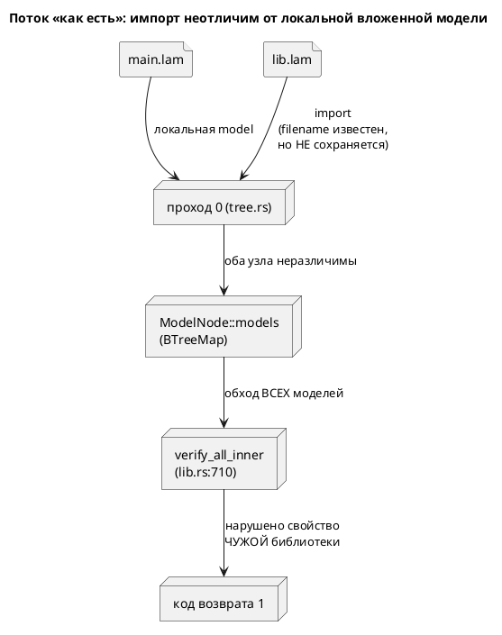

# Фича: Область проверки `lamc verify` (`--scope`)

- **Номер:** 0051
- **Статус:** ГОТОВО
- **Зависит от:** `0049` (верификация модели, `ГОТОВО`) — закрыта → фича **не
  блокируется**.
- **Связанные issue (анализ):** новая фича (из блока «Кандидаты в фичи»
  `FEATURES.md`: «Сужение области проверки `lamc verify --scope`»). Кандидат
  вскрыт ревью стадии тестирования (открытый вопрос 2; заказчик выбрал
  «оставить + документировать», лечение вынесено сюда).
- **Крейт:** `grammar` (`semantic/{mod,tree}.rs`, `lib.rs`, `bin/lamc.rs`).
- **Приоритет / Tier:** Tier 2 — верификация заявлена пригодной для CI (код
  возврата `0`/`1`), а сегодня CI краснеет на чужом коде.

## Стадии жизненного цикла

Все стадии — **разделы этой карточки**: «Архитектура (ADR)»,
«Анализ», «Разработка», «Тест-план», «Отчёт о тестировании», «Итог».
Отдельным артефактом остаются только исправления —
[`docs/fixes/`](../fixes/README.md) (при необходимости `0051-YY-*`).

## Краткое описание

`lamc verify main.lam` проверяет LTL-свойства **всех** моделей файла, включая
пришедшие через `import`. Поэтому нарушенное свойство чужой библиотеки даёт
ненулевой код возврата тому, кто её лишь импортировал: в CI это красная сборка
на коде, который автор не писал и чинить не вправе.

Фича даёт **область проверки**: по умолчанию — модели своего файла; `--scope all`
возвращает нынешнее поведение. Для этого в семантическое дерево вводится признак
происхождения модели (`origin`), которого сегодня **нет вообще**: импортированная
модель кладётся в `ModelNode::models` неотличимо от локальной вложенной.

> Фича зарегистрирована из блока «Кандидаты в фичи» `FEATURES.md` (по запросу
> заказчика 2026-07-16); проходит жизненный цикл по своду.

## Архитектура (ADR)

- **Status:** Accepted
- **Date:** 2026-07-16
- **Authors:** Архитектор + Аналитик
- **Related issues:** [Фича](0051-verify-scope.md); продолжает
  [ADR](0049-model-checking-ltl.md#архитектура-adr) (открытый вопрос 2 стадии тестирования)

### Context

Фича дала `lamc verify` с кодом возврата `0`/`1` и заявила его пригодным
для CI. `verify_all_inner` (`lib.rs:710`) рекурсивно обходит `ModelNode::models`
и проверяет формулы **каждой** модели дерева.

Проблема в том, что `models` содержит **и импортированные модели**: `import
"lib.lam";`, `import "lib.lam" as X;` и `import { A as B } from "lib.lam";`
кладут узел в тот же `BTreeMap`, что и локальная вложенная `model` (`tree.rs:179,
203, 248`). На уровне дерева это буквально одна сущность — импорт проверяется на
конфликт имён тем же кодом SE-006, что и локальная модель.

Следствие: нарушенное свойство чужой библиотеки роняет сборку импортёра. Автор
`main.lam` не писал `: [LTL]` библиотеки, не вправе её чинить, а вердикт получает
как свой. Это ровно тот класс «инструмент отвечает не на заданный вопрос»,
который 0049 закрывала правкой области формулы (0049-06).

**Признака происхождения в дереве нет вообще.** Установлено чтением кода:

- `ModelNode` (`semantic/mod.rs:67-126`) — среди полей нет ни пути файла, ни
  флага импорта.
- `Location::Source(u64, usize, usize)` (`diagnostics.rs:369`) **имеет** поле
  `file_no`, но оно везде жёстко `0`: импортируемые файлы разбираются как
  `parse(&content, 0)` (`tree.rs:172, 196, 220`), корневой — тоже
  (`lamc.rs:589`). Механизм есть, данных в нём нет.
- Имя файла известно только внутри прохода 0: `read_import_file` возвращает
  `(content, filename)` (`import.rs:39`), но наружу не сохраняется — служит для
  детекта циклов и вывода имени модели.
- AST-узел импорта в дерево не переносится: `ModelElement::Import`
  обрабатывается и выбрасывается (`tree.rs:144`).



### Decision Drivers

1. **Отвечать на заданный вопрос.** Пользователь спросил про `main.lam` —
   вердикт обязан быть про `main.lam`. Тот же принцип, что в 0049-06.
2. **Не потерять полезное поведение.** Проверка импортов осмысленна (сборка
   целиком); её нужно оставить доступной, а не выкинуть.
3. **Обратная совместимость.** Смена умолчания меняет код возврата
   на существующих файлах — требуется обоснование.
4. **Честность вместо тишины** (наследие 0025/0035/0049): пропущенные модели
   нельзя молча не проверить — пользователь обязан знать, что область сужена.
5. **Соразмерность признака.** Признак происхождения нужен верификации; тащить
   ради него настоящий `file_no` через LSP и вывод диагностик — несоразмерно.

### Considered Options

#### Option A. Поле `origin` в `ModelNode` + флаг `--scope file|all`

Происхождение как данные узла: `origin: ModelOrigin { Local, Imported }`,
заполняется в трёх точках прохода 0, где имя файла уже под рукой.

**Pros:**
- Признак явный, а не выведенный из побочности.
- Заполняется там, где данные есть; `ModelNode` собирается через
  `..Default::default()` (`tree.rs:99`) → прочие точки сборки не ломаются.
- Пригодится за пределами 0051 (диагностики «ошибка в импортированной модели»).

**Cons:**
- `ModelNode` растёт на поле.
- Для `Rename` (`import { A as B }`) узел разделяется по `Rc` (`tree.rs:248`) —
  признак нужно ставить на узел импортируемого дерева, а не на клон-ссылку.

#### Option B. Настоящий `file_no` в `Location`

Реестр файлов (id → путь), `parse(&content, next_file_no)` вместо `0`.

**Pros:**
- Чинит заодно **реальный дефект**: сегодня позиции диагностик из импортов
  указывают в текст корневого файла.
- Признак «модель из другого файла» получается бесплатно.

**Cons:**
- Трогает `lamc`, LSP и все рендереры диагностик (резолвить id → путь, читать
  нужный исходник) — несоразмерно задаче «сузить область verify».
- Дефект позиций самостоятелен и заслуживает своей фичи, а не довеска к этой.

#### Option C. Суррогатный признак: `upper == None`

Импортируемое дерево строится с `upper: None` (`tree.rs:177, 201`), локальная
вложенная получает `Some(Weak)` (`tree.rs:129`).

**Pros:**
- Ноль изменений в структурах данных.

**Cons:**
- Это **баг-как-фича**: опора на то, что `upper` забыли переустановить. Любая
  правка `tree.rs` молча сломает область проверки.
- Для `Rename` **не работает**: `Rc::clone` сохраняет `upper` на корень
  импортированного файла, чей `Rc` дропается → висячий `Weak`, и
  `upper.upgrade() == None` срабатывает случайно, по другой причине.
- Отвергнут: цена ошибки — молча не проверенная модель.

### Decision

Принимается **Option A**: поле `origin` в `ModelNode` + флаг `--scope file|all`.

Option B решает более крупную и **другую** задачу (позиции диагностик в
импортах); заводится **кандидатом в фичи**, здесь не делается. Option C отвергнут:
признак, полученный из недосмотра, — это тихий отказ в будущем.

**Умолчание — `file`** (модели своего файла). Смена умолчания обоснована: нынешнее поведение не контракт, а следствие того, что область никто
не задавал; `lamc verify` появился фичей, закрытой в этом же цикле, внешних
потребителей у кода возврата ещё нет. `--scope all` сохраняет прежнее поведение
дословно.

**Сужение — не тишина.** При `--scope file` пропущенные модели **перечисляются**
в выводе («не проверено: N моделей из импортов; `--scope all` — проверить их
тоже»). Молча не проверить — ровно тот дефект, который закрывала 0035.

### Consequences

#### Положительные

- Вердикт `lamc verify main.lam` относится к `main.lam`; CI импортёра не краснеет
  на чужой библиотеке.
- В дереве появляется честный признак происхождения — пригодится диагностикам.
- Прежнее поведение доступно одним флагом.

#### Отрицательные / Action items

- `ModelNode` растёт на поле. Принято: альтернатива (суррогат) хуже.
- **A1.** Позиции диагностик из импортированных файлов указывают в текст
  корневого (`file_no` ≡ 0) — **самостоятельный дефект**, вскрытый этим ADR.
  Завести кандидатом в фичи; здесь **не** чинить.
- **A2.** `--property "φ"` проверяется против корневой модели и области не
  касается — поведение 0049 сохраняется.

#### Acceptance criteria

1. `lamc verify` на файле с импортом, где нарушено свойство **импортированной**
   модели, даёт код возврата `0` (умолчание) и `1` при `--scope all`.
2. Свойства **локальных** вложенных моделей проверяются при любой области:
   сужение не должно задеть вложенную `model` своего файла.
3. Пропущенные модели перечисляются в выводе, а не пропускаются молча.
4. Признак `origin` верен для всех трёх форм импорта (`Plain`, `GlobalSymbol`,
   `Rename`) — включая `Rename`, где узел разделяется по `Rc`.
5. Негодное значение `--scope` — ошибка, а не молчаливое умолчание.
6. Регрессий нет: `precheck.sh` зелёный, вывод генераторов и версия языка не
   меняются (грамматика не трогается).

## Анализ

### Цель и контекст

Сузить область `lamc verify` до моделей проверяемого файла, сохранив прежнее
поведение под флагом `--scope all`. Решение об этом принято ADR (Option A):
поле `origin` в `ModelNode` + флаг CLI.

Кандидат вскрыт ревью стадии тестирования (открытый вопрос 2). Заказчик
тогда выбрал «оставить + документировать», лечение вынес в отдельную фичу — эту.

### Зависимости

| Фича | Статус | Почему зависимость |
|---|---|---|
| 0049 | `ГОТОВО` | даёт `verify_all` / `PropertyResult` / подкоманду `verify`, которые фича правит |

Все зависимости закрыты → фича **не блокируется**.

### Меняет ли фича язык

**Нет.** Грамматика (`grammar.lalrpop`), лексер и АСД не трогаются: `--scope` —
опция CLI, `origin` — поле семантического дерева, заполняемое проходом 0 из уже
известного имени файла. Версия языка (0.3.0) **не растёт**; форматтер новых узлов
не получает (правило про `format/` не применимо).

### Обратная совместимость

**Умолчание меняется** — это единственное несовместимое место, и оно осознанное:

| Что | Было (0049) | Станет (0051) |
|---|---|---|
| `lamc verify main.lam`, нарушено свойство импорта | код `1` | код `0` + строка «не проверено: N моделей из импортов» |
| `lamc verify --scope all main.lam` | — | код `1` (прежнее поведение дословно) |
| Публичный `verify_all(model)` | все модели | модели своего файла |

Обоснование (ADR, раздел Decision): нынешнее поведение — **не контракт**, а
следствие того, что область никто не задавал; `lamc verify` появился фичей,
закрытой в этом же цикле, внешних потребителей у кода возврата ещё нет. Цена
сохранения умолчания — красный CI на чужом коде, то есть ровно тот дефект, ради
которого фича заведена.

### Требования

| # | Требование |
|---|---|
| R1 | `ModelNode` несёт признак происхождения: `origin: ModelOrigin { Local, Imported }`, умолчание — `Local` |
| R2 | Признак ставится во **всех трёх** формах импорта: `Plain` (`tree.rs:179`), `GlobalSymbol` (`tree.rs:203`), `Rename` (`tree.rs:248`) |
| R3 | `verify_all` при области `File` **не заходит в поддерево** импортированной модели (её вложенные модели — тоже не свои) |
| R4 | Локальные вложенные модели проверяются при любой области |
| R5 | Пропущенные модели перечисляются в выводе — не молча |
| R6 | CLI: `--scope file\|all`, умолчание `file`; негодное значение — ошибка |
| R7 | `--property "φ"` области не касается (проверяется против корневой модели, поведение 0049) |
| R8 | Вывод генераторов и версия языка не меняются |

### Критерии приёмки

| # | Критерий |
|---|---|
| A1 | Импорт с нарушенным свойством: код `0` при умолчании, `1` при `--scope all` |
| A2 | Локальная вложенная модель проверяется всегда (сужение её не задело) |
| A3 | `origin` верен для `Plain`, `GlobalSymbol` и `Rename` |
| A4 | Пропуск виден в выводе (перечислены имена) |
| A5 | Негодный `--scope` — ошибка, не молчаливое умолчание |
| A6 | `precheck.sh` зелёный; регрессий нет |

### Ключевая тонкость реализации: `Rename` делит узел по `Rc`

Три формы импорта устроены **по-разному**, и это главный риск задачи:

- **`Plain` / `GlobalSymbol`** (`tree.rs:172-206`): файл разбирается, строится его
  дерево, и в `models` кладётся **корень** импортированного файла. Пометить нужно
  этот корень.
- **`Rename`** (`tree.rs:215-248`): строится дерево импортируемого файла, затем
  `models.insert(alias, Rc::clone(m))`, где `m` — **вложенная модель чужого
  дерева** (`src.models.get(orig)`). С точки зрения `lib.lam` этот узел
  `Local`, с точки зрения `main.lam` — импортированный. Признак ставится на узел
  в момент вставки; аliasing-риска нет: чужое дерево (`imported`) после блока
  дропается, а один и тот же файл при повторном импорте **разбирается заново**
  (кэша импортов в проходе 0 нет).

Отсюда семантика поля: `origin` — это происхождение **относительно файла, в
дерево которого узел вставлен**, а не абсолютное свойство модели.

### Почему обход обязан **не заходить** в поддерево (R3)

Пометить только верхний узел импорта и проверять `origin` у каждого узла —
недостаточно: вложенные модели `lib.lam` внутри импортированного корня имеют
`origin = Local` (они локальны для `lib.lam`). Если обход зайдёт внутрь, их
формулы проверятся, и фича не сработает.

Поэтому правило обхода: встретив `Imported`, **отсечь поддерево целиком** — не
проверять формулы узла и не рекурсировать в его `models`.

### Риски

| # | Риск | Митигация |
|---|---|---|
| Р1 | `Rename` пропущен → импорт проверяется вопреки области | отдельная фикстура и тест на каждую из трёх форм (A3) |
| Р2 | Обход зашёл в поддерево импорта → фича молча не работает | тест: импорт, чья **вложенная** модель нарушает свойство |
| Р3 | Сужение задело локальные вложенные модели → тихо не проверяем своё | тест A2: локальная вложенная с нарушенным свойством → код `1` |
| Р4 | Пропуск молча → пользователь думает, что проверено всё | R5: перечисление в выводе + тест |
| Р5 | Поле `origin` теряется при переприсваивании `models` в проходах 1–6 | узлы переиспользуются по `Rc`, поле живёт в узле; проверяется тестом A3 через полный `construct_model` |

### Декомпозиция разработки

| Задача | Содержание |
|---|---|
| [область проверки `lamc verify` (`--scope`)](0051-verify-scope.md#разработка) | Признак `origin` в `ModelNode` + простановка в трёх формах импорта |
| [область проверки `lamc verify` (`--scope`)](0051-verify-scope.md#разработка) | Область в `verify_all` + флаг CLI `--scope` + вывод пропущенных |

### Что не входит в объём

- **Позиции диагностик из импортов** (`file_no` ≡ 0 — ошибка в `lib.lam`
  указывает в текст `main.lam`). Самостоятельный дефект, вскрытый ADR
  (action item A1) → кандидат в фичи, здесь не чинится.
- Кэш импортов (один файл, импортированный дважды, разбирается дважды) — не
  задача этой фичи.

## Разработка

### Задача

#### Что было

Импортированная модель **неотличима** от локальной вложенной: проход 0 кладёт обе
в один `ModelNode::models`, `Location::file_no` везде равен нулю, а имя файла
известно только внутри прохода 0 и наружу не сохраняется. Отличить их было
нечем — значит, и сузить область проверки нечем.

#### Что сделано

> **Готово.**

1. **`ModelOrigin` + поле `origin`** (`semantic/mod.rs`): `Local` (умолчание) /
   `Imported`. Признак **относителен файлу, в дерево которого узел вставлен**, а
   не абсолютен: вложенная модель `lib.lam`, взятая через `import { A as B }`,
   для `lib.lam` локальна, для `main.lam` — импортирована.

2. **Простановка в трёх формах** (`tree.rs::mark_imported`): `Plain`
   (`tree.rs:179`), `GlobalSymbol` (`tree.rs:203`), `Rename` (`tree.rs:248`).
   Помощник заведён именно ради того, чтобы форма не потерялась: три точки
   вставки живут в разных ветках `match` и правятся по отдельности.

3. **Копия наследует происхождение** (`ModelNode::clone_with_name`):
   переименование модели её источник не меняет.

#### Ловушка формы `Rename`

Две формы из трёх кладут в `models` **корень** импортированного файла — его и
метим. Третья (`Rename`) кладёт `Rc::clone` **вложенной модели чужого дерева**
(`src.models.get(orig)`), у которой `origin` — `Local`: она локальна для своего
файла. Пометить обязан импортёр в момент вставки.

Гонки за разделяемый узел нет: дерево-источник (`imported`) дропается сразу после
блока, а один и тот же файл при повторном импорте разбирается заново (кэша
импортов в проходе 0 нет). `borrow_mut()` берётся у **дочернего** `RefCell`, а не
у того, что удерживает `src` — конфликта заимствований нет.

Проверено мутационной пробой: пометка у `Rename` убрана → краснеет
`rename_import_is_out_of_scope_by_default`.

#### Проверка

Тесты — на **вердикт**, а не на поле `origin`: признак в дереве средство, а
пользователь видит код возврата. См. `grammar/tests/verify_tests.rs` и задачу
[область проверки `lamc verify` (`--scope`)](0051-verify-scope.md#разработка).

### Задача

#### Что было

`verify_all_inner` (`lib.rs`) рекурсивно обходил **все** `models`, включая
импортированные (признак появился задачей [область проверки `lamc verify` (`--scope`)](0051-verify-scope.md#разработка), но
потребителя у него не было). Нарушенное свойство чужой библиотеки давало
импортёру код возврата `1`.

#### Что сделано

> **Готово.**

1. **`VerifyScope { File, All }`** (`lib.rs`), умолчание — `File`.

2. **Отсечение поддеревом, а не поузлово.** Встретив `Imported`, обход
   пропускает узел **и не рекурсирует в него**. Поузловая проверка признака была
   бы дефектом: вложенные модели чужого файла несут `Local` (они локальны для
   него), обход зашёл бы внутрь и проверил их формулы — область не работала бы.
   Контроль — `imported_subtree_is_cut_entirely`.

3. **`VerifyOutcome { results, skipped }`** вместо голого `Vec<PropertyResult>`:
   пропущенное **перечисляется**. Молчаливое сужение — ровно тот класс дефекта,
   который закрывала 0035: «все держатся» читалось бы как «проверено всё».

4. **CLI**: `--scope file|all` (обе формы — `--scope all` и `--scope=all`),
   негодное значение → ошибка со списком допустимых; справка и `print_usage`
   обновлены.

5. **Публичный API**: `verify_all_traced(model, trace)` → `verify_all_scoped(model,
   trace, scope)` c возвратом `VerifyOutcome`. `verify_all(model)` сохранён как
   краткая форма (область `File`).

#### Дефект, найденный зондом (до тестов)

Первая редакция печатала имя пропущенной модели из **поля узла**
(`m.borrow().name()`), и зонд показал пустую строку:

```text
Не проверено (вне области): 1 — модели из импортов:
```

Причина: корень импортированного файла **анонимен** (`name: None`) — имя, под
которым он виден импортёру (`import "badlib.lam";` → `Badlib`), существует только
как **ключ** словаря `models`. Исправлено: имя берётся ключом.

Дефект показателен: сообщение «не проверено N моделей» без имён бесполезно ровно
там, где оно нужно, — а тест на код возврата его бы не поймал.

#### Проверка

| Фикстура | Область | Ожидание |
|---|---|---|
| `scope_plain.lam` | `file` / `all` | код `0` + пропуск `Badlib` / код `1` |
| `scope_rename.lam` | `file` | пропуск `Motor` (форма `Rename`) |
| `scope_local_nested.lam` | обе | код `1` — своя вложенная модель проверяется всегда |

Мутационные пробы: снятие пометки у `Rename` → 1 красный тест; замена отсечения
поддерева на поузловое → 4 красных.

## Тест-план

### Область и цель

Проверяется **вердикт и код возврата**, которые увидит пользователь, а не поле
`origin` в дереве: признак — средство, а обещание фичи звучит как «CI импортёра
не краснеет на чужой библиотеке».

**Ключевой принцип плана** (наследие 0049, капкан 0025): ни одна проверка не
считается пройденной, если она подтверждает наличие признака, а не поведение.
Каждое сужение области обязано иметь **парный контрпример** — модель, которую
сужение задеть не вправе (иначе «сузили область» неотличимо от «сломали проверку
вложенных моделей вообще»).

### Проверки (условие → ожидаемый результат)

| # | Проверка | Предусловие | Ожидаемый результат | Ссылка на R/A |
|---|---|---|---|---|
| T1 | `import "файл";`: чужой нарушитель вне области | `scope_plain.lam` | все вердикты `Holds`, `skipped = [Badlib]` | R3 / A1 |
| T2 | `--scope all` возвращает поведение 0049 | `scope_plain.lam` | есть `Violated`, `skipped` пуст | R6 / A1 |
| T3 | Форма `Rename` помечается | `scope_rename.lam` | `skipped = [Motor]` | R2 / A3 |
| T4 | **Контрпример:** локальная вложенная проверяется всегда | `scope_local_nested.lam`, обе области | `Violated`, `skipped` пуст | R4 / A2 |
| T5 | Отсечение — поддеревом, а не поузлово | `scope_plain.lam` | в результатах нет модели `Engine` (вложенной в импорт) | R3 / Р2 |
| T6 | Умолчание публичного `verify_all` — область `file` | `scope_plain.lam` | все `Holds` | R3 |
| T7 | CLI: умолчание области | `verify m.lam` | `scope = File` | R6 |
| T8 | CLI: обе формы флага | `--scope all`, `--scope=all` | `scope = All` | R6 |
| T9 | CLI: негодная область — отказ | `--scope=al` | `Err`, в тексте — `al` и допустимые значения | R6 / A5 |
| T10 | CLI: `--scope` без значения — отказ | `--scope` | `Err` | R6 |
| T11 | Пропуск виден в выводе | проба CLI | «Не проверено (вне области): 1 — модели из импортов: Badlib» | R5 / A4 |
| T12 | Коды возврата | проба CLI | `scope_plain` → `0`/`1` (file/all); `scope_local_nested` → `1`/`1` | A1 / A2 |
| T13 | **Мутационная проверка:** пометка `Rename` снята | `mark_imported` убран из `tree.rs:248` | краснеет `rename_import_is_out_of_scope_by_default` | Р1 |
| T14 | **Мутационная проверка:** отсечение поузловое | `continue` убран из обхода | краснеют 4 теста, включая `imported_subtree_is_cut_entirely` | Р2 |
| T15 | Версия языка и вывод генераторов не изменены | — | `grammar.lalrpop` не тронут; снапшоты зелены | R8 |
| T16 | Регрессий нет | — | `precheck.sh` зелёный | A6 |

### Разбивка проверок по функциональности

<!-- Легенда: ✅ пройдено · ❌ провалено · ⬜ не проверялось · — не применимо -->

| Функциональность | Затронута чем | Проверки | Статус |
|---|---|---|---|
| Верификация LTL (0049) | область в `verify_all`; API `verify_all_traced` → `verify_all_scoped` | `verify_tests.rs` целиком (28 тестов) | ✅ |
| Импорты (проход 0) | `mark_imported` в трёх формах | `semantic_tests.rs` (импорты, SE-006, циклы) | ✅ |
| `ModelNode` | новое поле `origin` | сборка + `semantic_tests.rs` | ✅ |
| CLI `verify` | флаг `--scope`, печать пропущенного | T7–T12 | ✅ |
| Генерация C / ST / SV / Rust / PlantUML | не затронуты | снапшоты, проверка детерминизма 0048 | ✅ |
| Симулятор | не затронут | `cargo test -p simulation` | ✅ |

### Тестовые данные и окружение

**Фикстуры** `grammar/tests/data/verify/` (пример и контрпример):

| Фикстура | Роль | Ожидаемый вердикт |
|---|---|---|
| `badlib.lam` | «чужая библиотека»: нарушены свойства и корня, и вложенной `Engine` | импортируется, сама не проверяется |
| `scope_plain.lam` | импорт формой `import "файл";` | `file` → код `0`; `all` → код `1` |
| `scope_rename.lam` | импорт формой `import { A as B }` | `file` → пропуск `Motor` |
| `scope_local_nested.lam` | **контрпример:** нарушитель свой | код `1` при любой области |

**Где живут проверки:**

- интеграционные — `grammar/tests/verify_tests.rs` (T1–T6);
- CLI — `grammar/src/bin/lamc.rs::tests` (T7–T10); пробы CLI (T11–T12);
- регресс — `./scripts/precheck.sh` (T15–T16).

**Окружение:** `cargo test -p grammar -- --test-threads=1`; внешних зависимостей
фича не требует.

### Как воспроизвести

```sh
cargo test -p grammar -- --test-threads=1
./scripts/precheck.sh

## Пробы CLI (T11, T12)
D=grammar/tests/data/verify
lamc verify -I $D $D/scope_plain.lam;              echo $?   # 0 + «Не проверено (вне области): 1 … Badlib»
lamc verify --scope all -I $D $D/scope_plain.lam;  echo $?   # 1
lamc verify -I $D $D/scope_local_nested.lam;       echo $?   # 1 — своё проверяется всегда
```

## Отчёт о тестировании

### Резюме

**Пройдено. Фича готова к закрытию (`ГОТОВО`).**

`lamc verify main.lam` больше не краснеет на чужой библиотеке: проверяются модели
своего файла, пропущенное перечисляется, `--scope all` возвращает поведение 0049
дословно. Все 16 проверок тест-плана (T1–T16) пройдены; `precheck.sh` зелёный;
`cargo test -- --test-threads=1` — **1628 тестов** (+15 к 0049: 6
интеграционных, 4 CLI, 5 от 0049-06).

Версия языка не менялась (0.3.0): грамматика не тронута — `--scope` это опция
CLI, `origin` — поле семантического дерева. Вывод генераторов не изменился.

**Главное решение фичи — признак происхождения, а не суррогат.** Импортированная
модель была **неотличима** от локальной вложенной: проход 0 кладёт обе в один
`ModelNode::models`, а `Location::file_no` везде равен нулю. Заманчивый суррогат
(«у импорта `upper == None`») отвергнут ADR: он опирается на недосмотр `tree.rs`
и **не работает** для формы `Rename`, где узел приходит `Rc::clone`-ом чужого
дерева с непустым `upper`. Цена ошибки была бы молчаливой — не проверенная
модель.

### Фактические результаты по проверкам

| # | Проверка | Результат | Комментарий |
|---|---|---|---|
| T1 | `import "файл";`: чужой нарушитель вне области | ✅ | `skipped = [Badlib]`, свои свойства держатся |
| T2 | `--scope all` возвращает поведение 0049 | ✅ | `Violated` всплывает, `skipped` пуст |
| T3 | Форма `Rename` помечается | ✅ | `skipped = [Motor]` |
| T4 | **Контрпример:** локальная вложенная проверяется всегда | ✅ | `Violated` при обеих областях |
| T5 | Отсечение — поддеревом, а не поузлово | ✅ | `Engine` (вложенная в импорт) в результатах отсутствует |
| T6 | Умолчание `verify_all` — область `file` | ✅ | |
| T7 | CLI: умолчание области | ✅ | `scope = File` |
| T8 | CLI: обе формы флага | ✅ | `--scope all` и `--scope=all` |
| T9 | CLI: негодная область — отказ | ✅ | текст называет `al` и допустимые значения |
| T10 | CLI: `--scope` без значения — отказ | ✅ | |
| T11 | Пропуск виден в выводе | ✅ | «Не проверено (вне области): 1 — модели из импортов: Badlib» |
| T12 | Коды возврата | ✅ | проба: `scope_plain` → `0`/`1`; `scope_local_nested` → `1`/`1` |
| T13 | **Мутационная:** пометка `Rename` снята | ✅ | краснеет `rename_import_is_out_of_scope_by_default` |
| T14 | **Мутационная:** отсечение поузловое | ✅ | краснеют **4** теста, включая `imported_subtree_is_cut_entirely` |
| T15 | Версия языка и вывод генераторов не изменены | ✅ | `grammar.lalrpop` не тронут |
| T16 | Регрессий нет | ✅ | `precheck.sh` зелёный |

### Дефекты, найденные на стадии (оба — зондом, до тестов)

Ни один не дожил до тестов, но оба показательны: **тест на код возврата их бы не
поймал**.

1. **Пропущенная модель печаталась без имени.** Первая редакция брала имя из поля
   узла (`m.borrow().name()`) и выдавала «модели из импортов: » — пустоту.
   Причина: корень импортированного файла **анонимен** (`name: None`), а имя, под
   которым он виден импортёру (`import "badlib.lam";` → `Badlib`), существует
   только **ключом** словаря `models`. Исправлено: имя берётся ключом. Сообщение
   «не проверено N моделей» без имён бесполезно ровно там, где оно нужно.
2. **Зонд едва не соврал устаревшим бинарником.** Проба после мутационных
   прогонов показала одновременно «не проверено: Badlib» и вердикты **из этой же
   библиотеки** — то есть поведение мутации №2. Исходники были восстановлены
   верно; устаревшим оказался `target/debug/lamc`, который пересобрал `cargo
   test` под мутацией. Урок для будущих проб: **пересобирать бинарник после
   мутационных прогонов**, иначе зонд измеряет не тот код.

### Результаты по функциональности

| Функциональность | Затронута чем | Проверки | Статус |
|---|---|---|---|
| Верификация LTL (0049) | область в `verify_all`; API `verify_all_traced` → `verify_all_scoped` | `verify_tests.rs` (28 тестов) | ✅ |
| Импорты (проход 0) | `mark_imported` в трёх формах | `semantic_tests.rs` (импорты, SE-006, циклы) | ✅ |
| `ModelNode` | новое поле `origin` (20-е) | сборка + `semantic_tests.rs` | ✅ |
| CLI `verify` | флаг `--scope`, печать пропущенного | T7–T12 | ✅ |
| Генерация C / ST / SV / Rust / PlantUML | не затронуты | снапшоты, проверка детерминизма 0048 | ✅ |
| Симулятор | не затронут | `cargo test -p simulation` | ✅ |

### Примеры и контрпримеры

`grammar/tests/data/verify/`; прогнаны пробой, вывод попал в README (раздел
«Область проверки: свой файл, а не чужая библиотека»).

| Фикстура | Роль | Вердикт |
|---|---|---|
| `badlib.lam` | «чужая библиотека»: нарушены свойства корня **и** вложенной `Engine` | импортируется, сама не проверяется |
| `scope_plain.lam` | `import "файл";` | `file` → код `0` + пропуск `Badlib`; `all` → код `1` |
| `scope_rename.lam` | `import { Engine as Motor } from …` | `file` → пропуск `Motor` |
| `scope_local_nested.lam` | **контрпример:** нарушитель свой | код `1` при любой области |

Пара `scope_plain` / `scope_local_nested` — сердце плана: без второй фикстуры
«сузили область» неотличимо от «сломали проверку вложенных моделей вообще».

### Обратная совместимость

Умолчание изменено осознанно: `lamc verify main.lam` с нарушенным свойством
импорта даёт теперь `0` вместо `1`. Обоснование: прежнее поведение —
не контракт, а следствие того, что область никто не задавал; подкоманда появилась
фичей, закрытой в этом же цикле, внешних потребителей у кода возврата ещё
нет. `--scope all` сохраняет прежнее поведение дословно.

### Окружение

- `rustc 1.99.0-nightly (daf2e5e18 2026-07-13)`, macOS (Darwin 25.5.0), ветка `v2`.
- `cargo test -- --test-threads=1` — 1628 пройдено, 6 игнорировано, 19 наборов.
- `./scripts/precheck.sh` — зелёный целиком.

### Выводы и дальнейшие шаги

**Вердикт: готово.** Фича закрывается (`ГОТОВО`).

Дефектов, требующих исправления, стадия не оставила. Заведён **кандидат в фичи**, вскрытый ADR (action item A1) и **не входящий** в объём этой
фичи:

- **Позиции диагностик из импортированных файлов указывают в чужой текст.**
  `Location::Source` несёт `file_no`, но он везде равен нулю: импортируемые файлы
  разбираются как `parse(&content, 0)`. Значит, ошибка в `lib.lam` показывает
  позицию в тексте `main.lam`. Механизм в типе есть — данных в нём нет. Лечение
  (реестр файлов id → путь) трогает `lamc`, LSP и все рендереры диагностик,
  поэтому это самостоятельная фича, а не довесок.

## Итог (что сделано)

Фича **закрыта** 2026-07-16. Отчёт —
[`0051-verify-scope.md#отчёт-о-тестировании`](0051-verify-scope.md#отчёт-о-тестировании) (вердикт
«готово»: T1–T16 пройдены, `precheck.sh` зелёный, 1628 тестов).

**Крейт `grammar`.** `lamc verify` получил область: `--scope file` (умолчание) —
модели своего файла, `--scope all` — прежнее поведение 0049. Пропущенное
**перечисляется** (`VerifyOutcome { results, skipped }`), а не замалчивается.
Публичный API: `verify_all_scoped` вместо `verify_all_traced`, `VerifyScope`,
`VerifyOutcome`. Версия языка не менялась (0.3.0), вывод генераторов неизменен.

**Ключевые решения:**

- **Признак происхождения, а не суррогат** (`ModelOrigin` + поле
  `ModelNode::origin`, задача [область проверки `lamc verify` (`--scope`)](0051-verify-scope.md#разработка)).
  Импорт был **неотличим** от локальной вложенной модели: проход 0 кладёт обе в
  один `models`, `Location::file_no` везде нулевой. Суррогат «у импорта
  `upper == None`» отвергнут ADR: опирается на недосмотр `tree.rs` и **не
  работает** для формы `Rename`.
- **Отсечение поддеревом, а не поузлово** (задача
  [область проверки `lamc verify` (`--scope`)](0051-verify-scope.md#разработка)): вложенные модели чужого файла
  несут `Local` — поузловая проверка признака завела бы обход внутрь импорта, и
  область не работала бы. Контроль — `imported_subtree_is_cut_entirely`.
- **Форма `Rename` — главная ловушка**: узел приходит `Rc::clone`-ом чужого
  дерева и метится импортёром в момент вставки.
- **Умолчание изменено осознанно**: прежнее поведение не контракт, а
  следствие того, что область никто не задавал.

**Живая проверка:** 4 фикстуры-пары `grammar/tests/data/verify/scope_*.lam` +
`badlib.lam`, прогнаны пробой, вывод — в README. Обе мутационные пробы краснеют.
