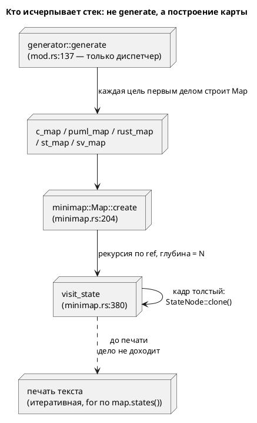

# Фича: Итеративные обходы — снятие потолка стека

- **Номер:** 0052
- **Статус:** ГОТОВО
- **Зависит от:** `0049` (верификация модели, `ГОТОВО`) — закрыта → фича **не
  блокировалась**.
- **Связанные issue (анализ):** новая фича (из блока «Кандидаты в фичи»
  `FEATURES.md`: «Итеративные обходы в `verification/`»). Кандидат вскрыт ревью
  стадии тестирования (открытый вопрос 3; заказчик выбрал «оставить»,
  лечение вынес сюда).
- **Крейт:** `grammar` (`semantic/minimap.rs`, `verification/check.rs`).
- **Приоритет / Tier:** Tier 2 — отказ **без диагностики** (`SIGABRT`) на
  законной модели.

## Стадии жизненного цикла (правило 17)

Все стадии — **разделы этой карточки** (правило 32): «Архитектура (ADR)»,
«Анализ», «Разработка», «Тест-план», «Отчёт о тестировании», «Итог».
Отдельным артефактом остаются только исправления —
[`docs/fixes/`](../fixes/README.md) (при необходимости `0052-YY-*`).

## Краткое описание

Снять потолок числа состояний, за которым инструмент падал по стеку **без
диагностики** (`SIGABRT` — ни строки, ни позиции, ни кода возврата).

Объём **расширен решением заказчика** 2026-07-16 с «обходов `verification/`» на
**все** рекурсивные обходы: зонд показал, что самый низкий потолок — в
**генерации** (2500…2800 состояний в debug, общий для всех пяти целей), а не в
верификации (14000…16000), и что в release-сборке потолка верификации нет вовсе.

> Фича зарегистрирована из блока «Кандидаты в фичи» `FEATURES.md` (по запросу
> заказчика 2026-07-16); проходит жизненный цикл по правилу 17.

## Архитектура (ADR)

- **Status:** Accepted
- **Date:** 2026-07-16
- **Authors:** Архитектор + Аналитик
- **Related issues:** [Фича](0052-verify-iterative-traversal.md);
  вырос из открытого вопроса 3 стадии тестирования [фичи](0049-model-checking-ltl.md#архитектура-adr)

### Context

Кандидат заводился как «итеративные обходы в `verification/`»: карточка 0049
фиксировала замер «3000 состояний — норма, 20000 — падение». **Зонд опроверг
постановку.** Замеры на модели-цепочке `S0 → S1 → … → S(N-1)` (каждое состояние
ссылается на следующее через `ref`), основной поток:

| Слой | debug | release |
|---|---|---|
| `parse` + `semantic::construct_model` (включая освобождение дерева) | >20000 — потолка не найдено | — |
| **`lamc compile` — все 5 целей** (`c`/`plantuml`/`rust`/`st`/`sv`) | **2500…2800** | **7000…8000** |
| `lamc verify` (обходы `verification/`) | 14000…16000 | **>20000 — потолка не найдено** |

Выводы, переворачивающие исходную постановку:

1. **Самый низкий потолок — не в верификации, а в генерации.** `lamc compile`
   умирает на модели, которую `lamc verify` проверяет без труда. Чинить только
   `verification/` значило бы поднять потолок с 16000 до бесконечности там, где
   пользователь и так не жалуется, оставив невозможной **компиляцию** модели на
   3000 состояний.
2. **В release-сборке потолка верификации не нашли вовсе** (20000 проходит).
   То есть у ветки `verification/` практическая срочность близка к нулю — она
   остаётся в объёме ради однородности, а не ради спасения пользователя.

**Виновник найден и он один на все цели** — `semantic/minimap.rs:380`:

```rust
fn visit_state(state: &StateNode, model: Rc<RefCell<ModelNode>>, used: &mut BTreeMap<Name, Element>) {
    …
    for ref_name in ref_names {
        if let Some(rc) = model.borrow().search_state(&ref_name.local) {
            let next = rc.borrow().clone();      // minimap.rs:411 — ПОЛНЫЙ клон StateNode в кадре
            visit_state(&next, model.clone(), used);   // minimap.rs:412 — глубина = N
        }
    }
}
```

Функция общая: её зовёт `Map::create` (`minimap.rs:204`), а карту первым делом
строит **каждый** генератор — `c_map.rs:53`, `puml_map.rs:27`, `rust_map.rs:42`,
`st_map.rs:59`, `sv_map.rs:54`. Отсюда и совпадение порога у всех целей:
`generator::generate` (`generator/mod.rs:137`) сам не рекурсирует, а падение
происходит **до** печати текста. Обходы состояний в самих генераторах итеративны
(`for` по `map.states()`) и ни при чём.

Почему порог так низок (~2500, а не десятки тысяч) — **толщина кадра**: в кадре
живёт `rc.borrow().clone()`, полная копия `StateNode` по значению, плюс
`Vec<Name>` и клоны `Rc`.

**Защита от циклов есть, от глубины — нет** (`minimap.rs:390`): `used` прерывает
повторный вход, но на ациклической цепочке из N **различных** состояний каждый
ключ новый — ранний выход не срабатывает ни разу. Ограничителя глубины
(`MAX_CALL_DEPTH`, `stacker`, `recursion_limit`) в крейте нет.



### Decision Drivers

1. **Отказ без диагностики.** Переполнение стека — `SIGABRT` без строки, без
   позиции, без кода. Пользователь видит «fatal runtime error», а не «модель
   слишком велика». Это худший вид отказа в проекте, где принцип — «громкий
   отказ» (0025/0035/0049).
2. **Чинить надо там, где потолок ниже** (зонд): генерация, а не верификация.
3. **Соразмерность.** Обход `visit_state` — предпорядок без работы после
   рекурсивного вызова, поэтому перевод в явный список задач механичен.
4. **Не менять наблюдаемое**: порядок эмиссии — свойство типа
   контейнера (`BTreeMap`), и правка обхода не вправе его тронуть.

### Considered Options

#### Option A. Итеративный обход (явный worklist) в `visit_state` + nested-DFS

**Pros:**
- Убирает потолок **совсем**, а не отодвигает: глубина уходит в кучу.
- `visit_state` — предпорядок: после рекурсивных вызовов работы нет, возврата
  никто не читает (`-> ()`) → перевод механичен, риск низок.
- Заодно снимает толстый кадр (`StateNode::clone` на кадр).

**Cons:**
- Порядок обхода нужно сохранить осознанно (см. Decision).

#### Option B. Ограничитель глубины + диагностика

Считать глубину, на пороге — `Diagnostic` («модель слишком велика»).

**Pros:**
- Дёшево; отказ становится громким и объяснимым.

**Cons:**
- Потолок **остаётся**, просто получает вывеску. Модель на 3000 состояний
  по-прежнему не компилируется — а она законна.
- Порог зависит от профиля сборки (debug 2500 против release 7500) и от ос →
  константа будет либо душить release, либо не спасать debug.
- Годится как **дополнение**, а не замена.

#### Option C. Растить стек (`stacker`, отдельный поток с большим стеком)

**Pros:**
- Правка в одну строку.

**Cons:**
- Внешняя зависимость (`stacker`) либо поток с гигабайтным стеком ради обхода
  списка — лечение симптома.
- Потолок остаётся, просто выше; на модели вдвое больше вернётся тот же `SIGABRT`.

### Decision

Принимается **Option A**, порядок работ — от низкого потолка к высокому:

1. **`minimap::visit_state` → итеративный**. Это и есть исправление
   компиляции: одна функция чинит **все пять** целей, потому что карту строят все.
2. **`verification/check.rs::{outer_dfs, inner_dfs}` → итеративные**. Срочности нет (в release потолка не нашли), но фича охватывает класс
   дефекта целиком — решение заказчика 2026-07-16.

`buchi.rs::expand` (GPVW) **остаётся рекурсивным**: его глубина — по размеру
**формулы**, а не модели. Формулы пишет человек; десятки тысяч вложенных
операторов — не сценарий. Правка без повода дороже пользы, а риск сломать
условие принятия (капкан исправления) реален. Фиксируется явно, чтобы
«итеративные обходы» не поняли как «переписать всё подряд».

Option B **не принимается даже как дополнение**: после Option A потолка нет, и
ограничитель нечему ограничивать.

**Порядок обхода сохраняется** (Decision Driver 4): дети кладутся в worklist в
обратном порядке, чтобы `pop()` отдавал их в том же порядке, что рекурсия. По
существу порядок не наблюдаем (`used` — `BTreeMap`, содержимое от порядка вставки
не зависит: страж `contains_key` даёт «первый выиграл», а вставляемый элемент
определяется самим состоянием), но сохранение порядка делает правку проверяемой
диффом вывода, а не рассуждением. Гарантия — проверка детерминизма 0048.

### Consequences

#### Положительные

- Модель любого размера компилируется и верифицируется; потолок исчезает, а не
  отодвигается.
- Кадр перестаёт нести `StateNode::clone` — обход дешевеет и по времени.
- Один исправление лечит пять целей сразу.

#### Отрицательные / Action items

- **A1.** `expand` (GPVW) остаётся рекурсивным осознанно — глубина по формуле.
  Если появится генератор формул (не человек), вернуться к вопросу.
- **A2.** Замеры сняты на модели-цепочке (глубина = N). Ширина (много рёбер из
  одного состояния) стек не растит — проверять не требуется.
- **A3.** Потолок был **не в том слое**, где его искала карточка 0049. Урок:
  «замер показал 3000» без указания слоя — это не замер. Отражено в тест-плане:
  проверка обязана называть слой.

#### Acceptance criteria

1. `lamc compile` (цели `c`, `plantuml`, `rust`, `st`, `sv`) на модели из 20000
   состояний завершается успешно в **debug**-сборке (прежде — `SIGABRT` на 2800).
2. `lamc verify` на той же модели завершается успешно в debug (прежде — на 16000).
3. Вывод генераторов на корпусе `examples/` **не изменился** ни байтом
   (codegen-снапшоты + проверка детерминизма 0048).
4. Регрессий нет: `precheck.sh` зелёный.
5. Тест-контроль фиксирует слой: падение обязано быть отнесено к генерации либо к
   верификации, а не к «обходам вообще».

## Анализ

### Цель и контекст

Снять потолок числа состояний, за которым инструмент падает по стеку **без
диагностики** (`SIGABRT` — ни строки, ни позиции, ни кода возврата).

Кандидат заводился как «итеративные обходы в `verification/`» по замеру из
карточки 0049. **Зонд постановку опроверг**: самый низкий потолок
— не в верификации, а в **генерации**, и общий для всех пяти целей. Заказчик
2026-07-16 расширил объём фичи на все рекурсивные обходы.

### Зависимости (правило 17)

| Фича | Статус | Почему зависимость |
|---|---|---|
| 0049 | `ГОТОВО` | даёт `verification/{check,buchi}.rs` — один из правимых обходов и его тесты-оракулы |

Зависимость закрыта → фича **не блокируется**.

### Меняет ли фича язык (правило 22)

**Нет.** Грамматика, АСД, семантика и **вывод генераторов** не меняются: правится
только способ обхода. Версия языка (0.3.0) не растёт. Требование «вывод неизменен
ни байтом» — критерий приёмки A3, гарантируется codegen-снапшотами и проверкой
детерминизма 0048.

### Обратная совместимость (правило 11)

**Полная.** Наблюдаемое поведение меняется ровно в одну сторону: то, что прежде
падало, теперь работает. Вывод на моделях, которые компилировались и раньше,
неизменен.

### Замеры (зонд, модель-цепочка `S0 → … → S(N-1)`, основной поток)

| Слой | debug | release |
|---|---|---|
| `parse` + `construct_model` (включая освобождение дерева) | >20000 — потолка нет | — |
| **генерация** (`c`/`plantuml`/`rust`/`st`/`sv`) | **2500…2800** | **7000…8000** |
| `verify` (`verification/`) | 14000…16000 | >20000 — потолка нет |

Методическая заметка: замеры сняты **по коду возврата**, а не по выводу. Первая
редакция зонда смотрела последнюю строку — и приняла бы падение при освобождении
дерева за успех, потому что «ok» уже напечатано.

### Требования

| # | Требование |
|---|---|
| R1 | `minimap::visit_state` итеративен: глубина обхода не занимает стек |
| R2 | `verification/check.rs::{outer_dfs, inner_dfs}` итеративны |
| R3 | Порядок обхода сохранён → вывод генераторов неизменен ни байтом |
| R4 | Постпорядок внешнего DFS сохранён (иначе проверка пустоты неверна) |
| R5 | `buchi.rs::expand` остаётся рекурсивным осознанно (глубина по формуле) |
| R6 | Тест-контроль валится при возврате рекурсии и называет слой |

### Критерии приёмки

| # | Критерий |
|---|---|
| A1 | `compile` (5 целей) на 20000 состояний — успех в debug (было: `SIGABRT` на 2800) |
| A2 | `verify` на 20000 состояний — успех в debug (было: на 16000) |
| A3 | Вывод генераторов на корпусе не изменился (снапшоты + проверка) |
| A4 | Вердикты верификации не изменились (оракул T40 — 44 вердикта) |
| A5 | `precheck.sh` зелёный |

### Почему правка `visit_state` механична, а `check.rs` — нет

Это главное различие двух задач, и оно определяет риск:

- **`visit_state`** — **предпорядок**: после шага «вглубь» работы не остаётся,
  возврата никто не читает (`-> ()`). Стек кадров заменяется списком задач
  (`Vec<StateNode>`) один в один. Риск низкий.
- **`outer_dfs`** — работа **после** потомков: обход из состояния завершён →
  если состояние принимающее, запускается внутренний DFS. Список задач это не
  выражает: нужен разбор кадра по шагам (состояние + преемники + позиция).
  Постпорядок здесь **существен**: он гарантирует, что внутренний DFS не
  пропустит цикл из-за уже посещённых состояний. Нарушение сделало бы проверку
  **неверной**, а не медленной.
- **`inner_dfs`** — откат (`cycle.pop()` при неудаче), то есть тоже работа после
  потомков.

### Риски

| # | Риск | Митигация |
|---|---|---|
| Р1 | Порядок обхода поехал → вывод генераторов изменился | потомки кладутся в обратном порядке (`pop()` отдаёт в исходном); проверка + снапшоты |
| Р2 | Постпорядок внешнего DFS нарушен → **тихо неверный вердикт** | тесты на вердикт: оракул T40 (44 вердикта прямым перебором), T12/T13 (известные теоремы) |
| Р3 | Откат `inner_dfs` потерян → лассо содержит лишние вершины | тесты на трассу контрпримера (`fails.lam`, T18/T35) |
| Р4 | Рекурсия вернётся незаметно при будущей правке | `deep_model_tests.rs` — контроль на 5000 состояний в потоке с 2 МБ стека (жёстче продуктового сценария) |
| Р5 | Правка «на всякий случай» тронет `expand` и сломает условие принятия (капкан 0010-01) | R5: `expand` явно вне объёма |

### Декомпозиция разработки

| Задача | Содержание |
|---|---|
| [итеративные обходы — снятие потолка стека](0052-verify-iterative-traversal.md#разработка) | `minimap::visit_state` → итеративный (чинит все 5 целей) |
| [итеративные обходы — снятие потолка стека](0052-verify-iterative-traversal.md#разработка) | nested-DFS (`check.rs`) → итеративный |

### Что не входит в объём

- **`buchi.rs::expand`** — глубина по размеру формулы, а не модели (R5).
- **Ограничитель глубины с диагностикой** — после итеративных обходов потолка нет,
  ограничивать нечего (ADR, Option B отвергнут).
- **Рекурсии по вложенности** (`visit_extend`, `build_extend`, `unique_model_name`)
  — их глубина задаётся вложенностью, которую пишет человек.

## Разработка

### Задача

#### Что было

`visit_state` (`semantic/minimap.rs:380`) рекурсировала по `ref`-рёбрам с
глубиной, равной **числу состояний**. Цепочка `S0 → S1 → … → S(N-1)` исчерпывала
стек на N ≈ 2800 (debug) / ≈ 7500 (release).

Падала при этом **компиляция во все пять целей**: карту строит каждый генератор
(`c_map.rs:53`, `puml_map.rs:27`, `rust_map.rs:42`, `st_map.rs:59`,
`sv_map.rs:54`) через `Map::create` (`minimap.rs:204`). Отказ был без
диагностики — `SIGABRT`, ни строки, ни кода возврата. Сами генераторы ни при чём:
`generator::generate` только диспетчеризует, а обходы состояний в целях
итеративны (`for` по `map.states()`) — до печати текста дело не доходило.

Низкий порог (~2800, а не десятки тысяч) объяснялся **толщиной кадра**: в кадре
жил `rc.borrow().clone()` — полная копия `StateNode` по значению.

Защита от циклов (`used.contains_key`) от глубины не спасала: на ациклической
цепочке из N **различных** состояний каждый ключ новый, ранний выход не
срабатывает ни разу.

#### Что сделано

> **Готово.**

Стек кадров заменён списком задач `Vec<StateNode>`. Перевод механичен: после шага
«вглубь» работы не остаётся, возврата никто не читает (`-> ()`) — это чистый
предпорядок.

**Порядок сохранён осознанно:** потомки кладутся в обратном порядке, поэтому
`pop()` отдаёт их в том же порядке, что и прежняя рекурсия. По существу порядок
не наблюдаем (`used` — `BTreeMap`, а вставляемый элемент определяется самим
состоянием, страж даёт «первый выиграл»), но так правка проверяется **диффом
вывода**, а не рассуждением о нём.

`visit_extend` внутри ветки `Implement` оставлен рекурсивным: его глубина — по
вложенности выражения `A | B + C`, которую пишет человек, а не по числу
состояний.

#### Проверка

| Что | До | После |
|---|---|---|
| `compile_to_c`, N=2800 (debug) | `SIGABRT` | успех |
| `compile_to_c`, N=20000 (debug) | `SIGABRT` | успех |
| Вывод на корпусе `examples/` | — | не изменился ни байтом (снапшоты + проверка) |

Контроль — `grammar/tests/deep_model_tests.rs` (5000 состояний, поток теста с 2 МБ
стека — жёстче продуктовых 8 МБ). Мутационная проба: рекурсия возвращена →
`codegen_handles_deep_state_chain` падает со `stack overflow`.

### Задача

#### Что было

`outer_dfs` / `inner_dfs` (`verification/check.rs`) рекурсировали по состояниям
произведения: `lamc verify` падал на N ≈ 16000 (debug). В release потолка не
нашли вовсе (20000 проходит) — поэтому срочности у задачи не было, и она делается
ради полноты класса (решение заказчика 2026-07-16), а не ради спасения
пользователя.

#### Что сделано

> **Готово.**

Оба обхода переведены на явный кадр `Frame { state, successors, next_index }`.

**Почему не список задач, как в [итеративные обходы — снятие потолка стека](0052-verify-iterative-traversal.md#разработка).** Оба
обхода делают работу **после** потомков, а такой обход в простой список не
сворачивается — нужен разбор кадра по шагам:

- `outer_dfs` — **постпорядок**: когда преемники исчерпаны и состояние
  принимающее, запускается внутренний DFS. Постпорядок **существен**: он
  гарантирует, что внутренний DFS не пропустит цикл из-за уже посещённых
  состояний (метки переиспользуются между запусками — в этом вся экономия
  алгоритма). Нарушение сделало бы проверку пустоты **неверной**, а не медленной.
- `inner_dfs` — **откат**: `cycle.pop()` на тупиковой ветке.

`path` (префикс лассо) и `cycle` ведутся рядом с кадрами: их содержимое — то же,
что накапливала рекурсия.

`expand` (GPVW, `buchi.rs`) **оставлен рекурсивным** осознанно (ADR, A1):
его глубина — по размеру **формулы**, которую пишет человек. Править без повода
дороже пользы, а риск сломать условие принятия реален — это ровно то место, где
жил дефект [вырожденное условие принятия автомата Бюхи (GPVW)](../fixes/0010-01-buchi-acceptance.md).

#### Проверка

Тесты — **на вердикт**, а не на форму обхода (капкан 0025; тесты на структуру
позволили дефекту прожить в зелёном CI):

- оракул T40 — 44 вердикта против прямого перебора графа: совпадение;
- T12/T13 — известные теоремы (`F p` не принимает слово без `p`);
- T18/T35 — трасса контрпримера (контроль отката `inner_dfs`);
- `verify_tests.rs` целиком — 28 тестов, зелёные.

| Что | До | После |
|---|---|---|
| `lamc verify`, N=16000 (debug) | `SIGABRT` | успех |
| `lamc verify`, N=20000 (debug) | `SIGABRT` | успех |

## Тест-план

### Область и цель

Проверяется, что модель любого размера **компилируется и верифицируется**, а
вывод при этом **не изменился ни байтом**. Второе не менее важно первого: правка
обхода, меняющая вывод, — это регресс, а не улучшение.

**Ключевой принцип плана.** Правка обхода может сломать семантику **тихо**:
нарушенный постпорядок внешнего DFS даёт неверный вердикт, а не падение. Поэтому
проверки — на **вердикт и вывод**, а не на форму обхода. Проверка обязана
называть **слой** (генерация / верификация): потолок жил не там, где его искала
карточка 0049.

### Проверки (условие → ожидаемый результат)

| # | Проверка | Предусловие | Ожидаемый результат | Ссылка на R/A |
|---|---|---|---|---|
| T1 | Генерация C на глубокой цепочке | 5000 состояний, поток теста (2 МБ стека) | успех (прежде — `SIGABRT`) | R1 / A1 |
| T2 | Генерация PlantUML на той же модели | 5000 состояний | успех — контроль от «починили только C» | R1 / A1 |
| T3 | Верификация на той же модели | 5000 состояний | `Verdict::Holds` для `F S4999` — **вердикт**, а не факт возврата | R2 / A2 |
| T4 | Продуктовый потолок генерации снят | `lamc compile -t c`, N=20000, debug | код `0` (прежде — `SIGABRT` с 2800) | R1 / A1 |
| T5 | Продуктовый потолок верификации снят | `lamc verify`, N=20000, debug | код `0` (прежде — `SIGABRT` с 16000) | R2 / A2 |
| T6 | Вывод генераторов не изменился | корпус `examples/` | снапшоты зелены; проверка детерминизма 0048 зелёный | R3 / A3 |
| T7 | Вердикты не изменились: оракул | 9 топологий × атомы | 44/44 совпадений с прямым перебором | R4 / A4 |
| T8 | Известные теоремы держатся | `F p` на `q^ω` | продукт пуст (контроль постпорядка) | R4 / A4 |
| T9 | Трасса контрпримера не поехала | `fails.lam` | `Idle -> [ Fault ]*` — контроль отката `inner_dfs` | R4 / Р3 |
| T10 | `expand` остался рекурсивным | чтение кода | глубина по формуле; правка вне объёма | R5 |
| T11 | **Мутационная проверка:** рекурсия возвращена в `visit_state` | `worklist.push` → прямой вызов | `codegen_handles_deep_state_chain` падает со `stack overflow` | R6 / Р4 |
| T12 | Регрессий нет | — | `precheck.sh` зелёный | A5 |

### Разбивка проверок по функциональности

<!-- Легенда: ✅ пройдено · ❌ провалено · ⬜ не проверялось · — не применимо -->

| Функциональность | Затронута чем | Проверки | Статус |
|---|---|---|---|
| Генерация C / PlantUML / Rust / ST / SV | общий `minimap::visit_state` | T1, T2, T4, T6 + `codegen_tests.rs`, `st_tests.rs` | ✅ |
| Детерминизм генерации (0048) | порядок обхода карты | T6 (проверка двух прогонов × все цели) | ✅ |
| Верификация LTL (0049) | nested-DFS | T3, T5, T7–T9 + `verify_tests.rs` (28) | ✅ |
| Автомат Бюхи (0010) | не затронут (`expand` рекурсивен) | `buchi.rs::tests`, T7 | ✅ |
| Семантика / парсер | не затронуты | `semantic_tests.rs` | ✅ |
| Симулятор | не затронут | `cargo test -p simulation` | ✅ |

### Тестовые данные и окружение

**Данные генерируются в тесте** (`chain_source(n)`), а не лежат фикстурой:
файл на 5000 состояний — это ~120 КБ шума в репозитории, а модель тривиальна и
описывается тремя строками кода.

**Поток теста несёт 2 МБ стека против 8 МБ у основного** — тесты жёстче
продуктового сценария намеренно: возврат рекурсии завалит их **раньше**, чем
пользователь увидит `SIGABRT`.

**Где живут проверки:**

- контроля — `grammar/tests/deep_model_tests.rs` (T1–T3);
- вердикты — `grammar/tests/verify_tests.rs` (T7–T9);
- пробы CLI (T4, T5); регресс — `./scripts/precheck.sh` (T6, T12).

### Как воспроизвести

```sh
cargo test -p grammar --test deep_model_tests -- --test-threads=1
cargo test -p grammar -- --test-threads=1
./scripts/precheck.sh

## Пробы продуктового потолка (T4, T5) — цепочка из 20000 состояний
lamc compile -t c chain_20000.lam -o /tmp/o.c;  echo $?   # 0 (было: 134, SIGABRT)
lamc verify chain_20000.lam;                    echo $?   # 0 (было: 134)
```

## Отчёт о тестировании

### Резюме

**Пройдено. Фича готова к закрытию (`ГОТОВО`).**

Потолок числа состояний снят: модель-цепочка из **20000** состояний
компилируется во **все пять целей** (`c`, `plantuml`, `rust`, `st`, `sv`) и
верифицируется — в **debug**-сборке, где прежде генерация умирала на 2800, а
проверка свойств на 16000. Отказ был худшего вида: `SIGABRT` без строки, позиции
и кода возврата.

Вывод генераторов **не изменился ни байтом** (снапшоты + проверка детерминизма 0048),
вердикты верификации — тоже (оракул: 44/44). `precheck.sh` зелёный;
`cargo test -- --test-threads=1` — **1631 тест** в 20 наборах.

Версия языка не менялась (0.3.0): правится способ обхода, не язык.

**Главный результат стадии — не правка, а зонд.** Фича заводилась как
«итеративные обходы в `verification/`» по замеру из карточки 0049 («3000 —
норма, 20000 — падение»). Зонд показал, что **постановка была неверна дважды**:

1. **Потолок был не в том слое.** Самый низкий потолок — в **генерации**
   (2500…2800 debug), а не в верификации (14000…16000). `lamc compile` умирал на
   модели, которую `lamc verify` проверял без труда.
2. **В release потолка верификации нет вовсе** (20000 проходит). То есть ветка,
   ради которой фича заводилась, пользователя не била.

Виновник оказался **один на все цели** — `minimap::visit_state`: карту строит
каждый генератор, поэтому падали все пять, ещё до печати текста.

### Фактические результаты по проверкам

| # | Проверка | Результат | Комментарий |
|---|---|---|---|
| T1 | Генерация C на глубокой цепочке | ✅ | 5000 состояний в потоке с 2 МБ стека |
| T2 | Генерация PlantUML на той же модели | ✅ | контроль от «починили только C» |
| T3 | Верификация на той же модели | ✅ | `Holds` для `F S4999` — вердикт, а не факт возврата |
| T4 | Продуктовый потолок генерации снят | ✅ | проба: N=20000, debug — **все 5 целей** дают код `0` |
| T5 | Продуктовый потолок верификации снят | ✅ | проба: N=20000, debug — код `0` |
| T6 | Вывод генераторов не изменился | ✅ | снапшоты зелены; проверка детерминизма 0048 зелёный |
| T7 | Вердикты не изменились: оракул | ✅ | 44/44 совпадений с прямым перебором |
| T8 | Известные теоремы держатся | ✅ | контроль постпорядка внешнего DFS |
| T9 | Трасса контрпримера не поехала | ✅ | `Idle -> [ Fault ]*` — контроль отката `inner_dfs` |
| T10 | `expand` остался рекурсивным | ✅ | осознанно (ADR, A1): глубина по формуле |
| T11 | **Мутационная:** рекурсия возвращена | ✅ | `codegen_handles_deep_state_chain` → `stack overflow`, `SIGABRT` |
| T12 | Регрессий нет | ✅ | `precheck.sh` зелёный |

### Что показал зонд (методическая часть)

Замеры (модель-цепочка `S0 → … → S(N-1)`, основной поток):

| Слой | debug — было | release — было | стало (debug) |
|---|---|---|---|
| `parse` + `construct_model` | >20000 — потолка нет | — | без изменений |
| **генерация** (5 целей) | **2500…2800** | **7000…8000** | >20000 — потолка нет |
| `verify` | 14000…16000 | >20000 — потолка нет | >20000 — потолка нет |

Две методические ошибки, пойманные по ходу (обе едва не исказили замер):

1. **Зонд смотрел вывод, а не код возврата.** Падение при **освобождении** дерева
   происходит уже после печати «ok» — первая редакция приняла бы его за успех.
   Исправлено: замеры сняты по коду возврата, освобождение вызвано явно.
2. **Зонд едва не соврал устаревшим бинарником** (та же ошибка, что на 0051):
   `cargo test` под мутацией пересобирает `target/debug/lamc`, и следующая проба
   меряет мутированный код.

### Результаты по функциональности

| Функциональность | Затронута чем | Проверки | Статус |
|---|---|---|---|
| Генерация C / PlantUML / Rust / ST / SV | общий `minimap::visit_state` | T1, T2, T4, T6 + `codegen_tests.rs`, `st_tests.rs` | ✅ |
| Детерминизм генерации (0048) | порядок обхода карты | T6 (два прогона × все цели → `diff -r`) | ✅ |
| Верификация LTL (0049) | nested-DFS | T3, T5, T7–T9 + `verify_tests.rs` (28) | ✅ |
| Автомат Бюхи (0010) | не затронут (`expand` рекурсивен) | `buchi.rs::tests`, T7 | ✅ |
| Семантика / парсер | не затронуты | `semantic_tests.rs` | ✅ |
| Симулятор | не затронут | `cargo test -p simulation` | ✅ |

### Дефектов не найдено

Стадия не оставила дефектов, требующих исправления. Риск Р2 (тихо неверный
вердикт из-за нарушенного постпорядка) не реализовался — подтверждено оракулом
(T7) и теоремами (T8), то есть проверками **на смысл**, а не на форму обхода.

### Окружение

- `rustc 1.99.0-nightly (daf2e5e18 2026-07-13)`, macOS (Darwin 25.5.0), ветка `v2`.
- `cargo test -- --test-threads=1` — 1631 пройдено, 6 игнорировано, 20 наборов.
- `./scripts/precheck.sh` — зелёный целиком.

### Выводы и дальнейшие шаги

**Вердикт: готово.** Фича закрывается (`ГОТОВО`).

Урок, который стоит вынести за пределы фичи: **«замер показал 3000» без указания
слоя — это не замер.** Карточка 0049 честно зафиксировала число, но приписала его
верификации, и фича год бы чинила не тот слой. Отличить помог только зонд,
разложивший конвейер по стадиям и смотревший на код возврата.

Второй урок — про **толщину кадра**: порог был низок (2800, а не десятки тысяч)
не из-за глубины как таковой, а из-за `StateNode::clone()` в кадре. Рекурсия
дорога вдвойне, когда таскает копию узла.

## Итог (что сделано)

Фича **закрыта** 2026-07-16. Отчёт —
[`0052-verify-iterative-traversal.md#отчёт-о-тестировании`](0052-verify-iterative-traversal.md#отчёт-о-тестировании)
(вердикт «готово»: T1–T12 пройдены, `precheck.sh` зелёный, 1631 тест).

**Крейт `grammar`.** Потолок снят: цепочка из **20000** состояний компилируется
во все пять целей (`c`, `plantuml`, `rust`, `st`, `sv`) и верифицируется — в
debug-сборке, где прежде генерация умирала на 2800, а проверка свойств на 16000.
Вывод генераторов не изменился ни байтом (снапшоты + проверка), вердикты — тоже
(оракул 44/44). Версия языка не менялась (0.3.0).

**Ключевые решения:**

- **Виновник — один на все цели** ([итеративные обходы — снятие потолка стека](0052-verify-iterative-traversal.md#разработка)):
  `semantic/minimap.rs::visit_state` рекурсировала по `ref`-рёбрам глубиной = N.
  Карту строит **каждый** генератор через `Map::create`, поэтому падали все пять
  — ещё до печати текста. Перевод механичен: обход — предпорядок, стек кадров
  заменён списком задач. Порог был низок (2800, а не десятки тысяч) из-за
  **толщины кадра**: в нём жил `StateNode::clone()`.
- **nested-DFS — сложнее и без срочности** ([итеративные обходы — снятие потолка стека](0052-verify-iterative-traversal.md#разработка)): `outer_dfs` делает
  работу **после** потомков (постпорядок), `inner_dfs` — откат, поэтому нужен
  явный кадр `Frame { state, successors, next_index }`, а не список задач.
  Постпорядок существен: его нарушение дало бы **неверный вердикт**, а не
  замедление.
- **`expand` (GPVW) оставлен рекурсивным осознанно** (ADR, A1): глубина по
  размеру **формулы**, которую пишет человек. Это ровно то место, где жил дефект
  [вырожденное условие принятия автомата Бюхи (GPVW)](../fixes/0010-01-buchi-acceptance.md) — правка без повода дороже
  пользы.

**Урок за пределы фичи:** «замер показал 3000» **без указания слоя — это не
замер**. Карточка 0049 честно зафиксировала число, но приписала его верификации;
фича чинила бы не тот слой. Разложил конвейер по стадиям только зонд — и смотреть
он обязан на **код возврата**, а не на вывод: падение при освобождении дерева
случается уже после печати «ok».

**Живая проверка:** контроля `grammar/tests/deep_model_tests.rs` (5000 состояний в
потоке с 2 МБ стека — жёстче продуктовых 8 МБ). Мутационная проба: рекурсия
возвращена → тест падает со `stack overflow`.
