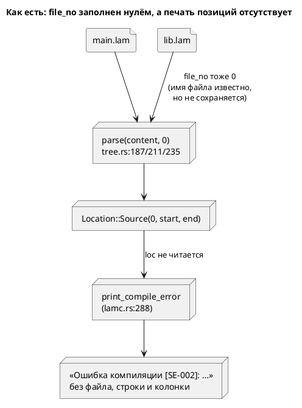

# Фича: Позиции в диагностиках (`файл:строка:колонка`) и настоящий `file_no`

- **Номер:** 0053
- **Статус:** ГОТОВО
- **Зависит от:** нет (правится слой диагностик; 0051 лишь вскрыла дефект).
- **Связанные issue (анализ):** новая фича (из блока «Кандидаты в фичи»
  `FEATURES.md`: «Позиции диагностик из импортированных файлов указывают в чужой
  текст»). Кандидат вскрыт ADR закрытой [область проверки `lamc verify` (`--scope`)](0051-verify-scope.md), action
  item A1.
- **Крейт:** `grammar` (`diagnostics.rs`, `semantic/tree.rs`, `lib.rs`,
  `bin/lamc.rs`).
- **Приоритет / Tier:** Tier 2 — диагностика без позиции заставляет искать
  ошибку глазами по всему проекту.

## Стадии жизненного цикла

Все стадии — **разделы этой карточки**: «Архитектура (ADR)»,
«Анализ», «Разработка», «Тест-план», «Отчёт о тестировании», «Итог».
Отдельным артефактом остаются только исправления —
[`docs/fixes/`](../fixes/README.md) (при необходимости `0053-YY-*`).

## Краткое описание

`lamc` печатает диагностику **без позиции вообще** — ни файла, ни строки, ни
колонки:

```text
Ошибка компиляции [SE-002]: Ссылка 'Nowhere' не найдена
```

Ошибка в своём файле и ошибка внутри импортированной библиотеки при этом
**неотличимы** (проверено зондом). Фича даёт позицию: `файл:строка:колонка`.

Кандидат заводился как «`file_no` ≡ 0», но зонд показал: этот дефект **латентен**
— `file_no` не читает никто, поэтому починка его в одиночку не изменила бы для
пользователя ничего. Объём расширен решением заказчика 2026-07-16 до печати
позиций; настоящий `file_no` — механизм под ней, и **её потребитель**.

> Фича зарегистрирована из блока «Кандидаты в фичи» `FEATURES.md` (по запросу
> заказчика 2026-07-16); проходит жизненный цикл по своду.

## Архитектура (ADR)

- **Status:** Accepted
- **Date:** 2026-07-16
- **Authors:** Архитектор + Аналитик
- **Related issues:** [Фича](0053-diagnostics-file-id.md);
  вырос из action item A1 [ADR](0051-verify-scope.md#архитектура-adr)

### Context

Кандидат заводился так: «`Location::Source` несёт `file_no`, но он везде равен
нулю, поэтому ошибка в `lib.lam` показывает позицию в тексте `main.lam`».

**Зонд показал, что дефект латентен, а настоящая боль — другая.** Факты:

- `print_compile_error` (`bin/lamc.rs:288`) печатает **только код и сообщение**.
  Ни `diag.loc`, ни строки, ни колонки там нет — как и во всех прочих ветках
  (`:622`, `:635`, `:673`) и в `simulation` (`format_diagnostics`).
- `Location::filename()` и `try_file_no()` (`diagnostics.rs:423`, `:432`) в
  продуктовом коде **не вызывает никто** — только тесты, причём
  `parser_tests.rs:944` прямо утверждает `loc.filename() == "0"`.
- LSP `grammar_diagnostic_to_lsp` (`lsp.rs:224`) `file_no` **отбрасывает**
  (`Location::Source(_, start, end)`) и мапит смещение в текст текущего
  документа. Но и там дефект не всплывает: `collect_diagnostics` зовёт
  `construct_model(&ast, None, &[])` — с **пустыми** путями поиска, то есть
  импорты в редакторе не разрешаются вовсе.

Проба (ошибка `ref Nowhere;` внутри импортированного файла против такой же в
своём файле) даёт **дословно один и тот же** вывод:

```text
Ошибка компиляции [SE-002]: Ссылка 'Nowhere' не найдена
```

Отсюда постановка: чинить надо **печать позиций**, а `file_no` сделать настоящим
как **механизм под ней** — иначе он останется декоративным.



### Decision Drivers

1. **Диагностика без позиции — половина диагностики.** Пользователь знает *что*
   не так, но не знает *где*; в проекте с импортами — даже не знает, в каком
   файле.
2. **Механизм обязан иметь потребителя.** Урок: код без потребителя
   молча гниёт. `file_no` пролежал нулём именно потому, что его никто не читал.
3. **Соразмерность правки.** `construct_model` зовут **183** места, `compile_to_*`
   — 36 тестов плюс doc-примеры: менять их сигнатуры ради печати нельзя.
4. **Честность вместо суррогата** (прецедент 0051): признак берётся из данных, а
   не угадывается.

### Considered Options

#### Option A. Реестр файлов + путь в `Diagnostic`, печать в `lamc`

`FileTable { paths }` раздаёт `file_no` при разборе каждого файла; `Diagnostic`
получает поле `file: Option<String>`, которое **заполняется по `file_no` через
реестр** там, где реестр ещё жив (внутри `compile_to_*`). `lamc` печатает
`путь:строка:колонка`.

**Pros:**
- `file_no` становится **настоящим и востребованным**: реестр читают ради пути.
- Сигнатуры `construct_model` и `compile_to_*` **не меняются**: реестр живёт
  внутри, наружу выходит уже разрешённый путь. 183 + 36 вызовов не тронуты.
- Настоящих литералов `Diagnostic` в коде всего **13** — поле добавляется дёшево
  (остальные ~40 совпадений `Diagnostic {` — это типы возврата функций).
- Диагностика самодостаточна: несёт всё нужное для печати.

**Cons:**
- `Diagnostic` растёт на поле.
- Путь дублируется в каждой диагностике (строка на ошибку — цена ничтожна).

#### Option B. Протащить `&mut FileTable` в публичный API

`compile_to_*` получают реестр параметром; `lamc` владеет им и печатает.

**Pros:**
- Реестр доступен и при успехе.

**Cons:**
- 7 сигнатур × (36 тестов + 7 doc-примеров + 7 мест в `lamc`) — ~50 правок ради
  печати. Нарушает драйвер 3.
- Реестр — деталь компиляции; выносить его в API значит просить каждого
  потребителя знать о нём.

#### Option C. Штамповать путь в точке импорта, `file_no` не трогать

В `tree.rs` при ошибке из импорта дописать путь в диагностику — реестр не нужен.

**Pros:**
- Самая дешёвая правка.

**Cons:**
- `file_no` остаётся декоративным — то есть кандидат «настоящий `file_no`»
  **не закрыт**, а замаскирован. Это ровно суррогат, который отверг ADR.
- Заказчик выбрал «позиции **и** настоящий `file_no`» (2026-07-16).

### Decision

Принимается **Option A**.

**Реестр `FileTable` живёт внутри компиляции и наружу не выходит.** Границей
служит `Diagnostic::file`: путь разрешается по `file_no` там, где реестр ещё жив,
и дальше диагностика самодостаточна. Так `file_no` получает потребителя (драйвер
2), а публичный API не растёт (драйвер 3).

**Печать позиции — обязанность `lamc`, а не библиотеки**: библиотека возвращает
данные (путь + смещения), CLI решает, как их показать. Строка и колонка считаются
из текста файла, который CLI читает по пути.

**LSP в объём не входит** (решение заказчика): там нужна многофайловость —
`grammar_diagnostic_to_lsp` принимает один `source: &str`, а `collect_diagnostics`
не разрешает импорты вовсе. Это самостоятельная фича; заводится кандидатом.

**Формат — `путь:строка:колонка`**, как у `rustc`/`gcc`: он машиночитаем и
кликабелен в редакторах. Нумерация строк и колонок — **с единицы** (позиции
внутри `Location` остаются байтовыми смещениями с нуля).

### Consequences

#### Положительные

- Пользователь видит, **где** ошибка, и отличает свой файл от импортированного.
- `file_no` перестаёт быть декоративным: у него появился потребитель.
- Реестр — задел для будущей многофайловости LSP (кандидат ниже).

#### Отрицательные / Action items

- **A1.** `Location::filename()` возвращает `format!("{}", file_no)` — то есть
  строку `"0"`, а не путь; имя вводит в заблуждение. Тест
  `parser_tests.rs:944` прямо на это опирается. Переименование/удаление — вне
  объёма (тронет тесты, пользы для пользователя нет); зафиксировано здесь.
- **A2.** `simulation` печатает диагностики без позиций так же (`format_diagnostics`).
  Вне объёма: фича про `lamc`; кандидат.
- **A3.** LSP остаётся однофайловым — кандидат в фичи.

#### Acceptance criteria

1. Ошибка в своём файле печатается как `путь:строка:колонка: …`, строка и
   колонка указывают на объявление.
2. Ошибка внутри импортированного файла печатается с путём **этого** файла, а не
   корневого (сегодня они неотличимы).
3. Вложенный импорт (`main → lib → deep`) называет **`deep.lam`**.
4. Диагностика без файловой позиции (`Location::Codegen`/`Implicit`) печатается
   как прежде — без выдуманных координат.
5. `file_no` реален: разные файлы получают разные идентификаторы, и путь
   разрешается **через реестр**, а не угадыванием.
6. Регрессий нет: `precheck.sh` зелёный; версия языка и вывод генераторов не
   меняются.

## Анализ

### Цель и контекст

Показывать пользователю, **где** ошибка: `путь:строка:колонка`. Настоящий
`file_no` — механизм под этим и его единственный потребитель.

Кандидат («`file_no` ≡ 0») вскрыт ADR (A1). Зонд показал, что дефект
**латентен**, а боль — в отсутствии печати позиций (см. ADR, Context).

### Зависимости

Нет. Фича правит слой диагностик; 0051 лишь вскрыла дефект и от неё ничего не
требуется. Фича **не блокируется**.

### Меняет ли фича язык

**Нет.** Грамматика, АСД, семантика и вывод генераторов не трогаются: меняется
только диагностический слой. Версия языка (0.3.0) не растёт.

### Обратная совместимость

- **Публичные сигнатуры сохранены:** `construct_model` (183 вызова) и
  `compile_to_*` (36 вызовов в тестах) не изменились. Реестр остался внутри.
- **`Diagnostic` получил поле** `file: Option<String>` — ломающее изменение для
  тех, кто конструирует диагностику **литералом**. Таких мест в проекте 13 (+3 в
  тестах LSP); прочие ~40 совпадений `Diagnostic {` — это типы возврата функций.
  Изменение обосновано: без поля путь до печати не доезжает.
- **Вывод `lamc` изменился**: к сообщению добавился префикс. Это и есть цель.

### Требования

| # | Требование |
|---|---|
| R1 | Каждый разбираемый файл получает свой `file_no` (корень — 0) |
| R2 | Реестр `FileTable` разрешает `file_no` → путь и **не выходит** в публичный API |
| R3 | `Diagnostic` несёт путь своего файла (`file`) |
| R4 | `lamc` печатает `путь:строка:колонка: ` перед сообщением |
| R5 | Ошибка внутри импорта названа именем **этого** файла, вложенного — именем самого внутреннего |
| R6 | Позиция без файла (`Codegen`/`Implicit`) печатается без выдуманных координат |
| R7 | Колонка — в символах, а не в байтах (в `.lam` есть кириллица) |
| R8 | Версия языка и вывод генераторов не меняются |

### Критерии приёмки

Совпадают с ADR (A1–A6); проверяются тест-планом T1–T13.

### Риски

| # | Риск | Митигация |
|---|---|---|
| Р1 | Путь затирается внешним импортёром → назван импортёр вместо виновника | T3 (вложенный импорт `top → mid → deep`); правильный файл даёт **`file_no`**, а не порядок штамповки |
| Р2 | Выдуманные координаты у `Codegen`/`Implicit` → пользователь ищет ошибку в строке 1 | T6: префикс пуст, если позиции нет |
| Р3 | Байтовая колонка на кириллице указывает мимо | T11: тест на символы |
| Р4 | Реестр «протёк» в API → 183 вызова `construct_model` пришлось бы править | `construct_model` оставлен как обёртка с реестром-однодневкой |
| Р5 | Файл не читается на печати → паника вместо диагностики | префикс вырождается в `путь: `; сообщить о причине важнее показа |

### Декомпозиция разработки

| Задача | Содержание |
|---|---|
| [позиции в диагностиках (`файл:строка:колонка`) и настоящий `file_no`](0053-diagnostics-file-id.md#разработка) | `FileTable`, `Diagnostic::file`, настоящий `file_no` в трёх формах импорта |
| [позиции в диагностиках (`файл:строка:колонка`) и настоящий `file_no`](0053-diagnostics-file-id.md#разработка) | Разрешение пути в `compile_to_*` и печать `путь:строка:колонка` в `lamc` |

### Что не входит в объём

- **LSP-многофайловость** (решение заказчика): `grammar_diagnostic_to_lsp`
  принимает один `source: &str`, а `collect_diagnostics` зовёт `construct_model`
  с пустыми путями поиска — импорты в редакторе не разрешаются вовсе. Кандидат.
- **`simulation`**: печатает диагностики без позиций так же. Кандидат.
- **`Location::filename()`** возвращает `format!("{}", file_no)` — строку `"0"`,
  а не путь; имя вводит в заблуждение (`parser_tests.rs:944` на это опирается).
  Переименование пользы пользователю не даёт — вне объёма (ADR, A1).

## Разработка

### Задача

#### Что было

`Location::Source(file_no, start, end)` несла `file_no`, но он **везде был
нулём**: и корневой файл, и импортируемые разбирались как `parse(&content, 0)`
(`tree.rs:187`, `:211`, `:235`). Реестра файлов не существовало
(грепы по `FileTable`/`SourceMap`/`FileId` — ноль попаданий).

Потребителя у `file_no` не было тоже: `Location::filename()` и `try_file_no()`
в продуктовом коде не вызывал никто.

#### Что сделано

> **Готово.**

1. **`FileTable`** (`diagnostics.rs`): `new(root)` (корень — номер 0),
   `add(path) -> u64`, `path(no)`, `path_of(&Location)`. Один путь — один номер:
   номер обозначает **файл**, а не факт загрузки.
2. **Настоящий `file_no`** в трёх формах импорта: `parse(&content,
   files.add(&filename))`. Имя файла в этих точках уже было под рукой —
   использовалось для детекта циклов, но наружу не сохранялось.
3. **`Diagnostic::file: Option<String>`** + `with_file_if_unset`.
4. **`construct_model_with_files`** — новый вход с реестром;
   `construct_model` оставлен обёрткой с реестром-однодневкой, поэтому **183**
   его вызова не тронуты.

#### Почему реестр не вышел в публичный API

`construct_model` зовут 183 места, `compile_to_*` — 36 тестов плюс doc-примеры.
Протаскивать реестр параметром значило бы ~50 правок ради печати. Вместо этого
границей служит `Diagnostic::file`: путь разрешается там, где реестр ещё жив, и
дальше диагностика самодостаточна.

#### Ловушка, найденная пробой

Литералов `Diagnostic { … }` в коде **13**, а не 54, как показывает наивный
греп: `Diagnostic {` в генераторах — это **тип возврата** функции
(`fn sv002(...) -> Diagnostic {`), а не конструкция. Ошибись здесь — и объём
фичи выглядел бы вчетверо больше, а Option A был бы отвергнут как дорогой.

Ещё три литерала живут в тестах под фичей `lsp` — обычная `cargo build` их
**не видит**, поймал только `precheck.sh` (`--all-features --all-targets`).

### Задача

#### Что было

`print_compile_error` (`bin/lamc.rs:288`) печатал **только код и сообщение** —
ни файла, ни строки, ни колонки. Из-за этого ошибка в своём файле и ошибка внутри
импортированной библиотеки были **дословно неотличимы** (проба):

```text
Ошибка компиляции [SE-002]: Ссылка 'Nowhere' не найдена
```

#### Что сделано

> **Готово.**

1. **`parse_and_construct`** (`lib.rs`) — общий шаг всех семи целей: создаёт
   `FileTable::new(filename)`, строит модель через `construct_model_with_files` и
   разрешает `file_no` диагностики в путь (`stamp_file`). Заодно ушло
   семикратное дублирование пары «`parse` + `construct_model`».
2. **`position_prefix`** (`lamc.rs`) — печатает `путь:строка:колонка: ` в формате
   `rustc`/`gcc` (машиночитаемо, кликабельно в редакторах).
3. **`line_column`** (`diagnostics.rs`) — нумерация **с единицы**; колонка в
   **символах**, а не байтах (в `.lam` есть кириллица — байтовая указывала бы
   мимо).

#### Что печатается, когда позиции нет

Префикс **пуст**: `Location::Codegen`/`Implicit` координат не имеют, и выдумывать
им `1:1` нельзя — пользователь пошёл бы искать ошибку в первой строке. Если файл
не читается, префикс вырождается в `путь: `: сообщить о причине важнее, чем
промолчать из-за проблемы с показом.

#### Проверка (пробы)

| Случай | Было | Стало |
|---|---|---|
| Ошибка в своём файле | `Ошибка компиляции [SE-002]: …` | `rooterr.lam:2:18: Ошибка компиляции [SE-002]: …` |
| Ошибка внутри импорта | **то же самое** | `badsem.lam:2:18: …` — назван виновник |
| Вложенный импорт `top → mid → deep` | то же самое | `deep.lam:2:18: …` — самый внутренний |

## Тест-план

### Область и цель

Проверяется **то, что увидит пользователь**: путь файла и координаты в
диагностике. Не проверяется наличие поля `file_no` само по себе — это механизм;
кандидат ровно потому и пролежал латентным, что механизм был, а потребителя не
было.

**Ключевой принцип плана.** Каждая проверка обязана различать **виновника и
импортёра**: до фичи оба случая давали дословно одинаковый вывод, поэтому тест,
не проверяющий имя файла, прошёл бы и на сломанной фиче.

### Проверки (условие → ожидаемый результат)

| # | Проверка | Предусловие | Ожидаемый результат | Ссылка на R/A |
|---|---|---|---|---|
| T1 | Ошибка своего файла названа своим файлом | `lib_bad.lam` | `file = lib_bad.lam` | R3 / A1 |
| T2 | Ошибка внутри импорта названа **библиотекой**, а не импортёром | `importer.lam` | `file = lib_bad.lam` | R5 / A2 |
| T3 | Вложенный импорт называет **самый внутренний** файл | `top.lam` (→ `mid` → `deep_bad`) | `file = deep_bad.lam` | R5 / A3 |
| T4 | Координаты указывают на место ошибки | `lib_bad.lam` | строка 4, колонка > 1 | R4 / A1 |
| T5 | Настоящий `file_no`: файлы получают разные номера | `importer.lam` | `file_no ≠ 0` (0 — корень) | R1 / A5 |
| T6 | Реестр: корень — номер 0 | `FileTable::new` | `path(0) = main.lam` | R2 |
| T7 | Реестр: один путь — один номер | двойной `add` | номера равны | R2 |
| T8 | Реестр: неизвестный номер и не-файловая позиция | `path(42)`, `path_of(Codegen)` | `None` — не выдуманный путь | R6 |
| T9 | Нумерация строк и колонок — с единицы | `line_column` | `(1,1)`, `(2,1)`, `(2,3)` | R4 |
| T10 | Смещение за концом текста не паникует | `line_column("ab", 99)` | `(1,3)` | R4 / Р5 |
| T11 | Колонка — в **символах**, а не байтах | текст с кириллицей | позиция после `// абв` — `(2,1)` | R7 / Р3 |
| T12 | **Мутационная:** `file_no` возвращён к нулю | `parse(&content, 0)` в трёх точках | краснеют 3 теста (T2, T3, T5) | R1 / Р1 |
| T13 | Регрессий нет; язык и вывод генераторов не изменены | — | `precheck.sh` зелёный | R8 / A6 |

### Разбивка проверок по функциональности

<!-- Легенда: ✅ пройдено · ❌ провалено · ⬜ не проверялось · — не применимо -->

| Функциональность | Затронута чем | Проверки | Статус |
|---|---|---|---|
| Диагностики | новое поле `Diagnostic::file` (13 литералов + 3 в тестах LSP) | `diagnostics_tests.rs`, T1–T11 | ✅ |
| Импорты (проход 0) | настоящий `file_no` в трёх формах | `semantic_tests.rs` (импорты, циклы, SE-006) | ✅ |
| Публичный API | `construct_model_with_files` добавлен; `construct_model` — обёртка | 183 вызова не тронуты; сборка | ✅ |
| CLI `compile` | печать позиции | T1–T4, пробы | ✅ |
| Генерация C / ST / SV / Rust / PlantUML | общий `parse_and_construct` вместо 7 копий | снапшоты, проверка детерминизма 0048 | ✅ |
| LSP | литералы в тестах | `lsp_tests.rs` (`--features lsp`) | ✅ |
| Симулятор | не затронут | `cargo test -p simulation` | ✅ |

### Тестовые данные и окружение

**Фикстуры** `grammar/tests/data/diag53/` — пара «виновник / импортёр» и цепочка
вложенности:

| Фикстура | Роль |
|---|---|
| `lib_bad.lam` | «чужая библиотека» с ошибкой `ref Nowhere` — виновник |
| `importer.lam` | импортёр без своих ошибок: до фичи был неотличим от виновника |
| `top.lam` → `mid.lam` → `deep_bad.lam` | вложенность: назван обязан быть `deep_bad.lam` |

**Где живут проверки:** `grammar/tests/diagnostics_file_tests.rs` (T1–T11);
регресс — `./scripts/precheck.sh` (T13).

Литералы `Diagnostic` в тестах под фичей `lsp` обычная `cargo build` **не
видит** — их ловит только `precheck.sh` (`--all-features --all-targets`).

### Как воспроизвести

```sh
cargo test -p grammar --test diagnostics_file_tests -- --test-threads=1
./scripts/precheck.sh

## Проба: ошибка внутри импортированной библиотеки называет ЕЁ, а не импортёра
lamc compile -t c -I tests/data/diag53 tests/data/diag53/importer.lam -o /tmp/o.c
##   tests/data/diag53/lib_bad.lam:4:18: Ошибка компиляции [SE-002]: Ссылка 'Nowhere' не найдена
```

## Отчёт о тестировании

### Резюме

**Пройдено. Фича готова к закрытию (`ГОТОВО`).**

`lamc` печатает место ошибки — `путь:строка:колонка`, — и ошибка внутри
импортированной библиотеки теперь называет **её**, а не импортёра. Прежде оба
случая давали дословно один и тот же вывод. Все 13 проверок тест-плана пройдены;
`precheck.sh` зелёный; **1642 теста**.

Версия языка не менялась (0.3.0), вывод генераторов неизменен.

**Кандидат был сформулирован неверно, и зонд это показал.** Заводился он как
«`file_no` ≡ 0 → позиция из импорта указывает в чужой текст». На деле дефект
оказался **латентным**:

- `print_compile_error` печатал только код и сообщение — позиций не было **вовсе**;
- `Location::filename()`/`try_file_no()` в продуктовом коде не звал никто;
- LSP `file_no` отбрасывает, а импорты там не разрешаются вообще
  (`construct_model(&ast, None, &[])` — пустые пути поиска).

То есть починка `file_no` в одиночку не изменила бы для пользователя **ничего**.
Заказчик расширил объём до печати позиций; `file_no` стал её механизмом — и
обрёл первого потребителя.

### Фактические результаты по проверкам

| # | Проверка | Результат | Комментарий |
|---|---|---|---|
| T1 | Ошибка своего файла названа своим файлом | ✅ | |
| T2 | Ошибка внутри импорта названа библиотекой | ✅ | суть фичи: виновник, а не импортёр |
| T3 | Вложенный импорт называет самый внутренний файл | ✅ | `top → mid → deep_bad` → `deep_bad.lam` |
| T4 | Координаты указывают на место ошибки | ✅ | строка 4, колонка внутри строки |
| T5 | Настоящий `file_no`: разные номера | ✅ | ошибка из импорта несёт `file_no ≠ 0` |
| T6 | Реестр: корень — номер 0 | ✅ | |
| T7 | Реестр: один путь — один номер | ✅ | |
| T8 | Неизвестный номер и не-файловая позиция | ✅ | `None`, а не выдуманный путь |
| T9 | Нумерация с единицы | ✅ | как в `rustc`/`gcc` |
| T10 | Смещение за концом текста | ✅ | не паникует |
| T11 | Колонка в символах, а не байтах | ✅ | кириллица в `.lam` — реальность |
| T12 | **Мутационная:** `file_no` возвращён к нулю | ✅ | краснеют ровно 3 теста (T2, T3, T5) |
| T13 | Регрессий нет | ✅ | `precheck.sh` зелёный |

### Что изменилось для пользователя

```text
## было — виновник и импортёр неотличимы
Ошибка компиляции [SE-002]: Ссылка 'Nowhere' не найдена

## стало — ошибка внутри импортированной библиотеки
tests/data/diag53/lib_bad.lam:4:18: Ошибка компиляции [SE-002]: Ссылка 'Nowhere' не найдена
```

### Дефекты и ловушки, найденные на стадии

Дефектов, требующих исправления, стадия не оставила. Три ловушки поймали пробы —
все до тестов:

1. **Неверный комментарий к `with_file_if_unset`.** Первая редакция утверждала,
   что проверка `is_none` — это механизм выбора самого внутреннего файла при
   вложенном импорте. Мутационная проба (замена на затирание) **не покраснела** —
   и вскрыла, что утверждение ложно: штамповка происходит **один раз**, а верный
   файл даёт настоящий `file_no`. Комментарий исправлен, проба заменена на ту,
   что проверяет механизм (возврат `file_no` к нулю → 3 красных теста).
   Показательно: неверным был не код, а объяснение — то есть ровно то, что
   переживёт правку и введёт в заблуждение следующего.
2. **Наивный греп вчетверо завысил объём.** `Diagnostic {` даёт ~54 совпадения,
   но настоящих литералов **13**: в генераторах это **тип возврата**
   (`fn sv002(...) -> Diagnostic {`). Ошибись здесь — и Option A (поле в
   `Diagnostic`) был бы отвергнут как дорогой, а выбран Option B с ~50 правками
   публичного API.
3. **Три литерала под фичей `lsp` обычная сборка не видит.** Поймал только
   `precheck.sh` (`--all-features --all-targets`). Плюс собственная ошибка:
   автоматическая вставка помощника разорвала doc-комментарий `compile_to_c` —
   тоже поймали doctests в предкоммите, а не сборка.

### Результаты по функциональности

| Функциональность | Затронута чем | Проверки | Статус |
|---|---|---|---|
| Диагностики | поле `Diagnostic::file` | `diagnostics_tests.rs`, T1–T11 | ✅ |
| Импорты (проход 0) | настоящий `file_no` в трёх формах | `semantic_tests.rs` | ✅ |
| Публичный API | `construct_model_with_files`; `construct_model` — обёртка | 183 вызова не тронуты | ✅ |
| Генерация (5 целей) | общий `parse_and_construct` вместо 7 копий | снапшоты, проверка | ✅ |
| LSP | литералы в тестах | `lsp_tests.rs` | ✅ |
| Симулятор | не затронут | `cargo test -p simulation` | ✅ |

### Окружение

- `rustc 1.99.0-nightly (daf2e5e18 2026-07-13)`, macOS (Darwin 25.5.0), ветка `v2`.
- `cargo test -- --test-threads=1` — 1642 пройдено, 6 игнорировано.
- `./scripts/precheck.sh` — зелёный целиком.

### Выводы и дальнейшие шаги

**Вердикт: готово.** Фича закрывается (`ГОТОВО`).

Урок: **латентный дефект и боль пользователя — разные вещи.** Кандидат честно
называл сломанный механизм (`file_no` ≡ 0), но чинить его в одиночку значило бы
потратить фичу на невидимую правку. Отличить помог зонд, который спросил не «как
устроен код», а «что увидит пользователь».

Заведены **кандидаты в фичи**, вскрытые этой фичей и вынесенные за
её объём решением заказчика:

- **LSP однофайлов**: `grammar_diagnostic_to_lsp` принимает один `source: &str` и
  отбрасывает `file_no`, а `collect_diagnostics` зовёт `construct_model` с
  пустыми путями поиска — импорты в редакторе не разрешаются вовсе. Заодно
  `goto_declaration_with_paths` **угадывает** файл по имени модели, хотя реестр
  теперь мог бы дать точный путь.
- **`simulation` печатает диагностики без позиций** (`format_diagnostics`) — тот
  же дефект, что был у `lamc`.
- **`Location::filename()` возвращает `"0"`, а не путь** (ADR, A1): имя
  вводит в заблуждение, `parser_tests.rs:944` это закрепляет.

## Итог (что сделано)

Фича **закрыта** 2026-07-16. Отчёт —
[`0053-diagnostics-file-id.md#отчёт-о-тестировании`](0053-diagnostics-file-id.md#отчёт-о-тестировании)
(вердикт «готово»: T1–T13 пройдены, `precheck.sh` зелёный, 1642 теста).

**Крейт `grammar`.** `lamc` печатает место ошибки — `путь:строка:колонка` (формат
`rustc`/`gcc`), и ошибка внутри импортированной библиотеки называет **её**, а не
импортёра. Версия языка не менялась (0.3.0), вывод генераторов неизменен.

**Ключевые решения:**

- **Реестр `FileTable` не выходит в публичный API** (задача
  [позиции в диагностиках (`файл:строка:колонка`) и настоящий `file_no`](0053-diagnostics-file-id.md#разработка)): он — деталь компиляции,
  границей служит `Diagnostic::file`. Путь разрешается там, где реестр ещё жив,
  и дальше диагностика самодостаточна. Поэтому сигнатуры `construct_model`
  (**183** вызова) и `compile_to_*` (36 в тестах) остались нетронутыми.
- **`file_no` обрёл потребителя** — реестр читают ради пути. Прежде номер был
  нулём везде и не читался никем: механизм без потребителя молча гнил (тот же
  урок, что у затравки 0010).
- **Семикратное дублирование ушло** (задача
  [позиции в диагностиках (`файл:строка:колонка`) и настоящий `file_no`](0053-diagnostics-file-id.md#разработка)): пара «`parse` +
  `construct_model`» жила копией в каждой из 7 целей — сведена в
  `parse_and_construct`.
- **Выдумывать координаты нельзя**: у `Location::Codegen`/`Implicit` префикс
  пуст — иначе пользователь пошёл бы искать ошибку в первой строке.

**Урок за пределы фичи:** латентный дефект и боль пользователя — разные вещи.
Кандидат честно называл сломанный механизм (`file_no` ≡ 0), но чинить его в
одиночку значило бы потратить фичу на невидимую правку. Отличил зонд, который
спросил не «как устроен код», а «что увидит пользователь».
