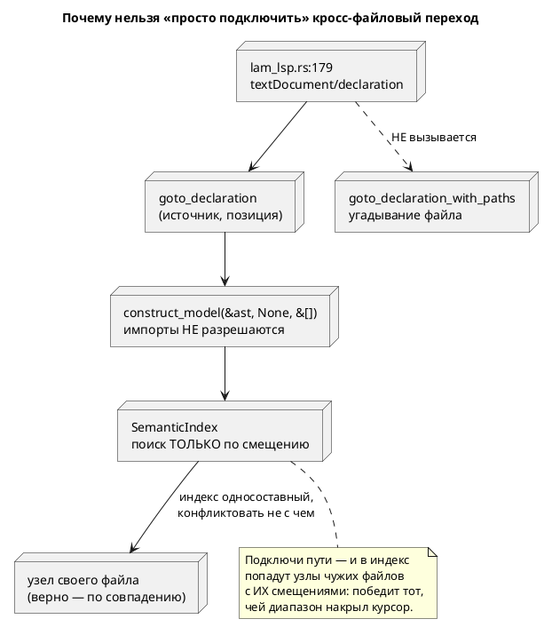

# Фича: Кросс-файловый переход к декларации — точный путь вместо угадывания

- **Номер:** 0056
- **Статус:** **ГОТОВО** (2026-07-17; [отчёт](0056-lsp-goto-exact-file.md#отчёт-о-тестировании) — вердикт «пройдено»)
- **Зависит от:** `0053` (реестр файлов, настоящий `file_no` — `ГОТОВО`),
  `0055` (неявный путь импорта, многофайловость LSP — `ГОТОВО`). Обе закрыты →
  фича **не блокируется**.
- **Связанные issue (анализ):** новая фича (из блока «Кандидаты в фичи»
  `FEATURES.md`: «`goto_declaration` угадывает файл по имени модели»). Кандидат
  вскрыт ADR закрытой [многофайловость LSP — импорты и позиции диагностик](0055-lsp-multifile.md), action item A2.
- **Крейт:** `grammar` (`lsp.rs`, `semantic/index.rs`, `diagnostics.rs`,
  `bin/lam_lsp.rs`).
- **Приоритет / Tier:** Tier 2 — переход к декларации в импортированный файл в
  редакторе **не работает вовсе**.

## Стадии жизненного цикла

Все стадии — **разделы этой карточки**: «Архитектура (ADR)»,
«Анализ», «Разработка», «Тест-план», «Отчёт о тестировании», «Итог».
Отдельным артефактом остаются только исправления —
[`docs/fixes/`](../fixes/README.md) (при необходимости `0056-YY-*`).

## Краткое описание

Кандидат заводился как «`goto_declaration_with_paths` угадывает файл по имени
модели (`to_snake_case`), хотя реестр 0053 даёт точный путь». Проработка (зонды)
показала, что **угадывание — не главная беда**:

1. **Кросс-файловый переход не подключён к серверу.** `lam_lsp.rs:179` зовёт
   однофайловый `goto_declaration`, а `goto_declaration_with_paths` вызывают
   **только тесты** — и все с пустыми путями. То есть в редакторе переход в
   импортированный файл не работает **вообще**, а ветка угадывания никогда не
   исполнялась ни у пользователя, ни в тестах.
2. **Индекс LSP слеп к файлам.** `SemanticIndex::node_at_offset` ищет **только по
   смещению**, а индекс строится по всему дереву, включая импортированные модели.
   Зонд: курсор на `Helper` в `start Main = Helper;` вернул узел `speed` — **из
   `helper.lam`**, потому что его смещения там перекрыли смещение курсора здесь.
3. **`FileTable::default()` даёт первому импорту номер 0** — тот же, что у
   корня. Дефект закрытой 0053 → исправление
   [`FileTable::default()` сталкивает первый импорт с корнем](../fixes/0053-01-file-table-default-collision.md).

Дефекты 2 и 3 сегодня **латентны**: `goto_declaration`/`hover_info` строят модель
без путей поиска, поэтому импорты в них не разрешаются и индекс содержит только
свой файл. **Подключение кросс-файлового перехода их активирует** — значит, чинить
надо до, а не после.

> Фича зарегистрирована из блока «Кандидаты в фичи» `FEATURES.md` (по запросу
> заказчика 2026-07-16); прошла жизненный цикл по своду.

## Архитектура (ADR)

- **Status:** Accepted
- **Date:** 2026-07-16
- **Authors:** Архитектор + Аналитик
- **Related issues:** [Фича](0056-lsp-goto-exact-file.md);
  кандидат из [ADR](0055-lsp-multifile.md#архитектура-adr) (action item A2)

### Context

Кандидат звучал так: «`goto_declaration_with_paths` **угадывает** файл по имени
модели (`to_snake_case` + перебор `search_paths`), хотя реестр 0053 даёт точный
путь». Зонды показали, что угадывание — **третья** по важности проблема из трёх.

#### 1. Кросс-файловый переход не подключён к серверу

`lam_lsp.rs:179` обрабатывает `textDocument/declaration` так:

```rust
let result = grammar::lsp::goto_declaration(text, position)  // однофайловый вариант
```

`goto_declaration_with_paths` не вызывает **никто**, кроме тестов
(`lsp_tests.rs`), и все они передают `&[]`. То есть:

- у пользователя переход в импортированный файл не работает **вообще**;
- ветка угадывания (`for dir in search_paths`) **никогда не исполнялась** — ни в
  продукте, ни в тестах.

Это ровно тот класс, что дал дефект затравки 0010 (`build_buchi` принимал не тот
язык, прожив в зелёном CI): **код без потребителя молча гниёт**.

#### 2. Индекс LSP слеп к файлам — и это опаснее угадывания

`SemanticIndex::node_at_offset(offset)` (`semantic/index.rs:194`) ищет запись
**только по смещению**. Индекс строится по всему дереву — включая
импортированные модели, чьи смещения относятся к **их** файлам.

Зонд (`import "helper.lam"; start Main = Helper;`, курсор на `Helper`, смещение
34):

```text
УЗЕЛ: name=speed kind=Variable loc=Source(0, 19, 37)
```

Вернулся `speed` — переменная **из `helper.lam`**: её смещения там (19..37)
перекрыли смещение курсора здесь. Не «не тот файл найден», а **не тот узел**.
Отсюда и мусорный диапазон перехода.

#### 3. `FileTable::default()` сталкивает первый импорт с корнем

```rust
pub fn add(&mut self, path: &str) -> u64 {
    …
    self.paths.push(path.to_string());
    (self.paths.len() - 1) as u64      // при пустом реестре → 0
}
```

`FileTable::default()` создаёт **пустой** реестр, поэтому первый
зарегистрированный импорт получает номер `0` — тот же, что корень у
`FileTable::new(root)`. Это дефект **закрытой 0053**; вынесен в исправление
[`FileTable::default()` сталкивает первый импорт с корнем](../fixes/0053-01-file-table-default-collision.md).

#### Почему дефекты 2 и 3 сегодня не видны

`goto_declaration` (`lsp.rs:549`) и `hover_info` (`lsp.rs:969`) строят модель
**без путей поиска** (`&[]`) и без пути документа, поэтому импорты в них не
разрешаются, а индекс содержит только свой файл. Дефекты **латентны** — и
**подключение кросс-файлового перехода их активирует**.



### Decision Drivers

1. **Порядок работ задан зависимостью дефектов.** Подключение перехода без
   файлоосознанного индекса даёт **не тот узел** — регресс hover и перехода.
2. **Точный путь уже есть.** Реестр 0053 отдаёт путь по `file_no`; угадывание и
   переразбор файла не нужны.
3. **Не чинить чужой дефект молча.** Столкновение номеров — дефект закрытой
   0053, ему полагается свой исправление, а не растворение в этой фиче.
4. **Код без потребителя гниёт**: подключение к серверу —
   часть фичи, иначе проверять будет нечего.

### Considered Options

#### Option A. Индекс → точный путь → подключение (принято)

Три задачи в жёстком порядке: (1) индекс различает файлы; (2) переход берёт путь
из реестра вместо угадывания; (3) сервер зовёт кросс-файловый вариант.

**Pros:**
- Каждый шаг проверяем отдельно; регресса hover не будет.
- Угадывание и переразбор файла удаляются целиком (~35 строк).
- Порядок отражает зависимость дефектов, а не удобство.

**Cons:**
- Три задачи вместо одной; исправление обязателен раньше всех.

#### Option B. Только заменить угадывание на реестр

**Pros:**
- Малый диффф; закрывает букву кандидата.

**Cons:**
- **Не работает**: сервер эту функцию не зовёт — пользователь не увидит ничего.
- Индекс останется файлослепым.
- Отвергнут: это правка ради строчки в бэклоге.

#### Option C. Подключить сервер, индекс не трогать

**Cons:**
- Активирует латентный дефект 2: переход и hover начнут возвращать узлы чужих
  файлов. Хуже, чем сейчас.

### Decision

Принимается **Option A** с порядком: исправление `0053-01` → `0056-01` (индекс) →
`0056-02` (точный путь) → `0056-03` (подключение).

> **Дополнено при реализации (решение заказчика, 2026-07-17): задача
> `0056-04`.** Этот ADR исходил из того, что курсор на `Helper` возвращает **не
> тот узел** (`speed` из чужого файла) — и, значит, достаточно научить индекс
> различать файлы. Зонды реализации показали, что **нужного узла не существует
> вовсе**: ссылки на модель систематически не несут позиций
> (`Extend::Model(Rc)`, `ConditionNode::Model(Rc)` — оба без `Location`), потому
> что разрешение их стирает. Следствие: критерии **A1/A2 недостижимы** тремя
> задачами выше, а кросс-файловая ветка не могла сработать **никогда** — не
> только «её не звал сервер».
>
> Заказчик выбрал **чинить причину**: позиция — свойство ссылки. Заведена задача
> [кросс-файловый переход к декларации — точный путь вместо угадывания](0056-lsp-goto-exact-file.md#разработка); порядок стал
> `0053-01` → `0056-01` → **`0056-04`** → `0056-02` → `0056-03`.
>
> Урок для будущих ADR: «вернулся не тот узел» и «узла нет» — **разные** диагнозы,
> и зонд, показывающий первое, второго не исключает.

**Индекс становится файлоосознанным**: запись индекса хранит `file_no`, а
`node_at_offset` ищет среди записей **своего** файла. Альтернатива — строить
индекс только по корневой модели — отвергнута: кросс-файловому переходу нужны
узлы импортированных моделей, просто адресуемые по паре `(file_no, offset)`, а не
по одному смещению.

**Путь берётся из реестра** (`FileTable::path(file_no)`), а `to_snake_case` и
переразбор файла **удаляются**. Угадывание не просто лишнее — оно **неверно**:
`import "engine.lam" as Motor;` даёт модель `Motor`, а файл называется
`engine.lam`; кандидаты `motor.lam`/`motor.lam` не совпадут никогда.

**Диапазон в чужом файле** считается по его тексту, прочитанному по пути из
реестра, — тем же приёмом, что `position_prefix`.

### Consequences

#### Положительные

- Переход в импортированный файл работает в редакторе — впервые.
- Удаляется угадывание (`to_snake_case`, перебор кандидатов, переразбор файла).
- Индекс перестаёт путать файлы — это чинит и hover при многофайловости.

#### Отрицательные / Action items

- **A1.** Исправление `0053-01` обязателен до `0056-01`: без него `file_no` импорта
  равен нулю, и файлоосознанный индекс не различит файлы.
- **A2.** `hover_info` строит модель без путей (`&[]`) — импорты в подсказке не
  разрешаются. Вне объёма (другой сценарий), кандидат.
- **A3.** LSP не читает `initializationOptions` — аналог `-I` в редакторе задать
  нечем (кандидат из 0055 сохраняется). Переход найдёт лишь то, что разрешает
  неявный путь (каталог документа).
- **A4.** `Location::uri` для своего файла возвращается пустым (`String::new()`),
  а URI подставляет вызывающий. Оставлено как есть — менять контракт незачем.

#### Acceptance criteria

1. Курсор на имени модели из `import` → переход открывает **тот** файл и то
   место, где модель объявлена.
2. Алиас (`import "engine.lam" as Motor;`) работает — угадывание бы не нашло.
3. Узел под курсором принадлежит **текущему** файлу: зонд-регресс (`speed` из
   `helper.lam`) не воспроизводится.
4. Переход внутри своего файла не изменился.
5. `to_snake_case` и переразбор файла в `lsp.rs` **удалены**.
6. Сервер зовёт кросс-файловый вариант (иначе проверять нечего).
7. Регрессий нет: `precheck.sh` зелёный; версия языка не меняется.

## Анализ

### Цель и контекст

Сделать переход к декларации в **импортированный** файл работающим — и брать путь
из реестра (0053), а не угадывать по имени модели.

Кандидат вскрыт ADR (A2). Проработка (зонды) переставила приоритеты: см.
ADR, Context.

### Зависимости

| Фича / исправление | Статус | Почему зависимость |
|---|---|---|
| 0053 | `ГОТОВО` | `FileTable`, настоящий `file_no` — источник точного пути |
| 0055 | `ГОТОВО` | неявный путь импорта: без него в редакторе нечего разрешать |
| **исправление [`FileTable::default()` сталкивает первый импорт с корнем](../fixes/0053-01-file-table-default-collision.md)** | **Заведён** | `FileTable::default()` даёт импорту номер корня; без исправления файлоосознанный индекс не различит файлы |

Фичи-зависимости закрыты → фича **не блокируется**. Но задача **не может
быть начата** до исправления (ADR, A1).

### Меняет ли фича язык

**Нет.** Правится LSP и семантический индекс; грамматика, АСД и генераторы не
трогаются. Версия языка (0.3.0) не растёт.

### Обратная совместимость

- **Публичный API LSP:** `goto_declaration(source, position)` сохраняется
  (однофайловый, 4 теста). `goto_declaration_with_paths` меняет **поведение**, но
  не сигнатуру; её вызывают только тесты.
- **`SemanticIndex`:** запись получает `file_no`, `node_at_offset` — новый
  параметр либо новый метод. Публичный тип (`semantic::index`), поэтому решение
  фиксируется в 0056-01.
- **Поведение перехода в своём файле не меняется** — критерий A4.

### Что установлено зондами (факты, не предположения)

| # | Факт | Как получен |
|---|---|---|
| Ф1 | Сервер зовёт **однофайловый** `goto_declaration` (`lam_lsp.rs:179`) | чтение кода |
| Ф2 | `goto_declaration_with_paths` вызывают **только тесты**, все с `&[]` | греп по репозиторию |
| Ф3 | Ветка угадывания **никогда не исполнялась** — ни в продукте, ни в тестах | следствие Ф1+Ф2 |
| Ф4 | Индекс ищет **только по смещению**; узел из чужого файла может выиграть | зонд: курсор на `Helper` → узел `speed` из `helper.lam` |
| Ф5 | `FileTable::default()` даёт первому импорту `file_no = 0` | зонд: `loc=Source(0, 19, 37)` у `speed` |
| Ф6 | Дефекты Ф4/Ф5 **латентны**: `goto_declaration`/`hover_info` строят модель без путей → импорты не разрешаются | чтение кода (`lsp.rs:549`, `:969`) |

#### Факты, вскрытые реализацией (2026-07-17) — анализ их не увидел

| # | Факт | Как получен |
|---|---|---|
| Ф7 | **Узла на имени модели не существует вовсе.** Ни `start Main = Helper;`, ни `S(Helper)` не дают записи в индексе: `Extend::Model(Rc)` и `ConditionNode::Model(Rc)` позиции **не несут** | зонд по каждому смещению корневого файла: единственная запись — `Main StartState` (22..42) |
| Ф8 | Следствие Ф7: **A1/A2 недостижимы** тремя задачами плана; кросс-файловая ветка не сработала бы, даже если бы её звали | вывод из Ф7 |
| Ф9 | `import "helper.lam";` связывает имя из **имени файла** (`normalize_camelcase_name("helper")` → `Helper`) с **корнем импортированного файла**, а у корня `name` — `None` | чтение `tree.rs:265-297` + зонд `models` |
| Ф10 | `declaration_range_of` накладывал смещения **чужого** объявления на **свой** текст и возвращал `Some(мусор)` → ранний возврат объявлял успех, и до кросс-файловой ветки дело не доходило **и по этой причине тоже** | чтение кода |
| Ф11 | Без пути документа неявный путь импорта (0055) **не работает**: реестр не знает корня | чтение `search_paths_with_importer_dir` + `FileTable::default()` |

**Следствие Ф7/Ф8 — расширение объёма** решением заказчика: [кросс-файловый переход к декларации — точный путь вместо угадывания](0056-lsp-goto-exact-file.md#разработка). Ф10 уточнила
[кросс-файловый переход к декларации — точный путь вместо угадывания](0056-lsp-goto-exact-file.md)-02, Ф11 — 0056-03 (заведён `goto_declaration_at` по образцу
`collect_diagnostics_at`).

**Главное следствие Ф6:** подключение кросс-файлового перехода (Ф1) **активирует**
Ф4 и Ф5. Поэтому порядок задач жёсткий, а не стилистический.

### Требования

| # | Требование |
|---|---|
| R1 | Запись индекса несёт `file_no`; поиск узла — среди записей **своего** файла |
| R2 | Путь целевого файла берётся из `FileTable::path(file_no)`, а не угадывается |
| R3 | `to_snake_case` и переразбор файла в `lsp.rs` **удалены** |
| R4 | Диапазон в чужом файле считается по его тексту (чтение по пути из реестра) |
| R5 | Сервер зовёт кросс-файловый вариант и подставляет URI цели |
| R6 | Переход в своём файле не изменился |
| R7 | Алиас (`import "engine.lam" as Motor;`) работает |
| R8 | Версия языка и вывод генераторов не меняются |

### Критерии приёмки

Совпадают с ADR (A1–A7); проверяются тест-планом T1–T12.

### Риски

| # | Риск | Митигация |
|---|---|---|
| Р1 | 0056-01 начат до исправления → индекс «различает» файлы по номеру, который у импорта равен нулю | зависимость зафиксирована (ADR A1); тест-контроль исправления: `FileTable::default().add(…) != 0` |
| Р2 | Подключение (0056-03) сделано раньше индекса (0056-01) → hover и переход начнут возвращать чужие узлы | порядок задач; T3 — контроль зонда (`speed` из `helper.lam`) |
| Р3 | Индекс строится только по корневой модели → кросс-файловый переход нечем разрешать | R1: узлы чужих файлов остаются, но адресуются парой `(file_no, offset)` |
| Р4 | Чтение целевого файла с диска на каждый переход — медленно | переход — редкая операция (по нажатию); измерять не требуется |
| Р5 | Угадывание удалено, но какой-то сценарий на нём держался | Ф3: ветка никогда не исполнялась — держаться нечему |

### Декомпозиция разработки

Порядок **жёсткий** (ADR, Decision): каждая следующая задача без предыдущей
даёт регресс, а не половину пользы.

| Задача | Содержание | Предусловие |
|---|---|---|
| [кросс-файловый переход к декларации — точный путь вместо угадывания](0056-lsp-goto-exact-file.md#разработка) | Индекс различает файлы: `(file_no, offset)` | исправление [`FileTable::default()` сталкивает первый импорт с корнем](../fixes/0053-01-file-table-default-collision.md) |
| [кросс-файловый переход к декларации — точный путь вместо угадывания](0056-lsp-goto-exact-file.md#разработка) | Путь из реестра; угадывание и переразбор удалены | 0056-01 |
| [кросс-файловый переход к декларации — точный путь вместо угадывания](0056-lsp-goto-exact-file.md#разработка) | Сервер зовёт кросс-файловый вариант | 0056-02 |

### Что не входит в объём

- **`hover_info` с разрешением импортов** (ADR, A2) — другой сценарий,
  кандидат.
- **`initializationOptions`** (аналог `-I` в редакторе) — кандидат из 0055
  сохраняется: переход найдёт лишь то, что даёт неявный путь (каталог документа).
- **Кэш разобранных файлов** — 0056 читает целевой файл на каждый переход; это
  редкая операция.

## Разработка

### Задача

- **Статус:** **ВЫПОЛНЕНО** (2026-07-17)
- **Предусловие:** исправление [`FileTable::default()` сталкивает первый импорт с корнем](../fixes/0053-01-file-table-default-collision.md)
  — **исправлен первым**, как и предписывал ADR (A1).

#### Что сделано

`SemanticIndex::node_at_offset(offset)` ищет теперь среди записей **корневого**
файла ([`ROOT_FILE_NO`]); для поиска в другом файле заведён
`node_at_offset_in_file(file_no, offset)`. Сигнатура публичного
`node_at_offset` **не изменилась**: курсор всегда стоит в открытом
документе, а он — корень единицы компиляции.

**Номер файла выводится из позиции узла, а не хранится полем.** Причина: во всех
**18** местах построения записи `start`/`end` берутся из того же `Location`, что
кладётся в `node_ref.loc` (проверено чтением каждого). Отдельное поле пришлось бы
проставлять в каждом из них, и первое же забытое место вернуло бы файлослепоту —
ровно тот дефект, который фича и чинит. Корень слепоты, к слову, виден дословно:
во всех 18 местах стояло `if let Location::Source(_, start, end)` — **`file_no`
отбрасывался подчёркиванием**.

##### Находка: одной файлоосознанности мало (расширение объёма)

Задача формулировалась как «индекс возвращает **не тот узел**». Зонд показал, что
**нужного узла не существует вовсе**: ни `start Main = Helper;`, ни
`ref …: S(Helper) = Done;` не давали в индексе записи на имени модели — позиция
ссылки уничтожалась при разрешении. Подробнее — [кросс-файловый переход к декларации — точный путь вместо угадывания](0056-lsp-goto-exact-file.md#разработка), заведённая решением заказчика.

После неё индекс содержит записи вида `ReferenceModel` — **новый вид узла**:
использование имени модели (в отличие от `Model` — её объявления). Именно на нём
и стоит кросс-файловый переход.

Имя для записи восстанавливается `binding_name_of` — поиском ключа в `models` по
тождеству узла (`Rc::ptr_eq`), с подъёмом по `upper`. Иначе никак: `import
"helper.lam";` кладёт под ключ `Helper` **корень импортированного файла**, а у
него `name` — `None` (он анонимен).

#### Как проверено

- **T3** (`lsp_tests.rs::goto_exact_file`) — контроль зонда. Он сперва
  доказывает, что **ловушка взведена** (в `helper.lam` есть узел `speed`, чей
  диапазон 19..37 накрывает смещение курсора 35 здесь), и лишь затем проверяет,
  что под курсором — узел своего файла. Без этой проверки контроль был бы **слеп**:
  первая редакция фикстур (с шапкой-комментарием) сдвигала смещения, пересечение
  исчезало, и тест зеленел впустую.
- **T11** (мутационная, прогнана вручную): снятие фильтра по файлу валит T3 с
  сообщением «фильтр по файлу сломан». Вскрыло, что **основной** assert
  мутацию пропустил бы: после появления `ReferenceModel` верный узел выигрывает
  по размеру диапазона и без фильтра. Ловит только проверка взведённости.
- **T4**: существующие `node_at_position_*`/`hover_*` зелены — поиск в своём
  файле не изменился.

#### Что есть сейчас

`SemanticIndex::node_at_offset(offset)` (`semantic/index.rs:194`) ищет запись
**только по смещению**, а индекс строится по всему дереву — включая
импортированные модели, чьи смещения относятся к **их** файлам.

Зонд (`import "helper.lam"; start Main = Helper;`, курсор на `Helper`):

```text
УЗЕЛ: name=speed kind=Variable loc=Source(0, 19, 37)
```

Вернулась переменная `speed` **из `helper.lam`**: её смещения там (19..37)
накрыли смещение курсора здесь (34). Это **не тот узел**, а не «не тот файл».

Сегодня дефект **латентен**: `goto_declaration` и `hover_info` строят модель без
путей поиска, импорты не разрешаются, и в индексе только свой файл. Подключение
кросс-файлового перехода ([кросс-файловый переход к декларации — точный путь вместо угадывания](0056-lsp-goto-exact-file.md#разработка)) его
**активирует** — поэтому индекс правится первым.

#### Что сделать

1. Запись индекса (`IndexEntry`) несёт `file_no` — берётся из `Location::Source`.
2. Поиск узла ведётся среди записей **заданного** файла: `node_at_offset` получает
   номер файла (новый параметр либо новый метод — решить при реализации; тип
   публичный, см. анализ, «Обратная совместимость»).
3. Узлы импортированных моделей из индекса **не выбрасываются**: они нужны
   переходу ([кросс-файловый переход к декларации — точный путь вместо угадывания](0056-lsp-goto-exact-file.md#разработка)) — меняется адресация,
   а не состав.

#### Как проверить

- **Контроль зонда:** курсор на `Helper` возвращает узел **текущего** файла (модель
  `Helper` как использование), а не `speed` из `helper.lam`.
- Поиск в своём файле не изменился (существующие тесты `node_at_position_*`,
  `hover_*`).
- Контроль исправления: `FileTable::default().add("lib.lam") != 0`.

### Задача

- **Статус:** **ВЫПОЛНЕНО** (2026-07-17)
- **Предусловие:** [кросс-файловый переход к декларации — точный путь вместо угадывания](0056-lsp-goto-exact-file.md#разработка) + заведённая при
  реализации [кросс-файловый переход к декларации — точный путь вместо угадывания](0056-lsp-goto-exact-file.md#разработка).

#### Что сделано

Угадывание удалено: `to_snake_case`, перебор кандидатов и переразбор файла —
**49 строк**. Путь целевого файла берётся из реестра (`FileTable::path`).

##### Главная находка: дефект был глубже, чем описано

План говорил «угадывание неверно». Верно, но **до угадывания дело не доходило**:
`declaration_range_of` возвращал `Range`, вычисляя его по тексту **текущего**
документа — даже когда объявление найдено в импортированном файле. Смещения
чужого файла накладывались на свой текст, функция отдавала `Some(мусор)`, и
ранний возврат в `goto_declaration_with_paths` объявлял успех. Кросс-файловая
ветка ниже была недостижима **и по этой причине тоже**.

Лечение: `declaration_range_of` → **`declaration_location_of`**, возвращающая
`Location` — она несёт **номер файла**, а `Range` несёт только строку и колонку.
Решать, чей это файл, обязан вызывающий: у него есть реестр. Добавлена ветка
`ReferenceModel`.

##### Вторая находка: нужен путь документа, иначе неявный путь импорта мёртв

`goto_declaration_with_paths(source, position, search_paths)` не знает пути
документа, поэтому реестр создавался `FileTable::default()` — корень неизвестен,
и **неявный путь импорта  не работает**: `import "helper.lam";` не
разрешится, даже когда файл лежит рядом. А ADR (A3) именно на неявный путь и
рассчитывал.

Заведён `goto_declaration_at(path, source, position, search_paths)` — форма
дословно повторяет `collect_diagnostics_at` (тот же довод, тот же прецедент 0055).
Прежняя `goto_declaration_with_paths` **сохранена** как обёртка с
пустым путём и честной оговоркой в документации.

Однофайловая `goto_declaration` тоже уточнена: отдаёт диапазон, **только если
объявление в своём файле**. Прежде она молча возвращала мусор для чужого.

#### Как проверено

- **T5**: `uses_helper.lam` → открывается `helper.lam`, строка 0.
- **T6** (контрпример): `uses_alias.lam` (`import "engine.lam" as Motor;`) →
  открывается **`engine.lam`**. Угадывание искало бы `motor.lam` — не нашло бы
  никогда.
- **T8**: диапазон в чужом файле считается по **его** тексту (строка объявления
  вычисляется из текста `engine.lam`, а не угадывается).
- **T7**: переход в своём файле — URI пуст (контракт A4 сохранён).
- **T9**: `to_snake_case` в `lsp.rs` отсутствует (греп).

#### Что есть сейчас

`goto_declaration_with_paths` (`lsp.rs:581`) ищет файл **угадыванием**:

```rust
let candidate_stem = to_snake_case(&model_name);
for dir in search_paths {
    for candidate in &[format!("{}.lam", candidate_stem),
                       format!("{}.lam", model_name.to_lowercase())] {
        // читает файл, ПЕРЕразбирает его, строит семантику заново…
```

Три беды:

1. **Угадывание неверно в принципе.** `import "engine.lam" as Motor;` даёт модель
   `Motor`, а файл — `engine.lam`: кандидаты `motor.lam`/`motor.lam` не совпадут
   никогда. Докблок функции это признаёт: «Если имя модели не совпадает с
   нормализованным именем файла, переход может не найти нужный файл».
2. **Переразбор** файла — дерево уже построено, узел импортированной модели уже
   в нём.
3. **Ветка никогда не исполнялась** — ни у пользователя (сервер зовёт другой
   вариант), ни в тестах (все передают `&[]`).

#### Что сделать

1. Строить модель через `construct_model_with_files` — получить `FileTable`.
2. Путь целевого файла — `files.path(file_no)` из `Location` найденной
   декларации. Никакого перебора кандидатов.
3. Диапазон — по тексту целевого файла, прочитанному по этому пути (приём
   `position_prefix`).
4. **Удалить** `to_snake_case`, перебор кандидатов и переразбор файла (~35 строк).

#### Как проверить

- Алиас `import "engine.lam" as Motor;` → переход открывает `engine.lam`
  (угадывание бы не нашло — это и есть контрпример к прежнему коду).
- Имя файла = имя модели (`import "helper.lam";`) → тоже работает.
- Переход в своём файле не изменился.
- `to_snake_case` в `lsp.rs` отсутствует (греп).

### Задача

- **Статус:** **ВЫПОЛНЕНО** (2026-07-17)
- **Предусловие:** [кросс-файловый переход к декларации — точный путь вместо угадывания](0056-lsp-goto-exact-file.md#разработка).

#### Что сделано

`lam_lsp.rs` в обработчике `textDocument/declaration` зовёт
`goto_declaration_at(&uri_to_path(uri), text, position, &[])` — с **путём
документа**, как это уже делает обработчик диагностик. URI ответа
берётся из результата: пустой — значит свой файл, и подставляется URI документа
(контракт ADR, A4); непустой — разбирается в `Uri` цели.

Контроль — **T10** (`goto_exact_file::t10_server_calls_cross_file_goto`): проверяет,
что сервер зовёт `goto_declaration_at` и **не** зовёт однофайловый вариант.
Проверка нарочно грубая (греп по исходнику сервера): поднять настоящий
LSP-процесс в юните нечем, а без контроля задача обратима одной строкой — ровно то,
как дефект и возник.

Ловушка `#[cfg(feature = "lsp")]` **сработала и в этот раз** (третий подряд
после 0053 и 0055): обычная `cargo test` тесты LSP не видит. Все прогоны шли
`--all-features`; финальный — `precheck.sh`.

#### Что есть сейчас

`lam_lsp.rs:179` обрабатывает `textDocument/declaration` **однофайловым**
вариантом:

```rust
let result = grammar::lsp::goto_declaration(text, position).map(|range| {
    GotoDeclarationResponse::Scalar(Location { uri: uri.clone(), range })
});
```

URI ответа — **всегда текущий документ**. Кросс-файловый вариант
(`goto_declaration_with_paths`) не зовёт никто, кроме тестов. Поэтому переход в
импортированный файл в редакторе не работает **вообще** — а вся работа
[кросс-файловый переход к декларации — точный путь вместо угадывания](0056-lsp-goto-exact-file.md#разработка) без этой задачи останется невидимой
(урок: код без потребителя молча гниёт).

#### Что сделать

1. Звать кросс-файловый вариант, передавая **путь документа** (`uri_to_path`,
   заведён фичей) — тогда работает неявный путь импорта.
2. URI ответа брать из результата: свой файл → URI документа; чужой → URI цели
   (`file://…`).
3. Пустой `Location::uri` («текущий файл») сохраняется как контракт — подставляет
   вызывающий (ADR, A4).

#### Как проверить

- Сквозной сценарий: курсор на имени импортированной модели → ответ указывает на
  **другой** URI и на место объявления в нём.
- Переход внутри своего файла отвечает прежним URI и диапазоном.

Тесты LSP живут под `#[cfg(feature = "lsp")]` — обычная `cargo build` их не
видит; ловит только `precheck.sh` (`--all-features --all-targets`). Ловушка
срабатывала дважды подряд (фичи и 0055).

### Задача

- **Статус:** **ВЫПОЛНЕНО** (2026-07-17)
- **Заведена:** при реализации, **решением заказчика** — расширение объёма.
  Проработкой не предусмотрена.
- **Предусловие:** [кросс-файловый переход к декларации — точный путь вместо угадывания](0056-lsp-goto-exact-file.md#разработка) (файлоосознанный индекс).
- **Блокировала:** [кросс-файловый переход к декларации — точный путь вместо угадывания](0056-lsp-goto-exact-file.md#разработка) — без узла под курсором
  переходу не на чем сработать.

#### Почему задача появилась

ADR исходил из того, что курсор на `Helper` возвращает **не тот узел** (`speed`
из `helper.lam`), и достаточно научить индекс различать файлы. Зонды при
реализации показали иное: **нужного узла не существует вовсе** — ни в одном
сценарии.

| Форма ссылки на модель | Узел дерева | Позиция |
|---|---|---|
| `start Main = Helper;` | `Extend::Model(Rc<ModelNode>)` | **уничтожалась** на этапе 1 |
| `ref …: S(Helper) = Done;` | `ConditionNode::Model(Rc<ModelNode>)` | **уничтожалась** при разрешении |

Зонд по каждому смещению корневого файла (`uses_helper.lam`) давал **одну**
запись — `Main StartState` (22..42). На имени `Helper` (35..41) записи не было.
Для `S(Helper)` индексировалось только имя функции `S` (45..46), аргумент — нет.

Следствие: критерии **A1** (переход на имени модели) и **A2** (алиас) были
**недостижимы** тремя запланированными задачами, а кросс-файловая ветка
`goto_declaration_with_paths` не могла сработать **никогда** — не только «её не
звал сервер», но и звать было бесполезно.

Ссылки на модель в семантическом дереве **систематически не несли позиций** — это
свойство дерева, а не частный недосмотр.

#### Решение (заказчик, 2026-07-17): чинить причину

Позиция — **свойство ссылки**, а не костыль рядом с ней. Отвергнуты:
хранение сырого АСД рядом с разрешённым (по образцу `named_block_raw`) и
сужение фичи до механизма без пользы.

##### Что сделано

`Extend::Model(Rc)` → `Extend::Model(Rc, Location)`;
`ConditionNode::Model(Rc)` → `ConditionNode::Model(Rc, Location)`.
Второе поле — позиция **использования** (use-site), как у уже существовавшего
`ConditionNode::Variable(Rc, Location)` («Второе поле — позиция использования
переменной… Позволяет индексу LSP найти узел по курсору») — то есть приём в
кодовой базе не новый.

##### Две находки, изменившие форму правки

**1. `ExpressionNode` трогать не понадобилось — наоборот, убрано лишнее звено.**
Цепочка была `ast::Expression` → `ExpressionNode` → `Extend`, причём
промежуточный узел строился **только** чтобы тут же быть разобранным; на нём и
терялась позиция. Заводить поле в `ExpressionNode::Model` значило бы тащить
позицию через ~40 вариантов перечисления, где её никто не читает. Вместо этого
`unroll_ast_extend` разворачивает АСД **прямо** в `Extend`, а
`unroll_expression_ast` (35 строк) удалена. Правка стала меньше, а не больше.

**2. Позиция обязана быть невидимой для равенства — иначе тихо поехал бы
кодоген.** `Extend` выводил `PartialEq`, а `ModelNode`/`StateNode` сравнивают
своё поле `implements`; `ConditionNode` сравнивает `Rc<RefCell<ModelNode>>`. То
есть use-site попал бы в равенство **транзитивно**, и две ссылки на одну и ту же
модель из разных мест текста стали бы разными узлами. Поэтому `PartialEq for
Extend` написан вручную и позицию **игнорирует** — ровно как уже сделано у
`ConditionNode` («Location (use-site) намеренно игнорируется»).

Это ловилось рассуждением, а не тестами: проверка «а сравнивается ли `Extend`
вообще» дала единственное место — `ModelNode::PartialEq` (`mod.rs:286`), — и
именно оно делает риск реальным.

##### Индексация

Заведён вид узла `SemanticNodeKind::ReferenceModel` — **использование** имени
модели (в отличие от `Model` — объявления). Записи создают:

- `collect_extend_entries` — обходит дерево `Extend` (`A + B`, `(C | D)`);
- ветка `ConditionNode::Model` в `collect_condition_entries` — форма `S(Helper)`.

Синтетическая модель композиции (`M1 + M2`) несёт `Location::Codegen` и в индекс
не попадает: её придумал компилятор, в тексте её нет.

`declaration_location_of` для `ReferenceModel` отдаёт `loc` **целевой** модели —
в ней и лежит номер чужого файла.

#### Как проверено

- Зонд до правки: на имени `Helper` узла нет; после — `Helper ReferenceModel` в
  обеих формах (`= Helper` и `S(Helper)`).
- **T5/T6** (`lsp_tests.rs::goto_exact_file`) — переход открывает `helper.lam` и
  (по алиасу) `engine.lam`.
- Регресс: 2050 тестов, `precheck.sh` зелёный. Вывод генераторов не изменился —
  стережёт проверка детерминизма фичи (два прогона × 7 целей → `diff -r`).

#### Границы

- `ConditionNode::State(Rc)` позиции **по-прежнему не несёт** — переход на имя
  состояния в `S(Ping) = End` не работает. Тот же класс, но другой сценарий:
  заведён кандидатом в `FEATURES.md`.
- Синтетические модели композиции не адресуемы — и не должны быть.

## Тест-план

- **Статус:** сформирован (фича в `РАЗРАБОТКА`, код не написан).

### Область и цель

Проверяется **что произойдёт по нажатию «перейти к декларации»**: какой файл
откроется и на каком месте. Не проверяется наличие `file_no` в индексе — это
механизм; ровно из-за отсутствия потребителя ветка угадывания и прожила
непроверенной.

**Ключевой принцип плана.** Фича активирует **латентные** дефекты (индекс слеп к
файлам; `FileTable::default()` даёт импорту номер корня). Поэтому у каждого
«стало работать» обязан быть **контроль-регресс**: hover и переход внутри своего
файла не должны сломаться, а зонд-находка не должна воспроизвестись.

### Проверки (условие → ожидаемый результат)

| # | Проверка | Предусловие | Ожидаемый результат | Ссылка на R/A |
|---|---|---|---|---|
| T1 | **Контроль исправления:** импорт не получает номер корня | `FileTable::default()` | `add("lib.lam") != 0` | исправление / Р1 |
| T2 | Реестр `new(root)`: корень — 0, импорт — не 0 | `FileTable::new("main.lam")` | `path(0) == "main.lam"`, `add(…) == 1` | исправление |
| T3 | **Контроль зонда:** узел под курсором — из текущего файла | `import "helper.lam"; start Main = Helper;`, курсор на `Helper` | узел **не** `speed` из `helper.lam` | R1 / A3 / Р2 |
| T4 | Поиск узла в своём файле не изменился | существующие фикстуры | `node_at_position_*`, `hover_*` зелены | R6 / A4 |
| T5 | Переход: имя файла = имя модели | `import "helper.lam";` | открыт `helper.lam`, место объявления | R2 / A1 |
| T6 | Переход: **алиас** (контрпример угадыванию) | `import "engine.lam" as Motor;` | открыт `engine.lam` (угадывание искало `motor.lam`) | R7 / A2 |
| T7 | Переход в своём файле | `var counter; … counter` | прежний URI и диапазон | R6 / A4 |
| T8 | Диапазон в чужом файле считается по **его** тексту | `helper.lam` | диапазон указывает на объявление, а не на случайное место | R4 |
| T9 | Угадывание удалено | греп | `to_snake_case` в `lsp.rs` отсутствует | R3 / A5 |
| T10 | Сервер зовёт кросс-файловый вариант | `lam_lsp.rs` | ответ несёт URI **цели**, а не всегда текущий | R5 / A6 |
| T11 | **Мутационная:** индекс снова ищет по одному смещению | убрать фильтр по `file_no` | краснеет T3 | Р2 |
| T12 | Регрессий нет; язык и вывод генераторов не изменены | — | `precheck.sh` зелёный | R8 / A7 |

> **T3 оказалась бы слепой без проверки взведённости ловушки** (вскрыто
> реализацией). Контроль обязан **сначала** доказать, что в чужом файле есть узел,
> накрывающий смещение курсора, и лишь затем проверять, что победил свой. Две
> причины:
> (1) первая редакция фикстур (с шапкой-комментарием) смещения **не**
> пересекала — путать было нечего, и тест зеленел бы впустую;
> (2) прогон T11 показал, что **основной** assert мутацию пропускает: после
> появления `ReferenceModel` верный узел выигрывает по размеру диапазона и без
> фильтра. Мутацию ловит **только** проверка взведённости — она и даёт диагноз
> «фильтр по файлу сломан».

### Разбивка проверок по функциональности

<!-- Легенда: ✅ пройдено · ❌ провалено · ⬜ не проверялось · — не применимо -->

| Функциональность | Затронута чем | Проверки | Статус |
|---|---|---|---|
| `SemanticIndex` | поиск по паре `(file_no, offset)`; новый вид `ReferenceModel` | T3, T4, T11 | ✅ |
| Реестр файлов (0053) | исправление `Default` | T1, T2 | ✅ |
| LSP: переход | путь из реестра; угадывание удалено | T5–T9 | ✅ |
| LSP: hover | использует тот же индекс | T4 | ✅ |
| LSP: диагностики (0055) | не затронуты | `lsp_tests.rs::lsp_multifile` | ✅ |
| Компилятор / генераторы | **затронуты**: `Extend::Model`/`ConditionNode::Model` получили `Location` (0056-04) | проверка детерминизма 0048; `git diff examples/generated/` | ✅ вывод **побайтно не изменился** |

> **Расширение объёма (решение заказчика 2026-07-17).** План исходил из
> «индекс возвращает не тот узел». Зонды показали, что **нужного узла не
> существует вовсе**: ссылки на модель не несли позиций (`Extend::Model`,
> `ConditionNode::Model`), поэтому **A1/A2 были недостижимы** тремя
> запланированными задачами. Заведена задача
> [кросс-файловый переход к декларации — точный путь вместо угадывания](0056-lsp-goto-exact-file.md#разработка) — позиция как
> свойство ссылки. Проверка «генераторы не затронуты» заменена на «вывод не
> изменился» и подтверждена пустым диффом `examples/generated/`.

### Тестовые данные и окружение

**Фикстуры** (завести в `grammar/tests/data/goto56/`) — пара «угадывание
сработало бы / не сработало бы»:

| Фикстура | Роль |
|---|---|
| `helper.lam` (модель `Helper`) | имя файла совпадает с именем модели — угадывание нашло бы |
| `uses_helper.lam` | `import "helper.lam";` — переход обязан открыть `helper.lam` |
| `engine.lam` (модель `Engine`) | **контрпример:** имя файла ≠ имени модели после алиаса |
| `uses_alias.lam` | `import "engine.lam" as Motor;` — угадывание искало бы `motor.lam` и не нашло |

**Тесты LSP — под `#[cfg(feature = "lsp")]`**: обычная `cargo build` их не
видит, собирает только `precheck.sh` (`--all-features --all-targets`). Ловушка
срабатывала дважды подряд (0053, 0055).

**Где живут проверки:** `grammar/tests/lsp_tests.rs` (T3–T10),
`grammar/tests/diagnostics_file_tests.rs` (T1, T2); регресс — `precheck.sh` (T12).

### Как воспроизвести

```sh
cargo test -p grammar --features lsp --test lsp_tests -- --test-threads=1
cargo test -p grammar --test diagnostics_file_tests -- --test-threads=1
./scripts/precheck.sh
```

## Отчёт о тестировании

### Резюме

**Пройдено; фича готова к закрытию (`ГОТОВО`).** T1–T12 зелёные,
`./scripts/precheck.sh` — код возврата 0, регресс — **2050** тестов
(`--all-features`), 0 падений.

Переход к декларации в импортированный файл **работает в редакторе — впервые**.
Курсор на `Helper` в `start Main = Helper;` открывает `helper.lam` на объявлении
модели; курсор на `Motor` в файле с `import "engine.lam" as Motor;` открывает
**`engine.lam`** — случай, который угадывание не нашло бы никогда.

**Объём был расширен решением заказчика** (задача `0056-04`): проработка не
увидела, что ссылки на модель не несут позиций, из-за чего A1/A2 были
недостижимы. Разбор — ниже.

### Фактические результаты по проверкам

| # | Проверка | Результат | Комментарий |
|---|---|---|---|
| T1 | Контроль исправления: импорт не получает номер корня | ✅ | `FileTable::default().add("lib.lam") != 0`. Слот 0 резервируется при любом способе создания реестра; инвариант назван — `ROOT_FILE_NO` |
| T2 | Реестр `new(root)`: корень — 0, импорт — 1 | ✅ | нумерация не изменилась |
| T3 | **Контроль зонда:** узел под курсором — из текущего файла | ✅ | под курсором `Helper ReferenceModel` из файла 0, а не `speed` из `helper.lam`. См. «Выводы»: без проверки взведённости ловушки контроль был бы слеп |
| T4 | Поиск узла в своём файле не изменился | ✅ | `node_at_position_*`, `hover_*` зелены; сигнатура `node_at_offset` не менялась |
| T5 | Переход: имя файла = имя модели | ✅ | `uses_helper.lam` → `helper.lam`, строка 0 |
| T6 | Переход: **алиас** (контрпример угадыванию) | ✅ | `uses_alias.lam` → `engine.lam`. Угадывание искало бы `motor.lam` |
| T7 | Переход в своём файле | ✅ | URI пуст — контракт A4 сохранён |
| T8 | Диапазон в чужом файле — по **его** тексту | ✅ | строка объявления вычисляется из текста `engine.lam` (3-я строка, после шапки), а не угадывается |
| T9 | Угадывание удалено | ✅ | `to_snake_case` в `lsp.rs` отсутствует; удалено 49 строк |
| T10 | Сервер зовёт кросс-файловый вариант | ✅ | `goto_declaration_at` с путём документа; однофайлового варианта в обработчике нет |
| T11 | **Мутационная:** снятие фильтра по файлу валит T3 | ✅ | диагноз точный: «фильтр по файлу сломан». См. «Выводы» |
| T12 | Регрессий нет; язык и вывод генераторов не изменены | ✅ | `precheck.sh` — 0; **`git diff examples/generated/` пуст** — вывод всех 7 целей побайтно тот же |

### Результаты по функциональности

| Функциональность | Затрагивается | Статус |
|---|---|---|
| Язык `.lam` | нет | ✅ версия не росла |
| `SemanticIndex` | поиск по `(file_no, offset)`; новый вид `ReferenceModel` | ✅ |
| Реестр файлов (0053) | исправление `Default` | ✅ |
| LSP: переход | путь из реестра; угадывание удалено; новый вход `goto_declaration_at` | ✅ |
| LSP: hover | тот же индекс + ветка `ReferenceModel` | ✅ |
| LSP: диагностики (0055) | не затронуты | ✅ |
| Семантические узлы `Extend::Model`, `ConditionNode::Model` | **да** — получили `Location` (0056-04) | ✅ вывод генераторов не изменился |

**Обратная совместимость.** `node_at_offset`, `goto_declaration`,
`goto_declaration_with_paths` сохранили сигнатуры. Публичные перечисления
`Extend` и `ConditionNode` получили по полю в варианте `Model` — изменение
несовместимое **для внешнего сопоставления**, но оба типа разбираются только
внутри `grammar`/`simulation`, и оба крейта в дереве. Обоснование расширения — в
задаче [кросс-файловый переход к декларации — точный путь вместо угадывания](0056-lsp-goto-exact-file.md#разработка).

### Выводы и дальнейшие шаги

**Главный вывод: «вернулся не тот узел» и «узла нет» — разные диагнозы.**
Зонд проработки показал, что курсор на `Helper` возвращает `speed` из чужого
файла, и из этого был сделан вывод «индекс слеп к файлам». Слеп он был, и это
починено. Но за верным наблюдением скрывался второй факт, которого зонд не
проверял: **записи на имени модели в индексе нет вовсе** — ни для
`start Main = Helper;`, ни для `S(Helper)`. Позицию уничтожает разрешение:
`Extend::Model(Rc)` и `ConditionNode::Model(Rc)` несут только ссылку.

Значит, критерии A1/A2 были **недостижимы** тремя запланированными задачами, а
кросс-файловая ветка `goto_declaration_with_paths` не сработала бы, даже если бы
её звали. Заказчик выбрал чинить причину — заведена задача `0056-04`.

**Три находки, изменившие форму правки** (детали — в
[кросс-файловый переход к декларации — точный путь вместо угадывания](0056-lsp-goto-exact-file.md#разработка)):

1. **Правка вышла меньше, а не больше.** Цепочка `ast::Expression` →
   `ExpressionNode` → `Extend` строила промежуточный узел **только** чтобы тут же
   его разобрать; на нём и терялась позиция. Разворот АСД **прямо** в `Extend`
   сохранил позицию и **убрал** лишнее звено (`unroll_expression_ast`, 35 строк).
   Трогать `ExpressionNode` (~40 вариантов) не потребовалось.
2. **Позиция обязана быть невидимой для равенства.** `Extend` выводил
   `PartialEq`, а `ModelNode::PartialEq` сравнивает `implements` — то есть
   use-site попал бы в равенство **транзитивно**, и две ссылки на одну модель из
   разных мест текста стали бы разными узлами. `PartialEq for Extend` написан
   вручную и позицию игнорирует — как уже сделано у `ConditionNode::Variable`.
   Риск снят **рассуждением**, а не тестом; подтверждение — пустой дифф
   `examples/generated/`.
3. **Без пути документа неявный путь импорта (0055) мёртв.** Реестр не знал
   корня, и `import "helper.lam";` не разрешался бы, даже когда файл рядом.
   Заведён `goto_declaration_at(path, …)` — форма дословно повторяет
   `collect_diagnostics_at`.

**Вывод о тестах: контроль обязан доказывать, что ловушка взведена.** T3 в первой
редакции зеленел бы впустую: фикстуры с шапкой-комментарием не пересекали
смещений — путать было нечего. Хуже: прогон T11 показал, что **основной** assert
мутацию пропускает (после появления `ReferenceModel` верный узел выигрывает по
размеру и без фильтра). Мутацию ловит **только** проверка взведённости. Приём
стоит обобщить: *контроль, не проверяющий наличие ловушки, проверяет собственную
удачу*.

**Подтверждено в третий раз подряд** (0053, 0055, 0056): тесты LSP живут под
`#[cfg(feature = "lsp")]`, и обычная `cargo test` их **не видит**. Все прогоны
велись `--all-features`.

**Заведено в бэклог**: `ConditionNode::State(Rc)` позиции
по-прежнему не несёт — переход на имя **состояния** в `S(Ping) = End` не
работает. Тот же класс, что чинила 0056-04, но другой сценарий.

**Исправлений (`docs/fixes/0056-YY-*`) не потребовалось.** Исправление
[`FileTable::default()` сталкивает первый импорт с корнем](../fixes/0053-01-file-table-default-collision.md) (дефект **закрытой**
[позиции в диагностиках (`файл:строка:колонка`) и настоящий `file_no`](0053-diagnostics-file-id.md), вскрытый проработкой 0056) **исправлен** в объёме этой фичи — как и
предписывал ADR (A1).

**Остаётся вне границ** (как постановил ADR): `hover_info` не разрешает импорты
(A2); LSP не читает `initializationOptions` — аналога `-I` в редакторе нет (A3,
кандидат из 0055). Переход находит лишь то, что даёт неявный путь (каталог
документа) и явные `search_paths`.

## Итог (что сделано)

Закрыта **2026-07-17**. Детали — в [отчёте](0056-lsp-goto-exact-file.md#отчёт-о-тестировании)
(T1–T12 зелёные, `precheck.sh` — 0, регресс 2050 тестов `--all-features`).

**Переход в импортированный файл работает в редакторе — впервые.** Курсор на
`Helper` открывает `helper.lam`; курсор на `Motor` (при `import "engine.lam" as
Motor;`) — **`engine.lam`**, то есть случай, который угадывание не нашло бы
никогда.

Сделано по порядку ADR (каждый шаг без предыдущего давал регресс):

1. **Исправление [`FileTable::default()` сталкивает первый импорт с корнем](../fixes/0053-01-file-table-default-collision.md)** — дефект
   закрытой 0053. Слот `0` резервируется под корень при **любом** способе
   создания реестра; инвариант назван `ROOT_FILE_NO`.
2. **[кросс-файловый переход к декларации — точный путь вместо угадывания](0056-lsp-goto-exact-file.md#разработка)** — индекс ищет по
   паре `(file_no, offset)`. Корень слепоты: во всех **18** местах построения
   стояло `Location::Source(_, start, end)` — номер файла отбрасывался
   подчёркиванием. Номер теперь **выводится** из позиции узла, а не дублируется
   полем: разойтись они не могут по построению.
3. **[кросс-файловый переход к декларации — точный путь вместо угадывания](0056-lsp-goto-exact-file.md#разработка)** — заведена
   при реализации **решением заказчика**: позиция как свойство ссылки
   (`Extend::Model`, `ConditionNode::Model`). Без неё A1/A2 недостижимы.
4. **[кросс-файловый переход к декларации — точный путь вместо угадывания](0056-lsp-goto-exact-file.md#разработка)** — путь из реестра;
   `declaration_range_of` → `declaration_location_of` (`Location` несёт номер
   файла, `Range` — нет); угадывание удалено (49 строк).
5. **[кросс-файловый переход к декларации — точный путь вместо угадывания](0056-lsp-goto-exact-file.md#разработка)** — сервер зовёт
   `goto_declaration_at` с путём документа.

**Ключевая находка.** Проработка исходила из «индекс возвращает **не тот узел**».
Зонды показали, что **нужного узла не существует вовсе**: ссылки на модель
систематически не несли позиций. Урок: *«вернулся не тот узел» и «узла нет» —
разные диагнозы*.

**Вывод о тестах.** Контроль T3 был бы **слеп** без проверки взведённости ловушки:
мутационный прогон T11 показал, что основной assert снятие фильтра пропускает.
*Контроль, не проверяющий наличие ловушки, проверяет собственную удачу.*

**Вывод о правке.** Починка причины вышла **меньше** обхода: разворот АСД прямо в
`Extend` сохранил позицию и убрал лишнее звено (`unroll_expression_ast`).
Затронуть `ExpressionNode` (~40 вариантов) не потребовалось. Вывод генераторов —
**побайтно тот же** (пустой дифф `examples/generated/`).

**Заведено в бэклог:** `ConditionNode::State(Rc)` позиции не несёт — переход на
имя состояния в `S(Ping) = End` не работает (тот же класс, другой сценарий).
