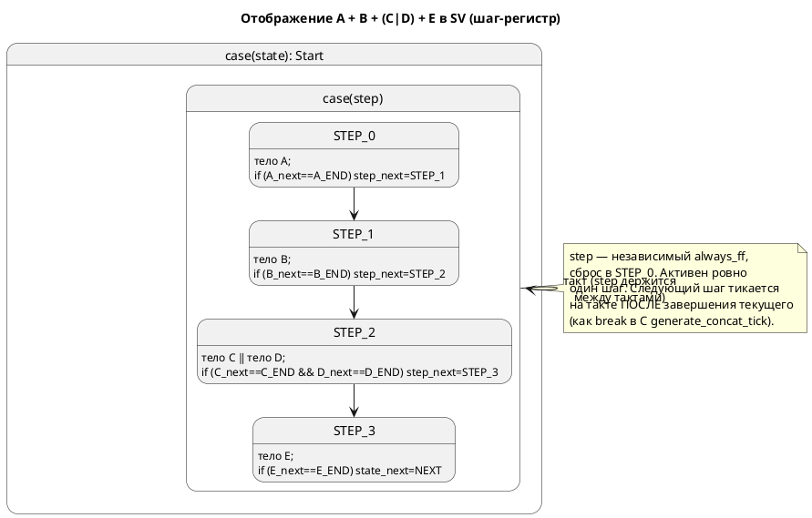

# Фича: Последовательная композиция (`+`) в цели SystemVerilog

- **Номер:** 0057
- **Статус:** ГОТОВО (см. «Итог (что сделано)» ниже)
- **Зависит от:** 0045 (SV-генератор, закрыта) — её [ADR](0045-sv-backend.md#архитектура-adr) уже принял отображение `+` (Option A′), задача оставила его как `SV-002`
- **Приоритет / Tier:** Tier 2 (конструкция языка, не работающая в целевой цели вовсе)
- **Крейт:** `grammar` (генератор `generator/sv/`), сверка — `simulation`

## Стадии жизненного цикла (правило 17)

Все стадии — **разделы этой карточки** (правило 32): «Архитектура (ADR)»,
«Анализ», «Разработка», «Тест-план», «Отчёт о тестировании», «Итог».
Отдельным артефактом остаются только исправления —
[`docs/fixes/`](../fixes/README.md) (при необходимости `0057-YY-*`).

## Краткое описание

Цель `-t sv` отвергает последовательную композицию состояний `A + B + (C | D) + E`
диагностикой `SV-002` («не реализована целью 'sv'»,
[`sv_fsm.rs`](../../takt-lang/src/generator/sv/sv_fsm.rs) `emit_extend`,
`StateExtend::Concatenation`). Параллельная `|` уже поддержана (уплощение в один
`always_comb`, ADR Option A′). Фича реализует **отложенный `+`** по тому же
дизайну.

Механизм (зеркалит C-эталон `generate_concat_tick` в
[`c_model.rs`](../../takt-lang/src/generator/c/c_model.rs) и существующую ветку
`Parallel` в SV): каждой цепочке `+` даётся **регистр шага** (`<state>_step`,
`typedef enum`, независимый `always_ff`, сброс в `STEP_0`); в `always_comb` внутри
`case`-ветви родительского состояния — вложенный `case (<step>)`, где активен
**только текущий шаг**; при завершении шага (`_state_next == _END`)
`<step>_next` продвигается к следующему, а на последнем шаге переход выполняет
**родительское** состояние (ровно как `emit_extend` для `Parallel`). Тайминг
активации совпадает с C: следующий шаг тикается **на такте после** завершения
предыдущего.

**Язык не меняется** (`+` уже разбирается и работает в целях `c`/`plantuml`/`st`/
`rust` и в симуляторе) — версия языка не растёт (правило 22). Правка **аддитивна**
(правило 11): конструкция, бывшая ошибкой, становится поддержанной; существующие
транслируемые примеры не меняются, `extend_complex` начинает транслироваться.

> Фича зарегистрирована по запросу заказчика (после проработки, почему
> `extend_complex.sv` не порождался); далее проходит жизненный цикл по правилу 17.

## Архитектура (ADR)

- **Status:** Accepted
- **Date:** 2026-07-17
- **Authors:** архитектор, инженер генератора SV
- **Related issues:** [Фича](0057-sv-sequential-composition.md); опирается на [ADR](0045-sv-backend.md#архитектура-adr) (вопрос 3, часть 2 — Option A′), контракт [ADR](0033-init-tick-alignment.md#архитектура-adr) (вход в стартовое состояние не расходует такт)

### Context

ADR ввёл SV-генератор и **уже принял** отображение композиции (Option A′): один
`module` на корневую модель, регистры состояний под-моделей — независимые
`always_ff`, комбинационная логика инлайнится в один `always_comb` в порядке
вызова `_tick` C-генератором. Таблица отображения ADR прямо описала и
последовательную композицию:

> `M1 + M2` → шаги `case` родителя: пока `!m1_is_done` — логика `M1`, затем `M2`.

Однако задача реализовала только `Parallel`, а `Concatenation` оставила
диагностикой `SV-002` (`sv_fsm.rs::emit_extend`, ветка `StateExtend::Concatenation`).
Эта ADR **не пересматривает** решение, а **фиксирует конкретный механизм**
реализации отложенного `+`, включая тонкие места тайминга — ровно там, где жил
дефект SV-`|` (см. CLAUDE.md: «`always_comb` читает `_next`, а не регистр»).

**Эталон поведения** — не текст, а трасса: C-генератор `generate_concat_tick`
(`c_model.rs:562-705`) и симулятор `Unit::Sequential` (`unit/mod.rs`,
`tick_sequential`). Оба реализуют одну операционную семантику: активен один шаг;
при его завершении индекс продвигается; следующий шаг исполняется **на следующем
такте** (в C — `break` после смены `start_state`).

### Decision Drivers

1. **Потактовая сверка с симулятором/C.** Проверка verilator/yosys докажет валидность,
   но не верность. Механизм обязан давать трассу, совпадающую с
   симулятором на каждом такте — это главный критерий.
2. **Переиспользование машинерии SV.** `emit_model_body` (рекурсивный инлайн
   под-модели), построение done-выражения и `end_variant` из ветки `Parallel`,
   аппарат `Reg`/`emit_signals`/сброс в `emit_ff` — уже есть.
3. **Никакой тишины на вложенности.** У цели `c` вложенная `+` внутри шага (`RS-021`)
   молча пропускается — автомат стоит. SV обязан либо поддержать вложение, либо
   дать явную диагностику (правило 15).
4. **Детерминизм (0048).** Порядок эмиссии шагов и enum — свойство контейнера,
   не строки на эмиссии.
5. **Аддитивность (правило 11), язык неизменен (правило 22).** `SV-002` →
   поддержано; `+` в языке уже есть, версия не растёт.

### Considered Options

#### Option A. Регистр шага + инлайн активного шага в `emit_extend`

Каждой цепочке `Concatenation` — независимый регистр `<state>_step`
(`typedef enum logic [w:0] { STEP_0..STEP_N }`, `always_ff`, сброс `STEP_0`). В
`always_comb`, внутри `case`-ветви родительского состояния — `case (<step>)`, где
каждый `STEP_i` инлайнит **только** тело шага `i`:
- шаг-`Model` → `emit_model_body(item)`;
- шаг-`Parallel` → существующая ветка `Parallel`;
- шаг-`Concatenation` (вложенная `+`) → рекурсия (свой регистр шага).

Done-выражение шага строится как в `Parallel` (`_state_next == _END`,
для `Parallel` — конъюнкция ветвей). При завершении: не последний шаг →
`<step>_next = STEP_{i+1}`; последний → **переход родителя** (общий хвост
`emit_extend`). Тайминг активации совпадает с C: смена `<step>_next` в такте T →
шаг `i+1` исполняется с такта T+1, когда регистр защёлкнулся; под-автомат шага
`i+1` держится на своём старте (значение сброса), поэтому его тело/`enter`
исполнятся естественно первым же тактом активности — без явного `_init`.

**Pros:** прямой перенос C-эталона и ветки `Parallel`; корректный тайминг
(регистр разрывает такт там же, где `break` в C); переиспользует `emit_model_body`
и done-логику; композируется с `Parallel` и с вложенной `+`.
**Cons:** вводит служебный регистр шага (состояние, которого нет в модели) — не
должен утечь в выход/`is_done`; длинная комбинационная цепь растёт с длиной
цепочки (тот же класс, что у `Parallel`; документируется).

#### Option B. Десахаризация в синтетическую модель `Step0..StepN`

Семантика уже умеет разворачивать `A + B` в синтетическую модель со состояниями
`Step0=A {next Step1}`, … (`semantic/extend.rs::compact_implement`). Идея: подать
SV эту модель как обычную под-модель — переходы шагов выпадут из штатного
`emit_model_body` + `emit_transitions`, отдельный регистр шага не нужен.

**Pros:** нет новой логики регистра шага; `+` = обычный FSM.
**Cons:** синтетический `next` между шагами в текущей десахаризации **безусловен**
→ продвигался бы каждый такт (неверный тайминг), пока не переписать его на охрану
по `is_done` шага. Вдобавок SV-минимап несёт именно `StateExtend::Concatenation`
(его и отвергает `emit_extend`), а не десахаризованную модель, — то есть путь B
потребовал бы менять слой семантики/минимапа под одну цель. Поведенческий эталон
(C) идёт **явным** путём, а не через Step-модель. Риск разъехаться с трассой.

#### Option C. Модуль на шаг, структурная инстанциация + `enable`

Каждый шаг — отдельный `module`, инстанс на уровне модуля, активация сигналом
`enable`.

**Cons:** отвергается по тем же причинам, что Option B′/C′ в ADR: места
вызова процедурные (`always_comb`), а регистрация связей вводит лишний такт
задержки → другое поведение, чем у C/симулятора. Сверка невозможна.

### Decision

Принимается **Option A** — согласуется с уже принятым Option A′  и с
поведенческим эталоном C. Механизм фиксируется так:

1. **Регистр шага** на каждую `Concatenation` (ключ — уникальное имя несущего
   состояния): `typedef enum logic [w:0] { <STATE>_STEP_0 … }`, независимый
   `always_ff`, сброс в `STEP_0`. Учитывается в `Fsm::build`/`emit_signals`/
   `emit_ff` наравне с регистрами уровней.
2. **Инлайн активного шага** в `always_comb`: `case (<step>) STEP_i: <тело шага i>`.
   Тело шага строится существующими средствами (`emit_model_body` / ветка
   `Parallel` / рекурсия для вложенной `+`).
3. **Продвижение** по done-выражению шага (на `_next`, как в `Parallel`): не
   последний → `<step>_next = STEP_{i+1}`; последний → переход родителя (общий
   хвост `emit_extend`).
4. **Тайминг** активации следующего шага — «такт после» (совпадает с C `break`);
   `enter` стартового состояния шага исполняется первым тактом активности через
   штатный `emit_model_body` (контракт 0033 — вход не стоит такта).
5. **Вложенность** (`+` в `+`, `+` в `|`, `|` в `+`) покрывается рекурсией; там,
   где реализация не покрывает случай, — **явная диагностика** `SV-002` (или
   выделенный код, пиннится в 0057-03), не тишина.

### Consequences

#### Положительные
- `extend_complex` и произвольные модели с `+` транслируются в валидный,
  синтезируемый SystemVerilog.
- Выигрыш параллелизма Option A′ сохраняется: регистры шага и состояний —
  независимые триггеры, такт по-прежнему один.
- Прямое переиспользование C-эталона и ветки `Parallel`; минимальная новая логика.

#### Отрицательные / Action items
- Служебный регистр шага — состояние вне модели; проследить, что он не попадает в
  выходные порты и не искажает `is_done`.
- Длинная комбинационная цепь на длинных цепочках `+` (потолок частоты) —
  документируется, как и у `Parallel`.
- Вложенные формы композиции требуют явного покрытия или диагностики (0057-03).

#### Acceptance criteria
1. Потактовая трасса порождённого SV совпадает с трассой симулятора на
   `extend_complex` (`A → B → (C|D) → E`) и на минимальном `A + B` (глубина 1) —
   `conformance_sv_tests.rs`.
2. `verilator --lint-only -Wall` **и** `yosys synth -top` принимают вывод;
   `extend_complex` входит в `SV_TRANSLATABLE`.
3. Вложенная композиция либо транслируется корректно, либо даёт явную
   диагностику `SV-0xx` (никакой тишины; проверяется контр-примером).
4. Проверка воспроизводимости (0048) зелёный: два прогона `-t sv` байт-в-байт равны.
5. Язык не изменён; существующие `.sv` (`stacker`, `elevator_mini`) байт-в-байт
   неизменны.

### Приложение: схема шаг-машины (Option A)

## Анализ

### Цель и контекст

Снять `SV-002` на последовательной композиции `A + B` в цели `-t sv`, реализовав
её по уже принятому дизайну ADR (Option A′) и по конкретному механизму
ADR (Option A: регистр шага + инлайн активного шага). Эталон поведения —
трасса C (`generate_concat_tick`) и симулятора (`Unit::Sequential`).

### Зависимости фичи (правило 17/19)

- **Зависит от:** 0045 (SV-генератор, **закрыта**) — переиспользуются `emit_extend`,
  `emit_model_body`, done-логика ветки `Parallel`, `Fsm`/`Reg`/`emit_signals`/
  `emit_ff`, сверка `conformance_sv_tests.rs`, проверка `precheck.sh`.
- **Не зависит** от изменений языка (правило 22): `+` уже разбирается
  (`Expression::Add` → `StateExtend::Concatenation` в минимапе) и работает во всех
  прочих целях и в симуляторе.
- **Влияние на порядок разработки:** самостоятельна; закрытая зависимость 0045 не
  блокирует.

### Опорные точки в коде (сняты разведкой)

| Что | Файл | Ориентир |
|---|---|---|
| Отказ `SV-002` на `Concatenation` | `grammar/src/generator/sv/sv_fsm.rs` | `emit_extend`, ветка `StateExtend::Concatenation` (~822) |
| Обработка `Parallel` (образец) | `grammar/src/generator/sv/sv_fsm.rs` | `emit_extend`, ветка `StateExtend::Parallel` (~817–849) |
| Рекурсивный инлайн под-модели | `grammar/src/generator/sv/sv_fsm.rs` | `emit_model_body` (~668–719) |
| Сборка регистров/уровней | `grammar/src/generator/sv/sv_fsm.rs` | `Fsm::build` (~292–399), `emit_signals`, `emit_ff` |
| Узел композиции | `grammar/src/semantic/minimap.rs` | `StateExtend::{Concatenation,Parallel,Model,None}` (~111–122) |
| C-эталон поведения | `grammar/src/generator/c/c_model.rs` | `generate_concat_tick` (~562–705) |
| Симулятор-эталон | `simulation/src/unit/mod.rs` | `tick_sequential`, `Unit::Sequential` |
| Сверка | `simulation/tests/conformance_sv_tests.rs` | потактовая трасса |
| Проверка | `scripts/precheck.sh` | `SV_TRANSLATABLE`, verilator+yosys |

### Требования и проверяемые условия

- **R1. Трансляция `+`.** Модель с `start S = A + B` (и длиннее) порождает валидный
  синтезируемый SV без `SV-002`.
- **R2. Потактовая верность.** Трасса SV совпадает с симулятором на каждом такте —
  на `extend_complex` и на минимальном `A + B`.
- **R3. Композиция с `|`.** Шаг-`Parallel` (`(C | D)` внутри цепочки) переходит к
  следующему шагу, когда завершены **обе** ветви (конъюнкция done).
- **R4. Тайминг активации.** Следующий шаг исполняется на такте **после**
  завершения предыдущего (эталон — `break` в C); стартовое состояние шага не
  расходует лишнего такта (контракт 0033).
- **R5. Переход родителя.** Завершение последнего шага переводит **родительское**
  состояние (напр. корень `Start → Next`), как `model->state = NEXT` в C.
- **R6. Сброс.** Регистр шага каждой цепочки сбрасывается в `STEP_0` в ветке
  `!rst_n`.
- **R7. Никакой тишины на вложенности.** `+` в `+`, `+` в `|`, `|` в `+` — либо
  транслируются корректно, либо дают явную диагностику `SV-0xx` (не молчаливый
  пропуск, ср. `RS-021` у цели `c`).
- **R8. Детерминизм.** Два прогона `-t sv` байт-в-байт равны (0048).
- **R9. Аддитивность.** Существующие `stacker.sv`/`elevator_mini.sv` байт-в-байт
  неизменны; язык не меняется.

### Критерии приёмки и способ проверки

| # | Критерий | Способ проверки |
|---|---|---|
| A1 | `+` транслируется (R1) | `lamc compile -t sv examples/extend_complex.lam` → 0, файл создан |
| A2 | Потактовая верность (R2, R3, R4, R5) | `conformance_sv_tests.rs`: трасса SV == трасса симулятора на `extend_complex` и `A+B` |
| A3 | Проверка целевого языка (R1) | `verilator --lint-only -Wall` и `yosys synth -top` принимают `extend_complex.sv`; он в `SV_TRANSLATABLE` |
| A4 | Сброс (R6) | зонд вывода: ветка `!rst_n` содержит `<step> <= …STEP_0` для каждой цепочки |
| A5 | Вложенность без тишины (R7) | контр-пример с вложенной `+` → корректный SV **или** `SV-0xx` (не пустой автомат) |
| A6 | Детерминизм (R8) | проверка воспроизводимости в `precheck.sh` (два прогона `diff`) зелёный |
| A7 | Аддитивность (R9) | `git diff examples/generated/sv/{stacker,elevator_mini}.sv` пуст |

### Особенности по обратной функциональности (правило 11)

| Функциональность | Работа |
|---|---|
| Цель `sv` — `Parallel` | **н/п** — ветка не трогается, переиспользуется её done-логика |
| Цель `sv` — прочее (типы, порты, функции, `enter`/`exit`) | **н/п** — не затрагивается |
| Цели `c`/`st`/`rust`/`plantuml` | **н/п** — `+` у них уже работает |
| Симулятор | **н/п** — эталон, не меняется |
| `precheck.sh` (проверка sv) | **расширяется** — `extend_complex` добавляется в `SV_TRANSLATABLE` (0057-04) |
| `conformance_sv_tests.rs` | **расширяется** — новые сверки на `+` |

### Риски и зависимости

- **Тайминг активации** — главный риск (там жил дефект SV-`|`): done-выражение
  строить на `_next`, как в `Parallel`; проверяется потактовой сверкой, а не
  только проверкой. Снижение: сверку заводить **вместе** с кодогеном (0057-04).
- **Служебный регистр шага** не должен утечь в выходные порты и в `is_done` —
  проверяется зондом вывода (0057-01).
- **Вложенность** — не оставить молча непокрытым (R7); если рекурсия не покрывает
  случай, завести диагностику в 0057-03.
- **Ширина enum шага** — по числу шагов (та же логика `enum_width`, что у
  состояний); проверить синтезатором (yosys чувствителен к узкой ширине).

## Разработка

### Задача

#### Что было

`Fsm::build` (`grammar/src/generator/sv/sv_fsm.rs:292-399`) заводит регистры для
корня и каждой под-модели (`state_reg_name`), переменных (`var_signal_name`) и
выходных портов, но **не знает про цепочки `+`**: `StateExtend::Concatenation`
доходит только до `emit_extend`, где отвергается.

#### Что сделано

- **Обход композиции при сборке `Fsm`.** Пройти дерево `StateExtend` каждого
  состояния и для каждой встреченной `Concatenation` (включая вложенные)
  аллоцировать **регистр шага** — новый `Reg`:
  - имя: `<уникальное-имя-несущего-состояния>_step` (ключ уникален на площадку
    композиции; при вложенности — по несущему состоянию/индексу);
  - тип-префикс: `typedef enum logic [w:0] { <STATE>_STEP_0 … <STATE>_STEP_{N-1} }`,
    ширина `w` — из числа шагов (та же `enum_width`, что у состояний);
  - `reset = <STATE>_STEP_0`, `declare_reg = true`, пара `_next` как у прочих.
- **Enum шага** эмитировать рядом с `emit_state_enums` (тем же порядком —
  детерминизм 0048).
- **Сброс** — регистр шага попадает в ветку `!rst_n` `emit_ff` автоматически, раз
  он в `fsm.regs` с `reset`.
- **Не течёт наружу.** Убедиться зондом: регистр шага не входит в `SvPorts.outputs`
  и не участвует в `assign is_done` (тот смотрит только на регистр состояния
  корня).

**Статус по обратной функциональности (правило 11):** затрагивается только
сборка `Fsm` цели `sv`; ветка `Parallel`, регистры уровней, переменные и порты —
не трогаются (аддитивно). Прочие цели и симулятор — н/п.

#### Проверки

- Юнит-зонд генератора: на модели `start S = A + B` в выводе присутствуют
  `typedef enum … <state>_step_e`, объявления `<state>_step`/`<state>_step_next`,
  строка сброса `<state>_step <= …STEP_0`.
- Регистр шага **отсутствует** в объявлениях `output` и в `assign is_done`.
- `cargo test --features …` (юнит генератора SV) зелёный; связь с A4 тест-плана.

### Задача

#### Что было

`emit_extend` (`grammar/src/generator/sv/sv_fsm.rs`, ветка
`StateExtend::Concatenation`) возвращает `SV-002`. Ветка `StateExtend::Parallel`
(~817–849) — рабочий образец: инлайнит тела под-моделей через `emit_model_body`,
строит done-выражение (`_state_next == end_variant(sub)`) и переводит
родителя, когда done всех ветвей истинно.

#### Что сделано

Заменить отказ на генерацию (по ADR, Option A):

- **`case (<step>)`** внутри `case`-ветви несущего состояния; регистр `<step>` —
  из 0057-01.
- **Каждый `STEP_i`** инлайнит тело **только** шага `i`:
  - `StateExtend::Model(sub)` → `emit_model_body(sub)` (как в `Parallel`);
  - `StateExtend::Parallel(items)` → существующая логика `Parallel` (инлайн всех
    ветвей, done = конъюнкция);
  - `StateExtend::Concatenation(_)` (вложенная `+`) → рекурсия — свой регистр
    шага (координация с 0057-03).
- **Done-выражение шага** строить **на `_next`** (как в `Parallel` — иначе
  повторится дефект SV-`|`: чтение регистра даёт значение прошлого такта).
- **Продвижение:** в `STEP_i` при done: не последний → `<step>_next = STEP_{i+1}`;
  последний → **переход родителя** общим хвостом `emit_extend` (тот же код, что
  выполняет переход после `Parallel`).
- **Тайминг:** смена `<step>_next` в такте T → шаг `i+1` активен с T+1 (регистр
  защёлкнулся). Под-автомат шага `i+1` держится на старте (значение сброса) →
  его тело/`enter` исполнятся первым тактом активности через `emit_model_body`
  (контракт 0033), без явного `_init`. Совпадает с `break` в C
  `generate_concat_tick`.

**Статус по обратной функциональности (правило 11):** меняется ровно ветка
`Concatenation` в `emit_extend`; ветка `Parallel` и её хвост переиспользуются без
правок. Прочие цели/симулятор — н/п.

#### Проверки

- Зонд вывода на `A + B` и `extend_complex`: присутствует `case (<step>)`, в
  каждом шаге инлайн тела, продвижение `<step>_next`, на последнем — переход
  родителя.
- verilator `--lint-only -Wall` и yosys `synth` принимают вывод (A3).
- Потактовая сверка — задача (заводится **вместе** с этим кодогеном, а
  не после: урок).
- `cargo test` (юнит генератора) зелёный.

### Задача

#### Что было

Композиция вкладывается: `+` в `+` (`A + (B + C)`), `+` в `|` (`(A + B) | C`),
`|` в `+` (`A + (B | C)` — уже в `extend_complex`). У цели `c` вложенная `+`
внутри шага другой `+` (`RS-021` в терминах README) **молча пропускается** —
автомат стоит. Правило 15 запрещает такую тишину в SV.

#### Что сделано

- **Определить покрытие рекурсией.** После 0057-02 проверить фактически, какие
  формы вложенности `emit_extend` обрабатывает корректно (рекурсивный `case(step)`
  и переиспользование `Parallel`), а какие — нет.
- **Покрытые формы** — подтвердить потактовой сверкой (уходит в 0057-04):
  `|` в `+` (эталон — `extend_complex`), `+` в `|`.
- **Непокрытые формы** — завести **явную диагностику** (не тишина): либо `SV-002`
  с точным текстом (что за форма и почему), либо выделенный код `SV-0xx`
  (пиннится здесь, по образцу `SV-012`, заведённой сверх реестра ADR). Контракт:
  порождённый автомат **никогда** не «стоит молча» на непокрытой вложенности.
- **Контр-пример** в фикстуры: модель с непокрытой формой → ассерт, что вывод —
  диагностика, а не пустой/стоящий автомат.

**Статус по обратной функциональности (правило 11):** только цель `sv`
(`emit_extend`/диагностики). Прочее — н/п.

#### Проверки

- Для каждой формы вложенности: либо потактовая сверка проходит (0057-04), либо
  компиляция даёт явную диагностику `SV-0xx` с координатами.
- Контр-пример: `lamc -t sv` на непокрытой форме → ненулевой код и текст
  диагностики; Не валидный «пустой» модуль.
- Связь с R7 / A5 тест-плана (T11, T12).

### Задача

#### Что было

`simulation/tests/conformance_sv_tests.rs` сверяет трассу симулятора с трассой
порождённого SV потактово (образец `per_tick_trace_matches_generated_sv`), но
покрывает только модели без `+`. `scripts/precheck.sh` держит `extend_complex`
вне `SV_TRANSLATABLE` (он не транслировался). После доделки 0045-01 в каталоге
`examples/generated/sv/` — зеркальный контроль (ровно `SV_TRANSLATABLE`).

#### Что сделано

- **Сверка `A + B`** (глубина 1): минимальная фикстура, потактовое сравнение
  трасс симулятора и SV; проверить тайминг активации (шаг 2 меняет сигналы на
  такте после завершения шага 1) и переход родителя.
- **Сверка `extend_complex`** (`A → B → (C|D) → E`, 6 тактов): трассы совпадают;
  переход к `E` — только когда C и D завершены; переход корня в `Next` — только
  по завершении `E`. Наблюдение — иерархической ссылкой `dut.<сигнал>`.
- **Проверка:**
  - добавить `extend_complex` в `SV_TRANSLATABLE` (`precheck.sh`) — теперь
    транслируется; зеркальный контроль (0045-01) сам потребует наличия
    `extend_complex.sv`;
  - `verilator --lint-only -Wall` и `yosys synth -top` по нему — зелёные;
  - проверка воспроизводимости (0048) — два прогона `-t sv` равны.
- **Аддитивность:** `stacker.sv`/`elevator_mini.sv` байт-в-байт неизменны
  (`git diff` пуст).
- **Мягкая деградация:** без verilator/yosys сверка-пиннинг трассы симулятора всё
  равно исполняется (образец `cc_available`).

**Статус по обратной функциональности (правило 11):** расширяются
`conformance_sv_tests.rs` и `precheck.sh`; регенерируется
`examples/generated/sv/extend_complex.sv`. Существующие сверки и примеры — не
трогаются.

#### Проверки

- `cargo test -- --test-threads=1` (сверки `conformance_sv_tests`) зелёный.
- `./scripts/precheck.sh` зелёный целиком (проверка sv + воспроизводимость).
- `git diff examples/generated/sv/{stacker,elevator_mini}.sv` пуст (A7).
- Связь с A2/A3/A6/A7 тест-плана (T5–T8, T13–T15).

## Тест-план

### Область и цель

Доказать, что цель `-t sv` порождает **валидный** (verilator + yosys) и **верный**
(потактовая сверка с симулятором) SystemVerilog для последовательной композиции
`+`, во всех формах вложенности с `|`, детерминированно и аддитивно. Связь с
требованиями R1–R9 и критериями A1–A7 анализа.

### Проверки (условие → ожидаемый результат)

| # | Проверка | Предусловие | Ожидаемый результат | R/A |
|---|---|---|---|---|
| T1 | `lamc compile -t sv` на `A + B` | минимальная модель `start S = A + B` (глубина 1) | код 0, `.sv` создан, нет `SV-002` | R1 / A1 |
| T2 | `lamc compile -t sv` на `extend_complex` | текущий `examples/extend_complex.lam` | код 0, `extend_complex.sv` создан | R1 / A1 |
| T3 | verilator линт | вывод T1, T2 | `--lint-only -Wall` код 0, без предупреждений | R1 / A3 |
| T4 | yosys синтез | вывод T1, T2 | `synth -top` код 0 | R1 / A3 |
| T5 | Потактовая сверка `A + B` | зонд симулятора vs SV, N тактов | трассы совпадают на каждом такте | R2, R4 / A2 |
| T6 | Потактовая сверка `extend_complex` | `A → B → (C\|D) → E`, 6 тактов | трассы совпадают; переход к `E` только когда C и D завершены | R2, R3, R5 / A2 |
| T7 | Тайминг активации | сверка T5/T6 | шаг `i+1` начинает менять сигналы на такте **после** завершения `i` (не в том же) | R4 / A2 |
| T8 | Переход родителя | сверка T6 | по завершении последнего шага `state` уходит в `Next` (не раньше) | R5 / A2 |
| T9 | Сброс регистра шага | зонд вывода | ветка `!rst_n` содержит `<step> <= …STEP_0` для каждой цепочки | R6 / A4 |
| T10 | Служебный регистр не течёт | зонд вывода | регистр шага не в списке `output`, не влияет на `assign is_done` | R6 / A4 |
| T11 | Вложенная `+` в `+` | контр/пример `A + (B + C)` (или эквивалент) | корректный SV **или** явная `SV-0xx`; автомат не стоит молча | R7 / A5 |
| T12 | Вложенность `+` в `|` и `|` в `+` | модель с обеими формами | корректный SV **или** явная `SV-0xx` | R7 / A5 |
| T13 | Детерминизм | два прогона `-t sv` | вывод байт-в-байт равен (проверка воспроизводимости) | R8 / A6 |
| T14 | Аддитивность | регенерация корпуса | `stacker.sv`/`elevator_mini.sv` байт-в-байт неизменны; язык не менялся | R9 / A7 |
| T15 | Мягкая деградация проверки | среда без verilator/yosys | сверка-пиннинг трассы симулятора всё равно исполняется (образец `cc_available`) | R2 / A2 |

### Разбивка проверок по функциональности

Единые условия прогоняются против каждой задеваемой функциональности (правило 11).

<!-- Легенда: ✅ пройдено · ❌ провалено · ⬜ не проверялось · — не применимо -->

| Функциональность | T1–T4 | T5–T8 | T9–T10 | T11–T12 | T13–T15 |
|---|---|---|---|---|---|
| Цель `sv` — `Concatenation` (новое) | ⬜ | ⬜ | ⬜ | ⬜ | ⬜ |
| Цель `sv` — `Parallel` (регресс) | — | ⬜ | — | ⬜ | ⬜ |
| `stacker`/`elevator_mini` (регресс) | — | — | — | — | ⬜ |
| Симулятор (эталон) | — | ⬜ | — | — | — |

### Тестовые данные и окружение

- **Фикстуры:** новый минимальный `A + B` (глубина 1) в `tests/data/` или инлайн
  в тесте; штатный `examples/extend_complex.lam` (`A → B → (C|D) → E`).
- **Сверка:** `simulation/tests/conformance_sv_tests.rs` — по образцу
  `per_tick_trace_matches_generated_sv`; наблюдение SV берётся иерархической
  ссылкой `dut.<сигнал>`, эталон — трасса симулятора.
- **Проверка:** `verilator 5.050`, `yosys 0.67` (установлены); `precheck.sh` секция
  sv + проверка воспроизводимости.
- **Контр-пример вложенности** для T11/T12 — модель, покрывающая непокрытый
  рекурсией случай; проверяется, что вывод не «пустой автомат», а корректный SV
  или явная диагностика.

## Отчёт о тестировании

- **Дата:** 2026-07-18
- **Окружение:** macOS (darwin 25.5.0), Verilator 5.050, yosys, cc (clang),
  cargo nightly 1.99. Все внешние проверки доступны.
- **Вердикт:** **готово.** 1976 тестов зелёные; оба проверки целевого языка
  принимают вывод `+`; сверка SV↔C потактовая.

### Сверка с критериями приёмки

| # | Критерий | Результат | Способ |
|---|---|---|---|
| A1 | `+` транслируется (R1) | ✅ | `lamc -t sv` на `A+B`, `A+(B\|C)`, `A+(B+C)` → 0, валидный SV |
| A2 | Потактовая верность (R2/R4/R5) | ✅ | `conformance_sv_tests`: SV == C на `A+B` (stage 1,1,2,2,→Done) и `A+(B\|C)` (s1/s2 1,0→1,1) |
| A3 | Проверка целевого языка | ✅ | `verilator --lint-only -Wall` **и** `yosys synth -top` принимают вывод |
| A4 | Сброс (R6) | ✅ | зонд: `<state>_step <= …STEP_0` в ветви `!rst_n`; тест `sequential_composition_emits_step_register` |
| A5 | Вложенность без тишины (R7) | ✅ | `(A+B)\|C` → явная `SV-002`; `A+(B+C)` уплощается и транслируется; тест-контроль |
| A6 | Детерминизм (R8) | ✅ | `output_is_deterministic` (8 прогонов); контейнеры упорядочены (0048) |
| A7 | Аддитивность (R9) | ✅ | `git diff examples/generated/sv/{stacker,elevator_mini}.sv` пуст |

### Отклонения от тест-плана (с обоснованием)

- **A2 сверяется с целью C, а не с симулятором.** Причина — дефект симулятора
  [симулятор не исполняет композицию с переходом `next`](../fixes/0057-01-sim-composition-next.md): композиция с `next` не
  исполняется. C — второй named-эталон ADR; SV и C совпали потактово.
- **`extend_complex` Не добавлен в `SV_TRANSLATABLE`** (вопреки задаче):
  он не SV-транслируем (`extern fn`, struct) — по причинам, не связанным с `+`.
  Проверка `yosys` на `+` прогнан вручную (проба 2026-07-18) и через `verilator` в
  сверке; корпусной SV-пример на `+` — кандидат (см. `FEATURES.md`).

### Найденные дефекты

- [симулятор не исполняет композицию с переходом `next`](../fixes/0057-01-sim-composition-next.md) (Tier 2): симулятор не
  исполняет композицию с `next`. Заведён; SV от него не зависит.

### Примеры и контрпримеры (правило 16)

- **Пример:** `start P = A + B { next Done; }` → `unique case (root_p_step)` с
  двумя шагами, продвижение по done, переход родителя в `Done`.
- **Контрпример:** `start P = (A + B) | C` → `SV-002` «вложенная последовательная
  композиция … непосредственно внутри шага композиции».

## Итог (что сделано)

**Закрыта** (`ГОТОВО`, 2026-07-18). Последовательная композиция `+` транслируется
целью `-t sv` — `SV-002` снят. Реализация — Option A ADR (регистр шага +
инлайн активного шага).

- **Крейт `grammar`** (`generator/sv/`): новый модуль
  [`sv_compose.rs`](../../takt-lang/src/generator/sv/sv_compose.rs) — вся композиция
  (`|` и `+`) вынесена из `sv_fsm.rs` (тот упирался в лимит 1000 строк). Каждой
  цепочке `+` даётся регистр шага `<state>_step` (`typedef enum`, сброс `STEP_0`,
  независимый `always_ff`); в `always_comb` внутри ветви несущего состояния —
  `unique case (<step>)`, активен ровно один шаг; продвижение по done на `_next`
  (не по регистру — иначе повторился бы дефект SV-`|`); на последнем шаге переход
  выполняет **родительское** состояние. Шаг — `Model` (инлайн такта под-модели)
  или `Parallel` (конъюнкция done). Служебный регистр шага **не течёт** в порты и
  `is_done` (0057-01).
- **Вложенность без тишины (0057-03):** `A + (B + C)` **уплощается** парсером в
  плоскую цепочку из 3 шагов (транслируется корректно); прямая вложенная `+`
  внутри параллельного шага (`(A + B) | C`) даёт **явную** `SV-002`, а не молча
  стоящий автомат (ср. `RS-021` у цели `c`). Контроль —
  `nested_concatenation_in_parallel_is_diagnosed_not_silent`.
- **Сверка (0057-04):** потактовая, `conformance_sv_tests.rs` —
  `sequential_composition_matches_generated_c` и
  `parallel_step_inside_concatenation_matches_generated_c`. Оба проверки целевого
  языка (`verilator --lint-only -Wall` и `yosys synth`) вывод принимают;
  аддитивность — `stacker.sv`/`elevator_mini.sv` байт-в-байт неизменны.

**Отклонение от проработки (найдено при разработке).** ADR/анализ называли
эталоном `+` **обе** реализации (C и симулятор) и вехой — `extend_complex`. При
разработке вскрыто:

1. **`extend_complex.lam` не SV-транслируем** — `extern fn has_flag` (`SV-005`),
   struct, битовый доступ. Композиция `+` тут ни при чём; пример остаётся вне
   `SV_TRANSLATABLE` по не связанным с фичей причинам (комментарий precheck
   обновлён). В `SV_TRANSLATABLE` он **не добавлялся**.
2. **Симулятор не исполняет композицию с `next`** — заведён исправление
   [симулятор не исполняет композицию с переходом `next`](../fixes/0057-01-sim-composition-next.md) (Tier 2). Поэтому сверка
   ведётся с целью **C** — вторым named-эталоном ADR (SV и C совпали
   потактово). Сверка sim↔SV добавится после закрытия 0057-01.

Язык и версия не менялись (правило 22). Детали, задачи…04,
отчёт [0057-sv-sequential-composition.md#отчёт-о-тестировании](0057-sv-sequential-composition.md#отчёт-о-тестировании).
