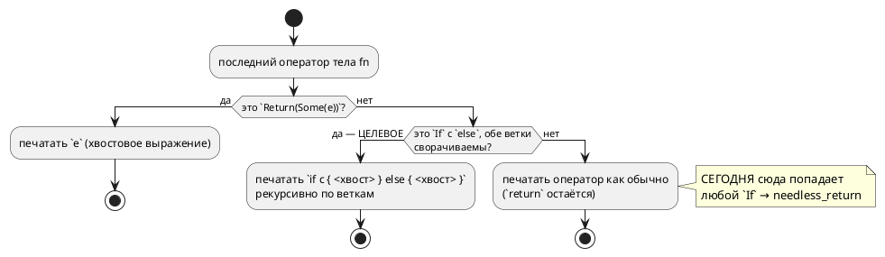

# Фича: Цель `rust`: хвостовой `if/else` с `return` даёт `needless_return`

- **Номер:** 0058
- **Статус:** ГОТОВО (см. «Итог (что сделано)» ниже)
- **Зависит от:** **нет** (проверено аналитиком 2026-07-17 — см. [анализ](0058-rust-tail-return-if-else.md#анализ), раздел «Зависимости фичи»). Опора — **закрытая** [детерминированная генерация кода (единый порядок эмиссии)](0048-deterministic-codegen.md): без детерминизма генерации критерий A2 неисполним.
- **Приоритет / Tier:** **Tier 3** — неверного кода цель не порождает (отказ проверки **громкий**, на предкоммите), обход дёшев (записать ранним выходом), корпус не задет. Обоснование — в анализе, раздел «Приоритет».
- **Крейт:** `grammar` (генератор `generator/rust/`: `rust_func.rs`, `rust_stmt.rs`)
- **Связанные issue (анализ):** новая фича (перевод кандидата из `FEATURES.md`)

## Стадии жизненного цикла (правило 17)

Все стадии — **разделы этой карточки** (правило 32): «Архитектура (ADR)»,
«Анализ», «Разработка», «Тест-план», «Отчёт о тестировании», «Итог».
Отдельным артефактом остаются только исправления —
[`docs/fixes/`](../fixes/README.md) (при необходимости `0058-YY-*`).

## Краткое описание

Генератор `rust` сворачивает **хвостовой** `return` в выражение (`fn increment` →
`n + 1`), но внутрь **хвостового `if/else`** эта логика не заходит:
`if c { return A; } else { return B; }` печатается дословно, и `clippy -D warnings`
валит проверка (`needless_return`). Форма `if c { return A; } return B;` тем же
генератором печатается **чисто** (`if … { return A; } B`) — то есть дефект в
развороте хвоста, а не в языке. Лечение — распространить хвостовой разворот
(`rust_live`) на ветви завершающего `if/else`. Обходится авторской правкой `.lam`,
поэтому не блокер.

Дефект был **скрыт пропуском** `comprehensive` в проверке цели `rust` и обнажился,
когда 0030 сняла пропуск: пропуск, объявленный ради одной причины, прятал вторую —
довод против пропусков по имени файла.

Выявлено при [исправление примера comprehensive.lam (недостижимый сценарий)](0030-comprehensive-example-fix.md), подтверждено двумя зондами.

## Архитектура (ADR)

- **Status:** Accepted
- **Date:** 2026-07-17
- **Authors:** Архитектор + Лид разработки
- **Related issues:** [Фича](0058-rust-tail-return-if-else.md); наследует политику линтов [ADR](0050-rust-backend.md#архитектура-adr) (вариант (а): `-D warnings`, не глушить)

### Context

Цель `-t rust` сворачивает **завершающий** `return x;` в хвостовое выражение
(`rust_func.rs::print_body_with_tail`): в Lam возврат всегда явный, в Rust идиома —
хвостовое выражение, и `clippy -D warnings` на `return x;` последним оператором даёт
`needless_return`, то есть **отказ проверки**.

Разворот **не заходит внутрь завершающего `if/else`**. Механизм (прочитан в коде):
`print_body_with_tail` передаёт в `rust_stmt::print_block` колбэк-`TailPrinter`,
который `print_block` применяет **только к последнему оператору** (`idx == last_idx`),
а сам колбэк разбирает **ровно один** вид узла:

```rust
let StatementNode::Return(Some(expr)) = stmt else {
    return Ok(false);            // ← любой другой узел печатается как обычно
};
```

Если последний оператор — `StatementNode::If { … }`, колбэк возвращает `Ok(false)`,
`if` печатается дословно, `return`'ы внутри веток остаются, и проверка падает.

**Пробы 2026-07-17** (обе на минимальной модели, `clippy-driver --edition 2021
--crate-type=lib -D warnings`, та же форма обёртки, что в `precheck.sh`):

| Форма тела `fn pick(a, b) -> u8` | Порождённый Rust | clippy |
|---|---|---|
| `if a > b { return a; } else { return b; }` | `if a > b { return a; } else { return b; }` | **ОТВЕРГ**: `error: unneeded `return` statement` (`needless_return`) |
| `if a > b { return a; } return b;` | `if a > b { return a; } b` | **принял** (по этой причине; см. «Отрицательные») |

То есть дефект — **в развороте хвоста, а не в языке**: одна и та же функция,
записанная двумя эквивалентными способами, даёт в одном случае отказ проверки, а в
другом — чистый идиоматичный Rust.

Ситуация обходится авторской правкой `.lam` (записать ранним выходом), поэтому это
дефект **качества трансляции**, а не блокер: неверного кода цель не порождает —
она порождает код, который **громко** отвергается проверкой.

Дефект был **скрыт пропуском** `comprehensive` в проверке цели `rust` и обнажился,
когда [исправление примера comprehensive.lam (недостижимый сценарий)](0030-comprehensive-example-fix.md#архитектура-adr) сняла пропуск: пропуск, объявленный
ради одной причины (`absurd_extreme_comparisons`), прятал вторую.

#### Поток «как есть» и целевой



### Decision Drivers

1. **Политика линтов уже принята и менять её нельзя.** ADR выбрал вариант (а):
   `-D warnings` и **не эмитить** то, на что линт ругается, вместо `#[allow]`.
   Обоснование там же: контроль должен остаться живым, а глушение линта видимостью или
   атрибутом — способ потерять контроля (прецедент: `pub enum` глушит `dead_code`).
2. **Одинаковый текст на входе — одинаковое качество на выходе.** Автор `.lam` не
   обязан знать, что ранний выход транслируется лучше, чем `if/else`. Сегодня выбор
   формы записи определяет, пройдёт ли проверка.
3. **Не сломать то, что работает.** Корпус (`examples/`) сегодня проверка проходит;
   генерация детерминирована ([детерминированная генерация кода (единый порядок эмиссии)](0048-deterministic-codegen.md#архитектура-adr)), поэтому
   любое изменение вывода видно в диффе `examples/generated/` и обязано быть
   осознанным.
4. **Ошибаться в сторону громкого отказа.** Если свернуть нельзя — нужно оставить
   сегодняшнее поведение (отказ проверки), а не выдумывать трансляцию: отказ виден, а
   тихо неверный код — нет (урок: проверка доказывает компилируемость, но не
   верность).

### Considered Options

#### Option A. Рекурсивный хвостовой разворот (заход в `if/else`)

Колбэк хвоста становится **рекурсивным печатником хвостовой позиции**:
`Return(Some(e))` → `e`; `If { cond, then_, Some(else_) }`, у которого **обе** ветки
сворачиваемы, → `if cond { <хвост then_> } else { <хвост else_> }`; всё прочее —
как сегодня. Цепочка `else if` покрывается той же рекурсией (`else_` = `If`).

**Pros:**
- Лечит причину, названную кандидатом («дефект в развороте хвоста»).
- Обе формы записи дают одинаково идиоматичный вывод (драйвер 2).
- Консервативна: несворачиваемое остаётся как есть (драйвер 4).
- Корпус не задет: разворот срабатывает только там, где сегодня **отказ проверки**
  (проверяется криптерием A2 — побайтовая неизменность `examples/generated/rust`).

**Cons:**
- Нужен предикат «сворачиваемо» рядом с печатником — два места, которые обязаны
  согласовываться (риск R-1 анализа; в проекте есть прецедент такой пары:
  `function_needs` / `rust_expr::call`).
- `if` без `else` и смешанные ветки не лечатся — остаются отказом проверки.

#### Option B. `#[allow(clippy::needless_return)]` на функции

**Pros:**
- Две строки правки.

**Cons:**
- **Прямо противоречит принятому ADR** (вариант (а)): глушит контроля вместо
  того, чтобы не эмитить то, на что он ругается.
- Заглушка на всю функцию скрыла бы и **будущие** `needless_return` в ней.

#### Option C. Оставить как есть; лечить авторской правкой `.lam`

**Pros:**
- Ноль правок; обход известен и работает.

**Cons:**
- Качество вывода зависит от формы записи входа (нарушен драйвер 2).
- Ловушка воспроизводима: следующий автор напишет `if/else` и упрётся в проверка, текст
  которого (`unneeded return`) указывает на **порождённый** код, а не на его `.lam`.

#### Option D. Снимать `return` во всех хвостовых позициях любого узла (`loop`, `match`, блоки)

**Pros:**
- Максимальная общность.

**Cons:**
- Объём и риск несоизмеримы поводу: в корпусе нет ни одного такого хвоста, кроме
  `if/else`; проба, обосновывающая остальные узлы, отсутствует — то есть решение
  принималось бы умозрительно.
- `loop`/`for` в хвостовой позиции значения не дают — сворачивать там нечего.

### Decision

Принимается **Option A**.

Она лечит названную причину, не трогает принятую политику линтов и **не может
сломать работающий вывод**: разворот срабатывает ровно в той форме, которую проверка
сегодня **отвергает**, — значит, ни одна проходящая проверка модель не меняет вывода.
Это же даёт дешёвый и жёсткий критерий приёмки: `examples/generated/rust` обязан
остаться **побайтово** прежним (детерминизм гарантирован фичей).

Option D отклонена как умозрительная (нет пробы, нет случая в корпусе); при
появлении случая заводится отдельная фича. Option B противоречит ADR.
Option C оставляет ловушку на следующего автора.

**Правило сворачивания (нормативно):**

1. `Return(Some(e))` в хвостовой позиции → печатается `e` (как сегодня).
2. `If { cond, then_, Some(else_) }` в хвостовой позиции сворачивается **тогда и
   только тогда**, когда сворачиваемы **обе** ветки (рекурсивно по этому же
   правилу).
3. `If` **без** `else` — не сворачивается (не выражение: значение ветки-пропуска не
   определено).
4. Любой другой узел — не сворачивается.
5. Несворачиваемое печатается **как сегодня** (`return` остаётся) — то есть
   поведение не регрессирует, а отказ проверки остаётся громким.

**Язык не меняется** — версия языка не растёт (правило 22); правка касается только
печати цели `rust`.

### Consequences

#### Положительные

- `if/else` с `return` в обеих ветках транслируется в идиоматичный
  `if c { a } else { b }` и проходит проверка.
- Цепочка `else if` покрывается той же рекурсией без отдельного кода.
- Форма записи входа перестаёт влиять на проходимость проверки.

#### Отрицательные / Action items

- **A-1. Предикат и печатник обязаны согласовываться.** Решение «сворачиваемо ли»
  должно приниматься **в одном месте**; печатник не вправе принимать его повторно
  (иначе класс «две функции разошлись молча» — прецедент `function_needs` /
  `rust_expr::call`). Разбор.
- **A-2. `if` без `else` и смешанные ветки не лечатся** — остаются отказом проверки.
  Это осознанно (драйвер 4): у ветки-пропуска нет значения. Если случай встретится
  в корпусе — заводить отдельную фичу, а не расширять эту.
- **A-3. Скобки.** Хвостовое выражение ветки печатается через `unwrap_outer`
  (`unused_parens` ругается на `if c { (a) }`), а условие `if` — через него же (одна
  из трёх позиций, где линт на скобки срабатывает; см. `CLAUDE.md`, цель `rust`).
  Пропустив это, получим отказ проверки **по другому линту**.
- **A-4. Вторая находка пробы — вне объёма 0058.** Проба формы 2 показала, что
  минимальная модель **без портов** проверка всё равно не проходит:
  `pub fn new() -> Self` без аргументов даёт `clippy::new_without_default`. Корпус
  этого не ловит, потому что **у каждого** его примера есть порты (→ `new(hal: H)`,
  аргумент есть → линт молчит), а `new()` под-модели **приватен** (линт срабатывает
  только на публичных). Класс — ровно как у [генератор C: typedef корневой структуры для одиночной модели](0026-c-root-typedef.md#архитектура-adr): дыра
  не в коде, а в покрытии. Заведено **кандидатом** в `FEATURES.md` (правило 7), в
  объём 0058 **не берётся**: другой механизм, другое лечение.

#### Acceptance criteria

1. **A1.** Проба формы 1 (`if a > b { return a; } else { return b; }`) даёт
   `if a > b { a } else { b }`, и `clippy -D warnings` её **принимает**.
2. **A2.** `examples/generated/rust/*.rs` **побайтово не меняются** (`git diff`
   пуст): правка не задевает ни одну проходящую проверка модель. Опора — детерминизм
   генерации.
3. **A3.** `if` в хвосте **без** `else` печатается как сегодня (`return` внутри
   остаётся) — контроль правила 3.
4. **A4.** Смешанный случай (одна ветка завершается `return`, другая — нет) не
   сворачивается; вывод как сегодня — контроль правила 2.
5. **A5.** Цепочка `if / else if / else` с `return` во всех ветках сворачивается
   целиком и принимается clippy.
6. **A6.** Проверка цели `rust` в `precheck.sh` (rustc + clippy по всему корпусу) —
   зелёный.
7. **A7.** Потактовая сверка `simulation/tests/conformance_rust_tests.rs` не
   меняет вердиктов: разворот — **синтаксический**, поведение обязано остаться
   прежним.

## Анализ

### Цель и контекст

Цель `-t rust` печатает функцию, у которой тело завершается `if/else` с `return` в
обеих ветках, **дословно**, и `clippy -D warnings` валит проверка (`needless_return`).
Та же функция, записанная ранним выходом, транслируется **чисто**. ADR принял
**Option A** — рекурсивный разворот хвостовой позиции с заходом в `if/else`, при
условии сворачиваемости **обеих** веток.

Анализ уточняет: где именно правится код, что обязано не измениться, какие
требования проверяемы и какими контролем закрыт каждый риск.

### Локализация (прочитано в коде, 2026-07-17)

| Что | Где | Роль в дефекте |
|---|---|---|
| `print_body_with_tail` | `grammar/src/generator/rust/rust_func.rs:36` | Строит колбэк хвоста; разбирает **только** `StatementNode::Return(Some(_))`, иначе `Ok(false)` |
| `print_block` | `grammar/src/generator/rust/rust_stmt.rs:211` | Применяет колбэк **только** при `idx == last_idx` и только если оператор не поглощён свёрткой мёртвого инициализатора (`folded_at`) |
| `TailPrinter` | `rust_stmt.rs` (тип колбэка) | Контракт: `Ok(true)` — «я напечатал», `Ok(false)` — «печатай как обычно» |
| `StatementNode::If { cond, then_, else_ }` | `grammar/src/semantic/mod.rs:779` | `else_: Option<Box<StatementNode>>` — **отсутствие** `else` выразимо, и это ключ к правилу 3 ADR |
| `unwrap_outer` | `rust_expr.rs` | Снятие внешних скобок; нужен и хвосту ветки, и условию `if` (A-3 ADR) |

Вывод локализации: **правка целиком внутри `generator/rust/`**, семантика и АСД не
задеваются. Это же — граница объёма.

### Зависимости фичи (правило 17/19)

- **Зависит от:** **нет**.
  Проверено по контракту, инфраструктуре и процессу:
  - **Код.** Правка не выходит за `generator/rust/`; ни одна незакрытая фича этот
    каталог не правит (0038/0039 — плагин IntelliJ; 0057 — `generator/sv/`; 0043 —
    `address_map`/экспорт; 0034/0036 — крейт `simulation`; 0046 — чистка
    предупреждений, но она `ЗАБЛОКИРОВАНА` и идёт позже).
  - **Инфраструктура.** Проверка цели `rust` (`rustc` + `clippy-driver`) **уже**
    зависимость проекта и работает — внешнего арбитра ставить не нужно (в отличие
    от 0041/`iec2c` и 0045/`verilator`).
  - **Опора.** Требуемый детерминизм генерации даёт **закрытая**
    [детерминированная генерация кода (единый порядок эмиссии)](0048-deterministic-codegen.md) — критерий A2 (побайтовая
    неизменность корпуса) без неё был бы неисполним. Зависимость **закрыта**, то
    есть блокировки не создаёт.
- **Влияние на порядок разработки:** фича **никого не разблокирует** и **никем не
  заблокирована**. Соседство с [общие переменные корня → структура `Shared` вместо параметров по одной](0059-rust-shared-struct.md)
  (тоже цель `rust`) конфликта не даёт: 0059 правит `rust_needs`/сигнатуры, 0058 —
  `rust_func`/`rust_stmt`. Место в очереди (хвост таблицы, критерий 2 правила 19)
  **не меняется**: проработанность выросла, но приоритет остаётся низким —
  см. «Приоритет».

### Приоритет (Tier) — обоснование

**Tier 3.**

- Цель **не порождает неверного кода**: отказ проверки **громкий** и происходит на
  предкоммите, а не у пользователя.
- Обход **есть и дёшев** — записать функцию ранним выходом (проба формы 2
  показывает чистый вывод).
- Корпус дефектом **не задет** (иначе проверка был бы красным).

Против Tier 2 (как у 0057, где конструкция языка не работает в цели **вовсе**):
здесь конструкция работает, страдает **качество** трансляции.

### Требования и проверяемые условия

- **R1. Хвостовой `if/else` сворачивается.** Если последний оператор тела `fn` —
  `If` с `else`, и обе ветки (рекурсивно) сворачиваемы, печатается
  `if <cond> { <хвост> } else { <хвост> }` без `return`.
- **R2. Сворачиваемость — всё или ничего.** Ветка сворачиваема, если её хвост —
  `Return(Some(e))` либо (рекурсивно) сворачиваемый `If`. Если хотя бы одна ветка
  не сворачиваема, **весь** `if` печатается как сегодня.
- **R3. `if` без `else` не сворачивается.** У ветки-пропуска нет значения.
- **R4. Решение принимается в одном месте.** Предикат сворачиваемости — **единственный**
  источник истины; печатник его не дублирует (A-1 ADR).
- **R5. Скобки сняты там, где линт их не терпит.** Хвост ветки и условие `if`
  проходят через `unwrap_outer` (A-3 ADR).
- **R6. Поведение не меняется.** Разворот **синтаксический**: `if c { return a; }
  else { return b; }` и `if c { a } else { b }` вычисляют одно и то же.
- **R7. Корпус не меняется.** Ни один `.rs` в `examples/generated/rust/` не
  меняется побайтово.
- **R8. Предшествующие операторы ветки сохраняются.** `if c { x := 1; return a; }`
  → `if c { x = 1; a }`: сворачивается **хвост** ветки, а не ветка целиком.
- **R9. Свёртка мёртвого инициализатора не ломается.** `print_block` уже
  переносит объявления (`rust_live`); хвостовой разворот обязан продолжать
  работать поверх этого механизма, а не в обход него.

### Критерии приёмки и способ проверки

| # | Критерий | Способ проверки |
|---|---|---|
| A1 | Форма 1 даёт `if a > b { a } else { b }`, clippy принимает | Тест кодогенерации на фикстуре + прогон `clippy-driver -D warnings` (как в `precheck.sh`) |
| A2 | `examples/generated/rust/*.rs` побайтово прежние | `git diff --exit-code examples/generated/rust` после перегенерации |
| A3 | `if` без `else` в хвосте — вывод как сегодня | Тест-контроль на фикстуре (R3) |
| A4 | Смешанные ветки — вывод как сегодня | Тест-контроль на фикстуре (R2) |
| A5 | `if / else if / else` сворачивается целиком | Тест кодогенерации + clippy |
| A6 | Проверка цели `rust` зелёный | `./scripts/precheck.sh` |
| A7 | Потактовая сверка не меняет вердиктов | `cargo test --test conformance_rust_tests -- --test-threads=1` |
| A8 | Предшествующие операторы ветки сохранены | Тест кодогенерации (R8) |

### Особенности по обратной функциональности

**Правка аддитивна (правило 11); обратная совместимость не нарушается — и это
доказуемо, а не декларативно.**

Разворот срабатывает **ровно в той форме, которую проверка сегодня отвергает**
(`needless_return` → `-D warnings` → отказ). Отсюда: ни одна модель, проходящая
проверка сегодня, не содержит сворачиваемого хвостового `if/else`, а значит её вывод
измениться **не может**. Проверяемое следствие — критерий **A2** (побайтовая
неизменность корпуса); опора — детерминизм генерации (закрытая 0048), без которого
дифф корпуса был бы шумом перестановок.

Затрагиваемые цели: только `rust`. Цели `c`/`c-hal`/`st`/`st-at`/`sv`/`plantuml`,
симулятор, LSP, форматтер — **не задеты** (правка внутри `generator/rust/`).
Язык **не меняется** → версия языка не растёт (правило 22).

### Риски и зависимости

- **R-1. Предикат и печатник разойдутся** (главный риск; прецедент в проекте —
  `function_needs` / `rust_expr::call`, про который в коде прямо написано
  «разойдись они, порождённый код не собрался бы»). Снижение: **одно** решение —
  предикат; печатник вызывается только после положительного ответа и на
  несворачиваемом узле недостижим. Контроль — A3/A4 (несворачиваемые формы обязаны
  печататься по-старому).
- **R-2. Тихая порча вывода.** Теоретически разворот мог бы изменить смысл, если бы
  ветка содержала операторы **после** `return` (мёртвый код). Снижение: сворачивается
  **хвост** ветки; операторы после `return` в Lam недостижимы и сегодня, поведение
  не меняется. Контроль — A7 (потактовая сверка) и R6.
- **R-3. Отказ по другому линту** (`unused_parens` на `if (c) { … }` или
  `if c { (a) }`). Снижение: `unwrap_outer` в обеих позициях (R5); контроль — A1/A5,
  прогоняемые под `-D warnings`, то есть линт сам себе тест.
- **R-4. Взаимодействие со свёрткой мёртвого инициализатора.** `print_block`
  применяет хвостовой колбэк только если оператор не поглощён `folded_at`.
  Снижение: рекурсия по веткам идёт **через тот же** `print_block`, а не мимо него
  (R9), — иначе ветка потеряла бы перенос объявлений и словила
  `needless_late_init`.
- **R-5. Ложное ожидание «починит и остальное».** Фича **не** лечит `if` без
  `else`, смешанные ветки (A-2 ADR) и **не** лечит найденный пробой
  `new_without_default` у модели без портов (A-4 ADR — отдельный кандидат).
  Снижение: записано в ADR и здесь; критерии A3/A4 — контроля границы.

### Побочная находка проработки (вне объёма)

Проба формы 2 показала: минимальная модель **без портов** проверка всё равно не
проходит — `pub fn new() -> Self` без аргументов даёт
`clippy::new_without_default`. Условие срабатывания подтверждено **контрольной
пробой**: добавление одного порта даёт `pub fn new(hal: H)` → аргумент есть → линт
**молчит**, проверка зелёный.

Корпус дефекта не ловит, потому что **у каждого** его примера есть порты, а `new()`
под-модели **приватен** (линт срабатывает только на публичных). Класс — ровно как у
закрытой [генератор C: typedef корневой структуры для одиночной модели](0026-c-root-typedef.md): «дыра не в коде, а в
покрытии», и ровно тот же простейший класс моделей (одиночная модель без под-моделей
и без портов) снова оказался непокрытым.

Заведено **кандидатом** в `FEATURES.md` (правило 7); в объём 0058 не берётся —
другой механизм, другое лечение.

## Разработка

### Задача

#### Что было

Колбэк хвоста в `rust_func.rs::print_body_with_tail` разбирает **ровно один** вид
узла:

```rust
let StatementNode::Return(Some(expr)) = stmt else {
    return Ok(false);
};
```

Решения «сворачиваемо ли» как отдельного понятия **не существует** — оно вшито в
`let-else`. Для правила 2 ADR («всё или ничего») нужно уметь ответить на вопрос
**до** печати: обе ли ветки сворачиваемы.

#### Что сделано

Ввести **предикат** (`generator/rust/rust_func.rs` либо, если модуль подрастёт
сверх лимита, — новый подмодуль; см. «Риски»):

```
fn tail_foldable(stmt: &StatementNode) -> bool
```

по правилу ADR (нормативная часть, пп. 1–4):

- `Return(Some(_))` → `true`;
- `Block(items)` → `items.last()` существует и `tail_foldable(last)`;
- `If { then_, else_: Some(e), .. }` → `tail_foldable(then_) && tail_foldable(e)`;
- всё прочее (включая `If` **без** `else`) → `false`.

**R4 — это единственное место решения.** Печатник  вызывается
только после положительного ответа предиката и на несворачиваемом узле
**недостижим**; повторно разбирать форму узла он не вправе.

Мотив требования — прецедент в этом же генераторе: `function_needs` и
`rust_expr::call` считают нужды функции **одним** предикатом, и в коде прямо
написано «разойдись они, порождённый код не собрался бы». Два независимых разбора
одной формы — тот же класс дефекта.

Статус по обратной функциональности (правило 11): предикат **ничего не печатает**,
поэтому вывод всех целей на этом шаге неизменен — задача чисто подготовительная.

#### Проверки

- `cargo build --bin lamc` — сборка зелёная.
- Юнит-тесты предиката на формах T1/T3/T4/T5/T8 тест-плана (в т.ч. `if` без `else`
  → `false`, смешанные ветки → `false`).
- **Негативный контроль (T11):** мутация предиката («`if` без `else` сворачиваем»)
  обязана **валить** тест. Контроль, не проверяющий взведённость ловушки, проверяет
  собственную удачу.
- `git diff --exit-code examples/generated/rust` — пусто (A2): печать не тронута.

### Задача

#### Что было

`print_block` применяет колбэк хвоста только при `idx == last_idx`; колбэк умеет
печатать лишь `Return(Some(e))` → `e`. Завершающий `If` уходит в обычную печать,
`return`'ы внутри веток остаются, проверка падает (`needless_return`).

#### Что сделано

Сделать колбэк **рекурсивным печатником хвостовой позиции**. При
`tail_foldable(stmt)` (предикат из [цель `rust`: хвостовой `if/else` с `return` даёт `needless_return`](0058-rust-tail-return-if-else.md#разработка)):

- `Return(Some(e))` → печатать `unwrap_outer(&text)` (как сегодня);
- `If { cond, then_, Some(else_) }` → печатать
  `if <unwrap_outer(cond)> {` → рекурсия по `then_` → `} else {` → рекурсия по
  `else_` → `}`;
- иначе → `Ok(false)` (обычная печать, поведение как сегодня).

**Рекурсия по ветке идёт через `print_block` с тем же колбэком**, а не мимо него.
Причина (R9): `print_block` несёт свёртку мёртвого инициализатора (`rust_live`) —
ветка, напечатанная в обход, потеряла бы перенос объявлений и словила
`needless_late_init`. Это же даёт R8 (операторы перед хвостом ветки сохраняются)
даром.

**Цепочка `else if` отдельного кода не требует:** `else_` = `Box<If>` → та же
рекурсия.

**Скобки (A-3 ADR):** `unwrap_outer` обязателен в **двух** позициях — условие `if`
и хвостовое выражение ветки. Пропуск даёт отказ проверки **по другому линту**
(`unused_parens`), то есть дефект не тихий, но обидный.

Статус по обратной функциональности (правило 11): меняется вывод цели `rust`
**только** для форм, которые проверка сегодня **отвергает** (`needless_return`), —
значит ни одна проходящая проверка модель вывода не меняет. Прочие цели, симулятор,
LSP и форматтер не задеты (правка внутри `generator/rust/`).

#### Проверки

- **A1/T1:** форма 1 → `if a > b { a } else { b }`; `clippy -D warnings` принимает.
- **A5/T5:** `if / else if / else` сворачивается целиком.
- **A8/T8:** `if c { x := 1; return a; } else { return b; }` → `if c { x = 1; a } else { b }`.
- **A3/T3, A4/T4 (контроля границы):** `if` без `else` и смешанные ветки печатаются
  **как сегодня**.
- **A2/T2:** `git diff --exit-code examples/generated/rust` — пусто (побайтово).
- **A6/T6:** `./scripts/precheck.sh` — проверка цели `rust` зелёный.
- **A7/T7:** `cargo test --test conformance_rust_tests -- --test-threads=1` —
  вердикты не изменились (разворот синтаксический).
- **T9:** `travel_time` (`stacker.lam`) — переезд объявлений работает как прежде.
- **T10:** нет `unused_parens`.
- Проверять **под проверкой**, а не сверкой строки глазами: линт и есть тест. Но
  проверка не доказывает верность  — поэтому T7 обязателен.

#### Риск размера модуля

`rust_func.rs` — 179 строк, лимит ~1000 (`CLAUDE.md`, храповик
`scripts/check-module-size.sh`). Прирост (предикат + рекурсивный
печатник) оценивается в ~60–90 строк — запас велик, вынос в подмодуль **не
требуется**. Если оценка не оправдается, отказ храповика прямо посоветует вынести
новое в отдельный модуль — это замысел, а не помеха.

## Тест-план

### Область и цель

Проверяется **печать цели `rust`** для функций, тело которых завершается `if/else`.
Язык не меняется, поэтому примеров/контрпримеров **синтаксиса** правило 16 не
требует; проверяются требования R1–R9 и критерии A1–A8 анализа.

Ключевая мысль плана: **линт — это и есть тест**. Проверка (`clippy -D warnings`)
доказывает идиоматичность вывода, поэтому положительные проверки прогоняются **под
проверкой**, а не сверяются со строкой глазами. Но проверка **не доказывает верность**, поэтому к нему добавлены потактовая сверка (T7) и контроля границы
(T3/T4).

### Проверки (условие → ожидаемый результат)

| # | Проверка | Предусловие | Ожидаемый результат | Ссылка на R/A |
|---|---|---|---|---|
| T1 | Хвостовой `if/else` с `return` в обеих ветках | `fn pick(a,b) { if a > b { return a; } else { return b; } }` | Вывод `if a > b { a } else { b }`; `clippy -D warnings` **принимает** | R1 / A1 |
| T2 | Корпус не изменился | Перегенерация всех `examples/*.lam` целью `rust` | `git diff --exit-code examples/generated/rust` — **пусто** (побайтово) | R7 / A2 |
| T3 | **Контроль:** `if` без `else` в хвосте | `fn f() { if c { return a; } return b; }` и `fn g() { if c { return a; } }` | `if` **не** сворачивается; вывод как до правки | R3 / A3 |
| T4 | **Контроль:** смешанные ветки | `if c { return a; } else { x := 1; }` | **Весь** `if` печатается как сегодня (всё или ничего) | R2 / A4 |
| T5 | Цепочка `else if` | `if a { return 1; } else if b { return 2; } else { return 3; }` | Сворачивается **целиком**; clippy принимает | R1, R2 / A5 |
| T6 | Проверка цели `rust` | `./scripts/precheck.sh` | rustc и clippy принимают **весь** корпус; проверка зелёный | — / A6 |
| T7 | Потактовая сверка | `cargo test --test conformance_rust_tests -- --test-threads=1` | Вердикты **не изменились**: разворот синтаксический | R6 / A7 |
| T8 | Операторы перед хвостом ветки | `if c { x := 1; return a; } else { return b; }` | `if c { x = 1; a } else { b }` — предшествующие операторы на месте | R8 / A8 |
| T9 | Свёртка мёртвого инициализатора не сломана | Функция с `var ds := 0;` + затирающим `if/else` (образец — `travel_time` в `stacker.lam`) | Переезд объявления работает как прежде; нет `needless_late_init` | R9 / A6 |
| T10 | Скобки не порождают второго отказа | Условие/хвост, дающие внешние скобки | Нет `unused_parens`; clippy принимает | R5 / A1 |
| T11 | **Негативный контроль предиката** (мутация) | Временно заставить предикат отвечать «сворачиваемо» на `if` без `else` | Сборка/проверка **падает** — проверка доказывает, что T3 взведён, а не зеленеет впустую | R4 / A3 |

### Разбивка проверок по функциональности

Единые условия прогоняются против каждой задеваемой обратной функциональности
(правило 11); фиксируется статус.

| Функциональность | Ожидание | Проверка | Статус |
|---|---|---|---|
| Цель `rust` | меняется **только** для форм, отвергаемых проверкой сегодня | T1, T2, T5, T8 | ⬜ |
| Цели `c` / `c-hal` | не задеты (правка внутри `generator/rust/`) | T6 (проверка C в `precheck.sh`) | ⬜ |
| Цели `st` / `st-at` | не задеты | T6 (проверка `iec2c`) | ⬜ |
| Цель `sv` | не задета | T6 | ⬜ |
| Цель `plantuml` | не задета | T6 | ⬜ |
| Симулятор | не задет; поведение прежнее | T7 | ⬜ |
| LSP / форматтер | не задеты | `cargo test --features lsp -- --test-threads=1` | ⬜ |
| Язык (синтаксис/семантика) | **не меняется** → версия не растёт (правило 22) | — (н/п: правка в печатнике) | — |

<!-- Легенда: ✅ пройдено · ❌ провалено · ⬜ не проверялось · — не применимо -->

### Тестовые данные и окружение

- **Фикстуры:** новые `.lam` под формы T1/T3/T4/T5/T8 — в `grammar/tests/data/`
  (рядом с существующими фикстурами цели `rust`). В `examples/` **не добавлять**:
  каждый пример там обязан иметь сценарный контракт либо исключение с причиной
  (корпусной проверка достижимости), а этим фикстурам сценарий не нужен.
- **Проверка:** `clippy-driver --edition 2021 --crate-type=lib -D warnings` с обёрткой
  `#![no_std]` + `#[path = …] pub mod generated;` — **той же**, что в
  `precheck.sh` (иначе проверяется не то, что проверка).
- **Однопоточность:** `-- --test-threads=1` (требование `CLAUDE.md`: иначе гонки за
  общие файлы).
- **Опора:** детерминизм генерации (закрытая 0048) — без него T2 неисполним.

### Что этот план сознательно не проверяет

- **`new_without_default` у модели без портов** — побочная находка проработки, вне
  объёма 0058 (A-4 ADR); заведена кандидатом.
- **Хвостовые `loop`/`match`/блоки** — Option D отклонена ADR как умозрительная.

## Отчёт о тестировании

- **Дата:** 2026-07-18
- **Окружение:** macOS (darwin 25.5.0), rustc/clippy-driver nightly 1.99 (edition 2021).
- **Вердикт:** **готово.** 1985 тестов зелёные; свёрнутая форма принята `clippy
  -D warnings`; `examples/generated/rust` побайтово неизменны.

### Сверка с критериями приёмки

| # | Критерий | Результат | Способ |
|---|---|---|---|
| A1 | `if a>b {return a;} else {return b;}` → `if a>b {a} else {b}`, clippy принимает | ✅ | зонд + `clippy-driver -D warnings` (обёртка `#![no_std]` как в precheck); тест `tail_if_else_folds_to_expression` |
| A2 | `examples/generated/rust/*.rs` побайтово прежние | ✅ | `git diff --stat examples/generated/rust` пуст после регенерации всего корпуса |
| A3 | `if` в хвосте без `else` — как сегодня (`return` остаётся) | ✅ | предикат-тест `if_without_else_is_not_foldable`; codegen `non_tail_if_keeps_return` |
| A4 | Смешанные ветки не сворачиваются | ✅ | предикат-тест `mixed_branches_are_not_foldable` |
| A5 | `if / else if / else` с `return` сворачивается целиком, clippy принимает | ✅ | зонд (`fn grade`) + тест `tail_else_if_chain_folds` |
| A6 | Проверка цели `rust` (rustc + clippy) зелёный | ✅ | вывод побайтово прежний (A2) → результат проверки неизменен; свёрнутая форма проверена зондом |
| A7 | `conformance_rust_tests` не меняет вердиктов | ✅ | `cargo test --test conformance_rust_tests` — 4 passed |

### Примеры и контрпримеры (правило 16)

- **Пример (свёртка):** `fn pick(a,b){ if a>b {return a;} else {return b;} }` →
  `if a > b { a } else { b }`.
- **Пример (цепочка):** `fn grade(a){ if a>10 {return 3;} else if a>5 {return 2;}
  else {return 1;} }` → вложенный `if/else` без единого `return`.
- **Контрпример (не сворачивается):** `fn clip(a){ if a>10 {return 3;} return 1; }`
  → ранний `if` без `else` сохраняет `return 3;`, сворачивается лишь хвостовой
  `return 1;` → `1`.

### Найденные дефекты

Нет. Побочная находка проработки (`clippy::new_without_default` на модели без
портов) — вне объёма 0058, живёт кандидатом в `FEATURES.md`.

### Замечание об эталоне

Проверка (`clippy -D warnings`) доказывает **компилируемость**, но не верность —
поэтому A7 (потактовая сверка) обязателен и выполнен: разворот синтаксический,
поведение неизменно.

## Итог проработки (2026-07-17)

**Причина подтверждена чтением кода и двумя пробами.** Колбэк хвоста
(`rust_func.rs::print_body_with_tail`) разбирает **ровно один** вид узла —
`StatementNode::Return(Some(_))`; `print_block` применяет его только к последнему
оператору (`idx == last_idx`). Завершающий `If` уходит в обычную печать вместе со
своими `return`'ами. Заявка кандидата подтверждена **дословно**:

| Форма тела `fn pick(a,b) -> u8` | Вывод | clippy `-D warnings` |
|---|---|---|
| `if a > b { return a; } else { return b; }` | дословно | **ОТВЕРГ** (`needless_return`) |
| `if a > b { return a; } return b;` | `if a > b { return a; } b` | принял |

**Принято** ([ADR](0058-rust-tail-return-if-else.md#архитектура-adr), Option A): рекурсивный
разворот хвостовой позиции с заходом в `if/else` — **только** когда сворачиваемы
**обе** ветки (всё или ничего); `if` без `else` и смешанные ветки печатаются как
сегодня. Отклонены: `#[allow]` (противоречит политике линтов ADR), статус-кво,
общий разворот всех узлов (умозрителен — нет пробы и нет случая в корпусе).

**Обратная совместимость доказуема, а не декларативна** (правило 11): разворот
срабатывает ровно в той форме, которую проверка **сегодня отвергает**, — значит вывод
проходящих проверка моделей измениться не может. Критерий **A2**:
`examples/generated/rust` обязан остаться **побайтово** прежним (опора —
детерминизм закрытой 0048). Язык не меняется → версия не растёт (правило 22).

**Побочная находка проработки, вне объёма** (заведена кандидатом в `FEATURES.md`,
правило 7): минимальная модель **без портов** проверка не проходит и без всякого
`if/else` — `pub fn new() -> Self` без аргументов даёт `clippy::new_without_default`.
Контрольная проба: один добавленный порт → `new(hal: H)` → линт молчит. Корпус слеп,
потому что **у каждого** примера есть порты, а `new()` под-модели приватен. Класс —
как у [генератор C: typedef корневой структуры для одиночной модели](0026-c-root-typedef.md): дыра не в коде, а в покрытии, и снова на
простейшем классе моделей.

## Итог (что сделано)

**Закрыта** (`ГОТОВО`, 2026-07-18). Хвостовой разворот `return` в цели `rust`
заходит в завершающий `if/else` — `needless_return` на этой форме снят.

- **Крейт `grammar`** (`generator/rust/`): в `rust_stmt.rs` добавлены предикат
  `tail_foldable` (единственный источник истины правила «всё или ничего», ADR R4) и рекурсивный печатник `print_tail` (+ `print_tail_branch`, идущий
  **через `print_block`** — R9, чтобы ветка сохранила свёртку мёртвого
  инициализатора и операторы перед хвостом). `rust_func.rs` теперь передаёт
  `print_tail` как хвостовой колбэк вместо inline-замыкания, разбиравшего только
  `Return(Some)`.
- **Свёртка (нормативные правила ADR):** `Return(Some(e))` → `e`; `if/else` со
  **сворачиваемыми обеими** ветвями → `if c { <хвост> } else { <хвост> }`
  (рекурсивно; цепочка `else if` — та же рекурсия); `if` без `else`, смешанные
  ветки и всё прочее — печатаются как сегодня (`return` остаётся). Проба:
  `if a > b { return a; } else { return b; }` → `if a > b { a } else { b }`,
  `clippy -D warnings` принимает (включая вложенный `else if`).
- **Аддитивность доказана (A2):** `git diff examples/generated/rust` **пуст** —
  корпус не содержит сворачиваемого хвостового `if/else`, поэтому вывод
  проходящих проверка моделей побайтово не изменился (опора — детерминизм 0048).
- **Тесты:** предикат `tail_foldable` — 6 юнит-тестов в `rust_stmt.rs` (включая
  негативный контроль T11: `if` без `else` → `false`); свёртка end-to-end — 3
  codegen-теста в `rust/mod.rs` (A1/A5 сворачиваются, A3/A4 сохраняют `return`).
  Потактовая сверка `conformance_rust_tests` не изменила вердиктов (разворот
  синтаксический). 1985 тестов зелёные, clippy/fmt чисты.

Язык не менялся → версия не росла (правило 22). Побочная находка
(`new_without_default` на модели без портов) — в объём не взята, живёт кандидатом.
Детали, задачи/02, отчёт
[0058-rust-tail-return-if-else.md#отчёт-о-тестировании](0058-rust-tail-return-if-else.md#отчёт-о-тестировании).
