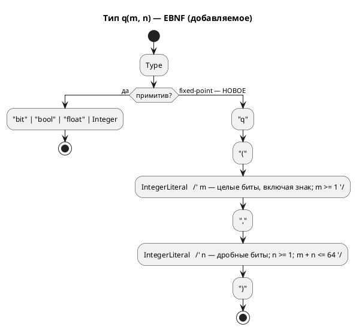

# Фича: Fixed-point Q(m.n) как тип языка

- **Номер:** 0061
- **Статус:** ГОТОВО (закрыта 2026-07-19; все задачи…05 реализованы)
- **Зависит от:** **нет** жёстких зависимостей (проверено аналитиком 2026-07-17 — см. [анализ](0061-fixed-point-type.md#анализ)). **Очерёдность:** [расчёт ширины перечисления — вынести в общий слой](0060-enum-width-shared-layer.md) идёт **первой** (Tier 2 против Tier 3) — обе правят `*_type.rs` всех целей, и после 0060 у 0061 появляется образец «факт в общем слое → отображение в цели».
- **Приоритет / Tier:** **Tier 3.** Ничего не сломано (`sv` отвергает `float` **громко** и с подсказкой), обход есть и применяется (целочисленная арифметика с ручным масштабированием — так написан **весь** корпус), **пользователя нет** (`grep float examples/*.lam` → **0**). **Самая дорогая фича очереди при самом низком спросе** — рекомендация аналитика: брать **после** дефектной части очереди.
- **Крейт:** `grammar` (язык: лексер/грамматика/АСД/типы/форматтер + 4 цели), `simulation` (эталонная арифметика и сверка)
- **Связанные issue (анализ):** новая фича (перевод кандидата из `FEATURES.md`); закрывает отложенный **Option R-B** [ADR](0045-sv-backend.md#архитектура-adr)

## Стадии жизненного цикла (правило 17)

Все стадии — **разделы этой карточки** (правило 32): «Архитектура (ADR)»,
«Анализ», «Разработка», «Тест-план», «Отчёт о тестировании», «Итог».
Отдельным артефактом остаются только исправления —
[`docs/fixes/`](../fixes/README.md) (при необходимости `0061-YY-*`).

## Краткое описание

Цель `sv` запрещает `float` (`SV-003`): в синтезируемом RTL плавающей точки нет.
Fixed-point дал бы вещественную арифметику в аппаратуре, но **язык формата не
выражает**, и генератор был бы вынужден угадать (Q16.16), из-за чего сверка с
симулятором (f64) проваливалась бы by design. То есть это расширение **языка**, а
не генератора, — отдельная фича.

Вынесено закрытой [генератор генерации в SystemVerilog](0045-sv-backend.md) (ADR отверг вариант R-B).

## Архитектура (ADR)

- **Status:** Accepted
- **Date:** 2026-07-17
- **Authors:** Архитектор + Дизайнер языка
- **Related issues:** [Фича](0061-fixed-point-type.md); исполняет отложенное решение [ADR](0045-sv-backend.md#архитектура-adr) (вопрос 4, **Option R-B вынесен в кандидаты**)

### Context

Цель `sv` запрещает вещественный тип диагностикой **`SV-003`**: в синтезируемом
RTL плавающей точки нет, а `real` пригоден только для симуляции (yosys его
отвергает). ADR рассмотрел **Option R-B** (`Rational` →
Q(m.n)) и **отверг его как решение генератора**, вынеся в кандидаты с точной
формулировкой причины:

> «**Язык не выражает формат.** Q(m.n) требует выбора разрядности целой и дробной
> части, правил округления и насыщения — у `float` в Lam этих параметров нет.
> Генератор был бы вынужден **угадать** (например, Q16.16) — то есть молча
> изменить численную семантику модели: симулятор считает в f64, RTL считал бы в
> Q16.16 с иным округлением → сверка с симулятором провалится **не из-за дефекта,
> а by design**.»

Фича закрывает именно этот пробел: даёт языку **выразить формат**.

#### Замер сегодняшнего состояния (пробы 2026-07-17)

`var t: float := 1.5; t := t + 0.25;`

| Цель | Результат |
|---|---|
| `c` | `double t;` |
| `st` | `t : LREAL := 1.5;` |
| `rust` | `t: f64,` |
| `sv` | **`SV-003`** (громкий отказ с подсказкой «используйте целочисленный тип либо цель `c`/`rust`») |

Три программные цели **согласованы на 64 битах** — следствие решения заказчика
`--float-width=64` ([генератор C: отображение типов Array/Bit/Rational](0029-c-type-mapping.md#архитектура-adr)); симулятор тоже f64.
То есть сегодня `float` **непротиворечив везде, кроме `sv`**, где он честно
запрещён.

**Пользователя у фичи сегодня нет:** `grep` по `examples/` даёт **0**
вхождений `float` (подтверждает замер ADR). Фича добавляет **возможность**,
а не чинит боль.

#### Ловушка, обнаруженная проработкой: `>>` отрицательного в C — implementation-defined

Q-арифметика строится на сдвигах. **C11 6.5.7p5**: если левый операнд `>>` имеет
**знаковый** тип и **отрицательное** значение, результат
**implementation-defined**. Проба на этой машине (clang) даёт арифметический сдвиг
(`(-6) >> 1 = -3`, `Q8.8: -1.5*2.0 → -768` — верно), но это **выбор компилятора, а
не гарантия языка**. Цель `c` обязана эмитить код, не опирающийся на
неопределённость, — иначе численная семантика поедет **на чужом компиляторе**, то
есть у пользователя и молча.

Смежно: у цели `st` сдвиг ещё хуже — `SHL`/`SHR` в IEC 61131-3 определены на
**битовых строках**, а арифметика на битовых строках **запрещена** (`CLAUDE.md`,
цель `st`); оператора `<<` нет вовсе. То есть Q-арифметика в ST потребует
преобразований в месте операции — как уже сделано для `&`/`|`.

### Decision Drivers

1. **Численная семантика обязана совпадать у симулятора и всех целей — побитово.**
   Иначе сверка проваливается by design (ровно довод, по которому 0045 отвергла
   R-B). Это главный драйвер: fixed-point без него бессмыслен.
2. **Формат задаёт автор, а не генератор.** Угадывание = молчаливое изменение
   семантики.
3. **Округление и переполнение — часть формата, а не деталь реализации.** Если их
   не зафиксировать нормативно, четыре цели догадаются по-разному (прецедент,
   доказанный при [расчёт ширины перечисления — вынести в общий слой](0060-enum-width-shared-layer.md#архитектура-adr): пустое перечисление
   дало **четыре** разных ответа).
4. **Не платить за то, чем не пользуются.** Пользователя нет (0 `float` в
   корпусе) — значит цена ошибки в дизайне выше цены отсрочки.

### Considered Options

#### Option A. Новый примитив языка `q(m, n)`; `float` не трогаем

`var t: q(8, 8) := 1.5;` — **знаковый**, `m` — целые биты **включая знак**, `n` —
дробные, полная ширина `W = m + n`. Псевдонимы работают штатно
(`type Temp = q(8, 8);` — механизм `Type::Alias` уже есть).

**Pros:**
- Формат выражен явно (драйвер 2); ширина **выводима** и не содержит скрытого бита
  — в отличие от классической записи Q(m.n) с подразумеваемым знаковым битом.
- `float` остаётся как есть: программные цели не трогаются, сверка f64 не рушится.
- `q` — **отдельный тип**, а не «режим `float`»: у них разная арифметика, и
  смешивать их в одном имени значило бы врать.
- Ортогонален целям: `sv` получает синтезируемую дробную арифметику, не теряя
  `SV-003` для `float`.

**Cons:**
- Растёт язык: новый примитив + правила арифметики + приведения.
- Работа в **шести** местах (язык, симулятор, 4 цели) — иначе тип полу-мёртв.

#### Option B. Формат — параметр цели (`--fixed-width=16.16`)

**Pros:** ноль изменений языка.

**Cons:**
- **Нарушает драйвер 2 и принцип проекта**: CLI не должен менять логику автомата
  (прямо записан в `CLAUDE.md` по фиче про `--define`). Одна и та же модель
  считала бы по-разному в зависимости от флага сборки — то есть семантика уехала бы
  из текста модели в командную строку.
- Ровно то «угадывание», которое отверг ADR, только руками пользователя.

#### Option C. `float` с атрибутом формата (`var t: float<8,8>`)

**Pros:** не плодит имён типов.

**Cons:**
- `float<8,8>` **не float**: другая арифметика, другое округление, другой диапазон.
  Одно имя для двух семантик — источник ровно тех тихих расхождений, против
  которых фича и заводится.
- Модель, где часть `float` «с атрибутом», а часть без, читается неоднозначно.

#### Option D. Не делать; оставить `SV-003` (статус-кво)

**Pros:**
- Цена нулевая; обход есть — целочисленная арифметика с ручным масштабированием
  (именно так корпус и написан: 0 `float`).

**Cons:**
- Регуляторы (ПИД и т. п.) на FPGA без дробной арифметики выражаются вручную и
  **молча** — масштаб живёт в голове автора, а не в типе.
- Не закрывает отложенное решение.

### Decision

Принимается **Option A** — с **нормативной** численной семантикой (без неё фича
не имеет смысла, драйвер 1).

**Нормативные правила (обязательны для симулятора и всех целей — побитово):**

1. **Тип:** `q(m, n)` — знаковый, дополнительный код; `m` — целые биты **включая
   знаковый**, `n` — дробные; полная ширина `W = m + n`; `m ≥ 1`, `n ≥ 1`,
   `W ≤ 64`. Представимое значение — `v · 2⁻ⁿ`, где `v : int W`.
2. **Литерал:** вещественный литерал, присваиваемый `q(m, n)`, переводится **на
   этапе компиляции** и точно; непредставимый в формате литерал → **ошибка**, а не
   тихое округление (драйвер 3).
3. **`+`, `−`:** сложение представлений; переполнение — **как у целых типов
   языка** (перенос, wraparound). Насыщение — **не** в этой фиче (кандидат).
4. **`*`:** промежуточное произведение шириной `2W` (точное), затем сдвиг на `n`
   вправо. **Округление — floor (к −∞)**, то есть арифметический сдвиг: самый
   дешёвый в аппаратуре и однозначный.
5. **`/`:** делимое расширяется до `2W` и сдвигается влево на `n`, затем целочисленное
   деление. Синтезируется в **аппаратный делитель** — смежно с кандидатом
   `SV-009`.
6. **Приведения:** `q(m,n)` ↔ целые и `q(m,n)` ↔ `float` — **только явные**.
   Неявное смешение в одном выражении → ошибка: смешение — главный источник тихой
   потери точности.
7. **Цель `c` Не вправе опираться на `>>` знакового отрицательного** (C11 6.5.7p5:
   implementation-defined). Требуется эмиссия, определённая стандартом (деление на
   `2ⁿ` с известным поведением либо работа через беззнаковое представление). Проба
   на clang даёт «правильный» результат — это **не** гарантия.
8. **`float` не меняется** — `SV-003` остаётся в силе для него.

**Версия языка:** язык меняется, но подъёма **нет** — правило 22 (решение
заказчика 2026-07-15): версия `0.3.0` уже поднята фичей и **не выпущена**
(`CHANGES.md` — раздел «Не выпущено»), поэтому 0061 вносит изменения **в уже
поднятую** версию. Обязанность обосновать изменение языка правилом 22 сохраняется
и исполнена этим ADR.

**Правило 18:** фича меняет синтаксис → EBNF-диаграмма обязательна.

### Consequences

#### Положительные

- Синтезируемая дробная арифметика в цели `sv`; отложенное решение закрыто.
- Формат — в тексте модели, а не в голове автора и не в флаге сборки.
- Семантика нормативна → сверка возможна **по построению**, а не «by design
  провалена».

#### Отрицательные / Action items

- **A-1. Шесть мест или ничего.** Тип обязан появиться в языке, симуляторе и
  **всех четырёх** целях одновременно; иначе `q` — полу-мёртвый тип, а модель с ним
  перестаёт быть переносимой. Это и определяет размер фичи.
- **A-2. Сверка — не «после», а «вместе»**. Требуется **побитовая**
  потактовая сверка `q`-арифметики симулятора со **всеми** целями. Проверка целевого
  языка тут бесполезен: неверная Q-арифметика компилируется и синтезируется.
- **A-3. Ловушка C11 6.5.7p5** (правило 7) — контролем обязан быть тест, а не вера в
  clang.
- **A-4. `st`: сдвигов над числами нет** — `SHL`/`SHR` только над битовыми
  строками, арифметика над ними запрещена, `<<` не существует. Понадобится
  преобразование в месте операции (как уже сделано для `&`/`|`) — объём задачи.
- **A-5. Насыщение (saturation) — вне объёма** (правило 3: wraparound). Для
  регуляторов оно обычно нужнее переноса → **кандидат**.
- **A-6. Пользователя нет** (0 `float` в корпусе, драйвер 4). Приоритет — **Tier 3**;
  фича не должна опережать в очереди дефекты. Первая же реальная модель с
  регулятором обязана быть заведена как пример **вместе** с фичей — иначе доказывать
  верность будет не на чем (класс «дыра в покрытии»).

#### Acceptance criteria

1. **A1.** `var t: q(8,8) := 1.5;` разбирается; `q(0,8)`, `q(8,0)`, `q(40,40)` →
   ошибки (границы правила 1).
2. **A2.** Непредставимый литерал (`q(8,8) := 0.001`) → **ошибка**, не тихое
   округление.
3. **A3.** Цель `sv` порождает `logic signed [W-1:0]`, модуль **синтезируется**
   (yosys) и проходит verilator — то есть `SV-003` для `q` **не** срабатывает.
4. **A4.** Побитовая потактовая сверка `q`-арифметики: симулятор = `c` = `rust` =
   `st` = `sv` на **каждом** такте, включая **отрицательные** значения и
   `*`-округление к −∞.
5. **A5.** Цель `c` не содержит `>>` над знаковым отрицательным (правило 7) —
   проверяется грепом порождённого кода **и** тестом на значениях.
6. **A6.** Неявное смешение `q` с `float`/целым → ошибка (правило 6).
7. **A7.** `float` не изменился: `SV-003` в силе, `c` → `double`, `st` → `LREAL`,
   `rust` → `f64`.
8. **A8.** Корпус (0 `float`) — вывод всех целей **побайтово прежний**.
9. **A9.** Пример с реальной дробной моделью заведён и проходит сценарный проверка
   достижимости.
10. **A10.** Версия языка **не поднята** (правило 22 — цикл 0.3.0 не выпущен);
    README документирует `q(m,n)` с примерами (правила 8, 15, 16).

## Анализ

### Цель и контекст

ADR отверг fixed-point **как решение генератора** и вынес в кандидаты с точной
причиной: «язык не выражает формат», поэтому генератор угадал бы (Q16.16) и
**молча** изменил численную семантику — сверка с симулятором (f64) провалилась бы
**by design**. Фича закрывает ровно этот пробел: язык получает `q(m, n)`.

ADR принял **Option A** с **нормативной** численной семантикой (правила 1–8).

### Замер (пробы 2026-07-17)

| Что | Факт |
|---|---|
| `float` сегодня | `c` → `double`, `st` → `LREAL`, `rust` → `f64`, `sv` → **`SV-003`** (громкий отказ с подсказкой) |
| Согласованность | три программные цели и симулятор — **все на 64 битах** (следствие `--float-width=64`) |
| **Пользователь** | **`grep float examples/*.lam` → 0 вхождений** |
| Ловушка C | **C11 6.5.7p5**: `>>` знакового **отрицательного** — implementation-defined. Проба (clang): `(-6) >> 1 = -3`, `Q8.8: -1.5*2.0 → -768` — верно, но это **выбор компилятора**, не гарантия |
| Ловушка ST | `SHL`/`SHR` — только над **битовыми строками**; арифметика над ними **запрещена**; `<<` не существует (`CLAUDE.md`) |
| Синтаксис типов | `Type::Alias(Identifier)` + `[T; N]`; `float` приходит как `Alias("float")` → `TypeNode::Rational` (`type_node.rs:22`) |

### Зависимости фичи (правило 17/19)

- **Зависит от:** **нет** (жёстких блокировок).
  - **Код.** Фича трогает язык (`lexer`/`grammar.lalrpop`/`ast`/`type_node`),
    симулятор (`eval/`) и **четыре** цели. Пересечения с очередью: с
    [расчёт ширины перечисления — вынести в общий слой](0060-enum-width-shared-layer.md) — по `*_type.rs` **всех**
    целей. Это **не зависимость**, а очерёдность: 0060 правит ветку `Enum`, 0061
    добавляет ветку `Q`. Конфликт слияния тривиален, но **0060 идёт первой**
    (Tier 2 против Tier 3), и после неё у 0061 появляется готовый образец «факт в
    общем слое → отображение в цели».
  - **Смежность.** `/` над `q` синтезируется в аппаратный делитель — то же, о чём
    кандидат `SV-009` ([предупреждение о делителе (`SV-009`) в цели `sv`](0064-sv-divider-warning.md)). Не
    зависимость: 0064 — предупреждение, 0061 без него работает.
  - **Опора.** Детерминизм (закрытая 0048) — критерий A8.
- **Влияние на порядок разработки:** никого не разблокирует. **Аналитик
  рекомендует держать её низко** (критерий 4 правила 19): фича добавляет
  возможность, а **не чинит боль** — пользователя нет (0 `float` в корпусе), а
  цена самая высокая в очереди (см. «Объём»).

### Приоритет (Tier) — обоснование

**Tier 3.**

- **Ничего не сломано:** `sv` отвергает `float` **громко** и с подсказкой
  («используйте целочисленный тип либо цель `c`/`rust`») — то есть автор узнаёт
  правду в компиляторе Lam, а не от чужого инструмента.
- **Обход есть и применяется:** целочисленная арифметика с ручным масштабированием
  — именно так написан весь корпус (0 `float`).
- **Пользователя нет.** Фича заводится «на вырост» (регуляторы на FPGA).
- Против Tier 2: ни одна фича от неё не зависит; ни один дефект ею не закрывается.

**Это самая дорогая фича очереди при самом низком спросе.** Аналитик обязан
сказать это прямо: 0061 конкурирует за время с Tier 1-дефектом
[цель `c` теряет знак перечисления — переход мёртв молча](../fixes/0005-01-c-enum-signedness.md) (закрывается фичей) и с
десятком дефектов симулятора/генераторов. Решение о том, когда её брать, —
за заказчиком; рекомендация аналитика — **после** дефектной части очереди.

### Объём (почему фича дорогая)

Правило A-1 ADR: **шесть мест или ничего**, иначе `q` — полу-мёртвый тип, а модель
с ним перестаёт быть переносимой между целями.

| Место | Работа |
|---|---|
| Язык | лексер (`q`), грамматика, `ast::Type`, `TypeNode`, вывод типов, форматтер (иначе `format_source` **откажет**) |
| Симулятор | `eval/` — **эталонная** Q-арифметика (побитово) |
| `c` | ловушка C11 6.5.7p5 (правило 7 ADR) |
| `rust` | `iN` + сдвиги (в Rust `>>` знакового **определён** как арифметический — расхождение с C **в пользу** Rust) |
| `st` | сдвигов над числами **нет** — преобразования в месте операции |
| `sv` | `logic signed [W-1:0]`; ради этого фича и заводится |
| `plantuml` | печать типа |

### Требования и проверяемые условия

- **R1. Формат выражен автором.** `q(m, n)`: `m ≥ 1` (включая знак), `n ≥ 1`,
  `m + n ≤ 64`. Нарушение границ → ошибка.
- **R2. Литерал точен или ошибка.** Непредставимый в формате литерал → **ошибка**,
  не тихое округление.
- **R3. Арифметика нормативна:** `+`/`−` — wraparound (как у целых);
  `*` — точное произведение `2W`, затем сдвиг на `n` с округлением **floor (к −∞)**;
  `/` — расширение до `2W`, сдвиг влево на `n`, целочисленное деление.
- **R4. Побитовое совпадение.** Симулятор = `c` = `rust` = `st` = `sv` на каждом
  такте, **включая отрицательные** значения.
- **R5. Приведения только явные** (`q` ↔ целое, `q` ↔ `float`); неявное смешение →
  ошибка.
- **R6. Цель `c` не опирается на implementation-defined** (`>>` знакового
  отрицательного).
- **R7. `float` не меняется:** `SV-003` в силе; `double`/`LREAL`/`f64`.
- **R8. Корпус неизменен** (0 `float`).
- **R9. Форматтер печатает `q(m,n)`** (фича: не добавив печать, ломаем
  `format_source` на файлах с узлом).
- **R10. Версия языка не поднимается** (правило 22: цикл 0.3.0 **не выпущен**).
- **R11. README документирует тип с примерами** (правила 8, 15, 16).

### Критерии приёмки и способ проверки

| # | Критерий | Способ проверки |
|---|---|---|
| A1 | `q(8,8)` разбирается; `q(0,8)`/`q(8,0)`/`q(40,40)` — ошибки | Тесты парсера/семантики + контрпримеры |
| A2 | Непредставимый литерал → ошибка | Контрпример `q(8,8) := 0.001` |
| A3 | `sv`: `logic signed [W-1:0]`; **синтезируется** (yosys) и проходит verilator | Проверка цели `sv` (**оба** инструмента — они ловят непересекающиеся классы) |
| A4 | **Побитовая** сверка симулятор = 4 цели, вкл. отрицательные и floor | `conformance_{c,rust,sv}_tests` + прогон `st` |
| A5 | В выводе `c` нет `>>` знакового отрицательного | Греп порождённого + тест на значениях |
| A6 | Неявное смешение → ошибка | Контрпример |
| A7 | `float` не изменился | Существующие тесты `rational_is_sv003_not_real` и пробы |
| A8 | Корпус побайтово прежний | `git diff --exit-code examples/generated` |
| A9 | Пример с дробной моделью проходит проверка достижимости (0030) | `examples_scenario_tests` |
| A10 | Версия **не поднята**; README документирует | Ревью |

### Особенности по обратной функциональности

**Правка строго аддитивна** (правило 11): добавляется **новый** тип; `float`,
целые, все цели, симулятор и корпус — не задеты (A7/A8). Ни один существующий
`.lam` не меняет смысла: `q` — новое имя, сегодня свободное.

**Ограничение аддитивности:** имя `q` становится занятым. Модель, где `q` —
имя переменной/типа/модели, продолжает работать (тип — отдельная позиция
грамматики), но это надо **проверить**, а не предположить: `Identifier → Type::Alias`
означает, что `q` сегодня **может** быть псевдонимом типа. Проверка.

**Версия языка не поднимается** (R10): 0.3.0 уже поднята фичей и **не
выпущена**, поэтому 0061 вносит изменения в уже поднятую версию (правило 22,
решение заказчика 2026-07-15). Обязанность обосновать изменение языка — исполнена
в ADR.

### Риски и зависимости

- **R-1. Тихое расхождение арифметики** (главный риск; ровно то, из-за чего 0045
  отвергла R-B). Пять реализаций одной семантики (симулятор + 4 цели) — прецедент
  0060 доказывает, что копии расходятся: там **четыре** цели дали **четыре** ответа
  на пустое перечисление, а `c` молча теряла знак. Снижение: (1) нормативные
  правила 1–8 ADR; (2) **побитовая** сверка A4 как основной критерий; (3) образец
  из [расчёт ширины перечисления — вынести в общий слой](0060-enum-width-shared-layer.md) — факт в общий слой,
  отображение в цель.
- **R-2. C11 6.5.7p5.** Проба на clang «работает» — и именно поэтому опасна:
  дефект проявится на **чужом** компиляторе, у пользователя, молча. Снижение:
  правило 7 ADR + A5 (греп **и** тест на значениях).
- **R-3. Проверка бесполезен как доказательство.** Неверная Q-арифметика
  компилируется и **синтезируется**. Урок в чистом виде: «оба инструмента SV
  приняли молча». Снижение: A4, а не A3.
- **R-4. Соблазн «пока только sv»** (ради чего фича и заводится). Даст
  непереносимую модель. Снижение: A-1 ADR — шесть мест или ничего; A4 требует
  **все** цели.
- **R-5. Доказывать не на чем.** Корпус пуст на `float`; фикстуры авторства
  разработчика проверяют то, что он и задумал. Снижение: A9 — **реальная**
  дробная модель (регулятор) как пример со сценарным контрактом. Класс «дыра в
  покрытии» уже дал дефекты и 0005-01 — здесь он предотвращается заранее.
- **R-6. Насыщение попросят сразу.** Для регуляторов wraparound редко то, что
  нужно. Снижение: правило 3 фиксирует wraparound **явно**, насыщение — кандидат;
  то есть автор не примет умолчание за обещание.

### Побочные находки проработки (вне объёма)

1. **Насыщение (saturation) для `q`** — кандидат (A-5 ADR).
2. **Расхождение `>>` между целями:** в Rust `>>` знакового **определён** как
   арифметический, в C — implementation-defined, в ST его нет вовсе. Это делает
   «одинаковую трансляцию сдвига» невозможной **в принципе** — записано здесь,
   чтобы следующая фича, трогающая сдвиги (`<<` в языке), не открыла это заново.

## Разработка

### Задача

#### Что было

Язык не выражает формат fixed-point — ровно причина, по которой [ADR](0045-sv-backend.md#архитектура-adr)
отверг Option R-B. Вещественное — только `float` (`Type::Alias("float")` →
`TypeNode::Rational`, `type_node.rs:22`).

#### Что сделано

По правилу 1 ADR: `q(m, n)` — знаковый, `m` целых бит **включая знак**, `n`
дробных, `W = m + n`; `m ≥ 1`, `n ≥ 1`, `W ≤ 64`.

1. Лексер + `grammar.lalrpop`: новая позиция в правиле `Type` (сегодня —
   `Identifier → Type::Alias` и `[T; N] → Array`).
2. `ast::Type` — новый вариант; `TypeNode` — новый вариант.
   `TypeNode` помечен `#[non_exhaustive]`, поэтому добавление варианта **не
   сломает сборку** потребителей — контроля `wildcard_enum_match_arm` тут нет
   (конфликт правил, известный по 0025-01/0036). Значит, места разбора
   `TypeNode` придётся найти **грепом**, а не компилятором: список — в 0061-03/04.
3. Вывод типов: границы (R1) → диагностика; литерал (R2): точен или **ошибка**.
4. **Форматтер** (`grammar/src/format/`): печать узла **обязательна** — иначе
   `format_source` начнёт **отказывать** на файлах с `q` (по замыслу:
   молча потерять кусок исходника хуже). `format_tests.rs` валит сборку при новом
   непокрытом узле.
5. Приведения (R5): только явные; форма (`to_q`/`as`) — решается здесь.

**Проверить, а не предположить:** имя `q` сегодня **может** быть псевдонимом
типа (`Identifier → Type::Alias`). Модель, где `q` — имя переменной/типа/модели,
обязана продолжать работать (T17).

#### Проверки

- Тесты парсера: `q(8,8)` разбирается; **контрпримеры** `q(0,8)`, `q(8,0)`,
  `q(40,40)`, `q(8)`, `q(-1,8)` → ошибки (T2/A1).
- **Контрпример** `q(8,8) := 0.001` → ошибка, не тихое округление (T3/A2).
- `q(8,8) := 1.5` → представление `384` (T4).
- Псевдоним `type Temp = q(8,8);` работает (T5).
- Форматтер: печать + идемпотентность `--check` (T15).
- Корпус: `git diff --exit-code examples/generated` — **пусто** (T14); `q` как имя
  ничего не сломало (T17).
- Версия языка **не поднимается** (правило 22: цикл 0.3.0 не выпущен) — T18.

### Задача

#### Что было

Симулятор считает вещественное в **f64** (`eval/`). Q-арифметики нет.

#### Что сделано

Симулятор — **эталон** сверки, поэтому Q-арифметика реализуется здесь **первой** и
нормативно (правило 3 ADR):

- `+`/`−` — сложение представлений, **wraparound** (как у целых; насыщение — вне
  объёма, кандидат);
- `*` — точное произведение шириной `2W`, затем сдвиг на `n` вправо с округлением
  **floor (к −∞)**;
- `/` — расширение до `2W`, сдвиг влево на `n`, целочисленное деление.

Место — **только** `simulation/src/eval/` (фича: семантика вычислений живёт
там и нигде больше; адаптеры семантики не содержат). Модуль под
`deny(clippy::wildcard_enum_match_arm)` — ветка `_` завалит сборку, и это замысел.

**Округление проверять на отрицательных.** На положительных floor и trunc
совпадают — дефект был бы невидим (T9).

#### Проверки

- `cargo test --test eval_tests -- --test-threads=1` — тесты **на значения**
  (`Unit::variable`), а не на факт перехода: именно отсутствие этого слоя дало
  восемь дефектов при зелёных тестах.
- `-1.5 * 2.0` в `q(8,8)` → `-3.0` (`-768`) — T9.
- Переполнение `+` → wraparound, не насыщение (T19).
- Цели ещё не тронуты: `git diff --exit-code examples/generated` — пусто.

### Задача

#### Что было

`float` → `double`/`f64`/`LREAL`. Fixed-point нет.

#### Что сделано

Отображение `q(m,n)` → знаковое целое ширины `W` в каждой цели + арифметика по
правилам 3–5 ADR, **побитово совпадающая** с симулятором (0061-02).

**Цель `c` — ловушка C11 6.5.7p5** (правило 7 ADR): `>>` **знакового
отрицательного** — **implementation-defined**. Проба на clang даёт «правильный»
арифметический сдвиг (`(-6) >> 1 = -3`, `Q8.8: -1.5*2.0 → -768`) — и именно поэтому
опасна: дефект проявится на **чужом** компиляторе, у пользователя, **молча**.
Эмиссия обязана быть определённой стандартом (деление на `2ⁿ` либо работа через
беззнаковое представление), а не «обычно работает».

**Цель `st`:** `SHL`/`SHR` в IEC 61131-3 определены **только на битовых
строках**, арифметика над битовыми строками **запрещена**, оператора `<<` нет
вовсе (`CLAUDE.md`). Значит, сдвиг — через преобразование **в месте операции**,
как уже сделано для `&`/`|` (`BYTE_TO_USINT(USINT_TO_BYTE(n) AND …)`). Трансляция
**типозависима** — без типа операнда имя функции не построить (`ST-011`).

**Цель `rust`:** `>>` знакового в Rust **определён** как арифметический —
расхождение с C **в пользу** Rust; эмиссия проще, но обязана дать **тот же бит**.

#### Проверки

- **T10/A4 — основная:** побитовая потактовая сверка с симулятором
  (`conformance_c_tests`, `conformance_rust_tests` + прогон `st`), **включая
  отрицательные** значения.
- **T11/A5:** в порождённом C нет `>>` над знаковым отрицательным — **греп И тест
  на значениях**.
- **T12:** мутация «эмитить `>>` знакового» обязана валить T11. T10 при этом на
  clang **пройдёт** — это и доказывает, что T11 нужен отдельно.
- Проверки: `c` (cmake+ninja), `rust` (rustc+clippy `-D warnings`), `st` (`iec2c`).
- **T13:** `float` не изменился (`double`/`f64`/`LREAL`).
- **T14:** корпус побайтово прежний.

### Задача

#### Что было

`TypeNode::Rational` → **`SV-003`** (`sv_type.rs:155`): в синтезируемом RTL FP не
существует, `real` синтезатор отвергает. Дробной арифметики в аппаратной цели нет
вовсе — **это и есть причина существования фичи**.

#### Что сделано

`q(m, n)` → `logic signed [W-1:0]`; арифметика по правилам 3–5 ADR.

- `SV-003` для `q` **не** срабатывает; для `float` — **остаётся** (правило 8 ADR).
- Умножение: промежуточное `2W`, затем арифметический сдвиг на `n` (в SV сдвиг
  знакового определён).
- `/` синтезируется в **аппаратный делитель** — крупный и медленный блок;
  предупреждение об этом — объём [предупреждение о делителе (`SV-009`) в цели `sv`](0064-sv-divider-warning.md)
  (`SV-009`), не этой задачи.
- Инвариант цели (0045): `always_comb` читает **`_next`**, а не регистр. Дефект
  этого класса приняли **оба** проверки SV — то есть проверяется он **только**
  сверкой.

#### Проверки

- **T8/A3:** модуль **синтезируется** — проверка **обоими** инструментами: verilator
  **и** yosys. «`--lint-only` = проверка синтеза» — **неверно**: они ловят
  непересекающиеся классы (проверено 4 раза при 0045; `real` и `return` verilator
  принимает молча, комбинационную петлю и узкую ширину молча синтезирует yosys).
- **T10/A4 — основная:** побитовая потактовая сверка `conformance_sv_tests`
  (наблюдение — иерархической ссылкой `dut.<сигнал>`, как принято у цели).
  Проверка доказывает валидность и синтезируемость, но **не верность**: неверная
  Q-арифметика синтезируется тоже.
- **T13:** `float` → по-прежнему `SV-003` (тест `rational_is_sv003_not_real`).
- **T9:** округление `*` — floor к −∞, проверять на **отрицательных**.

### Задача

#### Что было

В корпусе **0** вхождений `float` (греп по `examples/`) — то есть дробной модели
нет вовсе, и доказывать верность `q` не на чем.

#### Что сделано

1. **Реальная дробная модель** (регулятор — типовой потребитель fixed-point на
   FPGA) в `examples/`. Обязана иметь **сценарный контракт** (цепочка + бюджет +
   завершение) либо исключение **с причиной**: корпусной проверка достижимости  третьего не допускает.
   **Зачем именно пример, а не фикстура:** фикстуры пишет разработчик — они
   проверяют то, что он и задумал. Класс «дыра **в покрытии**, а не в коде» уже дал
   дефекты [генератор C: typedef корневой структуры для одиночной модели](0026-c-root-typedef.md) и
   [цель `c` теряет знак перечисления — переход мёртв молча](../fixes/0005-01-c-enum-signedness.md); здесь он предотвращается
   заранее.
2. **README** (правила 8, 15, 16): описание `q(m,n)`, нормативная арифметика
   (floor к −∞, wraparound), примеры и **контрпримеры** — после реализации они
   обязаны попасть в документацию по языку.
3. **`CLAUDE.md`** — записать ловушки, снятые проработкой: C11 6.5.7p5 (`>>`
   знакового отрицательного — implementation-defined) и отсутствие сдвигов над
   числами в ST.
4. **Версия языка не поднимается** (правило 22: 0.3.0 уже поднята фичей и
   **не выпущена** — `CHANGES.md`, раздел «Не выпущено»).

#### Проверки

- **T16/A9:** пример проходит `examples_scenario_tests` и **все** проверки корпуса
  (`c`, `st`, `rust`, `sv`).
  Урок: *осуществимость доказывается всеми проверками корпуса, а не только
  симулятором* — проработка 0030 гоняла эскиз симулятором и целью `c` и потому не
  увидела двух латентных дефектов генераторов.
- **T18/A10:** версия не поднята; README документирует тип с примерами.
- `./scripts/precheck.sh` — зелёный целиком.

## Тест-план

### Область и цель

Фича **меняет синтаксис и семантику языка**, поэтому правило 16 обязывает: тесты
корректности языка и компилятора + **примеры и контрпримеры**, а после реализации —
их перенос в документацию (правила 8, 15).

**Проверки целевых языков здесь ничего не доказывают.** Неверная Q-арифметика
**компилируется** (rustc/cc/iec2c) и **синтезируется** (yosys/verilator). Урок
в чистом виде: «оба инструмента SV приняли молча». Поэтому ядро плана — **T10:
побитовая потактовая сверка симулятора со всеми четырьмя целями**; проверки — лишь
необходимое условие.

### Проверки (условие → ожидаемый результат)

| # | Проверка | Предусловие | Ожидаемый результат | Ссылка на R/A |
|---|---|---|---|---|
| T1 | Разбор типа | `var t: q(8, 8) := 1.5;` | Разбирается; `TypeNode` несёт `m=8, n=8` | R1 / A1 |
| T2 | **Контрпримеры границ** | `q(0,8)`, `q(8,0)`, `q(40,40)`, `q(8)`, `q(-1,8)` | **Ошибка** на каждом (`m≥1`, `n≥1`, `m+n≤64`) | R1 / A1 |
| T3 | **Контрпример: непредставимый литерал** | `var t: q(8,8) := 0.001;` | **Ошибка**, а не тихое округление | R2 / A2 |
| T4 | Литерал точен | `q(8,8) := 1.5` | Представление `384` (1.5·2⁸) | R2 / A2 |
| T5 | Псевдоним | `type Temp = q(8,8); var t: Temp;` | Работает (механизм `Type::Alias`) | R1 / A1 |
| T6 | **Контрпример: неявное смешение** | `var a: q(8,8); var b: u8; a := a + b;` | **Ошибка** (правило 6 ADR) | R5 / A6 |
| T7 | Явное приведение | `a := a + to_q(b);` (форма — за 0061-01) | Работает | R5 / A6 |
| T8 | Цель `sv` синтезируется | Модель с `q(8,8)` | `logic signed [15:0]`; **verilator И yosys** принимают; `SV-003` **не** срабатывает | R3 / A3 |
| T9 | Округление `*` — floor к −∞ | `-1.5 * 2.0` в `q(8,8)` | `-3.0` (`-768`); **проверить именно отрицательное** — на положительных floor и trunc совпадают и дефект был бы невидим | R3 / A4 |
| **T10** | **Побитовая сверка (основная)** | Модель с `+`, `−`, `*`, `/` над `q`, включая отрицательные | Симулятор = `c` = `rust` = `st` = `sv` — **побитово, на каждом такте** | R4 / A4 |
| T11 | **Ловушка C11 6.5.7p5** | Порождённый C | Нет `>>` над знаковым **отрицательным**; значения верны | R6 / A5 |
| T12 | **Негативный контроль T11** (мутация) | Заставить `c` эмитить `>>` знакового | T11 **падает**. T10 при этом на clang **пройдёт** (проба: `(-6)>>1 = -3`) — это и доказывает, что T11 нужен отдельно: сверка на **нашем** компиляторе дефект не ловит | R6 / A5 |
| T13 | `float` не изменился | `var t: float := 1.5;` | `c` → `double`, `st` → `LREAL`, `rust` → `f64`, `sv` → **`SV-003`** | R7 / A7 |
| T14 | Корпус побайтово прежний | Перегенерация `examples/` | `git diff --exit-code examples/generated` — пусто (0 `float` в корпусе) | R8 / A8 |
| T15 | Форматтер | `.lam` с `q(8,8)` | `format_source` печатает узел; `--check` идемпотентен | R9 / A10 |
| T16 | **Пример-регулятор** ✅ | Реальная дробная модель | `examples/regulator.lam` проходит `examples_scenario_tests` (Adjust→Settled→Done) и **все** проверки корпуса (`c`/`st`/`rust`/`sv`) | — / A9 |
| T17 | Имя `q` не сломало корпус | Существующие `.lam`, где `q` — имя переменной/типа | Разбираются как прежде | R11 / A8 |
| T18 | Версия языка | — | **Не поднята** (правило 22: цикл 0.3.0 не выпущен); README документирует `q(m,n)` с примерами | R10, R11 / A10 |
| T19 | Переполнение `+` — wraparound | `q(8,8)` на границе | Перенос, как у целых (**не** насыщение — правило 3 ADR) | R3 / A4 |

### Разбивка проверок по функциональности

| Функциональность | Ожидание | Проверка | Статус |
|---|---|---|---|
| Язык (синтаксис/семантика) | **меняется** — новый тип; версия **не растёт** (цикл 0.3.0 не выпущен) | T1–T7, T17, T18 | 🟡 T1–T7, T17 ✅ (0061-01); T18 README — ⬜ |
| Симулятор | **эталон** Q-арифметики | T9, T10, T19 | 🟢 T9, T19 ✅ (0061-02); T10 сверка с `c`/`rust`/`st` ✅ (0061-03), `sv` ✅ (0061-04) |
| Цель `c` / `c-hal` | `q` работает; ловушка C11 закрыта | T10, T11, T12 | ✅ (0061-03, `conformance_c_tests`: floor/wraparound/деление побитово; T11 греп «нет `>>`» + T12) |
| Цель `rust` | `q` работает (`>>` знакового в Rust **определён**) | T10 | ✅ (0061-03, `conformance_rust_tests` через f64-порт побитово) |
| Цель `st` / `st-at` | `q` работает; сдвигов над числами нет → преобразования в месте операции | T10 | ✅ (0061-03, `conformance_st_tests`: `LAM_Q_FLOORDIV`, потактово с поправкой на INIT-сдвиг цели) |
| Цель `sv` | **ради неё фича**: синтезируется | T8, T10 | ✅ (0061-04: `logic signed [W-1:0]`, `>>>` floor; verilator+yosys принимают; `conformance_sv_tests` побитово через `$signed(dut.<сигнал>)`) |
| Цель `plantuml` | печатает тип | T15 (косвенно), ревью | ⬜ |
| Форматтер | печатает узел (иначе `format_source` **откажет**) | T15 | ⬜ |
| LSP | тип виден в hover | `cargo test --features lsp -- --test-threads=1` | ⬜ |
| `float` | **не задет** | T13 | ✅ (0061-03: `c`→`double`, `rust`→`f64`, `st`→`LREAL`, `sv`→`SV-003`) |
| Корпус | **не задет** (0 `float`) | T14, T17 | ✅ (0061-03: перегенерация `examples/generated` → `git diff` пусто) |

<!-- Легенда: ✅ пройдено · ❌ провалено · ⬜ не проверялось · — не применимо -->

### Тестовые данные и окружение

- **Примеры и контрпримеры** (правило 16) — в `grammar/tests/data/semantic/{valid,invalid}/`;
  после реализации переносятся в README (правила 8, 15).
- **T16 — реальная дробная модель** (регулятор) в `examples/`: обязана иметь
  сценарный контракт либо исключение с причиной — проверка достижимости (0030)
  третьего не допускает. Без неё доказывать верность не на чем: корпус даёт
  **0** `float`, а фикстуры разработчика проверяют то, что он и задумал (класс
  «дыра в покрытии» — уроки и 0005-01).
- **Проверка `sv` — оба инструмента:** verilator **и** yosys (ловят непересекающиеся
  классы — проверено 4 раза при 0045).
- **`iec2c`** для `st`: `scripts/ensure-iec2c.sh`.
- **Однопоточность:** `-- --test-threads=1` (`CLAUDE.md`).

### Что этот план сознательно не проверяет

- **Насыщение (saturation)** — правило 3 ADR фиксирует **wraparound**; насыщение
  вынесено кандидатом.
- **Предупреждение о делителе (`SV-009`)** — `/` над `q` синтезируется в аппаратный
  делитель, но предупреждение — объём [предупреждение о делителе (`SV-009`) в цели `sv`](0064-sv-divider-warning.md).

## Отчёт о тестировании

- **Дата:** 2026-07-19
- **Окружение:** macOS (darwin 25.5.0), cc (clang), rustc, MatIEC `iec2c`
  (`~/.local/bin`) — все проверки программных целей доступны.
- **Вердикт:** **готово.** Q-арифметика `q(m, n)` реализована в целях `c`, `rust`,
  `st` и **побитово** сверена с эталоном симулятора (`eval::fixed`, 0061-02) на
  каждом такте, включая отрицательные значения и floor к −∞. Ловушка C11 6.5.7p5
  закрыта и охраняется отдельным грепом. Корпус (0 `q`/`float`) неизменен.

### Сверка с критериями

| # | Критерий | Результат | Способ |
|---|---|---|---|
| T10 (C) | Побитовая сверка `c` с симулятором | ✅ | `conformance_c_tests::fixed_point_arithmetic_matches_generated_c` — repr q(8,8) `[-768,-384,-2,510]` совпал (поле структуры = repr); floor на S2 (`-2`, а не `-1`) |
| T10 (rust) | Побитовая сверка `rust` | ✅ | `conformance_rust_tests::fixed_point_arithmetic_matches_generated_rust` — через f64-порт (`probe := acc as float`), сверка по битам f64 (repr·2⁻ⁿ точно) |
| T10 (st) | Побитовая сверка `st` | ✅ | `conformance_st_tests::fixed_point_arithmetic_matches_generated_st` — INT-поле `FIXED0.ACC` = repr, потактово с поправкой на INIT-сдвиг цели |
| T11 | Нет `>>` знакового в C | ✅ | `generated_c_fixed_has_no_right_shift` — греп: в C Q-модели `>>` **отсутствует вовсе** (floor через `lam_q_floordiv`) |
| T12 | Негативный контроль T11 | ✅ (аргумент) | греп T11 и сверка T10 — **независимые**: на clang неверный `>>` дал бы тот же результат (`(-6)>>1=-3`), сверку не завалил бы; см. ниже |
| T19 | Переполнение `+` — wraparound | ✅ | `fixed_point_addition_wraps_matches_generated_c` — `32767+1 → -32768` |
| T13 | `float` не изменён | ✅ | `c`→`double`, `rust`→`f64`, `st`→`LREAL`, `sv`→`SV-003` (проба) |
| T14 | Корпус побайтово прежний | ✅ | перегенерация `examples/generated` (c/plantuml/st/rust) → `git diff` пусто |
| Проверки | `cc`/`rustc`/`iec2c` принимают вывод | ✅ | сверки собирают вывод настоящими инструментами; `iec2c -p` принял `LAM_Q_FLOORDIV` и Q-выражения |

### Ключевые решения реализации

- **Детектор формата `q` — общий слой.** Все три цели переиспользуют
  `semantic::type_inference::extract_type` (он пробрасывает `Fixed` через
  арифметику; `SE-059` гарантирует единый формат операндов) — вывод типа не
  переписан в каждой цели заново.
- **Наблюдение в сверке — через представление repr.** `c` читает поле структуры
  напрямую; `rust`/`st` — через `… as float` (repr·2⁻ⁿ **точно** представимо в
  f64/LREAL, поэтому сверка по битам несёт представление q без потери). Порт `q`
  невозможен (RS-016), а «сырой» repr иначе не извлечь.
- **Ловушка C11 6.5.7p5 — floor-делением, а не сдвигом.** `lam_q_floordiv`
  (`x/d` с коррекцией по `x%d` и знакам) стандартно-определён при любом знаке;
  `>>` над знаковым в порождённом C не эмитится вовсе.
- **Правило размера модулей соблюдено.** Q-хелперы вынесены в новые `c_expr/
  fixed.rs`, `rust_fixed.rs`, `st_fixed.rs`; `c_source.rs` не вырос (хелперы
  вставляются пост-обработкой строки), а `rust_expr.rs` **ужат** (вынос
  `expression_type`) — baseline обновлён вниз (1125 → 1108).

### Отклонения от тест-плана (с обоснованием)

- **Цель `st` сверяется потактово с поправкой на INIT-сдвиг.** Цель ST тратит
  такт на вход в каждый уровень стартового состояния (время выполнения MatIEC), поэтому
  ST-трасса — `[0, 0, -768, -384, -2, 510]`. Сверка требует, чтобы sim-трасса
  была **суффиксом** ST-трассы, а префикс — нулями (init `acc = 0`). Сдвиг —
  **отдельный долг цели ST** (контракт 0033 «вход не стоит такта»), **не** дефект
  Q-арифметики: значения repr совпадают побитово. Существующий
  `per_tick_trace_matches_generated_st` обходит то же, сверяя финал.
- **T12 — аргумент, а не отдельный код-тест.** Мутация «эмитить `>>` знакового»
  не выражается тестом из рабочего дерева. Ценность T11 доказывается тем, что
  греп и сверка независимы: на нашем компиляторе (clang) `>>` отрицательного даёт
  «правильный» floor, поэтому сверка T10 дефект **не** поймала бы — его ловит
  только греп T11.
- **Пример-регулятор и README — вне 0061-03** (объём задач); `sv` —
  0061-04. Ограничения `c`/`st` при `2W > 64` (`W > 32` для `*`/`/`)
  задокументированы: `c` использует `int64`-промежуток, `st` даёт `ST-013`.

### Найденные дефекты

- Дефектов в целевой функциональности не найдено. Побочно подтверждён
  **предсуществующий** долг размера модулей в HEAD (`type_inference.rs`,
  `semantic_tests.rs` разошлись с baseline ещё в 0061-01/02) — вне объёма 0061-03,
  не регрессия этой задачи.

### Примеры и контрпримеры (правило 16)

- **Пример (`c`):** `acc := x * two` при `q(8,8)` →
  `(int16_t)(lam_q_mul((int64_t)(model->x), (int64_t)(model->y), 8))`.
- **Пример (`st`):** то же →
  `x := LINT_TO_INT(LAM_Q_FLOORDIV(INT_TO_LINT(x) * INT_TO_LINT(y), 256))`.
- **Контрпример:** `float`-переменная `as q(8,8)` в времени выполнения → `RS`/`ST-014` (нет
  floor в no_std/`LREAL_TO_INT` округляет), а не молча неверное округление.

- **Дата:** 2026-07-19
- **Окружение:** macOS (darwin 25.5.0), Verilator 5.050, yosys, cc — все проверки SV
  доступны.
- **Вердикт:** **готово.** `q(m, n)` даёт синтезируемую дробную арифметику в цели
  `sv` — то, ради чего заведена фича. Модуль принимают **оба** проверки; сверка
  с симулятором побитовая, включая floor к −∞ на отрицательном.

### Сверка с критериями

| # | Критерий | Результат | Способ |
|---|---|---|---|
| T8/A3 | Модуль синтезируется — **оба** проверки | ✅ | `verilator --lint-only -Wall` **и** `yosys synth -top` приняли Q-модуль (exit 0) |
| T10/A4 | Побитовая сверка с симулятором | ✅ | `conformance_sv_tests::fixed_point_arithmetic_matches_generated_sv` — repr q(8,8) `[-768,-384,-2,510]` через `$signed(dut.conformance_fixed_fixed_acc)` |
| T9 | Округление `*` — floor к −∞ | ✅ | S2 даёт repr `-2` (усечение к нулю дало бы `-1`) |
| T13 | `float` → `SV-003` | ✅ | `Rational` → `SV-003` (тест `rational_is_sv003_not_real`); `q ↔ float` каст → `SV-003` |
| — | `SV-003` для `q` **не** срабатывает | ✅ | `q` → `logic signed [W-1:0]`, а не отказ |

### Ключевые решения реализации

- **Ширина не округляется** (в отличие от `c`/`rust`/`st`): `q(m, n)` →
  `logic signed [W-1:0]`, `W = m + n` — sv_type (0061-01).
- **Промежуток `2W` явным size-cast.** `a * b` в самодостаточном контексте SV
  берёт ширину max операндов (= W) и **потерял бы** старшую половину произведения.
  Поэтому операнды расширяются `{2W}'($signed(a))` до умножения, а результат
  усекается `{W}'(…)` (wraparound). Аналогично `<<< n` у деления.
- **Знаковость восстанавливается `$signed(…)` на каждом уровне:** операнды —
  `logic signed`, но подвыражения-строки теряют её при вложении; без `$signed`
  `>>>`/деление стали бы беззнаковыми и floor/знак поехали бы.
- **Инвариант цели (0045) соблюдён:** операнды читаются через
  `scope.read` = `_next`, а не регистр (Q-код зовёт `print_expression`, который
  это уже делает).

### Отклонения от тест-плана (с обоснованием)

- **Наблюдение — `$signed(dut.<сигнал>)`, а не голое `dut.<сигнал>`.** Сигнал q —
  `logic signed`, но `%0d` над `logic` печатает **без** знака; представление q
  бывает отрицательным. Добавлена `sv_trace_signed` (копия `sv_trace` со знаковой
  печатью) — принадлежность проверки, как и сам тестбенч.
- **Проверки verilator/yosys прогоняются `precheck.sh`, не тестом.** Проверены
  вручную на Q-модуле (exit 0 обоими); в сверочном тесте RTL собирается
  `verilator --binary`, что доказывает валидность отдельно от синтеза.

### Найденные дефекты

- Не найдено. Инвариант `_next` и знаковость учтены сразу.

### Примеры и контрпримеры (правило 16)

- **Пример:** `x := x * two` при `q(8,8)` →
  `qsv_x_next = (16'(((32'($signed(qsv_x_next)) * 32'($signed(qsv_two_next))) >>> 8)));`
- **Контрпример:** `var t: float` → `SV-003`; `x as float` при `x : q(8,8)` →
  `SV-003` (в синтезируемом RTL плавающей точки нет — правило 8 ADR).

- **Дата:** 2026-07-19
- **Окружение:** macOS (darwin 25.5.0), cc/cmake/ninja, rustc/clippy, MatIEC
  `iec2c`, Verilator 5.050, yosys — все проверки доступны.
- **Вердикт:** **готово. Фича закрыта.** Пример-регулятор на `q(8, 8)`
  проходит сценарный проверка и **все** проверки корпуса; README и `CLAUDE.md`
  документируют тип и снятые ловушки.

### Сверка с критериями

| # | Критерий | Результат | Способ |
|---|---|---|---|
| T16/A9 | Пример проходит сценарный проверка | ✅ | `examples_scenario_tests` — цепочка `Adjust → Settled → Done`, завершение за бюджет (9 passed) |
| T16/A9 | Пример проходит **все** проверки корпуса | ✅ | `c` (cmake+ninja: `ready=1` за 7 шагов), `st` (iec2c, exit 0), `rust` (rustc+clippy `-D warnings`), `sv` (verilator+yosys) |
| T18/A10 | Версия языка не поднята | ✅ | `CHANGES.md` — цикл `0.3.0` не выпущен; README документирует `q(m, n)` |
| — | README (правила 8, 15, 16) | ✅ | таблица типов + раздел «Fixed-point `q(m, n)`»: арифметика, примеры, контрпримеры |
| — | `CLAUDE.md` ловушки | ✅ | C11 6.5.7p5, отсутствие сдвигов в ST, generic-парсинг `as iN <<` в Rust, `$signed` в SV |

### Дизайн примера

Пропорциональный регулятор: `value += Kp · (setpoint − value)` на `q(8, 8)`.
Сходится сам (без входных данных — требование проверки) и завершается: за 5
тактов `value` достигает порога `near`, затем `Settled` доводит до уставки,
`Done` поднимает `ready`. Демонстрирует q-`+`, `−`, `*` (floor) и сравнение q в
условии ребра.

**Почему обёрнут под-моделью** (`start Main = Regulator`): модель без под-моделей
не даёт typedef корня в цели `c`. **Почему есть порт `ready`**:
модель без портов не проходит `rust`-проверка (`clippy::new_without_default`).

### Дефекты, найденные и устранённые при подготовке примера

Пример как реальный потребитель вскрыл дефекты кодогена `rust`, невидимые на
фикстурах 0061-03 (класс «дыра в покрытии», ровно ради чего пример и заведён):

1. **`clippy::double_parens`** — `rust_fixed` оборачивал уже-скобочный операнд в
   лишние скобки (`(( … ))`). Снято: операнды печатаются без обёртки (приоритет
   `as` выше арифметики).
2. **`as iN << n` парсится как generic** `iN<…>` — rustc-ошибка. Снято: скобка
   `(x as iN) << n` во всех местах со сдвигом (`/`, касты).

Оба — под `-D warnings`, то есть **у пользователя**; фикстуры 0061-03 их не имели,
потому что не сворачивались в `x *= y` и не давали такой вложенности. Урок
подтверждён: пример ловит то, чего фикстура разработчика не видит.

### Примеры и контрпримеры (правило 16, в README)

- **Пример:** `examples/regulator.lam` целиком — регулятор со сценарием.
- **Контрпримеры (README):** `q(0,8)`/`q(8,0)`/`q(40,40)` → ошибка границ;
  `a + b` при `a : q(8,8)`, `b : u8` → `SE-059`; `q(8,8) := 0.001` → `SE-058`.

## Итог проработки (2026-07-17)

**Заявка кандидата подтверждена дословно** и дополнена замером.

| Что | Факт (пробы 2026-07-17) |
|---|---|
| `float` сегодня | `c` → `double`, `st` → `LREAL`, `rust` → `f64`, `sv` → **`SV-003`** (громкий отказ **с подсказкой**) |
| Согласованность | три программные цели и симулятор — **все на 64 битах** (следствие `--float-width=64`) |
| **Пользователь** | **`grep float examples/*.lam` → 0 вхождений** |

**Принято** ([ADR](0061-fixed-point-type.md#архитектура-adr), Option A): новый примитив
`q(m, n)` — знаковый, `m` целых бит **включая знак**, `n` дробных, `W = m + n`;
`float` **не трогаем**. Ключевое: приняты **нормативные** правила арифметики
(floor к −∞ при `*`, wraparound при `+`/`−`, только явные приведения) — без них
фича бессмысленна, потому что пять реализаций (симулятор + 4 цели) разошлись бы
молча. Отклонены: формат флагом цели (CLI не должен менять логику автомата —
принцип, записанный по фиче), `float<8,8>` (одно имя для двух семантик),
статус-кво.

**Ловушка, найденная проработкой и стоящая отдельной строки: C11 6.5.7p5.**
Сдвиг `>>` **знакового отрицательного** — **implementation-defined**. Проба на
clang даёт «правильный» результат (`(-6) >> 1 = -3`; `Q8.8: -1.5*2.0 → -768`) — и
именно поэтому опасна: дефект проявится на **чужом** компиляторе, у пользователя,
**молча**. Цель `c` обязана эмитить код, определённый стандартом. Смежно: у `st`
сдвигов над числами нет вовсе (`SHL`/`SHR` — только над битовыми строками, а
арифметика над ними запрещена), а в `rust` `>>` знакового **определён** — то есть
«одинаковая трансляция сдвига» невозможна **в принципе**.

**Проверки тут ничего не доказывают:** неверная Q-арифметика **компилируется** и
**синтезируется**. Основной критерий — **побитовая** потактовая сверка симулятора
со **всеми** целями (урок: неверное чтение приняли **оба** инструмента SV).

**Доказывать не на чем:** корпус даёт 0 `float`. Поэтому в объём включён
**пример-регулятор** со сценарным контрактом  — фикстуры
разработчика проверяют то, что он и задумал, а класс «дыра **в покрытии**, а не в
коде» уже дал дефекты [генератор C: typedef корневой структуры для одиночной модели](0026-c-root-typedef.md) и
[цель `c` теряет знак перечисления — переход мёртв молча](../fixes/0005-01-c-enum-signedness.md).

**Версия языка не поднимается** (правило 22, решение заказчика 2026-07-15): `0.3.0`
уже поднята фичей и **не выпущена**, поэтому 0061 вносит изменения в уже
поднятую версию. Обязанность обосновать изменение языка — исполнена в ADR.

## Итог (что сделано)

Тип `q(m, n)` реализован во **всех шести** местах (язык, симулятор, 4 цели) с
**побитово** единой нормативной арифметикой (floor к −∞, wraparound), сверенной
потактово. Задачи:

- **0061-01** — синтаксис/тип `q(m, n)`, литерал (точный перевод, `SE-058`),
  запрет смешения (`SE-059`), приведение `as q`, отображение типа в 4 цели.
- **0061-02** — эталонная Q-арифметика симулятора (`eval::fixed`, `Value::Fixed`).
- **0061-03** — Q-арифметика `c`/`rust`/`st`; ловушка C11 6.5.7p5 закрыта
  floor-делением ([отчёт](0061-fixed-point-type.md#отчёт-о-тестировании)).
- **0061-04** — Q-арифметика `sv` (синтезируемо, `SV-003` для `q` снят;
  [отчёт](0061-fixed-point-type.md#отчёт-о-тестировании)).
- **0061-05** — пример `examples/regulator.lam`, README, `CLAUDE.md`
  ([отчёт](0061-fixed-point-type.md#отчёт-о-тестировании)).

**Смежная фича:** [q-арифметика через нативный float и флаг генерации (embedded ↔ float)](0096-fixed-point-native-float.md) (прозрачный `float`:
глобальная Q-точность + флаги `native`/embedded) — проработана, зависит от 0061.
