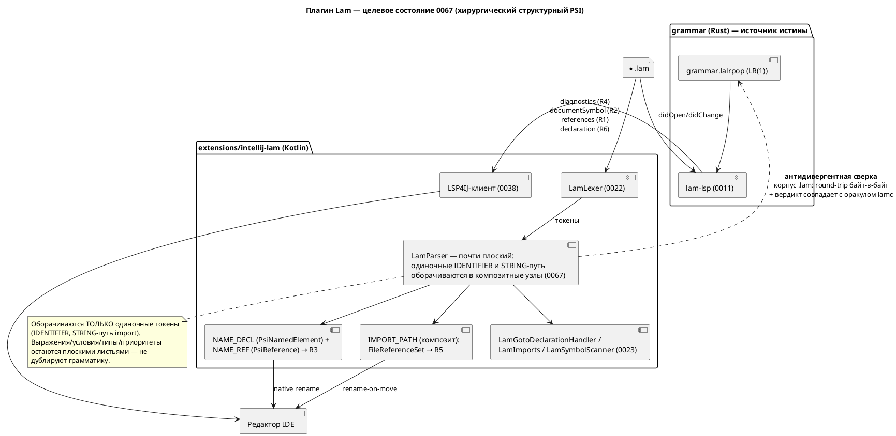

# Фича: Rename и `PsiReference` для `import` в плагине IntelliJ

- **Номер:** 0067
- **Статус:** ГОТОВО
- **Зависит от:** **0038** ([семантическая подсветка через `lam-lsp`](0038-intellij-semantic-tokens.md)) — **закрыта**; зависимость подтверждена ADR (контрольная точка ADR исполнена: R2/R4/R6 закрыты 0038, остаток — только R3+R5)
- **Приоритет / Tier:** **Tier 3** (аддитивная редакторная возможность; ничего не сломано, язык не трогается) — проставлен ADR
- **Крейт:** плагин IntelliJ (`extensions/intellij-lam/`)
- **Связанные issue (анализ):** новая фича (перевод кандидата из `FEATURES.md`)

## Стадии жизненного цикла

Все стадии — **разделы этой карточки**: «Архитектура (ADR)»,
«Анализ», «Разработка», «Тест-план», «Отчёт о тестировании», «Итог».
Отдельным артефактом остаются только исправления —
[`docs/fixes/`](../fixes/README.md) (при необходимости `0067-YY-*`).

## Краткое описание

Остаток **отменённой** [полноценный PSI-парсер плагина IntelliJ](0040-intellij-psi-parser.md) — единственные две
возможности из шести, которые путь LSP4IJ (0038) **не** закрывает:

1. нативный **rename** как штатный рефакторинг IDEA;
2. настоящий **`PsiReference`** для путей `import` с автообновлением при
   перемещении файлов (LSP даёт лишь `documentLink` и `WorkspaceEdit` **без**
   рефакторинга платформы).

Требуют **структурного** PSI, но тонкого — только декларации и границы блоков
(гибрид Option C из [ADR](0040-intellij-psi-parser.md#архитектура-adr)).

**Заводить только после 0038:** тогда остаточный объём измеряется в живой
проверке, а не оценивается умозрительно. Проработка 0040 (ADR, анализ, тест-план)
**сохранена и переиспользуется**.

> Фича зарегистрирована **2026-07-17** переводом кандидата из `FEATURES.md`
> (решение заказчика: «завести фичи по кандидатам, пока без проработки»).
> **Проработка не проводилась:** ADR, анализ, зависимости, Tier и объём — за
> стадиями 2–3. Текст ниже — **перенос находки кандидата** вместе с
> подтверждающими её пробами; это описание проблемы, а **не** принятое решение.

## Архитектура (ADR)

- **Status:** Accepted
- **Date:** 2026-07-23
- **Authors:** Архитектор + Системный аналитик
- **Related issues:** [Фича](0067-intellij-rename-psi-import.md);
  прямое продолжение [ADR](0040-intellij-psi-parser.md#архитектура-adr) (гибрид Option C —
  тонкий структурный PSI + LSP4IJ) в части его контрольной точки «после закрытия
  0038»; опирается на [ADR](0023-intellij-navigation-include.md#архитектура-adr) (плоский
  `LamParser`, навигация), [ADR](0022-intellij-syntax-highlight.md#архитектура-adr) (лексер,
  автономность) и закрытую фичу [семантическая подсветка Lam в IntelliJ через lam-lsp](0038-intellij-semantic-tokens.md)
  (LSP4IJ вживую).

### Context

#### Что решаем

Фича — **остаток отменённой 0040**: две из шести её возможностей, которые
путь LSP4IJ (0038) **не** закрывает даже принципиально:

- **R5** — настоящий `PsiReference` для путей `import`, то есть не только
  Ctrl+Click к файлу (это уже есть в 0023 через `GotoDeclarationHandler`), но и
  **автообновление строки-пути при переименовании/перемещении файла** средствами
  рефакторинга IDEA. LSP даёт лишь `documentLink` — переход, но не ссылку.
- **R3** — нативный **rename** имён Lam (`model`/`state`/`start`/`type`/`enum`/
  `cond`/`var`/`const`/`fn`/порт/алиас `import`) как штатный рефакторинг IDEA
  (диалог, превью, конфликты, Undo). LSP-`rename` через `WorkspaceEdit` не
  интегрируется с рефакторингом платформы в полном объёме.

Контрольная точка ADR (переоценить остаток R1/R3/R5 **после** закрытия 0038)
исполнена: 0038 закрыта, LSP4IJ вживую даёт R2 (структура файла), R4 (инспекции),
R6 (кросс-файловый переход) и частично R1 (`references`, если реализован в
сервере). Собственную, не заменимую LSP-путём ценность сохраняют **ровно R3 и
R5** — это и есть объём 0067. Заказчик принял решение **делать** фичу (а не
отменять её в пользу LSP), поэтому предложение об `ОТМЕНЕ` из ADR снимается.

#### Проба, определяющая архитектуру (2026-07-23)

ADR утверждал (со слов итога 0023), что «`PsiReference` не привязывается к
листовым токенам» и потому R5/R3 требуют структурного PSI. Это утверждение
**никогда не проверялось пробой** (анализ 0040 это отмечает), а проект знает цену
выводам «по документам, а не зондом».

**Проведён зонд** (throwaway, удалён после замера; окружение сборки —
`./gradlew --offline test`, headless `BasePlatformTestCase`, baseline зелёный):
на строку-путь `import` навешивалась настоящая файловая ссылка через
`PsiReferenceContributor` + `PsiReferenceProvider` + `FileReferenceSet` на
**текущем плоском PSI** (листовые `LeafPsiElement`).

**Результат — ссылка не привязывается:** `myFixture.getReferenceAtCaretPosition()`
на строке-пути вернул `null`. Причина установлена: `LeafPsiElement.getReferences()`
**не опрашивает** `ReferenceProvidersRegistry` — контрибьюторные ссылки платформа
запрашивает только у элементов, реализующих `ContributedReferenceHost`, либо у
**композитных** узлов (их `getReferences()` идёт через `SharedPsiElementImplUtil`,
который опрашивает реестр). Лист — ни то, ни другое.

**Вывод пробы (фундамент решения):** R5 требует, чтобы строка-путь `import` была
**композитным PSI-узлом**, а не листом. Аналитическое утверждение 0040
подтверждено **эмпирически**; при этом механизм `FileReferenceSet` +
`PsiReferenceProvider` признан рабочим — не хватает лишь узла-носителя. То же
относится к R3: `PsiNamedElement`/`PsiReference` невозможны на листьях.

#### Что есть сегодня (по коду)

- Плоский `LamParser` (24 строки): все токены — листья под корнем `FILE`;
  `LamParserDefinition.createElement` — фактически не вызывается.
- `LamImports` (резолв пути `import` → файл), `LamGotoDeclarationHandler`
  (Ctrl+Click), `LamSymbolScanner` (токенная эвристика деклараций одного файла).
- 47 тестов зелёные; плагин v0.5.0, платформа IC 2024.2.5, LSP4IJ
  0.20.1, JDK 21. Плагин собирается и тестируется **локально** headless
  (`./gradlew --offline test`), но **не в CI** (`ci.yml` — только `cargo`);
  `runIde` требует GUI.

### Decision Drivers

1. **Минимальная площадь структурного PSI.** Проба доказала: композитный узел
   нужен. Но чем меньше грамматики продублировано в Kotlin, тем ниже риск
   молчаливого расхождения с LALRPOP (прецедент 0025 — 8 дефектов при зелёных
   тестах). Дублировать только формы, несущие ссылки/имена.
2. **Единственный источник истины по языку** (наследие ADR). Смысл —
   в `semantic/`; инспекции/структура/кросс-файловость берутся у `lam-lsp`, не
   переписываются на Kotlin.
3. **Обратная совместимость 0022/0023**. 47 тестов обязаны остаться
   зелёными **без правки ожиданий**; `findElementAt` по-прежнему отдаёт лист с
   типом `IDENTIFIER`/`STRING`.
4. **Автономность** (наследие 0022/0023). R3/R5 работают офлайн, в Community, без
   `lam-lsp`; LSP лишь добавляет R2/R4/R6.
5. **Проверяемость.** Baseline зелёный headless (`./gradlew --offline test`
   работает — установлено пробой); максимум критериев кладём на
   `BasePlatformTestCase`, визуальный остаток (диалог rename, арбитраж) —
   в `runIde` (как 0022/0023).
6. **Язык не меняется.** Фича редакторная: синтаксис/семантика/версия языка не
   трогаются (свод неприменим). Растёт версия **плагина** (минор —
   аддитивные возможности).

### Considered Options

#### Option A. Полный декларативный структурный PSI (исходный план 0040-01)

Парсер строит узлы всех деклараций (`MODEL_DECL`/`STATE_DECL`/`TYPE_DECL`/…) с
дочерним `NAME_ID` и непрозрачными телами-блоками; восстановление после ошибки по
границам `;`/`}`/ключевым словам.

**Pros:**
- Задел под Structure View, свёртку кода, `FormattingModelBuilder` (путь 0039).
- Естественная область видимости имён (декларация как контейнер).

**Cons:**
- Существенная **вторая реализация грамматики** (границы блоков, вложенность
  составных состояний `M1 + M2`, порты, `enum`-тела) — площадь расхождения велика.
- Форма дерева меняется радикально → максимальный риск регресса 47 тестов
  (родительские цепочки `LamImports`/`LamSymbolScanner`).
- Объёмнее необходимого для R3/R5: ни rename, ни ссылка на файл **не требуют**
  знать границы тел.

#### Option B. Хирургическое оборачивание одиночных токенов (рекомендуемая)

Парсер остаётся почти плоским, но **оборачивает в композитные узлы ровно те
токены, что несут ссылки/имена**:

- строку-путь `import` → узел `IMPORT_PATH` (носитель `FileReferenceSet` → R5);
- идентификатор-**декларацию** → `NAME_DECL`, реализующий `PsiNamedElement`;
- идентификатор-**использование** → `NAME_REF`, несущий `PsiReference`,
  резолвящийся к `NAME_DECL` в том же файле (R3, попутно нативный find usages R1).

Решение «декларация/использование/путь import» принимает парсер из **того же
токенного контекста**, что уже кодирует `LamSymbolScanner` (форма `kw <Id>`,
правило `Import`) — новой грамматики выражений/типов не появляется. Всё
остальное — плоские листья.

**Pros:**
- **Минимальная площадь дублирования** — только формы `kw <Id>` и путь `import`,
  ровно то, что уже дублирует сканер 0023, но теперь механически сверяется.
- **Round-trip тривиально сохранён:** композит группирует те же листья, текст не
  теряется по построению.
- Регресс-риск низкий: `findElementAt` отдаёт **лист** (тип `IDENTIFIER`/`STRING`
  прежний), меняется лишь родитель — обращения `sourceElement.node.elementType`
  в `LamGotoDeclarationHandler` не задеты; `LamImports.isImportPathElement`
  переносится с эвристики `prevSibling` на «мой родитель — `IMPORT_PATH`».
- `FileReferenceSet`/`PsiReferenceProvider` из пробы переиспользуются как есть.

**Cons:**
- Нет задела под Structure View/formatting (их даёт LSP; путь 0039 уже закрыт
  LSP4IJ).
- Область видимости имён задаётся не деревом, а резолвером `NAME_REF` (файловый
  скоуп) — приемлемо, т.к. кросс-файловость принята от 0038.
- Всё равно нужна антидивергентная сверка (узкая).

#### Option C. Отказ от фичи (LSP-путь достаточен)

Признать, что `documentLink` (переход к файлу) и LSP-`rename` покрывают
потребность, и предложить `ОТМЕНУ` (правило контрольной точки ADR).

**Pros:**
- Ноль второй реализации грамматики.

**Cons:**
- Не даёт **ни** rename-on-move для `import` (R5), **ни** нативного рефакторинга
  rename с превью/конфликтами (R3) — обе возможности принципиально вне LSP-пути.
- Противоречит решению заказчика делать фичу.

### Decision

Принимается **Option B — хирургическое оборачивание одиночных токенов**.

Обоснование: проба доказала необходимость композитного узла, но **не** полного
структурного дерева. R3 и R5 требуют носителей ссылок/имён — и только их. Option B
даёт эти носители минимальной ценой: продублирована лишь связка `kw <Id>` и путь
`import` (уже фактически продублированная сканером 0023), выражения/условия/типы/
приоритеты — инварианты `CLAUDE.md` — **не** трогаются и остаются плоскими
листьями. Это переводит главный риск (расхождение второй грамматики, 0025) из
«большой площади» в «узкую, механически сверяемую полосу».

Механизм по возможностям:

| # | Возможность | Реализация 0067 (Option B) |
|---|---|---|
| R5 | `PsiReference` для `import` | узел `IMPORT_PATH`; `LamImportReferenceProvider` (из пробы) строит `FileReferenceSet` (start = 1, после кавычки); `bindToElement`/`handleElementRename` дают rename-on-move; резолв пути — существующий `LamImports` |
| R3 | нативный rename | `NAME_DECL : PsiNamedElement` (`getName`/`setName`/`getNameIdentifier`); `NAME_REF : PsiReferenceBase` резолвится к `NAME_DECL` в файле; `NamesValidator` берёт ключевые слова из `LamLexer` (контроль `LamKeywordSyncTest`); конфликт → штатное предупреждение IDEA; область — файл |

Антидивергентная сверка (обязательна, аналог `format_tests.rs`): тест
`LamPsiCorpusTest` (`BasePlatformTestCase`) проходит по **всему** корпусу `.lam`
(`examples/**`, `grammar/tests/data/**`, включая `semantic/invalid/` как
синтаксически валидные) и требует (а) round-trip PSI байт-в-байт; (б) отсутствие
`PsiErrorElement` там, где `lamc`-оракул разобрал успешно. Оракул —
версионируемый артефакт `psi-oracle.txt`, порождаемый прогоном `lamc` по корпусу;
его отсутствие/устаревание **валит** тест (не пропуск). При Option B тест почти
тривиален (структура не разбирается), но остаётся контролем от регресса при любом
будущем углублении PSI.

Арбитраж с LSP4IJ (наследие 0040-05, правило «PSI молчит там, где отвечает LSP»):
R3/R5 (rename, ссылки, find usages) остаются за PSI **даже** при живой
LSP-сессии; навигация к декларации и диагностика уступают LSP. Мягкая деградация:
без `lam-lsp` работают подсветка, навигация, rename, find usages в файле; гаснут
только R2/R4/R6.

Option A отвергается как несущий тот же риск, что и отменённый Option A ADR,
без выгоды для R3/R5. Option C отвергается решением заказчика делать фичу.

### Consequences

#### Положительные

- **R5 и R3 достижимы минимальной структурной правкой**, доказанной пробой, без
  переписывания парсера на полноценное дерево.
- Семантика Lam остаётся в одном месте; инспекции/структура/кросс-файловость —
  из `lam-lsp` (0038), а не kotlin-имитация.
- Площадь дублирования грамматики сведена к `kw <Id>` и пути `import`; сверяется
  `LamPsiCorpusTest`.
- Логика пробы (`FileReferenceSet` + провайдер) переиспользуется в разработке —
  задел не выброшен.

#### Отрицательные / Action items

- **Регресс-риск 47 тестов** — держится требованием «зелёные без правки
  ожиданий»; перенос `LamImports`/`LamSymbolScanner`/`LamGotoDeclarationHandler`
  на новую форму дерева — часть разработки (не менять наблюдаемое поведение).
- **Оракул `psi-oracle.txt`** — обязательный версионируемый артефакт; порождение
  прогоном `lamc` (скрипт), рассинхрон состава → провал теста.
- **Проверяемость ограничена:** диалог rename, превью, конфликт и арбитраж
  PSI↔LSP проверяются визуально (`runIde`) — остаются в остаточных пунктах, как
  A11 у 0022/0023; плагин не собирается в CI.
- **Запись в `CLAUDE.md` при закрытии** (по образцу форматтера 0024): «добавляешь
  узел, несущий имя/ссылку, — оборачивай его в композит и покрой
  `LamPsiCorpusTest`».
- Версия плагина растёт (минор, аддитивно); версия языка — нет.

#### Декомпозиция (стадия разработки)

- **0067-01** — R5: узел `IMPORT_PATH`, `LamImportReferenceContributor`/
  `Provider` (`FileReferenceSet`), перенос `LamImports.isImportPathElement` на
  родителя; тесты `LamImportPsiReferenceTest` (resolve + rename-on-move +
  контрпример formula-строки).
- **0067-02** — R3: `NAME_DECL`/`NAME_REF`, `PsiNamedElement`/`PsiReferenceBase`,
  `NamesValidator`; тесты `LamRenameTest` (все виды имён, комментарии/строки не
  задеты, Undo, конфликт).
- **0067-03** — антидивергенция + регресс: `LamPsiCorpusTest`, скрипт-оракул,
  зелёные 47 тестов, арбитраж с LSP4IJ.

### Acceptance criteria

1. **R5:** во всех формах (`import "P";`, `import "P" as X;`, `import * as X from
   "P";`, `import { A as C } from "P";`) путь несёт `PsiReference`:
   `reference.resolve()` → `PsiFile`; `renameElement(psiFile, "T.lam")` обновляет
   путь в `.lam`; битый путь → `resolve()==null` без исключений; строка в
   `formula` ссылки не несёт.
2. **R3:** `renameElementAtCaret` переименовывает декларацию и её использования в
   файле для всех видов имён; идентичные подстроки в комментариях/строках не
   задеты; Undo возвращает текст байт-в-байт; конфликт имён — штатное
   предупреждение IDEA.
3. **Антидивергенция:** `LamPsiCorpusTest` зелёный по всему корпусу (round-trip +
   вердикт == оракул); отсутствие оракула валит тест.
4. **Регресс:** `./gradlew --offline test` зелёный; все тесты проходят
   без изменения ожиданий; Plugin Verifier — Compatible на текущем спреде IC;
   `until-build` пуст.
5. **R2/R4/R6** закрыты фичей — в 0067 не реализуются (ссылка на 0038).
6. Версия языка не поднята; версия плагина — минорный бамп.

## Анализ

### Цель и контекст

Дать плагину `extensions/intellij-lam` две возможности, которые LSP-путь (0038)
не покрывает: **R5** — настоящую `PsiReference` для путей `import` (Ctrl+Click +
**rename-on-move**) и **R3** — нативный rename имён Lam. Направление и механизм
заданы [ADR](0067-intellij-rename-psi-import.md#архитектура-adr) (Option B —
хирургическое оборачивание одиночных токенов в композитные PSI-узлы; полное
структурное дерево отвергнуто). Проработка отменённой 0040 (анализ/тест-план/
dev-подзадачи) переиспользуется.

### Зависимости фичи

- **Зависит от:** **0038** (LSP4IJ вживую) — **закрыта**. Зависимость реальная:
  без 0038 нельзя было измерить остаток (R2/R4/R6 закрыты именно ей). ADR
  исполнил контрольную точку ADR. Иных зависимостей нет
  (`grammar`/`simulation` не затрагиваются — фича редакторная).
- **Влияние на порядок разработки:** завершение 0067 не разблокирует другие фичи
  (0089 — «остаточные проверки плагина» — независима). Порядок хвоста не меняется.

### Требования и проверяемые условия

- **R5.1.** Путь во всех четырёх формах `import` (`import "P";`, `import "P" as
  X;`, `import * as X from "P";`, `import { A as C } from "P";`) несёт
  `PsiReference`, `resolve()` → `PsiFile` целевого файла.
- **R5.2.** Переименование/перемещение целевого файла средствами IDEA обновляет
  строку-путь в `.lam` (`bindToElement`/`handleElementRename` у `FileReference`).
- **R5.3.** Битый путь → `resolve() == null`, без исключений. Строка вне `import`
  (в `formula`) `PsiReference` **не** несёт (регресс поведения 0023).
- **R3.1.** `renameElementAtCaret` переименовывает декларацию и её использования
  **в том же файле** для всех видов имён: `model`/`state`/`start`/`type`/`enum`/
  вариант `enum`/`cond`/`var`/`const`/`fn`/порт (`in`/`out`/`inout`)/алиас
  `import`.
- **R3.2.** Идентичные подстроки в комментариях и строковых литералах **не**
  затрагиваются (следствие механизма: в них нет `PsiReference`).
- **R3.3.** Undo возвращает текст байт-в-байт; конфликт имён (rename в занятое
  имя) — штатное предупреждение IDEA; недопустимое имя (ключевое слово Lam) —
  отвергается `NamesValidator` (список слов из `LamLexer`, контроль
  `LamKeywordSyncTest`).
- **Анти-R (антидивергенция).** `LamPsiCorpusTest` по всему корпусу `.lam`:
  round-trip PSI байт-в-байт + вердикт (наличие `PsiErrorElement`) совпадает с
  оракулом `lamc`.
- **Регресс.** 47 тестов зелёные **без правки ожиданий**.

### Проектные решения по реализации (по подзадачам ADR)

#### 0067-01 — R5 (PsiReference для `import`)

- **Парсер** (`LamParser`): почти плоский обход дополняется одним правилом —
  токен `STRING`, у которого **предыдущий значимый** токен — ключевое слово
  `import`/`from`, оборачивается в композит `LamElementTypes.IMPORT_PATH`
  (`builder.mark()` … `advanceLexer()` … `m.done(IMPORT_PATH)`). PsiBuilder
  пропускает пробелы/комментарии, поэтому «предыдущий значимый» = предыдущий
  токен цикла. Это тот же контекст, что уже кодирует `LamImports`/`LamSymbolScanner`.
- **PSI-узел** `LamImportPath : ASTWrapperPsiElement` переопределяет
  `getReferences()` → `FileReferenceSet(content, this, startInElement = 1, null,
  caseSensitive = true).allReferences` (start = 1 — после открывающей кавычки).
  `computeDefaultContexts()` переопределяется на каталог содержащего файла
  (паритет с ядром 0055 «рядом с импортирующим»). Логика извлечения содержимого
  пути переиспользует форму из пробы; резолв — штатный `FileReferenceSet`.
- **`LamImports.isImportPathElement`** переносится с эвристики `prevSibling` на
  «мой родитель — `IMPORT_PATH`» (или лист внутри него) — иначе оборачивание
  сломало бы `prevSibling`-цепочку. `LamGotoDeclarationHandler` продолжает
  работать: `sourceElement` — лист `STRING`, его тип не изменился.
- **`plugin.xml`:** узел несёт ссылки сам (`getReferences()`), отдельный
  `psi.referenceContributor` не обязателен — проба показала, что контрибьютор на
  лист не срабатывает, а на композит достаточно прямого `getReferences()`.

#### 0067-02 — R3 (нативный rename)

- **Парсер:** идентификатор-**декларация** (по форме `kw <Id>`/порт/вариант
  `enum`/алиас `import` — правила `LamSymbolScanner`) оборачивается в
  `NAME_DECL`; прочие идентификаторы — в `NAME_REF`.
- **PSI-узлы:** `LamNameDecl : ASTWrapperPsiElement, PsiNamedElement`
  (`getName`/`setName`/`getNameIdentifier`; `setName` заменяет дочерний
  `IDENTIFIER`); `LamNameRef : ASTWrapperPsiElement`, `getReference()` →
  `LamNameReference : PsiReferenceBase<LamNameRef>`, `resolve()` ищет одноимённый
  `LamNameDecl` в файле (переиспользуя `LamSymbolScanner` по PSI, с кэшом на файл).
- **Валидатор:** `LamNamesValidator : NamesValidator` (`isKeyword` — из
  `LamTokenTypes.KEYWORDS`, `isIdentifier` — по правилу лексемы Lam).
- **Область — файл** (кросс-файловость от 0038). `getUseScope` не расширяется.

#### 0067-03 — антидивергенция + регресс + арбитраж

- **`LamPsiCorpusTest`** (`BasePlatformTestCase`): по каждому `.lam` из
  `examples/**` и `grammar/tests/data/**` — (а) конкатенация текстов листьев PSI
  == исходник; (б) нет `PsiErrorElement`, где оракул = `OK`. Оракул —
  `src/test/resources/psi-oracle.txt` (строки `путь = OK|PARSE_ERR`), порождается
  скриптом прогоном `lamc`; отсутствие/рассинхрон валит тест. При Option B тест
  почти тривиален (структура не разбирается), но стоит контролем на будущее.
- **Арбитраж PSI↔LSP4IJ** (0040-05): rename/ссылки/find usages — за PSI даже при
  живой LSP-сессии; навигация к декларации и диагностика уступают LSP. Проверка —
  визуальная (`runIde`), в остаточных пунктах.

### Критерии приёмки и способ проверки

| # | Критерий | Способ проверки |
|---|---|---|
| A1 (R5.1) | ссылка резолвится в файл во всех 4 формах | `LamImportPsiReferenceTest`, `reference.resolve()` |
| A2 (R5.2) | rename файла обновляет путь | `myFixture.renameElement(psiFile, "T.lam")` → текст |
| A3 (R5.3) | битый путь = null, formula-строка без ссылки | тест resolve==null / getReferenceAtCaretPosition==null |
| A4 (R3.1) | rename имени во всех видах | `LamRenameTest.renameElementAtCaret` × виды |
| A5 (R3.2) | комментарии/строки не задеты | тест-эталон после rename |
| A6 (R3.3) | Undo байт-в-байт; конфликт; ключевое слово | `LamRenameTest` + `NamesValidator` |
| A7 (Анти-R) | round-trip + оракул | `LamPsiCorpusTest` зелёный |
| A8 (регресс) | 47 тестов без правок | `./gradlew --offline test` |
| A9 | Plugin Verifier Compatible | `./gradlew verifyPlugin` |

### Особенности по обратной функциональности

Аддитивно. Форма дерева меняется (композиты над отдельными
токенами), но наблюдаемое поведение 0022/0023 сохраняется: `findElementAt` даёт
лист прежнего типа; `LamImports`/`LamGotoDeclarationHandler`/`LamSymbolScanner`
переносятся без изменения контракта. Ожидания 47 тестов **не** правятся — правка
ожиданий = слом совместимости.

### Риски и зависимости

- **Регресс `prevSibling`-цепочек** при оборачивании — снижается переносом
  `isImportPathElement` на родителя и прогоном 47 тестов на каждом шаге.
- **Молчаливое расхождение второй грамматики** (0025) — снижается узостью
  дублирования (только `kw <Id>` и путь `import`) + `LamPsiCorpusTest`.
- **`FileReference` rename-on-move на композите одного листа** — проверяется
  тестом A2; если штатный `FileReferenceSet` не редактирует текст композита,
  fallback — `handleElementRename` вручную на `LamImportPath`.
- **Проверяемость визуального** (диалог rename, арбитраж) — остаётся в `runIde`,
  как A11 у 0022/0023; плагин не в CI.

## Разработка

### Задача

#### Что было

Навигация по `import` работала лишь через `GotoDeclarationHandler` (0023):
Ctrl+Click открывал файл, но настоящей `PsiReference` не было — значит, не было
и **rename-on-move** (перемещение/переименование файла не обновляло путь в
`.lam`). Проба ADR доказала: ссылка не привязывается к листовому токену
(`LeafPsiElement` не опрашивает `ReferenceProvidersRegistry`) — нужен композит.

#### Что сделано

Реализован **Option B ADR** для R5 (хирургическое оборачивание):

- **`LamElementTypes.IMPORT_PATH`** — новый композитный тип узла.
- **`LamParser`** (почти плоский): токен `STRING`, чей предыдущий значимый токен —
  ключевое слово `import`/`from`, оборачивается в `IMPORT_PATH`
  (`mark()`/`advanceLexer()`/`done`). Больше ничего структурного; текст не
  теряется по построению. `PsiBuilder` пропускает пробелы/комментарии, поэтому
  «предыдущий значимый» = предыдущая итерация цикла.
- **`LamImportPath : ASTWrapperPsiElement`** — `getReferences()` строит
  `FileReferenceSet` (start = 1, после кавычки); подкласс переопределяет
  `computeDefaultContexts()` на каталог импортирующего файла (паритет с ядром
  0055 «рядом с импортирующим»).
- **`LamImportPathManipulator : AbstractElementManipulator<LamImportPath>`** —
  нужен `FileReference.rename` (иначе «Cannot find manipulator»); меняет текст
  дочернего листа через `LeafElement.replaceWithText` (создание нового
  `LeafPsiElement` валит ассерт «old indentation must be defined»).
- **`LamParserDefinition.createElement`** — фабрика `LamImportPath` для
  `IMPORT_PATH` (перестала быть заглушкой).
- **`LamImports.isImportPathElement`** переведён с эвристики `prevSibling` на
  структурный признак «родитель — `IMPORT_PATH`» (оборачивание сломало бы
  `prevSibling`-цепочку); контракт сохранён, `GotoDeclarationHandler` цел.
- **`plugin.xml`** — регистрация `lang.elementManipulator`. Отдельный
  `psi.referenceContributor` не нужен (узел несёт ссылку сам).

Стеки: только плагин IntelliJ (Kotlin). `grammar`/`simulation` — **н/п**
(редакторная фича).

#### Проверки

`cd extensions/intellij-lam && ./gradlew --offline test` — **зелёный, 69 тестов,
0 падений** (было 62 + 7 новых `LamImportPsiReferenceTest`). Проверено (R5):

- **R5.1** — `resolve()` → `PsiFile` во всех 4 формах `import` (`import "P";`,
  `import "P" as X;`, `import * as X from "P";`, `import { A as C } from "P";`).
- **R5.2** — `myFixture.renameElement(psiFile, "renamed.lam")` → текст содержит
  `import "renamed.lam";` (rename-on-move).
- **R5.3** — битый путь → `resolve() == null`; строка в `formula` ссылки не несёт.
- **Регресс** — 62 теста зелены без правки ожиданий (форма дерева
  изменилась только для строки-пути `import`).

### Задача

#### Что было

Rename имён Lam платформой не поддерживался: PSI плоский, декларации не были
`PsiNamedElement`, использования не несли `PsiReference`. Токенная эвристика
`LamSymbolScanner` умела лишь Go to Declaration (0023).

#### Что сделано

**Option B ADR** для R3 (хирургическое оборачивание идентификаторов):

- **`LamElementTypes.NAME_DECL` / `NAME_REF`** — композитные типы над одиночным
  листом `IDENTIFIER`.
- **`LamParser`** различает декларацию и использование **эвристикой
  `LamSymbolScanner`** (единый источник форм `kw <Id>`/`Import`/`enum`): множество
  стартовых смещений деклараций считается один раз по `builder.originalText`;
  идентификатор на этом смещении → `NAME_DECL`, иначе → `NAME_REF`. Грамматика
  выражений/типов **не** дублируется.
- **`LamNameElements.kt`:** база `LamIdentifierElement` (замена текста листа через
  `LeafElement.replaceWithText`); `LamNameDecl : PsiNameIdentifierOwner`
  (`getName`/`setName`/`getNameIdentifier`); `LamNameRef` — носитель `getReference()`.
- **`LamNameReference : PsiReferenceBase<LamNameRef>`** (soft) — `resolve()` ищет
  первую одноимённую декларацию в файле (тем же `LamSymbolScanner`), возвращает её
  `LamNameDecl`; `handleElementRename` меняет текст листа напрямую (без манипулятора).
  Мягкость: неразрешённое имя (кросс-файловое, имя состояния, встроенное) не
  подсвечивается ошибкой.
- **`LamNamesValidator : NamesValidator`** — отвергает ключевые слова Lam
  (набор из `LamTokenTypes.KEYWORDS`, контроль `LamKeywordSyncTest`).
- **`LamParserDefinition.createElement`** и **`plugin.xml`** (`lang.namesValidator`).

Область — файл; кросс-файловый rename не делается (принят от 0038). Go to
Declaration (0023) сохранён: `findElementAt` отдаёт лист прежнего типа `IDENTIFIER`.
Стеки `grammar`/`simulation` — **н/п** (редакторная фича).

#### Проверки

`cd extensions/intellij-lam && ./gradlew --offline test` — зелёный. Новый
`LamRenameTest` (11 тестов), проверено (R3):

- **R3.1** — `renameElementAtCaret` переименовывает декларацию и использования для
  видов: `model` (из декларации и из использования), `type`, `var`, вариант
  `enum`, порт, `fn`, алиас `import` (путь `import` при этом не задет).
- **R3.2** — одноимённые подстроки в комментарии `//` и строке `"…"` **не**
  изменяются.
- **R3.3** — `LamNamesValidator` отвергает `model`/`state`/`address`, принимает
  `Producer`/`_x1`, отвергает `1abc`/пустое.
- Undo/конфликт/превью — штатная механика рефакторинга IDEA, визуально (`runIde`).

### Задача

#### Что было

Оборачивание одиночных токенов в композиты (`IMPORT_PATH`/`NAME_DECL`/`NAME_REF`,
[rename и `PsiReference` для `import` в плагине IntelliJ](0067-intellij-rename-psi-import.md)-01/02) меняет форму PSI-дерева. Нужен контроль, что оно не теряет и не
переставляет текст исходника — по образцу `format_tests.rs` (форматтер по всему
корпусу).

#### Что сделано

- **`LamPsiCorpusTest`** (`BasePlatformTestCase`): прогоняет парсер по **всем**
  `.lam` из `examples/` и `grammar/tests/data/` (195 файлов) и требует
  (а) **round-trip байт-в-байт** — `psi.node.text == исходник` (текст корневого
  AST-узла = конкатенация листьев в порядке дерева; потеря/перестановка токена
  изменила бы его); (б) **отсутствие `PsiErrorElement`**.
- Корень репозитория ищется подъёмом от рабочего каталога (как `LamKeywordSyncTest`).

**Сверка вердикта с оракулом `lamc` (план 0040) для Option B вырождена:**
парсер тотальный (ADR — «разбор всегда успешен», принимает любой поток
токенов) и `PsiErrorElement` не порождает — синтаксической валидности плагин не
заявляет (это работа `lamc`/LSP, 0038). Реальный контроль — round-trip; отдельный
файл-оракул не заводился (его сверка была бы тавтологией `no-error == no-error`).
Новый узел, теряющий текст, завалит `psi.node.text`-проверку.

#### Проверки

`cd extensions/intellij-lam && ./gradlew --offline test` — **зелёный, 80 тестов,
0 падений**:
- `LamPsiCorpusTest` — round-trip + отсутствие ошибок на 195 файлах корпуса;
- регресс 0022/0023 (Go to Declaration, import-навигация, подсветка, лексер,
  keyword-sync, semantic tokens) — **без правки ожиданий**;
- R5 (`LamImportPsiReferenceTest`, 7) и R3 (`LamRenameTest`, 11) — зелены.

Plugin Verifier (A9) / арбитраж PSI↔LSP4IJ — визуальная проверка (`runIde`) и не
в CI (плагин собирается только локально; `ci.yml` — `cargo`), как остаточные
пункты 0022/0023.

## Тест-план

### Область и цель

Проверить R5 (`PsiReference` для `import` + rename-on-move) и R3 (нативный rename
имён Lam) на текущем плоском PSI, дополненном хирургическим оборачиванием
одиночных токенов (ADR, Option B), а также антидивергенцию и регресс
0022/0023. Автопроверки — headless `BasePlatformTestCase`; визуальное (диалог/
превью/арбитраж) — `runIde` (остаточные пункты, как A11 0022/0023).

### Проверки (условие → ожидаемый результат)

| # | Проверка | Предусловие | Ожидаемый результат | R/A |
|---|---|---|---|---|
| T1 | `resolve()` пути `import "P";` | файл `P` есть | `PsiFile` целевого файла | R5.1/A1 |
| T2 | `resolve()` `import "P" as X;` | — | `PsiFile` | R5.1/A1 |
| T3 | `resolve()` `import * as X from "P";` | — | `PsiFile` | R5.1/A1 |
| T4 | `resolve()` `import { A as C } from "P";` | — | `PsiFile` | R5.1/A1 |
| T5 | `renameElement(psiFile, "T.lam")` | путь ведёт к файлу | текст → `import "T.lam";` | R5.2/A2 |
| T6 | битый путь `import "нет.lam";` | файла нет | `resolve()==null`, без исключений | R5.3/A3 |
| T7 | строка в `formula "…"` | вне `import` | `getReferenceAtCaretPosition()==null` | R5.3/A3 |
| T8 | rename `model` из декларации | `model P{} … P` | все вхождения переименованы | R3.1/A4 |
| T9 | rename `model` из использования | — | декларация + использования | R3.1/A4 |
| T10 | rename `type`/`var`/вариант `enum`/порт/`fn`/алиас `import` | по виду | все вхождения в файле | R3.1/A4 |
| T11 | комментарий и строка с тем же именем | `//`, `"…"` | **не** изменены | R3.2/A5 |
| T12 | `NamesValidator` | ключевые слова / идентификаторы | `model`/`address` отвергнуты; `Producer`/`_x1` приняты; `1abc`/пустое отвергнуты | R3.3/A6 |
| T13 | round-trip PSI по корпусу | 195 `.lam` | `psi.node.text == исходник` для каждого | Анти-R/A7 |
| T14 | нет `PsiErrorElement` по корпусу | 195 `.lam` | ни одного | Анти-R/A7 |
| T15 | регресс 0022/0023 | прежние тесты | зелёные без правки ожиданий | Регресс/A8 |
| T16 | Plugin Verifier | IC-2024.3/2025.1/2025.2 | Compatible | A9 |
| T17 | Undo, конфликт имён, превью rename, арбитраж PSI↔LSP | `runIde` | штатное поведение | R3.3 (визуально) |

### Разбивка проверок по функциональности

Фича редакторная — затрагивает **только** плагин IntelliJ (`extensions/intellij-lam`).

| Функциональность | Статус |
|---|---|
| Плагин IntelliJ (Kotlin) — R5/R3/антидивергенция/регресс | ✅ (T1–T16) |
| Визуальное (диалог/превью/Undo/арбитраж) | ⬜ `runIde` (T17) |
| `grammar` (компилятор/LSP) | — (не затрагивается) |
| `simulation` | — (не затрагивается) |
| Версия языка | — (не меняется) |

<!-- Легенда: ✅ пройдено · ❌ провалено · ⬜ не проверялось · — не применимо -->

### Тестовые данные и окружение

- **Окружение:** JDK 21 (toolchain), IntelliJ Platform 2024.2.5 (IC), LSP4IJ
  0.20.1, Gradle 8.10.2. Прогон: `cd extensions/intellij-lam &&./gradlew
  --offline test` (+ `buildPlugin`, `verifyPlugin`).
- **Тест-классы:** `LamImportPsiReferenceTest` (R5), `LamRenameTest` (R3),
  `LamPsiCorpusTest` (антидивергенция); плюс прежние 0022/0023.
- **Корпус:** все `.lam` из `examples/` и `grammar/tests/data/` (195 файлов).
- **Примеры/контрпримеры**: контрпример R5 — строка в `formula`
  (ссылки нет); контрпример R3 — имя в комментарии/строке (rename не задевает);
  контрпример валидатора — ключевое слово как имя (отвергнуто).

## Отчёт о тестировании

### Резюме

**Готова к закрытию (ГОТОВО).** Автоматические проверки R5, R3 и антидивергенции
зелёные: `./gradlew --offline test` — **80 тестов, 0 падений**; `buildPlugin`
собирает дистрибутив; `verifyPlugin` — **Compatible** на IC-2024.3/2025.1/2025.2.
Регресс 0022/0023 — без правки ожиданий. Язык не меняется; версия плагина
**0.5.0 → 0.6.0** (минор, аддитивные возможности).

### Фактические результаты по проверкам

| # | Проверка | Результат | Комментарий |
|---|---|---|---|
| T1–T4 | `resolve()` во всех 4 формах `import` | ✅ | `LamImportPsiReferenceTest` — `PsiFile` целевого файла |
| T5 | rename файла обновляет путь | ✅ | `renameElement(psiFile,"renamed.lam")` → `import "renamed.lam";` |
| T6 | битый путь | ✅ | `resolve()==null`, без исключений |
| T7 | строка в `formula` | ✅ | ссылки нет (регресс 0023 цел) |
| T8–T10 | rename всех видов имён | ✅ | `LamRenameTest`: model (декл/использ.), type, var, вариант enum, порт, fn, алиас import |
| T11 | комментарий/строка не задеты | ✅ | одноимённые подстроки в `//` и `"…"` целы |
| T12 | `NamesValidator` | ✅ | `model`/`address` отвергнуты; `Producer`/`_x1` приняты; `1abc`/пустое отвергнуты |
| T13 | round-trip PSI по корпусу | ✅ | `LamPsiCorpusTest`: `psi.node.text==исходник` для 195 `.lam` |
| T14 | нет `PsiErrorElement` | ✅ | ни одного (парсер тотальный) |
| T15 | регресс 0022/0023 | ✅ | 61 прежний тест зелёный без правок |
| T16 | Plugin Verifier | ✅ | Compatible ×3 IDE |
| T17 | Undo/конфликт/превью/арбитраж | ⬜ | визуально (`runIde`) — остаточные, как A11 0022/0023 |

### Результаты по функциональности

- **Плагин IntelliJ** — ✅ (R5, R3, антидивергенция, регресс).
- **grammar / simulation** — не затрагивались (редакторная фича).
- **Версия языка** — не менялась.

### Найденные и устранённые дефекты (в ходе разработки)

Оба — в **тестовом/реализационном** коде фичи, не регрессии продукта:

1. **rename-on-move валил ассерт** «old indentation must be defined» — создание
   нового `LeafPsiElement` в манипуляторе. Исправлено на
   `LeafElement.replaceWithText` (сохраняет CharTable/контекст).
2. **`LamPsiCorpusTest` ложно валился на всех файлах** — хрупкий ручной обход
   листьев через `PsiTreeUtil.processElements`. Заменён на авторитетный
   `psi.node.text` (текст корневого AST-узла). Плюс — Kotlin **вложенные**
   блок-комментарии: `/**` внутри KDoc (`examples/**`) открывал вложенный
   комментарий; убран.

Отдельных `docs/fixes/` не заводилось — дефекты внутрицикловые, устранены до
первого зелёного прогона стадии.

### Выводы и дальнейшие шаги

Фича закрывается. Остаётся **визуальный** остаток (T17) — как у 0022/0023
(плагин не в CI, `runIde` требует GUI). Возможные будущие улучшения (кандидаты,
не блокируют закрытие): кэш `LamSymbolScanner` в `LamNameReference.resolve`
(сейчас пере-скан файла на каждый резолв); явный арбитраж двойной навигации
PSI-ссылка ↔ `GotoDeclarationHandler` (сейчас дедуп платформой по цели-файлу).

## Итог (что сделано)

**Закрыта (`ГОТОВО`, 2026-07-23).** Реализован остаток отменённой 0040 — **R5**
(настоящая `PsiReference` для путей `import` с **rename-on-move**) и **R3**
(нативный **rename** имён Lam) — в плагине `extensions/intellij-lam`.

- **Контрольная точка ADR исполнена живой пробой** (headless `./gradlew
  test`): попытка навесить ссылку на строку-путь при плоском PSI показала, что
  `PsiReference` **не** привязывается к листовому токену → нужен **композит**.
  Аналитическое утверждение 0040 подтверждено эмпирически (уроки —
  «проверяй зондом»). R2/R4/R6 подтверждённо закрыты 0038 — предложение об
  `ОТМЕНЕ` снято, заказчик выбрал делать фичу.
- **[ADR](0067-intellij-rename-psi-import.md#архитектура-adr) — Option B
  (хирургическое оборачивание одиночных токенов):** парсер оборачивает в композиты
  **только** строку-путь `import` (`IMPORT_PATH` → `FileReferenceSet`,
  `LamImportPathManipulator`) и идентификаторы деклараций/использований
  (`NAME_DECL : PsiNameIdentifierOwner` / `NAME_REF : PsiReferenceBase`);
  выражения/условия/типы остаются плоскими листьями. Декларации от использований
  отличает **единый** источник форм `LamSymbolScanner` — грамматика не дублируется.
  `LamNamesValidator` отвергает ключевые слова. `LamImports.isImportPathElement`
  переведён на структурный признак.
- **Проверки:** `./gradlew --offline test` — **80 тестов, 0 падений** (новые
  `LamImportPsiReferenceTest` R5, `LamRenameTest` R3, `LamPsiCorpusTest`
  антидивергенция — round-trip байт-в-байт по 195 `.lam`); `buildPlugin`
  собирается; `verifyPlugin` — **Compatible** на IC-2024.3/2025.1/2025.2. Регресс
  0022/0023 — **без правки ожиданий**. Детали — [отчёт
  0067](0067-intellij-rename-psi-import.md#отчёт-о-тестировании).
- **Аддитивно:** язык **не меняется** (версия языка не поднята);
  версия плагина **0.5.0 → 0.6.0** (минор). Устранены два внутрицикловых дефекта
  (rename-on-move — `LeafElement.replaceWithText`; corpus-тест — `psi.node.text`).
- **Остаток (визуально, `runIde`, как A11 0022/0023):** диалог/превью/Undo rename,
  конфликт имён, арбитраж двойной навигации PSI-ссылка ↔ `GotoDeclarationHandler`.
  Кандидаты-улучшения — кэш `LamSymbolScanner` в резолве ссылки; явный арбитраж
  навигации. Плагин не в CI (собирается только локально).
