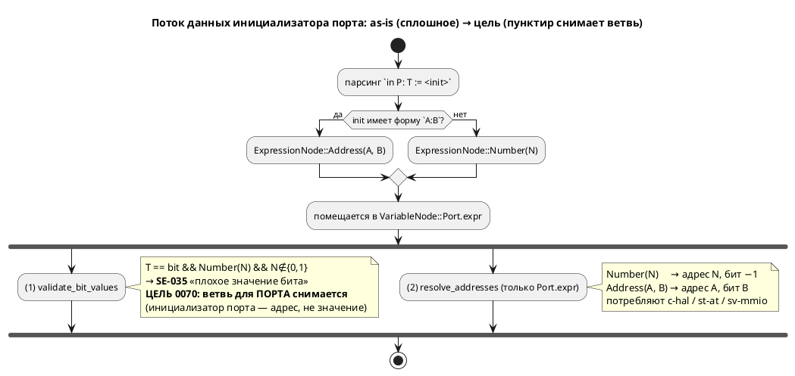

# Фича: Инициализатор порта — это адрес, но проверяется как значение

- **Номер:** 0070
- **Статус:** ГОТОВО (закрыта 2026-07-20; `precheck.sh` зелёный, вывод корпуса не изменён)
- **Зависит от:** **нет** (проставлено 2026-07-20; смежны закрытые 0020/0098 — не блокируют)
- **Приоритет / Tier:** **Tier 3** — эргономика/консистентность (не дефект компилируемости, обходится формой `addr:бит`); устраняет асимметрию u8/bit и ловушку «`bit := 0/1` — молча адрес»
- **Крейт:** `grammar` (семантика: `semantic/validate/enums.rs`)
- **Связанные issue (анализ):** новая фича (перевод кандидата из `FEATURES.md`)

## Стадии жизненного цикла (правило 17)

Все стадии — **разделы этой карточки** (правило 32): «Архитектура (ADR)»,
«Анализ», «Разработка», «Тест-план», «Отчёт о тестировании», «Итог».
Отдельным артефактом остаются только исправления —
[`docs/fixes/`](../fixes/README.md) (при необходимости `0070-YY-*`).

## Краткое описание

`in BTN: bit := 0x00100000;` даёт **`SE-035`** «переменная имеет тип bit, но
инициализирована значением 1048576 (допустимые: 0 или 1)» — то есть голый адрес на
`bit`-порту записать **нельзя**, работает только форма `0x00100000:3`.

Причина: инициализатор порта играет **две роли** сразу — «начальное значение» (его
и проверяет тип) и «адрес» (`CLAUDE.md`: «в C он иначе не используется»).
Диагностика при этом говорит про **значение**, а автор писал **адрес**.

Лечение — решение о **семантике**: либо не проверять инициализатор порта как
значение, либо развести роли синтаксически. Обойдено формой `адрес:бит`; не дефект
компилируемости.

Выявлено при закрытой [инъекция define'ов для адресов (--define)](0042-address-defines.md).

> Фича зарегистрирована **2026-07-17** переводом кандидата из `FEATURES.md`
> (решение заказчика: «завести фичи по кандидатам, пока без проработки»).
> **Проработка не проводилась:** ADR, анализ, зависимости, Tier и объём — за
> стадиями 2–3 (правило 17). Текст ниже — **перенос находки кандидата** вместе с
> подтверждающими её пробами; это описание проблемы, а **не** принятое решение.

## Архитектура (ADR)

- **Status:** Accepted
- **Date:** 2026-07-20
- **Authors:** Дизайнер языка + Архитектор
- **Related issues:** [Фича](0070-port-initializer-address-role.md); опирается на модель адреса [ADR](0020-port-address-decl.md#архитектура-adr); смежно [исправление](../fixes/0020-01-port-bit-out-of-range.md)/[фича](0098-port-bit-range-safe-hal.md) (диапазон бита); вскрыто при закрытой [инъекция define'ов для адресов (--define)](0042-address-defines.md)

### Context

`in BTN: bit := 0x00100000;` даёт **`SE-035`** «переменная `BTN` имеет тип bit, но
инициализирована значением 1048576 (допустимые: 0 или 1)». Автор писал **адрес**,
а диагностика говорит про **значение**.

#### Механизм (снят зондом + разведкой кода, 2026-07-20)

Инициализатор порта кладётся в поле `VariableNode::Port.expr` — **то же** поле,
что у `Simple`/`Const` (`semantic/tree.rs:459`). Это поле читают **два независимых
потребителя**:

1. **Проверка значения бита** — `validate/enums.rs:17` `check_bit_variable_value`:
   если тип `bit` и `expr == ExpressionNode::Number(n)` при `n∉{0,1}` → `SE-035`.
   Матч по `Number` группирует `Simple|Const|Port` **одинаково** (`enums.rs:50`) —
   **порт не отличается**. Выполняется для **всех** целей в `validate_model`.
2. **Разрешение адреса** — `address_map/resolve.rs:186` читает `expr` **только** у
   `VariableNode::Port` и вычисляет из него inline-адрес (приоритет inline <
   `address` < карта). Потребляют лишь `c-hal`/`st-at`/`sv-mmio`.

Развилка — в **парсинге**: `0x100` → `ExpressionNode::Number` (ловится SE-035);
`0x100:3` → `ExpressionNode::Address(addr,bit)` (SE-035 матчит только `Number` →
проходит). Поэтому рабочая форма всюду — `адрес:бит` (весь `stacker.lam`).



#### Замер (зонд 2026-07-20)

| Форма (порт) | Сейчас |
|---|---|
| `bit := 0x100:0` | ✅ адрес 0x100, бит 0 |
| `bit := 0x100` (голый) | ❌ **SE-035** «значением 256» |
| `u8 := 0x100` (голый) | ✅ принят (SE-035 только для `bit`) — **асимметрия** |
| `bit := 1` (голый) | ✅ принят, но c-hal даёт **адрес 0x1, бит −1** — не «значение 1» |

Два следствия замера: (1) **асимметрия** — `u8`-порт голый адрес принимает,
`bit`-порт нет; (2) **ловушка** — на `bit`-порту `:= 0`/`:= 1` **молча** суть
адреса 0/1, а `:= 2…`/`:= 0xADDR` отвергаются как «плохой бит»; черта 0/1 к
адресу отношения не имеет. В корпусе `out ready: bit := 0;` (`regulator`,
`pid_regulator`, `float_regulator`) читается человеком как «начальное значение», а
компилятором — как «адрес 0».

### Decision Drivers

1. **Семантика поля уже определена ADR:** инициализатор порта — это **адрес**
   (комментарий поля `mod.rs:883` — «Адрес порта»). Проверять его как **значение**
   типа — категориальная ошибка.
2. **Единообразие типов.** `u8 := 0xADDR` работает, `bit := 0xADDR` — нет. Один и
   тот же смысл (адрес) не должен зависеть от типа порта.
3. **Обратная совместимость и корпус.** Правка не должна ломать `stacker` (форма
   `addr:бит`) и три регулятора (`bit := 0`).
4. **Не расширять объём.** Позиция бита у bit-порта (голый адрес → бит −1) —
   смежная проблема (0098), решать её здесь — раздувание.

### Considered Options

#### Option A. Инициализатор порта — адрес; `SE-035` снимается с портов

`check_bit_variable_value` перестаёт применяться к `VariableNode::Port` (проверка
остаётся для `Simple`/`Const`). `bit := 0xADDR` валиден (адрес, бит −1) — как
`u8 := 0xADDR`.

**Pros:**
- Устраняет **и** асимметрию u8/bit, **и** ловушку «0/1 — молча адрес».
- **Минимально** (один матч-арм в `enums.rs`), принципиально (поле = адрес).
- **Обратно совместимо** (правило 11): множество принятых программ только
  расширяется; `bit := 0/1` — прежний смысл (адрес 0/1); `addr:бит` не тронут;
  корпус (`stacker`, 3 регулятора) компилируется как прежде.

**Cons:**
- `bit := 0xADDR` без бита даёт бит −1 — для однобитного порта это неполно, но
  диагностика этого — отдельный кандидат (не хуже сегодняшнего `bit := 1`).

#### Option B. Адрес + требовать позицию бита у bit-порта

Снять `SE-035`, но завести новую диагностику: у `bit`-порта адрес **обязан** иметь
позицию (`0xADDR:бит`).

**Pros:**
- Корректнее для MMIO: однобитный порт нуждается в бите.

**Cons:**
- **Ломает 3 примера корпуса** (`out ready: bit := 0;` → потребуют `:0` либо
  станут без адреса) — правка корпуса и рябь в `examples_scenario_tests`.
- Больше объём; смешивает 0070 с темой позиции бита (0098).

#### Option C. Только переформулировать текст `SE-035` на портах

Оставить отказ `bit := 0xADDR`, но на порту писать «для адреса используйте
`0xADDR:бит`».

**Pros:**
- Наименьший объём.

**Cons:**
- **Не чинит** ни асимметрию u8/bit, ни ловушку «0/1 — молча адрес» — только
  документирует ошибку. Категориальная ошибка (значение vs адрес) остаётся.

### Decision

Принимается **Option A** (решение заказчика 2026-07-20). Инициализатор порта
семантически — **адрес**, поэтому проверка его как **значения бита**
(`SE-035`) с портов снимается. Это устраняет асимметрию u8/bit и ловушку «0/1
молча адрес» минимальной правкой, ничего не ломая в корпусе. Позиция бита у
bit-порта (голый адрес → бит −1) — **отдельный кандидат**, здесь не решается
(driver 4).

### Consequences

#### Положительные

- `bit := 0xADDR` валиден на всех целях (как `u8 := 0xADDR`); категориальная
  ошибка «адрес проверяется как значение» устранена.
- Корпус не тронут; `addr:бит` и оператор `address` не тронуты.

#### Отрицательные / Action items

- **0070-01:** в `validate/enums.rs::validate_bit_values` вывести
  `VariableNode::Port` из-под `check_bit_variable_value` (проверка остаётся для
  `Simple`/`Const`). Тесты — примеры/контрпримеры (правило 16).
- **Кандидат (вынести):** голый адрес на `bit`-порту даёт бит −1 (нет позиции) —
  завести диагностику/умолчание отдельной фичей (смежно 0098). Ловушка
  «`bit := 0/1` — молча адрес, а не значение» — та же тема.
- **Версия языка не поднимается** (обоснование — в анализе): снятие ошибочно
  применяемой диагностики, а не смена семантики порта (та задана 0020);
  прецедент — 0098 (добавила `SE-060` без подъёма версии).

#### Acceptance criteria

1. `in BTN: bit := 0x00100000;` компилируется на **всех** целях (нет `SE-035`);
   у `c-hal` адрес разрешается (бит −1).
2. Контрпример: `var flag: bit := 5;` (**не** порт) — по-прежнему `SE-035`.
3. `bit := 0`/`bit := 1` на порту — валидны (адрес 0/1), как прежде.
4. Форма `addr:бит` и оператор `address` — вывод байт-в-байт прежний.
5. Корпус (`stacker`, 3 регулятора, весь `examples/`) — `precheck.sh` зелёный,
   вывод генераторов не изменён.

## Анализ

### Цель и контекст

`bit := 0xADDR` на порту даёт `SE-035` («плохое значение бита»), хотя автор писал
**адрес**. Причина — `check_bit_variable_value` (`validate/enums.rs:17`) применяет
проверку значения бита к инициализатору порта, который семантически есть адрес. Принята **Option A**: снять `SE-035` с портов.

### Зависимости фичи (правило 17/19)

- **Зависит от:** **нет.** Смежные (не блокирующие): [адрес порта — размещение и потребление (карта адресов)](0020-port-address-decl.md)
  (модель адреса — **закрыта**, её контракт мы опираем), [проверка диапазона бита адреса порта и безопасный принятый по умолчанию HAL](0098-port-bit-range-safe-hal.md)
  (диапазон бита — **закрыта**; тему «позиция бита у bit-порта» выносим кандидатом,
  не трогаем). Изменяемый код — `semantic/validate/enums.rs`, независим от очереди.
- **Влияние на порядок разработки:** ни одну фичу очереди не разблокирует;
  эргономическая правка ядра. Место в хвосте — по номеру.

### Обоснование по версии языка (правило 22)

**Версия языка не поднимается** (остаётся 0.3.0). Обоснование:

- Семантика инициализатора порта **не меняется** — она задана ADR
  («inline `:=` — источник адреса»). Мы **снимаем ошибочно применяемую** проверку
  значения (SE-035 никогда не должна была трактовать адрес как значение бита), а
  не вводим новое правило языка.
- **Прецедент 0098:** добавление диагностики `SE-060` (диапазон бита) закрыто
  **без** подъёма версии — в проекте изменение набора диагностик не считается
  подъёмом версии языка. Симметрично: снятие ошибочной диагностики с портов —
  тоже без подъёма.
- Изменение **обратно совместимо** (правило 11): множество принятых программ лишь
  **расширяется** (`bit := 0xADDR` был ошибкой — станет валиден); ни одна
  ранее-валидная программа не меняет смысл (`bit := 0/1` — прежний адрес 0/1;
  `addr:бит` и оператор `address` — без изменений).

### Требования и проверяемые условия

- **R1. Порт освобождён от проверки значения бита.** `check_bit_variable_value` не
  применяется к `VariableNode::Port`; `bit := 0xADDR` (голый) не даёт `SE-035`.
- **R2. Не-порт проверку сохраняет.** `var`/`const` типа `bit` с `:= N` (N∉{0,1})
  по-прежнему дают `SE-035` (контрпример — правило 16).
- **R3. Адрес разрешается как прежде.** `c-hal`/`st-at`/`sv-mmio`: голый адрес на
  bit-порту → адрес N, бит −1 (тот же путь `resolve_addresses`, что у u8).
- **R4. Формы `addr:бит` и `address` не тронуты.** Вывод всех целей на `stacker`
  и корпусе — байт-в-байт прежний.
- **R5. Корпус зелёный.** `out ready: bit := 0;` (3 регулятора) и весь `examples/`
  проходят `precheck.sh`; вывод генераторов не изменён.
- **R6. Единообразие типов.** `bit := 0xADDR` и `u8 := 0xADDR` ведут себя
  одинаково (оба — адрес).

### Критерии приёмки и способ проверки

| # | Критерий | Способ проверки |
|---|---|---|
| A1 | `in BTN: bit := 0x00100000;` компилируется на всех целях | прогон `lamc -t {c,c-hal,st,st-at,sv,sv-mmio,rust,plantuml}` → нет `SE-035` |
| A2 | Не-порт `var flag: bit := 5;` → `SE-035` | тест-контрпример (`tests/data/semantic/invalid/`) |
| A3 | `bit := 0`/`bit := 1` на порту валидны (адрес 0/1) | тест + инспекция `c-hal` (`{0x0/0x1u, -1, 1}`) |
| A4 | голый адрес на bit-порту у `c-hal` = адрес N, бит −1 | зонд-инспекция порождённого `.h` |
| A5 | `addr:бит`/`address`/u8 — вывод байт-в-байт прежний | `diff` вывода до/после на `stacker` + проверка воспроизводимости |
| A6 | корпус `precheck.sh` зелёный, `examples/generated/` не изменён | `./scripts/precheck.sh` + `git diff --stat examples/generated/` |
| A7 | детерминизм не нарушен | проверка воспроизводимости 0048 (в `precheck.sh`) |

### Особенности по обратной функциональности

Правка — один матч-арм в `validate/enums.rs` (общий семантический проход, до
кодогенерации). Семь целей генерации по существу **не трогаются**: они читают
`Port.expr` только как адрес (потребляющие) либо игнорируют (непотребляющие,
`c_decl.rs:64` — порт → enum, не init-значение). Поэтому проверка обратной
функциональности (правило 11) сводится к A5/A6 (вывод и корпус неизменны) + A2
(не-порт сохраняет проверку).

### Риски и зависимости

- **Риск: `Port` где-то ещё опирается на SE-035 как гарантию «bit-init ∈ {0,1}».**
  Снижение: разведка показала единственного потребителя проверки (`enums.rs:50`);
  цели адрес читают через `Address(a,b)`/`Number(n)` без опоры на диапазон бита.
- **Риск: корпусной регресс** (3 регулятора). Снижение: Option A их **не трогает**
  (`bit := 0` остаётся адресом 0, компилируется) — в отличие от отвергнутого
  Option B. Проверка `precheck.sh` — контроль (A6).
- **Вынесено кандидатом (не риск фичи):** голый адрес на bit-порту → бит −1 (нет
  позиции); ловушка «`bit := 0/1` — молча адрес». Обе — тема позиции бита, смежная
  0098; заводятся отдельной фичей.

## Разработка

### Задача

#### Что было

`grammar/src/semantic/validate/enums.rs` — `validate_bit_values` применяет
`check_bit_variable_value` к трём вариантам **одинаково**:

```rust
VariableNode::Simple { name, ty, expr, .. }
| VariableNode::Const  { name, ty, expr, .. }
| VariableNode::Port   { name, ty, expr, .. } => check_bit_variable_value(name, ty, expr, var.loc())?,
```

Для `Port` инициализатор — это **адрес** (ADR, поле `mod.rs:883` — «Адрес
порта»), а `check_bit_variable_value` трактует его как значение бита → `SE-035` на
`bit := 0xADDR`. Асимметрия: `u8 := 0xADDR` проходит (SE-035 только для `bit`).

#### Что сделано

Вариант `VariableNode::Port` **выведен** из-под `check_bit_variable_value`:
проверка значения бита остаётся только для `Simple`/`Const` (переменные/константы,
где инициализатор — действительно значение). Точечная правка одного матч-арма;
`check_bit_variable_value` не трогается (её ещё зовут enum-ветки того же файла).

Диагностика прочих проходов не затрагивается: `resolve_addresses`
(`address_map/resolve.rs`) читает `Port.expr` как адрес независимо и уже
покрывает случаи «нет адреса» (`SE-052`) и «конфликт» (`SE-049`).

**Обратная совместимость** (правило 11): множество принятых программ расширяется
(`bit := 0xADDR` был ошибкой — станет валиден); не-порт `var/const: bit := N`
сохраняет `SE-035`; вывод целей на корпусе байт-в-байт прежний. Версия языка не
поднимается (обоснование — в анализе, прецедент 0098).

#### Примеры/контрпримеры (правило 16)

Оформлены как тесты в **новом файле** `grammar/tests/port_initializer_tests.rs`
(5 шт., с локальными `build`/`build_err`) — точнее отдельных `.lam`-фикстур
(несвязанный файл был бы мёртвым грузом). **Не в `semantic_tests.rs`:** тот
заморожен реестром размера модулей (baseline 5015) и расти не имеет
права — добавление тестов туда валит `check-module-size.sh` (проверено: 5015 →
5088 → отказ). Урок: тесты к правкам ядра кладём в тематический файл, а не в
общий замороженный.

- **Примеры:** `port_bit_bare_address_no_se035` (`in P: bit := 0x00100000;` —
  без `SE-035`); `port_bit_zero_one_valid` (`bit := 0`/`1` валидны);
  `port_bit_and_u8_bare_address_symmetric` (bit и u8 одинаково принимаются).
- **Контрпримеры:** `non_port_bit_bad_value_still_se035` (`var flag: bit := 5;` →
  `SE-035`); `const_bit_bad_value_still_se035` (`const C: bit := 5;` → `SE-035`).

Примеры перенесены в документацию по языку — README, раздел «Адресные литералы
(MMIO)» (порт-инициализатор = адрес; контрпример `var f: bit := 5;`).

#### Проверки

- **A1/A2/A3:** новые семантические тесты (порт без SE-035; не-порт с SE-035;
  0/1 валидны).
- **A4:** зонд-инспекция `c-hal` для `bit := 0xADDR` → `{(uintptr_t)0xADDRu, -1, …}`.
- **A5/A6/A7:** `./scripts/precheck.sh` зелёный (правило 5); `git diff --stat
  examples/generated/` пуст; проверка воспроизводимости 0048 не нарушен.
- Полная сборка + тесты (`cargo test -- --test-threads=1`).

## Тест-план

### Область и цель

Проверить, что `SE-035` снята с инициализатора **порта** (это адрес), но
сохранена для **не-порта** (значение), и что вывод целей на корпусе не изменился.
Фича меняет семантику языка → тест-план обязан содержать **примеры и
контрпримеры** (правило 16).

### Проверки (условие → ожидаемый результат)

| # | Проверка | Предусловие | Ожидаемый результат | Ссылка на R/A |
|---|---|---|---|---|
| T1 | **Пример:** порт `bit := 0xADDR` | `in BTN: bit := 0x00100000;` | компилируется на всех 8 целях, нет `SE-035` | R1 / A1 |
| T2 | **Контрпример:** не-порт `bit := N` | `var flag: bit := 5;` | `SE-035` («допустимые: 0 или 1») | R2 / A2 |
| T3 | `bit := 0` / `bit := 1` на порту | `in P: bit := 1;` | валидно; `c-hal` → адрес 0x1, бит −1 | R1,R3 / A3 |
| T4 | голый адрес на bit-порту у `c-hal` | `in P: bit := 0x100;` | `.h`: `{(uintptr_t)0x100u, -1, 1}` | R3 / A4 |
| T5 | форма `addr:бит` не тронута | `in P: bit := 0x100:0;` | адрес 0x100, бит 0 — как прежде | R4 / A5 |
| T6 | `u8` порт голый адрес | `in P: u8 := 0x100;` | валидно (как и до фичи) | R6 / A1 |
| T7 | оператор `address` не тронут | `in P: bit; address P = 0x100;` | адрес 0x100 — как прежде | R4 / A5 |
| T8 | корпус (3 регулятора) не сломан | `out ready: bit := 0;` | компилируется; вывод не изменён | R5 / A6 |
| T9 | вывод генераторов байт-в-байт | весь `examples/` | `git diff --stat examples/generated/` пуст | R4,R5 / A5,A6 |
| T10 | детерминизм | проверка | два прогона совпадают | R5 / A7 |
| T11 | `precheck.sh` зелёный | все инструменты | `EXIT=0` | R5 / A6 |

### Разбивка проверок по функциональности

Единое условие «инициализатор порта — адрес, не значение» прогоняется против целей:

<!-- Легенда: ✅ пройдено · ❌ провалено · ⬜ не проверялось · — не применимо -->

| Функциональность | Условие | Статус |
|---|---|---|
| Семантика (SE-035) | порт освобождён, не-порт сохранён | ⬜ |
| Цель c/st/rust/sv/plantuml (не потребляют) | `bit := 0xADDR` компилируется, адрес игнорируется | ⬜ |
| Цель c-hal/st-at/sv-mmio (потребляют) | адрес разрешается (бит −1 у голого) | ⬜ |
| Корпус (`stacker`, 3 регулятора) | вывод байт-в-байт прежний | ⬜ |

### Тестовые данные и окружение

- **Примеры/контрпримеры** (правило 16): `tests/data/semantic/valid/port_bit_address.lam`
  (порт `bit := 0xADDR` — валиден), `tests/data/semantic/invalid/bit_var_value.lam`
  (не-порт `bit := 5` — `SE-035`). После приёмки — в документацию по языку (README).
- **Эталон вывода:** `stacker.lam` (17 адресов `addr:бит`) — вывод `c-hal`/`sv-mmio`
  до и после фичи сравнивается `diff` (A5).
- **Окружение:** локальный `precheck.sh` (все инструменты), проверка воспроизводимости
  0048.

## Отчёт о тестировании

### Резюме

Реализована задача: `VariableNode::Port` выведен из-под
`check_bit_variable_value` (`semantic/validate/enums.rs`). Пять тестов
(примеры/контрпримеры, правило 16) в **новом файле**
`grammar/tests/port_initializer_tests.rs` — зелёные. Полный `precheck.sh` —
зелёный, вывод генераторов на корпусе **байт-в-байт не изменён**. Вердикт —
**ГОТОВО**.

Побочный урок: первая попытка положить тесты в `semantic_tests.rs` завалила
храповик размера модулей (фича: файл заморожен на baseline 5015, вырос до
5088) — тесты вынесены в тематический файл.

**Окружение:** macOS, `grammar` 0.7.0 (крейт), rustc/clippy nightly; локальный
`precheck.sh` со всеми инструментами (cmake/ninja/clang/verilator/yosys/iec2c).

### Фактические результаты по проверкам

| # | Проверка | Результат | Комментарий |
|---|---|---|---|
| T1 | порт `bit := 0xADDR` без `SE-035` | ✅ | `port_bit_bare_address_no_se035`; зонд: компилируется на всех 8 целях |
| T2 | контрпример `var flag: bit := 5;` → `SE-035` | ✅ | `non_port_bit_bad_value_still_se035` + `const_bit_bad_value_still_se035` |
| T3 | `bit := 0`/`bit := 1` на порту валидны | ✅ | `port_bit_zero_one_valid` |
| T4 | голый адрес на bit-порту у `c-hal` = адрес, бит −1 | ✅ | зонд: `{(uintptr_t)0x1u, -1, 1}` |
| T5 | форма `addr:бит` не тронута | ✅ | зонд `ports_at.lam` (`bit := 0x100:0`) компилируется как прежде |
| T6 | `u8` порт голый адрес | ✅ | `port_bit_and_u8_bare_address_symmetric` (симметрия u8/bit) |
| T7 | оператор `address` не тронут | ✅ | тесты `port_address_*` (SE-048/049) без изменений |
| T8 | корпус (3 регулятора) не сломан | ✅ | `precheck.sh` зелёный; `out ready: bit := 0` компилируется |
| T9 | вывод генераторов байт-в-байт | ✅ | `git diff --stat examples/generated/` пуст после прогона |
| T10 | детерминизм | ✅ | проверка воспроизводимости 0048 в `precheck.sh` |
| T11 | `precheck.sh` зелёный | ✅ | `EXIT=0` |

### Результаты по функциональности

| Функциональность | Условие | Статус |
|---|---|---|
| Семантика (SE-035) | порт освобождён, не-порт сохранён | ✅ (T1/T2) |
| Цели c/st/rust/sv/plantuml (не потребляют) | `bit := 0xADDR` компилируется | ✅ (T1) |
| Цели c-hal/st-at/sv-mmio (потребляют) | адрес разрешается (бит −1 у голого) | ✅ (T4) |
| Корпус (`stacker`, 3 регулятора) | вывод байт-в-байт прежний | ✅ (T8/T9) |

### Выводы и дальнейшие шаги

Правка минимальна (один матч-арм), обратно совместима, вывод корпуса неизменен.
**Исправлений (`docs/fixes/`) не потребовалось.** Версия языка не поднята
(снятие ошибочно применяемой диагностики; прецедент 0098).

Вынесено **кандидатом** (смежно 0098, не в объёме 0070): голый адрес на
`bit`-порту даёт бит −1 (нет позиции бита в слове) — завести диагностику/умолчание
отдельной фичей; та же тема — ловушка «`bit := 0/1` на bit-порту — молча адрес, а
не значение».

## Итог (что сделано)

**Закрыта 2026-07-20** (Option A ADR — решение заказчика). Инициализатор порта
семантически — **адрес**, поэтому проверка его как **значения бита**
(`SE-035`) снята с портов.

- **0070-01** (`grammar/src/semantic/validate/enums.rs`): `VariableNode::Port`
  выведен из-под `check_bit_variable_value` — проверка остаётся для `Simple`/
  `Const`. Один матч-арм. `in BTN: bit := 0x00100000;` теперь валиден (как
  `u8 := 0xADDR`); устранена асимметрия u8/bit и ловушка «`bit := 0/1` — молча
  адрес».
- **Тесты** (правило 16) — новый файл `grammar/tests/port_initializer_tests.rs`
  (5 шт.): примеры (порт `bit := 0xADDR` без SE-035; `0/1` валидны; симметрия
  u8/bit) и контрпримеры (`var`/`const bit := 5` → `SE-035`). Не в
  `semantic_tests.rs` — тот заморожен храповиком размера (0027).
- **README** — раздел «Адресные литералы (MMIO)» переписан: порт-инициализатор =
  адрес, форма `addr:бит`, контрпример `var f: bit := 5;` (правила 15/16).

**Проверка (✅):** 5 тестов зелёные; полный `precheck.sh` `EXIT=0`; вывод
генераторов на корпусе **байт-в-байт не изменён** (`stacker`, 3 регулятора); ST
`iec2c` 8/8. Детали — [отчёт](0070-port-initializer-address-role.md#отчёт-о-тестировании).

**Обратно совместимо** (правило 11): принимаемых программ больше, ни одна прежняя
не меняет смысл. **Версия языка не поднята** — снятие ошибочно применяемой
диагностики (прецедент 0098). Исправлений (`docs/fixes/`) не потребовалось.

**Вынесено кандидатом** (смежно 0098): голый адрес на `bit`-порту даёт бит −1
(нет позиции бита в слове) — завести диагностику/умолчание отдельной фичей.
