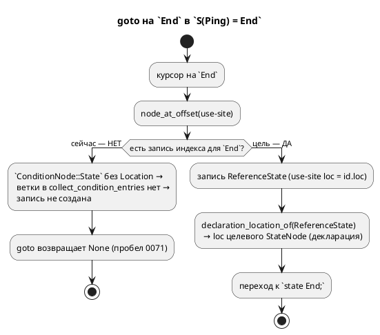

# Фича: Переход на имя состояния в `S(Ping) = End` не работает

- **Номер:** 0071
- **Статус:** ГОТОВО (реализовано и проверено-20; `precheck.sh` зелёный)
- **Зависит от:** **нет** (строится на закрытой 0056 — не блокирует)
- **Приоритет / Tier:** **Tier 3** — эргономика LSP (навигация; не дефект компилируемости)
- **Крейт:** `grammar` (`semantic/mod.rs`, `semantic/condition.rs`, `semantic/index/`, `lsp/goto.rs`)
- **Связанные issue (анализ):** новая фича (перевод кандидата из `FEATURES.md`); прямое продолжение [кросс-файловый переход к декларации — точный путь вместо угадывания](0056-lsp-goto-exact-file.md) (граница 0056-04)

## Стадии жизненного цикла

Все стадии — **разделы этой карточки**: «Архитектура (ADR)»,
«Анализ», «Разработка», «Тест-план», «Отчёт о тестировании», «Итог».
Отдельным артефактом остаются только исправления —
[`docs/fixes/`](../fixes/README.md) (при необходимости `0071-YY-*`).

## Краткое описание

`ConditionNode::State(Rc<RefCell<StateNode>>)` позиции использования **не несёт** —
ровно тот класс, что [кросс-файловый переход к декларации — точный путь вместо угадывания](0056-lsp-goto-exact-file.md) починила у ссылок на
модель (`Extend::Model`, `ConditionNode::Model` получили `Location`), но другой
сценарий.

Лечение то же и по тому же образцу: второе поле — позиция use-site, ветка в
`collect_condition_entries`, вид узла (`ReferenceState`), ветка в
`declaration_location_of`.

**Равенство обязано позицию игнорировать**: `ConditionNode` сравнивается
транзитивно через `ModelNode::PartialEq`, и автовыведённое равенство сделало бы две
ссылки на одно состояние **разными узлами** (→ поехал бы кодоген). Разбор приёма —
[кросс-файловый переход к декларации — точный путь вместо угадывания](0056-lsp-goto-exact-file.md#разработка).

Выявлено при закрытой [кросс-файловый переход к декларации — точный путь вместо угадывания](0056-lsp-goto-exact-file.md).

> Фича зарегистрирована **2026-07-17** переводом кандидата из `FEATURES.md`
> (решение заказчика: «завести фичи по кандидатам, пока без проработки»).
> **Проработка не проводилась:** ADR, анализ, зависимости, Tier и объём — за
> стадиями 2–3. Текст ниже — **перенос находки кандидата** вместе с
> подтверждающими её пробами; это описание проблемы, а **не** принятое решение.

## Архитектура (ADR)

- **Status:** Accepted
- **Date:** 2026-07-20
- **Authors:** Архитектор + Дизайнер LSP
- **Related issues:** [Фича](0071-lsp-goto-state-name.md); **прямое продолжение** [фичи](0056-lsp-goto-exact-file.md) ([кросс-файловый переход к декларации — точный путь вместо угадывания](0056-lsp-goto-exact-file.md#разработка), её граница строки 98–100)

### Context

`goto declaration` на имени состояния в условии `ref Stop: S(Ping) = End;` (курсор
на `End`) **не срабатывает**. Фича починила ровно этот класс для ссылок на
**модель** (`ConditionNode::Model`/`Extend::Model` получили use-site `Location`,
заведён вид узла `ReferenceModel`), но явно оставила границей ссылку на
**состояние** (0056-04, строки 98–100): «`ConditionNode::State(Rc)` позиции
по-прежнему не несёт».

#### Механизм пробела (разведка кода 2026-07-20)

`End` в `S(Ping) = End` — плоский идентификатор, разрешаемый в
`semantic/condition.rs:185` (`ast::Condition::Variable(id)`) по порядку поиска
var → cond → **model** → **state** → enum-variant. Соседние ветки несут use-site
`id.loc`, а ветка состояния — **нет**:

```rust
} else if let Some(model) = model.borrow().search_model(&name) {
    return Ok(ConditionNode::Model(model.clone(), id.loc));   // 0056: позиция есть
} else if let Some(state) = model.borrow().search_state(&name) {
    return Ok(ConditionNode::State(state.clone()));           // 0071: id.loc ОТБРОШЕН
```

Следствия (полный аналог 0056):
- `ConditionNode::State(Rc<RefCell<StateNode>>)` (`mod.rs:1320`) — **без**
  `Location` (у `Model`/`Variable` — есть).
- В `SemanticIndex::collect_condition_entries` (`index.rs:587`) ветки для
  `ConditionNode::State` **нет** — узел падает в `_ => {}` (`index.rs:670`), в
  индекс не попадает, курсор не находит ничего.
- Нет вида узла `SemanticNodeKind::ReferenceState` и арма
  `declaration_location_of` (`lsp/goto.rs:159`).

**Отличие от 0056-04 (упрощение):** там позиция ссылки на модель **уничтожалась**
при разрешении через промежуточный `ExpressionNode`, и пришлось разворачивать АСД
напрямую. Здесь `id.loc` **уже под рукой** в точке создания — протаскивать ничего
не нужно.



### Decision Drivers

1. **Прецедент задан 0056.** Приём (второе поле-позиция, ручной `PartialEq`,
   `Reference*`-вид узла, арм goto) уже применён к модели; повторение — наименьший
   риск и наибольшая согласованность.
2. **Позиция обязана быть невидимой для равенства.** `ConditionNode` сравнивается
   транзитивно через `ModelNode::PartialEq` (`mod.rs:286`); use-site в равенстве
   расщепил бы две ссылки на одно состояние в разные узлы → поехал бы кодоген
   (п. 2).
3. **Язык не меняется.** Правка — LSP/индекс + внутреннее поле АСД, которое
   генераторы игнорируют. Вывод целей обязан остаться байт-в-байт.

### Considered Options

#### Option A. Use-site `Location` на `ConditionNode::State` (аналог 0056)

`State(Rc)` → `State(Rc, Location)`; `condition.rs:195` передаёт `id.loc`; ручной
`PartialEq` игнорирует позицию (`State(a, _)`); новый `SemanticNodeKind::
ReferenceState` + ветка `collect_condition_entries` + арм `declaration_location_of`
(зеркало резолвера состояния `goto.rs:167-172`).

**Pros:**
- Согласовано с 0056 (один приём на модель и состояние).
- Позиция уже доступна — правка меньше, чем у 0056-04.
- Кодоген неизменен (поле игнорируется `PartialEq` и генераторами).

**Cons:**
- Кортеж `ConditionNode::State` растёт → ~10 match-мест правятся (компилятор
  заставит — безопасно).

#### Option B. Отдельное хранилище позиций use-site (карта `Rc → Location`)

Не менять вариант, вести побочную карту позиций.

**Pros:**
- `ConditionNode::State` не трогается.

**Cons:**
- **Против прецедента 0056** (тот выбрал поле в узле, отвергнув «сырое АСД рядом»).
- Карта по `Rc`-адресу хрупка (клонирование, перестроение); два use-site одного
  состояния неразличимы.

#### Option C. Переиспользовать вид узла `Reference` (ref-ребро) для состояния-в-условии

Эмитить существующий `SemanticNodeKind::Reference` вместо нового `ReferenceState`.

**Pros:**
- Ни нового вида узла, ни арма goto (резолвер `Reference` уже ищет состояние).

**Cons:**
- Смешивает **два разных use-site** (цель `ref`-перехода и имя в условии) под
  одним видом — 0056 сознательно развёл `Model`/`ReferenceModel`; ломает
  симметрию и затрудняет будущую диагностику/подсветку по виду.

### Decision

Принимается **Option A** — прямое повторение приёма для состояния. Позиция
доступна в точке создания (`id.loc`), поэтому правка сводится к трём ходам
(поле + `PartialEq` + передача `id.loc`) плюс индекс/goto-ветки, зеркальные
`ReferenceModel`. Отдельный вид `ReferenceState` (не переиспользование
`Reference`) — ради симметрии с 0056 (use-site ≠ ребро перехода).

### Consequences

#### Положительные

- goto на имени состояния в условии (`S(Ping) = End`, курсор на `End`) открывает
  декларацию состояния — впервые.
- Приём един для ссылок на модель и состояние; будущая ссылка (кандидат —
  `ConditionNode::State` в других формах) идёт тем же путём.

#### Отрицательные / Action items

- **0071-01:** поле `Location` на `ConditionNode::State`; ручной `PartialEq`
  игнорирует его; `condition.rs:195` (+ `rebuild_condition`) передаёт `id.loc`;
  обновить ~10 match-мест (генераторы/валидатор/lower_float); `ReferenceState` +
  ветка `collect_condition_entries` + арм `declaration_location_of`; тест в
  `lsp_tests.rs`/`lsp_goto_tests.rs`.
- **Версия языка не поднимается** — синтаксис и семантика языка не меняются
  (внутреннее поле АСД + LSP); вывод генераторов байт-в-байт неизменен.

#### Acceptance criteria

1. goto на `End` в `ref Stop: S(Ping) = End;` возвращает диапазон декларации
   состояния (зонд захватывает фактическую строку — «сперва зонд»).
2. Существующие goto (модель `S(Helper)`, `ref`-ребро, переменная условия) — без
   регресса.
3. Вывод генераторов на корпусе **байт-в-байт неизменен** (проверка детерминизма
   0048 + ручной `PartialEq`, игнорирующий позицию).
4. `precheck.sh` зелёный, включая тесты под `--features lsp`.

## Анализ

### Цель и контекст

goto на имени состояния в условии (`S(Ping) = End`, курсор на `End`) не работает:
`ConditionNode::State` не несёт use-site `Location`, поэтому в индекс не попадает.
Принята **Option A**: повторить приём для состояния — позиция
доступна в точке создания (`condition.rs:195`, `id.loc`).

### Зависимости фичи

- **Зависит от:** **нет.** Строится на **закрытой** [кросс-файловый переход к декларации — точный путь вместо угадывания](0056-lsp-goto-exact-file.md)
  (её инфраструктура: `SemanticIndex`, `declaration_location_of`, вид
  `ReferenceModel`, ручные `PartialEq`) — но 0056 в статусе `ГОТОВО`, блокировки
  нет. Изменяемый код (`semantic/mod.rs`, `condition.rs`, `index.rs`, `lsp/goto.rs`)
  независим от очереди.
- **Влияние на порядок разработки:** ни одну фичу не разблокирует; LSP-эргономика.
  Место в хвосте — по номеру.

### Обоснование по версии языка

**Версия языка не поднимается** (остаётся 0.3.0). Правка не касается синтаксиса и
семантики языка: добавляется **use-site позиция** в семантический узел (для
навигации LSP) — то же, что уже несут `ConditionNode::Variable`/`Model`. Вывод
генераторов обязан остаться **байт-в-байт** (поле игнорируется генераторами и
ручным `PartialEq`). Прецедент — сама 0056 (goto к декларации) версию не поднимала.

### Требования и проверяемые условия

- **R1. Позиция use-site у состояния.** `ConditionNode::State` несёт `Location`
  (позицию имени в исходнике); `condition.rs:195` передаёт `id.loc`.
- **R2. Индексация.** `collect_condition_entries` создаёт запись
  `SemanticNodeKind::ReferenceState` (use, в отличие от `State` — декларации) для
  `ConditionNode::State` с `Location::Source`; синтетические узлы (`Codegen`) —
  пропускаются.
- **R3. Резолв декларации.** `declaration_location_of(ReferenceState)` отдаёт
  диапазон **декларации** целевого состояния (зеркало резолвера `Reference`,
  `goto.rs:167-172`), согласованно с тем, как `End` разрешился в условии.
- **R4. Равенство игнорирует позицию.** Ручной `PartialEq for ConditionNode`
  сравнивает `State(a, _)` без `Location` — иначе кодоген расщепит узлы. Аналогично проверить транзитивный путь через `ModelNode::PartialEq`.
- **R5. Кодоген неизменен.** Вывод всех целей на корпусе байт-в-байт прежний.
- **R6. Без регресса goto.** Существующие сценарии (модель `S(Helper)`,
  `ref`-ребро, переменная условия) работают как прежде.

### Критерии приёмки и способ проверки

| # | Критерий | Способ проверки |
|---|---|---|
| A1 | goto на `End` в `S(Ping) = End` → декларация состояния | тест `lsp_goto_tests`/`lsp_tests` (зонд захватывает строку) |
| A2 | goto модели/ребра/переменной — без регресса | существующие goto-тесты зелёные |
| A3 | вывод генераторов байт-в-байт | проверка детерминизма 0048 + `git diff examples/generated/` пуст |
| A4 | равенство игнорирует позицию | негативный контроль: два use-site одного состояния равны (unit) |
| A5 | `precheck.sh` зелёный (в т.ч. `--features lsp`) | прогон |

### Особенности по обратной функциональности

Правка расширяет кортеж `ConditionNode::State` — компилятор форсирует обновление
**~10 match-мест** (генераторы `sv_expr`/`rust_expr`/`st_expr`/`c_expr/condition`/
`rust_needs`, `lower_float`, `validate/common`). Все они игнорируют состояние в
условии (эмитят имя или ошибку `unsupported`/`SV-002`) — новое поле там не читается
(добавляется `_`/`..`). Обратная функциональность: вывод целей
неизменен (A3), goto не регрессирует (A2).

### Риски и зависимости

- **Риск: `PartialEq` пропустит позицию в равенство** → тихий регресс кодогена.
  Снижение: ручной `PartialEq` уже игнорирует позицию у `Model`/`Variable`
  (`mod.rs:1354-1356`) — правка симметрична; контроль A4 + проверка детерминизма A3.
- **Риск: `rebuild_condition` (`condition.rs:210`) потеряет позицию** при
  переразборе. Снижение: он уже сохраняет `loc` у `Function` (line 219) — State
  правится тем же образом; покрыто A1 (goto работает после полного конвейера).
- **Риск: цель, куда резолвится `End`, неочевидна** (поиск состояния из области
  условия). Снижение: правило проекта «сперва зонд» — тест захватывает
  **фактическую** строку декларации, а не угадывает; goto согласован с резолвом
  (тот же `Rc`/`search_state`).
- **Тесты LSP под `#[cfg(feature = "lsp")]`** — обычная `cargo build` их не видит;
  ловит `precheck.sh` (`--all-features`). Учтено в A5.

## Разработка

### Задача

#### Что было

`ConditionNode::State(Rc<RefCell<StateNode>>)` (`semantic/mod.rs:1320`) не несёт
use-site позицию. `condition.rs:195` отбрасывает доступный `id.loc`:

```rust
} else if let Some(state) = model.borrow().search_state(&name) {
    return Ok(ConditionNode::State(state.clone()));   // id.loc отброшен
```

Следствие: `collect_condition_entries` (`index.rs:587`) не имеет ветки для
`State` (падает в `_ => {}`, `index.rs:670`), узел в индекс не попадает, goto на
`End` в `S(Ping) = End` возвращает `None`.

#### Что сделано (план по образцу)

1. **Поле позиции** — `mod.rs:1320`: `State(Rc<RefCell<StateNode>>)` →
   `State(Rc<RefCell<StateNode>>, Location)` (второе поле — use-site, как у
   `Variable`/`Model`).
2. **Ручной `PartialEq`** — `mod.rs:1357`: `(Self::State(a, _), Self::State(b, _))
   => a == b` (позиция игнорируется, как уже сделано у `Variable`/`Model`,
   `mod.rs:1354-1356`). Проверить транзитивный путь `ModelNode::PartialEq`
   (`mod.rs:286`).
3. **Передача `id.loc`** — `condition.rs:195`: `ConditionNode::State(state.clone(),
   id.loc)`; в `rebuild_condition` (`condition.rs:210`) — тем же образом, что уже
   сделано для `Function` (line 219).
4. **Обновить match-места** (компилятор форсирует; добавить `_`/`..`): генераторы
   `sv_expr.rs:453`, `rust_expr.rs:947`/`981`, `st_expr.rs:300`,
   `c_expr/condition.rs:71`/`385`, `rust_needs.rs:374`; `lower_float.rs:523`;
   `validate/common.rs:133`. Все они состояние-в-условии не эмитят как значение —
   новое поле не читают.
5. **Индекс** — `index.rs`: вид `SemanticNodeKind::ReferenceState` (use-site
   состояния, рядом с `ReferenceModel`); ветка в `collect_condition_entries` для
   `ConditionNode::State(target, loc)` (гвард `Location::Source`; имя — из
   `target.borrow().name()`; `model: Some(...)` — контекст поиска).
6. **goto** — `lsp/goto.rs:159`: арм `declaration_location_of` для `ReferenceState`
   → диапазон **декларации** целевого состояния. Предпочтительно — через уже
   разрешённый `Rc` (loc декларации = `state.borrow().loc()`, без повторного поиска
   по имени и его неоднозначности между моделями); запасной вариант — зеркало
   резолвера `Reference` (`goto.rs:167-172`, `search_state`).

**Позиция невидима для равенства** (R4): без этого две ссылки на одно
состояние из разных мест текста стали бы разными узлами → тихий регресс кодогена. Контроль — unit-тест равенства + проверка детерминизма 0048.

#### Примеры/контрпримеры и тесты

- **Зонд** (правило «сперва зонд»): на модели с `ref Stop: S(Ping) = End;`
  снять **фактический** диапазон, куда резолвится `End` (какая декларация
  состояния), — не угадывать строку.
- **Тест goto** (`lsp_goto_tests.rs` или `lsp_tests.rs`, `#[cfg(feature="lsp")]`):
  курсор на `End` → диапазон декларации состояния (по зонду). Образец —
  `t5_goto_opens_imported_file` (модель) / `goto_declaration_reference_resolves_to_state`.
- **Негативный контроль** (R4): два `ConditionNode::State` одного состояния с разными
  `Location` — равны (unit в `semantic`).

#### Проверки

- Сборка `--features lsp`; `cargo test --features lsp -- --test-threads=1`.
- `./scripts/precheck.sh` зелёный; `git diff examples/generated/` пуст (A3).
- Регресс goto: существующие `lsp_tests`/`lsp_goto_tests` зелёные (A2).

#### Уточнение при разработке: предпосылка ADR была неполной

**Зонд headline-случая `S(Ping) = End` опроверг ключевую предпосылку ADR** («`End`
разрешается в `condition.rs:185` → `ConditionNode::State`, ветка теряет `id.loc`»).
Фактически (проба над `S(Ping) = Done`, где `Done` — состояние сестры `Ping`):

```text
S(Ping) = Done  →  ConditionNode::Equal(
                       Function(Builtin "S", [Model(Ping)]),   // левая часть РАЗРЕШЕНА
                       Unresolved(ast::Variable("Done")))      // правая — НЕ State!
```

Причина: `resolve_condition` ищет состояние в области **текущей** модели (`Pong`),
а `Done` объявлено в сестре `Ping` — та невидима, поэтому имя падает в
`Unresolved(Variable)`, а **не** в `ConditionNode::State`. `ConditionNode::State`
рождается лишь когда имя — состояние **той же** модели (`x = Done` внутри `M`).

Итог — **два** механизма (оба реализованы, оба под тестом):

1. **Кросс-модельный `S(Ping) = End`** (headline, T2). Разбор — на уровне
   `ConditionNode::Equal` в `index::collect_condition_entries`
   (`try_collect_state_of_model` + `state_of_model_cond`, зеркало
   `c_expr::condition::state_of_model`): левая часть распознаётся как «состояние
   модели-аргумента», имя из правой резолвится в области **этой** модели и кладётся
   `ReferenceState` с ней в контексте. Имя-лист `Done` при этом **не**
   индексируется как рядовая `ReferenceCondition` (иначе goto вёл бы в никуда).
2. **Внутримодельный `x = Done`** (T2b). Здесь работает ровно Option A ADR: поле
   `Location` на `ConditionNode::State` + ветка `ConditionNode::State` в индексе.

Соответственно `condition.rs:195` (передача `id.loc` в `State`) и правки ~10
match-мест из плана — **нужны** (механизм 2), но headline-случай ими **не**
закрывается — он потребовал разбора на уровне `ConditionNode::Equal`. План выше
описывал только механизм 2; фактическая реализация добавила механизм 1.

Мёртвый код из первой редакции (разбор `S(...) = state` на уровне **сырого АСД**
`collect_ast_condition_entries`) снят: условие ребра резолвится в
`ConditionNode::Equal` (левая часть `S` — встроенная функция, всегда разрешима),
до сырого АСД `Equal` с `S(...)` не доходит.

## Тест-план

### Область и цель

Проверить, что goto на имени состояния в условии открывает декларацию состояния,
без регресса прочих goto и без изменения вывода генераторов. Фича — LSP/индекс,
язык не меняет (свод о примерах языка неприменимо в части синтаксиса;
«пример» здесь — сценарий навигации).

### Проверки (условие → ожидаемый результат)

| # | Проверка | Предусловие | Ожидаемый результат | Ссылка на R/A |
|---|---|---|---|---|
| T1 | **Зонд:** куда резолвится `End` | модель с `ref Stop: S(Ping) = End;` | захвачен фактический диапазон декларации состояния (для T2) | R3 / A1 |
| T2 | goto на `End` в `S(Ping) = End` | курсор на `End` | диапазон декларации состояния (по T1) | R1,R2,R3 / A1 |
| T3 | запись индекса создана | тот же исходник | `ReferenceState` под смещением `End` (зонд-guard) | R2 / A1 |
| T4 | goto на модели `S(Ping)` (курсор на `Ping`) | 0056 | `ReferenceModel`, декларация модели — без регресса | R6 / A2 |
| T5 | goto на `ref`-ребре (`ref Moving`) | существующий | декларация состояния — без регресса | R6 / A2 |
| T6 | goto на переменной условия | существующий | декларация переменной — без регресса | R6 / A2 |
| T7 | равенство игнорирует позицию | два `State(rc, loc1)`/`State(rc, loc2)` | равны | R4 / A4 |
| T8 | вывод генераторов байт-в-байт | весь `examples/` | `git diff examples/generated/` пуст; проверка | R5 / A3 |
| T9 | `precheck.sh` зелёный (в т.ч. `--features lsp`) | все инструменты | `EXIT=0` | R5,R6 / A5 |

### Разбивка проверок по функциональности

<!-- Легенда: ✅ пройдено · ❌ провалено · ⬜ не проверялось · — не применимо -->

| Функциональность | Условие | Статус |
|---|---|---|
| Индекс (`ReferenceState`) | запись под use-site `End` | ✅ (зонд подтвердил узел `ReferenceState`) |
| LSP goto (кросс-модельный `S(Ping)=Done`) | `Done` → декларация состояния | ✅ `goto_state_name_in_condition_resolves_to_declaration` |
| LSP goto (внутримодельный `x=Done`) | `Done` → декларация состояния | ✅ `goto_same_model_state_node_resolves_to_declaration` |
| goto модели `S(Ping)` / ребра / переменной | без регресса | ✅ `goto_model_name_in_state_of_still_resolves_to_model` + `goto_exact_file::*` |
| Кодоген всех целей | вывод байт-в-байт неизменен | ✅ `git diff examples/generated/` пуст |
| Равенство `ConditionNode` | позиция игнорируется | ✅ `condition_state_equality_ignores_use_site` |

### Уточнение (выяснено при разработке)

Предпосылка ADR («`End` → `ConditionNode::State`, ветка теряет `id.loc`») —
**неполна**. Зонд headline-случая: `S(Ping) = End` резолвится в
`Equal(Function(Builtin S, [Model(Ping)]), Unresolved(Variable("End")))` — `End`
остаётся `Unresolved` (сестра `Ping` невидима резолверу текущей модели), а **не**
становится `State`. Поэтому:

- **T2 переформулирован**: разбор `S(Модель) = Состояние` живёт на уровне
  `ConditionNode::Equal` в индексе (`try_collect_state_of_model`), а не через
  поле `ConditionNode::State`.
- **T2b добавлен** (внутримодельный `x = Done`): именно там рождается
  `ConditionNode::State` — это и есть покрытие Option A ADR.
- Подробности — `0071-lsp-goto-state-name.md#разработка`,
  раздел «Уточнение при разработке».

### Тестовые данные и окружение

- **Фикстура/исходник:** модель с `ref Stop: S(Ping) = End;` (образец — эталонная
  модель `lib.rs` / `c_state_ref_tests.rs`, где `S(Ping) = ...` уже используется).
- **Зонд** (правило проекта): захватить фактический диапазон декларации `End`
  перед ассертами — не угадывать строку.
- **Окружение:** `cargo test --features lsp -- --test-threads=1`; полный
  `precheck.sh` (тесты LSP под `--all-features`), проверка детерминизма 0048.

## Итог (что сделано)

`goto declaration` на имени состояния в условии открывает декларацию состояния.
Реализовано **два** механизма — при разработке зонд выяснил, что предпосылка ADR
(«`End` → `ConditionNode::State`») покрывала лишь один из них:

1. **Кросс-модельный `S(Ping) = End`** (headline). `End` — состояние
   модели-аргумента, текущая модель его не видит → резолвер оставляет
   `ConditionNode::Unresolved(Variable)` (инвариант «`ref` не разрешается»). Разбор
   `S(Модель) = Состояние` — на уровне `ConditionNode::Equal` в
   `semantic/index/collect.rs` (`try_collect_state_of_model` + `state_of_model_cond`,
   зеркало `c_expr::condition::state_of_model`): имя резолвится в области
   модели-аргумента и кладётся `SemanticNodeKind::ReferenceState` с ней в контексте.
2. **Внутримодельный `x = Done`** (Option A ADR). Имя состояния **той же** модели
   резолвится в `ConditionNode::State(Rc, use-site)`; второе поле — позиция,
   как у `ConditionNode::Model` (0056). Ветка `ConditionNode::State` в индексе
   создаёт `ReferenceState`.

`declaration_location_of` получил арм `Reference | ReferenceState` (поиск состояния
в модели-контексте узла). Равенство `ConditionNode::State` позицию **игнорирует**
(ручной `PartialEq`; контроль `condition_state_equality_ignores_use_site`). Вывод
генераторов на корпусе **байт-в-байт неизменен**. `index.rs` разделён на
`index/{mod,collect}.rs` (лимит размера). Версия языка не поднята.

**Тесты** (`grammar/tests/lsp_goto_tests.rs`): `goto_state_name_in_condition_
resolves_to_declaration` (T2), `goto_same_model_state_node_resolves_to_declaration`
(T2b), `goto_model_name_in_state_of_still_resolves_to_model` (T4, без регресса
[кросс-файловый переход к декларации — точный путь вместо угадывания](0056-lsp-goto-exact-file.md)), `condition_state_equality_ignores_use_site` (T7). `precheck.sh` зелёный.

**Расхождение с ADR** зафиксировано в `docs/development/0071-01` (раздел «Уточнение при разработке») и тест-плане — ADR остаётся `Accepted`, но его механизм
дополнен разбором на уровне `Equal`, без которого headline-случай не закрывался.
