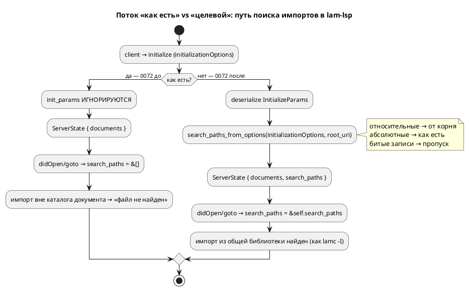

# Фича: LSP не читает `initializationOptions` (пути поиска импортов)

- **Номер:** 0072
- **Статус:** ГОТОВО
- **Зависит от:** нет (ядро уже принимает `search_paths: &[String]` — 0053/0055/0056 закрыты)
- **Приоритет / Tier:** Tier 3 (интеграция редактора; продукт-компилятор не задет)
- **Крейт:** `grammar` (`bin/lam_lsp.rs` + `src/lsp/init_options.rs`)
- **Связанные issue (анализ):** новая фича (перевод кандидата из `FEATURES.md`)

## Стадии жизненного цикла (правило 17)

Все стадии — **разделы этой карточки** (правило 32): «Архитектура (ADR)»,
«Анализ», «Разработка», «Тест-план», «Отчёт о тестировании», «Итог».
Отдельным артефактом остаются только исправления —
[`docs/fixes/`](../fixes/README.md) (при необходимости `0072-YY-*`).

## Краткое описание

`lam_lsp.rs:66` берёт `(init_id, _init_params)` и параметры **игнорирует**, поэтому
аналог `-I` в редакторе задать **нечем**: работает только каталог документа
([многофайловость LSP — импорты и позиции диагностик](0055-lsp-multifile.md)).

Следствие: модель, чьи импорты лежат в общей библиотеке **вне её каталога**, в
редакторе не соберётся, хотя `lamc -I lib` её собирает.

Вскрыто закрытой [многофайловость LSP — импорты и позиции диагностик](0055-lsp-multifile.md) (A3).

> Фича зарегистрирована **2026-07-17** переводом кандидата из `FEATURES.md`
> (решение заказчика: «завести фичи по кандидатам, пока без проработки»).
> **Проработка не проводилась:** ADR, анализ, зависимости, Tier и объём — за
> стадиями 2–3 (правило 17). Текст ниже — **перенос находки кандидата** вместе с
> подтверждающими её пробами; это описание проблемы, а **не** принятое решение.

## Архитектура (ADR)

- **Status:** Accepted
- **Date:** 2026-07-21
- **Authors:** Архитектор + Аналитик
- **Related issues:** [Фича](0072-lsp-initialization-options.md); продолжает [многофайловость LSP — импорты и позиции диагностик](0055-lsp-multifile.md) (неявный путь = каталог документа), [кросс-файловый переход к декларации — точный путь вместо угадывания](0056-lsp-goto-exact-file.md) (goto по путям).

### Context

`bin/lam_lsp.rs` при инициализации берёт пару `(init_id, _init_params)` и параметры
клиента **игнорирует** (`initialize_start()`). Во все точки ядра, разрешающие
импорты, сервер передаёт **пустой** список путей поиска:

- `collect_diagnostics_at(&path, &text, &[])` — `didOpen`/`didChange`;
- `goto_declaration_at(&path, text, position, &[])` — переход к декларации.

Обе функции ядра уже принимают `search_paths: &[String]` (это аналог `-I` у
`lamc`), но сервер туда нечего не кладёт. Работает **только** неявный путь —
каталог открытого документа.

**Следствие (боль пользователя).** Модель, чьи импорты лежат в **общей
библиотеке вне каталога документа**, в редакторе не собирается: `lam-lsp` даёт
«файл не найден», хотя `lamc -I lib` ту же модель компилирует. Аналога `-I` в
редакторе задать **нечем** — вскрыто закрытой 0055 (A3), задокументировано в
README («Аналога `-I` в редакторе пока нет»).

Канал для настройки в LSP штатный — `InitializeParams.initializationOptions`:
клиент (Zed и др.) передаёт туда произвольный JSON из своих настроек. Сервер его
просто не читает.



### Decision Drivers

1. **Паритет с `lamc -I`.** Редактор обязан разрешать импорты так же, как CLI, —
   иначе диагностика редактора расходится со сборкой (ложные «файл не найден»).
2. **Тестируемость.** Бинарник `lam_lsp.rs` юнит-тестами не покрыть; логика
   разбора настроек должна жить в библиотеке `grammar::lsp` (прецеденты:
   `PortNames::from_model` 0079, `split_include_dirs` 0043 — «вынос в библиотеку
   ради тестируемости»).
3. **Устойчивость к плохому конфигу.** Некорректная запись в `initializationOptions`
   (не массив, не строка) **не должна ронять сервер** — молча пропускается.
4. **Аддитивность (правило 11).** Где импорт уже разрешался (каталог документа),
   он обязан разрешаться и после: новые пути **добавляются**, поведение по
   умолчанию (пустой `searchPaths`) байт-в-байт прежнее.

### Considered Options

#### Option A. Читать `searchPaths` из `initializationOptions`, логику — в библиотеку

Новая `grammar::lsp::search_paths_from_options(options: Option<&Value>, root:
Option<&str>) -> Vec<String>`: читает `options["searchPaths"]` как массив строк;
относительный путь разрешает от корня рабочей области (`root_uri`), абсолютный —
как есть; не-строки и не-массив пропускает. Бинарник десериализует
`InitializeParams`, зовёт функцию, кладёт результат в `ServerState.search_paths`,
прокидывает в оба потребителя.

**Pros:**
- Точный аналог `-I`; ядро уже готово принять пути.
- Логика чистая и юнит-тестируемая (библиотека), бинарник — тонкая обвязка.
- Устойчивость к плохому конфигу выражается прямо в функции.
- Относительные пути от корня рабочей области предсказуемы (CWD сервера редактор
  не гарантирует).

**Cons:**
- Аддитивный публичный API → минорный бамп крейта `grammar`.
- Нужно выбрать имя ключа и зафиксировать его контрактом (README).

#### Option B. Разобрать всё в бинарнике, без библиотечной функции

**Pros:**
- Без бампа публичного API.

**Cons:**
- Разбор не покрыть юнит-тестами (бинарник); нарушает прецедент проекта
  «логика — в библиотеку ради тестируемости».
- Устойчивость к плохому конфигу проверить нечем.

#### Option C. Читать пути из переменной окружения / файла конфигурации рядом с проектом

**Pros:**
- Не зависит от возможностей клиента.

**Cons:**
- Дублирует штатный канал LSP (`initializationOptions`), заводит **свой** формат
  конфигурации — источник дрейфа с `lamc -I`.
- Zed и прочие клиенты уже умеют передавать `initializationOptions` из настроек.

### Decision

Принимается **Option A**. Штатный канал LSP + библиотечная функция даёт паритет с
`-I`, тестируемость и устойчивость при минимальной правке. Контракт:

```json
{
  "lsp": {
    "lam-lsp": {
      "initialization_options": {
        "searchPaths": ["lib", "../shared"]
      }
    }
  }
}
```

- Ключ — **`searchPaths`** (camelCase, конвенция JSON LSP), массив строк.
- **Относительный** путь разрешается от **корня рабочей области** (`root_uri`
  из `InitializeParams`); при отсутствии корня — остаётся как есть (CWD сервера,
  как `-I` у `lamc`).
- **Абсолютный** путь — как есть.
- **Порядок** сохраняется (как `-I`: одноимённый файл из `searchPaths`
  перекрывает локальный — поведение ядра 0055, не меняется).
- Битая запись (не массив / элемент не строка) — молча пропускается; отсутствие
  `initializationOptions` или ключа → пустой список (прежнее поведение).

Язык **не меняется** — это интеграция редактора и конфигурация инструмента, не
синтаксис/семантика. Версия языка `0.3.0` без изменений. Крейт `grammar` —
минорный бамп `0.7.0 → 0.8.0` (аддитивный публичный API `search_paths_from_options`).

### Consequences

#### Положительные

- `lam-lsp` разрешает импорты из общей библиотеки, как `lamc -I lib` — ложные
  «файл не найден» в редакторе устранены.
- Разбор настроек юнит-тестируем; бинарник остаётся тонким.
- Плохой конфиг сервер не роняет.

#### Отрицательные / Action items

- Публичный контракт ключа `searchPaths` — задокументировать в README (раздел
  «Настройка в Zed») и снять -оговорку «Аналога `-I` в редакторе пока нет».
- Относительность путей завязана на `root_uri`; single-file без рабочей области
  использует CWD сервера — документировать.
- Ручная проверка в редакторе не автоматизируется (Actions заблокирован по
  биллингу; прецедент 0090) — закрытие по локальным тестам + инспекции обвязки.

#### Acceptance criteria

1. `grammar::lsp::search_paths_from_options` читает массив `searchPaths`,
   разрешает относительные от переданного корня, абсолютные оставляет, битые
   записи пропускает — покрыто юнит-тестами.
2. `lam_lsp.rs` десериализует `InitializeParams`, зовёт функцию, хранит пути в
   `ServerState` и передаёт их в `collect_diagnostics_at` и `goto_declaration_at`.
3. Отсутствие `initializationOptions` даёт **прежнее** поведение (пустой список)
   — регрессия 0055/0056 не задета.
4. README описывает контракт `searchPaths`; -оговорка снята.
5. `./scripts/precheck.sh` зелёный (в т.ч. тесты под `--features lsp`).

## Анализ

### Цель и контекст

`bin/lam_lsp.rs` игнорирует параметры инициализации клиента и передаёт в ядро
пустой список путей поиска (`&[]`), поэтому редактор разрешает импорты только по
каталогу документа (0055). Импорт из общей библиотеки вне каталога документа в
редакторе не находится, хотя `lamc -I lib` его собирает. Цель — прокинуть в ядро
пути поиска, заданные клиентом через штатный `initializationOptions.searchPaths`,
дав паритет с `lamc -I` (ADR, Option A).

### Зависимости фичи (правило 17/19)

- **Зависит от:** **нет.** Ядро (`construct_model_with_files`, `collect_diagnostics_at`,
  `goto_declaration_at`) уже принимает `search_paths: &[String]` (0053/0055/0056,
  все закрыты) — новых зависимостей не появляется. Правка локализована в бинарнике
  `lam_lsp.rs` + одна библиотечная функция.
- **Влияние на порядок разработки:** завершение ничего не разблокирует (ни одна
  фича от 0072 не зависит). Порядок хвоста не меняется. Статус — `СОЗДАНА` →
  проработана до `РАЗРАБОТКА`, Tier **3** (интеграция редактора; продукт-компилятор
  не задет, боль реальна, но узкая — только пользователи `lam-lsp` с общей
  библиотекой).

### Требования и проверяемые условия

- **R1. Чтение настроек.** Сервер десериализует `InitializeParams` из
  `initialize_start()` и читает `initialization_options.searchPaths` (массив строк).
- **R2. Разрешение путей.** Относительный путь разрешается от корня рабочей
  области (`InitializeParams.root_uri`), абсолютный — как есть; при отсутствии
  корня относительный остаётся как есть (CWD сервера, как `-I`).
- **R3. Устойчивость.** Отсутствие `initialization_options`, отсутствие ключа,
  не-массив, элемент-не-строка — не роняют сервер; результат — валидный (возможно
  пустой) список.
- **R4. Прокидывание.** Пути хранятся в `ServerState` и передаются в
  `collect_diagnostics_at` (didOpen/didChange) и `goto_declaration_at`. Остальные
  хендлеры (completion/hover/formatting/symbols/semanticTokens) импортов не
  разрешают — не трогаются.
- **R5. Аддитивность (правило 11).** Пустой `searchPaths` (или его отсутствие) →
  поведение байт-в-байт как до фичи; регрессия 0055/0056 не задета.
- **R6. Тестируемость.** Разбор вынесен в `grammar::lsp::search_paths_from_options`
  (чистая функция), покрыт юнит-тестами.
- **R7. Контракт.** Ключ `searchPaths` задокументирован в README; -оговорка
  «Аналога `-I` в редакторе пока нет» снята.

### Критерии приёмки и способ проверки

| # | Критерий | Способ проверки |
|---|---|---|
| A1 | `search_paths_from_options` читает массив строк | юнит-тест `lsp_tests.rs` (валидный массив → те же пути) |
| A2 | относительный путь разрешается от корня, абсолютный — как есть | юнит-тест (корень + смесь путей) |
| A3 | битый конфиг не роняет и даёт пустой/усечённый список | юнит-тесты (не-массив, не-строка, `None`) |
| A4 | реальный импорт из `searchPaths` собирается в редакторе | юнит-тест через `collect_diagnostics_at(path, src, &paths)` на фикстуре библиотеки вне каталога документа: без путей — ошибка, с путями — чисто |
| A5 | goto ведёт в файл из `searchPaths` | юнит-тест `goto_declaration_at(path, src, pos, &paths)` |
| A6 | пустой список ≡ прежнее поведение | существующие тесты зелены без правок |
| A7 | README описывает контракт, оговорка снята | инспекция + `precheck.sh` (ссылки) |

### Особенности по обратной функциональности

Полная обратная совместимость (правило 11): изменение **аддитивно**. Клиент, не
передающий `searchPaths`, получает прежний пустой список — тот же путь кода, что
до 0072. Сигнатуры ядра не меняются (уже `search_paths: &[String]`). Новый
публичный API — только добавление функции (минорный бамп `grammar` 0.7.0 → 0.8.0).

### Риски и зависимости

- **Риск: ручную проверку в редакторе не автоматизировать** (Actions заблокирован
  по биллингу; прецедент 0090). Снижение — сверка на уровне ядра юнит-тестами
  (A4/A5) через те же `collect_diagnostics_at`/`goto_declaration_at`, что зовёт
  бинарник; обвязку бинарника проверить инспекцией.
- **Риск: расхождение относительности путей** (корень рабочей области vs CWD).
  Снижение — правило зафиксировано в ADR и README; функция принимает корень
  параметром, тестируется явно (A2).
- **Риск: имя ключа** — выбран `searchPaths` (конвенция JSON LSP); зафиксирован
  контрактом README (R7). Смена ключа позже — ломающее изменение, поэтому решено
  в ADR сейчас.

## Разработка

### Задача

#### Что было

`bin/lam_lsp.rs` при инициализации брал `(init_id, _init_params)` и параметры
клиента **игнорировал**. Во все точки, разрешающие импорты, сервер передавал
пустой список путей поиска:

- `collect_diagnostics_at(&path, &text, &[])` — `didOpen`/`didChange`;
- `goto_declaration_at(&path, text, position, &[])` — переход к декларации.

Импорт из общей библиотеки вне каталога документа в редакторе не находился, хотя
`lamc -I lib` его собирает (ADR, боль из 0055 A3).

#### Что сделано

**Библиотека (`grammar`) — новый модуль `src/lsp/init_options.rs`:**
- `pub fn search_paths_from_options(options: Option<&Value>, root: Option<&str>)
  -> Vec<String>` — читает массив строк по ключу `searchPaths`; относительный
  путь разрешает от корня рабочей области `root`, абсолютный оставляет как есть;
  битые записи (не массив, элемент не строка) молча пропускает. Реэкспорт в
  `lsp/mod.rs` (`pub use init_options::search_paths_from_options`). Модуль
  подключён (`mod init_options;`) — `mod.rs` не рос (633 строки, лимит 1000).

**Бинарник (`grammar/src/bin/lam_lsp.rs`):**
- `initialize_start()` теперь берёт `(init_id, init_params)`; новая
  `search_paths_from_init(&Value)` десериализует `InitializeParams`, берёт
  `root_uri` (через `uri_to_path`) и `initialization_options`, зовёт
  библиотечную функцию. Нечитаемые параметры → пустой список (не падаем на старте).
- `ServerState` получил поле `search_paths: Vec<String>`; `ServerState::new`,
  `main_loop` принимают его от `main`.
- Оба потребителя (`goto_declaration_at`, обе ветки `collect_diagnostics_at`)
  получают `&state.search_paths` вместо `&[]`. Остальные хендлеры
  (completion/hover/formatting/symbols/semanticTokens) импортов не разрешают —
  не тронуты (R4).

**Затронутые стеки (правило 11):**
- `grammar` (LSP-сервер + библиотека) — **основная работа**.
- `simulation` — **н/п** (симулятор `search_paths` берёт из своего CLI, LSP не
  использует).
- Язык (синтаксис/семантика) — **н/п**: интеграция редактора, не язык. Версия
  языка `0.3.0` без изменений. Крейт `grammar` `0.7.0 → 0.8.0` (аддитивный
  публичный API).

#### Проверки

```sh
cargo build --features lsp --bin lam-lsp                            # ок
cargo test --features lsp --lib init_options -- --test-threads=1    # 8/8
cargo test --features lsp --test lsp_init_options_tests -- --test-threads=1 # 4/4
./scripts/precheck.sh                                               # зелёный
```

Соответствие условиям анализа: R1–R7 покрыты (см. тест-план
[0072-lsp-initialization-options.md#тест-план](0072-lsp-initialization-options.md#тест-план)
и отчёт [0072-lsp-initialization-options.md#отчёт-о-тестировании](0072-lsp-initialization-options.md#отчёт-о-тестировании)).

## Тест-план

### Область и цель

Проверяем, что `lam-lsp` читает `initializationOptions.searchPaths` и разрешает
импорты как `lamc -I` (R1–R7, A1–A7 анализа). Разбор настроек — юнит-тесты
библиотечной функции; сквозное разрешение импортов — интеграционные тесты
потребителей ядра, которые зовёт бинарник. Обвязка бинарника (`lam_lsp.rs`)
проверяется инспекцией (юнит-тестами бинарник не покрыть; риск снят в анализе).

### Проверки (условие → ожидаемый результат)

| # | Проверка | Предусловие | Ожидаемый результат | Ссылка на R/A |
|---|---|---|---|---|
| T1 | чтение массива `searchPaths` | `{"searchPaths":["/abs/lib","/abs/shared"]}` | вернулись оба пути в порядке | R1 / A1 |
| T2 | относительный от корня, абсолютный как есть | `["lib","/abs/shared"]`, root=`/work/project` | `/work/project/lib`, `/abs/shared` | R2 / A2 |
| T3 | относительный без корня — как есть | `["lib"]`, root=`None` | `["lib"]` | R2 / A2 |
| T4 | порядок сохраняется | `["/z","/a","/m"]` | `["/z","/a","/m"]` | R1 / A1 |
| T5 | нет `initializationOptions` | `None` | `[]` | R3 / A3 |
| T6 | нет ключа `searchPaths` | `{"other":1}` | `[]` | R3 / A3 |
| T7 | `searchPaths` не массив | `{"searchPaths":"lib"}` | `[]` | R3 / A3 |
| T8 | элемент не строка | `["/lib",42,null,"/shared"]` | `["/lib","/shared"]` (пропуск) | R3 / A3 |
| T9 | импорт вне каталога документа без путей | `main.lam` в `proj/`, библиотека в `lib/`, пути `&[]` | диагностика «не найден» | R4/R5 / A4 |
| T10 | тот же импорт с `searchPaths=[lib]` | те же файлы, пути `[lib]` | диагностик нет | R4 / A4 |
| T11 | goto в файл из `searchPaths` | курсор на `Shared`, пути `[lib]` | открыт `lsp72/lib/shared.lam` | R4 / A5 |
| T12 | goto без путей — некуда | курсор на `Shared`, пути `&[]` | `None` (контроль паритета) | R5 / A5/A6 |
| T13 | пустой список ≡ прежнее поведение | тесты | зелены без правок | R5 / A6 |
| T14 | контракт в README | — | `searchPaths` описан, -оговорка снята | R7 / A7 |

### Разбивка проверок по функциональности

- **Разбор настроек** (`grammar::lsp::init_options`): T1–T8 — ✅ (8 юнит-тестов,
  lib).
- **Диагностика с путями** (`collect_diagnostics_at`): T9–T10 — ✅
  (`lsp_init_options_tests::lsp72_init_options`).
- **Переход к декларации с путями** (`goto_declaration_at`): T11–T12 — ✅
  (`lsp_init_options_tests::lsp72_init_options`).
- **Регрессия 0055/0056** (пустой список): T13 — ✅ (существующие тесты зелены).
- **Контракт README**: T14 — ✅ (инспекция + `precheck.sh` проверка ссылок).

<!-- Легенда: ✅ пройдено · ❌ провалено · ⬜ не проверялось · — не применимо -->

### Тестовые данные и окружение

- Юнит-фикстуры — литералы `serde_json::json!` в `src/lsp/init_options.rs`.
- Интеграционные фикстуры — `grammar/tests/data/lsp72/`: `proj/main.lam`
  (документ, импортирует `shared.lam`), `lib/shared.lam` (библиотека в **соседнем**
  каталоге — неявный путь 0055 её не находит, только `searchPaths`).
- Окружение: `cargo test --features lsp -- --test-threads=1`; полный проверка —
  `./scripts/precheck.sh`. Ручная проверка в редакторе не автоматизируется
  (Actions заблокирован по биллингу, прецедент 0090).

## Отчёт о тестировании

### Резюме

**Пройдено, фича готова к закрытию (`ГОТОВО`).** `lam-lsp` читает
`initializationOptions.searchPaths` и разрешает импорты как `lamc -I`. Разбор
настроек покрыт 8 юнит-тестами, сквозное разрешение импортов и переход к
декларации — 4 интеграционными; регрессия 0055/0056 не задета. Обвязка бинарника
проверена инспекцией (юнит-тестами не покрыть). Полный `./scripts/precheck.sh`
зелёный.

Окружение: darwin 25.5.0, `cargo test --features lsp -- --test-threads=1`, полный
проверка `./scripts/precheck.sh`. Ручная проверка в редакторе не автоматизировалась
(GitHub Actions заблокирован по биллингу — прецедент 0090).

### Фактические результаты по проверкам

| # | Проверка | Результат | Комментарий |
|---|---|---|---|
| T1 | чтение массива `searchPaths` | ✅ | `reads_search_paths_array` |
| T2 | относительный от корня, абсолютный как есть | ✅ | `relative_resolved_from_root_absolute_kept` |
| T3 | относительный без корня — как есть | ✅ | `relative_without_root_kept_as_is` |
| T4 | порядок сохраняется | ✅ | `preserves_order` |
| T5 | нет `initializationOptions` | ✅ | `none_options_gives_empty` |
| T6 | нет ключа `searchPaths` | ✅ | `missing_key_gives_empty` |
| T7 | `searchPaths` не массив | ✅ | `non_array_gives_empty` |
| T8 | элемент не строка | ✅ | `non_string_entries_skipped` |
| T9 | импорт без путей — «не найден» | ✅ | `import_unresolved_without_search_paths` |
| T10 | импорт с `searchPaths=[lib]` — чисто | ✅ | `import_resolves_with_search_paths` |
| T11 | goto в файл из `searchPaths` | ✅ | `goto_opens_file_from_search_paths` |
| T12 | goto без путей — некуда (контроль) | ✅ | `goto_absent_without_search_paths` |
| T13 | пустой список ≡ прежнее поведение | ✅ | тесты зелены без правок |
| T14 | контракт в README, оговорка снята | ✅ | инспекция + `precheck.sh` (ссылки) |

### Результаты по функциональности

- **Разбор настроек** (`grammar::lsp::init_options`, lib) — ✅ 8/8.
- **Диагностика с путями** (`collect_diagnostics_at`) — ✅ (T9–T10).
- **Переход к декларации с путями** (`goto_declaration_at`) — ✅ (T11–T12).
- **Регрессия 0055/0056** (`&[]` ≡ прежнее) — ✅ (T13).
- **`simulation`** — н/п (LSP-пути не использует).

### Примеры и контрпримеры (правило 16)

Фича языка не меняет (интеграция редактора), но проверяется парой «сработало бы /
не сработало бы» (правило 16):

- **Пример** (`tests/data/lsp72`): документ `proj/main.lam` импортирует
  `shared.lam` из **соседнего** `lib/`; с `searchPaths=["…/lib"]` импорт
  разрешается, диагностик нет, goto открывает `lib/shared.lam`.
- **Контрпример:** тот же документ **без** `searchPaths` → диагностика «Файл
  импорта не найден», goto → `None`. Это доказывает, что находку даёт именно
  `searchPaths`, а не угадывание/неявный путь.

### Выводы и дальнейшие шаги

Дефектов не найдено; исправления (`docs/fixes/0072-*`) не потребовались. Вердикт —
**ГОТОВО**. Дальнейшее (вне объёма): рабочей области `workspace_folders`
(множественные корни) сейчас не читаются — только `root_uri`; в корпусе клиентов
достаточно `root_uri` (Zed его шлёт). При появлении спроса — отдельной фичей.

## Итог (что сделано)

**Закрыта (`ГОТОВО`, 2026-07-21), Tier 3, `./scripts/precheck.sh` зелёный.**
`lam-lsp` перестал игнорировать параметры клиента: читает пути поиска импортов из
`initializationOptions.searchPaths` (аналог `-I` у `lamc`) и разрешает импорты из
общей библиотеки вне каталога документа — паритет с CLI, боль из 0055 (A3) снята.

- **Библиотека `grammar`:** новый `src/lsp/init_options.rs::search_paths_from_options`
  (чистая, тестируемая: массив строк по ключу `searchPaths`; относительный путь —
  от корня рабочей области, абсолютный — как есть; битые записи молча пропускаются).
- **Бинарник `lam_lsp.rs`:** десериализует `InitializeParams`, зовёт функцию,
  хранит пути в `ServerState`, прокидывает в `collect_diagnostics_at` и
  `goto_declaration_at`. Прочие хендлеры импортов не разрешают — не тронуты.
- **Аддитивно** (правило 11): пустой `searchPaths` ≡ прежнее поведение (только
  каталог документа, 0055) — регрессия 0055/0056 не задета. Язык не менялся
  (версия `0.3.0`); крейт `grammar` `0.7.0 → 0.8.0` (аддитивный публичный API).
- **Проверка:** 8 юнит-тестов разбора + 4 интеграционных (`lsp72_init_options`,
  фикстуры `tests/data/lsp72/` — пример/контрпример правила 16). Детали — в
  [отчёте](0072-lsp-initialization-options.md#отчёт-о-тестировании); решение — в
  [ADR](0072-lsp-initialization-options.md#архитектура-adr); задача —
  [lSP не читает `initializationOptions` (пути поиска импортов)](0072-lsp-initialization-options.md#разработка).
- **Вне объёма:** `workspace_folders` (множественные корни) — только `root_uri`;
  при спросе — отдельной фичей.
