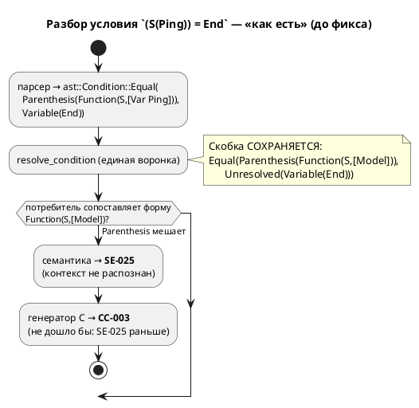
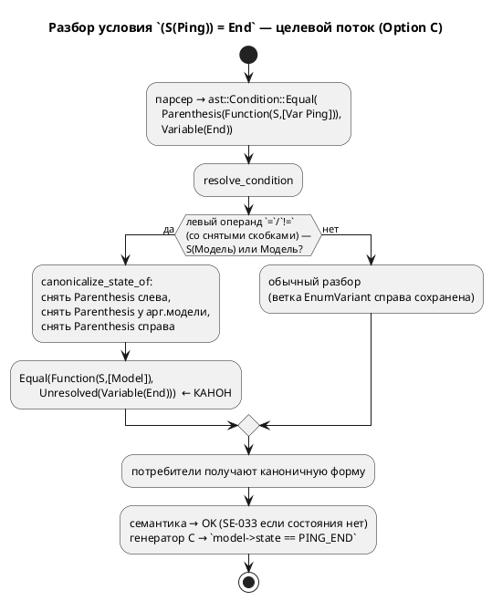

# Фича: Скобочная форма `S(…)` отвергается семантикой

- **Номер:** 0074
- **Статус:** ГОТОВО (2026-07-20)
- **Зависит от:** — (независима, подтверждено анализом)
- **Приоритет / Tier:** Tier 3 (дефект корректности на краевой конструкции)
- **Крейт:** `grammar` (семантика: `semantic/condition.rs`)
- **Связанные issue (анализ):** новая фича (перевод кандидата из `FEATURES.md`)

## Стадии жизненного цикла (правило 17)

Все стадии — **разделы этой карточки** (правило 32): «Архитектура (ADR)»,
«Анализ», «Разработка», «Тест-план», «Отчёт о тестировании», «Итог».
Отдельным артефактом остаются только исправления —
[`docs/fixes/`](../fixes/README.md) (при необходимости `0074-YY-*`).

## Краткое описание

`(S(Ping)) = Done` и `S((Ping)) = Done` дают **`SE-025`** «Неразрешённое условие»,
хотя `S(Ping) = Done` работает: спецслучай `validate.rs` ищет
`Function(S, [Model])` **непосредственно**, и обёртка `ConditionNode::Parenthesis`
его ломает — имя состояния остаётся неразрешённым.

Ожидание «скобки ничего не меняют» **опровергнуто пробой**; заготовленный разворот
скобок в генераторе C оказался бы **мёртвым кодом** и удалён.

Лечение — в **семантике** (разворачивать `Parenthesis` перед сопоставлением
контекста), а не в трансляции. Граница закреплена тестом
`parenthesised_state_of_is_rejected_by_semantics`, который **упадёт**, когда
семантика научится скобкам.

Выявлено при [трансляция `S(Модель) = Состояние` в цель `c`](0047-c-state-of-model.md), две пробы.

> Фича зарегистрирована **2026-07-17** переводом кандидата из `FEATURES.md`
> (решение заказчика: «завести фичи по кандидатам, пока без проработки»).
> **Проработка не проводилась:** ADR, анализ, зависимости, Tier и объём — за
> стадиями 2–3 (правило 17). Текст ниже — **перенос находки кандидата** вместе с
> подтверждающими её пробами; это описание проблемы, а **не** принятое решение.

## Архитектура (ADR)

- **Status:** Accepted
- **Date:** 2026-07-20
- **Authors:** Архитектор + Аналитик + Дизайнер языка
- **Related issues:** [Фича](0074-parenthesised-state-of.md); наследует находку [фичи](0047-c-state-of-model.md); опирается на инвариант `resolve_state_references` (`CLAUDE.md`).

### Context

Встроенная `S(Модель)` даёт **текущее состояние** модели; сравнение
`S(Ping) = End` — штатная конструкция языка (цель `c`). Но **скобки
вокруг операндов** ломают её:

| Форма | Результат (до исправления) |
|---|---|
| `S(Ping) = End` | ✅ работает |
| `(S(Ping)) = End` | ❌ `SE-025` «Неразрешённое условие» |
| `S((Ping)) = End` | ❌ `SE-025` |
| `S(Ping) = (End)` | ❌ `SE-025` (найдено пробой 0074 — карточка называла лишь первые две) |

Причина — распознавание паттерна `S(Модель) = Состояние` идёт **сопоставлением
формы** сразу в нескольких потребителях, и обёртка `ConditionNode::Parenthesis`
рвёт сопоставление:

- **семантика** (`validate/common.rs`): спецслучай ищет `Function(S, [Model])`
  как контекст правого операнда; при `Parenthesis(Function(…))` контекст не
  совпадает → имя состояния остаётся неразрешённым → `SE-025`;
- **генератор C** (`c_expr/condition.rs::state_of_model`): та же форма ищется
  для эмиссии `model->state == …`; при обёртке `Parenthesis` не совпадает →
  ушло бы в `CC-003`.

Ключевой факт архитектуры (проба 0074): **все** потребители получают
`ConditionNode` из **одной** функции — `semantic::condition::resolve_condition`.
Ref-условия рёбер разрешаются ею на проходе 6 (`reference.rs`), именованные
`cond` — через `extract_conditions`, LTL/Guard — через `tree.rs`. То есть точка,
где скобочная обёртка рождается в семантическом дереве, **единственна**.



### Decision Drivers

1. **Единство поведения между целями.** Скобки должны быть прозрачны везде,
   где конструкция вообще поддерживается, а не почини́ться в одной цели.
2. **Неизменность вывода корпуса (детерминизм 0048).** Правка не имеет права
   сдвинуть ни байта в `examples/generated/` — иначе дифф перестанет нести смысл.
3. **Не сломать инвариант `resolve_state_references`** (`CLAUDE.md`): имя
   состояния-аргумента обязано остаться `Unresolved` — его разрешает потребитель
   в области видимости модели-аргумента.
4. **Минимум точек правки** — чтобы новый потребитель `ConditionNode` не забыл
   развернуть скобки и не воскресил дефект.

### Considered Options

#### Option A. Разворачивать скобки у каждого потребителя (семантика + все генераторы + симулятор)

**Pros:**
- Прямое следование тексту карточки («лечение в семантике… разворачивать
  `Parenthesis` перед сопоставлением контекста»).

**Cons:**
- N точек правки (validate, C, rust, st, sv, plantuml, симулятор) — ровно тот
  класс дублирования, что дал расхождения в фичах. Новый потребитель
  забудет развернуть → дефект вернётся молча (драйвер 4).
- Часть правок — мёртвый код: цели `rust`/`st`/`sv` паттерн `S(…)` **не
  поддерживают вовсе** (RS-020/ST-011/SV-002) независимо от скобок.

#### Option B. Глобально снимать все `Parenthesis` в `resolve_condition`

**Pros:**
- Одна точка; скобки исчезают из семантического дерева совсем.

**Cons:**
- **Ломает драйвер 2 и семантику вывода.** Генераторы печатают `Parenthesis`
  как `(…)`, сохраняя группировку операндов; в цели `rust` приоритеты иначе
  расходятся с C (`CLAUDE.md`). Снятие скобок у `(a + b) * c` изменит вывод и
  может изменить смысл порождённого кода. Недопустимо.

#### Option C. Канонизировать **только паттерн `S(Модель)`** в `resolve_condition`

Снять прозрачные скобки в трёх позициях паттерна — и только в них: (1) вокруг
всего `S(…)` слева от `=`/`!=`; (2) вокруг модели-аргумента внутри `S(…)`;
(3) вокруг имени состояния справа. Все прочие скобки сохраняются.

**Pros:**
- **Одна точка** (единая воронка) чинит семантику, **все** генераторы и
  симулятор разом (драйвер 1, 4).
- Вывод корпуса **байт-в-байт неизменен**: существующие формы бесскобочны, снятие
  для них тождественно (драйвер 2, доказано пробой).
- Инвариант `resolve_state_references` цел: правая часть остаётся `Unresolved`
  (драйвер 3) — канонизация лишь снимает обёртку, разрешение по-прежнему у
  потребителя.
- Скобки паттерна не несут ни группировки, ни вывода (левая часть эмитится как
  `model->state == X`), поэтому их снятие ничего не теряет.

**Cons:**
- Требует предиката «это `S(Модель)`?», дублирующего распознавание генератора C
  (`state_of_model`). Мал и локализован; расхождение маловероятно (обе проверки —
  `Builtin("S")` либо `Model`).

### Decision

Принимается **Option C**. Канонизация паттерна `S(Модель) = Состояние` живёт в
`semantic::condition::resolve_condition` — единственной воронке, через которую
условие любого потребителя проходит ровно один раз. Скобки снимаются точечно
(три позиции паттерна), всё остальное дерево условий сохраняется дословно.

Текст карточки «лечение в семантике» **уточнён**: не «у сопоставителя
контекста в `validate.rs`», а **раньше** — при построении `ConditionNode`. Так
чинится не только `validate` (`SE-025`), но и генератор C (который иначе дал бы
`CC-003`), одним изменением. Спецслучай `validate/common.rs` **не трогается**:
он теперь получает уже каноничную форму.



### Consequences

#### Положительные

- Скобки стали **полностью прозрачны** в паттерне `S(…)`: все формы дают вывод,
  **байт-в-байт равный** каноничной `S(Ping) = End` (доказано на цели `c`).
- Правка аддитивна: ни один существующий пример не изменил вывод.
- Побочно чинится и **краткая форма** `(Ping) = End` (модель как условие в
  скобках) — тем же предикатом.

#### Отрицательные / Action items

- Контрольный тест `parenthesised_state_of_is_rejected_by_semantics`
  (`c_state_ref_tests.rs`) **инвертируется**: он фиксировал границу «семантика
  отвергает» и обязан упасть — заменяется на положительный (формы дают тот же C).
- Предикат `is_state_of` дублирует распознавание `state_of_model` генератора C.
  Задокументировано перекрёстной ссылкой; сведение в общий слой — не в объёме
  (кандидат, если появится третий распознаватель).
- Цели `rust`/`st`/`sv` паттерн `S(…)` по-прежнему **не поддерживают** — это
  предсуществующее ограничение, не относящееся к скобкам; исправление лишь уравнял
  скобочные формы с бесскобочной (обе одинаково не транслируются).

#### Acceptance criteria

1. `(S(Ping)) = End`, `S((Ping)) = End`, `S(Ping) = (End)` и произвольная
   вложенность скобок компилируются целью `c` в C, **байт-в-байт равный** выводу
   `S(Ping) = End`; порождённый C компилируется `cc`.
2. `!=` ведёт себя так же, как `=` (`S(Ping) != End` и его скобочные формы).
3. `(S(Ping)) = NoSuch` даёт **`SE-033`** (состояния нет), а не `SE-025`.
4. Вывод всего корпуса `examples/generated/` **байт-в-байт неизменен**
   (проверка детерминизма `precheck.sh` зелёный).
5. Инвариант `resolve_state_references` цел: тест
   `reference_model_compiles_and_translates_state_ref` зелёный.
6. Версия языка **не** поднимается: снятие ошибочной диагностики на форме,
   которую язык и так подразумевает валидной (прецедент 0070).

## Анализ

- **Фича:** [скобочная форма `S(…)` отвергается семантикой](0074-parenthesised-state-of.md)
- **ADR:** [скобочная форма `S(…)` отвергается семантикой](0074-parenthesised-state-of.md#архитектура-adr) (принят Option C)
- **Дата:** 2026-07-20
- **Роль:** Аналитик

### Зависит от

Пусто — фича независима. Правит `semantic::condition::resolve_condition`; не
пересекается по файлам с проработанными фичами очереди.

### Tier

**Tier 3.** Дефект корректности языка на **краевой** конструкции: паттерн
`S(…)` в корпусе используется без скобок, скобочные формы никто сегодня не пишет,
ничего рабочего не сломано. Ценность — устранение ловушки «скобки в языке
меняют смысл там, где не должны», и снятие обманчивого `SE-025`.

### Воспроизведение (проба)

`lamc compile` на модели с `ref Stop: <форма>;` (сёстры `Ping`/`Pong`):

| Форма | До исправления |
|---|---|
| `S(Ping) = End` | ✅ |
| `(S(Ping)) = End` | `SE-025` |
| `S((Ping)) = End` | `SE-025` |
| `S(Ping) = (End)` | `SE-025` ← **не был назван в карточке**, найден пробой |
| `S(Ping) = NoSuch` | `SE-033` (штатно) |

Проба также показала: цели `rust`/`st`/`sv` отвергают **и** бесскобочную
`S(Ping) = End` (RS-020/ST-011/SV-002) — паттерн `S(…)` там не поддержан вовсе.
Значит, объём исправления — сделать скобки прозрачными (уравнять с бесскобочной), а не
«добавить поддержку в новые цели».

### Диагноз

Распознавание паттерна `S(Модель) = Состояние` — **сопоставление формы** в двух
местах: `validate/common.rs` (спецслучай контекста для `SE-025`/`SE-033`) и
`c_expr/condition.rs::state_of_model` (эмиссия `model->state == X`). Обёртка
`ConditionNode::Parenthesis` рвёт оба сопоставления.

**Все** `ConditionNode` рождаются в `semantic::condition::resolve_condition`
(единая воронка: проход 6 для ref-рёбер, `extract_conditions` для `cond`,
`tree.rs` для LTL/Guard). Поэтому канонизация формы там чинит всех потребителей
разом — вывод в ADR (Option C).

### Границы правки

- **Меняется:** `resolve_condition` — добавлены `strip_cond_parens`,
  `is_state_of`, `canonicalize_state_of`; ветки `Function` (снятие скобок у
  аргумента `S`), `Equal`/`NotEqual` (канонизация при паттерне состояния).
- **Не меняется:** `validate/common.rs` (получает каноничную форму),
  генераторы, симулятор.
- **Инвариант `resolve_state_references`:** правая часть остаётся `Unresolved` —
  канонизация снимает лишь обёртку `Parenthesis`, разрешение имени состояния
  по-прежнему у потребителя (генератор C, в области видимости модели-аргумента).

### Обратная совместимость (правило 11)

Полная. Правка **аддитивна**: она только принимает ранее отвергавшиеся формы.
Ни один валидный ранее вход не меняет поведение или вывод — существующие формы
бесскобочны, снятие скобок для них тождественно (доказано байт-в-байт на цели
`c`). Версия языка не поднимается (снятие ошибочной диагностики, прецедент 0070).

### Риски

1. **Сдвиг вывода корпуса.** Снят конструктивно: strip тождественен для
   бесскобочных форм; страхует проверка детерминизма `precheck.sh`.
2. **Регресс ветки EnumVariant** (`command = Stop`). Канонизация включается
   только при `is_state_of(left)` (Function `S`/Model), а enum-ветка — при
   `Variable` слева; множества не пересекаются. Контроль — существующие
   `enum_variant_resolves_over_state_in_equal/not_equal`.
3. **Дубль предиката** `is_state_of` ↔ `state_of_model`. Мал, задокументирован;
   сведение — кандидат при третьем распознавателе.

### План проверки

См. [тест-план 0074](0074-parenthesised-state-of.md#тест-план): инверсия контроля
границы, положительные тесты байт-в-байт для трёх форм и `!=`, `SE-033` на
скобочной форме, проверка детерминизма.

## Разработка

### Задача

- **Фича:** [скобочная форма `S(…)` отвергается семантикой](0074-parenthesised-state-of.md)
- **ADR:** [скобочная форма `S(…)` отвергается семантикой](0074-parenthesised-state-of.md#архитектура-adr) (Option C)
- **Дата:** 2026-07-20
- **Файл:** `grammar/src/semantic/condition.rs`

#### Что сделано

Добавлена канонизация паттерна `S(Модель) = Состояние` в единой воронке разбора
условий — снятие прозрачных обёрток `ConditionNode::Parenthesis` в трёх позициях
паттерна.

##### Новые помощники (`condition.rs`)

- `strip_cond_parens(ConditionNode) -> ConditionNode` — цикл снятия
  `Parenthesis`. Применяется **только** к операндам паттерна `S(…)` (в других
  местах скобки несут группировку/вывод — см. ADR, Option B отвергнут).
- `is_state_of(&ConditionNode) -> bool` — предикат «текущее состояние модели»:
  `Function(Builtin "S", …)` либо краткая форма `Model(…)`. Распознаётся так же,
  как в генераторе C (`c_expr::condition::state_of_model`).
- `canonicalize_state_of(left, right_ast, model) -> Option<(left, right)>` —
  если `strip_cond_parens(left)` — паттерн состояния, возвращает пару со снятыми
  скобками (слева и у имени состояния справа); иначе `None` (вызывающий сохраняет
  прежнюю логику, включая ветку `EnumVariant`).

##### Точки вызова

- Ветка `ast::Condition::Function`: если разрешённая функция — `Builtin("S")`,
  снять `Parenthesis` у каждого аргумента (форма `S((Ping))`).
- Ветки `ast::Condition::Equal` / `NotEqual`: перед прежней логикой вызвать
  `canonicalize_state_of`; при `Some` вернуть каноничный `Equal`/`NotEqual`
  (формы `(S(Ping)) = End`, `S(Ping) = (End)` и любая их вложенность).

##### Импорт

`use crate::semantic::{… FunctionDefinitionNode …}` добавлен (нужен предикату
`is_state_of` и снятию скобок у аргумента `S`).

#### Почему не тронуты потребители

Все `ConditionNode` строит `resolve_condition` (проход 6 для ref-рёбер,
`extract_conditions` для `cond`, `tree.rs` для LTL/Guard). Каноничная форма
доходит до `validate/common.rs` и генератора C без их правок. Спецслучай
`SE-025`/`SE-033` в `validate` не менялся.

#### Проверка (проба на цели `c`)

- `(S(Ping)) = End`, `S((Ping)) = End`, `S(Ping) = (End)`, `((S((Ping)))) =
  (End)` → C **байт-в-байт** равен выводу `S(Ping) = End` (одинаковое имя файла).
- `S(Ping) = NoSuch` (и скобочные) → `SE-033`, не `SE-025`.
- `rust`/`st`/`sv`: скобочные формы ведут себя как бесскобочная
  (RS-020/ST-011/SV-002) — паттерн там не поддержан, исправление лишь уравнял формы.

#### Замечания

- Байтовая неизменность корпуса — следствие тождественности strip на
  бесскобочных формах; страхует проверка детерминизма `precheck.sh`.
- `Builtin` хранит `&'static str` → сравнение `*name == "S"` (не `name == "S"`).

## Тест-план

- **Фича:** [скобочная форма `S(…)` отвергается семантикой](0074-parenthesised-state-of.md)
- **ADR:** [скобочная форма `S(…)` отвергается семантикой](0074-parenthesised-state-of.md#архитектура-adr) (Option C)
- **Дата:** 2026-07-20
- **Роль:** Тестировщик

### Стратегия

Фича меняет **семантику** (правило 16): скобки паттерна `S(…)` становятся
прозрачными. Доказательства — двухуровневые:

1. **Структура** (`grammar/src/semantic/condition.rs`, юнит) — резолвер даёт
   каноничную `ConditionNode` без обёрток `Parenthesis`.
2. **Трансляция** (`grammar/tests/c_state_ref_tests.rs`, интеграция) — вывод C
   **байт-в-байт** равен бесскобочной форме и компилируется `cc`.

Наблюдение берётся у потребителя: у `c` — текст C и компиляция `cc` (позиции на
вывод не влияют, поэтому на структуре — сравнение формы, а не `==` с `Location`).

### Примеры (правило 16)

Валидные (после исправления компилируются целью `c`, дают тот же C, что `S(Ping) = End`):

```lam
ref Stop: (S(Ping)) = End;
ref Stop: S((Ping)) = End;
ref Stop: S(Ping) = (End);
ref Stop: ((S((Ping)))) = (End);
ref Stop: (S(Ping)) != Done;
```

Контрпример (семантическая ошибка, не трансляционная):

```lam
ref Stop: (S(Ping)) = NoSuchState;   // SE-033: состояния нет у Ping
```

### Условия проверок и ожидаемые результаты

| № | Проверка | Ожидание | Где |
|---|---|---|---|
| T1 | `S(Ping) = End` (эталон) резолвится в `Equal(Function(S,[Model]), Unresolved(Variable "End"))` | каноничная форма | `condition::parenthesised_state_of_canonicalizes` |
| T2 | 4 скобочные формы резолвятся в ту же каноничную структуру (без `Parenthesis`) | канон | там же |
| T3 | Обычная скобка `(flag) = true` **сохраняется** (не пере-снятие) | `Equal(Parenthesis, …)` | `condition::ordinary_parentheses_are_preserved` |
| T4 | Ветка `EnumVariant` справа не задета канонизацией | зелёные | `enum_variant_resolves_over_state_in_equal/not_equal` |
| T5 | 4 скобочные формы → C **байт-в-байт** = `S(Ping) = Done`; `cc -c` OK | равно + компилируется | `c_state_ref::parenthesised_state_of_is_canonical` |
| T6 | Скобочные формы `!=` → C = бесскобочного `!=`; `cc -c` OK | равно | `c_state_ref::parenthesised_state_of_not_equal_is_canonical` |
| T7 | `(S(Ping)) = NoSuchState` → **`SE-033`**, не `SE-025` | `SE-033` | `c_state_ref::parenthesised_unknown_state_is_se033` |
| T8 | Инвариант `resolve_state_references` цел | зелёный | `reference_model_compiles_and_translates_state_ref` |
| T9 | Вывод корпуса `examples/generated/` **байт-в-байт** неизменен | нет диффа | проверка детерминизма `precheck.sh` |
| T10 | Весь `precheck.sh` (fmt/check/clippy/тесты/примеры) | зелёный | `./scripts/precheck.sh` |

### Границы

Старый контроль `parenthesised_state_of_is_rejected_by_semantics` (ожидал `SE-025`)
**инвертирован** в T5 — это заявленная граница ADR.

Цели `rust`/`st`/`sv` паттерн `S(…)` не поддерживают (RS-020/ST-011/SV-002) — вне
объёма: исправление уравнял скобочные формы с бесскобочной, не добавляя поддержку.

## Отчёт о тестировании

- **Фича:** [скобочная форма `S(…)` отвергается семантикой](0074-parenthesised-state-of.md)
- **ADR:** [скобочная форма `S(…)` отвергается семантикой](0074-parenthesised-state-of.md#архитектура-adr) (Option C)
- **Тест-план:** [скобочная форма `S(…)` отвергается семантикой](0074-parenthesised-state-of.md#тест-план)
- **Дата:** 2026-07-20
- **Вердикт:** ✅ **ГОТОВО**

### Окружение

- macOS (darwin 25.5), Rust workspace `grammar` 0.7.0 / `simulation` 0.4.0.
- `./scripts/precheck.sh` — **EXIT=0** (fmt, check, clippy `-D warnings`, тесты,
  сборка примеров, проверка детерминизма, ST `iec2c` 8/8, c-hal, sv-тестбенчи).
- `cargo test`: **2141 passed, 6 ignored** (46 наборов).

### Сводка

Дефект: скобки вокруг операндов паттерна `S(Модель) = Состояние`
(`(S(Ping)) = End`, `S((Ping)) = End`, `S(Ping) = (End)`) давали `SE-025`.
Причина — распознавание паттерна сопоставлением формы у нескольких потребителей,
которое рвёт обёртка `ConditionNode::Parenthesis`.

Решение (Option C): канонизация в **единой воронке** `resolve_condition` —
снятие прозрачных скобок в трёх позициях паттерна. Одна правка чинит семантику,
все генераторы и симулятор; вывод корпуса **байт-в-байт неизменен**.

### Сверка с тест-планом

| № | Проверка | Результат |
|---|---|---|
| T1 | Эталон `S(Ping) = End` каноничен | ✅ `parenthesised_state_of_canonicalizes` |
| T2 | 4 скобочные формы → та же каноничная структура (без `Parenthesis`) | ✅ там же |
| T3 | Обычная скобка `(flag) = true` сохранена (не пере-снятие) | ✅ `ordinary_parentheses_are_preserved` |
| T4 | Ветка `EnumVariant` справа не задета | ✅ `enum_variant_resolves_over_state_in_{equal,not_equal}` |
| T5 | 4 формы → C байт-в-байт = `S(Ping) = Done`; `cc -c` OK | ✅ `parenthesised_state_of_is_canonical` |
| T6 | Скобочные `!=` → C = бесскобочного `!=`; `cc -c` OK | ✅ `parenthesised_state_of_not_equal_is_canonical` |
| T7 | `(S(Ping)) = NoSuchState` → `SE-033`, не `SE-025` | ✅ `parenthesised_unknown_state_is_se033` |
| T8 | Инвариант `resolve_state_references` цел | ✅ `reference_model_compiles_and_translates_state_ref` |
| T9 | Вывод `examples/generated/` неизменен | ✅ `git status` пуст; проверка детерминизма зелёный |
| T10 | Весь `precheck.sh` | ✅ EXIT=0 |

### Примеры и контрпримеры (правило 16)

Валидные (дают тот же C, что `S(Ping) = Done`, компилируются `cc`):
`(S(Ping)) = Done`, `S((Ping)) = Done`, `S(Ping) = (Done)`,
`((S((Ping)))) = (Done)`, `(S(Ping)) != Done`, `S((Ping)) != (Done)`.

Контрпример: `(S(Ping)) = NoSuchState` → **`SE-033`** (состояния нет), а не
`SE-025` — диагностика по существу сохранена.

### Границы и отклонения

- Контроль `parenthesised_state_of_is_rejected_by_semantics` (ожидал `SE-025`)
  **инвертирован** в `parenthesised_state_of_is_canonical` — заявленная граница
  ADR.
- **Находка пробы:** карточка называла две скобочные формы; проба нашла **третью**
  (`S(Ping) = (End)`, скобки вокруг имени состояния) — она в объёме исправления.
- Комментарий генератора C (`c_expr/condition.rs`), ссылавшийся на `SE-025`,
  обновлён под 0074.
- Цели `rust`/`st`/`sv` паттерн `S(…)` не поддерживают (RS-020/ST-011/SV-002) —
  предсуществующее ограничение, вне объёма; исправление уравнял скобочные формы с
  бесскобочной (обе одинаково не транслируются), проверено пробой на всех целях.

### Найденные дефекты

Нет. Исправлений (`docs/fixes/`) не заводилось.

## Итог (что сделано)

**Tier 3, закрыта 2026-07-20** (`precheck.sh` EXIT=0). Скобки паттерна
`S(Модель) = Состояние` стали **прозрачны**: `(S(Ping)) = End`, `S((Ping)) = End`,
`S(Ping) = (End)` (и любая вложенность) дают вывод, **байт-в-байт равный**
бесскобочной `S(Ping) = End`, вместо `SE-025`.

**Решение (Option A ADR уточнён до Option C):** канонизация в **единой воронке**
разбора условий `semantic::condition::resolve_condition` — снятие прозрачных
обёрток `ConditionNode::Parenthesis` в трёх позициях паттерна (вокруг `S(…)`,
вокруг модели-аргумента, вокруг имени состояния). Одна правка чинит семантику
(`SE-025`), **все** генераторы (иначе цель `c` дала бы `CC-003`) и симулятор —
потому что все потребители получают `ConditionNode` из этой функции (проход 6 для
ref-рёбер, `extract_conditions`, `tree.rs`). Спецслучай `validate/common.rs` **не
тронут** — получает уже каноничную форму.

**Что сделано:**
- `condition.rs`: `strip_cond_parens` / `is_state_of` / `canonicalize_state_of`;
  снятие скобок у аргумента `S` (ветка `Function`) и внешних скобок паттерна
  (ветки `Equal`/`NotEqual`). Побочно чинится краткая форма `(Ping) = End`.
- Контроль `parenthesised_state_of_is_rejected_by_semantics` (ожидал `SE-025`)
  **инвертирован** в положительные `parenthesised_state_of_is_canonical` +
  `…_not_equal_is_canonical` + `parenthesised_unknown_state_is_se033`
  (`c_state_ref_tests.rs`); юнит-тесты формы и контроль «обычные скобки цела»
  (`condition.rs`). Комментарий генератора C обновлён под 0074.

**Ключевые факты:**
- Вывод корпуса `examples/generated/` **байт-в-байт неизменен** (strip тождественен
  на бесскобочных формах; проверка детерминизма зелёный).
- Инвариант `resolve_state_references` цел: правая часть остаётся `Unresolved`.
- **Находка пробы:** карточка называла две формы, проба нашла **третью**
  (`S(Ping) = (End)`) — включена в объём.
- Цели `rust`/`st`/`sv` паттерн `S(…)` не поддерживают (RS-020/ST-011/SV-002) —
  предсуществующее ограничение, вне объёма; исправление уравнял скобочные формы с
  бесскобочной.
- Версия языка **не** поднята (снятие ошибочной диагностики; прецедент 0070).

Детали — [ADR](0074-parenthesised-state-of.md#архитектура-adr),
[анализ](0074-parenthesised-state-of.md#анализ),
[отчёт](0074-parenthesised-state-of.md#отчёт-о-тестировании).
