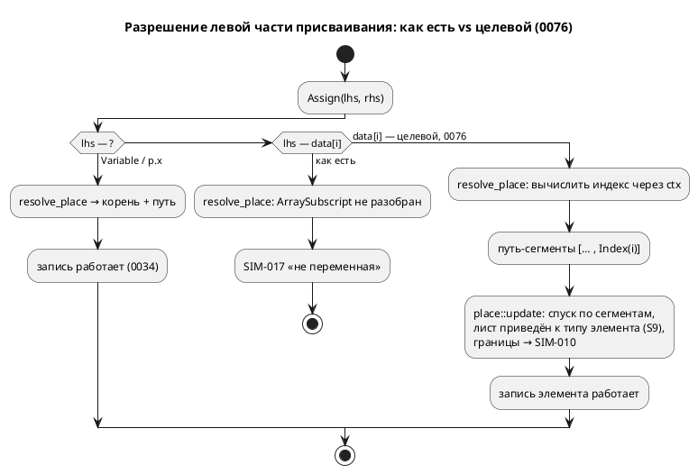

# Фича: Симулятор не исполняет массивы вовсе

- **Номер:** 0076
- **Статус:** ГОТОВО
- **Зависит от:** нет (продолжает 0034, 0025; смежна 0078 — не блокирует)
- **Приоритет / Tier:** Tier 2 (симулятор врёт про массивы: запись невозможна)
- **Крейт:** `simulation` (`eval/`, `unit/`)
- **Связанные issue (анализ):** новая фича (перевод кандидата из `FEATURES.md`)

## Стадии жизненного цикла (правило 17)

Все стадии — **разделы этой карточки** (правило 32): «Архитектура (ADR)»,
«Анализ», «Разработка», «Тест-план», «Отчёт о тестировании», «Итог».
Отдельным артефактом остаются только исправления —
[`docs/fixes/`](../fixes/README.md) (при необходимости `0076-YY-*`).

## Краткое описание

Дефект **не в генераторе C** (после [генератор C: отображение типов Array/Bit/Rational](0029-c-type-mapping.md) он даёт
корректный `uint8_t data[4]`), а в **симуляторе**:

1. `data[0] := 7;` → **`SIM-017`** «присваивание не в переменную пока не
   поддерживается симулятором» — записи в элемент массива **нет вовсе**;
2. `var data: [u8;4] := 0;` кладёт в переменную **скаляр** `Number(0)`, после чего
   чтение `data[0]` даёт **`SIM-010`** «переменная 'data' не является массивом» —
   то есть диагностика **обманчива**: массив объявлен, но стал скаляром.

Следствие: сверка симулятора с C по массивам (расширение критерия A8 [починка вычислителя выражений симулятора](0025-simulator-expression-eval.md)) **недостижима**, пока это не починено —
**блокирует** проверку T18 тест-плана 0029 (та признана неисполнимой). Ограничение
закреплено тестом `a9_bit_and_array_conformance_gap`
(`simulation/tests/conformance_c_tests.rs`), который **упадёт**, когда препятствие
исчезнет.

Смежно с фичей [семантика `[bit;N]` расходится втрое](0078-bit-array-semantics.md): п. 2 — прямое следствие того,
что скалярный инициализатор массива в языке **не определён**.

Выявлено при 0029-04, две пробы.

> Фича зарегистрирована **2026-07-17** переводом кандидата из `FEATURES.md`
> (решение заказчика: «завести фичи по кандидатам, пока без проработки»).
> **Проработка не проводилась:** ADR, анализ, зависимости, Tier и объём — за
> стадиями 2–3 (правило 17). Текст ниже — **перенос находки кандидата** вместе с
> подтверждающими её пробами; это описание проблемы, а **не** принятое решение.

## Архитектура (ADR)

- **Status:** Accepted
- **Date:** 2026-07-21
- **Authors:** Архитектор + Аналитик
- **Related issues:** [Фича](0076-sim-arrays.md); смежна [семантика `[bit;N]` расходится втрое](0078-bit-array-semantics.md) (семантика `[bit;N]`); продолжает [структурные типы в симуляторе](0034-sim-struct-types.md) (place/update структур), [починка вычислителя выражений симулятора](0025-simulator-expression-eval.md) (семантика вычислений).

### Context

Симулятор не исполняет массивы, хотя `Value::Array(Vec<Value>)` в ядре **уже
есть** и **чтение** элемента (`data[i]`) работает. Два пробела:

1. **Запись** `data[i] := 7;` → **`SIM-017`** «присваивание не в переменную …».
   `resolve_place` (`unit/statement.rs`) раскладывает левую часть в корень + путь
   **имён полей** (`Vec<String>`) и не разбирает `ArraySubscript`; `place::update`
   (`eval/place.rs`) ходит только по строковому пути полей — индекса не знает.
2. **Скалярный инициализатор** `var data: [u8;4] := 0;` кладёт в переменную
   **скаляр** `Number(0)` (в `coerce_initial` нет ветки `TypeNode::Array`), после
   чего чтение `data[0]` даёт **`SIM-010`** «переменная не является массивом» —
   диагностика обманчива (массив объявлен, но стал скаляром).

Следствие: сверка симулятора с C по массивам (T18 плана 0029) **недостижима**;
ограничение закреплено контролем `a9_bit_and_array_conformance_gap`
(`conformance_c_tests.rs`), который падёт, когда препятствие исчезнет.

**Эталон — генератор C** (после 0029 корректен): `[u8;4]` → `uint8_t data[4]`,
доступ/запись `data[i]`. Важно: `u8` разрешается в `TypeNode::Integer{bits:8}`
(**скаляр**), а не в `[bit;8]`, поэтому элемент `[u8;4]` — чистый скаляр, и к
двойственности `[bit;N]` (0078) отношения не имеет. **C сам отвергает
скалярный инициализатор массива** (`c_model.rs`: «скалярный инициализатор массива
не выразим в C», CC-017) — то есть п. 2 не имеет определённого эталона и является
вопросом семантики (0078), а не конформанса.



### Decision Drivers

1. **Паритет с C.** Наблюдаемое поведение симулятора обязано совпадать с
   порождённым C потактово  — иначе симулятор врёт про массивы.
2. **Единый механизм place.** Запись поля структуры (0034) и элемента массива —
   один рекурсивный спуск по «месту», а не два параллельных пути (риск расхождения).
3. **Не решать семантику языка в симуляторе.** Скалярный инициализатор массива и
   `[bit;N]` — вопросы языка (0078), у которых нет эталона (C отвергает scalar-init).
   Их сюда **не тянуть**.
4. **`deny(wildcard_enum_match_arm)` в `eval/`.** Новую ветку `Value::Array`/сегмент
   индекса компилятор заставит перечислить явно — механизм 0025/0034 работает.

### Considered Options

#### Option A. Обобщить «место» сегментами `{Field|Index}`; scalar-init → 0078

`PlaceSegment { Field(String), Index(usize) }`. `resolve_place` разбирает
`ArraySubscript` (вычисляя индекс через `ctx`), `place::update` ходит по сегментам,
лист приводится к **объявленному типу элемента** (тип протаскивается вниз).
`coerce_initial` получает ветку `TypeNode::Array` → `coerce_to_type_with`
(поэлементно + длина) для списочного `{…}`; скаляр-init остаётся как есть (0078).
Сверка `[u8;N]` с C; контроль снят.

**Pros:**
- Единый механизм place со структурами (0034); чтение уже готово.
- Строго в объёме «настоящих массивов»; 0078 не задета → **независимость**.
- Лист приводится к типу элемента (S9) — паритет усечения с C.

**Cons:**
- Меняет сигнатуру `place::update` (+ тип цели для приведения листа) — правка
  вызывающего и тестов.

#### Option B. Точечный разбор `data[i] :=` в `exec_expression`, без общего place

**Pros:** меньше правок сигнатур.

**Cons:**
- Второй путь записи мимо `place::update` — прямое нарушение драйвера 2 (расхождение
  со структурами); `data[i].field` пришлось бы городить отдельно.

#### Option C. Заодно определить скалярный инициализатор массива (реплика скаляра)

**Pros:** «чинит» и п. 2.

**Cons:**
- **Определяет семантику языка** без эталона (C scalar-init отвергает) — прямое
  нарушение драйвера 3 и вторжение в объём 0078.

### Decision

Принимается **Option A**. Единый механизм place, строго «настоящие массивы»
(`[T;N]`, элемент — скаляр/структура), scalar-init и `[bit;N]` оставлены 0078.

- **Запись:** `PlaceSegment{Field(String), Index(usize)}`; `resolve_place` →
  `Result<Option<&VarNode>, Diagnostic>` с сегментами (вычисляет индекс через ctx;
  не-целый индекс/выход за `usize` → `SIM-010`). `place::update(value, ty:
  Option<&TypeNode>, path: &[PlaceSegment], new, structs)` — спуск по сегментам,
  границы → `SIM-010` (новые `EvalError::IndexOfNonArray`/`ArrayIndexOutOfBounds`),
  лист приводится к типу элемента/поля. Структурный путь 0034 сохранён.
- **Инициализатор:** `coerce_initial` — ветка `TypeNode::Array` →
  `coerce_to_type_with(value, ty, structs).unwrap_or(value)` (список приводится
  поэлементно + длина; скаляр-init не приводится → остаётся как есть, 0078).
- **Сверка:** отдельный конформанс-тест `array_element_matches_generated_c`
  (наблюдение `data[i]` — поле-массив C печатается поэлементно, симулятор
  индексирует `Value::Array`); контроль `a9_bit_and_array_conformance_gap`
  перенастроен из «ожидания SIM-017» в положительную сверку.

**Обратная совместимость (правило 11):** корпус массивы не симулирует (примеров с
`[T;N]` в `examples/` нет), поэтому вывод генераторов и трассы существующих
примеров **байт-в-байт неизменны**. Изменение **аддитивно**: раньше запись
падала `SIM-017` — теперь работает.

**Язык не меняется:** семантика массивов задана эталоном C; симулятор к ней
приводится. Версия языка `0.3.0` без изменений. Крейт `simulation` — минорный бамп
`0.3.0 → 0.4.0` (поведение симулятора расширено).

### Consequences

#### Положительные

- Симулятор исполняет массивы (чтение + запись + список-init), сверен с C.
- Единый механизм place со структурами — расхождению неоткуда взяться.
- 0078 разблокирована для отдельного решения (`[bit;N]`, scalar-init) — но **не**
  заблокирована этой фичей.

#### Отрицательные / Action items

- Сигнатура `place::update` изменена — обновить вызывающего и тесты.
- Скалярный инициализатор массива и `[bit;N]` остаются нерешёнными (0078) —
  задокументировать границу в карточке/CLAUDE.md.
- `T18` плана 0029 снят с блокировки — расширить сверку на `[u8;N]` (сделано здесь).

#### Acceptance criteria

1. `data[i] := v` исполняется: чтение возвращает записанное; вне границ → `SIM-010`
   (не `SIM-017`); лист усечён по типу элемента (как поле структуры, T22 0034).
2. Список-инициализатор `{…}`/`[…]` даёт `Value::Array` с поэлементным приведением
   и проверкой длины.
3. Значения совпадают с порождённым C потактово (`array_element_matches_generated_c`).
4. Структуры (0034) не регрессируют: тесты `place`/`access`/conformance зелены.
5. Контроль `a9_bit_and_array_conformance_gap` перенастроен (не «ожидание SIM-017»).
6. Скаляр-init массива и `[bit;N]` **вне объёма** (0078) — явно.
7. `./scripts/precheck.sh` зелёный.

## Анализ

### Цель и контекст

Научить симулятор исполнять **настоящие массивы** (`[T;N]`, элемент — скаляр или
структура): запись в элемент (`data[i] := v`), список-инициализатор (`{…}`) и уже
работающее чтение (`data[i]`) — сверенные с эталоном (порождённый C). Прежде
запись давала `SIM-017`, а скалярно-инициализированный массив — `SIM-010` при
чтении. Решение — по [ADR](0076-sim-arrays.md#архитектура-adr) (Option A): единый
механизм «места» с записью полей структур (0034), строго в объёме `[T;N]`.
Скалярный инициализатор массива и `[bit;N]` — вне объёма (0078), у них нет эталона.

### Зависимости фичи (правило 17/19)

- **Зависит от:** формально `нет` (все нужные части уже в ядре). Продолжает
  [структурные типы в симуляторе](0034-sim-struct-types.md) (`eval/place`, `update`,
  `StructRegistry`) и [починка вычислителя выражений симулятора](0025-simulator-expression-eval.md)
  (`eval/`, `coerce_to_type_with`) — переиспользует их механизмы, но не ждёт от
  них новой работы. Смежна [семантика `[bit;N]` расходится втрое](0078-bit-array-semantics.md)
  (семантика `[bit;N]`, скаляр-init) — **не** блокирует и **не** блокируется ею.
- **Влияние на порядок разработки:** завершение снимает блокировку T18
  тест-плана [генератор C: отображение типов Array/Bit/Rational](0029-c-type-mapping.md) (сверка по `Array`).
  Разблокирует 0078 для отдельного решения (её вопросы сюда не втянуты).

### Требования и проверяемые условия

- **R1. Запись элемента.** `data[i] := v` исполняется: последующее чтение
  `data[i]` возвращает записанное; соседние элементы не тронуты (точечность).
- **R2. Единый механизм place.** Запись элемента массива и запись поля структуры
  (0034) идут одним рекурсивным спуском по пути **сегментов**
  (`PlaceSegment{Field|Index}`), а не двумя параллельными путями.
- **R3. Приведение листа.** Лист приводится к **объявленному** типу элемента
  (усечение S9, как поле структуры T22): `data[0] := 300` при `[u8;4]` → `44`.
- **R4. Границы и вид.** Индекс вне границ → `SIM-010`
  (`ArrayIndexOutOfBounds`); индекс у не-массива → `SIM-010` (`IndexOfNonArray`);
  не-целый/отрицательный индекс → `SIM-010`. Никакого `SIM-017` на `data[i] :=`.
- **R5. Список-инициализатор.** `var a: [u8;N] := {…}` даёт `Value::Array` с
  поэлементным приведением к типу элемента и проверкой длины (`coerce_array`).
- **R6. Скаляр-init вне объёма.** `[u8;4] := 0` **не** приводится (остаётся
  скаляром) — семантику определяет 0078, не эта фича. C сам его отвергает (CC-017).
- **R7. Паритет с C.** Значения `data[i]` совпадают с порождённым C потактово.
- **R8. Отсутствие регресса (правило 11).** Структуры (0034) не ломаются; корпус
  массивы не симулирует → вывод генераторов и трассы примеров байт-в-байт неизменны.

### Критерии приёмки и способ проверки

| # | Критерий | Способ проверки |
|---|---|---|
| A1 | R1 запись+чтение элемента, точечность | `eval_tests::array_element_write_and_read`; `place::update_array_element_is_pointwise` |
| A2 | R2 единый механизм place (сегменты) | `place::update` матчит `PlaceSegment`; структурный путь 0034 в тех же тестах |
| A3 | R3 приведение листа к типу элемента | `place::update_array_element_coerced_to_elem_type` (300→44); `arrays.lam` `big[0]` |
| A4 | R4 границы/вид → `SIM-010`, не `SIM-017` | `place::{update_array_out_of_bounds_is_error, update_index_on_non_array_is_error}` |
| A5 | R5 список-инициализатор приводится | `eval_tests::array_element_write_and_read` (`big`); `builder::coerce_initial` ветка `Array` |
| A6 | R7 сверка с C | `conformance_c_tests::array_element_matches_generated_c` |
| A7 | R8 структуры не регрессируют | `place`/`access`/`eval`/conformance зелены; `precheck.sh` (диффы 0/детерминизм) |
| A8 | R8 вывод корпуса неизменен | `precheck.sh` (двойной прогон + `diff -r`, сценарии примеров) |

### Особенности по обратной функциональности

- **`eval/place` (0034 структуры):** сигнатура `update` расширена (`ty` + путь
  сегментов). Структурный путь сохранён — тип поля берётся из реестра, `ty` для
  него не нужен; для элемента массива `ty` даёт тип элемента (у массива имён
  полей нет). Тесты перенастроены на новую сигнатуру (те же коды ошибок).
- **Генераторы C/rust/st/sv, LSP, форматтер:** не задеты — фича живёт целиком в
  `simulation`. Язык не меняется, версия языка `0.3.0` без изменений.

### Риски и зависимости

- **Расхождение двух путей записи** — снято драйвером 2 ADR: один механизм place.
- **Втягивание семантики 0078** (скаляр-init, `[bit;N]`) — снято границей R6:
  scalar-init не приводится, `[bit;N]` вне объёма.
- **Регресс структур** — снят сохранением реестрового пути и тестами.

## Разработка

### Задача

#### Что было

Симулятор не исполнял массивы, хотя `Value::Array` и **чтение** `data[i]` уже
работали. Два пробела: (1) `resolve_place` (`unit/statement.rs`) раскладывал
левую часть в путь **имён полей** (`Vec<String>`) и не разбирал `ArraySubscript`
→ `data[i] := v` давало `SIM-017`; (2) `coerce_initial` (`unit/builder.rs`) не
имел ветки `TypeNode::Array` → список-init клал скаляр, чтение `data[0]` давало
`SIM-010` (обманчиво: массив стал скаляром). Сверка с C была недостижима, контроль
`a9_bit_and_array_conformance_gap` (`conformance_c_tests.rs`) это фиксировал.

#### Что сделано

Реализация по [ADR](0076-sim-arrays.md#архитектура-adr), Option A — единый механизм
«места» с записью полей структур (0034):

- **`eval/place.rs`:** введён `PlaceSegment{Field(String), Index(usize)}`;
  `update` матчит сегмент — поле идёт в `update_field` (тип поля из реестра),
  индекс в `update_index` (тип элемента из протащенного `ty =
  TypeNode::Array(_, elem)`). Лист приводится `coerce_to_type_with` к типу
  поля/элемента (усечение S9). Новые ошибки `IndexOfNonArray` /
  `ArrayIndexOutOfBounds` — обе под кодом `SIM-010` (как ошибки **чтения**
  массива). Точечность сохранена (`data[0]:=7` не трогает соседей).
- **`eval/error.rs`:** два новых варианта `EvalError` + их тексты и код `SIM-010`.
- **`unit/statement.rs`:** `resolve_place` расширен — разбирает `ArraySubscript`,
  вычисляя индекс **тем же** `eval_expression`, что и чтение (одна переменная для
  `data[i]:=` и `data[i]`); не-целый/отрицательный индекс → `SIM-010`. Сигнатура
  стала `Result<Option<&VarNode>, Diagnostic>` (индекс может не вычислиться).
  Путь передаётся сегментами; тип корня (`ty`) прокидывается в `update_place_via`.
- **`context.rs`:** `update_place_via` принимает `ty: Option<&TypeNode>` и путь
  сегментов — мост к ядру.
- **`unit/builder.rs`:** `coerce_initial` — ветка `TypeNode::Array` →
  `coerce_to_type_with(...).unwrap_or(value)` (список приводится поэлементно + по
  длине; скаляр-init не приводится → остаётся как есть, 0078).

**Статус по функциональности (правило 11):**

| Функциональность | Статус |
|---|---|
| Симулятор (`eval/place`, `error`, `unit/statement`, `builder`, `context`) | ✅ реализовано |
| Структуры 0034 (та же сигнатура `update`) | ✅ путь сохранён, тесты перенастроены |
| Генераторы C/rust/st/sv, LSP, форматтер | н/п — язык не меняется, вывод байт-в-байт неизменен |
| Сверка с C (`conformance_c_tests`) | ✅ контроль заменён положительным тестом |

#### Проверки

```sh
cargo test -p simulation -- --test-threads=1        # eval + place + conformance зелены
./scripts/precheck.sh                                # итоговый гейт (fmt/clippy/детерминизм/сценарии)
```

- **R1/A1** — `eval_tests::array_element_write_and_read`, `place::update_array_element_is_pointwise`.
- **R3/A3** — `place::update_array_element_coerced_to_elem_type` (300→44), `arrays.lam` `big[0]`.
- **R4/A4** — `place::{update_array_out_of_bounds_is_error, update_index_on_non_array_is_error}` → `SIM-010`.
- **R5/A5** — список-init `big:[u8;2]:={300,5}` → `[44,5]`.
- **R7/A6** — `conformance_c_tests::array_element_matches_generated_c` (значения = C).
- **R8/A7,A8** — тесты (`place`/`access`) зелены; `precheck.sh` (детерминизм + сценарии примеров).
- **R6** — скаляр-init массива не приводится (остаётся скаляром) — вне объёма, 0078.

## Тест-план

### Область и цель

Проверяем исполнение массивов симулятором (R1…R8, критерии A1…A8 анализа):
запись элемента, точечность, приведение листа к типу элемента, границы и вид,
список-инициализатор, паритет с C, отсутствие регресса структур и корпуса.
Скалярный инициализатор массива и `[bit;N]` — вне объёма (0078), не проверяются.

### Проверки (условие → ожидаемый результат)

| # | Проверка | Предусловие | Ожидаемый результат | Ссылка на R/A |
|---|---|---|---|---|
| T1 | Запись `data[0]:=7`, `data[3]:=99`, чтение `data[0]`/`data[2]` | `arrays.lam`, 1 такт | `data=[7,2,3,99]`, `first=7`, `third=3`; не `Failed` | R1 / A1 |
| T2 | Точечность записи элемента | `arr[1,2,3]`, `[1]:=9` | `[1,9,3]`, соседи целы | R1 / A1 |
| T3 | Приведение листа к типу элемента | `[u8;2]`, `[0]:=300` | `44` (усечение S9) | R3 / A3 |
| T4 | Список-инициализатор с усечением | `big:[u8;2]:={300,5}` | `big=[44,5]` | R5, R3 / A5, A3 |
| T5 | Индекс вне границ | `arr[1,2]`, `[5]:=0` | `SIM-010`, не `SIM-017` | R4 / A4 |
| T6 | Индекс у не-массива | `Number(5)`, `[0]:=0` | `SIM-010` (`IndexOfNonArray`) | R4 / A4 |
| T7 | Паритет с порождённым C | `ArrConf`, `data[0]:=7`,`data[1]:=200` | `data[i]`/`counter` симулятора = C | R7 / A6 |
| T8 | Структуры 0034 не регрессируют | `place`/`access`/eval-фикстуры | коды `SIM-012/027`, точечность полей — зелены | R8 / A7 |
| T9 | Вывод корпуса неизменен | `precheck.sh` | двойной прогон `diff -r` пуст; сценарии примеров зелены | R8 / A8 |
| T10 | Скаляр-init массива вне объёма | `[u8;4]:=0` | остаётся скаляром (не приводится), 0078 | R6 / — |

### Разбивка проверок по функциональности

Единые условия и ожидаемые результаты прогоняются против каждой задеваемой обратной функциональности
(правило 11); фиксируется статус.

| Функциональность | Задета? | Проверки | Статус |
|---|---|---|---|
| Симулятор: запись place (`eval/place`, `unit/statement`) | да (ядро фичи) | T1–T6, T10 | ✅ |
| Симулятор: инициализатор (`unit/builder::coerce_initial`) | да | T4 | ✅ |
| Сверка с C (`conformance_c_tests`) | да | T7 | ✅ |
| Структуры 0034 (`eval/place`, `eval/access`) | да (сигнатура) | T8 | ✅ |
| Генераторы C/rust/st/sv, LSP, форматтер | нет (язык не меняется) | T9 (неизменность) | ✅ |

<!-- Легенда: ✅ пройдено · ❌ провалено · ⬜ не проверялось · — не применимо -->

### Тестовые данные и окружение

- **Фикстура:** `simulation/tests/data/eval/arrays.lam` (`data:[u8;4]`, `big:[u8;2]`,
  запись/чтение элементов). Модель C-сверки — inline-исходник в тесте.
- **Тесты:** `simulation/tests/eval_tests.rs::array_element_write_and_read`;
  `simulation/src/eval/place.rs` (`update_array_element_is_pointwise`,
  `update_array_out_of_bounds_is_error`, `update_index_on_non_array_is_error`,
  `update_array_element_coerced_to_elem_type`);
  `simulation/tests/conformance_c_tests.rs::array_element_matches_generated_c`.
- **Окружение:** `cargo test -p simulation -- --test-threads=1`; сверка с C
  требует `cc` (иначе тест печатает `[ПРОПУСК]`). Итог — `./scripts/precheck.sh`.

## Итог (что сделано)

Реализовано по [ADR](0076-sim-arrays.md#архитектура-adr) (Option A) — симулятор
исполняет **настоящие массивы** `[T;N]` единым механизмом «места» со структурами
(0034):

- **Запись элемента** `data[i] := v` исполняется (был `SIM-017`): `resolve_place`
  разбирает `ArraySubscript`, вычисляя индекс тем же вычислителем, что и чтение;
  путь стал сегментным (`PlaceSegment{Field|Index}`), `eval/place::update` спускается
  по сегментам, лист приводится к типу элемента (усечение S9, как поле структуры).
- **Список-инициализатор** `{…}` приводится поэлементно с проверкой длины
  (`coerce_initial` получил ветку `TypeNode::Array`).
- **Границы/вид** → `SIM-010` (новые `IndexOfNonArray`/`ArrayIndexOutOfBounds`),
  не-целый индекс → `SIM-010`; никакого `SIM-017` на `data[i] :=`.
- **Сверка с C** потактовая (`array_element_matches_generated_c`); прежний контроль
  `a9_bit_and_array_conformance_gap` заменён положительным тестом.

**Вне объёма (0078):** скалярный инициализатор массива (`[u8;4] := 0` не
приводится, остаётся скаляром — C сам его отвергает, CC-017) и двойственность
`[bit;N]`. Язык не менялся (версия `0.3.0`); крейт `simulation` `0.3.0 → 0.4.0`.
Корпус массивы не симулирует → вывод генераторов и трассы примеров байт-в-байт
неизменны. `./scripts/precheck.sh` зелёный.

Задача: [0076-sim-arrays.md#разработка](0076-sim-arrays.md#разработка) ·
тест-план: [0076-sim-arrays.md#тест-план](0076-sim-arrays.md#тест-план).
