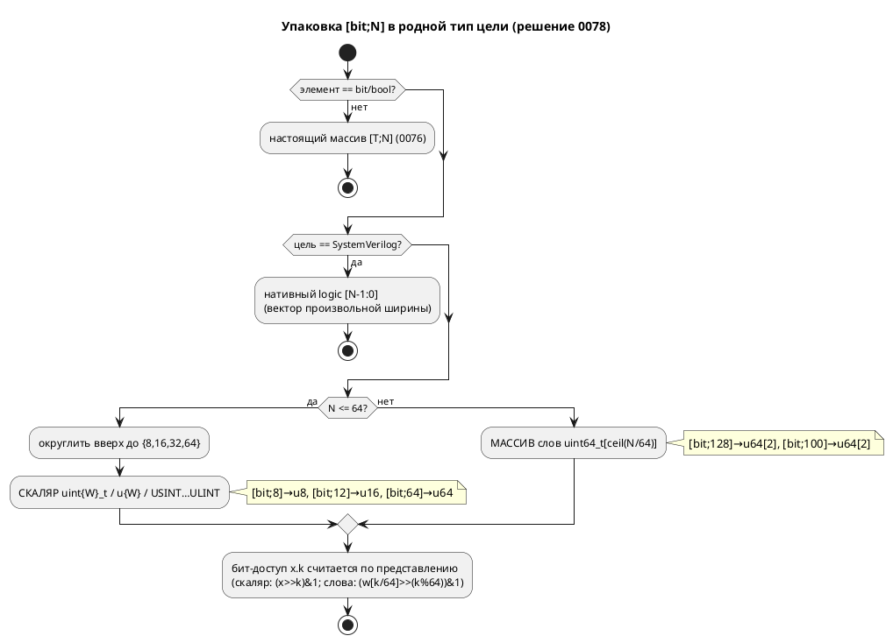

# Фича: Семантика `[bit;N]` расходится втрое

- **Номер:** 0078
- **Статус:** ГОТОВО
- **Зависит от:** нет (смежна 0076; образец слоя — 0060)
- **Приоритет / Tier:** Tier 2 (семантика типа расходилась впятеро — симулятор врал про синтез)
- **Крейт:** `grammar` (язык/семантика), `simulation`
- **Связанные issue (анализ):** новая фича (перевод кандидата из `FEATURES.md`)

## Стадии жизненного цикла

Все стадии — **разделы этой карточки**: «Архитектура (ADR)»,
«Анализ», «Разработка», «Тест-план», «Отчёт о тестировании», «Итог».
Отдельным артефактом остаются только исправления —
[`docs/fixes/`](../fixes/README.md) (при необходимости `0078-YY-*`).

## Краткое описание

Три ответа на один вопрос, противоречащие друг другу:

- **генератор C** трактует `[bit;8]` как **скаляр** `uint8_t`;
- **симулятор** (`coerce_array`) — как **массив из 8 значений**;
- **корпус** инициализирует его **скаляром** (`const MAX: Byte := 0xFF`), что
  `coerce_array` отверг бы.

Это вопрос **семантики языка**, и 0029 не вправе была его решать — поэтому её
критерий сверки на `[bit;N]` сознательно **не расширен**.

Смежно с фичей [симулятор не исполняет массивы вовсе](0076-sim-arrays.md).

Выявлено при [генератор C: отображение типов Array/Bit/Rational](0029-c-type-mapping.md).

> Фича зарегистрирована **2026-07-17** переводом кандидата из `FEATURES.md`
> (решение заказчика: «завести фичи по кандидатам, пока без проработки»).
> **Проработка не проводилась:** ADR, анализ, зависимости, Tier и объём — за
> стадиями 2–3. Текст ниже — **перенос находки кандидата** вместе с
> подтверждающими её пробами; это описание проблемы, а **не** принятое решение.

## Архитектура (ADR)

- **Status:** Accepted
- **Date:** 2026-07-22
- **Authors:** Архитектор + Заказчик
- **Related issues:** [Фича](0078-bit-array-semantics.md); смежна [симулятор не исполняет массивы вовсе](0076-sim-arrays.md) (настоящие массивы `[T;N]`), [генератор C: отображение типов Array/Bit/Rational](0029-c-type-mapping.md) (отображение типов C), [fixed-point Q(m.n) как тип языка](0061-fixed-point-type.md)/[расчёт ширины перечисления — вынести в общий слой](0060-enum-width-shared-layer.md) (образец «единый слой на все цели»).

### Context

На вопрос «что такое `[bit;8]`» проект давал **пять** несогласованных ответов
(разведка 0078):

| Потребитель | `[bit;8]` | Путь |
|---|---|---|
| C-генератор | **скаляр** `uint8_t` | `generator/c/mod.rs:216,314` (`bit_vector_type`) |
| Rust | **массив** `[bool; 8]` | `generator/rust/rust_type.rs:88` |
| ST | **массив** `ARRAY [0..7] OF BOOL` | `generator/st/st_type.rs:73` |
| SV | **массив** `logic name [0:7]` | `generator/sv/sv_type.rs:180` |
| Симулятор | **массив** `Value::Array` из 8 значений | `eval/mod.rs:146` (`coerce_array`) |

Плюс расхождение внутри системы типов: `[bit;N]` → `Array(N, Bit)`, а встроенный
`u8` → `Integer{8}` (скаляр); числовой литерал (`infer_int_type`) → `Array(N, Bit)`.
Бит-доступ `x.k` в симуляторе работает **только** на скаляре `Value::Number`
(`eval/access.rs:55` → `BitOfNonInteger` на `Array`). Референс-модель
`const MATRIX: u8 := {…}` (`lib.rs:1165`) сталкивает три трактовки в одной строке:
тип-скаляр, init-список, доступ-скаляр.

**Решение заказчика (эта фича) снимает неоднозначность:** `[T;N]` — массив из N
элементов T; **особый случай T ∈ {`bit`, `bool`}** — массив **упаковывается в
родные беззнаковые типы целевого языка**. C уже так делает; остальные приводятся
к нему.



### Decision Drivers

1. **Одна семантика вместо пяти.** `[bit;N]` обязан значить одно и то же во всех
   целях и симуляторе — иначе симулятор врёт про то, что синтезируется.
2. **Паритет с C-эталоном и идиомой корпуса.** Корпус пишет регистры как `u8`/
   `[bit;32]` — упакованные числа, а не N отдельных `bool`. C уже это отражает.
3. **Правило упаковки — в одном месте.** Округление вверх и разбиение на слова
   повторяются во всех целях; разъехавшись, дадут разный тип для одного текста
   (образец единого слоя — `enum_facts` 0060, `extract_type`).
4. **Аддитивность.** Корпус использует `u8` (уже скаляр) и одно
   `[bit;32]` (уже скаляр в C) — вывод цели C неизменен; меняется лишь rust/st/sv
   на `extend_complex` (там `[bit;32]` станет `u32` вместо `[bool;32]`) — это
   **исправление**, а не регресс.

### Considered Options

Развилку «скаляр vs массив» заказчик разрешил в пользу **упакованного скаляра**
(с расширением на слова для N > 64). Полное сравнение объёма — в переписке фичи;
здесь фиксируется принятое.

#### Option A. Упакованный бит-вектор в родных типах (принято)

`Array(N, Bit)` — канонический **упакованный N-битный вектор** (не N элементов).
Каждая цель отображает его через **единое правило упаковки**
(`semantic::bit_vector`):

- **N ≤ 64** → скаляр ширины `round_up(N) ∈ {8,16,32,64}` (`[bit;12]`→16,
  `[bit;3]`→8).
- **N > 64** → массив `uint64_t[⌈N/64⌉]` (`[bit;128]`→`u64[2]`, `[bit;100]`→`u64[2]`).
- **SV** — нативный `logic [N-1:0]` при **любом** N (вектор произвольной ширины;
  массив слов ему не нужен).
- Бит-доступ/запись `x.k` (и `x[k]` на бит-векторе) — по представлению: скаляр —
  сдвиг/маска; слова — выбор слова `k/64` и бит `k%64`; SV — нативный `x[k]`.

**Pros:** одна семантика; паритет с C и корпусом; `u8` ≡ `[bit;8]`; правило в
одном слое; вывод C неизменен.

**Cons:** N > 64 требует представления «массив слов» и в симуляторе (`Value::Number`
= i64 не вмещает > 64 бит) — новый код, хоть корпус его почти не трогает.

#### Option B. `[bit;N]` — настоящий массив из N бит (отвергнуто)

`[bit;N]` ≠ `uN`; доступ `x[k]`, список-init `{…}`.

**Cons:** строго больше работы (переписать C на массивы, бит-доступ по массиву в
симуляторе, миграция `[bit;32]`→`u32` в корпусе), две конфликтующие концепции,
имя `u8` двусмысленно. Противоречит C-эталону и идиоме регистров.

### Decision

Принимается **Option A**. `Array(N, Bit)` (и `Array(N, Bool)`) — **упакованный
бит-вектор**; литерал и встроенный `uN` дают эквивалентное упакованное
представление.

- **Единый слой** `grammar/src/semantic/bit_vector.rs`:
  - `pub fn is_bit_vector(ty: &TypeNode) -> Option<u16>` — `Some(N)` для
    `Array(N, Bit|Bool)`, иначе `None` (дискриминатор `elem`).
  - `pub enum BitVectorLayout { Scalar { width: u16 }, Words { count: u16 } }` и
    `pub fn layout(n: u16) -> BitVectorLayout`: `Scalar{round_up(n)}` при `n ≤ 64`
    (`round_up`: 8/16/32/64), иначе `Words{ ceil(n/64) }`.
  - `pub fn bit_slot(k: u32) -> (u16 word, u32 offset)` = `(k/64, k%64)` — для
    доступа к биту в представлении слов.
- **Цели** потребляют слой:
  - **C** (`c/mod.rs`): `bit_vector_type` → `uint{round_up(N)}_t` (N ≤ 64) либо
    `uint64_t name[⌈N/64⌉]` (N > 64, через `map_typed_variable`); `CC-014` снят для
    N > 64 (остаётся только для реально невыразимого — нет такого при слоях).
  - **Rust** (`rust_type.rs`): `u{round_up(N)}` либо `[u64; ⌈N/64⌉]`.
  - **ST** (`st_type.rs`): `USINT/UINT/UDINT/ULINT` (round_up) либо
    `ARRAY [0..count-1] OF ULINT`.
  - **SV** (`sv_type.rs`): нативный `logic [N-1:0]` (любой N).
- **Симулятор** (`eval/mod.rs`, `eval/access.rs`): `Array(N, Bit)` приводится к
  `Value::Number` (N ≤ 64, битовый паттерн в i64) либо `Value::Array` из
  `⌈N/64⌉` слов-`Number` (N > 64). Бит-доступ `x.k`/`x[k]` — по слою `bit_slot`.
- **Бит-доступ в кодогене** каждой цели для случая слов использует `bit_slot`
  (индекс слова + смещение). Для N ≤ 64 путь прежний (сдвиг/маска на скаляре).
- **Корпус:** референс `MATRIX: u8 := {…}` (`lib.rs`) приводится к скалярному
  инициализатору; `extend_complex` `[bit;32]` — уже упакован (C неизменен).

**Обратная совместимость:** цель **C байт-в-байт неизменна** (корпус
= `u8`/`[bit;32]`, оба уже скаляры). Меняется вывод **rust/st/sv** только на
`extend_complex` (`[bit;32]` → упакованный `u32`/`UDINT`/`logic[31:0]` вместо
массива `bool`) — это исправление к общей семантике, сверяется. Версия языка
**0.3.0 → 0.4.0** (семантика типа `[bit;N]` уточнена — свод). Крейты
`grammar`/`simulation` — минорный бамп.

### Consequences

#### Положительные

- `[bit;N]` значит одно во всех целях и симуляторе; `u8` ≡ `[bit;8]`.
- Правило упаковки — в одном слое (расхождению неоткуда взяться).
- N > 64 (`[bit;128]`) впервые выразим (был `CC-014`); сверяется.
- Референс-модель `SRC` (не компилировалась целью C) разблокируется.

#### Отрицательные / Action items

- Симулятор получает представление «массив слов» для N > 64 — новый код + сверка.
- Бит-доступ в каждой цели должен уметь путь «слова» — иначе `x.k` при N > 64
  молча неверен.
- Обновить тесты, фиксировавшие `Array(8,Bit)`-как-массив (rust/st/sv/sim).

#### Acceptance criteria

1. `[bit;N]` (N ≤ 64) во всех целях и симуляторе — упакованный скаляр `round_up(N)`;
   `[bit;8]` и `u8` дают идентичный вывод.
2. `[bit;N]` (N > 64) → `uint64_t[⌈N/64⌉]` (C/rust/st), нативный `logic[N-1:0]` (SV),
   `Value::Array` слов (симулятор); `CC-014` для N > 64 снят.
3. Бит-доступ/запись `x.k` и `x[k]` верны для скаляра и для слов — потактовая
   сверка симулятор↔C.
4. Правило упаковки — в `semantic::bit_vector`, единственный источник; цели его
   зовут.
5. Цель C — байт-в-байт неизменна на корпусе; rust/st/sv меняются только на
   `extend_complex` (сверх-семантически корректно, компилируется/синтезируется).
6. Референс `MATRIX := {…}` починен; `SRC` компилируется целью C.
7. Версия языка `0.4.0`; `./scripts/precheck.sh` зелёный.

## Анализ

### Цель и контекст

Свести пять несогласованных трактовок `[bit;8]` (C-скаляр / rust-`[bool;8]` /
st-`ARRAY OF BOOL` / sv-массив / симулятор-`Value::Array`) к **одной**: `[bit;N]`
— упакованный N-битный вектор в родных типах цели (решение заказчика, [ADR](0078-bit-array-semantics.md#архитектура-adr),
Option A). N ≤ 64 — скаляр `round_up(N)` ∈ {8,16,32,64}; N > 64 — массив
`uint64_t[⌈N/64⌉]`; SV — нативный `logic [N-1:0]`. Правило упаковки — в одном слое.

### Зависимости фичи

- **Зависит от:** `нет` (использует существующие механизмы). Смежна
  [симулятор не исполняет массивы вовсе](0076-sim-arrays.md) (настоящие массивы `[T;N]` — дискриминатор
  «элемент == bit» отделяет бит-вектор от них), продолжает
  [генератор C: отображение типов Array/Bit/Rational](0029-c-type-mapping.md). Образец единого слоя —
  [расчёт ширины перечисления — вынести в общий слой](0060-enum-width-shared-layer.md) (`enum_facts`).
- **Влияние на порядок:** ничего не блокирует; разблокирует референс-модель `SRC`
  (не компилировалась целью C, 0075) и снимает `CC-014` (выведен).

### Требования и проверяемые условия

- **R1. Единый слой.** Правило упаковки живёт в `semantic::bit_vector`
  (`is_bit_vector`, `layout`, `round_up`, `bit_slot`) — единственный источник.
- **R2. N ≤ 64 — скаляр.** `[bit;N]` во всех целях и симуляторе — упакованный
  скаляр ширины `round_up(N)`; `[bit;8]` и `u8` дают идентичный вывод.
- **R3. Округление вверх.** `[bit;12]`→16, `[bit;3]`→8 (C `uint16_t`/`uint8_t`,
  rust `u16`/`u8`, st `UINT`/`USINT`, sv `logic[11:0]`/`logic[2:0]`).
- **R4. N > 64 — слова.** `[bit;128]` → `uint64_t[2]` (C), `[u64;2]` (rust),
  `ARRAY [0..1] OF ULINT` (st), нативный `logic [127:0]` (sv), `Value::Array` из
  2 слов (симулятор). `CC-014` снят.
- **R5. Бит-доступ.** `x.k` верен на скаляре (сдвиг/маска) и на словах (слово
  `k/64`, бит `k%64`) — сверка симулятор↔C.
- **R6. Порт-число.** `[bit;N]` (N ≤ 64) — допустимый порт (rust `RS-016` его
  больше не отвергает — это число `u{width}`); N > 64 (слова) — `RS-016` (не HAL).
- **R7. C неизменен на корпусе; rust/st/sv меняются только на `extend_complex`.**
  `extend_complex` `[bit;32]` → упакованный `u32`/`UDINT`/`logic[31:0]` вместо
  массива `bool` — исправление, компилируется/валидно у `iec2c`.
- **R8. Аддитивность.** Корпус вне `extend_complex` использует `u8`/`u16` (уже
  скаляры) — вывод C байт-в-байт неизменен; детерминизм 0048 цел.

### Критерии приёмки и способ проверки

| # | Критерий | Способ проверки |
|---|---|---|
| A1 | R1 слой | `bit_vector.rs` юнит-тесты (round_up, layout, bit_slot, is_bit_vector) |
| A2 | R2/R3 скаляр+округление | C: `c/mod.rs` тесты (`[bit;12]`→`uint16_t`); проба lamc rust/st/sv |
| A3 | R4 слова | `c/mod.rs` `test_bit_vector_over_64_is_word_array`; проба (st/rust/sv) |
| A4 | R5 бит-доступ сверка | `conformance_c_bitvec_tests::bit_vector_scalar_matches_generated_c` |
| A5 | R6 порт-число | `rust_port` тесты (`bit_vector_port_is_packed_number`, RS-016 на словах) |
| A6 | R7 корпус компилируется | `precheck.sh` (ST-проверка `iec2c` на `extend_complex`, сборка примеров) |
| A7 | R8 C неизменен + детерминизм | `precheck.sh` (двойной прогон `diff -r`) |
| A8 | `CC-014` выведен | реестр 0077 помечает `RETIRED`; проверка `check-diagnostic-codes` зелёный |

### Особенности по обратной функциональности

- **C:** тип неизменен на корпусе (u8/[bit;32] уже скаляры); N>64 впервые выразим.
- **rust/st/sv:** тип бит-вектора меняется на `extend_complex`; порт rust — новый
  случай (RS-016 снят для скаляра).
- **Симулятор:** `[bit;N]` больше не `Value::Array` из N — скаляр (N≤64) / слова.
- **Реестр кодов (0077):** `CC-014` → `RETIRED` (проверка поймал рассинхрон — работает).

### Риски и зависимости

- **N > 64 в симуляторе** (`Value::Number` = i64 не вмещает) — представление
  «массив слов»; корпус его не трогает, покрыт юнит/проба. Снижение: слой + тест.
- **Смешение с настоящим массивом 0076** — снято дискриминатором `is_bit_vector`
  (элемент `Bit`/`Bool` vs скаляр).
- **Бит-запись в слова** — в симуляторе бит-запись (`Member::Number`) не
  поддержана вовсе (SIM-017, предсуществующее); объём не расширялся.

## Разработка

### Задача

#### Что было

`[bit;8]` трактовался пятью потребителями по-разному: C — скаляр `uint8_t`; rust —
`[bool;8]`; st — `ARRAY OF BOOL`; sv — распакованный массив; симулятор —
`Value::Array` из 8 значений. `[bit;N]` при N ∉ {8,16,32,64} → `CC-014` (невыразим).
Бит-доступ `x.k` в симуляторе работал только на скаляре. Референс `MATRIX: u8 :=
{…}` сталкивал три трактовки в одной строке.

#### Что сделано

Реализация по [ADR](0078-bit-array-semantics.md#архитектура-adr) (Option A) — `[bit;N]`
= упакованный N-битный вектор, правило упаковки в одном слое:

- **`grammar/src/semantic/bit_vector.rs`** (новый слой): `is_bit_vector(ty)` →
  `Some(N)` для `Array(N, Bit|Bool)`, N ≥ 1; `layout(n)` → `Scalar{round_up(n)}`
  (n ≤ 64) / `Words{⌈n/64⌉}` (n > 64); `round_up` (8/16/32/64); `bit_slot(k)` =
  `(k/64, k%64)`.
- **Цель C** (`c/mod.rs`): `bit_vector_type` → `uint{round_up}_t` (скаляр);
  `map_typed_variable` → `uint64_t name[⌈N/64⌉]` (слова). Вариант ошибки
  `CTypeError::BitVectorWidth` и код **`CC-014` удалены** (все N выразимы).
- **Rust** (`rust_type.rs`): `u{round_up}` / `[u64; count]`. **Порт** (`rust_port.rs`):
  скалярный бит-вектор нормализуется к `Integer` → порт-число (`RS-016` снят);
  слова остаются `Array` → `RS-016`.
- **ST** (`st_type.rs`): `USINT/UINT/UDINT/ULINT` / `ARRAY [0..count-1] OF ULINT`.
- **SV** (`sv_type.rs`): нативный `logic [N-1:0]` при любом N (слова не нужны).
- **Симулятор** (`eval/mod.rs`): `coerce_bit_vector` → `Value::Number` (N ≤ 64,
  как `coerce_integer`) / `Value::Array` слов (N > 64). Бит-чтение по словам —
  `eval/access.rs::read_bit_words`.
- **Реестр кодов (0077):** `CC-014` помечен `RETIRED` — проверка `check-diagnostic-codes`
  поймал рассинхрон (демонстрация работы 0077).
- **Референс** (`lib.rs::SRC`): `MATRIX: u8 := {…}` → `:= 0xA5` (скаляр-init).

**Статус по функциональности:**

| Функциональность | Статус |
|---|---|
| Слой `bit_vector` | ✅ создан + юнит-тесты |
| C / Rust / ST / SV | ✅ упаковка (скаляр + слова/нативный SV) |
| Симулятор | ✅ coerce + бит-чтение по словам |
| Rust-порт | ✅ бит-вектор-скаляр = порт-число |
| Реестр кодов | ✅ CC-014 RETIRED |

#### Проверки

```sh
cargo test -p grammar -p simulation -- --test-threads=1   # юнит + сверка бит-вектора
./scripts/precheck.sh                                      # итог (включая ST iec2c, детерминизм, коды)
```

- **A1** — `bit_vector.rs` тесты; **A2/A3** — `c/mod.rs` + пробы lamc rust/st/sv;
- **A4** — `conformance_c_bitvec_tests` (значение + биты сверены с C);
- **A5** — `rust_port` тесты; **A6/A7** — `precheck.sh` (extend_complex iec2c,
  детерминизм); **A8** — проверка кодов зелёный после RETIRED.

## Тест-план

### Область и цель

Проверяем упаковку `[bit;N]` во всех целях и симуляторе: единый слой, скаляр с
округлением вверх (N ≤ 64), массив слов (N > 64), нативный SV-вектор, бит-доступ,
порт-число, паритет с C, аддитивность. `[bool;N]` пакуется как `[bit;N]`.

### Проверки (условие → ожидаемый результат)

| # | Проверка | Предусловие | Ожидаемый результат | R/A |
|---|---|---|---|---|
| T1 | Слой упаковки | — | `round_up(12)=16`, `layout(128)=Words{2}`, `bit_slot(70)=(1,6)` | R1/A1 |
| T2 | C скаляр + округление | `[bit;8]`,`[bit;12]` | `uint8_t`, `uint16_t` | R2,R3/A2 |
| T3 | C слова | `[bit;128]`,`[bit;100]` | `uint64_t x[2]` | R4/A3 |
| T4 | rust/st/sv скаляр | `[bit;12]` | `u16` / `UINT` / `logic [11:0]` | R2,R3/A2 |
| T5 | rust/st слова, sv нативный | `[bit;128]` | `[u64;2]` / `ARRAY [0..1] OF ULINT` / `logic [127:0]` | R4/A3 |
| T6 | Бит-доступ сверка с C | `[bit;12] := 4095`, `v.3/v.10/v.11` | симулятор = C (`v`, биты) | R5/A4 |
| T7 | Порт-число (rust) | порт `[bit;12]` | `u16`, не `RS-016` | R6/A5 |
| T8 | Порт-слова → RS-016 | порт `[bit;128]` | `RS-016` (не HAL-число) | R6/A5 |
| T9 | `extend_complex` компилируется | `[bit;32]` поля | ST `iec2c` валиден, сборка ок | R7/A6 |
| T10 | C неизменен + детерминизм | — | `precheck.sh` двойной прогон `diff -r` пуст | R8/A7 |
| T11 | `CC-014` выведен | — | реестр `RETIRED`, проверка кодов зелёный | —/A8 |
| T12 | `[bit;8]` ≡ `u8` | — | идентичный вывод во всех целях | R2/A2 |

### Разбивка проверок по функциональности

| Функциональность | Задета? | Проверки | Статус |
|---|---|---|---|
| Слой `semantic::bit_vector` | да (ядро) | T1 | ✅ |
| Цель C | да | T2, T3, T6, T10, T12 | ✅ |
| Цель Rust | да | T4, T5, T7, T8, T12 | ✅ |
| Цель ST | да | T4, T5, T9, T12 | ✅ |
| Цель SV | да | T4, T5, T12 | ✅ |
| Симулятор | да | T6 | ✅ |
| Реестр кодов (0077) | да | T11 | ✅ |

<!-- Легенда: ✅ пройдено · ❌ провалено · ⬜ не проверялось · — не применимо -->

### Тестовые данные и окружение

- **Юнит:** `grammar/src/semantic/bit_vector.rs` (слой); `c/mod.rs`
  (`test_bit_vector_stays_integer_type`, `test_bit_vector_over_64_is_word_array`);
  `rust_type`/`rust_port`/`st_type`/`sv_type` тесты.
- **Сверка:** `simulation/tests/conformance_c_bitvec_tests.rs`.
- **Пробы lamc:** `-t c/rust/st/sv` на модели с `[bit;12]`/`[bit;128]`.
- **Команды:** `./scripts/precheck.sh` (итог: сборка/clippy/размер/коды/тесты/
  детерминизм/ST-`iec2c`/сборка примеров).

## Итог (что сделано)

Реализовано по [ADR](0078-bit-array-semantics.md#архитектура-adr) (Option A, решение
заказчика). `[bit;N]` — **упакованный N-битный вектор** в родных типах цели; пять
расходившихся трактовок сведены к одной:

- **N ≤ 64** — упакованный **скаляр** ширины `round_up(N)` ∈ {8,16,32,64}
  (`[bit;12]`→16): C `uint16_t`, rust `u16`, st `UINT`, sv `logic [11:0]`,
  симулятор `Value::Number`. Так `[bit;8]` **≡** `u8`.
- **N > 64** — массив слов `uint64_t[⌈N/64⌉]` (C/rust `[u64;n]`/st
  `ARRAY OF ULINT`), нативный `logic [N-1:0]` в SV, `Value::Array` слов в
  симуляторе. `[bit;128]` впервые выразим (был `CC-014`).
- **Бит-доступ** `x.k` — по представлению (скаляр: сдвиг/маска; слова: слово
  `k/64`, бит `k%64`), сверен с C.

**Единый слой** `semantic::bit_vector` (`is_bit_vector`/`layout`/`round_up`/
`bit_slot`) — единственный источник правила; цели и симулятор его зовут (образец
`enum_facts` 0060). **Порт-число** rust: скалярный бит-вектор больше не даёт
`RS-016` (это `u{width}`); слова — по-прежнему `RS-016`.

**Побочный эффект по 0077:** `CC-014` (ширина бит-вектора) **выведен** — проверка
`check-diagnostic-codes` поймал рассинхрон и потребовал пометки `RETIRED`
(демонстрация работы реестра).

**Аддитивность:** цель **C байт-в-байт неизменна** на корпусе (u8/
[bit;32] уже скаляры); rust/st/sv меняются только на `extend_complex` (`[bit;32]`
→ упакованный `u32`/`UDINT`/`logic[31:0]` — исправление, `iec2c` валиден).
Детерминизм 0048 цел. Версия языка **0.3.0 → 0.4.0** (семантика `[bit;N]`
уточнена); крейты `grammar` `0.8.0 → 0.9.0`, `simulation`
`0.4.0 → 0.5.0`. `./scripts/precheck.sh` зелёный.

Задача: [0078-bit-array-semantics.md#разработка](0078-bit-array-semantics.md#разработка) ·
тест-план: [0078-bit-array-semantics.md#тест-план](0078-bit-array-semantics.md#тест-план).
