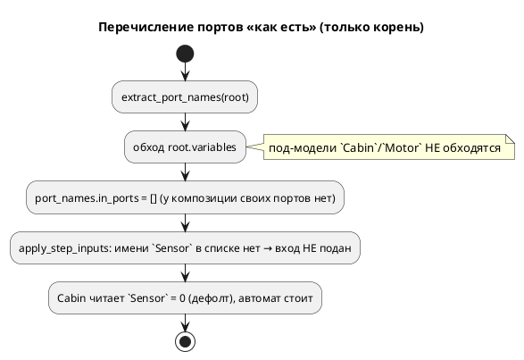
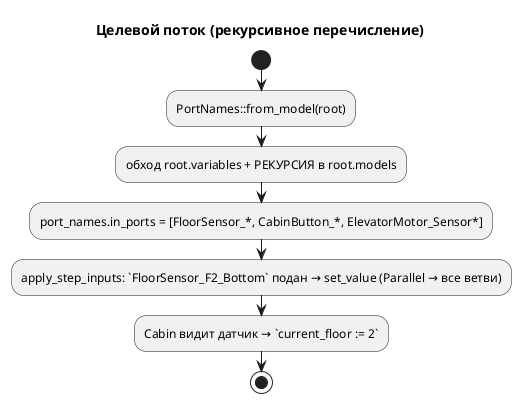

# Фича: `elevator_mini.lam` не исполняется: порты под-модели композиции

- **Номер:** 0079
- **Статус:** ГОТОВО (2026-07-20)
- **Зависит от:** — (независима; смежна с 0084, но её не требует)
- **Приоритет / Tier:** Tier 2 (реактивная композиция не драйвилась)
- **Крейт:** `simulation` (перечисление портов) + `scripts/run_simulations.sh`
- **Связанные issue (анализ):** новая фича (перевод кандидата из `FEATURES.md`)

## Стадии жизненного цикла

Все стадии — **разделы этой карточки**: «Архитектура (ADR)»,
«Анализ», «Разработка», «Тест-план», «Отчёт о тестировании», «Итог».
Отдельным артефактом остаются только исправления —
[`docs/fixes/`](../fixes/README.md) (при необходимости `0079-YY-*`).

## Краткое описание

`SIM-009: переменная 'FloorSensor_F1_Bottom' не найдена`, хотя порт **объявлен**
(строка 239, та же модель `Cabin`); семантика файл **принимает**, `lamc` его
**компилирует**.

Порты под-модели композиции `Cabin | Motor` не попадают в среду вычисления — класс
из предупреждения `CLAUDE.md` про «оба пути разрешения переменных» (верхнеуровневый
и вложенный доступ к модели).

**Дефект симулятора, не примера.**

Выявлено при [исправление примера comprehensive.lam (недостижимый сценарий)](0030-comprehensive-example-fix.md).

> Фича зарегистрирована **2026-07-17** переводом кандидата из `FEATURES.md`
> (решение заказчика: «завести фичи по кандидатам, пока без проработки»).
> **Проработка не проводилась:** ADR, анализ, зависимости, Tier и объём — за
> стадиями 2–3. Текст ниже — **перенос находки кандидата** вместе с
> подтверждающими её пробами; это описание проблемы, а **не** принятое решение.

## Архитектура (ADR)

- **Status:** Accepted
- **Date:** 2026-07-20
- **Authors:** Архитектор + Аналитик
- **Related issues:** [Фича](0079-sim-composition-ports.md); выявлено при [исправление примера comprehensive.lam (недостижимый сценарий)](0030-comprehensive-example-fix.md#архитектура-adr); симптом `SIM-009` замаскирован [`var q: u8;` без инициализатора → `SIM-009`](0086-sim-var-without-initializer.md#архитектура-adr).

### Context

`elevator_mini.lam` (`start Main = Cabin | Motor`) объявляет порты **внутри
под-моделей** (`Cabin`: `FloorSensor_*`, `CabinButton_*`; `Motor`:
`ElevatorMotor_*`). Симулятор их **не драйвил**: поданный из sim-файла вход не
доходил до под-модели, модель «не реагировала на датчики».

Диагностика (пробы):

- **Чтение** порта под-модели работает: `Unit::get_value` на `Parallel` обходит
  **все** ветви (`units.iter().find_map(...)`), находит `Sensor` у `Cabin`.
- **Драйв** не доходит: `apply_step_inputs` подаёт вход по имени из
  `port_names.in_ports`, а `extract_port_names` собирал порты **только с корневой
  модели** — под-модели композиции не перечислялись. Имени в списке нет → вход не
  подаётся.
- Историческое `SIM-009` («порт не найден») замаскировано **0086**: порт без
  значения теперь читается нулём, а не падает. Симптом исчез, но порт остался
  «немым» — подать вход было нечем.



### Decision Drivers

1. **Композиция драйвится**: вход, поданный на порт под-модели, доходит до неё.
2. **Не сломать существующие sim-файлы** (`stacker_*.json`): порядок портов
   индексируется позиционно.
3. **Тестируемость**: регрессия проверяется `cargo test`, не только ручным прогоном.

### Decision

`extract_port_names` собирает порты **рекурсивно**, включая под-модели композиции
(`ModelNode::models`). Логика вынесена в библиотеку как `PortNames::from_model`
(было в `bin/simulation.rs` — не тестируемо). Одноимённые порты разных под-моделей
дедуплицируются (плоское пространство имён; ср. 0084 для карты адресов).

Драйв/чтение уже корректны: `set_value`/`get_value` на `Parallel` адресуют все
ветви — правки не требуют. Достаточно **перечислить** порт, и он становится
драйвим.



**`stacker` не задет:** его порты объявлены на **корне** (под-модели
`CommandReceiver`/`MovementController`/`LiftController` своих портов не имеют),
поэтому рекурсия его перечисление не меняет — позиционные индексы sim-файлов
целы.

Побочно исправлен **`scripts/run_simulations.sh`**: сопоставление sim-файла с
моделью брало префикс до **первого** `_` (`${base%%_*}`), ломаясь на именах с
подчёркиванием (`elevator_mini_floor2` → `elevator` вместо `elevator_mini`).
Теперь берётся **самый длинный** префикс с существующим `.lam`.

### Consequences

#### Положительные

- Композиции с портами под-моделей драйвятся; `elevator_mini` реагирует на
  датчики (`elevator_mini_floor2.json`: `FloorSensor_F2_Bottom` → `current_floor
  = 2`).
- Порты под-моделей отображаются в трассе.
- `PortNames::from_model` тестируема и переиспользуема.

#### Отрицательные / Action items

- `elevator_mini` — **реактивный** автомат: без входов стоит в `Idle` и не
  завершается. В `examples_scenario_tests` остаётся **исключением** (как
  `stacker`), причина переписана с «временно: SIM-009» на «реактивный, сценарии
  извне».
- Плоское пространство имён портов (одноимённые в разных под-моделях делят
  значение) — задокументировано; строгая квалификация — 0084.

#### Acceptance criteria

1. Порт под-модели композиции перечисляется (`PortNames::from_model`).
2. Поданный вход доходит: `elevator_mini_floor2.json` → `current_floor = 2`
   (guard-проверка, `run_simulations.sh`).
3. `stacker_*.json` проходят без изменений (порядок портов цел).
4. `precheck.sh` зелёный; вывод корпуса неизменен.
5. Версия языка не меняется (дефект симулятора/инструмента).

## Анализ

- **Фича:** [`elevator_mini.lam` не исполняется: порты под-модели композиции](0079-sim-composition-ports.md)
- **ADR:** [`elevator_mini.lam` не исполняется: порты под-модели композиции](0079-sim-composition-ports.md#архитектура-adr)
- **Дата:** 2026-07-20
- **Роль:** Аналитик

### Зависит от

Пусто. Смежна с [ключ карты адресов — голое имя порта](0084-address-map-qualified-key.md) (плоское
пространство имён портов), но её не требует.

### Tier

**Tier 2.** Реактивная композиция (`elevator_mini`) не драйвилась — порт под-модели
не подавался. Не Tier 1: чтение работало (умолчание 0), автомат не падал.

### Воспроизведение (пробы)

| Конфигурация | Драйв входа `Sensor=1` |
|---|---|
| порт на **корне** (`nested.lam`) | доходит → реакция |
| композиция `= Cabin` / `Cabin | Motor` | **не доходит** → автомат стоит |

- `elevator_mini` без входов: 15 шагов без `SIM-009` (0086 замаскировал симптом).
- дисплей не показывал ни одного `in:`/`out:` порта у `elevator_mini` — признак
  того, что `extract_port_names` не нашла портов (все в под-моделях).

### Диагноз

- **Чтение** порта под-модели работает: `Unit::get_value` на `Parallel` обходит
  все ветви.
- **Перечисление** портов (`extract_port_names`, `bin/simulation.rs`) собирало
  только `model.variables` **корня** — под-модели композиции (`model.models`) не
  обходились. Драйв идёт по имени из этого списка → имени нет → вход не подан.
- **`SIM-009`** («не найден») исторически был симптомом; **0086** его замаскировал
  (порт без значения → 0). Первопричина — не «не найден», а «не перечислен для
  драйва».

### Границы правки

- `extract_port_names` → рекурсия по `model.models`; логика вынесена в
  `PortNames::from_model` (библиотека, тестируемость). Дедуп одноимённых.
- `set_value`/`get_value` — **не трогаются** (уже корректны для `Parallel`).
- `scripts/run_simulations.sh` — сопоставление модели по **самому длинному**
  префиксу с `.lam` (было: до первого `_`).
- `examples_scenario_tests` — причина исключения `elevator_mini` переписана.

### Обратная совместимость

Полная. `stacker` (порты на корне) рекурсией не задет → его sim-файлы работают
без изменений (проверено). Вывод корпуса генераторов не затрагивается (правка —
в симуляторе/инструменте). Версия языка не меняется.

### Риски

1. **Сдвиг позиционных индексов sim-файлов** — снят: единственный пример с
   sim-файлами (`stacker`) держит порты на корне; его список не меняется.
2. **Коллизии имён** одноимённых портов под-моделей — дедуп; строгая квалификация
   — 0084.

### План проверки

См. [тест-план 0079](0079-sim-composition-ports.md#тест-план): перечисление портов
под-моделей; читаемость; driven-сценарий `elevator_mini_floor2`; регресс
`stacker`.

## Разработка

### Задача

- **Фича:** [`elevator_mini.lam` не исполняется: порты под-модели композиции](0079-sim-composition-ports.md)
- **ADR:** [`elevator_mini.lam` не исполняется: порты под-модели композиции](0079-sim-composition-ports.md#архитектура-adr)
- **Дата:** 2026-07-20

#### Что сделано

##### Рекурсивное перечисление (`simulation/src/runner.rs`, `bin/simulation.rs`)

`PortNames::from_model(model)` (новый метод в библиотеке) собирает порты и
переменные модели **и всех её под-моделей** (`model.models`) рекурсивно, с
сортировкой и дедупом имён. `extract_port_names` в `bin/simulation.rs` сведён к
вызову `PortNames::from_model` (было — сбор только с корня, inline). Вынос в
библиотеку — ради тестируемости.

Драйв и чтение (`Unit::set_value`/`get_value`) **не трогались**: на `Parallel`
они уже адресуют все ветви композиции. Достаточно перечислить порт — и он
драйвится.

##### Инструмент (`scripts/run_simulations.sh`)

Сопоставление sim-файла с моделью: было `model="${base%%_*}"` (префикс до
первого `_`), ломалось на именах с подчёркиванием. Теперь — цикл, отсекающий
суффикс справа до первого существующего `${candidate}.lam`, то есть **самый
длинный** префикс-модель. `elevator_mini_floor2` → `elevator_mini` (а не
`elevator`).

##### Сценарий и исключение

- `examples/simulations/elevator_mini_floor2.json` — driven-сценарий:
  `FloorSensor_F2_Bottom=1` → guard `current_floor = 2`.
- `examples_scenario_tests`: причина исключения `elevator_mini` переписана с
  «временно: SIM-009» на «реактивный, сценарии извне; дефект исправлен».

#### Проверка

- `composition_ports_tests.rs`: порты под-моделей перечисляются; порт под-модели
  читается (0 по умолчанию, не `SIM-009`).
- `run_simulations.sh`: `elevator_mini_floor2` проходит (guard `current_floor=2`);
  `stacker_*` без изменений (6/6).
- `precheck.sh` EXIT=0; вывод корпуса генераторов неизменен.

#### Замечания

- Одноимённые порты под-моделей делят значение (плоское пространство имён) —
  дедуп; строгая квалификация — 0084.
- `run_simulations.sh` не входит в `precheck.sh` (тот гоняет C-`stacker`), поэтому
  проверкой регрессии служит `composition_ports_tests.rs`.

## Тест-план

- **Фича:** [`elevator_mini.lam` не исполняется: порты под-модели композиции](0079-sim-composition-ports.md)
- **ADR:** [`elevator_mini.lam` не исполняется: порты под-модели композиции](0079-sim-composition-ports.md#архитектура-adr)
- **Дата:** 2026-07-20
- **Роль:** Тестировщик

### Стратегия

Дефект симулятора/инструмента (не языка). Регрессия проверяется `cargo test`
(`composition_ports_tests.rs`); сквозная реакция — driven-сценарием через
`run_simulations.sh`.

### Условия проверок и ожидаемые результаты

| № | Проверка | Ожидание | Где |
|---|---|---|---|
| T1 | `PortNames::from_model` перечисляет in/out-порты под-моделей `Cabin`/`Motor` | `Sensor`,`Limit`,`Alarm` в списках | `composition_ports_tests::composition_submodel_ports_are_enumerated` |
| T2 | Порт под-модели читается (0 по умолчанию, не `SIM-009`) | `Some(Number(0))` | `composition_ports_tests::submodel_port_is_readable_in_composition` |
| T3 | Driven-вход доходит: `FloorSensor_F2_Bottom` → `current_floor=2` | guard OK | `elevator_mini_floor2.json` + `run_simulations.sh` |
| T4 | `stacker_*.json` не сломаны (порядок портов цел) | все OK | `run_simulations.sh` (6/6) |
| T5 | Матчинг модели по длинному префиксу | `elevator_mini_floor2`→`elevator_mini` | `run_simulations.sh` |
| T6 | Вывод корпуса генераторов неизменен | нет диффа | проверка детерминизма |
| T7 | Весь `precheck.sh` | зелёный | `./scripts/precheck.sh` |

### Примеры

Driven-сценарий `elevator_mini_floor2.json` (реакция на порт под-модели):

```json
[ { "in_ports": [ …, FloorSensor_F2_Bottom=1, … ], "guard": {"vars": {"current_floor": 2}} } ]
```

### Границы

- `elevator_mini` **реактивен** — самозавершающегося контракта не имеет; остаётся
  исключением в `examples_scenario_tests` (сценарии извне, как `stacker`).
- `run_simulations.sh` **не** в `precheck.sh` (тот гоняет C-`stacker`), поэтому
  сквозной драйв проверяется вручную/CI, а регрессия перечисления — `cargo test`.
- Плоское пространство имён портов — вне объёма (0084).

## Отчёт о тестировании

- **Фича:** [`elevator_mini.lam` не исполняется: порты под-модели композиции](0079-sim-composition-ports.md)
- **ADR:** [`elevator_mini.lam` не исполняется: порты под-модели композиции](0079-sim-composition-ports.md#архитектура-adr)
- **Тест-план:** [`elevator_mini.lam` не исполняется: порты под-модели композиции](0079-sim-composition-ports.md#тест-план)
- **Дата:** 2026-07-20
- **Вердикт:** ✅ **ГОТОВО**

### Окружение

- macOS (darwin 25.5); `grammar` 0.7.0 / `simulation` 0.4.0.
- `./scripts/precheck.sh` — **EXIT=0**; `cargo test`: **2152 passed, 6 ignored**.
- `./scripts/run_simulations.sh` — **6 прошло, 0 упало**.

### Сводка

Порты, объявленные **внутри под-моделей** композиции (`Cabin | Motor`), не
драйвились: `extract_port_names` собирал их только с корня. Исправлено рекурсией
(`PortNames::from_model`); драйв/чтение (`Parallel`) уже были корректны.
Побочно починен матчинг модели в `run_simulations.sh` (имена с `_`).

### Сверка с тест-планом

| № | Проверка | Результат |
|---|---|---|
| T1 | Порты под-моделей перечисляются | ✅ `composition_submodel_ports_are_enumerated` |
| T2 | Порт под-модели читается (не `SIM-009`) | ✅ `submodel_port_is_readable_in_composition` |
| T3 | Driven-вход доходит (`current_floor=2`) | ✅ `elevator_mini_floor2.json` guard OK |
| T4 | `stacker_*` не сломаны | ✅ 6/6 |
| T5 | Матчинг по длинному префиксу | ✅ `elevator_mini_floor2`→`elevator_mini` |
| T6 | Вывод корпуса неизменен | ✅ `git status` пуст |
| T7 | Весь `precheck.sh` | ✅ EXIT=0 |

### Ключевые находки

- **Симптом ≠ первопричина:** `SIM-009` («порт не найден») замаскирован **0086**
  (порт без значения → 0). Реальный дефект — порт **не перечислен для драйва**, а
  не «не найден вычислителю» (как гласила карточка).
- **Чтение уже работало** (`get_value` на `Parallel` обходит ветви) — правки
  требовало только перечисление.
- **`stacker` не задет** (порты на корне) — позиционные индексы sim-файлов целы.
- **Инструментальный дефект найден попутно:** `run_simulations.sh` брал модель до
  первого `_` — ломался на `elevator_mini`; починен на длинный префикс.

### Найденные дефекты

Нет исправлений (`docs/fixes/`). Плоское пространство имён портов — вне объёма (0084).

## Итог (что сделано)

**Tier 2, закрыта 2026-07-20** (`precheck.sh` EXIT=0, 2152 теста;
`run_simulations.sh` 6/6). Порты, объявленные **внутри под-моделей** композиции
(`Cabin | Motor` в `elevator_mini`), теперь драйвятся и отображаются.

**Диагноз (симптом ≠ первопричина):** карточка называла `SIM-009` («порт не
найден вычислителю»). Пробой установлено: **чтение** порта под-модели уже работало
(`Unit::get_value` на `Parallel` обходит все ветви), а `SIM-009` замаскирован
фичей **0086** (порт без значения → 0). Реальный дефект — порт **не перечислялся
для драйва**: `extract_port_names` собирал порты только с **корня**, поэтому вход
из sim-файла не подавался, модель «не реагировала на датчики».

**Что сделано:**
- `PortNames::from_model` (новый метод в `runner.rs`) собирает порты/переменные
  **рекурсивно** по `model.models`; `extract_port_names` сведён к его вызову
  (вынос в библиотеку — ради тестируемости). Дедуп одноимённых.
- `set_value`/`get_value` **не трогались** (уже корректны для `Parallel`).
- `scripts/run_simulations.sh`: матчинг модели по **самому длинному** префиксу с
  `.lam` (было — до первого `_`, ломалось на `elevator_mini_floor2` → `elevator`).
- Driven-сценарий `examples/simulations/elevator_mini_floor2.json`
  (`FloorSensor_F2_Bottom` → `current_floor = 2`); причина исключения
  `elevator_mini` в `examples_scenario_tests` переписана (реактивный, сценарии
  извне; дефект исправлен).

**Ключевые факты:**
- **`stacker` не задет** (порты на корне) → его sim-файлы работают без изменений.
- Вывод корпуса генераторов **неизменен** (правка в симуляторе/инструменте).
- Регрессия — `composition_ports_tests.rs` (проверяется `cargo test`);
  `run_simulations.sh` не в `precheck.sh`.
- Плоское пространство имён портов (одноимённые под-модели делят значение) — вне
  объёма (0084). Версия языка не менялась.

Детали — [ADR](0079-sim-composition-ports.md#архитектура-adr),
[анализ](0079-sim-composition-ports.md#анализ),
[отчёт](0079-sim-composition-ports.md#отчёт-о-тестировании).
