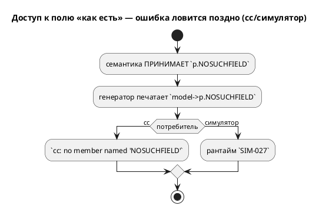
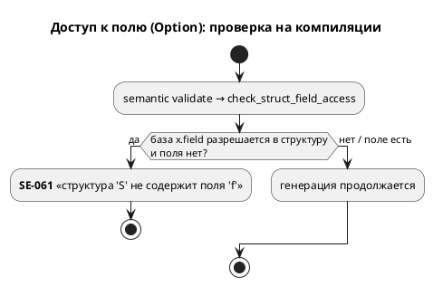

# Фича: Дефекты генератора C по структурам

- **Номер:** 0080
- **Статус:** ГОТОВО (2026-07-20)
- **Зависит от:** — (независима; смежна с 0078, но её не требует)
- **Приоритет / Tier:** Tier 2 (валидный Lam → невалидный C; отсутствие ранней диагностики)
- **Крейт:** `grammar` (генератор `generator/c/`, семантика `validate/`)
- **Связанные issue (анализ):** новая фича (перевод кандидата из `FEATURES.md`)

## Стадии жизненного цикла

Все стадии — **разделы этой карточки**: «Архитектура (ADR)»,
«Анализ», «Разработка», «Тест-план», «Отчёт о тестировании», «Итог».
Отдельным артефактом остаются только исправления —
[`docs/fixes/`](../fixes/README.md) (при необходимости `0080-YY-*`).

## Краткое описание

Три дефекта, каждый подтверждён пробой:

1. `var p: Point := {1,2};` → `model->p = {1, 2};` — **невалидный C**
   (`cc: error: expected expression`; нужен составной литерал `(Point){1,2}`);
2. `const c: Coord := {0,0,0};` (`extend_complex.lam`) **молча исчезает** из C —
   остаётся только `typedef`;
3. **существование поля не проверяется** — `p.NOSUCHFIELD` компилируется молча в
   невалидный `model->p.NOSUCHFIELD` (нужна диагностика в `grammar`).

Выявлено при [структурные типы в симуляторе](0034-sim-struct-types.md), три пробы.

> Фича зарегистрирована **2026-07-17** переводом кандидата из `FEATURES.md`
> (решение заказчика: «завести фичи по кандидатам, пока без проработки»).
> **Проработка не проводилась:** ADR, анализ, зависимости, Tier и объём — за
> стадиями 2–3. Текст ниже — **перенос находки кандидата** вместе с
> подтверждающими её пробами; это описание проблемы, а **не** принятое решение.

## Архитектура (ADR)

- **Status:** Accepted
- **Date:** 2026-07-20
- **Authors:** Архитектор + Аналитик
- **Related issues:** [Фича](0080-c-struct-defects.md); наследует находки [структурные типы в симуляторе](0034-sim-struct-types.md#архитектура-adr); класс «тихая потеря/неверный вывод» (ср. [заглушки генератора C: диагностика вместо тихого пропуска](0028-c-generator-stubs.md#архитектура-adr)).

### Context

Три независимых дефекта работы генератора C со структурами (каждый — проба):

1. **Инициализатор структурной переменной** `var p: Point := {1,2};` печатался как
   `model->p = {1, 2};` — **невалидный C** (`cc: expected expression`): фигурный
   инициализатор допустим только в **объявлении**, не в присваивании.
2. **Используемая структурная константа** `const c: Coord := {…};` эмитилась
   макросом `#define CONST_C {…}`, и доступ `c.x` разворачивался в `{…}.x` —
   снова невалидный C. (Неиспользуемая — отфильтровывалась, поэтому `extend_complex`
   компилировался: его `c` не используется как структура.)
3. **Существование поля не проверялось**: `p.NOSUCHFIELD` печаталось молча в
   `model->p.NOSUCHFIELD`. Ошибку ловил лишь `cc` («no member named …») — поздно
   и невнятно; симулятор — на исполнении (`SIM-027`).



### Decision Drivers

1. **Валидный C** для конструкций, которые язык принимает (дефекты 1, 2).
2. **Ранняя, внятная диагностика** вместо ошибки downstream (дефект 3) — прецедент
   0028 (диагностика вместо тихого пропуска).
3. **Неизменность вывода корпуса** (детерминизм 0048): в корпусе нет ни
   используемой структурной константы, ни `var struct := {…}`, ни неверного
   доступа к полю — правки обязаны быть аддитивными.
4. **Консервативность проверки поля**: ложное срабатывание хуже пропуска
   (`cc`/симулятор остаются страховкой).

### Decision

Приняты точечные исправления, каждое локализовано:

1. **Дефект 1** (`c_blocks::generate_scalar_init`): структурная переменная
   присваивается **составным литералом** `model->p = (Point){1, 2};`.
2. **Дефект 2** (`c_decl.rs`): структурная константа эмитится как
   `static const {Type} CONST_{name} = {…};`, а не `#define`. Скаляр/массив —
   прежним `#define` (массив с полевым/индексным доступом — территория 0078).
3. **Дефект 3** (`semantic/validate/member_access.rs`, `SE-061`): новый проход
   `check_struct_field_access` обходит инициализаторы, условия, тела блоков
   (модели и состояний), тела функций, условия `ref` и на каждом `x.field`
   (где `x` **надёжно** разрешается в структуру) проверяет наличие поля.
   Неразрешимую базу пропускает (консервативно).



### Consequences

#### Положительные

- `var struct := {…}` и используемые структурные константы дают **компилируемый**
  C (сверено `cc`).
- Неверный доступ к полю — компайл-тайм `SE-061`, единый для всех целей, до
  генерации. Симулятор ловил то же на исполнении раньше — теперь до неё дело не
  доходит.
- Вывод корпуса `examples/generated/` **байт-в-байт неизменен** (аддитивно).

#### Отрицательные / Action items

- `SE-061` **опережает** время выполнения `SIM-027` для статически разрешимых случаев:
  тест `unknown_field_read_is_diagnostic` перенастроен на компайл-тайм
  (переименован `…_se061_at_compile_time`); механизм `SIM-027` остаётся под
  юнит-тестами `eval/{access,place}.rs` для базы, статически не разрешимой.
- Массивные константы (`#define X {…}`, `X[i]` невалиден) — **тот же класс**, но
  вне объёма 0080 (территория 0078).
- Вынос `generate_scalar_init` в `c_blocks.rs` (лимит размера `c_model`).

#### Acceptance criteria

1. `var p: Point := {1,2}` → `model->p = (Point){1,2};`; `cc` компилирует.
2. Используемая `const c: Coord := {…}` → `static const Coord … = {…};`; `cc`
   компилирует; доступ `c.x` валиден.
3. `p.NOSUCHFIELD` → `SE-061` на этапе семантики; валидное поле не отвергается.
4. Вывод корпуса **байт-в-байт неизменен**; `precheck.sh` зелёный.
5. Версия языка **не** поднимается (исправление вывода + новая диагностика на
   уже-невалидную программу; грамматика не менялась).

## Анализ

- **Фича:** [дефекты генератора C по структурам](0080-c-struct-defects.md)
- **ADR:** [дефекты генератора C по структурам](0080-c-struct-defects.md#архитектура-adr)
- **Дата:** 2026-07-20
- **Роль:** Аналитик

### Зависит от

Пусто. Смежна с [семантика `[bit;N]` расходится втрое](0078-bit-array-semantics.md) (представление
`[bit;N]`/массивных констант), но её **не** требует: объём 0080 — структуры.

### Tier

**Tier 2.** Дефекты 1–2 — валидный Lam транслируется в **невалидный C** (тихая
порча вывода); дефект 3 — отсутствие ранней диагностики. Не Tier 1: корпус
затронутых конструкций **не содержит** (ничего рабочего не сломано).

### Воспроизведение (пробы)

| Дефект | Вход | До исправления |
|---|---|---|
| 1 | `var p: Point := {1,2};` | `model->p = {1, 2};` → `cc: expected expression` |
| 2 | используемая `const c: Coord := {…}` | `#define CONST_C {…}`, `c.x` → `{…}.x` → `cc` ошибка |
| 3 | `p.NOSUCHFIELD` | `model->p.NOSUCHFIELD` молча (ловит только `cc`/`SIM-027`) |

**Уточнение по дефекту 2:** в `extend_complex.lam` const `c: Coord` **не
используется** как структура (строка 16 — параметр функции `c: Constant`) →
отфильтрован фильтром неиспользуемых → корпус компилируется. Дефект проявляется
только на **используемой** структурной константе.

### Диагноз и границы

- **Дефект 1:** `generate_model_init` печатал `model->p = <expr>;` для любого
  типа. Структуре нужен составной литерал `(Type){…}`. Правка вынесена в
  `c_blocks::generate_scalar_init`.
- **Дефект 2:** `c_decl.rs` эмитил **все** константы как `#define`. Структурной
  нужен `static const Type = {…}` (иначе `.field` невалиден). Скаляр/массив —
  прежним `#define`.
- **Дефект 3:** семантика не проверяла поля. Новый проход `member_access.rs`
  (`SE-061`) — обход по образцу `unused.rs`, с консервативным разрешением типа
  базы (`Variable(.field)*`); неразрешимую базу пропускает.

### Обратная совместимость

Полная и аддитивная. Правки 1–2 меняют вывод только для конструкций, которые
раньше давали **невалидный** C (то есть не работали); правка 3 отвергает
программы, которые и так отвергались downstream. Корпус затронутых конструкций
не содержит → вывод **байт-в-байт неизменен**. Версия языка не поднимается.

### Риски

1. **Ложное срабатывание SE-061** — снято консервативностью (проверка только при
   надёжно-структурной базе) + позитивный контроль `valid_struct_field_access_is_accepted`.
2. **SE-061 опережает SIM-027** — тест перенастроен на компайл-тайм; механизм
   SIM-027 остаётся под юнит-тестами `eval/`.
3. **Сдвиг вывода корпуса** — снят (корпус без затронутых конструкций); страхует
   проверка детерминизма.
4. **Лимит размера** `c_model` — снят выносом `generate_scalar_init` в `c_blocks`.

### План проверки

См. [тест-план 0080](0080-c-struct-defects.md#тест-план): компиляция `cc` для
дефектов 1–2; `SE-061` + позитив для дефекта 3; проверка детерминизма.

## Разработка

### Задача

- **Фича:** [дефекты генератора C по структурам](0080-c-struct-defects.md)
- **ADR:** [дефекты генератора C по структурам](0080-c-struct-defects.md#архитектура-adr)
- **Дата:** 2026-07-20

#### Что сделано

##### Дефект 1 — составной литерал (`c_blocks.rs`, `c_model.rs`)

Эмиссия скалярной/структурной инициализации вынесена в
`c_blocks::generate_scalar_init`: структура печатается как `model->p = (Type){…};`
(составной литерал), прочие типы — `model->p = <expr>;`. `c_model` зовёт помощник
(вынос снял превышение лимита размера; baseline `c_model` 1075→1073).

##### Дефект 2 — `static const` (`c_decl.rs`)

`generate_constants_and_ports_and_enums`: структурная константа эмитится
`static const {Type} CONST_{name} = {…};` вместо `#define`. Скаляр/массив —
прежним `#define` (массив с полевым доступом — территория 0078). Добавлен импорт
`TypeNode`.

##### Дефект 3 — `SE-061` (`semantic/validate/member_access.rs`)

Новый проход `check_struct_field_access` (Ce19) в `validate_model` (после Ce18).
Обходит инициализаторы переменных, условия, тела именованных блоков модели и
состояний, тела функций, условия рёбер `ref`. Для каждого `x.field`
(`Member::Identifier`), где `x` **надёжно** разрешается в структурный тип
(`base_type`/`cond_base_type`: цепочка `Variable(.поле)*`), проверяет наличие
поля; иначе `SE-061`. Неразрешимую базу пропускает (консервативно). Обход —
по образцу `unused.rs`.

#### Проверка

- `cc -std=c11 -Wall -Werror` компилирует вывод дефектов 1–2
  (`struct_codegen_tests.rs`).
- `SE-061` на `p.NOSUCHFIELD`; валидное поле не отвергается (позитивный контроль).
- Тест `unknown_field_read` перенастроен: ошибка теперь компайл-тайм
  (`…_se061_at_compile_time`); `SIM-027` остаётся под юнит-тестами `eval/`.
- Вывод корпуса `examples/generated/` байт-в-байт неизменен; `precheck.sh` EXIT=0.

#### Замечания

- `SE-061` — первый свободный код (макс был `SE-060`).
- Проверка консервативна умышленно: `arr[i].field` (база — `ArraySubscript`) не
  разрешается → пропуск, а не ложное срабатывание.

## Тест-план

- **Фича:** [дефекты генератора C по структурам](0080-c-struct-defects.md)
- **ADR:** [дефекты генератора C по структурам](0080-c-struct-defects.md#архитектура-adr)
- **Дата:** 2026-07-20
- **Роль:** Тестировщик

### Стратегия

Дефекты 1–2 — корректность вывода C: доказательство — **компиляция** `cc`
(строка выглядит правдоподобно, но правду говорит компилятор). Дефект 3 —
семантика: пример + контрпример.

### Примеры и контрпримеры

Валидные (после исправления компилируются `cc`):

```lam
var p: Point := {1, 2};              // → model->p = (Point){1, 2};
const origin: Coord := {0, 0, 0};    // (используется) → static const Coord …;
```

Контрпример (компайл-тайм ошибка):

```lam
always { p.x := p.NOSUCHFIELD; }     // SE-061: структура 'Point' не содержит поля 'NOSUCHFIELD'
```

### Условия проверок и ожидаемые результаты

| № | Проверка | Ожидание | Где |
|---|---|---|---|
| T1 | `var p: Point := {1,2}` → `(Point){1, 2}`; `cc -Werror` | компилируется | `struct_codegen::struct_var_initializer_is_compound_literal` |
| T2 | используемая `const Coord` → `static const Coord …`; `cc` | компилируется | `struct_codegen::used_struct_const_is_static_const` |
| T3 | `p.NOSUCHFIELD` → `SE-061` на семантике | ошибка + текст поля | `struct_codegen::unknown_struct_field_is_se061` |
| T4 | валидное поле (условие/тело/инициализатор) не отвергается | без ошибки | `struct_codegen::valid_struct_field_access_is_accepted` |
| T5 | `SE-061` на этапе построения (было `SIM-027`) | компайл-тайм | `struct_types::unknown_field_read_is_se061_at_compile_time` |
| T6 | `SIM-027`/`SIM-029` (бит-индекс, сравнение) не задеты | зелёные | `struct_types::*` + `eval/{access,place}.rs` |
| T7 | Вывод корпуса `examples/generated/` неизменен | нет диффа | проверка детерминизма |
| T8 | Весь `precheck.sh` | зелёный | `./scripts/precheck.sh` |

### Границы

- Массивные константы (`#define X {…}`) — **тот же класс**, но вне объёма 0080
  (территория 0078): проверка не срабатывает на индексном доступе, `cc` остаётся
  страховкой.
- SE-061 **консервативна**: база, не разрешимая статически в структуру
  (`arr[i].field`), пропускается — ложное срабатывание хуже пропуска.

## Отчёт о тестировании

- **Фича:** [дефекты генератора C по структурам](0080-c-struct-defects.md)
- **ADR:** [дефекты генератора C по структурам](0080-c-struct-defects.md#архитектура-adr)
- **Тест-план:** [дефекты генератора C по структурам](0080-c-struct-defects.md#тест-план)
- **Дата:** 2026-07-20
- **Вердикт:** ✅ **ГОТОВО**

### Окружение

- macOS (darwin 25.5); `grammar` 0.7.0 / `simulation` 0.4.0.
- `./scripts/precheck.sh` — **EXIT=0** (fmt, check, clippy `-D warnings`, тесты,
  сборка примеров, проверка детерминизма, ST/c-hal/sv, размер модулей).
- `cargo test`: **2146 passed, 6 ignored**.

### Сводка

Закрыты три дефекта работы генератора C со структурами:
1. инициализатор структурной переменной → составной литерал `(Type){…}`;
2. используемая структурная константа → `static const`, а не `#define`;
3. доступ к несуществующему полю → компайл-тайм `SE-061` (было: молча в C,
   ловил `cc`/`SIM-027`).

### Сверка с тест-планом

| № | Проверка | Результат |
|---|---|---|
| T1 | `(Point){1,2}` + `cc` | ✅ `struct_var_initializer_is_compound_literal` |
| T2 | `static const Coord` + `cc` | ✅ `used_struct_const_is_static_const` |
| T3 | `p.NOSUCHFIELD` → `SE-061` | ✅ `unknown_struct_field_is_se061` |
| T4 | валидное поле не отвергается | ✅ `valid_struct_field_access_is_accepted` |
| T5 | компайл-тайм вместо `SIM-027` | ✅ `unknown_field_read_is_se061_at_compile_time` |
| T6 | `SIM-027`/`SIM-029` не задеты | ✅ `struct_types::*`, `eval/*` |
| T7 | Вывод корпуса неизменен | ✅ `git status` пуст |
| T8 | Весь `precheck.sh` | ✅ EXIT=0 |

### Ключевые находки

- **Дефект 2 уточнён:** в `extend_complex.lam` структурная константа
  **не используется** как структура → отфильтрована → корпус компилировался;
  дефект — только на **используемой** структурной константе.
- **SE-061 опережает SIM-027:** ошибка поля ловится теперь на компиляции;
  механизм `SIM-027` остаётся под юнит-тестами `eval/{access,place}.rs` для базы,
  статически не разрешимой в структуру.
- **Проверка консервативна:** `arr[i].field` пропускается (база не разрешается) —
  ложное срабатывание хуже пропуска; `cc`/симулятор остаются страховкой.

### Найденные дефекты

Нет (исправлений не заводилось). Массивные константы того же класса — вне объёма
(территория 0078).

## Итог (что сделано)

**Tier 2, закрыта 2026-07-20** (`precheck.sh` EXIT=0, 2146 тестов). Три дефекта
работы генератора C со структурами закрыты:

1. **Инициализатор структурной переменной** → составной литерал: `var p: Point
   := {1,2}` даёт `model->p = (Point){1, 2};` (было `model->p = {1, 2};` —
   `cc: expected expression`). Эмиссия вынесена в `c_blocks::generate_scalar_init`.
2. **Используемая структурная константа** → `static const Coord CONST_… = {…};`
   вместо `#define` (макрос давал `{…}.field` — невалидно). Скаляр/массив —
   прежним `#define` (`c_decl.rs`).
3. **Существование поля проверяется** на компиляции: `p.NOSUCHFIELD` → **`SE-061`**
   (новый проход `semantic/validate/member_access.rs`, Ce19). Прежде печаталось
   молча в невалидный C; ловил лишь `cc`/`SIM-027`.

**Ключевые факты:**
- Вывод корпуса `examples/generated/` **байт-в-байт неизменен**: корпус не
  содержит ни используемой структурной константы, ни `var struct := {…}`, ни
  неверного доступа к полю. (В `extend_complex` структурная константа **не
  используется** как структура → отфильтрована, потому C и компилировался.)
- **`SE-061` опережает время выполнения `SIM-027`**: тест перенастроен на компайл-тайм
  (`unknown_field_read_is_se061_at_compile_time`); механизм `SIM-027` остаётся под
  юнит-тестами `eval/{access,place}.rs`.
- **Проверка консервативна**: база, не разрешимая статически в структуру
  (`arr[i].field`), пропускается — ложное срабатывание хуже пропуска.
- **Массивные константы** того же класса (`#define X {…}`) — вне объёма
  (территория 0078).
- Версия языка **не** поднята (исправление вывода + диагностика на уже-невалидную
  программу; грамматика не менялась).

Детали — [ADR](0080-c-struct-defects.md#архитектура-adr),
[анализ](0080-c-struct-defects.md#анализ),
[отчёт](0080-c-struct-defects.md#отчёт-о-тестировании).
