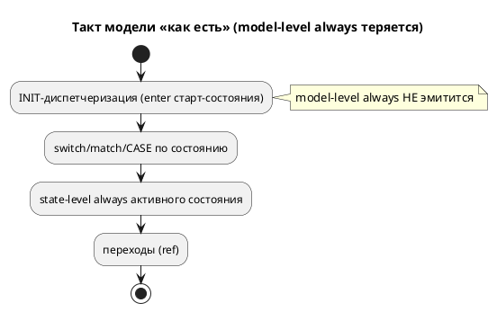
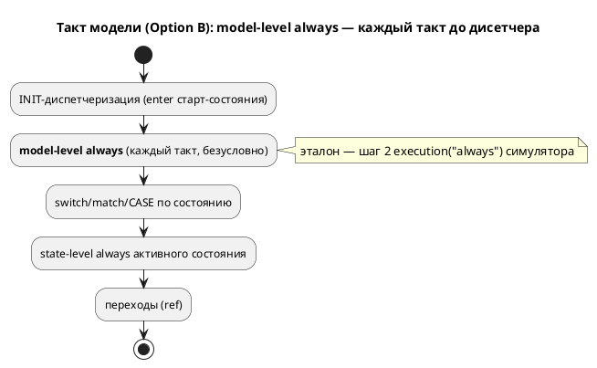

# Фича: Тело `always` на уровне модели не эмитится в C

- **Номер:** 0083
- **Статус:** ГОТОВО (2026-07-20)
- **Зависит от:** — (независима)
- **Приоритет / Tier:** Tier 2 (тихая потеря конструкции при трансляции)
- **Крейт:** `grammar` (генераторы `c`/`rust`/`st`/`sv`) + `simulation` (эталон)
- **Связанные issue (анализ):** новая фича (перевод кандидата из `FEATURES.md`)

## Стадии жизненного цикла (правило 17)

Все стадии — **разделы этой карточки** (правило 32): «Архитектура (ADR)»,
«Анализ», «Разработка», «Тест-план», «Отчёт о тестировании», «Итог».
Отдельным артефактом остаются только исправления —
[`docs/fixes/`](../fixes/README.md) (при необходимости `0083-YY-*`).

## Краткое описание

Проба: `always { a := 1; }` **вне состояния** (на уровне модели) не дала в `tick`
**ничего** — то есть блок принимается языком, но в порождённый C не попадает.

Класс — тихая потеря конструкции при трансляции (ср. [заглушки генератора C: диагностика вместо тихого пропуска](0028-c-generator-stubs.md):
диагностика вместо тихого пропуска).

Выявлено при [lTL-формулы в блоках кода: разбор вместо тихой потери](0035-ltl-in-blocks.md).

> Фича зарегистрирована **2026-07-17** переводом кандидата из `FEATURES.md`
> (решение заказчика: «завести фичи по кандидатам, пока без проработки»).
> **Проработка не проводилась:** ADR, анализ, зависимости, Tier и объём — за
> стадиями 2–3 (правило 17). Текст ниже — **перенос находки кандидата** вместе с
> подтверждающими её пробами; это описание проблемы, а **не** принятое решение.

## Архитектура (ADR)

- **Status:** Accepted
- **Date:** 2026-07-20
- **Authors:** Архитектор + Аналитик + Дизайнер языка (решение направления — заказчик)
- **Related issues:** [Фича](0083-model-always-block-c.md); класс дефекта — «тихая потеря конструкции» (ср. [заглушки генератора C: диагностика вместо тихого пропуска](0028-c-generator-stubs.md#архитектура-adr)); опирается на контракт такта [ADR](0033-init-tick-alignment.md#архитектура-adr).

### Context

Именованный блок `always { … }` **грамматически допустим и как элемент
состояния, и как элемент модели** (`grammar.lalrpop`: `NamedBlockCodeDefine`
входит в `ModelElement` **и** в `StateElement`). Но model-level `always` (вне
состояния) на модели, имеющей **свои состояния**, **молча теряется**:

- **все цели кода** (`c`/`rust`/`st`/`sv`) эмитят только *state-level*
  именованные блоки;
- **симулятор** тоже не исполняет его: `builder.rs` строил
  `Unit::Node { executions: HashMap::new() }` — unit-level блоки не грузились.

Проба: `model Counter { var n; always { n := n+1; } start Run { ref Done: n>2; }
state Done; } start Entry = Counter;` — `n` не растёт ни в одной цели, переход
`n>2` не срабатывает, автомат стоит. Эталона, исполняющего конструкцию, **нет
вовсе** — значит вопрос не «C догнать до симулятора», а выбор направления.

На **композите** (`Root = M`, `M1|M2`) model-level `always` уже работает — но
как тело **синтетического** состояния композиции (`case ROOT`), а не как «блок
модели». Дефект специфичен для модели со своими состояниями.



### Decision Drivers

1. **Никакой тихой потери** — либо исполнять, либо явно диагностировать (прецедент 0028).
2. **Эталон — симулятор**, и потактовая сверка заводится **вместе** с поведением
   (урок: проверка компиляции не доказывает верность).
3. **Единообразие семантики** между целями, где конструкция вообще есть.
4. **Неизменность вывода корпуса** (детерминизм 0048): в корпусе model-level
   `always` нет, правка обязана быть аддитивной.

### Considered Options

#### Option A. Диагностика (отвергнуть model-level `always`)

**Pros:** мал, безопасен, закрывает тихую потерю одной проверкой.

**Cons:** убирает грамматически допустимую и полезную конструкцию (фоновое
действие каждый такт); эталона нет, но семантика **очевидна** и реализуема.

#### Option B. Реализовать семантику во всех целях + симуляторе

Model-level `always` исполняется **каждый такт до диспетчеризации состояния**,
безусловно по состоянию — в симуляторе (эталон), `c`, `rust`, `st`, `sv`.

**Pros:** добавляет реальную возможность языка; единообразно; закрывает тихую
потерю исполнением; сверяется потактово.

**Cons:** дороже (симулятор + 4 цели + сверка); нужно определить точку
исполнения и порядок относительно state-level `always`.

### Decision

Принимается **Option B** (решение заказчика 2026-07-20). Семантика:

> **Model-level `always` исполняется каждый такт, безусловно по текущему
> состоянию, до диспетчеризации состояния** (и, следовательно, до state-level
> `always` активного состояния и до переходов).

Эталон — шаг 2 `execution("always")` симулятора (unit-level блоки), который и так
вызывается каждый такт до `tick_node`; он лишь **наполняется** из
`model.named_blocks` (прежде пустой `executions`). Точка исполнения в целях —
между INIT-диспетчеризацией и диспетчером состояния (`switch`/`match`/`CASE`/
`unique case`), безусловно.

Объём — **`always`**. Model-level `enter`/`exit` в объём не входят: их семантика
(вход/выход модели) сложнее и в корпусе не встречается; хелперы принимают любой
`block_name`, но вызывается только `"always"` — расширение аддитивно.



### Consequences

#### Положительные

- Model-level `always` исполняется во всех целях и потактово сверен с симулятором
  (цель `c`, `conformance_c_tests::model_level_always_matches_generated_c`).
- Вывод корпуса `examples/generated/` **байт-в-байт неизменен** (в корпусе
  конструкции нет — правка аддитивна).
- Эмиссия переиспользует существующий печатник блоков (`generate_code_block`/
  `print_statement`), различаясь лишь источником списка (модель, а не состояние).

#### Отрицательные / Action items

- **Лимит размера модуля:** добавление в `c_model`/`rust_model`/`sv_fsm` вынудило
  вынести помощники именованных блоков в новые модули `c_blocks.rs`/
  `rust_blocks.rs`/`sv_blocks.rs` (штатное давление правила размера); baseline
  `c_model` 1084→1075, `rust_model` 1349→1345.
- **Проверка компиляции rust/st/sv:** корпус конструкции не содержит, поэтому
  компиляция вывода проверяется прямо в codegen-тестах (`model_always_tests.rs`
  зовёт `rustc -D warnings`/`iec2c`/`verilator --lint` с мягким пропуском).
- Model-level `enter`/`exit` остаются вне объёма — если понадобятся, заводятся
  отдельной фичей (механизм уже принимает любой `block_name`).

#### Acceptance criteria

1. Простая модель со своими состояниями и `always { n := n+1; }` вне состояния:
   `n` растёт каждый такт во всех целях; потактовая трасса симулятора и C
   совпадает (1,2,3,4).
2. Вывод корпуса `examples/generated/` **байт-в-байт неизменен**.
3. Порождённые `rust`/`st`/`sv` **компилируются** (`rustc`/`iec2c`/`verilator`).
4. `always` эмитится **до** диспетчеризации состояния во всех целях
   (структурный тест).
5. Версия языка **не** поднимается: снятие тихой потери грамматически уже
   допустимой конструкции (семантика симулятора/генерации, не грамматика).

## Анализ

- **Фича:** [тело `always` на уровне модели не эмитится в C](0083-model-always-block-c.md)
- **ADR:** [тело `always` на уровне модели не эмитится в C](0083-model-always-block-c.md#архитектура-adr) (принят Option B — решение заказчика)
- **Дата:** 2026-07-20
- **Роль:** Аналитик

### Зависит от

Пусто — фича независима.

### Tier

**Tier 2.** Тихая потеря конструкции при трансляции (ломает поведение модели:
автомат с model-level `always` не эволюционирует). Не Tier 1 лишь потому, что в
корпусе конструкции нет и рабочего ничего не сломано.

### Воспроизведение (проба)

`model Counter { var n; always { n := n+1; } start Run { ref Done: n>2; } state
Done; } start Entry = Counter;`:

| Цель / эталон | model-level `always` |
|---|---|
| C `generate_model_tick` | **теряется** |
| rust / st / sv | **теряется** |
| симулятор (`builder.rs:394` `executions: HashMap::new()`) | **теряется** |
| композит (`Root = M { always … }`) | работает (тело синтетического `case ROOT`) |

**Ключевая находка:** эталона нет — конструкцию теряют **все**. Значит объём —
не «C догнать», а выбор направления (диагностика vs реализация). Заказчик выбрал
**реализацию** (Option B).

### Диагноз

`always` — `ModelElement` **и** `StateElement` в грамматике. Цели эмитят только
`StateElement`-блоки (`generate_named_blocks(state)` и аналоги); симулятор грузит
только `state_executions`. Model-level `named_blocks` (`ModelNode.named_blocks`)
никем не читаются на пути простой модели.

Механизм исполнения в симуляторе **уже есть**: `execution("always")` шаг 2
(unit-level `executions`) вызывается каждый такт до `tick_node` — его надо лишь
**наполнить** из `model.named_blocks`.

### Границы правки

- **Симулятор** (`unit/builder.rs`): `executions` наполняется model-level
  блоками (был `HashMap::new()`).
- **C** (`c_model.rs`): `generate_model_named_blocks` перед `switch`.
- **rust** (`rust_model.rs`): `emit_model_named_blocks` перед `match`; присваивания
  model-level `always` учтены в `assigned` (мутабельность `let`).
- **st** (`st_model.rs`): `emit_model_block` перед `CASE state OF`.
- **sv** (`sv_fsm.rs`): `emit_model_named_blocks` перед `unique case` (над `_next`).
- **Вынос по лимиту размера:** помощники именованных блоков вынесены в
  `c_blocks.rs`/`rust_blocks.rs`/`sv_blocks.rs` (иначе `c_model`/`rust_model`/
  `sv_fsm` превышают лимит). `Fsm::scope` повышен до `pub(crate)`.
- **Объём — `always`**; `enter`/`exit` уровня модели вне объёма (см. ADR).

### Обратная совместимость (правило 11)

Полная и **аддитивная**: правка лишь начинает исполнять ранее терявшийся блок.
Корпус конструкции не содержит → вывод **байт-в-байт неизменен** (проверка
детерминизма). Версия языка не поднимается (семантика симулятора/генерации,
грамматика не менялась).

### Риски

1. **Сдвиг вывода корпуса** — снят: корпус без model-level `always`, эмиссия не
   срабатывает; страхует проверка детерминизма.
2. **Порядок относительно state-level `always`** — model-level строго раньше
   (эталон: шаг 2 до шага 3 в `execution`); закреплён потактовой сверкой C.
3. **Компиляция rust/st/sv** — корпус не проверяет; проверяется в codegen-тестах
   настоящими тулами (`rustc`/`iec2c`/`verilator`, мягкий пропуск).
4. **Лимит размера** — реализован вынос в отдельные модули (штатное давление).

### План проверки

См. [тест-план 0083](0083-model-always-block-c.md#тест-план): потактовая сверка
C↔симулятор; структурная эмиссия «до диспетчера» во всех 4 целях + компиляция
их вывода; проверка детерминизма.

## Разработка

### Задача

- **Фича:** [тело `always` на уровне модели не эмитится в C](0083-model-always-block-c.md)
- **ADR:** [тело `always` на уровне модели не эмитится в C](0083-model-always-block-c.md#архитектура-adr) (Option B)
- **Дата:** 2026-07-20

#### Что сделано

Model-level `always` (тело `always` вне состояния) теперь исполняется **каждый
такт до диспетчеризации состояния** в симуляторе (эталон) и во всех четырёх целях.

##### Симулятор (`simulation/src/unit/builder.rs`)

`Unit::Node.executions` наполняется из `model.named_blocks` (был
`HashMap::new()`). Шаг 2 `execution("always")` (`unit/mod.rs`) их исполняет —
каждый такт, до `tick_node`, безусловно по состоянию.

##### Генераторы (эмиссия перед диспетчером состояния)

| Цель | Файл | Точка | Помощник |
|---|---|---|---|
| C | `c_model.rs` | перед `switch (model->state)` | `generate_model_named_blocks` |
| rust | `rust_model.rs` | перед `match self.state` | `emit_model_named_blocks` |
| st | `st_model.rs` | перед `CASE state OF` | `emit_model_block` |
| sv | `sv_fsm.rs` | перед `unique case` (над `_next`) | `emit_model_named_blocks` |

- **rust:** присваивания model-level `always` добавлены в сбор `assigned` —
  иначе `let` затираемой переменной вышел бы немутабельным (`-D warnings`).
- **sv:** эмиссия в `always_comb` после умолчаний `_next`, до `unique case`.

##### Вынос по лимиту размера модуля

Добавление превысило лимит у `c_model` (1084→1111), `rust_model` (1349→1377) и
`sv_fsm` (995→1015). Помощники именованных блоков вынесены в новые модули:

- `generator/c/c_blocks.rs` — `generate_named_blocks` + `generate_model_named_blocks`;
- `generator/rust/rust_blocks.rs` — `emit_named_blocks` + `emit_model_named_blocks`;
- `generator/sv/sv_blocks.rs` — `emit_named_blocks` + `emit_model_named_blocks`
  (`Fsm::scope` повышен до `pub(crate)`; `sv_compose` импортирует из `sv_blocks`).

Baseline размеров обновлён вниз: `c_model` 1084→1075, `rust_model` 1349→1345;
`sv_fsm` 985 (< 1000, из реестра не в долге).

#### Проверка

- Потактовая сверка C↔симулятор: `n = 1,2,3,4`
  (`conformance_c_tests::model_level_always_matches_generated_c`).
- Структурная эмиссия «до диспетчера» + компиляция вывода `rustc`/`iec2c`/
  `verilator` (`grammar/tests/model_always_tests.rs`).
- Вывод корпуса `examples/generated/` байт-в-байт неизменен; `precheck.sh` EXIT=0.

#### Замечания

- `ModelNode.named_blocks` — поле (не метод); `get_named_blocks(name)` фильтрует.
- Объём — `always`; `enter`/`exit` уровня модели вне объёма (механизм принимает
  любой `block_name`).

## Тест-план

- **Фича:** [тело `always` на уровне модели не эмитится в C](0083-model-always-block-c.md)
- **ADR:** [тело `always` на уровне модели не эмитится в C](0083-model-always-block-c.md#архитектура-adr) (Option B)
- **Дата:** 2026-07-20
- **Роль:** Тестировщик

### Стратегия

Фича меняет **семантику** (правило 16): ранее терявшийся блок начинает
исполняться. Эталон — симулятор; заводится потактовая сверка.

### Пример (правило 16)

```lam
model Counter {
    var n: u8 := 0;
    always { n := n + 1; }   // model-level: каждый такт
    start Run { ref Done: n > 2; }
    state Done;
}
start Entry = Counter;
```

Ожидаемая трасса `n`: **1 → 2 → 3 → 4** (переход при `n > 2` на 3-м такте; 4-й
такт — model-level `always` в терминальном `Done` перед уходом в END).

Контрпример (регресс, который тест обязан поймать): потеря блока → `n` не растёт
→ трасса иная / автомат не завершается.

### Условия проверок и ожидаемые результаты

| № | Проверка | Ожидание | Где |
|---|---|---|---|
| T1 | Симулятор исполняет model-level `always`: трасса `n` = 1,2,3,4 | пиннинг | `conformance_c::model_level_always_matches_generated_c` |
| T2 | Потактовая сверка симулятор↔C совпадает | равно | там же |
| T3 | C эмитит блок **до** `switch (model->state)` | порядок | `model_always_tests::c_emits_…_before_switch` |
| T4 | rust эмитит блок **до** `match self.state`; вывод компилируется `rustc -D warnings` | порядок + сборка | `model_always_tests::rust_…` |
| T5 | st эмитит блок **до** `CASE state OF`; вывод принят `iec2c` | порядок + арбитр | `model_always_tests::st_…` |
| T6 | sv эмитит блок **до** `unique case` (над `_next`); вывод проходит `verilator --lint` | порядок + линт | `model_always_tests::sv_…` |
| T7 | Вывод корпуса `examples/generated/` байт-в-байт неизменен | нет диффа | проверка детерминизма `precheck.sh` |
| T8 | Весь `precheck.sh` | зелёный | `./scripts/precheck.sh` |

### Границы

- **Компиляция rust/st/sv** покрыта прямо в codegen-тестах (`rustc`/`iec2c`/
  `verilator`, мягкий пропуск): корпус конструкции не содержит, проверка её не
  компилировал бы.
- **Объём — `always`.** Model-level `enter`/`exit` вне объёма (ADR).
- Композитный `always` (тело синтетического состояния) уже работал и остаётся
  под существующими сверками композиции.

## Отчёт о тестировании

- **Фича:** [тело `always` на уровне модели не эмитится в C](0083-model-always-block-c.md)
- **ADR:** [тело `always` на уровне модели не эмитится в C](0083-model-always-block-c.md#архитектура-adr) (Option B)
- **Тест-план:** [тело `always` на уровне модели не эмитится в C](0083-model-always-block-c.md#тест-план)
- **Дата:** 2026-07-20
- **Вердикт:** ✅ **ГОТОВО**

### Окружение

- macOS (darwin 25.5); `grammar` 0.7.0 / `simulation` 0.4.0.
- `./scripts/precheck.sh` — **EXIT=0** (fmt, check, clippy `-D warnings`, тесты,
  сборка примеров, проверка детерминизма, ST `iec2c` 8/8, c-hal, sv-тестбенчи,
  размер модулей).
- `cargo test`: **2146 passed, 6 ignored** (+5 к базе: 4 codegen + 1 conformance).

### Сводка

Model-level `always` (тело `always` вне состояния) молча терялся во **всех** целях
и в симуляторе — эталона не было. По решению заказчика реализована семантика
(Option B): блок исполняется **каждый такт до диспетчеризации состояния**,
безусловно по состоянию. Эталон — шаг 2 `execution("always")` симулятора
(наполнен из `model.named_blocks`).

### Сверка с тест-планом

| № | Проверка | Результат |
|---|---|---|
| T1 | Симулятор: трасса `n` = 1,2,3,4 | ✅ |
| T2 | Потактовая сверка симулятор↔C | ✅ `model_level_always_matches_generated_c` |
| T3 | C — блок до `switch` | ✅ `c_emits_model_level_always_before_switch` |
| T4 | rust — до `match` + `rustc -D warnings` | ✅ `rust_emits_…` |
| T5 | st — до `CASE` + `iec2c` | ✅ `st_emits_…` |
| T6 | sv — до `unique case` + `verilator --lint` | ✅ `sv_emits_…` |
| T7 | Вывод корпуса неизменен | ✅ `git status` пуст |
| T8 | Весь `precheck.sh` | ✅ EXIT=0 |

### Примеры и контрпримеры (правило 16)

Пример — фикстура `conformance_model_always.lam` (model-level `always { n := n+1;
}`): `n` растёт 1→2→3→4, автомат завершается. Контрпример (потеря блока): `n` не
растёт, переход `n>2` не срабатывает — поймал бы пиннинг трассы T1.

### Ключевые находки

- **Эталона не было:** конструкцию теряли **и** генераторы, **и** симулятор
  (`builder.rs` строил `executions: HashMap::new()`) — не «C отстал от
  симулятора», как можно было прочесть карточку.
- **Композит уже работал** (тело синтетического состояния `case ROOT`); дефект —
  только у модели со **своими** состояниями.
- **Давление лимита размера:** правки трёх файлов потребовали вынести помощники
  именованных блоков в `c_blocks`/`rust_blocks`/`sv_blocks` (штатный механизм);
  baseline `c_model`/`rust_model` понижены.
- **Проверка компиляции rust/st/sv** заведён в codegen-тестах (корпус конструкции не
  содержит) — `rustc`/`iec2c`/`verilator` с мягким пропуском.

### Найденные дефекты

Нет. Исправлений (`docs/fixes/`) не заводилось. Объём — `always`; model-level
`enter`/`exit` осознанно вне объёма (ADR).

## Итог (что сделано)

**Tier 2, закрыта 2026-07-20** (`precheck.sh` EXIT=0, 2146 тестов). Model-level
`always` (тело `always` вне состояния) исполняется теперь **каждый такт до
диспетчеризации состояния** в симуляторе и во всех четырёх целях (`c`/`rust`/`st`/
`sv`); прежде молча терялся везде.

**Находка проработки:** эталона **не было** — конструкцию теряли **и** генераторы,
**и** симулятор (`builder.rs` строил `executions: HashMap::new()`). То есть объём —
не «C догнать до симулятора» (как читалась карточка), а **выбор направления**.
**Заказчик выбрал реализацию** (Option B ADR), а не диагностику.

**Что сделано:**
- **Симулятор** (`unit/builder.rs`): `Unit::Node.executions` наполняется из
  `model.named_blocks` — шаг 2 `execution("always")` исполняет их каждый такт
  (эталон).
- **Генераторы:** блок эмитится до диспетчера состояния — C перед `switch`, rust
  перед `match`, st перед `CASE`, sv перед `unique case` (над `_next`). rust
  учитывает присваивания в расчёте мутабельности `let`.
- **Вынос по лимиту размера:** помощники именованных блоков вынесены в
  `c_blocks.rs`/`rust_blocks.rs`/`sv_blocks.rs` (иначе `c_model`/`rust_model`/
  `sv_fsm` превышают лимит); baseline `c_model` 1084→1075, `rust_model` 1349→1345.
- **Сверка:** потактовая C↔симулятор (`conformance_c_tests`, `n`=1,2,3,4);
  структурная эмиссия «до диспетчера» + компиляция вывода `rustc`/`iec2c`/
  `verilator` (`model_always_tests.rs`, корпус конструкции не содержит).

**Ключевые факты:**
- Вывод корпуса `examples/generated/` **байт-в-байт неизменен** (аддитивно).
- Композитный `always` (`Root = M { always … }`) работал и раньше — как тело
  синтетического состояния; дефект был у модели со **своими** состояниями.
- **Объём — `always`**; model-level `enter`/`exit` осознанно вне объёма (механизм
  принимает любой `block_name`).
- Версия языка **не** поднята (семантика симулятора/генерации, грамматика не
  менялась).

Детали — [ADR](0083-model-always-block-c.md#архитектура-adr),
[анализ](0083-model-always-block-c.md#анализ),
[отчёт](0083-model-always-block-c.md#отчёт-о-тестировании).
