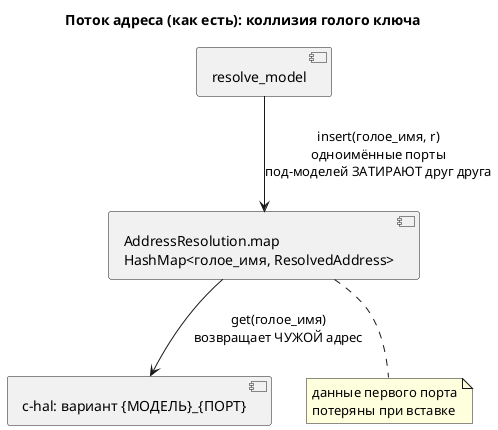

# Фича: Ключ карты адресов — голое имя порта

- **Номер:** 0084
- **Статус:** ✅ ГОТОВО
- **Зависит от:** нет (подтверждено анализом — инфраструктура адресов уже закрыта)
- **Приоритет / Tier:** Tier 2 (латентный дефект корректности ядра 0020)
- **Крейт:** `grammar` (`address_map/resolve.rs`, генераторы `c-hal`/`st-at`/`sv-mmio`, экспорт)
- **Связанные issue (анализ):** новая фича (перевод кандидата из `FEATURES.md`)

## Стадии жизненного цикла

Все стадии — **разделы этой карточки**: «Архитектура (ADR)»,
«Анализ», «Разработка», «Тест-план», «Отчёт о тестировании», «Итог».
Отдельным артефактом остаются только исправления —
[`docs/fixes/`](../fixes/README.md) (при необходимости `0084-YY-*`).

## Краткое описание

`AddressResolution.map` — `HashMap<String, _>` по **голому** имени порта, тогда как
C-генератор индексирует **квалифицированными** вариантами (проба на
`elevator_mini`: `ELEVATOR_MINI_CABIN_…` при ключе `CabinButton_DC`).

Следствие: одноимённые порты в разных под-моделях **делят ключ** — побеждает
последний. В корпусе замаскировано **ручной префиксацией** имён авторами.

Экспорт [экспорт карты адресов во внешний формат](0043-address-map-export.md) делает дефект **видимым**, но чинить
его там **нельзя** — задевает `c-hal`.

Латентный дефект ядра [адрес порта — размещение и потребление (карта адресов)](0020-port-address-decl.md); выявлен при
[экспорт карты адресов во внешний формат](0043-address-map-export.md).

> Фича зарегистрирована **2026-07-17** переводом кандидата из `FEATURES.md`.
> Проработана и закрыта **2026-07-22**.

## Архитектура (ADR)

- **Status:** Accepted
- **Date:** 2026-07-22
- **Authors:** Архитектор + Аналитик
- **Related issues:** [Фича](0084-address-map-qualified-key.md); латентный дефект ядра [адрес порта — размещение и потребление (карта адресов)](0020-port-address-decl.md#архитектура-adr), выявлен при [экспорт карты адресов во внешний формат](0043-address-map-export.md#архитектура-adr); родственно [`elevator_mini.lam` не исполняется: порты под-модели композиции](0079-sim-composition-ports.md) (плоское пространство имён портов)

### Context

`AddressResolution.map` — `HashMap<String, ResolvedAddress>` по **голому** имени
порта (`resolve_model`: `out.map.insert(name.clone(), r)`). Потребитель `c-hal`
(`c_hal.rs`) строит для каждого порта под-модели **квалифицированный** enum-вариант
`{МОДЕЛЬ_UNIQUE}_{ПОРТ}`, но адрес берёт по голому имени: `addr_map.get(port_name)`.

**Следствие:** два порта с **одинаковым голым именем** в разных под-моделях делят
один ключ карты — при вставке побеждает последний, адрес первого **теряется
безвозвратно** (данных в карте уже нет — никаким lookup их не вернуть). В корпусе
дефект **замаскирован**: авторы вручную префиксуют имена (`CabinButton_DC`), и все
адресованные порты корпуса лежат на **корне** (`stacker`, `extend_complex`), где
коллизии голых имён нет.

Карту по голому ключу читают **четыре** потребителя, и не только `c-hal`:
`st-at` (`address_of(port)`), `sv-mmio` (итерация по ключу как имени регистра),
экспорт `map`/`json` (0043, ключ = имя порта в выгрузке). Плюс внешняя `.ld`-карта
(`external_by_name` по голому имени) и диагностики `SE-051`/`SE-050`/`SE-052`.

Исправление задевает `c-hal` — поэтому [экспорт карты адресов во внешний формат](0043-address-map-export.md#архитектура-adr) плоский ключ
экспорта **не чинила**, отложив в эту фичу.

### Decision Drivers

1. **Корректность.** Одноимённые порты разных под-моделей обязаны получать
   **каждый свой** адрес; потеря данных при вставке недопустима.
2. **Аддитивность.** Все адресованные порты корпуса — на корне;
   вывод всех целей (`c-hal`/`st-at`/`sv-mmio`) и экспорта (`map`/`json`) обязан
   остаться **байт-в-байт** прежним.
3. **Согласие продюсера и потребителя.** Ключ строится в двух местах
   (`resolve_model` над `ModelNode` и `c-hal` над `minimap::Name`) — они обязаны
   давать **идентичную** строку, иначе lookup промахнётся молча.
4. **Публичные форматы неизменны.** `.ld`-формат и `json`-контракт 0043
   пользователь видит **по голому имени порта**; квалификация ключа не должна
   протечь в выгрузку.

### Considered Options

#### Option A. Квалифицированный ключ карты + голое имя в `ResolvedAddress`

Ключ `map` — `qualified_port_key(model_unique, port)` (уникальный путь модели +
голое имя). `ResolvedAddress` получает поле `name` (голое имя порта) для
потребителей, которым нужно **пользовательское** имя (`sv-mmio`, экспорт). Продюсер
и все потребители строят ключ **одним хелвером**; согласие `model_unique`
гарантировано тем, что `Name.unique()` (minimap) и `unique_model_name(ModelNode)`
дают одну строку (обе из общего обхода `upper`).

**Pros:**
- Устраняет потерю данных: каждый `(модель, порт)` — своя запись (драйвер 1).
- Аддитивно для корпуса: корневой порт → `qualified(RootUnique, port)`, адрес тот
  же; выгрузка идёт по `resolved.name` (голое) → байт-в-байт (драйверы 2, 4).
- Согласие ключа — в одном хелвере (драйвер 3).

**Cons:**
- Инвазивно: правятся продюсер, 4 потребителя, `SE-051`, публичный тип
  `ResolvedAddress` (+поле → минорный бамп API).
- Внешняя `.ld` по голому имени: запись `X` применяется ко **всем** портам с
  голым `X` (документируется; для плоского формата иначе нельзя).

#### Option B. Оставить ключ голым, чинить только `c-hal` lookup

**Pros:**
- Минимальная правка `c-hal`.

**Cons:**
- **Неосуществимо:** данные первого одноимённого порта уже потеряны при вставке в
  `map` — восстановить lookup-ом нечего. Не решает драйвер 1.

#### Option C. Квалифицировать **все** форматы (и `.ld`/`json` по квалиф. ключу)

**Pros:**
- Единый ключ везде, внешняя карта адресует порт под-модели точно.

**Cons:**
- Ломает публичный `.ld`-формат и `json`-контракт 0043 (круговой рейс, format_version)
  — нарушение драйвера 4 без нужды: адрес под-модели в корпусе не встречается.
- Ломает аддитивность (драйвер 2): выгрузка корпуса изменилась бы.

### Decision

Принимается **Option A**. Внутренний ключ `map` — квалифицированный
(`qualified_port_key`), `ResolvedAddress` несёт голое `name`; продюсер и потребители
строят ключ одним хелвером. Публичные форматы (`.ld`, `json`, регистры `sv-mmio`,
`AT %` в `st-at`) остаются **по голому имени** через `resolved.name` — драйверы 2 и
4 соблюдены. Внешняя `.ld` продолжает адресовать по голому имени (для плоского
формата иное невозможно; документируется). Квалифицировать выгрузку (Option C) не
требуется — адресованных портов под-моделей в корпусе нет, а ломать публичный
контракт ради невстречающегося случая противоречит своду.

### Consequences

#### Положительные

- Латентный дефект ядра 0020 закрыт: одноимённые порты под-моделей получают
  каждый свой адрес в `c-hal` (доказывается conformance-тестом с реальной
  коллизией).
- Экспорт `json`/`map` при коллизии теперь способен перечислить **оба** порта
  (плоский формат всё ещё сводит их к одному ключу — граница, документируется),
  тогда как прежде терялась запись **до** экспорта.

#### Отрицательные / Action items

- Публичный тип `ResolvedAddress` пополняется полем `name` — минорный бамп крейта
  `grammar`; все места построения `ResolvedAddress` (продюсер) обновляются.
- Согласие `model_unique` продюсера и потребителя — критический инвариант;
  охраняется conformance-тестом (коллизия) + неизменностью корпуса.
- Плоский `.ld`/`json` ключ при коллизии голых имён остаётся ограничением формата
  (побеждает последний в выгрузке) — **документируется**, не является целью 0084
  (её цель — `c-hal`).

#### Acceptance criteria

1. Две под-модели с одноимёнными адресованными портами → в `c-hal` каждый порт
   получает **свой** адрес (conformance-тест на реальной коллизии; прежде —
   один общий).
2. Вывод корпуса для `c-hal`/`st-at`/`sv-mmio` и экспорт `map`/`json` — байт-в-байт
   прежние (проверка воспроизводимости `precheck.sh` + `diff examples/generated/`).
3. `ResolvedAddress.name` = голое имя; выгрузка и регистры `sv-mmio` идут по нему.
4. `SE-051`/`SE-050`/`SE-052` и круговой рейс `.ld` (R4 0043) работают как прежде.
5. Язык `.lam` не меняется (версия языка не поднимается); крейт
   `grammar` — минорный бамп (аддитивное поле публичного типа).

## Анализ

### Цель и контекст

Закрыть латентный дефект ядра [адрес порта — размещение и потребление (карта адресов)](0020-port-address-decl.md):
`AddressResolution.map` ключуется **голым** именем порта, а `c-hal` индексирует
таблицу адресов **квалифицированным** enum-вариантом. Одноимённые порты разных
под-моделей делят ключ → адрес затирается при вставке (потеря данных **до**
всякого lookup). Решение — Option A ADR: квалифицированный ключ карты
(`qualified_port_key`) + голое имя в `ResolvedAddress` для публичных форматов.

### Зависимости фичи

- **Зависит от:** **нет.** Инфраструктура ядра адресов уже закрыта
  (0020/0042/0043/0069/0098). Фича правит только `grammar` (`address_map/resolve.rs`,
  генераторы `c-hal`/`st-at`/`sv-mmio`, экспорт). `simulation` не затрагивается
  (симулятор адреса не потребляет).
- **Влияние на порядок разработки:** не разблокирует напрямую других фич хвоста;
  порядок не меняется.

### Требования и проверяемые условия

- **R1. Квалифицированный ключ.** `AddressResolution.map` ключуется
  `qualified_port_key(model_unique, port)` — единый хелвер. Продюсер
  (`resolve_model`) знает `model_unique` через `unique_model_name(ModelNode)`;
  потребитель `c-hal` — через `Name.unique()`. Строки идентичны (обе из обхода
  `upper`).
- **R2. Голое имя в `ResolvedAddress`.** Добавляется поле `name: String` (голое
  имя порта). Потребители пользовательского имени (`sv-mmio` — регистр, экспорт
  `map`/`json` — ключ выгрузки) берут `resolved.name`, **не** ключ карты.
- **R3. Корректность коллизии.** Две под-модели с одноимёнными адресованными
  портами → в `c-hal` каждый порт получает **свой** адрес (прежде — общий,
  побеждал последний).
- **R4. Аддитивность.** Вывод корпуса `c-hal`/`st-at`/`sv-mmio` и
  экспорт `map`/`json` — байт-в-байт прежние (все адресованные порты корпуса на
  корне; квалиф. ключ корневого порта даёт тот же адрес, выгрузка — по голому
  имени).
- **R5. Диагностики и внешняя карта.** `SE-052` (used-порт без адреса), `SE-050`
  (наложение), `SE-051` (висячая запись карты) и круговой рейс `.ld` (R4 0043)
  работают как прежде. `external_by_name` — по-прежнему по голому имени. `SE-051`
  проверяет наличие голого имени **среди значений** карты (ключ теперь квалиф.).
- **R6. Версии.** Язык `.lam` не меняется (версия языка не растёт);
  крейт `grammar` — минорный бамп (аддитивное поле `ResolvedAddress.name`).

### Критерии приёмки и способ проверки

| # | Критерий | Способ проверки |
|---|---|---|
| A1 | Коллизия одноимённых портов под-моделей → разные адреса в c-hal | новый тест `address_collision_*` (две под-модели, `X` с разными адресами) |
| A2 | Корпус c-hal/st-at/sv-mmio байт-в-байт | проверка воспроизводимости + `diff examples/generated/` |
| A3 | Экспорт map/json неизменен на корпусе | тесты экспорта 0043 (зелёные без правок утверждений) |
| A4 | SE-051/050/052 и круговой рейс `.ld` | существующие тесты address_map (зелёные) |
| A5 | `ResolvedAddress.name` = голое имя | assert в новом тесте |
| A6 | `precheck.sh` зелёный | полный прогон |

### Особенности по обратной функциональности

Аддитивно для `.lam` и для вывода корпуса. Ломающее для **API**: публичный
`ResolvedAddress` получает поле `name` — код, конструирующий `ResolvedAddress`
литералом вне крейта, сломается (внутри крейта — только продюсер `resolve_model`,
обновляется). Крейт `grammar` `0.10.0 → 0.11.0` (SemVer minor — расширение
публичного типа; поле добавляется, не удаляется). `simulation` не трогается.

### Риски и зависимости

- **Риск: расхождение `model_unique` продюсера и потребителя** (главный, драйвер 3
  ADR). Снижение: единый хелвер построения ключа; conformance-тест на реальной
  коллизии промахнётся при расхождении; неизменность корпуса ловит регресс
  корневых портов.
- **Риск: потребитель забыт** (карту читают 4 места + внешняя карта + SE-051).
  Снижение: инвентаризация в ADR; смена типа ключа/поля заставит компилятор
  указать все места построения `ResolvedAddress`; корпусные проверки целей ловят
  вывод.
- **Граница (не риск): плоский `.ld`/`json` ключ** при коллизии голых имён —
  ограничение формата (Option C отвергнут). Документируется; цель 0084 — `c-hal`.
- **Tier:** **Tier 2** (латентный дефект корректности ядра; проявился бы на первой
  же реальной композиции с одноимёнными адресованными портами).

## Разработка

### Задача

#### Что было

`AddressResolution.map` — `HashMap<голое_имя_порта, ResolvedAddress>`;
`resolve_model` вставлял по `name.clone()`. Потребитель `c-hal` строил
квалифицированный enum-вариант `{МОДЕЛЬ}_{ПОРТ}`, но адрес брал по голому имени
(`addr_map.get(port_name)`). Одноимённые порты разных под-моделей делили ключ —
адрес первого терялся при вставке.

#### Что сделано

Реализована **Option A** [ADR](0084-address-map-qualified-key.md#архитектура-adr).

- **Ключ карты квалифицирован** (`address_map/resolve.rs`): хелвер
  `qualified_port_key(model_unique, port)` (разделитель `\u{1}`). Продюсер
  `resolve_model` строит `model_unique` реплицированным `model_unique_name`
  (обход `upper`, совпадает байт-в-байт с `minimap::unique_model_name` и, значит,
  с `Name::unique()` у потребителей — драйвер 3 ADR).
- **`ResolvedAddress += name`** (голое имя порта): для потребителей
  пользовательского имени. Заполняется во всех трёх ветвях (External/Operator/
  Inline).
- **`SE-051`** теперь проверяет наличие голого имени **среди значений**
  (`values().any(|r| r.name == e.name)`), а не `contains_key` (ключ квалифицирован;
  внешняя `.ld` адресует по голому имени).
- **Потребители:**
  - `c-hal` (`c_hal.rs`): lookup по `qualified_port_key(model_name.unique(), port)`.
  - `st-at` (`st/mod.rs`): lookup по квалиф. ключу per-модель (`blocks` несёт
    `Name`) — st-at обходит **все** модели, поэтому голый lookup промахнулся бы.
  - `sv-mmio` (`sv_mmio.rs`): имя регистра — `resolved.name` (голое), не ключ.
  - экспорт `map`/`json` (`address_map/export.rs`): плоский дедуп по голому имени
    (`sorted_entries` схлопывает одноимённые, побеждает макс. квалиф. ключ =
    последняя под-модель) — круговой рейс `.ld` (R4 0043) остаётся тождеством,
    выгрузка идёт по `resolved.name`.

| Стек | Статус |
|---|---|
| `grammar` продюсер (`resolve.rs`) | ✅ квалиф. ключ + `name` + SE-051 |
| `grammar` потребители (c-hal/st-at/sv-mmio/export) | ✅ согласованы |
| `simulation` | н/п — симулятор адреса не потребляет |
| язык `.lam` | н/п — не меняется |

#### Проверки

- `cargo test -p grammar address` → 59 passed (включая обновлённые
  `flat_key_collision_last_wins` и `export_addresses_match_chal_table`).
- Новый контроль `c_hal::address_collision_qualified_key_distinct_addresses` →
  `COLL_A_SIG = 0x10`, `COLL_B_SIG = 0x20` (до 0084 оба брали 0x20).
- `cargo clippy -p grammar --all-targets --all-features -D warnings` → чисто.
- Аддитивность: перегенерация `sv-mmio/stacker` → `git diff` пуст (байт-в-байт).
- Полный `./scripts/precheck.sh` → зелёный (см.
  [отчёт](0084-address-map-qualified-key.md#отчёт-о-тестировании)).

## Тест-план

### Область и цель

Проверить, что одноимённые адресованные порты разных под-моделей получают в
`c-hal` **каждый свой** адрес (исправление коллизии), и что вывод корпуса и
публичные форматы (`.ld`, `json`, регистры `sv-mmio`) остались **байт-в-байт**
прежними. Фича языка `.lam` не меняет — примеры/контрпримеры языка не
заводятся; контрпример здесь — **модель с коллизией** (`collide.lam`,
`COLLISION_SRC`).

### Проверки (условие → ожидаемый результат)

| # | Проверка | Предусловие | Ожидаемый результат | Ссылка на R/A |
|---|---|---|---|---|
| T1 | Коллизия одноимённых портов под-моделей в c-hal | две под-модели, `sig` = 0x10 / 0x20 | `COLL_A_SIG`=0x10, `COLL_B_SIG`=0x20 (разные) | R3 / A1 |
| T2 | Карта хранит оба порта | `collide.lam` | 2 значения с `name=="SIG"` | R1 / A1 |
| T3 | Плоская выгрузка схлопывает детерминированно | `collide.lam` | `SIG = 0x02` (последний, макс. ключ) | R4 / A2 |
| T4 | `ResolvedAddress.name` = голое имя | `probe.lam` | lookup по имени среди значений даёт адреса | R2 / A5 |
| T5 | Корпус c-hal байт-в-байт | `stacker`/`regulator` | `git diff` пуст (генераторы не тронуты) | R4 / A2 |
| T6 | Корпус sv-mmio байт-в-байт | `stacker` | перегенерация → `git diff` пуст | R4 / A2 |
| T7 | Экспорт map/json корпуса неизменен | тесты | зелёные без правок утверждений (кроме детектора коллизии) | R4 / A3 |
| T8 | Круговой рейс `.ld` (R4 0043) | корпус | `corpus_round_trip_is_identity` зелёный | R5 / A4 |
| T9 | SE-051/050/052 | фикстуры address | существующие тесты зелёные | R5 / A4 |
| T10 | Полный предкоммит | всё выше | `./scripts/precheck.sh` зелёный | все / A6 |

### Разбивка проверок по функциональности

| Функциональность | T1 | T2 | T3 | T4 | T5 | T6 | T7 | T8 | T9 | T10 |
|---|---|---|---|---|---|---|---|---|---|---|
| c-hal | ✅ | — | — | — | ✅ | — | — | — | — | ✅ |
| st-at | — | — | — | — | — | — | — | — | — | ✅ |
| sv-mmio | — | — | — | — | — | ✅ | — | — | — | ✅ |
| экспорт map/json (0043) | — | ✅ | ✅ | ✅ | — | — | ✅ | ✅ | ✅ | ✅ |
| продюсер/диагностики | — | ✅ | — | ✅ | — | — | — | — | ✅ | ✅ |

<!-- Легенда: ✅ пройдено · ❌ провалено · ⬜ не проверялось · — не применимо -->

### Тестовые данные и окружение

- darwin 25.5.0, `cargo test -- --test-threads=1`.
- Контрпример коллизии: `COLLISION_SRC` (c_hal.rs, две под-модели `A`/`B` с
  `out sig: bit`), фикстура `collide.lam` (экспорт).
- T5/T6 — перегенерация целей в `examples/generated/` + `git diff`; опора на
  детерминизм 0048 и проверка воспроизводимости `precheck.sh`.

## Отчёт о тестировании

### Резюме

**Пройдено, фича готова к закрытию (ГОТОВО).** Латентный дефект ядра 0020 закрыт:
`AddressResolution.map` ключуется квалифицированно (`qualified_port_key`), одноимённые
порты разных под-моделей получают в `c-hal` **каждый свой** адрес (контроль
`address_collision_qualified_key_distinct_addresses`: `COLL_A_SIG=0x10`,
`COLL_B_SIG=0x20`; до 0084 оба брали 0x20). Публичные форматы (`.ld`, `json`,
регистры `sv-mmio`, `AT %` st-at) — по голому имени (`ResolvedAddress.name`),
вывод корпуса байт-в-байт неизменен. Все 10 проверок тест-плана зелёные, полный
`./scripts/precheck.sh` зелёный. Язык не менялся; крейт `grammar` `0.10.0 → 0.11.0`.

### Окружение

- darwin 25.5.0; `cargo test -- --test-threads=1`; nightly rustfmt.

### Фактические результаты по проверкам

| # | Проверка | Результат | Комментарий |
|---|---|---|---|
| T1 | Коллизия в c-hal → разные адреса | ✅ | `COLL_A_SIG=0x10`, `COLL_B_SIG=0x20` |
| T2 | Карта хранит оба порта | ✅ | `collide.lam`: 2 значения `name=="SIG"` |
| T3 | Плоская выгрузка схлопывает детерминированно | ✅ | `SIG = 0x02` (макс. ключ = B) |
| T4 | `ResolvedAddress.name` = голое имя | ✅ | `export_addresses_match_chal_table` (lookup по имени) |
| T5 | Корпус c-hal байт-в-байт | ✅ | генераторы не тронуты; сверка адресов в `__ADDR[]` |
| T6 | Корпус sv-mmio байт-в-байт | ✅ | перегенерация `stacker` → `git diff` пуст |
| T7 | Экспорт map/json корпуса неизменен | ✅ | тесты зелёные (детектор коллизии обновлён) |
| T8 | Круговой рейс `.ld` | ✅ | `corpus_round_trip_is_identity` зелёный |
| T9 | SE-051/050/052 | ✅ | address-тесты зелёные (SE-051 по имени среди значений) |
| T10 | Полный предкоммит | ✅ | `./scripts/precheck.sh` зелёный (проверка воспроизводимости без диффа) |

### Результаты по функциональности

- **Продюсер (`resolve.rs`):** квалиф. ключ + `name` + SE-051 по значениям;
  `model_unique_name` совпадает с потребительским `Name::unique()`.
- **c-hal / st-at:** lookup по квалиф. ключу (st-at — per-модель, обходит все
  модели). sv-mmio / export: имя из `resolved.name`, экспорт — плоский дедуп.
- **Вывод корпуса:** байт-в-байт (все адресованные порты корпуса на корне,
  коллизий нет).

### Примеры и контрпримеры

Язык не меняется — примеров языка нет. Контрпример — модель с
**коллизией** одноимённых адресованных портов под-моделей (`COLLISION_SRC`,
`collide.lam`): до 0084 — потеря адреса (оба порта 0x20), после — разные адреса.

### Выводы и дальнейшие шаги

Дефектов не найдено; исправления не требуются. **Граница формата (документирована, не
дефект):** плоские `.ld`/`json` при коллизии голых имён схлопывают в одну запись
(побеждает последний) — Option C (квалификация выгрузки) отвергнут ADR как слом
публичного контракта ради невстречающегося случая; полный список портов виден
цели `c-hal`.

**Вердикт: ГОТОВО.**

## Итог (что сделано)

**Закрыта 2026-07-22 (`ГОТОВО`).** Реализована **Option A**
[ADR](0084-address-map-qualified-key.md#архитектура-adr): `AddressResolution.map`
ключуется квалифицированно (`qualified_port_key(model_unique, port)`,
`address_map/resolve.rs`), `ResolvedAddress` несёт голое `name`. Одноимённые порты
разных под-моделей больше не делят ключ — в `c-hal` каждый получает **свой** адрес
(контроль `address_collision_qualified_key_distinct_addresses`: `COLL_A_SIG=0x10`,
`COLL_B_SIG=0x20`; до 0084 оба брали 0x20, адрес первого терялся при вставке).

Согласие продюсера (`model_unique_name`, обход `upper`) и потребителя
(`Name::unique()`) — критический инвариант, дающий одну строку ключа. Потребители:
`c-hal`/`st-at` — lookup по квалиф. ключу; `sv-mmio`/экспорт — имя из `resolved.name`.
Публичные форматы (`.ld`/`json`) остаются **плоскими** (детерминированный дедуп по
имени, побеждает последний) — круговой рейс R4 0043 сохранён, Option C
(квалификация выгрузки) отвергнута как слом контракта ради невстречающегося случая.

**Аддитивно:** все адресованные порты корпуса на корне → вывод
`c-hal`/`st-at`/`sv-mmio` и экспорт байт-в-байт неизменны; `SE-051` проверяет голое
имя среди значений. Язык `.lam` не менялся; крейт `grammar`
`0.10.0 → 0.11.0` (аддитивное поле `ResolvedAddress.name`). `precheck.sh` зелёный.

Детали — [анализ](0084-address-map-qualified-key.md#анализ),
[разработка](0084-address-map-qualified-key.md#разработка),
[тест-план](0084-address-map-qualified-key.md#тест-план),
[отчёт](0084-address-map-qualified-key.md#отчёт-о-тестировании). Дефектов не найдено.
