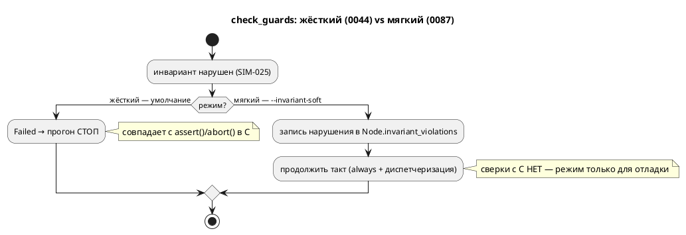

# Фича: Режим «записать и продолжить» при нарушении инварианта

- **Номер:** 0087
- **Статус:** ✅ ГОТОВО
- **Зависит от:** нет (расширяет закрытую 0044; подтверждено анализом)
- **Приоритет / Tier:** Tier 3 (аддитивная отладочная возможность симулятора)
- **Крейт:** `simulation`
- **Связанные issue (анализ):** новая фича (перевод кандидата из `FEATURES.md`)

## Стадии жизненного цикла

Все стадии — **разделы этой карточки**: «Архитектура (ADR)»,
«Анализ», «Разработка», «Тест-план», «Отчёт о тестировании», «Итог».
Отдельным артефактом остаются только исправления —
[`docs/fixes/`](../fixes/README.md) (при необходимости `0087-YY-*`).

## Краткое описание

Ядро [юнит-конструкции языка для симуляции (assert/invariant)](0044-sim-assert-invariant.md) **останавливает** прогон
(`TickResult::Failed`, `SIM-025`) — иначе сверка с C сравнивает несравнимое
(`assert()` → `abort()`).

**Мягкий режим для отладки** (записать нарушение и продолжить прогон) — отдельная
фича: он осмыслен ровно там, где сверки с C нет.

Вынесено закрытой [юнит-конструкции языка для симуляции (assert/invariant)](0044-sim-assert-invariant.md).

> Фича зарегистрирована **2026-07-17** переводом кандидата из `FEATURES.md`.
> Проработана и закрыта **2026-07-22**.

## Архитектура (ADR)

- **Status:** Accepted
- **Date:** 2026-07-22
- **Authors:** Архитектор + Аналитик
- **Related issues:** [Фича](0087-invariant-soft-mode.md); продолжение [юнит-конструкции языка для симуляции (assert/invariant)](0044-sim-assert-invariant.md#архитектура-adr) (инварианты в симуляторе, `SIM-025`)

### Context

Ядро [юнит-конструкции языка для симуляции (assert/invariant)](0044-sim-assert-invariant.md#архитектура-adr) при нарушении инварианта (`invariant Имя
= C;`, Guard-формула) **останавливает** прогон: `Unit::check_guards` возвращает
`TickResult::Failed("нарушен инвариант… (SIM-025)")`, и `runner` завершает симуляцию
`RunResult::EvalFailed`. Так и задумано: это совпадает с порождённым C, где
`assert()` → `abort()`, — иначе потактовая **сверка** симулятора с C сравнивала бы
несравнимое (симулятор идёт дальше, C уже упал).

Но для **отладки** останов на первом же нарушении неудобен: инженер хочет увидеть,
**когда и сколько раз** инвариант нарушается по ходу прогона, не правя модель под
каждый прогон. Такой «мягкий» режим осмыслен **ровно там, где сверки с C нет** — то
есть это отдельная возможность симулятора, не затрагивающая C-конформность.

### Decision Drivers

1. **C-конформность неприкосновенна.** Жёсткий режим (0044) — умолчание и
   **не меняется**: потактовые сверки с C и весь корпус идут через него.
2. **Мягкий режим завершает такт, а не обрывает его.** «Продолжить прогон» значит
   выполнить `always` и диспетчеризацию состояния (иначе состояние не сменится, и
   на следующем такте инвариант снова ложен → **ливлок**). Значит решение hard/soft
   принимается **внутри** такта.
3. **Композиция.** Инварианты проверяет **каждый** дочерний `Node` в своём `tick`;
   нарушения обязаны **всплыть** к `runner` из всего дерева `Unit`.
4. **Не тихо.** Нарушения в мягком режиме печатаются и дают **ненулевой** код
   возврата (это находки, а не «прогон прошёл»). Правило проекта: не молчать.

### Considered Options

#### Option A. `tick_soft` + запись в узел + рекурсивный слив в `runner`

`Unit::tick` остаётся жёстким; логика выносится в `tick_mode(soft)`, добавляется
`tick_soft`. Флаг `soft` протаскивается через `tick_node`/`tick_parallel`/
`tick_sequential` в `check_guards`. При нарушении в мягком режиме `check_guards`
пишет строку в новое поле `UnitKind::Node::invariant_violations` и возвращает `None`
(такт продолжается). `runner` после каждого такта сливает нарушения
`take_invariant_violations` (рекурсивно по дереву — **зеркало** существующего
`take_last_transitions`) и тегирует номером шага.

**Pros:**
- Решение hard/soft — внутри такта (драйвер 2); жёсткий путь байт-в-байт прежний
  (драйвер 1).
- Всплытие из композиции — уже существующим паттерном рекурсивного слива
  (драйвер 3).
- Номер шага знает `runner` (он ведёт цикл) — тег ставится там, где есть контекст.

**Cons:**
- Публичное поле `TickResult` не меняется, но добавляется вариант `RunResult` и
  поле `Node` — минорный бамп API `simulation`.
- `soft` протаскивается через 4 приватных метода (механически).

#### Option B. Проверять инварианты в `runner` **после** такта (в тик не лезть)

`runner` в мягком режиме выключает in-tick проверку и сам вычисляет предикаты
инвариантов после каждого такта.

**Pros:**
- Тик не трогается.

**Cons:**
- `runner` не имеет доступа к предикатам вложенных `Node` (`Guards` живут в узле,
  композиция скрыта за `Rc<RefCell<Unit>>`) — пришлось бы дублировать обход дерева
  и логику `check_guards`. Дублирование = дрейф (два разных ответа на один вопрос).
- Точки проверки инвариантов (до `always`, эталон C) размылись бы.

#### Option C. Единый `Rc<RefCell<Vec>>`-сток, прокинутый в каждый узел на сборке

**Pros:**
- Один сток на всё дерево.

**Cons:**
- Плуминг через `build`/`build_impl`/`build_node` во все узлы ради редкого режима;
  у композитов контексты **раздельные** (каждый `Node` — свой `ModelNodeContext`),
  общего места нет — пришлось бы заводить его специально. Тяжелее A при той же цели.

### Decision

Принимается **Option A**. `Unit::tick` (жёсткий) — неизменный публичный контракт,
через него идут все сверки с C и корпус. Логика — в `tick_mode(&mut self, soft:
bool)`; `tick = tick_mode(false)`, новый `tick_soft = tick_mode(true)`. `soft`
протаскивается в `check_guards`; при нарушении мягкий режим пишет в
`Node.invariant_violations` и **продолжает** такт, жёсткий — `Failed` (как 0044).
**Ошибка вычисления** самого условия (`SIM-0xx`) — всегда `Failed` в обоих режимах
(это не «нарушение инварианта», а недостоверность прогона, драйвер 1/R15 0044).
`runner` сливает нарушения `take_invariant_violations` (рекурсивно, зеркало
`take_last_transitions`), тегирует шагом, возвращает
`RunResult::CompletedWithInvariantViolations`; CLI-флаг `--invariant-soft` печатает
их и даёт ненулевой код (драйвер 4).

### Consequences

#### Положительные

- Отладочный режим: полный список нарушений с номерами шагов за один прогон, без
  правки модели.
- Жёсткий режим и C-конформность не тронуты (умолчание).

#### Отрицательные / Action items

- API `simulation`: новое поле `UnitKind::Node`, новый метод `Unit::tick_soft`/
  `take_invariant_violations`, новый вариант `RunResult` → минорный бамп крейта.
- Все места построения `UnitKind::Node` (builder, state_io, viewport, tests)
  получают новое поле (`Default`).
- Флудинг: инвариант, ложный каждый такт, даёт запись на каждый шаг — это и есть
  отладочная ценность (когда/сколько раз); бюджет шагов ограничивает объём.

#### Acceptance criteria

1. Модель с нарушаемым инвариантом: **жёсткий** режим (умолчание) — стоп на первом
   нарушении (`SIM-025`, как 0044); **мягкий** (`--invariant-soft`) — прогон идёт
   до конца, все нарушения записаны с номерами шагов.
2. Ошибка вычисления условия инварианта — `Failed` в **обоих** режимах (не
   заглушается мягким режимом).
3. Мягкий режим печатает нарушения и даёт ненулевой код возврата при их наличии;
   без нарушений — код 0.
4. Жёсткий режим байт-в-байт прежний: корпус, потактовые сверки с C, все тесты
   зелёные без правок утверждений.
5. Язык `.lam` не меняется (версия языка не растёт); крейт
   `simulation` — минорный бамп.

## Анализ

### Цель и контекст

Добавить симулятору **мягкий режим** проверки инвариантов: при нарушении
`invariant`/Guard-формулы (`SIM-025`) — **записать и продолжить прогон**, вместо
останова (жёсткий режим 0044). Режим осмыслен для отладки, где сверки с C нет; C
при `assert()` → `abort()` останавливается, поэтому мягкий режим намеренно не
участвует в потактовой сверке. Решение — Option A ADR: `tick_soft` + запись в узел +
рекурсивный слив в `runner`.

### Зависимости фичи

- **Зависит от:** **нет.** Ядро инвариантов ([юнит-конструкции языка для симуляции (assert/invariant)](0044-sim-assert-invariant.md))
  закрыто; фича его расширяет. Затрагивает только крейт `simulation`
  (`unit/mod.rs`, `runner.rs`, `bin/simulation.rs`, места построения `Node`).
  `grammar` и язык не трогаются.
- **Влияние на порядок разработки:** не разблокирует других фич; порядок не
  меняется.

### Требования и проверяемые условия

- **R1. Жёсткий режим — умолчание, неизменен.** `Unit::tick()` и весь путь 0044
  байт-в-байт прежние: останов на первом нарушении (`Failed`, `SIM-025`), сверки с
  C через него.
- **R2. Мягкий режим завершает такт.** При нарушении записывается нарушение и
  выполняется остаток такта (`always` + диспетчеризация) — иначе ливлок (состояние
  не сменится, инвариант ложен вечно).
- **R3. Всплытие из композиции.** Нарушения дочерних `Node` собираются рекурсивно
  (`take_invariant_violations`, зеркало `take_last_transitions`).
- **R4. Ошибка вычисления ≠ нарушению.** Ошибка самого условия инварианта
  (`SIM-0xx`) — `Failed` в **обоих** режимах (R15 0044): мягкий режим глушит только
  «инвариант ложен», не «условие не вычислилось».
- **R5. Не тихо.** Мягкий режим печатает нарушения с номерами шагов и даёт
  **ненулевой** код возврата при их наличии; без нарушений — код 0.
- **R6. Версии.** Язык не меняется; крейт `simulation` — минорный бамп
  (новое поле `Node`, метод `tick_soft`, вариант `RunResult`).

### Критерии приёмки и способ проверки

| # | Критерий | Способ проверки |
|---|---|---|
| A1 | Жёсткий: стоп на 1-м нарушении | тест `invariant_hard_stops` (модель с нарушаемым инвариантом → `EvalFailed`/`Failed` на шаге нарушения) |
| A2 | Мягкий: прогон до конца, все нарушения записаны с шагами | тест `invariant_soft_records_and_continues` (N шагов, K нарушений с номерами) |
| A3 | Ошибка вычисления — `Failed` в обоих | тест: сломанное условие инварианта → `Failed` даже под `--invariant-soft` |
| A4 | Композиция: нарушения всех ветвей собраны | тест на композитной модели (нарушение в под-модели всплывает) |
| A5 | Жёсткий режим неизменен | тесты зелёные без правок; корпус/сверки C байт-в-байт |
| A6 | `precheck.sh` зелёный | полный прогон |

### Особенности по обратной функциональности

Аддитивно: умолчание (жёсткий) неизменно; мягкий режим — opt-in флаг
`--invariant-soft`. Ломающее для **API** `simulation`: `UnitKind::Node` (pub(crate))
получает поле; публичный `RunResult` — новый вариант (аддитивно, `#[non_exhaustive]`
не заявлен → технически minor, потребители `match` должны терпеть новый вариант —
внутри крейта единственный потребитель CLI обновляется). Крейт `simulation`
`0.5.0 → 0.6.0` (SemVer minor). `grammar` не трогается.

### Риски и зависимости

- **Риск: ливлок в мягком режиме** (нарушение → ранний выход → состояние не
  сменилось). Снижение: R2 — мягкий режим **не** прерывает такт; тест A2 гоняет N
  шагов и проверяет завершение.
- **Риск: мягкий режим заглушает и ошибки вычисления** (потеря достоверности).
  Снижение: R4 — только «инвариант ложен» записывается; ошибка условия остаётся
  `Failed`; тест A3.
- **Риск: забыто место построения `Node`** (builder/state_io/viewport/tests).
  Снижение: компилятор укажет все места при добавлении поля.
- **Tier:** **Tier 3** (аддитивная отладочная возможность симулятора; спрос
  невысок, ничего не сломано — вынесено из 0044 как отдельная фича).

## Разработка

### Задача

#### Что было

Ядро [юнит-конструкции языка для симуляции (assert/invariant)](0044-sim-assert-invariant.md): нарушение инварианта
(`SIM-025`) **останавливает** прогон (`TickResult::Failed` → `RunResult::EvalFailed`)
— совпадает с `assert()` → `abort()` в C, нужно для потактовой сверки. Для отладки
(«когда и сколько раз нарушается») останов на первом же нарушении неудобен.

#### Что сделано

Реализована **Option A** [ADR](0087-invariant-soft-mode.md#архитектура-adr).

- **Слой `Unit` (`unit/mod.rs`):**
  - `Unit::tick` (жёсткий, публичный, C-конформный) — логика вынесена в
    `tick_mode(&mut self, soft: bool)`; `tick = tick_mode(false)`, новый
    `tick_soft = tick_mode(true)`.
  - `soft` протаскивается через `tick_node` (без изменений) / `tick_parallel` /
    `tick_sequential` в `check_guards(soft)`.
  - `check_guards(soft)`: нарушение (SIM-025) → мягкий режим пишет строку в новое
    поле `UnitKind::Node::invariant_violations` и возвращает `None` (такт
    продолжается); жёсткий — `Some(Failed)` (как 0044). **Ошибка вычисления**
    условия — `Some(Failed)` в **обоих** режимах (R4).
  - `take_invariant_violations(&mut self)` — рекурсивный слив нарушений из дерева
    `Unit` (зеркало `take_last_transitions`).
- **Бегун (`runner.rs`):** поле `soft_invariants` + сеттер `set_invariant_soft`;
  цикл в мягком режиме зовёт `tick_soft`, после такта сливает нарушения и тегирует
  номером шага; новый `RunResult::CompletedWithInvariantViolations { steps,
  terminated, violations }`.
- **CLI (`bin/simulation.rs`):** флаг `--invariant-soft`; печать нарушений с
  шагами; **ненулевой** код возврата при их наличии (не молчим).
- **Места построения `Node`:** builder (реальный путь) + state_io/viewport/tests
  получили `invariant_violations: Vec::new()` (компилятор указал все).

| Стек | Статус |
|---|---|
| `simulation` слой Unit | ✅ tick_soft + запись + рекурсивный слив |
| `simulation` runner/CLI | ✅ флаг, RunResult, код возврата |
| `grammar` / язык | н/п — не трогаются |
| жёсткий режим (0044) / C-конформность | н/п — байт-в-байт неизменны |

#### Проверки

- 6 тестов инвариантов зелёные: 3 жёстких (0044, без правок) + 3 новых мягких:
  `invariant_soft_records_and_continues` (нарушения на шагах 2–5, прогон идёт,
  `c` растёт), `invariant_soft_does_not_swallow_eval_error` (SIM-010 → `Failed` в
  мягком режиме, нарушений 0), `invariant_soft_collects_from_composition`
  (нарушение `PA` под-модели всплыло).
- CLI-проба: жёсткий — стоп на шаге 2 (`SIM-025`, exit 1); мягкий — 5 шагов, 4
  нарушения, exit 1.
- `cargo clippy -p simulation --all-targets -D warnings` → чисто.
- Фикстуры: `invariant_eval_error.lam`, `invariant_composite.lam`.
- Полный `./scripts/precheck.sh` → зелёный (см.
  [отчёт](0087-invariant-soft-mode.md#отчёт-о-тестировании)).

## Тест-план

### Область и цель

Проверить, что мягкий режим (`--invariant-soft`) при нарушении инварианта
**записывает и продолжает** прогон, что жёсткий режим (умолчание, 0044) и
C-конформность неизменны, и что ошибка вычисления условия остаётся `Failed` в обоих
режимах. Фича языка `.lam` не меняет — примеры/контрпримеры языка не
заводятся; контрпримеры здесь — фикстуры с нарушаемым инвариантом.

### Проверки (условие → ожидаемый результат)

| # | Проверка | Предусловие | Ожидаемый результат | Ссылка на R/A |
|---|---|---|---|---|
| T1 | Жёсткий режим: стоп на 1-м нарушении | `invariant_violated.lam`, `tick()` | `Failed(SIM-025 'P')` на шаге 2, `c==1` | R1 / A1 |
| T2 | Мягкий: прогон до конца, нарушения записаны | `invariant_violated.lam`, `tick_soft()`, 5 шагов | не `Failed`; нарушения на шагах 2–5; `c>1` | R2 / A2 |
| T3 | Мягкий: ошибка вычисления → `Failed` | `invariant_eval_error.lam` (индекс за границей) | `Failed(SIM-010)`, нарушений 0 | R4 / A3 |
| T4 | Композиция: нарушение под-модели всплывает | `invariant_composite.lam` | не `Failed`; нарушения с именем `PA` | R3 / A4 |
| T5 | Жёсткий режим неизменен | тесты | `invariant_model_violation_stops_with_sim025` и др. зелёные без правок | R1 / A5 |
| T6 | CLI жёсткий (умолчание) | `simulation … -n 5` | стоп на шаге 2, `SIM-025`, exit≠0 | R1 / A1 |
| T7 | CLI мягкий | `… -n 5 --invariant-soft` | 5 шагов, 4 нарушения печатаются, exit≠0 | R2, R5 / A2 |
| T8 | Полный предкоммит | всё выше | `./scripts/precheck.sh` зелёный | все / A6 |

### Разбивка проверок по функциональности

| Функциональность | T1 | T2 | T3 | T4 | T5 | T6 | T7 | T8 |
|---|---|---|---|---|---|---|---|---|
| слой `Unit` (tick_soft/check_guards) | ✅ | ✅ | ✅ | ✅ | ✅ | — | — | ✅ |
| runner/RunResult | — | — | — | — | — | — | ✅ | ✅ |
| CLI (`--invariant-soft`, код возврата) | — | — | — | — | — | ✅ | ✅ | ✅ |
| жёсткий режим 0044 / C-сверка | ✅ | — | — | — | ✅ | ✅ | — | ✅ |

<!-- Легенда: ✅ пройдено · ❌ провалено · ⬜ не проверялось · — не применимо -->

### Тестовые данные и окружение

- darwin 25.5.0; `cargo test -- --test-threads=1`.
- Фикстуры (`simulation/tests/data/eval/`): `invariant_violated.lam` (0044),
  новые `invariant_eval_error.lam` (индекс за границей → SIM-010),
  `invariant_composite.lam` (нарушение в под-модели композиции).
- CLI-пробы (T6/T7) — бинарник `simulation` на `invariant_violated.lam`.

## Отчёт о тестировании

### Резюме

**Пройдено, фича готова к закрытию (ГОТОВО).** Симулятор получил мягкий режим
инвариантов (`--invariant-soft` / `Unit::tick_soft`): нарушение записывается и
прогон продолжается, вместо останова. Жёсткий режим (умолчание, 0044) и
C-конформность **неизменны** — тесты зелёные без правок. Ошибка вычисления
условия остаётся `Failed` в обоих режимах. Все 8 проверок тест-плана зелёные,
полный `./scripts/precheck.sh` зелёный. Язык не менялся; крейт `simulation`
`0.5.0 → 0.6.0`.

### Окружение

- darwin 25.5.0; `cargo test -- --test-threads=1`.

### Фактические результаты по проверкам

| # | Проверка | Результат | Комментарий |
|---|---|---|---|
| T1 | Жёсткий: стоп на 1-м нарушении | ✅ | `invariant_model_violation_stops_with_sim025` (0044) |
| T2 | Мягкий: прогон до конца, нарушения записаны | ✅ | `invariant_soft_records_and_continues`: шаги 2–5, `c` растёт |
| T3 | Мягкий: ошибка вычисления → `Failed` | ✅ | `invariant_soft_does_not_swallow_eval_error`: SIM-010, 0 нарушений |
| T4 | Композиция: нарушение под-модели всплывает | ✅ | `invariant_soft_collects_from_composition`: имя `PA` |
| T5 | Жёсткий режим неизменен | ✅ | 3 теста зелёные без правок |
| T6 | CLI жёсткий (умолчание) | ✅ | стоп на шаге 2, `SIM-025`, exit 1 |
| T7 | CLI мягкий | ✅ | 5 шагов, 4 нарушения (шаги 2–5), exit 1 |
| T8 | Полный предкоммит | ✅ | `./scripts/precheck.sh` зелёный |

### Результаты по функциональности

- **Слой `Unit`:** `tick_soft`/`tick_mode(soft)`, `check_guards(soft)` (запись vs
  `Failed`), `take_invariant_violations` (рекурсивный слив). Ошибка вычисления —
  `Failed` в обоих режимах.
- **Runner/CLI:** `RunResult::CompletedWithInvariantViolations`, флаг
  `--invariant-soft`, ненулевой код при нарушениях.
- **Жёсткий режим / C-сверка:** не затронуты (умолчание неизменно).

### Примеры и контрпримеры

Язык не меняется — примеров языка нет. Контрпримеры — фикстуры с
нарушаемым инвариантом: `invariant_violated.lam` (0044, модельный `P`),
`invariant_composite.lam` (нарушение в под-модели), `invariant_eval_error.lam`
(условие само не вычисляется → `Failed` даже в мягком режиме).

### Выводы и дальнейшие шаги

Дефектов не найдено; исправления не требуются. Мягкий режим намеренно **не** участвует в
потактовой сверке с C (C бы уже упал) — это его граница применимости, а не дефект.

**Вердикт: ГОТОВО.**

## Итог (что сделано)

**Закрыта 2026-07-22 (`ГОТОВО`).** Реализована **Option A**
[ADR](0087-invariant-soft-mode.md#архитектура-adr): симулятор получил **мягкий режим**
инвариантов. `Unit::tick` (жёсткий, C-конформный) неизменен; добавлены
`tick_soft`/`tick_mode(soft)`. При нарушении инварианта мягкий режим **записывает**
его в `Node.invariant_violations` и **продолжает** такт (иначе ливлок), жёсткий —
`Failed`/`SIM-025` (как 0044). **Ошибка вычисления** условия — `Failed` в **обоих**
режимах (R4). Нарушения всплывают из композиции рекурсивным `take_invariant_violations`
(зеркало `take_last_transitions`). Бегун: флаг `--invariant-soft`,
`RunResult::CompletedWithInvariantViolations`, печать с номерами шагов, **ненулевой**
код возврата (нарушения — находки, не молчим).

**Аддитивно:** умолчание — жёсткий режим 0044, неизменен; корпус и
потактовые сверки с C байт-в-байт прежние. Мягкий режим намеренно **не** участвует
в сверке с C (C бы уже упал) — граница применимости. Язык `.lam` не менялся; крейт `simulation` `0.5.0 → 0.6.0` (новое поле `Node`, метод
`tick_soft`, вариант `RunResult`).

Детали — [анализ](0087-invariant-soft-mode.md#анализ),
[разработка](0087-invariant-soft-mode.md#разработка),
[тест-план](0087-invariant-soft-mode.md#тест-план),
[отчёт](0087-invariant-soft-mode.md#отчёт-о-тестировании). Дефектов не найдено.
