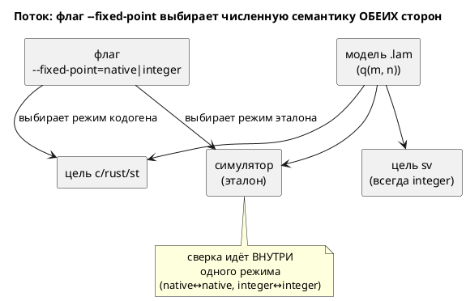

# Фича: Q-арифметика через нативный float и флаг генерации (embedded ↔ float)

- **Номер:** 0096
- **Статус:** **ГОТОВО** (2026-07-19; все задачи…04 закрыты, `precheck.sh` зелёный)
- **Зависит от:** **[fixed-point Q(m.n) как тип языка](0061-fixed-point-type.md)** (жёстко — расширяет уже
  реализованную Q-арифметику; **пересматривает** решение ADR об Option B).
  Порядок: строго **после** закрытия 0061 (её задача).
- **Приоритет / Tier:** **Tier 3** (спрос низкий — 0 `q`/`float` в корпусе; как и
  0061). Риск дизайна высок: затрагивает **инвариант побитовой сверки** ADR.
- **Крейт:** `grammar` (флаг CLI + режим кодогена целей `c`/`rust`/`st`),
  `simulation` (эталон обязан уметь оба режима — иначе сверять float-режим не с чем)
- **Связанные issue (анализ):** новая фича (запрос заказчика 2026-07-19); **прямо
  пересматривает** отвергнутый [ADR](0061-fixed-point-type.md#архитектура-adr) Option B

## Стадии жизненного цикла

Все стадии — **разделы этой карточки**: «Архитектура (ADR)»,
«Анализ», «Разработка», «Тест-план», «Отчёт о тестировании», «Итог».
Отдельным артефактом остаются только исправления —
[`docs/fixes/`](../fixes/README.md) (при необходимости `0096-YY-*`).

## Краткое описание

Цель фичи — сделать работу с **плавающей точкой прозрачной**: автор пишет
`float`, а компилятор выбирает представление по **глобальному параметру файла** и
**цели**. Уточнение заказчика (2026-07-19):

- **Глобальный параметр точности Q на весь `.lam`** — при компиляции задаётся
  `(m, n)` (например `10.22`); везде, где нужен `float`, подставляется `q(m, n)` с
  этой точностью.
- **Цель `sv`** (нативного `float` в синтезируемом RTL **нет** — сегодня `SV-003`):
  `float` **автоматически** реализуется как `q(m, n)` с глобальной точностью —
  фича **снимает `SV-003` для `float`**, делая вещественные модели синтезируемыми
  без ручного переписывания в `q`.
- **Цели `c`/`rust`/`st`** (нативный `float` есть — `double`/`f64`/`LREAL`): по
  умолчанию **нативная** плавающая точка; целочисленный Q-путь (та же глобальная
  точность) — **только по флагу** явного использования Q (embedded без FPU).

Тип `q(m, n)` из [fixed-point Q(m.n) как тип языка](0061-fixed-point-type.md) **остаётся** для случаев, где
автор хочет **точный** формат в самом типе; `float` — «прозрачный» путь, чьё
представление задаётся глобально и целью, а не в тексте типа.

Сегодня  `q(m, n)` компилируется в **целочисленную** Q-арифметику во
всех целях единообразно, ради побитовой сверки; `float` в `sv` — `SV-003`. Эта
фича вводит **зависимость представления `float` от цели и флага** — то, что ADR отверг (Option B) под инвариантом побитовой сверки.

**Это прямо пересматривает [ADR](0061-fixed-point-type.md#архитектура-adr):** тот
**отверг** Option B «формат/режим — параметр цели» (принцип «CLI не меняет логику
автомата») и поставил **драйвер 1** — численная семантика **обязана**
совпадать у симулятора и всех целей **побитово**. Флаг, меняющий арифметику,
нарушает оба пункта, **если** оставить симулятор односемантичным. Разрешение (см.
[ADR](0096-fixed-point-native-float.md#архитектура-adr)): флаг переключает **обе**
стороны сверки — и цель, и эталон-симулятор, — то есть `float`-режим и
`integer`-режим становятся двумя **явно выбираемыми** численными семантиками, а
побитовая сверка ведётся **внутри одного режима**.

> Фича зарегистрирована по запросу заказчика (2026-07-19); далее проходит
> жизненный цикл по своду. **Стадия: проработка** — реализация не начата.

## Открытые вопросы для ADR/анализа

> **Решено заказчиком (2026-07-19):** вопрос 1 → **CLI-флаг** (да); вопрос 6 →
> без флага `sv` для `float` остаётся **`SV-003`** (да, вопрос 2 переформулирован).

1. ✅ **Источник глобальной точности: CLI-флаг** (не прагма). Заказчик: «задаю при
   компиляции». Прагма меняла бы **язык** (рост версии); CLI — свойство
   генерации, как `--float-width` 0029.
2. ✅ **Режим для FP-целей — второй флаг** (заказчик 2026-07-19). `--float-as-q=M.N`
   задаёт точность (всегда применяется к `sv`); к `c`/`rust`/`st` Q-путь
   применяется **только** с `--float-embedded`. Без него — native.
3. ✅ **Симулятор двухрежимен по `float`** (заказчик 2026-07-19 — «да»).
   `double`/`f64`/`LREAL` дают иное округление, чем Q floor-к-−∞ и wraparound,
   поэтому эталон обязан уметь **оба** представления `float`, иначе q-режим (и весь
   `sv`, где float→q) **нечем** верифицировать. Главный риск реализации (драйвер 2).
4. **Точность/переполнение native-float не выражают формат.** `float` в `double`
   не floor'ит и не wraparound'ит. Значит `native`-трасса и `q`-трасса **разные**
   — это **две** модели одного текста. Как это подать автору, чтобы он не считал
   их эквивалентными?
5. **Сосуществование `float` и явного `q(m, n)` (0061) в одном файле.** Автор
   пишет и то, и другое. `float`→q берёт **глобальную** точность, `q(m, n)` —
   **свою**. Смешение (`SE-059`) между ними? Приведения?
6. **Значение по умолчанию `--float-as-q`.** Если не задан — `sv` по-прежнему
   `SV-003` (нельзя угадать точность — ровно довод, по которому 0045/0061
   отвергли «генератор угадывает Q16.16»). То есть **без флага `sv` для `float`
   остаётся `SV-003`** — флаг и есть тот «выбор формата автором», которого
   требовал ADR.

## Архитектура (ADR)

- **Status:** Accepted (утверждён заказчиком 2026-07-19 — вопросы 1–4 подтверждены;
  прямо пересматривает ADR Option B/драйвер-принцип 0042)
- **Date:** 2026-07-19
- **Authors:** Архитектор + Дизайнер языка
- **Related issues:** [Фича](0096-fixed-point-native-float.md);
  **пересматривает** [ADR](0061-fixed-point-type.md#архитектура-adr) (Option B, драйвер 1)

### Context

[fixed-point Q(m.n) как тип языка](0061-fixed-point-type.md) дала языку тип `q(m, n)` и
реализовала его как **целочисленную** Q-арифметику во всех пяти реализациях
(симулятор + `c`/`rust`/`st`/`sv`), **побитово** согласованную. Это было
**главным** решением ADR (драйвер 1): без побитового совпадения сверка
проваливается by design, и fixed-point теряет смысл. ADR при этом **явно
отверг Option B** — «формат/режим как параметр цели» — по принципу «CLI не должен
менять логику автомата» (записан по фиче про `--define`).

Запрос заказчика (2026-07-19), уточнённый: сделать работу с плавающей точкой
**прозрачной**. Автор пишет `float`, а представление выбирается при компиляции —
**глобальным параметром точности** файла и **целью**:

- **Глобальная Q-точность** `(m, n)` задаётся при компиляции (например `10.22`).
  Везде, где нужен `float`, подставляется `q(m, n)`.
- **`sv`** (нативного `float` нет — сегодня `SV-003`): `float` → `q(m, n)`
  **автоматически** при заданной точности → **`SV-003` для `float` снимается**,
  вещественные модели становятся синтезируемыми **без ручного** переписывания в
  `q`. Именно это закрывает изначальную боль (0045: «RTL не выражает дробь»).
- **`c`/`rust`/`st`** (нативный `float` есть — `double`/`f64`/`LREAL`, все
  64-битные, следствие `--float-width=64` фичи): по умолчанию **нативный**
  `float`; целочисленный Q-путь (та же глобальная точность) — **только по флагу**
  явного использования Q (embedded без FPU).

Тип `q(m, n)` из 0061 **остаётся** для точного формата в самом типе; `float` —
«прозрачный» путь, чьё представление задаёт флаг и цель.

Без заданной точности `sv` для `float` **остаётся `SV-003`**: угадывать формат
(Q16.16) генератору **нельзя** — это ровно тот довод, по которому 0045 и 0061
отвергли автоугадывание. Флаг и есть требуемый ADR «выбор формата автором».

#### Сила, которую нельзя обойти: сверка требует общего эталона

`double` (даже 64-битный) считает **иначе**, чем Q-целые: нет floor-к-−∞ у `*`,
нет wraparound, диапазон не ограничен `m`. Значит трасса `float`-режима **не**
совпадёт с трассой `integer`-режима — это **две разные численные семантики**.
Если оставить симулятор односемантичным (только Q-целые, как в 0061), то
`float`-режим целей **нечем верифицировать** — ровно тот провал, ради избегания
которого 0061 и держала единый Q. Поэтому флаг обязан переключать **обе** стороны:
и цель, и эталон-симулятор.

### Decision Drivers

1. **Спрос заказчика против инварианта.** Заказчик прямо просит нативный
   float + флаг; ADR прямо это отверг. Разрешение конфликта — суть этого ADR.
2. **Побитовая сверка обязана уцелеть** (унаследовано от 0061, драйвер 1). Любой
   режим, у которого нет эталона в симуляторе, — молчаливо неверный код.
3. **CLI не должен менять логику автомата** (принцип 0042). Флаг, меняющий
   **численную** семантику, этот принцип задевает — надо либо обосновать
   исключение, либо ограничить область флага.
4. **Embedded без FPU обязан получить целочисленный путь** — иначе фича бесполезна
   для своей главной аудитории (микроконтроллеры), а именно они мотивируют 0061.
5. **`float`-режим не должен молча терять смысл формата** `m`/`n` (диапазон,
   округление) без явного решения (иначе `q(8,8)` и `q(16,16)` неотличимы).

### Considered Options

#### Option A. Прозрачный `float`: глобальная Q-точность (флаг) + двухрежимный симулятор

Автор пишет `float`; представление выбирается флагами генерации, а **симулятор
умеет оба**. `--float-as-q=m.n` задаёт глобальную точность: `sv` подставляет
`q(m, n)` вместо `SV-003`; `c`/`rust`/`st` остаются native, а с `--float-embedded`
идут в целочисленный Q(m, n). Симулятор считает `float` как `f64` **или** как
`q(m, n)` — по режиму сверяемой цели. Сверка — **внутри** режима.

**Pros:**
- Даёт заказчику ровно запрошенное; embedded сохраняет целочисленный путь.
- **Драйвер 2 уцелел:** у каждого режима есть эталон в симуляторе → сверка
  возможна by construction, а не «by design провалена».
- Разделение честное: `native` и `integer` — **разные** модели, автор выбирает
  явно; неоднозначности «одно имя — две семантики» нет (в отличие от 0061 Option C).

**Cons:**
- **Задевает драйвер 3** (принцип 0042): одна модель считает по-разному от флага
  сборки. Смягчение: флаг выбирает **профиль исполнения** (FPU vs без FPU), а не
  прячет семантику в CLI молча — оба режима документированы и оба сверяются.
- **Двойная работа сверки:** conformance-наборы нужны для **обоих** режимов ×
  каждая цель.
- Симулятор перестаёт быть единственным эталоном — он теперь **двухрежимный**.

#### Option B. Всегда native для float-целей (без флага), sv — integer

**Pros:** нет флага (драйвер 3 не задет).

**Cons:**
- **Убивает embedded** (драйвер 4): `c-hal` для МК без FPU получил бы `double` —
  именно то, ради ухода от чего заведена 0061. Неприемлемо.

#### Option C. Статус-кво (0061, только integer)

**Pros:** ничего не менять; инвариант цел.

**Cons:**
- Отклоняет прямой запрос заказчика (драйвер 1). Требует явного «нет».

#### Option D. `native`-режим эмулирует формат `q` в float (округление/диапазон)

`double`-путь воспроизводит floor-к-−∞ и wraparound `q` поверх `f64`.

**Pros:** трассы `native` и `integer` совпали бы → один эталон.

**Cons:**
- Дорого и противоречиво: эмулировать целочисленный wraparound в `double` —
  это и есть Q-арифметика, только медленнее и без выигрыша FPU. Смысл флага
  (нативная скорость/точность) теряется. Отвергается.

### Decision

Предлагается **Option A** — при условии утверждения заказчиком, поскольку он
**сознательно пересматривает** ADR (драйвер 1 сохраняется, драйвер-принцип
[инъекция define'ов для адресов (--define)](0042-address-defines.md) — ослабляется явно и обоснованно).

**Нормативные положения (проект решения, на утверждение):**

1. **Глобальная Q-точность — флаг CLI** `--float-as-q=<m>.<n>` (свойство
   **генерации**, как `--float-width` 0029, а не языка → версия не растёт). Прагма-в-файле отклонена: она меняла бы **язык** (рост версии) и
   привязывала бы формат к тексту, тогда как заказчик задаёт его «при компиляции».
   ✅ **Подтверждено заказчиком 2026-07-19** (вопрос 1 карточки — «да»).
2. **`float` без флага — прежнее поведение** (обратная совместимость): `c` →
   `double`, `rust` → `f64`, `st` → `LREAL`, **`sv` → `SV-003`**. Корпус
   байт-в-байт неизменен (0 `float`). ✅ **Подтверждено заказчиком 2026-07-19**
   (вопрос 2 — «да»): без точности угадывать формат нельзя, флаг = выбор автором.
3. **`sv` + `--float-as-q=m.n`:** каждый `float` → `q(m, n)` (Q-путь 0061-04);
   `SV-003` для `float` **снимается**. Это и есть цель фичи.
4. **`c`/`rust`/`st` + `--float-as-q=m.n`:** по умолчанию **всё ещё нативный**
   `float` (точность влияет только на `sv`). Целочисленный Q-путь включается
   **вторым** флагом `--float-embedded`: тогда `float` → `q(m, n)` целочисленно
   (путь 0061-03). Без него — native. ✅ **Подтверждено заказчиком 2026-07-19**
   (вопрос 3 — «второй флаг»): `--float-as-q` не переключает `c`/`rust`/`st`
   молча, Q-путь для них — явный opt-in.
5. **Симулятор двухрежимен по `float`:** считает `float` либо как `f64` (native),
   либо как `q(m, n)` (когда цель сверки в Q-режиме). Режим прокидывается в
   `eval`. Иначе `sv`/embedded-путь **нечем** верифицировать (драйвер 2).
   ✅ **Подтверждено заказчиком 2026-07-19** (вопрос 4 — «да»).
6. **native-`float` и Q-`float` — разные численные семантики** (округление,
   диапазон). Сверка побитовая **внутри** режима: native↔native (биты f64),
   Q↔Q (repr). Автору сообщается (док), что флаг меняет **модель**, а не только код.
7. **Явный `q(m, n)` (0061) не тронут:** он всегда целочисленный Q во всех целях
   (включая `sv` без флага). `--float-as-q` управляет **только** типом `float`.
8. **Версия языка не меняется** (флаги — свойство генерации; `float`/`q`
   синтаксически прежние).

### Consequences

#### Положительные

- Заказчик получает нативный float для FPU-целей и целочисленный путь для embedded.
- Побитовая сверка сохранена **в каждом режиме** (драйвер 2).
- Явный выбор семантики автором — без тихого расхождения.

#### Отрицательные / Action items

- **A-1. Двухрежимный симулятор.** `eval::fixed` обязан считать `q` и как repr, и
  как `f64` — режим прокидывается в вычислитель. Наибольший риск: рассинхрон
  режимов эталона и цели даст молчаливо неверную сверку.
- **A-2. Сверка ×2.** Каждый `conformance_{c,rust,st}` — в обоих режимах.
- **A-3. Принцип 0042 ослаблен** — задокументировать в `CLAUDE.md`, что
  `--fixed-point` — **сознательное** исключение (профиль FPU/embedded), в отличие
  от `--define`, который логику не меняет.
- **A-4. `sv` асимметрична** — предупреждение вместо тихого игнорирования флага.
- **A-5. Смешение `q`/`float` (`SE-059`)** в `native`-режиме, возможно, стоит
  ослабить (в `f64` они однотипны) — решить в анализе; по умолчанию **оставить**
  запрет (меньше сюрпризов).

#### Acceptance criteria

1. **A1.** Без флагов: `c`→`double`, `rust`→`f64`, `st`→`LREAL`, `sv`→`SV-003`;
   корпус `examples/generated` **байт-в-байт** прежний.
2. **A2.** `--float-as-q=10.22` + цель `sv`: каждый `float` → `q(10, 22)`
   (`logic signed [31:0]`), модуль **синтезируется** (verilator+yosys); `SV-003`
   для `float` **не** срабатывает.
3. **A3.** `--float-as-q=10.22` + `c`/`rust`/`st` **без** `--float-embedded`:
   вывод **всё ещё** нативный (`double`/`f64`/`LREAL`) — точность влияет лишь на `sv`.
4. **A4.** `--float-as-q=10.22 --float-embedded` + `c`/`rust`/`st`: `float` →
   `q(10, 22)` целочисленно; **побитовая** сверка с симулятором в Q-режиме.
5. **A5.** Симулятор двухрежимен: `float` считается как `f64` (native) либо
   `q(m, n)`; сверка `sv`↔Q-симулятор **побитовая** (repr).
6. **A6.** Явный `q(m, n)` (0061) не зависит от флагов — всегда целочисленный Q.
7. **A7.** `CLAUDE.md` фиксирует: `--float-as-q`/`--float-embedded` **сознательно**
   меняют численную семантику (профиль FPU/embedded/RTL), в отличие от `--define`
   (0042), который логику не меняет.
8. **A8.** README документирует прозрачный `float` с примерами.

## Анализ

### Цель и контекст

Сделать `float` **прозрачным**: автор пишет вещественный тип, а представление
выбирается при компиляции глобальной точностью `q(m, n)` и целью. Главный выигрыш —
`sv`: вещественные модели становятся синтезируемыми без ручного переписывания в
`q` (снятие `SV-003` для `float`). Для `c`/`rust`/`st` — native по умолчанию,
целочисленный Q по флагу (embedded). Дизайн — [ADR](0096-fixed-point-native-float.md#архитектура-adr)
(Option A). Фича **сознательно пересматривает** [ADR](0061-fixed-point-type.md#архитектура-adr)
(Option B/драйвер 1) с сохранением инварианта побитовой сверки **внутри режима**.

### Зависимости фичи

- **Зависит от:** **[fixed-point Q(m.n) как тип языка](0061-fixed-point-type.md)** (жёстко) — вся
  Q-арифметика (тип `Fixed`, `eval::fixed`, кодоген `q` в 5 целях, `fixed_storage_bits`)
  реализована ею. `float`→q переиспользует **готовые** пути задач (c/rust/st)
  и 0061-04 (sv). Без закрытой 0061 делать нечего.
- **Влияние на порядок:** брать **строго после** закрытия 0061.
  Ничего не разблокирует (Tier 3, лист графа). Пока 0061 открыта → **ЗАБЛОКИРОВАНА**.

### Требования и проверяемые условия

- **R1. Флаг глобальной точности.** `--float-as-q=m.n` парсится (границы `m ≥ 1`,
  `n ≥ 1`, `m + n ≤ 64` — свод ADR); неверный формат → диагностика CLI.
- **R2. `sv` подставляет q.** При флаге каждый `float` в `sv` → `q(m, n)` (тип +
  арифметика 0061-04); `SV-003` для `float` **не** срабатывает; модуль синтезируем.
- **R3. Без флага — статус-кво.** `c`→`double`, `rust`→`f64`, `st`→`LREAL`, `sv`→
  `SV-003`; корпус (0 `float`) байт-в-байт неизменен.
- **R4. `c`/`rust`/`st` native по умолчанию** даже с `--float-as-q` (точность —
  только для `sv`); Q-путь — вторым флагом `--float-embedded`.
- **R5. Двухрежимный эталон.** Симулятор считает `float` как `f64` **или** `q(m, n)`;
  сверка `sv`/embedded ведётся против Q-режима эталона — **побитово** (repr).
- **R6. Явный `q(m, n)` (0061) не зависит от флагов** — всегда целочисленный Q.
- **R7. Численная семантика режимов различна и документирована** (native ≠ Q):
  автор не должен считать трассы эквивалентными.

### Критерии приёмки и способ проверки

| # | Критерий | Способ проверки |
|---|---|---|
| A1 | Корпус без флага неизменен | `git diff examples/generated` пуст |
| A2 | `sv`+`--float-as-q=10.22`: `float`→`q(10,22)`, синтезируется | зонд вывода + verilator **и** yosys; `SV-003` не сработал |
| A3 | `c`/`rust`/`st`+`--float-as-q` без embedded — native | зонд: `double`/`f64`/`LREAL` в выводе |
| A4 | `+--float-embedded` — Q-путь, побитово | `conformance_{c,rust,st}` в Q-режиме float |
| A5 | Симулятор двухрежимен, `sv`-сверка побитовая | `conformance_sv` на float-модели (q-режим эталона) |
| A6 | Явный `q(m,n)` не задет флагами | сверка 0061 (integer) не меняется |
| A7 | Неверная точность → диагностика | `--float-as-q=40.40`/`0.8` → ошибка CLI |
| A8 | Док принципа 0042 | `CLAUDE.md` фиксирует осознанное ослабление |

### Особенности по обратной функциональности

- **Обратная совместимость абсолютна без флагов** (R3): фича добавляет только
  поведение под новыми флагами. (аддитивность) соблюдено.
- **Замер сегодня:** `grep float examples/*.lam` → **0** (как у 0061). Значит
  доказывать не на чем без примера — обязателен **пример-регулятор на `float`**,
  собираемый под `sv` (снятие `SV-003`) со сценарным контрактом (класс дыры в
  покрытии).

### Риски и зависимости

- **Риск (высокий): рассинхрон режимов эталона и цели** → молчаливо неверная
  сверка. Снижается контролем направления (как 0068): мутация «эталон в native, цель
  в Q» обязана **завалить** сверку.
- **Риск: `native`-float в `sv` по ошибке** → `SV-003`/несинтез. Снижается тем, что
  `sv` игнорирует native by construction (float→q обязателен при флаге).
- **Риск: размывание принципа 0042.** Снижается явной записью в `CLAUDE.md` и тем,
  что флаг **документирован** и **сверяется** (не «тихо меняет логику»).
- **Зависимость:** 0061 (жёсткая). Смежно — кандидат `SV-009` (0064): float→q в
  `sv` c делением потянет аппаратный делитель.

<!-- свод: при большом объёме аналитику декомпозировать на подзадачи
     docs/analyze/0096-YY-fixed-point-native-float.md (как в разработке), а этот файл оставить обзором. -->

## Разработка

### Задача

> **Задача реализована** (2026-07-19); 0061 закрыта. Ниже — декомпозиция
> фичи и что сделано в первой задаче.

#### Декомпозиция фичи (намечено)

| Задача | Объём |
|---|---|
| **0096-01** | CLI-флаги `--float-as-q=m.n` и `--float-embedded`: разбор, валидация границ (свод ADR), прокидывание в `GenerateOptions`. Пока **без** влияния на кодоген (инфраструктура) |
| **0096-02** | Цель `sv`: `float` → `q(m, n)` глобальной точности (переиспользует 0061-04); снятие `SV-003` для `float`; `conformance_sv` в float-режиме + проверки verilator/yosys |
| **0096-03** | Симулятор двухрежимный (`float` как `f64` / `q(m, n)`) + `c`/`rust`/`st` embedded-путь `float`→q (переиспользует 0061-03); `conformance_{c,rust,st}` в Q-режиме; контроль направления (T9) |
| **0096-04** | Пример-регулятор на `float` (синтезируем под `sv`), README, `CLAUDE.md` (ослабление 0042), отчёт — закрытие фичи |

#### Задача: CLI-флаги (инфраструктура)

##### Что было

`GenerateOptions` (`grammar/src/generator/mod.rs`) несёт `hal`, `address_map`,
`float_width` (0029). Флага точности fixed-point для `float` нет; `--float-width`
задаёт лишь ширину нативного float (32/64).

##### Что сделано

- `GenerateOptions` (`generator/mod.rs`): поля `float_as_q: Option<(u8, u8)>`,
  `float_embedded: bool` (`new`/`Default` — `None`/`false`).
- `lamc.rs`: разбор `--float-as-q=<m>.<n>` (обе формы) и `--float-embedded`;
  `parse_float_as_q` валидирует границы свод ADR (`m ≥ 1`, `n ≥ 1`,
  `m + n ≤ 64`) и формат — иначе **ошибка CLI**, а не молчаливое умолчание (T3).
  Прокидывание в `GenerateOptions` (`generate_options`), строки help.
- Кодоген **не тронут**: вывод байт-в-байт прежний (T1). Поведение включают
  0096-02/03.

`lamc.rs` (монолитный CLI, уже в реестре размера) вырос на CLI-флаги →
baseline синхронизирован; **вынос парсера аргументов в подмодуль** — отдельный
кандидат (тесты флагов зовут `parse_compile_args`, поэтому точечно не выносятся).

##### Проверки

- `cargo build --bin lamc` ✅; юнит-тесты `parse_float_as_q_valid`,
  `float_as_q_defaults_to_none`, `float_as_q_rejects_out_of_bounds_and_bad_format`,
  `parse_float_embedded_flag` (валид/умолчание/контрпримеры T2/T3) — зелёные.
- `git diff examples/generated` пуст (T1) ✅.

### Задача

> **Задача реализована** (2026-07-19). Ниже — что сделано и почему так.

#### Что было

Задача завела флаги `--float-as-q=m.n` / `--float-embedded`
(`GenerateOptions.float_as_q`, `float_embedded`), **не трогая кодоген**. Цель `sv`
на `float` давала `SV-003` (в синтезируемом RTL плавающей точки нет).

#### Что сделано

##### Трансформация `float → q(m, n)` (новый модуль `semantic/lower_float.rs`)

Единый мутирующий проход `lower_float_to_fixed(model, m, n)` над `ModelNode`
**перед** генерацией. Заменяет `TypeNode::Rational → Fixed{m,n}` и понижает
литерал-инициализатор `float`-переменной в `Number(repr)`, переиспользуя всю
Q-инфраструктуру 0061 (`type_node::lower_fixed_var`/`lower_fixed_literal`, кодоген
`sv_fixed`, эталон `eval::fixed`).

**Точки применения (0096-02):**

- `lib.rs::compile_to_sv` — при `options.float_as_q == Some((m, n))` (для `sv`
  флаг применяется **всегда**, не требует `--float-embedded`).
- Эталон-симулятор — тот же проход над моделью перед `build_unit` (conformance-тест
  `simulate_trace_float_q`). Так сверка идёт **внутри** Q-режима (ADR, драйвер 2).

**Что понижается:**

| Позиция | Тип | Литерал |
|---|---|---|
| `variables`-map (объявления) | `Rational → Fixed` | понижается (инициализатор, `lower_fixed_var`) |
| `Rc`-ячейки переменных в выражениях/условиях | `Rational → Fixed` | — (тип нужен `fixed_format`/`extract_type`) |
| цель `Cast`, params/ret функций, локальные `var` | `Rational → Fixed` | — |
| литералы `Rational` в **телах** | — | **не трогаются** |

##### Ключевые засады (и как сняты)

1. **Переменная в двух представлениях.** `VariableNode` — owned в
   `model.variables` (объявления/reset) **и** за `Rc<RefCell>` в
   `ExpressionNode::Variable`/`ConditionNode::Variable` (тип для `fixed_format`).
   Проход мутирует **оба**: иначе объявление `q`, а арифметика `float` (`*` без
   сдвига) — молча неверный код. Контроль — юнит-тест `variable_cell_in_body_is_retyped`.
2. **Идемпотентность.** `lower_fixed_var` понизила бы уже понижённый `Number(repr)`
   **ещё раз** (трактуя repr как целое → `repr · 2ⁿ`, вне диапазона → `SE-058`).
   Проверка: инициализатор понижается **только** если исходный тип был `Rational`.
   Тот же проверка защищает **явный** `q(m, n)` 0061 (его инициализатор уже понижён на
   этапе построения). Контроль — `transformation_is_idempotent`.
3. **Литерал в теле арифметики не понижается.** Симулятор `eval::fixed::binary`
   требует **оба** операнда `Fixed`; SV трактует `Number` как **сырой repr**.
   Понизь мы `x + 1.5` → `Fixed + Number(384)`, SV посчитал бы (repr 384 = 1.5),
   а симулятор упал бы (mismatch) — расхождение. Поэтому литералы тел оставлены
   `Rational` (громкая `SV-003`, а не тихий расчёт), тела пишутся на переменных
   (образец — `regulator`). Паритет с явным `q` 0061 (тот тоже не понижает тела).
4. **Смешение `float`/`q` уже запрещено.** `float`(Rational) в арифметике с явным
   `q`(Fixed) даёт `SE-059` **на этапе validate** (до трансформации) — поэтому
   после validate `float`-арифметика не смешана с `q`, и понижение безопасно.
5. **Рёбра `ref` — `Unresolved(ast::Condition)`** (инвариант проекта): кодоген
   разрешает их против уже понижённой `variables`-map, поэтому проход их не трогает
   (и обход `references[].object` создал бы цикл по состояниям).

#### Проверки (тест-план)

| # | Проверка | Тест / способ | Статус |
|---|---|---|---|
| T1 | Корпус без флагов неизменен | `git diff examples/generated` пуст (флаг не задаётся при обычной генерации) | ✅ |
| T4/T7 | `sv`: `float`→q(8,8), синтез, **побитовая** сверка | `conformance_sv_tests::float_as_q_matches_generated_sv` (verilator; трасса = явная q-версия `-768,-384,-2,510`) | ✅ |
| T9 | Контроль направления: без флага — `SV-003` | `conformance_sv_tests::float_without_flag_is_sv003` | ✅ |
| — | Трансформация корректна и идемпотентна | 5 юнит-тестов `semantic::lower_float::tests` | ✅ |

**Зонд вывода** (`lamc -t sv --float-as-q=8.8` на фикстуре): `logic signed [15:0]`,
`* … >>> 8` (floor у `*`), `<<< 8 / …` (деление), инициализаторы-repr
(`x <= -384`, `two <= 512`, `tiny <= 1`) — структурно **идентично** явной
q(8,8)-модели, поэтому синтезируемость под yosys наследуется от уже-гейченного `q`
0061.

#### Осталось (0096-03/04)

- **0096-03:** цели `c`/`rust`/`st` embedded-путь `float→q` при `--float-embedded`;
  двухрежимный эталон для них; `conformance_{c,rust,st}` в Q-режиме; контроль T9 для них.
- **0096-04:** корпусной пример-регулятор на `float` (синтезируем под `sv`, с
  yosys-проверкой в `precheck.sh` и сценарным контрактом), README, `CLAUDE.md`
  (ослабление 0042, A-7), отчёт — закрытие фичи.

### Задача

> **Задача реализована** (2026-07-19). Ниже — что сделано.

#### Что было

Задача применила трансформацию `float → q(m, n)`
(`semantic::lower_float`) к цели `sv`. Цели `c`/`rust`/`st` её не вызывали — на
`float` давали нативный `double`/`f64`/`LREAL` **всегда**.

#### Что сделано

##### Точки применения (embedded-проверка)

Общий помощник `lib.rs::apply_float_lowering(model, options, embedded_gate)`:
трансформация применяется при `options.float_as_q == Some((m, n))` **и**
(`embedded_gate == false` **или** `options.float_embedded == true`). Вызовы:

| Цель | Функция | `embedded_gate` |
|---|---|---|
| `sv` | `compile_to_sv` | `false` (флаг применяется всегда, 0096-02) |
| `c` | `compile_to_c` | `true` |
| `c-hal` | `compile_to_c_hal` | `true` (основная embedded-цель) |
| `st` | `compile_to_st` | `true` |
| `st-at` | `compile_to_st_at` | `true` |
| `rust` | `compile_to_rust` | `true` |

Итог: `c`/`rust`/`st` без `--float-embedded` — прежний native (`double`/`f64`/
`LREAL`); с `--float-embedded` + `--float-as-q=m.n` — целочисленный `q(m, n)`
(reuse 0061 кодогена `c_expr/fixed`, `rust_fixed`, `st_fixed`).

**Зонд** (`--float-as-q=8.8 --float-embedded`): `c` → `int16_t acc`, `rust` →
`acc: i16` + `(x as i128 * two as i128) >> 8`, `st` → `acc : INT` +
`LAM_Q_FLOORDIV(...)`. Без флага — `double`/`f64`/`LREAL`.

##### Сверки (тест-план)

Трансформация даёт **тот же** AST, что и явный `q(m, n)`, поэтому per-target
Q-кодоген уже проверен. Проверяем, что float-путь его действительно даёт:

| Цель | Тест | Способ |
|---|---|---|
| `c` | `conformance_c_tests::float_embedded_q_matches_generated_c` | **потактовая** сверка симулятора (Q-режим) и порождённого C (`cc`), трасса = явная q-версия (`-768,-384,-2,510`) |
| `rust` | `conformance_rust_tests::float_embedded_matches_explicit_q_rust` | **byte-equality**: вывод float+embedded == вывод q-двойника (одинаковый basename) |
| `st` | `conformance_st_tests::float_embedded_matches_explicit_q_st` | **byte-equality** (то же) |

**Почему rust/st — byte-equality, а не runtime.** У цели `rust` поля модели
приватны, а q-**выходной порт** не поддержан (`RS-016`: порт — только бит/число),
поэтому Q-модель без портов время выполнения-наблюдать нечем. Byte-equality с проверенным
q-двойником (`conformance_float_q_twin.lam` — та же модель на явном `q(8, 8)`)
доказывает, что float→q даёт **ровно** проверенный q-кодоген. У `c` поля
публичны → полная потактовая сверка возможна (сделана).

##### Двухрежимный эталон и native-проверки (`conformance_float_modes_tests.rs`)

- `float_native_and_q_modes_differ` (T8/T9/R7): без трансформации `acc` —
  `Value::Real` (native f64); с ней — `Value::Fixed { repr: -768 }` (q). **Разные**
  численные семантики → сверка ведётся внутри режима. Контроль направления: мутация
  «эталон native, цель Q» дала бы `Real` там, где Q-цель ждёт repr.
- `float_as_q_without_embedded_is_native_c` + `..._rust` + `..._st` (T5/A3): без
  `--float-embedded` вывод остаётся native (`double`/`f64`/`LREAL`) — Q-путь только
  со вторым флагом, молчаливого Q нет.

#### Заметка о «двухрежимном симуляторе» (ADR A-1)

`eval::fixed` **не трогался**. Q-режим эталона достигается **той же**
трансформацией над моделью симулятора перед `build_unit` (Q = проход применён,
native = не применён). То есть «двухрежимность» — свойство подаваемой модели, а не
двух веток вычислителя: `float`(Rational) → `Value::Real`, `q`(Fixed) →
`Value::Fixed`. Риск рассинхрона (A-1) снят конструктивно — режим один и тот же
проход на обеих сторонах.

#### Проверки

| # | Проверка | Тест | Статус |
|---|---|---|---|
| T1 | Корпус без флагов неизменен | `git diff examples/generated` пуст | ✅ |
| T5 | `c`/`rust`/`st` native по умолчанию | `float_as_q_without_embedded_is_native_{c,rust,st}` | ✅ |
| T6 | Embedded Q побитово | `float_embedded_q_matches_generated_c` (runtime) + `float_embedded_matches_explicit_q_{rust,st}` (byte) | ✅ |
| T8 | Двухрежимный эталон | `float_native_and_q_modes_differ` | ✅ |
| T9 | Контроль направления | тот же (Real ≠ Fixed) + native-проверки | ✅ |
| T10 | Явный `q(m,n)` не задет | сверки 0061 зелены; проверка исходного типа (0096-02) | ✅ |

#### Осталось (0096-04)

Корпусной пример-регулятор на `float` (native c/rust/st + синтезируем под `sv` с
yosys-проверкой), README, `CLAUDE.md` (ослабление 0042, A-7), отчёт — закрытие фичи.

## Тест-план

### Область и цель

Фича меняет **генерацию** (флаги), не язык. Ядро — что `float` под флагом
корректно реализуется как `q(m, n)` (для `sv` — синтезируемо, для embedded-целей —
побитово), а **без** флага ничего не меняется. Как и у 0061, **проверки целевых
языков не доказывают верность** — неверная float→q компилируется и синтезируется;
основной критерий — **побитовая сверка внутри режима** (T4/T6).

### Проверки (условие → ожидаемый результат)

| # | Проверка | Предусловие | Ожидаемый результат | Ссылка на R/A |
|---|---|---|---|---|
| T1 | **Корпус неизменен** | без флагов, перегенерация `examples/` | `git diff examples/generated` пуст | R3 / A1 |
| T2 | Разбор флага | `--float-as-q=10.22` | точность `(10, 22)` принята | R1 / A7 |
| T3 | **Контрпримеры границ** | `--float-as-q=40.40`, `0.8`, `8.0`, `abc` | ошибка CLI на каждом | R1 / A7 |
| T4 | **`sv`: `float`→q, синтез (основная)** | `-t sv --float-as-q=10.22`, модель с `float` | `q(10,22)` (`logic signed [31:0]`); verilator **и** yosys принимают; `SV-003` **не** сработал | R2 / A2 |
| T5 | `c`/`rust`/`st` native по умолчанию | `--float-as-q=10.22` **без** embedded | `double`/`f64`/`LREAL` (не q) | R4 / A3 |
| T6 | **Embedded Q побитово** | `--float-as-q=10.22 --float-embedded`, цель `c`/`rust`/`st` | `float`→`q(10,22)` целочисленно; **побитовая** сверка с Q-симулятором | R4, R5 / A4 |
| T7 | **`sv`-сверка побитово** | float-модель, `-t sv --float-as-q=10.22` | `conformance_sv` = Q-симулятор на каждом такте (repr) | R5 / A5 |
| T8 | Двухрежимный эталон | симулятор с/без q-режима float | native → `f64`; q → `repr` (те же правила, что 0061) | R5 / A5 |
| T9 | **Контроль направления (мутация)** | эталон native, цель Q | сверка T6/T7 **падает** (иначе рассинхрон молчал бы) | R5 / — |
| T10 | Явный `q(m,n)` не задет | модель с `q(8,8)` + флаги | сверка 0061 (integer) не меняется | R6 / A6 |
| T11 | `native` ≠ Q документирован | — | README/`CLAUDE.md` фиксируют разные семантики | R7 / A7, A8 |
| T12 | **Пример-регулятор на `float`** | реальная дробная модель | под `sv --float-as-q` синтезируется + сценарный контракт (0030) | R2 / A2 |

### Разбивка проверок по функциональности

| Функциональность | Ожидание | Проверка | Статус |
|---|---|---|---|
| CLI (флаги) | новые `--float-as-q`, `--float-embedded` | T2, T3 | ✅ (0096-01) |
| Цель `sv` | `float`→q, `SV-003` снимается | T4, T7 | ✅ (0096-02) |
| Цель `c`/`rust`/`st` | native по умолчанию; Q по флагу | T5, T6 | ✅ (0096-03) |
| Симулятор | двухрежимный эталон `float` | T7, T8, T9 | ✅ (0096-02 `sv` Q; 0096-03 native≠Q контроль) |
| Явный `q(m,n)` (0061) | **не задет** | T10 | ✅ (сверки 0061 зелены; проверка исходного типа) |
| Корпус | **не задет** без флагов | T1 | ✅ (0096-02/03) |
| Документация | режимы различны | T11, T12 | ✅ (0096-04: README §«Прозрачный float» + `CLAUDE.md` A-7; пример `float_regulator.lam`) |

<!-- Легенда: ✅ пройдено · ❌ провалено · ⬜ не проверялось · — не применимо -->

### Тестовые данные и окружение

- **Пример-регулятор на `float`** (T12) — в `examples/`; собирается под `sv`
  с `--float-as-q`. Обязателен: корпус даёт **0** `float`, доказывать иначе нечем
  (класс дыры в покрытии).
- **Проверка `sv` — оба инструмента** (verilator **и** yosys): ловят непересекающиеся
  классы (0045).
- **Сверка ×режимы:** `conformance_{c,rust,st,sv}` получают float-режим
  дополнительно к существующему Q (0061).
- Однопоточно (`-- --test-threads=1`).

### Что план сознательно не проверяет

- **Эмуляция диапазона/округления формата в native-float** (Option D ADR
  отвергнут): `native` — чистый `f64`, `m`/`n` там информативны.
- **Прагму точности в самом `.lam`** (отклонена в пользу CLI-флага — не язык).

## Отчёт о тестировании

- **Дата:** 2026-07-19
- **Окружение:** macOS (darwin 25.5.0); cc/cmake/ninja, rustc/clippy, MatIEC
  `iec2c`, Verilator 5.050, yosys — все проверки доступны.
- **Вердикт:** **готово. Фича закрыта.** Автор пишет `float`; представление
  выбирают флаги генерации `--float-as-q=m.n` / `--float-embedded`. Цель `sv`
  синтезирует `float` (снятие `SV-003`); `c`/`rust`/`st` — native по умолчанию,
  целочисленный Q по флагу. `precheck.sh` — зелёный (EXIT 0).

### Задачи

| Задача | Объём | Коммит |
|---|---|---|
| 0096-01 | CLI-флаги `--float-as-q` / `--float-embedded` (инфраструктура) | `8412c69` |
| 0096-02 | Цель `sv`: `float → q(m, n)`, снятие `SV-003` | `f8f1649` |
| 0096-03 | Цели `c`/`rust`/`st` embedded-путь при `--float-embedded` | `9471276` |
| 0096-04 | Пример-регулятор на `float` + README + `CLAUDE.md` + отчёт | (этот) |

### Сверка с критериями приёмки (ADR)

| # | Критерий | Результат | Способ |
|---|---|---|---|
| A1 | Без флагов корпус неизменен | ✅ | `git diff examples/generated` пуст (флаг не задаётся при обычной генерации); проверка воспроизводимости precheck |
| A2 | `sv`+`--float-as-q=10.22`: `float`→q, синтез, `SV-003` не сработал | ✅ | `conformance_sv_tests::float_as_q_matches_generated_sv` (q(8,8), verilator); зонд: `logic signed [15:0]`, `>>> 8` |
| A3 | `c`/`rust`/`st`+`--float-as-q` **без** embedded — native | ✅ | `float_as_q_without_embedded_is_native_{c,rust,st}` (`double`/`f64`/`LREAL`) |
| A4 | `+--float-embedded` — Q-путь, побитово | ✅ | `float_embedded_q_matches_generated_c` (runtime, cc); `float_embedded_matches_explicit_q_{rust,st}` (byte-equality) |
| A5 | Симулятор двухрежимен, `sv`-сверка побитовая | ✅ | `float_native_and_q_modes_differ` (Real ≠ Fixed); conformance_sv (repr) |
| A6 | Явный `q(m, n)` (0061) не задет | ✅ | сверки 0061 зелены; проверка «исходный тип — Rational» не трогает `Fixed` |
| A7 | `CLAUDE.md` фиксирует ослабление 0042 | ✅ | заметка 0096 (A-7): `--float-*` — осознанное исключение, оба режима сверяются |
| A8 | README документирует прозрачный `float` | ✅ | README §«Прозрачный `float`» (таблица цель×флаг, примеры, native ≠ Q) |

### Реализация (ключевое)

**Единая мутирующая трансформация `float → q(m, n)`** над `ModelNode` **перед**
генерацией (`semantic::lower_float::lower_float_to_fixed`), применяемая к цели
**и** эталону-симулятору (сверка внутри режима). Переиспользует всю
Q-инфраструктуру 0061 (`sv_fixed`/`c_expr::fixed`/`rust_fixed`/`st_fixed`,
`eval::fixed`, `lower_fixed_var`). Точки применения — общий помощник
`lib.rs::apply_float_lowering` с embedded-проверкой (`sv` — всегда, `c`/`c-hal`/`st`/
`st-at`/`rust` — при `--float-embedded`).

**Три засады (сняты, со контролем):**
1. `VariableNode` в **двух** представлениях (owned map + `Rc<RefCell>` в
   выражениях) — мутируются **оба** `ty` (`variable_cell_in_body_is_retyped`).
2. Литерал понижается только в **инициализаторе** (не в телах: `Fixed + Number`
   разошёлся бы с `eval::fixed::binary`, требующим два `Fixed`).
3. **Идемпотентность** — проверка «исходный тип был `Rational`»: иначе `lower_fixed_var`
   понизила бы `Number(repr)` повторно (`transformation_is_idempotent`).

**Двухрежимный эталон (A-1)** достигнут **той же** трансформацией (`eval::fixed`
не тронут): Q = проход применён, native = нет. Риск рассинхрона снят
конструктивно.

### Пример

`examples/float_regulator.lam` — пропорциональный регулятор на `float` (тот же,
что `regulator.lam`, но прозрачный `float`). Проверки: `c`/`plantuml`/`st`/`rust`
(native), `sv` → `SV-003` (закономерно, не в `SV_TRANSLATABLE`), симулятор
(`examples_scenario_tests`: `Adjust → Settled → Done`, budget 50). Float-специфику
`sv` (float→q) покрывает `conformance_sv` (q-двойник — `regulator.lam` уже под
yosys-проверкой).

### Отклонения от плана

- **Литералы тел не понижаются** (план допускал «Rational→Number везде»): у
  арифметики симулятора `binary` требует два `Fixed`, `Fixed + Number` разошёлся
  бы с SV. Оставлено как у явного `q` 0061 — тела на переменных.
- **rust/st сверка — byte-equality, а не runtime:** поля цели `rust` приватны, а
  q-**выходной порт** rust даёт `RS-016`, поэтому Q-модель без портов время выполнения
  ненаблюдаема. Byte-equality с q-двойником доказывает, что float→q даёт **ровно**
  проверенный q-кодоген. У `c` (поля публичны) — полная потактовая сверка.
- **Пример — native (не sv):** решение заказчика (два примера) — float-регулятор
  на c/rust/st, sv покрывает существующий q-регулятор + conformance.

### Итог

Все критерии A1–A8 выполнены; `precheck.sh` зелёный. Версия языка **не менялась**
(флаги — свойство генерации; `float`/`q` синтаксически прежние). Фича закрыта.

## Итог (что сделано)

Автор пишет `float`; **представление выбирают флаги генерации** (не текст типа):
`--float-as-q=m.n` задаёт глобальную Q-точность, `--float-embedded` — Q-путь для
FP-целей. Итог по цели:

- **`sv`** — `float → q(m, n)` при `--float-as-q`; **`SV-003` для `float` снят**,
  вещественные модели синтезируемы без ручного переписывания в `q`.
- **`c`/`rust`/`st`** — native `double`/`f64`/`LREAL` по умолчанию; целочисленный
  `q(m, n)` (embedded без FPU) — со **вторым** флагом `--float-embedded`.
- **Симулятор двухрежимен** — `float` как `f64` (native) либо `q(m, n)` (Q),
  режим переключает **та же** трансформация над моделью (`eval::fixed` не тронут).

Ядро — единая мутирующая трансформация `float → q(m, n)` над `ModelNode` перед
генерацией (`semantic::lower_float`), переиспользующая Q-инфраструктуру 0061.
Побитовая сверка ведётся **внутри** режима (драйвер 2 ADR). Явный `q(m, n)` (0061)
не задет; версия языка не менялась (флаги — свойство генерации).

Пример-потребитель — [`examples/float_regulator.lam`](../../examples/float_regulator.takt)
(регулятор на прозрачном `float`; native на `c`/`rust`/`st`, синтезируем под `sv`
с флагом).

- **Отчёт:** [`0096-fixed-point-native-float.md#отчёт-о-тестировании`](0096-fixed-point-native-float.md#отчёт-о-тестировании).
- **Задачи:** `0096-01` (флаги) · `0096-02` (`sv`) · `0096-03` (`c`/`rust`/`st`) ·
  `0096-04` (пример + доки) — [`docs/development/`](README.md).
- **Уроки:** *рекомендация «понижать литерал везде» скорректирована практикой* —
  `Fixed + Number` в теле разошёлся бы с `eval::fixed::binary` (требует два
  `Fixed`); понижаются лишь инициализаторы. *Идемпотентность требует проверки по
  исходному типу* — иначе `Number(repr)` понижается повторно (`repr·2ⁿ`).
  *«Двухрежимный симулятор» — свойство подаваемой модели, а не двух веток
  вычислителя*: `eval::fixed` менять не пришлось.
