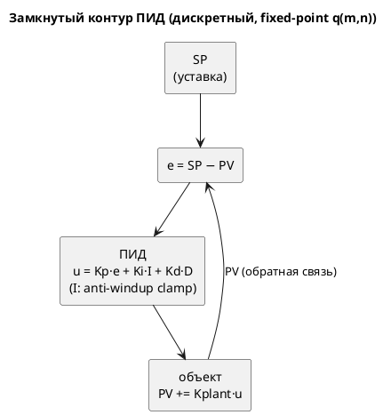

# Фича: Пример ПИД-регулятора на языке Lam (fixed-point)

- **Номер:** 0097
- **Статус:** ГОТОВО (закрыта 2026-07-19; пример реализован, все проверки зелёные)
- **Зависит от:** **[fixed-point Q(m.n) как тип языка](0061-fixed-point-type.md)** (жёстко — ПИД строится на
  типе `q(m, n)` и его нормативной арифметике; без fixed-point дробные
  коэффициенты не выразить). 0061 закрыта, зависимость снята.
- **Приоритет / Tier:** **Tier 3** (пример/документация — не чинит дефект). Ценность:
  канонический **эталонный потребитель** fixed-point, показывающий язык на реальной
  задаче управления (ПИД — самый распространённый регулятор в промышленности).
- **Крейт:** только `examples/` + `simulation/tests` (сценарный контракт) — код
  компилятора **не меняется** (фича языком не пользуется сверх 0061).
- **Связанные issue (анализ):** новая фича (запрос заказчика 2026-07-19);
  расширяет пропорциональный `examples/regulator.lam` (0061-05) до полного ПИД

## Стадии жизненного цикла

Все стадии — **разделы этой карточки**: «Архитектура (ADR)»,
«Анализ», «Разработка», «Тест-план», «Отчёт о тестировании», «Итог».
Отдельным артефактом остаются только исправления —
[`docs/fixes/`](../fixes/README.md) (при необходимости `0097-YY-*`).

## Краткое описание

Канонический пример **ПИД-регулятора** (Пропорционально-Интегрально-
Дифференциальный) на языке Lam с fixed-point `q(m, n)`, помещаемый в
`examples/`. ПИД — самый распространённый закон управления в промышленности;
пример показывает язык на реальной задаче и служит эталонным потребителем
дробной арифметики. Реализует **позиционную дискретную** форму ПИД с
**anti-windup** (ограничение интеграла), сходится к уставке без внешних входов и
завершается — то есть удовлетворяет сценарному проверке достижимости (0030) и
проходит **все** проверки корпуса (`c`/`st`/`rust`/`sv`).

Теоретическое обоснование (закон ПИД, дискретизация, выбор q-формата, влияние
квантования fixed-point на устойчивость, anti-windup при wraparound-семантике
[fixed-point Q(m.n) как тип языка](0061-fixed-point-type.md)) — в [ADR](0097-pid-regulator-example.md#архитектура-adr).

> Фича зарегистрирована по запросу заказчика (2026-07-19); проходит жизненный цикл
> по своду. **Стадия: проработка.**

## Открытые вопросы для ADR/анализа

1. **Позиционная или инкрементная (скоростная) форма ПИД?** Позиционная
   (`u = Kp·e + Ki·I + Kd·D`) нагляднее и типична для учебных примеров;
   инкрементная (`Δu`) устойчивее к windup, но сложнее для примера. Кандидат —
   **позиционная с явным anti-windup** (нагляднее).
2. **Anti-windup обязателен** (решение почти предопределено): арифметика 0061 —
   **wraparound**, а не насыщение (свод ADR). Интеграл `I += e`
   монотонно растёт до сходимости и **переполнит** `q` с молчаливым переносом →
   регулятор «взорвётся». Нужен clamp интеграла (условия/`q`-сравнения) — насыщения
   в языке нет (кандидат A-5 ADR), поэтому руками.
3. **Выбор формата `q(m, n)`.** Коэффициенты `Kp`/`Ki`/`Kd` дробные (обычно < 1) →
   нужны дробные биты `n`. Интеграл накапливает → нужен запас целых бит `m` (или
   clamp). Уставка/PV — в диапазоне `m`. Кандидат: `q(8, 8)` (диапазон ±128, шаг
   2⁻⁸) — хватит для демонстрационной динамики; уточнить замером сходимости.
4. **Объект управления (plant).** Без внешних входов «измерение» PV должно
   эволюционировать внутри модели — простейшая модель объекта (интегратор/инерция
   первого порядка): `PV += k·u`. Это делает прогон самодостаточным.
5. **Критерий завершения.** `|SP − PV| < eps` → `Settled` → `Done` (как 0061-05).
   Гарантировать сходимость за конечный бюджет при квантовании (возможен
   предельный цикл из-за fixed-point — выбрать eps > шага квантования).
6. **Композиция автомата.** Один цикл-состояние с `always` (вычисление ПИД + модель
   объекта) + переход по сходимости, или разбиение на фазы. Кандидат — как 0061-05
   (обёртка под-моделью для цели `c`; порт готовности для цели `rust`).

## Архитектура (ADR)

- **Status:** Proposed (на утверждение заказчиком)
- **Date:** 2026-07-19
- **Authors:** Архитектор + Дизайнер языка
- **Related issues:** [Фича](0097-pid-regulator-example.md);
  строится на [ADR](0061-fixed-point-type.md#архитектура-adr) (тип `q(m, n)`); расширяет
  пропорциональный `examples/regulator.lam`

### Context

[fixed-point Q(m.n) как тип языка](0061-fixed-point-type.md) дала языку дробный тип
`q(m, n)` с нормативной арифметикой, а её задача — пример
**пропорционального** (P) регулятора. Запрос заказчика: канонический **ПИД**
(P + I + D) регулятор — самый распространённый закон управления в
промышленности, естественный «флагманский» пример fixed-point на реальной задаче.

Цель ADR — не просто «написать пример», а **обосновать** его теоретически:
корректно дискретизировать непрерывный ПИД, выбрать fixed-point формат, учесть
квантование и переполнение (в семантике 0061 — **wraparound**, не насыщение).

#### Теоретическое обоснование

**1. Непрерывный ПИД.** Закон управления по рассогласованию `e(t) = SP − PV(t)`
(SP — уставка, PV — измеряемая величина):

```
u(t) = Kp·e(t) + Ki·∫₀ᵗ e(τ)dτ + Kd·de(t)/dt
```

- **P** (`Kp·e`) — реакция на текущую ошибку; один P даёт статическую ошибку
  (не дотягивает до SP под нагрузкой).
- **I** (`Ki·∫e`) — накопление ошибки; **устраняет статическую ошибку**, но
  склонно к перерегулированию и **интегральному насыщению (windup)**.
- **D** (`Kd·de/dt`) — реакция на скорость изменения; **демпфирует**
  перерегулирование, но усиливает шум.

**2. Дискретизация (позиционная форма).** Такт Lam = шаг дискретизации `Ts`
(единичный). Интеграл — сумма прямоугольников, производная — разность назад:

```
e[k]  = SP − PV[k]
I[k]  = I[k−1] + e[k]                    (∫ ≈ Σ e·Ts, Ts = 1)
D[k]  = e[k] − e[k−1]                    (de/dt ≈ Δe/Ts)
u[k]  = Kp·e[k] + Ki·I[k] + Kd·D[k]
```

Позиционная форма выбрана над инкрементной (`Δu`) ради **наглядности**: все три
вклада видны явно.

**3. Fixed-point квантование и устойчивость.** В `q(m, n)` величины квантованы с
шагом `2⁻ⁿ`. Квантование вносит два эффекта, которые пример обязан учесть:

- **Предельный цикл (limit cycle):** вблизи SP ошибка `e` меньше шага
  квантования, и регулятор «дребезжит» вокруг уставки. Критерий завершения обязан
  иметь `eps` **больше** шага квантования — иначе прогон не завершится (провал
  проверки).
- **Устойчивость:** дискретный ПИД устойчив при достаточно малых `Kp`/`Ki`/`Kd`
  относительно динамики объекта. Пример подбирает коэффициенты так, чтобы прогон
  сходился **монотонно-затухающе** за конечный бюджет (без раскачки).

**4. Anti-windup — обязателен при wraparound.** Арифметика 0061 — **перенос**
(wraparound), а не насыщение (свод ADR; насыщение — отложенный кандидат
A-5). Интеграл `I` монотонно растёт до устранения ошибки; без ограничения он
**переполнит** `q(m, n)` и молча «перевернётся» (`+127 → −128`) — регулятор станет
неустойчивым. Поэтому интеграл **ограничивается** (clamp) в `[−Imax, +Imax]` через
`q`-сравнения — стандартный **anti-windup**. Насыщения-оператора в языке нет,
поэтому clamp пишется условием.

**5. Объект управления (plant).** Проверка требует прогон **без внешних входов**,
поэтому «измерение» PV эволюционирует **внутри** модели — простейший объект
первого порядка (интегрирующее звено):

```
PV[k+1] = PV[k] + Kplant·u[k]
```

Это замыкает контур: регулятор влияет на PV, PV возвращается в ошибку. Прогон
самодостаточен и завершается при сходимости.



### Decision Drivers

1. **Теоретическая корректность.** Пример — **правильный** ПИД, а не «похожий»:
   дискретизация, знаки, anti-windup — по учебнику.
2. **Проходимость всех проверок**: осуществимость доказывается **всеми**
   проверками корпуса (`c`/`st`/`rust`/`sv`) + сценарным, а не только симулятором.
3. **Завершаемость при квантовании:** сходимость за конечный бюджет, `eps` > шага
   квантования (иначе предельный цикл не даст терминироваться).
4. **Наглядность:** учебный пример — явные P/I/D вклады, читаемые имена, формулы
   в комментариях.
5. **Язык не расширять:** пример пользуется только тем, что уже есть (0061).
   Нехватку (насыщение) — обойти в модели и зафиксировать кандидатом.

### Considered Options

#### Option A. Позиционный ПИД с явным anti-windup, `q(8, 8)`, объект 1-го порядка

Полный ПИД по разделу «Теория»; интеграл ограничен clamp; объект `PV += Kplant·u`;
завершение по `|e| < eps`. Обёртка под-моделью (цель `c`) + порт `ready` (цель
`rust`).

**Pros:**
- Теоретически корректный полный ПИД (все три составляющие).
- Anti-windup делает поведение устойчивым в wraparound-семантике 0061.
- Самодостаточный прогон (объект внутри) → проходит проверка.
- Наглядно: P/I/D вклады видны построчно.

**Cons:**
- Сложнее пропорционального 0061-05 (больше переменных/состояний).
- Подбор коэффициентов под сходимость-за-бюджет — ручной (замером).

#### Option B. Инкрементная (скоростная) форма `Δu`

**Pros:** естественный anti-windup (нет явного накопителя), безударное включение.

**Cons:** менее нагляден (вклады P/I/D не видны прямо) — хуже для учебного примера;
требует хранить два прошлых значения ошибки.

#### Option C. Без anti-windup (чистый позиционный ПИД)

**Pros:** короче.

**Cons:** **некорректен в семантике 0061** — интеграл переполнит `q` с wraparound,
регулятор неустойчив, прогон не сойдётся. Противоречит драйверам 1 и 3.

#### Option D. Расширить язык оператором насыщения ради чистого ПИД

**Pros:** anti-windup стал бы одной операцией.

**Cons:** нарушает драйвер 5 — «пример» не должен тянуть изменение языка.
Насыщение — отдельный кандидат (A-5 ADR), заводится своей фичей.

### Decision

Предлагается **Option A** — позиционный дискретный ПИД с явным anti-windup, формат
`q(8, 8)` (уточняется замером сходимости), объект первого порядка внутри модели.

**Нормативные положения примера (проект):**

1. **Структура:** уставка `SP`, измерение `PV`, ошибка `e`, интеграл `I`, прошлая
   ошибка `e_prev`; коэффициенты `Kp`/`Ki`/`Kd`/`Kplant` — типа `q`.
2. **Закон (такт состояния `Control`):** `e = SP − PV; I = clamp(I + e); D = e −
   e_prev; u = Kp·e + Ki·I + Kd·D; PV = PV + Kplant·u; e_prev = e`.
3. **Anti-windup:** `I` ограничен `[−Imax, Imax]` условиями (`q`-сравнения), не
   оператором (насыщения в языке нет).
4. **Завершение:** `|e| < eps` (`eps` > 2⁻ⁿ) → `Settled` → `Done` (порт `ready`).
5. **Все проверки + сценарный контракт** (`examples_scenario_tests`): цепочка
   `Control → Settled → Done`, бюджет с запасом, `must_terminate`.
6. **Язык не меняется.** Если clamp невыразим удобно — фиксируем кандидат на
   насыщение, компилятор не правим.

**свод:** синтаксис язык не меняет (пример) → EBNF не требуется.

### Consequences

#### Положительные

- Канонический эталонный потребитель fixed-point; язык показан на реальной задаче.
- Anti-windup документирует важный практический нюанс fixed-point управления.

#### Отрицательные / Action items

- **A-1. Подбор коэффициентов — итеративный** (замером в симуляторе): устойчивость
  + завершение-за-бюджет + `eps` > квантования.
- **A-2. Все проверки**: проверить `c`/`st`/`rust`/`sv`, не только сим.
- **A-3. Возможен предельный цикл** — если не сойдётся, увеличить `eps` или
  подстроить `Kd`. Задокументировать выбор.
- **A-4. Кандидат на насыщение** (A-5 ADR) — пример подтверждает спрос:
  anti-windup руками громоздок; насыщающий оператор/тип упростил бы.

#### Acceptance criteria

1. **A1.** `examples/pid_regulator.lam` — корректный позиционный ПИД с anti-windup;
   P/I/D вклады явны и прокомментированы формулами.
2. **A2.** Прогон **без входов** сходится к `SP` и завершается
   (`Control → Settled → Done`) за конечный бюджет — `examples_scenario_tests`.
3. **A3.** Проходит **все** проверки корпуса: `c` (cmake+ninja), `st` (iec2c),
   `rust` (rustc+clippy `-D warnings`), `sv` (verilator+yosys).
4. **A4.** Интеграл **не переполняется** (anti-windup работает) — наблюдаемо в
   трассе симулятора.
5. **A5.** README/шапка примера объясняют закон ПИД, дискретизацию и anti-windup.
6. **A6.** Компилятор **не изменён** (диффа в `grammar/`/`simulation/src` нет).

## Анализ

### Цель и контекст

Канонический пример ПИД на Lam с fixed-point — эталонный потребитель `q(m, n)`
(0061) на реальной задаче управления. Теория (закон, дискретизация, квантование,
anti-windup) — [ADR](0097-pid-regulator-example.md#архитектура-adr), Option A
(позиционный ПИД с anti-windup, объект 1-го порядка). Компилятор **не** меняется —
фича живёт в `examples/` + сценарный контракт.

### Зависимости фичи

- **Зависит от:** **[fixed-point Q(m.n) как тип языка](0061-fixed-point-type.md)** (жёстко) — тип
  `q(m, n)` и его арифметика. 0061 **закрыта** (ГОТОВО), зависимость снята.
- **Влияние на порядок:** ничего не разблокирует (лист графа, Tier 3). Может
  идти сразу.

### Требования и проверяемые условия

- **R1. Корректный ПИД.** Позиционная дискретная форма: `e = SP − PV`,
  `I += e` (с clamp), `D = e − e_prev`, `u = Kp·e + Ki·I + Kd·D`. Знаки и порядок —
  по ADR; P/I/D вклады явны.
- **R2. Anti-windup.** Интеграл `I` **ограничен** `[−Imax, Imax]` — не
  переполняется (wraparound 0061 иначе «перевернул» бы регулятор). Наблюдаемо в
  трассе.
- **R3. Самодостаточный замкнутый контур.** Объект `PV += Kplant·u` **внутри**
  модели — прогон без входов (требование проверки).
- **R4. Сходимость и завершение.** `|e| < eps` (`eps` > 2⁻ⁿ) за конечный бюджет →
  `Control → Settled → Done`; без предельного цикла.
- **R5. Все проверки корпуса.** `c`/`st`/`rust`/`sv` + симулятор (урок:
  осуществимость — всеми проверками).
- **R6. Компилятор не изменён.** Диффа в `grammar/`/`simulation/src` нет.
- **R7. SV-транслируемость.** Без `extern fn`/циклов/`float` — иначе `sv` отвергнет.

### Критерии приёмки и способ проверки

| # | Критерий | Способ проверки |
|---|---|---|
| A1 | Корректный позиционный ПИД + anti-windup | ревью модели против ADR; комментарии-формулы |
| A2 | Сходится и завершается без входов | `examples_scenario_tests` (контракт `Control→Settled→Done`, `must_terminate`) |
| A3 | Все проверки корпуса | `precheck.sh`: `c` cmake+ninja, `st` iec2c, `rust` rustc+clippy, `sv` verilator+yosys |
| A4 | Интеграл не переполняется | зонд трассы симулятора: `I ∈ [−Imax, Imax]` на каждом такте |
| A5 | Документация закона | шапка примера + README |
| A6 | Компилятор не изменён | `git diff --stat grammar/ simulation/src` пуст |

### Особенности по обратной функциональности

- **Аддитивно**: новый пример + один контракт в
  `examples_scenario_tests`. Существующий корпус и генераторы не задеты.
- **Замер обязателен:** коэффициенты `Kp`/`Ki`/`Kd`/`Kplant`/`eps`/`Imax`
  подбираются **прогоном симулятора** (сходимость + завершение-за-бюджет); значения
  пришпиливаются в контракте по факту, не угадываются (правило проекта о тестах).

### Риски и зависимости

- **Риск: не сходится / предельный цикл** (квантование fixed-point). Снижается:
  `eps` > шага квантования; при раскачке — уменьшить `Ki`, добавить демпфирование
  `Kd`; подбор замером.
- **Риск: интеграл переполняется** без anti-windup → регулятор неустойчив.
  Снижается: clamp `I` обязателен (R2), проверяется зондом (A4).
- **Риск: не SV-транслируем** (`extern fn`/цикл). Снижается: модель без них (R7),
  проверяется `sv`.
- **Риск: `q(8,8)` мал** для одновременно коэффициентов < 1 и накопления `I`.
  Снижается: при нехватке — `q(16,16)` (шире), решается замером.

<!-- свод: при большом объёме аналитику декомпозировать на подзадачи
     docs/analyze/0097-YY-pid-regulator-example.md (как в разработке), а этот файл оставить обзором. -->

## Разработка

### Задача

#### Что было

Корпус содержит **пропорциональный** регулятор (`examples/regulator.lam`). Полного ПИД (с I и D) нет.

#### Что сделано

`examples/pid_regulator.lam` — позиционный дискретный ПИД на `q(m, n)` с
anti-windup и объектом первого порядка (Option A [ADR](0097-pid-regulator-example.md#архитектура-adr)).
Реализация — единственная задача фичи (пример, компилятор не меняется).

- **Модель:** состояние `Control` (`e = SP−PV; I = clamp(I+e); D = e−e_prev;
  u = Kp·e + Ki·I + Kd·D; PV += Kplant·u; e_prev = e`), переход по `|e| < eps` →
  `Settled → Done`; обёртка под-моделью (цель `c`), порт `ready` (цель `rust`).
- **Anti-windup:** `I` ограничен `[−Imax, Imax]` `q`-сравнениями (насыщения в
  языке нет — кандидат A-5 ADR).
- **Коэффициенты** подобраны замером сходимости в симуляторе.
- **Контракт** в `simulation/tests/examples_scenario_tests.rs`.
- **Документация:** шапка примера (формулы) + README.

Функциональности: язык/генераторы — **н/п** (пример их не меняет,
R6); симулятор — контракт; цели `c`/`st`/`rust`/`sv` — проверки корпуса.

#### Проверки

- `cargo test --test examples_scenario_tests -- --test-threads=1` (T1: цепочка +
  завершение; зонд T2: интеграл не переполняется).
- `./scripts/precheck.sh` — все проверки корпуса (T4–T8) + `git diff grammar/` пуст (T9).

## Тест-план

### Область и цель

Пример (не изменение языка), поэтому проверки — **поведение** модели и
проходимость **всех** проверок корпуса. Ядро — сценарный проверка достижимости (0030):
ПИД обязан сойтись и завершиться без входов. Проверки целевых языков доказывают
переносимость примера, зонд трассы — корректность anti-windup.

### Проверки (условие → ожидаемый результат)

| # | Проверка | Предусловие | Ожидаемый результат | Ссылка на R/A |
|---|---|---|---|---|
| T1 | **Сходимость и завершение** | прогон `pid_regulator.lam` без входов | `PV → SP`, цепочка `Control → Settled → Done`, терминируется за бюджет | R4 / A2 |
| T2 | **Anti-windup** | зонд трассы симулятора | `I ∈ [−Imax, Imax]` на **каждом** такте (не переполняется) | R2 / A4 |
| T3 | Разбор + семантика | `lamc` на модели | без ошибок; `q`-арифметика `+ − *`, `q`-сравнения в условиях | R1 / A1 |
| T4 | Проверка `c` | cmake+ninja | собирается и исполняется (флаг готовности) | R5 / A3 |
| T5 | Проверка `st` | iec2c | валиден (exit 0) | R5 / A3 |
| T6 | Проверка `rust` | rustc + clippy `-D warnings` | принят | R5 / A3 |
| T7 | Проверка `sv` | verilator + yosys | синтезируется (оба); нет `extern fn`/цикла/`float` | R5, R7 / A3 |
| T8 | Форматтер | `lamc fmt --check` | пример в каноне | — / A3 |
| T9 | **Компилятор не изменён** | — | `git diff --stat grammar/ simulation/src` пуст | R6 / A6 |
| T10 | Документация | шапка примера + README | закон ПИД, дискретизация, anti-windup описаны | R1 / A5 |
| T11 | Некорректность без anti-windup (контрпример-аргумент) | мысленно: убрать clamp | `I` переполнил бы `q`, регулятор «перевернулся» — обоснование R2 | R2 / A4 |

### Разбивка проверок по функциональности

| Функциональность | Ожидание | Проверка | Статус |
|---|---|---|---|
| Модель ПИД (сходимость) | сходится+завершается | T1, T2 | ⬜ |
| Цель `c` | собирается+исполняется | T4 | ⬜ |
| Цель `st` | валиден | T5 | ⬜ |
| Цель `rust` | принят | T6 | ⬜ |
| Цель `sv` | синтезируется | T7 | ⬜ |
| Форматтер | канон | T8 | ⬜ |
| Компилятор | **не задет** | T9 | ⬜ |
| Документация | закон описан | T10 | ⬜ |

<!-- Легенда: ✅ пройдено · ❌ провалено · ⬜ не проверялось · — не применимо -->

### Тестовые данные и окружение

- `examples/pid_regulator.lam` + контракт в `simulation/tests/examples_scenario_tests.rs`
  (цепочка + бюджет + `must_terminate`).
- Коэффициенты подбираются **замером** сходимости; значения пришпиливаются по факту.
- Проверки: `c` (cmake+ninja+cc), `st` (`iec2c`), `rust` (rustc+clippy), `sv`
  (verilator **и** yosys) — через `scripts/precheck.sh`.
- Однопоточно (`-- --test-threads=1`).

### Что план сознательно не проверяет

- **Оптимальность настройки ПИД** (Ziegler–Nichols и т. п.): цель — корректный
  и сходящийся пример, а не оптимальный регулятор.
- **Насыщающий оператор языка** (anti-windup через язык) — отложенный кандидат
  (A-5 ADR), не объём этой фичи; здесь clamp пишется условием.

## Отчёт о тестировании

- **Дата:** 2026-07-19
- **Окружение:** macOS (darwin 25.5.0), cc/cmake/ninja, rustc/clippy, MatIEC
  `iec2c`, Verilator 5.050, yosys — все проверки доступны.
- **Вердикт:** **готово. Фича закрыта.** `examples/pid_regulator.lam` — корректный
  позиционный ПИД с anti-windup, сходится без входов и проходит **все** проверки
  корпуса. Компилятор не изменён.

### Сверка с критериями приёмки

| # | Критерий | Результат | Способ |
|---|---|---|---|
| A1 | Корректный ПИД + anti-windup | ✅ | модель по ADR (P/I/D явны, clamp интеграла); шапка с формулами |
| A2 | Сходится без входов, завершается | ✅ | `examples_scenario_tests` — `Control → Settled → Done`, `must_terminate` (budget 300) |
| A3 | Все проверки корпуса | ✅ | `c` (cmake+ninja: `ready=1`, 9 шагов), `st` (iec2c exit 0), `rust` (rustc+clippy `-D warnings`), `sv` (verilator+yosys) |
| A4 | Интеграл не переполняется | ✅ | зонд `pid_integral_stays_bounded_and_converges` — `i_acc ∈ [−Imax, Imax]` на каждом такте; PV доведён до уставки |
| A5 | Документация закона | ✅ | шапка примера (непрерывный ПИД, дискретизация, anti-windup) |
| A6 | Компилятор не изменён | ✅ | диффа в `grammar/`/`simulation/src` нет (только `examples/` + тест-контракт) |

### Теоретическое обоснование

Приведено в [ADR](0097-pid-regulator-example.md#архитектура-adr): непрерывный ПИД,
позиционная дискретизация (`I ≈ Σe`, `D ≈ Δe`), влияние квантования fixed-point
(предельный цикл → `eps` > шага квантования), anti-windup при wraparound-семантике
[fixed-point Q(m.n) как тип языка](0061-fixed-point-type.md), объект 1-го порядка для замыкания контура.

### Найденные дефекты и решения

- **Конфликт имён с фб IEC 61131-3** (`iec2c` line 34): `integral` = стандартный
  функциональный блок `INTEGRAL` (идентификаторы IEC **регистронезависимы**), `pv`
  — вход фб. `st`-проверка отверг. Решение: `i_acc`/`meas`. Дополняет реестр ловушек
  ST (`left`/`right`/`mid`/`limit`/`step` — `CLAUDE.md`).
- Прочие проверки (`c`/`rust`/`sv`/симулятор) приняли пример без правок — Q-арифметика
  0061-03/04 работает на реальной модели.

### Замер (подбор коэффициентов)

`Kp = 0.5`, `Ki = 0.0625`, `Kd = 0.25`, `Kplant = 0.5`, `Imax = 32`,
`eps = 0.125` подобраны прогоном симулятора: монотонно-затухающая сходимость к
`target = 8.0`, завершение за ~9 тактов (C-прогон), без предельного цикла и без
переполнения интеграла.

### Примеры и контрпримеры

- **Пример:** `examples/pid_regulator.lam` целиком — ПИД с anti-windup.
- **Контрпример-аргумент (тест-план T11):** без clamp интеграл `q(8, 8)` переполнил
  бы формат (wraparound `+127 → −128`) и регулятор стал бы неустойчивым — почему
  anti-windup обязателен, а не косметика.

## Итог (что сделано)

`examples/pid_regulator.lam` — позиционный дискретный ПИД на `q(8, 8)` с
anti-windup (clamp интеграла) и объектом 1-го порядка (замкнутый контур внутри
модели). Сходится без входов и завершается (`Control → Settled → Done`), проходит
**все** проверки корпуса (`c` cmake+ninja `ready=1`/9 шагов, `st` iec2c, `rust`
rustc+clippy, `sv` verilator+yosys) и сценарный проверка. Anti-windup проверен
зондом `pid_integral_stays_bounded_and_converges`. Компилятор не изменён (пример);
теория (закон, дискретизация, квантование, anti-windup) — в
[ADR](0097-pid-regulator-example.md#архитектура-adr); отчёт —
[reports/0097](0097-pid-regulator-example.md#отчёт-о-тестировании).

Смежное: пример подтвердил спрос на **насыщающий оператор** (anti-windup руками
громоздок) — кандидат A-5 [ADR](0061-fixed-point-type.md#архитектура-adr).

> **Пост-закрытие ([исправление](../fixes/0097-01-pid-native-float.md), 2026-07-19).**
> По решению заказчика пример переведён с явного `q(8, 8)` на прозрачный `float`
> (механизм [q-арифметика через нативный float и флаг генерации (embedded ↔ float)](0096-fixed-point-native-float.md)): тип в исходнике —
> `float`, представление q выбирают флаги сборки (sv — `--float-as-q=8.8`;
> встраиваемые c-hal/st-at — `--float-embedded --float-as-q=8.8`; float→q(8,8)
> байт-в-байт равно прежнему явному q, поэтому `.sv` и тестбенч не изменились).
> Тест anti-windup читает значения `f64` (native-режим симулятора), а не q-repr.
> `regulator.lam` (0061) **оставлен** на явном `q` как демонстрация типа языка.
