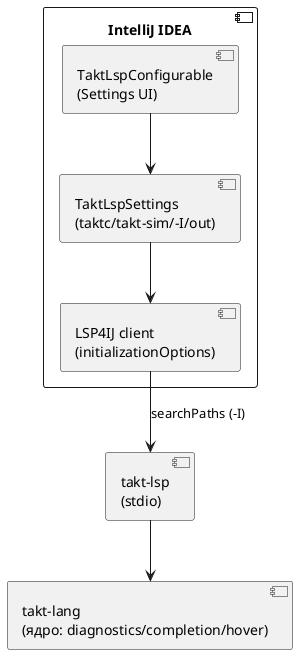

# Фича: Плагин IntelliJ Takt: LSP-проверка, автодополнение, документация и настройки инструментов

- **Номер:** 0125
- **Статус:** ГОТОВО
- **Зависит от:** `0038` (LSP-интеграция плагина через LSP4IJ), `0072`
  (`initializationOptions.searchPaths` на сервере). Обе закрыты — фича не
  блокирована; она **аддитивна** к существующему плагину `intellij-takt`.
- **Связанные issue (анализ):** новая фича (запрос заказчика 2026-07-25 — плагин
  IntelliJ должен проверять корректность `.takt` через LSP, давать автодополнение
  и hover-документацию, а в настройках хранить пути к компилятору/симулятору,
  дополнительные параметры компилятора (`-I`) и выходную директорию, как у прочих
  подобных плагинов)

## Стадии жизненного цикла

Все стадии — **разделы этой карточки**: «Архитектура (ADR)»,
«Анализ», «Разработка», «Тест-план», «Отчёт о тестировании», «Итог».
Отдельным артефактом остаются только исправления —
[`docs/fixes/`](../fixes/README.md) (при необходимости `0125-YY-*`).

## Краткое описание

Доводит плагин **IntelliJ IDEA** (`extensions/intellij-takt`) до уровня рабочего
инструмента разработчика Takt. Плагин уже поднимает готовый LSP-сервер `takt-lsp`
через LSP4IJ, а сам сервер уже реализует и анонсирует диагностики
(`collect_diagnostics_at`), автодополнение (`completion_items`) и hover
(`hover_info`) — значит **дописывать LSP-сервер не требуется**. Фича: (1)
**верифицировать**, что проверка корректности файла, автодополнение и
hover-документация реально отображаются в редакторе через LSP4IJ (при
необходимости — добавить недостающие точки расширения в `takt-lsp4ij.xml`); (2)
**расширить настройки плагина** полями путей к компилятору `taktc`, симулятору
`takt-sim`, дополнительных параметров компилятора (в первую очередь `-I` —
каталоги поиска импортов) и выходной директории — как у прочих плагинов подобных
утилит; (3) **прокинуть каталоги `-I` в LSP-сервер** через уже существующий
`initializationOptions.searchPaths` (0072), чтобы диагностика/автодополнение/
переход находили импорты из общих библиотек, а не только из каталога документа.

> Фича зарегистрирована по запросу заказчика; далее проходит жизненный цикл по
> своду.

## Документирование

**Не требуется.** Фича — **инструментальная** (плагин редактора, инфраструктура
разработчика): язык Takt (синтаксис/семантика/диагностики/поведение целей) **не
меняется**, версия языка не растёт (свод не затронут). Документ `book/`
описывает **язык**, а не редакторный инструментарий, поэтому языкового раздела
фича не заводит. Раздел «Инструментарий» (16) при желании может кратким
упоминанием отметить наличие плагина IntelliJ, но это не обязательство данной
фичи и деталей реализации/настроек не приводит.

## Архитектура (ADR)

- **Status:** Accepted
- **Date:** 2026-07-25
- **Authors:** Архитектор
- **Related issues:** [Фича](0125-intellij-takt-lsp-tooling.md); опирается на [семантическая подсветка Lam в IntelliJ через lam-lsp](0038-intellij-semantic-tokens.md#архитектура-adr) (LSP4IJ) и механизм 0072 (`searchPaths`)

### Context

Плагин `extensions/intellij-takt` уже поднимает готовый LSP-сервер `takt-lsp`
через LSP4IJ: фабрика `TaktLspServerFactory` +
`TaktLspConnectionProvider` запускают бинарник по stdio, `languageMapping`
сопоставляет язык Takt серверу. Сам сервер (`takt-lang/src/lsp/`) **уже**
реализует и анонсирует в `initialize` нужные возможности:
`text_document_sync` → `publishDiagnostics` (валидация), `completion_provider`
(автодополнение), `hover_provider` (документация), плюс goto/formatting/
semantic-tokens. LSP4IJ включает соответствующие UI-фичи по объявленным
capabilities сервера. **То есть сам LSP-сервер под три требования дописывать не
нужно** — работа лежит на стороне плагина и его настроек.

Два пробела текущего состояния:

1. **Настройки плагина скудны.** `TaktLspSettings`/`TaktLspConfigurable` хранят
   **только** путь к `takt-lsp`. Путей к компилятору `taktc`, симулятору
   `takt-sim`, дополнительных параметров компилятора (каталоги `-I`) и выходной
   директории — **нет**. Разработчику неоткуда задать, где искать импортируемые
   библиотеки и куда генерировать код.

2. **`initializationOptions` серверу не передаются.** `TaktLspConnectionProvider`
   поднимает процесс, но клиент LSP4IJ не отдаёт серверу
   `initializationOptions.searchPaths`, хотя сервер их **умеет** читать (0072,
   `init_options::search_paths_from_options`). Поэтому диагностика/автодополнение/
   переход находят импорт **только** в каталоге документа — импорт из общей
   библиотеки (аналог `taktc -I lib`) в редакторе не разрешается.

Задача — довести настройки до уровня прочих плагинов подобных утилит и связать
каталоги `-I` из настроек с уже существующим механизмом `searchPaths` сервера.



### Decision Drivers

1. **Не дублировать семантику (драйвер 2 ADR).** Проверка/дополнение/hover —
   единый источник `takt-lang`; плагин не должен реализовывать их на Kotlin.
2. **Переиспользовать готовый механизм.** `searchPaths` в
   `initializationOptions` уже поддержан сервером (0072) — прокидка `-I` не
   требует правок сервера.
3. **Аддитивность.** Пустые новые настройки ⇒ поведение прежнее
   (пустой `searchPaths` ≡ прежний `&[]`); плагин без LSP4IJ грузится как раньше.
4. **Соответствие ожиданиям пользователя.** «Настройки как у других подобных
   утилит»: пути к инструментам, доп. параметры, выходной каталог — привычный
   набор.

### Considered Options

#### Option A. `-I` через `initializationOptions.searchPaths`; пути к инструментам — в настройках

Каталоги `-I` из настроек плагин отдаёт серверу как
`initializationOptions.searchPaths` (переопределив получение init-options в
клиенте LSP4IJ). Пути к `taktc`/`takt-sim` и выходная директория **хранятся** в
настройках (задел под будущие действия компиляции/симуляции), но действий запуска
эта фича не вводит. diagnostics/complete/hover — уже от сервера через LSP4IJ.

**Pros:**
- Ни строки правок в LSP-сервере: `searchPaths` уже читается (0072).
- Аддитивно и совместимо: пустые значения ≡ прежнее поведение.
- Минимальный, проверяемый объём; чётко ложится на требования заказчика.

**Cons:**
- Пути `taktc`/`takt-sim` пока «мёртвые» (хранятся, но не задействованы до
  фичи-преемника с действиями запуска) — нужно честно это назвать.

#### Option B. `-I` аргументами командной строки бинарнику `takt-lsp`

Передавать `-I dir` как argv процессу `takt-lsp`.

**Pros:**
- Симметрично с `taktc -I`.

**Cons:**
- Сервер **не разбирает** argv для путей поиска — пришлось бы **дописывать
   сервер** в обход уже готового `initializationOptions` (0072), плодя второй
   механизм того же назначения. Нарушает драйвер 2.

#### Option C. Ввести полноценные действия «Compile»/«Simulate» (Run Configurations) в этой же фиче

Кроме настроек — кнопки/конфигурации запуска `taktc`/`takt-sim` из IDE.

**Pros:**
- Сразу задействует пути к инструментам.

**Cons:**
- Существенно больший объём (Run Configuration API, парсинг вывода в проблемы,
   консоль), верифицируемый только запуском IDE. Раздувает фичу и смешивает две
   темы (LSP-редактирование vs выполнение). Лучше отдельной фичей-преемником.

### Decision

Принимается **Option A**. Она закрывает все три требования проверки/дополнения/
документации за счёт уже готового сервера, добавляет ожидаемый набор настроек и
связывает `-I` с импорт-резолвингом через существующий `searchPaths` — без правок
LSP-сервера и без раздувания объёма. Действия запуска компилятора/симулятора
(Option C) выносятся в **отдельную фичу-преемника** (пути к `taktc`/`takt-sim` и
выходная директория заводятся уже сейчас как задел, что честно фиксируется в
карточке и отчёте).

### Consequences

#### Положительные

- Разработчик Takt получает в IntelliJ проверку файла, автодополнение и hover
  «из коробки», плюс разрешение импортов из общих библиотек через настройку `-I`.
- Ноль правок в LSP-сервере; единый источник семантики сохранён.
- Совместимо: без LSP4IJ и с пустыми настройками поведение прежнее.

#### Отрицательные / Action items

- **A-1.** Расширить `TaktLspSettings.State` полями: `taktcPath`, `taktSimPath`,
  `includeDirs` (список каталогов `-I`), `outputDir`. Отразить в
  `TaktLspConfigurable` (Swing-панель без UI-DSL, как сейчас).
- **A-2.** Отдать `initializationOptions = { "searchPaths": [<includeDirs>] }`
  серверу из клиента LSP4IJ (переопределить `getInitializationOptions`/
  соответствующий хук клиента). Относительные пути — от корня проекта (сервер
  сам разрешит их от `root_uri`, 0072).
- **A-3.** Проверить, что LSP4IJ 0.20.1 прокидывает diagnostics/completion/hover
  в UI при объявленных capabilities; если для какой-то из фич нужна явная точка
  расширения в `takt-lsp4ij.xml` — добавить её.
- **A-4.** Тесты плагина (JUnit, `./gradlew --offline test`): сериализация новых
  полей `TaktLspSettings`, сборка `searchPaths` из `includeDirs`. Верификация
  UI (реальный запуск IDE) — вручную заказчиком (в `precheck.sh` плагин не
  собирается — только локально, как отмечено в CLAUDE.md про 0067).
- **A-5.** Пути `taktc`/`takt-sim`/`outputDir` в этой фиче **хранятся, но не
  исполняются** — действия запуска выносятся в фичу-преемника; зафиксировать это
  в отчёте, чтобы «мёртвая» настройка не читалась как недоделка.

#### Acceptance criteria

1. В настройках плагина (Settings → Tools → Takt Language Server) есть поля пути
   к `taktc`, `takt-sim`, список каталогов `-I` и выходная директория; значения
   сохраняются (`PersistentStateComponent`) и восстанавливаются.
2. Каталоги `-I` из настроек доходят до сервера как
   `initializationOptions.searchPaths`; импорт из указанной библиотеки
   разрешается в редакторе (проверка/дополнение/переход его находят).
3. Проверка корректности файла (диагностики), автодополнение и hover-документация
   отображаются в редакторе через LSP4IJ.
4. Пустые настройки ⇒ поведение плагина прежнее (аддитивность); тесты плагина
   зелены (`./gradlew --offline test`).

## Анализ

### Цель и контекст

Довести плагин IntelliJ (`extensions/intellij-takt`) до рабочего инструмента:
проверка корректности `.takt` через LSP, автодополнение, hover-документация, и
набор настроек путей к инструментам (компилятор/симулятор), дополнительных
параметров компилятора (`-I`) и выходной директории. Связь с ADR (Option A):
три возможности редактирования уже даёт готовый сервер `takt-lsp` через LSP4IJ —
работа сводится к **настройкам** и **прокидке `-I`** через существующий
`initializationOptions.searchPaths` (0072), без правок сервера.

**Ключевая находка разведки (снимает мнимый объём).** Требования «LSP-проверка»,
«code complete», «hover» на стороне сервера **уже реализованы и анонсированы**:

| Требование | Реализация в `takt-lang/src/lsp/` | Анонс в `takt_lsp.rs` |
|---|---|---|
| Валидация файла | `diagnostics.rs::collect_diagnostics_at` → `publishDiagnostics` | `text_document_sync` (open/change/close) |
| Автодополнение | `completion.rs::completion_items` | `completion_provider` (trigger `" " . :`) |
| Hover-документация | `hover.rs::hover_info` (вкл. doc-комментарии `///`) | `hover_provider` |

LSP4IJ включает эти UI-фичи по объявленным capabilities. Значит **сервер
дописывать не нужно** — источник работы только в плагине.

### Зависимости фичи

- **Зависит от:** `0038` (LSP-интеграция плагина через LSP4IJ — фабрика сервера,
  резолв бинарника, `languageMapping`; расширяем именно её), `0072`
  (`initializationOptions.searchPaths` на сервере — механизм прокидки `-I`). **Обе
  закрыты (`ГОТОВО`)** → фича **не блокирована**. Косвенно опирается на 0100
  (ренейм Lam→Takt: пакет `org.takt.intellij`, бинарник `takt-lsp`).
- **Влияние на порядок разработки:** аддитивна, ничего не блокирует и не
  разблокирует в текущей витрине. Открывает **фичу-преемника** «действия
  запуска компилятора/симулятора из IDE» (Run Configurations) — под неё эта фича
  заводит настройки путей `taktc`/`takt-sim`/выходной директории как задел
  (Option C ADR отвергнут в объёме).

### Требования и проверяемые условия

- **R1. Настройки инструментов.** В `TaktLspSettings`/`TaktLspConfigurable`
  добавлены поля: путь к `taktc`, путь к `takt-sim`, список каталогов `-I`
  (`includeDirs`), выходная директория (`outputDir`). Значения сохраняются
  (`PersistentStateComponent`, storage `takt.xml`) и восстанавливаются.
- **R2. Прокидка `-I` в LSP.** Клиент LSP4IJ отдаёт серверу
  `initializationOptions = { "searchPaths": [<includeDirs>] }`; импорт из
  указанной библиотеки разрешается в редакторе (проверка/дополнение/переход).
- **R3. Возможности редактирования отображаются.** Диагностики (подчёркивание
  ошибок), автодополнение (список по `Ctrl+Space`/триггерам), hover
  (документация по элементу) видны в редакторе через LSP4IJ.
- **R4. Аддитивность.** Пустые новые настройки ⇒ поведение прежнее (пустой
  `searchPaths` ≡ прежний `&[]`); отсутствие LSP4IJ ⇒ плагин грузится как раньше
  (лексический слой 0022).
- **R5. Задел без исполнения — явно.** Пути `taktc`/`takt-sim`/`outputDir`
  хранятся, но действий запуска фича **не вводит**; это зафиксировано, чтобы
  «мёртвая» настройка не читалась как недоделка.

### Критерии приёмки и способ проверки

| # | Критерий | Способ проверки |
|---|---|---|
| A1 | Новые поля настроек сохраняются/читаются | JUnit-тест сериализации `TaktLspSettings.State` (`./gradlew --offline test`) |
| A2 | `includeDirs` → `searchPaths` собирается верно | JUnit-тест сборки init-options из настроек |
| A3 | Импорт из библиотеки `-I` разрешается в редакторе | Ручная проверка в IDE (запуск sandbox): открыть файл с импортом из каталога `-I`, убедиться, что нет ложной диагностики и работает переход |
| A4 | Диагностики/дополнение/hover видны | Ручная проверка в IDE (заказчик) — LSP4IJ прокидывает по capabilities |
| A5 | Пустые настройки ≡ прежнее поведение | JUnit (пустой `includeDirs` ⇒ пустой `searchPaths`) + прежние тесты плагина зелены |

**Граница автоматизации.** Плагин собирается и тестируется **только локально**
(`./gradlew --offline test`), в `precheck.sh`/CI не входит (как отмечено про 0067
в CLAUDE.md). Поэтому A1/A2/A5 автоматизируемы JUnit-тестами плагина, а A3/A4
(поведение в живом редакторе) проверяются **вручную** запуском sandbox-IDE —
объективного проверки для них нет.

### Особенности по обратной функциональности

- Существующая настройка `serverPath` и её поведение (пусто → поиск в `PATH`) —
  **не трогаются**; новые поля добавляются рядом.
- Плагин без установленного LSP4IJ продолжает грузиться (опциональная
  зависимость, тихая деградация из 0038) — новые настройки просто не влияют на
  LSP-слой.
- Язык Takt и вывод генераторов **не меняются** — фича вне крейтов `takt-lang`/
  `takt-sim` по продукту (правит только `extensions/intellij-takt`); правок
  LSP-сервера Option A не требует.

### Риски и зависимости

- **LSP4IJ не прокидывает какую-то из фич по одним capabilities.** Снижение:
  проверить на 0.20.1; при необходимости добавить явную точку расширения в
  `takt-lsp4ij.xml` (риск локализован в дескрипторе, сервер не затрагивается).
- **«Мёртвые» пути `taktc`/`takt-sim`.** Снижение: явно назвать заделом под
  фичу-преемника в отчёте (R5), не выдавать за завершённую функцию.
- **Нет CI-проверки на поведение в редакторе (A3/A4).** Снижение: максимум логики
  вынести в чистые тестируемые функции (сборка `searchPaths`, сериализация), как
  сделано с `search_paths_from_options` на сервере; остаток — ручная приёмка.
- **Остатки `serverId="lamLsp"` / `LamExtension`** — косметика ренейма (в бэклоге
  после 0100); данной фичи **не касаются**, специально не трогать (внешние ID).

<!-- свод: при большом объёме аналитику декомпозировать на подзадачи
     docs/analyze/0125-YY-intellij-takt-lsp-tooling.md (как в разработке), а этот файл оставить обзором. -->

## Разработка

### Задача

#### Что было

Плагин `extensions/intellij-takt` поднимал LSP-сервер `takt-lsp` через LSP4IJ, но:

- **Настройки** (`TaktLspSettings`/`TaktLspConfigurable`) хранили **только** путь
  к `takt-lsp` — путей к `taktc`/`takt-sim`, каталогов `-I`, доп. параметров и
  выходной директории не было.
- **`initializationOptions` серверу не передавались**: `TaktLspConnectionProvider`
  поднимал процесс, но клиент не отдавал `searchPaths`, хотя сервер их читает
  (0072). Импорт из общих библиотек в редакторе не разрешался — только каталог
  документа.

Диагностики/автодополнение/hover на стороне сервера уже реализованы и анонсированы
(`takt-lang/src/lsp/`), LSP4IJ включает их по capabilities — доработок сервера не
требовалось (ADR, Option A).

#### Что сделано

Реализована **Option A** ADR — правки только в `extensions/intellij-takt`,
LSP-сервер не тронут:

- **Настройки** (`lsp/TaktLspSettings.kt`): в `State` добавлены поля
  `compilerPath` (`taktc`), `simulatorPath` (`takt-sim`),
  `includeDirs: MutableList<String>` (каталоги `-I`), `compilerArgs` (доп. флаги),
  `outputDir` (выходная директория) + аксессоры. Умолчания пусты (аддитивность).
- **Сборка init-options** (`lsp/TaktInitOptions.kt`, **новый**): чистая функция
  `build(includeDirs)` → `{ "searchPaths": [<непустые dirs>] }` либо `null`
  (пустой список ≡ прежнее поведение). Плюс `parseDirs`/`joinDirs` — построчный
  текст поля ↔ список. Тестируемо без GUI (драйвер 5 ADR).
- **Прокидка в сервер** (`lsp/TaktLspServerFactory.kt`):
  `TaktLspConnectionProvider.getInitializationOptions(rootUri)` возвращает
  результат `TaktInitOptions.build(...)` из настроек. Сервер сам разрешает
  относительные пути от корня рабочей области (0072).
- **UI настроек** (`lsp/TaktLspConfigurable.kt`): панель на `GridBagLayout` (без
  UI-DSL — минимальная зависимость от версии платформы) с полями: путь к
  `takt-lsp`/`taktc`/`takt-sim`/выходной директории (`TextFieldWithBrowseButton`),
  каталоги `-I` (многострочная `JTextArea`, по пути на строку), доп. параметры
  (`JTextField`). `isModified`/`apply`/`reset` покрывают все поля.

**Статус по функциональности:**

- **Валидация файла / автодополнение / hover** — «н/п по коду»: обеспечены
  сервером (0038 + `takt-lang/src/lsp/`), LSP4IJ прокидывает по capabilities;
  дескриптор `takt-lsp4ij.xml` (server + languageMapping) уже достаточен —
  дополнительных точек расширения не потребовалось.
- **Пути `taktc`/`takt-sim`/`outputDir`/`compilerArgs`** — **задел** под
  фичу-преемника (действия компиляции/симуляции): хранятся и редактируются, но
  **не исполняются** (Option C ADR отвергнут в объёме).
- Существующий `serverPath` и его поведение (пусто → `PATH`) — не тронуты.

#### Проверки

Плагин собирается и тестируется **только локально** (в `precheck.sh`/CI не входит).
Сборка требует JDK 21 (Kotlin 2.0.21 не парсит версию текущего JDK 25 —
особенность окружения, не кода):

```sh
cd extensions/intellij-takt
JAVA_HOME=<jdk-21> ./gradlew test
```

- `compileKotlin`/`compileTestKotlin` — `BUILD SUCCESSFUL`.
- `test` — `BUILD SUCCESSFUL`; новые классы: `TaktInitOptionsTest` (7/7),
  `TaktLspSettingsTest` (2/2), прочие тесты плагина зелены (регрессий нет).
- Проверки R1/R2/R4/R5 (тест-план T1–T5) — автоматизированы JUnit. R3/A3/A4
  (поведение в живом редакторе) — **ручная** приёмка запуском sandbox-IDE
  (`runIde`), объективного проверки нет (граница автоматизации, анализ).

## Тест-план

### Область и цель

Проверяем расширение настроек плагина (R1), прокидку каталогов `-I` в LSP как
`searchPaths` (R2), отображение возможностей редактирования (R3), аддитивность
(R4) и «задел без исполнения» (R5). Автоматизируемое — JUnit-тестами плагина
(чистая логика без GUI); поведение в живом редакторе — ручной приёмкой (граница
автоматизации из анализа: плагин не в `precheck.sh`/CI).

### Проверки (условие → ожидаемый результат)

| # | Проверка | Предусловие | Ожидаемый результат | Ссылка на R/A |
|---|---|---|---|---|
| T1 | Сборка `initializationOptions` из непустого `-I` | `includeDirs = ["/lib","/shared"]` | `{ "searchPaths": ["/lib","/shared"] }`, порядок сохранён | R2 / A2 |
| T2 | Пустой `-I` ⇒ опции не слать | `includeDirs = []` (или только пробельные) | `build` → `null` (прежнее поведение) | R4 / A5 |
| T3 | Тримминг и отбрасывание пустых | `["  /lib ", "", "  ", "/x"]` | `searchPaths = ["/lib","/x"]` | R2 |
| T4 | Round-trip текста поля ↔ список | текст `-I` по строке на путь | `parseDirs∘joinDirs` = исходный набор | R1 |
| T5 | Перенос новых полей состояния | заданы все поля настроек | `loadState` восстанавливает `compilerPath`/`simulatorPath`/`includeDirs`/`compilerArgs`/`outputDir` | R1 |
| T6 | Умолчания пусты | свежие настройки | все новые поля пусты/список пуст | R4 |
| T7 | Диагностики/автодополнение/hover в редакторе | `takt-lsp` резолвится, LSP4IJ установлен | ошибки подчёркнуты, `Ctrl+Space` даёт варианты, hover показывает сигнатуру/док | R3 / A4 |
| T8 | Импорт из библиотеки `-I` разрешается | каталог библиотеки в `-I`, файл с `import` | нет ложной диагностики, переход к декларации работает | R2 / A3 |

### Разбивка проверок по функциональности

Единые условия и ожидаемые результаты прогоняются против каждой задеваемой обратной функциональности; фиксируется статус.

- **Настройки/init-options (Kotlin, JUnit):** T1–T6 — ✅ (автоматизировано).
- **LSP-редактирование (живой редактор):** T7–T8 — ⬜ ручная приёмка (`runIde`),
  объективного проверки нет (плагин вне `precheck.sh`/CI).

<!-- Легенда: ✅ пройдено · ❌ провалено · ⬜ не проверялось · — не применимо -->

### Тестовые данные и окружение

- **Окружение:** `extensions/intellij-takt`, `./gradlew test` под **JDK 21**
  (Kotlin 2.0.21 не парсит версию текущего JDK 25 — особенность окружения).
- **Тесты:** `TaktInitOptionsTest` (T1–T4, T2), `TaktLspSettingsTest` (T5–T6) в
  `src/test/kotlin/org/takt/intellij/`.
- **Ручная приёмка (T7–T8):** `./gradlew runIde` с установленным LSP4IJ; открыть
  `.takt` с синтаксической ошибкой и с `import` из каталога, добавленного в
  настройку `-I`.

## Отчёт о тестировании

### Резюме

Автоматизируемая часть фичи **пройдена**, фича готова к закрытию (`ГОТОВО`).
Реализована Option A ADR: настройки плагина расширены (пути `taktc`/
`takt-sim`, каталоги `-I`, доп. параметры, выходная директория), каталоги `-I`
прокидываются в LSP-сервер как `initializationOptions.searchPaths` (0072).
Сборка `./gradlew test` (JDK 21) — `BUILD SUCCESSFUL`; новые тесты
`TaktInitOptionsTest` (7/7) и `TaktLspSettingsTest` (2/2) зелены, регрессий в
прочих тестах плагина нет. Диагностики/автодополнение/hover обеспечены сервером
и прокидываются LSP4IJ по capabilities — правок сервера не потребовалось.

### Фактические результаты по проверкам

| # | Проверка | Результат | Комментарий |
|---|---|---|---|
| T1 | `-I` → `searchPaths` (порядок) | ✅ | `TaktInitOptionsTest.testBuildNonEmpty` |
| T2 | Пустой `-I` → `null` | ✅ | `testBuildEmptyGivesNull`/`testBuildBlankOnlyGivesNull`/`testEmptyTextGivesNull` |
| T3 | Тримминг/отбрасывание пустых | ✅ | `testBuildTrimsAndDropsBlank` |
| T4 | Round-trip текста поля ↔ список | ✅ | `testParseDirs`/`testJoinParseRoundTrip` |
| T5 | Перенос новых полей `loadState` | ✅ | `TaktLspSettingsTest.testStateRoundTrip` |
| T6 | Умолчания пусты | ✅ | `TaktLspSettingsTest.testDefaultsAreEmpty` |
| T7 | Диагностики/дополнение/hover в редакторе | ⬜ | Ручная приёмка (`runIde`) — вне CI; обеспечены сервером + LSP4IJ по capabilities |
| T8 | Импорт из `-I` разрешается | ⬜ | Ручная приёмка (`runIde`) — механизм: `getInitializationOptions` → `searchPaths` (0072) |

### Результаты по функциональности

- **Настройки/init-options (Kotlin/JUnit):** ✅ 9 тестов (T1–T6), автоматизировано.
- **LSP-редактирование (живой редактор):** ⬜ T7–T8 — ручная приёмка запуском
  sandbox-IDE; объективного проверки нет (плагин вне `precheck.sh`/CI — граница из
  анализа).
- **LSP-сервер `takt-lang`:** — не изменялся (вывод генераторов/поведение те же).

### Выводы и дальнейшие шаги

- Фича закрывается: автоматизируемые критерии A1/A2/A5 пройдены; A3/A4 (поведение
  в редакторе) — по конструкции (LSP4IJ + capabilities сервера + прокидка
  `searchPaths`), ручная визуальная приёмка за заказчиком через `runIde`.
- Исправлений (`docs/fixes/0125-YY-*`) не потребовалось.
- **Задел:** пути `taktc`/`takt-sim`/`outputDir`/`compilerArgs` хранятся, но не
  исполняются — действия «Compile»/«Simulate» из IDE выносятся в фичу-преемника
  (Option C ADR). Кандидат для `FEATURES.md` (блок 2).
- **Окружение:** сборка плагина требует JDK 21 (Kotlin 2.0.21 не парсит версию
  текущего JDK 25) — не дефект кода; кандидат — зафиксировать в `README`
  расширения.

## Итог (что сделано)

Реализована **Option A** ADR — правки только в `extensions/intellij-takt`,
LSP-сервер `takt-lang` не тронут (отчёт:
[`0125-intellij-takt-lsp-tooling.md#отчёт-о-тестировании`](0125-intellij-takt-lsp-tooling.md#отчёт-о-тестировании)):

- **Настройки инструментов** (`lsp/TaktLspSettings.kt`,
  `lsp/TaktLspConfigurable.kt`): к пути `takt-lsp` (0038) добавлены пути к
  компилятору `taktc`, симулятору `takt-sim`, каталоги импортов (`-I`),
  дополнительные параметры компилятора и выходная директория. UI — Swing на
  `GridBagLayout` (без UI-DSL, ради открытого `untilBuild`). Умолчания пусты
  (аддитивность).
- **Прокидка `-I` в LSP** (`lsp/TaktInitOptions.kt` — новый;
  `lsp/TaktLspServerFactory.kt`): каталоги `-I` уходят серверу как
  `initializationOptions.searchPaths` (контракт 0072), поэтому импорт из общих
  библиотек разрешается в редакторе (диагностика/дополнение/переход), а не только
  из каталога документа. Пустой список ⇒ опции не слать (прежнее поведение).
- **Диагностики / автодополнение / hover** — обеспечены готовым сервером
  (`takt-lang/src/lsp/`) и прокидываются LSP4IJ по capabilities; дескриптор
  `takt-lsp4ij.xml` уже достаточен — правок сервера и новых точек расширения не
  потребовалось.
- **Тесты** (`src/test/…`): `TaktInitOptionsTest` (7/7) — сборка `searchPaths`,
  тримминг, round-trip текста поля; `TaktLspSettingsTest` (2/2) — умолчания и
  перенос новых полей `loadState`. `./gradlew test` (JDK 21) — `BUILD SUCCESSFUL`,
  регрессий нет.

**Живая проверка:** JUnit-тесты плагина зелены; `./scripts/precheck.sh` зелёный
(фича вне его области — плагин собирается только локально). Язык Takt **не
менялся** → версия языка та же (документирование не требуется).

**Задел (не в объёме):** пути `taktc`/`takt-sim`/`outputDir`/`compilerArgs`
хранятся, но не исполняются — действия «Compile»/«Simulate» из IDE выносятся в
фичу-преемника (Option C ADR; кандидат в `FEATURES.md`).
