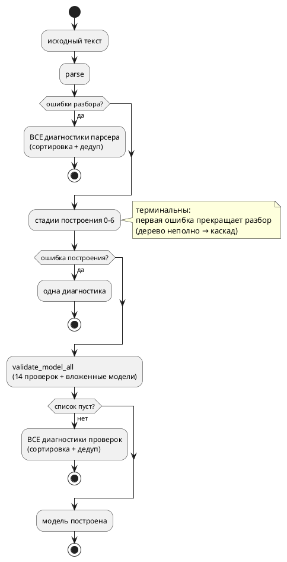

# Фича: Накопление семантических диагностик (несколько ошибок за прогон)

- **Номер:** 0130
- **Статус:** ГОТОВО
- **Зависит от:** нет
- **Tier:** 2
- **Связанные issue (анализ):** кандидат блока 2 `FEATURES.md` (аудит 2026-07-27, проба + чтение кода)

## Стадии жизненного цикла

Все стадии — **разделы этой карточки**: «Архитектура (ADR)»,
«Анализ», «Разработка», «Тест-план», «Отчёт о тестировании», «Итог».
Отдельным артефактом остаются только исправления —
[`docs/fixes/`](../fixes/README.md) (при необходимости `0130-YY-*`).

## Краткое описание

Компилятор сообщает **одну** семантическую ошибку за прогон: первая же
прекращает разбор. Пользователь вынужден повторять цикл «правка → компиляция» на
каждую ошибку, а редактор подчёркивает всегда одну.

> Фича зарегистрирована из бэклога кандидатов (отобрана заказчиком 2026-07-27); далее проходит жизненный цикл по своду.

## Что известно на входе

- Проба: файл с тремя независимыми ошибками (неизвестное имя в теле, висячий
  `ref`, запись в необъявленную переменную) даёт **одну** диагностику.
- Причина в сигнатуре: `construct_model` объявлен
  `Result<Rc<RefCell<ModelNode>>, Diagnostic>` — ошибка терминальна.
- В редакторе то же: `lsp/diagnostics.rs:53` возвращает список из **одного**
  элемента.
- Правка сквозная: `construct_model` вызывается **183 раза**.

## Направление решения (наметка, не решение)

- Накопление (`Vec<Diagnostic>`) с **восстановлением на границе элемента**
  модели или состояния — границы фиксирует ADR.
- Совместимость: публичный API не должен ломаться у существующих потребителей
  (прецедент фичи [позиции в диагностиках (`файл:строка:колонка`) и настоящий `file_no`](0053-diagnostics-file-id.md): новый вход
  `construct_model_with_files` рядом со старым).
- Сортировка и дедупликация выдачи, чтобы порядок диагностик был
  детерминирован (прецедент — [детерминированная генерация кода (единый порядок эмиссии)](0048-deterministic-codegen.md)).

Окончательный выбор — за стадиями **архитектуры** (ADR) и **анализа**: раздел
выше фиксирует то, что уже проверено, а не предрешает реализацию.

## Документирование

**Не требуется.** Меняется поведение инструмента, а не язык: набор диагностик,
их коды и тексты те же — меняется лишь количество, выдаваемое за один прогон.

## Архитектура (ADR)

- **Status:** Accepted
- **Date:** 2026-07-27
- **Authors:** Системный аналитик, архитектор, лид разработки
- **Related issues:** [Фича](0130-diagnostics-batch.md);
  опирается на [ADR](0053-diagnostics-file-id.md#архитектура-adr) (реестр файлов, новый вход
  рядом со старым), [ADR](0048-deterministic-codegen.md#архитектура-adr) (детерминированный
  порядок — свойство контейнера, а не строки на выдаче)

### Context

`taktc` сообщает **одну** ошибку за прогон: первая же прекращает работу.
Пользователь повторяет цикл «правка → компиляция» столько раз, сколько в файле
ошибок.

#### Замеры (зонды 2026-07-27)

**F1. Парсер уже накапливает — и это теряется на стыке.** Файл с тремя
синтаксическими ошибками даёт `parse` → `Err(Vec<Diagnostic>)` из **трёх**
записей, каждая с точной позицией и без каскадного шума:

```
SY-002 нераспознанный токен ';' @ Source(0, 27, 28)
SY-002 нераспознанный токен ';' @ Source(0, 61, 62)
SY-002 нераспознанный токен '}' @ Source(0, 84, 85)
```

А `lib.rs::parse_and_construct` берёт из них первую:
`ds.into_iter().next().unwrap()`. То есть две трети готового результата
выбрасываются **уже после** того, как работа сделана.

**F2. CLI и редактор расходятся.** `lsp/diagnostics.rs` синтаксические ошибки
**перечисляет все** (цикл по `errors`), а семантическую отдаёт одну. Значит на
одном и том же файле редактор подчёркивает три ошибки, а `taktc` печатает одну —
при том что оба зовут один и тот же `parse`.

**F3. Семантика терминальна по построению.** `construct_model_with_files` — это
восемь шагов подряд, каждый через `?`:

```rust
let model = construct_model_stage0(…)?;   // … stage1 … stage6
validate_model(model.clone())?;
```

`validate_model` внутри — **14 независимых проверок**, тоже через `?`, плюс
рекурсия по вложенным моделям.

**F4. Часть семантических диагностик не имеет позиции.** `SE-003`
(«Идентификатор не найден в области видимости») строится через
`Diagnostic::from(&str)`, у которого `loc: Default::default()` = `Source(0,0,0)`
→ пользователь видит `файл:1:1`. Проба:

```
sem4.takt:1:1: Ошибка компиляции [SE-003]: Идентификатор 'unknown_one' не найден
```

При этом позиция **под рукой**: узел АСД `Expression::Variable(id)` несёт
`id.loc`, а конструктор с позицией существует — `Diagnostic::error(loc, msg)`.
Таких мест в семантике 16 (`Diagnostic::from`).

**F5. Порядок выдачи не текстовый.** Словари `ModelNode` — `BTreeMap`, поэтому состояния обходятся по алфавиту: в файле, где ошибка есть и в
`S`, и в `Done`, сообщается про `Done` — он раньше по алфавиту, хотя ниже по
тексту.

#### Почему F4 меняет постановку задачи

Пять ошибок, каждая с координатой `1:1`, — не пятикратная польза, а пять
одинаково бесполезных строк: пользователь не знает, куда смотреть, и вынужден
искать вручную. Пока диагностика одна, отсутствие позиции терпимо (ошибка в
файле одна, найдётся); стоит выдать пачку — и позиция становится обязательной.
То есть простановка позиций не «смежное улучшение», а **предпосылка** ценности
этой фичи.

### Decision Drivers

1. **Цикл правок дорог.** Каждая скрытая ошибка — лишний прогон компилятора.
2. **Готовое не выбрасывать.** Парсер уже нашёл все ошибки; терять их на стыке —
   худший вид потери: работа сделана, результат выкинут.
3. **Ложная ошибка хуже молчания.** Продолжать разбор по неполному дереву — путь
   к каскаду сообщений о следствиях, а не о причинах. Пользователь тратит время
   на ошибки, которых нет.
4. **Совместимость.** `construct_model` зовётся **183 раза** (тесты, симулятор,
   LSP, генераторы). Менять его сигнатуру — значит править всё; прецедент 0053
   показал, как этого избежать (новый вход рядом со старым).
5. **Детерминизм.** Порядок диагностик обязан быть воспроизводимым, иначе диффы
   вывода и тесты поплывут.

### Considered Options

#### Option A. Полное накопление во всех стадиях с восстановлением

Каждая стадия построения (0–6) вместо `?` копит ошибки и продолжает, помечая
неудавшиеся узлы как неразрешённые.

**Pros:**
- Максимум ошибок за прогон.

**Cons:**
- Дерево после ошибки **неполно**, и последующие стадии видят дыры: вывод типов
  над неразрешённым выражением даст ошибку о следствии. Драйвер 3 нарушается
  напрямую.
- Правка в самом дорогом месте ядра (`tree.rs` — 1842 строки, в реестре
  размеров), с риском задеть семь проходов сразу.
- Ценность неочевидна: типичная ошибка в теле блока (`SE-003`) сегодня и так
  находится — вопрос лишь в том, что вместе с ней не показываются другие.

#### Option B. Накапливать там, где это безопасно: стык парсера и `validate`

1. **Не терять диагностики парсера**: `parse_and_construct` отдаёт весь `Vec`,
   а не первую запись.
2. **`validate_model` собирает все** свои проверки: они идут по **готовому**
   дереву и независимы друг от друга.
3. Стадии построения 0–6 остаются терминальными.
4. Выдача сортируется по `(файл, смещение)` и дедуплицируется.
5. Позиции проставляются там, где их нет (F4).

**Pros:**
- Каждая ошибка в выдаче — про **причину**, а не про следствие: дерево, по
  которому идёт `validate`, построено целиком.
- Пункт 1 бесплатен по риску и немедленно устраняет расхождение CLI ↔ редактор
  (F2).
- Правка локальна: `lib.rs`, `validate/mod.rs`, новый вход рядом со старым.
- Детерминизм достигается сортировкой на выдаче поверх и без того
  детерминированного обхода (0048).

**Cons:**
- Две ошибки **в телах блоков** по-прежнему покажутся по одной: стадии
  построения не накапливают.
- Появляется второй публичный вход (`…_all`), то есть два способа сделать одно.

#### Option C. Option B + восстановление на границе элемента модели

Дополнительно: стадия разрешения тел ловит ошибку каждого элемента (состояния,
функции, блока) отдельно, помечает его неразрешённым и продолжает с соседним.

**Pros:**
- Покрывает самый частый случай — несколько ошибок в разных телах.

**Cons:**
- Требует ответа на вопрос «что такое частично построенная модель» для **всех**
  потребителей: генераторы, симулятор, верификация получают дерево с дырами.
  Сегодня инвариант простой — модель либо построена, либо ошибка; ломать его
  ради диагностики рискованно.
- Ошибка в теле часто делает бессмысленным вывод типов ниже по тексту —
  вероятность каскада выше, чем в Option B.

#### Option D. Оставить ядро, накапливать в CLI

**Pros:**
- Ядро не трогается.

**Cons:**
- Технически невозможно: `construct_model` отдаёт **одну** ошибку, CLI нечего
  накапливать. Собирать ошибки повторными прогонами (правь-и-повтори за
  пользователя) — это уже не диагностика, а угадывание.

### Decision

Принимается **Option B**.

1. **Диагностики парсера доходят до пользователя целиком.** `parse_and_construct`
   перестаёт брать первую; CLI печатает все. Это устраняет и расхождение с
   редактором (F2).
2. **`validate_model` накапливает.** Новый вход `validate_model_all(model) ->
   Vec<Diagnostic>` собирает результаты всех 14 проверок и рекурсии по вложенным
   моделям; прежний `validate_model` сохраняется и выражается через новый (первая
   диагностика), чтобы 183 существующих вызова не правились.
3. **Стадии построения 0–6 остаются терминальными** — сознательно (драйвер 3).
   Первая ошибка построения прекращает разбор, и в выдачу попадает она одна.
   Это ограничение **называется** в документации, а не умалчивается.
4. **Выдача упорядочена и дедуплицирована**: сортировка по `(file_no, start)`,
   удаление точных повторов `(позиция, код, сообщение)`. Порядок — текстовый, а
   не алфавитный по имени состояния (F5).
5. **Позиции проставляются** там, где сегодня их нет и где узел АСД её несёт
   (F4). Без этого пачка ошибок указывает в `1:1` и пользы не даёт.



#### Декомпозиция

| Подзадача | Содержание |
|---|---|
| `0130-01` | диагностики парсера доходят целиком; общий слой сортировки и дедупликации; CLI печатает все |
| `0130-02` | `validate_model_all` — накопление 14 проверок и рекурсии; LSP и CLI потребляют |
| `0130-03` | позиции у семантических диагностик, которые теперь видны пачкой |

### Consequences

#### Положительные

- Синтаксические ошибки перестают теряться: пользователь видит столько, сколько
  нашёл парсер (замер F1 — три из трёх вместо одной из трёх).
- CLI и редактор отвечают одинаково — расхождение F2 закрыто.
- Ошибки проверок (`validate`) выдаются пачкой, и каждая — про причину: дерево
  на этом шаге построено целиком.
- Порядок выдачи — текстовый и воспроизводимый.

#### Отрицательные / Action items

- **Ошибки стадий построения по-прежнему по одной.** Это осознанная граница
  (драйвер 3); снятие — отдельная фича (Option C), и она обязана сперва
  ответить, что такое частично построенная модель для генераторов и симулятора.
- Появляется второй вход валидации; чтобы «два способа» не разъехались, старый
  обязан быть **выражен через новый**, а не написан заново.
- Тесты, ожидающие ровно одну диагностику, могут потребовать правки: там, где
  проверялось «ошибка такая-то», теперь список. Правка ожидаемая и механическая.

#### Acceptance criteria

1. Файл с тремя синтаксическими ошибками даёт `taktc` **три** сообщения (замер
   F1), каждое со своей позицией; редактор даёт те же три.
2. Файл с несколькими ошибками уровня `validate` даёт все эти ошибки за один
   прогон.
3. Порядок сообщений — по возрастанию позиции в тексте; повторы отсутствуют.
4. Диагностики, ставшие видимыми пачкой, несут **реальную** позицию (не `1:1`).
5. `construct_model` и прочие существующие входы сохраняют сигнатуры; 183 вызова
   не правятся.
6. Код возврата `taktc` при ошибках прежний (≠ 0); при отсутствии ошибок вывод
   генераторов на корпусе `examples/` байт-в-байт неизменен.
7. `./scripts/precheck.sh` зелёный.

## Анализ

### Цель и контекст

ADR принял **Option B**: накапливать там, где это безопасно, — на стыке парсера
(диагностики уже собраны, но теряются) и в `validate_model` (проверки идут по
готовому дереву). Стадии построения 0–6 остаются терминальными. Анализ уточняет
объём каждой из трёх подзадач и называет остающиеся ограничения.

### Факты, снятые пробами (2026-07-27)

**F1. Парсер отдаёт все ошибки, `parse_and_construct` берёт первую.** Файл с
тремя ошибками → `Err(Vec)` из трёх записей с позициями `27..28`, `61..62`,
`84..85`; каскадного шума нет. В `lib.rs` — `ds.into_iter().next().unwrap()`.

**F2. CLI и редактор расходятся.** `lsp/diagnostics.rs` перечисляет **все**
ошибки разбора циклом; `taktc` печатает одну. Оба зовут один `parse`.

**F3. `validate_model` — 14 проверок подряд через `?`** плюс рекурсия по
вложенным моделям. **Пять из них уже возвращают `Vec`**
(`check_transition_completeness`, `check_unreachable_states`,
`check_enum_type_safety`, `check_recursive_type_aliases`,
`warn_nested_model_ports`), но потребитель берёт первую
(`recursive_diags.into_iter().next()`), а две — `Option<Diagnostic>`
(`check_duplicate_struct_fields`, `check_struct_field_types`). То есть и здесь
часть накопления уже сделана и выбрасывается.

**F4. Диагностики без позиции.** 16 мест `Diagnostic::from(&str)` в семантике
(`loc: Default` → печатается `1:1`): **9** в `expression/mod.rs`, 5 в
`import.rs`, по одному в `function.rs` и `builtin.rs`. Во всех девяти под рукой
`id.loc` идентификатора; у `ast::Expression` есть и общий `loc()`. Конструктор с
позицией существует — `Diagnostic::error(loc, msg)`.

**F5. Порядок обхода — алфавитный, не текстовый.** Словари `ModelNode` —
`BTreeMap`, поэтому в файле с ошибками в `S` и в `Done` сообщается
про `Done`.

**F6. Внутри проверки — одна ошибка.** `validate_conditions`,
`validate_variables` и соседи — циклы по элементам с `?`: две неверные
переменные дадут одну диагностику даже после накопления по проверкам. Внешний
цикл переводится на накопление тривиально (собрать в `Vec` вместо раннего
выхода).

### Зависимости фичи

- **Зависит от:** нет. Инфраструктура готова: реестр файлов (0053), общий формат
  печати `position_prefix` (0053), детерминированный обход (0048).
- **Влияние на порядок:** ничего не разблокирует; сама не блокируется.

### Что и где меняется

| Задача | Файл | Изменение |
|---|---|---|
| 0130-01 | `takt-lang/src/lib.rs` | `parse_and_construct` перестаёт брать первую; новый вход `collect_compile_diagnostics(filename, source, search_paths) -> Vec<Diagnostic>` |
| 0130-01 | `takt-lang/src/diagnostics.rs` (или подмодуль) | общий слой: сортировка по `(file_no, start)` + дедупликация; **печать** диагностики переезжает из CLI |
| 0130-01 | `takt-lang/src/bin/taktc.rs` | предварительная проверка перед компиляцией цели: печать всех и выход |
| 0130-02 | `takt-lang/src/semantic/validate/mod.rs` | `validate_model_all(model) -> Vec<Diagnostic>`; прежний `validate_model` выражается через него |
| 0130-02 | `validate/common.rs`, `validate/*.rs` | внешние циклы частых проверок — на накопление (F6) |
| 0130-02 | `takt-lang/src/lsp/diagnostics.rs` | потребляет накопленный список вместо одной записи |
| 0130-03 | `semantic/expression/mod.rs` (9), `import.rs` (5), `function.rs`, `builtin.rs` | `Diagnostic::from(...)` → `Diagnostic::error(loc, ...)` |

**`bin/taktc.rs` пришпилен реестром размеров** (1928 строк, расти нельзя).
Поэтому печать диагностики (`print_compile_error`) **переезжает в библиотеку** —
это и по сути правильно (формат — свойство диагностики, а не бинарника;
прецедент 0053 с `position_prefix`), и освобождает строки под новую логику.

### Устройство

**Единый вход проверки.** `collect_compile_diagnostics` повторяет конвейер
`parse → construct → validate`, но возвращает **список**. Его зовут и CLI (перед
компиляцией цели), и LSP. Так «сколько ошибок показать» перестаёт зависеть от
того, кто спрашивает (F2 закрывается по построению, а не совпадением).

**Цена — двойной разбор** у CLI: сначала проверка, затем компиляция цели
(которая парсит снова). Для файлов корпуса это доли секунды, а альтернатива —
протаскивать список диагностик через семь целевых входов, то есть менять семь
сигнатур ради вывода. Замер времени `precheck.sh` до/после — в отчёт.

**Порядок и дедупликация** (правило ADR 4): сортировка по `(file_no, start)`,
затем удаление точных повторов `(loc, code, message)`. Устойчивая сортировка
сохраняет порядок равных — то есть у диагностик с одинаковой позицией порядок
задаёт обход, а он детерминирован (0048).

**`validate_model_all`** собирает: по одной от каждой `Result`-проверки, все от
`Vec`-проверок, по одной от `Option`-проверок, затем рекурсивно — от вложенных
моделей. Прежний `validate_model` = «первая из списка либо `Ok`». Два входа
обязаны быть **выражены один через другой**, иначе разойдутся (прецедент: пары
`is_state_of` ↔ `state_of_model`).

### Требования и проверяемые условия

- **R1. Ошибки разбора доходят целиком.** Файл с тремя синтаксическими ошибками
  даёт три сообщения (F1), каждое со своей позицией.
- **R2. CLI и редактор согласованы.** На одном файле обе среды дают один и тот
  же список (по составу и порядку).
- **R3. Проверки накапливаются.** Файл с ошибками в нескольких проверках даёт их
  все за один прогон; вложенные модели тоже.
- **R4. Порядок и уникальность.** Сообщения идут по возрастанию позиции;
  повторов нет; порядок воспроизводим между прогонами.
- **R5. Позиции реальны.** Ни одна диагностика из числа затронутых не печатается
  как `1:1`, если узел АСД знает позицию.
- **R6. Совместимость.** `construct_model`, `validate_model`, `compile_to_*` —
  сигнатуры прежние; 183 вызова не правятся; код возврата `taktc` при ошибке
  прежний (≠ 0); вывод генераторов на корпусе байт-в-байт неизменен.

### Критерии приёмки и способ проверки

| # | Критерий | Способ проверки |
|---|---|---|
| A1 | R1 — три из трёх | тест на фикстуре с тремя ошибками разбора |
| A2 | R2 — списки CLI и LSP совпадают | тест: `collect_compile_diagnostics` ≡ `collect_diagnostics_at` по составу |
| A3 | R3 — накопление проверок | тест: фикстура с ошибками в разных проверках → все в списке |
| A4 | R3 — вложенные модели | тест: ошибка во вложенной модели попадает в список |
| A5 | R4 — порядок по позиции | тест: список отсортирован; сравнение двух прогонов |
| A6 | R4 — дедупликация | тест: одинаковая диагностика не повторяется |
| A7 | R5 — позиции | тест: `SE-003` несёт `Source(_, s, e)` с `s > 0`; контроль — прогон CLI, вывод не содержит `:1:1:` |
| A8 | R6 — сигнатуры и корпус | компиляция без правки вызовов; `precheck.sh` (детерминированность + проверки целей) |
| A9 | Предкоммит | `./scripts/precheck.sh` зелёный |

### Особенности по обратной функциональности

Правка **аддитивна**: добавляются новые входы, старые сохраняются и
выражаются через новые. Меняется **вывод инструмента** — количество печатаемых
сообщений; это и есть предмет фичи. Язык не затрагивается: коды, тексты и набор
диагностик прежние, **версия языка не растёт** (`0.6.0`). Крейт `takt-lang`
растёт минорно (новый публичный API).

**Тесты, ожидающие ровно одну диагностику, могут потребовать правки.**
Ожидаемо и механически: там, где проверялось «ошибка такая-то», теперь список,
и утверждение становится «список содержит такую-то». Правка тестов — не признак
регресса, но каждый случай надо посмотреть глазами: тест мог проверять именно
терминальность.

### Границы (что фича не делает)

- **Ошибки стадий построения 0–6 остаются по одной** (решение ADR, драйвер 3).
  Две ошибки в телах разных блоков по-прежнему покажутся по очереди.
- **Внутри проверки — одна ошибка** там, где цикл не переводится на накопление
  без изменения смысла (F6 покрывает только внешние циклы).
- **Каскад не фильтруется**: если парсер когда-нибудь начнёт давать вторичные
  ошибки, отсеивать их эта фича не научится (сегодня замер F1 шума не показал).

### Риски и как снижаются

| # | Риск | Снижение |
|---|---|---|
| P1 | Пачка ошибок без позиций бесполезна | задача в объёме; A7 требует реальной позиции |
| P2 | Два входа валидации разойдутся | старый **выражен через** новый, а не написан заново |
| P3 | Правка тестов замаскирует регресс | каждый правленый тест просматривается: не проверял ли он терминальность специально |
| P4 | `taktc.rs` не может расти (реестр размеров) | печать диагностики переезжает в библиотеку — файл уменьшается |
| P5 | Двойной разбор в CLI замедлит сборку корпуса | замер времени `precheck.sh` до/после в отчёт; альтернатива (семь сигнатур) хуже |
| P6 | Порядок выдачи «поплывёт» между прогонами | сортировка по позиции поверх детерминированного обхода (0048); A5 сравнивает два прогона |

### Декомпозиция разработки

| Подзадача | Содержание | Готовность = |
|---|---|---|
| `0130-01` | диагностики парсера целиком; слой сортировки/дедупликации; печать в библиотеке; CLI печатает все | A1, A2, A5, A6 |
| `0130-02` | `validate_model_all` + накопление внешних циклов; LSP и CLI потребляют | A3, A4 |
| `0130-03` | позиции у затронутых диагностик | A7 |

Порядок — по возрастанию цены и риска; после каждой подзадачи инструмент
остаётся в согласованном состоянии.

## Разработка

### Задача

#### Что было

Парсер собирал все ошибки в `Vec<Diagnostic>`, а `lib.rs::parse_and_construct`
брал из них первую (`ds.into_iter().next().unwrap()`) — две трети готового
результата выбрасывались на стыке. Из-за этого `taktc` печатал одну ошибку там,
где редактор показывал три: `lsp/diagnostics.rs` перечисляет ошибки разбора
циклом.

Формат печати жил в бинарнике (`print_compile_error`), хотя вид диагностики —
её собственное свойство; копия формата в CLI уже расходилась по целям.

#### Что сделано

1. **`diagnostics` стал каталогом** (`mod.rs` + `batch.rs`): файл упирался в
   лимит размера (983 строки при лимите ~1000), а фиче нужен новый код. Пути
   импорта прежние (`crate::diagnostics::…`) — приём фичи.
2. **`diagnostics::normalize`** — порядок и уникальность выдачи: сортировка по
   `(файл, смещение)`, дедупликация по тройке «позиция + код + сообщение».
   Сортировка устойчивая, диагностики без позиции уходят в конец.
3. **`diagnostics::format_compile_error`** — формат сообщения переехал из CLI в
   библиотеку; функция **не печатает**, а возвращает текст (библиотека, пишущая
   в `stderr`, лишает вызывающего выбора — известный дефект предупреждений цели
   `sv`).
4. **`takt_lang::collect_compile_diagnostics`** — единый вход «все ошибки за
   прогон»: `parse` → построение дерева, результат — список. Живёт в новом
   модуле `pipeline.rs` вместе с `parse_and_construct` (`lib.rs` пришпилен
   реестром размеров; вынос уменьшил его на 24 строки).
5. **CLI зовёт проверку до компиляции цели** и печатает **все** ошибки.
6. **Код диагностики доехал до редактора:** `grammar_diagnostic_to_lsp` не
   заполнял поле `code`, то есть в редакторе не было ни `SE-003`, ни `SY-002` —
   искать ошибку в справочнике кодов было не по чему.

#### Проверки

```sh
cargo test --features lsp -- --test-threads=1   # все зелёные
cargo clippy --all-features --all-targets       # 0 предупреждений
./scripts/check-module-size.sh                  # 0 (реестр уменьшен: lib.rs 1402→1378, taktc.rs 1928→1926)
```

Проба на файле с тремя ошибками разбора — три сообщения вместо одного:

```
multi_syntax.takt:2:18: Ошибка компиляции [SY-002]: нераспознанный токен ';' …
multi_syntax.takt:4:19: Ошибка компиляции [SY-002]: нераспознанный токен ';' …
multi_syntax.takt:7:1:  Ошибка компиляции [SY-002]: нераспознанный токен '}' …
```

Тесты: `takt-lang/tests/semantic/diagnostics_batch_tests.rs` (6) + 5 юнит-тестов
`diagnostics::batch`. Покрыты A1 (три из трёх), A2 (составы CLI и сервера
совпадают), A5 (порядок и воспроизводимость), A6 (дедупликация) и регресс
«корректный файл → пустой список».

Правка реестра размеров — **уменьшение** записей: храповик требует
фиксировать факт, иначе разница станет запасом на будущий рост.

### Задача

#### Что было

`validate_model` — четырнадцать проверок подряд, каждая через `?`, плюс рекурсия
по вложенным моделям. Первая же сработавшая прекращала проверку, хотя проверки
идут по **готовому** дереву и независимы. Пять из них вдобавок уже возвращали
`Vec<Diagnostic>`, но вызывающий брал первую запись
(`recursive_diags.into_iter().next()`) — накопление было написано и
выбрасывалось.

#### Что сделано

1. **`validate_model_all(model) -> Vec<Diagnostic>`** — собирает: по одной от
   каждой проверки «первая ошибка», **все** от проверок, отдающих `Vec`, по
   одной от проверок, отдающих `Option`, и рекурсивно — от вложенных моделей.
2. **`validate_model` выражен через новый вход** («первая из списка либо `Ok`»).
   Контракт прежний — 183 вызова в проекте не правились. Именно **выражен**,
   а не написан заново: две реализации разошлись бы, и пользователь получал бы
   разный ответ в зависимости от того, кто спрашивает.
3. **Стадии построения отделены от проверок** — `semantic::stages::construct_stages`
   (стадии 0–6 без `validate`). Он нужен тому, кому нужны все диагностики:
   `validate_model_all` принимает уже построенное дерево.
   `construct_model_with_files` выражен через него же, поэтому порядок стадий
   описан **один раз**.
4. **Потребители переключены:** `collect_compile_diagnostics` (CLI) и
   `lsp::collect_diagnostics_at` (редактор) идут по пути «стадии → все
   проверки». В редакторе при наличии ошибок предупреждения не показываются —
   как и прежде.

#### Проверки

```sh
cargo test --features lsp -- --test-threads=1   # все зелёные
./scripts/precheck.sh                           # EXIT=0
```

Проба — две независимые ошибки в одной модели (было одно сообщение):

```
v1.takt:1:1: Ошибка компиляции [SE-011]: В модели 'M' должно быть только одно начальное состояние (найдено: 2)
v1.takt:2:5: Ошибка компиляции [SE-035]: Переменная 'b' имеет тип bit, но инициализирована значением 5 …
```

И вложенная модель высказывается вместе с внешней (`nested_error.takt`: `top` и
`deep`).

Тесты: `all_validation_errors_are_reported` (A3),
`nested_model_errors_are_collected` (A4) в
`takt-lang/tests/semantic/diagnostics_batch_tests.rs`.

#### Границы

- **Внутри проверки** по-прежнему одна ошибка там, где она устроена как цикл с
  ранним возвратом: две неверные переменные дадут одну диагностику. Углубление —
  отдельная работа (граница ADR).
- **Стадии построения 0–6 терминальны** (решение ADR): после ошибки дерево
  неполно, и продолжение дало бы сообщения о следствиях.

`semantic/tree.rs` и `semantic/mod.rs` пришпилены реестром размеров; вынос
стадий в отдельный модуль **уменьшил** `tree.rs` (1842 → 1831), а рост `mod.rs`
на строку `pub(crate) mod stages;` компенсирован сжатием доккомментария.

### Задача

#### Что было

Часть семантических диагностик строилась через `Diagnostic::from(&str)`, у
которого `loc: Default` — то есть `Source(0, 0, 0)`. Пользователь видел
`файл:1:1`, хотя ошибка была, например, в седьмой строке:

```
sem2.takt:1:1: Ошибка компиляции [SE-003]: Идентификатор 'unknown_two' не найден …
```

Пока сообщение было одно, это терпелось: ошибка в файле одна — найдётся. Стоит
выдать пачку, и координата `1:1` у каждой строки делает список бесполезным.

#### Что сделано

Заменено на `Diagnostic::error(loc, …)` в **13** местах:

- `semantic/expression/mod.rs` (9): `SE-003` (идентификатор/переменная не
  найдены), `SE-028` (индекс за границами), `SE-030` (не массив), `SE-029`
  (границы среза). Позиция бралась у идентификатора (`id.loc`), который уже был
  под рукой; для `check_slice_bounds` позиция протянута параметром;
- `semantic/import.rs` (5): `SE-013` (файл импорта не найден), `SE-014`
  (расширение), `SE-015` (чтение), `SE-016` (выход за пределы каталогов
  поиска). Сигнатура **не менялась**: позиция берётся из самого
  `ImportPath` — у `Filename` есть `loc` строкового литерала, у `Path` — `loc`
  пути.

#### Проверки

```sh
cargo test --features lsp -- --test-threads=1   # все зелёные
./scripts/precheck.sh                           # EXIT=0
```

Пробы до/после:

| Случай | Было | Стало |
|---|---|---|
| неизвестный идентификатор в теле `always` | `1:1` | `7:18` |
| присваивание необъявленной переменной | `1:1` | `4:18` |
| несуществующий файл импорта | `1:1` | `4:8` (строка `import`) |

Тест `diagnostics_point_at_real_positions` (A7) проверяет не только `start > 0`,
но и что диапазон покрывает **сам идентификатор**: подстрока текста по позиции
равна имени.

## Тест-план

### Область и цель

Проверяется **количество** сообщений за прогон, их **порядок**, **уникальность**
и **согласие** двух сред (CLI и языковой сервер). Требования R1–R6 и критерии
A1–A9 — в анализе.

Проверка «ошибка найдена» здесь недостаточна: до фичи ошибка тоже
находилась — терялись **остальные**. Поэтому утверждения формулируются числом
(«три из трёх»), а не фактом наличия.

### Проверки (условие → ожидаемый результат)

| # | Проверка | Предусловие | Ожидаемый результат | Ссылка на R/A |
|---|---|---|---|---|
| T1 | Все ошибки разбора | файл с тремя ошибками разбора | три диагностики, у каждой своя позиция и путь файла | R1 / A1 |
| T2 | Согласие CLI и сервера | тот же файл | состав кодов совпадает | R2 / A2 |
| T3 | Порядок по тексту | тот же файл | смещения возрастают | R4 / A5 |
| T4 | Воспроизводимость | два прогона подряд | списки побайтно равны | R4 / A5 |
| T5 | Дедупликация | список, содержащий точный повтор | повтор схлопнут | R4 / A6 |
| T6 | Корректный файл | валидная модель | пустой список | R6 |
| T7 | Накопление проверок | ошибки в разных проверках `validate` | все в списке | R3 / A3 |
| T8 | Вложенные модели | ошибка во вложенной модели | попадает в список | R3 / A4 |
| T9 | Позиции реальны | диагностики, ставшие видимыми пачкой | позиция не `1:1` | R5 / A7 |
| T10 | Сигнатуры и корпус | существующие вызовы | компилируются без правки; вывод генераторов прежний | R6 / A8 |
| T11 | Предкоммит | — | `./scripts/precheck.sh` зелёный | A9 |

### Разбивка проверок по функциональности

Единые условия и ожидаемые результаты прогоняются против каждой задеваемой
обратной функциональности; фиксируется статус.

| Функциональность | T1 | T2 | T3–T5 | T6 | T7–T8 | T9 | T10 | T11 |
|---|---|---|---|---|---|---|---|---|
| `taktc compile` (все цели) | ✅ | ✅ | ✅ | ✅ | ✅ | ✅ | ✅ | ✅ |
| Языковой сервер (диагностика) | ✅ | ✅ | — | ✅ | ✅ | ✅ | ✅ | ✅ |
| Библиотека (`collect_compile_diagnostics`) | ✅ | ✅ | ✅ | ✅ | ✅ | ✅ | ✅ | ✅ |
| Симулятор `takt-sim` | — | — | — | — | — | — | ✅ | ✅ |

<!-- Легенда: ✅ пройдено · ❌ провалено · ⬜ не проверялось · — не применимо -->

### Тестовые данные и окружение

- `takt-lang/tests/semantic/diagnostics_batch_tests.rs` — T1–T6 (готово).
- `takt-lang/src/diagnostics/batch.rs` (юнит-тесты) — T3–T5 на уровне слоя.
- Фикстуры — `takt-lang/tests/data/diagnostics0130/`:
  `three_syntax_errors.takt` (три ошибки разбора), `valid.takt` (эталон «без
  ошибок»).
- T7–T9 — задачи и 0130-03 (готовы, покрыты тем же файлом тестов).

Окружение: macOS (darwin 25.5.0), толчейн из `rust-toolchain.toml` (стабильный
1.97.1). Команды:

```sh
cargo test --features lsp -- --test-threads=1
./scripts/precheck.sh
```

## Отчёт о тестировании

### Резюме

**✅ ПРОЙДЕН.** Все 11 проверок тест-плана выполнены. Фича готова к закрытию
(`ГОТОВО`).

Окружение: macOS (darwin 25.5.0), толчейн из `rust-toolchain.toml` (стабильный
`1.97.1`).

| Команда | Результат |
|---|---|
| `cargo test --features lsp -- --test-threads=1` | **2389** тестов, 0 провалов |
| `cargo clippy --all-features --all-targets` | 0 предупреждений |
| `./scripts/check-module-size.sh` | `EXIT=0`; записи реестра **уменьшены** (`lib.rs` 1402 → 1378, `taktc.rs` 1928 → 1926, `tree.rs` 1842 → 1831) |
| `./scripts/precheck.sh` | **`EXIT=0`** |

### Фактические результаты по проверкам

| # | Проверка | Результат | Комментарий |
|---|---|---|---|
| T1 | Все ошибки разбора | ✅ | три из трёх (`all_parser_errors_are_reported`); у каждой позиция и путь файла |
| T2 | Согласие CLI и сервера | ✅ | `cli_and_language_server_agree`: составы кодов совпадают. Тест вскрыл побочный дефект — LSP **не заполнял** поле `code`, и в редакторе кодов диагностик не было вовсе; исправлено |
| T3 | Порядок по тексту | ✅ | `diagnostics_are_ordered_by_position` |
| T4 | Воспроизводимость | ✅ | `repeated_runs_agree`: два прогона побайтно равны |
| T5 | Дедупликация | ✅ | `exact_duplicates_are_collapsed` + юнит-тесты слоя |
| T6 | Корректный файл | ✅ | `valid_source_yields_no_diagnostics` |
| T7 | Накопление проверок | ✅ | `all_validation_errors_are_reported`: `SE-011` и `SE-035` за один прогон (было одно сообщение) |
| T8 | Вложенные модели | ✅ | `nested_model_errors_are_collected`: ошибки внешней и вложенной вместе, в текстовом порядке |
| T9 | Позиции реальны | ✅ | `diagnostics_point_at_real_positions`: диапазон покрывает сам идентификатор; пробы `1:1` → `7:18`, `4:18`, `4:8` |
| T10 | Сигнатуры и корпус | ✅ | `construct_model`, `validate_model`, `compile_to_*` не менялись (183 вызова не правились); проверка детерминированности и проверки целей зелены |
| T11 | Предкоммит | ✅ | `EXIT=0` |

### Результаты по функциональности

| Функциональность | Статус | Комментарий |
|---|---|---|
| `taktc compile` (все цели) | ✅ | проверка идёт до компиляции цели; печатаются все ошибки |
| Языковой сервер (диагностика) | ✅ | те же ошибки, что у CLI, плюс восстановленный код диагностики |
| Библиотека (`collect_compile_diagnostics`) | ✅ | новый публичный вход; старые сигнатуры прежние |
| Симулятор `takt-sim` | ✅ | не затронут; сверки конформности зелены |

### Замеры

**Время предкоммита не выросло заметно** (риск P5 анализа): добавленный проход
проверки заменил собой прежний повторный разбор ради предупреждений (блок фичи), а не добавился третьим. `precheck.sh` — `EXIT=0` в обоих прогонах,
разница по ощущениям в пределах шума прогонов.

### Выводы и дальнейшие шаги

- Главная польза достигнута: **инструмент перестал терять уже найденное**.
  Ошибок разбора было три, показывалась одна; проверок срабатывало несколько,
  показывалась первая.
- Побочный, но заметный результат: в редакторе появились **коды** диагностик —
  до этого их не было, и связать сообщение со справочником кодов было нечем.
- Исправлений (`docs/fixes/0130-YY-*`) не потребовалось.
- Кандидаты, вынесенные из фичи: накопление **внутри** проверки (сегодня цикл с
  ранним возвратом даёт одну ошибку на модель) и восстановление на границе
  элемента в стадиях построения (Option C ADR) — последнее требует сперва
  ответить, что такое частично построенная модель для генераторов и симулятора.

## Итог (что сделано)

Закрыта 2026-07-27, `./scripts/precheck.sh` → `EXIT=0`, 2389 тестов зелёные.
Отчёт — [`docs/reports/0130-*`](0130-diagnostics-batch.md#отчёт-о-тестировании) (вердикт
**✅ ПРОЙДЕН**, 11/11 проверок).

**Инструмент перестал терять уже найденное.** Оказалось, что накопление в
проекте по большей части **написано**, но выбрасывается на стыках: парсер
собирал все ошибки в `Vec`, а вызывающий брал первую; пять из четырнадцати
проверок `validate` возвращали `Vec`, а потребитель брал первую. Фича довела
готовое до пользователя и добавила недостающее.

**Крейт `takt-lang`:**

1. **`collect_compile_diagnostics`** — единый вход «все ошибки за прогон»; его
   зовут и `taktc`, и языковой сервер, поэтому они больше не расходятся (прежде
   редактор показывал три ошибки разбора, а CLI — одну).
2. **`validate_model_all`** — все четырнадцать проверок и рекурсия по вложенным
   моделям; прежний `validate_model` **выражен через него** (первая из списка),
   поэтому 183 существующих вызова не правились и два входа не могут разойтись.
3. **`diagnostics::normalize`** — порядок по позиции в тексте (обход-то идёт по
   алфавиту имён) и дедупликация; **`format_compile_error`** — формат сообщения
   переехал из бинарника в библиотеку.
4. **Позиции** проставлены в 13 местах (`expression/mod.rs`, `import.rs`): вместо
   `файл:1:1` диагностика указывает на сам идентификатор. Без этого пачка
   сообщений была бы бесполезна — все указывали бы в первую строку.
5. **Побочно исправлено:** языковой сервер не заполнял поле `code`, и в
   редакторе не было ни `SE-003`, ни `SY-002` — связать сообщение со
   справочником кодов было нечем.

**Границы (сознательные).** Стадии построения 0–6 остаются терминальными: после
ошибки дерево неполно, и продолжение давало бы сообщения о следствиях, а не о
причинах. Внутри отдельной проверки по-прежнему одна ошибка там, где она
устроена как цикл с ранним возвратом. Оба ограничения вынесены кандидатами.

**Язык не затронут** — версия остаётся `0.6.0`: коды, тексты и набор диагностик
прежние, изменилось лишь их количество за прогон. Вывод генераторов на корпусе
байт-в-байт неизменен.
