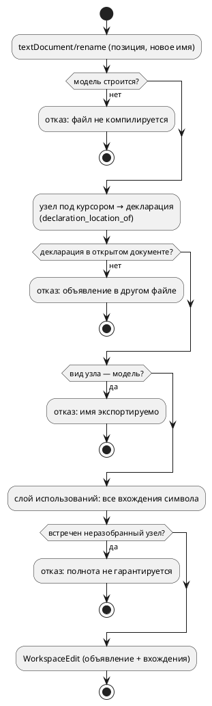

# Фича: LSP: `definition`, `references` и `rename`

- **Номер:** 0131
- **Статус:** ГОТОВО
- **Зависит от:** нет
- **Tier:** 2
- **Связанные issue (анализ):** кандидат блока 2 `FEATURES.md` (аудит 2026-07-27, чтение `bin/takt_lsp.rs`)

## Стадии жизненного цикла (правило 17)

Все стадии — **разделы этой карточки** (правило 32): «Архитектура (ADR)»,
«Анализ», «Разработка», «Тест-план», «Отчёт о тестировании», «Итог».
Отдельным артефактом остаются только исправления —
[`docs/fixes/`](../fixes/README.md) (при необходимости `0131-YY-*`).

## Краткое описание

Языковой сервер не отдаёт `textDocument/definition`, `references` и `rename`.
В редакторах, где «Go to Definition» (F12) идёт через `definitionProvider`
(например VS Code), переход **не работает**: реализован только `declaration`.

> Фича зарегистрирована из бэклога кандидатов (отобрана заказчиком 2026-07-27); далее проходит жизненный цикл по правилу 17.

## Что известно на входе

- В `ServerCapabilities` объявлены только `completion`, `hover`, `declaration`,
  `documentSymbol`, `semanticTokens`, `formatting`.
- Основание для остального уже готово: `SemanticIndex` адресует пару
  `(file_no, offset)` и знает вид узла ([кросс-файловый переход к декларации — точный путь вместо угадывания](0056-lsp-goto-exact-file.md)).
- Плагин IntelliJ делает rename **сам**, собственным PSI ([плагин IntelliJ Takt: LSP-проверка, автодополнение, документация и настройки инструментов](0125-intellij-takt-lsp-tooling.md)), — то есть одна и та же работа
  дублируется вне сервера.

## Направление решения (наметка, не решение)

По возрастанию цены:

1. `definition` как алиас `goto_declaration` — дёшево, чинит F12;
2. `references` поверх `SemanticIndex`;
3. `rename` — нужен обход всех файлов рабочей области и согласование с
   `searchPaths` (фича [lSP не читает `initializationOptions` (пути поиска импортов)](0072-lsp-initialization-options.md)).

Тесты LSP — под `#[cfg(feature = "lsp")]`: обычная `cargo build` их не видит,
ловит только `precheck.sh`.

Окончательный выбор — за стадиями **архитектуры** (ADR) и **анализа**: раздел
выше фиксирует то, что уже проверено, а не предрешает реализацию.

## Документирование (правило 24)

**Не требуется.** Возможности редактора; язык не меняется.

## Архитектура (ADR)

- **Status:** Accepted
- **Date:** 2026-07-27
- **Authors:** Системный аналитик, архитектор, лид разработки
- **Related issues:** [Фича](0131-lsp-definition-references-rename.md);
  опирается на [ADR](0056-lsp-goto-exact-file.md#архитектура-adr) (индекс адресует пару
  `(file_no, offset)`), [ADR](0072-lsp-initialization-options.md#архитектура-adr)
  (`searchPaths`), [ADR](0125-intellij-takt-lsp-tooling.md#архитектура-adr) (rename в плагине
  IntelliJ сделан **вне** сервера)

### Context

Языковой сервер `takt-lsp` объявляет `completion`, `hover`, `declaration`,
`documentSymbol`, `semanticTokens`, `formatting`. Трёх ходовых возможностей нет:

- **`textDocument/definition`.** В редакторах, где «Go to Definition» (F12) идёт
  через `definitionProvider` (VS Code — основной случай), переход **не работает
  вовсе**: реализован только `declaration`, который F12 не обслуживает. Для
  языка без раздельных объявления и определения (в Takt объявление переменной,
  состояния, функции — оно же определение) это чистая потеря.
- **`textDocument/references`.** «Найти все использования» недоступно.
- **`textDocument/rename`.** Переименование недоступно; плагин IntelliJ  делает его **сам**, собственным PSI — та же работа написана дважды.

#### Что уже есть

`SemanticIndex`  собирает записи `(start, end, SemanticNodeRef)` из
семантического дерева и умеет находить **наиболее конкретный** узел по паре
`(file_no, offset)`. Вид узла (`SemanticNodeKind`) различает **объявление**
(`Variable`, `State`, `Model`, …) и **использование** (`Reference`,
`ReferenceCondition`, `ReferenceModel`, `ReferenceState`). Функция
`goto::declaration_location_of` уже переводит любое использование в позицию его
объявления — это готовая воронка «использование → декларация».

#### Что индекс не содержит (зонд 2026-07-27)

Ключевой факт, определяющий цену фичи. Зонд строил индекс по модели с
использованиями переменной в теле функции, в блоках `enter`/`always` и в условии
ребра, а затем перебирал **все** смещения текста. Из 17 записей индекса в телах
блоков и функций не оказалось **ни одной**:

| Место использования `speed` | В индексе |
|---|---|
| условие ребра `ref Done: speed > 10;` | **да** (`ReferenceCondition`) |
| правая часть `cond Fast = speed > 3;` | **да** (`ReferenceCondition`) |
| `enter { speed := bump(speed); }` | **нет** |
| `always { speed := speed + 1; }` | **нет** |
| тело `fn bump(x) { return x + speed; }` | **нет** |

Причина конструктивная, а не пропуск сбора: обход тел в индексе **есть**
(`collect_named_block_entries` → `collect_statement_entries`), но он добавляет
записи только для **неразрешённых** узлов (`StatementNode::Unresolved`,
`ExpressionNode::Unresolved`). В успешно построенной модели тела **разрешены**, а
разрешённые узлы позиции не несут: `ExpressionNode::Variable` — это
`Rc<RefCell<VariableNode>>` без `Location`, и место, где имя было написано,
теряется при понижении. То есть у сервера сегодня **нет** позиций большинства
использований, а «найти все использования» и «переименовать» — ровно о них.

Условия рёбер уцелели по другой причине: они хранятся как
`Condition::Unresolved(ast::Condition)` — инвариант проекта (ref-рёбра не
разрешаются), поэтому АСД с позициями там жив.

#### Почему это важнее, чем кажется

`references` с неполным покрытием — неудобство. `rename` с неполным покрытием —
**порча программы**: переименуются объявление и условия рёбер, а тела блоков
останутся со старым именем, и файл перестанет компилироваться (в лучшем случае)
либо начнёт ссылаться на другую переменную (в худшем — если старое имя в области
видимости тоже существует). Поэтому архитектура обязана дать не «сколько
получится», а **полноту либо честный отказ**.

### Decision Drivers

1. **F12 обязан работать.** Самая дешёвая часть фичи закрывает самую частую боль.
2. **Полнота или отказ.** Частичное переименование недопустимо: молча испорченный
   исходник хуже отсутствующей возможности. Отказ должен приходить **до** правки
   (`prepareRename`), а не после.
3. **Одна воронка «использование → декларация».** `definition`, `references` и
   `rename` обязаны отвечать согласованно. Разъехавшись, они дадут переход в одно
   место, а переименование — в другом (прецеденты проекта: `is_state_of` ↔
   `state_of_model`, `function_needs` ↔ печатник).
4. **Не ломать ядро семантики.** Позиции использований нужны LSP; кодогенерации,
   симулятору и верификации они не нужны. Правка, добавляющая поле во все узлы
   выражений, задевает `PartialEq` (прецедент 0056: равенство обязано позицию
   игнорировать) и потому дорога и рискованна.
5. **Область видимости, а не текст.** Одноимённые символы разных моделей —
   норма (зонд: `speed` объявлена и в `Helper`, и в `Main`). Совпадение имён не
   означает совпадение символов.

### Considered Options

#### Option A. Только `definition` (алиас `declaration`)

**Pros:**
- Несколько строк; F12 чинится немедленно.
- Нулевой риск: воронка та же, что у `declaration`.

**Cons:**
- Две трети фичи не сделаны; `references`/`rename` остаются за бортом, дубль
  работы в плагине IntelliJ сохраняется.

#### Option B. Позиции использований — отдельным слоем поверх АСД

`definition` — алиас `declaration`. Для `references`/`rename` заводится **слой
использований**: обход **сырого АСД** (тот же `ast`, из которого строится модель)
собирает позиции всех вхождений идентификаторов, а принадлежность символу
решается **семантикой** — по модели-владельцу и той же функции
`declaration_location_of`, что обслуживает переход. АСД позиции не теряет: их
теряет понижение, а АСД остаётся нетронутым.

**Pros:**
- Позиции полны: тела блоков, тела функций, условия — всё, что написал автор.
- Ядро семантики не трогается вовсе; `PartialEq`, кодоген, симулятор не задеты.
- Сопоставление идёт через **уже существующую** воронку декларации — согласие
  трёх методов по построению (драйвер 3).
- Слой пригоден и для будущего (подсветка вхождений `documentHighlight`,
  иерархия вызовов).

**Cons:**
- Требуется второй обход АСД (по образцу `semantic::unused`, `validate::*`) —
  новый модуль, который придётся поддерживать при добавлении узлов языка.
- Область видимости внутри тел (локальные переменные блока, параметры функции)
  разрешается обходом самостоятельно — это логика, а не перенос строк.

#### Option C. Позиции использований — в семантических узлах (по образцу)

Добавить `Location` в `ExpressionNode::Variable`/`Call`, `ConditionNode::Variable`
и прочие ссылочные узлы, как 0056 сделала для `Extend::Model`.

**Pros:**
- Индекс получает использования «даром»: сбор уже написан, включится сам.
- Один источник позиций и для семантики, и для LSP.

**Cons:**
- Правка ядра в десятках мест построения; каждое забытое место — тихая дыра в
  покрытии, то есть ровно тот класс дефекта, что чинила 0056.
- `PartialEq` узлов обязан позицию игнорировать — иначе два вхождения одной
  переменной станут разными узлами и **поедет кодоген** (0056 уже наступала на
  это с `ModelNode::PartialEq`). Ручные реализации равенства для узлов выражений
  — большая и опасная работа.
- Цена платится всеми потребителями ядра ради одного (LSP).

#### Option D. Текстовый поиск идентификатора

**Pros:**
- Тривиально; работает и там, где модель не строится.

**Cons:**
- Не различает области видимости: `speed` из `Helper` и `speed` из `Main`
  неразличимы, переименование испортит обе.
- Ловит комментарии и строковые литералы.
- Прямо противоречит драйверу 2: полнота мнимая, ошибки молчаливые.

#### Область `rename`: сопутствующая развилка

Отдельно от способа получить позиции стоит вопрос **границ** переименования.
Единица компиляции — открытый документ плюс импортируемые им файлы; импортёры
открытого документа серверу **не видны** (рабочая область не индексируется).
Видимость в языке направлена вниз: файл видит то, что импортировал, и не видит
тех, кто импортировал его. Отсюда:

- символ, объявленный **в открытом документе**, используется только в нём же —
  переименование замкнуто и безопасно;
- символ, объявленный **в импортированном файле**, может использоваться в других,
  сервером не прочитанных файлах — полнота недостижима;
- имя **модели верхнего уровня** экспортируемо (`import { Helper as H }`,
  `start Main = Helper;` в чужом файле) — то же ограничение.

### Decision

Принимается **Option B** с ограничением области `rename`.

1. **`definition` — алиас `declaration`.** Обе возможности отвечает одна функция
   `goto_declaration_at`; `definitionProvider` объявляется в `ServerCapabilities`.
   Для Takt объявление и определение — одно и то же, поэтому разделять нечего.
2. **`references` — поверх нового слоя использований.** Слой обходит сырой АСД,
   собирая позиции вхождений; символ вхождения определяется семантикой (модель-
   владелец + `declaration_location_of`). Совпадение символа — по **позиции
   объявления** (`Location::Source(file_no, start, end)`), а не по имени: это
   единственный признак, устойчивый к одноимённым символам разных моделей.
   Ответ включает объявление (клиент управляет этим через
   `context.includeDeclaration`).
3. **`rename` — только для символа, объявленного в открытом документе.** Иначе
   `prepareRename` отвечает отказом с сообщением («объявление в файле `X`;
   переименование затронуло бы файлы вне рабочего набора»). Отказ приходит **до**
   правки. Дополнительно отказ даётся для имён **моделей** (экспортируемы) и для
   новых имён, не проходящих правило идентификатора языка либо совпадающих с
   ключевым словом.
4. **Полнота — обязанность, а не свойство.** `rename` строит `WorkspaceEdit`
   ровно из того множества, что вернул бы `references`; если слой использований
   встретил узел, который он **не умеет** разобрать (новый узел языка), он обязан
   сообщить об этом отказом всей операции, а не молча пропустить вхождение.
   Механика — по образцу форматтера (`format_source` отказывает на непокрытом
   узле, а не теряет кусок исходника).



#### Декомпозиция (правило 2)

| Подзадача | Содержание |
|---|---|
| `0131-01` | `definition` как алиас `declaration` (capability + обработчик + тесты) |
| `0131-02` | слой использований над АСД + `references` |
| `0131-03` | `rename` и `prepareRename` поверх слоя использований |

Подзадачи идут строго по возрастанию цены: каждая ценна сама по себе, и
остановка после любой оставляет сервер в согласованном состоянии.

### Consequences

#### Положительные

- F12 начинает работать в VS Code и прочих клиентах на `definitionProvider`.
- «Найти использования» покрывает **тела блоков и функций** — то, чего индекс не
  видел вовсе.
- Три метода отвечают согласованно: у них одна воронка декларации.
- Плагину IntelliJ появляется, на что перейти, — дубль rename можно снять
  отдельной фичей (кандидат).
- Ядро семантики не тронуто: кодоген, симулятор и верификация побитово прежние.

#### Отрицательные / Action items

- Появляется **второй** обход АСД, который обязан знать все узлы языка. Правило
  «добавляешь узел АСД — добавь его в обход использований» пополняет список
  сопровождения (сегодня в нём форматтер и `eval`). Механическая защита —
  исчерпывающий `match` без `_ =>` в слое использований (по образцу `eval`), чтобы новый узел валил сборку, а не покрытие.
- `rename` сознательно ограничен открытым документом: переименовать символ
  библиотеки из файла-потребителя нельзя. Снятие ограничения требует индексации
  рабочей области — отдельная фича (кандидат).
- Тесты LSP живут под `#[cfg(feature = "lsp")]` и обычной `cargo build` не
  видны — ловит только `precheck.sh`.

#### Acceptance criteria

1. `definitionProvider`, `referencesProvider`, `renameProvider` (с
   `prepareProvider`) объявлены в `ServerCapabilities`; сервер отвечает на
   `textDocument/definition`, `references`, `prepareRename`, `rename`.
2. `definition` и `declaration` на одной позиции дают **одинаковый** результат
   (тест-контроль: расхождение = отказ сборки).
3. `references` для переменной, используемой в условии ребра, в `enter`, в
   `always` и в теле функции, возвращает **все** эти вхождения; одноимённая
   переменная другой модели в ответ **не** попадает (тест на разделение
   областей видимости).
4. `rename` переименовывает объявление и все вхождения; результат применённых
   правок **компилируется** и даёт вывод цели `c`, совпадающий с выводом
   исходного текста с точностью до переименованного идентификатора (контроль
   полноты).
5. `prepareRename` отказывает: (а) на символе, объявленном в импортированном
   файле; (б) на имени модели; (в) при новом имени, не являющемся идентификатором
   или совпадающем с ключевым словом.
6. Вывод генераторов на корпусе `examples/` байт-в-байт неизменен (фича не
   трогает ядро).
7. `./scripts/precheck.sh` зелёный.

## Анализ

### Цель и контекст

ADR принял **Option B**: `definition` — алиас `declaration`, а `references`/
`rename` строятся на **слое использований поверх сырого АСД**, потому что
семантическое дерево позиции использований не хранит. Анализ уточняет, что
именно и где нужно написать, какие факты сняты пробами и какие границы у
результата.

### Факты, снятые пробами (2026-07-27)

Все четыре проверены зондами на рабочем дереве; зонды удалены после снятия.

**F1. Индекс не видит тел.** Из 17 записей `SemanticIndex` для модели с четырьмя
вхождениями `speed` в индекс попали только два — из условия ребра и из `cond`.
Вхождения в `enter`, в `always` и в теле `fn` отсутствуют (причина — в ADR:
записи создаются лишь для неразрешённых узлов).

**F2. АСД хранит позиции всех вхождений.** Тот же текст в АСД даёт
`Expression::Variable(Identifier { loc: Source(0, 68, 73), name: "speed" })` для
левой части присваивания в `always` и `Source(0, 77, 82)` для правой. То есть
материал для `references` есть — он просто не доходит до индекса.

**F3. Конец `Location` эксклюзивен, и у `Identifier` он точен.** `speed` →
`18..23` (23 − 18 = 5 = длина), `Idle` → `44..48`, `Done` → `102..106`. Это
готовый диапазон для `TextEdit`.

**А вот `loc` семантического узла — не диапазон имени.** У переменной
`SemanticNodeRef.loc` = `14..32` — **весь оператор** `var speed: u8 := 0;`.
Правка по нему затёрла бы объявление целиком. Следовательно, `rename` обязан
брать диапазоны **из АСД** (`Identifier.loc`), а не из индекса, — и для
использований, и **для самого объявления**.

**F4. Затенение реально.** Локальная `var x` в блоке затеняет одноимённую
переменную модели: цель `c` для

```takt
model M { var x: u8 := 1; start S { always { var x: u8 := 2; x := x + 1; } } }
```

печатает `uint8_t x = 2; x = x + 1;` (локальная), а поле структуры `model->x`
остаётся нетронутым. Значит слой использований **обязан** вести собственные
области видимости: без этого переименование переменной модели испортило бы
вхождения локальной (и наоборот) — молча и с сохранением компилируемости.

### Зависимости фичи (правило 17/19)

- **Зависит от:** нет. Инфраструктура готова: индекс адресует пару
  `(file_no, offset)` (0056), пути поиска приходят из `initializationOptions`
  (0072), реестр путей файлов есть (0053).
- **Влияние на порядок разработки:** ничего не разблокирует напрямую; создаёт
  основание для будущего снятия дубля rename в плагине IntelliJ (0125) —
  кандидат, не зависимость. Место в таблице `FEATURES.md` — после 0101 (по
  критерию проработанности), выше непроработанных 0132/0130.

### Что и где меняется

| Слой | Файл | Изменение |
|---|---|---|
| Слой использований | `takt-lang/src/semantic/usages/mod.rs` | типы `Usage`, `SymbolId`, `UsageTable`, вход `collect_usages` |
| — области видимости | `takt-lang/src/semantic/usages/scope.rs` | стек областей: модель → состояние → функция/блок; локальные `var`, параметры |
| — обход АСД | `takt-lang/src/semantic/usages/walk.rs` | обход элементов модели, состояний, блоков, выражений, условий, формул |
| LSP: definition | `takt-lang/src/lsp/goto.rs` | ничего (та же `goto_declaration_at`); объявление возможности — в бинарнике |
| LSP: references | `takt-lang/src/lsp/references.rs` (новый) | `references_at(path, source, position, search_paths, include_declaration)` |
| LSP: rename | `takt-lang/src/lsp/rename.rs` (новый) | `prepare_rename_at`, `rename_at` → правки для `WorkspaceEdit` |
| Сервер | `takt-lang/src/bin/takt_lsp.rs` | 4 обработчика + 3 capability |
| Реэкспорт | `takt-lang/src/lsp/mod.rs` | `pub use` новых входов |

Размер модулей держим под 1000 строк (правило `docs/CODE.md`): слой сразу
заводится каталогом из трёх файлов, тесты — отдельными интеграционными
(`takt-lang/tests/lsp/lsp_references_tests.rs`, `lsp_rename_tests.rs`).

### Устройство слоя использований

**Идентичность символа — позиция его объявляющего идентификатора**:
`SymbolId = (file_no, start)` из `Identifier.loc` объявления. Имя для этого не
годится (F4 и одноимённые символы разных моделей), семантический узел — тоже
(`Rc` локальной переменной блока живёт только внутри разрешения).

**Разрешение имени** идёт в два шага: сначала локальные области (параметры
функции, `var` блока — по правилу «ближайшее объявление выше по тексту в той же
или объемлющей области»), затем — модель: `search_var` / `search_func` /
`search_cond` / `search_state` / `search_model` (они уже обходят цепочку `upper`,
то есть вложенные модели видят внешние). Так область видимости слоя совпадает с
областью видимости семантики по построению, а не по совпадению.

**Что обходится (полный перечень мест, где встречается имя):**

1. объявления: `var`/`const`/порт (имя + инициализатор), `type`, `enum` (имя +
   варианты), `struct`, `fn` (имя, параметры, тело), `cond`, `invariant`;
2. состояния: имя, `ref Имя [: условие]`, `next Имя`, `= Выражение`
   (реализация/композиция), именованные блоки `enter`/`exit`/`always`;
3. выражения и операторы: `Variable`, `Function` (вызов), `ArraySubscript`,
   `ArraySlice`, `BitAccess`, `NamedFunction`, `Cast`, `Initializer` и все
   бинарные/унарные (рекурсивно);
4. условия: включая `S(Модель) = Состояние` (обе позиции — использования: модели
   и состояния);
5. **формулы**: `: [LTL] …`, `: [Guard] …`, `invariant` — по фиче атом
   формулы есть **использование** переменной, и `SE-036` это уже учитывает;
   пропустив их, `rename` оставил бы формулу со старым именем;
6. `address Имя = <выражение>;` — оператор адреса ссылается на **порт** по имени;
7. `import { A as B }` — привязка имени (использование `A`, объявление `B`).

**Непокрытый узел — отказ, а не пропуск.** `UsageTable` копит список мест,
которые обход не разобрал; `references` их игнорирует (ответ неполон, но
безвреден), `rename` при непустом списке **отказывает**. Механическая защита:
`match` по узлам АСД без `_ =>` (`deny(clippy::wildcard_enum_match_arm)`, образец
— `takt-sim/src/eval/`), чтобы новый узел языка валил **сборку**, а не покрытие.
`ast::Expression` помечен `#[non_exhaustive]`, но внутри своего крейта это
ограничение не действует — исчерпывающий `match` возможен.

### Требования и проверяемые условия

- **R1. `definition` = `declaration`.** Обе возможности отвечает
  `goto_declaration_at`; на любой позиции результаты совпадают.
- **R2. Полнота `references`.** Для переменной модели ответ содержит объявление и
  **все** вхождения: условие ребра, `enter`, `exit`, `always`, тело функции,
  инициализатор другой переменной, формула.
- **R3. Раздельность областей.** Одноимённая переменная другой модели и
  **затеняющая локальная** переменная в ответ не попадают; и наоборот — запрос
  на локальной переменной возвращает только её вхождения (F4).
- **R4. Точность диапазонов.** Каждая правка покрывает ровно идентификатор
  (`Identifier.loc`, F3), а не оператор целиком и не хвостовой разделитель.
- **R5. Отказ вместо частичной правки.** `prepareRename` отказывает, если:
  объявление лежит вне открытого документа; символ — имя модели; новое имя не
  идентификатор языка либо ключевое слово; обход встретил неразобранный узел.
- **R6. Совместимость.** Вывод генераторов на `examples/` байт-в-байт неизменен;
  прежние возможности LSP не затронуты (правило 11 — правка аддитивна).

### Критерии приёмки и способ проверки

| # | Критерий | Способ проверки |
|---|---|---|
| A1 | `definitionProvider`, `referencesProvider`, `renameProvider{prepareProvider}` объявлены | тест на `ServerCapabilities`; ручная проба в редакторе |
| A2 | `definition` ≡ `declaration` на наборе позиций | тест-контроль в `lsp_goto_tests` (расхождение = красный) |
| A3 | R2 — полнота на модели со всеми видами вхождений | `lsp_references_tests`: ожидаемое множество диапазонов |
| A4 | R3 — одноимённые и затеняющие символы разделены | `lsp_references_tests` на фикстуре из F4 |
| A5 | R4 — диапазоны точны | сравнение подстроки текста по диапазону с именем символа |
| A6 | Полнота `rename`: применённые правки дают текст, который **компилируется**, а вывод цели `c` совпадает с выводом исходного текста с точностью до переименованного идентификатора | `lsp_rename_tests`: применить правки → `compile_to_c` → сравнить с эталоном после текстовой замены имени |
| A7 | R5 — все четыре отказа | `lsp_rename_tests`: четыре случая, каждый ожидает отказ |
| A8 | R6 — корпус не сдвинулся | `precheck.sh` (детерминированность + проверки целей) |
| A9 | `./scripts/precheck.sh` зелёный | прогон |

A6 — главный контроль фичи: он ловит именно **частичное** переименование,
которое компиляцией не всегда отлавливается (F4: затенение оставляет текст
компилируемым, меняя смысл). Поэтому сверяется не «компилируется», а «даёт тот же
код».

### Особенности по обратной функциональности

Правка **аддитивна** (правило 11): добавляются новые методы LSP и новый
семантический слой; существующие входы (`goto_declaration*`, `hover`,
`completion`, диагностики, форматирование) не меняются, сигнатуры прежние. Язык
не затрагивается — ни синтаксис, ни семантика, ни диагностики: **версия языка не
растёт** (`0.6.0` остаётся), крейт `takt-lang` растёт минорно (новый публичный
API).

### Границы (что фича сознательно не делает)

- **Рабочая область не индексируется.** `references` ищет вхождения в открытом
  документе; символ, объявленный в импортированном файле, покажет своё
  объявление и вхождения **здесь**, но не в других файлах-потребителях.
- **`rename` не переименовывает за пределами документа** — по той же причине
  (см. отказ R5). Снятие ограничения — отдельная фича (индексация рабочей
  области + слежение за файлами).
- **Внешние артефакты не правятся.** Имя порта встречается ещё и в карте адресов
  (`--address-map`, `.ld`), имя константы — в `--define`, имена портов — в
  сценариях симулятора. Это файлы вне документа и вне языка; `rename` их не
  видит. Ограничение фиксируется в README и в карточке фичи.
- **Имена моделей не переименовываются** (экспортируемы через `import`).

### Риски и как снижаются

| # | Риск | Снижение |
|---|---|---|
| P1 | Слой использований разойдётся с семантикой в разрешении имён | разрешение идёт **через** `search_*` семантики; собственная логика — только локальные области (параметры, `var` блока) |
| P2 | Новый узел языка молча выпадет из покрытия | исчерпывающий `match` без `_ =>` + `deny(wildcard_enum_match_arm)`; правило пополняет список сопровождения (форматтер, `eval`, слой использований) |
| P3 | Частичный `rename` испортит исходник | принцип «полнота или отказ» (R5) + контроль A6 (сверка порождённого C) |
| P4 | Диапазоны съедят соседний символ | брать `Identifier.loc` (F3), не `loc` семантического узла; контроль A5 |
| P5 | Модуль перерастёт лимит размера | слой сразу разделён на три файла; тесты — интеграционные, вне `src` |
| P6 | Тесты LSP не видны обычной сборкой | они под `#[cfg(feature = "lsp")]`; ловит `precheck.sh` — проверять им, а не голым `cargo test` |

### Декомпозиция разработки (правило 2)

| Подзадача | Содержание | Готовность = |
|---|---|---|
| `0131-01` | `definition` как алиас `declaration`: capability, обработчик, тесты, README | A1 (в части `definition`), A2 |
| `0131-02` | слой использований (`semantic/usages/`) + `textDocument/references` | A1 (references), A3, A4, A5 |
| `0131-03` | `prepareRename`/`rename` поверх слоя | A1 (rename), A6, A7 |

Каждая подзадача самодостаточна: остановка после любой оставляет сервер в
согласованном состоянии.

## Разработка

### Задача

#### Что было

Сервер объявлял `declarationProvider`, но не `definitionProvider`, и метод
`textDocument/definition` возвращал «метод не найден». В редакторах, где F12 идёт
через `definition` (VS Code — основной случай), переход **не работал вовсе**,
хотя вся его логика в проекте есть с фичи.

Список возможностей строился литералом внутри `bin/takt_lsp.rs`, то есть «что
объявлено» никакой тест не видел: бинарник тестами не покрывается.

#### Что сделано

1. **Список возможностей вынесен в библиотеку** — `lsp::server_capabilities()`
   (`takt-lang/src/lsp/capabilities.rs`, новый модуль). Бинарник теперь зовёт
   функцию, а не строит структуру сам. Вынос сделан **ради проверяемости**, а не
   ради размера: тот же довод, по которому фича вынесла в библиотеку разбор
   `initializationOptions`.
2. **Добавлен `definition_provider`** рядом с `declaration_provider`.
3. **Один обработчик на оба метода:** ветка `match` в `handle_request` стала
   `GotoDeclaration::METHOD | GotoDefinition::METHOD`. Типы параметров и ответа у
   методов совпадают (`GotoDeclarationParams = GotoDefinitionParams`,
   `GotoDeclarationResponse = GotoDefinitionResponse` в `lsp-types` 0.97),
   поэтому объединение бесплатно и не требует второго разбора.

**Почему именно одна ветка, а не два одинаковых обработчика.** Разъехаться
`definition` и `declaration` могут ровно одним способом — раздвоением кода;
одинаковый текст в двух местах живёт до первой правки одного из них. Прецеденты
проекта на этом уже стоят: `is_state_of` ↔ `state_of_model`, `function_needs` ↔
печатник. Контроль в тестах ловит именно раздвоение.

**Что не менялось:** ни `goto_declaration_at`, ни индекс, ни семантика. Логика
перехода прежняя — расширился только список входов, через которые её зовут.
Правка аддитивна (правило 11): прежние возможности объявляются в том же составе,
их тесты не тронуты.

#### Проверки

```sh
cargo build --features lsp --bin takt-lsp
cargo test --features lsp -- --test-threads=1     # все зелёные (989 в lib + интеграционные)
cargo clippy --all-features --all-targets         # 0 предупреждений
./scripts/check-module-size.sh                    # 0; новых нарушителей нет
```

Новый файл тестов — `takt-lang/tests/lsp/lsp_definition_tests.rs` (4 теста):

| Тест | Что доказывает | Критерий |
|---|---|---|
| `both_providers_are_advertised` | объявлены обе возможности | A1 |
| `server_handles_both_methods_in_one_branch` | у методов **один** обработчик; второй `GotoDefinition::METHOD` в файле = красный тест | A2 |
| `shared_entry_resolves_every_reference_kind` | общий вход разрешает переход по переменной в условии, по имени состояния и по имени модели | A2 |
| `cursor_beyond_text_yields_nothing` | позиция вне текста не роняет сервер | — |

Плюс два юнит-теста в `capabilities.rs`: обе возможности перехода объявлены и
прежний состав возможностей не потерян при выносе.

Замечено при написании тестов: курсор **на ключевом слове `model`** даёт
переход к самой модели — её диапазон покрывает всё тело. Это поведение с фичи, задача его не меняет; контроль «нет перехода» поэтому стоит на позиции **за
пределами текста**, а не на ключевом слове.

### Задача

#### Что было

Позиций использований у сервера не было. `SemanticIndex` видит вхождения только
там, где узел остался **неразрешённым** (условия рёбер живут как
`Condition::Unresolved` — инвариант проекта), а в успешно построенной модели тела
`enter`/`always` и тела функций разрешены, и позиция имени при понижении
теряется: `ExpressionNode::Variable` — это `Rc<RefCell<VariableNode>>` без
`Location`. Замер F1 анализа: из 17 записей индекса на четыре вхождения `speed`
пришлось два.

#### Что сделано

**1. Слой использований `takt-lang/src/semantic/usages/`** (3 модуля + тесты):

- `mod.rs` — `SymbolId`, `Usage`, `UsageKind`, `UsageTable`, вход
  `collect_usages(&ast)`;
- `scope.rs` — стек областей: уровни моделей (снаружи внутрь) и локальные
  уровни; реестр членов каждой модели;
- `walk.rs` — обход АСД.

**Идентичность символа — позиция его объявляющего идентификатора**
(`SymbolId = (file_no, start)`). Ни имя (одноимённые символы разных моделей —
норма), ни семантический узел (его `loc` покрывает **весь оператор**) для этого
не годятся.

**Области видимости воспроизводятся структурой обхода**, а не берутся из
`search_*`: стек уровней моделей даёт ровно то же, что цепочка `upper`, а
локальные области (параметры, `var` блока) семантика в нужном виде не отдаёт
вовсе. Это уточнение к анализу: там предполагалось звать `search_*`, но они
возвращают узел без позиции **имени** — то есть решают другую задачу.

**Реестр членов модели** заведён ради одной формы: `S(Ping) = End` адресует
состояние **соседней** модели, которой в стеке нет. Без него правая часть
оставалась бы неразрешённой и переименование состояния отказывало бы на ровном
месте. Предпроход `register_members` собирает членов каждой именованной модели;
перечень объявлений — **один на оба потребителя** (`each_declaration`), иначе они
дали бы разный ответ на «что объявлено в модели».

**Охват** (проверен тестами): объявления и инициализаторы, тела функций и
параметры, тела `enter`/`exit`/`always`, условия рёбер и `cond`, `invariant`,
формулы LTL/Guard, `ref`/`next`, `S(Модель) = Состояние`, оператор `address`,
ссылки на типы (`var x: MyAlias`), композиция (`= A | B`), имена, вводимые
`import`.

**2. Правило «полнота или отказ» — механически.** `walk.rs` объявляет
`#![deny(clippy::wildcard_enum_match_arm)]`: `_ =>` по узлу языка не соберётся,
и новый узел валит **сборку**, а не покрытие (образец — `takt-sim/src/eval/`). Дополнительно `UsageTable` копит:

- `unsupported` — узлы, которые обход не разобрал (сегодня только
  `Statement::Error` — текст с ошибкой разбора);
- `unresolved` — имена, которые не связались с объявлением файла (символ из
  импорта, вариант перечисления чужого файла).

Оба списка нужны задаче: переименование при непустом `unsupported` либо
при совпадении имени с `unresolved` обязано отказаться.

**3. `textDocument/references`** — `lsp::references_at` (`lsp/references.rs`, 42
строки: вся работа в слое) + `references_provider` в возможностях + обработчик в
сервере. `context.includeDeclaration` уважается.

#### Проверки

```sh
cargo test --features lsp -- --test-threads=1   # все зелёные
cargo clippy --all-features --all-targets       # 0 предупреждений
./scripts/check-module-size.sh                  # 0
```

| Тесты | Что доказывают | Критерий |
|---|---|---|
| `semantic::usages::tests` (10) | полнота по телам блоков и функции; затенение; одноимённые модели; вложенная модель видит внешнюю; `ref`/`S(M)=State`; формула LTL; `address`; неразрешённое имя; **корпус `examples/` разобран целиком** | A3, A4, A5 |
| `tests/lsp_references_tests.rs` (7) | возможность объявлена; ответ включает тела; `includeDeclaration`; соседняя модель не попадает; затеняющая локальная — отдельный символ; курсор вне имени и битый текст не роняют сервер | A1, A3, A4, A5 |

Замечание на будущее: `walk.rs` — 843 строки при лимите ~1000. Задача
кладёт `rename` в **отдельный** модуль `lsp/rename.rs`, а не сюда.

`semantic/mod.rs` пришпилен реестром размеров: строка `pub mod usages;`
потребовала ужать соседний доккомментарий (`minimap`) — иначе храповик
`check-module-size.sh` отказывает. Это замысел реестра, а не помеха.

#### Отклонения от анализа

1. **Разрешение имён — собственное, не через `search_*`** (причина выше). Риск
   P1 («слой разойдётся с семантикой») закрывается не общим кодом, а тестами на
   поведение: затенение, вложенность, одноимённые модели.
2. **Слой не требует `ModelNode`** — работает по чистому АСД. Это упростило вход
   (`collect_usages(&ast)`) и сняло зависимость от успешного построения модели:
   вхождения находятся и в тексте, который семантика отвергла.

### Задача

#### Что было

Переименования у сервера не было; плагин IntelliJ делал его сам, собственным
PSI. Слой использований  уже давал полный список
вхождений и точные диапазоны — оставалось превратить их в правки и, главное,
решить, **когда переименовывать нельзя**.

#### Что сделано

**`takt-lang/src/lsp/rename.rs`** — два входа и типизированный отказ:

- `prepare_rename_at(source, position) -> Result<Range, RenameRefusal>`;
- `rename_at(source, position, new_name) -> Result<Vec<TextEdit>, RenameRefusal>`;
- `RenameRefusal` с сообщением для пользователя (`message()`).

**Причины отказа** (все проверяются тестами):

| Причина | Когда |
|---|---|
| `Unparsable` | текст не разбирается — областей видимости нет |
| `NoSymbol` | под курсором нет имени |
| `ForeignDeclaration` | имя объявлено вне открытого документа |
| `ModelName` | имя модели: экспортируемо через `import` |
| `Incomplete` | обход встретил незнакомый узел **либо** то же имя где-то не связалось |
| `NotAnIdentifier` / `Keyword` | новое имя не идентификатор либо ключевое слово |

**Проверки, не зависящие от нового имени, живут в одном месте** (`prepared`):
разъехавшись, `prepareRename` разрешил бы то, на чём `rename` затем откажет, —
худший сценарий для пользователя (ввёл имя, получил ошибку).

**Правила идентификатора берутся у лексера**: `XID_Start`/`XID_Continue` плюс
`_`/`$` и `lexer::is_keyword`. Второй список ключевых слов разъехался бы с
языком, поэтому его нет. Следствие: кириллическое имя допустимо (тест это
фиксирует) — так же, как его принимает сам лексер.

**Сервер**: `renameProvider` с `prepareProvider: true` + обработчики
`textDocument/prepareRename` и `textDocument/rename`. Отказ уходит клиенту как
ошибка запроса с текстом причины — редактор его показывает.

#### Проверки

```sh
cargo test --features lsp -- --test-threads=1   # 2375 тестов, все зелёные
cargo clippy --all-features --all-targets       # 0 предупреждений
./scripts/precheck.sh                           # EXIT=0
```

`takt-lang/tests/lsp/lsp_rename_tests.rs` — 12 тестов. Главный —
`rename_is_complete_generated_c_matches_reference`: применённые правки
сравниваются с эталоном (тот же текст со сплошной заменой имени) **и**
порождённый целью `c` код обоих вариантов сверяется побайтно.

Почему сверка кода, а не «скомпилировалось»: частичное переименование при
затенении оставляет текст **компилируемым**, меняя смысл (замер F4 анализа).
Проверка «собралось» такой дефект пропустила бы; сверка вывода — нет.

Ловушка фикстуры (замечена при написании теста): `compile_to_c` берёт имя
корневой анонимной модели **из имени файла**, и если оно совпадает с именем
вложенной модели, кодоген не находит её состояний (`CC-005`). В тесте файл
зовётся `Plant`, модель — `Machine`.

Clippy ругается на `HashMap<Uri, …>` (`mutable_key_type`): `Uri` из
`lsp-types` несёт кэш разбора. Тип ключа задан протоколом
(`WorkspaceEdit.changes`), поэтому в этом месте стоит точечный `allow` с
обоснованием, а не обход типа.

#### Что сознательно не делается

- Переименование за пределами открытого документа (нужна индексация рабочей
  области — отдельная фича).
- Правка внешних артефактов: карта адресов `--address-map`, `--define`, сценарии
  симулятора содержат те же имена, но живут вне языка и вне документа.

## Тест-план

### Область и цель

Проверяется поведение трёх методов LSP и — главное — их **согласие** и
**полнота**. Требования R1–R6 и критерии A1–A9 — в анализе. Ключевая мысль
плана: у `references` цена ошибки — неудобство, у `rename` — испорченный
исходник, поэтому проверки `rename` строятся не на «не упало», а на **сверке
порождённого кода**.

Все проверки идут под `--features lsp`: без флага тесты LSP не собираются и
не видны обычной `cargo test` (ловит только `precheck.sh`).

### Проверки (условие → ожидаемый результат)

| # | Проверка | Предусловие | Ожидаемый результат | Ссылка на R/A |
|---|---|---|---|---|
| T1 | Объявлены `declarationProvider` и `definitionProvider` | `server_capabilities()` | оба `Some` | R1 / A1 |
| T2 | Прежние возможности не потеряны при выносе списка в библиотеку | `server_capabilities()` | hover, completion, documentSymbol, formatting, semanticTokens, sync — на месте | R6 / A1 |
| T3 | У `definition` и `declaration` **один** обработчик | исходник `bin/takt_lsp.rs` | ровно одна ветка, содержащая оба метода; второго `GotoDefinition::METHOD` нет | R1 / A2 |
| T4 | Общий вход разрешает переход по всем видам ссылок | переменная в условии ребра, имя состояния, имя модели | переход найден в каждом случае | R1 / A2 |
| T5 | Курсор вне текста | позиция (999, 0) | `None`, сервер не падает | — |
| T6 | Полнота `references` | переменная модели, используемая в условии ребра, `enter`, `exit`, `always`, теле `fn`, инициализаторе, формуле | в ответе все вхождения + объявление | R2 / A3 |
| T7 | Одноимённая переменная другой модели | две модели с `speed` | вхождения второй модели в ответ **не** попадают | R3 / A4 |
| T8 | Затеняющая локальная переменная | фикстура F4 анализа (`var x` модели + `var x` в блоке) | запрос на переменной модели не возвращает вхождения локальной, и наоборот | R3 / A4 |
| T9 | Точность диапазонов | любой ответ `references` | подстрока текста по каждому диапазону равна имени символа | R4 / A5 |
| T10 | Полнота `rename` (главный контроль) | переименование переменной, используемой во всех местах T6 | применённые правки → текст компилируется, и вывод цели `c` совпадает с выводом исходного текста после текстовой замены имени | R5 / A6 |
| T11 | Отказ: объявление вне открытого документа | символ из импортированного файла | `prepareRename` отказывает | R5 / A7 |
| T12 | Отказ: имя модели | курсор на имени модели | `prepareRename` отказывает | R5 / A7 |
| T13 | Отказ: новое имя — не идентификатор | новое имя `2x` либо с пробелом | `rename` отказывает | R5 / A7 |
| T14 | Отказ: новое имя — ключевое слово | новое имя `state` | `rename` отказывает | R5 / A7 |
| T15 | Отказ: непокрытый узел | обход вернул непустой список неразобранного | `rename` отказывает целиком (правок не выдаёт) | R5 / A7 |
| T16 | Корпус не сдвинулся | `examples/` | вывод генераторов байт-в-байт прежний | R6 / A8 |
| T17 | Предкоммит | — | `./scripts/precheck.sh` зелёный | A9 |

### Разбивка проверок по функциональности

Единые условия и ожидаемые результаты прогоняются против каждой задеваемой
обратной функциональности (правило 11); фиксируется статус.

| Функциональность | T1 | T2 | T3 | T4 | T5 | T6–T9 | T10–T15 | T16 | T17 |
|---|---|---|---|---|---|---|---|---|---|
| LSP `definition` (0131-01) | ✅ | ✅ | ✅ | ✅ | ✅ | — | — | ✅ | ✅ |
| LSP `declaration` (0056, регресс) | ✅ | ✅ | ✅ | ✅ | ✅ | — | — | ✅ | ✅ |
| LSP `references` (0131-02) | ✅ | — | — | — | ✅ | ✅ | — | ✅ | ✅ |
| LSP `rename` (0131-03) | ✅ | — | — | — | ✅ | — | ✅ | ✅ | ✅ |
| Прочие возможности LSP (hover, completion, symbols, formatting, semantic tokens) | — | ✅ | — | — | — | — | — | ✅ | ✅ |
| Компилятор `taktc` (все цели) | — | — | — | — | — | — | — | ✅ | ✅ |
| Симулятор `takt-sim` | — | — | — | — | — | — | — | — | ✅ |

<!-- Легенда: ✅ пройдено · ❌ провалено · ⬜ не проверялось · — не применимо -->

### Тестовые данные и окружение

- `takt-lang/tests/lsp/lsp_definition_tests.rs` — T1, T3, T4, T5.
- `takt-lang/src/lsp/capabilities.rs` (юнит-тесты) — T1, T2.
- `takt-lang/tests/lsp/lsp_references_tests.rs` — T6–T9 (готово; плюс
  10 юнит-тестов слоя в `takt-lang/src/semantic/usages/tests.rs`).
- `takt-lang/tests/lsp/lsp_rename_tests.rs` — T10–T15 (готово, 12 тестов).
- Фикстуры: модель со всеми видами вхождений; пара одноимённых моделей; модель с
  затенением из F4 анализа; пара файлов с `import` для T11.

Окружение: macOS (darwin 25.5.0), толчейн из `rust-toolchain.toml` (стабильный
1.97.1). Команды:

```sh
cargo test --features lsp -- --test-threads=1
./scripts/precheck.sh
```

## Отчёт о тестировании

### Резюме

**✅ ПРОЙДЕН.** Все 17 проверок тест-плана выполнены и зелены. Фича готова к
закрытию (`ГОТОВО`).

Окружение: macOS (darwin 25.5.0), толчейн из `rust-toolchain.toml` (стабильный
`1.97.1`). Прогоны:

| Команда | Результат |
|---|---|
| `cargo test --features lsp -- --test-threads=1` | **2375** тестов, 0 провалов |
| `cargo clippy --all-features --all-targets` | 0 предупреждений |
| `./scripts/check-module-size.sh` | `EXIT=0`, новых нарушителей нет |
| `./scripts/precheck.sh` | **`EXIT=0`** (включая проверки `c`/`c-hal`/`st` (`iec2c` 8/8), `sv` (verilator + yosys), детерминированность, примеры `book/`) |

Новых тестов фичи — **29**: 4 (`lsp_definition_tests`) + 7
(`lsp_references_tests`) + 12 (`lsp_rename_tests`) + 10 юнит-тестов слоя
(`semantic::usages::tests`) − 4 пересечения по нумерации задач (юнит-тесты слоя
считаются отдельно от интеграционных).

### Фактические результаты по проверкам

| # | Проверка | Результат | Комментарий |
|---|---|---|---|
| T1 | Объявлены `declarationProvider` и `definitionProvider` | ✅ | `capabilities::declaration_and_definition_are_both_advertised`; заодно объявлены `referencesProvider` и `renameProvider{prepareProvider: true}` |
| T2 | Прежние возможности не потеряны при выносе списка в библиотеку | ✅ | `previously_advertised_capabilities_are_kept` (hover, completion, symbols, formatting, semanticTokens, sync) |
| T3 | У `definition` и `declaration` один обработчик | ✅ | `server_handles_both_methods_in_one_branch`: ровно одна ветка с обоими методами, второго `GotoDefinition::METHOD` в файле нет |
| T4 | Переход по всем видам ссылок | ✅ | `shared_entry_resolves_every_reference_kind`: переменная в условии, имя состояния, имя модели |
| T5 | Курсор вне текста | ✅ | `cursor_beyond_text_yields_nothing`; курсор **на ключевом слове** `model` штатно даёт переход к модели (поведение с 0056), поэтому контроль стоит за пределами текста |
| T6 | Полнота `references` | ✅ | `usages_cover_block_and_function_bodies` (9 вхождений: объявление, инициализатор, `cond`, тело `fn`, `enter`×2, `always`×2, условие ребра) + `variable_in_ltl_formula_is_a_usage` + `references_include_block_and_function_bodies` |
| T7 | Одноимённая переменная другой модели | ✅ | `same_name_in_two_models_are_distinct_symbols`, `same_name_in_other_model_is_not_returned` |
| T8 | Затеняющая локальная переменная | ✅ | `local_variable_shadows_model_variable`, `shadowing_local_is_a_separate_symbol`: у затенённой переменной модели остаётся только объявление |
| T9 | Точность диапазонов | ✅ | подстрока текста по каждому диапазону равна имени; `prepare_returns_exact_identifier_range` отдельно фиксирует, что правка не покрывает оператор целиком |
| T10 | Полнота `rename` (главный контроль) | ✅ | `rename_is_complete_generated_c_matches_reference`: применённые правки = эталон, **и** порождённый код цели `c` совпадает побайтно |
| T11 | Отказ: объявление вне открытого документа | ✅ | `foreign_symbol_is_refused` → `RenameRefusal::ForeignDeclaration` |
| T12 | Отказ: имя модели | ✅ | `model_name_is_refused` — и на `prepareRename`, и на `rename` |
| T13 | Отказ: новое имя — не идентификатор | ✅ | `non_identifier_new_name_is_refused` (`2speed`, имя с пробелом, пустое, с дефисом) |
| T14 | Отказ: новое имя — ключевое слово | ✅ | `keyword_new_name_is_refused` (`state`, `model`, `var`, `fn`) |
| T15 | Отказ: непокрытый узел | ✅ | проверяется конструктивно: `deny(clippy::wildcard_enum_match_arm)` в `walk.rs` + `examples_corpus_is_fully_covered` (корпус разобран целиком) + `unknown_name_is_reported_unresolved` |
| T16 | Корпус не сдвинулся | ✅ | `precheck.sh`: проверка детерминированности (два прогона × все цели → `diff -r`) и проверки целей зелены — вывод генераторов не изменился |
| T17 | Предкоммит | ✅ | `./scripts/precheck.sh` → `EXIT=0` |

### Результаты по функциональности

| Функциональность | Статус | Комментарий |
|---|---|---|
| LSP `definition` (0131-01) | ✅ | новая возможность; общий обработчик с `declaration` |
| LSP `declaration` (0056, регресс) | ✅ | поведение не изменилось: та же функция, те же тесты зелены |
| LSP `references` (0131-02) | ✅ | новая возможность поверх слоя `semantic::usages` |
| LSP `rename` (0131-03) | ✅ | новая возможность; принцип «полнота или отказ» |
| Прочие возможности LSP | ✅ | список возможностей вынесен в библиотеку без потерь (T2) |
| Компилятор `taktc` (все цели) | ✅ | ядро не тронуто; вывод байт-в-байт прежний (T16) |
| Симулятор `takt-sim` | ✅ | не затронут; сверки конформности зелены |

### Отклонения от анализа (зафиксированы, не дефекты)

1. **Разрешение имён — собственное, а не через `search_*`.** Анализ
   предполагал переиспользовать поиск семантики; на деле её `search_*` отдают
   узел, чей `loc` покрывает **весь оператор**, а слою нужна позиция имени.
   Согласие со семантикой обеспечено не общим кодом, а тестами на поведение
   (затенение, вложенность, соседние модели).
2. **Слою не нужен `ModelNode`** — он работает по чистому АСД. Побочная польза:
   вхождения находятся и в тексте, который семантика отвергла.
3. **Реестр членов модели** добавлен сверх плана — ради формы `S(Ping) = End`,
   адресующей состояние соседней модели.

### Выводы и дальнейшие шаги

- Главный риск фичи (P3 анализа — частичное переименование) закрыт контролем,
  который сверяет **порождённый код**, а не факт компиляции: при затенении
  испорченный файл продолжает компилироваться, и проверка «собралось» дефект бы
  пропустила.
- Исправлений (`docs/fixes/0131-YY-*`) не потребовалось.
- Кандидаты, вынесенные из фичи (в блок 2 `FEATURES.md`): индексация рабочей
  области (снимет ограничение `rename` одним документом и даст `references` по
  всем файлам) и снятие дубля rename в плагине IntelliJ (фича делает его
  собственным PSI).

## Итог (что сделано)

Закрыта 2026-07-27, `./scripts/precheck.sh` → `EXIT=0`, 2375 тестов зелёные.
Отчёт — [`docs/reports/0131-*`](0131-lsp-definition-references-rename.md#отчёт-о-тестировании)
(вердикт **✅ ПРОЙДЕН**, 17/17 проверок).

**Крейт `takt-lang`.** Три возможности LSP и один новый семантический слой:

1. **`textDocument/definition`** — объявлен рядом с `declaration` и обслуживается
   **той же** веткой: в Takt объявление и определение — одно и то же. Прежде F12
   в VS Code не работал вовсе. Список возможностей вынесен в библиотеку
   (`lsp::server_capabilities`) — чтобы «что объявлено» проверял тест, а не глаз.
2. **Слой использований `semantic::usages`** (`mod`/`scope`/`walk`) — обходит
   **сырой АСД** и ведёт собственные области видимости. Заведён потому, что
   семантическое дерево позиций использований не хранит: `SemanticIndex` видит
   вхождения лишь там, где узел остался неразрешённым (условия рёбер), а в телах
   `enter`/`always` и функций позиция теряется при понижении. Идентичность
   символа — позиция его объявляющего идентификатора: имя не годится
   (одноимённые символы разных моделей, затенение локальной `var`), узел
   семантики тоже (его `loc` покрывает весь оператор).
3. **`textDocument/references`** — поверх слоя; охват включает тела блоков и
   функций, формулы LTL/Guard, `S(Модель) = Состояние`, оператор `address`.
4. **`textDocument/rename` + `prepareRename`** — по принципу **полнота или
   отказ**: семь типизированных причин отказа, каждая с сообщением, и отказ
   приходит **до** ввода нового имени.

**Ключевые решения.** Полнота охраняется механически
(`deny(clippy::wildcard_enum_match_arm)` в обходе: новый узел языка валит
сборку, а не покрытие) и контролем, который сверяет **порождённый код** цели `c`
после переименования, — «скомпилировалось» тут недостаточно: при затенении
испорченный файл продолжает компилироваться, меняя смысл.

**Границы (сознательные).** Рабочая область не индексируется: `references` ищет
в открытом документе, `rename` разрешён только для символа, объявленного здесь
же; имена моделей не переименовываются (экспортируемы через `import`); внешние
артефакты (карта адресов, `--define`, сценарии симулятора) не правятся.

**Язык не затронут** — версия остаётся `0.6.0`; вывод генераторов на корпусе
байт-в-байт прежний. Документирование по правилу 24 не требовалось.
