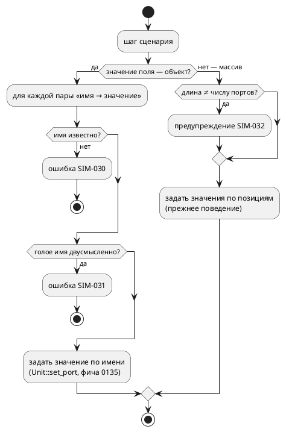

# Фича: Именованные порты в сценариях симулятора

- **Номер:** 0132
- **Статус:** ГОТОВО
- **Зависит от:** [квалифицированные имена портов в симуляторе](0135-sim-qualified-port-names.md) — **закрыта 2026-07-27**, блокировка снята
- **Tier:** 3
- **Связанные issue (анализ):** кандидат блока 2 `FEATURES.md` (аудит 2026-07-27, чтение `takt-sim/src/json_input.rs` + корпус)

## Стадии жизненного цикла

Все стадии — **разделы этой карточки**: «Архитектура (ADR)»,
«Анализ», «Разработка», «Тест-план», «Отчёт о тестировании», «Итог».
Отдельным артефактом остаются только исправления —
[`docs/fixes/`](../fixes/README.md) (при необходимости `0132-YY-*`).

## Краткое описание

Шаг сценария симуляции задаётся **позиционным массивом** значений портов.
Сценарий нечитаем, а добавление порта в модель **молча сдвигает весь корпус
сценариев**.

> Фича зарегистрирована из бэклога кандидатов (отобрана заказчиком 2026-07-27); далее проходит жизненный цикл по своду.

## Что известно на входе

- `SimStep` (`takt-sim/src/json_input.rs`) принимает `in_ports`, `inout` и
  `guard.out` как `Vec<Value>`; по имени адресуются **только** `guard.vars`.
- У `examples/simulations/elevator_mini_floor2.json` это **26 безымянных чисел**.
- Проверок длины и имён нет: лишний или недостающий элемент не диагностируется.

## Направление решения (наметка, не решение)

- Аддитивно принимать также объект `{"floor_2": 1}` в
  `in_ports`/`inout`/`guard.out`; позиционная форма сохраняется.
- Неизвестное имя порта → диагностика `SIM-xxx`, а не молчаливый пропуск.
- **Зависимость от [квалифицированные имена портов в симуляторе](0135-sim-qualified-port-names.md):** имя порта должно
  быть однозначным. Пока пространство имён портов симулятора плоское,
  одноимённые порты разных под-моделей неразличимы — именование в сценарии
  унаследует эту неоднозначность.

Окончательный выбор — за стадиями **архитектуры** (ADR) и **анализа**: раздел
выше фиксирует то, что уже проверено, а не предрешает реализацию.

## Документирование

**Требуется.** Раздел `book/` «Симуляция» — формат файла сценария (свод допускает описание инструментов в прикладных разделах).

## Архитектура (ADR)

- **Status:** Accepted
- **Date:** 2026-07-27
- **Authors:** Системный аналитик, архитектор, лид разработки
- **Related issues:** [Фича](0132-sim-named-port-scenarios.md);
  опирается на [ADR](0135-sim-qualified-port-names.md#архитектура-adr) (квалифицированное
  имя `Модель::порт`), [ADR](0079-sim-composition-ports.md#архитектура-adr) (порты
  под-моделей перечисляются рекурсивно)

### Context

Шаг сценария симуляции задаётся **позиционным массивом** значений портов:

```json
{ "in_ports": [0, 0, 0, 1, 0, 0, 3, 7, 5, 0, 1],
  "guard": { "out": [1, null, null, null, null, null] } }
```

Что означает `3` на седьмом месте, из файла узнать нельзя. У
`examples/simulations/elevator_mini_floor2.json` таких чисел **сорок**, и
единственное содержательное значение — единица на 25-й позиции.

#### Замер: позиция определяется алфавитом имён, а не порядком объявления

`PortNames::from_model` сортирует имена (`v.sort(); v.dedup()`). То есть индекс в
массиве — это место имени в **алфавитном** списке всех портов модели и её
под-моделей.

#### Замер: добавление порта тихо меняет смысл сценария (проба 2026-07-27)

В `examples/elevator_mini.takt` добавлен один входной порт `AAA_probe` — имя,
попадающее в начало алфавита. Сценарий `elevator_mini_floor2.json` не менялся.

| | до | после |
|---|---|---|
| единица массива пришлась на | `FloorSensor_F2_Bottom` | `FloorSensor_F1_Top` |
| смысл шага | «датчик этажа 2 активен» | «верхний датчик этажа 1 активен» |
| результат | сценарий проходит | `Guard шага 1: vars[current_floor]: ожидалось 2, получено 1` |

Сдвинулся **весь** массив, и шаг стал описывать другое физическое событие.
Заметить это удалось лишь потому, что у шага был `guard`; без него прогон
завершился бы «успешно», проверяя не то, что написано в комментарии `_step`.

Переименование порта даёт тот же эффект — оно меняет место имени в алфавите.

#### Замер: рассогласование длины не диагностируется

`apply_step_inputs` берёт имя через `self.port_names.in_ports.get(i)`: лишний
элемент массива молча отбрасывается, недостающий — просто не задаётся. Ни
предупреждения, ни ошибки. То же в `check_guard` для `out`/`inout`.

#### Что уже сделано по-другому

`guard.vars` адресуется **по имени** (`HashMap<String, Value>`) и уже принимает
квалифицированную форму `Модель::порт`. То есть в одном и том же
файле половина шага пишется именами, половина — позициями.

### Decision Drivers

1. **Сценарий — спецификация, а не дамп.** Его пишет и читает человек: «нажата
   кнопка 3-го этажа» должно быть видно в тексте, а не вычисляться подсчётом
   запятых.
2. **Тихое изменение смысла недопустимо.** Правка модели, не трогающая сценарий,
   не должна менять то, что сценарий проверяет (замер выше).
3. **Совместимость.** Позиционная форма используется всем корпусом
   `examples/simulations/` и проверкой `run_simulations.sh`; ломать её нельзя.
4. **Однозначность имени.** Одноимённые порты разных под-моделей существуют;
   имя в сценарии обязано указывать ровно на одно значение — иначе именование
   унаследует ту же неоднозначность, что и плоское чтение до 0135.
5. **Согласованность с уже сделанным.** `guard.vars` именует значения; новая
   форма обязана именовать так же, а не по-своему.

### Considered Options

#### Option A. Объектная форма рядом с позиционной

`in_ports`, `inout`, `guard.out`, `guard.inout` принимают **либо** массив (как
сейчас), **либо** объект `{"FloorSensor_F2_Bottom": 1}`.

**Pros:**
- Аддитивно: корпус и проверка не трогаются, старые файлы работают дословно.
- Именованный шаг устойчив к добавлению и переименованию портов: неизвестное имя
  становится **ошибкой**, а не тихим сдвигом.
- Совпадает с уже существующей формой `guard.vars` — файл перестаёт быть
  наполовину именованным, наполовину позиционным.
- В объекте перечисляются **только значимые** порты: сорок нулей исчезают.

**Cons:**
- Две формы одного и того же — их придётся описывать и поддерживать.
- Не чинит позиционную форму саму по себе: пока она есть, ею можно
  воспользоваться и получить прежний сдвиг.

#### Option B. Заменить позиционную форму объектной

**Pros:**
- Одна форма, нечего путать.

**Cons:**
- Ломает весь корпус сценариев и проверка `run_simulations.sh` — прямое нарушение
  свод без необходимости.
- Полезность фичи не требует разрушения: та же цель достигается Option A.

#### Option C. Позиционная форма плюс заголовок с именами

В начале файла перечисляются имена, дальше — массивы значений (как CSV с
шапкой).

**Pros:**
- Компактно для длинных однородных сценариев.

**Cons:**
- Читателю всё равно приходится считать столбцы, просто теперь по шапке.
- Заголовок сам становится источником рассогласования: он может разойтись с
  моделью, и это ещё одно место, где ошибка молчит.

#### Option D. Оставить как есть, добавить только проверку длины

**Pros:**
- Дёшево; ловит часть случаев (недостающий/лишний элемент).

**Cons:**
- Не ловит главное — **сдвиг при неизменной длине** (замер: добавили порт,
  длина массива стала на единицу меньше нужной… и да, длина изменилась бы, но
  переименование порта сдвигает массив **без** изменения длины).
- Читаемость не улучшается вовсе.

### Decision

Принимается **Option A** с диагностиками.

1. **Объектная форма** принимается везде, где сегодня массив значений портов:
   `in_ports`, `inout`, `guard.out`, `guard.inout`. Ключ — имя порта, значение —
   то же, что в массиве. Позиционная форма сохраняется без изменений.
2. **Имя разрешается так же, как в `guard.vars`** — голое либо квалифицированное
   `Модель::порт`. Один механизм на весь файл.
3. **Неизвестное имя — ошибка**, а не тихий пропуск: `SIM-030`. Это и есть
   главная ценность формы — правка модели, забывшая сценарий, становится
   видимой.
4. **Двусмысленное голое имя — ошибка** `SIM-031`: если имя объявлено
   несколькими моделями (`PortNames::ambiguous`), сценарий обязан
   квалифицировать. Молча взять первую ветвь значило бы вернуть ту самую
   неоднозначность, которую закрыла 0135.
5. **Рассогласование длины позиционного массива — предупреждение** `SIM-032`
   (не ошибка: корпус может опираться на нынешнее поведение, а ломать проверка
   фича не должна). Предупреждение печатается один раз на шаг.
6. **Смешение форм в одном поле невозможно** по построению (значение — либо
   массив, либо объект); смешение **между** полями допустимо: `in_ports` может
   быть объектом, а `guard.out` — массивом.



#### Декомпозиция

| Подзадача | Содержание |
|---|---|
| `0132-01` | объектная форма в `in_ports`/`inout` + диагностики `SIM-030`/`SIM-031` |
| `0132-02` | объектная форма в `guard.out`/`guard.inout`; предупреждение `SIM-032` |
| `0132-03` | перевод корпуса `examples/simulations/` на именованную форму + раздел `book/` |

### Consequences

#### Положительные

- Сценарий читается как спецификация: `{"FloorSensor_F2_Bottom": 1}` вместо
  сорока чисел.
- Правка модели больше не меняет смысл сценария молча: несуществующее имя —
  ошибка с кодом.
- Файл перестаёт быть наполовину именованным: `guard.vars` и порты адресуются
  одинаково.
- Корпус переводится на новую форму  — то есть форма
  проверяется реальными сценариями, а не только тестами.

#### Отрицательные / Action items

- **Две формы сосуществуют.** Позиционная остаётся допустимой, и ею можно
  получить прежний сдвиг. Признавать её устаревшей — отдельное решение
  заказчика; сегодня она нужна корпусу и проверке.
- Предупреждение `SIM-032` может «зашуметь» на существующих сценариях, если те
  опираются на неполные массивы. Проверяется прогоном `run_simulations.sh`; если
  шум есть — это находка, а не повод отключить проверку.
- Документирование: раздел `book/` о симуляции обязан описать обе
  формы и назвать риск позиционной.

#### Acceptance criteria

1. `in_ports`/`inout`, заданные объектом, задают значения именованных портов;
   позиционная форма работает дословно как прежде.
2. `guard.out`/`guard.inout` принимают объект; проверка идёт по именам.
3. Неизвестное имя порта → `SIM-030` с указанием имени; прогон завершается
   ошибкой.
4. Голое имя, объявленное несколькими моделями, → `SIM-031`; квалифицированное
   `Модель::порт` работает.
5. Позиционный массив неверной длины → предупреждение `SIM-032` (прогон
   продолжается).
6. Корпус `examples/simulations/` переведён на именованную форму, и
   `./scripts/run_simulations.sh` проходит с прежними результатами.
7. `./scripts/precheck.sh` зелёный.

## Анализ

### Цель и контекст

ADR принял **Option A**: объектная форма рядом с позиционной, неизвестное имя —
ошибка, двусмысленное голое имя — ошибка, рассогласование длины позиционного
массива — предупреждение. Анализ уточняет, что и где меняется, какие имена
считать допустимыми и где проходят границы.

### Факты, снятые пробами (2026-07-27)

**F1. Позиция = место имени в алфавитном списке.** `PortNames::from_model`
сортирует имена (`v.sort(); v.dedup()`) после рекурсивного обхода модели и
под-моделей. Порядок объявления в тексте роли не играет.

**F2. Добавление порта тихо меняет смысл шага.** Добавили `AAA_probe` —
единица массива переехала с `FloorSensor_F2_Bottom` на `FloorSensor_F1_Top`;
шаг «датчик этажа 2» стал шагом «верхний датчик этажа 1». Обнаружил `guard`
(`ожидалось 2, получено 1`); без него прогон был бы «успешным».

**F3. Переименование сдвигает без изменения длины.** Следствие F1: проверка
длины массива такой случай **не поймает** — значит она полезна, но не
достаточна.

**F4. Рассогласование длины не диагностируется.** `apply_step_inputs` берёт имя
через `in_ports.get(i)`: лишний элемент отбрасывается молча, недостающий не
задаётся. То же в `check_guard`.

**F5. Половина файла уже именована.** `guard.vars` — `HashMap<String, Value>`,
и имя может быть квалифицированным `Модель::порт`: `Unit::set_port`/`variable`
понимают эту форму с фичи (`split_once("::")`).

**F6. Двусмысленность уже вычисляется.** `PortNames::ambiguous` — пары «голое
имя → список квалифицированных», строится из `owners` при обходе. Сам
`owners` (полный список «имя → модель-владелец») **отбрасывается** — наружу
выходит только двусмысленная часть. Для проверки квалифицированных имён его
придётся сохранить.

### Зависимости фичи

- **Зависит от:** [квалифицированные имена портов в симуляторе](0135-sim-qualified-port-names.md) —
  **закрыта**, блокировка снята. Квалифицированное имя `Модель::порт` и реестр
  двусмысленных имён пришли оттуда.
- **Влияние на порядок:** ничего не блокирует; сама больше не заблокирована.

### Что и где меняется

| Задача | Файл | Изменение |
|---|---|---|
| 0132-01 | `takt-sim/src/json_input.rs` | `PortValues` — `#[serde(untagged)]` перечисление «массив либо объект»; поля `SimStep`/`Guard` меняют тип |
| 0132-01 | `takt-sim/src/runner.rs` | `PortNames` получает реестр квалифицированных имён; `apply_step_inputs` возвращает `Result` |
| 0132-01 | `takt-sim/src/runner.rs` | разрешение имени: голое → проверка направления и двусмысленности; квалифицированное → проверка существования |
| 0132-02 | `takt-sim/src/runner.rs` | `check_guard` принимает объектную форму для `out`/`inout`; предупреждение о длине |
| 0132-03 | `examples/simulations/*.json` | перевод корпуса на именованную форму |
| 0132-03 | `book/src/`, `README.md` | описание обеих форм и риска позиционной |

### Устройство

**Форма значений.** Одно перечисление на все четыре поля:

```rust
#[serde(untagged)]
enum PortValues {
    Positional(Vec<serde_json::Value>),
    Named(BTreeMap<String, serde_json::Value>),
}
```

`BTreeMap`, а не `HashMap`: порядок обхода определяет, **какая** ошибка будет
названа первой, и он обязан быть воспроизводимым.

**Разрешение имени** — одна функция на все поля, параметризованная направлением
(`in`/`out`/`inout`):

1. имя содержит `::` → квалифицированное: проверяется по реестру
   `Модель::имя`; отсутствует → `SIM-030`;
2. голое имя есть в списке нужного направления → берётся;
3. голое имя двусмысленно (`PortNames::ambiguous`) → `SIM-031` с перечислением
   квалифицированных вариантов;
4. иначе → `SIM-030`.

**Направление проверяется.** `in_ports: {"DoorOpen": 1}` (а `DoorOpen` —
выходной порт) — ошибка `SIM-030`, а не тихий пропуск: задать выход из сценария
нельзя, и попытка это сделать — почти наверняка опечатка.

**Реестр квалифицированных имён.** `PortNames` получает поле
`qualified: BTreeSet<String>` — все пары «модель::имя», собранные тем же
обходом, что уже строит `owners` (F6). Сегодня `owners` используется только для
`ambiguous` и выбрасывается.

**Диагностики.** Коды продолжают ряд симулятора (последний занятый — `SIM-029`):

| Код | Смысл | Уровень |
|---|---|---|
| `SIM-030` | имя порта в сценарии не найдено среди портов этого направления | ошибка |
| `SIM-031` | голое имя объявлено несколькими моделями — нужна форма `Модель::порт` | ошибка |
| `SIM-032` | длина позиционного массива не совпадает с числом портов | предупреждение |

Ошибки сценария возвращаются как `Err(String)` из `run` — тем же путём, что
уже ходит ошибка `guard`. Отдельного типа для них не заводится: у симулятора
коды — часть текста сообщения (`EvalError::code()` — исключение, оно про
вычисление).

### Требования и проверяемые условия

- **R1. Именованный вход.** `in_ports`/`inout`, заданные объектом, задают
  значения именно названных портов; прочие сохраняют прежние значения.
- **R2. Именованный guard.** `guard.out`/`guard.inout` принимают объект;
  проверка идёт по именам.
- **R3. Позиционная форма неизменна.** Существующие сценарии дают тот же
  результат, что и до фичи.
- **R4. Опечатка не молчит.** Неизвестное имя (в том числе имя порта другого
  направления) → `SIM-030`, прогон завершается ошибкой.
- **R5. Двусмысленность не молчит.** Голое имя, объявленное несколькими
  моделями, → `SIM-031`; квалифицированная форма работает.
- **R6. Длина проверяется.** Позиционный массив, длина которого не равна числу
  портов направления, → предупреждение `SIM-032`; прогон продолжается.
- **R7. Корпус переведён.** `examples/simulations/` использует именованную
  форму, `run_simulations.sh` даёт прежние результаты.

### Критерии приёмки и способ проверки

| # | Критерий | Способ проверки |
|---|---|---|
| A1 | R1 — именованный вход | тест: объектная форма задаёт порт, соседние не тронуты |
| A2 | R2 — именованный guard | тест: `guard.out` объектом ловит расхождение и пропускает совпадение |
| A3 | R3 — позиционная форма | тест: сценарий в старой форме даёт тот же результат; `run_simulations.sh` |
| A4 | R4 — `SIM-030` | тесты: несуществующее имя; имя порта другого направления |
| A5 | R5 — `SIM-031` | тест на модели с одноимёнными портами двух под-моделей; квалифицированная форма проходит |
| A6 | R6 — `SIM-032` | тест: короткий и длинный массив → предупреждение, прогон продолжается |
| A7 | R7 — корпус | `./scripts/run_simulations.sh` до и после перевода даёт одинаковый исход |
| A8 | Совместимость | `./scripts/precheck.sh` зелёный; вывод компилятора не затронут |

A5 требует **новой фикстуры**: в корпусе одноимённых портов разных
под-моделей нет (замечено фичей), поэтому двусмысленность придётся
смоделировать специально — иначе тест проверяет собственную удачу.

### Особенности по обратной функциональности

Правка **аддитивна**: позиционная форма остаётся, объектная
добавляется; изменение типов полей `SimStep`/`Guard` внешнего контракта не
ломает — JSON-файлы прежней формы читаются дословно. Язык **не затрагивается**:
меняется формат вспомогательного файла инструмента, а не синтаксис или семантика
Takt; **версия языка не растёт** (`0.6.0`). Крейт `takt-sim` растёт минорно
(новый формат и три диагностики).

### Границы (что фича не делает)

- **Позиционная форма не объявляется устаревшей.** Она нужна корпусу и проверке;
  признание её устаревшей — отдельное решение заказчика.
- **Квалификация именем модели, а не путём** — наследуется от 0135: две
  под-модели с одинаковым **именем** неразличимы, у анонимной модели имени нет.
- **Переменные (`guard.vars`) не трогаются:** они уже именованы и уже понимают
  квалификацию.
- **Проверка «сценарий покрывает все порты» не вводится:** умолчание значений —
  законный приём (в объекте перечисляются только значимые порты).

### Риски и как снижаются

| # | Риск | Снижение |
|---|---|---|
| P1 | `untagged` тихо разберёт «не то» (например, объект как позиционный массив) | варианты не пересекаются по форме JSON (массив ≠ объект); тест на обе формы |
| P2 | `SIM-032` зашумит существующий корпус | это предупреждение, а не ошибка; шум — находка (перевод корпуса задачей всё равно снимет позиционные массивы) |
| P3 | Проверка направления отвергнет законный сценарий | направление уже разделено в `PortNames`; задать выход из сценария нельзя было и раньше — молчаливо игнорировалось |
| P4 | Реестр квалифицированных имён разойдётся с `ambiguous` | оба строятся из **одного** `owners` в том же обходе |
| P5 | Перевод корпуса изменит поведение сценариев | A7: `run_simulations.sh` до и после даёт одинаковый исход; перевод пофайловый |

### Декомпозиция разработки

| Подзадача | Содержание | Готовность = |
|---|---|---|
| `0132-01` | объектная форма `in_ports`/`inout`; реестр квалифицированных имён; `SIM-030`/`SIM-031` | A1, A4, A5 |
| `0132-02` | объектная форма `guard.out`/`guard.inout`; `SIM-032` | A2, A6 |
| `0132-03` | перевод корпуса; документирование (`book/`, README) | A3, A7, A8 |

## Разработка

### Задача

#### Что было

`in_ports`/`inout` — позиционный массив значений. Индекс — место имени в
**алфавитном** списке портов модели и её под-моделей (`PortNames::from_model`
сортирует), поэтому добавление или переименование порта сдвигало весь массив, а
шаг начинал описывать другое событие. Лишний элемент отбрасывался молча
(`in_ports.get(i)`), недостающий — просто не задавался.

#### Что сделано

1. **`PortValues`** (`json_input.rs`) — `#[serde(untagged)]` перечисление
   «позиционный массив **либо** объект имя → значение». Формы не пересекаются по
   представлению JSON, поэтому разбираются однозначно. `BTreeMap`, а не
   `HashMap`: порядок обхода решает, какая ошибка будет названа первой, и он
   обязан быть воспроизводимым.
2. **Реестр квалифицированных имён** — `PortNames::qualified`
   (`BTreeSet<String>`), строится из **того же** списка владельцев, из которого
   уже строился `ambiguous`. Прежде этот список выбрасывался: наружу выходила
   только двусмысленная его часть.
3. **Одна воронка разрешения имён** — `resolve_values` + `check_port_name`,
   параметризованные направлением (`PortDirectionKind`). Ею пользуются и входы
   шага, и `guard`: разойдясь, они принимали бы разные имена, и
   сценарий вёл бы себя по-разному в разных половинах файла.
4. **Диагностики:** `SIM-030` (имя не найдено — в том числе имя порта другого
   направления), `SIM-031` (голое имя объявлено несколькими моделями, с
   перечислением квалифицированных вариантов).
5. `apply_step_inputs` возвращает `Result` — ошибка сценария уходит тем же
   путём, что и ошибка `guard`.

**Направление проверяется намеренно.** `in_ports: {"running": 1}` при выходном
`running` — почти наверняка опечатка; прежде такая запись молча не делала ничего.

#### Проверки

```sh
cargo test -p takt-sim -- --test-threads=1   # все зелёные
cargo clippy --all-features --all-targets    # 0 предупреждений
```

Пробы (`examples/elevator_mini.takt`):

| Сценарий | Результат |
|---|---|
| `{"FloorSensor_F2_Bottom": 1}` | эквивалентен массиву из 40 чисел |
| `{"FloorSensor_F2_Bottomm": 1}` | `SIM-030: порт … не найден среди портов направления in_ports` |
| `{"DoorOpen": 1}` (выходной порт) | `SIM-030` |
| `{"sensor": 1}` при двух под-моделях | `SIM-031` с вариантами `Left::sensor, Right::sensor` |
| `{"Left::sensor": 1}` | задаёт одну ветвь; `Right::sensor` остаётся `0` |

Тесты — `takt-sim/tests/sim/named_port_scenario_tests.rs`. Фикстура двусмысленности
**заведена специально**: одноимённых портов разных под-моделей в корпусе нет, и
без неё тест проверял бы собственную удачу.

### Задача

#### Что было

`guard.out`/`guard.inout` — позиционные массивы с `null` в значении «не
проверять»; при этом соседний `guard.vars` уже адресовался по имени и понимал
квалификацию `Модель::порт`. Файл был наполовину именованным.

Рассогласование длины не диагностировалось нигде.

#### Что сделано

1. **`guard.out`/`guard.inout` принимают объект** — через ту же `resolve_values`,
   что и входы шага. Сообщение о расхождении называет поле и порт:
   `Guard шага 3: out (cmd_ack): ожидалось …, получено …`.
2. **`SIM-032`** — предупреждение, если длина позиционного массива не равна
   числу портов направления. Именно **предупреждение**: корпус мог опираться на
   неполные массивы, и ломать проверка фича не должна. Прогон продолжается.

В объектной форме «не проверять» выражается **отсутствием ключа**, а не
`null`: перечисляются только те порты, которые проверяются.

#### Проверки

```sh
cargo test -p takt-sim -- --test-threads=1
./scripts/run_simulations.sh   # 6 прошло, 0 упало
```

Проба: короткий массив (`[1]` при двух входных портах) даёт

```
Предупреждение [SIM-032]: шаг 1: 1 значений в позиционном массиве `in_ports`,
а портов 2 — лишние игнорируются, недостающие не задаются
```

и прогон **продолжается** (тест `positional_length_mismatch_warns_but_continues`
проверяет и текст, и код возврата).

Корпус `examples/simulations/` предупреждений **не даёт** — длины там
совпадали. То есть `SIM-032` ловит будущие рассогласования, а не чинит текущие.

### Задача

#### Что было

Все шесть сценариев `examples/simulations/` — позиционные. У
`elevator_mini_floor2.json` шаг занимал 40 чисел, из которых значима была одна
единица; у `stacker_*` — массивы по 11 значений и `guard.out` вида
`[1, null, null, null, null, null]`.

#### Что сделано

**Корпус переведён на именованную форму.** Перевод не механический: значение
опускается только там, где оно **ничего не меняет** — совпадает с текущим
значением порта (для первого шага — с начальным, снятым прогоном без сценария).
Просто выбросить нули было нельзя: значение порта удерживается между тактами,
и явный ноль после единицы — это **сброс**, а не шум.

Результат — сценарий как спецификация:

```json
{
  "_step": "1 — датчик этажа 2 активен → current_floor := 2",
  "in_ports": { "FloorSensor_F2_Bottom": 1 },
  "guard": { "vars": { "current_floor": 2 } }
}
```

**Документирование**: раздел `book/` «Инструментарий» описывает обе
формы, правило «перечисляются только меняющиеся порты», квалификацию
`Модель::порт` и **риск** позиционной формы. Коды `SIM-030`–`SIM-032` добавлены
в приложение «Ошибки и предупреждения» и в таблицу README; README получил раздел
«Файл сценария симуляции».

#### Проверки

```sh
./scripts/run_simulations.sh   # 6 прошло, 0 упало
./scripts/precheck.sh          # EXIT=0
```

**Главная проверка — не «проходит», а «проверяет то же самое».** Потактовый
вывод симулятора сверен побайтно для всех шести сценариев до и после перевода:

| Сценарий | Вывод |
|---|---|
| `elevator_mini_floor2` | совпадает |
| `stacker_load_ship` | совпадает |
| `stacker_loading` | совпадает |
| `stacker_multi_ops` | совпадает |
| `stacker_sensor_fault` | совпадает |
| `stacker_shipping` | совпадает |

Сверка нужна именно потому, что «сценарий прошёл» ничего не доказывает: до фичи
сдвинутый массив тоже «проходил», просто проверял не то.

## Тест-план

### Область и цель

Проверяется, что именованная форма **работает**, позиционная **не сломана**, а
ошибки в именах **не молчат**. Требования R1–R7 и критерии A1–A8 — в анализе.

«Сценарий прошёл» — недостаточное утверждение: до фичи сдвинутый массив тоже
проходил, проверяя не то. Поэтому перевод корпуса сверяется **потактовым
выводом**, а не фактом успеха.

### Проверки (условие → ожидаемый результат)

| # | Проверка | Предусловие | Ожидаемый результат | Ссылка на R/A |
|---|---|---|---|---|
| T1 | Именованный вход | `{"start_btn": 1}` | порт задан, соседний не тронут | R1 / A1 |
| T2 | Именованный guard ловит расхождение | `guard.out: {"running": 0}` при `running = 1` | ошибка с именем порта | R2 / A2 |
| T3 | Позиционная форма | старый сценарий | результат прежний | R3 / A3 |
| T4 | Опечатка в имени | `{"start_bttn": 1}` | `SIM-030`, прогон падает | R4 / A4 |
| T5 | Порт другого направления | `in_ports: {"running": 1}` | `SIM-030` | R4 / A4 |
| T6 | Двусмысленное голое имя | две под-модели с портом `sensor` | `SIM-031` с перечислением вариантов | R5 / A5 |
| T7 | Квалифицированное имя | `{"Left::sensor": 1}` | задана одна ветвь, соседняя нетронута | R5 / A5 |
| T8 | Неизвестная модель в квалификации | `{"Middle::sensor": 1}` | `SIM-030` | R4 / A5 |
| T9 | Реестр квалифицированных имён | модель с двумя под-моделями | содержит все четыре пары | R5 / A5 |
| T10 | Длина позиционного массива | `[1]` при двух портах | `SIM-032`, прогон продолжается | R6 / A6 |
| T11 | Сквозной прогон именованного сценария | бинарник `takt-sim` | успех, диагностик нет | R1 / A1 |
| T12 | Разбор форм не путается | `[1,2]` и `{"btn":1}` | позиционная и именованная соответственно | R1, R3 / A1 |
| T13 | Корпус переведён | `examples/simulations/` | `run_simulations.sh` 6/6; потактовый вывод совпадает с прежним | R7 / A7 |
| T14 | Предкоммит | — | `./scripts/precheck.sh` зелёный | A8 |

### Разбивка проверок по функциональности

Единые условия и ожидаемые результаты прогоняются против каждой задеваемой
обратной функциональности; фиксируется статус.

| Функциональность | T1–T2 | T3 | T4–T9 | T10 | T11–T12 | T13 | T14 |
|---|---|---|---|---|---|---|---|
| Сценарии симулятора (`in_ports`/`inout`) | ✅ | ✅ | ✅ | ✅ | ✅ | ✅ | ✅ |
| `guard.out`/`guard.inout` | ✅ | ✅ | ✅ | ✅ | ✅ | ✅ | ✅ |
| `guard.vars` (0135, регресс) | — | ✅ | — | — | ✅ | ✅ | ✅ |
| Квалифицированные имена (0135, регресс) | — | — | ✅ | — | — | ✅ | ✅ |
| Порты под-моделей (0079, регресс) | — | ✅ | ✅ | — | — | ✅ | ✅ |
| Компилятор `taktc` | — | — | — | — | — | — | ✅ |

<!-- Легенда: ✅ пройдено · ❌ провалено · ⬜ не проверялось · — не применимо -->

### Тестовые данные и окружение

- `takt-sim/tests/sim/named_port_scenario_tests.rs` — T1–T12 (12 тестов).
- `takt-sim/src/json_input.rs` (юнит-тесты) — T12.
- Фикстуры: `takt-sim/tests/data/named0132/` (модель `panel.takt`, сценарии
  `named.json` и `short_positional.json`); модели `SIMPLE`/`AMBIGUOUS` — в тексте
  теста. Модель с одноимёнными портами двух под-моделей заведена специально:
  в корпусе таких нет.
- T13 — `./scripts/run_simulations.sh` плюс побайтная сверка потактового вывода
  до и после перевода.

Окружение: macOS (darwin 25.5.0), толчейн из `rust-toolchain.toml` (стабильный
1.97.1).

```sh
cargo test -p takt-sim -- --test-threads=1
./scripts/run_simulations.sh
./scripts/precheck.sh
```

## Отчёт о тестировании

### Резюме

**✅ ПРОЙДЕН.** Все 14 проверок тест-плана выполнены. Фича готова к закрытию
(`ГОТОВО`).

Окружение: macOS (darwin 25.5.0), толчейн из `rust-toolchain.toml` (стабильный
`1.97.1`).

| Команда | Результат |
|---|---|
| `cargo test -p takt-sim -- --test-threads=1` | **374** теста, 0 провалов |
| `cargo clippy --all-features --all-targets` | 0 предупреждений |
| `./scripts/run_simulations.sh` | 6 прошло, 0 упало, 0 пропущено |
| `./scripts/precheck.sh` | **`EXIT=0`** |

### Фактические результаты по проверкам

| # | Проверка | Результат | Комментарий |
|---|---|---|---|
| T1 | Именованный вход | ✅ | `named_input_sets_only_the_named_port`; отдельно проверено, что значение доезжает до порта, а не «прогон прошёл» |
| T2 | Именованный guard ловит расхождение | ✅ | `named_guard_detects_mismatch`: сообщение называет порт |
| T3 | Позиционная форма | ✅ | `positional_form_still_works`; корпус до перевода проходил без правок |
| T4 | Опечатка в имени | ✅ | `SIM-030` с указанием имени и направления |
| T5 | Порт другого направления | ✅ | `wrong_direction_port_is_an_error`: прежде такая запись молча не делала ничего |
| T6 | Двусмысленное голое имя | ✅ | `SIM-031` перечисляет `Left::sensor, Right::sensor` |
| T7 | Квалифицированное имя | ✅ | задана одна ветвь, соседняя осталась `0` |
| T8 | Неизвестная модель в квалификации | ✅ | `SIM-030` |
| T9 | Реестр квалифицированных имён | ✅ | `qualified_registry_covers_every_port` |
| T10 | Длина позиционного массива | ✅ | `SIM-032`, прогон продолжается (проверен и код возврата) |
| T11 | Сквозной прогон через бинарник | ✅ | успех, диагностик нет |
| T12 | Разбор форм не путается | ✅ | юнит-тесты `json_input`: массив → позиционная, объект → именованная |
| T13 | Корпус переведён | ✅ | 6/6; **потактовый вывод совпадает побайтно** для всех шести сценариев |
| T14 | Предкоммит | ✅ | `EXIT=0` |

### Результаты по функциональности

| Функциональность | Статус | Комментарий |
|---|---|---|
| Сценарии симулятора | ✅ | обе формы; ошибки имён не молчат |
| `guard.out`/`guard.inout` | ✅ | та же воронка разрешения имён, что у входов |
| `guard.vars` (0135, регресс) | ✅ | не тронут; уже был именованным |
| Квалифицированные имена (0135, регресс) | ✅ | реестр строится тем же обходом, что и список двусмысленных |
| Порты под-моделей (0079, регресс) | ✅ | перечисление рекурсивное, как прежде |
| Компилятор `taktc` | ✅ | не затронут |

### Замеры

**Читаемость.** `elevator_mini_floor2.json`: было 40 чисел на шаг, из которых
значима одна единица; стало — одна строка `"FloorSensor_F2_Bottom": 1`. Файл
целиком: 105 строк → 21.

**Эквивалентность перевода.** Потактовый вывод симулятора сверен побайтно до и
после перевода — совпал для всех шести сценариев. Проверка выбрана именно такой
потому, что «сценарий прошёл» ничего не доказывает: до фичи сдвинутый массив
тоже проходил, проверяя не то (замер ADR).

**Шум `SIM-032`.** Корпус предупреждений не даёт — длины совпадали. То есть
проверка ловит будущие рассогласования, а не чинит текущие.

### Выводы и дальнейшие шаги

- Главная ценность не в читаемости, а в том, что **опечатка перестала молчать**:
  сценарий, отставший от модели, теперь падает с `SIM-030`, а не проверяет
  соседний порт.
- Исправлений (`docs/fixes/0132-YY-*`) не потребовалось.
- Кандидат, вынесенный из фичи: признать позиционную форму устаревшей — сегодня
  она принимается молча, хотя её опасность задокументирована.
- Проверено и **опровергнуто** предположение, что та же хрупкость есть у
  снимков состояния: `--save-state` хранит значения по именам
  (`variables: HashMap<String, Value>`), позиционен там только порядок ветвей
  дерева — то есть структура, а не имена. Кандидата по снимкам нет.

## Итог (что сделано)

Закрыта 2026-07-27, `./scripts/precheck.sh` → `EXIT=0`, 374 теста `takt-sim`
зелёные, `run_simulations.sh` — 6/6. Отчёт —
[`docs/reports/0132-*`](0132-sim-named-port-scenarios.md#отчёт-о-тестировании) (вердикт
**✅ ПРОЙДЕН**, 14/14 проверок).

**Дефект был не в читаемости, а в тишине.** Проба: добавление одного входного
порта сдвинуло весь позиционный массив, и шаг «датчик этажа 2 активен» стал
шагом «верхний датчик этажа 1 активен» — поймал это только `guard`, без него
прогон завершился бы «успешно». Позиция в массиве — место имени в **алфавитном**
списке портов, поэтому сдвиг даёт и переименование, причём **без** изменения
длины: проверкой длины такой случай не поймать.

**Крейт `takt-sim`:**

1. **Именованная форма** `{"FloorSensor_F2_Bottom": 1}` принимается в
   `in_ports`, `inout`, `guard.out`, `guard.inout` — рядом с позиционной
   (`PortValues`, `#[serde(untagged)]`). Позиционная работает дословно как
   прежде.
2. **Одна воронка разрешения имён** на входы и `guard`, параметризованная
   направлением: разойдясь, они принимали бы разные имена в разных половинах
   одного файла.
3. **Диагностики:** `SIM-030` (имя не найдено — в том числе имя порта другого
   направления), `SIM-031` (голое имя объявлено несколькими моделями — нужна
   форма `Модель::порт`), `SIM-032` (длина позиционного массива не совпадает с
   числом портов — предупреждение).
4. **Реестр квалифицированных имён** строится из того же списка владельцев, что
   и список двусмысленных: два источника разошлись бы.
5. **Корпус переведён** на именованную форму. Значение опускается только там,
   где ничего не меняет: значение порта удерживается между тактами, и явный ноль
   после единицы — это сброс, а не шум. Потактовый вывод сверен **побайтно** до
   и после перевода — совпал для всех шести сценариев.

**Документирование**: раздел `book/` «Инструментарий» описывает обе
формы и риск позиционной; коды `SIM-030`–`SIM-032` — в приложении «Ошибки и
предупреждения» и в README (новый раздел «Файл сценария симуляции»).

**Язык не затронут** — версия остаётся `0.6.0`: меняется формат вспомогательного
файла инструмента, а не синтаксис или семантика. Вывод компилятора не задет.
