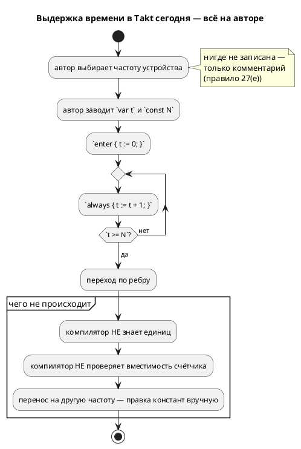
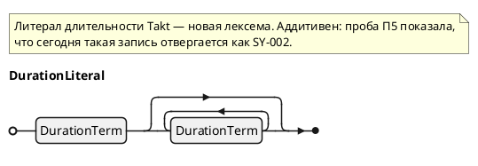

# Фича: Модель времени в языке: литерал длительности и частота такта

- **Номер:** 0134
- **Статус:** ГОТОВО (0134-01…09 + 0134-04b сделаны: синтаксис, тип `duration`,
  симулятор, цели `c`/`c-hal`, `rust`, `st`/`st-at`, `sv` в **обоих** профилях,
  выдержка `after Nt`/`after Nms`, контракт частоты `--tick-hz`/`SE-069`/`SE-070` с
  CLI-частью 0134-08, **периодический блок `every`** (0134-09))
- **Долг задач…08:** каждая, добавив время своей цели,
  **дополняет** приложение «Порождённый код примера» разделом о порождённом коде
  времени этой цели (по образцу цели `c`) — запрос заказчика 2026-07-28.
- ✅ **Долг закрыт задачей:** временная ветка в проверке примеров снята —
  пример раздела «Механизмы времени» компилируется целью `c`.
- **Зависит от:** [единая семантика переполнения целых во всех целях](0127-int-overflow-semantics.md) — **закрыта 2026-07-27**
- **Tier:** 1
- **Связанные issue (анализ):** кандидат блока 2 `FEATURES.md` + **пробел № 1 из 15** и раздел 11.6 отчёта [`docs/DIFF.md`](../DIFF.md)

## Стадии жизненного цикла (правило 17)

Все стадии — **разделы этой карточки** (правило 32): «Архитектура (ADR)»,
«Анализ», «Разработка», «Тест-план», «Отчёт о тестировании», «Итог».
Отдельным артефактом остаются только исправления —
[`docs/fixes/`](../fixes/README.md) (при необходимости `0134-YY-*`).

## Краткое описание

Ввести в язык **длительность**: сегодня время моделируется счётчиком тактов
вручную, а частота живёт в комментарии. Это главный разрыв языка с отраслью:
длительность не переносится между устройствами с разной частотой, не проверяется
и молча ломается при переполнении счётчика.

> Фича зарегистрирована из бэклога кандидатов (отобрана заказчиком 2026-07-27); далее проходит жизненный цикл по правилу 17.

## Что известно на входе

Сравнительный анализ ([`docs/DIFF.md`](../DIFF.md), разделы 10.4 и 11.6) даёт
шесть механизмов выражения времени; **своих средств нет лишь у четырёх языков из
26**, включая Takt. Ключевой факт против довода «Takt порождает RTL, значит
времени быть не может»: **SpinalHDL порождает такой же синтезируемый RTL и при
этом принимает `Timeout(3 ms)`**, пересчитывая длительность в такты по частоте
области тактирования; VHDL и SystemVerilog вводят частоту параметром
(`generic CLK_HZ`) и вычисляют число тактов константой; у Clash период такта
входит **в тип** домена.

Правило 27(е) свода уже **вынуждает** автора сообщать частоту комментарием — то
есть требование сформулировано, а языкового средства под него нет.

## Направление решения (наметка, не решение)

Раздел 11.6 отчёта разбирает **пять** вариантов (A — оставить как есть,
B/B′ — литерал длительности + частота такта флагом либо объявлением в модели,
C — декларативные `after`/`every` на рёбрах, D — таймер как объект языка,
E — часы и инварианты локаций в духе UPPAAL) и рекомендует **B (+B′) как ядро →
C как сахар → D → E только под требование доказывать временные свойства**.

Требования, обязательные при любом выборе (там же, 11.6.2): пересчёт
«длительность → такты» в **одном** общем слое; непредставимая длительность —
**ошибка компиляции** по образцу `SE-058`, а не округление; печать фактически
заложенной частоты; признание флага **вторым** осознанным исключением из
принципа «CLI не меняет логику» (первое — `--float-as-q`, действие A-7 [q-арифметика через нативный float и флаг генерации (embedded ↔ float)](0096-fixed-point-native-float.md)); аддитивность (ручные счётчики
продолжают работать).

**Конфликт, который обязан решить ADR:** штатный `TON` цели `st` отсчитывает
реальное время среды исполнения, а не циклы, — если `st` пойдёт через `TON`, а
остальные цели через счётчик тактов, **потактовая эквивалентность целей
перестанет существовать**. Три развязки перечислены в 11.6.2.

Окончательный выбор — за стадиями **архитектуры** (ADR) и **анализа**: раздел
выше фиксирует то, что уже проверено, а не предрешает реализацию.

## Решения заказчика (2026-07-27) и что из них вышло

Выбор сделан **не** по рекомендации отчёта: заказчик задал гибрид, в котором
**источник времени внешний — как и такт**, а частота нужна лишь там, где источника
нет. Принято в [ADR](0134-language-time-model.md#архитектура-adr):

| Вопрос | Решение заказчика |
|---|---|
| Объём | **B + B′ + C** (литерал + частота как свойство модели + `after`/`every`), гибридом: механизм **включается только при использовании**, тактирование всегда внешнее |
| Форма литерала | `3s`, `500ms`, `1m30s` (слитно) |
| Неделимая длительность | **ошибка компиляции** (без округления) |
| `TON` в цели `st` | **(б) — да, штатный `TON`** |

Реализация времени — функция «сколько прошло от запуска модели» с квантом
**1 мс** (ограничение реализации источника); в `c`/`rust` — библиотечные часы по
умолчанию с возможностью переопределить в коде; во встраиваемом случае — расчёт от
тактирования с **явной** частотой (define или константа).

**Пробы стадии архитектуры сняли конфликт, объявленный отчётом:** `TON`
детерминирован под инжектированным временем, поэтому цель `st` **остаётся** в
потактовой сверке (П1–П3 ADR); зеркально — физическое время в цели `sv` запрещено,
потому что `#delay` **молча** проходит оба её проверки (П4).

## Документирование (правило 24)

**Требуется, в большом объёме.** Анализ ([модель времени в языке: литерал длительности и частота такта](0134-language-time-model.md#анализ))
уточнил объём: фича правит **существующие** разделы `book/` — `02-lexical`
(литералы длительности и частоты), `03-types` (тип `duration`), **`11-execution`**
(ядро: два профиля, внешний источник времени, точность в один такт,
`after`/`every`), `15-diagnostics` + приложение «Ошибки и предупреждения»
(`SE-063…065`).

**Уточнено 2026-07-28 по запросу заказчика:** заведён **отдельный раздел**
«Механизмы времени» (`book/src/12-time/`) — [раздел документа: механизмы времени](0141-book-time-section.md),
как требует правило 24. Правки существующих разделов остаются за этой фичей в
той части, что раздел 12 не покрывает (единицы в «Лексической структуре», тип в
«Типах данных», коды в приложении «Ошибки и предупреждения»).

Правило 27(е) свода пересматривается: оно описывает обходной путь, который эта
фича снимает. Версия языка растёт (правило 22).

## Архитектура (ADR)

- **Status:** Accepted
- **Date:** 2026-07-27
- **Authors:** Архитектор + Системный аналитик + Дизайнер языка
- **Related issues:** [Фича](0134-language-time-model.md); опирается на
  [ADR](0127-int-overflow-semantics.md#архитектура-adr) (обёртка беззнакового определена),
  [ADR](0096-fixed-point-native-float.md#архитектура-adr) (прецедент осознанного исключения из
  принципа «CLI не меняет логику»), [ADR](0061-fixed-point-type.md#архитектура-adr) (прецедент
  «непредставимый литерал — ошибка, а не округление»)

### Context

Своих средств выражения времени у Takt нет: физическая длительность моделируется
ручным счётчиком тактов, а частота живёт в комментарии — этого прямо **требует**
правило 27(е) свода. Сравнительный анализ ([`docs/DIFF.md`](../DIFF.md), разделы
10.4 и 11.6) показывает, что так устроены лишь **четыре языка из 26** (Takt, SMC,
StateSmith, Ragel), и называет это разрывом № 1 из 15.

Довод «Takt порождает синтезируемый RTL, значит времени быть не может» отчёт
опровергает: SpinalHDL порождает такой же RTL и принимает `Timeout(3 ms)`, VHDL и
SystemVerilog вводят частоту параметром (`generic CLK_HZ`), у Clash период такта
входит в тип домена.

#### Поток «как есть»



#### Что проверено пробами при подготовке этого ADR

Решение опирается не на память, а на пробы (инструменты — `iec2c` MatIEC,
`yosys` 0.67, `verilator` 5.050, `taktc` из рабочего дерева):

| № | Проба | Результат |
|---|---|---|
| **П1** | `FUNCTION_BLOCK` с экземпляром `TON`, `PT := T#3s`, чтение `.Q` → `iec2c` | **Принято** (`rc = 0`). Штатный таймер IEC цели `st` доступен. |
| **П2** | Откуда `TON` берёт время | Из глобали `extern TIME __CURRENT_TIME;` (`iec_std_lib.h:55`), то есть **источник внешний и подменяемый**. В харнессе сверки `conformance_st_tests.rs` эта глобаль **уже объявлена** (`TIME __CURRENT_TIME;`) и просто стоит в нуле. |
| **П3** | Прогон `TON` под **инжектированным** временем (1 с на такт) | Детерминирован: дверь открылась на такте 1 (t = 1 с), закрылась на такте 4 (t = 4 с) — ровно `START + 3s`. **Потактовая сверка цели `st` с таймером сохранима.** |
| **П4** | `#3ms` внутри `always_ff` → `yosys synth` и `verilator --lint-only -Wall` | **Оба проверки принимают молча**: yosys синтезирует модуль (2 ячейки), проигнорировав задержку; verilator не говорит ни слова. Физическое время в RTL — ловушка ровно того класса, который проект ловит сверками. |
| **П5** | `var x := 3s;` сегодняшним `taktc` | `SY-002` «нераспознанный токен `'s'`». Литерал длительности **аддитивен**: он занимает синтаксис, который сегодня отвергается. |

П3 важнее прочего: отчёт `DIFF.md` (11.6.2) утверждал, что `TON` в цели `st`
**уничтожает** потактовую эквивалентность целей. Проба показывает, что это верно
лишь для часов реального мира; при инжектированном источнике времени трасса
воспроизводима, и конфликт снимается не выбором «`TON` или сверка», а **общим
правилом: источник времени — внешний и подменяемый, как и такт**.

П4 — зеркальный вывод для цели `sv`: физического времени в RTL быть не должно
**потому, что оба проверки его не ловят**.

### Decision Drivers

1. **Тактирование внешнее — язык не завязывается на значение частоты** (решение
   заказчика). Модель тактируется снаружи; при потактовой отладке частоты может не
   быть вовсе. Значит частота — **не** обязательная часть модели времени, а
   параметр одного из профилей.
2. **Механизм включается только при использовании** (решение заказчика; правило 11).
   Модель без времени обязана давать **байт-в-байт** прежний вывод во всех целях.
3. **Пересчёт — в одном слое** (T1 отчёта). Прецеденты: `enum_facts`, `bit_vector`,
   `lower_float`. Разъехавшись, цели дадут разные длительности — класс дефекта,
   который проект ловит сверками.
4. **Непредставимое — ошибка компиляции, а не округление** (T2; решение
   заказчика). Прецедент — `SE-058` для fixed-point.
5. **Потактовая сверка целей — главный проверка качества проекта**  и
   обязана пережить введение времени.
6. **Источник времени переопределяется в целевом коде** (решение заказчика): по
   умолчанию — библиотечная функция, но пользователь вправе подставить свою.
7. **Обёртка беззнакового определена** ([ADR](0127-int-overflow-semantics.md#архитектура-adr)),
   поэтому «истекло ли» через **разность** счётчиков корректно при переполнении.
   Это и была настоящая причина зависимости 0134 → 0127.

### Considered Options

#### Option A. Оставить как есть (M1 отчёта)

**Pros:**
- Ноль работы и ноль риска.

**Cons:**
- Разрыв № 1 остаётся открытым; непереносимость между частотами.
- Ничего не проверяется; правило 27(е) продолжает требовать комментария вместо
  языковой конструкции.

#### Option B. Компилятор пересчитывает длительность в такты (M2, рекомендация отчёта)

Литерал `3s` + частота (`--tick-hz`, `clock 1kHz;`) → константа тактов.

**Pros:**
- Минимальное изменение семантики; работает на всех целях без времени выполнения.
- Проверки на компиляции; прямые прецеденты (SpinalHDL, VHDL/SV, Chisel, Clash).

**Cons:**
- **Противоречит драйверу 1**: частота становится обязательной, а при потактовой
  отладке её нет.
- На ПЛК точность плывёт вместе с временем цикла, хотя среда исполнения знает
  настоящее время и штатный `TON` (П1) его даёт.

#### Option H. Гибрид: внешний источник времени + профиль тактов там, где источника нет — **выбрано**

Время получается **функцией** («сколько прошло от запуска модели»), как такт —
снаружи. Там, где источника времени нет (голое железо, RTL), тот же литерал
пересчитывается в такты по **явно** заданной частоте.

**Pros:**
- Удовлетворяет всем семи драйверам.
- На ПЛК даёт штатный `TON` (П1) **без** потери сверки (П3).
- В цели `sv` не соблазняет физическим временем (П4).
- Частота нужна только там, где она действительно есть.

**Cons:**
- Два профиля вместо одного — различие обязано быть видно в диагностике,
  документации и трассе; сверка ведётся **внутри** профиля.

#### Option D. Таймер как объект языка (M3)

**Pros:**
- Отменяемые тайм-ауты, несколько таймеров в состоянии, прямая трансляция в `TON`.

**Cons:**
- Новая сущность с жизненным циклом и ресурсом на экземпляр.
- Отчёт рекомендует её **после** ядра — здесь она преждевременна.

#### Option E. Часы и инварианты локаций (M5, UPPAAL)

**Pros:**
- Доказательство временных свойств — уникальное сочетание с синтезом.

**Cons:**
- Объём уровня «второй верификатор» (зоновая абстракция, DBM).
- Для синтеза всё равно нужна база Option H. Браться раньше — доказывать свойства
  языка, на котором ещё нельзя записать выдержку.

### Decision

Принимается **Option H** в объёме **B + B′ + C** (литерал длительности, частота как
свойство модели, декларативные `after`/`every`) — решение заказчика от 2026-07-27.
Ниже — нормативные правила; они обязательны для стадии анализа и разработки.

#### Правило 1. Механизм включается по факту использования

Модель, не содержащая ни литерала длительности, ни `after`/`every`, порождает
**байт-в-байт прежний** код во всех семи целях: не появляется ни полей, ни
колбэков, ни параметров, ни констант, ни служебных входов. Проверяется проверкой
неизменности корпуса `examples/`.

#### Правило 2. Источник времени — внешний и подменяемый

Время приходит в модель извне — как и такт. Каждая цель получает его своим
штатным способом:

| Цель | Источник времени (профиль «часы») | Переопределение пользователем |
|---|---|---|
| `c` | указатель `uint64_t (*now_ms)(void *userdata)` в структуре модели — рядом с `read_*`/`write_*` | подставить свой колбэк (штатный механизм цели) |
| `c-hal` | то же + **принятая по умолчанию реализация** библиотечными часами (`clock_gettime(CLOCK_MONOTONIC)`) | заменить реализацию или колбэк |
| `rust` | метод трейта `Hal::now_ms(&mut self) -> u64` | реализовать трейт по-своему (в `no_std` библиотечных часов нет — тела по умолчанию не будет) |
| `st` / `st-at` | штатный `TON` поверх `__CURRENT_TIME` среды исполнения (П1, П2) | свойство среды ПЛК |
| `sv` / `sv-mmio` | служебный вход `time_ms` — как `clk`/`rst_n`/`en` | подать свой счётчик |
| симулятор | виртуальные часы (детерминированные, правило 9) | сценарий/флаг |

**Физическое время в RTL запрещено:** `#delay`/`$time` не эмитируются никогда —
проба П4 показала, что **оба** проверки цели `sv` пропускают их молча.

#### Правило 3. Два профиля времени; профиль выбирает наличие частоты

- **Профиль «часы»** (умолчание) — длительность сравнивается с показаниями
  источника времени; частота **не нужна**, и модель остаётся годной для потактовой
  отладки (драйвер 1). Квант — **1 мс** (ограничение реализации источника).
- **Профиль «такты»** — включается **объявлением частоты**: `clock 1kHz;` в модели
  (B′) либо флагом `--tick-hz=N` (флаг переопределяет объявление, как `--float-as-q`
  переопределяет представление `float`). Длительность пересчитывается в число
  тактов; источник времени не нужен. Квант — период такта.

Иных способов выбора профиля нет: **частота задана → такты; не задана → часы**.

#### Правило 4. Литерал длительности

Слитная запись «число + единица», составные формы допускаются:



Единица примыкает к числу **без пробела** (форма `3 s` отвергнута: `s`, `m`, `h` —
законные имена переменных, и отдельный токен потребовал бы контекстных ключевых
слов). Дробный литерал (`1.5s`) и экспонента (`1e3ms`) — **лексическая ошибка**:
дробная длительность выражается меньшей единицей.

Каноническое внутреннее представление — **целое число наносекунд** (`i64`, запас
±292 года). Единицы `ns`/`us` разрешены лексически всегда; представима ли такая
длительность — решает профиль (правило 6).

#### Правило 5. `duration` — отдельный тип; мост к числам — только явный `as`

Тип длительности **неявно** не смешивается с числовыми: `duration ± duration` и
сравнения `duration` с `duration` разрешены; `t + 1` при `t: duration` — ошибка
`SE-065`. Так единица не теряется по дороге (тот же принцип, что у `q(m, n)`:
формат — часть типа). Объявления — `const DWELL := 3s;`,
`var left: duration := 0s;`.

**Уточнение заказчика (2026-07-27): переход между `duration` и числом возможен
явным приведением, единица перехода — миллисекунда.**

- `d as u32` → число **миллисекунд** (остаток отбрасывается к нулю: `as` —
  явная потеря, выбор автора, как у `float → int`);
- `250 as duration` → длительность в 250 мс.

Пересчёт живёт в общем слое (`duration::to_millis`/`from_millis`), а не в
вычислителе и не в генераторах: «сколько миллисекунд в этой выдержке» обязано
иметь один ответ на весь проект (правило 7).

#### Правило 5а. `after` допустим **только** в условии перехода `ref`

Решение заказчика (2026-07-27). Отсчёт начинается с **перехода в
состояние-источник**: `ref Wait: after 6s;` означает «перейти в `Wait` через 6 с
после входа в состояние, где стоит это ребро». Поэтому:

- в условии ребра `after` законен, в том числе вместе с другими условиями
  (`x = 1 & after 6s`);
- в именованном условии (`cond T = after 6s;`), инварианте и Guard-формуле —
  **`SE-068`**: там у выдержки нет состояния-источника, от входа в которое
  ведётся отсчёт. Одно скрытое начало отсчёта, разделённое несколькими
  состояниями, дало бы выдержку, зависящую от того, кто спросил первым.

Повторный вход в состояние **перезапускает** отсчёт: выдержка — свойство входа,
а не одноразовый будильник.

#### Правило 6. Непредставимая длительность — ошибка компиляции

Округления нет нигде (драйвер 4). Новые диагностики:

- **`SE-063`** — длительность непредставима в выбранном профиле: мельче кванта
  (`500us` в профиле «часы») либо не кратна периоду такта (`500ms` при 3 Гц =
  1.5 такта);
- **`SE-064`** — длительность не помещается в счётчик выбранной разрядности;
- **`SE-065`** — смешение `duration` с числом в выражении.

Коды целевых слоёв (`sv`/`st`/`rust`) назначаются на стадии анализа; свободны
`SV-015+`, `ST-015+`, `RS-023+`, `SIM-033+`.

#### Правило 7. Пересчёт — в одном слое

«Длительность → миллисекунды» и «длительность → такты» вычисляет **общий
семантический слой** (`semantic::duration`), одинаково для всех целей и для
симулятора. Ни один генератор своей арифметики времени не заводит (драйвер 3;
прецеденты `enum_facts`, `bit_vector`, `lower_float`).

#### Правило 8. Разрядность счётчика выбирает компилятор; сравнение — через разность

Счётчик времени объявляет компилятор, выбирая разрядность по максимуму заявленных
длительностей (T7 отчёта); «истекло ли» вычисляется как `now - t0 >= D` в
**беззнаковой** арифметике, обёртка которой нормирована
[ADR](0127-int-overflow-semantics.md#архитектура-adr). Так переполнение счётчика не ломает
выдержки короче полупериода счётчика; выдержки длиннее отсекает `SE-064`.

#### Правило 9. Сверка — внутри профиля, по инжектированному времени

Симулятор ведёт **модельное** время (мс) и остаётся детерминированным: время
задаётся сценарием (поле шага) либо флагом «мс на такт». Драйверы сверок подают
целям **то же самое** время: `c`/`rust` — через колбэк, `st` — записью в
`__CURRENT_TIME` (П2: глобаль уже объявлена в харнессе), `sv` — входом `time_ms`.
Потактовая эквивалентность целей сохраняется (П3) — это **отличие принятого
решения от прогноза отчёта**, считавшего `TON` несовместимым со сверкой.

#### Правило 10. Точность ограничена тактом, и это документируется

Выдержка срабатывает на **первом такте, на котором интервал истёк**: «не раньше
заданного, точность — один такт». Формулировка попадает в раздел `book/` и в блок
«Частые ошибки» (правило 26 свода).

#### Правило 11. Фактически заложенное — печатается

`taktc` печатает сводку по каждой длительности: `DWELL = 3s → 3000 мс (профиль
«часы»)` либо `DWELL = 3s → 3000 тактов (профиль «такты», 1 кГц)`. Глушится
`--quiet`; дублируется комментарием в порождённом коде (T3 отчёта).

#### Правило 12. `after` / `every` — сахар над правилами 2–8

`ref Leaving: after 3s;` и `every 100ms { … }` разворачиваются в тот же механизм и
своей семантики времени не вводят. Скрытое состояние (счётчик или метка времени)
**обязано** быть видимо в трассе симулятора — иначе отладка модели становится
гаданием.

#### Правило 13. Флаг частоты — второе осознанное исключение из принципа «CLI не меняет логику»

`--tick-hz` меняет численный результат так же, как `--float-as-q` (действие A-7
[фичи](0096-fixed-point-native-float.md)), и должен быть **явно
назван** исключением в документации, а не протащен молча. Исключение уже, чем у
0096: в профиле «часы» флага нет вовсе. Принцип «CLI не меняет автомат» остаётся в
силе для `--define` (0042).

### Consequences

#### Положительные

- Закрывается разрыв № 1 из 15 отчёта `DIFF.md`; Takt перестаёт быть одним из
  четырёх языков поля без средств выражения времени.
- Длительность переносится между устройствами: смена частоты — правка одного
  объявления, а не ревизия констант по всей модели.
- Цель `st` получает **штатный** `TON` (решение заказчика (б)) — и, вопреки
  прогнозу отчёта, **без** потери потактовой сверки (П3).
- Цель `sv` конструктивно защищена от `#delay`/`$time`, которые оба её проверки
  пропускают молча (П4).
- Правило 27(е) свода («такт — не единица физической величины») перестаёт быть
  обходным путём: язык получает средство, которого правилу не хватало.

#### Отрицательные / Action items

- **A-1. Два профиля — двойная поверхность проверки.** Каждая сверка и каждый
  пример существуют в профиле; тест-план обязан покрыть оба и завести **контроль
  различия** профилей (по образцу `float_native_and_q_modes_differ` фичи).
- **A-2. Разбор новых флагов — в библиотеку, не в `bin/taktc.rs`.** Файл пришпилен
  реестром размеров (1926 строк, расти не имеет права) — прецедент 0043.
- **A-3. Новый узел АСД валит сборку в трёх местах — по замыслу:** печать
  форматтера (`format/`), обход использований (`semantic/usages/walk.rs`,
  `deny(wildcard_enum_match_arm)`) и вычислитель симулятора (`eval/`). Все три
  обязаны быть закрыты в рамках фичи.
- **A-4. Правило 27(е) свода пересматривается** — его текст описывает обходной
  путь, который фича снимает.
- **A-5. Документирование (правило 24) — большой объём:** новый языковой раздел
  `book/` (литерал, профили, `after`/`every`, точность, «Частые ошибки») плюс
  записи в приложение «Ошибки и предупреждения» для `SE-063…065`.
- **A-6. Версия языка растёт** (правило 22) — конструкция и тип новые.
- **A-7. Принятый по умолчанию источник времени `c-hal` тянет `<time.h>`** — на голом железе
  его нет; там штатный путь — профиль «такты» либо свой колбэк. Это должно быть
  сказано в документации, а не обнаружено пользователем на линковке.
- **A-8. Кандидат-преемник:** таймер-объект (Option D) — отменяемые тайм-ауты и
  несколько таймеров в состоянии; заводится отдельной фичей после закрытия 0134.
- **A-9. Порт типа `duration` в этой фиче запрещён** (физического порта времени не
  бывает); понадобится — отдельной фичей.

#### Acceptance criteria

1. Модель без конструкций времени даёт **байт-в-байт** прежний вывод во всех семи
   целях (проверка неизменности корпуса `examples/`).
2. `3s`, `500ms`, `1m30s` разбираются; `1.5s`, `1e3ms`, `3 s` отвергаются с
   диагностикой, а не молча.
3. `500us` в профиле «часы» и `500ms` при 3 Гц в профиле «такты» дают **`SE-063`**;
   длительность сверх разрядности счётчика — **`SE-064`**; `t + 1` при
   `t: duration` — **`SE-065`**.
4. Пересчёт длительности живёт в одном модуле; ни один генератор не содержит своей
   арифметики времени (проверяется чтением кода при ревью).
5. Потактовая сверка с симулятором зелена для `c`, `rust`, `sv` **и `st`** при
   инжектированном источнике времени — в обоих профилях.
6. Порождённый `sv` не содержит `#`-задержек и `$time` (греп-контроль — по образцу
   `generated_c_fixed_has_no_right_shift` фичи: значенческий тест такое не
   ловит).
7. `taktc` печатает фактически заложенную длительность; `--quiet` её глушит.
8. `after 3s` даёт ту же трассу, что развёрнутый вручную счётчик с той же
   длительностью (эквивалентность сахара — тест).
9. Скрытое состояние `after`/`every` видно в трассе симулятора.
10. Раздел `book/` написан, примеры проходят проверка компиляции и симуляции, версия языка поднята, правило 27(е) свода пересмотрено.

## Анализ

> Обзор: [0134-language-time-model.md](0134-language-time-model.md#анализ) · ADR: [0134-language-time-model.md#архитектура-adr](0134-language-time-model.md#архитектура-adr) (правила 3, 4, 12) · задача: `../development/0134-01-*.md`
>
> Требования **R2**, **R5**, **R12**; критерии **A2**, **A5**.

### 1. Литерал длительности в лексере

**Где.** Сканирование числа — `parser/lexer.rs:336…436` (одна функция: целое, hex,
дробная часть, экспонента). Суффикс читается **после** десятичного целого, до
разбора экспоненты.

**Что делать.** После цепочки цифр (и разделителей `_`) заглянуть вперёд: если
следом идёт буквенная последовательность из множества единиц — это литерал
длительности. Единицы: `ns`, `us`, `ms`, `s`, `m`, `h`. Составные формы
(`1m30s`, `2h30m`) читаются **в лексере**: слагаемые накапливаются, пока за
единицей снова идут цифры с единицей.

**Токен.** `Token::Duration(i64)` — **наносекунды** (каноническое представление
ADR, правило 4). Разбор единиц в лексере, а не в семантике: иначе `1m30s`
пришлось бы восстанавливать из трёх токенов, а `m` в этом месте неотличимо от
имени переменной.

**Три конфликта, которые обязаны быть проверены пробой, а не рассуждением:**

1. **Экспонента.** `lexer.rs:381…404` съедает `e`/`E` после цифр. Ни одна единица
   не начинается на `e`, поэтому пересечения нет; но `1e3ms` должен дать
   **ошибку**, а не «`1e3` + идентификатор `ms`» (R2). Проверять тестом.
2. **Hex.** `0xFF` разбирается отдельной веткой (`lexer.rs:332`). Суффикс
   длительности к hex **не применяется**: `0xFFms` — ошибка.
3. **Дробное.** `1.5s` — ошибка (правило 4 ADR: дробная длительность выражается
   меньшей единицей). Ветка дробного числа возвращает `Token::RationalNumber`
   (`lexer.rs:412`); суффикс после неё обязан отвергаться явной диагностикой, а не
   молча оставаться идентификатором.

**Переполнение.** Накопление в `i64` наносекунд переполняется на ~292 годах.
Прецедент есть: литерал шире `i64` уже даёт `LexicalError::NumberOutOfRange`
(`lexer.rs:428`, код `LE-00x`) — раньше он **ронял компилятор** `unwrap`-ом. Для длительности заводится своя лексическая диагностика того же класса
(свободен `LE-010`); молчаливой обёртки быть не должно.

### 2. Литерал частоты

Правило 3 ADR вводит `clock 1kHz;`. Это **вторая** новая лексема: `Token::Frequency(u64)`
в герцах, единицы `Hz`, `kHz`, `MHz` (регистр значим). Пересечения с единицами
длительности нет — все частотные оканчиваются на `Hz`; `1m` (минуты) и `1MHz`
различаются суффиксом целиком, а не первой буквой.

Альтернатива «частота — обычное число + ключевое слово» (`clock 1000;`) отвергнута:
единица измерения снова уехала бы в комментарий — ровно то, что фича устраняет.

### 3. Грамматика

| Место | Правило (`grammar.lalrpop`) | Что добавляется |
|---|---|---|
| Атомы условия | `:421` (`number`), `:424` (`rational`) | ветка `duration` → `Condition::Duration` |
| Атомы выражения | `:548`, `:551`, `:566`, `:569` | ветка `duration` → `Expression::Duration` |
| Объявление токенов | `:855…857` (`extern { enum Token }`) | `duration`, `frequency` |
| Элемент модели | `ModelElement`, `:39` | `ClockDefine` — `clock <frequency> ;` |
| Элемент состояния | `StateElement`, `:76` | `every <duration> <BlockStatement>` |
| Условие ребра | `StateElement::Reference`, `:79` (`ref <i> (":" <Condition>)?`) | `after <duration>` — как форма `Condition` |

Тип `duration` в позиции типа — ветка правила `Type` (`:356…358` — там же, где
`q(m, n)` и `[T; N]`).

### 4. Узлы АСД и их сопровождение

Новые узлы: `Expression::Duration`, `Condition::Duration`, `Condition::After`,
`ModelElement::Clock`, `StateElement::Every`, `Type::Duration`.

**Каждый из них валит сборку в трёх местах — это замысел проекта, а не
помеха** (сквозное решение 3 обзора):

- `format/` — печать нового узла; иначе `format_source` начнёт **отказывать** на
  файлах с ним (молча потерять кусок исходника хуже);
- `semantic/usages/walk.rs:12` — модуль под `deny(clippy::wildcard_enum_match_arm)`,
  `_ =>` там не соберётся; непокрытый узел = испорченный переименованием исходник;
- `eval/` симулятора — `deny` того же линта (`eval/mod.rs:35`).

Форматтер печатает **авторскую** форму: `1m30s` не канонизируется в `90s`
(прецедент — синонимы `while`/`loop` и `: [Guard]`, которые АСД хранит как
написано).

### 5. Ключевые слова: `clock`, `after`, `every`

Три новых **жёстких** ключевых слова (как `address` фичи). Цена — модель,
где такое имя занято идентификатором, перестанет разбираться.

**Обязательная проверка перед разработкой** (входит в задачу): греп по
`examples/**/*.takt`, `takt-lang/tests/data/**`, `book/src/**/examples/*.takt` на
идентификаторы `clock`, `after`, `every`. Если хоть один найден — решение не
«переименовать пример», а вернуться к выбору формы (контекстное ключевое слово),
потому что то же имя может быть занято у пользователя.

Прецедент из свода: имена, невинные в одном языке, ломают цель — `left`,
`right`, `limit`, `step` отвергаются MatIEC. Новые ключевые слова обязаны быть
проверены **и** на стороне целей: `after`/`every` попадут в порождённые
идентификаторы скрытого состояния (см. 0134-03), и там их ждут пространства имён
IEC и SV.

### 6. Где `after` разрешён — решение, а не деталь

`after 3s` — форма `Condition`, поэтому синтаксически он может оказаться внутри
любого булева выражения (`ref X: after 3s && ready = 1;`).

**Решение анализа:**

- **разрешено** — в условии ребра `ref`, в том числе в составе булева выражения:
  скрытое состояние привязывается к **состоянию-владельцу** и сбрасывается на
  входе в него;
- **запрещено** — в именованном условии (`cond Timeout = after 3s;`) и в
  LTL/Guard-формулах: именованное условие видно из нескольких состояний, и одно
  скрытое состояние на всех дало бы выдержку, зависящую от того, кто спросил
  первым. Диагностика — своя, из свободного диапазона `SE-066+`.

Это ограничение **сужаемо** позднее (разрешить — аддитивно), обратное — нет.

### Открытые вопросы к разработке

1. **Регистр единиц.** `3S`/`3MS` — принимать или отвергать? Предложение анализа:
   отвергать (единицы СИ регистрозависимы, а `M` против `m` — это ×60 разницы у
   времени и ×10⁶ у частоты).
2. **`0s`.** Нулевая длительность допустима (полезна как начальное значение
   `var left: duration := 0s;`), но `after 0s` — вырожденное ребро; предложение:
   разрешить литерал, предупредить на `after 0s`.

> Обзор: [0134-language-time-model.md](0134-language-time-model.md#анализ) · ADR: [0134-language-time-model.md#архитектура-adr](0134-language-time-model.md#архитектура-adr) (правила 5–8) · задача: `../development/0134-02-*.md`
>
> Требования **R3**, **R4**, **R7**, **R8**; критерии **A3**, **A4**, **A5**.

### 1. Тип

Новый вариант `TypeNode::Duration`
([`semantic/type_node.rs:789`](../../takt-lang/src/semantic/type_node.rs)).
Значение хранится в **наносекундах** (`i64`) — каноническое представление правила
4 ADR; профиль (мс или такты) применяется **позже**, на границе генерации.

**Почему не «просто целое с единицей в комментарии».** Ровно та же причина, по
которой `q(m, n)` — тип, а не соглашение: формат обязан быть частью типа, иначе
единица теряется в первом же присваивании. Прецедент прямой — `SE-059` следит,
чтобы операнды `q` были одного формата.

#### Разрешённые операции (R3)

| Операция | Результат |
|---|---|
| `duration ± duration` | `duration` |
| `duration × целое`, `целое × duration` | `duration` |
| `duration / целое` | `duration` (деление к нулю; остаток отбрасывается — как у `q`) |
| `duration` ⋛ `duration` | `bool` |
| `duration as целое` | число **миллисекунд** (уточнение заказчика) |
| `целое as duration` | длительность из **миллисекунд** |
| `duration ± число`, `duration` ⋛ `число` (без `as`) | **`SE-065`** |

**Умножение и деление длительности не реализованы** (`duration × целое`,
`duration / duration`): они тянут правила округления, которых решение заказчика
не касалось. Масштабирование выражается через явное приведение
(`(d as u32) * 2 as duration`), поэтому запрет не лишает автора возможности —
и снимается аддитивно, когда правило появится.

**`TypeNode` помечен `#[non_exhaustive]`** (`type_node.rs:788`), поэтому новый
вариант **не** валит сборку у потребителей с веткой `_`. Проверено: в
`coerce_to_type_with` ([`eval/mod.rs:201`](../../takt-sim/src/eval/mod.rs)) такая
ветка есть и даёт **диагностику**, а не тихий пропуск. Но `map_c_type`,
`rust_type`, `st_decl`, `sv_type` обязаны быть просмотрены **глазами**: проверки,
который поймал бы забытый разбор, здесь нет.

### 2. Слой `semantic::duration` — единственное место арифметики времени

Новый модуль. Отвечает на два вопроса и больше ни на что:

```
ns_to_ms(ns, профиль «часы»)   -> Result<u64, Diagnostic>   // квант 1 мс
ns_to_ticks(ns, частота)       -> Result<u64, Diagnostic>   // квант — период такта
```

**Почему не в генераторах.** Прецеденты проекта однозначны: разрядность
перечисления считает общий `enum_facts`, упаковку `[bit;N]` — `bit_vector`,
понижение `float` — `lower_float`. Обратный прецедент тоже есть и стоил дефекта:
у фичи арифметика адреса жила **в двух** матчерах, и их расхождение дало бы
разный адрес для одного текста.

**Правило для разработки (R4):** пересчёт зовётся ровно из **двух** мест на цель —
объявление (константа/переменная) и сравнение (условие). Появление третьего места
означает, что арифметика времени поехала в генератор.

### 3. Профиль применяется на границе генерации

Профиль — **параметр компиляции**, а не свойство узла (сквозное решение 1 обзора):
одно дерево должно собираться и под «часы», и под «такты».

Механика — по образцу `float_as_q`/`float_embedded` фичи:
`GenerateOptions` ([`generator/mod.rs:95`](../../takt-lang/src/generator/mod.rs))
получает поле `tick_hz: Option<u64>`; `None` → профиль «часы».

Приоритет источников частоты (правило 3 ADR): **`clock` в модели < `--tick-hz`**.
Прецедент разрешения приоритетов — карта адресов 0020 (inline < `address` <
внешняя карта); там же взять и урок: приоритет обязан быть выражен **одной**
функцией разрешения, иначе источники начнут перекрывать друг друга по-разному в
разных целях.

**Частота у вложенной модели.** `clock` — элемент модели, поэтому синтаксически
его может объявить и под-модель. Решение анализа: частота — свойство **корня**
компиляции; `clock` во вложенной модели, отличный от корневого, — диагностика, а
не молчаливое «побеждает первый» (латентный дефект такого рода уже был у ключа
карты адресов).

### 4. Диагностики

| Код | Ситуация | Слой |
|---|---|---|
| **`SE-063`** | длительность непредставима в профиле: мельче кванта (`500us` в «часах») либо не кратна периоду такта (`500ms` при 3 Гц = 1.5 такта) | `semantic::duration` |
| **`SE-064`** | длительность не помещается в счётчик выбранной разрядности | `semantic::duration` |
| **`SE-065`** | смешение `duration` с числом в выражении | `type_inference`/`validate` |
| `SE-066+` | `after` вне условия ребра (0134-01, §6) | `validate` |

Прецедент формы и тона — `SE-058` (непредставимый литерал `q`): сообщение обязано
называть **и** причину, **и** следствие, и нести позицию (правило из 0130: пачка
диагностик без координат бесполезна).

Коды регистрируются в `docs/diagnostics/README.md` — проверка
`scripts/check-diagnostic-codes.sh` требует ровно одну запись на код (после фичи коллизия `CC-014` больше не повторится).

### 5. Разрядность счётчика и сравнение через разность (R8)

Компилятор выбирает разрядность счётчика по **максимуму** заявленных в модели
длительностей (T7 отчёта `DIFF.md`): ширина — наименьшая из 8/16/32/64, в которую
влезает максимум; не влезает и в 64 — `SE-064`.

«Истекло ли» вычисляется как `now - t0 >= D` в **беззнаковой** арифметике.
Корректность при переполнении счётчика держится на [ADR](0127-int-overflow-semantics.md#архитектура-adr):
беззнаковая обёртка `mod 2ⁿ` нормирована и одинакова у эталона и всех целей.
Следствие, которое обязано попасть в документацию: выдержки **короче полупериода
счётчика** работают через переполнение, более длинные отсекает `SE-064`.

Обратная формула (`t0 + D <= now`) при переполнении даёт **молча неверный**
результат. Это ровно тот класс, который проект ловит сверками; контроль — тест на
выдержку через границу переполнения счётчика.

### Открытые вопросы к разработке

1. **Нужна ли `duration` в `extract_type`** (вывод типа выражения) отдельной
   веткой, или достаточно тех же путей, что у `Fixed`? Проверить по
   `type_inference.rs` — файл в реестре размеров (1191), новое класть в новый модуль.
2. **Границы `SE-064`** для профиля «часы»: счётчик мс — `u32` (49 суток) или
   сразу `u64`? Предложение: выбирать по максимуму длительностей модели, как и в
   профиле тактов; фиксированной ширины не задавать.

> Обзор: [0134-language-time-model.md](0134-language-time-model.md#анализ) · ADR: [0134-language-time-model.md#архитектура-adr](0134-language-time-model.md#архитектура-adr) (правила 2, 9, 10, 12) · задача: `../development/0134-03-*.md`
>
> Требования **R6**, **R9**, **R12**; критерии **A6**, **A8**, **A9**.

### 1. Почему симулятор идёт раньше целей

Симулятор — **эталон** проекта: сверки `conformance_{c,rust,st,sv}` сравнивают
цель с ним, а не цели между собой. Пока у эталона нет времени, ни одну цель
сверить не с чем. Порядок разработки: 0134-01 → 0134-02 → **0134-03** → цели.

### 2. Виртуальные часы

Симулятор ведёт **модельное** время в миллисекундах и обязан остаться
детерминированным: часы реального мира в эталон не попадают ни при каких
условиях (иначе трасса перестанет воспроизводиться, и все сверки станут
мигающими).

Источник модельного времени — два способа, оба явные:

| Способ | Где задаётся | Для чего |
|---|---|---|
| Постоянный шаг | флаг «мс на такт» | обычный прогон и все сверки |
| Поштучно | поле шага сценария (`json_input::SimStep`) | неравномерное время, проверка выдержки на границе |

`SimStep` ([`takt-sim/src/json_input.rs:42`](../../takt-sim/src/json_input.rs))
сегодня несёт `in_ports`/`inout`/`guard`; новое поле — `Option`, поэтому все
существующие сценарии `examples/simulations/` читаются без правки (аддитивность).

**Время идёт до такта, а не после.** Показания часов на такте *N* обязаны быть
видны телу, исполняемому на такте *N* — иначе выдержка сдвинется на такт
относительно целей. Это тот же класс, что главный капкан цели `sv` (`always_comb`
читает `_next`, а не регистр) и вход в стартовое состояние (0033): **сдвиг на
такт компилируется молча**.

### 3. Вычислитель

Модуль `eval/` под `deny(clippy::wildcard_enum_match_arm)`
([`eval/mod.rs:35`](../../takt-sim/src/eval/mod.rs)) — новый узел АСД не соберётся,
пока не разобран. Это замысел.

- **Значение.** `Value::Duration(i64)` — наносекунды (то же представление, что в
  дереве). Отдельный вариант, а не `Number`: иначе `t + 1` пройдёт молча, и `SE-065`
  окажется проверкой, которую легко обойти через симулятор.
- **Приведение.** `coerce_to_type_with` (`eval/mod.rs:104…202`) получает ветку
  `TypeNode::Duration`. Сейчас там есть вынужденная ветка `_ =>` (потому что
  `TypeNode` — `#[non_exhaustive]`), возвращающая `UnsupportedType`: **забытая
  ветка проявится диагностикой, а не тихим нулём** — но проявится только на входе,
  который её задевает, поэтому тесты обязаны такой вход содержать.
- **Операции.** `eval/ops.rs` — `duration ± duration`, `duration × целое`,
  сравнения. Смешение с числом → ошибка вычисления (`SIM-033+`), парная к `SE-065`.
- **Второй вычислитель** `unit/builder.rs::eval_expr` с веткой `_ => None`
  проверкой **не** покрыт (известный кандидат свода). Инициализатор
  `var left: duration := 0s;` идёт через него — проверить явно, иначе начальное
  значение молча станет `None`.

### 4. `after` / `every` — разворачивание и видимость скрытого состояния

`after 3s` разворачивается в метку времени, взятую **при входе в состояние**, и
сравнение `now - t0 >= D`; `every 100ms` — в ту же метку с перевзводом после
срабатывания.

**Скрытое состояние обязано быть видно в трассе** (правило 12 ADR, критерий A9).
Причина не в удобстве: скрытый счётчик, которого не видно, превращает отладку
модели в гадание — а симулятор в проекте и есть инструмент отладки. Имя в трассе
строится от состояния-владельца и не может столкнуться с пользовательским (та же
дисциплина, что у `Shared` цели `rust` и служебных портов цели `sv`).

**Эквивалентность сахара (A8)** проверяется трассой: модель с `after 3s` и модель
с руками написанным счётчиком той же длительности обязаны дать **совпадающие**
трассы. Это единственный способ доказать, что сахар не завёл своей семантики.

### 5. Что показывает трасса

Трасса печатает **и такт, и модельное время** (T5 отчёта `DIFF.md`): без времени
нельзя прочесть, почему выдержка сработала именно здесь; без такта не сверить с
целью.

### 6. Профиль в симуляторе

Симулятор двухрежимен — как и с `float` (где Q-режим = «проход
применён», native = «не применён»):

- профиль «часы» — модельное время в мс, длительность сравнивается с ним;
- профиль «такты» — длительность заранее пересчитана в такты, часы не нужны.

Сверка ведётся **внутри** профиля (R9). Контроль различия профилей — по образцу
`float_native_and_q_modes_differ` (0096): тест обязан падать, если профили дали
одинаковый результат там, где должны разойтись.

### Открытые вопросы к разработке

1. **Умолчание «мс на такт»** при отсутствии флага и поля сценария: 1 мс? Или
   отказ с требованием задать явно? Предложение анализа — **1 мс**: прогон без
   времени должен оставаться возможным (модель без времени вообще не заметит),
   а неявная частота здесь не появляется — это свойство прогона, а не модели.
2. **Снимки состояния** (`--save-state`/`--load-state`, `state_io.rs`): включать ли
   в снимок модельное время и метки `after`. Если не включать — загруженный снимок
   продолжит выдержку с нуля, и это надо либо задокументировать, либо закрыть.

> Обзор: [0134-language-time-model.md](0134-language-time-model.md#анализ) · ADR: [0134-language-time-model.md#архитектура-adr](0134-language-time-model.md#архитектура-adr) (правила 1, 2, 8) · задача: `../development/0134-04-*.md`
>
> Требования **R1**, **R6**, **R8**, **R9**; критерии **A1**, **A6**.

### 1. Куда встаёт источник времени

Цель `c` уже несёт HAL указателями на функции **в структуре корневой модели** —
рядом с `userdata`. Образец из порождённого `examples/generated/c/regulator.h`:

```c
struct Regulator {
    /* … состояние, под-модели … */
    void  *userdata;
    void  (*write_bit)(Regulator_Out_BitPort port, bool val, void *userdata);
};
```

Источник времени встаёт **туда же**:

```c
    uint64_t (*now_ms)(void *userdata);
```

Так переопределение получается даром: подставить свой колбэк — штатный механизм
цели, которым уже пользуются для портов. Отдельной глобали или `extern`-функции
не заводится: она сломала бы два экземпляра модели в одной программе.

**Только при использовании** (R1): нет времени в модели — поля нет. Проверяется
проверкой неизменности корпуса (A1): ни один из восьми примеров `examples/` времени
не содержит, значит их `.h`/`.c` обязаны остаться **байт-в-байт** прежними.

### 2. Принятая по умолчанию реализация — только в режиме `c-hal`

Разделение уже принято проектом: цель `c` HAL **не реализует** (порты — через
колбэки), а `c-hal` эмитит таблицу адресов и реализацию через
`*(volatile T*)addr` ([`generator/c/c_hal.rs`](../../takt-lang/src/generator/c/c_hal.rs),
вынесен из `c_header.rs` по лимиту размера).

Источник времени наследует это разделение: `c` — только указатель; `c-hal` — плюс
принятая по умолчанию реализация библиотечными часами (`clock_gettime(CLOCK_MONOTONIC)`).

**A-7 ADR:** умолчание тянет `<time.h>`, которого на голом железе нет. Это обязано
быть **сказано в документации**, а не обнаружено пользователем на линковке; штатный
путь для bare-metal — профиль «такты» либо свой колбэк.

Прецедент, стоивший проекту дефекта: до фичи `c-hal` **не компилировалась
ни одним проверкой**, и UB в бит-доступе дожил незамеченным. Проверка `cc -c` для `c-hal`
теперь есть — новый код обязан идти под него, а не «мы посмотрели глазами».

### 3. Счётчики и сравнение

- Профиль «часы»: метка `t0` (тип по разрядности из 0134-02) в структуре модели,
  на входе в состояние `t0 = model->now_ms(model->userdata);`, условие —
  `(uint32_t)(now - t0) >= D_MS`.
- Профиль «такты»: счётчик тактов, инкремент в такте, условие `cnt >= D_TICKS`.

**Сравнение — только разностью** (R8): `t0 + D <= now` при переполнении даёт молча
неверный результат. Беззнаковая обёртка в C определена стандартом и нормирована
[ADR](0127-int-overflow-semantics.md#архитектура-adr) — то есть здесь язык, эталон и
цель говорят одно и то же.

**Знаковый тип для метки времени недопустим**: переполнение знакового в C —
UB, и `-fsanitize` поймает это только на том входе, который до него дошёл. Тип
метки — беззнаковый, всегда.

### 4. Где в генераторе

| Что | Файл |
|---|---|
| поля структуры, объявления колбэков | `generator/c/c_header.rs` (у лимита размера — новое в отдельный модуль, как `c_hal.rs`) |
| тело такта, диспетчеризация состояний | `generator/c/c_model.rs` |
| инициализация и блоки `enter`/`always` | `generator/c/c_blocks.rs`, `c_model_init.rs` |
| принятая по умолчанию реализация HAL | `generator/c/c_hal.rs` |

### 5. Сверка (R9, A6)

Расширяется `takt-sim/tests/conformance/conformance_c_tests.rs`: драйвер подставляет
**фиктивный** `now_ms`, возвращающий то же модельное время, что и симулятор
(1 мс на такт либо по сценарию). Наблюдение — поля структуры (как во всех
существующих сверках цели `c`).

Обязательные случаи:

1. выдержка срабатывает на **том же такте**, что у симулятора, в обоих профилях;
2. выдержка **через границу переполнения** счётчика (контроль формулы разности);
3. модель без времени — вывод байт-в-байт прежний (A1).

### Открытые вопросы к разработке

1. **Имя колбэка** — `now_ms` или `time_ms`? Предложение: `now_ms` в `c`/`rust`
   (функция «сколько сейчас»), `time_ms` — имя **входа** цели `sv` (сигнал, а не
   функция). Разные сущности, разные имена — но проверить, что ни одно не
   сталкивается с портом пользователя (у цели `sv` для этого есть `SV-007`).
2. **`userdata` при нескольких экземплярах** — уже решено самим механизмом, но
   тест на два экземпляра модели с разными часами стоит завести: он ловит
   случайный переезд метки времени в глобаль.

> Обзор: [0134-language-time-model.md](0134-language-time-model.md#анализ) · ADR: [0134-language-time-model.md#архитектура-adr](0134-language-time-model.md#архитектура-adr) (правила 1, 2, 8) · задача: `../development/0134-05-*.md`
>
> Требования **R1**, **R6**, **R9**; критерии **A1**, **A6**.

### 1. Источник времени — метод трейта

Цель `rust` выражает HAL трейтом
([`generator/rust/rust_decl.rs:192`](../../takt-lang/src/generator/rust/rust_decl.rs)):

```rust
pub trait Hal {
    fn write_bit(&mut self, port: OutBitPort, value: bool);
}
```

Источник времени — **ещё один метод** того же трейта:

```rust
    fn now_ms(&mut self) -> u64;
```

Эмитится **только** при использовании времени (R1): иначе трейт остаётся прежним
байт-в-байт, а все восемь примеров корпуса — неизменными.

**Тела по умолчанию не будет.** Порождённый модуль совместим с `no_std`
(атрибут `#![no_std]` в нём не эмитится намеренно — он свойство корня крейта, а
совместимость доказывает проверка), а библиотечных часов в `no_std` нет. Значит
`now_ms` — метод **без** тела, и его реализация — обязанность пользователя.
Образец на `std::time::Instant` идёт в документацию, а не в порождённый код: код,
тянущий `std`, сломал бы профиль цели.

### 2. Передача источника вглубь композиции

Здесь цель `rust` устроена **иначе, чем `c`**, и это уже стоило проекту
проработки: у C функция берёт `const Model *model` и зовётся откуда угодно, а в
Rust состояние передаётся **параметрами** (`rust_needs::FnNeeds`): порт,
`extern fn` или `debug` тянут `hal: &mut H` — причём **последним** параметром,
иначе `f(&mut hal, hal.read_u8(…))` даёт `E0499` (двойное заимствование).

Обращение ко времени — такая же потребность: функция, читающая время,
получает `hal` тем же механизмом и по тем же правилам. Значит `FnNeeds`
расширяется новым признаком, а не обходится стороной; транзитивность по графу
вызовов сохраняется.

Общие переменные корня сворачиваются в `<Root>Shared` и передаются под-модели
одним параметром ([`rust_shared.rs`](../../takt-lang/src/generator/rust/rust_shared.rs)).
Метка времени состояния — переменная **своей** модели, поэтому в `Shared` не
попадает; проверить, что это действительно так для `after` внутри под-модели.

### 3. Обёртка и линты

- **Сравнение — разностью** (R8): `now.wrapping_sub(t0) >= D_MS`.
  Цель `rust` уже печатает беззнаковую арифметику `wrapping_*`
  (`rust_expr::wrapping_or_plain`), потому что `+`/`-` паникуют в debug
  при переполнении. Метка времени обязана идти тем же путём: обычное вычитание
  дало бы панику в отладочной сборке пользователя — то есть дефект, зависящий от
  профиля сборки.
- **Свёртка в `+=` отключена** для беззнаковых узлов (0127) — счётчик тактов в
  профиле «такты» подпадает под то же правило.
- **Политика `-D warnings`, вариант (а): не эмитить недостижимое.** Если время в
  модели не используется, не должно появиться ни метода, ни поля, ни `use` —
  иначе `dead_code` завалит проверка. Это совпадает с R1, но здесь оно ещё и
  проверяется компилятором.

### 4. Сверка (R9, A6)

`takt-sim/tests/conformance/conformance_rust_tests.rs`: тестовая реализация `Hal` возвращает
модельное время симулятора. Наблюдение — **выходные порты через HAL** (поля
приватны, и публиковать их ради теста нельзя — правило проекта).

Отсюда следствие: чтобы наблюдать выдержку, модель-фикстура обязана **выводить
результат в порт** (как это уже сделано в сверке `float`-режимов, где q-выходной
порт упирался в `RS-016`). Фикстуру проектировать сразу с выходом.

### Открытые вопросы к разработке

1. **Тип возврата** `now_ms` — `u64` фиксированно или по выбранной разрядности
   счётчика? Предложение: интерфейс всегда `u64` (стабильный контракт трейта),
   сужение — внутри модели, при сравнении.
2. **Модель без портов** уже даёт `clippy::new_without_default` (известное
   наблюдение свода). Фикстура времени обязана иметь порт — иначе проверка красный по
   причине, к времени отношения не имеющей.

> Обзор: [0134-language-time-model.md](0134-language-time-model.md#анализ) · ADR: [0134-language-time-model.md#архитектура-adr](0134-language-time-model.md#архитектура-adr) (правила 2, 9; пробы П1–П3) · задача: `../development/0134-06-*.md`
>
> Требования **R1**, **R6**, **R9**; критерии **A1**, **A6**.

### 1. Решение и почему оно оказалось дешевле, чем считал отчёт

Заказчик выбрал вариант **(б)** — штатный `TON`. Отчёт `DIFF.md` (11.6.2)
предупреждал, что это **уничтожит** потактовую эквивалентность целей, потому что
`TON` считает реальное время среды исполнения, а не циклы.

Пробы стадии архитектуры показали, что предупреждение верно лишь для часов
реального мира:

- **П1.** `iec2c` принимает `FUNCTION_BLOCK` с экземпляром `TON`, `PT := T#3s` и
  чтением `.Q` (`rc = 0`).
- **П2.** Время `TON` берёт из глобали `extern TIME __CURRENT_TIME;`
  (`iec_std_lib.h:55`) — то есть источник **внешний и подменяемый**. В харнессе
  сверки `takt-sim/tests/conformance/conformance_st_tests.rs` эта глобаль **уже объявлена**
  (`TIME __CURRENT_TIME;`) и просто стоит в нуле.
- **П3.** Под инжектированным временем (1 с на такт) прогон **детерминирован**:
  дверь открылась на такте 1 (t = 1 с), закрылась на такте 4 (t = 4 с) — ровно
  `START + 3s`.

Вывод для разработки: цель `st` **остаётся** в потактовой сверке; менять придётся
драйвер (подавать время), а не отказываться от проверки.

### 2. Что эмитируется

```st
VAR
    dwell : TON;
END_VAR
    dwell(IN := TRUE, PT := T#3s);
    IF dwell.Q THEN
        dwell(IN := FALSE);   (* перевзвод *)
        state := N;
    END_IF;
```

- экземпляр `TON` — в секции `VAR` того `FUNCTION_BLOCK`, чьё состояние им владеет;
- `PT` — литерал `TIME` (`T#3s`), порождаемый из наносекунд общего слоя
  (0134-02); печать `TIME`-литерала — **третье** место, где длительность
  превращается в текст, и оно обязано звать общий слой, а не форматировать само;
- `IN` взводится в состоянии-владельце, снимается при выходе (иначе выдержка
  «прилипнет» и следующий вход сработает мгновенно).

### 3. Ловушки MatIEC, применимые здесь

Свод проекта содержит перечень фактов, снятых пробами; к этой задаче относятся:

- **Порядок секций значим.** `VAR CONSTANT` **перед** `VAR` делает локальные
  переменные константами (MatIEC протаскивает квалификатор), поэтому `st_func.rs`
  печатает `VAR` до `VAR CONSTANT`. Экземпляр `TON` — это `VAR`, и его вставка
  обязана этот порядок сохранить (контроль `test_function_var_precedes_var_constant`).
- **Имена делят пространство со стандартной библиотекой IEC** — и у POU, и у
  переменных, регистронезависимо: `left`, `right`, `mid`, `limit`, `step`
  отвергаются. Имя экземпляра таймера строится генератором, поэтому обязано быть
  проверено на столкновение (`TON`, `TP`, `TOF`, `timer`, `time` — кандидаты в
  запрет). Диагностика обманчива: «invalid located variable declaration» про
  `AT %…`, которых в объявлении нет.
- **`iec2c` — арбитр**: проверка ST в `precheck.sh` зелён на всём корпусе (8/8), и
  новая конструкция обязана его пройти.

### 4. Профиль «такты» на цели `st`

Профиль «такты» на ПЛК остаётся законным (модель объявила частоту — значит автор
знает время цикла): тогда эмитится **счётчик**, а не `TON`, и цель ведёт себя как
`c`. То есть выбор `TON` — свойство **профиля**, а не цели: «часы» → `TON`,
«такты» → счётчик циклов.

Это снимает вопрос «а что если у среды нет часов»: у неё тогда не будет и профиля
«часы».

### 5. Сверка (R9, A6)

`conformance_st_tests.rs` уже транслирует ST в C через `iec2c`, компилирует с
драйвером и делает такт вызовом `{Root}_body__`. Изменение — **одна строка перед
тактом**: присвоить `__CURRENT_TIME` модельное время симулятора (проба П3 делает
ровно это).

Капкан времени выполнения, уже описанный в харнессе: `__INIT_VAR` выставляет флаги через
`|=`, не обнуляя, поэтому структура FB обязана быть обнулена (`{Root}_data__ fb =
{0};`). Экземпляр `TON` — часть этой структуры, то есть капкан к нему относится
напрямую.

**Мягкая деградация сохраняется:** нет `iec2c`/`cc`/заголовков MatIEC → сверка
пропускается, а не краснеет.

### Открытые вопросы к разработке

1. **`every` через `TON` или `TP`?** `TP` (импульс) ближе по смыслу к
   периодическому действию, но перевзвод `TON` проще и уже проверен пробой.
   Решается пробой на `iec2c`, а не рассуждением.
2. **Точность на ПЛК.** `TON` меряет время среды, а состояние опрашивается раз в
   скан-цикл: выдержка срабатывает на **первом цикле после** истечения (правило 10
   ADR). Это то же ограничение, что у прочих целей, но на ПЛК оно заметнее —
   должно попасть в раздел документа, а не остаться фольклором.

> Обзор: [0134-language-time-model.md](0134-language-time-model.md#анализ) · ADR: [0134-language-time-model.md#архитектура-adr](0134-language-time-model.md#архитектура-adr) (правила 2, 3, 6; проба П4) · задача: `../development/0134-07-*.md`
>
> Требования **R1**, **R6**, **R7**, **R9**; критерии **A1**, **A6**, **A7**.

### 1. Физическое время в RTL запрещено — и это доказано пробой, а не традицией

**П4 ADR.** `#3ms` внутри `always_ff`:

- `yosys synth` — **синтезирует** модуль (2 ячейки: триггер + инвертор),
  задержку молча проигнорировав;
- `verilator --lint-only -Wall` — **ни слова**.

То есть оба проверки цели `sv` пропускают конструкцию, которая в симуляции и в
железе означает разное. Это ровно тот класс, который проект уже ловил дважды:
`always_comb`, читающий регистр вместо `_next` (0045), и «`--lint-only` = проверка
синтеза» (неверно; два проверки ловят непересекающиеся классы).

**Следствие для разработки:** `#`-задержки и `$time` не эмитируются **никогда**, а
контролем служит **греп по порождённому коду** (критерий A7). Значенческий тест
такое не поймает — прецедент прямой: `generated_c_fixed_has_no_right_shift` (0061)
заведён именно потому, что неверный сдвиг на clang давал тот же результат.

### 2. Источник времени — служебный вход

Служебные порты у цели `sv` уже есть: `clk`, `rst_n`  и `en` (0063,
умолчание `1'b1`). Источник времени — **четвёртый** такой порт:

```systemverilog
    input logic [31:0] time_ms
```

Эмитится **только** при использовании времени в профиле «часы» (R1).

Почему вход, а не счётчик внутри: правило 2 ADR — источник времени внешний, как и
такт. Модулю не полагается решать, откуда берётся миллисекунда; тот, кто подал
`clk`, подаёт и `time_ms`.

**Имя — в `RESERVED_NAMES`** (`SV-007`, как `clk`/`rst_n`/`en`): модель с портом
`time_ms` обязана получить отказ, а не молча разъехаться со служебным сигналом.
Проверить грепом по корпусу, что таких портов нет (у `en` цена была нулевой).

**Сброс не проверяется временем.** Правило 3 ADR требует, чтобы ветвь
`!rst_n` шла первой и ни от чего не зависела; `time_ms` её не касается. Иначе
модуль нельзя сбросить, пока не пошло время, — и это прошло бы молча.

### 3. Профиль «такты» — второй путь, естественный для RTL

Если объявлена частота (`clock 1kHz;` или `--tick-hz`), внешнего входа не нужно:
длительность заранее пересчитана в такты (0134-02), и эмитится `localparam` +
счётчик. Это и есть путь VHDL/SystemVerilog из отчёта (`generic CLK_HZ` →
вычисляемая константа) — с той разницей, что вычисляет компилятор, а не автор.

Для `sv` профиль «такты» — **рекомендуемый** (в железе миллисекунды всё равно
приходится откуда-то получать), но не обязательный: выбор остаётся за правилом 3
ADR, единым для всех целей.

### 4. Ловушки цели, применимые здесь

- **Главный капкан:** `always_comb` обязан читать **`_next`**, а не регистр.
  Счётчик времени — регистр, и его сравнение в комбинационной части обязано идти
  по тем же правилам, иначе выдержка сработает на такт позже — **молча**, при
  зелёных проверках.
- **Ширина литерала** в SV не обязательна (проверено `verilator -Wall`), но
  сравнение счётчика с константой обязано быть по одной ширине, иначе yosys
  синтезирует **узкое** сравнение молча (тот же класс, что узкая ширина
  перечисления).
- **Два проверки обязательны** (проверено 4 раза): `real`/`return` в функции
  verilator принимает молча — ловит yosys; комбинационную петлю и узкую ширину
  yosys синтезирует молча — ловит verilator.
- **Композиция уплощается** (один `module` на корневую модель); счётчики времени
  вложенных состояний живут в том же модуле, и их имена обязаны нести префикс
  уровня — как это уже сделано для регистров шага `<state>_step` (0057).

### 5. Сверка (R9, A6)

`takt-sim/tests/conformance/conformance_sv_tests.rs` гоняет модуль `verilator --binary`.
Тестбенч подаёт `time_ms` тем же модельным временем, что у симулятора (как он уже
подаёт `en` в четырёх экземплярах — «неподключён / 1 / 0 / сброс при 0»).
Наблюдение — иерархическая ссылка `dut.<сигнал>`.

Обязательные случаи: выдержка в профиле «часы» (внешний `time_ms`), выдержка в
профиле «такты» (счётчик), и **контроль A7** — греп на отсутствие `#` и `$time`.

`SV_TRANSLATABLE` — список примеров, подаваемых на синтез в `precheck.sh`.
Фикстура времени обязана в него попасть, иначе проверка синтеза её не увидит (так уже
вышло с композицией `+`: `extend_complex` не sv-транслируем, и `+` на синтез не
подаётся).

### Открытые вопросы к разработке

1. **Разрядность `time_ms`.** 32 бита — 49 суток; 64 — избыточно для FPGA.
   Предложение: разрядность выбирается по максимуму длительностей модели (общее
   правило R8), а не фиксируется.
2. **`sv-mmio`.** Отдельного поведения не требует (источник времени тот же вход),
   но проверить, что карта регистров не пытается разместить `time_ms` как порт
   пользователя.

> Обзор: [0134-language-time-model.md](0134-language-time-model.md#анализ) · ADR: [0134-language-time-model.md#архитектура-adr](0134-language-time-model.md#архитектура-adr) (правила 11, 13; действия A-2, A-4, A-5, A-6) · задача: `../development/0134-08-*.md`
>
> Требования **R10**, **R11**; критерии **A10**, **A11**, **A12**.

### 1. Флаги и где живёт их разбор

Новое: `--tick-hz=N` (профиль «такты»; переопределяет `clock` в модели).

**Разбор — в библиотеке, не в `bin/taktc.rs`.** Файл пришпилен реестром
размеров (`scripts/module-size-baseline.txt`: 1926 строк) и **расти не имеет
права**; проверка `check-module-size.sh` завалит предкоммит. Прецедент — фича: CLI-обвязка выгрузки карты адресов уехала в `address_map/export_cli.rs`, а в
бинарнике остался тонкий диспетчер. `lib.rs` (1378) — тоже в реестре.

Поле в `GenerateOptions` ([`generator/mod.rs:95`](../../takt-lang/src/generator/mod.rs))
— `tick_hz: Option<u64>`, ровно по образцу `float_as_q`/`float_embedded` (0096).

**Флаг — второе осознанное исключение из принципа «CLI не меняет логику»**
(правило 13 ADR). Первое — `--float-as-q`/`--float-embedded` (действие A-7 фичи). Исключение обязано быть **названо** в документации: принцип остаётся в силе
для `--define` (0042), который логику автомата не меняет.

### 2. Печать фактически заложенного (R10, A10)

`taktc` печатает по каждой длительности, во что она превратилась:

```
DWELL = 3s → 3000 мс (профиль «часы»)
DWELL = 3s → 3000 тактов (профиль «такты», 1 кГц)
```

**Печать обязана идти через общую точку предупреждений**
`semantic::warnings::collect_model_warnings` + `print_compile_warning`.
Урок прямой: до неё CLI **не звал** часть проверок публичного API, и
диагностика была немой — новое сообщение доедет до пользователя, только если
добавлено в общую точку. Формат позиции — `diagnostics::position_prefix`
(формат — свойство диагностики, а не бинарника; копия разошлась бы, прецедент
0028-01).

`--quiet` глушит; код возврата не меняется (это сообщение, а не ошибка).
Дублирование комментарием в порождённом коде — по T3 отчёта.

### 3. Сопровождающие слои (R11)

| Слой | Что делать | Почему нельзя пропустить |
|---|---|---|
| `format/` | печать новых узлов | иначе `format_source` **отказывает** на файле с ними; `format_tests.rs` гоняет форматтер по всему корпусу и валит сборку на непокрытом узле |
| `semantic/usages/walk.rs` | разбор новых узлов | модуль под `deny(wildcard_enum_match_arm)` — `_ =>` не соберётся; пропуск = испорченный переименованием исходник |
| `eval/` симулятора | см. [модель времени в языке: литерал длительности и частота такта](0134-language-time-model.md#анализ) | тот же `deny` |
| LSP | hover/definition/references для `duration`, `clock` | слой использований (0131) — общий, поэтому основное придёт даром; проверить, что `clock` не ломает `node_at_position` |
| верификация | атом над `duration` | честный `Verdict::Unsupported`, **не** молчаливое «ложно» (правило: атом-переменная неподдерживаемого домена → `Unsupported`) |

Тесты LSP — под `#[cfg(feature = "lsp")]`: обычная `cargo build` их **не
видит**, ловит только `precheck.sh`.

### 4. Документация (A11)

Правило 24 требует раздел «Документирование» в карточке. Фича правит
**существующие** разделы `book/` — нового раздела не заводит, поэтому правило
«каждый новый раздел — отдельная фича» не задето:

| Раздел | Что вносится |
|---|---|
| `02-lexical/` | литерал длительности и частоты, единицы, запрет дробной формы |
| `03-types/` | тип `duration`: операции, что запрещено и почему |
| `11-execution/` | **ядро**: два профиля, внешний источник времени, точность в один такт, `after`/`every` |
| `15-diagnostics/` + `appendix-errors/` | `SE-063`, `SE-064`, `SE-065` (+ код из 0134-01) |

Примеры разделов обязаны пройти проверка (компиляция целью `c` + прогон
`takt-sim -n 10`); правило 27 требует **функционального** примера из практики с
разбором и выносками. Естественный кандидат — выдержка дверей лифта или
антидребезг: то самое, ради чего фича и делается.

**Отдельный раздел заведён** (уточнение заказчика 2026-07-28): «Механизмы
времени» — `book/src/12-time/`, [раздел документа: механизмы времени](0141-book-time-section.md),
как требует правило 24. За этой задачей остаются правки существующих разделов в
той части, что раздел 12 не покрывает.

### 5. Свод правил (A12)

**Правило 27(е) пересматривается** (действие A-4 ADR). Сегодня оно предписывает
обходной путь: «константа параметризуется частотой, а её комментарий указывает
длительность и заложенную частоту». Фича даёт языковое средство, поэтому текст
правила обязан:

- сохранить запрет считать физику тактами (это верно и останется верным);
- заменить предписание «комментарий о частоте» на «длительность записывается
  литератором длительности, частота — объявлением `clock` либо флагом»;
- сохранить оговорку про точность в один такт (правило 10 ADR).

Правка свода — часть фичи, а не отдельная работа: иначе правило и язык разъедутся,
а проверки на прозу нет.

### 6. Версия языка (A12)

Растёт (правило 22): конструкция и тип новые. Правятся **синхронно** два места —
`takt_lang::LANGUAGE_VERSION` (`takt-lang/src/version.rs`) и каноническая строка
`**Версия языка: X.Y.Z**` в `README.md`; расхождение валит
`scripts/check-language-version.sh`.

Версия **накапливается по циклам**: если в текущем цикле подъём уже сделан
другой фичей, 0134 вносит изменения в уже поднятую версию и **не** поднимает её
снова (и тега не ставит).

### Открытые вопросы к разработке

1. **Печать заложенного при `-t plantuml`** — нужна ли? Диаграмма времени не
   показывает; предложение: печатать всегда (сообщение о модели, а не о цели), но
   проверить, что вывод диаграммы не меняется байт-в-байт.
2. **`taktc address-map --emit json`** — включать ли профиль и частоту в
   версионированный контракт? Предложение: нет (карта адресов о времени ничего не
   знает); при необходимости — отдельная выгрузка.

### Цель и контекст

ADR принял **Option H**: источник времени — внешний и подменяемый, как и
такт; частота нужна только там, где источника нет. Объём — **B + B′ + C**
(литерал длительности, частота свойством модели, декларативные `after`/`every`).
Анализ переводит 13 нормативных правил ADR в проверяемые требования и раскладывает
их по слоям кода.

Отправная точка — не «добавить тип», а **два профиля**: «часы» (умолчание, квант
1 мс, частота не нужна) и «такты» (включается объявлением частоты). Всё
последующее — следствие: где живёт пересчёт, откуда цель берёт время, что
сравнивается в сверке.

### Зависимости фичи (правило 17/19)

- **Зависит от:** [единая семантика переполнения целых во всех целях](0127-int-overflow-semantics.md) — **закрыта
  2026-07-27**, блокировка снята. Зависимость содержательная, а не формальная:
  «истекло ли» вычисляется **разностью** беззнаковых счётчиков (`now - t0 >= D`),
  и корректность этого при переполнении держится на нормированной 0127 обёртке
  `mod 2ⁿ`. Без 0127 разрядность счётчика было бы не на что опереть.
- **Иных зависимостей нет.** Проверено по контракту и инфраструктуре:
  - `book/` — фича правит **существующие** разделы (02 «Лексическая структура»,
    03 «Типы данных», 11 «Модель исполнения», 15 «Диагностики», приложение
    «Ошибки и предупреждения»), поэтому правило 24 («каждый новый раздел — отдельная
    фича») не задето и зависимости от 0101/0102–0116 не возникает. Отдельный раздел
    «Модель времени» — кандидат-преемник, если материал перерастёт эти разделы;
  - проверка примеров документа (0133) и квалифицированные имена портов (0135)
    **закрыты** — новые примеры и сценарии сразу попадают под них;
  - фича (размер модулей ядра) **не** блокирует: новый код идёт в новые
    модули, а пришпиленные файлы не растут (см. R11).
- **Влияние на порядок разработки:** завершение 0134 разблокирует кандидата
  «таймер-объект» (Option D ADR) и делает осмысленным пересмотр правила 27(е)
  свода. Порядок в `FEATURES.md` не меняется: 0134 уже вторая после 0101.

### Требования и проверяемые условия

- **R1. Аддитивность по факту использования.** Модель без литерала длительности и
  без `after`/`every` даёт **байт-в-байт** прежний вывод всех семи целей: ни полей,
  ни колбэков, ни параметров, ни служебных входов (правило 1 ADR).
- **R2. Литерал.** `3s`, `500ms`, `1m30s`, `2h30m` разбираются; `1.5s`, `1e3ms`,
  `3 s` — отвергаются диагностикой. Единица примыкает без пробела (правило 4 ADR).
- **R3. Тип.** `duration` — отдельный тип: `duration ± duration`,
  `duration × целое`, сравнения с `duration`; смешение с числом — `SE-065`
  (правило 5 ADR).
- **R4. Один слой пересчёта.** «Длительность → мс» и «длительность → такты» живут
  в `semantic::duration`; ни один генератор не содержит своей арифметики времени
  (правило 7 ADR).
- **R5. Профиль выбирает наличие частоты.** Нет частоты → «часы»; `clock 1kHz;`
  либо `--tick-hz=N` → «такты», флаг переопределяет объявление (правило 3 ADR).
- **R6. Внешний источник времени по целям.** `c` — колбэк `now_ms` в структуре;
  `c-hal` — плюс принятая по умолчанию реализация библиотечными часами; `rust` — метод трейта
  `Hal`; `st` — штатный `TON` поверх `__CURRENT_TIME`; `sv` — служебный вход
  `time_ms`; симулятор — виртуальные часы (правило 2 ADR).
- **R7. Непредставимость — ошибка.** `SE-063` (мельче кванта профиля / не кратна
  такту), `SE-064` (не влезает в счётчик), `SE-065` (смешение с числом). Округления
  нет нигде (правило 6 ADR).
- **R8. Разрядность выбирает компилятор; сравнение — разностью** в беззнаковой
  арифметике (правило 8 ADR, опора на 0127).
- **R9. Сверка внутри профиля по инжектированному времени** — для `c`, `rust`,
  `sv` и `st` (правило 9 ADR).
- **R10. Печать заложенного.** `taktc` печатает, во что превратилась каждая
  длительность; `--quiet` глушит (правило 11 ADR).
- **R11. Сопровождающие слои закрыты.** Форматтер (`format/`), обход использований
  (`semantic/usages/walk.rs`), вычислитель симулятора (`eval/`) разбирают новые узлы;
  разбор новых флагов — **в библиотеке**, `bin/taktc.rs` не растёт (реестр размеров,
  1926 строк).
- **R12. `after`/`every` — сахар без своей семантики**, а его скрытое состояние
  видно в трассе симулятора (правило 12 ADR).

### Критерии приёмки и способ проверки

| # | Критерий | Способ проверки |
|---|---|---|
| A1 | Корпус `examples/` даёт прежний вывод всех целей | проверка неизменности: `diff -r` выгрузки до/после (механика проверки детерминизма 0048) |
| A2 | Литерал разбирается/отвергается по R2 | юнит-тесты лексера + фикстуры `tests/data/semantic/{valid,invalid}` |
| A3 | `SE-063`/`SE-064`/`SE-065` возникают на своих входах | фикстуры-контрпримеры (правило 16 свода) |
| A4 | Пересчёт — в одном модуле | греп-контроль: арифметика времени вне `semantic::duration` отсутствует; ревью |
| A5 | Профиль выбирается по R5, флаг переопределяет | тесты на пары (объявление, флаг) + контроль различия профилей (образец `float_native_and_q_modes_differ`, 0096) |
| A6 | Потактовая сверка зелена для `c`, `rust`, `sv`, `st` в обоих профилях | `conformance_*_tests` с инжектированным временем |
| A7 | В порождённом `sv` нет `#`-задержек и `$time` | греп-контроль (образец `generated_c_fixed_has_no_right_shift`, 0061) |
| A8 | `after 3s` ≡ ручной счётчик той же длительности | тест эквивалентности трасс |
| A9 | Скрытое состояние `after`/`every` видно в трассе | тест вывода симулятора |
| A10 | Печать заложенного есть и глушится `--quiet` | тест перехвата вывода CLI |
| A11 | Разделы `book/` обновлены, примеры проходят проверка | `precheck.sh` |
| A12 | Версия языка поднята, правило 27(е) свода пересмотрено | `check-language-version.sh` + ревью свода |

### Декомпозиция аналитики

| Подзадача | Тема | Требования |
|---|---|---|
| [модель времени в языке: литерал длительности и частота такта](0134-language-time-model.md#анализ) | Лексика, грамматика, АСД: литерал, `clock`, `after`/`every` | R2, R5, R12 |
| [модель времени в языке: литерал длительности и частота такта](0134-language-time-model.md#анализ) | Тип `duration`, слой `semantic::duration`, диагностики | R3, R4, R7, R8 |
| [модель времени в языке: литерал длительности и частота такта](0134-language-time-model.md#анализ) | Симулятор: виртуальные часы, `eval`, сценарий, трасса | R6, R9, R12 |
| [модель времени в языке: литерал длительности и частота такта](0134-language-time-model.md#анализ) | Цели `c` / `c-hal`: колбэк, счётчики, принятый по умолчанию HAL | R1, R6, R8, R9 |
| [модель времени в языке: литерал длительности и частота такта](0134-language-time-model.md#анализ) | Цель `rust`: метод трейта `Hal`, обёртка, линты | R1, R6, R9 |
| [модель времени в языке: литерал длительности и частота такта](0134-language-time-model.md#анализ) | Цели `st` / `st-at`: штатный `TON` | R1, R6, R9 |
| [модель времени в языке: литерал длительности и частота такта](0134-language-time-model.md#анализ) | Цели `sv` / `sv-mmio`: вход `time_ms`, профиль тактов | R1, R6, R7, R9 |
| [модель времени в языке: литерал длительности и частота такта](0134-language-time-model.md#анализ) | CLI и печать, сопровождающие слои, `book/`, свод | R10, R11, A11, A12 |

### Сквозные решения (обязательны для всех подзадач)

1. **Профиль — параметр компиляции, а не свойство узла.** Дерево модели хранит
   длительность **в наносекундах** и о профиле не знает; профиль применяется на
   границе генерации (как `float_as_q` фичи). Иначе одно и то же дерево
   нельзя было бы собрать под две цели с разными профилями.
2. **Пересчёт зовётся ровно из двух мест на цель:** объявление (константа/
   переменная) и сравнение (условие). Третье место — признак расползания
   арифметики времени, который R4 запрещает.
3. **Новые узлы АСД валят сборку в трёх местах — это замысел, а не помеха:**
   `format/` (иначе форматтер молча потеряет кусок исходника),
   `semantic/usages/walk.rs` (`deny(wildcard_enum_match_arm)` — иначе
   переименование испортит текст), `eval/` симулятора. Все три закрываются в
   рамках фичи.
4. **`TypeNode` помечен `#[non_exhaustive]`**
   ([`type_node.rs:788`](../../takt-lang/src/semantic/type_node.rs)), поэтому
   новый вариант `Duration` **не** валит сборку у потребителей с вынужденной
   веткой `_`. Проверено: в `coerce_to_type_with`
   ([`eval/mod.rs:201`](../../takt-sim/src/eval/mod.rs)) такая ветка есть и даёт
   **диагностику** `UnsupportedType`, а не тихий пропуск, — то есть пропущенный
   потребитель проявится отказом. Тем не менее каждый разбор `TypeNode` в
   генераторах обязан быть просмотрен **глазами**: проверки на это нет.
5. **Наблюдение в сверке берётся оттуда, откуда его берёт потребитель**
   (правило проекта): `c` — поля структуры, `rust` — выходные порты через HAL,
   `st` — поля экземпляров `FUNCTION_BLOCK`, `sv` — иерархическая ссылка
   `dut.<сигнал>`.

### Особенности по обратной функциональности

**Фича аддитивна** (правило 11). Доказательство — не намерение, а факт: проба П5
ADR показала, что `var x := 3s;` сегодня даёт `SY-002` («нераспознанный токен
`'s'`»), то есть литерал длительности занимает синтаксис, который компилятор
**отвергает**. Ключевые слова `clock`, `after`, `every` — новые; греп по корпусу
`examples/` и фикстурам обязан подтвердить, что таких идентификаторов нет (иначе
они станут жёсткими ключевыми словами и сломают существующий текст — проверка
входит в 0134-01).

Ручные счётчики продолжают работать без изменений: механизм времени
**включается по факту использования** (R1), а не подменяет существующий приём.

### Риски и зависимости

- **Риск 1 (главный). Два профиля — двойная поверхность.** Каждая сверка,
  каждый пример и каждая проверка существуют в профиле. Снижение: контроль различия
  профилей (A5) по образцу — тест, падающий, если профили дали **одинаковый**
  результат там, где обязаны разойтись.
- **Риск 2. Молчаливое расхождение цели `sv`.** Проба П4 ADR: `#3ms` проходит
  **оба** проверки молча. Снижение: греп-контроль A7 — значенческий тест такое не ловит
  (прецедент `generated_c_fixed_has_no_right_shift`, 0061).
- **Риск 3. `TON` в цели `st` меняет наблюдаемое.** Выдержка отсчитывается от
  такта, на котором `IN` стал истинным, а не от начала состояния. Проба П3 ADR
  показала конкретные числа (открытие на t = 1 с, закрытие на t = 4 с); сверка
  обязана воспроизводить именно их, а не «примерно три секунды».
- **Риск 4. Расползание арифметики времени по генераторам.** Исторический
  прецедент — `apply_binary` фичи, где два матчера обязаны были дать один
  адрес. Снижение: R4 + ревью.
- **Риск 5. Пришпиленные файлы.** `bin/taktc.rs` (1926) и `lib.rs` (1378) в
  реестре размеров расти не имеют права; разбор флагов и точки применения профиля
  идут в новые модули (прецедент 0043).
- **Риск 6. Соблазн «просто округлить».** Непредставимая длительность — ошибка
  (R7); первое же неудобство на реальной частоте потянет ослабить правило. Решение
  заказчика зафиксировано в ADR и меняется только новым решением заказчика.

## Разработка

### Задача

#### Что было

Средств выражения времени в языке нет: длительность записывается ручным
счётчиком тактов, а частота живёт в комментарии (правило 27(е) свода это прямо
предписывает). Запись `3s` компилятор отвергал как `SY-002` «нераспознанный
токен `'s'`» — на этом и построена аддитивность фичи (проба П5 ADR).

#### Что сделано

Введён **синтаксис** времени. Семантика (тип `duration`, профили, пересчёт); до неё конструкции дают **явный** отказ `SE-066`.

##### Лексика

- **Новый модуль** [`parser/time_literal.rs`](../../takt-lang/src/parser/time_literal.rs) —
  единицы и их перевод в каноническое представление: длительность → **наносекунды**
  (`i64`), частота → **герцы** (`u64`). Составная форма (`1m30s`, `2h30m`) читается
  здесь же и требует **строгого убывания** единиц.
- **Новый дочерний модуль лексера** [`parser/lexer_time.rs`](../../takt-lang/src/parser/lexer_time.rs) —
  выборка текста, потребление символов, диагностика.
- Токены `Token::Duration(i64, &str)` и `Token::Frequency(u64, &str)` несут **и**
  каноническое значение, **и** исходный текст (приём узла `RationalNumber`):
  текст нужен форматтеру.
- Ключевые слова `clock`, `after`, `every`. Проверено грепом по всему корпусу
  (`examples/`, фикстуры, примеры `book/`): ни одного столкновения.
- Диагностики: **`LE-010`** (значение вне представимого диапазона) и **`LE-011`**
  (единица у формы, которая её не допускает: `1.5s`, `1e3ms`, `0xFFms`, `1s30m`,
  `-3s`).

##### Грамматика и АСД

| Конструкция | Узел АСД |
|---|---|
| `3s` в выражении/условии | `Expression::Duration`, `Condition::Duration` |
| `ref X: after 3s;` | `Condition::After` |
| `clock 1kHz;` | `ModelElement::Clock(ClockDefine)` |
| `every 100ms { … }` | `StateElement::Every(EveryDefine)` |
| тип `duration` | связывается **по имени** в `construct_type` |

##### Сопровождающие слои (закрыты в этой же задаче — иначе сборка красная)

- **Форматтер** печатает **авторскую** форму: `1m30s` не канонизируется в `90s`.
- **Слой использований** (`semantic/usages/walk.rs`) — тело `every` обходится
  как тело именованного блока; литералы имён не содержат.
- `callgraph`, `docs`, `implicit_bool`, `lsp/symbols` — разбор новых узлов.

#### Проверки

```sh
cargo test -p takt-lang --test time_literal_tests -- --test-threads=1
./scripts/precheck.sh
```

- **13 интеграционных тестов** ([`time_literal_tests.rs`](../../takt-lang/tests/syntax/time_literal_tests.rs)):
  принимаемые формы, отвергаемые формы с **кодом**, аддитивность, разбор всех
  четырёх конструкций, печать форматтером и его идемпотентность.
- **9 юнит-тестов** модуля единиц (регистр значим, `h` против `Hz`, порядок
  слагаемых, переполнение).
- `./scripts/precheck.sh` — **код возврата 0**; вывод корпуса не изменился.

##### Соответствие требованиям анализа

| Требование | Как закрыто |
|---|---|
| **R2** (литерал) | тесты форм и отказов; `1.5s`/`1e3ms`/`0xFFms` → `LE-011`, а не «нераспознанный токен» |
| **R12** (сахар без своей семантики) | `after`/`every` — узлы АСД; развернёт их 0134-02 |
| Аддитивность (правило 11) | вывод корпуса байт-в-байт прежний, проверки зелёные |
| **R11** (сопровождающие слои) | форматтер, слой использований, LSP-символы разобраны |

#### Отклонения и находки

1. **`Type::Duration` грамматикой не порождается.** Примитивные типы Takt
   (`bit`, `bool`, `float`, `unit`) приходят из грамматики **псевдонимом**
   (`Type::Alias`) и связываются по имени в `construct_type`; `duration` следует
   тому же пути. Вариант `Type::Duration` оставлен для полноты разбора узла — как
   и существующие `Type::Bit`/`Bool`/`Rational`, которые тоже недостижимы.
   Обнаружено тестом, а не чтением: первая редакция дала `SE-034` «локальный тип
   'duration' не найден».
2. **Лимит размера модуля сработал по назначению.** `lexer.rs` дорос до 1008
   строк при лимите 1000, и предкоммит отказал — поэтому сканирование вынесено в
   дочерний модуль `lexer_time.rs` (приватные поля `Lexer` видны потомку).
3. **Найден побочный дефект лексера (не этой фичи):** целочисленный литерал с
   экспонентой **молча теряет экспоненту** — `1e3` даёт `Number(1)`, а не 1000
   (`parse_number` считает значение по срезу **до** экспоненты, `let _exp`
   отбрасывается). Поведение существовало до фичи; вынесено кандидатом в
   `FEATURES.md`.
4. **`SE-066` — временный код.** Означает «конструкция времени пока не
   поддерживается семантикой» и снимается подзадачей. Явный отказ выбран
   сознательно: молчаливое приведение наносекунд к обычному целому дало бы
   выдержку, не равную заявленной.
5. **Версия языка не поднята** — подъём делается при закрытии фичи (правило 22,
   версия накапливается по циклам).

### Задача

#### Что было

После [модель времени в языке: литерал длительности и частота такта](0134-language-time-model.md#разработка) литерал времени **разбирался**, но
семантика его отвергала (`SE-066`): типа `duration` не существовало, профилей не
было, пересчёта — тоже.

#### Что сделано

##### Слой пересчёта — единственное место арифметики времени (R4)

Новый модуль [`semantic/duration.rs`](../../takt-lang/src/semantic/duration.rs):

- `TimeProfile` — **«часы»** (умолчание, квант 1 мс) и **«такты»** (квант —
  период такта);
- `units(нс, профиль)` — пересчёт; дробный результат → отказ, **не** округление;
- `counter_bits(значение)` — наименьшая разрядность счётчика (T7 отчёта);
- `resolve_profile(clock модели, флаг)` — приоритет **одной** функцией:
  `clock` < `--tick-hz`;
- `units_or_diagnostic(…)` — отказ с указанием места и причины.

**Кратность считается точно, без деления с потерей.** Частота, не делящая
секунду нацело (3 Гц → период 333 333 333.33 нс), проверяется по произведению
`нс · Гц mod 10⁹`, а не по округлённому периоду: иначе `1s` при 3 Гц объявлялось
бы непредставимым, хотя это ровно 3 такта.

##### Тип и узлы

- `TypeNode::Duration`; имя `duration` связывается в `construct_type` **по
  имени** — как `bit`/`bool`/`float`/`unit` (грамматика примитивы отдаёт
  псевдонимом, см. отклонение 1 задачи);
- `ExpressionNode::Duration(i64)`, `ConditionNode::Duration(i64)` — наносекунды;
- `extract_type` возвращает `TypeNode::Duration`.

##### Частота — отдельный проход

[`semantic/time_ast.rs`](../../takt-lang/src/semantic/time_ast.rs) обходит АСД (включая
вложенные модели) и кладёт частоту в `ModelNode::clock_hz`. Проход, а не ветка в
`tree.rs`: частота — свойство **единицы компиляции**, а `tree.rs` пришпилен
реестром размеров. Две несовпадающие частоты → **`SE-067`** («побеждает
последняя» здесь неприемлемо: какая настоящая, знает только автор).

##### Диагностики

| Код | Смысл |
|---|---|
| `SE-063` | длительность непредставима в профиле (мельче кванта / не кратна такту) |
| `SE-064` | длительность не помещается в счётчик |
| `SE-065` | смешение `duration` с числом в арифметике |
| `SE-067` | частота объявлена дважды и по-разному |
| `CC-020`, `RS-023`, `ST-015`, `SV-015` | время целью **пока** не поддерживается (снимут 0134-04…07) |

`SE-065` живёт **в том же обходе**, что и `SE-059` (смешение `q`), — обход
арифметики один, и второй его экземпляр разъехался бы с первым (прецедент: два
матчера адреса фичи).

#### Проверки

```sh
cargo test -p takt-lang --test time_literal_tests -- --test-threads=1
cargo test --workspace -- --test-threads=1
./scripts/precheck.sh
```

- **18 интеграционных тестов** (5 новых: приём типа и литерала, `SE-065` на
  смешении, разрешённое `duration + duration`, `SE-067`, отказ цели `c`);
- **7 юнит-тестов** слоя пересчёта (оба профиля, суб-миллисекунда, 1.5 такта при
  3 Гц, разрядность счётчика, приоритет флага, текст диагностики);
- `precheck.sh` — **код возврата 0**, вывод корпуса не изменился.

##### Соответствие требованиям анализа

| Требование | Как закрыто |
|---|---|
| **R3** (тип) | `TypeNode::Duration`, `SE-065` на смешении, `duration + duration` разрешено |
| **R4** (один слой) | вся арифметика — в `semantic::duration`; генераторы своей не имеют |
| **R5** (профиль по частоте) | `resolve_profile`, `clock` + `GenerateOptions::tick_hz` |
| **R7** (непредставимость — ошибка) | `SE-063`/`SE-064`, округления нет нигде |
| **R8** (разрядность) | `counter_bits`; сравнение разностью — правило записано в доке слоя |

#### Отклонения и находки

1. **Все четыре целевых отображения типов оказались исчерпывающими** — новый
   `TypeNode` сломал сборку в `c`/`rust`/`st`/`sv`, а не проехал молча. Риск,
   которого опасался анализ (сквозное решение 4: `TypeNode` помечен
   `#[non_exhaustive]`), на этих путях **не подтвердился**; отказы добавлены явно.
2. **Тест на отказ цели `c` сначала зеленел впустую.** Неиспользуемая переменная
   **отфильтровывается** из структуры (ловушка, разобранная фичей), поэтому
   отображение типа не вызывалось вовсе. Фикстура исправлена: переменная
   используется. Это тот самый случай «контроль, не проверяющий взведённость
   ловушки, проверяет собственную удачу».
3. **Проверка размера снова сработал** — и на этот раз потребовал вынести
   `ConditionNode` из `semantic/mod.rs` в
   [`condition_node.rs`](../../takt-lang/src/semantic/condition_node.rs) (чистое
   перемещение, путь держит реэкспорт). Запись реестра уменьшена `1747 → 1652`:
   долг ядра семантики  стал меньше на 95 строк.
4. **`after` по-прежнему отказывает** (`SE-066`): разворачивание сахара — задача
   симулятора и целей (0134-03…07), а не типа.

### Задача

#### Что было

После [модель времени в языке: литерал длительности и частота такта](0134-language-time-model.md#разработка) тип `duration` существовал, но
эталон времени не вёл: значения длительности симулятор не считал, `after`
отвергался (`SE-066`), а `every` **молча терялся**.

#### Что сделано

##### Виртуальные часы

- `UnitKind::Node` несёт `time_ns` (модельное время) и `state_entered_ns`
  (момент входа в текущее состояние); `Unit::set_time_ns` ставит время
  **рекурсивно** — ветви композиции живут в одном времени.
- `SimulationRunner` двигает часы **перед** тактом (кроме первого: первый такт
  идёт при `t = 0`). Источник шага: поле сценария `time_ms` → `--tick-ms` →
  период из объявленной `clock` → умолчание 1 мс.
- Часов реального мира в эталоне нет ни при каких условиях: трасса обязана
  воспроизводиться, иначе все сверки станут мигающими.

##### Значение и операции

- `Value::Duration(i64)` — **наносекунды**; эталон меряет время наносекундами, а
  не единицами профиля: профиль — свойство генерации, ему нужен целый счётчик.
- [`eval/duration.rs`](../../takt-sim/src/eval/duration.rs) по образцу
  `eval/fixed.rs`: `duration ± duration`, сравнения; **всё остальное — ошибка
  типов**, чтобы эталон не оказался «умнее» языка (`SE-065`).
- Снимок состояния хранит наносекунды целым — круговой рейс точен.

##### `after` и `every`

- `ConditionNode::After(нс)`; истинно, когда `ctx.since_state_entry_ns() >= нс`.
  Отсчёт — **по разности**, а не по абсолютному моменту.
- `after` допустим **только** в условии перехода `ref` (**`SE-068`**): отсчёт
  начинается с входа в состояние-источник, а в именованном условии, инварианте и
  Guard-формуле такого состояния нет. Прежде `cond T = after 6s;` принималось
  **молча**. Повторный вход в состояние **перезапускает** отсчёт.
- `every` **отвергается** (`SE-066`) до его реализации — см. находку 1.

##### Приведения `duration` ↔ число (уточнение заказчика)

Мост — **миллисекунда**: `d as u32` даёт число миллисекунд (остаток к нулю),
`250 as duration` — длительность 250 мс. Пересчёт живёт в общем слое
(`duration::to_millis`/`from_millis`), а не в вычислителе: «сколько это
миллисекунд» обязано иметь один ответ на весь проект. Без `as` смешение с числом
остаётся ошибкой `SE-065`.

##### Трасса

Строка шага печатает модельное время (`Шаг 4 (3s): [Closing] …`), когда часы
сдвинулись; длительность выводится человекочитаемо (`1s`, `250ms`, `40ns`).

#### Проверки

```sh
cargo test -p takt-sim --test duration_tests -- --test-threads=1
./scripts/precheck.sh
```

- **10 интеграционных тестов симулятора**: такт срабатывания выдержки, та же
  выдержка при вдвое более частых тактах (7-й такт вместо 4-го), «часы стоят →
  выдержка не истекает», хранение `1m30s`, общие часы ветвей композиции, круговой
  рейс снимка, **отсчёт от входа в своё состояние-источник** (цепочка A→B→C),
  **перезапуск при повторном входе** (мигалка), приведения в обе стороны,
  сложение и вычитание;
- **4 интеграционных теста языка**: `SE-068` в трёх запрещённых местах, приём
  `after` на ребре (в том числе в составном условии), явные приведения, контроль
  исправления;
- **4 юнит-теста** арифметики длительности, **8** — слоя пересчёта;
- `precheck.sh` — **код возврата 0**.

##### Эталонное число взято из пробы, а не из головы

Проба стадии архитектуры (П3 ADR) прогнала штатный `TON` цели `st` под
инжектированным временем: выдержка `T#3s` сработала ровно через 3 с после того,
как условие стало истинным. Симулятор даёт то же: вход на такте 1 при `t = 0`,
срабатывание на такте 4 при `t = 3s`.

#### Отклонения и находки

1. **`every` молча терял тело — и это вскрылось пробой.** Модель с
   `every 100ms { n := 42; }` компилировалась **успешно**, тело исчезало
   бесследно, а компилятор вдобавок сообщал «переменная 'n' нигде не
   используется» — то есть говорил автору неправду о его собственном коде.
   Теперь `SE-066`; реализация — отдельная задача (см. ниже).
2. **Предсказание анализа подтвердилось буквально.** Анализ предупреждал: второй
   вычислитель `unit/builder.rs::eval_expr` не покрыт `deny(wildcard_enum_match_arm)`,
   и инициализатор `var left: duration := …` пойдёт через его ветку `_ => None`.
   Так и вышло — тест показал `Number(0)` вместо длительности.
3. **Вход в стартовое состояние обязан отмечаться.** Первая редакция отмечала
   только переходы, и выдержка отсчитывалась от начала прогона — на такт раньше,
   чем у `TON`. Поймано сверкой с числом из пробы П3, а не чтением кода.
4. **Первый такт идёт при `t = 0`.** Иначе модель входила бы в стартовое
   состояние «уже спустя период», и выдержка считалась бы от чужого момента.
5. **Попутно закрыт дефект, существовавший до фичи** — [исправление](../fixes/0134-01-cast-to-int-alias.md):
   приведение `x as u8` давало `TypeNode::Unsupported` (симулятор — `SIM-007`) на
   законном коде, потому что знание о встроенных именах типов жило в **двух**
   списках и разъехалось. Сведено в единый `builtin_type_by_name`. Вскрылось
   только потому, что требование заказчика впервые заставило привести `duration`
   к `u32`.
6. **`every` вынесен в задачу-преемника** `0134-09`: он требует своего поля в
   `StateNode` и отметки последнего срабатывания, а объём 0134-03 уже покрывает
   часы, значения и `after`. Декомпозиция — правило 2 свода.

### Задача

#### Что было

Цель `c` отвергала время целиком (`CC-020`): модель с `after` не компилировалась,
а пример раздела «Механизмы времени» приходилось проверять целью `plantuml` через
временную ветку в проверке.

#### Что сделано

**Профиль «такты»** (частота объявлена `clock` либо задана флагом): выдержка
`after` эмитится счётчиком тактов.

- Новый модуль [`generator/c/c_time.rs`](../../takt-lang/src/generator/c/c_time.rs) —
  разрядность счётчика по максимуму выдержек модели (через общий слой
  `semantic::duration`, своей арифметики цель не имеет).
- Поля структуры модели — **только при использовании** `after`
  (`time_ast::model_uses_after`): `uintN_t takt_dwell;` и
  `unsigned takt_prev_state;`. Модель без времени даёт прежний вывод
  байт-в-байт.
- Условие ребра печатается как `model->takt_dwell >= N`.
- Обновление счётчика — **одним** блоком в конце такта:

  ```c
  if ((unsigned)model->state != model->takt_prev_state) {
      model->takt_dwell = 1;          /* вход в состояние в этом такте */
      model->takt_prev_state = (unsigned)model->state;
  } else {
      model->takt_dwell++;
  }
  ```

  Один блок, а не правка рядом с каждым из **десяти** присваиваний
  `model->state`: второй экземпляр этой логики неминуемо разъехался бы с первым.

**Профиль «часы»** (внешний источник времени) целью `c` пока не поддерживается —
**`CC-021`** с указанием, что делать (объявить частоту). Отказ явный: подставить
такты вместо миллисекунд значило бы выдать выдержку, не равную заявленной.

#### Проверки

```sh
cargo test -p takt-sim --test conformance_c_time_tests -- --test-threads=1
./scripts/precheck.sh
```

- **Потактовая сверка** [`conformance_c_time_tests.rs`](../../takt-sim/tests/conformance/conformance_c_time_tests.rs):
  фикстура «выход через 5 мс при 1 кГц»; эталон и порождённый C срабатывают на
  **одном такте** (6-м), порождённый код собирается с `-Wall -Werror`.
- Пример раздела книги снова компилируется целью `c` — **временная ветка в проверке
  примеров снята** (долг задачи закрыт).
- `precheck.sh` — код возврата 0, вывод корпуса не изменился.

#### Отклонения

1. **Профиль «часы» вынесен в задачу-преемника** `0134-04b`: он требует колбэка
   `now_ms` в структуре, принятой по умолчанию реализации в `c-hal` и поля времени на корне.
   Объём 0134-04 уже закрывает выдержку и снимает долг проверки.
2. **Значения типа `duration`** (переменные, приведения) целью `c` по-прежнему
   отвергаются `CC-020` — отдельная тема той же задачи-преемника.
3. **Проверка размера сработал дважды:** `c_header.rs` (1004) → время вынесено в
   `c_time.rs`; `conformance_c_tests.rs` (1072) → сверка времени вынесена в свой
   файл. Обе границы честные: время — самостоятельная тема.

### Задача

#### Что сделано

Задача дала цели `c` профиль **«такты»** (счётчик `takt_dwell`), а профиль
**«часы»** (внешний источник времени) отвергала диагностикой `CC-021`. Эта задача
его реализует.

- **Колбэк `now_ms`** — `uint64_t (*now_ms)(void *userdata)` в **корневой**
  структуре модели, рядом с портовыми колбэками (тем же механизмом переопределения).
  Эмитится только при использовании длительностной выдержки в профиле «часы»
  (модель без времени — вывод байт-в-байт прежний, правило 1 ADR).
- **Метка входа `takt_entry_ms`** (беззнаковая, ширина `counter_bits` от максимума
  `after` по дереву модели) — латчит `now_ms()` на входе в состояние (в `_init`
  для стартового, в конце такта на смене состояния).
- **Сравнение разностью** `(uintN)((uintN)now - t0) >= D_MS` (R8): беззнаковая
  обёртка нормирована [ADR](0127-int-overflow-semantics.md#архитектура-adr), поэтому
  `t0 + D <= now` (переполнение) не даёт молча неверного результата.
- **Принятый по умолчанию `now_ms` — только у `c-hal`** (`clock_gettime(CLOCK_MONOTONIC)`,
  §2 анализа): библиотечные монотонные часы, связываются в `_bind_default_hal`.
  Тянет `<time.h>` — на голом железе его нет; там штатный путь — профиль
  «такты» либо свой `now_ms`. `_POSIX_C_SOURCE` объявляется у верха заголовка
  (иначе на строгом glibc `CLOCK_MONOTONIC` скрыт под `-std=c11`).

#### Где в генераторе

| Что | Файл |
|---|---|
| ширина/поля/обновление/инициализация метки, `now_ms`-предикаты | `generator/c/c_time.rs` |
| условие выдержки (обе ветки профиля) | `generator/c/c_expr/condition.rs` |
| поля структуры + колбэк `now_ms` + `_POSIX_C_SOURCE` | `generator/c/c_header.rs` |
| обновление в конце такта, инициализация | `generator/c/c_model.rs`, `c_model_init.rs` |
| принятая по умолчанию реализация `clock_gettime` | `generator/c/c_hal.rs` |
| предикаты вида выдержки (длительность/такт, дерево) | `semantic/time_ast.rs` |

#### Ключевые решения

- **HAL на корне, метка на self.** В композиции (`start Main = M`) под-модель
  несёт указатель `main` на корень; `now_ms`/`userdata` живут на корне (`main->`
  в под-модели, `model->` в корне — как порты), а `takt_entry_ms` — на структуре
  текущей модели (`model->`). Смешение указателей в одном условии — намеренное.
- **Древовидные проверки.** Колбэк `now_ms` нужен корню, если длительностную
  выдержку использует **любая** модель дерева (в композиции она бывает во вложенной
  под-модели); ширина метки — по максимуму `after` **всего** дерева, иначе
  вложенная выдержка получила бы поле уже сравнения (тихо неверно).
- **`after Nt` и `after Nms` разделены.** Тактовая выдержка считает `takt_dwell`
  в любом профиле; длительностная в «часах» — метку `now_ms`. Модель, смешавшая
  их, получает оба поля.

#### Сверка (R9, A6)

`takt-sim/tests/conformance/conformance_c_time_tests.rs` (фикстура `conformance_after_clock.takt`,
без объявления `clock`):

1. `after_clock_profile_fires_on_the_same_tick_in_simulator_and_generated_c` —
   выдержка снимается на **том же такте** (6-м), что у эталона; драйвер подставляет
   фиктивный `now_ms` = модельное время (1 мс/такт).
2. `after_clock_survives_counter_wraparound` — выдержка **через границу 2⁸**
   (метка `uint8`): срабатывает ровно на 5-м мс, доказывая разностную формулу.
3. `c_hal_clock_profile_default_now_ms_compiles` — c-hal с принятым по умолчанию `clock_gettime`
   компилируется (флаги проверки c-hal).

### Задача

#### Требование заказчика

`clock 1kHz;` в модели — не подсказка, а **ограничение**: модель обязана
тактироваться именно этой частотой. Отсюда:

1. если модель объявила частоту, а сборке флаг **не передан** — критическая
   ошибка;
2. если передан, но **не равен** объявленному — критическая ошибка;
3 (следствие). сборка не может незаметно сменить частоту, а тот, кто её
   запускает, обязан знать требование модели.

Это **разворот** прежнего правила 3 ADR («флаг переопределяет объявление») в
правило **подтверждения**: флаг обязателен и обязан совпадать.

#### Как это устроить

Проверка живёт в **одном** месте — там, где профиль и разрешается
(`semantic::duration::resolve_profile`): она превращается из функции выбора в
функцию **сверки** и возвращает `Result`.

| Объявление | Флаг | Итог |
|---|---|---|
| `clock 1kHz` | нет | **ошибка**: «модель требует тактирования 1 кГц; передайте `--tick-hz=1000`» |
| `clock 1kHz` | `8MHz` | **ошибка**: «модель требует 1 кГц, сборка задаёт 8 МГц» |
| `clock 1kHz` | `1kHz` | профиль «такты», 1 кГц |
| нет | `1kHz` | профиль «такты», 1 кГц (автор частоту не ограничивал) |
| нет | нет | профиль «часы» |

Коды — из свободного диапазона `SE-069`/`SE-070` (частота не подтверждена /
частота не совпадает).

**Проверка касается только генерации кода** (`taktc`). Симулятор частоту
берёт из объявления как период такта: прогон — отладка, а не сборка для
устройства, и требовать подтверждения там нечего. Это различие обязано быть
записано в документации, иначе оно выглядит непоследовательностью.

#### Что мешает сделать сразу

Флага `--tick-hz` у `taktc` **нет**: поле `GenerateOptions::tick_hz` есть, но CLI
его не заполняет. Добавить флаг нельзя без переноса разбора аргументов в
библиотеку — `bin/taktc.rs` пришпилен реестром размеров (1926 строк, запас
нулевой), и это ровно то, что предписывает анализ
[модель времени в языке: литерал длительности и частота такта](0134-language-time-model.md#анализ) (действие A-2, прецедент 0043).

Поэтому задача берётся **вместе** с CLI-частью 0134-08, а не до неё.

**Побочное следствие для проверки примеров документа:** пример раздела
«Механизмы времени» объявляет `clock 1kHz`, значит его компиляция в проверке начнёт
требовать флаг. Проверка обязан передавать его **явно** (и печатать, что передал), —
иначе проверка примеров начнёт зависеть от того, что проверка молча угадал частоту.

#### Идеи сверх примитивной сверки

Заказчик просил дописать идеи. Ниже — четыре, в порядке цены.

1. **Допуск вместо точного равенства.** На практике частота бывает «почти»:
   32 768 Гц против 32 000 Гц. Сверка «ровно» заставит автора писать точное
   число, что и правильно; но если понадобится, допуск задаётся **в модели**
   (`clock 1kHz ± 1%;`), а не флагом — иначе допуск станет способом обойти
   контроль.
2. **Диапазон вместо точки.** Модель нередко корректна в интервале: «не медленнее
   100 Гц, иначе выдержка грубее физики». Запись `clock 100Hz..10kHz;` позволила
   бы сборке выбрать частоту, а компилятору — проверить попадание. Это честнее
   точного равенства там, где точное значение автору не важно, и **строже**
   молчания.
3. **Отпечаток контракта в порождённом коде.** Кроме проверки на компиляции,
   эмитить в код константу и статическое утверждение:
   `#define TAKT_REQUIRED_CLOCK_HZ 1000` + `_Static_assert(TAKT_TICK_HZ == 1000, …)`.
   Тогда несовпадение ловится **и** при сборке прошивки — там, где частоту
   задаёт уже система тактирования, а не наш компилятор. Это закрывает дыру,
   которую сверка флага не видит: флаг сказал 1 кГц, а таймер настроили на 2 кГц.
4. **Проверка на стороне устройства (дорого, но единственно надёжно).** Ни флаг,
   ни `_Static_assert` не знают настоящей частоты: её знает только железо.
   Механизм — сверять внешние часы со счётчиком тактов на старте (за секунду по
   внешнему таймеру должно пройти ≈ N тактов) и уходить в отказ при расхождении.
   Это уже поведение прошивки, а не языка; заводить — отдельной фичей и только
   под требование.

Чего делать **не** стоит: выводить частоту из флага молча, если объявления
нет, — и при этом требовать совпадения, когда объявление есть. Такая
асимметрия уже заложена таблицей выше и это **сознательный** выбор: объявление —
ограничение автора, отсутствие объявления — его отказ ограничивать.

### Задача

#### Что сделано

Зеркало механизма цели `c` (0134-04/04b) в rust-идиомах.

- **Профиль «такты»:** счётчик `takt_dwell: u{bits}` (ширина `counter_bits`),
  инкремент `wrapping_add(1)` в конце такта (обычный `+` паникует в debug), условие `self.takt_dwell >= D`.
- **Профиль «часы»:** метод трейта `fn now_ms(&mut self) -> u64` (без тела, как
  `debug` — `no_std`-часов нет, реализует пользователь); поле-метка
  `takt_entry_ms: u64`, сравнение разностью `now_ms().wrapping_sub(t0) >= D_MS`.
- **Общее поле `takt_prev_state`** типизировано **самим enum-ом состояния**
  (`#[derive(Copy, PartialEq)]`), а не `unsigned`, как в C: смена состояния —
  `self.state != self.takt_prev_state`.
- Профиль разрешается в `generate` (`resolve_profile`, единый чекпойнт
  `SE-069`/`SE-070`) и кладётся в `RustMap`/`Scope`.

#### Ключевое отличие от `c`: латч метки

Поле `hal: H` есть **только у корня** (`is_root && uses_hal`); под-модель
композиции получает `hal` **параметром** `tick`, а `new`/`init(&mut self)` HAL не
видят. Поэтому метку `now_ms` латчим не в `init` (как `_init` цели `c`), а в
**INIT-диспетчере такта** (0033), где HAL доступен всем: вход в стартовое
состояние «до такта 1» отсчитывается от него, а не от нуля абсолютного времени.
`new`/`init` лишь ставят поля в `0`/`Init`. Конец такта латчит повторно на смене
состояния (безвредно — то же значение).

`needs_hal` расширен: `after Nms` в профиле «часы» зовёт `now_ms` → модель тянет
`hal` (метод трейта), даже без портов.

#### Метка — фиксированный `u64`

В отличие от `c` (узкая ширина `counter_bits`), метка `rust` — всегда `u64`:
`now_ms` отдаёт `u64`, обёртка `wrapping_sub` верна на любой ширине, а сужение
ради байтов не стоит риска рассинхрона поля и сравнения через `Scope`. Обёртка
по-прежнему тестируема (метка проходит границу `u64`).

#### Где в генераторе

| Что | Файл |
|---|---|
| предикаты, эмиссия полей/init/update/латча, строки условия | `generator/rust/rust_time.rs` (новый) |
| профиль в снимке + `Scope` | `rust_map.rs`, `rust_expr.rs` (поле `time_profile`), `mod.rs` |
| условие `after` (обе ветки) + тип `Bool` | `rust_cond.rs` |
| метод `now_ms` трейта + флаг `needs_now_ms` | `rust_decl.rs` |
| поля struct, `new`, `init`, `needs_hal` | `rust_model.rs` |
| латч в INIT-диспетчере + обновление в конце такта | `rust_tick.rs` |

#### Сверка (R9, A6)

`takt-sim/tests/conformance/conformance_rust_tests.rs::after_clock_profile_matches_generated_rust`
(фикстура `conformance_after_rust.takt`, профиль «часы»): драйвер реализует `Hal`
с фиктивным `now_ms` = модельное время (1 мс/такт), наблюдение — **выходной порт
`level`** (поля приватны). Выдержка 5 мс срабатывает на такте 6 у симулятора и у
порождённого Rust. `-D warnings` держит паритет полей: неиспользуемое поле —
ошибка, а не молчаливая трата (жёстче, чем C).

### Задача

#### Что сделано

Решение заказчика (анализ 0134-06): профиль выбирает **механизм**, а не цель.

- **Профиль «часы» → штатный `TON`.** Экземпляр `<state>_dwell<idx> : TON;` в
  `VAR` владельца; каждый скан в состоянии — `dwell(IN := TRUE, PT := T#Nms);` До
  цепочки `IF`, guard = `dwell.Q`, сброс `dwell(IN := FALSE);` при **любом** выходе
  (иначе выдержка «прилипнет»). Литерал `TIME` (`T#Nms`) — из общего слоя
  (`semantic::duration::time_literal`, третье место превращения длительности в
  текст, правило 7 ADR).
- **Профиль «такты» → счётчик** `takt_dwell : UDINT;` + `takt_prev_state : USINT;`,
  инкремент в конце скана, guard `takt_dwell >= D` (как цель `c`).
- Профиль разрешается в `generate` (`resolve_profile`, единый чекпойнт
  `SE-069`/`SE-070`), кладётся в `StMap`.

#### Ключевое: `after` перехватывается в `emit_state`, не в `print_condition`

ST печатает переход **чистым выражением-условием** (`IF {guard} THEN`), а `TON` —
это **оператор**-вызов + `.Q` + сброс, который в выражение не влезает. Поэтому
`After`/`AfterTicks` перехватываются в `st_model::emit_state` (где доступен профиль
через `map`): «часы» эмитит вызов `TON` и даёт guard `.Q`; «такты» даёт
`takt_dwell >= D`. `print_condition` остаётся отказом `ST-015` — fallback для
вложенных/составных случаев.

#### Ловушки MatIEC (соблюдены)

- Экземпляр `TON`, `takt_dwell`, `takt_prev_state` — секция `VAR` (через
  `BodyOutput.instances`/`stmt.hoisted` → `locals`), а `VAR` идёт до `VAR CONSTANT`
  → порядок сохранён без новой секции.
- Имя таймера уникализировано состоянием и индексом (`<state>_dwell<idx>`) — с
  `var` пользователя не столкнётся; `TON`/`time` уже в `IEC_RESERVED`.
- `iec2c` принимает вывод обоих профилей (проверено тестами).

#### Сверка (R9, A6) и её граница

`conformance_st_tests.rs`:

- `after_clock_profile_delays_and_fires_in_generated_st` — драйвер подаёт
  модельное время в `__CURRENT_TIME` (проба П3); наблюдение — порт `level`.
  **Сверяется свойство выдержки, а не абсолютный такт.** `TON` отмеряет
  длительность верно, но абсолютный такт срабатывания у `st` смещён относительно
  симулятора на два скана по причинам, к времени отношения не имеющим: (1) ветвь
  `INIT` в `CASE` расходует скан (тело стартового состояния исполняется со
  следующего — свойство структуры ST), (2) MatIEC `TON` ловит фронт `IN` на втором
  вызове. Оба — идиосинкразия ST/MatIEC. Поэтому тест требует, чтобы выдержка
  **сработала не сразу и не никогда**, была монотонной и не опередила эталон.
- `after_ticks_profile_generates_valid_st` — профиль «такты» даёт счётчик (не
  `TON`) и проходит `iec2c`.

Мягкая деградация: нет `iec2c`/`cc` → пропуск, а не отказ.

### Задача

#### Что сделано

Решение заказчика (анализ 0134-07): профиль выбирает **механизм**, а не цель;
физического времени в RTL нет никогда.

- **Профиль «часы» → служебный вход `time_ms`** (внешний источник времени, как
  `clk`/`en`/`rst_n` — портов времени в языке нет). Метка входа
  `<lvl>_takt_entry` латчит `time_ms` при входе в состояние, условие выдержки —
  разностью `(time_ms - <entry>_next) >= D`. Вход один на модуль после уплощения
  композиции. Ширина `time_ms` и регистров — по максимуму `after` **дерева**
  (`sv_time::time_bits`, единый источник: разойдись объявление входа и сравнение —
  выдержка молча переполнилась бы).
- **Профиль «такты» → счётчик** `<lvl>_takt_dwell`, сброс в 1 при входе и `+1`
  каждый такт, guard `<dwell>_next >= D` (как цель `c`).
- Оба уровня несут регистр `<lvl>_takt_prev_state` — «состояние предыдущего
  такта», детекция входа `state != prev_state`.
- Профиль разрешается в `generate` (`resolve_profile`, единый чекпойнт
  `SE-069`/`SE-070`), кладётся в `SvMap`; вход `time_ms` — в `RESERVED_NAMES`
  (`SV-007`).

#### Ключевые капканы цели (соблюдены)

- **`always_comb` считает `_next` метки/счётчика из регистров** `state`/`prev_state`,
  **не** из `state_next` — иначе комбинационная петля `UNOPTFLAT` (verilator её
  ловит, yosys синтезирует молча). Роль `prev_state` — та же, что `takt_prev_state`
  в `c`: разорвать зависимость детекции входа от `state_next`.
- **Условие выдержки читает `_next`** счётчика/метки (оно уже учло текущий такт;
  чтение регистра сдвинуло бы выдержку на такт молча — главный капкан цели).
- **Сдвиг = 0 достаётся конструктивно.** Синтетического `INIT` в RTL нет: ветвь
  сброса кладёт стартовые состояния всех уровней одним фронтом, поэтому `after`
  срабатывает на том же такте, что у симулятора (в отличие от `st`, где два скана
  идиосинкразии). `prev_state` сбрасывается в **END-сентинел** (не в стартовое):
  на первом такте `state(start) != prev(END)` даёт вход.
- **Физического времени нет никогда** (контроль A7): `#`-задержки и `$time` не
  эмитируются — yosys/verilator их пропускают молча, а в железе они означают иное.

#### Раскладка модулей

Логика времени вынесена в `generator/sv/sv_time.rs` (лимит размера `sv_fsm`):
`TimeLevel`, `push_time_regs` (заводит регистры уровня генериком `Reg`),
`emit_time_updates` (перекрытие `_next` в `always_comb`), `after_guard` (guard
выдержки). Заодно из `sv_fsm` вынесен несвязанный кластер объявления констант и
восстановления enum-литералов в `generator/sv/sv_const.rs` (`emit_constants`,
`constant_enter_assignments`, `enum_literal`, `SV-008`) — чистое перемещение,
вывод байт-в-байт неизменен.

#### Сверка (R9, A6) и её граница

`conformance_sv_time_tests.rs` (вынесен из `conformance_sv_tests.rs` по лимиту):

- `after_clock_profile_matches_generated_sv` — тестбенч ведёт `time_ms` модельным
  временем (1 мс на такт); наблюдение — порт `level` иерархической ссылкой
  `dut.level`. Трассы симулятора и RTL совпадают **потактово** (`after 5ms` при
  1 мс/такт → уровень 1 на индексе 5 в обоих). Мягкая деградация: нет verilator →
  пропуск.
- `generated_sv_has_no_physical_time` — контроль A7: греп по коду `.sv` (без
  комментариев) не находит `$time` и `#<цифра>`.

Оба проверки (verilator `--binary` + yosys `synth`) обязательны — ловят
непересекающиеся классы; семантика доказана **симуляцией**, а не
синтезом.

### Задача

#### Что сделано

`every Nms { … }` — сахар над механизмом времени (правило 12 ADR): тело
исполняется, пока автомат в состоянии-владельце, каждый период `N`. Своей
семантики времени не вводит — разворачивается в скрытое состояние поверх той же
инфраструктуры, что и длительностный `after Nms`.

- **Семантика.** Лексика/грамматика/АСД заведены ещё 0134-01
  (`ast::StateElement::Every`); теперь конструкция **разворачивается**, а не
  отвергается. Новый семантический узел `NamedCodeBlockDefinitionNode::Every`
  (несёт период в нс + авторский литерал + тело); строится в
  `construct_named_blocks`, тело разрешается `resolve_named_blocks` как у обычного
  блока. Предикаты `model_uses_every`/`model_tree_uses_every` (`semantic::time_ast`).
- **Модель срабатывания (эталон — симулятор).** Скрытое состояние — поглощённое
  срабатываниями `elapsed`-время `consumed` (init 0, сброс при входе в состояние).
  На каждом такте: `elapsed = since_state_entry_ns()`; если
  `elapsed − consumed ≥ период` → тело, `consumed += период`. Один запуск за такт
  (как таймерное прерывание), `consumed` видимо в трассе (`unit/every.rs`,
  `execute_every` — после `always`, до диспетчеризации состояния).

#### Как это ложится на цели

Период `every` — **длительность**, поэтому инфраструктура та же, что у
длительностного `after`: профиль «часы» → метка входа + внешний источник времени;
профиль «такты» → счётчик тактов. Аккумулятор `takt_every<N>` делит ширину с
меткой/счётчиком (единый расчёт), обнуляется при входе.

| Цель | Профиль «часы» | Профиль «такты» |
|---|---|---|
| `c`/`c-hal` (`c_every.rs`) | `if ((now_ms − takt_entry_ms) − takt_everyN ≥ D) { … takt_everyN += D; }` | то же с `takt_dwell` |
| `rust` (`rust_every.rs`) | `if takt_elapsed.wrapping_sub(self.takt_everyN) ≥ D { … }` (обёртка, 0127) | то же с `takt_dwell` |
| `sv` (`sv_time.rs`) | регистр `takt_everyN`, проверка в `always_comb` читает `_next` (учёт такта), сброс при входе умолчанием `_next` | то же со счётчиком `_next` |
| `st`/`st-at` (`st_model.rs`) | **самосбрасывающийся `TON`** (`IN := NOT Q` — классический IEC-мигатель) | счётчик-аккумулятор `takt_everyN : UDINT` |

#### Сверка

- **`c`/`rust`/`sv` — потактово** (`conformance_c_every_tests.rs`,
  `conformance_rust_tests::every_period_matches_generated_rust`,
  `conformance_sv_time_tests::every_period_matches_generated_sv`): фикстура
  `every 3ms` при 1 мс/такт даёт трассу `[0,0,0,1,1,1,2,2,2,3]` у эталона и у
  цели.
- **`st` — свойство + валидность** (`conformance_st_every_tests.rs`), по прецеденту
  0134-07: `iec2c` принимает оба профиля; профиль «часы» через самосбрасывающийся
  `TON` срабатывает **периодически** (`led` растёт многократно и монотонно) —
  абсолютный такт у ST смещён идиосинкразией MatIEC, потактовое равенство не
  требуется.

Резидентность: состояние с `every` без исходящих переходов терминально и
уходит в END (как в `c`), поэтому фикстура держит его переходом `after 100ms`,
который на окне теста не срабатывает.

#### Сопровождение (три места)

Новый семантический узел `NamedCodeBlockDefinitionNode::Every` разобран в
`index/collect.rs` и `lower_float.rs` (исчерпывающий `match` их бы завалил);
форматтер и слой использований работают с **АСД**-узлом `StateElement::Every`,
заведённым 0134-01, — их трогать не потребовалось.

#### Размеры модулей

Вынос ради лимита: `unit/every.rs` (из `unit/mod.rs`),
`semantic/named_code_block.rs` (весь `NamedCodeBlockDefinitionNode` из `mod.rs` —
baseline 1652 → 1554), `generator/{c,rust}/*_every.rs`. `tree.rs` уложен в baseline
сжатием комментариев.
