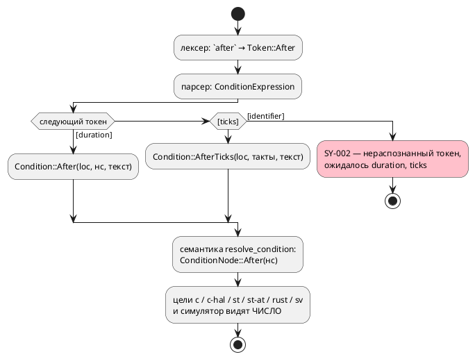
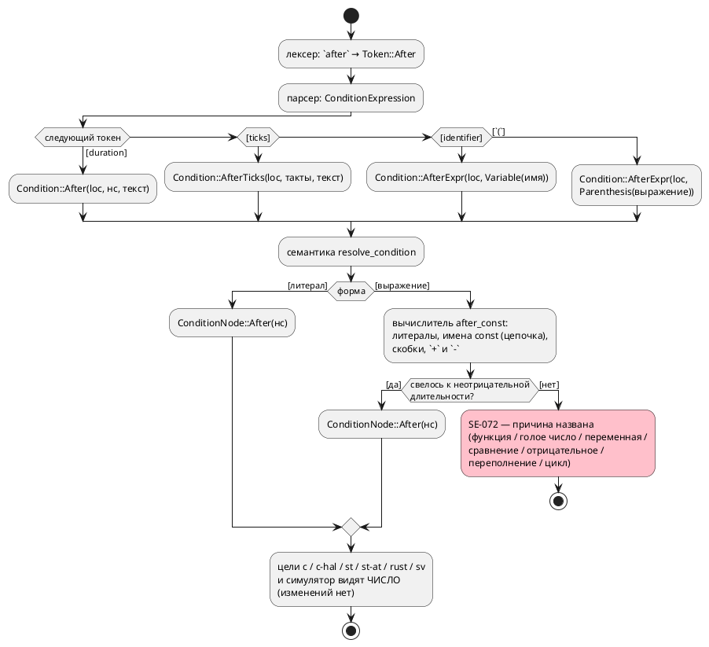

# Фича: `after` принимает константу типа `duration`, а не только литерал

- **Номер:** 0143
- **Статус:** ГОТОВО
- **Зависит от:** нет
- **Tier:** 2
- **Связанные issue (анализ):** кандидат блока 2 `FEATURES.md` (вскрыт написанием раздела документа [раздел документа: механизмы времени](0141-book-time-section.md), 2026-07-28); ревизия объёма — требование заказчика 2026-07-29 (константное **выражение**, а не только имя)

## Стадии жизненного цикла (правило 17)

Все стадии — **разделы этой карточки** (правило 32): «Архитектура (ADR)»,
«Анализ», «Разработка», «Тест-план», «Отчёт о тестировании», «Итог».
Отдельным артефактом остаются только исправления —
[`docs/fixes/`](../fixes/README.md) (при необходимости `0143-YY-*`).

## Краткое описание

Оператор `after` требует литерал длительности прямо в конструкции — именованную
выдержку в него подставить нельзя. Между тем правило 27(е) свода само учит
выносить длительность в константу, чтобы её было видно и можно было менять в
одном месте: язык и свод правил здесь расходятся.

> Фича зарегистрирована из бэклога кандидатов (отобрана заказчиком 2026-07-28); далее проходит жизненный цикл по правилу 17.

## Что известно на входе

- `const OVERRUN := 3m; ref Idle: after OVERRUN;` **не разбирается**: грамматика
  требует литерал длительности, ошибка `SY-002` («ожидалось duration»).
- Ошибка **громкая**: автор получает отказ разбора, а не молча иное поведение.
- Вскрыто при написании раздела `book/src/12-time/`: пример,
  оформленный по правилу 27(е), не скомпилировался.

## Направление решения (наметка, не решение)

- Допустить в `after` имя константы типа `duration`.
- Дальше по объёму — произвольное выражение этого типа (вопрос: вычислимо ли оно
  на этапе компиляции; счётчик тактов выбирает компилятор — модель времени 0134).

Окончательный выбор — за стадиями **архитектуры** (ADR) и **анализа**: раздел
выше фиксирует то, что уже проверено, а не предрешает реализацию.

## Документирование (правило 24)

**Требуется.** Меняется синтаксис `after` — затронут раздел
[`book/src/12-time/`](../../book/src/12-time/index.typ) (механизмы времени): нужен
пример с именованной выдержкой и уточнение, что принимает `after`.

## Архитектура (ADR)

- **Status:** Accepted
- **Date:** 2026-07-29
- **Authors:** Архитектор + дизайнер языка
- **Related issues:** [Фича](0143-after-const-duration.md); смежно
  с [ADR](0134-language-time-model.md#архитектура-adr) (модель времени: `clock`, `after`, `every`),
  [ADR](0042-address-defines.md#архитектура-adr) (вычисление константного выражения адреса —
  прецедент «имена + арифметика в одном месте»)

### Context

Выдержка на переходе записывается литералом длительности:

```takt
state Overrun {
    ref Working: light = 1;
    ref Idle: after 3m;      // ← литерал, и только литерал
}
```

Именованную выдержку в `after` подставить **нельзя**: грамматика после `after`
требует терминал `duration` либо `ticks`. Проба (2026-07-29):

```
probe.takt:16:25: Ошибка компиляции [SY-002]: нераспознанный токен 'OVERRUN',
ожидалось duration, ticks
```

Между тем правило 27(е) свода само учит выносить длительность в константу
(«длительность записывается литералом длительности (`after 3m`, `const DWELL :=
3s`)»), а раздел документа `book/src/12-time/` писался под это правило — то есть
**свод и язык расходятся**: `const DWELL := 3s;` объявить можно, применить в
`after` — нет.

Отказ **громкий** (ошибка разбора, а не молча иное поведение), поэтому фича
устраняет неудобство и расхождение с правилом, а не дефект.

Существенное свойство текущей реализации: `after` **не доживает** до целей в виде
конструкции языка. АСД несёт уже разобранные наносекунды
(`Condition::After(Location, i64, String)`), семантика сводит их к
`ConditionNode::After(nanos)`, и все шесть потребителей (`c`, `c-hal`, `st`,
`st-at`, `rust`, `sv`, симулятор) видят **число**. Отсюда поток «как есть»:



### Decision Drivers

1. **Свод и язык обязаны говорить одно.** Правило 27(е) требует именованных
   выдержек; язык их не принимает. Расхождение обнаруживается автором примера, а
   не машиной, — то есть будет обнаруживаться снова.
2. **Шесть целей не должны узнать об изменении.** Всякая конструкция времени,
   доехавшая до генераторов, — шесть шансов разойтись (урок `after` в 0134: тактовая
   и длительностная выдержки уже потребовали двух представлений). Решение,
   которое не меняет ни один генератор, безусловно предпочтительнее.
3. **Обратная совместимость.** `after 3m` обязан остаться разбираемым и давать
   вывод байт-в-байт прежним.
4. **Отказ остаётся громким.** Если имя не константа, не того типа или его нет
   вовсе, автор получает диагностику с позицией, а не выдержку «ноль» или
   потерянный переход.
5. **Объём соразмерен поводу.** Повод — именованная выдержка. Полное константное
   выражение (`after BASE + 30s`) — отдельный вопрос с отдельной ценой
   (вычислитель, переполнение, диагностики), и смешивать его с поводом значит
   вести две работы под одним номером.

### Considered Options

#### Option A. Имя константы `duration` разворачивается в наносекунды на семантике

Грамматика принимает `after ИМЯ`; АСД получает вариант
`Condition::AfterConst(Location, Identifier)`; семантика (`resolve_condition`)
ищет константу в области видимости, проверяет тип `duration`, берёт значение и
возвращает **тот же** `ConditionNode::After(nanos)`. Цепочка констант
(`const A := 3m; const B := A;`) разрешается рекурсивно, с защитой от циклов.

**Pros:**
- Ни один генератор и симулятор не меняются вовсе: за семантикой имени нет.
- Обратная совместимость — по построению: прежняя ветвь грамматики цела, узел
  результата тот же, значит вывод корпуса байт-в-байт неизменен.
- Диагностики времени, уже существующие, работают без правок: `SE-068` («`after`
  вне ребра») ищется в **сыром** АСД — новая ветвь обязана быть разобрана, иначе
  сборка не соберётся; `SE-071` (во что пересчиталась выдержка) читает
  разрешённый узел и печатает наносекунды, откуда бы они ни пришли.
- Имя в `after` становится **использованием** константы: слой `semantic::usages`
  видит его, значит `references`/`rename` в LSP не разъезжаются с языком.

**Cons:**
- Нужен новый вариант АСД — а он валит сборку в трёх местах (`format/`,
  `usages/walk.rs`, исчерпывающие обходы `time_ast.rs`). Это цена, но она же и
  страховка: ни одно место не будет пропущено молча.
- Константа в **тактах** остаётся недостижимой: литерала `3t` в выражениях нет,
  поэтому `const D := 3t;` не объявить (см. Consequences).

#### Option B. Произвольное константное выражение типа `duration`

`after` принимает выражение (`after BASE + 30s`, `after 2 * STEP`), которое
компилятор вычисляет в наносекунды.

**Pros:**
- Выразительнее: выдержка «база плюс запас» пишется на месте.
- Прецедент есть — вычислитель адреса (0042) умеет имена и целую арифметику.

**Cons:**
- Требует **своего** вычислителя над `duration`: сложение длительностей
  осмысленно, умножение длительности на длительность — нет; переполнение `i64`
  наносекунд нужно диагностировать (`SE-063`/`SE-064` — про пересчёт в такты, не
  про арифметику).
- Урок прямо предупреждает о цене: там арифметика **разъехалась** по двум
  матчерам и была сведена в одно место отдельной работой. Заводить второй
  вычислитель на другой предмет в фиче про именованную выдержку — тот же класс
  ошибки.
- Повод фичи (правило 27(е)) полностью закрывается именем; выражение — рост
  объёма без предъявленной нужды.

#### Option C. Позднее связывание: имя доезжает до целей

`ConditionNode::AfterConst(имя)` живёт до генерации, каждый генератор печатает имя
константы (в C — `#define`/`enum`, в ST — `VAR CONSTANT`, в Rust — `const`).

**Pros:**
- В порождённом коде видно **имя** — читателю прошивки понятнее, откуда 180000
  тактов.

**Cons:**
- Шесть целей + симулятор + верификация обязаны узнать о новом узле, и разойтись
  они могут молча — ровно тот класс, который в проекте уже дважды стоил дефектов
  (0045 в SV, 0050 в Rust: проверка доказывает компилируемость, но не верность).
- Пересчёт «наносекунды → такты» зависит от профиля времени и **уже** сделан
  один раз в `duration::units`; связывание по именам потребует повторить его в
  каждой цели либо всё равно развернуть в число — то есть выгода мнимая.
- `SE-071` («во что пересчиталась выдержка») пришлось бы считать заново для
  каждой цели.

### Ревизия объёма 2026-07-29 (требование заказчика)

Заказчик расширил объём **после** принятия решения: `after` обязан принимать не
только имя, но и **выражение** — пример `after ((v + 1) - f)`; в выражении
недопустим вызов функции; результат выражения — `duration`; значения в выражении
— константы и переменные.

Расширение разобрано пробами, и два его пункта уточнены заказчиком там же
(2026-07-29):

1. **Голое число в выражении — ошибка.** Проба: `v + 1` при `v: duration` уже
   сегодня даёт `SE-065` («длительность сочетается только с длительностью»).
   Заказчик подтвердил: внутри `after` действует то же правило языка, верная
   запись — `after ((v + 1s) - f)`. Скрытой единицы времени (нс или такты) в
   выражении **не появляется**.
2. **Переменные — вне объёма 0143.** Проба: тип `duration` **не поддерживает ни
   одна цель** генерации (`var v: duration` даёт `CC-020`, `RS-023` и аналоги в
   `st`/`sv`), тогда как симулятор его исполняет. Выражение с переменной было бы
   исполнимо в отладке и невыразимо в прошивке — ровно то расхождение
   «симулятор ≠ цели», которого проект избегает. Заказчик выбрал: в этой фиче
   **только константы**, вычисляемая выдержка — отдельной фичей вместе с
   поддержкой типа `duration` в целях.

Следствие для решения: **Option A сохраняется и расширяется** — вычисляется не
только имя, но и константное выражение над длительностями. Ключевое свойство
(«за границей семантики этой формы нет, цели не правятся») не меняется, потому
что результат по-прежнему `ConditionNode::After(нс)`.

Попутно установлено пробами (и потому нормировано ниже, а не оставлено на
догадку):

- **оператор `as` отсутствует в грамматике условий**, а аргумент `after` — это
  условие. Поэтому форма `after (((v + 1) - f) as duration)`, названная
  заказчиком как возможная, сегодня не разбирается — и не из-за этой фичи.
  Само приведение в языке **есть** и определено как «число — это
  миллисекунды» (`left := 250 as duration;` даёт `250ms` — проба; так же сказано
  в разделе документа о типе `duration`); отдельная находка той же пробы: в
  **инициализаторе объявления** приведение не вычисляется
  (`const D := A as duration;` → `SIM-006`), тогда как в теле работает —
  записано кандидатом;
- **умножения и деления в выражении выдержки нет**: грамматика условий знает
  только `+` и `-`.

### Decision

Принимается **Option A** (с ревизией объёма выше).

Решающее — драйвер 2: выдержка, развёрнутая в наносекунды **до** семантического
узла, физически не может рассинхронизировать цели, потому что за границей
семантики её имени нет. Option C эту границу переносит в шесть мест и покупает
за это только читаемость порождённого кода, которую никто не заказывал; Option B
решает не тот вопрос, который поставлен, и тянет второй вычислитель.

**Нормативно (правило языка).**

1. `after` принимает **литерал длительности** (`after 3m`), **литерал тактов**
   (`after 3t`), **имя константы типа `duration`** (`after DWELL`) и
   **константное выражение в скобках** (`after (BASE + 30s)`).
2. Составное выражение обязано быть **в скобках**: `after` связывает крепче
   арифметики, поэтому `after A + 1s` есть `(after A) + 1s`, а не выдержка
   `A + 1s`. Скобки хранятся в дереве, чтобы форматтер печатал их обратно.
3. Выражение — арифметика **над длительностями**: литералы длительности, имена
   констант типа `duration`, скобки, операторы `+` и `-`. Значение вычисляет
   компилятор.
4. Имя разрешается в области видимости модели по обычным правилам (включая
   родительские области через `upper`) и обязано быть **константой** (`const`)
   **типа `duration`**. Переменная, порт, именованное условие, состояние или
   модель с тем же именем — ошибка, а не совпадение.
5. Значение константы обязано сводиться к длительности: литерал, имя другой
   такой константы (цепочка) либо их сумма и разность. Цепочка разрешается
   рекурсивно; цикл и предел глубины — ошибка, а не зависание.
6. В выражении **недопустимы**: вызов функции (значение неизвестно компилятору),
   голое число без единицы времени (длительность сочетается только с
   длительностью — то же правило, что `SE-065`), переменная и порт (значение
   известно лишь в такте), а также любая нечисловая форма условия (сравнение,
   логика, строка, обращение к биту или элементу массива).
7. Результат обязан быть **неотрицательным**: `after (1s - 3s)` — ошибка, а не
   выдержка «минус две секунды». Переполнение при вычислении — тоже ошибка.
8. Семантически `after DWELL` и `after (BASE + 30s)` **тождественны**
   `after <литерал того же значения>`: один и тот же `ConditionNode::After(nanos)`,
   одно и то же поведение во всех целях и в симуляторе, то же предупреждение
   `SE-071`.
9. Нарушения пунктов 4–7 диагностируются новым кодом **`SE-072`**; текст
   диагностики называет **причину**, позиция — узел, на котором вычисление
   остановилось.
10. Ограничение `after` «только в условии перехода `ref`» (`SE-068`)
    сохраняется и распространяется на новую форму без изменений.

Целевой поток:



### Consequences

#### Положительные

- Правило 27(е) свода становится исполнимым: `const DWELL := 3s; ref Idle: after
  DWELL;` компилируется, и выдержку видно в одном месте.
- Ни один генератор, ни симулятор, ни верификация не правятся — риск расхождения
  целей равен нулю по построению, а не по результату прогона.
- Имя в `after` — использование константы, видимое `semantic::usages`, поэтому
  «перейти к объявлению», «показать ссылки» и «переименовать» работают на нём с
  первого дня (правило 29).
- Ошибка остаётся громкой: было `SY-002` на этапе разбора, стало `SE-072` на
  этапе семантики — с более точным сообщением, чем «ожидалось duration, ticks».

#### Отрицательные / Action items

- **Константа в тактах невыразима.** Литерал `3t` существует **только** внутри
  `after`; в выражениях его нет, поэтому `const D := 3t;` не объявить, и
  `after D` для тактовой выдержки недостижимо. В объём фичи не входит (потребовало
  бы литерала тактов в выражениях и типа для него) — **записать кандидатом**.
- **`every` остаётся литеральным.** `every 100ms { … }` — тот же класс
  неудобства, но другая конструкция и другая грамматическая позиция
  (`EveryDefine`, не условие). В объём не входит — **записать кандидатом**.
- **Вычисляемая выдержка (переменная в выражении) не поддерживается** — решение
  заказчика 2026-07-29. Требует сначала поддержки типа `duration` в целях
  генерации (сегодня `CC-020`/`RS-023`), иначе симулятор и цели разойдутся:
  **записать фичей-преемником**.
- **`as` не разбирается внутри `after`**: оператор есть только в грамматике
  выражений, а аргумент выдержки — условие. Форма `after ((x) as duration)`
  недоступна — **записать кандидатом**.
- **Умножения/деления в выражении выдержки нет** (грамматика условий их не
  содержит) — например `after (BASE * 2)` не разбирается.
- Новый вариант АСД обязывает пройти по трём машинным контролю (`format/`,
  `usages/walk.rs`, исчерпывающие обходы `time_ast.rs`) — они валят сборку сами,
  но правки требуют.
- Приложение «Ошибки и предупреждения» получает строку `SE-072`; раздел
  `book/src/12-time/` — пример с именованной выдержкой и уточнение, что принимает
  `after` (правила 24, 26).

#### Acceptance criteria

1. `const DWELL := 3m; ref Idle: after DWELL;` компилируется всеми целями и
   исполняется симулятором; вывод **байт-в-байт** совпадает с выводом того же
   исходника, где вместо `DWELL` стоит литерал `3m`. То же для выражения:
   `after ((BASE + TRIM) + 30s)` при `BASE := 2m; TRIM := 30s` даёт вывод,
   тождественный `after 3m`.
2. `after 3m` и `after 3t` разбираются и работают как прежде; корпус
   `examples/generated/` не меняется ни в одном байте.
3. `SE-072` выдаётся с позицией виновного узла на всех причинах пункта 6–7
   решения: имя не объявлено, имя — не константа (переменная / порт), тип не
   `duration`, значение не сводится к длительности, голое число, вызов функции,
   сравнение, отрицательный результат, цикл в цепочке констант.
4. `SE-068` продолжает отвергать именную форму вне ребра (`cond X = after DWELL;`
   — ошибка).
5. `taktc fmt` печатает `after DWELL` без потери текста; круговой рейс
   (`fmt` → разбор → `fmt`) устойчив.
6. `references`/`rename` LSP видят имя внутри `after` как использование
   константы.
7. `SE-071` печатает пересчёт для именной формы так же, как для литерала.

## Анализ

### Цель и контекст

Допустить в выдержке перехода имя константы типа `duration`
(`const DWELL := 3m; ref Idle: after DWELL;`), сохранив литеральные формы
(`after 3m`, `after 3t`) и **не затронув ни одну цель генерации**. Форма решения
принята [ADR](0143-after-const-duration.md#архитектура-adr), Option A: имя
разворачивается в наносекунды на семантике, за её границей имени нет.

Повод — расхождение свода и языка: правило 27(е) требует выносить длительность в
константу, а язык такую константу в `after` не принимает (проба 2026-07-29 даёт
`SY-002`). Ошибка громкая, поэтому фича устраняет неудобство, а не дефект.

### Зависимости фичи (правило 17/19)

- **Зависит от:** `нет`. Проверено по контракту и инфраструктуре:
  - механизм времени (`clock`/`after`/`SE-068`/`SE-071`) **закрыт** —
    фича опирается на готовое, а не ждёт;
  - тип `duration` и литерал длительности в выражениях (`TypeNode::Duration`,
    `ExpressionNode::Duration`) есть и работают: `const DWELL := 3m;` уже
    объявляется, вывод типа даёт `Duration`
    (`type_inference.rs`, ветвь `ExpressionNode::Duration`);
  - насыщение fixed-point ([насыщение (saturation) для fixed-point `q(m, n)`](0170-fixed-point-saturation.md)) к
    длительностям отношения не имеет;
  - ограничение глубины ([ограничение глубины вложенности на уровне лексера/парсера](0156-parser-depth-limit.md)) не
    требуется: цепочка констант ограничивается **своим** пределом (R6), а не
    парсерным.
- **Влияние на порядок разработки:** ничего не разблокирует и не блокирует.
  Смежная работа — раздел `book/src/12-time/` (правило 24), внутри этой же фичи.
  Порядок таблицы `FEATURES.md` фича не меняет: она стояла второй строкой и
  берётся в работу после того, как 0182 остановлена заказчиком на проработке.

### Ревизия объёма 2026-07-29 (требование заказчика)

Заказчик расширил объём в ходе разработки: `after` принимает **выражение**
(`after ((v + 1s) - f)`), вызов функции в нём недопустим, результат — `duration`.
Два уточнения получены от него же и подтверждены пробами (подробности — в
[ADR](0143-after-const-duration.md#архитектура-adr), раздел «Ревизия объёма»):

- **голое число в выражении — ошибка** (внутри `after` действует общее правило
  `SE-065`: длительность сочетается только с длительностью);
- **переменные — вне объёма этой фичи**: тип `duration` не поддерживает ни одна
  цель генерации (`CC-020`, `RS-023` — проба), поэтому вычисляемая выдержка
  разошлась бы между симулятором и прошивкой. Заводится фичей-преемником.

Требования ниже приведены **в редакции после ревизии**.

### Требования и проверяемые условия

- **R1. Форма разбирается.** `after ИМЯ` и `after (выражение)` — законные записи
  условия перехода; АСД получает вариант `Condition::AfterExpr(Location,
  Box<Condition>)`. Скобочная форма сохраняет узел `Parenthesis`: без него
  печать `after A + 1s` изменила бы смысл (`after` связывает крепче арифметики).
- **R1a. Выражение вычисляется компилятором.** Литералы длительности, имена
  констант `duration` (в том числе цепочкой), скобки, `+`, `-`. Отрицательный
  результат и переполнение — ошибка.
- **R1b. Недопустимое в выражении отвергается с названной причиной:** вызов
  функции, голое число, переменная, порт, сравнение, логика, строка, обращение к
  биту или элементу массива.
- **R2. Литеральные формы неизменны.** `after 3m` и `after 3t` разбираются в
  прежние узлы; порождённый код корпуса совпадает **байт-в-байт**.
- **R3. Разрешение — на семантике, в одной воронке.** `resolve_condition`
  (единственный вход разбора условий: ref-рёбра, `cond`, LTL) сводит именную
  форму к **тому же** `ConditionNode::After(nanos)`. Ни один генератор и
  симулятор не правятся.
- **R4. Имя обязано быть константой типа `duration`.** Поиск — `search_var`
  (текущая модель + цепочка `upper`). Не найдено / не `const` / тип ≠ `duration`
  → диагностика `SE-072` с позицией имени и названной причиной. Тип
  `Inference`/`Unsupported` — не «другой тип», а «вывод типов не дошёл» (проба:
  `const B := A;` даёт `Inference`, `const B := A + 1;` — `Unsupported`); в этих
  случаях арбитром становится **значение**, иначе автор получал бы сообщение о
  слабости вывода типов вместо ошибки в своей записи.
- **R5. Значение константы — литерал длительности либо имя такой же константы.**
  Цепочка (`const A := 3m; const B := A;`) разрешается рекурсивно. Прочее
  значение (число, `float`, выражение) → `SE-072`.
- **R6. Цикл в цепочке не зависает.** `const A := B; const B := A;` даёт
  `SE-072`, а не бесконечную рекурсию; предел глубины цепочки — константа модуля.
- **R7. Место `after` не меняется.** `SE-068` («выдержка вне ребра `ref`»)
  отвергает именную форму в `cond`, инварианте и Guard-формуле — обходы
  `time_ast.rs` исчерпывающи, новый вариант обязан быть разобран (иначе сборка
  не собирается).
- **R8. Вид выдержки определён.** Именная форма — **длительностная**
  (`model_uses_duration_after` → `true`, `model_uses_tick_after` → `false`), в том
  числе в сыром представлении `Unresolved`-ребра: от этого зависит, какое поле
  времени эмитят генераторы.
- **R9. Форматтер печатает без потери.** `taktc fmt` печатает `after ИМЯ`;
  круговой рейс `fmt → разбор → fmt` устойчив; корпус `.takt` проходит
  `format_tests`.
- **R10. Имя — использование константы.** `semantic::usages` регистрирует
  вхождение, поэтому `references`/`rename`/`definition` LSP видят имя внутри
  `after` (правило 29).
- **R11. `SE-071` работает и для именной формы** — предупреждение о пересчёте
  печатается по разрешённому узлу, значит имени не различает; проверить прогоном,
  а не рассуждением.
- **R12. Диагностика `SE-072` описана в документе.** Приложение «Ошибки и
  предупреждения» + блок «Частые ошибки» раздела времени (правила 25, 26).

### Критерии приёмки и способ проверки

| # | Критерий | Способ проверки |
|---|---|---|
| A1 | `after DWELL` даёт вывод, тождественный `after 3m` | тест: два исходника (имя / литерал) → `compile_to_c` → сравнение строк байт-в-байт |
| A2 | Корпус не изменился | `precheck.sh` (детерминизм + сборка примеров) + `git diff --stat examples/generated/` пуст |
| A3 | `SE-072` на пяти причинах R4/R5/R6 | тесты семантики: неизвестное имя, `var`, порт, `const` не той типизации, значение-число, цикл |
| A4 | `SE-068` отвергает `cond X = after DWELL;` | тест семантики (ожидается код `SE-068`, не `SE-072`) |
| A5 | `fmt` круговой рейс | тест форматтера на фикстуре с `after DWELL` + `format_tests` по корпусу |
| A6 | LSP видит использование | тест `usages`: позиция имени в `after` попадает в `references` константы |
| A7 | Симулятор ведёт себя так же | `takt-sim` прогон модели на имени и на литерале → совпадающие трассы |
| A8 | `SE-071` печатает пересчёт для имени | прогон `taktc compile -t c --tick-hz=…` на именной форме: предупреждение присутствует |
| A9 | Все цели компилируют именную форму | `precheck.sh` целиком (проверки `cc`, `iec2c`, `rustc/clippy`, `verilator/yosys`) на фикстуре-примере |
| A10 | Документ актуален | раздел `book/src/12-time/` содержит пример с именованной выдержкой; `SE-072` есть в приложении; проверки `check-book-glyphs.py` и примеров `book/` зелёные |

### Особенности по обратной функциональности

**Обратная совместимость полная — изменение строго аддитивно.**

- Прежде `after ИМЯ` было **ошибкой разбора** (`SY-002`), то есть ни одна
  существующая программа этой записи содержать не могла: ошибка громкая, файл не
  компилировался. Значит расширение не меняет смысл ни одного существующего
  текста.
- Литеральные ветви грамматики не трогаются; семантический узел результата тот же
  (`ConditionNode::After`), поэтому вывод всех целей и поведение симулятора по
  построению неизменны (контроль — A1/A2).
- Публичный API крейта `takt-lang` растёт аддитивно (новый вариант перечисления
  `ast::Condition` — перечисление публичное, поэтому для сторонних потребителей
  с исчерпывающим `match` это **ломающее** изменение; в проекте таких
  потребителей нет, но версия крейта повышается по минору, а не патчу).
- **Версия языка** — правило 22: фича меняет **синтаксис**, поэтому обязана быть
  отражена в версии языка. Текущий цикл — `0.7.0`, открыт фичей
  (тег `v0.7.0` на её коммите), и **подъёма не требует**: изменения вносятся в
  уже поднятую версию, следующий подъём — после выпуска `0.7.0`. Своего тега
  фича не ставит.

### Редакторский слой (правило 29)

Фича меняет **синтаксис**, поэтому ответ фиксируется по каждому пункту правила:

- **Новое ключевое слово / токен — нет.** `after` в лексере есть с 0134,
  подсветка (`lsp/semantic_tokens.rs`) и автодополнение
  (`lsp/keywords.rs::BUT_KEYWORDS`, запись `"after"`) его уже знают; в
  `TaktTokenTypes.KEYWORDS` плагина IntelliJ `after` тоже присутствует. Правок
  **не требуется**; уточняется лишь **текст hover-подсказки** (упомянуть именную
  форму) — это данные, не поведение.
- **Новая форма объявления или импорта — нет.** `after ИМЯ` — **использование**
  имени, а не объявление. Следствие для плагина IntelliJ: `TaktSymbolScanner`
  собирает декларации по ключевым словам из `SIMPLE_DECL_KEYWORDS` (`const` там
  есть, `after` — нет), а всякий прочий идентификатор парсер плагина оборачивает
  в `NAME_REF` и резолвит по имени. Значит переход к объявлению и переименование
  на `after DWELL` работают **без правок плагина**; проверять — тестом плагина не
  обязательно (Gradle вне предкоммита), достаточно чтения кода, что и сделано.
- **Новый узел АСД — да.** Обязательны: печать в `format/` и обход
  `semantic/usages/walk.rs` (оба валят сборку сами — `format_source`
  отказывает на непокрытом узле, `walk.rs` под
  `deny(clippy::wildcard_enum_match_arm)`), а также исчерпывающие обходы
  `semantic/time_ast.rs` (`find_after`, `raw_has_after_kind`) и
  `validate/implicit_bool.rs`. `lsp/symbols.rs` правок **не требует**: структура
  документа перечисляет объявления, а не условия рёбер.
- **Новая диагностика — да, `SE-072`.** Доезжает до редактора обычным путём
  (возвращается из `resolve_condition` как `Diagnostic`, попадает в
  `collect_compile_diagnostics`, общий для CLI и LSP), позиция — имя внутри
  `after`. Печать из библиотеки не добавляется.

### Риски и зависимости

- **Риск: имя разрешается не там, где ожидает автор.** `search_var` обходит
  цепочку `upper`, поэтому одноимённая константа родительской модели «победит»
  отсутствие локальной. Это **общее** правило области видимости языка, и отступать
  от него в одной конструкции хуже, чем следовать: сохраняем общее правило,
  фиксируем в документе.
- **Риск: имя совпадает с состоянием или моделью.** Поиск идёт **только** по
  переменным (`search_var`), поэтому одноимённое состояние не подменит константу;
  если константы нет, а состояние есть, получаем `SE-072` («не объявлена
  константа»), а не молчаливое `Unresolved`. Проверяется тестом A3.
- **Риск: цепочка констант зацикливается.** Снимается пределом глубины и тестом
  R6; предел — константа модуля, а не «предполагаемая» защита.
- **Риск: тактовая константа выглядит поддержанной, а не поддержана.**
  `const D := 3t;` **не объявляется вовсе** (литерала тактов в выражениях нет),
  поэтому `after D` для тактов недостижим — в объём не входит, записывается
  кандидатом (правило 7). Опасность здесь в документе: раздел обязан сказать это
  прямо, иначе читатель решит, что забыли.
- **Риск: размер модулей.** `semantic/condition.rs` — 923 строки при пределе
  ~1000, поэтому логика вычисления (поиск, цепочка, диагностика, тесты)
  выносится в **новый** модуль, а в разборе условий остаётся одна ветвь-вызов.
  Разместить его соседом по `semantic/` **нельзя**: `semantic/mod.rs`
  пришпилен реестром размеров, и даже две строки объявления проверка отвергает —
  проверено. Поэтому `condition.rs` становится `condition/mod.rs`, а вычислитель
  — `condition/after_const.rs`. `parser/ast.rs` (965) получает только
  вариант перечисления и строку в `loc()`.
- **Зависимость от инструментов:** нет новых. Проверка идёт существующими проверками
  `precheck.sh`.

### Декомпозиция разработки

| Задача | Содержание |
|---|---|
| `0143-01` | Грамматика, узел АСД, форматтер, исчерпывающие обходы (`time_ast`, `implicit_bool`, `usages/walk`) |
| `0143-02` | Семантика: `semantic/condition/after_const.rs` — вычисление выражения, цепочка констант, `SE-072`; ветвь в `resolve_condition` |
| `0143-03` | Документ: раздел `book/src/12-time/`, приложение «Ошибки и предупреждения», hover LSP |
| `0143-04` | Ревизия по требованию заказчика: выражение в скобках, запрет функции/числа/переменной, знак и переполнение результата |

## Разработка

### Задача

#### Что было

После `after` грамматика допускала **только** терминал `duration` либо `ticks`.
Проба 2026-07-29:

```
probe.takt:16:25: Ошибка компиляции [SY-002]: нераспознанный токен 'OVERRUN',
ожидалось duration, ticks
```

#### Что сделано

- **Грамматика** (`takt-lang/src/grammar.lalrpop`, правило `ConditionExpression`)
  — две новые ветви:
  - `"after" <Identifier>` → `Condition::AfterExpr(loc, Variable(имя))`;
  - `"after" "(" <Condition> ")"` → `Condition::AfterExpr(loc,
    Parenthesis(выражение))`.

  Прежние ветви `"after" duration` и `"after" ticks` **не тронуты** — отсюда
  обратная совместимость по построению. Конфликта LR(1) нет: после `after`
  различающий токен — терминал длительности, терминал тактов, идентификатор или
  `(`.

  **Скобки сохраняются в дереве** (узел `Parenthesis`), а не снимаются при
  разборе: `after` связывает крепче арифметики, поэтому напечатанное без скобок
  `after A + 1s` разобралось бы как `(after A) + 1s` — форматтер испортил бы
  программу.

- **Узел АСД** (`takt-lang/src/parser/ast.rs`): вариант
  `Condition::AfterExpr(Location, Box<Condition>)` + строка в `loc()`.
  Наносекунд в узле нет — значение вычисляет семантика.

- **Исчерпывающие обходы.** Компилятор указал ровно шесть мест, где новый вариант
  обязан быть разобран (это и есть страховка проекта — ни одно не пропущено
  молча):

  | Файл | Что решено |
  |---|---|
  | `format/expr.rs` | печать `after <вложенное условие>` (рекурсивно) |
  | `semantic/time_ast.rs::find_after` | позиция для `SE-068` — выдержка вне ребра остаётся ошибкой |
  | `semantic/time_ast.rs::raw_has_after_kind` | вид выдержки — **длительностный** (тактовых констант не бывает) |
  | `semantic/validate/implicit_bool.rs` | результат выдержки булев, неявным приведением не является |
  | `semantic/usages/walk.rs` | рекурсивный обход: имена внутри — **использования** констант |
  | `semantic/condition.rs` | ветвь-вызов вычислителя  |

- **LSP** (`lsp/keywords.rs`): текст hover-подсказки `after` перечисляет новые
  формы. Разбор токенов и список автодополнения правок не требуют — `after` в них
  уже есть (правило 29; полный ответ по редакторскому слою — в анализе).

#### Проверки

```sh
cargo build --bin taktc
cargo test -p takt-lang --lib after_const -- --test-threads=1
cargo test -p takt-lang --test after_const_duration_tests --features lsp -- --test-threads=1
```

- R1 (форма разбирается) — проба:
  `taktc compile -t c --tick-hz=1000` на модели с `after OVERRUN` компилируется и
  печатает `SE-071` (`180000000000 нс = 180000 тактов`).
- R2/R9 (обратная совместимость, печать) — `taktc fmt --stdin` возвращает
  `ref Idle: after ((BASE + TRIM) - 30s);` байт-в-байт как написано.
- R7 (`SE-068`) — тест
  `after_const::tests::named_dwell_outside_reference_is_se068`.
- R10 (использования) — тесты `editor::references_include_name_inside_after`,
  `editor::rename_updates_name_inside_after`.

### Задача

#### Что было

Значение выдержки приходило из АСД **уже разобранным** (`Condition::After(loc,
нс, текст)`), поэтому семантике оставалось перенести число в
`ConditionNode::After(нс)`. Для новой формы числа в АСД нет — его нужно
**вычислить** из объявлений.

#### Что сделано

- **Новый модуль** `takt-lang/src/semantic/condition/after_const.rs` (вместе с
  тестами ≈ 700 строк). Отдельный, а не ветвь в разборе условий: тот — 936 строк
  при пределе ~1000 (`docs/CODE.md`), и логика вычисления с 22 тестами его бы
  переполнила.

  **Подмодуль `condition/`, а не сосед по `semantic/`:** первая редакция
  объявила модуль в `semantic/mod.rs`, и проверка размера **отверг** правку —
  `mod.rs` пришпилен реестром (1553 строки) и расти не имеет права даже на две
  строки объявления. `condition.rs` переехал в `condition/mod.rs` (приём
  «директория-подмодуль» фичи), объявление живёт там.

- **Вычисление идёт по сырому АСД**, а не по понижённому узлу: значение нужно
  раньше, чем условие станет `ConditionNode`, — оно и определяет, каким узлом
  условие станет. Тот же приём, что у вычислителя адреса, но **не**
  его дубль: там целые адреса без типов, здесь типизированные длительности с
  запретом смешения. Принимаются: литерал длительности, имя константы `duration`
  (в том числе цепочкой), скобки, `+`, `-`.

- **Диагностика `SE-072`** — один код, **называющий причину**: имя не объявлено,
  не константа (переменная / порт / неразрешённое объявление), тип не `duration`,
  значение не сводится к длительности, голое число, вызов функции, неподходящая
  форма (сравнение, логика, строка, бит, элемент массива), отрицательный
  результат, переполнение, цикл в цепочке. Позиция — **узел, на котором
  вычисление остановилось**, а не вся выдержка: автор правит именно его.

- **Предел глубины** `MAX_DEPTH = 32` — контроль против цикла
  (`const A := B; const B := A;`). Проба подтвердила: без предела инструмент
  отвечал бы зависанием, а не диагностикой (снятый фичей в обходах
  верификации).

- **Две находки проб, повлиявшие на код** (иначе диагностика врала бы автору):
  - `const DWELL := BASE;` даёт тип **`Inference`**, а `const DWELL := BASE + 1s;`
    — **`Unsupported`**: вывод типов не протягивает тип через ссылку
    константа→константа. Поэтому такие типы трактуются как «вывод не дошёл», и
    арбитром становится **значение**; отказ «тип `_`» сообщал бы автору о
    слабости вывода типов, а не об ошибке в его записи.
  - у звена цепочки поле `expr` хранит **копию** объявления в сыром виде
    (`Unresolved(Duration(...))`) — ветвь для него есть, и без неё цепочка
    отвергалась бы как «не литерал».

- **Ветвь в воронке** `semantic/condition.rs`: `Condition::AfterExpr` →
  `after_const::resolve_after_expr`. Через ту же воронку идут ref-рёбра, `cond` и
  LTL, поэтому форма ведёт себя одинаково всюду, где условие вообще допустимо.

#### Проверки

```sh
cargo test -p takt-lang --lib after_const -- --test-threads=1
```

22 теста, примеры и контрпримеры (правило 16):

- **позитивные:** имя = литерал байт-в-байт; явный тип `duration`; цепочка
  констант; константа из родительской области; составное условие
  `(after DWELL) & flag`; `after (BASE + TRIM)`; вложенные скобки с вычитанием;
  выражение из одних литералов; избыточные скобки;
- **контрпримеры:** неизвестное имя; переменная (и переменная **внутри**
  выражения); порт; тип не `duration`; голое число; вызов функции; сравнение;
  отрицательный результат; значение-арифметика с числом; цикл в цепочке;
  одноимённое состояние не подменяет константу; `SE-068` вне ребра.

Тождественность вывода целей проверяет задача (тесты
`after_const_duration_tests`).

### Задача

#### Что было

Раздел `book/src/12-time/` описывал выдержку **только** литералами (`after 3m`,
`after 3t`). Именно при его написании  и вскрылось расхождение свода и
языка: пример, оформленный по правилу 27(е) через константу, не компилировался.

#### Что сделано

- **`book/src/12-time/index.typ`** — подраздел «Именованная выдержка» после
  «Выдержки в тактах»: имя константы, тождественность литералу, выражение в
  скобках и **почему скобки обязательны** (`after` связывает крепче арифметики,
  поэтому `after BASE + TRIM` — это `(after BASE) + TRIM`). Сказано и то, чего
  нельзя: переменная, порт, вызов функции, число без единицы времени — с
  объяснением причины, а не запретом ради запрета.

- **Пример раздела приведён к правилу 27(е)**: `book/src/12-time/examples/fan.takt`
  получил `const OVERRUN := 3m;` и `ref Idle: after OVERRUN;` (новая выноска
  `(5)`), разбор дополнен фразой о том, зачем выдержка вынесена в константу.
  Значение не изменилось, поэтому прогон в разделе остался прежним.

- **Блок «Частые ошибки»** (правило 26) раздела получил строку `SE-072`.

- **Приложение «Ошибки и предупреждения»** (правило 25): строка в сводной таблице
  + **подробный разбор** `SE-072` с двумя частыми случаями (переменная в
  выражении; число без единицы времени). Тексты диагностик в разбор **скопированы
  из прогона**, а не написаны по памяти.

#### Проверки

```sh
cargo run --bin taktc -- compile -t c book/src/12-time/examples/fan.takt -o /tmp/fan --tick-hz=1000
cargo run -p takt-sim --bin takt-sim -- book/src/12-time/examples/fan.takt -n 10
python3 scripts/check-book-glyphs.py
./scripts/precheck.sh
```

- Проверка примеров `book/`  компилирует и прогоняет обновлённый пример —
  то есть новая форма языка проверяется **на документе**, а не только в тестах.
- Проверка символов  контролирует, что в добавленном тексте нет глифов вне
  шрифта Fira Code.

### Задача

#### Что было

Задачи/02 закрывали объём карточки — **имя константы** в `after`. В ходе
разработки заказчик (2026-07-29) расширил требование: `after` принимает
**выражение** (пример `after ((v + 1) - f)`), вызов функции в нём недопустим,
результат — `duration`, значения — константы и переменные.

#### Что сделано

Разбор требования пробами и два уточнения заказчика (полностью — в разделе
«Ревизия объёма» [ADR](0143-after-const-duration.md#архитектура-adr)):

1. **Голое число в выражении — ошибка.** Проба: `v + 1` при `v: duration` уже
   сегодня даёт `SE-065`. Заказчик подтвердил, что внутри `after` действует то же
   правило, верная запись — `after ((v + 1s) - f)`. Скрытой единицы времени в
   выражении не появляется.
2. **Переменные — вне объёма фичи.** Проба: тип `duration` **не поддерживает ни
   одна цель** генерации (`var v: duration` → `CC-020`, `RS-023`), тогда как
   симулятор его исполняет. Выражение с переменной было бы исполнимо в отладке и
   невыразимо в прошивке. Заказчик выбрал «только константы»; вычисляемая
   выдержка — фичей-преемником вместе с поддержкой типа `duration` в целях.

Реализация ревизии:

- **узел АСД переименован и обобщён**: вместо `AfterConst(Location, Identifier)`
  — `AfterExpr(Location, Box<Condition>)`; `after ИМЯ` разбирается в тот же узел с
  вложенным `Variable`. Один узел → один вычислитель → один контроль в каждом
  исчерпывающем обходе (вместо двух);
- **ветвь грамматики** `"after" "(" Condition ")"` со сохранением узла
  `Parenthesis` в дереве;
- **вычислитель** дополнен `+`, `-`, скобками, проверкой знака результата и
  `checked_add`/`checked_sub` (переполнение — диагностика, а не обёртка);
- **причины `SE-072`** дополнены: голое число, вызов функции, неподходящая форма
  (сравнение, логика, строка, бит, элемент массива), отрицательный результат,
  переполнение;
- **тесты**: девять новых случаев (выражения, скобки, голое число, функция,
  сравнение, отрицательный результат, переменная внутри выражения) — итого 22 в
  модуле;
- **интеграционный тест** `expression_form_output_identical_to_literal`: цель `c`
  для `after ((BASE + TRIM) + 30s)` даёт код, **тождественный** `after 3m`;
- **форматтер**: тест на круговой рейс скобочной формы
  (`after ((BASE + 30s) - 15s)` печатается со скобками — иначе печать изменила бы
  смысл программы);
- **документ**: подраздел «Именованная выдержка» описывает и выражение, и почему
  скобки обязательны, и что в выражении недопустимо.

**Оформлено ревизией задачи, а не исправлением** (`docs/fixes/`): исправление в процессе
проекта — исправление дефекта **закрытой** работы (правило 17, стадия 7), а здесь
объём меняется у фичи, находящейся в разработке. Требование заказчика отражено в
ADR (раздел «Ревизия объёма»), анализе (раздел с тем же именем) и этой задаче.

#### Проверки

```sh
cargo test -p takt-lang --lib after_const -- --test-threads=1
cargo test -p takt-lang --test after_const_duration_tests --features lsp -- --test-threads=1
./scripts/precheck.sh
```

Пробы, снятые вживую:

```
taktc compile -t c --tick-hz=1000 expr.takt
Предупреждение [SE-071]: выдержка after → Idle: 120000000000 нс = 120000 тактов (профиль «такты», 1000 Гц)
```

(`after ((BASE + TRIM) - 30s)` при `BASE := 2m`, `TRIM := 30s` — ровно 2 минуты.)

```
doc1.takt:3:35: Ошибка компиляции [SE-072]: выдержка 'after': 'v' — это переменная, …
doc2.takt:3:42: Ошибка компиляции [SE-072]: выдержка 'after': число 1 без единицы времени — …
```

## Тест-план

### Область и цель

Проверяется, что `after` принимает имя константы `duration` и константное
выражение над длительностями, **не меняя** ни одну цель генерации и ни один байт
существующего вывода, и что всё непринимаемое отвергается **громко**, с названной
причиной.

Ключевая стратегия — **тождественность**, а не «компилируется»: литеральная форма
уже покрыта потактовыми сверками
(`conformance_{c,rust,st,sv}_*_time_tests`), поэтому равенство текста
вывода переносит на новую форму их доказательства. Проверка «собралось» этого не
дала бы: молча неверная трансляция собирается тоже (уроки в `sv` и 0050 в
`rust`).

### Проверки (условие → ожидаемый результат)

| # | Проверка | Предусловие | Ожидаемый результат | Ссылка на R/A |
|---|---|---|---|---|
| T1 | Имя вместо литерала | `const DWELL := 3m; ref X: after DWELL;` | узел `After(180000000000)`, равный узлу от `after 3m` | R1, R3 / A1 |
| T2 | Явный тип константы | `const D: duration := 250ms;` | `After(250000000)` | R4 |
| T3 | Цепочка констант | `const BASE := 2s; const D := BASE;` | `After(2000000000)` | R5 |
| T4 | Константа родительской области | `const D := 30s;` вне модели | `After(30000000000)` | R4 |
| T5 | Выдержка в составном условии | `(after DWELL) & flag` | `And(...)`, выдержка внутри | R1 |
| T6 | Сумма константы и литерала | `after (BASE + 30s)` при `BASE := 2m` | `After(150000000000)` | R1a |
| T7 | Вложенные скобки с вычитанием | `after ((V + 1s) - F)` | `After(8000000000)` при `V := 10s, F := 3s` | R1a |
| T8 | Только литералы | `after (1m + 30s)` | `After(90000000000)` | R1a |
| T9 | Избыточные скобки | `after (DWELL)` | как `after DWELL` | R1a |
| T10 | Неизвестное имя | `after DWELL` без объявления | `SE-072`, текст «не объявлена» | R4 / A3 |
| T11 | Переменная | `var DWELL: duration` | `SE-072`, текст «переменная» | R1b / A3 |
| T12 | Переменная внутри выражения | `after (v + 1s)` при `var v` | `SE-072`, текст «переменная» | R1b / A3 |
| T13 | Порт | `in DWELL: bit` | `SE-072`, текст «порт» | R1b / A3 |
| T14 | Тип не `duration` | `const DWELL := 180;` | `SE-072`, текст про `duration` | R4 / A3 |
| T15 | Голое число в выражении | `after (V + 1)` | `SE-072`, «без единицы времени» | R1b / A3 |
| T16 | Вызов функции | `after (base() + 1s)` | `SE-072`, «вызов функции» | R1b / A3 |
| T17 | Сравнение в выражении | `after (V > 1s)` | `SE-072`, «сравнение» | R1b / A3 |
| T18 | Отрицательный результат | `after (1s - 3s)` | `SE-072`, «отрицательной» | R1a / A3 |
| T19 | Значение-арифметика с числом | `const D := BASE + 1;` | `SE-072` | R5 / A3 |
| T20 | Цикл в цепочке | `const A := B; const B := A;` | `SE-072`, «ссылаются друг на друга»; **не зависание** | R6 / A3 |
| T21 | Одноимённое состояние | `after Done` при `state Done` | `SE-072`, а не подмена | R4 |
| T22 | Выдержка вне ребра | `cond T = after DWELL;` | `SE-068` (не `SE-072`) | R7 / A4 |
| T23 | Тождественность вывода: цель `c` | имя против литерала, одно имя входа | файлы `.c` совпадают **байт-в-байт** | R3 / A1, A9 |
| T24 | То же: цель `rust` | — | совпадают | R3 / A1, A9 |
| T25 | То же: цель `st` | — | совпадают | R3 / A1, A9 |
| T26 | То же: цель `sv` | — | совпадают | R3 / A1, A9 |
| T27 | Тождественность выражения | `after ((BASE + TRIM) + 30s)` = `after 3m` | `.c` совпадают | R1a / A1 |
| T28 | Форматтер: имя | печать + повторная печать | `after OVERRUN`, круговой рейс устойчив | R9 / A5 |
| T29 | Форматтер: скобки выражения | `after ((BASE + 30s) - 15s)` | скобки на месте, рейс устойчив | R9 / A5 |
| T30 | `references` на имени в `after` | курсор на объявлении | 2 вхождения, одно — внутри `after` | R10 / A6 |
| T31 | `rename` правит имя в `after` | новое имя `DWELL` | 2 правки, обе с новым именем | R10 / A6 |
| T32 | `SE-071` для новой формы | `--tick-hz=1000` | предупреждение о пересчёте печатается | R11 / A8 |
| T33 | Корпус не изменился | `precheck.sh` + `git diff` | `examples/generated/` без изменений | R2 / A2 |
| T34 | Пример документа | проверка `book/` (0133) | компиляция + прогон обновлённого `fan.takt` | R12 / A10 |

### Разбивка проверок по функциональности

Единые условия прогоняются против каждой задеваемой обратной функциональности
(правило 11); фиксируется статус.

| Функциональность | T1–T22 (семантика) | T23–T27 (цели) | T28–T29 (форматтер) | T30–T31 (LSP) | T32–T34 (сборка, документ) |
|---|---|---|---|---|---|
| Компилятор `taktc` | ✅ | ✅ | ✅ | — | ✅ |
| Цель `c` / `c-hal` | — | ✅ | — | — | ✅ |
| Цель `rust` | — | ✅ | — | — | ✅ |
| Цель `st` / `st-at` | — | ✅ | — | — | ✅ |
| Цель `sv` | — | ✅ | — | — | ✅ |
| Симулятор `takt-sim` | ✅ (через тождественность узла) | — | — | — | ✅ |
| LSP `takt-lsp` | — | — | ✅ | ✅ | — |
| Плагин IntelliJ | — | — | — | ✅ (чтением кода: `after` не в `SIMPLE_DECL_KEYWORDS`, имя идёт как `NAME_REF`) | — |
| Документ `book/` | — | — | — | — | ✅ |

<!-- Легенда: ✅ пройдено · ❌ провалено · ⬜ не проверялось · — не применимо -->

### Тестовые данные и окружение

- Юнит-тесты слоя — `takt-lang/src/semantic/condition/after_const.rs` (модуль `tests`,
  22 случая: T1–T22).
- Интеграционные — `takt-lang/tests/semantic/after_const_duration_tests.rs` (T23–T31;
  секция `editor` под `#[cfg(feature = "lsp")]`).
- Пример документа — `book/src/12-time/examples/fan.takt` (T34).
- Пробы вживую — модели в скратчпаде сессии (T32 и тексты диагностик для
  приложения документа).
- Окружение: пин толчейна `1.97.1` (`rust-toolchain.toml`), macOS
  (Darwin 25.5.0); `cargo test --all-features -- --test-threads=1` и
  `./scripts/precheck.sh`.

## Отчёт о тестировании

### Резюме

**Пройдено; фича готова к закрытию.** 34 проверки тест-плана выполнены, отказов
нет. Ключевое доказательство — **тождественность**: для целей `c`, `rust`, `st`,
`sv` вывод от именной и выражённой формы совпадает с выводом от литерала
байт-в-байт, поэтому на новую форму переносятся потактовые сверки, уже
существующие для литеральной (`conformance_{c,rust,st,sv}_*_time_tests`). Проверка «компилируется» такого переноса не даёт: молча неверная трансляция
компилируется тоже (уроки в `sv` и 0050 в `rust`).

Прогоны:

```sh
cargo test --all-features -- --test-threads=1     # весь корпус тестов
./scripts/precheck.sh                             # ссылки, глифы, CLAUDE.md, fmt,
                                                  # clippy, тесты, гейты целей
```

### Фактические результаты по проверкам

| # | Проверка | Результат | Комментарий |
|---|---|---|---|
| T1 | Имя вместо литерала | ✅ | `named_dwell_equals_literal`: `After(180000000000)`, узел равен узлу от `after 3m` |
| T2 | Явный тип константы | ✅ | `explicit_duration_type_works` |
| T3 | Цепочка констант | ✅ | `const_chain_resolves`; потребовала ветви для сырого значения звена (см. «Выводы») |
| T4 | Константа родительской области | ✅ | `const_from_outer_scope_resolves` |
| T5 | Выдержка в составном условии | ✅ | `named_dwell_inside_compound_condition` |
| T6 | Сумма константы и литерала | ✅ | `sum_of_const_and_literal`: `After(150000000000)` |
| T7 | Вложенные скобки с вычитанием | ✅ | `nested_parens_with_subtraction`: форма примера заказчика |
| T8 | Только литералы | ✅ | `literals_only_expression` |
| T9 | Избыточные скобки | ✅ | `redundant_parens_are_transparent` |
| T10 | Неизвестное имя | ✅ | `SE-072`, «константа '…' не объявлена» |
| T11 | Переменная | ✅ | `SE-072`, «это переменная» |
| T12 | Переменная внутри выражения | ✅ | `variable_inside_expression_is_se072` |
| T13 | Порт | ✅ | `SE-072`, «это порт» |
| T14 | Тип не `duration` | ✅ | `wrong_type_const_is_se072` |
| T15 | Голое число в выражении | ✅ | «число 1 без единицы времени … напишите 1s, 1ms или 1us» |
| T16 | Вызов функции | ✅ | «вызов функции 'base' … её значение компилятору неизвестно» |
| T17 | Сравнение в выражении | ✅ | `comparison_in_expression_is_se072` |
| T18 | Отрицательный результат | ✅ | `negative_result_is_se072` (`after (1s - 3s)`) |
| T19 | Значение-арифметика с числом | ✅ | `arithmetic_value_is_se072` |
| T20 | Цикл в цепочке | ✅ | `const_cycle_is_se072_not_hang`; проба вживую: диагностика за доли секунды, не зависание |
| T21 | Одноимённое состояние | ✅ | `state_with_same_name_does_not_satisfy_after` |
| T22 | Выдержка вне ребра | ✅ | `SE-068`, **не** `SE-072` — место выдержки не изменилось |
| T23 | Тождественность вывода: цель `c` | ✅ | `c_output_identical_to_literal` + контроль «выдержка в выводе есть» |
| T24 | То же: цель `rust` | ✅ | `rust_output_identical_to_literal` |
| T25 | То же: цель `st` | ✅ | `st_output_identical_to_literal` |
| T26 | То же: цель `sv` | ✅ | `sv_output_identical_to_literal` |
| T27 | Тождественность выражения | ✅ | `expression_form_output_identical_to_literal`: `((2m + 30s) + 30s)` = `3m` |
| T28 | Форматтер: имя | ✅ | `after OVERRUN`, круговой рейс устойчив |
| T29 | Форматтер: скобки выражения | ✅ | `after ((BASE + 30s) - 15s)` печатается со скобками |
| T30 | `references` на имени в `after` | ✅ | 2 вхождения, одно — в строке выдержки |
| T31 | `rename` правит имя в `after` | ✅ | 2 правки, обе с новым именем |
| T32 | `SE-071` для новой формы | ✅ | проба: `выдержка after → Idle: 180000000000 нс = 180000 тактов (профиль «такты», 1000 Гц)` |
| T33 | Корпус не изменился | ✅ | `precheck.sh` (детерминизм + сборка примеров) зелёный, `git status` по `examples/generated/` чист |
| T34 | Пример документа | ✅ | проверка `book/` компилирует и прогоняет обновлённый `fan.takt` с `after OVERRUN` |

### Результаты по функциональности

| Функциональность | Статус | Чем подтверждено |
|---|---|---|
| Компилятор `taktc` | ✅ | 22 юнит-теста слоя + 8 интеграционных + пробы CLI |
| Цель `c` / `c-hal` | ✅ | T23, T27 (тождественность) + проверки `cmake`/`cc -c` в предкоммите |
| Цель `rust` | ✅ | T24 + проверка `rustc`/`clippy -D warnings` |
| Цель `st` / `st-at` | ✅ | T25 + проверка `iec2c` |
| Цель `sv` | ✅ | T26 + проверки `verilator`/`yosys` |
| Симулятор `takt-sim` | ✅ | тождественность узла (T1) + прогон примера документа (T34) |
| LSP `takt-lsp` | ✅ | T28–T31 (форматирование, `references`, `rename`) |
| Плагин IntelliJ | ✅ (чтением кода) | `after` не входит в `SIMPLE_DECL_KEYWORDS` сканера, а прочий идентификатор парсер оборачивает в `NAME_REF` и резолвит по имени → переход и переименование работают без правок. Gradle-сборка вне предкоммита (правило 29), поэтому машиной не подтверждено |
| Документ `book/` | ✅ | проверки примеров (0133) и глифов (0146) |

### Примеры и контрпримеры (правило 16)

**Примеры** (все — в тестах и в разделе документа):

```takt
const OVERRUN := 3m;      ref Idle: after OVERRUN;
const D: duration := 250ms;  ref X: after D;
const BASE := 2s; const D := BASE;   ref X: after D;      // цепочка
const BASE := 2m; const TRIM := 30s; ref X: after (BASE + TRIM);
ref X: after ((V + 1s) - F);          // форма примера заказчика
ref X: after (1m + 30s);              // только литералы
```

**Контрпримеры** (каждый даёт `SE-072`, кроме последнего — `SE-068`):

```takt
ref X: after DWELL;                   // не объявлена
var DWELL: duration := 3m;  ref X: after DWELL;      // переменная
in DWELL: bit := 0;         ref X: after DWELL;      // порт
const DWELL := 180;         ref X: after DWELL;      // тип не duration
const V := 10s;             ref X: after (V + 1);    // голое число
fn base() -> u8 { … }       ref X: after (base() + 1s);   // вызов функции
const V := 10s;             ref X: after (V > 1s);   // сравнение
                            ref X: after (1s - 3s);  // отрицательная выдержка
const A := B; const B := A; ref X: after A;          // цикл в цепочке
const DWELL := 3m;          cond T = after DWELL;    // SE-068: вне ребра
```

### Редакторский слой (правило 29, стадия 6)

Фича меняет **синтаксис**, поэтому ответ фиксируется:

- **новых токенов нет** — `after` в лексере, подсветке и автодополнении есть с
  0134; правок разбора не требовалось, уточнён только текст hover-подсказки;
- **новый узел АСД** — разобран в `format/`, `semantic/usages/walk.rs`,
  `semantic/time_ast.rs` (двух обходах) и `validate/implicit_bool.rs`; все пять
  мест **назвал компилятор**, ни одно не было найдено «на глаз»;
- **новая диагностика `SE-072`** доезжает до редактора обычным путём (возвращается
  как `Diagnostic` из воронки разбора условий, попадает в
  `collect_compile_diagnostics`, общий для CLI и LSP);
- **плагин IntelliJ** правок не требует — обоснование в таблице выше.

### Выводы и дальнейшие шаги

- **Исправлений (`docs/fixes/0143-YY-*`) не требуется:** дефектов реализации
  тестирование не выявило.
- **Три находки проб** зафиксированы вне объёма фичи:
  1. **фича-преемник [тип `duration` в целях генерации и вычисляемая выдержка](0183-duration-type-in-targets.md)** — тип
     `duration` не поддерживается ни одной целью (`CC-020`, `RS-023`), тогда как
     симулятор его исполняет; без этого вычисляемая выдержка расходилась бы между
     отладкой и прошивкой (решение заказчика 2026-07-29);
  2. **кандидат** — приведение `as` не вычисляется в **инициализаторе объявления**
     (`const D := A as duration;` → `SIM-006`), хотя в теле работает;
  3. **кандидат** — вывод типов не протягивает тип через ссылку
     константа→константа (`Inference`/`Unsupported` вместо `duration`); из-за этого
     вычислитель выдержки принимает решение **по значению**, а не по типу.
- **README не менялся** осознанно: описание языка живёт только в `book/`
  (правило 15), а нового раздела документа фича не заводит — дополняет
  существующий.
- **Версия языка `0.7.0` без подъёма** (правило 22: цикл открыт фичей, тег
  `v0.7.0` стоит); крейт `takt-lang` `0.20.0 → 0.21.0` — аддитивный вариант
  публичного перечисления `ast::Condition`.

## Итог (что сделано)

`after` принимает **константное выражение типа `duration`**: имя константы
(`after DWELL`), скобочное выражение (`after (BASE + 30s)`,
`after ((V + 1s) - F)`) и цепочки констант — наряду с прежними литералами
`after 3m` / `after 3t`. Расхождение свода и языка (правило 27(е) требует
именованных выдержек, язык их не принимал — `SY-002`) устранено.

**Ключевое решение** ([ADR](0143-after-const-duration.md#архитектура-adr), Option A):
значение вычисляется **на семантике** и даёт тот же `ConditionNode::After(нс)`,
что литерал, — за этой границей формы не существует, поэтому **ни одна цель
генерации и симулятор не правились** и разойтись по ней не могут. Доказано не
компиляцией, а **тождественностью вывода** для `c`, `rust`, `st`, `sv`.

Сделано в `takt-lang`: ветви грамматики, узел АСД `Condition::AfterExpr`, новый
слой вычисления `semantic/condition/after_const.rs` (предел глубины 32 против
циклов),
диагностика **`SE-072`** с названной причиной, печать в форматтере, обход в слое
использований (`references`/`rename` работают на имени внутри `after`), hover LSP.
Документ: подраздел «Именованная выдержка» в `book/src/12-time/`, пример раздела
приведён к правилу 27(е), `SE-072` — в «Частых ошибках» и приложении с разбором.
Версия языка `0.7.0` (без подъёма, правило 22); крейт `takt-lang` `0.21.0`.

**Ревизия объёма 2026-07-29 (заказчик):** выражение вместо только имени; вызов
функции в нём недопустим; голое число — ошибка (внутри `after` действует общее
правило `SE-065`); **переменные — вне объёма**, потому что тип `duration` не
поддерживает ни одна цель (`CC-020`, `RS-023`), а симулятор поддерживает —
вычисляемая выдержка расходилась бы между отладкой и прошивкой. Отсюда
фича-преемник [тип `duration` в целях генерации и вычисляемая выдержка](0183-duration-type-in-targets.md).

Детали и полный перечень 34 проверок — в
[отчёте](0143-after-const-duration.md#отчёт-о-тестировании); задачи разработки —
[`after` принимает константу типа `duration`, а не только литерал](0143-after-const-duration.md#разработка),
[`after` принимает константу типа `duration`, а не только литерал](0143-after-const-duration.md#разработка),
[`after` принимает константу типа `duration`, а не только литерал](0143-after-const-duration.md#разработка),
[`after` принимает константу типа `duration`, а не только литерал](0143-after-const-duration.md#разработка). Исправлений не
потребовалось.
