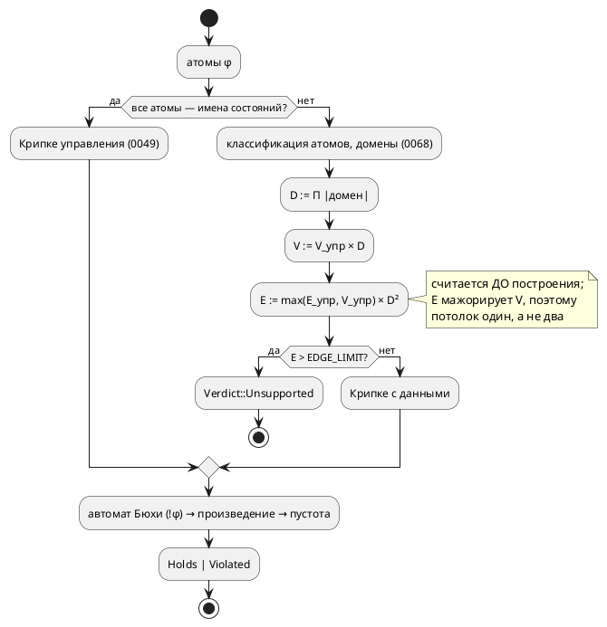

# Фича: Потолок верификации по данным: бюджет вместо `VERTEX_LIMIT`

- **Номер:** 0145
- **Статус:** ГОТОВО
- **Зависит от:** нет
- **Tier:** 2
- **Связанные issue (анализ):** кандидат блока 2 `FEATURES.md` (замер бенчей [бенчмарки производительности компиляции и верификации](0136-perf-benchmarks.md), 2026-07-27)

## Стадии жизненного цикла (правило 17)

Все стадии — **разделы этой карточки** (правило 32): «Архитектура (ADR)»,
«Анализ», «Разработка», «Тест-план», «Отчёт о тестировании», «Итог».
Отдельным артефактом остаются только исправления —
[`docs/fixes/`](../fixes/README.md) (при необходимости `0145-YY-*`).

## Краткое описание

Потолок `VERTEX_LIMIT`, введённый ради защиты от взрыва состояний, **пропускает
вход, на котором инструмент зависает**: пользователь получает не честный
`Unsupported`, а молчащий процесс. То есть защита есть, а от практически
достижимого случая не спасает.

> Фича зарегистрирована из бэклога кандидатов (отобрана заказчиком 2026-07-28); далее проходит жизненный цикл по правилу 17.

## Что известно на входе

- Верификация свойства над **одной** отслеживаемой `u8` (256 оценок) — 0.09 с и
  76 МБ.
- Над **двумя** (65 536 оценок) — **не завершается за 90 секунд**, процесс
  приходится убивать.
- Вершин при этом 131 072 — **вшестеро ниже** потолка `1_000_000` ([верификация свойств над данными (атом-предикат LTL)](0068-verify-data-properties.md)).

## Направление решения (наметка, не решение)

- Снизить потолок; либо считать его по **произведению доменов**, а не по числу
  вершин; либо ввести **бюджет времени**.
- Критерий выбора — чтобы верификация всегда завершалась вердиктом (в том числе
  `Unsupported`), а не зависанием.

Окончательный выбор — за стадиями **архитектуры** (ADR) и **анализа**: раздел
выше фиксирует то, что уже проверено, а не предрешает реализацию.

## Документирование (правило 24)

**Требуется.** Меняется наблюдаемое поведение `taktc verify` (где проходит
граница поддержки) — затронут раздел документа о верификации свойств: нужно
описать, при каких входах инструмент отвечает `Unsupported`.

## Архитектура (ADR)

- **Status:** Accepted
- **Date:** 2026-08-18
- **Authors:** Архитектор + аналитик
- **Related issues:** [Фича](0145-verify-vertex-budget.md);
  потолок и его нынешняя метрика — [ADR](0068-verify-data-properties.md#архитектура-adr)
  (правило 4, Option D); абстракция управления и гарантия `Holds` —
  [ADR](0049-model-checking-ltl.md#архитектура-adr); замер, вынесший класс кандидатом —
  [ADR](0136-perf-benchmarks.md#архитектура-adr); «обходы итеративны, чтобы инструмент не
  падал молча» — [ADR](0052-verify-iterative-traversal.md#архитектура-adr)

### Context

[верификация свойств над данными (атом-предикат LTL)](0068-verify-data-properties.md) ввела потолок
`VERTEX_LIMIT = 1_000_000` — «размер `|состояний| × Π|домен|` считается **до**
построения; превышение → `Unsupported`, а не долгий счёт» (правило 4 ADR).
Смысл потолка — обещание: **любой** вход получает вердикт, в том числе вердикт
«не осилю».

Обещание не исполняется. Замер [бенчмарки производительности компиляции и верификации](0136-perf-benchmarks.md#архитектура-adr) (2026-07-27):
верификация свойства над **двумя** отслеживаемыми `u8` не заканчивается за
90 секунд и процесс приходится убивать, а вершин там 131 072 — **вшестеро ниже**
потолка. То есть защита пропускает практически достижимый вход, и пользователь
получает не честный `Unsupported`, а молчащий процесс.

#### Замер-18 — что именно взрывается

Зонд `takt-lang/examples/probe_0145.rs` (release, `k` отслеживаемых `bit`-переменных,
цепочка из 3 состояний управления, φ = `G (Hot0 & … & Hot_{k-1})`). `D = 2^k` —
произведение доменов, то есть число оценок:

| `k` | `D` | вершин Крипке | рёбер Крипке | вершин произв. | рёбер произв. | время |
|---|---|---|---|---|---|---|
| 4 | 16 | 48 | 768 | 240 | 5 376 | < 0.001 с |
| 6 | 64 | 192 | 12 288 | 1 152 | 110 592 | 0.012 с |
| 8 | 256 | 768 | 196 608 | 5 376 | 2 162 688 | 0.25 с |
| 10 | 1 024 | 3 072 | 3 145 728 | 24 576 | 40 894 464 | 6.1 с |
| 11 | 2 048 | 6 144 | 12 582 912 | 52 224 | 176 160 768 | 29.9 с |
| 12 | 4 096 | **12 288** | 50 331 648 | — | — | **> 60 с, прервано** |

Последняя строка и есть диагноз: вершин **12 288** — в 81 раз ниже потолка
`1 000 000`, а инструмент не завершается.

Причина видна из устройства `data_kripke.rs`: управляющее ребро `k → k₂`
скрещивается с **любой** оценкой `j₂` (ход данных полностью недетерминирован —
правило 3 ADR), поэтому

```text
вершин: V = V_упр × D          — линейно по D  ← это и меряет потолок
рёбер:  E = E_упр × D²         — КВАДРАТИЧНО по D  ← а это и есть стоимость
```

Метрика потолка отстаёт от стоимости на целую степень `D`. Работа же —
построение произведения и nested DFS — идёт **по рёбрам**: замер даёт
0.35–2.4 мкс на ребро Крипке (разброс — от размера автомата Бюхи, а он растёт
с числом операторов формулы).

Корпусной вход для калибровки (тот самый, ради которого потолок и подбирался) —
`examples/comprehensive.takt`, модель `Controller`, `cond Overheated =
temperature >= MAX_TEMP` (зонд `probe_0145b.rs`): 4 состояния, 8 рёбер
управления, `D = 256` → **1 024 вершины, 524 288 рёбер**, полная проверка
`verify_model` — **0.181 с**.

Целевой поток (правило 18 — схема нужна, потому что решение меняет **место и
предмет** проверки, а не только константу):



### Decision Drivers

1. **Обещание завершимости.** Инструмент обязан отвечать вердиктом на любом
   входе; «молчащий процесс» — худший из возможных ответов (он неотличим от
   зависшего инструмента и не говорит, что делать). Это исходный драйвер 2
   ADR — он просто не был исполнен.
2. **Метрика обязана мерить то, что взрывается.** Потолок по величине, растущей
   линейно там, где стоимость растёт квадратично, — не защита, а её видимость.
3. **Детерминизм вердикта.** Один и тот же вход обязан давать один и тот же
   вердикт на любой машине: вердикт участвует в тестах, в проверках и в решениях
   пользователя о безопасности системы (правило проекта «генерация
   детерминирована» — для **вердикта** оно тем более обязательно).
4. **Не сужать то, что работает.** Входы, которые сегодня проверяются за
   доли секунды (корпусной `Controller`), обязаны проверяться и
   после правки.
5. **Одно знание об одном предмете.** Два потолка, каждый со своей константой,
   разъедутся — класс, многократно оплаченный проектом (0084/0193/0195).

### Considered Options

#### Option A. Оставить как есть

**Pros:**
- Ноль работы; вердикты не меняются ни на одном входе.

**Cons:**
- Обещание фичи остаётся неисполненным: вход с двумя `u8` (запись, которую
  автор напишет не задумываясь) вешает инструмент.
- Кандидат в `FEATURES.md` держит бенч в изувеченном виде: `bench_data_properties`
  меряет **одну** переменную, потому что двух он не переживёт, — то есть ось
  роста, ради которой бенч и заведён, не меряется.

#### Option B. Снизить `VERTEX_LIMIT`

**Pros:**
- Правка в один символ.

**Cons:**
- Метрика остаётся неверной, меняется лишь запас. Чтобы отсечь `k = 12`
  (12 288 вершин), порог придётся опустить ниже 12 288 — и тогда отсекутся
  дешёвые входы с многими состояниями и крошечным доменом (200 состояний ×
  `bit` = 400 вершин — пройдёт, а 20 000 состояний × `bit` — уже нет, хотя
  стоит секунды).
- Обратное тоже верно: любой порог по вершинам пропускает вход с большим `D`
  при малом числе состояний. Класс не закрывается, только сдвигается.

#### Option C. Потолок по числу рёбер Крипке с данными (`E_упр × D²`)

**Pros:**
- Меряет ровно то, что растёт: `E = E_упр × D²` — та величина, по которой идёт
  вся последующая работа (произведение, nested DFS).
- Считается **до** построения, точно (не оценкой): `E_упр` известно — управляющая
  Крипке уже построена, `D` считается из типов, как и сегодня.
- **Заменяет**, а не дополняет вершинный потолок: в валидной модели у каждого
  состояния есть хотя бы один преемник (безусловный `ref` либо самопетля
  `may_stutter`), поэтому `E_упр ≥ V_упр` и `E ≥ V·D ≥ V`. Новый
  потолок строго строже старого — «стало разрешено больше» невозможно
  по построению.
- Детерминирован: вердикт зависит от входа, не от машины.

**Cons:**
- Не учитывает размер автомата Бюхи (множитель стоимости произведения) — см.
  Option F.
- Часть входов, которые сегодня «считаются часами», станет `Unsupported`. Это
  цель фичи, но формально — сужение.

#### Option D. Бюджет времени (deadline и отказ по часам)

**Pros:**
- Ловит любую причину медленности, включая неучтённые.
- Даёт пользователю ручку: «дай ему минуту».

**Cons:**
- **Вердикт перестаёт быть детерминированным** (драйвер 3): один вход даёт
  `Holds` на свободной машине и `Unsupported` на загруженной. Тест на вердикт
  становится flaky, а проверка — недоказательным.
- Отказ приходит **задним числом**: время уже потрачено, тогда как потолок
  0068 обещал отказ **до** построения.
- Требует опроса часов в горячих циклах (`product`, `emptiness`) — то есть
  правки звеньев, которых Option D фичи сознательно не касалась.

#### Option E. Ленивое представление Крипке/произведения

**Pros:**
- Снимает **память**: переходы регулярны (`succ(k,j) = succ_упр(k) × все оценки`)
  и хранить их незачем.

**Cons:**
- Не снимает **время**: nested DFS обязан обойти рёбра, а их `E_упр × D²`
  независимо от способа хранения. При `k = 12` это 5 × 10⁷ рёбер Крипке и
  ~7 × 10⁸ рёбер произведения — сотни секунд даже без единой аллокации.
  Граница отодвигается в разы, класс остаётся.
- Крупная переработка `Kripke`/`Product` — притом что потолок всё равно нужен.

#### Option F. Потолок по рёбрам произведения (`E × |δ_Бюхи|`)

**Pros:**
- Ещё точнее: меряет прямо ту работу, что делает `emptiness`.

**Cons:**
- Требует строить автомат Бюхи **до** выбора Крипке, то есть переставить
  конвейер `verify.rs` ради множителя, который на реальных формулах невелик
  (замер: 6–28 состояний автомата) и притом коррелирует с `D` — формула со
  многими атомами и без того упирается в `D²`.
- Множитель проще заложить в сам порог, чем в перестановку конвейера.

### Decision

Принимается **Option C**: потолок считается **по числу рёбер** Крипке с данными
и **заменяет** потолок по вершинам.

```rust
// E = max(E_упр, V_упр) × D², считается ДО построения.
pub const EDGE_LIMIT: u128 = 1_000_000;
```

- **Формула.** `D` — произведение доменов отслеживаемых переменных (как
  сегодня); `E_упр` — число рёбер управляющей Крипке; `max(E_упр, V_упр)` —
  страховка: гарантия «у каждого состояния есть преемник» держится
  рассуждением о `may_stutter`, а страховка делает её свойством **кода**, и
  вершинный потолок после этого не нужен ни в каком виде.
- **Значение.** `1_000_000` рёбер — то же число, что стояло у вершин, но теперь
  у величины, которая стоимость предсказывает: по замеру это 0.2–2 с на
  проверку (разброс — от размера автомата). Корпусной `Controller` (524 288
  рёбер, 0.181 с) проходит с запасом вдвое; вход `k = 12` (5 × 10⁷) отвергается
  мгновенно, как и два `u8` (`E ≥ 2 × 4.3 × 10⁹`). Значение **инженерное**:
  менять можно, но вместе с замером времени — тем же зондом.
- **Совместимость.** `VERTEX_LIMIT` — публичная константа крейта; она
  **удаляется** (не остаётся синонимом: два имени одного потолка — ровно тот
  разъезд, о котором драйвер 5). Публичный API меняется → минорный подъём
  версии крейта `takt-lang`. Версия **языка** не меняется: язык не затронут.
- **Диагностика.** Причина отказа в тексте CLI названа уже сегодня
  («превышение потолка перечисления»); формулировка правится под новую метрику.
  Отдельный код или структурированная причина `Unsupported` в объём **не**
  входят — вынести кандидатом (сейчас `Unsupported` несёт только имена атомов,
  и это ограничение старше фичи).

### Consequences

#### Положительные

- Обещание 0068 исполняется: вход получает вердикт **всегда** — либо `Holds`/
  `Violated`, либо `Unsupported` до начала счёта.
- Бенч `bench_data_properties` перестаёт быть увечным: две переменные больше не
  вешают прогон, а честно упираются в потолок (мерить можно по `bit`-переменным,
  как в зонде, — тонкая сетка `D = 2^k`).
- Потолок один, метрика одна, знание об этом — в одном месте.

#### Отрицательные / Action items

- **Сужение.** Входы с `E > 10⁶` (например 200 состояний × один `u8`:
  ≈1.3 × 10⁷ рёбер) станут `Unsupported` там, где сегодня считались бы десятки
  секунд. Это заявленная цель, но её нужно **назвать** в документе (правило 24)
  и в тексте отказа.
- Проверить **все** существующие входы верификации по данным (юнит-тесты
  `data_kripke.rs`, тесты темы `verify`, корпус) — ни один не должен сменить
  вердикт. Это работа стадии анализа.
- Обновить: константу и её док-комментарий, текст `taktc verify`, раздел
  документа о верификации, живой контекст (`CLAUDE.md`), `CHANGES.md`.
- Зонды `takt-lang/examples/probe_0145*.rs` — временные, из дерева удаляются;
  воспроизводимость замера обеспечивает бенч, а не они.

#### Acceptance criteria

1. `EDGE_LIMIT` считается **до** построения Крипке с данными по формуле
   `max(E_упр, V_упр) × D²`; `VERTEX_LIMIT` в коде отсутствует.
2. Вход из замера (`k = 12`, а равно два `u8`) даёт `Unsupported`
   **немедленно** — тест меряет не только вердикт, но и то, что построения не
   было (иначе он проверял бы терпение прогона).
3. Ни один сегодня проходящий вход не сменил вердикт: юнит-тесты `data_kripke`,
   тема `verify`, корпусной `Controller` (`G !Overheated`) — прежние вердикты.
4. Бенч `bench_data_properties` меряет **рост** по числу оценок (не менее двух
   точек) и завершается.
5. Текст `СВОЙСТВО НЕ ПРОВЕРЕНО` называет новую границу словами; раздел
   документа о верификации описывает, при каких входах инструмент отвечает
   `Unsupported` (правило 24).

## Анализ

### Цель и контекст

ADR принял **Option C**: потолок верификации по данным считается по числу
**рёбер** Крипке (`max(E_упр, V_упр) × D²`), заменяя потолок по вершинам
(`VERTEX_LIMIT`, [верификация свойств над данными (атом-предикат LTL)](0068-verify-data-properties.md)).
Анализ проверяет решение замером, называет состав правок, границы объёма и
критерии приёмки.

#### Замер, доказывающий выбор метрики (2026-08-18, release)

Метрика обязана предсказывать стоимость. Два опыта показывают, что вершины её
не предсказывают, а рёбра предсказывают.

**Опыт 1 — одно и то же число вершин, разное время** (зонд `probe_0145.rs`):

| Вход | вершин | рёбер | время |
|---|---|---|---|
| 6144 состояния × `bit` (`D = 2`) | 12 288 | 24 576 | **0.03 с** |
| 3 состояния × 12 `bit` (`D = 4096`) | 12 288 | 50 331 648 | **> 60 с, прервано** |

Число вершин одинаково; время различается более чем в 2000 раз. Потолок по
вершинам не различает эти входы **в принципе** — при любом значении константы.

**Опыт 2 — одно и то же число рёбер, разная форма входа**:

| Вход | вершин | рёбер | время (полный конвейер) |
|---|---|---|---|
| 3 состояния × 9 `bit` (`D = 512`) | 1 536 | 786 432 | 1.22 с |
| 12 состояний × 8 `bit` (`D = 256`) | 3 072 | 786 432 | 0.98 с |

Вершин вдвое разное количество, рёбер поровну — время совпадает с точностью до
четверти. Стоимость определяется рёбрами, а не тем, как вход поделён между
состояниями и доменом.

**Опыт 3 — цена ребра** (та же серия): 0.35–2.4 мкс на ребро Крипке; разброс
объясняется размером автомата Бюхи (6–28 состояний на этих формулах). Отсюда
порог `10⁶` рёбер = **0.2–2 с** на проверку.

### Зависимости фичи (правило 17/19)

- **Зависит от:** нет. Правка целиком внутри `takt-lang/src/verification/` и
  затрагивает `benches/verify.rs`, текст CLI и раздел документа. Ни одна
  незакрытая фича не обязана предшествовать.
- **Влияние на порядок разработки:** ни одну фичу не разблокирует и ни одну не
  блокирует. Порядок таблицы `FEATURES.md` не меняется.
- **Смежная, но не зависимость:** [бенчмарки производительности компиляции и верификации](0136-perf-benchmarks.md)
  (бенчи) закрыта; её артефакт `benches/verify.rs` эта фича правит — работа над
  чужим файлом, а не зависимость.

### Требования и проверяемые условия

- **R1. Потолок считается до построения.** Величина
  `E = max(E_упр, V_упр) × D²` вычисляется **до** материализации вершин,
  рёбер и разметки. Превышение → `Err` (то есть `Verdict::Unsupported`) без
  единой аллокации графа. Это исходное обещание правила 4 ADR — фича его
  исполняет, а не вводит заново.
- **R2. Потолок один.** `VERTEX_LIMIT` удаляется; в коде остаётся ровно одна
  константа `EDGE_LIMIT: u128 = 1_000_000`. Два потолка одного предмета
  разъезжаются.
- **R3. Новый потолок строго строже старого.** Для любого входа
  `E ≥ V`: в валидной модели у каждого состояния есть преемник (безусловный
  `ref` либо самопетля `may_stutter`), значит `E_упр ≥ V_упр`, и
  `E = max(E_упр, V_упр) × D² ≥ V_упр × D = V`. Следствие: ни один вход,
  отвергаемый сегодня, не станет приниматься. `max` — страховка на случай
  вырожденной модели (все ссылки висячие), делающая рассуждение свойством кода.
- **R4. Ни один сегодня проходящий вход не меняет вердикт.** Перечень входов и
  их размеры — в таблице ниже; все укладываются в порог с запасом.
- **R5. Переполнение — отказ, а не паника.** `D` и `E` считаются в `u128` через
  `checked_mul`; переполнение равносильно превышению потолка.
- **R6. Отказ называет границу словами.** Текст `taktc verify` («свойство не
  проверено») говорит о новой метрике, а не о «потолке перечисления»; раздел
  документа описывает, при каких входах инструмент отвечает отказом
  (правило 24).
- **R7. Бенч меряет ось, ради которой заведён.** `bench_data_properties` даёт
  не менее двух точек роста и завершается. Сегодня он меряет **одну**
  переменную и несёт в комментарии объяснение, почему двух поставить нельзя, —
  после фичи ограничение снимается (две точки по `bit`-переменным).

#### Входы, проходящие сегодня (проверка R4)

`D` — произведение доменов, `E_упр` — рёбра управляющей Крипке.

| Вход | состояний | `E_упр` | `D` | `E = E_упр × D²` | вердикт |
|---|---|---|---|---|---|
| `examples/comprehensive.takt`, `Controller`, `G !Overheated` | 4 | 8 | 256 | 524 288 | проходит (замер: 0.181 с) |
| юнит-тесты `data_kripke` с одним `u8` (`start A { ref A; }`) | 1 | 1 | 256 | 65 536 | проходит |
| то же, 2 состояния (`A ⇄ B`) | 2 | 2…4 | 256 | ≤ 262 144 | проходит |
| `bit`-атом, 3 состояния | 3 | 3…6 | 2 | ≤ 24 | проходит |
| три `u8` (тест потолка) | 1 | 1 | 16 777 216 | ≈ 2.8 × 10¹⁴ | `Unsupported` (как и сегодня) |
| два `u8` (замер — сегодня **виснет**) | 2 | 2…4 | 65 536 | ≥ 8.6 × 10⁹ | `Unsupported` — **изменение** |

Верификация в корпусе `examples/` формулами LTL **не покрыта вовсе** (замер:
`[LTL]` встречается только в `book/`), поэтому проверка предкоммита этот класс не
трогает — контролем остаются юнит-тесты и тема `verify`.

### Критерии приёмки и способ проверки

| # | Критерий | Способ проверки |
|---|---|---|
| A1 | `EDGE_LIMIT` считается до построения по `max(E_упр, V_упр) × D²`; `VERTEX_LIMIT` в коде нет | греп по `takt-lang/src` + юнит-тест на формулу |
| A2 | Вход «3 состояния × 12 `bit`» и вход «два `u8`» дают `Unsupported` **мгновенно** | тест на вердикт + контроль времени: тест обязан укладываться в доли секунды (иначе он проверял бы терпение прогона) |
| A3 | Ни один проходящий вход не сменил вердикт | прогон темы `verify` и юнит-тестов `data_kripke`; отдельный тест на корпусной `Controller` (`G !Overheated`) |
| A4 | Отвергнутый вход **не строил** граф | тест на границе: вход, у которого `V` мал, а `E` за порогом, отвергается (при потолке по вершинам он строился бы) |
| A5 | Переполнение `u128` даёт `Unsupported`, а не панику | юнит-тест с доменом-переполнением (несколько `u8`/`enum`) |
| A6 | Бенч меряет две точки и завершается | `cargo bench --bench verify -- --quick` (вне предкоммита) |
| A7 | Текст отказа и документ называют новую границу | чтение вывода `taktc verify`; раздел `book/src/13-verification` + `17-tools`; проверка документа (0133, 0146) зелён |
| A8 | Публичный API: версия крейта `takt-lang` поднята минорно | `Cargo.toml` + `CHANGES.md`; проверка `check-claude-md.py` |

### Особенности по обратной функциональности

- **Язык не меняется** (правило 22): ни лексика, ни синтаксис, ни семантика
  программы. Версия языка остаётся `0.10.0`; поднимается только версия крейта
  `takt-lang` (удаление публичной константы `VERTEX_LIMIT` — ломающее изменение
  API, в `0.x` оформляется минорным подъёмом).
- **Редакторский слой (правило 29):** LSP верификацию не вызывает (греп:
  единственные потребители — `lib.rs`, `bin/taktc.rs`, тесты и бенч), плагины
  тем более. Правок не требуется — ответ зафиксирован здесь.
- **Наблюдаемое изменение ровно одно:** входы с `E > 10⁶` отвечают
  `Unsupported` вместо многочасового счёта. Обратной совместимости это не
  нарушает в том смысле, в каком её понимает пользователь: раньше он не получал
  ответа вовсе.

### Декомпозиция разработки

| Подзадача | Содержание |
|---|---|
| `0145-01` | Метрика потолка: `Kripke::edge_count`, `EDGE_LIMIT`, расчёт `D`/`E` до построения, удаление `VERTEX_LIMIT`, юнит-тесты (A1–A5), текст `taktc verify` |
| `0145-02` | Бенч роста по числу оценок (A6), раздел документа о границе поддержки (A7), живой контекст, `CHANGES.md`, версия крейта (A8) |

### Риски и зависимости

- **Риск: порог отсечёт полезный вход.** Снижается замером — единственный
  корпусной вход (`Controller`, 524 288 рёбер) проходит с запасом вдвое, все
  тестовые входы — на два порядка ниже. Значение остаётся **инженерным**:
  менять допустимо, но вместе с замером тем же зондом (правило записывается в
  док-комментарий константы, как было у `VERTEX_LIMIT`).
- **Риск: тест «отказ мгновенен» выродится в тест на вердикт.** Отказ по
  вершинам тоже дал бы `Unsupported` на трёх `u8`, поэтому нужен вход, который
  **проходит** вершинный потолок и **не проходит** рёберный (A4): 3 состояния ×
  12 `bit` — 12 288 вершин против порога 10⁶. Без такого входа контроль
  доказывал бы прежнее поведение.
- **Риск: замер времени в тесте шумит.** Поэтому контролем служит не время как
  таковое, а **вердикт на входе, который при старой метрике строился бы**;
  время используется только как грубый предохранитель (доли секунды против
  минут), а не как порог.
- **Зависимость от внешних инструментов:** нет. Проверки целевых языков к
  верификации не относятся.

## Разработка

### Задача

#### Что было

`data_kripke.rs` считал потолок по **вершинам**:

```rust
let mut total = control.states.len() as u128;
for (name, decl) in &tracked {
    total = match total.checked_mul(size) {
        Some(t) if t <= VERTEX_LIMIT => t,   // VERTEX_LIMIT = 1_000_000
        _ => return Err(data_atom_names(&data_atoms)),
    };
    …
}
```

Вершин `V = V_упр × D` — линейно по произведению доменов `D`; рёбер
`E = E_упр × D²` — квадратично (правило 3 ADR: управляющее ребро
скрещивается с **любой** оценкой). Работа идёт по рёбрам, поэтому потолок
пропускал входы, на которых инструмент не завершался (замеры — в анализе).

#### Что сделано

- **`Kripke::edge_count()`** (`verification/kripke.rs`) — число рёбер графа.
- **`EDGE_LIMIT: u128 = 1_000_000`** заменила `VERTEX_LIMIT` (удалена; вторым
  именем не оставлена — два потолка одного предмета разъезжаются).
- **`edges_exceed_limit(control, domain)`** — расчёт `max(E_упр, V_упр) × D²`
  через `checked_mul`; переполнение `u128` равносильно превышению. `max` делает
  свойством кода то, что иначе держится рассуждением о `may_stutter`: рёберный
  потолок мажорирует вершинный, поэтому второй не нужен.
- **Порядок шагов в `build_data_kripke` разделён:** сперва считается `D` по
  всем отслеживаемым переменным и проверяется потолок, и только затем
  материализуются домены (`domain_values`), оценки и разметка. Прежде домены
  материализовались в том же цикле, где рос счётчик, — при новой метрике это
  означало бы аллокации до вердикта.
- **Текст `taktc verify`** («свойство не проверено») называет новую границу и
  способ её обойти; прежняя формулировка «превышение потолка перечисления»
  ничего не сообщала о том, что сузить.

Стек: только `takt-lang` (верификация + CLI). Симулятор, генераторы, LSP и
плагины — **н/п**: верификацию не вызывают (греп по потребителям
`verify_model`/`build_data_kripke`), правило 29 отработано в анализе.

#### Проверки

```sh
cargo test --lib verification::data_kripke   # 15 тестов, зелено
cargo test --all-features                     # полный набор, зелено
```

Новые контроля (в модуле `data_kripke`):

| Тест | Что доказывает |
|---|---|
| `ceiling_counts_edges_not_vertices` | формула `max(E, V) × D²` на обеих сторонах границы + переполнение `u128` не паникует (R1, R5) |
| `low_vertex_count_but_edge_explosion_is_unsupported` | вход, **проходивший** вершинный потолок (12 288 вершин) и вешавший инструмент, отвергается (R3, A2) |
| `corpus_controller_still_fits_the_ceiling` | корпусной вход остался проверяемым: 8 × 256² = 524 288 < 10⁶ (R4) |

**Мутация** (проверка, что контроля не декоративны): подмена `D²` на `D` в
`edges_exceed_limit` валит `ceiling_counts_edges_not_vertices` немедленно, а
`low_vertex_count_but_edge_explosion_is_unsupported` **виснет** (прогон шёл
свыше 10 минут в debug и был снят). Отсюда правило, записанное в
док-комментарий теста: быстрый сигнал даёт первый контроль, и удалять его как
«дублирующий» нельзя.

### Задача

#### Что было

- **Бенч `verify_data` мерил одну точку.** В `benches/verify.rs` стояла
  единственная переменная и комментарий, объясняющий, почему вторую поставить
  нельзя: «Ставить `vars = 2` в бенч нельзя: прогон повиснет». То есть ось
  роста, ради которой бенч 0136 и заведён, не мерилась.
- **Документ не знал третьего исхода проверки.** Раздел «Верификация свойств»
  описывает «держится» и «нарушено»; про «свойство не проверено» и границы
  поддержки не было сказано ни слова — ни там, ни в описании `taktc verify`
  раздела «Инструментарий».

#### Что сделано

- **`data_model_bits(bits)`** в бенче: `bits` переменных типа `bit` дают
  `D = 2^bits` — сетка вдвое, а не в 256 раз, мельче; управляющий граф тот же
  (2 состояния, 4 ребра), поэтому точка бенча сравнима с потолком прямым
  счётом.
- **Четыре точки вместо одной:** 64, 128 и 256 оценок по `bit`-переменным плюс
  реалистичный вход с одним `u8`. Точки подобраны под `EDGE_LIMIT`: при 4 рёбрах
  управления `bits = 8` даёт 262 144 рёбер (проходит), `bits = 9` — 1 048 576
  (отвергается, и `assert_verifiable` это поймал бы).
- **Раздел документа «Границы проверки»** (`book/src/13-verification`): три
  исхода, три причины отказа, почему размер растёт от произведения доменов «в
  квадрате», и что делать, когда отказ пришёл. Раздел «Инструментарий»
  дополнен примером вывода третьего исхода.
- **Живой контекст** (`CLAUDE.md`, раздел «Верификация»): метрика, замер,
  «потолок один» и предупреждение о висящем контроле.
- **`CHANGES.md`**, версия крейта `takt-lang` `0.36.0` → `0.37.0` (публичный
  API: `VERTEX_LIMIT` удалена, добавлены `EDGE_LIMIT` и `Kripke::edge_count`).

#### Проверки

```sh
cargo bench --bench verify -- --quick verify_data
python3 scripts/check-book-glyphs.py
make -C book build
./scripts/precheck.sh
```

Замер бенча (release, `--quick`, 2026-08-18) — рост по числу оценок виден:

| оценок | время |
|---|---|
| 64 | 14.3 мс |
| 128 | 68.0 мс |
| 256 | 355.6 мс |
| один `u8` (256 значений) | 88.5 мс |

Проверка символов документа зелёный; PDF собирается. Сборка документа
перезаписала три `book/src/18-showcase/images/*.svg` строкой версии graphviz
(15.1.0 → 15.1.1) — посторонний дифф, откачен; класс уже записан кандидатом в
`FEATURES.md`.

## Тест-план

### Область и цель

Проверяется одно наблюдаемое изменение: вход, размер которого за потолком,
получает `Unsupported` **до** построения графа, а всё, что проверялось раньше,
проверяется по-прежнему и с тем же вердиктом. Требования — R1…R7 анализа,
критерии — A1…A8.

Тест на вердикт, а не на форму (капкан 0010-01): проверяется, что отвечает
инструмент, а не как устроен граф.

### Проверки (условие → ожидаемый результат)

| # | Проверка | Предусловие | Ожидаемый результат | Ссылка на R/A |
|---|---|---|---|---|
| T1 | Формула потолка | `A ⇄ B` (2 ребра), домен 512 и 1024 | 512 проходит, 1024 отвергается (`2 × D² ⋛ 10⁶`) | R1 / A1 |
| T2 | Переполнение носителя | тот же граф, домен `u128::MAX` | отказ, а не паника | R5 / A5 |
| T3 | Взрыв рёбер при малом числе вершин | 3 состояния, 12 `bit` (12 288 вершин, ≈5 × 10⁷ рёбер) | `Unsupported`, отказ приходит быстрее 5 с | R3 / A2, A4 |
| T4 | Прежний отказ сохранён | три `u8` | `Unsupported` (как и до фичи) | R4 / A3 |
| T5 | Корпусной вход не задет | `comprehensive`/`Controller`, `G !Overheated` | потолок не превышен; вердикт прежний | R4 / A3 |
| T6 | Проходящие входы 0068 не задеты | юнит-тесты `data_kripke` (один `u8`, `bit`, тавтологии), тема `verify` | вердикты прежние | R4 / A3 |
| T7 | Константы в коде одна | греп по `takt-lang/src` | `VERTEX_LIMIT` отсутствует, `EDGE_LIMIT` одна | R2 / A1 |
| T8 | Бенч меряет рост и завершается | `cargo bench --bench verify -- --quick verify_data` | не менее двух точек, время растёт, прогон конечен | R7 / A6 |
| T9 | Текст отказа называет границу | `taktc verify` на входе за потолком | в выводе — метрика и способ сузить задачу | R6 / A7 |
| T10 | Документ описывает третий исход | `book/src/13-verification`, `17-tools` | раздел о границах есть; проверки и сборки зелены | R6 / A7 |
| T11 | Версия крейта поднята | `takt-lang/Cargo.toml`, `CLAUDE.md` | `0.37.0` в обоих | A8 |
| T12 | Контроля не декоративны | мутация `D²` → `D` | хотя бы один контроль падает | R1 / A1 |
| T13 | Полный предкоммит | `./scripts/precheck.sh` | зелёный | правило 5 |

### Разбивка проверок по функциональности

| Функциональность | Статус | Примечание |
|---|---|---|
| Верификация (`takt-lang/src/verification`) | ✅ | предмет фичи |
| CLI `taktc verify` | ✅ | текст отказа |
| Бенчи (`takt-lang/benches/verify.rs`) | ✅ | ось роста |
| Документ `book/` | ✅ | раздел о границах (правило 24) |
| Симулятор `takt-sim` | — | верификацию не вызывает |
| Генераторы целей | — | не затронуты |
| LSP и плагины | — | верификацию не вызывают (правило 29, ответ в анализе) |

<!-- Легенда: ✅ пройдено · ❌ провалено · ⬜ не проверялось · — не применимо -->

### Тестовые данные и окружение

- Юнит-тесты — в `takt-lang/src/verification/data_kripke.rs` (входы строятся
  исходником в самом тесте: отдельные фикстуры для трёх строк кода избыточны).
- Корпусной вход — `examples/comprehensive.takt`, модель `Controller`.
- Окружение: пин толчейна `rust-toolchain.toml` (1.97.1), macOS; замеры
  времени — release.

## Отчёт о тестировании

### Резюме

Все проверки тест-плана пройдены; фича готова к закрытию (`ГОТОВО`).
Наблюдаемое изменение ровно одно и оно заявленное: вход, размер которого за
потолком, получает `Unsupported` до построения графа вместо многоминутного
счёта. Ни один сегодня проверяемый вход вердикта не сменил.

### Фактические результаты по проверкам

| # | Проверка | Результат | Комментарий |
|---|---|---|---|
| T1 | Формула потолка | ✅ | `ceiling_counts_edges_not_vertices`: при 2 рёбрах домен 512 проходит, 1024 отвергается |
| T2 | Переполнение носителя | ✅ | тот же тест: `u128::MAX` даёт отказ, не панику |
| T3 | Взрыв рёбер при малом числе вершин | ✅ | `low_vertex_count_but_edge_explosion_is_unsupported`: 12 288 вершин (прежний потолок пропускал), отказ за доли секунды |
| T4 | Прежний отказ сохранён | ✅ | `three_u8_exceeds_ceiling_unsupported` зелёный |
| T5 | Корпусной вход не задет | ✅ | `corpus_controller_still_fits_the_ceiling` + прежний `comprehensive_controller_u8_predicate_is_tracked` |
| T6 | Проходящие входы 0068 не задеты | ✅ | 15 юнит-тестов `data_kripke`, тема `verify` — зелены |
| T7 | Константа одна | ✅ | греп: `VERTEX_LIMIT` в коде отсутствует (осталась лишь ссылка в тексте комментария), `EDGE_LIMIT` — одна |
| T8 | Бенч меряет рост и завершается | ✅ | 64 → 14.3 мс, 128 → 68.0 мс, 256 → 355.6 мс, `u8` → 88.5 мс |
| T9 | Текст отказа называет границу | ✅ | прогон `taktc verify` на входе за потолком: отказ за 0.01 с, назван потолок и способ сузить задачу |
| T10 | Документ описывает третий исход | ✅ | раздел «Границы проверки» (13) + пример вывода (17); `check-book-glyphs.py` и сборка PDF зелены |
| T11 | Версия крейта поднята | ✅ | `takt-lang` `0.36.0` → `0.37.0`, живой контекст согласован |
| T12 | Контроля не декоративны | ✅ | мутация `D²` → `D`: `ceiling_counts_edges_not_vertices` падает немедленно |
| T13 | Полный предкоммит | ✅ | `./scripts/precheck.sh` зелёный |

### Результаты по функциональности

| Функциональность | Статус |
|---|---|
| Верификация (`takt-lang/src/verification`) | ✅ |
| CLI `taktc verify` | ✅ |
| Бенчи | ✅ |
| Документ `book/` | ✅ |
| Симулятор, генераторы, LSP, плагины | — (не затронуты; ответ обоснован в анализе) |

### Выводы и дальнейшие шаги

1. **Метрику выбрал замер, а не рассуждение.** Два входа с одинаковым числом
   вершин различаются по времени в 2000 раз, два входа с одинаковым числом
   рёбер дают одинаковое время. Это стоит помнить при любой будущей правке
   потолка: «вершин мало» ничего не означает.
2. **Мутация вскрыла свойство контроля, которое нужно было записать:** тест
   `low_vertex_count_but_edge_explosion_is_unsupported` при регрессе не падает,
   а **виснет**. Быстрый сигнал даёт `ceiling_counts_edges_not_vertices`; оба
   оставлены, предупреждение — в док-комментарии.
3. **Исправлений (`docs/fixes/`) не требуется.**
4. **Кандидат, вынесенный из фичи:** `Verdict::Unsupported` не различает
   причину отказа — пользователь получает список всех возможных причин.
   Записан в `FEATURES.md`. Попутно снята прямая ложь в первой строке отказа
   («атом — не отслеживаемый предикат» на входе, где атомы отслеживаемые).

## Итог (что сделано)

Потолок верификации по данным считается **по рёбрам** Крипке
(`EDGE_LIMIT = 1_000_000` против `max(E_упр, V_упр) × D²`) и заменяет прежний
потолок по вершинам; `VERTEX_LIMIT` удалён. Величина считается **до**
построения графа, поэтому вход за границей получает `Unsupported` мгновенно.

**Почему рёбра — замер, а не рассуждение** (release, 2026-08-18):

- два входа с одинаковым числом **вершин** (12 288) различаются по времени в
  2000 раз: 0.03 с у «6144 состояния и один `bit`» против «не завершилось за
  60 с» у «3 состояния и 12 `bit`»;
- два входа с одинаковым числом **рёбер** (786 432) дают одинаковое время:
  1.22 с и 0.98 с.

Вершин `V = V_упр × D` — линейно по произведению доменов, рёбер
`E = E_упр × D²` — квадратично (ход данных недетерминирован, каждое
управляющее ребро скрещивается с каждой оценкой), а работа идёт по рёбрам.
Прежняя метрика отставала от стоимости на целую степень `D` — оттого потолок
и пропускал вход из карточки.

Потолок остался **один**: новая величина мажорирует прежнюю (у состояния
валидной модели всегда есть преемник, `may_stutter`), и `max` в формуле делает
это свойством кода, а не рассуждения. Ни один сегодня проверяемый вход вердикта
не сменил: корпусной `Controller` с предикатом над `u8` — 524 288 рёбер против
порога 10⁶.

Попутно: бенч `verify_data` перестал быть увечным (было — одна точка и
объяснение, почему вторую поставить нельзя; стало — четыре точки, рост виден:
64 оценки — 14.3 мс, 128 — 68.0 мс, 256 — 355.6 мс); документ получил раздел
«Границы проверки» — третий исход проверки прежде не был описан вовсе; из
первой строки отказа `taktc verify` убрано утверждение, ложное на входе за
потолком.

Артефакты: [ADR](0145-verify-vertex-budget.md#архитектура-adr) ·
[анализ](0145-verify-vertex-budget.md#анализ) ·
[потолок верификации по данным: бюджет вместо `VERTEX_LIMIT`](0145-verify-vertex-budget.md#разработка) ·
[потолок верификации по данным: бюджет вместо `VERTEX_LIMIT`](0145-verify-vertex-budget.md#разработка) ·
[тест-план](0145-verify-vertex-budget.md#тест-план) ·
[отчёт](0145-verify-vertex-budget.md#отчёт-о-тестировании).

Вынесено кандидатом: `Verdict::Unsupported` не различает причину отказа.
