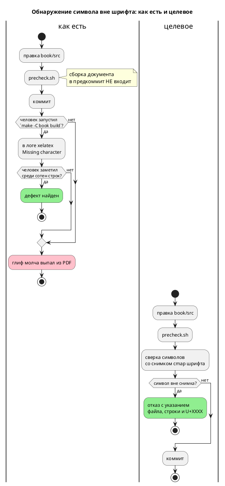

# Фича: Проверка символов вне шрифта документа `book/`

- **Номер:** 0146
- **Статус:** ГОТОВО
- **Зависит от:** нет
- **Tier:** proc
- **Связанные issue (анализ):** кандидат блока 2 `FEATURES.md` (вскрыт сборкой книги 2026-07-27, [исправление](../fixes/0132-01-book-glyph-outside-font.md))

## Стадии жизненного цикла (правило 17)

Все стадии — **разделы этой карточки** (правило 32): «Архитектура (ADR)»,
«Анализ», «Разработка», «Тест-план», «Отчёт о тестировании», «Итог».
Отдельным артефактом остаются только исправления —
[`docs/fixes/`](../fixes/README.md) (при необходимости `0146-YY-*`).

## Краткое описание

Дефекты вёрстки документа `book/` не ловит **ничто**: символ, которого нет в
шрифте, молча выпадает из PDF, и узнать об этом можно только ручной сборкой.
Нужен дешёвый проверка, не требующий тяжёлого TeX-окружения.

> Фича зарегистрирована из бэклога кандидатов (отобрана заказчиком 2026-07-28); далее проходит жизненный цикл по правилу 17.

## Что известно на входе

- Сборка документа не входит в `precheck.sh` — требует `mdbook`,
  `mdbook-pandoc`, `pandoc`, `xelatex`, которых нет ни в предкоммите, ни в CI.
- Проверка фичи [проверка компиляции и симуляции примеров документа `book/`](0133-book-examples-gate.md) проверяет **примеры** документа
  компиляцией и симуляцией, но сам документ не собирает.
- Симптом: `⚠️` (U+26A0), которого нет в Fira Code, прожил в тексте до ручной
  сборки — PDF собирался, символ **молча выпадал**.

## Направление решения (наметка, не решение)

- Греп-проверка в `precheck.sh`: «в `book/src` нет символов вне диапазона,
  покрытого шрифтом документа». Дёшево, без TeX.
- Полная сборка проверкой стать не может — зависимости тяжёлые и вне толчейна.

Окончательный выбор — за стадиями **архитектуры** (ADR) и **анализа**: раздел
выше фиксирует то, что уже проверено, а не предрешает реализацию.

## Документирование (правило 24)

**Не требуется.** Инфраструктура проверки документа; язык не меняется.

## Архитектура (ADR)

- **Status:** Accepted
- **Date:** 2026-07-29
- **Authors:** Архитектор + системный аналитик
- **Related issues:** [Фича](0146-book-glyph-gate.md);
  повод — [исправление](../fixes/0132-01-book-glyph-outside-font.md); смежное —
  [ADR](0133-book-examples-gate.md#архитектура-adr) (проверка примеров документа),
  [ADR](0179-repo-url-cleanup.md#архитектура-adr) (граница «согласованность, а не правильность»)

### Context

Документ `book/` собирается в PDF через `mdbook` → `pandoc` → `xelatex`, шрифт
текста **и** кода — **Fira Code** (`book.toml`: `mainfont`, `monofont`). Символ,
которого в шрифте нет, PDF **не роняет**: `xelatex` печатает предупреждение
`Missing character: There is no ⚠ (U+26A0) in font Fira Code Regular`, а глиф
**молча выпадает** из вывода.

Так и случилось: фича поставила во врезку `⚠️` (U+26A0 + U+FE0F), врезка
осталась без пометки, и обнаружилось это только **ручной** сборкой по запросу
заказчика ([исправление](../fixes/0132-01-book-glyph-outside-font.md)).

Ловить дефект нечем:

- **сборка документа не входит** ни в `precheck.sh`, ни в CI — она требует
  `mdbook`, `mdbook-pandoc`, `pandoc`, `xelatex` и установленного шрифта;
- проверка [проверка компиляции и симуляции примеров документа `book/`](0133-book-examples-gate.md#архитектура-adr) проверяет **примеры** документа
  компиляцией и симуляцией, но сам документ не собирает — дефект вёрстки ему
  невидим;
- предупреждение `xelatex` не влияет на код возврата, поэтому даже полная сборка
  ловит его лишь глазами человека в логе.

**Замеры (2026-07-29).** Инвентарь `book/src`: 27 файлов `.md`, 177 различных
символов, из них **21** вне ASCII и кириллицы (`—`, `«»`, `…`, `·`, `→`, `φ`,
`≥`, `ⁿ`, `–`, `≤`, `⁻`, `−`, `°`, `¹`, `ψ`, `←`, `₁`, `₂`, `↔`, `≠`). Сверка с
**реальным** `cmap` шрифта (`FiraCode-Regular.ttf`, Version 6.002, `fontTools`):
**все 21 покрыты**, документ сегодня чист. В примерах `book/src/**/*.takt` вне
ASCII — шесть символов (`«»`, `°`, `—`, `→`, `≈`), тоже покрыты. Все начертания
Fira Code (Regular/Bold/Medium/Light/SemiBold/Retina) имеют **идентичный** cmap
— 1586 кодовых точек, 152 непрерывных диапазона.

**Существенно для выбора области:** `book/Makefile` содержит `⚠` в
комментарии — и это **не дефект**, Makefile в PDF не попадает. То есть проверка,
берущий «весь каталог `book/`», дал бы ложное срабатывание с первого же прогона.



### Decision Drivers

1. **Проверка обязан работать там, где работает предкоммит.** Локальная машина и CI
   не имеют ни TeX, ни шрифта; проверка, требующий их, будет вечно в «мягком
   пропуске» — то есть его не будет.
2. **Критерий — факт, а не догадка.** Проект уже платил за «правило, которое
   нельзя проверить командой»  и за оценки без замера. Список
   допустимых символов обязан происходить из **реального `cmap` шрифта**, а не
   из представления о том, что «наверное, есть».
3. **Область — то, что попадает в PDF.** Ни больше (иначе ложные срабатывания на
   `Makefile`), ни меньше (иначе дыра: примеры `.takt` тоже печатаются, и
   заголовок с титульного листа тоже).
4. **Дешевизна.** Проверка текста на 27 файлах обязана стоить доли секунды —
   иначе она начнёт раздражать и её выключат.

### Considered Options

#### Option A. Allowlist диапазонов, написанный руками

Скрипт держит список «ASCII + кириллица + десяток типографских символов»;
всё прочее — отказ.

**Pros:**
- Просто, читаемо, без данных на диске.

**Cons:**
- Список — **догадка** о покрытии шрифта: он и запрещает покрытые символы (`≈`
  из примеров, `ψ`, `₁`), и разрешил бы непокрытые, попади они в диапазон.
- Каждое расширение списка — вопрос «а есть ли этот глиф?», на который сам
  список ответа не даёт: проверять всё равно пришлось бы шрифтом.

#### Option B. Опрос установленного шрифта во время проверки

Проверка читает `cmap` из `FiraCode-*.ttf` на машине (через `fontTools`/`fc-query`).

**Pros:**
- Точность по определению; снимок не нужен.

**Cons:**
- Требует шрифта **и** библиотеки чтения TTF. В CI нет ни того, ни другого,
  локально `fontTools` — не зависимость проекта. Проверка уходит в мягкий пропуск и
  не работает ровно там, где нужен (драйвер 1).
- Результат становится **зависимым от машины**: у двух разработчиков разные
  версии шрифта дадут разный вердикт на одном и том же тексте.

#### Option C. Снимок `cmap` шрифта в репозитории + текстовая сверка

Однократно снятый (и проверяемо воспроизводимый) список диапазонов кодовых точек
Fira Code лежит в дереве; проверка сверяет с ним каждый символ документа.

**Pros:**
- Критерий — **факт** (реальный `cmap`), а не догадка (драйвер 2).
- Работает офлайн, без шрифта, без TeX, без сторонних библиотек — везде, где
  есть `python3` (прецедент: `scripts/check-links.py` в предкоммите).
- Вердикт одинаков на любой машине и в CI (драйвер 1).
- 1586 кодовых точек сжимаются в **152 диапазона** — файл обозримый и
  ревьюируемый.

**Cons:**
- Снимок может разойтись с версией шрифта на машине сборки. Граница осознанная,
  см. «Consequences».

#### Option D. Денилист заведомо опасных диапазонов (эмодзи, селекторы вариаций)

**Pros:**
- Совсем дёшево, ловит конкретный случай 0132-01.

**Cons:**
- Ловит только то, о чём догадались: `⚠️` поймает, `ⅷ`, `∮`, `⌘` — нет.
  Ровно тот класс проверки, о котором проект уже записал: перечисление плохого
  проверяет фантазию автора, а не свойство.

### Decision

Принимается **Option C**.

- Снимок — `scripts/book-font-charset.txt`: диапазоны кодовых точек `cmap`
  Fira Code с шапкой, называющей **версию шрифта** и **команду воспроизведения**.
- Проверка — `scripts/check-book-glyphs.py`, вызывается из `precheck.sh` рядом с
  `check-links.py` под тем же `require_tool python3`.
- **Область проверки — то, что попадает в PDF:**
  - `book/src/**/*.md` — текст документа;
  - `book/src/**/*.takt` — примеры, вставляемые `{{#include}}` в блоки кода;
  - поля `title`, `authors`, `description` из `book/book.toml` — титульный лист.

  Прочие файлы `book/` (`Makefile`, `keywords.lua`, `takt.kate.xml`, `README.md`)
  **не проверяются**: они не рендерятся, а `Makefile` уже сегодня содержит `⚠` в
  комментарии — включение каталога целиком дало бы ложный отказ.
  `book.toml` берётся **не целиком, а тремя полями**: его комментарии — такой
  же служебный текст, как в `Makefile`, и вправе содержать `⚠`.
- Сообщение об отказе называет **файл, строку, колонку, `U+XXXX` и имя символа**
  — иначе искать невидимый глиф в тексте придётся вручную.
- У проверки есть режим **`--self-test`**: он подкладывает символ вне снимка и
  требует отказа. Проверка запускается предкоммитом вместе с самим проверкой.

### Consequences

#### Положительные

- Класс дефекта закрыт машиной: символ вне шрифта не доживает до
  коммита.
- Проверка работает в CI и на любой машине с `python3` — без TeX, шрифта и сети.
- Примеры `.takt` документа впервые проверяются на вёрстку (проверка судит
  их поведение, но не глифы).

#### Отрицательные / Action items

- **A-1. Проверка проверяет согласованность со снимком, а не с установленным
  шрифтом** (та же граница, что у [ADR](0179-repo-url-cleanup.md#архитектура-adr)). Если на
  машине сборки стоит Fira Code иной версии с меньшим покрытием, проверка промолчит,
  а `xelatex` предупредит. Смягчение: шапка снимка называет версию (6.002) и
  команду пересъёмки; конечный арбитр — по-прежнему `make -C book build`.
- **A-2. Снимок надо пересобирать при смене шрифта документа.** Если `book.toml`
  сменит `mainfont`/`monofont`, снимок станет неверным **молча**. Смягчение:
  проверка читает имя шрифта из `book.toml` и отказывает, если оно не совпадает с
  записанным в шапке снимка.
- **A-3. Проверка не судит о стиле.** Символ, покрытый шрифтом, но неуместный в
  документе (декоративные стрелки, псевдографика), пройдёт. Это осознанно:
  предмет фичи — **выпадение глифа**, а не редполитика.
- **A-4. Пересъёмка снимка требует `fontTools`** — библиотеки, которой в
  зависимостях проекта нет. Она нужна **только** при пересъёмке (редкое
  событие), не при проверке; команда с `pip install fonttools` записана в шапке
  снимка.

#### Acceptance criteria

1. `⚠️` (U+26A0 + U+FE0F), возвращённый в любой файл `book/src/**/*.md`, валит
   `precheck.sh` с указанием файла, строки, колонки и кода символа.
2. То же для примера `book/src/**/examples/*.takt`.
3. Текущее дерево проверка проходит **без правок документа** (замер: все 21+6
   символов покрыты).
4. `book/Makefile` с его `⚠` проверка **не** трогает (нет ложного отказа).
5. Смена `mainfont` в `book.toml` без пересъёмки снимка даёт отказ проверки (A-2).
6. `--self-test` проходит и **краснеет** при подмене снимка на пустой
   (взведённость ловушки).

## Анализ

- **Дата:** 2026-07-29
- **Роль:** системный аналитик

### 1. Что именно ловим (класс дефекта подтверждён экспериментом)

Дефект не в том, что сборка падает, — она **не падает**. Проверено прямым
экспериментом: `⚠️` подложен в `book/src/06-control-flow/index.typ`, затем
`make -C book build`:

```
сборка код=0
предупреждений Missing character: 13
  Missing character: There is no ⚠ (U+26A0) in font Fira Code Regular/…
  Missing character: There is no ️ (U+FE0F) in font Fira Code Regular/…
```

**Код возврата ноль, PDF собран, глиф выброшен.** Отсюда следует, что даже
включение сборки документа в предкоммит дефект бы **не** поймало: проверка по коду
возврата на нём слеп, а ловить пришлось бы грепом по логу. Проверка текстом не
хуже полной сборки — она ловит ровно то же и там, где сборки нет.

### 2. Замер инвентаря (основание для выбора критерия)

Инвентарь `book/src` (27 `.md` + 19 `.takt`): 177 различных символов, из них
**21** вне ASCII и кириллицы в тексте (`—`, `«»`, `…`, `·`, `→`, `φ`, `≥`, `ⁿ`,
`–`, `≤`, `⁻`, `−`, `°`, `¹`, `ψ`, `←`, `₁`, `₂`, `↔`, `≠`) и **6** в примерах
(`«»`, `°`, `—`, `→`, `≈`).

Сверка с реальным `cmap` (`FiraCode-*.ttf`, Version 6.002, `fontTools`): **все
покрыты**, документ сегодня чист — правок текста фича не требует. Все **7**
начертаний Fira Code имеют **идентичный** cmap: 1586 кодовых точек, **152**
непрерывных диапазона.

**Замер опроверг бы «здравый смысл», если бы решение принималось без него.**
При проверке критериев автор анализа подложил в пример `⌘` (U+2318), считая его
заведомо отсутствующим, — проверка промолчал, и правильно: `⌘` в Fira Code **есть**.
Ровно эта ошибка была бы вшита в allowlist, написанный руками (Option A ADR):
список отражал бы представления автора о шрифте, а не шрифт. Непокрытым
оказался, например, `★` (U+2605), а `☺` (U+263A) — покрыт.

### 3. Область проверки: почему не «каталог `book/`»

`book/Makefile` содержит `⚠` в комментариях (5 вхождений) — и это **не дефект**:
Makefile в PDF не попадает. Проверка, взявший каталог целиком, дал бы ложный отказ с
первого прогона и был бы выключен.

Область — **то, что рендерится**:

| Что | Почему входит |
|---|---|
| `book/src/**/*.md` | текст документа |
| `book/src/**/*.takt` | примеры, вставляемые `{{#include}}` в блоки кода |
| `title`/`authors`/`description` из `book.toml` | титульный лист |

`book.toml` берётся **тремя полями, а не целиком**: его комментарии — такой же
служебный текст, как в `Makefile`, и завтра законно получат `⚠`. Проверка, читающий
файл целиком, начал бы падать на комментарии к самому себе.

Не входят: `book/Makefile`, `book/README.md`, `book/keywords.lua`,
`book/takt.kate.xml` — не рендерятся.

### 4. Почему снимок, а не опрос шрифта

Проверка обязан работать в CI, где нет ни шрифта, ни TeX, ни `fontTools`. Опрос
шрифта на месте (Option B ADR) сделал бы вердикт **зависимым от машины**:
у двух разработчиков разные версии шрифта дали бы разный ответ на одном тексте.
Снимок (`scripts/book-font-charset.txt`, 152 диапазона) даёт один и тот же
вердикт везде и не требует ничего, кроме `python3`, который в предкоммите уже
есть (`check-links.py`).

Цена — граница A-1 ADR: снимок фиксирует покрытие **названной версии**.
Смягчение: версия и команда пересъёмки записаны в шапке снимка, а сама проверка
сверяет **имя шрифта** из `book.toml` с шапкой снимка и отказывает при
расхождении (иначе смена шрифта обесценила бы снимок молча).

### 5. Взведённость ловушки

Проверка, который печатает «находок нет», неотличим от проверки, который не ищет
ничего. Поэтому у него режим `--self-test`: подкладывает `⚠️` и требует **ровно
двух** находок с кодами U+26A0 и U+FE0F, а на обычной строке документа
(`Модель — «Takt», φ ≥ 0, шаг → далее…`) требует **нуля**. Предкоммит зовёт
самопроверку **до** самой проверки.

Проверено мутацией: на снимке, урезанном до одного диапазона, самопроверка
краснеет («14 находок вместо 2»).

### 6. Обратная совместимость (правило 11)

Изменений в языке, инструментах и порождённом коде нет — фича процессная.
Документ правок не требует (§2). Единственное новое требование к окружению —
`python3`, который предкоммит уже требует для `check-links.py`; под
`PRECHECK_STRICT=1` (CI) отсутствие `python3` и раньше было ошибкой.

### 7. Зависимости и связи (правило 17)

- **Зависит от:** нет.
- **Смежные:** [проверка компиляции и симуляции примеров документа `book/`](0133-book-examples-gate.md) — проверка **поведения**
  примеров документа; 0146 добавляет к нему проверка **вёрстки** и впервые проверяет
  примеры `.takt` как текст PDF.
- **Разблокирует:** ничего формально.

### 8. Документирование (правило 24) и редакторский слой (правило 29)

- **`book/`: не требуется** — язык не меняется, фича инфраструктурная.
- **Правило 29: не применимо** — ни лексики, ни синтаксиса, ни семантики фича не
  трогает; LSP и плагины не затронуты.
- Меняются `README.md` (раздел о проверках), `CLAUDE.md` (живой контекст),
  `CHANGES.md`.

### 9. Риски

- **Р-1. Снимок устареет молча при обновлении шрифта той же версии-имени.**
  Проверка сверяет имя шрифта, но не версию установленного (её негде взять без
  `fontTools`). Смягчение: арбитром остаётся сборка; версия снимка записана.
- **Р-2. Ложный отказ на законном символе.** Если автор вставит покрытый символ,
  которого нет в снимке (устаревший снимок), проверка откажет зря. Смягчение:
  сообщение об отказе прямо называет вторую возможность и команду пересъёмки.
- **Р-3. Проверка не судит о стиле** (A-3 ADR): `☺` шрифтом покрыт и пройдёт.
  Это осознанная граница — предмет фичи — выпадение глифа, а не редполитика.

### 10. План разработки

| Подзадача | Содержание |
|---|---|
| [проверка символов вне шрифта документа `book/`](0146-book-glyph-gate.md#разработка) | Съёмщик снимка + снимок cmap Fira Code |
| [проверка символов вне шрифта документа `book/`](0146-book-glyph-gate.md#разработка) | Проверка `check-book-glyphs.py` с самопроверкой, подключение к `precheck.sh` |

## Разработка

### Задача

#### Что было

Знания о том, какие символы шрифт документа умеет нарисовать, в репозитории не
было вовсе. Единственный способ узнать — собрать PDF и прочитать лог `xelatex`,
то есть иметь `mdbook`, `mdbook-pandoc`, `pandoc`, `xelatex` и сам шрифт.

#### Что сделано

**`scripts/snapshot-book-font.py`** — съёмщик. Читает имя семейства из
`book/book.toml` (поле `mainfont`), находит файлы начертаний (`fc-list`, при его
отсутствии — обход каталогов шрифтов) и печатает в stdout таблицу `cmap`,
сжатую в диапазоны, с шапкой: шрифт, версия, состав начертаний, число кодовых
точек и команда пересъёмки.

**Берётся пересечение начертаний, а не объединение.** Документ печатается
несколькими начертаниями (полужирный — заголовки и врезки), и глиф, который есть
только в Regular, выпадет из полужирного ровно так же молча. У Fira Code 6.002
все 7 начертаний имеют идентичный cmap (это проверяется при съёмке и попадает в
шапку), но правило записано на случай, когда это перестанет быть так.

**Имя шрифта не задаётся в съёмщике, а читается из `book.toml`** — иначе
съёмщик и документ разъехались бы молча.

**`scripts/book-font-charset.txt`** — снимок: 1586 кодовых точек в **152**
диапазонах, Fira Code Version 6.002. Шапка объясняет, что это **замер, а не
редполитика**: файл говорит, что шрифт **умеет** нарисовать, а не что уместно в
тексте.

**Почему снимок, а не опрос шрифта при проверке:** проверка обязан работать в CI, где
нет ни шрифта, ни TeX, ни `fontTools`; опрос сделал бы вердикт зависимым от
машины (Option B ADR отвергнут по драйверу 1).

`fontTools` нужен **только** здесь и **только** при пересъёмке; в зависимости
проекта он не добавлен.

#### Проверки

- `python3 scripts/snapshot-book-font.py > scripts/book-font-charset.txt` —
  воспроизводит снимок; повторный прогон даёт тот же файл.
- Сверка инвентаря документа со снимком: все 21 неASCII-символ текста и 6 из
  примеров покрыты (замер анализа §2).

### Задача

#### Что было

Дефект вёрстки документа не ловило **ничто**: сборка `book/` в предкоммит не
входит, а проверка [проверка компиляции и симуляции примеров документа `book/`](0133-book-examples-gate.md#архитектура-adr) проверяет **поведение**
примеров, но документ не собирает.

И даже включение сборки не помогло бы: эксперимент показал, что `make -C book
build` с подложенным `` завершается **кодом 0**, напечатав 13 предупреждений
`Missing character`. Проверка по коду возврата на этом дефекте слеп.

#### Что сделано

**`scripts/check-book-glyphs.py`** — сверяет каждый символ документа со снимком
`scripts/book-font-charset.txt`.

**Область — то, что попадает в PDF:** `book/src/**/*.md`, `book/src/**/*.takt`
(вставляются `{{#include}}` в блоки кода) и поля `title`/`authors`/`description`
из `book.toml` (титульный лист).

**Каталог `book/` целиком брать нельзя:** `book/Makefile` содержит `⚠` в
комментариях (5 вхождений) и в PDF не попадает — проверка по каталогу дал бы ложный
отказ с первого прогона. По той же причине `book.toml` читается **тремя полями**,
а не целиком: его комментарии — служебный текст и вправе содержать что угодно.

**Отказ называет место и символ** — `файл:строка:колонка: U+XXXX ИМЯ`: искать
невидимый глиф в тексте иначе пришлось бы вручную. Сообщение предлагает **обе**
починки: заменить символ либо, если он шрифтом всё же покрыт, пересобрать снимок.

**Контроль снимка (A-2 ADR):** проверка читает `mainfont` из `book.toml` и сверяет с
шапкой снимка. Сменили шрифт документа — проверка отказывает и требует пересъёмки,
иначе снимок обесценился бы **молча**.

**Самопроверка `--self-test`:** подкладывает `⚠️` и требует **ровно двух**
находок с кодами U+26A0 и U+FE0F, а на обычной строке документа
(`Модель — «Takt», φ ≥ 0, шаг → далее…`) — **нуля**. Зелёный проверка без неё
неотличим от проверки, который не ищет ничего.

**`scripts/precheck.sh`:** обе команды добавлены в существующий блок
`require_tool python3` (рядом с `check-links.py`) — самопроверка **первой**,
затем проверка дерева. CI правок не требует: он гоняет весь `precheck.sh` под
`PRECHECK_STRICT=1`, и `python3` там уже обязателен.

#### Проверки

| Что | Результат |
|---|---|
| Текущее дерево | 46 файлов + поля `book.toml`, находок нет |
| `⚠️` в `.md` | отказ, `index.md:163:3: U+26A0 WARNING SIGN` + `:4: U+FE0F` |
| `★` (U+2605) в примере `.takt` | отказ, `control.takt:60:10: U+2605 BLACK STAR` |
| `⌘` (U+2318) в примере | **проходит** — символ в шрифте есть (см. ниже) |
| `book/Makefile` с `⚠` | не тронут, ложного отказа нет |
| Смена `mainfont` без пересъёмки | отказ с требованием пересобрать снимок |
| `--self-test` на урезанном снимке | краснеет: «14 находок вместо 2» |
| `./scripts/precheck.sh` | код возврата `0` |
| `make -C book build` (арбитр) | PDF собран, **0** предупреждений `Missing character` |

Строка про `⌘` — не курьёз, а довод в пользу принятого решения. Автор
подложил его как «заведомо отсутствующий», проверка промолчал — и оказался прав:
`⌘` в Fira Code есть, а `★` нет. Написанный руками allowlist (Option A ADR)
вшил бы эту ошибку навсегда.

## Тест-план

### Область и цель

Проверяется, что проверка ловит символ, которого нет в шрифте документа, **не** даёт
ложных отказов на служебных файлах и **согласуется с арбитром** — полной сборкой
PDF. Последнее принципиально: проверка заменяет собой то, чего в предкоммите нет, и
без сверки с арбитром его вердикт был бы ничем не подтверждён.

Критерии приёмки ADR: A1 (`⚠️` в `.md`), A2 (символ в примере `.takt`),
A3 (текущее дерево проходит без правок), A4 (`Makefile` не задет), A5 (смена
шрифта требует пересъёмки), A6 (взведённость ловушки).

### Проверки (условие → ожидаемый результат)

| # | Проверка | Предусловие | Ожидаемый результат | Ссылка |
|---|---|---|---|---|
| T1 | Текущее дерево | без правок | код `0`, «символов вне шрифта нет» | A3 |
| T2 | `⚠️` в тексте раздела | символ дописан в `.md` | код `1`, названы файл, строка, колонка, `U+26A0` и `U+FE0F` | A1 |
| T3 | Символ вне шрифта в примере | `★` (U+2605) дописан в `.takt` | код `1`, названо место | A2 |
| T4 | Символ, шрифтом **покрытый** | `⌘` (U+2318) в примере | код `0` — ложного отказа нет | A3 |
| T5 | `book/Makefile` с `⚠` | без правок (5 вхождений) | код `0` — файл вне области | A4 |
| T6 | Смена `mainfont` в `book.toml` | снимок не пересобран | код `1`, требование пересъёмки | A5 |
| T7 | Самопроверка | снимок настоящий | код `0`, «ловушка взведена» | A6 |
| T8 | Самопроверка на урезанном снимке | снимок из одного диапазона | код `1` — самопроверка краснеет | A6 |
| T9 | Предкоммит целиком | дерево чистое | `./scripts/precheck.sh` → код `0` | A3 |
| T10 | **Арбитр на чистом дереве** | `make -C book build` | PDF собран, **0** `Missing character` | согласие с арбитром |
| T11 | **Арбитр на нарушителе** | `⚠️` дописан, `make -C book build` | сборка **код 0**, но `Missing character` в логе | обоснование класса дефекта |

**T11 — не про проверка, а про то, зачем он нужен.** Проверка фиксирует, что
полная сборка на этом дефекте завершается **успешно**: дефект не ловится ни
кодом возврата, ни падением. Без T11 можно было бы решить, что задача сводится к
«добавить сборку документа в предкоммит».

**T4 — контроль против догадки.** Символ, который автор считал отсутствующим,
шрифтом покрыт. Проверка закрепляет, что критерий — реальный `cmap`, а не
представление о нём.

### Разбивка проверок по функциональности

| Функциональность | Статус | Комментарий |
|---|---|---|
| Проверка `check-book-glyphs.py` | ✅ | T1–T8 |
| Съёмщик `snapshot-book-font.py` | ✅ | снимок воспроизводится, шапка верна |
| Предкоммит | ✅ | T9 |
| CI | ✅ | правок не требует: гоняет весь `precheck.sh`, `python3` уже обязателен |
| Документ `book/` | ✅ | T10; правок текста не потребовалось |
| Язык, компилятор, симулятор, LSP | — | не затронуты (фича процессная) |

<!-- Легенда: ✅ пройдено · ❌ провалено · ⬜ не проверялось · — не применимо -->

### Тестовые данные и окружение

- Подкладываемые символы: `⚠️` (U+26A0 + U+FE0F) — тот самый из исправления;
  `★` (U+2605) — вне шрифта; `⌘` (U+2318) — в шрифте есть.
- Команды: `python3 scripts/check-book-glyphs.py [--self-test]`,
  `./scripts/precheck.sh`, `PATH=$PATH:/Library/TeX/texbin make -C book build`.
- Окружение арбитра: `mdbook` + `mdbook-pandoc` + `xelatex`
  (`/Library/TeX/texbin`), шрифт Fira Code 6.002 — **вне** `precheck.sh` и CI.

## Отчёт о тестировании

### Резюме

**Пройдено, фича готова к закрытию (`ГОТОВО`).** Все 11 проверок тест-плана
зелёные, `./scripts/precheck.sh` — код возврата `0`, документ собран арбитром без
единого предупреждения. Исправлений (`docs/fixes/0146-YY-*`) не потребовалось.

Окружение: macOS (Darwin 25.5.0), `python3` (проверка), а для арбитра —
`mdbook` + `mdbook-pandoc` + `xelatex` (`/Library/TeX/texbin`), шрифт Fira Code
**Version 6.002**.

### Фактические результаты по проверкам

| # | Проверка | Результат | Факт |
|---|---|---|---|
| T1 | Текущее дерево | ✅ | «проверено 46 файлов + титульные поля book.toml, символов вне шрифта нет» |
| T2 | `⚠️` в `.md` | ✅ | `book/src/06-control-flow/index.typ:163:3: U+26A0 WARNING SIGN` и `:163:4: U+FE0F VARIATION SELECTOR-16` |
| T3 | `★` в примере `.takt` | ✅ | `book/src/06-control-flow/examples/control.takt:60:10: U+2605 BLACK STAR` |
| T4 | `⌘` (покрыт шрифтом) | ✅ | код `0` — ложного отказа нет |
| T5 | `book/Makefile` с `⚠` | ✅ | 5 вхождений, проверка молчит |
| T6 | Смена `mainfont` | ✅ | отказ: «book.toml набирает документ шрифтом 'DejaVu Sans Mono', а снимок снят с 'Fira Code'» |
| T7 | Самопроверка | ✅ | «ловушка взведена (ловится, обычный текст — нет)» |
| T8 | Самопроверка на урезанном снимке | ✅ | «самопроверка провалена: … 14 находок вместо 2» |
| T9 | `./scripts/precheck.sh` | ✅ | код `0` |
| T10 | Арбитр на чистом дереве | ✅ | PDF 406 986 байт, **0** `Missing character` |
| T11 | Арбитр на нарушителе | ✅ | сборка **код 0**, **13** предупреждений `Missing character` |

### Ключевой результат: проверка согласован с арбитром в обе стороны

- **Проверка зелёный ⇒ арбитр чист** (T1 + T10): 0 предупреждений на всём документе.
- **Проверка красный ⇒ арбитр ругается** (T2 + T11): 13 предупреждений
  `Missing character` на том же символе.

При этом **арбитр возвращает 0 в обоих случаях** (T11). Это и есть содержание
дефекта: полная сборка документа его **не ловит** — ни падением, ни кодом
возврата. Значит, задача не сводилась к «включить сборку в предкоммит»: даже
включённая, она пропустила бы дефект, если бы никто не грепал лог глазами.

### Что вскрыто сверх карточки

1. **Класс дефекта шире `⚠️`.** Карточка называла один символ; проверка закрывает
   весь класс — любой символ вне `cmap`, включая невидимый `U+FE0F`, который
   глазами в исходнике не отличить от ничего.
2. **Примеры `.takt` документа тоже печатаются** и до сих пор на вёрстку не
   проверялись вовсе: проверка судит их **поведение** (компиляция +
   симуляция), но не глифы. Теперь проверяются оба свойства.
3. **Часть `book/` проверять нельзя.** `book/Makefile` содержит `⚠` **законно**
   (комментарий, в PDF не попадает). Проверка «по каталогу» дал бы ложный отказ на
   первом же прогоне — область пришлось определять по признаку «рендерится», а
   не по расположению.

### Урок

**Догадка о покрытии шрифта не выдерживает первой же пробы — включая догадку
автора решения.** При проверке критерия A2 в пример был подложен `⌘` (U+2318)
как «заведомо отсутствующий»; проверка промолчал — и был прав: `⌘` в Fira Code
**есть**, а нет, например, `★` (U+2605), причём `☺` (U+263A) — снова есть.
Никакой закономерности, которую можно удержать в голове, здесь нет.

Отсюда практическое следствие, зафиксированное в решении: критерий такой
проверки обязан **происходить из артефакта** (таблицы `cmap`), а не из списка,
написанного по памяти. Allowlist из Option A вшил бы ошибку автора навсегда и
при этом выглядел бы проще и «читаемее».

Второй урок: **успешная сборка — не доказательство корректной сборки.** Код
возврата `0` при 13 предупреждениях о выброшенных глифах — ровно тот случай,
когда зелёный инструмент означает лишь, что инструмент не умеет краснеть.

### Выводы и дальнейшие шаги

- Фича закрывается; исправления не требуются.
- Кандидатов, снятых или актуализированных по правилу 28, нет: запись о дешёвой
  проверке символов была переведена в эту фичу при переводе бэклога
  (2026-07-28), и её закрытие эту запись исчерпывает.
- Пересъёмка снимка (`snapshot-book-font.py`) нужна **только** при смене шрифта
  или его версии; контроль A-2 не даст снимку устареть молча при смене шрифта.

## Итог (что сделано)

**Символ, которого нет в шрифте документа, больше не доживает до коммита.**
`scripts/check-book-glyphs.py` сверяет каждый символ, попадающий в PDF, со
снимком таблицы `cmap` (`scripts/book-font-charset.txt` — 1586 кодовых точек в
152 диапазонах, Fira Code 6.002, снимается `scripts/snapshot-book-font.py`).
Проверка подключён к `precheck.sh`, работает **без TeX, шрифта и сети** — нужен
только `python3`, который предкоммит уже требует.

**Область — то, что рендерится:** `book/src/**/*.md`, `book/src/**/*.takt`
(примеры печатаются блоками кода — прежде на вёрстку не проверялись вовсе) и
титульные поля `book.toml`. Каталог `book/` целиком брать нельзя:
`book/Makefile` содержит `⚠` **законно**, в PDF он не попадает.

**Полная сборка документа этот дефект не ловит.** Эксперимент: с подложенным
`⚠️` `make -C book build` завершается **кодом 0**, напечатав 13 предупреждений
`Missing character`. То есть «включить сборку в предкоммит» задачу бы не решило.

**Критерий — замер, а не список.** Проба показала, что `⌘` (U+2318) в Fira
Code **есть**, а `★` (U+2605) нет, при этом `☺` (U+263A) снова есть —
закономерности, пригодной для allowlist, не существует.

**Согласие с арбитром доказано в обе стороны:** проверка зелёный ⇒ PDF собран с
нулём предупреждений; проверка красный ⇒ арбитр ругается на тот же символ.
Взведённость ловушки — режим `--self-test`, который краснеет на урезанном
снимке. Документ правок **не потребовал**: все 27 символов вне ASCII покрыты.

Детали: [отчёт](0146-book-glyph-gate.md#отчёт-о-тестировании) (уроки «догадка о покрытии
шрифта не выдерживает первой пробы» и «успешная сборка ≠ корректная сборка»),
[ADR](0146-book-glyph-gate.md#архитектура-adr), [анализ](0146-book-glyph-gate.md#анализ).
