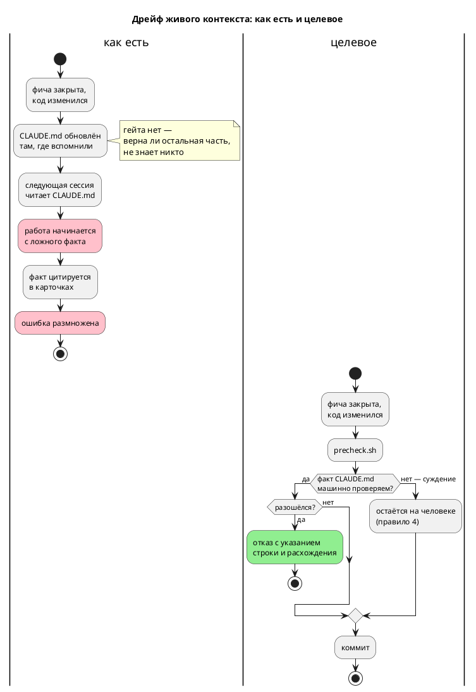

# Фича: Проверка согласованности живого контекста `CLAUDE.md`

- **Номер:** 0149
- **Статус:** ГОТОВО
- **Зависит от:** нет
- **Tier:** proc
- **Связанные issue (анализ):** кандидат блока 2 `FEATURES.md` (вынесено закрытием [ревизия витрины кандидатов и решение по дублю README ↔ book](0140-backlog-revision-doc-split.md), замер ревизии)

## Стадии жизненного цикла (правило 17)

Все стадии — **разделы этой карточки** (правило 32): «Архитектура (ADR)»,
«Анализ», «Разработка», «Тест-план», «Отчёт о тестировании», «Итог».
Отдельным артефактом остаются только исправления —
[`docs/fixes/`](../fixes/README.md) (при необходимости `0149-YY-*`).

## Краткое описание

`check-language-version.sh` сверяет **два** источника версии языка из трёх —
`LANGUAGE_VERSION` и README; `CLAUDE.md` остался вне проверки и разошёлся.
Незаверяемый факт живого контекста дрейфует, а ошибка расходится по карточкам
через цитирование.

> Фича зарегистрирована из бэклога кандидатов (отобрана заказчиком 2026-07-28); далее проходит жизненный цикл по правилу 17.

## Что известно на входе

- `CLAUDE.md` показывал версию языка `0.4.0` при фактических `0.6.0`.
- Ошибка успела разойтись **по трём карточкам** закрытых фич через цитирование.
- `scripts/check-language-version.sh` сверяет константу `LANGUAGE_VERSION` с
  канонической строкой README и `CLAUDE.md` не читает.

## Направление решения (наметка, не решение)

- Включить живой контекст в тот же проверка (версия языка — минимум).
- Общий класс шире версии: **любой** факт `CLAUDE.md`, который никто не
  сверяет, дрейфует, — но сверять его целиком нечем, и это отдельный вопрос.
  Объём фичи стоит ограничить машинно-проверяемыми фактами.

Окончательный выбор — за стадиями **архитектуры** (ADR) и **анализа**: раздел
выше фиксирует то, что уже проверено, а не предрешает реализацию.

## Документирование (правило 24)

**Не требуется.** Проверка согласованности документов проекта; язык не меняется.

## Архитектура (ADR)

- **Status:** Accepted
- **Date:** 2026-07-29
- **Authors:** Архитектор + системный аналитик
- **Related issues:** [Фича](0149-claude-md-consistency-gate.md);
  смежные — [ADR](0085-language-version-constant.md#архитектура-adr) (проверка версии языка),
  [ADR](0179-repo-url-cleanup.md#архитектура-adr) и [ADR](0146-book-glyph-gate.md#архитектура-adr)
  («правило, которое нельзя проверить командой, — не правило»)

### Context

`CLAUDE.md` — файл, который читается **в начале каждой сессии** любым
AI-инструментом и человеком, впервые входящим в проект. Его факты определяют, что
исполнитель считает истиной **до** того, как посмотрит в код. Ошибка здесь стоит
дороже ошибки в любом другом документе: по ней начинают работу.

Проверяется же он **ничем**. `scripts/check-language-version.sh`
сверяет версию языка в двух источниках из трёх — константа `LANGUAGE_VERSION` и
`README.md`; `CLAUDE.md` он не читает. Карточка фичи приводит случай: живой
контекст показывал версию языка `0.4.0` при фактических `0.6.0`, и ошибка успела
разойтись **по трём карточкам** закрытых фич через цитирование.

**Замер (2026-07-29) показал, что дрейф шире версии и дороже.** Сплошная сверка
`CLAUDE.md` (1197 строк) с реестром фич и деревом исходников:

| Класс | Найдено | Пример |
|---|---|---|
| Статус фичи разошёлся с реестром | **2 места, 35 строк текста** | «Генератор C: порождённый C **сегодня не компилируется** (**обе в работе**)» — обе `ГОТОВО`; «Форматтер (**в работе**)» — `ГОТОВО` |
| Полный путь к файлу не существует | **1** | `takt-lang/src/lsp.rs` — модуль давно разделён на `lsp/` |
| Ссылка на номер строки указывает не туда | **1 из 3** | `generator/c/mod.rs:150` — `get_c_type` там был, теперь на 291 |
| Версия крейта в прошедшем факте читается как настоящий | **2** | «Крейт `takt-sim` — 0.3.0» при фактических `0.7.0` |

**Худшая находка — не номер версии, а действующая инструкция.** Запись про
цель `c` (34 строки) утверждает: `Bit` → `int`, `Rational` → `float` (f32) при
f64 в симуляторе, `Array(size, elem)` → невалидный `uint{size}_t`, и делает
вывод: **«Не используй вывод C как эталон»**. Сверка с кодом
(`generator/c/mod.rs::map_c_type`): `Bit` → `uint8_t`, `Rational` → `double`,
массивы идут через `bit_vector` либо дают диагностику. Корпус целью `c`
компилируется проверкой `cc` в предкоммите, а `conformance_c_tests` — **основной
эталон сверки** проекта. То есть живой контекст велит не доверять ровно тому, на
чём стоит проверка поведения.



### Decision Drivers

1. **Цена ошибки максимальна.** Ложный факт в `CLAUDE.md` — это ложная
   предпосылка **всей** последующей работы, а не одна неверная строка.
2. **Проверяемое подмножество существует и измерено.** Статусы фич, пути к
   файлам, версии — сверяются с реестром, деревом и манифестами. Замер выше
   показывает, что именно этот класс и дрейфует.
3. **Ложное срабатывание убивает проверка.** Наивная проверка путей даёт **73**
   ложных отказа из 105 упоминаний (сокращённые формы вида `semantic/tree.rs`).
   Проверка, который надо всё время затыкать, выключат.
4. **Один предмет — одна проверка.** Версия языка уже проверяется
   `check-language-version.sh`; второй скрипт, проверяющий версии по-своему, —
   ровно тот источник дрейфа, который проект оплачивал дважды (CI-проверки,
   формат позиции 0028-01).

### Considered Options

#### Option A. Расширить только `check-language-version.sh` третьим источником

Буквальная наметка карточки: `CLAUDE.md` добавляется к сверке версии языка.

**Pros:**
- Минимальная правка, закрывает названный в карточке случай.

**Cons:**
- Закрывает **один** класс из четырёх найденных, причём **не самый дорогой**:
  ложная инструкция «не доверяй цели `c`» осталась бы жить.

#### Option B. Полная сверка `CLAUDE.md` с кодом

Проверять все утверждения — включая «`Bit` → `int`» — сопоставлением с исходниками.

**Pros:**
- Ловил бы и содержательный дрейф.

**Cons:**
- **Неосуществимо:** это проверка прозы на истинность. Ровно та причина, по
  которой правило 15 разделило роли README и `book/`, а не завело «сверку
  текстов».

#### Option C. Проверяемое подмножество + запрет непроверяемых форм

Проверка проверяет машинно-проверяемые классы, а форму записи, которая **гниёт молча
и проверке не поддаётся** (ссылка на номер строки), **запрещает**.

**Pros:**
- Закрывает все четыре найденных класса.
- Ложных срабатываний нет: разрешение путей по хвосту даёт **0** ложных отказов
  на текущем дереве, плюс явный список законно-отсутствующих упоминаний.
- Запрет номеров строк снимает класс, который иначе пришлось бы «проверять»
  бессмысленно: строка существует почти всегда, а указывает уже не туда.

**Cons:**
- Требует однократной нормализации `CLAUDE.md` (исторические упоминания версий
  переписать в недвусмысленно прошедшую форму, номера строк заменить именами
  символов).

### Decision

Принимается **Option C**.

**Проверяемые классы:**

1. **Статус фичи.** Утверждение вида «фича `NNNN` … в работе / не закрыта»
   при `ГОТОВО` в `docs/features/README.md` — отказ.
2. **Путь к файлу.** Каждый путь в обратных кавычках, похожий на файл
   репозитория, обязан разрешаться — полностью либо **по хвосту**
   (`semantic/tree.rs` → `takt-lang/src/semantic/tree.rs`). Законно-отсутствующие
   упоминания (`TASKS.md`, `STATUS.md`, гипотетический `concat.takt`,
   `lib/ieclib.txt` из префикса MatIEC) — явным списком **с причиной** в самом
   проверке.
3. **Версия крейта.** Утверждение в канонической настоящей форме
   (``**сейчас `X.Y.Z`**``) сверяется с `Cargo.toml`.
4. **Номер строки.** Форма `` `файл.rs:NNN` `` **запрещена**: замер показал, что
   она гниёт молча (`generator/c/mod.rs:150` указывает не туда, а строка
   существует — проверка «строка есть» ничего не доказывает). Ссылаться следует
   именем символа (`generator/c/mod.rs::map_c_type`).

**Разделение по скриптам — по предмету, а не по файлу:**

- **версия языка** остаётся в `scripts/check-language-version.sh`, который
  получает `CLAUDE.md` **третьим** источником (драйвер 4: версия проверяется в
  одном месте, иначе два проверки разойдутся);
- **остальные классы** — новый `scripts/check-claude-md.py` (Python — из-за
  разрешения путей по хвосту; прецеденты `check-links.py`, `check-book-glyphs.py`).

**Вне объёма (осознанно):** истинность утверждений о поведении кода. Проверка не
скажет, что «`Bit` → `int`» неверно. Он лишь не даёт **соседнему** факту —
статусу фичи — врать молча, а найденные замером содержательные ошибки правятся в
рамках этой же фичи вручную.

### Consequences

#### Положительные

- Классы дрейфа, найденные замером, закрыты машиной; случай из карточки (версия
  языка) — частный случай класса 3 и «третьего источника».
- Ложные факты, уже живущие в `CLAUDE.md`, вычищены при заведении проверки (иначе
  он был бы красным с первого прогона).
- Форма записи, гниющая молча, выведена из употребления.

#### Отрицательные / Action items

- **A-1. Содержательный дрейф остаётся на человеке** (правило 4). Проверка проверяет
  форму и ссылки, а не смысл. Смягчение: он ловит **признак** устаревания
  (статус фичи, путь), который у содержательного дрейфа обычно сопутствует —
  как и вышло с записью о цели `c`.
- **A-2. Объём `CLAUDE.md` проверкой не ограничивается.** Замер: 1197 строк,
  ~85 000 символов, из них **76 %** — один плоский раздел «Технические подводные
  камни» (34 пункта, крупнейший — 100 строк). Это отдельный предмет —
  **сокращение** живого контекста, решение о котором принимает заказчик;
  заводится записью в бэклог, в объём 0149 не входит.
- **A-3. Нормализация форм — разовая.** Исторические упоминания версий
  переписаны в прошедшую форму, ссылки на номера строк заменены именами
  символов. Дальше форму держит проверка.

#### Acceptance criteria

1. Заявление «фича `NNNN` в работе» при `ГОТОВО` в реестре валит `precheck.sh`
   с указанием строки.
2. Несуществующий путь в `CLAUDE.md` валит проверка; сокращённая форма
   (`semantic/tree.rs`) — **не** валит.
3. Форма `` `файл.rs:NNN` `` валит проверка.
4. Расхождение версии языка между `CLAUDE.md`, `LANGUAGE_VERSION` и `README.md`
   валит `check-language-version.sh`.
5. Текущее дерево после разовой правки `CLAUDE.md` проверка проходит; ложных
   срабатываний **ноль**.
6. Каждый класс проверен мутацией (взведённость ловушки).

## Анализ

- **Дата:** 2026-07-29
- **Роль:** системный аналитик

### 1. Дрейф оказался шире и дороже, чем в карточке

Карточка называла один случай: версия языка `0.4.0` при фактических `0.6.0`,
разошедшаяся по трём карточкам через цитирование. Сплошная сверка `CLAUDE.md`
(1197 строк) с реестром фич и деревом исходников дала **четыре** класса:

| Класс | Найдено |
|---|---|
| Статус фичи разошёлся с реестром | 2 места, 35 строк текста |
| Полный путь к файлу не существует | 1 (`takt-lang/src/lsp.rs`) |
| Ссылка на номер строки указывает не туда | 1 из 3 |
| Версия крейта в прошедшем факте читается как настоящий | 2 |

**Дороже всего не номер версии, а действующая инструкция.** Пункт про цель
`c` (34 строки) объявлял обе фичи «в работе», утверждал `Bit` → `int`,
`Rational` → f32 против f64 симулятора, `[u8;4]` → невалидный `uint4_t` — и делал
вывод **«Не используй вывод C как эталон»**. Сверка с `generator/c/mod.rs::map_c_type`:
`Bit` → `uint8_t`, `Rational` → `double`/`float` по `FloatWidth`, массивы идут
через `bit_vector` либо дают `CC-014`/`CC-015`. Корпус целью `c` компилируется
проверкой `cc` в предкоммите, а `conformance_c_tests` — **основной потактовый
эталон** проекта. То есть живой контекст запрещал доверять ровно тому, на чём
стоит проверка поведения, и делал это два десятка фич подряд.

### 2. Почему наивная проверка путей непригодна

Первый замер: из 105 путей, упомянутых в `CLAUDE.md`, **73** не существуют
буквально. Но это не дефекты — это сокращённые формы (`semantic/tree.rs` вместо
`takt-lang/src/semantic/tree.rs`), принятые в тексте и удобные.

Разрешение **по хвосту** (путь обязан быть суффиксом реального) даёт: полных
путей 28 — битый **1**; сокращённых 72 — не разрешаются **4**, и все четыре
законны по смыслу (`TASKS.md`/`STATUS.md` упоминаются как отсутствующие по
правилу 10, `concat.takt` — гипотетический пример ловушки имён IEC,
`lib/ieclib.txt` — файл внутри префикса установки MatIEC).

Отсюда конструкция: разрешение по хвосту + **короткий явный список** законно
отсутствующих, каждый с причиной. Ложных срабатываний на текущем дереве — ноль.

### 3. Почему номера строк запрещены, а не проверяются

Проверка «строка с таким номером существует» ничего не доказывает: файл почти
всегда длиннее. Замер: `generator/c/mod.rs:150` — строка существует (файл 883
строки), но `get_c_type` уехал на 291. Форма гниёт **молча**, и единственная
осмысленная проверка — запрет: ссылаться следует именем символа
(`generator/c/mod.rs::map_c_type`).

### 4. Почему версия языка осталась в старом проверке

`scripts/check-language-version.sh` уже сверяет константу и README. Добавить
третий источник туда — правка в 20 строк; завести вторую проверку версии в новом
скрипте — значит получить **два** проверки по одному предмету. Проект платил за это
дважды (CI-проверки несли свою реализацию проверок; формат позиции). Поэтому: версия языка — в `check-language-version.sh`, остальные
классы — в `check-claude-md.py`, и оба скрипта об этом пишут прямо.

### 5. Что осталось за границей (осознанно)

- **Истинность утверждений о поведении кода.** Проверка не скажет, что «`Bit` →
  `int`» неверно: это проверка прозы на истинность, неосуществимая (та же
  причина, по которой правило 15 разделило роли README и `book/`, а не завело
  сверку текстов). Проверка ловит **признак** устаревания — статус фичи, путь, — и
  на практике признак сопутствует содержательному дрейфу: именно по «обе в
  работе» и нашлась ложная инструкция про цель `c`.
- **Объём файла.** 1197 строк, ~85 000 символов; 76 % — один плоский раздел
  «Технические подводные камни» (34 пункта, крупнейший 100 строк). Проверка размера
  не вводится: сокращение живого контекста — редакторское решение заказчика, а
  не механическая проверка. Вынесено в бэклог.

### 6. Обратная совместимость (правило 11)

Изменений в языке, инструментах и порождённом коде нет. Требований к окружению
не добавилось: `python3` предкоммит уже требует. Разовая нормализация форм в
`CLAUDE.md` (номера строк → имена символов, исторические версии → прошедшая
форма) содержание не меняет.

### 7. Зависимости и связи (правило 17)

- **Зависит от:** нет.
- **Смежные:** [константы `LANGUAGE_VERSION` в коде нет](0085-language-version-constant.md) — проверка версии
  языка, расширяемый третьим источником; [согласованность реестров `docs/*/README.md` с файлами на диске](0164-registry-rebuild-gate.md)
  — согласованность реестров `docs/*/README.md` с диском (соседний класс, но
  другой предмет: там реестр против файлов, здесь живой контекст против реестра).
- **Разблокирует:** ничего формально.

### 8. Документирование (правило 24) и редакторский слой (правило 29)

- **`book/`: не требуется** — язык не меняется, фича процессная.
- **Правило 29: не применимо** — ни лексики, ни синтаксиса, ни семантики.

### 9. Риски

- **Р-1. Проверка молчит о содержательной лжи.** Смягчение — A-1 ADR: ловится
  признак, а найденные замером содержательные ошибки правятся этой же фичей.
- **Р-2. Список законно отсутствующих разрастётся.** Смягчение: каждая запись
  требует причины прямо в коде проверки; рост списка — сигнал, что текст ссылается
  на несуществующее слишком часто.
- **Р-3. Самопроверка на упрощённом образце.** Реализовалась (см. отчёт):
  образец класса «версия крейта» был проще реальной строки, самопроверка
  зеленела, а мутация настоящего текста проходила мимо. Смягчение: образцы
  повторяют форму, встречающуюся в файле.

### 10. План разработки

| Подзадача | Содержание |
|---|---|
| [проверка согласованности живого контекста `CLAUDE.md`](0149-claude-md-consistency-gate.md#разработка) | Проверка `check-claude-md.py` + третий источник версии языка + подключение к предкоммиту |
| [проверка согласованности живого контекста `CLAUDE.md`](0149-claude-md-consistency-gate.md#разработка) | Правка найденных расхождений в `CLAUDE.md` |

## Разработка

### Задача

#### Что было

`CLAUDE.md` не проверялся ничем. `check-language-version.sh` сверял версию языка
в двух источниках из трёх — константа и README, — а живой контекст оставался вне
проверки и дрейфовал.

#### Что сделано

**`scripts/check-claude-md.py`** — четыре машинно-проверяемых класса:

| Класс | Правило |
|---|---|
| Статус фичи | «фича `NNNN` … в работе / не закрыта» при `ГОТОВО` в реестре — отказ |
| Путь к файлу | обязан разрешаться полностью либо **по хвосту** |
| Версия крейта | каноническая форма ``сейчас `X.Y.Z``` против `Cargo.toml` |
| Номер строки | форма `` `файл.rs:NNN` `` **запрещена** |

**Номер фичи ищется в абзаце, а не в строке.** Запись `(фичи` / `[0026](../development/…), [0029](../development/…), обе в работе)` переносится, и построчный поиск её пропускал — именно
так 35 строк ложного текста и дожили до замера.

**Пути разрешаются по хвосту.** Наивная проверка даёт **73** ложных отказа из
105 упоминаний: сокращённые формы (`semantic/tree.rs`) в тексте приняты и удобны.
Плюс короткий список законно отсутствующих (`TASKS.md`, `STATUS.md`,
`concat.takt`, `lib/ieclib.txt`) — каждый **с причиной** прямо в коде проверки.

**Номера строк запрещены, а не проверяются.** «Строка существует» ничего не
доказывает: файл почти всегда длиннее. Замер: `generator/c/mod.rs:150` —
строка есть, а символ уехал на 291.

**`scripts/check-language-version.sh`** получил **третий** источник — `CLAUDE.md`
(якорь ``**сейчас `X.Y.Z`**``, ровно один, узкий — как у README, чтобы
исторические упоминания версий не ловились). Версия проверяется **здесь**, а
не в новом скрипте: два проверки по одному предмету неизбежно разъезжаются
(прецеденты — CI-проверки, формат позиции 0028-01). Оба скрипта пишут об этом
прямо.

**`scripts/precheck.sh`** — обе команды в существующем блоке `require_tool
python3`, самопроверка первой. CI правок не требует.

**Самопроверка `--self-test`** подкладывает текст каждого из четырёх классов и
требует срабатывания, а на законном тексте (сокращённый путь, упоминание
`TASKS.md`) — нуля находок.

#### Проверки

Все критерии приёмки ADR — мутациями (таблица в
[отчёте](0149-claude-md-consistency-gate.md#отчёт-о-тестировании)); `./scripts/precheck.sh`
— код возврата `0`.

### Задача

#### Что было

Первый прогон проверки дал **6** расхождений — проверка был бы красным с первого дня,
если бы файл не привели в соответствие.

#### Что сделано

| Строка | Было | Стало |
|---|---|---|
| 276–309 | «Генератор C: порождённый C **сегодня не компилируется** (**обе в работе**)», `Bit` → `int`, `Rational` → f32, **«не используй вывод C как эталон»** | «вывод компилируется, отображение типов доверено»: `Bit` → `uint8_t`, `Rational` → `double`/`float` по `FloatWidth`, массивы через `bit_vector` либо `CC-014`/`CC-015`; сказано, что `conformance_c_tests` — основной потактовый эталон |
| 267 | `takt-lang/src/lsp.rs` | `takt-lang/src/lsp/` (модуль разделён) |
| 181 | `tree.rs:476` | `semantic/tree.rs` (имя файла, без номера) |
| 307 | `c_header.rs:344` | `c_header.rs::generate_model_header` |
| 280 | `generator/c/mod.rs:150` | `generator/c/mod.rs` (символ назван в тексте) |
| 1130 | «Форматтер (**в работе**)» | «(**закрыта**)» |
| 220, 991 | «Крейт `takt-sim` — 0.3.0» (читается как настоящее) | «Фича подняла крейт `takt-sim` до 0.3.0» |

**Правка пункта о цели `c` — не косметика.** Прежний текст **запрещал**
использовать вывод C как эталон для `Bit`/`Rational`/массивов. При этом
`conformance_c_tests` сверяет с целью `c` поведение симулятора потактово, а проверка
`cc` компилирует весь корпус. Инструкция противоречила действующим проверкам и
могла увести следующую сессию от единственного имеющегося эталона.

**Каждое новое утверждение сверено с кодом**, а не переписано по памяти:
`map_c_type` прочитан, проверки `cc`/`cmake` в предкоммите проверены зелёными.

#### Проверки

`python3 scripts/check-claude-md.py` — 6 расхождений до правки, **0** после;
`sh scripts/check-language-version.sh` — три источника согласованы;
`./scripts/precheck.sh` — код `0`.

## Тест-план

### Область и цель

Проверяется, что проверка ловит каждый из четырёх классов дрейфа, **не** даёт ложных
отказов на принятых в тексте формах (сокращённые пути, упоминания заведомо
отсутствующих файлов) и что версия языка сверяется в трёх источниках.

Критерии приёмки ADR: A1 (статус фичи), A2 (путь), A3 (номер строки),
A4 (версия языка), A5 (чистое дерево, ноль ложных), A6 (взведённость ловушки).

### Проверки (условие → ожидаемый результат)

| # | Проверка | Предусловие | Ожидаемый результат | Ссылка |
|---|---|---|---|---|
| T1 | Закрытая фича названа незавершённой | «(в работе)» | код `1`, названы строка и номер фичи | A1 |
| T2 | Несуществующий полный путь | `takt-lang/src/nope_zzz.rs` | код `1` | A2 |
| T3 | Сокращённая форма пути | `semantic/tree.rs` | код `0` — **ложного отказа нет** | A2 |
| T4 | Ссылка на номер строки | `semantic/tree.rs:999` | код `1`, требование ссылаться именем символа | A3 |
| T5 | Версия языка разошлась | якорь `CLAUDE.md` изменён | `check-language-version.sh` → код `1` | A4 |
| T6 | Версия крейта разошлась | ``сейчас `0.1.0``` при `0.20.0` | код `1`, названы обе величины | A4 |
| T7 | Чистое дерево | без правок | код `0`, «расхождений нет» | A5 |
| T8 | Самопроверка | — | код `0`, «ловушка взведена» | A6 |
| T9 | Самопроверка ловит **свой** прежний дефект | регексп версии откачен к первой редакции | код `1` | A6 |
| T10 | Предкоммит целиком | дерево чистое | `./scripts/precheck.sh` → код `0` | A5 |

**T3 — важнее половины остальных.** Наивная проверка путей даёт 73 ложных
отказа из 105; проверка, который надо всё время затыкать, выключат. T3 фиксирует,
что принятая в тексте сокращённая форма законна.

**T9 — проверка самой самопроверки.** Первая редакция проверки пропускала
мутацию реальной строки версии, а самопроверка при этом зеленела: её образец был
проще того, что встречается в файле. T9 требует, чтобы образцы повторяли
реальную форму.

### Разбивка проверок по функциональности

| Функциональность | Статус | Комментарий |
|---|---|---|
| `check-claude-md.py` | ✅ | T1–T4, T6–T9 |
| `check-language-version.sh` (третий источник) | ✅ | T5 |
| Предкоммит | ✅ | T10 |
| CI | ✅ | правок не требует: гоняет весь `precheck.sh` |
| Язык, компилятор, симулятор, LSP | — | не затронуты |

<!-- Легенда: ✅ пройдено · ❌ провалено · ⬜ не проверялось · — не применимо -->

### Тестовые данные и окружение

- Мутации вносятся дописыванием строки в `CLAUDE.md` с последующим откатом из
  резервной копии.
- Команды: `python3 scripts/check-claude-md.py [--self-test]`,
  `sh scripts/check-language-version.sh`, `./scripts/precheck.sh`.

## Отчёт о тестировании

### Резюме

**Пройдено, фича готова к закрытию (`ГОТОВО`).** Все 10 проверок тест-плана
зелёные, `./scripts/precheck.sh` — код возврата `0`. Найденные первым прогоном
**6** расхождений в `CLAUDE.md` исправлены; отдельных исправлений
(`docs/fixes/0149-YY-*`) не потребовалось.

Окружение: macOS (Darwin 25.5.0), `python3`, POSIX `sh`.

### Фактические результаты по проверкам

| # | Проверка | Результат | Факт |
|---|---|---|---|
| T1 | Закрытая фича «в работе» | ✅ | `CLAUDE.md:1196: фича 0024 названа незавершённой, а в реестре — ГОТОВО` |
| T2 | Несуществующий путь | ✅ | `CLAUDE.md:1196: путь takt-lang/src/nope_zzz.rs не найден в дереве` |
| T3 | Сокращённая форма пути | ✅ | код `0` — ложного отказа нет |
| T4 | Ссылка на номер строки | ✅ | отказ с требованием ссылаться именем символа |
| T5 | Версия языка разошлась | ✅ | `ОШИБКА: версия языка в живом контексте рассинхронизирована` |
| T6 | Версия крейта разошлась | ✅ | `CLAUDE.md:932: крейт takt-lang: заявлено 0.1.0, в манифесте 0.20.0` |
| T7 | Чистое дерево | ✅ | «проверено строк, расхождений нет» |
| T8 | Самопроверка | ✅ | «ловушка взведена (4 класса ловятся, законный текст — нет)» |
| T9 | Самопроверка ловит свой прежний дефект | ✅ | «самопроверка провалена: класс „версия крейта“ не сработал» |
| T10 | `./scripts/precheck.sh` | ✅ | код `0` |

### Что нашёл первый прогон проверки

**6 расхождений**, из них два — статусы закрытых фич, один — несуществующий
путь, три — ссылки на номера строк. Подробности правки — задача
[проверка согласованности живого контекста `CLAUDE.md`](0149-claude-md-consistency-gate.md#разработка).

**Самое дорогое — не номер версии, а действующая инструкция.** Пункт про цель
`c` (34 строки) объявлял фичи «в работе» и на этом основании
**запрещал** использовать вывод C как эталон: «`Bit` → `int`, `Rational` → f32
против f64 симулятора, `[u8;4]` → невалидный `uint4_t`». Сверка с
`generator/c/mod.rs::map_c_type`: `Bit` → `uint8_t`, `Rational` →
`double`/`float` по `FloatWidth`, массивы через `bit_vector` либо `CC-014`/`CC-015`.
Корпус целью `c` компилируется проверкой `cc` в предкоммите, а `conformance_c_tests`
— **основной потактовый эталон** проекта. То есть живой контекст уводил следующую
сессию от единственного имеющегося эталона, и делал это два десятка фич подряд.

### Урок 1: самопроверка на упрощённом образце проверяет упрощение

Проверка получил `--self-test` сразу — и он **зеленел**, пока настоящая мутация
проходила мимо. Причина: класс «версия крейта» проверялся образцом
``- Крейт `takt-lang` (сейчас `0.0.1`)``, а в файле форма другая —
``крейта `takt-lang` (`CARGO_PKG_VERSION`, сейчас `0.20.0`)``, с обратными
кавычками между именем и версией. Класс символов в регекспе их исключал.

То есть **взведённость ловушки была доказана на тексте, которого в файле нет**.
Обнаружилось только мутацией реальной строки (T6) — проверкой, которая в план
попала как рядовая.

Практическое следствие, закреплённое в коде: образцы самопроверки повторяют
**встречающуюся** форму, а не удобную; контроль этого — T9, требующий, чтобы
откат регекспа к первой редакции самопроверку **валил**.

### Урок 2: ложное срабатывание убило бы проверка вернее, чем его отсутствие

Наивная проверка путей даёт **73** отказа из 105 упоминаний — все ложные
(сокращённые формы вида `semantic/tree.rs`, принятые в тексте). Такой проверка
выключили бы в первый день. Разрешение по хвосту плюс список из четырёх
законно-отсутствующих упоминаний даёт **ноль** ложных на текущем дереве.

### Выводы и дальнейшие шаги

- Фича закрывается; исправления не требуются.
- **Заведён кандидат: объём `CLAUDE.md`.** Замер: 1194 строки, ~85 000 символов,
  из них **76 %** — один плоский раздел «Технические подводные камни» (34 пункта,
  крупнейший 100 строк). Файл читается в начале каждой сессии целиком. Проверка
  размера в 0149 сознательно не вводился: сокращение живого контекста —
  редакторское решение заказчика, а не механическая проверка.
- Правило 28: кандидатов, называющих 0149, в блоке 2 не было — запись была
  переведена в эту фичу при переводе бэклога (2026-07-28), и закрытие её
  исчерпывает.

## Итог (что сделано)

**Живой контекст перестал дрейфовать молча.** `scripts/check-claude-md.py`
(+ `--self-test`) проверяет четыре машинно-проверяемых класса: статус фичи
против реестра, путь к файлу (разрешение **по хвосту**), версию крейта против
манифеста и **запрет** ссылок на номера строк. Версия языка сверяется там же,
где и раньше, — `check-language-version.sh` получил `CLAUDE.md` **третьим**
источником (один предмет — одна проверка).

**Дрейф оказался шире и дороже карточки.** Она называла версию языка; замер
дал 6 расхождений, включая **действующую инструкцию**: пункт про цель `c`
(34 строки) объявлял закрытые фичи «в работе» и **запрещал**
использовать вывод C как эталон — при том что корпус компилируется проверкой `cc`,
а `conformance_c_tests` служит основным потактовым эталоном проекта. Все шесть
исправлены сверкой с кодом, а не по памяти.

**Ложное срабатывание убило бы проверка вернее его отсутствия:** наивная проверка
путей даёт 73 отказа из 105 упоминаний, и все ложные. Разрешение по хвосту плюс
список из четырёх законно-отсутствующих упоминаний даёт **ноль** ложных.

**Урок о самопроверке:** она зеленела, пока мутация реальной строки проходила
мимо проверки — образец класса «версия крейта» был проще формы, встречающейся в
файле. Теперь образцы повторяют реальную форму, а контроль T9 требует, чтобы откат
к прежнему регекспу самопроверку **валил**.

**Вне объёма (осознанно):** истинность утверждений о поведении кода и **объём**
файла — 1194 строки, ~85 000 символов, 76 % в одном плоском разделе. Сокращение
живого контекста заведено кандидатом: это редакторское решение заказчика, а не
механическая проверка.

Детали: [отчёт](0149-claude-md-consistency-gate.md#отчёт-о-тестировании),
[ADR](0149-claude-md-consistency-gate.md#архитектура-adr),
[анализ](0149-claude-md-consistency-gate.md#анализ).
